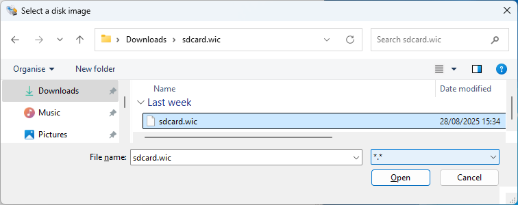
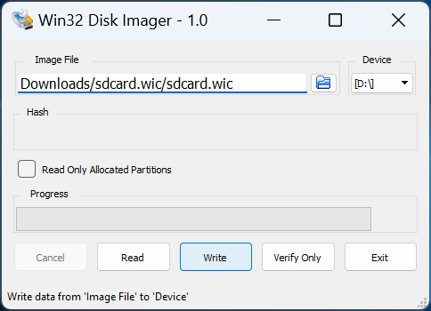

### **Burn the microSD Card Image**

* Either use your own or download the pre-built `<name>.wic.gz` image.
* If required, extract `<name>.wic` image from the compressed download file.
  * On Linux, use the `dd` utility:

  ```bash
  tar -xzf `<name>.wic.gz`
  ```

  * On Windows, use the [7-Zip](https://www.7-zip.org) program (or similar):
    * Right click `<name>.wic.gz` file, and select "Extract All..."

* Write the `<name>.wic` image to the microSD card using a USB writer:
  * On Linux, use the `dd` utility:

  ```bash
  # Determine the device associated with the SD card on the host computer.
  cat /proc/partitions
  # This will return for example /dev/sd<x>
  # Use dd to write the image in the corresponding device
  sudo dd if=<name>.wic of=/dev/sd<x> bs=1M
  # Flush the changes to the microSD card
  sync
  ```

  * On Windows, use the [Win32DiskImager](https://sourceforge.net/projects/win32diskimager) program (or similar):
    * Click browse icon and select "\*.\*" filter:

    {:style="display:block; margin-left:auto; margin-right:auto"}
    <center markdown="1">

    **Navigate to your download and select `<name>.wic` in the "Disk Imager" tool**
    </center>
<br>

    * Write the image (note your Device may be different to that shown):

    {:style="display:block; margin-left:auto; margin-right:auto"}
    <center markdown="1">

    **Write the microSD Card using the "Disk Imager" tool**
    </center>

* Turn off the Modular Development Kit and insert the microSD card in the
  microSD card slot located on the Modular Development Kit SOM Board.

<br>


