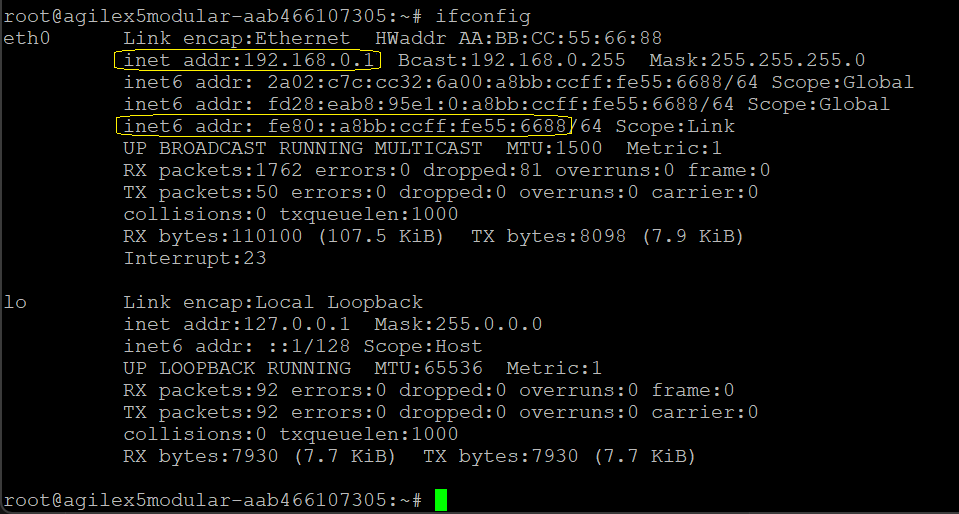
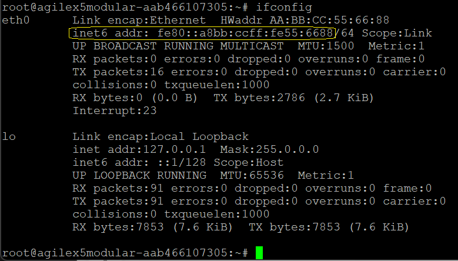
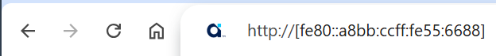
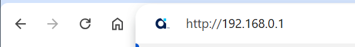
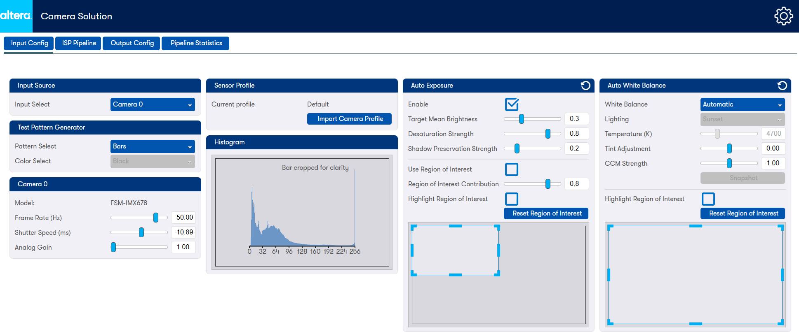

### **Connect Browser to UI**
* Power up the board (if not already powered) and set up the serial terminal emulator (minicom,
  [teraterm], [putty], etc.):
  * Select the correct `COMx` port. (The Modular Development board presents 4
    serial COM ports over a single connection and the Linux system uses the 3rd
    port in order). Set the port configuration as follows:
    * 115200 baud rate, 8 Data bits, 1 Stop bit, CRC and Hardware flow control
      disabled.
* The Linux OS will boot and the 4K Multi-Sensor HDR Camera Solution System
  Example Design Application should run automatically.
* A few seconds after Linux boots, the application will detect the attached
  Monitor and the ISP processed output will be displayed using the best
  supported format.
* Take note of the board's IP address.
  * The board's IP address can also be found using the terminal by logging in
    as `root` (no password required) and querying the Ethernet controller:

    ```bash
    root
    ifconfig
    ```

  * `eth0` provides the IPv4 or IPv6 address to connect to.
<br/>

{:style="display:block; margin-left:auto; margin-right:auto;"}
<center markdown="1">

**Example ifconfig output for if network provides DHCP**
</center>

<br/>

{:style="display:block; margin-left:auto; margin-right:auto;"}

<center markdown="1">

**Example ifconfig output for if no DHCP support, or direct connection**
</center>

<br/>

* Connect your web browser to the boards IP address so you can interact with
  the 4K Multi-Sensor HDR Camera Solution System Example Design using the GUI.
  * To connect using IPv6 for the examples above you would use
    `http://[fe80::a8bb:ccff:fe55:6688]` (note the square brackets)
  * To connect using IPv4 for the DHCP example above you would use
    `http://192.168.0.1`

<br/>

{:style="display:block; margin-left:auto; margin-right:auto;"}
<center markdown="1">

**Example web browser URL for IPv6 address**
</center>

<br/>

{:style="display:block; margin-left:auto; margin-right:auto;"}
<center markdown="1">

**Example web browser URL for IPv4 address**
</center>

<br/>

* During connection, you will see the Altera® splash screen, after which you
  will be presented with the 
  [Web GUI:](../camera_4k_resources/ui-funct-descr.md)

<br/>

{:style="display:block; margin-left:auto; margin-right:auto;"}
<center markdown="1">

**Example Camera Solution GUI**
</center>

<br/>
