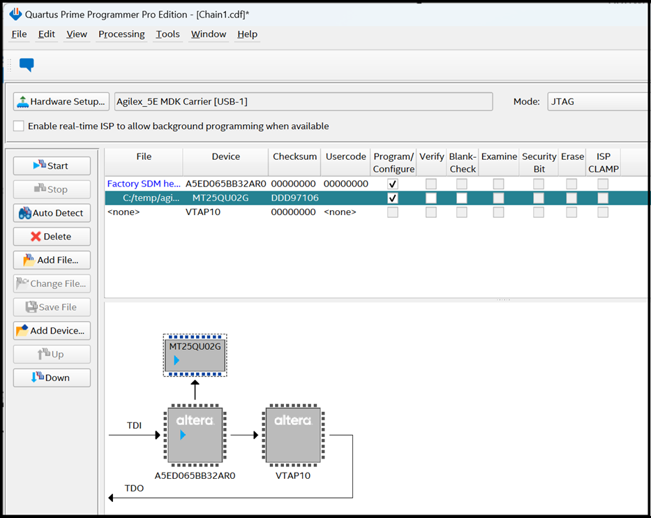

### **Program the QSPI Flash Memory**

This should only need to be done once. To program the QSPI flash memory:

* Ensure the Modular Development Kit is powered off. Set MSEL=JTAG by setting
  the **S4** dip switch on the Modular Development SOM Board to **OFF-OFF**.
  * This prevents any bootloader from starting and leaves the JTAG chain in a
    default state.

* Power up the Modular Development Kit.

* Either use your own or download the pre-built `JIC` image, and write it to
  the QSPI Flash memory using either the command:

    ```bash
    quartus_pgm -c 1 -m jtag -o "pvi;top.core.jic" 
    ```

* or, optionally using the Quartus® Programmer GUI:

  * Launch the Quartus® Programmer and Configure the **"Hardware Setup..."**
settings as following:
  <br>

{:style="display:block; margin-left:auto; margin-right:auto"}
<center markdown="1">

**Programmer - GUI Hardware Settings**
</center>
<br>

* Click "Auto Detect", select the device `A5EC065BB32AR0`, and press **"Change File.."**
<br>

{:style="display:block; margin-left:auto; margin-right:auto"}
<center markdown="1">

**Programmer - After "Auto Detect"**
</center>
<br>

Select your `top.core.jic` file. The `MT25QU02G` device should be shown (see
below). Check the **"Program/Configure"** box and press the **"Start"** button.
Wait until the programming has been completed (which can take several minutes).
<br>

{:style="display:block; margin-left:auto; margin-right:auto"}
<center markdown="1">

**Programming the QSPI Flash with the JIC file**
</center>
<br>

* Power down the Modular Development Kit. Set MSEL=ASX4 (QSPI) by setting the
  **S4** dip switch on the Modular Development SOM Board to **ON-ON**.
  * This starts the HPS bootloader and FPGA configuration from the microSD Card
    after power up.
<br>
