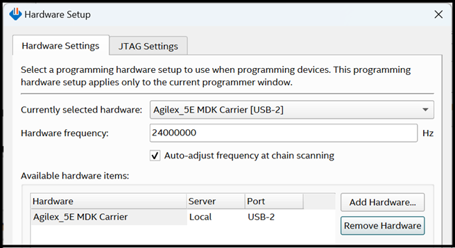

### **Program the FPGA SOF**

* To program the FPGA using SOF with first stage bootloader (fsbl):

  * Power down the Modular Development Kit. Set MSEL=JTAG by setting the **S4**
    dip switch on the Modular Development Kit SOM Board to **OFF-OFF**.
    * This prevents the starting of any bootloader and FPGA configuration after
      power up and until the SOF is programmed over JTAG.

  * Power up the Modular Development Kit.

  * Either use your own or download the pre-built fsbl `SOF` image, and program
    the FPGA with either the command:

    ```bash
    quartus_pgm -c 1 -m jtag -o "p;fsbl_agilex5_modkit_vvpisp_time_limited.sof"
    ```

  * or, optionally use the Quartus® Programmer GUI:

    * Launch the Quartus® Programmer and Configure the **"Hardware Setup..."**
      settings as follows:

<br>

{:style="display:block; margin-left:auto; margin-right:auto"}
<center markdown="1">

**Programmer GUI Hardware Settings**
</center>
<br>

* Click "Auto Detect", select the device `A5EC065BB32AR0` and press
  **"Change File.."**
<br>

{:style="display:block; margin-left:auto; margin-right:auto"}
<center markdown="1">

**Programmer after "Auto Detect"**
</center>
<br>

Select your `fsbl_agilex5_modkit_vvpisp_time_limited.sof` file. Check the
**"Program/Configure"** box and press the **"Start"** button (see below). Wait
until the programming has been completed.

<br>

{:style="display:block; margin-left:auto; margin-right:auto"}
<center markdown="1">

**Programming the FPGA with SOF file**
</center>
<br>


[Agilex™ 5 E-Series Modular Development Board GSRD User Guide (25.1)]: https://altera-fpga.github.io/rel-25.1/embedded-designs/agilex-5/e-series/modular/gsrd/ug-gsrd-agx5e-modular/


[Hard Processor System Technical Reference Manual: Agilex™ 5 SoCs (25.1)]: https://www.intel.com/content/www/us/en/docs/programmable/814346/25-1/hard-processor-system-technical-reference.html
[NiosV Processor for Altera® FPGA]: https://www.altera.com/design/guidance/nios-v-developer
[Agilex™ 5 FPGA E-Series 065B Modular Development Kit]: https://www.altera.com/products/devkit/a1jui0000061qabmaa/agilex-5-fpga-and-soc-e-series-modular-development-kit-es
[Agilex™ 5 FPGA E-Series 065B Modular Development Kit Product Brief]: https://www.intel.com/content/www/us/en/content-details/815178/agilex-5-fpga-e-series-065b-modular-development-kit-product-brief.html
[Altera® FPGA AI Suite]: https://www.altera.com/products/development-tools/fpga-ai-suite


[Win32DiskImager]: https://sourceforge.net/projects/win32diskimager
[7-Zip]: https://www.7-zip.org
[TeraTerm]: https://github.com/TeraTermProject/teraterm/releases
[PuTTY]: https://www.chiark.greenend.org.uk/~sgtatham/putty/latest.html


[Framos FSM:GO IMX678C Camera Modules]: https://www.framos.com/en/fsmgo
[Wide 110deg HFOV Lens]: https://www.mouser.co.uk/ProductDetail/FRAMOS/FSMGO-IMX678C-M12-L110A-PM-A1Q1?qs=%252BHhoWzUJg4KQkNyKsCEDHw%3D%3D
[Medium 100deg HFOV Lens]: https://www.mouser.co.uk/ProductDetail/FRAMOS/FSMGO-IMX678C-M12-L100A-PM-A1Q1?qs=%252BHhoWzUJg4IesSwD2ACIBQ%3D%3D
[Narrow 54deg HFOV Lens]: https://www.mouser.co.uk/ProductDetail/FRAMOS/FSMGO-IMX678C-M12-L54A-PM-A1Q1?qs=%252BHhoWzUJg4L5yHZulKgVGA%3D%3D
[Framos Tripod Mount Adapter]: https://www.framos.com/en/products/fma-mnt-trp1-4-v1c-26333
[Tripod]: https://thepihut.com/products/small-tripod-for-raspberry-pi-hq-camera
[150mm flex-cable]: https://www.mouser.co.uk/ProductDetail/FRAMOS/FMA-FC-150-60-V1A?qs=GedFDFLaBXGCmWApKt5QIQ%3D%3D&_gl=1*d93qim*_ga*MTkyOTE4MjMxNy4xNzQxMTcwMzQy*_ga_15W4STQT4T*MTc0MTE3MDM0Mi4xLjEuMTc0MTE3MDQ5OS40NS4wLjA
[300mm micro-coax cable]: https://www.mouser.co.uk/ProductDetail/FRAMOS/FFA-MC50-Kit-0.3m?qs=%252BHhoWzUJg4K3LtaE207mhw%3D%3D
[DP to HDMI Adapter]: https://www.amazon.co.uk/gp/product/B01M6WK3KU/ref=ppx_yo_dt_b_asin_title_o02_s00?ie=UTF8&psc=1
[Framos GMSL3 5m]: https://www.mouser.co.uk/ProductDetail/FRAMOS/FFA-GMSL3-Kit-5m?qs=%252BHhoWzUJg4IkLHv%2F6fzsXQ%3D%3D
[Framos FFA-GMSL-SER-V2A Serializer]: https://www.framos.com/en/products/ffa-gmsl-ser-v2a-27617
[Framos FFA-GMSL-DES-V2A Deserializer]: https://www.framos.com/en/products/ffa-gmsl-des-v2a-27240


[VVP IP Suite]: https://www.altera.com/products/ip/a1jui000004qxfpmak/video-and-vision-processing-suite
[MIPI DPHY IP and MIPI CSI-2 IP]: https://www.altera.com/products/ip/a1jui0000049uuamam/mipi-d-phy-ip#tab-blade-1-3
[Nios® V Processor]: https://www.altera.com/products/ip/a1jui0000049uvama2/nios-v-processors


[Altera® Quartus® Prime Pro Edition version 25.1 Linux]: https://www.intel.com/content/www/us/en/software-kit/851652/intel-quartus-prime-pro-edition-design-software-version-25-1-for-linux.html
[Altera® Quartus® Prime Pro Edition version 25.1 Windows]: https://www.intel.com/content/www/us/en/software-kit/851653/intel-quartus-prime-pro-edition-design-software-version-25-1-for-windows.html
[Altera® Quartus® Prime Pro Edition version 25.1 Programmer and Tools]: https://www.intel.com/content/www/us/en/software-kit/851652/intel-quartus-prime-pro-edition-design-software-version-25-1-for-linux.html


[ultralytics YOLO]: https://docs.ultralytics.com
[ONNX]: https://onnx.ai/
[OpenVINO Toolkit]: https://storage.openvinotoolkit.org/repositories/openvino/packages/2024.6/linux

