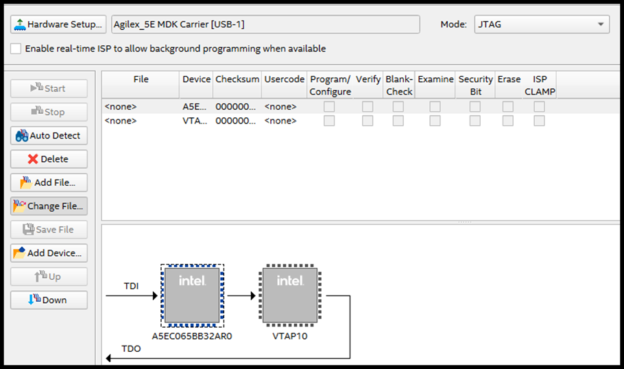

[Drive-On-Chip with Functional Safety System Example Design for Agilex™ 5 Devices]: https://altera-fpga.github.io/rel-25.1/embedded-designs/agilex-5/e-series/modular/drive-on-chip/doc-funct-safety
[Drive-On-Chip with PLC System Example Design for Agilex™ Devices]: https://altera-fpga.github.io/rel-25.1/embedded-designs/agilex-5/e-series/modular/drive-on-chip/doc-plc
[ROS Consolidated Robot Controller Example Design for Agilex™ 5 Devices]: https://altera-fpga.github.io/rel-25.1/embedded-designs/agilex-5/e-series/modular/drive-on-chip/doc-crc
[Agilex™ 5 FPGA - Drive-On-Chip Design Example]: https://www.intel.com/content/www/us/en/design-example/825930/agilex-5-fpga-drive-on-chip-design-example.html
[Altera® Agilex™ 7 FPGA – Drive-On-Chip for Altera® Agilex™ 7 Devices Design Example]: https://www.intel.com/content/www/us/en/design-example/780360/intel-agilex-7-fpga-drive-on-chip-for-intel-agilex-7-devices-design-example.html
[Agilex™ 7 FPGA – Safe Drive-On-Chip Design Example]: https://www.intel.com/content/www/us/en/design-example/825944/agilex-7-fpga-safe-drive-on-chip-design-example.html
[Agilex™ 5 E-Series Modular Development Kit GSRD User Guide (25.1)]: https://altera-fpga.github.io/rel-25.1/embedded-designs/agilex-5/e-series/modular/gsrd/ug-gsrd-agx5e-modular/
[Agilex™ 5 E-Series Modular Development Kit GHRD Linux Boot Examples]: https://altera-fpga.github.io/rel-25.1/embedded-designs/agilex-5/e-series/modular/boot-examples/ug-linux-boot-agx5e-modular/


[AN 1000: Drive-on-Chip Design Example: Agilex™ 5 Devices]: https://www.intel.com/content/www/us/en/docs/programmable/826207/24-1/about-the-drive-on-chip-design-example.html
[AN 999: Drive-on-Chip with Functional Safety Design Example: Agilex™ 7 Devices]: https://www.intel.com/content/www/us/en/docs/programmable/823627/current/about-the-drive-on-chip-with-functional.html
[AN 994: Drive-on-Chip Design Example for Altera® Agilex™ 7 Devices]: https://www.intel.com/content/www/us/en/docs/programmable/780361/23-1/about-the-drive-on-chip-design-example.html
[AN 773: Drive-On-Chip Design Example for Altera® MAX® 10 Devices]: https://www.intel.com/content/www/us/en/docs/programmable/683072/current/about-the-drive-on-chip-design-example.html
[AN 669: Drive-On-Chip Design Example for Cyclone V Devices]: https://www.intel.com/content/www/us/en/docs/programmable/683466/current/about-the-drive-on-chip-design-example.html


[Hard Processor System Technical Reference Manual: Agilex™ 5 SoCs (25.1)]: https://www.intel.com/content/www/us/en/docs/programmable/814346/25-1/hard-processor-system-technical-reference.html
[NiosV Processor for Altera® FPGA]: https://www.intel.com/content/www/us/en/products/details/fpga/intellectual-property/processors-peripherals/niosv.html
[Tandem Motion-Power 48 V Board Reference Manual]: https://www.intel.com/content/www/us/en/docs/programmable/683164/current/about-the-tandem-motion-power-48-v-board.html
[Agilex™ 5 FPGA E-Series 065B Modular Development Kit]: https://www.intel.com/content/www/us/en/products/details/fpga/development-kits/agilex/a5e065b-modular.html
[Agilex™ 3 FPGA C-Series Development Kit]: https://www.intel.com/content/www/us/en/products/details/fpga/development-kits/agilex/a3y135b.html
[Agilex™ 3 FPGA and SoC C-Series Development Kit]:https://www.altera.com/products/devkit/a1jui000004kfuxma0/agilex-3-fpga-and-soc-c-series-development-kit
[Motor Control Designs with an Integrated FPGA Design Flow]: https://www.intel.com/content/dam/www/programmable/us/en/pdfs/literature/wp/wp-01162-motor-control-toolflow.pdf
[Install Docker Engine]: https://docs.docker.com/engine/install/
[Docker Build: Multi-Platform Builds]: https://docs.docker.com/build/building/multi-platform/
[quartus_pgm command]:https://www.intel.com/content/www/us/en/docs/programmable/813773/25-1/understanding-configuration-status-using.html


[Disk Imager]: https://sourceforge.net/projects/win32diskimager


[AGX_5E_Modular_Devkit_HPS_NIOSVg_DoC_3x2_axis.xml]: https://github.com/altera-fpga/agilex-ed-drive-on-chip/blob/rel/25.1/HPS_NIOSVg_DoC_3x2_axis/AGX_5E_Modular_Devkit_HPS_NIOSVg_DoC_3x2_axis.xml
[6-axis Drive-on-Chip design]: https://github.com/altera-fpga/agilex-ed-drive-on-chip/tree/main/HPS_NIOSVg_DoC_3x2_axis
[ROS Control hardware interface]: https://github.com/altera-fpga/altera-ros2/tree/main/fpga_doc_control_driver
[MoveIt client]: https://github.com/altera-fpga/altera-ros2/tree/main/examples/moveit_demo_client
[Altera ROS 2]: https://github.com/altera-fpga/altera-ros2
[lite6_moveit_demo.launch.py]: https://github.com/altera-fpga/altera-ros2/blob/main/examples/moveit_demo_client/launch/lite6_moveit_demo.launch.py


[wic.gz]: https://github.com/altera-fpga/agilex-ed-drive-on-chip/releases/download/rel-crc-25.1/core-image-minimal-agilex5_mk_a5e065bb32aes1.rootfs.wic.gz
[wic.bmap]: https://github.com/altera-fpga/agilex-ed-drive-on-chip/releases/download/rel-crc-25.1/core-image-minimal-agilex5_mk_a5e065bb32aes1.rootfs.wic.bmap
[top.hps.jic]: https://github.com/altera-fpga/agilex-ed-drive-on-chip/releases/download/rel-crc-25.1/top.hps.jic


[ROS 2]: https://www.ros.org/
[MoveIt2]: https://moveit.ai/
[Docker]: https://docs.docker.com/engine/install/
[UFACTORY Lite 6 robot arm]: https://www.ufactory.cc/lite-6-collaborative-robot/
[Rocker]: https://github.com/osrf/rocker


# ROS Consolidated Robot Controller Example Design for Agilex™ 5 Devices

## Overview
This example design demonstrates:

* [ROS 2](https://www.ros.org/) running on the Hard Processor System (HPS) in a Docker container.
* Embedded real-time 6-Axis motor control in the FPGA fabric.
* Robot control leveraging [ROS 2](https://www.ros.org/), [MoveIt2](https://moveit.ai/) and integration with Drive-on-Chip FPGA IP.

<br>
The Robot Operating System (ROS) is a set of software libraries and tools that help you build robot applications. In this example design we demonstrate a [ROS 2](https://www.ros.org/) based, 6-axis robot controller running on the Agilex™ 5 FPGA E-Series Modular Development Kit. Motor drives and control is handled by a [6-axis Drive-on-Chip design](https://github.com/altera-fpga/agilex-ed-drive-on-chip/tree/main/HPS_NIOSVg_DoC_3x2_axis) integrated with ROS 2 through a [ROS Control hardware interface](https://github.com/altera-fpga/altera-ros2/tree/main/fpga_doc_control_driver). [MoveIt2](https://moveit.ai/) is used to provide path planning capabilities along with collision avoidance and scene mapping. A basic [MoveIt client](https://github.com/altera-fpga/altera-ros2/tree/main/examples/moveit_demo_client) is provided which employs a simulated [UFACTORY Lite 6 robot arm](https://www.ufactory.cc/lite-6-collaborative-robot/).

<center>


</center>

## Pre-requisites

### Hardware Requirements

* [Agilex™ 5 FPGA E-Series 065B Modular Development Kit](https://www.intel.com/content/www/us/en/products/details/fpga/development-kits/agilex/a5e065b-modular.html) (MK-A5E065BB32AES1)
* Power supply
* Micro USB Cable
* Network cables
* Micro SD card and reader

!!! note
    A separate PC running Linux with display out is required to setup the Agilex™ 5 development kit and run the ROS Visualizer (RViz).

### Software Requirements

* Host PC
  * Linux OS
  * Serial terminal
  * [Docker](https://docs.docker.com/engine/install/)
  * Altera® Quartus® Prime Pro Edition Version 25.1 Programmer and Tools

## Getting Started

There are 3 main components to this example design which are described below.

#### FPGA Drive-on-Chip Design
This example uses the [6-axis Drive-on-Chip design](https://github.com/altera-fpga/agilex-ed-drive-on-chip/tree/main/HPS_NIOSVg_DoC_3x2_axis) variant for FPGA based motor control. See [HERE](./doc-crc/hw-funct-descr.md) for more information on the design.

#### Hard Processor System (HPS) Linux Image
A custom Linux image is provided to support the Drive-on-Chip FPGA design which includes Docker and other dependencies for successfully deploying this example. The FPGA bitstream is included in the Linux image and flashed by the first-stage bootloader on boot. The Yocto layers and configuration files used to build the image can be found [HERE](https://github.com/altera-fpga/agilex-ed-drive-on-chip/tree/rel/25.1/sw).

#### ROS 2 Docker Image
A Docker build script is provided in the [Altera ROS 2](https://github.com/altera-fpga/altera-ros2) repository in order to build a Docker image with the required software components to run this example. The Docker image is run on the HPS and also the host PC if visualizing the robot arm.

### Prebuilt Binaries
Prebuilt binaries are provided to help get the example design running quickly. You can find links to the required binaries below.

<center>

| Description | Links |
| --- | --- |
| Linux Image | [wic.gz](https://github.com/altera-fpga/agilex-ed-drive-on-chip/releases/download/rel-crc-25.1/core-image-minimal-agilex5_mk_a5e065bb32aes1.rootfs.wic.gz), [wic.bmap](https://github.com/altera-fpga/agilex-ed-drive-on-chip/releases/download/rel-crc-25.1/core-image-minimal-agilex5_mk_a5e065bb32aes1.rootfs.wic.bmap) |
| QSPI Image | [top.hps.jic](https://github.com/altera-fpga/agilex-ed-drive-on-chip/releases/download/rel-crc-25.1/top.hps.jic) |

</center>

### Setting Up your Development Board


* Configure the board switches:
  The following provides the default configuration for all the switches in the
  board.

{:style="display:block; margin-left:auto; margin-right:auto"}
<center>

**Development Board switch position**
</center>
<br>

!!! note "Main configurations used in this example design"

    JTAG:     SOM SW4[2:1]=OFF:OFF <br>
    ASx4 (QSPI):  SOM SW4[2:1]=ON:ON

<br>

* Connect micro USB cable from bottom left of the carrier board to PC (`J35`).
  This will be used for JTAG communication (see figure below).
* Connect micro USB cable from bottom right of the SOM board to PC
  (`J2`, HSP_UART). This will be used for HPS UART communication. Look at what
  ports are enumerated on your host computer, there should be a series of
  four. Use the 3rd one in the list as the HPS serial port (see figure below).
* If ethernet capabilities or remote connection via `ssh` is required connect an
  ethernet cable to the ethernet port on the SOM board (`J6`, ETH 1G HPS) and make
  sure your device is in the same network as your intended host device. After
  Linux boots, check the IP address of the `end2` ethernet interface using the
  `ip addr` command.

{:style="display:block; margin-left:auto; margin-right:auto"}
<center>

**USB connections to the board**
</center>
<br>


[Drive-On-Chip with Functional Safety System Example Design for Agilex™ 5 Devices]: https://altera-fpga.github.io/rel-25.1/embedded-designs/agilex-5/e-series/modular/drive-on-chip/doc-funct-safety
[Drive-On-Chip with PLC System Example Design for Agilex™ Devices]: https://altera-fpga.github.io/rel-25.1/embedded-designs/agilex-5/e-series/modular/drive-on-chip/doc-plc
[ROS Consolidated Robot Controller Example Design for Agilex™ 5 Devices]: https://altera-fpga.github.io/rel-25.1/embedded-designs/agilex-5/e-series/modular/drive-on-chip/doc-crc
[Agilex™ 5 FPGA - Drive-On-Chip Design Example]: https://www.intel.com/content/www/us/en/design-example/825930/agilex-5-fpga-drive-on-chip-design-example.html
[Altera® Agilex™ 7 FPGA – Drive-On-Chip for Altera® Agilex™ 7 Devices Design Example]: https://www.intel.com/content/www/us/en/design-example/780360/intel-agilex-7-fpga-drive-on-chip-for-intel-agilex-7-devices-design-example.html
[Agilex™ 7 FPGA – Safe Drive-On-Chip Design Example]: https://www.intel.com/content/www/us/en/design-example/825944/agilex-7-fpga-safe-drive-on-chip-design-example.html
[Agilex™ 5 E-Series Modular Development Kit GSRD User Guide (25.1)]: https://altera-fpga.github.io/rel-25.1/embedded-designs/agilex-5/e-series/modular/gsrd/ug-gsrd-agx5e-modular/
[Agilex™ 5 E-Series Modular Development Kit GHRD Linux Boot Examples]: https://altera-fpga.github.io/rel-25.1/embedded-designs/agilex-5/e-series/modular/boot-examples/ug-linux-boot-agx5e-modular/


[AN 1000: Drive-on-Chip Design Example: Agilex™ 5 Devices]: https://www.intel.com/content/www/us/en/docs/programmable/826207/24-1/about-the-drive-on-chip-design-example.html
[AN 999: Drive-on-Chip with Functional Safety Design Example: Agilex™ 7 Devices]: https://www.intel.com/content/www/us/en/docs/programmable/823627/current/about-the-drive-on-chip-with-functional.html
[AN 994: Drive-on-Chip Design Example for Altera® Agilex™ 7 Devices]: https://www.intel.com/content/www/us/en/docs/programmable/780361/23-1/about-the-drive-on-chip-design-example.html
[AN 773: Drive-On-Chip Design Example for Altera® MAX® 10 Devices]: https://www.intel.com/content/www/us/en/docs/programmable/683072/current/about-the-drive-on-chip-design-example.html
[AN 669: Drive-On-Chip Design Example for Cyclone V Devices]: https://www.intel.com/content/www/us/en/docs/programmable/683466/current/about-the-drive-on-chip-design-example.html


[Hard Processor System Technical Reference Manual: Agilex™ 5 SoCs (25.1)]: https://www.intel.com/content/www/us/en/docs/programmable/814346/25-1/hard-processor-system-technical-reference.html
[NiosV Processor for Altera® FPGA]: https://www.intel.com/content/www/us/en/products/details/fpga/intellectual-property/processors-peripherals/niosv.html
[Tandem Motion-Power 48 V Board Reference Manual]: https://www.intel.com/content/www/us/en/docs/programmable/683164/current/about-the-tandem-motion-power-48-v-board.html
[Agilex™ 5 FPGA E-Series 065B Modular Development Kit]: https://www.intel.com/content/www/us/en/products/details/fpga/development-kits/agilex/a5e065b-modular.html
[Agilex™ 3 FPGA C-Series Development Kit]: https://www.intel.com/content/www/us/en/products/details/fpga/development-kits/agilex/a3y135b.html
[Agilex™ 3 FPGA and SoC C-Series Development Kit]:https://www.altera.com/products/devkit/a1jui000004kfuxma0/agilex-3-fpga-and-soc-c-series-development-kit
[Motor Control Designs with an Integrated FPGA Design Flow]: https://www.intel.com/content/dam/www/programmable/us/en/pdfs/literature/wp/wp-01162-motor-control-toolflow.pdf
[Install Docker Engine]: https://docs.docker.com/engine/install/
[Docker Build: Multi-Platform Builds]: https://docs.docker.com/build/building/multi-platform/
[quartus_pgm command]:https://www.intel.com/content/www/us/en/docs/programmable/813773/25-1/understanding-configuration-status-using.html


[Disk Imager]: https://sourceforge.net/projects/win32diskimager


### SD Card Image Flashing

* Download SD card image (`.wic` or `.wic.gz`) from the prebuilt binary links above.
* Write the `.wic` or `.wic.gz` SD card image to the micro SD card using one of the options below.
* Turn off the board and insert the SD card in the micro SD card slot on the SOM board.

#### [USBImager](https://bztsrc.gitlab.io/usbimager/) (Windows, Linux, Mac OS)

* Open [USBImager](https://bztsrc.gitlab.io/usbimager/) and click the `...` button in the top right.
* Select the image you downloaded earlier and click `Open`.
* Next select the device associated with your SD card reader from the drop-down list.
* Click `Write` to start flashing.

#### [bmaptool](https://github.com/yoctoproject/bmaptool) (Linux)

!!! note
    You will require a `.wic.bmap` file in addition to the `.wic` or `.wic.gz` in order to use `bmaptool`. If this is not available use `USBImager`.

On many distributions `bmap-tools` can be installed using your distros package manager (e.g. `sudo apt install bmap-tools`).

For more information see the [Yocto documentation](https://docs.yoctoproject.org/dev-manual/bmaptool.html) for `bmaptool`.

First of all determine the device `logical name` associated with the SD card on your host:

```
sudo lshw -class disk
```

Use `bmaptool` to copy the image to the SD card. Make sure the `wic` image file and `bmap` file are in the same directory.

```
sudo bmaptool copy ${IMAGE} ${DEVICE}
```

For example:

```
sudo bmaptool copy core-image-minimal-agilex5_mk_a5e065bb32aes1.wic.gz /dev/sda
```


### Flash The QSPI


* Download the `.jic` image from the prebuilt binary links above.
* Power down the board.
* Set **MSEL** dipswitch **S4** on SOM to **JTAG: OFF-OFF**
* Power up the board.
* Program the QSPI with the following command. See: [quartus_pgm command]

    ```bash
    quartus_pgm -c 1 -m jtag -o "pvi;top.hps.jic" 
    ```


* **(Optional)** Use the Quartus® Programmer GUI

  * Launch the Quartus® Programmer and Configure the **"Hardware Setup..."**
    settings as follows:
  <br>

  {:style="display:block; margin-left:auto; margin-right:auto"}

  <br>

  * Click "Auto Detect", select the device `A5EC065BB32AR0` and press
    **"Change File.."**
  <br>

  {:style="display:block; margin-left:auto; margin-right:auto"}

  <br>

  * Select the `.jic` file you downloaded earlier. The `MT25QU02G` device
    should now show. Select the **"Program/Configure"** box, and press **"Start"**.
    Wait until completed (It could take several minutes).
  <br>

  {:style="display:block; margin-left:auto; margin-right:auto"}

  <br>

* Power down the board. Set **MSEL** dip switch **S4** on SOM to **ASX4 (QSPI): ON-ON**
<br>


### Build Docker Image

The following steps will need to be run on **both** the Agilex™ 5 development kit HPS **and** the host PC if you wish to run the ROS Visualizer.

!!! note
    An internet connection is required to run the following commands.

```
git clone https://github.com/altera-fpga/altera-ros2.git
cd altera-ros2
docker build -f .docker/Dockerfile -t altera-ros2 .
```

The Docker image should now be available.

```
docker image ls

REPOSITORY                      TAG              IMAGE ID       CREATED         SIZE
altera-ros2                     latest           92816d4b0459   6 weeks ago     3.8GB
```

The resulting Docker image includes the Altera® ROS 2 packages and examples pre-installed and ready to use.

### Run The Example MoveIt Client
We will now deploy an instance of the example [MoveIt client](https://github.com/altera-fpga/altera-ros2/tree/main/examples/moveit_demo_client) in a container on the HPS using the image we built previously. The [MoveIt client](https://github.com/altera-fpga/altera-ros2/tree/main/examples/moveit_demo_client) is written in C++ and simply generates random pose goals for a given robot description before attempting to plan and execute a trajectory using the relevant `MoveGroup`. The client makes use of the [`MoveGroupInterface`](https://docs.ros.org/en/noetic/api/moveit_ros_planning_interface/html/classmoveit_1_1planning__interface_1_1MoveGroupInterface.html) class making it compatible with various robot arms. In this example we will be launching an instance to control a simulated [UFACTORY Lite 6 robot arm](https://www.ufactory.cc/lite-6-collaborative-robot/).

ROS uses Python based `launch` files to bring up the necessary services and nodes for a given use-case. In this case we will be using the [lite6_moveit_demo.launch.py](https://github.com/altera-fpga/altera-ros2/blob/main/examples/moveit_demo_client/launch/lite6_moveit_demo.launch.py) launch file which intializes the required controllers, publishers and move groups along with our client application. The result is a fully simulated robot controller implementation with low-level drives handled by the FPGA through the Altera® Drive-on-Chip IP and high-level functionality provided by ROS and MoveIt running on the HPS.

Run the following command on the HPS to start a container passing through the Drive-on-Chip UIO devices used for motor control:

```
docker run -it --rm --network host --device /dev/uio0 --device /dev/uio1 --device /dev/uio2 altera-ros2
```
Next run the following command to launch the example:

```
ros2 launch moveit_demo_client lite6_moveit_demo.launch.py random:=true mode:=doc use_rviz:=false
```

Upon successful initialization you should see a stream of messages similar to that below indicating planning requests are being received by the `MoveGroup` and trajectories are being executed by the relevant controllers.

```
[move_group-3] [INFO]: Motion plan was computed successfully.
[moveit_demo_client-5] [INFO]: Planning request complete!
[moveit_demo_client-5] [INFO]: time taken to generate plan: 0.0128849 seconds
[moveit_demo_client-5] [INFO]: Execute request accepted
[move_group-3] [INFO]: Execution request received
[move_group-3] [INFO]: Starting trajectory execution ...
[move_group-3] [INFO]: sending trajectory to lite6_traj_controller
[ros2_control_node-4] [INFO]: Received new action goal
[ros2_control_node-4] [INFO]: Accepted new action goal
[move_group-3] [INFO]: lite6_traj_controller started execution
[move_group-3] [INFO]: Goal request accepted!
```

### ROS Visualizer (RViz)

In order to visualize what is happening behind the scenes you can use a tool called RViz on your host PC.

For the purposes of this example we will be running RViz in a Docker container using the `altera-ros2` image built earlier. For this we need our Docker container to have access to the display server on the host in order to load a graphical application. To make this easier it is recommended to use [Rocker](https://github.com/osrf/rocker).

* Follow the official [installation instructions](https://github.com/osrf/rocker#installation) to install [Rocker](https://github.com/osrf/rocker)
* Once installed run the following command to start RViz

```
rocker --x11 --devices /dev/dri --network host altera-ros2 rviz2
```

!!! note
    If you are using a **Nvidia** graphics card in your host you will need to follow [these additional steps](https://github.com/osrf/rocker#nvidia-settings) and include the `--nvidia` flag in the command above.

* Once RViz has loaded go to the left-hand panel and find `Fixed Frame` under `Global Options`. Select `world` from the drop-down list as in the screenshot below.

<center>


</center>

* Next click the `Add` button at the bottom of the left-hand panel and select `PlanningScene` in the popup window before finally clicking `OK`.

<center>


</center>

At this point you should see a live visualization of the robot arm moving from pose to pose. The planning scene includes a table with the robot arm on top.

<center>


</center>

<br>

### Notices & Disclaimers

Altera® Corporation technologies may require enabled hardware, software or service
activation. No product or component can be absolutely secure. Performance varies
by use, configuration and other factors. Your costs and results may vary. You may
not use or facilitate the use of this document in connection with any infringement
or other legal analysis concerning Altera® products described herein. You
agree to grant Altera® Corporation a non-exclusive, royalty-free license to any
patent claim thereafter drafted which includes subject matter disclosed herein.
No license (express or implied, by estoppel or otherwise) to any intellectual
property rights is granted by this document, with the sole exception that you
may publish an unmodified copy. You may create software implementations based on
this document and in compliance with the foregoing that are intended to execute
on the Altera® or product(s) referenced in this document. No rights are granted
to create modifications or derivatives of this document. The products described
may contain design defects or errors known as errata which may cause the product
to deviate from published specifications. Current characterized errata are available
on request. Altera® disclaims all express and implied warranties, including without
limitation, the implied warranties of merchantability, fitness for a particular purpose,
and non-infringement, as well as any warranty arising from course of performance,
course of dealing, or usage in trade. You are responsible for safety of the overall
system, including compliance with applicable safety-related requirements or standards.
© Altera® Corporation. Altera®, the Altera logo, and other Altera® marks are trademarks
of Altera® Corporation. Other names and brands may be claimed as the property of
others.

OpenCL\* and the OpenCL\* logo are trademarks of Apple Inc. used by permission of
the Khronos Group™.


<br>
