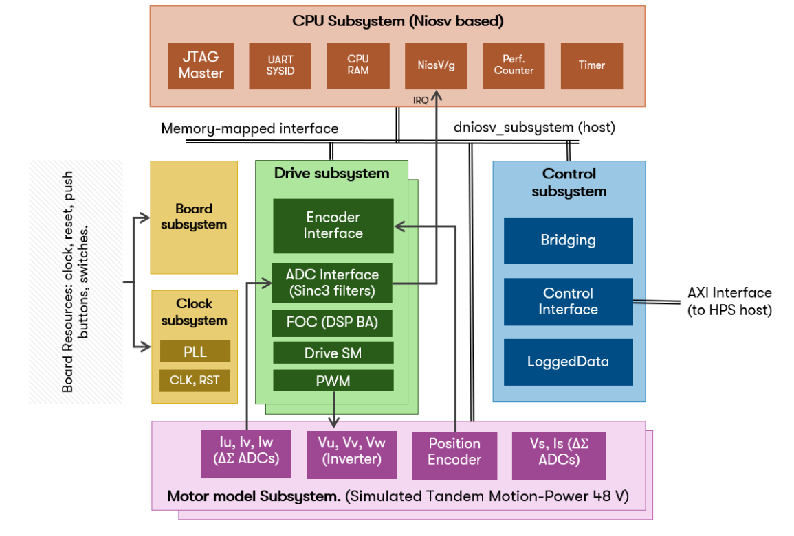
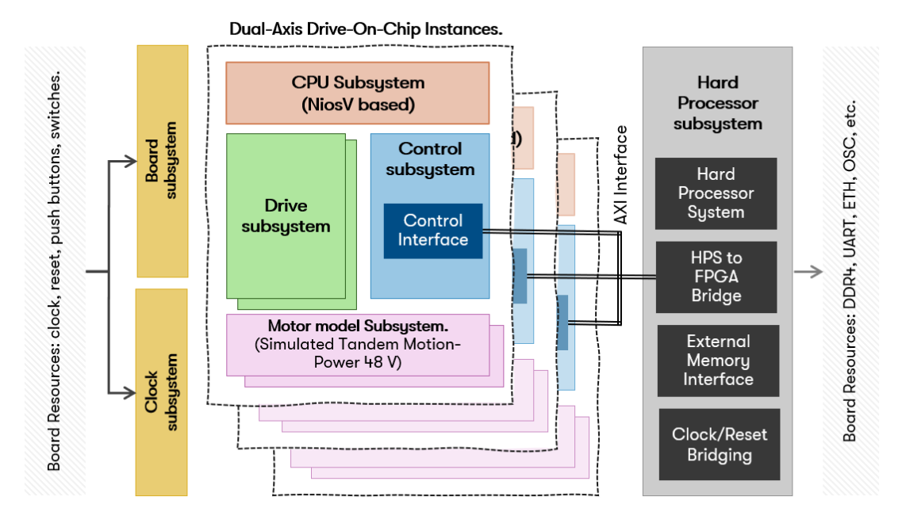
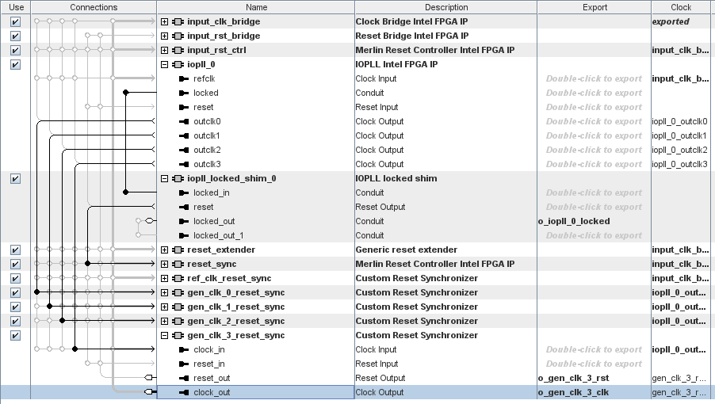
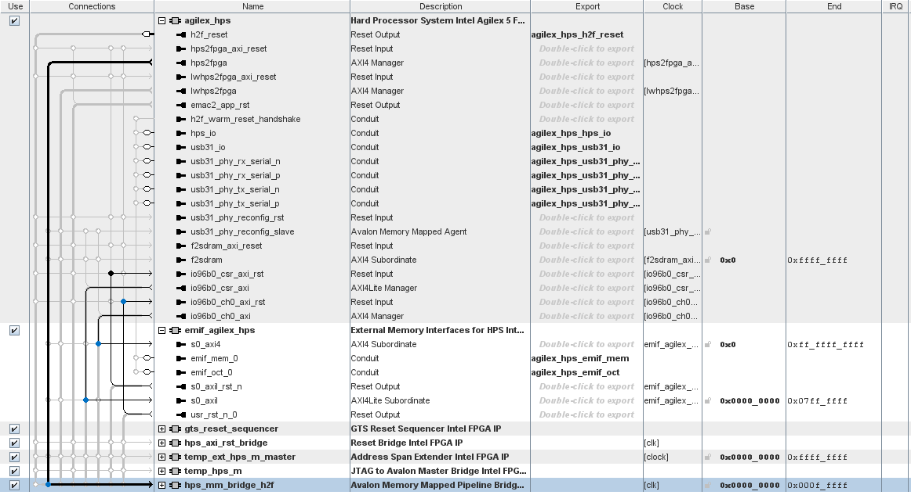
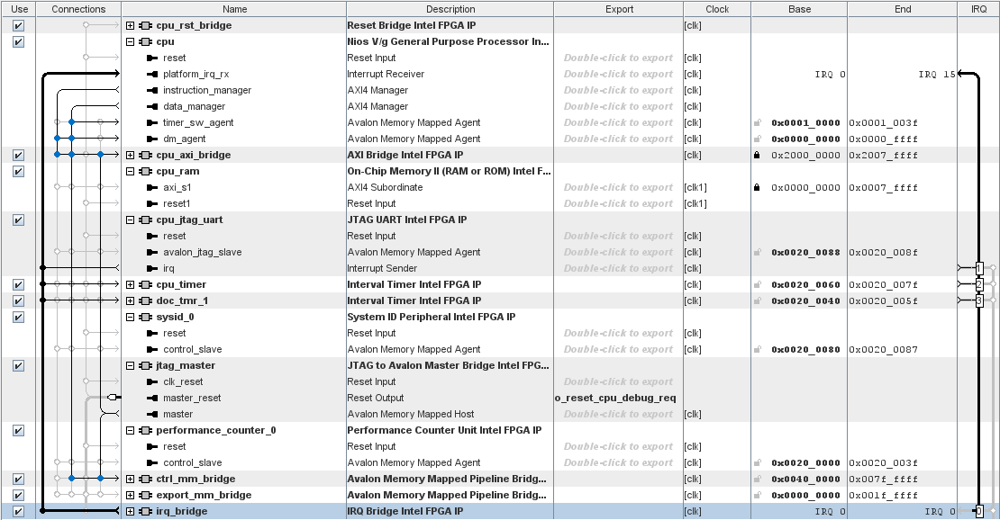
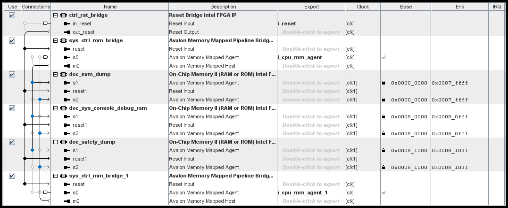
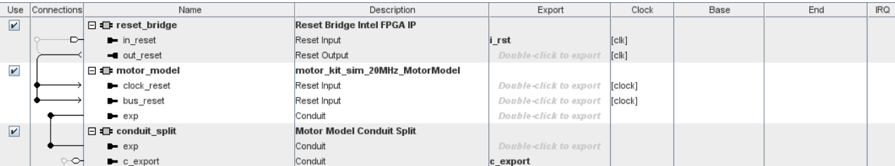

[Drive-On-Chip with Functional Safety System Example Design for Agilex™ 5 Devices]: https://altera-fpga.github.io/rel-25.1/embedded-designs/agilex-5/e-series/modular/drive-on-chip/doc-funct-safety
[Drive-On-Chip with PLC System Example Design for Agilex™ 5 Devices]: https://altera-fpga.github.io/rel-25.1/embedded-designs/agilex-5/e-series/modular/drive-on-chip/doc-plc
[ROS Consolidated Robot Controller Example Design for Agilex™ 5 Devices]: https://altera-fpga.github.io/rel-25.1/embedded-designs/agilex-5/e-series/modular/drive-on-chip/doc-crc
[Agilex™ 5 FPGA - Drive-On-Chip Design Example]: https://www.intel.com/content/www/us/en/design-example/825930/agilex-5-fpga-drive-on-chip-design-example.html
[Intel® Agilex™ 7 FPGA – Drive-On-Chip for Intel® Agilex™ 7 Devices Design Example]: https://www.intel.com/content/www/us/en/design-example/780360/intel-agilex-7-fpga-drive-on-chip-for-intel-agilex-7-devices-design-example.html
[Agilex™ 7 FPGA – Safe Drive-On-Chip Design Example]: https://www.intel.com/content/www/us/en/design-example/825944/agilex-7-fpga-safe-drive-on-chip-design-example.html
[Agilex™ 5 E-Series Modular Development Kit GSRD User Guide (25.1)]: https://altera-fpga.github.io/rel-25.1/embedded-designs/agilex-5/e-series/modular/gsrd/ug-gsrd-agx5e-modular/
[Agilex™ 5 E-Series Modular Development Kit GHRD Linux Boot Examples]: https://altera-fpga.github.io/rel-25.1/embedded-designs/agilex-5/e-series/modular/boot-examples/ug-linux-boot-agx5e-modular/

[AN 1000: Drive-on-Chip Design Example: Agilex™ 5 Devices]: https://www.intel.com/content/www/us/en/docs/programmable/826207/24-1/about-the-drive-on-chip-design-example.html
[AN 999: Drive-on-Chip with Functional Safety Design Example: Agilex™ 7 Devices]: https://www.intel.com/content/www/us/en/docs/programmable/823627/current/about-the-drive-on-chip-with-functional.html
[AN 994: Drive-on-Chip Design Example for Intel® Agilex™ 7 Devices]: https://www.intel.com/content/www/us/en/docs/programmable/780361/23-1/about-the-drive-on-chip-design-example.html
[AN 773: Drive-On-Chip Design Example for Intel® MAX® 10 Devices]: https://www.intel.com/content/www/us/en/docs/programmable/683072/current/about-the-drive-on-chip-design-example.html
[AN 669: Drive-On-Chip Design Example for Cyclone V Devices]: https://www.intel.com/content/www/us/en/docs/programmable/683466/current/about-the-drive-on-chip-design-example.html

[Hard Processor System Technical Reference Manual: Agilex™ 5 SoCs (25.1)]: https://www.intel.com/content/www/us/en/docs/programmable/814346/25-1/hard-processor-system-technical-reference.html
[NiosV Processor for Altera® FPGA]: https://www.intel.com/content/www/us/en/products/details/fpga/intellectual-property/processors-peripherals/niosv.html
[Tandem Motion-Power 48 V Board Reference Manual]: https://www.intel.com/content/www/us/en/docs/programmable/683164/current/about-the-tandem-motion-power-48-v-board.html
[Agilex™ 5 FPGA E-Series 065B Modular Development Kit]: https://www.intel.com/content/www/us/en/products/details/fpga/development-kits/agilex/a5e065b-modular.html
[Motor Control Designs with an Integrated FPGA Design Flow]: https://www.intel.com/content/dam/www/programmable/us/en/pdfs/literature/wp/wp-01162-motor-control-toolflow.pdf
[Install Docker Engine]: https://docs.docker.com/engine/install/
[Docker Build: Multi-Platform Builds]: https://docs.docker.com/build/building/multi-platform/

[Disk Imager]: https://sourceforge.net/projects/win32diskimager

[AGX_5E_Modular_Devkit_HPS_NIOSVg_DoC_3x2_axis.xml]: https://github.com/altera-fpga/agilex-ed-drive-on-chip/blob/rel/25.1/HPS_NIOSVg_DoC_3x2_axis/AGX_5E_Modular_Devkit_HPS_NIOSVg_DoC_3x2_axis.xml
[6-axis Drive-on-Chip design]: https://github.com/altera-fpga/agilex-ed-drive-on-chip/tree/main/HPS_NIOSVg_DoC_3x2_axis
[ROS Control hardware interface]: https://github.com/altera-fpga/altera-ros2/tree/main/fpga_doc_control_driver
[MoveIt client]: https://github.com/altera-fpga/altera-ros2/tree/main/examples/moveit_demo_client
[Altera ROS 2]: https://github.com/altera-fpga/altera-ros2
[lite6_moveit_demo.launch.py]: https://github.com/altera-fpga/altera-ros2/blob/main/examples/moveit_demo_client/launch/lite6_moveit_demo.launch.py

[wic.gz]: https://github.com/altera-fpga/agilex-ed-drive-on-chip/releases/download/rel-crc-25.1/core-image-minimal-agilex5_mk_a5e065bb32aes1.rootfs.wic.gz
[wic.bmap]: https://github.com/altera-fpga/agilex-ed-drive-on-chip/releases/download/rel-crc-25.1/core-image-minimal-agilex5_mk_a5e065bb32aes1.rootfs.wic.bmap
[top.hps.jic]: https://github.com/altera-fpga/agilex-ed-drive-on-chip/releases/download/rel-crc-25.1/top.hps.jic

[ROS 2]: https://www.ros.org/
[MoveIt2]: https://moveit.ai/
[Docker]: https://docs.docker.com/engine/install/
[UFACTORY Lite 6 robot arm]: https://www.ufactory.cc/lite-6-collaborative-robot/
[Rocker]: https://github.com/osrf/rocker

# 6-Axis Drive-on-Chip Example Design for Agilex® 5 Devices

This document provides insights about the functionality of the design example using the hardware blocks as a reference. The Platform Designer high-level system includes many subsystems which are detailed below.

* The `clock_subsystem` and `board_subsystem` contain blocks related to the board resources such as buttons, switches, LEDs, reference clocks and resets. They provide the clocks and resets used by other subsystems.
* The `hps_subsystem` is an instance of the Agilex™ 5 HPS, which operates the higher-level software stack in Linux. It includes an External Memory Interface (EMIF) to the on-board DDR4 chip, featuring presets and connections to link the HPS2FPGA AXI bridges to other subsystems.
* The subsystems `dniosv_subsystem`, `motor_model_subsystem`, `drive_subsystem`and `control_subsystem` are blocks related to motor control and motor modeling. These are instantiated to achieve 6 motor drives being controlled in the FPGA fabric (3 NiosV/g cores controlling 2 drive subsystems each).

  For more information on these blocks, refer to [AN 1000: Drive-on-Chip Design Example: Agilex™ 5 Devices](https://www.intel.com/content/www/us/en/docs/programmable/826207/24-1/about-the-drive-on-chip-design-example.html)
 

The following block diagrams show the main components and subsystems of the 6-Axis
Drive-On-Chip design. The first diagram shows an instance of the dual-axis Drive-On-Chip design with an AXI Interface intended for the HPS Host.

The next diagram shows three instances of the dual-axis Drive-On-Chip design seen above connected to the AXI interface making a total of 6 axes (3x2) which can be controlled by the HPS.

## Hardware Subsystems & Components

This project variant is based on [AN 1000: Drive-on-Chip Design Example: Agilex™ 5 Devices](https://www.intel.com/content/www/us/en/docs/programmable/826207/24-1/about-the-drive-on-chip-design-example.html) and
[AN 994: Drive-on-Chip Design Example for Intel® Agilex™ 7 Devices](https://www.intel.com/content/www/us/en/docs/programmable/780361/23-1/about-the-drive-on-chip-design-example.html). In this design an HPS Subsystem (Hard Processor System) has been included to provide a higher level of abstraction for motion control.

The subsystems instantiated in the design are described below.

### Clock and Board Subsystems

The clock subsystem alongside the board subsystem contains blocks related to the board resources such as buttons, switches, LEDs, reference clocks and resets. They provide the clocks and resets for the other subsystems.

### HPS Subsystem

The HPS subsystem is mainly an instance of the "Hard Processor System Agilex™ (or other) FPGA IP". The HPS in this design boots a custom version of Linux built using Yocto where high-level motion control interfaces can run. Internally the subsystem is composed of the HPS, EMIF for external DDR and AXI interfaces for the lightweight and full HPS-to-FPGA bridges (highlighted in the image below). The full HPS-to-FPGA bridge is utilized to interface with the control subsystem block. This enables the HPS to modify, set and configure motor control parameters, such as adjusting speed and position.

### CPU (dnios_) Subsystem

The NiosV/g processor subsystem offers a fully functional processor system with debugging capabilities. The NiosV/g processor subsystem comprises the following Platform Designer components:
 * NiosV/g softprocessor
 * On-chip RAM
 * JTAG master
 * IRQ management
 * JTAG UART
 * Timers
 * Performance counters

This soft CPU subsystem is responsible for low-level motor control, managing and initializing resources and tracing signals.

### Drive Subsystem

There are a total of 6 instances of the "drive_subsystem" in this variant. A pair of drive subsystems are managed by a single CPU (dnios_) subsystem. This subsystem is a collection of IPs to enable interfaces, signals and ports for motor control using FPGA. The main components of this subsystem are:
 * Six-channel PWM Interface IP (doc_pwm)
 * Drive System Monitor IP (doc_sm)
 * Quadrature Encoder Interface IP (doc_qep)
 * Sigma-Delta ADC interfaces for Drive Axes (doc_adc and doc_adc_pow)
 * Field-Oriented Control Algorithm IP generated with DSP Builder (doc_foc_fixp)
 * Resolver SPI interface IP (doc_rslvr_spi*)
 * Parallel IO IP (hall pio) for hall interface

### Control Subsystem

The Drive-On-Chip design uses the debugging RAM to send commands and receive status information. The debugging dump memory stores trace data that you can display as time graphs (doc_svm_dump). The debug memory (doc_sys__debug_ram) is used to interact and provide commands to the Drive-On-Chip control application.

To interface directly with the Drive-On-Chip application for command and configuration purposes, utilize the full HPS-to-FPGA bridge base address along with the specified offsets (each being a 32-bit wide value). Be sure to account for the offset between the first and second axis.

| Axis   | Offset from HPS bridge base |
| :----: | :-------------------------- |
| Axis0  | 0x0008_0000                 |
| Axis1  | 0x0008_0108                 |
| :----: | :-------------------------- |
| Axis2  | 0x0018_0000                 |
| Axis3  | 0x0018_0108                 |
| :----: | :-------------------------- |
| Axis4  | 0x0028_0000                 |
| Axis5  | 0x0028_0108                 |

!!! note
     In the previous table the address 0x0008_0000 is the base address of the debug memory (doc_sys__debug_ram). Each axis has 66x 32-bit wide data locations and hence the first axis initiates at 0x0 and the second axis memory space initiates at 0x108.

You can interact with the motor control application by reading or writing to the following memory locations from the axis base offset.

| Offset from Axis base | Register Name              | Read/Write | Description   |
| :-------------------- | :------------------------- | :--------- | :------------ |
|     0x00              | DOC_DBG_DRIVE_STATE        |    R       | State of the Drive System Monitor IP, refer to source code if the Drive-On-Chip   app running on NiosV for more details. |
|     0x04              | DOC_DBG_RUNTIME            |    R       | Time in seconds the DoC App has been running. |
|     0x08              | DOC_DBG_DSP_MODE           |    R       | Software (0x0) or DSP Builder IP (0x1) Field Oriented Control Algorithm execution. |
|     0x0C              | DOC_DBG_APP_STATE          |    R       | Drive-On-Chip Embedded Software Application State, refer to source code if   the Drive-On-Chip app running on NiosV for more details. |
|     0x10              | DOC_DBG_LATENCY1           |    R       | Latency of the FOC algorithm calculation. |
|     0x28              | DOC_DBG_SPEED              |    R       | Measured Speed in RPM of the axis.|
|     0x30              | DOC_DBG_POSITION           |    R       | Measured position of the encoder, need to decode the value to get degrees = \<value\> * 360 / 65536 |
|     0x34              | DOC_DBG_BUTTON_DSP_MODE    |    R/W     | Software (0x0) or DSP Builder IP (0x1) Field Oriented Control Algorithm execution|
|     0x38              | DOC_DBG_BUTTON_DRIVE_RESET |    R/W     | Write a 0x1 to the first axis of the array, to reset all axes controlled by a   single Nios, this register clears automatically. |
|     0x3C              | DOC_DBG_DEMO_MODE          |    R/W     | Close-loop, Open-loop, with 16kHz, 32kHz and 64kHz variants, refer   to source code if the Drive-On-Chip app running on NiosV for more details. |
|     0x48              | DOC_DBG_I_PI_KP            |    R/W     | Current Loop Proportional Gain. |
|     0X4C              | DOC_DBG_I_PI_KI            |    R/W     | Current Loop Integral Gain. |
|     0x50              | DOC_DBG_SPEED_PI_KP        |    R/W     | Speed Loop Proportional Gain. |
|     0x54              | DOC_DBG_SPEED_PI_KI        |    R/W     | Speed Loop Integral Gain. |
|     0x58              | DOC_DBG_SPEED_SETP0        |    R/W     | Speed set-point for the axis in RPM. |
|     0x64              | DOC_DBG_POS_SETP0          |    R/W     | Position set-point. E.g: If you want 1500 degrees then write to the   memory location 1500 * 65536 / 360 = 273066 => 0x42AAA |
|     0x74              | DOC_DBG_WAVE_DEMO_MODE     |    R/W     | Motor control mode 0x0 for speed mode, 0x1 for position mode. |
|     0x78              | DOC_DBG_POS_SPEED_LIMIT    |    R/W     | Speed limit in position mode in RPM. |
|     0x7C              | DOC_DBG_POS_PI_KP          |    R/W     | Position Loop Proportional Gain. |
|     0xE0              | DOC_DBG_LATENCY2           |    R       | ISR Latency. |

For other values, refer to the source code of the Drive-On-Chip app running on NiosV for more details.
 

### Motor Model Subsystem

The Drive-On-Chip design example for Agilex™ devices implements a simulated motor and power board model instead of a real motor kit. The motor and power board model is built using DSP Builder which generates the RTL used in the design. By integrating the Avalon interface, motor parameters are accurately configured to represent a tandem motor kit. The motor model included in this design example is based on the Tandem Motion 48V power board with a Tamagawa TS4747N3200E600 motor. There are six instances of the motor_model_subsystem in this design.

