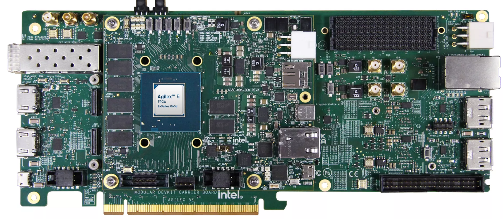
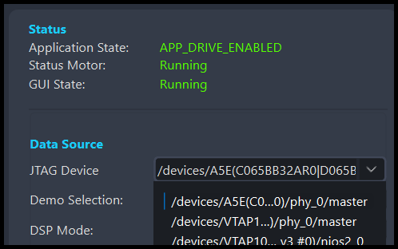

[Drive-On-Chip with Functional Safety System Example Design for Agilex™ 5 Devices]: https://altera-fpga.github.io/rel-25.1/embedded-designs/agilex-5/e-series/modular/drive-on-chip/doc-funct-safety
[Drive-On-Chip with PLC System Example Design for Agilex™ Devices]: https://altera-fpga.github.io/rel-25.1/embedded-designs/agilex-5/e-series/modular/drive-on-chip/doc-plc
[ROS Consolidated Robot Controller Example Design for Agilex™ 5 Devices]: https://altera-fpga.github.io/rel-25.1/embedded-designs/agilex-5/e-series/modular/drive-on-chip/doc-crc
[Agilex™ 5 FPGA - Drive-On-Chip Design Example]: https://www.intel.com/content/www/us/en/design-example/825930/agilex-5-fpga-drive-on-chip-design-example.html
[Altera® Agilex™ 7 FPGA – Drive-On-Chip for Altera® Agilex™ 7 Devices Design Example]: https://www.intel.com/content/www/us/en/design-example/780360/intel-agilex-7-fpga-drive-on-chip-for-intel-agilex-7-devices-design-example.html
[Agilex™ 7 FPGA – Safe Drive-On-Chip Design Example]: https://www.intel.com/content/www/us/en/design-example/825944/agilex-7-fpga-safe-drive-on-chip-design-example.html
[Agilex™ 5 E-Series Modular Development Kit GSRD User Guide (25.1)]: https://altera-fpga.github.io/rel-25.1/embedded-designs/agilex-5/e-series/modular/gsrd/ug-gsrd-agx5e-modular/
[Agilex™ 5 E-Series Modular Development Kit GHRD Linux Boot Examples]: https://altera-fpga.github.io/rel-25.1/embedded-designs/agilex-5/e-series/modular/boot-examples/ug-linux-boot-agx5e-modular/


[AN 1000: Drive-on-Chip Design Example: Agilex™ 5 Devices]: https://www.intel.com/content/www/us/en/docs/programmable/826207/24-1/about-the-drive-on-chip-design-example.html
[AN 999: Drive-on-Chip with Functional Safety Design Example: Agilex™ 7 Devices]: https://www.intel.com/content/www/us/en/docs/programmable/823627/current/about-the-drive-on-chip-with-functional.html
[AN 994: Drive-on-Chip Design Example for Altera® Agilex™ 7 Devices]: https://www.intel.com/content/www/us/en/docs/programmable/780361/23-1/about-the-drive-on-chip-design-example.html
[AN 773: Drive-On-Chip Design Example for Altera® MAX® 10 Devices]: https://www.intel.com/content/www/us/en/docs/programmable/683072/current/about-the-drive-on-chip-design-example.html
[AN 669: Drive-On-Chip Design Example for Cyclone V Devices]: https://www.intel.com/content/www/us/en/docs/programmable/683466/current/about-the-drive-on-chip-design-example.html


[Hard Processor System Technical Reference Manual: Agilex™ 5 SoCs (25.1)]: https://www.intel.com/content/www/us/en/docs/programmable/814346/25-1/hard-processor-system-technical-reference.html
[NiosV Processor for Altera® FPGA]: https://www.intel.com/content/www/us/en/products/details/fpga/intellectual-property/processors-peripherals/niosv.html
[Tandem Motion-Power 48 V Board Reference Manual]: https://www.intel.com/content/www/us/en/docs/programmable/683164/current/about-the-tandem-motion-power-48-v-board.html
[Agilex™ 5 FPGA E-Series 065B Modular Development Kit]: https://www.intel.com/content/www/us/en/products/details/fpga/development-kits/agilex/a5e065b-modular.html
[Agilex™ 3 FPGA C-Series Development Kit]: https://www.intel.com/content/www/us/en/products/details/fpga/development-kits/agilex/a3y135b.html
[Agilex™ 3 FPGA and SoC C-Series Development Kit]:https://www.altera.com/products/devkit/a1jui000004kfuxma0/agilex-3-fpga-and-soc-c-series-development-kit
[Motor Control Designs with an Integrated FPGA Design Flow]: https://www.intel.com/content/dam/www/programmable/us/en/pdfs/literature/wp/wp-01162-motor-control-toolflow.pdf
[Install Docker Engine]: https://docs.docker.com/engine/install/
[Docker Build: Multi-Platform Builds]: https://docs.docker.com/build/building/multi-platform/
[quartus_pgm command]:https://www.intel.com/content/www/us/en/docs/programmable/813773/25-1/understanding-configuration-status-using.html


[Disk Imager]: https://sourceforge.net/projects/win32diskimager


[https://github.com/altera-fpga/agilex-ed-drive-on-chip]: https://github.com/altera-fpga/agilex-ed-drive-on-chip
[https://github.com/altera-fpga/modular-design-toolkit]: https://github.com/altera-fpga/modular-design-toolkit
[meta-altera-fpga]: https://github.com/altera-fpga/agilex-ed-drive-on-chip/tree/rel/25.1/sw/meta-altera-fpga
[meta-driveonchip]: https://github.com/altera-fpga/agilex-ed-drive-on-chip/tree/rel/25.1/sw/meta-driveonchip
[agilex-ed-drive-on-chip/sw]: https://github.com/altera-fpga/agilex-ed-drive-on-chip/tree/rel/25.1/sw


[Release Tag]: https://github.com/altera-fpga/agilex-ed-drive-on-chip/releases/tag/rel-safety-25.1
[wic.gz]: https://github.com/altera-fpga/agilex-ed-drive-on-chip/releases/download/rel-safety-25.1/core-image-minimal-agilex5_mk_a5e065bb32aes1.rootfs.wic.gz
[wic.bmap]: https://github.com/altera-fpga/agilex-ed-drive-on-chip/releases/download/rel-safety-25.1/core-image-minimal-agilex5_mk_a5e065bb32aes1.rootfs.wic.bmap
[top.hps.jic]: https://github.com/altera-fpga/agilex-ed-drive-on-chip/releases/download/rel-safety-25.1/top.hps.jic
[doc-gui.zip]: https://github.com/altera-fpga/agilex-ed-drive-on-chip/releases/download/rel-safety-25.1/doc-gui_1.0.0.zip
[DOC_SAFETY_TANDEM_MOTORSIM_AGILEX5.qar]: https://github.com/altera-fpga/agilex-ed-drive-on-chip/releases/download/rel-safety-25.1/DOC_SAFETY_TANDEM_MOTORSIM_AGILEX5.qar
[top.core.rbf]: https://github.com/altera-fpga/agilex-ed-drive-on-chip/releases/download/rel-safety-25.1/top.core.rbf
[u-boot-spl-dtb.hex]: https://github.com/altera-fpga/agilex-ed-drive-on-chip/releases/download/rel-safety-25.1/u-boot-spl-dtb.hex
[hpssafechannel_1.0.tar.gz]: https://github.com/altera-fpga/agilex-ed-drive-on-chip/releases/download/rel-safety-25.1/hpssafechannel_1.0.tar.gz


[Creating and Building the Design based on Modular Design Toolkit (MDT).]: https://github.com/altera-fpga/agilex-ed-drive-on-chip/blob/rel/25.1/HPS_NIOSVg_DoC_Safety_dual_axis/Readme.md
[Create SD card image (.wic) using YOCTO/KAS]: https://github.com/altera-fpga/agilex-ed-drive-on-chip/blob/rel/25.1/sw/README.md
[AGX_5E_Modular_Devkit_HPS_NIOSVg_DoC_safe_dual_axis.xml]: https://github.com/altera-fpga/agilex-ed-drive-on-chip/blob/rel/25.1/HPS_NIOSVg_DoC_Safety_dual_axis/AGX_5E_Modular_Devkit_HPS_NIOSVg_DoC_safe_dual_axis.xml


# Drive-On-Chip with Functional Safety Design Example for Agilex™ 5 Devices

## Overview

This design demonstrates how to achieve IEC 61508 SIL 2 and ISO 13849 Cat 3 PLd
safety certification using Agilex™ 5 SoC devices. The design is based on the TÜV
Rheinland approved Altera® Cyclone V SoC FPGA Cat 3 PLd and SIL 2 safety concept.

Altera® does not intend you to certify the design. Therefore, Altera® only applies
the safety design process described in IEC 61508 only where relevant. The design
shows how you apply the Altera® SoC FPGA Cat 3 PL d and SIL 2 safety concept. The
architecture is based around a particular component of the drive-on-chip, the
speed limit. You can extend the concept to monitor, cross-compare, and control
other relevant physical and logical variables that are key for safety.

This design demonstrates synchronous control of up to two three-phase permanent
magnet synchronous motors (PMSMs) or brushless DC (BLDC) motors. The design
includes a motor and power board model that removes the need for a physical motor
setup.
This design is an extension of the existing Drive-on-Chip Design Example for
Agilex™ 5 Devices. It includes safety function to demonstrate how Agilex™ 5 SoC
devices may achieve IEC 61508 SIL 2 or ISO 13849 Cat 3 PL d safety certification.

You need an Altera® Agilex™ 5 FPGA E-Series 065B Modular Development Kit to run
the design. The motor and power model helps you tune and test the control system
before using a physical power stage. The motor and power board model are based
on the former Tandem Motion 48 V board, described in AN 994 Drive-on-Chip Design
Example for Agilex™ 7 Devices.

<br>

{:style="display:block; margin-left:auto; margin-right:auto"}
<center>

**High-Level Block Diagram of the Drive-On-Chip <br>
with Functional Safety Design Example.**
</center>
<br>

The blocks in yellow belong to the original Drive-On-Chip Design Example for
™ 5 Devices. The blocks in green are the implementation of the FPGA safety
channel and the blue blocks are the implementation of the HPS safety channel.
The diagram shows the logic that the design shares between both channels
necessary to process the safety response time (1ms) and for data sharing for cross-comparison.

The following diagrams provide an overview of the interaction of software and
hardware components in this example design.

<br>

{:style="display:block; margin-left:auto; margin-right:auto"}
<center>

**High-Level HW/SW Block Diagram of the Drive-On-Chip<br>
with Functional Safety Design Example.**
</center>

## Pre-requisites

### Software Requirements to run

The following are required to be able to fully exercise the Agilex™ 5 Modular
Development Kit:

* Host PC with
  * 8 GB of RAM. Less will be fine for only exercising the binaries, and not rebuilding.
  * Linux/Windows OS installed.
  * Serial terminal (for example GtkTerm or Minicom on Linux and TeraTerm or
    PuTTY on Windows)
  * Tool to write images for USB sticks or SD cards such as DiskImager or Rufus
  * Altera® Quartus® Prime Pro Edition Version 25.1
  * To run the GUI:
    * Python 3.10.5
    * Pip 22.2.2
    * Python libraries: Pyside6 (6.3.2), pyqtgraph (0.13.1), numpy (1.23.2),
      Python Standard Libraries: traceback, sys, re, math, struct, subprocess,
      os, time, threading.

### Software Requirements to build

* Linux OS installed.
* 62 GB free storage (~2GB for Quartus® Build and ~60GB for YOCTO/KAS build)
* Python/PIP/KAS for Yocto Build (or a suitable container).
* FPGA NiosV/g Open-Source Tools 25.1 (installed with Quartus® Prime).
* Altera® Quartus® Agilex™ 5 Support
* MATLAB 2021b with Simulink (Optional).
* DSP Builder for Altera® FPGAs Pro Edition v25.1 (Optional).

### Hardware Requirements

* Altera® Agilex™; 5 FPGA E-Series 065B Modular Development Kit,
  ordering code MK-A5E065BB32AES1. Refer to
  [Agilex™ 5 FPGA E-Series 065B Modular Development Kit](https://www.intel.com/content/www/us/en/products/details/fpga/development-kits/agilex/a5e065b-modular.html)
  for more information about the development kit.
* Power supply
* 2 x Micro USB Cable
* Ethernet Cable (optional)
* Micro SD card and USB card writer

* Optional:
  * Motor and power board

<br>

{:style="display:block; margin-left:auto; margin-right:auto"}
<center>

**Agilex™ 5 FPGA E-Series 065B Modular Development Kit.**
</center>
<br>

#### Sources

The sources provided in this table are the latest and greatest recommended for
Quartus® 25.1 builds. It is recommended to the user to use updated version of the
building blocks for production environments. This is an example design not
ready for production or end-production.

<br>

<center>

**Example Design Source Repositories.**

|Component |Location |Branch |
|-|-|-|
|Assets Release Tag|[https://github.com/altera-fpga/agilex-ed-drive-on-chip/releases/tag/rel-safety-25.1](https://github.com/altera-fpga/agilex-ed-drive-on-chip/releases/tag/rel-safety-25.1)| rel-safety-25.1|
|Drive-On-Chip Variants|[https://github.com/altera-fpga/agilex-ed-drive-on-chip](https://github.com/altera-fpga/agilex-ed-drive-on-chip)|rel/25.1|
|Modular Design Toolkit|[https://github.com/altera-fpga/modular-design-toolkit](https://github.com/altera-fpga/modular-design-toolkit)|re/25.1|
|Linux|[https://github.com/altera-opensource/linux-socfpga](https://github.com/altera-opensource/linux-socfpga)|socfpga-6.12.11-lts|
|Arm Trusted Firmware|[https://github.com/ARM-software/arm-trusted-firmware](https://github.com/ARM-software/arm-trusted-firmware)|socfpga_v2.12.0|
|U-Boot|[https://github.com/altera-opensource/u-boot-socfpga](https://github.com/altera-opensource/u-boot-socfpga)|v2025.01|
|Yocto Project: poky|[https://git.yoctoproject.org/poky](https://git.yoctoproject.org/poky)|scarthgap|
|Yocto Project: meta-intel-fpga|[https://git.yoctoproject.org/meta-intel-fpga](https://git.yoctoproject.org/meta-intel-fpga)|scarthgap|

</center>

## Getting Started - run with pre-build binaries

Follow the instructions provided in this section to run this example design in
Agilex™ 5 FPGA E-Series 065B Modular Development Kit.

### **Download the minimum Pre-built Binaries**

* Download the Agilex™ 5 Modular Development Kit binaries that are located at:

<center>

**Binaries**

| Boot Source            | Link |
| ---------------------- | ---- |
| SD Card                | [wic.gz](https://github.com/altera-fpga/agilex-ed-drive-on-chip/releases/download/rel-safety-25.1/core-image-minimal-agilex5_mk_a5e065bb32aes1.rootfs.wic.gz), [wic.bmap](https://github.com/altera-fpga/agilex-ed-drive-on-chip/releases/download/rel-safety-25.1/core-image-minimal-agilex5_mk_a5e065bb32aes1.rootfs.wic.bmap) |
| QSPI                   | [top.hps.jic](https://github.com/altera-fpga/agilex-ed-drive-on-chip/releases/download/rel-safety-25.1/top.hps.jic) |
| GUI                    | [doc-gui.zip](https://github.com/altera-fpga/agilex-ed-drive-on-chip/releases/download/rel-safety-25.1/doc-gui_1.0.0.zip) |

</center>

### Setting Up your Development Board


* Configure the board switches:
  The following provides the default configuration for all the switches in the
  board.

{:style="display:block; margin-left:auto; margin-right:auto"}
<center>

**Development Board switch position**
</center>
<br>

!!! note "Main configurations used in this example design"

    JTAG:     SOM SW4[2:1]=OFF:OFF <br>
    ASx4 (QSPI):  SOM SW4[2:1]=ON:ON

<br>

* Connect micro USB cable from bottom left of the carrier board to PC (`J35`).
  This will be used for JTAG communication (see figure below).
* Connect micro USB cable from bottom right of the SOM board to PC
  (`J2`, HSP_UART). This will be used for HPS UART communication. Look at what
  ports are enumerated on your host computer, there should be a series of
  four. Use the 3rd one in the list as the HPS serial port (see figure below).
* If ethernet capabilities or remote connection via `ssh` is required connect an
  ethernet cable to the ethernet port on the SOM board (`J6`, ETH 1G HPS) and make
  sure your device is in the same network as your intended host device. After
  Linux boots, check the IP address of the `end2` ethernet interface using the
  `ip addr` command.

{:style="display:block; margin-left:auto; margin-right:auto"}
<center>

**USB connections to the board**
</center>
<br>


[Drive-On-Chip with Functional Safety System Example Design for Agilex™ 5 Devices]: https://altera-fpga.github.io/rel-25.1/embedded-designs/agilex-5/e-series/modular/drive-on-chip/doc-funct-safety
[Drive-On-Chip with PLC System Example Design for Agilex™ Devices]: https://altera-fpga.github.io/rel-25.1/embedded-designs/agilex-5/e-series/modular/drive-on-chip/doc-plc
[ROS Consolidated Robot Controller Example Design for Agilex™ 5 Devices]: https://altera-fpga.github.io/rel-25.1/embedded-designs/agilex-5/e-series/modular/drive-on-chip/doc-crc
[Agilex™ 5 FPGA - Drive-On-Chip Design Example]: https://www.intel.com/content/www/us/en/design-example/825930/agilex-5-fpga-drive-on-chip-design-example.html
[Altera® Agilex™ 7 FPGA – Drive-On-Chip for Altera® Agilex™ 7 Devices Design Example]: https://www.intel.com/content/www/us/en/design-example/780360/intel-agilex-7-fpga-drive-on-chip-for-intel-agilex-7-devices-design-example.html
[Agilex™ 7 FPGA – Safe Drive-On-Chip Design Example]: https://www.intel.com/content/www/us/en/design-example/825944/agilex-7-fpga-safe-drive-on-chip-design-example.html
[Agilex™ 5 E-Series Modular Development Kit GSRD User Guide (25.1)]: https://altera-fpga.github.io/rel-25.1/embedded-designs/agilex-5/e-series/modular/gsrd/ug-gsrd-agx5e-modular/
[Agilex™ 5 E-Series Modular Development Kit GHRD Linux Boot Examples]: https://altera-fpga.github.io/rel-25.1/embedded-designs/agilex-5/e-series/modular/boot-examples/ug-linux-boot-agx5e-modular/


[AN 1000: Drive-on-Chip Design Example: Agilex™ 5 Devices]: https://www.intel.com/content/www/us/en/docs/programmable/826207/24-1/about-the-drive-on-chip-design-example.html
[AN 999: Drive-on-Chip with Functional Safety Design Example: Agilex™ 7 Devices]: https://www.intel.com/content/www/us/en/docs/programmable/823627/current/about-the-drive-on-chip-with-functional.html
[AN 994: Drive-on-Chip Design Example for Altera® Agilex™ 7 Devices]: https://www.intel.com/content/www/us/en/docs/programmable/780361/23-1/about-the-drive-on-chip-design-example.html
[AN 773: Drive-On-Chip Design Example for Altera® MAX® 10 Devices]: https://www.intel.com/content/www/us/en/docs/programmable/683072/current/about-the-drive-on-chip-design-example.html
[AN 669: Drive-On-Chip Design Example for Cyclone V Devices]: https://www.intel.com/content/www/us/en/docs/programmable/683466/current/about-the-drive-on-chip-design-example.html


[Hard Processor System Technical Reference Manual: Agilex™ 5 SoCs (25.1)]: https://www.intel.com/content/www/us/en/docs/programmable/814346/25-1/hard-processor-system-technical-reference.html
[NiosV Processor for Altera® FPGA]: https://www.intel.com/content/www/us/en/products/details/fpga/intellectual-property/processors-peripherals/niosv.html
[Tandem Motion-Power 48 V Board Reference Manual]: https://www.intel.com/content/www/us/en/docs/programmable/683164/current/about-the-tandem-motion-power-48-v-board.html
[Agilex™ 5 FPGA E-Series 065B Modular Development Kit]: https://www.intel.com/content/www/us/en/products/details/fpga/development-kits/agilex/a5e065b-modular.html
[Agilex™ 3 FPGA C-Series Development Kit]: https://www.intel.com/content/www/us/en/products/details/fpga/development-kits/agilex/a3y135b.html
[Agilex™ 3 FPGA and SoC C-Series Development Kit]:https://www.altera.com/products/devkit/a1jui000004kfuxma0/agilex-3-fpga-and-soc-c-series-development-kit
[Motor Control Designs with an Integrated FPGA Design Flow]: https://www.intel.com/content/dam/www/programmable/us/en/pdfs/literature/wp/wp-01162-motor-control-toolflow.pdf
[Install Docker Engine]: https://docs.docker.com/engine/install/
[Docker Build: Multi-Platform Builds]: https://docs.docker.com/build/building/multi-platform/
[quartus_pgm command]:https://www.intel.com/content/www/us/en/docs/programmable/813773/25-1/understanding-configuration-status-using.html


[Disk Imager]: https://sourceforge.net/projects/win32diskimager


### SD Card Image Flashing

* Download SD card image (`.wic` or `.wic.gz`) from the prebuilt binary links above.
* Write the `.wic` or `.wic.gz` SD card image to the micro SD card using one of the options below.
* Turn off the board and insert the SD card in the micro SD card slot on the SOM board.

#### [USBImager](https://bztsrc.gitlab.io/usbimager/) (Windows, Linux, Mac OS)

* Open [USBImager](https://bztsrc.gitlab.io/usbimager/) and click the `...` button in the top right.
* Select the image you downloaded earlier and click `Open`.
* Next select the device associated with your SD card reader from the drop-down list.
* Click `Write` to start flashing.

#### [bmaptool](https://github.com/yoctoproject/bmaptool) (Linux)

!!! note
    You will require a `.wic.bmap` file in addition to the `.wic` or `.wic.gz` in order to use `bmaptool`. If this is not available use `USBImager`.

On many distributions `bmap-tools` can be installed using your distros package manager (e.g. `sudo apt install bmap-tools`).

For more information see the [Yocto documentation](https://docs.yoctoproject.org/dev-manual/bmaptool.html) for `bmaptool`.

First of all determine the device `logical name` associated with the SD card on your host:

```
sudo lshw -class disk
```

Use `bmaptool` to copy the image to the SD card. Make sure the `wic` image file and `bmap` file are in the same directory.

```
sudo bmaptool copy ${IMAGE} ${DEVICE}
```

For example:

```
sudo bmaptool copy core-image-minimal-agilex5_mk_a5e065bb32aes1.wic.gz /dev/sda
```


### Flash The QSPI


[Drive-On-Chip with Functional Safety System Example Design for Agilex™ 5 Devices]: https://altera-fpga.github.io/rel-25.1/embedded-designs/agilex-5/e-series/modular/drive-on-chip/doc-funct-safety
[Drive-On-Chip with PLC System Example Design for Agilex™ Devices]: https://altera-fpga.github.io/rel-25.1/embedded-designs/agilex-5/e-series/modular/drive-on-chip/doc-plc
[ROS Consolidated Robot Controller Example Design for Agilex™ 5 Devices]: https://altera-fpga.github.io/rel-25.1/embedded-designs/agilex-5/e-series/modular/drive-on-chip/doc-crc
[Agilex™ 5 FPGA - Drive-On-Chip Design Example]: https://www.intel.com/content/www/us/en/design-example/825930/agilex-5-fpga-drive-on-chip-design-example.html
[Altera® Agilex™ 7 FPGA – Drive-On-Chip for Altera® Agilex™ 7 Devices Design Example]: https://www.intel.com/content/www/us/en/design-example/780360/intel-agilex-7-fpga-drive-on-chip-for-intel-agilex-7-devices-design-example.html
[Agilex™ 7 FPGA – Safe Drive-On-Chip Design Example]: https://www.intel.com/content/www/us/en/design-example/825944/agilex-7-fpga-safe-drive-on-chip-design-example.html
[Agilex™ 5 E-Series Modular Development Kit GSRD User Guide (25.1)]: https://altera-fpga.github.io/rel-25.1/embedded-designs/agilex-5/e-series/modular/gsrd/ug-gsrd-agx5e-modular/
[Agilex™ 5 E-Series Modular Development Kit GHRD Linux Boot Examples]: https://altera-fpga.github.io/rel-25.1/embedded-designs/agilex-5/e-series/modular/boot-examples/ug-linux-boot-agx5e-modular/


[AN 1000: Drive-on-Chip Design Example: Agilex™ 5 Devices]: https://www.intel.com/content/www/us/en/docs/programmable/826207/24-1/about-the-drive-on-chip-design-example.html
[AN 999: Drive-on-Chip with Functional Safety Design Example: Agilex™ 7 Devices]: https://www.intel.com/content/www/us/en/docs/programmable/823627/current/about-the-drive-on-chip-with-functional.html
[AN 994: Drive-on-Chip Design Example for Altera® Agilex™ 7 Devices]: https://www.intel.com/content/www/us/en/docs/programmable/780361/23-1/about-the-drive-on-chip-design-example.html
[AN 773: Drive-On-Chip Design Example for Altera® MAX® 10 Devices]: https://www.intel.com/content/www/us/en/docs/programmable/683072/current/about-the-drive-on-chip-design-example.html
[AN 669: Drive-On-Chip Design Example for Cyclone V Devices]: https://www.intel.com/content/www/us/en/docs/programmable/683466/current/about-the-drive-on-chip-design-example.html


[Hard Processor System Technical Reference Manual: Agilex™ 5 SoCs (25.1)]: https://www.intel.com/content/www/us/en/docs/programmable/814346/25-1/hard-processor-system-technical-reference.html
[NiosV Processor for Altera® FPGA]: https://www.intel.com/content/www/us/en/products/details/fpga/intellectual-property/processors-peripherals/niosv.html
[Tandem Motion-Power 48 V Board Reference Manual]: https://www.intel.com/content/www/us/en/docs/programmable/683164/current/about-the-tandem-motion-power-48-v-board.html
[Agilex™ 5 FPGA E-Series 065B Modular Development Kit]: https://www.intel.com/content/www/us/en/products/details/fpga/development-kits/agilex/a5e065b-modular.html
[Agilex™ 3 FPGA C-Series Development Kit]: https://www.intel.com/content/www/us/en/products/details/fpga/development-kits/agilex/a3y135b.html
[Agilex™ 3 FPGA and SoC C-Series Development Kit]:https://www.altera.com/products/devkit/a1jui000004kfuxma0/agilex-3-fpga-and-soc-c-series-development-kit
[Motor Control Designs with an Integrated FPGA Design Flow]: https://www.intel.com/content/dam/www/programmable/us/en/pdfs/literature/wp/wp-01162-motor-control-toolflow.pdf
[Install Docker Engine]: https://docs.docker.com/engine/install/
[Docker Build: Multi-Platform Builds]: https://docs.docker.com/build/building/multi-platform/
[quartus_pgm command]:https://www.intel.com/content/www/us/en/docs/programmable/813773/25-1/understanding-configuration-status-using.html


[Disk Imager]: https://sourceforge.net/projects/win32diskimager


* Download the `.jic` image from the prebuilt binary links above.
* Power down the board.
* Set **MSEL** dipswitch **S4** on SOM to **JTAG: OFF-OFF**
* Power up the board.
* Program the QSPI with the following command. See: [quartus_pgm command]

    ```bash
    quartus_pgm -c 1 -m jtag -o "pvi;top.hps.jic" 
    ```


* **(Optional)** Use the Quartus® Programmer GUI

  * Launch the Quartus® Programmer and Configure the **"Hardware Setup..."**
    settings as follows:
  <br>

  {:style="display:block; margin-left:auto; margin-right:auto"}

  <br>

  * Click "Auto Detect", select the device `A5EC065BB32AR0` and press
    **"Change File.."**
  <br>

  {:style="display:block; margin-left:auto; margin-right:auto"}

  <br>

  * Select the `.jic` file you downloaded earlier. The `MT25QU02G` device
    should now show. Select the **"Program/Configure"** box, and press **"Start"**.
    Wait until completed (It could take several minutes).
  <br>

  {:style="display:block; margin-left:auto; margin-right:auto"}

  <br>

* Power down the board. Set **MSEL** dip switch **S4** on SOM to **ASX4 (QSPI): ON-ON**
<br>


### **Run the design example**

* Power up the board and setup the serial terminal (minicom, putty, etc):
  * Select the correct `COMx` port. From the HPS serial UART, select the third
  port (out of four). 
  * **Serial Port configuration**:
    * Baud rate: 115200, Data bits: 8,
      Stop bits: 1, CRC: disabled, Hardware flow control: disabled
  * Connect your terminal emulator.
  
* Wait for Linux to boot, the safety application should run after ~30s.
  (No inputs from the user required)

* The serial terminal should show the following:

<br>

{:style="display:block; margin-left:auto; margin-right:auto;"}
<center>

**HPS Safety Function Serial Port Printing.**
</center>
<br>

* Keep the Altera® FPGA download cable and JTAG connection to the board.

<br>

### **Debugging and Monitoring the Safety Function.**

* Unzip the GUI source code:

```bash
    unzip doc-gui_1.0.0.zip
    cd <download>/doc-gui_1.0.0
```

* Open a terminal and run:

```bash
    python __main__.py
```

* Select the right JTAG master from the menu (if it is not selected automatically).
  Usually AE5(C0…0)...

<br>

{:style="display:block; margin-left:auto; margin-right:auto"}
<center>

**Select the Agilex™ device in
the JTAG Device dropdown menu.**
</center>
<br>

* When the GUI is running, change to the Safety tab, in the left panel, with the
  **!** symbol. The tab summarizes of the safety status of the design.The Safety
  tab shows information about the status of both safety channels, FPGA and HPS.
  The estimated speed, the payload comparison results, the over-speed detection
  and the payload count. The Status widget shows if the motor goes into safe state.

<br>

{:style="display:block; margin-left:auto; margin-right:auto"}
<center>

**Safety Function Tab.**
</center>
<br>

### **Looking into the Drive-On-Chip Output.**

Additionally, just after few seconds fromt turning the board on, you can observe
the output from the drive-on-chip application that runs in the Nios V/g processor.

* Connect a micro-USB cable to the integrated USB blaster II in the board.
* Run (source the Nios V command shell if required):

``` bash
    juart-terminal -d 2 -i 0
```

<br>

{:style="display:block; margin-left:auto; margin-right:auto"}
<center>

**Nios V/g Drive-on-chip application output.**
</center>
<br>

## Recommended User Flows

With the available resources, you can build, compile, modify, and execute this
design example. Additionally, there are two extra user flows that you can explore.

* User Flow 1: [Getting Started - Running with pre-build binaries.](#getting-started-run-with-pre-build-binaries)
* User Flow 2: Running the example design using the QAR and KAS
* User Flow 3: Running the example design by create/build Modular Design
  Toolkit (MDT) and KAS.

<center>

**More resources.**

| Source | Link |
| ---------------------------------- | ---- |
| Pre-created QAR file               | [DOC_SAFETY_TANDEM_MOTORSIM_AGILEX5.qar](https://github.com/altera-fpga/agilex-ed-drive-on-chip/releases/download/rel-safety-25.1/DOC_SAFETY_TANDEM_MOTORSIM_AGILEX5.qar) |
| JIC/RBF files                      | [top.hps.jic](https://github.com/altera-fpga/agilex-ed-drive-on-chip/releases/download/rel-safety-25.1/top.hps.jic) <br> [top.core.rbf](https://github.com/altera-fpga/agilex-ed-drive-on-chip/releases/download/rel-safety-25.1/top.core.rbf) |
| u-boot-spl-dtb.hex                 | [u-boot-spl-dtb.hex](https://github.com/altera-fpga/agilex-ed-drive-on-chip/releases/download/rel-safety-25.1/u-boot-spl-dtb.hex) |
| HPS Channel Safety Application     | [hpssafechannel_1.0.tar.gz](https://github.com/altera-fpga/agilex-ed-drive-on-chip/releases/download/rel-safety-25.1/hpssafechannel_1.0.tar.gz)|

</center>

<style>
r { color: Red; font-weight: bold; }
o { color: Orange; font-weight: bold;}
g { color: Green; font-weight: bold; }
</style>

<center>

**Recommended User Flows.**

 |User Flow     |Description| User flow 1 | User flow 2 | User flow 3 |
 |--------------|---------------------------------------------------------------------------------------------------|:------------:|:------------:|:------------:|
 |Pre-requisites| [Software Requirements to run.](#software-requirements-to-run)                                    |<g>&check;</g>|<g>&check;</g>|<g>&check;</g>|
 |              | [Software Requirements to build.](#software-requirements-to-build)                                |<r>&cross;</r>|<g>&check;</g>|<g>&check;</g>|
 |              | [Hardware Requirements.](#hardware-requirements)                                                  |<g>&check;</g>|<g>&check;</g>|<g>&check;</g>|
 |              | [Download the minimum Pre-built Binaries.](#download-the-minimum-pre-built-binaries)              |<g>&check;</g>|<r>&cross;</r>|<r>&cross;</r>|
 |HW-Compilation| [Compile pre-created QAR with Quartus®.](./doc-funct-safety/other-user-flow.md#compiling-the-project-using-a-mdt-qar-file)     |<r>&cross;</r>|<g>&check;</g>|<r>&cross;</r>|
 |              | [Generating and Building the NiosV/g BSP for the Drive-On-Chip Application.](./doc-funct-safety/other-user-flow.md#compiling-and-building-the-niosv-application-and-bsp)     |<r>&cross;</r>|<g>&check;</g>|<r>&cross;</r>|
 |              | [Creating and Building the Design based on Modular Design Toolkit (MDT).](https://github.com/altera-fpga/agilex-ed-drive-on-chip/blob/rel/25.1/HPS_NIOSVg_DoC_Safety_dual_axis/Readme.md)                         |<r>&cross;</r>|<r>&cross;</r>|<g>&check;</g>|
 |              | [Creating the QSPI Flash and SD card configuration bitstreams for the board (JIC/RBF).](./doc-funct-safety/other-user-flow.md#creating-the-qspi-flash-and-sd-card-configuration-bitstreams-for-the-board) <br> <r>Warning!</r>: this procedure requires a `u-boot-spl-dtb.hex` file, which is generated in the step below. |<r>&cross;</r>|<g>&check;</g>|<g>&check;</g>|
 |SW-Compilation| [Create SD card image (.wic) using YOCTO/KAS](https://github.com/altera-fpga/agilex-ed-drive-on-chip/blob/rel/25.1/sw/README.md) <br> <r>NOTE</r>: use <g>**KAS_MACHINE=agilex5_mk_a5e065bb32aes1**</g> and <g>**kas-safety_dual_axis.yml**</g> configuration                                                                                                      |<r>&cross;</r>|<g>&check;</g>|<g>&check;</g>|
 |Programming   | [Setting Up your Development Board.](#setting-up-your-development-board)                          |<g>&check;</g>|<g>&check;</g>|<g>&check;</g>|
 |              | [Burn the SD card image.](#burn-the-sd-card-image)                                                |<g>&check;</g>|<g>&check;</g>|<g>&check;</g>|
 |              | [Program the QSPI Flash Memory.](#program-the-qspi-flash-memory)                                  |<g>&check;</g>|<g>&check;</g>|<g>&check;</g>|
 |Testing       | [Run the example design.](#run-the-design-example)                                                |<g>&check;</g>|<g>&check;</g>|<g>&check;</g>|
 |              | [Debugging and Monitoring the Safety Function.](#debugging-and-monitoring-the-safety-function)    |<g>&check;</g>|<g>&check;</g>|<g>&check;</g>|
 |              | [Looking into the Drive-On-Chip Output.](#looking-into-the-drive-on-chip-output)                  |<g>&check;</g>|<g>&check;</g>|<g>&check;</g>|

</center>

## Example Design Documentation

Drive-On-Chip with Functional Safety Design Example for Agilex™ 5 Devices

* [Design Example Safety Features.](./doc-funct-safety/features-and-safety-concept.md)

* [FPGA Channel - Hardware Functional Description.](./doc-funct-safety/hw-funct-descr.md)

* [Safety IP Input-Output Signals and Register List.](./doc-funct-safety/ip-io-signals-registers.md)

* [HPS Channel Safety Software - Custom Linux.](./doc-funct-safety/hps-channel-custom-linux.md)

* [HPS Channel Safety Software - Speed Monitoring Safety Application.](./doc-funct-safety/hps-channel-app.md)

* [Drive-on-Chip with Functional Safety Design Recommendations and Disclaimers.](./doc-funct-safety/doc-design-recomendations.md)

* [Acronyms and Terminology.](./doc-funct-safety/glossary.md)

## Other Drive-On-Chip Documentation and References

### Example Designs

* [Drive-On-Chip with PLC System Example Design for Agilex™ Devices](https://altera-fpga.github.io/rel-25.1/embedded-designs/agilex-5/e-series/modular/drive-on-chip/doc-plc)
* [ROS Consolidated Robot Controller Example Design for Agilex™ 5 Devices](https://altera-fpga.github.io/rel-25.1/embedded-designs/agilex-5/e-series/modular/drive-on-chip/doc-crc)
* [Agilex™ 5 FPGA - Drive-On-Chip Design Example](https://www.intel.com/content/www/us/en/design-example/825930/agilex-5-fpga-drive-on-chip-design-example.html)
* [Altera® Agilex™ 7 FPGA – Drive-On-Chip for Altera® Agilex™ 7 Devices Design Example](https://www.intel.com/content/www/us/en/design-example/780360/intel-agilex-7-fpga-drive-on-chip-for-intel-agilex-7-devices-design-example.html)
* [Agilex™ 7 FPGA – Safe Drive-On-Chip Design Example](https://www.intel.com/content/www/us/en/design-example/825944/agilex-7-fpga-safe-drive-on-chip-design-example.html)
* [Agilex™ 5 E-Series Modular Development Kit GSRD User Guide (25.1)](https://altera-fpga.github.io/rel-25.1/embedded-designs/agilex-5/e-series/modular/gsrd/ug-gsrd-agx5e-modular/)
* [Agilex™ 5 E-Series Modular Development Kit GHRD Linux Boot Examples](https://altera-fpga.github.io/rel-25.1/embedded-designs/agilex-5/e-series/modular/boot-examples/ug-linux-boot-agx5e-modular/)

### Application Notes

* [AN 1000: Drive-on-Chip Design Example: Agilex™ 5 Devices](https://www.intel.com/content/www/us/en/docs/programmable/826207/24-1/about-the-drive-on-chip-design-example.html)
* [AN 999: Drive-on-Chip with Functional Safety Design Example: Agilex™ 7 Devices](https://www.intel.com/content/www/us/en/docs/programmable/823627/current/about-the-drive-on-chip-with-functional.html)
* [AN 994: Drive-on-Chip Design Example for Altera® Agilex™ 7 Devices](https://www.intel.com/content/www/us/en/docs/programmable/780361/23-1/about-the-drive-on-chip-design-example.html)
* [AN 773: Drive-On-Chip Design Example for Altera® MAX® 10 Devices](https://www.intel.com/content/www/us/en/docs/programmable/683072/current/about-the-drive-on-chip-design-example.html)
* [AN 669: Drive-On-Chip Design Example for Cyclone V Devices](https://www.intel.com/content/www/us/en/docs/programmable/683466/current/about-the-drive-on-chip-design-example.html)

### User Manuals

* [Hard Processor System Technical Reference Manual: Agilex™ 5 SoCs (25.1)](https://www.intel.com/content/www/us/en/docs/programmable/814346/25-1/hard-processor-system-technical-reference.html)
* [NiosV Processor for Altera® FPGA](https://www.intel.com/content/www/us/en/products/details/fpga/intellectual-property/processors-peripherals/niosv.html)
* [Tandem Motion-Power 48 V Board Reference Manual](https://www.intel.com/content/www/us/en/docs/programmable/683164/current/about-the-tandem-motion-power-48-v-board.html)
* [Agilex™ 5 FPGA E-Series 065B Modular Development Kit](https://www.intel.com/content/www/us/en/products/details/fpga/development-kits/agilex/a5e065b-modular.html)
* [Motor Control Designs with an Integrated FPGA Design Flow](https://www.intel.com/content/dam/www/programmable/us/en/pdfs/literature/wp/wp-01162-motor-control-toolflow.pdf)

<br>

### Notices & Disclaimers

Altera® Corporation technologies may require enabled hardware, software or service
activation. No product or component can be absolutely secure. Performance varies
by use, configuration and other factors. Your costs and results may vary. You may
not use or facilitate the use of this document in connection with any infringement
or other legal analysis concerning Altera® products described herein. You
agree to grant Altera® Corporation a non-exclusive, royalty-free license to any
patent claim thereafter drafted which includes subject matter disclosed herein.
No license (express or implied, by estoppel or otherwise) to any intellectual
property rights is granted by this document, with the sole exception that you
may publish an unmodified copy. You may create software implementations based on
this document and in compliance with the foregoing that are intended to execute
on the Altera® or product(s) referenced in this document. No rights are granted
to create modifications or derivatives of this document. The products described
may contain design defects or errors known as errata which may cause the product
to deviate from published specifications. Current characterized errata are available
on request. Altera® disclaims all express and implied warranties, including without
limitation, the implied warranties of merchantability, fitness for a particular purpose,
and non-infringement, as well as any warranty arising from course of performance,
course of dealing, or usage in trade. You are responsible for safety of the overall
system, including compliance with applicable safety-related requirements or standards.
© Altera® Corporation. Altera®, the Altera logo, and other Altera® marks are trademarks
of Altera® Corporation. Other names and brands may be claimed as the property of
others.

OpenCL\* and the OpenCL\* logo are trademarks of Apple Inc. used by permission of
the Khronos Group™.


<br>
