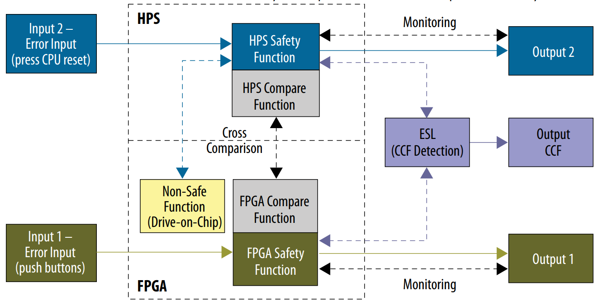

# Drive-On-Chip with Functional Safety Design Example for Agilex™ 5 Devices

## Features of the Drive-on-Chip with Functional Safety Design Example for Agilex™ 5 Devices

* Motor control for Agilex™ 5 devices, refer to AN 1000: Drive-On-Chip Design
  Example for Agilex™ 5 Devices.
* Python-based GUI for motor feedback information, debugging and control of
motors. Extension to provide visual safety outputs.
* Motor speed safety function according to Cat 3 PLd architecture.

## About the Safety Concept

Applying safety concept principles to the Drive-on-Chip with Functional Safety
Design Examples

According to ISO 13849-1, clause 6.2.6 the Category 3 requirements are:

* Apply designated architecture for Cat. 3.
* Apply measures against common cause failures (CCF) (see Annex F).
* For category 3, apply the same basic safety principles as those according to
  6.2.3 for category By.
* Follow “Well-tried safety principles” (see ISO 13849-2) according to 6.2.4.
* Design SRP/CS of category 3 so that a single fault in any of these parts does
  not lead to the loss of the safety function.
* Whenever reasonably practicable, detect the single fault at or before the next
  demand upon the safety function.
* Ensure the diagnostic coverage (DCavg) of the total safety related parts of
  the control system (SRP/CS) including fault detection must be at least low.
* Ensure the mean time to dangerous failure (MTTFD) of each of the redundant
  channels must be low-to-high, depending on the performance level.

 
According to ISO 13849-1:2015, clause 6.2.6, the designated architecture for
Cat.3 requires two channels with independent inputs and outputs and a cross
comparison (CC). Altera® can satisfy this architecture by implementing
two logical blocks in a single SoC FPGA, with an external safety logic to
mitigate common cause failures. The design meets Cat 3 designated architecture
and the measures against CCF. However the reliability parameters (MTTFD , DCavg)
are application-specific and you can only evaluate them at application level with
a specific safety concept, although the design includes examples of such diagnostics.

 
The figure shows the basic architecture of the safety concept divided in two
independent safety channels.

 

{:style="display:block; margin-left:auto; margin-right:auto"}

**First-Level Safety Concept Diagram Applied to 
Drive-on-Chip Design Example.**

 

The design implements the first channel using the hard processor system (HPS)
in the Agilex™ 5 SoC devices to run speed monitoring and cross-comparison
functions. The HPS safety function interacts with the non-safe function or
drive-on-chip block to monitor and estimate the speed for a safe threshold.

The design implements the second channel in the FPGA fabric using custom and
Platform Designer IP to monitor and calculate motor rotational speed. The
design cross compares and verifies data from the HPS safety channel and the
FPGA safety channel by its counterpart within the safety response time. Multiple
mechanisms verify the correct behavior of the safety logic.

Many faults in motor control can lead to the motor over-speeding and so if
either of the speed monitor safety functions detects such a fault, the design
removes power from the motor to prevent the motor running unsafely.

The HPS and FPGA channels provide diverse implementations of the safety function
that improves the diagnostic coverage. The design can detect some systematic
faults and random faults and also counts towards CCF measures. AXI and APB
interfaces pass the cross-comparison data between the FPGA and HPS. This
maximizes RTL reuse and also allow use of third party verification IP, which
can help reduce systematic faults and add independence to the verification process.

The external safety logic detects when FPGA and SoC fail simultaneously and
performs functions such as monitoring temperature and providing a watchdog
function. In a real design, the external safety logic is a physically separate
device. However, this design models it within the FPGA.

FPGA features add diagnostics. ECC and complementary pins. ECC in the shared
memory detects multi-bit errors and corrects single-bit errors.

Complementary-pair signaling adds redundancy to detect stuck or short type
faults. The complementary-pair consists of two signals denoted `_p` and `_n`
corresponding to active-high and active-low respectively. Under normal
circumstances the `_p` and `_n` elements are always opposite polarity to each other.
If they are the same, a fault has occurred – e.g. stuck-high or low fault, short
to adjacent pin.

 

[Back to Documentation](../doc-funct-safety.md#example-design-documentation){ .md-button }
