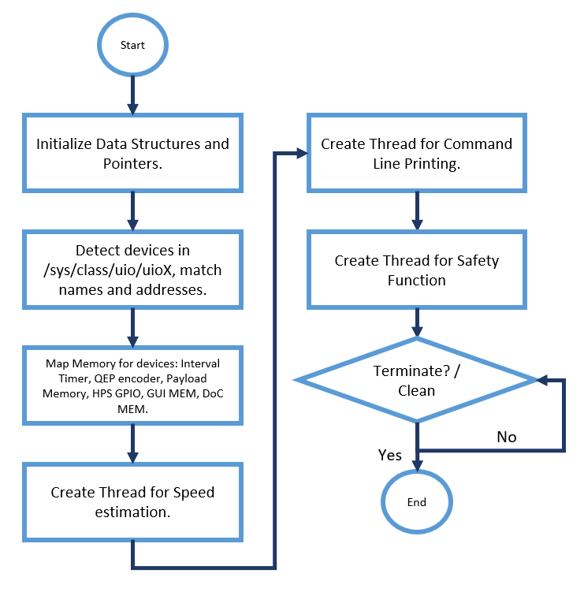
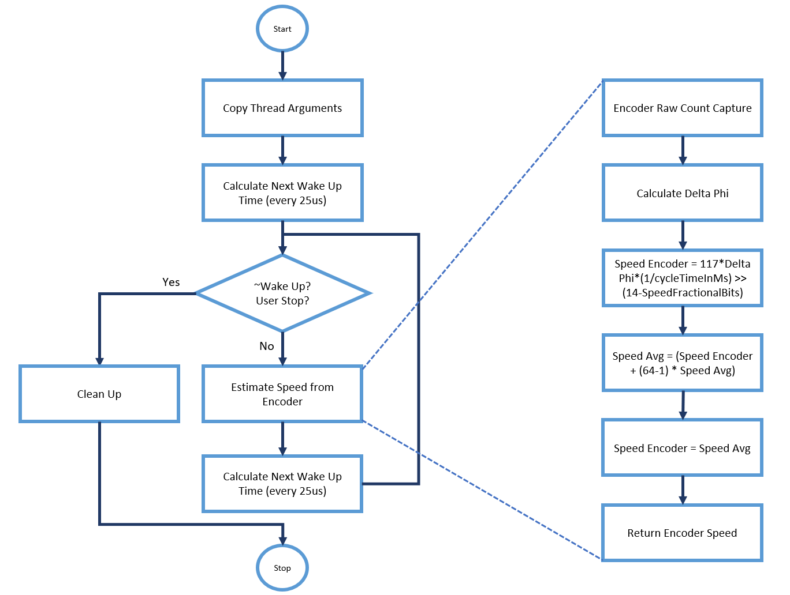
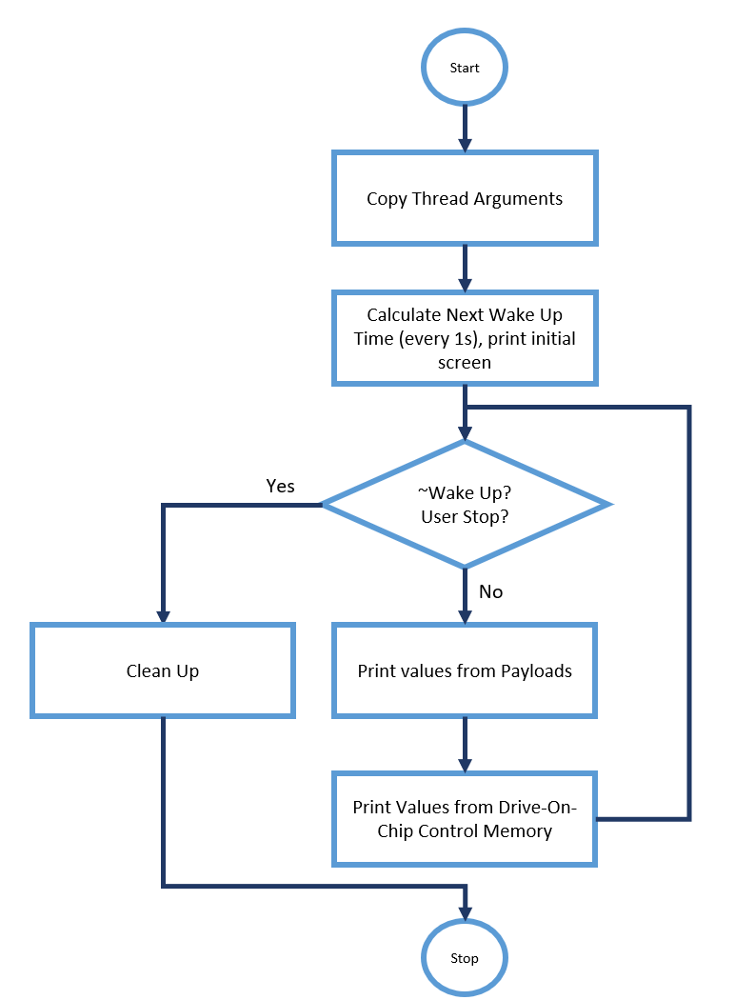
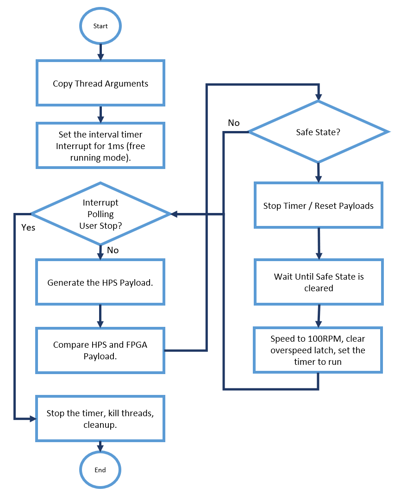
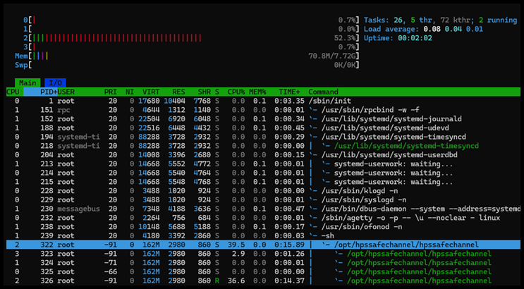

# Drive-On-Chip with Functional Safety Design Example for Agilex™ 5 Devices

## HPS Channel Speed Monitoring Safety Application

The Drive-On-Chip with Functional Safety design implements an HPS channel safety
function with an application running in the Agilex™ 5 HPS. The application is by
default cross compiled for ARM64 architecture and the executable is added to
`/opt/hpssafechannel/` directory during the Yocto build.The application is set to
run as a service after the HPS finish booting Linux. If necessary, you can
compile and modify the application without building Yocto.

The main functions of the HPS channel speed monitoring safety application are:

* Detect and connect with the devices in the FPGA soft logic necessary to
  implement the Safety Function
* Estimate speed at 25 kHz rate, accessing the Drive-on-Chip quadrature encoder
  pulse encoder raw position values.
* Generate the HPS payload according to specification.
* Detect overs-peed in the Axis0 of the Drive-on-Chip hardware.
* Cross compare the HPS payload with the FPGA payload.
* Generate HPS channel safety outputs to the external safety logic block.
* Write values for GUI display in the GUI safety memory.
* Print the status of the application in the UART terminal.

You can find the HPS Channel for Speed Monitoring Application as part of the
assets (in the GitHub Release Tag), or in the `recipes-example` directory of the
`meta-driveonchip` layer with the name `hpssafechannel_1.0.tar.gz`

### Main (hps_safe_channel.c)

The main function is in `<.tar.gz_location>/hps_safe_channel_1.0/` . The flow of
the main function consists of device and memory initialization from UIO, thread
creation, and initialization for speed estimation, terminal printing and the
running of the main safety function. Then the main runs an infinite loop until
the design issues the program with a `SIGNALTERM`. At the end, some clean up functions.

 

{:style="display:block; margin-left:auto; margin-right:auto"}

**HPS Safety Function Main Execution Flow.**

 

The loop does not finish unless you stop it. When the interval timer triggers
the interrupt, the HPS calculates a new speed and HPS payload.

### Speed Estimation Thread (speed_estimation.c/.h)

The thread, which you can change, runs every 25ms (4kHz). The mechanism
calculates a wake up time. It runs the speed estimation in every cycle after
the wake-up time taking readings from the drive-on-chip encoder, specifically
from the Raw Count Capture register (accessing the device `doc_qep0`). The design
passes the values to main functions using pointers and the HPS calculates the
next wake up time.

 

{:style="display:block; margin-left:auto; margin-right:auto"}

**Speed Estimation Thread Execution Flow.**

 

The design allocates this thread to core 3, which is isolated for this purpose.

### Printing Thread (print_safety.c/.h)

The thread provides information about the safety function in the UART terminal
after the program runs in Linux. The design allocates the thread to a different
HPS core, and it refreshes the information every second. The thread finishes
after `CTRL+C` or `SignalTerm`. The program assigns the thread to core 1, which is
not isolated.

 

{:style="display:block; margin-left:auto; margin-right:auto"}

**Printing Thread Execution Flow.**

 

### Safety Function Application (srt.c/.h)

This thread implements the safety function in the HPS channel. The program
allocates the thread and the interrupt to an isolated core 2. It sets the
interval timer to run at 1ms (the safety response time, SRT).

 

{:style="display:block; margin-left:auto; margin-right:auto"}

**HPS Safety Function Flow Diagram.**

 

In every interrupt by the timer the application copies an HPS channel speed
estimation from the speed estimation thread. The program generates and copies
the payload to the shared memory. Then it compares the latest with the payload
available from the HPS safe channel. The HPS asserts the safety signals and writes
to registers for the FPGA-HPS channel synchronization. If the safe state is triggered,
the motor is stopped. The safety function pauses until you clear the state with
the push button. Then the function continues with the regular activities for
safe speed monitoring in Axis0.

### Access to devices

The helper functions that access registers and memory spaces of these devices
are in `<.tar.gz_location>/hps_safe_channel_1.0/devices`

* **`drive_on_chip.c/.h`:** functions to write and read information from
  doc_safety_dump memory for visualization of safety parameters in the GUI. Also
  functions to access any device connected to the lightweight HPS to FPGA bridge,
  if necessary, e.g. changing the speed of the axis.
* **`fpga_speed_est.c/.h`:** functions to clear the over speed latch in the FPGA
  channel after safe state clearance.
* **`hps_gpio.c/h`:** functions to read and write to the hps_fpga_gpio to
  provide HPS safety outputs to the external safety logic (speed comparison and
  over-speed) and receive the output of the of the external safety logic (motor
  power down). Routines to indicate safe state to the external safety logic from
  the HPS safety channel.
* **`interval_timer.c/h`:** functions to control the interval timer, set free running,
  clear timeout signals, set the timer count.
* **`qep_encoder.c`:** functions to get the quadrature encoder pulse count for speed
  estimation.
* **`safe_memory.c/.h`:** functions to write and read information from the share
  memory (shared_mem) and to cross compare payloads produced by both safety
  channels.
* **`scan_devices.c/h`:** a set of helper functions to determine the location,
  name, addresses, and offsets of the required devices. Also to get a pointer to
  handle the access to base memory. Devices must be mapped in the DTS as UIO devices.

### Core Isolation and Core Affinity

This system isolates design cores 2 and 3 for timing critical functions. Core 2
runs the HPS safety function and serves the interrupt generated by the Interval
timer. Core 3 is for the thread that does speed estimation. The Linux Kernel
scheduler allocates other threads to core 1 and 0. Core isolation and core
affinity ensures the timing critical parts of the application meet their
deadlines (1 ms, safety response time). You can
check the core allocation using the tool **`htop`**.

 

{:style="display:block; margin-left:auto; margin-right:auto"}

**Core Affinity and Isolation using HTOP View.**

 

The figure shows the intended core allocation for HPS safe application threads.
The figure shows no other kernel or user-space application runs in core 2 or 3,
only core 0 and 1 are available for the remainder of the applications and services.

 

[Back to Documentation](../doc-funct-safety.md#example-design-documentation){ .md-button }
