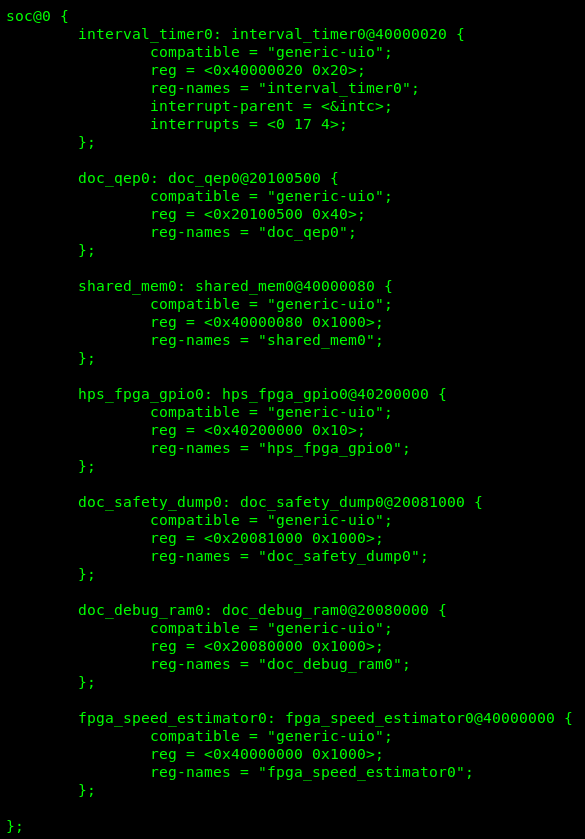
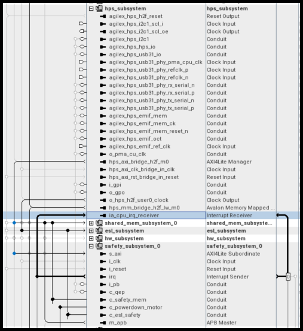
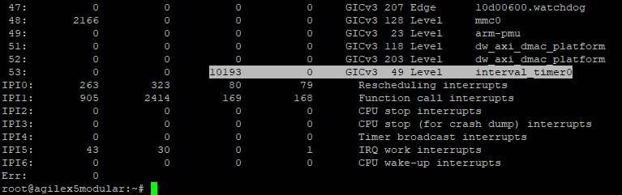
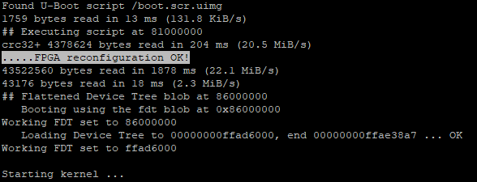

[https://github.com/altera-fpga/agilex-ed-drive-on-chip]: https://github.com/altera-fpga/agilex-ed-drive-on-chip
[https://github.com/altera-fpga/modular-design-toolkit]: https://github.com/altera-fpga/modular-design-toolkit
[meta-altera-fpga]: https://github.com/altera-fpga/agilex-ed-drive-on-chip/tree/rel/25.1/sw/altera-fpga
[meta-driveonchip]: https://github.com/altera-fpga/agilex-ed-drive-on-chip/tree/rel/25.1/sw/meta-driveonchip
[agilex-ed-drive-on-chip/sw]: https://github.com/altera-fpga/agilex-ed-drive-on-chip/tree/rel/25.1/sw


[Release Tag]: https://github.com/altera-fpga/agilex-ed-drive-on-chip/releases/tag/rel-safety-25.1
[wic.gz]: https://github.com/altera-fpga/agilex-ed-drive-on-chip/releases/download/rel-safety-25.1/core-image-minimal-agilex5_mk_a5e065bb32aes1.rootfs.wic.gz
[wic.bmap]: https://github.com/altera-fpga/agilex-ed-drive-on-chip/releases/download/rel-safety-25.1/core-image-minimal-agilex5_mk_a5e065bb32aes1.rootfs.wic.bmap
[top.hps.jic]: https://github.com/altera-fpga/agilex-ed-drive-on-chip/releases/download/rel-safety-25.1/top.hps.jic
[doc-gui.zip]: https://github.com/altera-fpga/agilex-ed-drive-on-chip/releases/download/rel-safety-25.1/doc-gui_1.0.0.zip
[DOC_SAFETY_TANDEM_MOTORSIM_AGILEX5.qar]: https://github.com/altera-fpga/agilex-ed-drive-on-chip/releases/download/rel-safety-25.1/DOC_SAFETY_TANDEM_MOTORSIM_AGILEX5.qar
[top.core.rbf]: https://github.com/altera-fpga/agilex-ed-drive-on-chip/releases/download/rel-safety-25.1/top.core.rbf
[u-boot-spl-dtb.hex]: https://github.com/altera-fpga/agilex-ed-drive-on-chip/releases/download/rel-safety-25.1/u-boot-spl-dtb.hex
[hpssafechannel_1.0.tar.gz]: https://github.com/altera-fpga/agilex-ed-drive-on-chip/releases/download/rel-safety-25.1/hpssafechannel_1.0.tar.gz


[Creating and Building the Design based on Modular Design Toolkit (MDT).]: https://github.com/altera-fpga/agilex-ed-drive-on-chip/blob/rel/25.1/HPS_NIOSVg_DoC_Safety_dual_axis/Readme.md
[Create SD card image (.wic) using YOCTO/KAS]: https://github.com/altera-fpga/agilex-ed-drive-on-chip/blob/rel/25.1/sw/README.md
[AGX_5E_Modular_Devkit_HPS_NIOSVg_DoC_safe_dual_axis.xml]: https://github.com/altera-fpga/agilex-ed-drive-on-chip/blob/rel/25.1/HPS_NIOSVg_DoC_Safety_dual_axis/AGX_5E_Modular_Devkit_HPS_NIOSVg_DoC_safe_dual_axis.xml


[Drive-On-Chip with Functional Safety System Example Design for Agilex™ 5 Devices]: https://altera-fpga.github.io/rel-25.1/embedded-designs/agilex-5/e-series/modular/drive-on-chip/doc-funct-safety
[Drive-On-Chip with PLC System Example Design for Agilex™ 5 Devices]: https://altera-fpga.github.io/rel-25.1/embedded-designs/agilex-5/e-series/modular/drive-on-chip/doc-plc
[ROS Consolidated Robot Controller Example Design for Agilex™ 5 Devices]: https://altera-fpga.github.io/rel-25.1/embedded-designs/agilex-5/e-series/modular/drive-on-chip/doc-crc
[Agilex™ 5 FPGA - Drive-On-Chip Design Example]: https://www.intel.com/content/www/us/en/design-example/825930/agilex-5-fpga-drive-on-chip-design-example.html
[Intel® Agilex™ 7 FPGA – Drive-On-Chip for Intel® Agilex™ 7 Devices Design Example]: https://www.intel.com/content/www/us/en/design-example/780360/intel-agilex-7-fpga-drive-on-chip-for-intel-agilex-7-devices-design-example.html
[Agilex™ 7 FPGA – Safe Drive-On-Chip Design Example]: https://www.intel.com/content/www/us/en/design-example/825944/agilex-7-fpga-safe-drive-on-chip-design-example.html
[Agilex™ 5 E-Series Modular Development Kit GSRD User Guide (25.1)]: https://altera-fpga.github.io/rel-25.1/embedded-designs/agilex-5/e-series/modular/gsrd/ug-gsrd-agx5e-modular/
[Agilex™ 5 E-Series Modular Development Kit GHRD Linux Boot Examples]: https://altera-fpga.github.io/rel-25.1/embedded-designs/agilex-5/e-series/modular/boot-examples/ug-linux-boot-agx5e-modular/


[AN 1000: Drive-on-Chip Design Example: Agilex™ 5 Devices]: https://www.intel.com/content/www/us/en/docs/programmable/826207/24-1/about-the-drive-on-chip-design-example.html
[AN 999: Drive-on-Chip with Functional Safety Design Example: Agilex™ 7 Devices]: https://www.intel.com/content/www/us/en/docs/programmable/823627/current/about-the-drive-on-chip-with-functional.html
[AN 994: Drive-on-Chip Design Example for Intel® Agilex™ 7 Devices]: https://www.intel.com/content/www/us/en/docs/programmable/780361/23-1/about-the-drive-on-chip-design-example.html
[AN 773: Drive-On-Chip Design Example for Intel® MAX® 10 Devices]: https://www.intel.com/content/www/us/en/docs/programmable/683072/current/about-the-drive-on-chip-design-example.html
[AN 669: Drive-On-Chip Design Example for Cyclone V Devices]: https://www.intel.com/content/www/us/en/docs/programmable/683466/current/about-the-drive-on-chip-design-example.html


[Hard Processor System Technical Reference Manual: Agilex™ 5 SoCs (25.1)]: https://www.intel.com/content/www/us/en/docs/programmable/814346/25-1/hard-processor-system-technical-reference.html
[NiosV Processor for Altera® FPGA]: https://www.intel.com/content/www/us/en/products/details/fpga/intellectual-property/processors-peripherals/niosv.html
[Tandem Motion-Power 48 V Board Reference Manual]: https://www.intel.com/content/www/us/en/docs/programmable/683164/current/about-the-tandem-motion-power-48-v-board.html
[Agilex™ 5 FPGA E-Series 065B Modular Development Kit]: https://www.intel.com/content/www/us/en/products/details/fpga/development-kits/agilex/a5e065b-modular.html
[Motor Control Designs with an Integrated FPGA Design Flow]: https://www.intel.com/content/dam/www/programmable/us/en/pdfs/literature/wp/wp-01162-motor-control-toolflow.pdf
[Install Docker Engine]: https://docs.docker.com/engine/install/
[Docker Build: Multi-Platform Builds]: https://docs.docker.com/build/building/multi-platform/


[Disk Imager]: https://sourceforge.net/projects/win32diskimager


# Drive-On-Chip with Functional Safety Design Example for Agilex™ 5 Devices

## Overview

In the Drive-On-Chip with Functional Safety Design Example for Agilex™ 5 Devices
the HPS implements the secondary safety channel, runs speed estimation and monitoring,
cross compares payload, automatically detects the devices, and generates GUI data.
The HPS safety channel comprises

* HPS configuration in Platform Designer.
* The Yocto meta layer that you must add to the SD card image build.
* HPS channel speed monitoring safety application source code, compilation, and running

This page describes the elements for getting a custom distribution of Linux based
on YOCTO/KAS for this application.

The files and contents described in the following sections can be found in the
`doc-variants` repository, within the `sw` directory see: [meta-driveonchip](https://github.com/altera-fpga/agilex-ed-drive-on-chip/tree/rel/25.1/sw/meta-driveonchip).

## HPS Channel Safety Software - Custom Linux

For the Drive-On-Chip Functional Safety Design Example for Agilex™ 5 Devices,
Altera® provides the files to build the Linux system to run the HPS channel
safety application. The custom version of linux is built based on KAS
(see: [agilex-ed-drive-on-chip/sw](https://github.com/altera-fpga/agilex-ed-drive-on-chip/tree/rel/25.1/sw)). An it is compose of two main meta-layers. In this
document the files relevant for the "Drive-On-Chip with Functional Safety
Design Example for Agilex™ 5 Devices" are highlighted.

### FPGA Embedded Layer

* See **[meta-altera-fpga](https://github.com/altera-fpga/agilex-ed-drive-on-chip/tree/rel/25.1/sw/altera-fpga)**

### Drive-On-Chip Layer

* See **[meta-driveonchip](https://github.com/altera-fpga/agilex-ed-drive-on-chip/tree/rel/25.1/sw/meta-driveonchip)**

### Necessary elements in the meta-layers to bind Software and Hardware

This section explains the different elements included in the meta-layers that
help to run the HPS Safety Application. These elements help to "bind" the FPGA
Soft IP that implements the Safety function in the "FPGA Channel" with the
software that runs in the HPS on top of Linux. This elements are explained in
the following sections to clarify the interaction of the HPS Safety Application
(Software), with the FPGA Safety Channel (soft logic).

#### **Device Tree.**

Adds a custom .dtsi (device tree fragment) file to the main device tree for
Linux kernel boot up stage `socfpga_agilex5_socdk.dts`. it compiles into a DTB
(device tree blob) during kernel compilation and is added to the SD card image
during the Yocto build. The recipe `device-tree.bb`. The specific file for
this design example (`agilex5_safety_dual_axis.dtsi`), is appended
using `device-tree.bbappend` directive. Look for these files in the
different meta-layers provided above.

<br>

{:style="display:block; margin-left:auto; margin-right:auto"}
<center>

**Custom Device Tree Fragment.**
</center>
<br>

You expand the device tree by appending the contents of the file
`agilex5_safety_dual_axis.dtsi` that exposes seven devices as UIO devices in
the RootFS. The figure shows the instances of the devices. These
definitions should match with the devices that the HPS can access in the
FPGA soft logic and you can verify the address map in the Platform Designer
Project (`.qsys`).

For example, the interval timer has the address `0x0000_0020` in Platform Designer,
but from the view of HPS you should add the offset reflecting the HPS-FPGA
bridge `0x4000_0000` refer ( System Memory Mapping Scheme
in the [Hard Processor System Technical Reference Manual: Agilex™ 5 SoCs (25.1)](https://www.intel.com/content/www/us/en/docs/programmable/814346/25-1/hard-processor-system-technical-reference.html))
specifying the address `0x4000_0020` in the `agilex5_safety_dual_axis.dtsi` file.
Components connected to the full HPS to FPGA bridge have an offset of `0x4000_0000`
and components connected to lightweight HPS-to-FPGA bridge have an offset of `0x2000_0000`.

All components are listed in the .dtsi as compatible `generic_uio`, which is a way
to map devices using generic user IO interface in the Linux kernel and user
space. If you modify or add memory mapped devices in Platform Designer, reflect
the change in the `.dtsi` file. When the Yocto build refreshes, the Linux system
lists the device in the corresponding `/dev/uiox` and populates the information in
`/sys/class/uio/uiox`. The `.dtsi` and Platform Designer mapping should be
consistent to provide the HPS safety function application to run correctly.

For example, the application looks for the names specified in the `.dtsi`,
for example `interval_timer0` and gets the device UIOX identifier, the address,
the offset, and all meaningful information to access the device in the FPGA.

A particularity of the `.dtsi` in the previous figure is the interrupts metadata.
The "interval timer" processes the safety function by issuing an interrupt to the
HPS that is polled by software. The interrupt `<0 17 4>` is the first interrupt
line accepted by the HPS from any FPGA (soft logic) device. In Platform Designer
the interrupt line to the interval timer shows Interrupt number 0.

<br>
{:style="display:block; margin-left:auto; margin-right:auto"}
<center>

**Interval Timer Interrupt line
connection to the HPS**
</center>
<br>

You can check the number of interrupts triggered by the interval timer at any
point by issuing the following command in the Agilex™ 5 command line:

```bash
cat /proc/interrupt
```

<br>

{:style="display:block; margin-left:auto; margin-right:auto"}
<center>

**Amount of Interrupts
Triggered by the Interval Timer**
</center>
<br>

Look for interrupt 53, subscribed to the Interval Timer. As shown in the
previous figure, interrupt 53 has been allocated to core 2 (isolated core),
using the directives in the `start.sh` file installed in `/usr/bin`
(or `start_agx5.sh` file in the meta-layers).

<br>

#### **FPGA Bitstream.**

Adds the `agilex5_modular_safety_dual_axis.core.rbf` file to the build. The file
is generated after Quartus® Prime compilation. The `*core.rbf` file is added to the
boot partition of the SD card (renamed as `top.core.rbf`). The HPS configures the
FPGA at initialization using u-boot `load` command in `uboot.txt` generated into
`boot.scr.uimg` in the boot partition by `u-boot-socfpga_%.bbappend` (look for
the files in the meta-layer).

<br>

{:style="display:block; margin-left:auto; margin-right:auto"}
<center>

**FPGA configuration during HPS booting process.**
</center>
<br>

Look for the print **"..... FPGA reconfiguration OK "** during the device booting
process, as shown in the previous figure to ensure the FPGA bitstream (`top.core.rb`)
has been properly loaded.

<br>

#### **Additional u-boot configuration.**

An append to the u-boot arguments using `IMAGE_BOOT_ARGS` and
`IMAGE_BOOT_ARGS:append:agilex5_modular` in different KAS/YOCTO configuration
files to enable UIO drivers defined by `uio_pdrv_genirq.of_id=generic-uio`.

Additionally, this design isolates cores 2 and 3 for use exclusively in the
application (speed estimation and main safety function).
The u-boot arguments `nohz_full=2,3` and `isolcpus=2,3` inside the KAS/YOCTO
configuration files ensure the isolation of cores for the application. You can
verify the core allocation in the C source code.

<br>

#### HPS Channel Safety Application and Services (recipes-example)

Recipe to build and deploy the HPS safety application (`hpssafechnnel_1.0.bb`).
The source code is contained in `hpssafechannel_1.0.tar.gz` and the `Makefile` is
provided.

The recipe `hpssafechannel_1.0.bb` compiles and packages the executable into
the SD card image (.wic). The recipe installs the executable in `/opt/hpssafechannel/`

The recipe `hpsafechannel_1.0.bb` also deploys the HPS safety application as a
service, it installs the file `hpssafechannel.service` to `/lib/system/system` and
launches it some seconds after kernel initialization using the `start.sh` script
in `/usr/bin/`

<br>

#### **Additional tools.**

See the KAS configuration file for this example design `kas_safety_dual_axis.yml`.
Some tools installed are:

* `hpssafechannel`: custom HPS Channel Safety Application.
* `htop`: cross-platform interactive process viewer to verify core isolation
  and affinity.
* `devemem2`: to easily access memory-mapped devices.
* `uio-pdrv-genirq`: kernel module to map devices as "User IO"

<br>

#### **PREEMPT-RT patch.**

This example show the user how to easily "patch" the Linux kernel with `PREEMPT_RT`
patch, which provides soft Real Time characteristics particularly useful for
embedded hardware applications. In this design example `PREEMTP_RT` patch helps
to guarantee the processing time of the SRT (Safety Response Time) by giving
priority to the interrupt raised by the Interval timer that synchronizes the
FPGA and the HPS Safety Functions. See the file `linux-socfpga-rt_6.6.bb`

<br>

[Back to Documentation](../doc-funct-safety.md#example-design-documentation){ .md-button }
