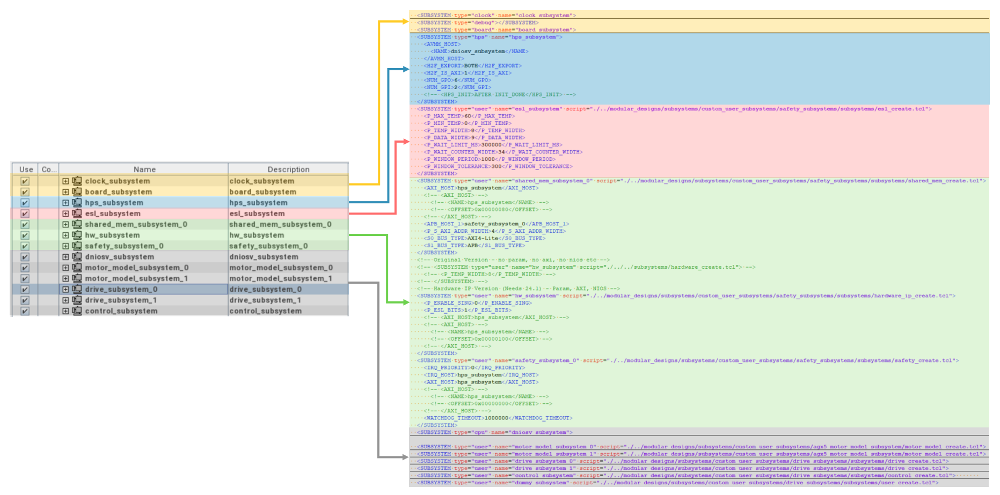
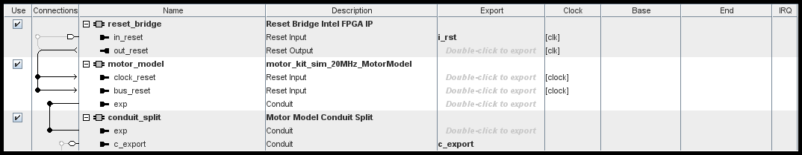

[Drive-On-Chip with Functional Safety System Example Design for Agilex™ 5 Devices]: https://altera-fpga.github.io/rel-25.1/embedded-designs/agilex-5/e-series/modular/drive-on-chip/doc-funct-safety
[Drive-On-Chip with PLC System Example Design for Agilex™ Devices]: https://altera-fpga.github.io/rel-25.1/embedded-designs/agilex-5/e-series/modular/drive-on-chip/doc-plc
[ROS Consolidated Robot Controller Example Design for Agilex™ 5 Devices]: https://altera-fpga.github.io/rel-25.1/embedded-designs/agilex-5/e-series/modular/drive-on-chip/doc-crc
[Agilex™ 5 FPGA - Drive-On-Chip Design Example]: https://www.intel.com/content/www/us/en/design-example/825930/agilex-5-fpga-drive-on-chip-design-example.html
[Altera® Agilex™ 7 FPGA – Drive-On-Chip for Altera® Agilex™ 7 Devices Design Example]: https://www.intel.com/content/www/us/en/design-example/780360/intel-agilex-7-fpga-drive-on-chip-for-intel-agilex-7-devices-design-example.html
[Agilex™ 7 FPGA – Safe Drive-On-Chip Design Example]: https://www.intel.com/content/www/us/en/design-example/825944/agilex-7-fpga-safe-drive-on-chip-design-example.html
[Agilex™ 5 E-Series Modular Development Kit GSRD User Guide (25.1)]: https://altera-fpga.github.io/rel-25.1/embedded-designs/agilex-5/e-series/modular/gsrd/ug-gsrd-agx5e-modular/
[Agilex™ 5 E-Series Modular Development Kit GHRD Linux Boot Examples]: https://altera-fpga.github.io/rel-25.1/embedded-designs/agilex-5/e-series/modular/boot-examples/ug-linux-boot-agx5e-modular/

[AN 1000: Drive-on-Chip Design Example: Agilex™ 5 Devices]: https://www.intel.com/content/www/us/en/docs/programmable/826207/24-1/about-the-drive-on-chip-design-example.html
[AN 999: Drive-on-Chip with Functional Safety Design Example: Agilex™ 7 Devices]: https://www.intel.com/content/www/us/en/docs/programmable/823627/current/about-the-drive-on-chip-with-functional.html
[AN 994: Drive-on-Chip Design Example for Altera® Agilex™ 7 Devices]: https://www.intel.com/content/www/us/en/docs/programmable/780361/23-1/about-the-drive-on-chip-design-example.html
[AN 773: Drive-On-Chip Design Example for Altera® MAX® 10 Devices]: https://www.intel.com/content/www/us/en/docs/programmable/683072/current/about-the-drive-on-chip-design-example.html
[AN 669: Drive-On-Chip Design Example for Cyclone V Devices]: https://www.intel.com/content/www/us/en/docs/programmable/683466/current/about-the-drive-on-chip-design-example.html

[Hard Processor System Technical Reference Manual: Agilex™ 5 SoCs (25.1)]: https://www.intel.com/content/www/us/en/docs/programmable/814346/25-1/hard-processor-system-technical-reference.html
[NiosV Processor for Altera® FPGA]: https://www.intel.com/content/www/us/en/products/details/fpga/intellectual-property/processors-peripherals/niosv.html
[Tandem Motion-Power 48 V Board Reference Manual]: https://www.intel.com/content/www/us/en/docs/programmable/683164/current/about-the-tandem-motion-power-48-v-board.html
[Agilex™ 5 FPGA E-Series 065B Modular Development Kit]: https://www.intel.com/content/www/us/en/products/details/fpga/development-kits/agilex/a5e065b-modular.html
[Agilex™ 3 FPGA C-Series Development Kit]: https://www.intel.com/content/www/us/en/products/details/fpga/development-kits/agilex/a3y135b.html
[Agilex™ 3 FPGA and SoC C-Series Development Kit]:https://www.altera.com/products/devkit/a1jui000004kfuxma0/agilex-3-fpga-and-soc-c-series-development-kit
[Motor Control Designs with an Integrated FPGA Design Flow]: https://www.intel.com/content/dam/www/programmable/us/en/pdfs/literature/wp/wp-01162-motor-control-toolflow.pdf
[Install Docker Engine]: https://docs.docker.com/engine/install/
[Docker Build: Multi-Platform Builds]: https://docs.docker.com/build/building/multi-platform/
[quartus_pgm command]:https://www.intel.com/content/www/us/en/docs/programmable/813773/25-1/understanding-configuration-status-using.html

[Disk Imager]: https://sourceforge.net/projects/win32diskimager

[https://github.com/altera-fpga/agilex-ed-drive-on-chip]: https://github.com/altera-fpga/agilex-ed-drive-on-chip
[https://github.com/altera-fpga/modular-design-toolkit]: https://github.com/altera-fpga/modular-design-toolkit
[meta-altera-fpga]: https://github.com/altera-fpga/agilex-ed-drive-on-chip/tree/rel/25.1/sw/meta-altera-fpga
[meta-driveonchip]: https://github.com/altera-fpga/agilex-ed-drive-on-chip/tree/rel/25.1/sw/meta-driveonchip
[agilex-ed-drive-on-chip/sw]: https://github.com/altera-fpga/agilex-ed-drive-on-chip/tree/rel/25.1/sw

[Release Tag]: https://github.com/altera-fpga/agilex-ed-drive-on-chip/releases/tag/rel-safety-25.1
[wic.gz]: https://github.com/altera-fpga/agilex-ed-drive-on-chip/releases/download/rel-safety-25.1/core-image-minimal-agilex5_mk_a5e065bb32aes1.rootfs.wic.gz
[wic.bmap]: https://github.com/altera-fpga/agilex-ed-drive-on-chip/releases/download/rel-safety-25.1/core-image-minimal-agilex5_mk_a5e065bb32aes1.rootfs.wic.bmap
[top.hps.jic]: https://github.com/altera-fpga/agilex-ed-drive-on-chip/releases/download/rel-safety-25.1/top.hps.jic
[doc-gui.zip]: https://github.com/altera-fpga/agilex-ed-drive-on-chip/releases/download/rel-safety-25.1/doc-gui_1.0.0.zip
[DOC_SAFETY_TANDEM_MOTORSIM_AGILEX5.qar]: https://github.com/altera-fpga/agilex-ed-drive-on-chip/releases/download/rel-safety-25.1/DOC_SAFETY_TANDEM_MOTORSIM_AGILEX5.qar
[top.core.rbf]: https://github.com/altera-fpga/agilex-ed-drive-on-chip/releases/download/rel-safety-25.1/top.core.rbf
[u-boot-spl-dtb.hex]: https://github.com/altera-fpga/agilex-ed-drive-on-chip/releases/download/rel-safety-25.1/u-boot-spl-dtb.hex
[hpssafechannel_1.0.tar.gz]: https://github.com/altera-fpga/agilex-ed-drive-on-chip/releases/download/rel-safety-25.1/hpssafechannel_1.0.tar.gz

[Creating and Building the Design based on Modular Design Toolkit (MDT).]: https://github.com/altera-fpga/agilex-ed-drive-on-chip/blob/rel/25.1/HPS_NIOSVg_DoC_Safety_dual_axis/Readme.md
[Create SD card image (.wic) using YOCTO/KAS]: https://github.com/altera-fpga/agilex-ed-drive-on-chip/blob/rel/25.1/sw/README.md
[AGX_5E_Modular_Devkit_HPS_NIOSVg_DoC_safe_dual_axis.xml]: https://github.com/altera-fpga/agilex-ed-drive-on-chip/blob/rel/25.1/HPS_NIOSVg_DoC_Safety_dual_axis/AGX_5E_Modular_Devkit_HPS_NIOSVg_DoC_safe_dual_axis.xml

# Drive-On-Chip with Functional Safety Design Example for Agilex™ 5 Devices

## Hardware Description and Functionality

This document provides insights about the functionality of the design example
using the hardware blocks as a reference. The user must account for the
interaction of the hardware described in this section and the software that
executes in the Hard Processor System to gain full understanding of the
implementation of the Safety Concept for Speed Monitoring.

The Platform Designer high-level system includes many subsystems. These
subsystems allow the system to work appropriately.

* The `clock_subsystem` and `board_subsystem` contain blocks related to the board
  resources such buttons, switches, LEDs, reference clocks, resets. They provide
  the clocks and resets for the other subsystems.
* The `hps_subsystem` is an instance of the Agilex™ 5 HPS that runs the HPS safe
  channel application in Linux. EMIF to on-board DDR4 chip includes presets
  and connections of the HPS2FPGA bridges to other subsystems. The subsystem
  includes an instance of DDR4 EMIF to interface with on-board memory chip with
  all presets and connections to the HPS2FPGA bridges to other subsystems.
* The `shared_mem_subsystem` enables cross comparison data to pass between the
  FPGA and HPS as part of the safety concept. A memory location where the FPGA
  channel and the HPS channel read and write the necessary safety payloads.
* The `esl_subsystem` is an internal (FPGA fabric) implementation of the external
  safety logic. In a production functional safety application, you remove this
  block and you implement it in a separate device from the Agilex™ device.
* The `hardware_subsystem` collects information off the device that you can use
  to implement safety features such as voltage and temperature monitoring and validation.
* The `safety_subsystem` implements one channel of the the safety concept in the
  FPGA. This safety channel is currently attached to the speed monitoring of Axis0
* The subsystems `dniosv_subsystem*`, `motor_model_subsystem*`, `drive_subsystem*`
  and `control_subsystem*` are blocks related to motor control and motor modeling.
  For more information on these blocks, refer to AN1000: Drive-On-Chip Design
  Example for Agilex™ 5 Devices.
 

The following block diagram shows the main components and subsystems of the
"Drive-On-Chip with Functional Example Design".

 

{:style="display:block; margin-left:auto; margin-right:auto"}

**Hardware Top Block Diagram.**

 

The diagram is color-coded to match the Platform Designer view and the XML file
(Modular Design Toolkit methodology) for this design
(see: [AGX_5E_Modular_Devkit_HPS_NIOSVg_DoC_safe_dual_axis.xml](https://github.com/altera-fpga/agilex-ed-drive-on-chip/blob/rel/25.1/HPS_NIOSVg_DoC_Safety_dual_axis/AGX_5E_Modular_Devkit_HPS_NIOSVg_DoC_safe_dual_axis.xml)). The following figure
correlates the block diagram, the XML file and the Platform Designer view:

 

{:style="display:block; margin-left:auto; margin-right:auto"}

**Modular Design Tool Kit PD project vs XML file.**

 

## Safety-specific Hardware Subsystems and Components

### a. Safety Subsystem

The safety subsystem consists of various submodules that collect appropriate
information to indicate the status and actions of the whole system, which passes
into the external safety logic.

The safety subsystem comprises the following blocks:

* Safety block (FPGA implementation of the safety channel)
* Quadrature encoder pulse
* Interval timer
* Push button debounce (for reset)
* Bridges for control and device access.

 

{:style="display:block; margin-left:auto; margin-right:auto"}

**Safety Subsystem Platform Designer View.**

 

#### a.1. Safety Block

This block implements the FPGA safety channel. It has two main functional blocks:
FPGA safety function block and the FPGA cross-comparison function for HPS-FPGA payloads.
 
 

##### a.1.1 Safety Function Block

Contains the FUSA and timer heartbeat generator, speed estimator, and payload generator.
 

* **FUSA and Timer Heartbeat Generator:** The heartbeat generator monitors the
  condition of all the other IPs in the FPGA and HPS channels. The generate bit
  is a control signal that toggles the heartbeat. For the FPGA, the generate input
  is derived from the FPGA Comparison Function state machine's start output,
  which in turn triggers from the timeout. Therefore, the FPGA heartbeat signal
  indicates correct restarting controlled by the software and operating comparison
  function state machine.
* **Speed Estimator:** The speed estimator estimates the speeds of the motor model
  based off quadrature encoder pulse count. Using this calculated value, the
  module determines respective safety bits, which pass into the external safety
  logic. The main algorithm of the estimator is similar to the one in drive on
  chip, with additional safety diagnostics. The speed estimator module controls
  local parameters and modifies sampling frequencies.
* **Payload Generator:** The payload generator takes in many different signals
  from around the overall safety block and generates a payload with all the
  relevant information. The FPGA-side payload is passed into the cross-comparison
  block for relevant and respective checks.
 

The following table shows the format for the payload data.

 

**32-bit Safety Payload format.**

| Bit range| Length   | Intended Data | Description |
| :------- | :------- | :------------ | :---------- |
| [0]      | 1 bit    |  Over-speed indication      |   1 for Over-speed   |
| \[25:1]  | 25 bits  |  Estimated speed            |   Measured in rpm    |
| \[31:26] |  6 bits  |  Sequence                   |   Implemented an internal counter to  register the sequence of measurements. (0-128) always looping around. |

 

##### a.1.2 Cross-Comparison Block

The cross-comparison block consists mainly of a state machine which, when
triggered by the timer, writes to and reads from the shared memory to compare
the FPGA payload with the HPS payload. The following diagram specifies the
in-built states of the state machine.

 

{:style="display:block; margin-left:auto; margin-right:auto"}

**State Machine Diagram to execute the Speed
  Monitoring Safety Function.**

 

When triggered in the initial `init` state by the timer, the state machine waits
a clock cycle for the payload to be generated before writing it to the shared
memory. The FPGA status location is then updated in the shared memory to
indicate that the FPGA payload is valid. The state machine then waits, checking
the shared memory location for the HPS status to determine when the HPS writes
its payload data to the shared memory. The design performs cross comparison
that verifies that the payload sequence number in the two payloads matches and
also that the two speeds match to within the allowed tolerance. Various factors
determine the acceptable tolerance between the two speed estimations:
The maximum acceleration of the motor

* The interrupt response time in the HPS software
* The alignment of the 4 kHz speed estimation sampling between the HPS and FPGA
* Clock cycle tolerance in the sampling of the encoder quadrature. One decoder
  can sample a change in the quadrature signals one clock cycle after the other.

Although the over-speed flag is in the payload data, the design does not cross
compare flags because tolerances in the speed estimation means that one speed
estimation can be just over the threshold and one just under. Hence the `over_speed`
flags not matching is a valid condition.

The state machine then updates the FPGA status in the shared memory to indicate
when the FPGA completes its cross comparison. The state machine then waits,
monitoring the HPS status for its cross comparison to be complete. The FPGA
state machine then clears the HPS status in the shared memory and the HPS
reciprocally clears the FPGA status in the shared memory. This handshaking
ensures that state machines in the FPGA and HPS remain synchronized with each
other. The FPGA state machine then returns to the initial state and the process repeats.

Between the `generate` state and returning to the `init` state, the design
enables a watchdog timer. This watchdog prevents the FPGA state machine from waiting
indefinitely for the HPS. If the watchdog expires, the state machine transitions
to the error state and the `compare_good_p/n` output pair is asserted. The
design only exits the error state when the `reset_safety_n` input is asserted (active-low).
 

#### a.2. Quadrature Encoder Pulse

The quadrature encoder pulse IP decodes the quadrature inputs from the position
encoder, signals `A`, `B` and `I`. The Drive-on-Chip with Functional Safety
Design Example design reuses the IP from the Drive-on-Chip Design Example.
However, it now exposes the count value to pass it for further analysis. The
IP also monitors any errors due to over-speed.where both `A` and `B` phases
of the quadrature change in the same sampling period. The IP may monitor the
encoder’s error output.

#### a.3. Interval Timer

The interval timer from the Quartus® or Platform Designer IP catalog is the source
of synchronization of the FPGA channel and the HPS channel. Calculating the
speed in both the channels, the cross comparison, and evaluating the safety
function must occur in the interval between the timer timeout and interrupt signals.

The interval timer provides the safety response time. In this design, the safety
response time is 1 ms. During that time, the FPGA channel generates a payload,
writes the payload to shared memory, retrieves the payload from the HPS, and
runs the comparison. Similar for the HPS safety channel. The HPS uses the
interrupt line from Linux to start the safety function.

In this design, the timer is set to 1 ms interval by writing a count value
according by the clock frequency of the timer (in this case 100 MHz). This IP
writes to the registers `periodl` and `periodh`. Then, the timer runs in free
running mode by writing a `0x7` in the control register. When the count reach `0x0`,
the timer issues an Interrupt for the Linux system (the timer is registered as a
UIO device in the Linux DTS with its corresponding interrupt number) and the
design assert the timeout output. These signals trigger the safety function in
the FPGA and HPS channel respectively. When the interrupt occurs, the systems
clears the interrupt and the timeout signal and sets the timer to free running
mode again.

### b. Shared Memory Subsystem

The shared memory is a 4x32 bit dual-port block RAM. One side connects via AXI
to the HPS. The other side connects via APB interface to the FPGA cross comparison
block. The design implements error correction codes (ECC) on both ports,
allowing single-bit errors to be automatically corrected and multi-bit errors
to be detected. The correction of single-bit errors allows the safety function
to continue despite a single fault. If uncorrectable multi-bit errors are
detected, the `memory_fault_p/n` complementary-pair output is asserted. You can
only de-assert this output by the active-low `reset_safety_n` input.

 

**Intended Shared Memory Address Map.**

| Address       |   Data                     |
| :-:           |   :--                      |
|     0x0       |         FPGA payload       |
|     0x4       |         FPGA status        |
|     0x8       |         HPS payload        |
|     0xC       |         HPS status         |

 

**Intended definition of Status Bit.**

| FPGA status  / HPS status bit   |        Meaning             |
| :-:                                |   ---                      |
|     0                              | Valid data from the channel is ready   to be compared. Comparison pending.|
|     1                              | Comparison done in the corresponding channel|

 

### c. External Safety Logic Subsystem

The external safety logic identifies common causes of failures and disparities
in the overall system. You can model the external safety logic via internal
logic when no external device is present. The following descriptions state each
of the diagnostics external safety logic Implements.
 

* **Results of payload comparison:** Both the FPGA and HPS process their own
  comparisons to ensure both values of payload agree. The design passes these
  outputs into the external safety logic to ensure that both comparison checks agree.  
* **Clock Checker:** The external safety logic actively takes in respective FPGA
  and HPS clocks as inputs of different frequencies. The design processes these
  signals through the clock checker to ensure frequencies are in a tolerable range.
  The clock checker takes a fixed reference clock and its respective reset, and
  compares it to a clock under comparison. Using fixed parameterizable thresholds,
  the clock checker determines whether the clock under test falls into appropriate
  and safe frequencies. The external safety logic uses the clock checker to ensure
  that HPS and PGA clocks operate at appropriate frequencies, and the design has
  no instances of skewing or jitter when passing through various blocks.  
* **Channel Operation:** Refers to the two heartbeat signals present in FPGA and
  HPS operations. These signals help to identify that everything is functional
  within a process safety time. The external safety logic receives these signals
  as inputs, which the design then delays using two flip-flops to prevent any
  metastable values that might fluctuate through. The design applies a window
  check to allow for the heartbeat to arrive within a determinable time span.  
* **CRAM Configuration Check:** Ensures that no soft errors or transient faults occur.  
* **Power Supply Check:** Ensures no failures because of loss of power or unsafe
  operating voltage conditions. The design checks the power supply by using the
  Mailbox Client with Avalon Streaming Interface IP. The design compares the
  voltages to optimal operating voltage conditions. Refer to Agilex™ User Guide.  
* **Temperature Check:** Ensures no failures because of unsafe temperatures. The
  design checks the temperature by using the Mailbox Client with Avalon Streaming
  Interface IP. The design compares the temperature values against parameterizable
  temperature limits to ensure they are in a safe range. For more details on
  power supply and temperature check, refer to Agilex™ Power Management User Guide.  
* **Complementary Bit Package**: The complementary bit package contains a typedef
  for a definition of type called `compli` which allows effective storage of
  complementary bit pairs. The complementary bit check also contains fault checking
  functions to ensure that received complementary pairs are organized into the
  correct format. The design processes external safety logic's I/O in a
  complementary manner to detect any stuck bits during transmissions. To
  accommodate any timing delays, complementary pairs can arrive within a preset
  and adjustable window.
 

### d. Hardware Subsystem

The hardware subsystem collects information about the system, which the external
safety logic can use. Agilex™ devices contain on-chip voltage and temperature sensors.
 

The secure device manager stores sampled data, which you can access by using the
Mailbox Client with Avalon Streaming Interface Altera® FPGA IP. Using the relevant
information, external safety logic can determine unsafe temperatures and inoperable
voltage conditions.
 

The subsystem comprises command, response, a set of command addresses, and a
mailbox client. During the command stage, the mailbox receives preprogrammed
addresses. The response stage receives results from the mailbox and sorts into
corresponding arrays.
 

The following table contains command address information.

 

{:style="display:block; margin-left:auto; margin-right:auto"}

**Hardware Subsystem Command and Address Information.**

 

### e. Voltage Thresholds

The design tests the voltage measurements received from the secure device
manager (SDM) against the thresholds (hex digital value).

 

{:style="display:block; margin-left:auto; margin-right:auto"}

**Derivation of Voltage Rail Thresholds.**

 

The design divides some of the voltages rails by a factor of two before the
on-board ADC samples them. The SDM multiplies up those samples by two again.
The ADC measures to ±3.5% accuracy. The final digital output from the SDM
mailbox is represented as an unsigned fixed point number with 16 bits below
the binary point (e.g. `0x0000C000 = 0.75 V`, `0x00010000 = 1.0 V`).

## Drive-On-Chip-related Hardware Subsystems and Components

This project variant is based on the "Drive-On-Chip Example Design for Agilex™
Devices" see [AN 999: Drive-on-Chip with Functional Safety Design Example: Agilex™ 7 Devices](https://www.intel.com/content/www/us/en/docs/programmable/823627/current/about-the-drive-on-chip-with-functional.html)
and [AN 1000: Drive-on-Chip Design Example: Agilex™ 5 Devices](https://www.intel.com/content/www/us/en/docs/programmable/826207/24-1/about-the-drive-on-chip-design-example.html).
Enhancing it with an instance of the HPS Subsystem (Hard Processor System) to
provide a higher level of abstraction for motion control. The subsystems
instantiated in the XML file are described below.
 

### a. HPS Subsystem

The HPS Subsystem is mainly an instance of the “Hard Processor System Agilex™
(or other) FPGA IP” and is configured consistently with the GSRD.
The HPS in this design should run all the necessary SW components to implement
the HPS safety channel( e.g., OS, RTOS, containers, drivers, user application, etc).
Internally, the subsystem comprises the HPS, EMIF for external DDR4 on the
development kit, and lightweight and full HPS-to-FPGA bridges.
The lightweight bridge accesses blocks related to the Drive-On-Chip application
(drives, motor models, encoders, control memory, GUI memories). The full HPS-to-FPGA
bridge connects safety-related blocks (shared safety memory, FPGA safety blocks).
The HPS controls the timer that controls the safety function, reads and writes
safety payloads, and cleans the FPGA channel control registers if necessary.
 

The connection from the HPS2FPGA LW bridge to all drive-on-chip subsystem blocks.
This connection allows the HPS to change parameters of the motor control. The
connection allows the HPS to run speed estimation using the drive0 encoder.

This design connects the HPS to the block `hps_fpga_gpio` for the inputs for the
external safety logic if any of the safe state conditions in the HPS safety
channel is asserted.

This design subsystem connects the HPS to the `hps_fpga_gpio` block. The outputs
from `hps_fpga_gpio` are inputs the external safety logic. Asserting the signals
from `hps_fpga_gpio` triggers the safe state condition from the HPS safety channel.

 

{:style="display:block; margin-left:auto; margin-right:auto"}

**HPS Subsystem PD sub-Blocks.**

 

### b. CPU (dnios_) Subsystem

The Drive-On-Chip Design Example NiosV/g processor subsystem offers a fully
functional processor system with debugging capabilities. The NiosV/g processor
subsystem comprises the following Platform Designer components: NiosV/g soft
processor, on-chip RAM, JTAG master, IRQ management, JTAG UART, timers and,
performance counters.

 

{:style="display:block; margin-left:auto; margin-right:auto"}

**NIOSV/g Subsystem PD sub-Blocks.**

 

The ISR uses the memory blocks for code and data to ensure fast, predictable
execution time for the motor control algorithm. The NiosV/g subsystem uses the
JTAG master and debug memories to allow real-time interactions between the GUI
and the processor.
 

### c. Drive Subsystem

There are two instances of the `drive_subsystem` in this variant. This subsystem
is a collection of IPs to enable interfaces, signals and ports for motor control
using FPGA. The main components of this subsystem are Six-channel PWM Interface
IP (`doc_pwm`), a Drive System Monitor IP (`doc_sm`), Quadrature Encoder
Interface IP (`doc_qep`),  Sigma-Delta ADC interfaces for Drive Axes
(`doc_adc` and `doc_adc_pow`), an instance of Field-Oriented Control Algorithm
IP generated with DSP Builder (`doc_foc_fixp`), resolver SPI interface IP
(`doc_rslvr_spi*`), and Parallel IO IP (`hall pio`) for hall interface.
More details about these blocks can be found in Application Notes [AN 999: Drive-on-Chip with Functional Safety Design Example: Agilex™ 7 Devices](https://www.intel.com/content/www/us/en/docs/programmable/823627/current/about-the-drive-on-chip-with-functional.html) and [AN 1000: Drive-on-Chip Design Example: Agilex™ 5 Devices](https://www.intel.com/content/www/us/en/docs/programmable/826207/24-1/about-the-drive-on-chip-design-example.html)

 

{:style="display:block; margin-left:auto; margin-right:auto"}

**Drive Subsystem PD sub-Blocks.**

 

### d. Control Subsystem

The Drive-On-Chip Design uses the debugging RAM to send commands and receive
status information. The debugging dump memory stores trace data that you can
display as time graphs in the GUI (`doc_svm_dump`). The  debug memory
(`doc_sys__debug_ram`) is used to interact and provide commands to the
Drive-On-Chip control application. The memories contained in the control
subsystem are fundamental to interacting with the DoC capabilities and getting
feedback signals for debugging and external control.
 
In this safety-oriented variant an additional `doc_safety_dump` memory in the
`control_subsystem` to show safety-related values in another interface e.g. a GUI.

 

{:style="display:block; margin-left:auto; margin-right:auto"}

**Control Subsystem PD sub-Blocks.**

 

### e. Motor Model Subsystem

The Drive-On-Chip Design Example for Agilex™ Devices implements a motor
and power board model instead of a real motor kit. The motor and power board
model is a DSP Builder model, which generates the RTL for the motor and power
board model. By integrating the Avalon interface, motor parameters are accurately
configured to represent a tandem motor kit. You can experiment with the design
without investing in an expensive motor kit. You can explore and optimize your
designs. The motor model included in this design example is based on the Tandem
Motion 48V power board parameter specifications with a `Tamagawa TS4747N3200E600`
motor. There are two instances of the motor_model_subsystem in this design.
 
To expand safety capabilities, the connection between the motor_model subsystem
and the `esl_subsystem` allows you to disconnect the motor from power supply if the
system goes into "safe state" whenever the design detects an unsafe condition. The
external safety logic asserts the signal to disconnect the motor.

 

{:style="display:block; margin-left:auto; margin-right:auto"}

**Motor Model Subsystem PD sub-Blocks.**

 

## General Use Hardware Subsystems and Components

### a. Clock and Board Subsystems

The clock Subsystem alongside the board subsystem contains blocks related to the
board resources such as buttons, switches, LEDs, reference clocks, and resets.
They provide the clocks and resets for the other subsystems.

 

{:style="display:block; margin-left:auto; margin-right:auto"}

**Board and Clock Subsystems PD sub-Blocks.**

 

[Back to Documentation](../doc-funct-safety.md#example-design-documentation){ .md-button }
