[Drive-On-Chip with Functional Safety System Example Design for Agilex™ 5 Devices]: https://altera-fpga.github.io/rel-25.1/embedded-designs/agilex-5/e-series/modular/drive-on-chip/doc-funct-safety
[Drive-On-Chip with PLC System Example Design for Agilex™ Devices]: https://altera-fpga.github.io/rel-25.1/embedded-designs/agilex-5/e-series/modular/drive-on-chip/doc-plc
[ROS Consolidated Robot Controller Example Design for Agilex™ 5 Devices]: https://altera-fpga.github.io/rel-25.1/embedded-designs/agilex-5/e-series/modular/drive-on-chip/doc-crc
[Agilex™ 5 FPGA - Drive-On-Chip Design Example]: https://www.intel.com/content/www/us/en/design-example/825930/agilex-5-fpga-drive-on-chip-design-example.html
[Altera® Agilex™ 7 FPGA – Drive-On-Chip for Altera® Agilex™ 7 Devices Design Example]: https://www.intel.com/content/www/us/en/design-example/780360/intel-agilex-7-fpga-drive-on-chip-for-intel-agilex-7-devices-design-example.html
[Agilex™ 7 FPGA – Safe Drive-On-Chip Design Example]: https://www.intel.com/content/www/us/en/design-example/825944/agilex-7-fpga-safe-drive-on-chip-design-example.html
[Agilex™ 5 E-Series Modular Development Kit GSRD User Guide (25.1)]: https://altera-fpga.github.io/rel-25.1/embedded-designs/agilex-5/e-series/modular/gsrd/ug-gsrd-agx5e-modular/
[Agilex™ 5 E-Series Modular Development Kit GHRD Linux Boot Examples]: https://altera-fpga.github.io/rel-25.1/embedded-designs/agilex-5/e-series/modular/boot-examples/ug-linux-boot-agx5e-modular/


[AN 1000: Drive-on-Chip Design Example: Agilex™ 5 Devices]: https://www.intel.com/content/www/us/en/docs/programmable/826207/24-1/about-the-drive-on-chip-design-example.html
[AN 999: Drive-on-Chip with Functional Safety Design Example: Agilex™ 7 Devices]: https://www.intel.com/content/www/us/en/docs/programmable/823627/current/about-the-drive-on-chip-with-functional.html
[AN 994: Drive-on-Chip Design Example for Altera® Agilex™ 7 Devices]: https://www.intel.com/content/www/us/en/docs/programmable/780361/23-1/about-the-drive-on-chip-design-example.html
[AN 773: Drive-On-Chip Design Example for Altera® MAX® 10 Devices]: https://www.intel.com/content/www/us/en/docs/programmable/683072/current/about-the-drive-on-chip-design-example.html
[AN 669: Drive-On-Chip Design Example for Cyclone V Devices]: https://www.intel.com/content/www/us/en/docs/programmable/683466/current/about-the-drive-on-chip-design-example.html


[Hard Processor System Technical Reference Manual: Agilex™ 5 SoCs (25.1)]: https://www.intel.com/content/www/us/en/docs/programmable/814346/25-1/hard-processor-system-technical-reference.html
[NiosV Processor for Altera® FPGA]: https://www.intel.com/content/www/us/en/products/details/fpga/intellectual-property/processors-peripherals/niosv.html
[Tandem Motion-Power 48 V Board Reference Manual]: https://www.intel.com/content/www/us/en/docs/programmable/683164/current/about-the-tandem-motion-power-48-v-board.html
[Agilex™ 5 FPGA E-Series 065B Modular Development Kit]: https://www.intel.com/content/www/us/en/products/details/fpga/development-kits/agilex/a5e065b-modular.html
[Agilex™ 3 FPGA C-Series Development Kit]: https://www.intel.com/content/www/us/en/products/details/fpga/development-kits/agilex/a3y135b.html
[Agilex™ 3 FPGA and SoC C-Series Development Kit]:https://www.altera.com/products/devkit/a1jui000004kfuxma0/agilex-3-fpga-and-soc-c-series-development-kit
[Motor Control Designs with an Integrated FPGA Design Flow]: https://www.intel.com/content/dam/www/programmable/us/en/pdfs/literature/wp/wp-01162-motor-control-toolflow.pdf
[Install Docker Engine]: https://docs.docker.com/engine/install/
[Docker Build: Multi-Platform Builds]: https://docs.docker.com/build/building/multi-platform/
[quartus_pgm command]:https://www.intel.com/content/www/us/en/docs/programmable/813773/25-1/understanding-configuration-status-using.html


[Disk Imager]: https://sourceforge.net/projects/win32diskimager


[https://github.com/altera-fpga/agilex-ed-drive-on-chip]: https://github.com/altera-fpga/agilex-ed-drive-on-chip
[https://github.com/altera-fpga/modular-design-toolkit]: https://github.com/altera-fpga/modular-design-toolkit
[https://github.com/altera-fpga/altera-openplc]: https://github.com/altera-fpga/altera-openplc
[meta-altera-fpga]: https://github.com/altera-fpga/agilex-ed-drive-on-chip/tree/rel/25.1/sw/meta-altera-fpga
[meta-driveonchip]: https://github.com/altera-fpga/agilex-ed-drive-on-chip/tree/rel/25.1/sw/meta-driveonchip
[agilex-ed-drive-on-chip/sw]: https://github.com/altera-fpga/agilex-ed-drive-on-chip/tree/rel/25.1/sw


[Release Tag]: https://github.com/altera-fpga/agilex-ed-drive-on-chip/releases/tag/rel-plc-25.1
[wic.gz]: https://github.com/altera-fpga/agilex-ed-drive-on-chip/releases/download/rel-plc-25.1/core-image-minimal-agilex5_mk_a5e065bb32aes1.rootfs.wic.gz
[wic.bmap]: https://github.com/altera-fpga/agilex-ed-drive-on-chip/releases/download/rel-plc-25.1/core-image-minimal-agilex5_mk_a5e065bb32aes1.rootfs.wic.bmap
[top.hps.jic]: https://github.com/altera-fpga/agilex-ed-drive-on-chip/releases/download/rel-plc-25.1/top.hps.jic
[doc-gui.zip]: https://github.com/altera-fpga/agilex-ed-drive-on-chip/releases/download/rel-plc-25.1/doc-gui_1.0.0.zip
[DOC_PLC_TANDEM_MOTORSIM_AGILEX5.qar]: https://github.com/altera-fpga/agilex-ed-drive-on-chip/releases/download/rel-plc-25.1/DOC_PLC_TANDEM_MOTORSIM_AGILEX5.qar
[top.core.rbf]: https://github.com/altera-fpga/agilex-ed-drive-on-chip/releases/download/rel-plc-25.1/top.core.rbf
[u-boot-spl-dtb.hex]: https://github.com/altera-fpga/agilex-ed-drive-on-chip/releases/download/rel-plc-25.1/u-boot-spl-dtb.hex
[agilex_doc.st]: https://github.com/altera-fpga/agilex-ed-drive-on-chip/releases/download/rel-plc-25.1/agilex_doc.st


[AGX3 Release Tag]: https://github.com/altera-fpga/agilex-ed-drive-on-chip/releases/tag/rel-plc-25.1
[agx3-wic.gz]: https://github.com/altera-fpga/agilex-ed-drive-on-chip/releases/download/rel-plc-25.1.1/core-image-minimal-agilex3.rootfs.wic.gz
[agx3-wic.bmap]: https://github.com/altera-fpga/agilex-ed-drive-on-chip/releases/download/rel-plc-25.1.1/core-image-minimal-agilex3.rootfs.wic.bmap
[agx3-top.hps.jic]: https://github.com/altera-fpga/agilex-ed-drive-on-chip/releases/download/rel-plc-25.1.1/agx3-top.hps.jic
[agx3-doc-gui.zip]: https://github.com/altera-fpga/agilex-ed-drive-on-chip/releases/download/rel-plc-25.1.1/doc-gui_1.0.0.zip
[DOC_PLC_TANDEM_MOTORSIM_AGILEX3.qar]: https://github.com/altera-fpga/agilex-ed-drive-on-chip/releases/download/rel-plc-25.1.1/DOC_PLC_TANDEM_MOTORSIM_AGILEX3.qar
[agx3-top.core.rbf]: https://github.com/altera-fpga/agilex-ed-drive-on-chip/releases/download/rel-plc-25.1.1/agx3-top.core.rbf
[agx3-u-boot-spl-dtb.hex]: https://github.com/altera-fpga/agilex-ed-drive-on-chip/releases/download/rel-plc-25.1.1/agx3-u-boot-spl-dtb.hex
[agx3-agilex_doc.st]: https://github.com/altera-fpga/agilex-ed-drive-on-chip/releases/download/rel-plc-25.1.1/agilex_doc.st


[Creating and Building the Design based on Modular Design Toolkit (MDT).]: https://github.com/altera-fpga/agilex-ed-drive-on-chip/blob/main/HPS_NIOSVg_DoC_dual_axis/Readme.md
[AGX_5E_Modular_Devkit_HPS_NIOSVg_DoC_dual_axis.xml]: https://github.com/altera-fpga/agilex-ed-drive-on-chip/blob/main/HPS_NIOSVg_DoC_dual_axis/AGX_5E_Modular_Devkit_HPS_NIOSVg_DoC_dual_axis.xml
[Create SD card image (.wic) using YOCTO/KAS]: https://github.com/altera-fpga/agilex-ed-drive-on-chip/blob/main/sw/README.md
[Altera OpenPLC Docker Container Image Cross-compilation.]: https://github.com/altera-fpga/altera-openplc#build-a-docker-image


[OpenPLC Runtime version 3]: https://github.com/thiagoralves/OpenPLC_v3
[OpenPLC Documentation]: https://autonomylogic.com/
[Ruckig: Instantaneous Motion Generation for Robots and Machines]: https://github.com/pantor/ruckig
[PLCopen Motion Control Specification]: https://plcopen.org/technical-activities/motion-control
[docker-bullseye-20240722]: https://hub.docker.com/layers/library/debian/bullseye-20240722/images/sha256-315c507d52a055dc8143d48e81666575ce34f1bb0538d189edff09dfc2314260

<style>
  #tab-sync-controls {
    margin-bottom: 1.5em;
    display: flex;
    gap: 1rem;
  }
  #tab-sync-controls button {
    background-color: #0078d4; /* nice blue */
    color: white;
    border: none;
    padding: 0.5em 1.25em;
    font-size: 1rem;
    font-weight: 600;
    border-radius: 6px;
    cursor: pointer;
    transition: background-color 0.3s ease;
  }
  #tab-sync-controls button:hover {
    background-color: #005a9e;
  }
  #tab-sync-controls button:focus {
    outline: 2px solid #004578;
    outline-offset: 2px;
  }
  #tab-sync-controls button.active {
  background-color: #004578; /* darker blue for active */
  }
</style>

<script>
function setAllTabsTo(labelText) {
  // Remember scroll position
  const scrollY = window.scrollY;

  // Click matching labels in tab sets
  document.querySelectorAll('.tabbed-set').forEach(set => {
    const labels = set.querySelectorAll('label');
    labels.forEach(label => {
      if (label.textContent.trim() === labelText) {
        label.click();
      }
    });
  });

  // Update button active state
  document.querySelectorAll('#tab-sync-controls button').forEach(btn => {
    if (btn.textContent.trim() === labelText) {
      btn.classList.add('active');
    } else {
      btn.classList.remove('active');
    }
  });

  //update the indicator text
  const indicator = document.getElementById('current-selection');
  if (indicator) {
    indicator.textContent = `Currently selected: ${labelText}`;
  }

  window.scrollTo(0, scrollY);
}
</script>

# Drive-On-Chip with PLC Design Example for Agilex™ Devices

<center>
Select your device:
</center>

<div id="tab-sync-controls" style="display: flex; justify-content: center; gap: 1em; margin-bottom: 1em;">
  <button onclick="setAllTabsTo('Agilex™ 5')">Agilex™ 5</button>
  <button onclick="setAllTabsTo('Agilex™ 3')">Agilex™ 3</button>
</div>

<center>
<p id="current-selection">Currently selected: None</p>
</center>

## Overview

This example demonstrates:

* Use of a Programmable Logic Controller (PLC) runtime to control FPGA IP
  via an IEC 61131 PLC application.
* Embedded Real Time Dual Axis motor control in the FPGA fabric.
* Deployment of a Docker container on the Agilex™ SoC HPS running Linux.
* Monitoring the motor drives via the Python GUI and JTAG interface.

### Programmable Logic Controller

The Programmable Logic Controller has been a fundamental component of
industrial automation for decades.  The IEC 61131-3 standard that defines the
programming languages of these devices provides compatibility across different
manufacturers and a familiar programming environment for the technicians who
install and configure them.

The Drive-on-Chip with PLC Design Example for Agilex™ Devices shows how the
PLC programming environment can be used to interface to Motor Control
Soft IP in the FPGA fabric.
The design example combines a PLC Runtime, webserver and multi-axis simulated
motor drives.  The PLC runtime runs PLC applications.  The webserver provides
the interface to monitor the motor drives.
The design includes a motor and power board model on the FPGA that removes the
need for a physical motor setup.

The following diagrams provide an overview of the interaction of software
running on ARM CPUs inside the Hard Processor Subsystem (HPS) and hardware
components running in the programmable logic (FPGA) parts of the device.

For more information of ARM HPS in Altera® Agilex™ Devices refer to
[User Manuals](#user-manuals) section.

<br>

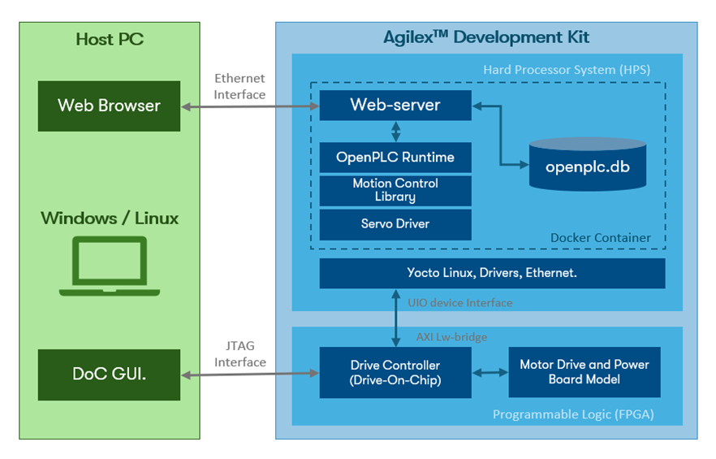{:style="display:block; margin-left:auto; margin-right:auto"}
<center>

**High-Level Block Diagram of the Drive-OnChip <br>
with PLC Design Example.**
</center>
<br>

The previous figure shows that the PLC Runtime and webserver run in a Docker
container on the HPS Operating System (OS, Custom Linux). The Docker container
separates the applications from the operating system. The container includes
the runtime libraries and software utilities required by the PLC application
to run.
The connections to the operating system are the only interfaces needed for
the motor control and web interface to execute.

The Drive-On-Chip (DoC) Python GUI monitors the simulated motor axes.
The connection to the Drive-on-Chip IP in the FPGA is a JTAG interface
that bypasses the HPS.  The GUI provides a confirmation of the activity
of the motor axes independent of the software on the HPS.

## Pre-requisites

### Software Requirements to run

The following are required to be able to fully exercise the Agilex™
Development Kit:

* Host PC with
  * 8 GB of RAM. Less will be fine for only exercising the binaries, and not rebuilding.
  * Linux/Windows OS installed.
  * Serial terminal (for example GtkTerm or Minicom on Linux and TeraTerm or
    PuTTY on Windows).
  * Tool to write images for USB sticks or SD cards such as "DiskImager" or "Rufus".
  * Altera® Quartus® Prime Pro Edition Version 25.1/25.1.1 Programmer and Tools.
  * To run the GUI:
    * Python 3.10.5
    * Pip 22.2.2
    * Python libraries: Pyside6 (6.3.2), pyqtgraph (0.13.1), numpy (1.23.2),
      Python Standard Libraries: traceback, sys, re, math, struct, subprocess,
      os, time, threading.

### Software Requirements to build

=== "Agilex™ 5"

    * Linux OS installed.
    * 62 GB free storage (~2GB for Quartus® Build and ~60GB for YOCTO/KAS build).
    * 350 MB for Docker Container Cross-Compilation.
    * Python/PIP/KAS for Yocto Build (or a suitable container).
    * Docker Engine Version 26.0 or later with Buildx support for ARM64.
    * Full Altera® Quartus® Prime Pro Edition Version 25.1 
    * FPGA NiosV/g Open-Source Tools 25.1 (installed with Quartus® Prime).
    * Altera® Quartus® Agilex™ 5 Support.
    * MATLAB 2021b with Simulink (Optional).
    * DSP Builder for Altera® FPGAs Pro Edition v25.1 (Optional).

=== "Agilex™ 3"

    * Linux OS installed.
    * 62 GB free storage (~2GB for Quartus® Build and ~60GB for YOCTO/KAS build).
    * 350 MB for Docker Container Cross-Compilation.
    * Python/PIP/KAS for Yocto Build (or a suitable container).
    * Docker Engine Version 26.0 or later with Buildx support for ARM64.
    * Full Altera® Quartus® Prime Pro Edition Version 25.1.1
    * FPGA NiosV/g Open-Source Tools 25.1.1 (installed with Quartus® Prime).
    * Altera® Quartus® Agilex™ 3 Support.
    * MATLAB 2021b with Simulink (Optional).
    * DSP Builder for Altera® FPGAs Pro Edition v25.1.1 (Optional).

### Hardware Requirements

=== "Agilex™ 5"

    * Altera® Agilex™; 5 FPGA E-Series 065B Modular Development Kit,
    ordering code MK-A5E065BB32AES1. Refer to
    [Agilex™ 5 FPGA E-Series 065B Modular Development Kit](https://www.intel.com/content/www/us/en/products/details/fpga/development-kits/agilex/a5e065b-modular.html)
    for more information about the development kit.
    * Power supply.
    * 2 x Micro USB Cable.
    * USB cable (USB A to micro USB) – JTAG connector.
    * USB cable (USB A to micro USB) – Serial console.
    * Network cables.
    * Router (including power supply).
    * Micro SD card and USB card writer.

=== "Agilex™ 3"

    * Agilex™ 3 FPGA and SoC C-Series Development Kit,
    ordering code DK-A3W135BM16AEA Refer to
    [Agilex™ 3 FPGA C-Series Development Kit](https://www.intel.com/content/www/us/en/products/details/fpga/development-kits/agilex/a3y135b.html)
    for more information about the development kit.
    * USB-C Power supply (27E to 54W).
    * USB cable (USB A to USB C) – JTAG connector.
    * USB cable (USB A to micro USB) – Serial console.
    * Network cables.
    * Router (including power supply).
    * Micro SD card and USB card writer.

<br>

=== "Agilex™ 5"
    {:style="display:block; margin-left:auto; margin-right:auto"}
    <center>

    **Agilex™ 5 FPGA E-Series 065B Modular Development Kit.**
    </center>
=== "Agilex™ 3"
    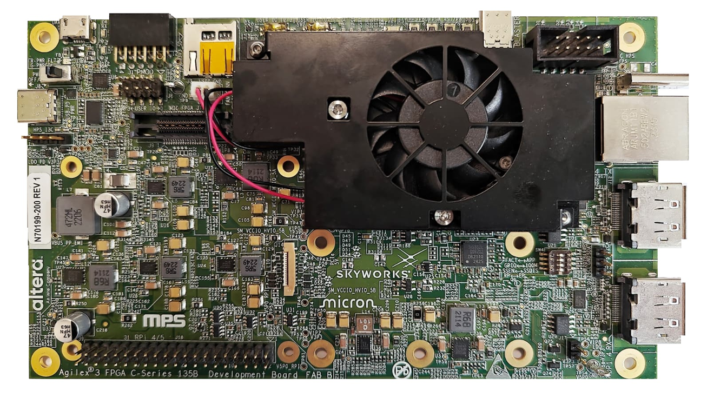{:style="display:block; margin-left:auto; margin-right:auto"}
    <center>

    **Agilex™ 3 FPGA and SoC C-Series Development Kit.**
    </center>

<br>

#### Sources

The sources listed in this table are the most current and highly recommended
for Quartus® builds. Users are advised to utilize the updated versions
of these building blocks in production environments. Please note that this
is a sample design and is not suitable for production or final deployment.

<br>

<center>

**Example Design Source Repositories.**

=== "Agilex™ 5"
    |Component |Location |Branch |
    |-|-|-|
    |Assets Release Tag|[https://github.com/altera-fpga/agilex-ed-drive-on-chip/releases/tag/rel-plc-25.1](https://github.com/altera-fpga/agilex-ed-drive-on-chip/releases/tag/rel-plc-25.1)| rel-plc-25.1|
    |Drive-On-Chip Variants|[https://github.com/altera-fpga/agilex-ed-drive-on-chip](https://github.com/altera-fpga/agilex-ed-drive-on-chip)|rel/25.1|
    |Modular Design Toolkit|[https://github.com/altera-fpga/modular-design-toolkit](https://github.com/altera-fpga/modular-design-toolkit)|rel/25.1|
    |Altera FPGA PLCopen and RTMotion|[https://github.com/altera-fpga/altera-openplc](https://github.com/altera-fpga/altera-openplc)|main|
    |Linux|[https://github.com/altera-opensource/linux-socfpga](https://github.com/altera-opensource/linux-socfpga)|socfpga-6.12.11-lts|
    |Arm Trusted Firmware|[https://github.com/ARM-software/arm-trusted-firmware](https://github.com/ARM-software/arm-trusted-firmware)|socfpga_v2.12.0|
    |U-Boot|[https://github.com/altera-opensource/u-boot-socfpga](https://github.com/altera-opensource/u-boot-socfpga)|v2025.01|
    |Yocto Project: poky|[https://git.yoctoproject.org/poky](https://git.yoctoproject.org/poky)|scarthgap|
    |Yocto Project: meta-intel-fpga|[https://git.yoctoproject.org/meta-intel-fpga](https://git.yoctoproject.org/meta-intel-fpga)|scarthgap|

=== "Agilex™ 3"
    |Component |Location |Branch |
    |-|-|-|
    |Assets Release Tag|[https://github.com/altera-fpga/agilex-ed-drive-on-chip/releases/tag/rel-plc-25.1.1](https://github.com/altera-fpga/agilex-ed-drive-on-chip/releases/tag/rel-plc-25.1.1)| rel-plc-25.1.1|
    |Drive-On-Chip Variants|[https://github.com/altera-fpga/agilex-ed-drive-on-chip](https://github.com/altera-fpga/agilex-ed-drive-on-chip)|main|
    |Modular Design Toolkit|[https://github.com/altera-fpga/modular-design-toolkit](https://github.com/altera-fpga/modular-design-toolkit)|main|
    |Altera FPGA PLCopen and RTMotion|[https://github.com/altera-fpga/altera-openplc](https://github.com/altera-fpga/altera-openplc)|main|
    |Linux|[https://github.com/altera-opensource/linux-socfpga](https://github.com/altera-opensource/linux-socfpga)|socfpga-6.12.19-lts|
    |Arm Trusted Firmware|[https://github.com/ARM-software/arm-trusted-firmware](https://github.com/ARM-software/arm-trusted-firmware)|socfpga_v2.12.1|
    |U-Boot|[https://github.com/altera-opensource/u-boot-socfpga](https://github.com/altera-opensource/u-boot-socfpga)|v2025.04|
    |Yocto Project: poky|[https://git.yoctoproject.org/poky](https://git.yoctoproject.org/poky)|scarthgap|
    |Yocto Project: meta-intel-fpga|[https://git.yoctoproject.org/meta-intel-fpga](https://git.yoctoproject.org/meta-intel-fpga)|scarthgap|

</center>

## Getting Started - run with pre-build binaries

Follow the instructions provided in this section to run this example design in
Agilex™ Development Kit.

### **Download the minimum Pre-built Binaries**

<center>

**Binaries**

=== "Agilex™ 5"
    Download the Agilex™ 5 Modular Development Kit binaries that are located at:

    | Boot Source            | Link |
    | ---------------------- | ---- |
    | SD Card Image          | [wic.gz](https://github.com/altera-fpga/agilex-ed-drive-on-chip/releases/download/rel-plc-25.1/core-image-minimal-agilex5_mk_a5e065bb32aes1.rootfs.wic.gz), [wic.bmap](https://github.com/altera-fpga/agilex-ed-drive-on-chip/releases/download/rel-plc-25.1/core-image-minimal-agilex5_mk_a5e065bb32aes1.rootfs.wic.bmap) |
    | QSPI                   | [top.hps.jic](https://github.com/altera-fpga/agilex-ed-drive-on-chip/releases/download/rel-plc-25.1/top.hps.jic) |
    | Structured Language (ST) program | [agilex_doc.st](https://github.com/altera-fpga/agilex-ed-drive-on-chip/releases/download/rel-plc-25.1/agilex_doc.st) |
    | GUI                    | [doc-gui.zip](https://github.com/altera-fpga/agilex-ed-drive-on-chip/releases/download/rel-plc-25.1/doc-gui_1.0.0.zip) |

=== "Agilex™ 3"
    Download the Agilex™ 3 Development Kit binaries that are located at:

    | Boot Source            | Link |
    | ---------------------- | ---- |
    | SD Card Image          | [agx3-wic.gz](https://github.com/altera-fpga/agilex-ed-drive-on-chip/releases/download/rel-plc-25.1.1/core-image-minimal-agilex3.rootfs.wic.gz), [agx3-wic.bmap](https://github.com/altera-fpga/agilex-ed-drive-on-chip/releases/download/rel-plc-25.1.1/core-image-minimal-agilex3.rootfs.wic.bmap) |
    | QSPI                   | [agx3-top.hps.jic](https://github.com/altera-fpga/agilex-ed-drive-on-chip/releases/download/rel-plc-25.1.1/agx3-top.hps.jic) |
    | Structured Language (ST) program | [agx3-agilex_doc.st](https://github.com/altera-fpga/agilex-ed-drive-on-chip/releases/download/rel-plc-25.1.1/agilex_doc.st) |
    | GUI                    | [agx3-doc-gui.zip](https://github.com/altera-fpga/agilex-ed-drive-on-chip/releases/download/rel-plc-25.1.1/doc-gui_1.0.0.zip) |

</center>

### Setting Up your Development Board

=== "Agilex™ 5"
    --8<--  "./docs/embedded-designs/agilex-5/e-series/modular/drive-on-chip/common/board-setup.md"
=== "Agilex™ 3"
    --8<-- "./docs/embedded-designs/agilex-5/e-series/modular/drive-on-chip/common/board-setup-agx3.md"


### SD Card Image Flashing

* Download SD card image (`.wic` or `.wic.gz`) from the prebuilt binary links above.
* Write the `.wic` or `.wic.gz` SD card image to the micro SD card using one of the options below.
* Turn off the board and insert the SD card in the micro SD card slot on the SOM board.

#### [USBImager](https://bztsrc.gitlab.io/usbimager/) (Windows, Linux, Mac OS)

* Open [USBImager](https://bztsrc.gitlab.io/usbimager/) and click the `...` button in the top right.
* Select the image you downloaded earlier and click `Open`.
* Next select the device associated with your SD card reader from the drop-down list.
* Click `Write` to start flashing.

#### [bmaptool](https://github.com/yoctoproject/bmaptool) (Linux)

!!! note
    You will require a `.wic.bmap` file in addition to the `.wic` or `.wic.gz` in order to use `bmaptool`. If this is not available use `USBImager`.

On many distributions `bmap-tools` can be installed using your distros package manager (e.g. `sudo apt install bmap-tools`).

For more information see the [Yocto documentation](https://docs.yoctoproject.org/dev-manual/bmaptool.html) for `bmaptool`.

First of all determine the device `logical name` associated with the SD card on your host:

```
sudo lshw -class disk
```

Use `bmaptool` to copy the image to the SD card. Make sure the `wic` image file and `bmap` file are in the same directory.

```
sudo bmaptool copy ${IMAGE} ${DEVICE}
```

For example:

```
sudo bmaptool copy core-image-minimal-agilex5_mk_a5e065bb32aes1.wic.gz /dev/sda
```


### **Expand the SD card Root File System Partition.**

The Root File System partition (`root`, Ext4) may require resizing to
accommodate larger files, such as example design applications. Users can select
their preferred tool to perform this task; however, the following steps
provide instructions using the `Disks` utility (based on `e2fsprogs`):

* Insert the SD card image in the Linux machine that has the `Disks` utility
  installed. You should be able to see the available storage devices.
* Select the `root` partition of the SD card and click the "gear" icon as shown in the
  figure below to display the menu. Navigate to `Resize...`

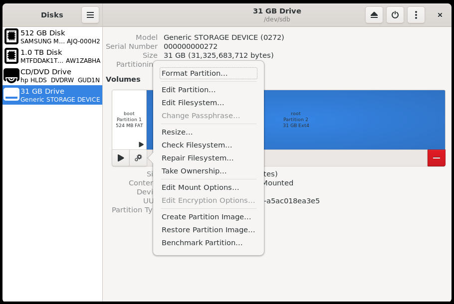{:style="display:block; margin-left:auto; margin-right:auto"}
<center>

**Select the "root" partition for resizing.**
</center>

* Use the slider to increment the partition storage capacity (the maximum is
  recommended). Then, click the `Resize` button.

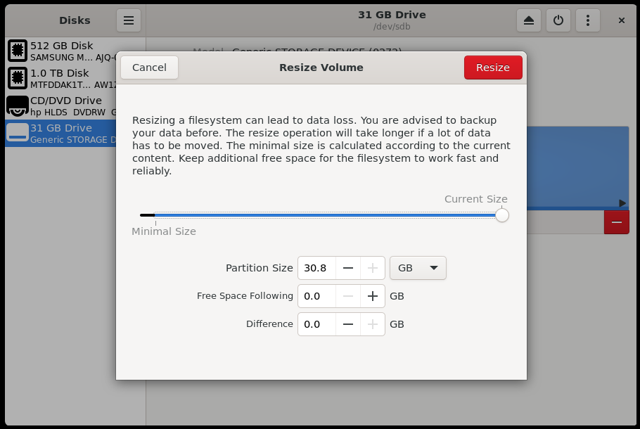{:style="display:block; margin-left:auto; margin-right:auto"}
<center>

**Resize the root partition to the maximum.**
</center>

* Eject the disk safely.
<br>


### Flash The QSPI

=== "Agilex™ 5"
    --8<--  "./docs/embedded-designs/agilex-5/e-series/modular/drive-on-chip/common/prog-qspi.md"
=== "Agilex™ 3"
    --8<-- "./docs/embedded-designs/agilex-5/e-series/modular/drive-on-chip/common/prog-qspi-agx3.md"

### **Run the OpenPLC Docker Container.**

#### **Board and PC setup**

Use the following diagram to connect the required equipment to run this example
design.

<br>
=== "Agilex™ 5"
    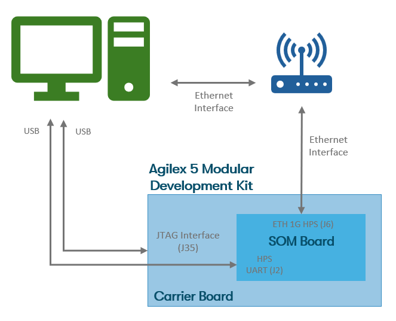{:style="display:block; margin-left:auto; margin-right:auto;"}

    <center>

    **Development Kit and PC connection diagram**
    </center>
    <br>

    * Power up the board and setup the serial terminal emulator (minicom, putty, etc):
    * Select the correct `COMx` port. From the HPS serial UART, select the third
    COM port (out of four).
    * **Serial Port configuration**:
        * Baud rate: 115200, Data bits: 8,
        Stop bits: 1, CRC: disabled, Hardware flow control: disabled
    * Connect your terminal emulator.

=== "Agilex™ 3"
    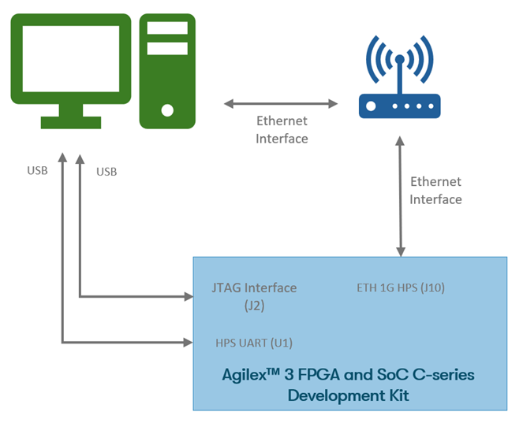{:style="display:block; margin-left:auto; margin-right:auto;"}

    <center>

    **Development Kit and PC connection diagram**
    </center>
    <br>

    * Power up the board and setup the serial terminal emulator (minicom, putty, etc):
    * Select the correct `COMx` port. From the HPS serial UART.
    * **Serial Port configuration**:
        * Baud rate: 115200, Data bits: 8,
        Stop bits: 1, CRC: disabled, Hardware flow control: disabled
    * Connect your terminal emulator.

<r> To continue, select method a) or method b) to deploy a Docker container image </r>

#### **<r>a)</r> Boot Linux, create a Docker image using the Dockerfile**

* In the Development Kit, wait for Linux to boot, and clone the
  "altera-openplc" repository:

```bash
    git clone https://github.com/altera-fpga/altera-openplc.git
    cd altera-openplc
```

* Build the Docker Image (this can take several minutes):

```bash
    docker build -t altera-plc:arm64 .
```

#### **<r>b)</r> Boot Linux, copy and load a cross-compiled Docker container image**

* Follow the instructions provided in [Altera OpenPLC Docker Container Image Cross-compilation.](https://github.com/altera-fpga/altera-openplc#build-a-docker-image)
  to get a cross-compiled Docker image file (name it `altera-plc.tar.gz`)

* Wait for Linux to boot and query the Development Kit IP address:

``` bash
    ifconfig
```

* The serial terminal should show the following:

<br>

=== "Agilex™ 5"
    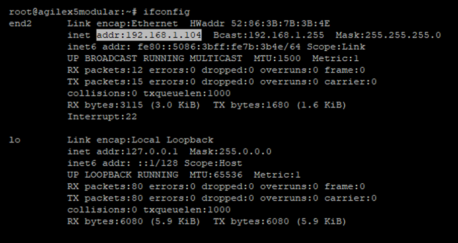{:style="display:block; margin-left:auto; margin-right:auto;"}
    <center>

    **Agilex™ 5 Modular Development Kit IP Address.**
    </center>

=== "Agilex™ 3"
    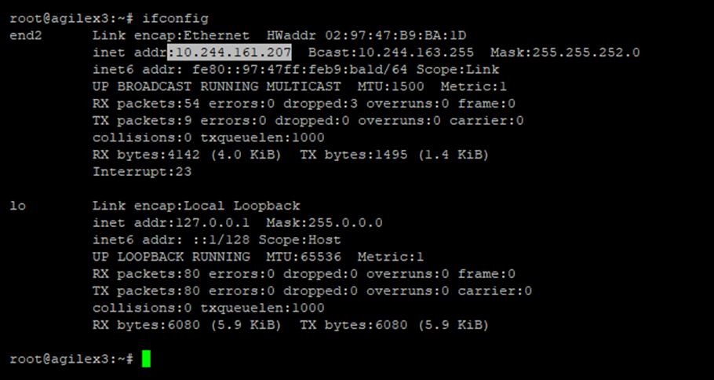{:style="display:block; margin-left:auto; margin-right:auto;"}
    <center>

    **Agilex™ 3 C-series Development Kit IP Address.**
    </center>
<br>

* Take a note of the board's IP address or `<dk-ip-address>`

* Copy the PLC docker previously generated Docker container image to the board,
  preferably to the `/home/root` directory in the RootFile System. The
  suggested method to do it is using `scp` or `sftp` commands to transfer
  the file from your host machine to the development kit.

```bash
    scp -rp altera-plc.tar.gz root@<dk-ip-address>:/home/root
```

* Load the Image and deploy the PLC Container. To load the Docker Image use the
  following commands (in the Development Kit):

```bash
    docker ps -a
    docker load < altera-plc.tar.gz
```

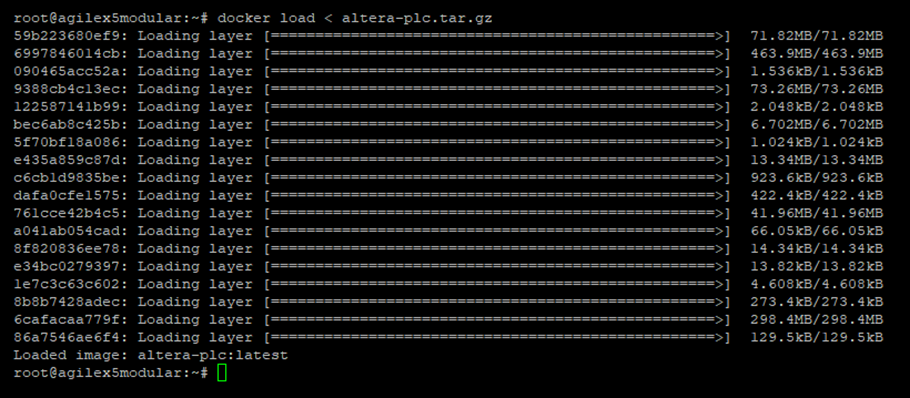{:style="display:block; margin-left:auto; margin-right:auto;"}
<center>

**Load the PLC Docker image.**
</center>
<br>

#### **Deploy the PLC Container.**

* Verify and deploy the container.

```bash
    docker image ls
    docker run -it --rm --device /dev/uio0 --network host altera-plc:arm64
```

* The following image shows the IP address and port to interface with the
  PLC web-server.

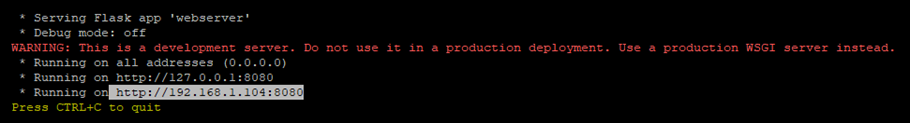{:style="display:block; margin-left:auto; margin-right:auto;"}
<center>

**"docker run" command output.**
</center>
<br>

### **Launching the PLC Webserver and Running an ST file.**

* In a host machine within the same network as the development kit, launch
  a web browser with the address that was shown in the console window
  (usually `http://<dk-ip-address>:8080`) and login. For example in Firefox:

!!! note "Login into the OpenPLC webserver with:"

    username: openplc <br>
    password: openplc

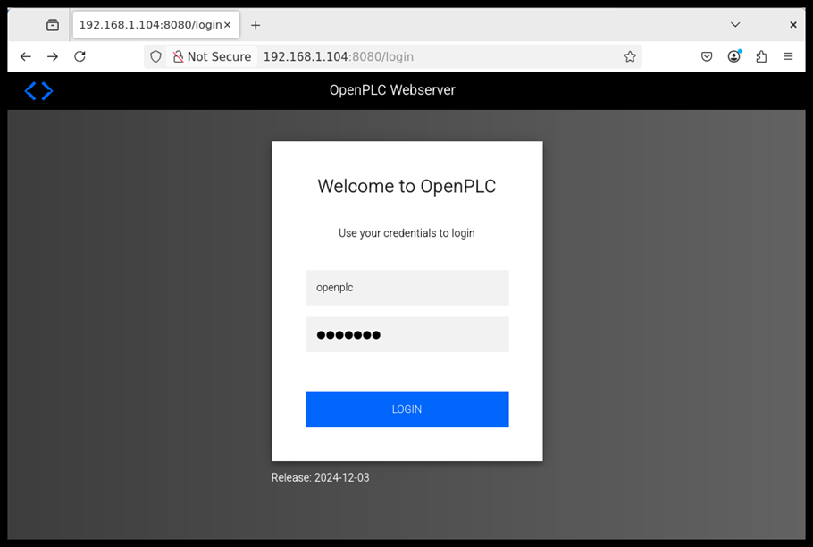{:style="display:block; margin-left:auto; margin-right:auto;"}
<center>

**OpenPLC Webserver interface login screen.**
</center>
<br>

* Load the `Agilex Drive On Chip` OpenPLC driver. In the OpenPLC Webserver, navigate
  to `Hardware` and select `Agilex Drive-On-Chip` OpenPLC Hardware Layer. Press
  the `Save Changes` button and let let the compilation finish (it can take a
  few minutes). When done, press the `Go to Dashboard` button at the bottom
  of the page.

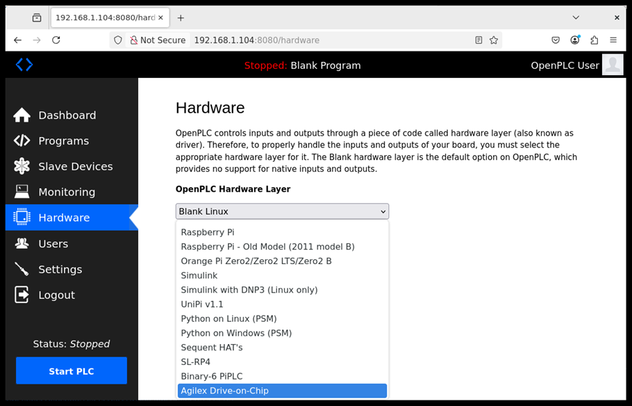{:style="display:block; margin-left:auto; margin-right:auto;"}
<center>

**Agilex™ Drive-On-Chip PLC driver selection.**
</center>
<br>

* In the OpenPLC webserver, navigate to `Programs` tab in the left panel, then
  press `Browse` and load `agilex_doc.st` file (see
  [Binaries](#download-the-minimum-pre-built-binaries)). Press the button
  `Upload Program`. Give the program a name, e.g. "doc-agilex" and press
  `Upload Program` button. Let the compilation finish (this can take a few minutes).

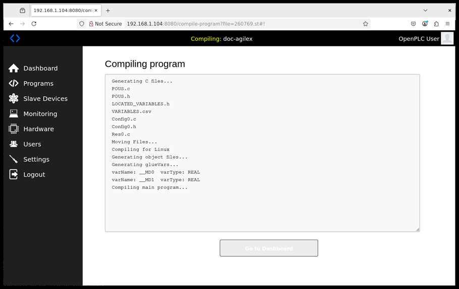{:style="display:block; margin-left:auto; margin-right:auto;"}
<center>

**Structured Text (ST) PLC program load and compile.**
</center>
<br>

* Press the `Go to Dashboard` button to select the `Dashboard` tab and execute
  the `.st` program with the button `Start PLC` in the left panel. The PLC
  Controller will start to run and control the Drive On Chip system in the FPGA fabric.

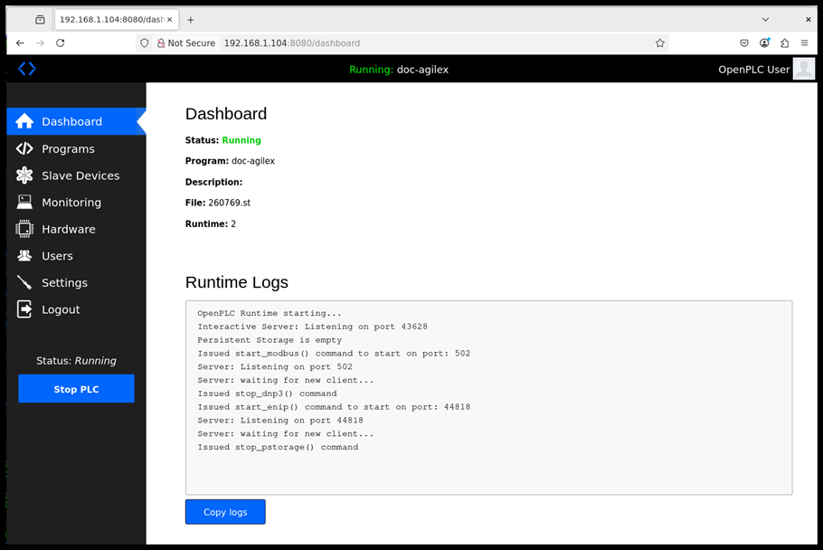{:style="display:block; margin-left:auto; margin-right:auto;"}
<center>

**Start the PLC-based Drive-On-Chip motion controller.**
</center>
<br>

* In the OpenPLC webserver, in the left panel, navigate to the `Monitoring` tab.
  This will show the dual axes of the "Drive On Chip" being controlled by
  OpenPLC and the PLCopen-based RTMotion Library according to the `.st`
  (structured text) program loaded previously.

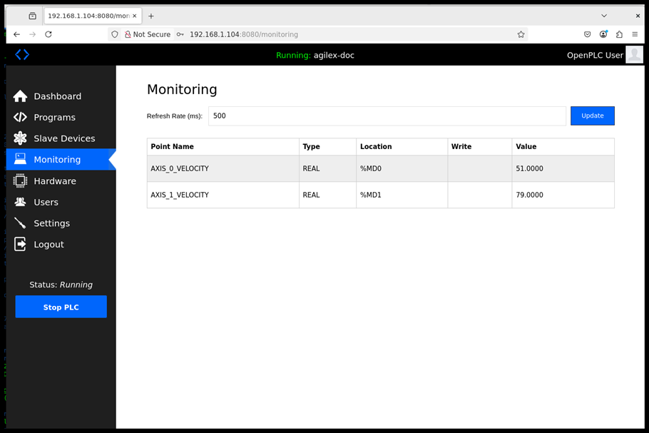{:style="display:block; margin-left:auto; margin-right:auto;"}
<center>

**OpenPLC Webserver Monitoring tab for Axis Control Visualization.**
</center>
<br>

!!! note "Create and run your own program: "

    You can create your own `.st` file and load it in the OpenPLC
    Programmable Logic Controller to modify the speed and/or position of
    any of the two drives in the FPGA systems (Dual Axis Drive-On-Chip)

### **Monitoring the DoC through JTAG interface.**

The user can visualize the "Drive On Chip" (DoC) behavior using an independent JTAG
channel. This channel shows the axes speed/position that is being
requested by the PLC Controller. The "Drive On Chip" system exposes these
(and other) values through JTAG chain that can be accessed with a GUI running
in your local host. To visualize the DoC drive control characteristics follow
these steps:

* Keep the Altera® FPGA download cable and JTAG connection to the board.

* Unzip the GUI source code, see [Binaries](#download-the-minimum-pre-built-binaries):

```bash
unzip doc-gui_1.0.0.zip
cd <download>/doc-gui_1.0.0
```

* Open a terminal, install the requirements (if needed) and run:

```bash
pip install -r requirements.txt
python __main__.py
```

* Select the right JTAG master from the menu (if it is not selected automatically).
  Usually AE5(C0…0)... (or similar)

<br>

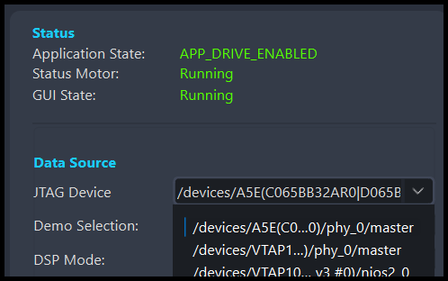{:style="display:block; margin-left:auto; margin-right:auto"}
<center>

**Select the Agilex™ device in
the JTAG Device dropdown menu.**
</center>
<br>

* When the GUI is running, change to the "Axis" tab, in the left panel. The tab
  shows the speed values of both Axis changing as it is shown in the OpenPLC webserver.
  To see more details, press the `Start Trace` button in the right-bottom of
  the GUI to display speed and position traces.

<br>

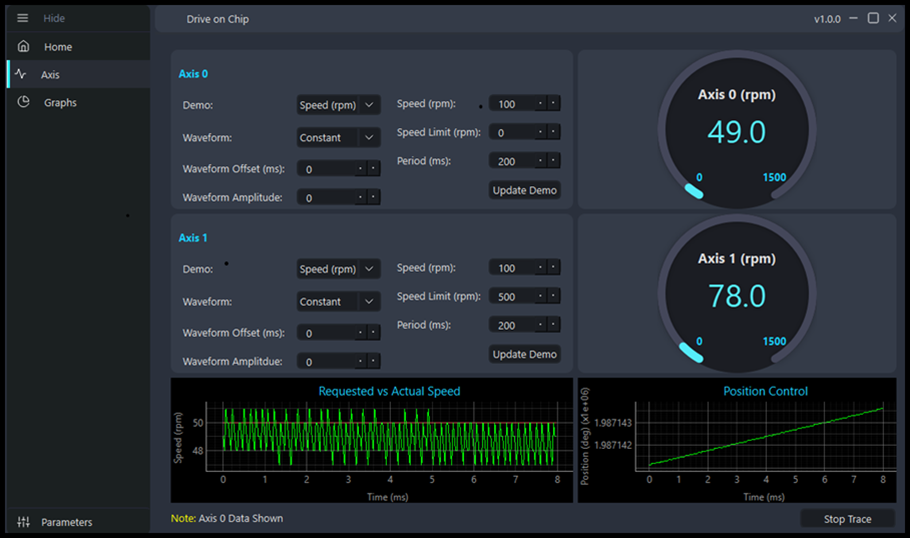{:style="display:block; margin-left:auto; margin-right:auto;"}
<center>

**Drive On Chip GUI for visualization.**
</center>
<br>

!!! warning

    Do not change speed or position values in the Python GUI. The drives are
    being controlled by the PLC and the GUI should be only used for
    visualization purposes.

## Recommended User Flows

With the available resources, you can build, compile, modify, and execute this
design example. Additionally, there are two extra user flows that you can explore.

* User Flow 1: [Getting Started - Running with pre-build binaries.](#getting-started-run-with-pre-build-binaries)
* User Flow 2: Running the example design using the QAR and KAS
* User Flow 3: Running the example design by create/build Modular Design
  Toolkit (MDT) and KAS.

<center>

**More resources.**

=== "Agilex™ 5"
    | Source | Link |
    | ---------------------------------- | ---- |
    | Pre-created QAR file               | [DOC_PLC_TANDEM_MOTORSIM_AGILEX5.qar](https://github.com/altera-fpga/agilex-ed-drive-on-chip/releases/download/rel-plc-25.1/DOC_PLC_TANDEM_MOTORSIM_AGILEX5.qar) |
    | JIC/RBF files                      | [top.hps.jic](https://github.com/altera-fpga/agilex-ed-drive-on-chip/releases/download/rel-plc-25.1/top.hps.jic) <br> [top.core.rbf](https://github.com/altera-fpga/agilex-ed-drive-on-chip/releases/download/rel-plc-25.1/top.core.rbf) |
    | u-boot-spl-dtb.hex                 | [u-boot-spl-dtb.hex](https://github.com/altera-fpga/agilex-ed-drive-on-chip/releases/download/rel-plc-25.1/u-boot-spl-dtb.hex) |

=== "Agilex™ 3"
    | Source | Link |
    | ---------------------------------- | ---- |
    | Pre-created QAR file               | [DOC_PLC_TANDEM_MOTORSIM_AGILEX3.qar](https://github.com/altera-fpga/agilex-ed-drive-on-chip/releases/download/rel-plc-25.1.1/DOC_PLC_TANDEM_MOTORSIM_AGILEX3.qar) |
    | JIC/RBF files                      | [agx3-top.hps.jic](https://github.com/altera-fpga/agilex-ed-drive-on-chip/releases/download/rel-plc-25.1.1/agx3-top.hps.jic) <br> [agx3-top.core.rbf](https://github.com/altera-fpga/agilex-ed-drive-on-chip/releases/download/rel-plc-25.1.1/agx3-top.core.rbf) |
    | u-boot-spl-dtb.hex                 | [agx3-u-boot-spl-dtb.hex](https://github.com/altera-fpga/agilex-ed-drive-on-chip/releases/download/rel-plc-25.1.1/agx3-u-boot-spl-dtb.hex) |

</center>

<style>
r { color: Red; font-weight: bold;}
o { color: Orange; font-weight: bold;}
g { color: Green; font-weight: bold;}
y { color: #CCCC00; font-weight: bold;}
</style>

<center>

**Recommended User Flows.**

 |User Flow     |Description| User flow 1 | User flow 2 | User flow 3 |
 |--------------|---------------------------------------------------------------------------------------------------------- |:------------:|:------------:|:------------:|
 |Pre-requisites| [Software Requirements to run.](#software-requirements-to-run)                                            |<g>&check;</g>|<g>&check;</g>|<g>&check;</g>|
 |              | [Software Requirements to build.](#software-requirements-to-build)                                        |<r>&cross;</r>|<g>&check;</g>|<g>&check;</g>|
 |              | [Hardware Requirements.](#hardware-requirements)                                                          |<g>&check;</g>|<g>&check;</g>|<g>&check;</g>|
 |              | [Download the minimum Pre-built Binaries.](#download-the-minimum-pre-built-binaries)                      |<g>&check;</g>|<r>&cross;</r>|<r>&cross;</r>|
 |HW-Compilation| [Compile pre-created QAR with Quartus®.](./doc-plc/other-user-flow.md#compiling-the-project-using-a-mdt-qar-file)     |<r>&cross;</r>|<g>&check;</g>|<r>&cross;</r>|
 |              | [Generating and Building the NiosV/g BSP for the Drive-On-Chip Application.](./doc-plc/other-user-flow.md#compiling-and-building-the-niosv-application-and-bsp)     |<r>&cross;</r>|<g>&check;</g>|<r>&cross;</r>|
 |              | [Creating and Building the Design based on Modular Design Toolkit (MDT).](https://github.com/altera-fpga/agilex-ed-drive-on-chip/blob/main/HPS_NIOSVg_DoC_dual_axis/Readme.md)                                 |<r>&cross;</r>|<r>&cross;</r>|<g>&check;</g>|
 |              | [Creating the QSPI Flash and SD card configuration bitstreams for the board (JIC/RBF).](./doc-plc/other-user-flow.md#creating-the-qspi-flash-and-sd-card-configuration-bitstreams-for-the-board) <br> <r>Warning!</r>: this procedure requires a `u-boot-spl-dtb.hex` file, which is generated in the step below. |<r>&cross;</r>|<g>&check;</g>|<g>&check;</g>|
 |SW-Compilation| [Create SD card image (.wic) using YOCTO/KAS](https://github.com/altera-fpga/agilex-ed-drive-on-chip/blob/main/sw/README.md) <br> <r>NOTE</r>: use <g>**KAS_MACHINE=agilex5_mk_a5e065bb32aes1**</g> or <g>**KAS_MACHINE=agilex3**</g> <br> and <g>**kas_dual_axis.yml**</g> configuration                                                                                                              |<r>&cross;</r>|<g>&check;</g>|<g>&check;</g>|
 |              | [Altera OpenPLC Docker Container Image Cross-compilation.](https://github.com/altera-fpga/altera-openplc#build-a-docker-image) <y> Optional </y>                              |<r>&cross;</r>|<y>&#42;</y>  |<y>&#42;</y>|
 |Programming   | [Setting Up your Development Board.](#setting-up-your-development-board)                                  |<g>&check;</g>|<g>&check;</g>|<g>&check;</g>|
 |              | [Burn the SD card image.](#burn-the-sd-card-image)                                                        |<g>&check;</g>|<g>&check;</g>|<g>&check;</g>|
 |              | [Expand the SD card Root File System Partition.](#expand-the-sd-card-root-file-system-partition)          |<g>&check;</g>|<g>&check;</g>|<g>&check;</g>|
 |              | [Program the QSPI Flash Memory.](#program-the-qspi-flash-memory)                                          |<g>&check;</g>|<g>&check;</g>|<g>&check;</g>|
 |Testing       | [Run the OpenPLC Docker Container.](#run-the-openplc-docker-container)                                    |<g>&check;</g>|<g>&check;</g>|<g>&check;</g>|
 |              | [Launching the PLC Webserver and Running an ST file.](#launching-the-plc-webserver-and-running-an-st-file)|<g>&check;</g>|<g>&check;</g>|<g>&check;</g>|
 |              | [Monitoring the DoC through JTAG interface.](#monitoring-the-doc-through-jtag-interface)                  |<g>&check;</g>|<g>&check;</g>|<g>&check;</g>|

</center>

## Example Design Documentation

Drive-On-Chip with PLC Design Example for Agilex™ Devices

* [Design Example Features.](./doc-plc/features-plc.md)
* [FPGA Hardware Functional Description.](./doc-plc/hw-funct-descr.md)
* [Software Stack Functional Description.](./doc-plc/sw-funct-descr.md)
* [Drive-on-Chip with PLC Design Recommendations and Disclaimers.](./doc-plc/plc-design-recomendations.md)
* [Acronyms and Terminology.](./doc-plc/glossary.md)

## Other Drive-On-Chip Documentation and References

### Example Designs

* [Drive-On-Chip with Functional Safety System Example Design for Agilex™ 5 Devices](https://altera-fpga.github.io/rel-25.1/embedded-designs/agilex-5/e-series/modular/drive-on-chip/doc-funct-safety).
* [ROS Consolidated Robot Controller Example Design for Agilex™ 5 Devices](https://altera-fpga.github.io/rel-25.1/embedded-designs/agilex-5/e-series/modular/drive-on-chip/doc-crc).
* [Agilex™ 5 FPGA - Drive-On-Chip Design Example](https://www.intel.com/content/www/us/en/design-example/825930/agilex-5-fpga-drive-on-chip-design-example.html).
* [Altera® Agilex™ 7 FPGA – Drive-On-Chip for Altera® Agilex™ 7 Devices Design Example](https://www.intel.com/content/www/us/en/design-example/780360/intel-agilex-7-fpga-drive-on-chip-for-intel-agilex-7-devices-design-example.html).
* [Agilex™ 7 FPGA – Safe Drive-On-Chip Design Example](https://www.intel.com/content/www/us/en/design-example/825944/agilex-7-fpga-safe-drive-on-chip-design-example.html).
* [Agilex™ 5 E-Series Modular Development Kit GSRD User Guide (25.1)](https://altera-fpga.github.io/rel-25.1/embedded-designs/agilex-5/e-series/modular/gsrd/ug-gsrd-agx5e-modular/).
* [Agilex™ 5 E-Series Modular Development Kit GHRD Linux Boot Examples](https://altera-fpga.github.io/rel-25.1/embedded-designs/agilex-5/e-series/modular/boot-examples/ug-linux-boot-agx5e-modular/).

### Application Notes

* [AN 1000: Drive-on-Chip Design Example: Agilex™ 5 Devices](https://www.intel.com/content/www/us/en/docs/programmable/826207/24-1/about-the-drive-on-chip-design-example.html).
* [AN 999: Drive-on-Chip with Functional Safety Design Example: Agilex™ 7 Devices](https://www.intel.com/content/www/us/en/docs/programmable/823627/current/about-the-drive-on-chip-with-functional.html).
* [AN 994: Drive-on-Chip Design Example for Altera® Agilex™ 7 Devices](https://www.intel.com/content/www/us/en/docs/programmable/780361/23-1/about-the-drive-on-chip-design-example.html).
* [AN 773: Drive-On-Chip Design Example for Altera® MAX® 10 Devices](https://www.intel.com/content/www/us/en/docs/programmable/683072/current/about-the-drive-on-chip-design-example.html).
* [AN 669: Drive-On-Chip Design Example for Cyclone V Devices](https://www.intel.com/content/www/us/en/docs/programmable/683466/current/about-the-drive-on-chip-design-example.html).

### User Manuals

* [Hard Processor System Technical Reference Manual: Agilex™ 5 SoCs (25.1)](https://www.intel.com/content/www/us/en/docs/programmable/814346/25-1/hard-processor-system-technical-reference.html).
* [NiosV Processor for Altera® FPGA](https://www.intel.com/content/www/us/en/products/details/fpga/intellectual-property/processors-peripherals/niosv.html).
* [Tandem Motion-Power 48 V Board Reference Manual](https://www.intel.com/content/www/us/en/docs/programmable/683164/current/about-the-tandem-motion-power-48-v-board.html).
* [Agilex™ 5 FPGA E-Series 065B Modular Development Kit](https://www.intel.com/content/www/us/en/products/details/fpga/development-kits/agilex/a5e065b-modular.html).
* [Agilex™ 3 FPGA C-Series Development Kit](https://www.intel.com/content/www/us/en/products/details/fpga/development-kits/agilex/a3y135b.html).
* [Motor Control Designs with an Integrated FPGA Design Flow](https://www.intel.com/content/dam/www/programmable/us/en/pdfs/literature/wp/wp-01162-motor-control-toolflow.pdf).
* [Install Docker Engine](https://docs.docker.com/engine/install/).
* [Docker Build: Multi-Platform Builds](https://docs.docker.com/build/building/multi-platform/).

### External Sources

* [OpenPLC Runtime version 3](https://github.com/thiagoralves/OpenPLC_v3).
* [Ruckig: Instantaneous Motion Generation for Robots and Machines](https://github.com/pantor/ruckig).
* [PLCopen Motion Control Specification](https://plcopen.org/technical-activities/motion-control).

<br>

### Notices & Disclaimers

Altera® Corporation technologies may require enabled hardware, software or service
activation. No product or component can be absolutely secure. Performance varies
by use, configuration and other factors. Your costs and results may vary. You may
not use or facilitate the use of this document in connection with any infringement
or other legal analysis concerning Altera® products described herein. You
agree to grant Altera® Corporation a non-exclusive, royalty-free license to any
patent claim thereafter drafted which includes subject matter disclosed herein.
No license (express or implied, by estoppel or otherwise) to any intellectual
property rights is granted by this document, with the sole exception that you
may publish an unmodified copy. You may create software implementations based on
this document and in compliance with the foregoing that are intended to execute
on the Altera® or product(s) referenced in this document. No rights are granted
to create modifications or derivatives of this document. The products described
may contain design defects or errors known as errata which may cause the product
to deviate from published specifications. Current characterized errata are available
on request. Altera® disclaims all express and implied warranties, including without
limitation, the implied warranties of merchantability, fitness for a particular purpose,
and non-infringement, as well as any warranty arising from course of performance,
course of dealing, or usage in trade. You are responsible for safety of the overall
system, including compliance with applicable safety-related requirements or standards.
© Altera® Corporation. Altera®, the Altera logo, and other Altera® marks are trademarks
of Altera® Corporation. Other names and brands may be claimed as the property of
others.

OpenCL\* and the OpenCL\* logo are trademarks of Apple Inc. used by permission of
the Khronos Group™.


<br>
