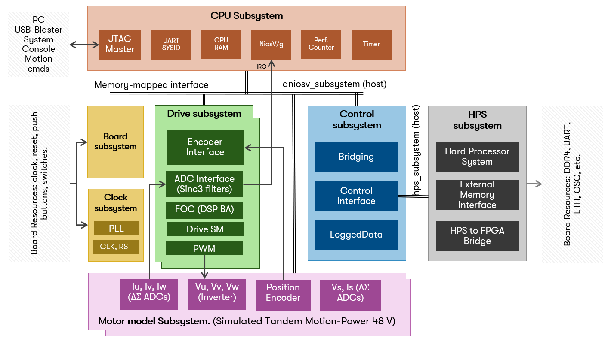
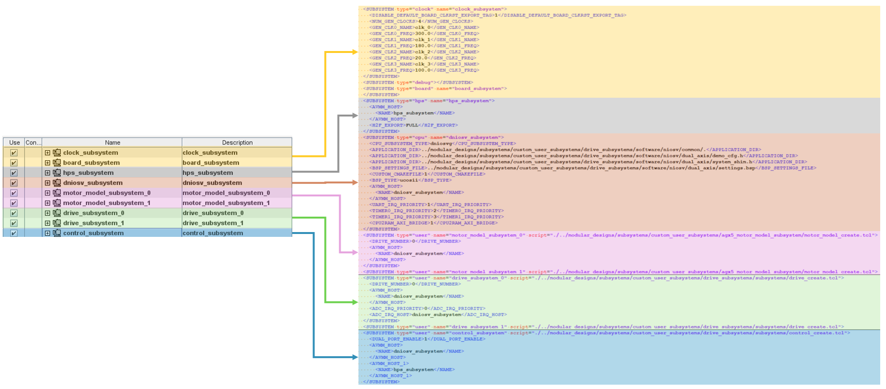
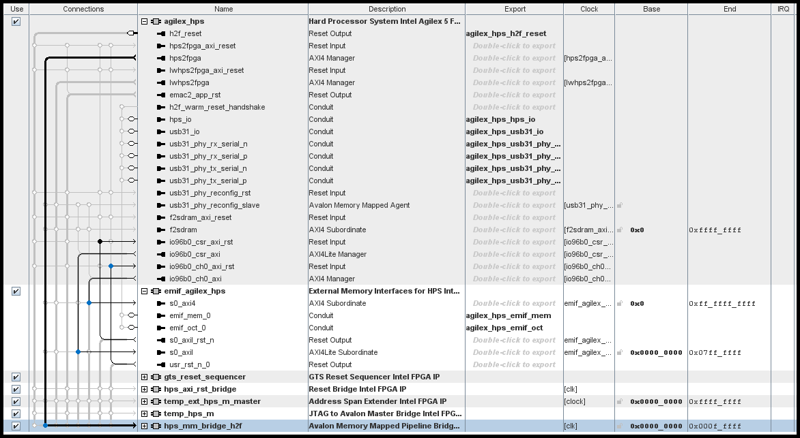
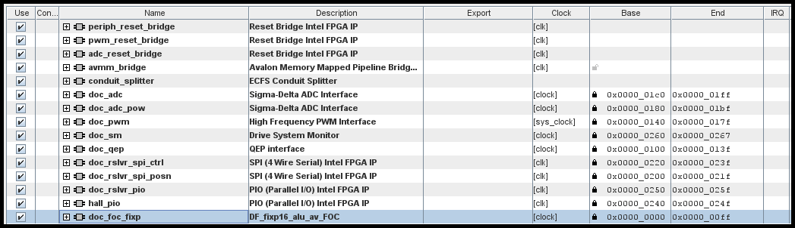
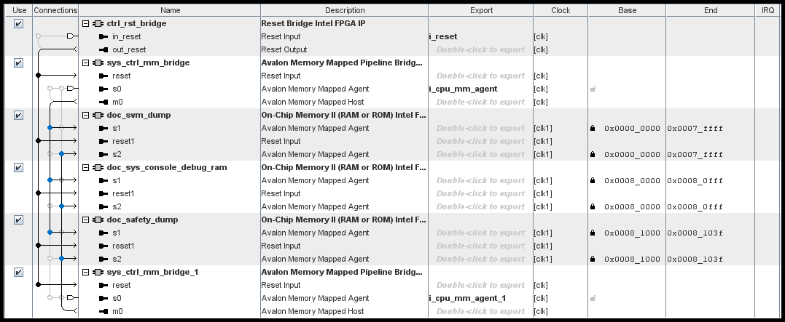

[Drive-On-Chip with Functional Safety System Example Design for Agilex™ 5 Devices]: https://altera-fpga.github.io/rel-25.1/embedded-designs/agilex-5/e-series/modular/drive-on-chip/doc-funct-safety
[Drive-On-Chip with PLC System Example Design for Agilex™ Devices]: https://altera-fpga.github.io/rel-25.1/embedded-designs/agilex-5/e-series/modular/drive-on-chip/doc-plc
[ROS Consolidated Robot Controller Example Design for Agilex™ 5 Devices]: https://altera-fpga.github.io/rel-25.1/embedded-designs/agilex-5/e-series/modular/drive-on-chip/doc-crc
[Agilex™ 5 FPGA - Drive-On-Chip Design Example]: https://www.intel.com/content/www/us/en/design-example/825930/agilex-5-fpga-drive-on-chip-design-example.html
[Intel® Agilex™ 7 FPGA – Drive-On-Chip for Intel® Agilex™ 7 Devices Design Example]: https://www.intel.com/content/www/us/en/design-example/780360/intel-agilex-7-fpga-drive-on-chip-for-intel-agilex-7-devices-design-example.html
[Agilex™ 7 FPGA – Safe Drive-On-Chip Design Example]: https://www.intel.com/content/www/us/en/design-example/825944/agilex-7-fpga-safe-drive-on-chip-design-example.html
[Agilex™ 5 E-Series Modular Development Kit GSRD User Guide (25.1)]: https://altera-fpga.github.io/rel-25.1/embedded-designs/agilex-5/e-series/modular/gsrd/ug-gsrd-agx5e-modular/
[Agilex™ 5 E-Series Modular Development Kit GHRD Linux Boot Examples]: https://altera-fpga.github.io/rel-25.1/embedded-designs/agilex-5/e-series/modular/boot-examples/ug-linux-boot-agx5e-modular/

[AN 1000: Drive-on-Chip Design Example: Agilex™ 5 Devices]: https://www.intel.com/content/www/us/en/docs/programmable/826207/24-1/about-the-drive-on-chip-design-example.html
[AN 999: Drive-on-Chip with Functional Safety Design Example: Agilex™ 7 Devices]: https://www.intel.com/content/www/us/en/docs/programmable/823627/current/about-the-drive-on-chip-with-functional.html
[AN 994: Drive-on-Chip Design Example for Intel® Agilex™ 7 Devices]: https://www.intel.com/content/www/us/en/docs/programmable/780361/23-1/about-the-drive-on-chip-design-example.html
[AN 773: Drive-On-Chip Design Example for Intel® MAX® 10 Devices]: https://www.intel.com/content/www/us/en/docs/programmable/683072/current/about-the-drive-on-chip-design-example.html
[AN 669: Drive-On-Chip Design Example for Cyclone V Devices]: https://www.intel.com/content/www/us/en/docs/programmable/683466/current/about-the-drive-on-chip-design-example.html

[Hard Processor System Technical Reference Manual: Agilex™ 5 SoCs (25.1)]: https://www.intel.com/content/www/us/en/docs/programmable/814346/25-1/hard-processor-system-technical-reference.html
[NiosV Processor for Altera® FPGA]: https://www.intel.com/content/www/us/en/products/details/fpga/intellectual-property/processors-peripherals/niosv.html
[Tandem Motion-Power 48 V Board Reference Manual]: https://www.intel.com/content/www/us/en/docs/programmable/683164/current/about-the-tandem-motion-power-48-v-board.html
[Agilex™ 5 FPGA E-Series 065B Modular Development Kit]: https://www.intel.com/content/www/us/en/products/details/fpga/development-kits/agilex/a5e065b-modular.html
[Agilex™ 3 FPGA C-Series Development Kit]: https://www.intel.com/content/www/us/en/products/details/fpga/development-kits/agilex/a3y135b.html
[Motor Control Designs with an Integrated FPGA Design Flow]: https://www.intel.com/content/dam/www/programmable/us/en/pdfs/literature/wp/wp-01162-motor-control-toolflow.pdf
[Install Docker Engine]: https://docs.docker.com/engine/install/
[Docker Build: Multi-Platform Builds]: https://docs.docker.com/build/building/multi-platform/

[Disk Imager]: https://sourceforge.net/projects/win32diskimager

[https://github.com/altera-fpga/agilex-ed-drive-on-chip]: https://github.com/altera-fpga/agilex-ed-drive-on-chip
[https://github.com/altera-fpga/modular-design-toolkit]: https://github.com/altera-fpga/modular-design-toolkit
[https://github.com/altera-fpga/altera-openplc]: https://github.com/altera-fpga/altera-openplc
[meta-altera-fpga]: https://github.com/altera-fpga/agilex-ed-drive-on-chip/tree/rel/25.1/sw/meta-altera-fpga
[meta-driveonchip]: https://github.com/altera-fpga/agilex-ed-drive-on-chip/tree/rel/25.1/sw/meta-driveonchip
[agilex-ed-drive-on-chip/sw]: https://github.com/altera-fpga/agilex-ed-drive-on-chip/tree/rel/25.1/sw

[Release Tag]: https://github.com/altera-fpga/agilex-ed-drive-on-chip/releases/tag/rel-plc-25.1
[wic.gz]: https://github.com/altera-fpga/agilex-ed-drive-on-chip/releases/download/rel-plc-25.1/core-image-minimal-agilex5_mk_a5e065bb32aes1.rootfs.wic.gz
[wic.bmap]: https://github.com/altera-fpga/agilex-ed-drive-on-chip/releases/download/rel-plc-25.1/core-image-minimal-agilex5_mk_a5e065bb32aes1.rootfs.wic.bmap
[top.hps.jic]: https://github.com/altera-fpga/agilex-ed-drive-on-chip/releases/download/rel-plc-25.1/top.hps.jic
[doc-gui.zip]: https://github.com/altera-fpga/agilex-ed-drive-on-chip/releases/download/rel-plc-25.1/doc-gui_1.0.0.zip
[DOC_PLC_TANDEM_MOTORSIM_AGILEX5.qar]: https://github.com/altera-fpga/agilex-ed-drive-on-chip/releases/download/rel-plc-25.1/DOC_PLC_TANDEM_MOTORSIM_AGILEX5.qar
[top.core.rbf]: https://github.com/altera-fpga/agilex-ed-drive-on-chip/releases/download/rel-plc-25.1/top.core.rbf
[u-boot-spl-dtb.hex]: https://github.com/altera-fpga/agilex-ed-drive-on-chip/releases/download/rel-plc-25.1/u-boot-spl-dtb.hex
[agilex_doc.st]: https://github.com/altera-fpga/agilex-ed-drive-on-chip/releases/download/rel-plc-25.1/agilex_doc.st

[AGX3 Release Tag]: https://github.com/altera-fpga/agilex-ed-drive-on-chip/releases/tag/rel-plc-25.1
[agx3-wic.gz]: https://github.com/altera-fpga/agilex-ed-drive-on-chip/releases/download/rel-plc-25.1.1/core-image-minimal-agilex3.rootfs.wic.gz
[agx3-wic.bmap]: https://github.com/altera-fpga/agilex-ed-drive-on-chip/releases/download/rel-plc-25.1.1/core-image-minimal-agilex3.rootfs.wic.bmap
[agx3-top.hps.jic]: https://github.com/altera-fpga/agilex-ed-drive-on-chip/releases/download/rel-plc-25.1.1/agx3-top.hps.jic
[agx3-doc-gui.zip]: https://github.com/altera-fpga/agilex-ed-drive-on-chip/releases/download/rel-plc-25.1.1/doc-gui_1.0.0.zip
[DOC_PLC_TANDEM_MOTORSIM_AGILEX3.qar]: https://github.com/altera-fpga/agilex-ed-drive-on-chip/releases/download/rel-plc-25.1.1/DOC_PLC_TANDEM_MOTORSIM_AGILEX3.qar
[agx3-top.core.rbf]: https://github.com/altera-fpga/agilex-ed-drive-on-chip/releases/download/rel-plc-25.1.1/agx3-top.core.rbf
[agx3-u-boot-spl-dtb.hex]: https://github.com/altera-fpga/agilex-ed-drive-on-chip/releases/download/rel-plc-25.1.1/agx3-u-boot-spl-dtb.hex
[agx3-agilex_doc.st]: https://github.com/altera-fpga/agilex-ed-drive-on-chip/releases/download/rel-plc-25.1.1/agilex_doc.st

[Creating and Building the Design based on Modular Design Toolkit (MDT).]: https://github.com/altera-fpga/agilex-ed-drive-on-chip/blob/main/HPS_NIOSVg_DoC_dual_axis/Readme.md
[AGX_5E_Modular_Devkit_HPS_NIOSVg_DoC_dual_axis.xml]: https://github.com/altera-fpga/agilex-ed-drive-on-chip/blob/main/HPS_NIOSVg_DoC_dual_axis/AGX_5E_Modular_Devkit_HPS_NIOSVg_DoC_dual_axis.xml
[Create SD card image (.wic) using YOCTO/KAS]: https://github.com/altera-fpga/agilex-ed-drive-on-chip/blob/main/sw/README.md
[Altera OpenPLC Docker Container Image Cross-compilation.]: https://github.com/altera-fpga/altera-openplc#build-a-docker-image

[OpenPLC Runtime version 3]: https://github.com/thiagoralves/OpenPLC_v3
[OpenPLC Documentation]: https://autonomylogic.com/
[Ruckig: Instantaneous Motion Generation for Robots and Machines]: https://github.com/pantor/ruckig
[PLCopen Motion Control Specification]: https://plcopen.org/technical-activities/motion-control
[docker-bullseye-20240722]: https://hub.docker.com/layers/library/debian/bullseye-20240722/images/sha256-315c507d52a055dc8143d48e81666575ce34f1bb0538d189edff09dfc2314260

# Drive-On-Chip with PLC Design Example for Agilex™ Devices

This document provides insights about the functionality of the design example
using the hardware blocks as a reference. The user must account for the
interaction of the hardware described in this section and the software that
executes in the Hard Processor System to gain full understanding of the
implementation of the PLC Application for Speed motion control.

The Platform Designer high-level system includes many subsystems. These
subsystems allow the system to work appropriately.

* The `clock_subsystem` and `board_subsystem` contain blocks related to the board
  resources such buttons, switches, LEDs, reference clocks, resets. They provide
  the clocks and resets for the other subsystems.
* The `hps_subsystem` is an instance of the Agilex™ HPS, which operates the
  higher-level software stack in Linux. It includes an EMIF to the on-board DDR4
  chip, featuring presets and connections for the HPS2FPGA bridges to other
  subsystems. Additionally, the subsystem incorporates a DDR4 EMIF instance to
  interface with the on-board memory chip, complete with all necessary presets
  and connections to the HPS2FPGA bridges for integration with other subsystems.
* The subsystems `dniosv_subsystem*`, `motor_model_subsystem*`, `drive_subsystem*`
  and `control_subsystem*` are blocks related to motor control and motor modeling.
  For more information on these blocks, refer to
  [AN 1000: Drive-on-Chip Design Example: Agilex™ 5 Devices](https://www.intel.com/content/www/us/en/docs/programmable/826207/24-1/about-the-drive-on-chip-design-example.html).
 

The following block diagram shows the main components and subsystems of the
"Drive-On-Chip with PLC Design Example".

 

{:style="display:block; margin-left:auto; margin-right:auto"}

**Hardware Top Block Diagram.**

 

The diagram is color-coded to match the Platform Designer view and the XML file
(Modular Design Toolkit methodology) for this design
(see: [AGX_5E_Modular_Devkit_HPS_NIOSVg_DoC_dual_axis.xml](https://github.com/altera-fpga/agilex-ed-drive-on-chip/blob/main/HPS_NIOSVg_DoC_dual_axis/AGX_5E_Modular_Devkit_HPS_NIOSVg_DoC_dual_axis.xml)). The following figure
correlates the block diagram, the XML file and the Platform Designer view:

 

{:style="display:block; margin-left:auto; margin-right:auto"}

**Modular Design Tool Kit PD project vs XML file.**

 

## Hardware Subsystems and Components

This project variant is based on the "Drive-On-Chip Example Design for Agilex
Devices" see [AN 1000: Drive-on-Chip Design Example: Agilex™ 5 Devices](https://www.intel.com/content/www/us/en/docs/programmable/826207/24-1/about-the-drive-on-chip-design-example.html) and
[AN 994: Drive-on-Chip Design Example for Intel® Agilex™ 7 Devices](https://www.intel.com/content/www/us/en/docs/programmable/780361/23-1/about-the-drive-on-chip-design-example.html). Enhancing
it with an instance of the HPS Subsystem (Hard Processor System) to provide a
higher level of abstraction for motion control.
The subsystems instantiated in the XML file are described below.

### a. Clock and Board Subsystems

The clock Subsystem alongside the Board subsystem contains blocks related to
the board resources such as buttons, switches, LEDs, reference clocks, and resets.
They provide the clocks and resets for the other subsystems.

 

{:style="display:block; margin-left:auto; margin-right:auto"}

**Board and Clock Subsystems PD sub-Blocks.**

 

### b. HPS Subsystem

The HPS Subsystem is mainly an instance of the “Hard Processor System Agilex™
(or other) FPGA IP” and is configured consistently with the GSRD: [Agilex™ 5
E-Series Modular Development Kit GSRD User Guide (25.1)]. The HPS in
this design boots a custom version of Linux based on Yocto to implement any
higher-level abstraction motion control interface with the Drive-On-Chip.
Internally the subsystem is composed of the HPS, EMIF for external DDR available
on the development kit and bridges for the Lightweight and Full HPS to FPGA
bridge (highlighted in the next figure). The Full HPS-to-FPGA bridge is
utilized to interface with the Control Subsystem block. This enables the HPS
to modify, set, and configure motor control parameters, such as adjusting
speed, position, speed limits, and configuring proportional/integral gains
for the control loops, among other settings.

 

{:style="display:block; margin-left:auto; margin-right:auto"}

**Hard Processor System (HPS) PD sub-Block.**

 

### c. CPU (dnios_) Subsystem

The Drive-On-Chip Design Example NiosV/g processor subsystem offers a fully
functional processor system with debugging capabilities. The NiosV/g processor
subsystem comprises the following Platform Designer components: NiosV/g soft
processor, on-chip RAM, JTAG master, IRQ management, JTAG UART, timers and,
performance counters.

 

{:style="display:block; margin-left:auto; margin-right:auto"}

**CPU Subsystem (NIOSV/g) PD sub-Blocks.**

 

The ISR uses the memory blocks for code and data to ensure fast, predictable
execution time for the motor control algorithm. The NiosV/g subsystem uses
the JTAG master and debug memories to allow real-time interactions between
the GUI and the processor.

This CPU subsystem performs all the tasks required for deploying lower-level
motor control algorithms, managing and initializing motor control resources,
and tracing signals.

### d. Drive Subsystem

There are two instances of the "drive_subsystem" in this variant. This
subsystem is a collection of IPs to enable interfaces, signals and ports
for motor control using FPGA. The main components of this subsystem are
Six-channel PWM Interface IP (doc_pwm), a Drive System Monitor IP
(doc_sm), Quadrature Encoder Interface IP (doc_qep), Sigma-Delta ADC
interfaces for Drive Axes (doc_adc and doc_adc_pow), an instance of
Field-Oriented Control Algorithm IP generated with DSP Builder
(doc_foc_fixp), resolver SPI interface IP (doc_rslvr_spi*), and Parallel
IO IP (hall pio) for hall interface. More details about these blocks
can be found in Application Notes
[AN 1000: Drive-on-Chip Design Example: Agilex™ 5 Devices](https://www.intel.com/content/www/us/en/docs/programmable/826207/24-1/about-the-drive-on-chip-design-example.html)
and [AN 999: Drive-on-Chip with Functional Safety Design Example: Agilex™ 7 Devices](https://www.intel.com/content/www/us/en/docs/programmable/823627/current/about-the-drive-on-chip-with-functional.html)

 

{:style="display:block; margin-left:auto; margin-right:auto"}

**Drive Subsystem PD sub-Blocks.**

 

### e. Control Subsystem

The Drive-On-Chip Design uses the debugging RAM to send commands and
receive status information. The debugging dump memory stores trace
data that you can display as time graphs in the GUI (doc_svm_dump).
The debug memory (doc_sys__debug_ram) is used to interact and
provide commands to the Drive-On-Chip control application. The
memories contained in the control subsystem are fundamental to
interacting with the DoC capabilities and getting feedback signals
for debugging and external control.

 

{:style="display:block; margin-left:auto; margin-right:auto"}

**Control Subsystem PD sub-Blocks.**

 

To interface directly with the Drive-On-Chip application for command
and configuration purposes, utilize the FULL HPS-to-FPGA Bridge base
address along with the specified offsets (each being a 32-bit wide value).
Be sure to account for the offset between the first and second axis.

| Axis   | Offset from HPS bridge base |
| :----: | :-------------------------- |
| Axis0  | 0x0008_0000                 |
| Axis1  | 0x0008_0108                 |

!!! note

    In the previous table the address 0x0008_0000 is the base address
    of the  debug memory (doc_sys__debug_ram), each Axis has 66 32-bit
    wide data locations (hence the first axis initiates at 0x0 and
    the second axis memory space initiates at 0x108).

The user can interact with the motor control application by reading
or writing to the following memory locations from the Axis* base.

| Offset from Axis base | Register Name              | Read/Write | Description   |
| :-------------------- | :------------------------- | :--------- | :------------ |
|     0x00              | DOC_DBG_DRIVE_STATE        |    R       | State of the Drive System Monitor IP, refer to source code if the Drive-On-Chip   app running on NiosV for more details. |
|     0x04              | DOC_DBG_RUNTIME            |    R       | Time in seconds the DoC App has been running. |
|     0x08              | DOC_DBG_DSP_MODE           |    R       | Software (0x0) or DSP Builder IP (0x1) Field Oriented Control Algorithm execution. |
|     0x0C              | DOC_DBG_APP_STATE          |    R       | Drive-On-Chip Embedded Software Application State, refer to source code if   the Drive-On-Chip app running on NiosV for more details. |
|     0x10              | DOC_DBG_LATENCY1           |    R       | Latency of the FOC algorithm calculation. |
|     0x28              | DOC_DBG_SPEED              |    R       | Measured Speed in RPM of the axis.|
|     0x30              | DOC_DBG_POSITION           |    R       | Measured position of the encoder, need to decode the value to get degrees = \<value\> * 360 / 65536 |
|     0x34              | DOC_DBG_BUTTON_DSP_MODE    |    R/W     | Software (0x0) or DSP Builder IP (0x1) Field Oriented Control Algorithm execution|
|     0x38              | DOC_DBG_BUTTON_DRIVE_RESET |    R/W     | Write a 0x1 to the first axis of the array, to reset all axes controlled by a   single Nios, this register clears automatically. |
|     0x3C              | DOC_DBG_DEMO_MODE          |    R/W     | Close-loop, Open-loop, with 16kHz, 32kHz and 64kHz variants, refer   to source code if the Drive-On-Chip app running on NiosV for more details. |
|     0x48              | DOC_DBG_I_PI_KP            |    R/W     | Current Loop Proportional Gain. |
|     0X4C              | DOC_DBG_I_PI_KI            |    R/W     | Current Loop Integral Gain. |
|     0x50              | DOC_DBG_SPEED_PI_KP        |    R/W     | Speed Loop Proportional Gain. |
|     0x54              | DOC_DBG_SPEED_PI_KI        |    R/W     | Speed Loop Integral Gain. |
|     0x58              | DOC_DBG_SPEED_SETP0        |    R/W     | Speed set-point for the axis in RPM. |
|     0x64              | DOC_DBG_POS_SETP0          |    R/W     | Position set-point. E.g: If you want 1500 degrees then write to the   memory location 1500 * 65536 / 360 = 273066 => 0x42AAA |
|     0x74              | DOC_DBG_WAVE_DEMO_MODE     |    R/W     | Motor control mode 0x0 for speed mode, 0x1 for position mode. |
|     0x78              | DOC_DBG_POS_SPEED_LIMIT    |    R/W     | Speed limit in position mode in RPM. |
|     0x7C              | DOC_DBG_POS_PI_KP          |    R/W     | Position Loop Proportional Gain. |
|     0xE0              | DOC_DBG_LATENCY2           |    R       | ISR Latency. |

For other values, refer to the source code of the Drive-On-Chip app running on NiosV for more details.
 

The resulting addressing formula is as the following:  `Target = HPS_bridge_base + Debug_Memory_Base + (Axis_Number * Axis_Mem_Space_Span) + Offset_from_Axis_Base_Reg`. Where `Axis_Mem_Space_Span` is `0x108`.

For example: to change the speed in RPM of axis1 (second axis) in an Agilex™ device using the FULL HPS-to-FPGA bridge:

* **DOC_DBG_SPEED_SETP0_add_from_HPS** = HPS_bridge_base + Debug_Memory_Bas + (Axis_Number * Axis_Mem_Space_Span) + Offset_from_Axis_Base_Reg
* **DOC_DBG_SPEED_SETP0_add_from_HPS** = 0x4000_0000 + 0x0008_0000 + (0x1 * 0x108) + DOC_DBG_POS_SETP0; where **DOC_DBG_POS_SETP0** is 0x58
* **DOC_DBG_SPEED_SETP0_add_from_HPS** = 0x4008_0160

#### f. Motor Model Subsystem

The Drive-On-Chip Design Example for Agilex™ Devices implements
a motor and power board model instead of a real motor kit. The motor
and power board model is a DSP Builder model, which generates the
RTL for the motor and power board model. By integrating the Avalon
interface, motor parameters are accurately configured to represent
a tandem motor kit. You can experiment with the design without
investing in an expensive motor kit. You can explore and optimize
your designs. The motor model included in this design example is
based on the Tandem Motion 48V power board parameter specifications
with a Tamagawa TS4747N3200E600 motor. There are two instances of
the motor_model_subsystem in this design.

 

[Back to Documentation](../doc-plc.md#example-design-documentation){ .md-button }
