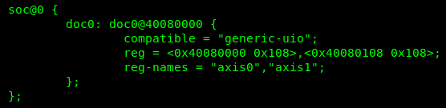

[Drive-On-Chip with Functional Safety System Example Design for Agilex™ 5 Devices]: https://altera-fpga.github.io/rel-25.1/embedded-designs/agilex-5/e-series/modular/drive-on-chip/doc-funct-safety
[Drive-On-Chip with PLC System Example Design for Agilex™ Devices]: https://altera-fpga.github.io/rel-25.1/embedded-designs/agilex-5/e-series/modular/drive-on-chip/doc-plc
[ROS Consolidated Robot Controller Example Design for Agilex™ 5 Devices]: https://altera-fpga.github.io/rel-25.1/embedded-designs/agilex-5/e-series/modular/drive-on-chip/doc-crc
[Agilex™ 5 FPGA - Drive-On-Chip Design Example]: https://www.intel.com/content/www/us/en/design-example/825930/agilex-5-fpga-drive-on-chip-design-example.html
[Intel® Agilex™ 7 FPGA – Drive-On-Chip for Intel® Agilex™ 7 Devices Design Example]: https://www.intel.com/content/www/us/en/design-example/780360/intel-agilex-7-fpga-drive-on-chip-for-intel-agilex-7-devices-design-example.html
[Agilex™ 7 FPGA – Safe Drive-On-Chip Design Example]: https://www.intel.com/content/www/us/en/design-example/825944/agilex-7-fpga-safe-drive-on-chip-design-example.html
[Agilex™ 5 E-Series Modular Development Kit GSRD User Guide (25.1)]: https://altera-fpga.github.io/rel-25.1/embedded-designs/agilex-5/e-series/modular/gsrd/ug-gsrd-agx5e-modular/
[Agilex™ 5 E-Series Modular Development Kit GHRD Linux Boot Examples]: https://altera-fpga.github.io/rel-25.1/embedded-designs/agilex-5/e-series/modular/boot-examples/ug-linux-boot-agx5e-modular/

[AN 1000: Drive-on-Chip Design Example: Agilex™ 5 Devices]: https://www.intel.com/content/www/us/en/docs/programmable/826207/24-1/about-the-drive-on-chip-design-example.html
[AN 999: Drive-on-Chip with Functional Safety Design Example: Agilex™ 7 Devices]: https://www.intel.com/content/www/us/en/docs/programmable/823627/current/about-the-drive-on-chip-with-functional.html
[AN 994: Drive-on-Chip Design Example for Intel® Agilex™ 7 Devices]: https://www.intel.com/content/www/us/en/docs/programmable/780361/23-1/about-the-drive-on-chip-design-example.html
[AN 773: Drive-On-Chip Design Example for Intel® MAX® 10 Devices]: https://www.intel.com/content/www/us/en/docs/programmable/683072/current/about-the-drive-on-chip-design-example.html
[AN 669: Drive-On-Chip Design Example for Cyclone V Devices]: https://www.intel.com/content/www/us/en/docs/programmable/683466/current/about-the-drive-on-chip-design-example.html

[Hard Processor System Technical Reference Manual: Agilex™ 5 SoCs (25.1)]: https://www.intel.com/content/www/us/en/docs/programmable/814346/25-1/hard-processor-system-technical-reference.html
[NiosV Processor for Altera® FPGA]: https://www.intel.com/content/www/us/en/products/details/fpga/intellectual-property/processors-peripherals/niosv.html
[Tandem Motion-Power 48 V Board Reference Manual]: https://www.intel.com/content/www/us/en/docs/programmable/683164/current/about-the-tandem-motion-power-48-v-board.html
[Agilex™ 5 FPGA E-Series 065B Modular Development Kit]: https://www.intel.com/content/www/us/en/products/details/fpga/development-kits/agilex/a5e065b-modular.html
[Agilex™ 3 FPGA C-Series Development Kit]: https://www.intel.com/content/www/us/en/products/details/fpga/development-kits/agilex/a3y135b.html
[Motor Control Designs with an Integrated FPGA Design Flow]: https://www.intel.com/content/dam/www/programmable/us/en/pdfs/literature/wp/wp-01162-motor-control-toolflow.pdf
[Install Docker Engine]: https://docs.docker.com/engine/install/
[Docker Build: Multi-Platform Builds]: https://docs.docker.com/build/building/multi-platform/

[Disk Imager]: https://sourceforge.net/projects/win32diskimager

[https://github.com/altera-fpga/agilex-ed-drive-on-chip]: https://github.com/altera-fpga/agilex-ed-drive-on-chip
[https://github.com/altera-fpga/modular-design-toolkit]: https://github.com/altera-fpga/modular-design-toolkit
[https://github.com/altera-fpga/altera-openplc]: https://github.com/altera-fpga/altera-openplc
[meta-altera-fpga]: https://github.com/altera-fpga/agilex-ed-drive-on-chip/tree/rel/25.1/sw/meta-altera-fpga
[meta-driveonchip]: https://github.com/altera-fpga/agilex-ed-drive-on-chip/tree/rel/25.1/sw/meta-driveonchip
[agilex-ed-drive-on-chip/sw]: https://github.com/altera-fpga/agilex-ed-drive-on-chip/tree/rel/25.1/sw

[Release Tag]: https://github.com/altera-fpga/agilex-ed-drive-on-chip/releases/tag/rel-plc-25.1
[wic.gz]: https://github.com/altera-fpga/agilex-ed-drive-on-chip/releases/download/rel-plc-25.1/core-image-minimal-agilex5_mk_a5e065bb32aes1.rootfs.wic.gz
[wic.bmap]: https://github.com/altera-fpga/agilex-ed-drive-on-chip/releases/download/rel-plc-25.1/core-image-minimal-agilex5_mk_a5e065bb32aes1.rootfs.wic.bmap
[top.hps.jic]: https://github.com/altera-fpga/agilex-ed-drive-on-chip/releases/download/rel-plc-25.1/top.hps.jic
[doc-gui.zip]: https://github.com/altera-fpga/agilex-ed-drive-on-chip/releases/download/rel-plc-25.1/doc-gui_1.0.0.zip
[DOC_PLC_TANDEM_MOTORSIM_AGILEX5.qar]: https://github.com/altera-fpga/agilex-ed-drive-on-chip/releases/download/rel-plc-25.1/DOC_PLC_TANDEM_MOTORSIM_AGILEX5.qar
[top.core.rbf]: https://github.com/altera-fpga/agilex-ed-drive-on-chip/releases/download/rel-plc-25.1/top.core.rbf
[u-boot-spl-dtb.hex]: https://github.com/altera-fpga/agilex-ed-drive-on-chip/releases/download/rel-plc-25.1/u-boot-spl-dtb.hex
[agilex_doc.st]: https://github.com/altera-fpga/agilex-ed-drive-on-chip/releases/download/rel-plc-25.1/agilex_doc.st

[AGX3 Release Tag]: https://github.com/altera-fpga/agilex-ed-drive-on-chip/releases/tag/rel-plc-25.1
[agx3-wic.gz]: https://github.com/altera-fpga/agilex-ed-drive-on-chip/releases/download/rel-plc-25.1.1/core-image-minimal-agilex3.rootfs.wic.gz
[agx3-wic.bmap]: https://github.com/altera-fpga/agilex-ed-drive-on-chip/releases/download/rel-plc-25.1.1/core-image-minimal-agilex3.rootfs.wic.bmap
[agx3-top.hps.jic]: https://github.com/altera-fpga/agilex-ed-drive-on-chip/releases/download/rel-plc-25.1.1/agx3-top.hps.jic
[agx3-doc-gui.zip]: https://github.com/altera-fpga/agilex-ed-drive-on-chip/releases/download/rel-plc-25.1.1/doc-gui_1.0.0.zip
[DOC_PLC_TANDEM_MOTORSIM_AGILEX3.qar]: https://github.com/altera-fpga/agilex-ed-drive-on-chip/releases/download/rel-plc-25.1.1/DOC_PLC_TANDEM_MOTORSIM_AGILEX3.qar
[agx3-top.core.rbf]: https://github.com/altera-fpga/agilex-ed-drive-on-chip/releases/download/rel-plc-25.1.1/agx3-top.core.rbf
[agx3-u-boot-spl-dtb.hex]: https://github.com/altera-fpga/agilex-ed-drive-on-chip/releases/download/rel-plc-25.1.1/agx3-u-boot-spl-dtb.hex
[agx3-agilex_doc.st]: https://github.com/altera-fpga/agilex-ed-drive-on-chip/releases/download/rel-plc-25.1.1/agilex_doc.st

[Creating and Building the Design based on Modular Design Toolkit (MDT).]: https://github.com/altera-fpga/agilex-ed-drive-on-chip/blob/main/HPS_NIOSVg_DoC_dual_axis/Readme.md
[AGX_5E_Modular_Devkit_HPS_NIOSVg_DoC_dual_axis.xml]: https://github.com/altera-fpga/agilex-ed-drive-on-chip/blob/main/HPS_NIOSVg_DoC_dual_axis/AGX_5E_Modular_Devkit_HPS_NIOSVg_DoC_dual_axis.xml
[Create SD card image (.wic) using YOCTO/KAS]: https://github.com/altera-fpga/agilex-ed-drive-on-chip/blob/main/sw/README.md
[Altera OpenPLC Docker Container Image Cross-compilation.]: https://github.com/altera-fpga/altera-openplc#build-a-docker-image

[OpenPLC Runtime version 3]: https://github.com/thiagoralves/OpenPLC_v3
[OpenPLC Documentation]: https://autonomylogic.com/
[Ruckig: Instantaneous Motion Generation for Robots and Machines]: https://github.com/pantor/ruckig
[PLCopen Motion Control Specification]: https://plcopen.org/technical-activities/motion-control
[docker-bullseye-20240722]: https://hub.docker.com/layers/library/debian/bullseye-20240722/images/sha256-315c507d52a055dc8143d48e81666575ce34f1bb0538d189edff09dfc2314260

# Drive-On-Chip with PLC Design Example for Agilex™ Devices

## a. Overview: Software stack functional description

High-level software components for running the OpenPLC runtime in this design
example are deployed using Docker and a custom Linux distribution based on
YOCTO. By enabling virtualization, Docker, and UIO devices, the high-level
software can communicate with custom hardware programmed into the FPGA fabric
(Drive-On-Chip, see "Hardware Functional Description"). This example design
demonstrates how to interface the OpenPLC runtime with logic programmed
in the FPGA fabric, a concept that can be replicated using the software
stack with any IP in the FPGA.

The primary software components are summarized in the following figure and
described in the subsequent sections:

 

{:style="display:block; margin-left:auto; margin-right:auto"}

**Software Top Block Diagram.**

 

In summary:

* A custom distribution of Linux with virtualization enabled, docker,
  UIO device driver, build based on KAS.
* Debian-based container to support portability across devices. Cross-compiled
  for ARM64 architecture.
* Servo Driver (or Drive-On-Chip) OpenPLC hardware support to interface the
  OpenPLC Runtime with FPGA IP (in this case the Drive-On-Chip IP/System).
  This include patches to enable Agilex™ Hardware selection in the OpenPLC
  Runtime web-server interface.
* OpenPLC Motion Control Library (Implemented using RT Motion library) based
  on PLCOpen standard IEC-61131-3. See: [PLCopen Motion Control Specification](https://plcopen.org/technical-activities/motion-control)
* Integration of Ruckig Motion Planner Library, to generate trajectories
  constrained by velocity, acceleration and other parameters. See:
  [Ruckig: Instantaneous Motion Generation for Robots and Machines](https://github.com/pantor/ruckig)
* OpenPLC Runtime: An Open Source Programmable Logic Controller implementation
  created in accordance to the IEC 61131-3 standard that defines architecture
  and basic programming languages for PLCs.
* The OpenPLC runtime has an in-build webserver that allows basic runtime
  configuration.
* An example of how to run an user-specific PLC program in Structured Text (ST)
  language to control and interface with the Drive-On-Chip System in the FPGA
  fabric.

## b. Custom Linux distribution based on KAS

For the Drive-On-Chip with PLC Design Example for Agilex™ Devices,
Altera® provides the files to build the Linux system to run the PLC Software
Stack enclosed in a Docker Container. The custom version of linux is built
based on KAS (see: [agilex-ed-drive-on-chip/sw](https://github.com/altera-fpga/agilex-ed-drive-on-chip/tree/rel/25.1/sw)). An it is compose of two main
meta-layers. In this document the files relevant for the "Drive-On-Chip
with PLC Design Example for Agilex™ Devices" are highlighted.

### FPGA Embedded Layer

* See **[meta-altera-fpga](https://github.com/altera-fpga/agilex-ed-drive-on-chip/tree/rel/25.1/sw/meta-altera-fpga)**

### Drive-On-Chip Layer

* See **[meta-driveonchip](https://github.com/altera-fpga/agilex-ed-drive-on-chip/tree/rel/25.1/sw/meta-driveonchip)**

### b.1. Necessary elements in the meta-layers to bind Software and Hardware

This section details the various elements included in the meta-layers that
facilitate running the PLC application. These elements assist in "binding" the
FPGA Soft IP, such as Drive-On-Chip, with the software running on the HPS,
which operates on Linux and is containerized using Docker. The following
sections explain these elements to clarify the interaction between the HPS
software stack and the FPGA IP (soft logic, Drive-On-Chip). This interaction
between the PLC and Drive-On-Chip IP serves as an example of how to interface
any soft IP in the FPGA fabric with higher-level software, such as the
OpenPLC Runtime contained within a Docker image.

#### b.1.1. Device Tree

Adds a custom .dtsi (device tree fragment) file to the main device tree for
Linux kernel boot up stage `socfpga_agilex5_socdk.dts`. it compiles into a DTB
(device tree blob) during kernel compilation and is added to the SD card
image during the Yocto build. The recipe `device-tree.bb`. The specific
file for this design example (`agilex5_dual_axis.dtsi`), is appended
using `device-tree.bbappend` directive. Look for these files in the
different meta-layers provided above.

 

{:style="display:block; margin-left:auto; margin-right:auto"}

**Custom Device Tree Fragment.**

 

You expand the device tree by appending the contents of the file
`agilex5_dual_axis.dtsi`, that exposes an additional as UIO device in
the RootFS (`generic-uio`). The figure shows the instance of the device. This
definition should match with the devices that the HPS can access in the
FPGA soft logic and you can verify the address map in the Platform Designer
Project (`.qsys`).

For example, the Drive-On-Chip control subsystem `debug memory`
(`doc_sys_debug_ram`) that  is used to interact and
provide commands to the Drive-On-Chip control application
has the base address `0x0008_0000` in Platform Designer,
but from the view of HPS you should add the offset reflecting the HPS-FPGA
bridge `0x4000_0000`, refer ( System Memory Mapping Scheme
in the [Hard Processor System Technical Reference Manual: Agilex™ 5 SoCs (25.1)](https://www.intel.com/content/www/us/en/docs/programmable/814346/25-1/hard-processor-system-technical-reference.html))
specifying the address `0x4008_0000` in the `agilex5_dual_axis.dtsi` file.
Components connected to the full HPS to FPGA bridge have an offset of `0x4000_0000`
and components connected to lightweight HPS-to-FPGA bridge have an offset of `0x2000_0000`.

The Drive-On-Chip component is listed in the .dtsi as compatible `generic_uio`,
which is a way to map devices using generic user IO interface in the Linux
kernel and user space. If you modify or add memory mapped devices in Platform
Designer, also add the change in the `.dtsi` file. When the Yocto build refreshes,
the Linux system lists the device in the corresponding `/dev/uiox` and populates
the information in `/sys/class/uio/uiox`. To enable UIO devices two Linux kernel
modules must be enabled in `uio.cfg` file: `CONFIG_UIO` and `CONFIG_UIO_PDRV_GENIRQ`
The `.dtsi` and Platform Designer mapping should be consistent to provide the
HPS software application to run correctly.

The interaction between the Drive-On-Chip UIO device and the OpenPLC Runtime
is achieved by enabling hardware support for the Agilex™ Device. In this example
design this is applied using the source file `agilex_doc.cpp` and the patch file
`agilex_doc.patch`
 

#### b.1.2. FPGA Bitstream

Adds the `agilex5_modular_dual_axis.core.rbf` file to the build. The file
is generated after Quartus® Prime compilation. The `*core.rbf` file is added to the
boot partition of the SD card (renamed as `top.core.rbf`). The HPS configures the
FPGA at initialization using u-boot `load` command in `uboot.txt` generated into
`boot.scr.uimg` in the boot partition by `u-boot-socfpga_%.bbappend` (look for
the files in the meta-layer).

 

{:style="display:block; margin-left:auto; margin-right:auto"}

**FPGA configuration during HPS booting process.**

 

Look for the print **"..... FPGA reconfiguration OK "** during the device booting
process, as shown in the previous figure to ensure the FPGA bitstream (`top.core.rb`)
has been properly loaded.
 

#### b.1.3. Additional u-boot configuration

An append to the u-boot arguments using `IMAGE_BOOT_ARGS` and
`IMAGE_BOOT_ARGS:append:agilex5_modular` in different KAS/YOCTO configuration
files to enable UIO drivers defined by `uio_pdrv_genirq.of_id=generic-uio`.
 

### b.2. Necessary elements in the meta-layers to enable Docker deployments

To enable the execution of Docker container-based applications on the SoC FPGA
platform, certain additions are required for the custom Linux build based on
KAS. These include enabling virtualization through the `meta-virtualization`
layer, configuring the respective kernel settings, and installing Docker in
the SD card image.

These customizations are implemented using the `docker.yml` KAS configuration
file, which adds the `meta-virtualization` layer to the YOCTO build and
installs `docker` and `docker-compose` into the RootFS. This configuration
is included in the includes: section of the main KAS-YOCTO configuration
file, `kas_dual_axis.yml`. The necessary kernel configuration settings to
enable Docker and virtualization are contained in the `docker.cfg` file,
wrapped within the `virtualization-layer` (dynamic layer).

 

### b.3. PREEMPT-RT patch

This example shows the user how to easily "patch" the Linux kernel with `PREEMPT_RT`
patch, which provides soft Real Time characteristics particularly useful for
embedded hardware applications. See the file `linux-socfpga-rt_6.6.bb`

 

## c. Debian-based container image for OpenPLC

The OpenPLC Runtime is packaged within a Docker image, which includes
the necessary applications and libraries to operate the web server,
application database, and PLC control application. The Docker container
image deployed on the target Agilex™ device is built and cross-compiled
for ARM64 architecture, using a `Dockerfile` provided in the Altera® FPGA PLC
repository ([https://github.com/altera-fpga/altera-openplc](https://github.com/altera-fpga/altera-openplc)).

The main instructions to build the docker image in the provided Dockerfile are:

* Specifies the base image for building the container using the Debian 11
  "Bullseye" release with a specific update (July 22, 2024) from the docker
  registry, see: [docker-bullseye-20240722](https://hub.docker.com/layers/library/debian/bullseye-20240722/images/sha256-315c507d52a055dc8143d48e81666575ce34f1bb0538d189edff09dfc2314260)
* Installs necessary build tools (cmake, git, build-essentials, etc).
* Clones the OpenPLC and installs Ruckig repositories:
  * [OpenPLC Runtime version 3](https://github.com/thiagoralves/OpenPLC_v3).
  * [Ruckig: Instantaneous Motion Generation for Robots and Machines](https://github.com/pantor/ruckig).
* Installs PLC Motion libraries and applies patches for Agilex™ hardware support.
* Installs OpenPLC Runtime.
* Entrypoint is defined as OpenPLC Runtime with the `start_openplc.sh` script.

 

## d. Servo Driver (Drive-On-Chip) OpenPLC hardware support

This C++ program is designed to interface with a hardware device using the
UIO (Userspace I/O) framework in Linux. It primarily focuses on controlling
servo motors through the Drive-on-Chip device.

The following definitions and enumerations are enclosed in the namespace
called `DoC`:

**Definitions and Enums for servo Driver Program**

| Definitions and Enums | Description |
| :-------------------- | :---------- |
| `RTMOTION`            | A macro defined at the beginning, likely indicating that the program is   part of the RTmotion library or framework|
| `DRIVE_AXIS_PER_DEVICE`, `MAX_AXIS_NUM` | Constants defining the number of axes per device and the   maximum number of axes, respectively|
| `WaveDemoMode`, `WaveDemoWaveform` | Enumerations defining different modes and waveforms for a wave demonstration feature|
| `DebugRegister` | An enumeration listing various registers for debugging and controlling the   device. These registers cover a wide range   of functionalities, from general drive   status to specific control parameters|

### d.1. "UIODevice" class

Manages the interaction with a UIO device, including memory mapping and
register access. The constructor `UIODevice` initializes the device
and axis, checks for device and axis availability, and sets up memory
mapping. The destructor `~UIODevice` cleans up the memory mapping.

**Class Methods**

| Method           | Description |
| :--------------- | :---------- |
| `Read`           | Reads a value from a specified register |
| `Write`          | Writes a value to a specified register |
| `GetDevicePath`  | Determines the device path for a given device name |
| `IsAxisMapped`   | Checks if a specific axis is mapped for a given device |
| `ReadSysHexVal`  | Reads a hexadecimal value from a system file |

### d.2. "DoCServo" class

Represents a servo motor controlled by the DoC device. The constructor
`DoCServo` initializes the servo for a specific axis, checking if the
axis is mapped and setting up the device. The destructor is empty.

**Class Methods**

| Method           | Description |
| :--------------- | :---------- |
| `setVel`         | Sets the target velocity for the servo |
| `vel`            | Retrieves the current velocity from the device |
| `runCycle`       | Updates the device with the current target   velocity and configures the wave demo settings |

### d.3. Global variables and functions

| Variables and Functions | Description |
| :---------------------- | :---------- |
| **Global Variables**    ||
| `config`                | Array of AxisConfig objects for configuring axes |
| `servo`                 | Array of pointers to DoCServo objects |
| `active_drives_num`     | Tracks the number of active drives |
| **Global Functions**    ||
| `initializeHardware`    | Initializes the hardware by setting up axes and servos,   and configuring them |
| `finalizeHardware`      | Cleans up resources by deleting axes and servos |
| `updateBuffersIn`       | Updates input buffers, running the cycle for each   active axis|
| `updateBuffersOut`      | Placeholder function for updating output buffers |

In summary the program in `agilex_doc.cpp` files is structured to manage
and control servo motors using a UIO device interface. It sets up memory
mapping for device registers, configures axes and servos, and provides
functions to initialize and finalize hardware resources. The program also
includes mechanisms to read and write to device registers, allowing for
real-time control and monitoring of servo motor parameters.

 

## e. PLCOpen Motion Control Standard and RTmotion Motion Control Library

PLCopen is a standards organization that supports automation for PLCs.
The PLCopen Motion Control standard defines operations on motor axes using
functional blocks.  The blocks wrap the complex operations of motor control
in a simplified API. The advantages include:

* A standard interface to different manufacturers motor hardware.
* Portability of applications.
* Reduced training required to implement motor control applications.

The figure below is an example of how this can be used to coordinate two motor axes:

 

{:style="display:block; margin-left:auto; margin-right:auto"}

**Example of PLCOpen Motion control functional block.**

 

* The Execute input triggers the first function block to move motor
  `Axis X` to a defined position `X_POS`.
* When the first operation is complete the Done output starts the
  second function block which  moves motor `Axis Y` to its predefined
  position `Y_POS`.

The RTmotion library implements the PLCopen Motion Control functional
blocks. The library is released under the open source license Apache
V2.0. The RTmotion library has a dependency on the Ruckig library.
Ruckig is used for motion planning operations: calculating the optimum
speed profile for the axis so the system moves efficiently but within
the constraints of maximum acceleration and jerk (rate of change of
acceleration). For more details see:
[Ruckig: Instantaneous Motion Generation for Robots and Machines](https://github.com/pantor/ruckig).

A copy of the RTmotion library is included into the Altera® FPGA PLC
repository [https://github.com/altera-fpga/altera-openplc](https://github.com/altera-fpga/altera-openplc).

 

## f. OpenPLC Runtime

OpenPLC is an open-source programmable logic controller (PLC) platform
designed to provide a flexible and cost-effective solution for industrial
automation and control systems. It is built to be compatible with the
IEC 61131-3 standard, which is the international standard for PLC
programming languages. OpenPLC supports multiple programming languages
defined by this standard, including Ladder Logic (LD), Structured Text (ST),
Function Block Diagram (FBD), and Sequential Function Charts (SFC).
The runtime includes a web-based interface for programming and
monitoring, which simplifies the process of developing and managing
PLC projects.

The OpenPLC project consists of Editor and Runtime components. The
Editor is used to create and simulate applications written in the
IEC 61131 PLC languages.
To run the applications on real hardware the OpenPLC Editor converts
the programs to Structured Text (ST) format.
The OpenPLC Editor supports two deployment options for the resulting
Structured Text output:

* Upload to a Linux target system via the OpenPLC Runtime webserver.
  The runtime converts Structured Text to C source code  and compiles
  it on the target device to a  binary that implements the PLC operations.
* Use OpenPLC Editor convert and compile the application on the host PC
  before downloading the resulting binary to a micro-controller.

The Drive-on-Chip with PLC Design Example for Agilex™ Devices uses the first
option to build and deploy ST program.

More information about OpenPLC can be found in: [OpenPLC Documentation](https://autonomylogic.com/)

 

## g. Example of an user-specific PLC program in Structured Text (ST) for DoC control

The example on how to control the Drive-On-Chip IP in the FPGA fabric with an
Structured Text program that executes in the OpenPLC Runtime is described
in the file `agilex_doc.st`. The program description is as follows:

### g.1. FUNCTION_BLOCK "OnOffIntervalTimer"

This function block is designed to control an on-off interval timer. It has
the following components:

**Function Block Description.**

| Variable      | Description |
| :------------ | :---------- |
| **VAR_INPUT** |             |
|`ON_TIME`      | A `TIME` variable specifying the duration for which the timer should be active |
| `OFF_TIME`    | A `TIME` variable specifying the duration for which the timer should be inactive |
| **VAR_OUTPUT**|             |
| `ACTIVE`      | A `BOOL` variable indicating whether the timer is currently active|
| **VAR**       |             |
| `LATCH`       | An RS (Reset-Set) latch used to control the timing logic |
| `ON_INTERVAL` | A TP (Timer Pulse) block that generates a pulse for the `ON_TIME`|
| `OFF_INTERVAL`| A TOF (Timer Off Delay) block that manages the `OFF_TIME`|
| **Logic**     |             |
| `LATCH`       |It is set when the `OFF_INTERVAL` is not active and reset when the `ON_INTERVAL` is active|
| `ON_INTERVAL` |It is triggered by the latch and runs for the `ON_TIME`|
| `OFF_INTERVAL`|It starts when the `ON_INTERVAL` finishes and runs for the `OFF_TIME`|
| `ACTIVE`      |The output is true when the `ON_INTERVAL` is active|

### g.2 PROGRAM "prog0"

This program utilizes the `OnOffIntervalTimer` function block to control
two axes of a motor system. It includes:

| Variable | Description |
| :------- | :---------- |
| **VAR** ||
| `MOTOR_PULSE0`| An instance of `OnOffIntervalTimer` to manage the timing of motor pulses|
| **VAR** ||
| `AXIS_0_HALT`, `AXIS_1_HALT`| Instances of `MC_HALT` to stop the axes|
| `AXIS_0_SET_VEL`, `AXIS_1_SET_VEL`| Instances of `MC_MOVEVELOCITY` to set the velocity of the axes|
| `AXIS_0_READ_VEL`, `AXIS_1_READ_VEL`| Instances of `MC_READACTUALVELOCITY` to read the actual velocity of the axes|
| `AXIS_0_POWER`, `AXIS_1_POWER`| Instances of `MC_POWER` to control the power state of the axes|
| **VAR** ||
| `AXIS_0_VELOCITY`, `AXIS_1_VELOCITY` | Real variables to store the actual velocity of each axis|

#### g.2.2. Program Logic

* Powers on both axes with positive and negative enable.
* Uses `MOTOR_PULSE0` to control the execution of velocity setting and
  halting commands based on its `ACTIVE` state.
* Sets the velocity, acceleration, deceleration, and jerk for each axis
  when the timer is active.
* Halts the axes when the timer is inactive.
* Reads and stores the actual velocity of each axis.

### g.3. CONFIGURATION "Config0"

This configuration sets up the PLC environment:

* **RESOURCE Res0 ON PLC**:
  * Defines a resource named `Res0` on the PLC.
  * **TASK Main**: A task with a 50ms interval and priority 0.
  * **PROGRAM Inst0 WITH Main**: Associates the `prog0` program with the `Main` task.

In summary, this ST file configures a PLC program to control motor axes
using an on-off interval timer, managing power, velocity, and halting based
on the timer's state.

 

[Back to Documentation](../doc-plc.md#example-design-documentation){ .md-button }