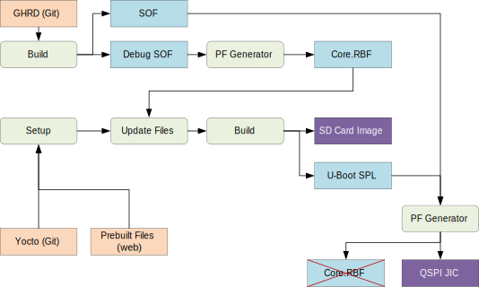

# HPS GSRD User Guide for the Agilex™ 5 E-Series Modular Dev Kit

##  Introduction

### GSRD Overview

The Golden System Reference Design (GSRD) is a reference design running on the Agilex&trade; 5 E-Series Modular Development Kit.

The GSRD is comprised of the following components:

- Golden Hardware Reference Design (GHRD)
- Reference HPS software including:
  - Arm Trusted Firmware
  - U-Boot
  - Linux Kernel
  - Linux Drivers
  - Sample Applications

### Prerequisites

The following are required to be able to fully exercise the Agilex 5 Modular Development Kit GSRD:

* Altera&reg; Agilex&trade; 5 FPGA E-Series 065B Modular Development Kit, ordering code MK-A5E065BB32AES1. Refer to [board documentation](https://www.intel.com/content/www/us/en/products/details/fpga/development-kits/agilex/a5e065b-modular.html) for more information about the development kit.
  * Power supply
  * 2 x Micro USB Cable
  * Ethernet Cable
  * Micro SD card and USB card writer
* Host PC with
  * 64 GB of RAM. Less will be fine for only exercising the binaries, and not rebuilding the GSRD.
  * Linux OS installed. Ubuntu 22.04LTS was used to create this page, other versions and distributions may work too
  * Serial terminal (for example GtkTerm or Minicom on Linux and TeraTerm or PuTTY on Windows)
  * Altera&reg; Quartus<sup>&reg;</sup> Prime Pro Edition Version 25.1 
* Local Ethernet network, with DHCP server
* Internet connection. For downloading the files, especially when rebuilding the GSRD.

### Prebuilt Binaries

The Agilex 5 Modular Development Kit GSRD binaries are located at [https://releases.rocketboards.org/2025.04/](https://releases.rocketboards.org/2025.04/):

Boot Source | Link |
| ---------------------- | -- |
| SD Card | [https://releases.rocketboards.org/2025.04/gsrd/agilex5_modular_gsrd/](https://releases.rocketboards.org/2025.04/gsrd/agilex5_modular_gsrd/) |
| QSPI | [https://releases.rocketboards.org/2025.04/qspi/agilex5_modular_qspi/](https://releases.rocketboards.org/2025.04/qspi/agilex5_modular_qspi/) |

### Component Versions

Altera&reg; Quartus<sup>&reg;</sup> Prime Pro Edition Version 25.1 and the following software component versions are used to build the GSRD: 

| Component | Location | Branch | Commit ID/Tag |
| :-- | :-- | :-- | :-- |
| GHRD | [https://github.com/altera-fpga/agilex5e-ed-gsrd](https://github.com/altera-fpga/agilex5e-ed-gsrd) | master | QPDS25.1_REL_GSRD_PR |
| Linux | [https://github.com/altera-fpga/linux-socfpga](https://github.com/altera-fpga/linux-socfpga) | socfpga-6.12.11-lts | QPDS25.1_REL_GSRD_PR |
| Arm Trusted Firmware | [https://github.com/altera-fpga/arm-trusted-firmware](https://github.com/altera-fpga/arm-trusted-firmware) | socfpga_v2.12.0 | QPDS25.1_REL_GSRD_PR |
| U-Boot | [https://github.com/altera-fpga/u-boot-socfpga](https://github.com/altera-fpga/u-boot-socfpga) | socfpga_v2025.01 | QPDS25.1_REL_GSRD_PR |
| Yocto Project | [https://git.yoctoproject.org/poky](https://git.yoctoproject.org/poky) | styhead | latest | 
| Yocto Project: meta-intel-fpga | [https://git.yoctoproject.org/meta-intel-fpga](https://git.yoctoproject.org/meta-intel-fpga) | styhead | latest |
| Yocto Project: meta-intel-fpga-refdes | [https://github.com/altera-fpga/meta-intel-fpga-refdes](https://github.com/altera-fpga/meta-intel-fpga-refdes) | styhead | QPDS25.1_REL_GSRD_PR |

### Release Notes

See [https://github.com/altera-fpga/gsrd-socfpga/releases/tag/QPDS25.1_REL_GSRD_PR](https://github.com/altera-fpga/gsrd-socfpga/releases/tag/QPDS25.1_REL_GSRD_PR)

### Development Kit

This release targets the Agilex 5 FPGA E-Series 065B Modular Development Kit. It is composed of a carrier board which offers additional connectivity, and a SOM board which contains the FPGA part, HPS DDRAM and all other required circuitry. Refer to [board documentation](https://www.intel.com/content/www/us/en/products/details/fpga/development-kits/agilex/a5e065b-modular.html) for more information about the development kit.


<h4>Changing MSEL</h4>

MSEL signals instruct the FPGA device on which configuration scheme to use. Configuration schemes used by the scenarios presented in this guide are JTAG and ASx4 (QSPI). MSEL is changed through dipswitch S4 on the top left cornet of the SOM board. Only change the settings while the board is powered off.

The MSEL settings are:

* JTAG: SW4[2:1]=OFF:OFF
* ASx4 (QSPI): SW4[2:1]=ON:ON


### GHRD Overview

The Golden Hardware Reference Design is an important part of the GSRD and consists of the following components:

- Hard Processor System (HPS)
  - Dual core Arm Cortex-A76 processor
  - Dual core Arm Cortex-A55 processor
  - HPS Peripherals
    - Micro SD Card
    - EMAC
    - HPS JTAG debug
    - UART
    - I2C    
    - USB 3.1
- Multi-Ported Front End (MPFE) for HPS External Memory Interface (EMIF)
- FPGA Peripherals connected to Lightweight HPS-to-FPGA (LWH2F) AXI Bridge and JTAG to Avalon Master Bridge
  - One user LED output
  - Two user DIP switch inputs
  - One user push-button input
  - System ID
- FPGA Peripherals connected to HPS-to-FPGA (H2F) AXI Bridge
  - 256KB of FPGA on-chip memory

 

The GHRD allows hardware designers to access each peripheral in the FPGA portion of the SoC with System Console, through the JTAG master module. This signal-level access is independent of the driver readiness of each peripheral.

<h4> MPU Address Maps</h4>

This section presents the address maps as seen from the MPU side.  
<h5> HPS-to-FPGA Address Map</h5>

The three FPGA windows in the MPU address map provide access to 256 GB of FPGA space. First window is 1 GB from 00_4000_0000, second window is 15 GB from 04_4000_0000, third window is 240 GB from 44_0000_0000. The following table lists the offset of each peripheral from the HPS-to-FPGA bridge in the FPGA portion of the SoC.

| Peripheral | Address Offset | Size (bytes) | Attribute |
| :-- | :-- | :-- | :-- |
| onchip_memory2_0 | 0x0 | 256K | On-chip RAM as scratch pad |

<h5>Lightweight HPS-to-FPGA Address Map</h5>

The the memory map of system peripherals in the FPGA portion of the SoC as viewed by the MPU, which starts at the lightweight HPS-to-FPGA base address of 0x00_2000_0000, is listed in the following table.

| Peripheral | Address Offset | Size (bytes) | Attribute |
| :-- | :-- | :-- | :-- |
| sysid | 0x0001_0000 | 32 | Unique system ID   |
| button_pio | 0x0001_0060 | 16 | Push button inputs |
| dipsw_pio | 0x0001_0070 | 16 | DIP switch inputs |
| led_pio | 0x0001_0080 | 16 | LED outputs   |

<h5>JTAG Master Address Map</h5>

There are three JTAG master interfaces in the design, one for accessing non-secure peripherals in the FPGA fabric, and another for accessing secure peripheral in the HPS through the FPGA-to-HPS Interface and another for FPGA fabric to SDRAM.

The following table lists the address of each peripheral in the FPGA portion of the SoC, as seen through the non-secure JTAG master interface.

| Peripheral | Address Offset | Size (bytes) | Attribute |
| :-- | :-- | :-- | :-- |
| onchip_memory2_0 | 0x0004_0000 | 256K | On-chip RAM |
| sysid | 0x0001_0000 | 32 | Unique system ID |
| button_pio | 0x0001_0060 | 16 | Push button inputs |
| dipsw_pio | 0x0001_0070 | 16 | DIP switch inputs |
| led_pio | 0x0001_0080 | 16 | LED outputs |

<h4> Interrupt Routing</h4>

The HPS exposes 64 interrupt inputs for the FPGA logic. The following table lists the interrupt connections from soft IP peripherals to the HPS interrupt input interface.
      
| Peripheral | Interrupt Number | Attribute |
| :-- | :-- | :-- |
| dipsw_pio | f2h_irq0[1] | DIP switch input |
| button_pio | f2h_irq0[0] | Push button input |

## Exercising Prebuilt Binaries

This section presents how to use the prebuilt binaries included with the GSRD release.

### Configure Board

1\. Leave all jumpers and switches in their default configuration.

2\. Connect micro USB cable from bottom left of the carrier board to PC. This will be used for JTAG communication.

3\. Connect micro USB cable from bottom right of the SOM board to PC. This will be used for HPS UART communication.

4\. Connect Ethernet cable from SOM board to an Ethernet switch connected to local network. Local network must provide a DCHP server.

### Configure Serial Console

All the scenarios included in this release require a serial connection. This section presents how to configure the serial connection.


Each of the USB connections listed above will enumerate 4 USB serial ports on your host computer. The HPS UART port is the 3rd one enumerated by the connection to the SOM board.

1\. Install a serial terminal emulator application on your host PC:  

* For Windows: TeraTerm or PuTTY are available
* For Linux: GtkTerm or Minicom are available

2\. Remove USB cables, and power down your board if powered up. Look at what USB serial ports are enumerated on your computer by default, without board being connected.

3\. Power up the board.

4\. Connect micro USB cable from bottom left of the carrier board to PC. This will be used for JTAG communication. Look at what ports are enumerated on your host computer, there should be a series of four.

5\. Connect micro USB cable from bottom right of the SOM board to PC. This will be used for HPS UART communication. Look at what ports are enumerated on your host computer, there should be a series of four. Use the 3rd one in the list as the HPS serial port.

<h4>Possible serial port allocation in Windows</h4>

* COM3: already there before board was installed
* COM4-7: enumerated by the JTAG connection
* COM8-11: enumerated by the HPS connection

In the above case, the port to use for HPS serial communication would be COM10.

<h4>Possible serial port allocation in Linux</h4>

* /dev/ttyUSB0-3: enumerated by the JTAG connection
* /dev/ttyUSB4-7:enumerated by the HPS connection

In the above case, the port to use for HPS serial communication would be /dev/ttyUSB6.

Notes:

* On Windows, the port number may be kept between power cycles, but not always. 
* On Linux, the port numbe may change depending on the order in which cables are inserted.

6\. Configure your serial terminal emulator to use the following settings:  

* Serial port: as mentioned above
* Baud rate: 115,200
* Data bits: 8
* Stop bits: 1
* CRC: disabled
* Hardware flow control: disabled

7\. Connect your terminal emulator

### Booting from SD Card
<hr/>
<h4 id="write-sd-card-image">Write SD Card</h4>

1\. Download SD card image from the prebuilt binaries [https://releases.rocketboards.org/2025.04/gsrd/agilex5_mk_a5e065bb32aes1_gsrd/sdimage.tar.gz](https://releases.rocketboards.org/2025.04/gsrd/agilex5_mk_a5e065bb32aes1_gsrd/sdimage.tar.gz) and extract the archive, obtaining the file `gsrd-console-image-agilex5_devkit.wic`.

2\. Write the gsrd-console-image-agilex5_devkit.wic. SD card image to the micro SD card using the included USB writer in the host computer:

- On Linux, use the `dd` utility as shown next:
```bash
# Determine the device asociated with the SD card on the host computer.	
cat /proc/partitions
# This will return for example /dev/sdx
# Use dd to write the image in the corresponding device
sudo dd if=gsrd-console-image-agilex5_devkit.wic of=/dev/sdx bs=1M
# Flush the changes to the SD card
sync
```
- On Windows, use the Win32DiskImager program, available at [https://sourceforge.net/projects/win32diskimager](https://sourceforge.net/projects/win32diskimager). For this, first rename the gsrd-console-image-agilex5_devkit.wic to an .img file (sdcard.img for example) and write the image as shown in the next figure:

 

<h4>Write QSPI Flash</h4>

1\. Power down board

2\. Set MSEL dipswitch S4 on SOM to JTAG: OFF-OFF

3\. Power up the board

4\. Download and extract the JIC image, then write it to QSPI
```bash
wget https://releases.rocketboards.org/2025.04/gsrd/agilex5_mk_a5e065bb32aes1_gsrd/ghrd_a5ed065bb32ae6sr0.hps.jic.tar.gz
tar xf ghrd_a5ed065bb32ae6sr0.hps.jic.tar.gz
jtagconfig --setparam 1 JtagClock 16M
quartus_pgm -c 1 -m jtag -o "pvi;ghrd_a5ed065bb32ae6sr0.hps.jic"
```

<h4>Boot Linux</h4>

1\. Power down board

2\. Set MSEL dipswitch S4 on SOM to ASX4 (QSpI): ON-ON

3\. Power up the board

4\. Wait for Linux to boot, use `root` as user name, and no password wil be requested.

<h4>Run Sample Applications</h4>

1\. Boot to Linux

2\. Change current folder to `intelFPGA` folder
```bash
cd intelFPGA
```
3\. Run the hello world application
```bash
./hello
```
4\. Run the `syscheck` application
```bash
./syscheck
```
Press `q` to exit the `syscheck` application.

<h4>Control LED</h4>

1\. Boot to Linux

2\. Control LED by using the following sysfs entries:

* /sys/class/leds/fpga_led0/brightness
* /sys/class/leds/hps_led1/brightness

using commands such as:
```bash
cat /sys/class/leds/fpga_led0/brightness
echo 0 > /sys/class/leds/fpga_led0/brightness
echo 1 > /sys/class/leds/fpga_led1/brightness
```

Because of how the LEDs are connected, for the above commands `0` means LED is turned on, `1` means LED is turned off.

<h4>Connect to Board Using SSH</h4>

1\. Boot to Linux  

2\. Determine the board IP address using the `ifconfig` command:
```bash
root@agilex5devkit:~# ifconfig
eth0: flags=-28605<UP,BROADCAST,RUNNING,MULTICAST,DYNAMIC>  mtu 1500
        inet 192.168.1.153  netmask 255.255.255.0  broadcast 192.168.1.255
        inet6 fe80::f0eb:c8ff:fec4:eed7  prefixlen 64  scopeid 0x20<link>
        ether f2:eb:c8:c4:ee:d7  txqueuelen 1000  (Ethernet)
        RX packets 649  bytes 45132 (44.0 KiB)
        RX errors 0  dropped 226  overruns 0  frame 0
        TX packets 56  bytes 8789 (8.5 KiB)
        TX errors 0  dropped 0 overruns 0  carrier 0  collisions 0
        device interrupt 23  

lo: flags=73<UP,LOOPBACK,RUNNING>  mtu 65536
        inet 127.0.0.1  netmask 255.0.0.0
        inet6 ::1  prefixlen 128  scopeid 0x10<host>
        loop  txqueuelen 1000  (Local Loopback)
        RX packets 100  bytes 8408 (8.2 KiB)
        RX errors 0  dropped 0  overruns 0  frame 0
        TX packets 100  bytes 8408 (8.2 KiB)
        TX errors 0  dropped 0 overruns 0  carrier 0  collisions 0
```
3\. Connect to the board over SSH using `root` username, no password will be requested:
```bash
ssh root@192.168.1.153
```
**Note**: Make sure to replace the above IP address to the one matching the output of running `ifconfig` on youir board.

<h4>Visit Board Web Page</h4>

1\. Boot to Linux  

2\. Determine board IP address using `ifconfig` like in the previous scenario  

3\. Start a web browser and enter the IP address in the address bar  

4\. The web browser will display a page served by the web server running on the board.  

**Note**: Current release has a limitation, in that the LEDs are not controllable from the web page. This will be resolved in the next release.

### Booting from QSPI
<hr/>
This section presents how to boot from QSPI. One notable aspect is that you need to wipe the SD card partitioning information, as otherwise U-Boot SPL could find a valid SD card image, and try to boot from that first.

<h4>Wipe SD Card</h4>

Either write 1MB of zeroes at the beginning of the SD card, or remove the SD card from the HPS Daughter Card. You can use `dd` on Linux, or `Win32DiskImager` on Windows to achieve this.

<h4>Write QSPI Flash</h4>

1\. Power down board

2\. Set MSEL dipswitch S4 on SOM to JTAG: OFF-OFF

3\. Power up the board

4\. Download and extract the JIC image, then write it to QSPI:
```bash
wget https://releases.rocketboards.org/2025.04/qspi/agilex5_mk_a5e065bb32aes1_qspi/agilex_flash_image.hps.jic.tar.gz
tar xf agilex_flash_image.hps.jic.tar.gz
jtagconfig --setparam 1 JtagClock 16M
quartus_pgm -c 1 -m jtag -o "pvi;agilex_flash_image.hps.jic"
```

<h4>Boot Linux</h4>

1\. Power down board

2\. Set MSEL dipswitch S4 on SOM to ASX4 (QSpI): ON-ON

3\. Power up the board

4\. Wait for Linux to boot, use `root` as user name, and no password wil be requested.

**Note**: On first boot, the UBIFS rootfilesystem is initialized, and that takes a few minutes. This will not happen on next reboots. See a sample log below:

```
[   17.033558] UBIFS (ubi0:4): Mounting in unauthenticated mode
[   17.039470] UBIFS (ubi0:4): background thread "ubifs_bgt0_4" started, PID 130
[   17.061510] UBIFS (ubi0:4): start fixing up free space
[   20.644496] random: crng init done
[   27.120040] platform soc:leds: deferred probe pending
[  243.190874] UBIFS (ubi0:4): free space fixup complete
[  243.315909] UBIFS (ubi0:4): UBIFS: mounted UBI device 0, volume 4, name "rootfs"
[  243.323290] UBIFS (ubi0:4): LEB size: 65408 bytes (63 KiB), min./max. I/O unit sizes: 8 bytes/256 bytes
[  243.332653] UBIFS (ubi0:4): FS size: 167117440 bytes (159 MiB, 2555 LEBs), max 6500 LEBs, journal size 
```

## Rebuilding the GSRD


### Yocto Build Prerequisites

1\. Make sure you have Yocto system requirements met: https://docs.yoctoproject.org/5.0.1/ref-manual/system-requirements.html#supported-linux-distributions.

The command to install the required packages on Ubuntu 22.04 is:

```bash
sudo apt-get update
sudo apt-get upgrade
sudo apt-get install openssh-server mc libgmp3-dev libmpc-dev gawk wget git diffstat unzip texinfo gcc \
build-essential chrpath socat cpio python3 python3-pip python3-pexpect xz-utils debianutils iputils-ping \
python3-git python3-jinja2 libegl1-mesa libsdl1.2-dev pylint xterm python3-subunit mesa-common-dev zstd \
liblz4-tool git fakeroot build-essential ncurses-dev xz-utils libssl-dev bc flex libelf-dev bison xinetd \
tftpd tftp nfs-kernel-server libncurses5 libc6-i386 libstdc++6:i386 libgcc++1:i386 lib32z1 \
device-tree-compiler curl mtd-utils u-boot-tools net-tools swig -y
```

On Ubuntu 22.04 you will also need to point the /bin/sh to /bin/bash, as the default is a link to /bin/dash:

```bash
 sudo ln -sf /bin/bash /bin/sh
```

**Note**: You can also use a Docker container to build the Yocto recipes, refer to https://rocketboards.org/foswiki/Documentation/DockerYoctoBuild for details. When using a Docker container, it does not matter what Linux distribution or packages you have installed on your host, as all dependencies are provided by the Docker container.

### Build SD Card Boot Binaries
<hr/>
The following diagram shows an overview of how the build process works for this use case:



<h5>Setup Environment</h5>

1\. Create the top folder to store all the build artifacts:


```bash
sudo rm -rf agilex5_gsrd.modular
mkdir agilex5_gsrd.modular
cd agilex5_gsrd.modular
export TOP_FOLDER=`pwd`
```


Enable Quartus tools to be called from command line:


```bash
export QUARTUS_ROOTDIR=~/altera_pro/25.1/quartus/
export PATH=$QUARTUS_ROOTDIR/bin:$QUARTUS_ROOTDIR/linux64:$QUARTUS_ROOTDIR/../qsys/bin:$PATH
```


<h5>Build Hardware Design</h5>


```bash
cd $TOP_FOLDER
rm -rf agilex5_soc_devkit_ghrd && mkdir agilex5_soc_devkit_ghrd && cd agilex5_soc_devkit_ghrd
wget https://github.com/altera-fpga/agilex5e-ed-gsrd/releases/download/QPDS25.1_REL_GSRD_PR/a5ed065es-modular-devkit-som-legacy-baseline.zip
unzip a5ed065es-modular-devkit-som-legacy-baseline.zip
rm -f a5ed065es-modular-devkit-som-legacy-baseline.zip
make legacy_baseline-build
make legacy_baseline-sw-build
quartus_pfg -c output_files/legacy_baseline.sof \
  output_files/legacy_baseline_hps_debug.sof \
  -o hps_path=software/hps_debug/hps_wipe.ihex
cd ..
```


The following files are created:

* `$TOP_FOLDER/agilex5_soc_devkit_ghrd/output_files/legacy_baseline.sof`
* `$TOP_FOLDER/agilex5_soc_devkit_ghrd/output_files/legacy_baseline_hps_debug.sof`
<h5>Build Core RBF</h5>


```bash
cd $TOP_FOLDER
rm -f ghrd_a5ed065bb32ae6sr0.rbf
quartus_pfg -c agilex5_soc_devkit_ghrd/output_files/legacy_baseline_hps_debug.sof ghrd_a5ed065bb32ae6sr0.rbf -o hps=1
```


The following file is created:

* `$TOP_FOLDER/ghrd_a5ed065bb32ae6sr0.core.rbf`


<h5>Set Up Yocto</h5>

1\. Clone the Yocto script and prepare the build:

```bash
cd $TOP_FOLDER
rm -rf gsrd-socfpga
git clone -b QPDS25.1_REL_GSRD_PR https://github.com/altera-fpga/gsrd-socfpga
cd gsrd-socfpga
. agilex5_mk_a5e065bb32aes1-gsrd-build.sh
build_setup
```


<h5>Customize Yocto</h5>

1\. Save the `core.rbf` as `$WORKSPACE/meta-intel-fpga-refdes/recipes-bsp/ghrd/files/agilex5_mk_a5e065bb32aes1_gsrd_ghrd.core.rbf`

2\. Update the recipe `$WORKSPACE/meta-intel-fpga-refdes/recipes-bsp/ghrd/hw-ref-design.bb` as follows:  

* Replace the entry `${GHRD_REPO}/agilex5_mk_a5e065bb32aes1_gsrd_${ARM64_GHRD_CORE_RBF};name=agilex5_mk_a5e065bb32aes1_gsrd_core` with `file://agilex5_mk_a5e065bb32aes1_gsrd_ghrd.core.rbf;sha256sum=<CORE_SHA>` where `CORE_SHA` is the sha256 checksum of the file
* Delete the line `SRC_URI[agilex5_mk_a5e065bb32aes1_gsrd_core.sha256sum] = "bf11c8cb3b6d9487f93ce0e055b1e5256998a25b25ac4690bef3fcd6225ee1ae"`
The above are achieved by the following instructions:

```bash
CORE_RBF=$WORKSPACE/meta-intel-fpga-refdes/recipes-bsp/ghrd/files/agilex5_mk_a5e065bb32aes1_gsrd_ghrd.core.rbf
ln -s $TOP_FOLDER/ghrd_a5ed065bb32ae6sr0.core.rbf $CORE_RBF
OLD_URI="\${GHRD_REPO}\/agilex5_mk_a5e065bb32aes1_gsrd_\${ARM64_GHRD_CORE_RBF};name=agilex5_mk_a5e065bb32aes1_gsrd_core"
CORE_SHA=$(sha256sum $CORE_RBF | cut -f1 -d" ")
NEW_URI="file:\/\/agilex5_mk_a5e065bb32aes1_gsrd_ghrd.core.rbf;sha256sum=$CORE_SHA"
sed -i "s/$OLD_URI/$NEW_URI/g" $WORKSPACE/meta-intel-fpga-refdes/recipes-bsp/ghrd/hw-ref-design.bb
sed -i "/agilex5_mk_a5e065bb32aes1_gsrd_core\.sha256sum/d" $WORKSPACE/meta-intel-fpga-refdes/recipes-bsp/ghrd/hw-ref-design.bb
```


<h5>Build Yocto</h5>

Build Yocto:

```bash
bitbake_image
```

Gather files:

```bash
package
```

The following files are created:

* `$TOP_FOLDER/gsrd-socfpga/agilex5_mk_a5e065bb32aes1-gsrd-images/u-boot-agilex5-socdk-gsrd-atf/u-boot-spl-dtb.hex`
* `$TOP_FOLDER/gsrd-socfpga/agilex5_mk_a5e065bb32aes1-gsrd-images/u-boot.itb`
* `$TOP_FOLDER/gsrd-socfpga/agilex5_mk_a5e065bb32aes1-gsrd-images/sdimage.tar.gz`

<h5>Build QSPI Image</h5>


```bash
cd $TOP_FOLDER
rm -f ghrd_a5ed065bb32ae6sr0.hps.jic ghrd_a5ed065bb32ae6sr0.core.rbf
quartus_pfg \
-c agilex5_soc_devkit_ghrd/output_files/legacy_baseline.sof ghrd_a5ed065bb32ae6sr0.jic \
-o device=MT25QU128 \
-o flash_loader=A5ED065BB32AE6SR0 \
-o hps_path=gsrd-socfpga/agilex5_mk_a5e065bb32aes1-gsrd-images/u-boot-agilex5-socdk-gsrd-atf/u-boot-spl-dtb.hex \
-o mode=ASX4 \
-o hps=1
```


The following file is created:

* `$TOP_FOLDER/ghrd_a5ed065bb32ae6sr0.hps.jic`

<h5>Build HPS RBF</h5>
This is an optional step, in which you can build an HPS RBF file, which can be used to configure the HPS through JTAG instead of QSPI though the JIC file.


```bash
cd $TOP_FOLDER
rm -f ghrd_a5ed065bb32ae6sr0.hps.rbf
quartus_pfg \
-c agilex5_soc_devkit_ghrd/output_files/legacy_baseline.sof  ghrd_a5ed065bb32ae6sr0.rbf \
-o hps_path=gsrd-socfpga/agilex5_mk_a5e065bb32aes1-gsrd-images/u-boot-agilex5-socdk-gsrd-atf/u-boot-spl-dtb.hex \
-o hps=1
```


The following file is created:

* `$TOP_FOLDER/ghrd_a5ed065bb32ae6sr0.hps.rbf`

### Build QSPI Boot Binaries
<hr/>

The diagram below shows how booting from QSPI JIC is built. The hardware project compilation and Yocto build remain the same, and the QSPI JIC is built based on the resulted files:


1\. Create the folder to contain all the files:

```bash
cd $TOP_FOLDER
sudo rm -rf qspi_boot
mkdir qspi_boot
cd qspi_boot
```

2\. Get the `ubinize.cfg` file which contains the details on how to build the `root.ubi` volume, and `agilex5_devkit_flash_image_hps.pfg` which contains the instructions for Programming File Generator on how to create the .jic file:

```bash
wget https://releases.rocketboards.org/2025.04/qspi/agilex5_mk_a5e065bb32aes1_qspi/ubinize.cfg
wget https://releases.rocketboards.org/2025.04/qspi/agilex5_mk_a5e065bb32aes1_qspi/agilex5_devkit_flash_image_hps.pfg
sed -i 's/ghrd_a5ed065bb32ae6sr0\.sof/legacy_baseline.sof/g' agilex5_devkit_flash_image_hps.pfg
```

3\. Link to the files that are needed from building the hardware design, and yocto:

```bash
ln -s $TOP_FOLDER/gsrd-socfpga/agilex5_mk_a5e065bb32aes1-gsrd-images/console-image-minimal-agilex5_nor.ubifs rootfs.ubifs
ln -s $TOP_FOLDER/gsrd-socfpga/agilex5_mk_a5e065bb32aes1-gsrd-images/kernel.itb .
ln -s $TOP_FOLDER/gsrd-socfpga/agilex5_mk_a5e065bb32aes1-gsrd-images/u-boot-agilex5-socdk-gsrd-atf/boot.scr.uimg
ln -s $TOP_FOLDER/gsrd-socfpga/agilex5_mk_a5e065bb32aes1-gsrd-images/u-boot-agilex5-socdk-gsrd-atf/u-boot-spl-dtb.hex .
ln -s $TOP_FOLDER/agilex5_soc_devkit_ghrd/output_files/legacy_baseline.sof .
```

4\. Process the u-boot.itb file to be exactly 2MB in size:

```bash
cp $TOP_FOLDER/gsrd-socfpga/agilex5_mk_a5e065bb32aes1-gsrd-images/u-boot-agilex5-socdk-gsrd-atf/u-boot.itb .
uboot_part_size=2*1024*1024
uboot_size=`wc -c < u-boot.itb`
uboot_pad="$((uboot_part_size-uboot_size))"
truncate -s +$uboot_pad u-boot.itb
mv u-boot.itb u-boot.bin
```

5\. Create the `root.ubi` file and rename it to `hps.bin` as Programming File Generator needs the `.bin` extension:

```bash
ubinize -o root.ubi -p 65536 -m 1 -s 1 ubinize.cfg
ln -s root.ubi hps.bin
```

6\. Create the JIC file:

```bash
quartus_pfg -c agilex5_devkit_flash_image_hps.pfg
```


The following file is created:

* `$TOP_FOLDER/qspi_boot/agilex_flash_image.hps.jic`


### How to Manually Update the kernel.itb file


The **kernel.itb** file is a Flattattened Image Tree (FIT) file that includes the following components:

* Linux kernel.
* Several board configurations that indicate what components from the **kernel.itb** (Linux kernel, device tree and 2nd Phase fabric design) should be used for a specific board.
* Linux device tree*.
* 2nd Phase Fabric Design*.

 \* One or more of these components to support the different board configurations.

The **kernel.itb** is created from a **.its** (Image Tree Source file) that describes its structure. In the GSRD, the  **kernel.itb** file is located in the following directory, where you can find also all the components needed to create it, including the .its file:

* **$TOP_FOLDER/gsrd-socfpga/<*device-devkit*>-gsrd-rootfs/tmp/work/<*device-devkit*>-poky-linux/linux-socfpga-lts/<*linux branch*>+git/linux-<*device devkit*>-standard-build/**

If you want to modify the kernel.itb by replacing one of the component or modifying any board configuration, you can do the following:

1. Install **mtools** package in your Linux machine.
   ```bash
   $ sudo apt update
   $ sudo apt install mtools
   ```
   
2. Go to the in which the **kernel.itb** is being created under the GSRD.
   ```bash
   $ cd $TOP_FOLDER/gsrd-socfpga/<device-devkit>-gsrd-rootfs/tmp/work/<device-devkit>-poky-linux/linux-socfpga-lts/<linux branch>+git/linux-<device-devkit>-standard-build/
   $ ls *.its
   fit_kernel_<device-devkit>.its
   ```
   
3. In the .its file, observe the components that integrates the kernel.itb identifying the nodes as indicated next:

   **images** node:<br>
   - **kernel** node - Linux kernel defined with the **data** parameter in the node.<br>
   - **fdt-X** node    - Device tree X defined with the **data** parameter in the node.<br>
   - **fpga-X** node -  2nd Phase FPGA Configuration .rbf defined with the **data** parameter in the node.
   
   **configurations** node:<br>
   - **board-X** node - Board configuration with the name defined with the **description** parameter. The components for a specific board configuration are defined with the **kernel**, **fdt** and **fpga** parameters.   

4. In this directory, you can replace any of the files corresponding to any of the components that integrate the **kernel.itb**, or you can also modify the **.its** to change the name/location of any of the components or change the board configuration.

5. Finally, you need to re-generate the new **kernel.itb** as indicated next.
   ```bash
   $ rm kernel.itb
   $ mkimage -f fit_kernel_<device-devkit>.its kernel.itb
   ```

At this point you can use the new **kernel.itb** as needed. Some options could be:

* Use U-Boot to bring it to your SDRAM board through TFTP to boot Linux or to write it to a SD Card device
* Update the flash image (QSPI, SD Card, eMMC or NAND) from your working machine.
 

### How to Manually Update the Content of the SD Card Image


As part of the Yocto GSRD build flow, the SD Card image is built for the SD Card boot flow. This image includes a couple of partitions. One of these partition (a FAT32) includes the U-Boot proper, a Distroboot boot script and the Linux.itb - which includes the Linux kernel image, , the Linux device tree, the 2nd phase fabric design and board configuration (actually several versions of these last 3 components). The 2nd partition (an EXT3 or EXT4 ) includes the Linux file system. 

{: style="height:500px"}

If you want to replace any the components or add a new item in any of these partitions, without having to run again the Yocto build flow. 

This can be done through the **wic** application available on the **Poky** repository that is included as part of the GSRD build directory: **$TOP_FOLDER/gsrd-socfpga/poky/scripts/wic** 

This command allows you to inspect the content of a SD Card image, delete, add or replace any component inside of the image. This command is also provided with help support:

   ```bash
   $ $TOP_FOLDER/gsrd-socfpga/poky/scripts/wic help
   
   Creates a customized OpenEmbedded image.

   Usage:  wic [--version]
           wic help [COMMAND or TOPIC]
           wic COMMAND [ARGS]

       usage 1: Returns the current version of Wic
       usage 2: Returns detailed help for a COMMAND or TOPIC
       usage 3: Executes COMMAND

   COMMAND:

    list   -   List available canned images and source plugins
    ls     -   List contents of partitioned image or partition
    rm     -   Remove files or directories from the vfat or ext* partitions
    help   -   Show help for a wic COMMAND or TOPIC
    write  -   Write an image to a device
    cp     -   Copy files and directories to the vfat or ext* partitions
    create -   Create a new OpenEmbedded image
    :
    :
   ```
   The following steps show you how to replace the **kernel.itb** file inside of the fat32 partition in a .wic image.

1. The **wic ls** command allows you to inspect or navigate over the directory structure inside of the SD Card image. For example you can observe the partitions  in the SD Card image in this way:

   ```bash
   # Here you can inspect the content a wic image see the 2 partitions inside of the SD Card image
   $ $TOP_FOLDER/gsrd-socfpga/poky/scripts/wic ls my_image.wic
   Num     Start        End          Size      Fstype
   1       1048576    525336575    524288000  fat32    
   2     525336576   2098200575   1572864000  ext4   
   
   # Here you can naviagate inside of the partition 1
   $ $TOP_FOLDER/gsrd-socfpga/poky/scripts/wic ls my_image.wic:1
   Volume in drive : is boot       
   Volume Serial Number is 9D2B-6341
   Directory for ::/
   
   BOOTSC~1 UIM      2431 2011-04-05  23:00  boot.scr.uimg
   kernel   itb  15160867 2011-04-05  23:00 
   u-boot   itb   1052180 2011-04-05  23:00 
        3 files          16 215 478 bytes
                        506 990 592 bytes free
   ```
   
2. The **wic rm** command allows you to delete any of the components in the selected partition. For example, you can delete the **kernel.itb** image from the partition 1(fat32 partition).

   ```bash
   $ $TOP_FOLDER/gsrd-socfpga/poky/scripts/wic rm my_image.wic:1/kernel.itb
   ```

3. The **wic cp** command allows you to copy any new item or file from your Linux machine to a specific partition and location inside of the SD Card image. For example, you can copy a new **kernel.itb** to the partition 1.

   ```bash
   $ $TOP_FOLDER/gsrd-socfpga/poky/scripts/wic cp <path_new_kernel.itb> my_image.wic:1/kernel.itb
   ```

**NOTE**: The **wic** application also allows you to modify any image with compatible vfat and ext* type partitions which also covers images used for **eMMC** boot flow. 

## Notices & Disclaimers

Altera<sup>&reg;</sup> Corporation technologies may require enabled hardware, software or service activation.
No product or component can be absolutely secure. 
Performance varies by use, configuration and other factors.
Your costs and results may vary. 
You may not use or facilitate the use of this document in connection with any infringement or other legal analysis concerning Altera or Intel products described herein. You agree to grant Altera Corporation a non-exclusive, royalty-free license to any patent claim thereafter drafted which includes subject matter disclosed herein.
No license (express or implied, by estoppel or otherwise) to any intellectual property rights is granted by this document, with the sole exception that you may publish an unmodified copy. You may create software implementations based on this document and in compliance with the foregoing that are intended to execute on the Altera or Intel product(s) referenced in this document. No rights are granted to create modifications or derivatives of this document.
The products described may contain design defects or errors known as errata which may cause the product to deviate from published specifications.  Current characterized errata are available on request.
Altera disclaims all express and implied warranties, including without limitation, the implied warranties of merchantability, fitness for a particular purpose, and non-infringement, as well as any warranty arising from course of performance, course of dealing, or usage in trade.
You are responsible for safety of the overall system, including compliance with applicable safety-related requirements or standards. 
<sup>&copy;</sup> Altera Corporation.  Altera, the Altera logo, and other Altera marks are trademarks of Altera Corporation.  Other names and brands may be claimed as the property of others. 

OpenCL* and the OpenCL* logo are trademarks of Apple Inc. used by permission of the Khronos Group™. 