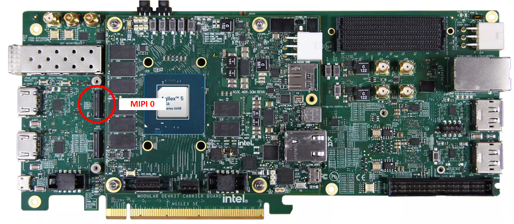
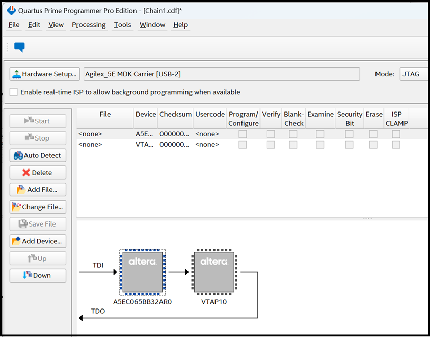
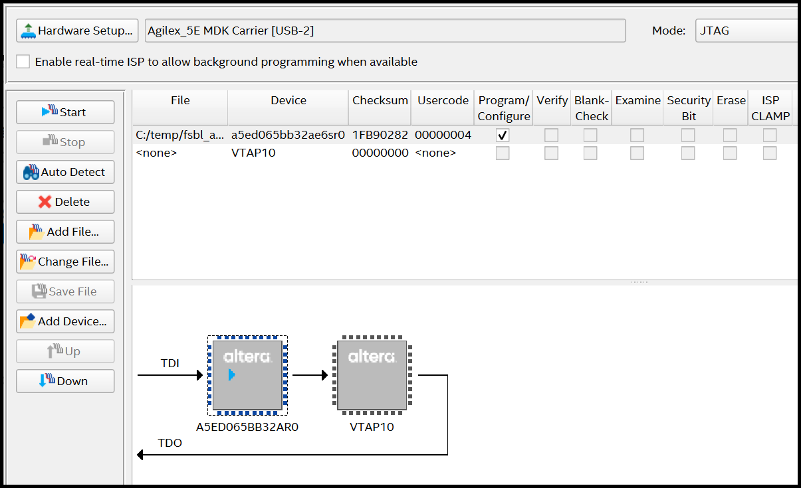

# Holoscan Sensor Bridge MIPI to 10GbE System Example Design for Agilex™ 5 Devices

The design is compatible with
[Altera® Quartus® Prime Pro Edition version 25.1 Linux](https://www.intel.com/content/www/us/en/software-kit/851652/intel-quartus-prime-pro-edition-design-software-version-25-1-for-linux.html).

## Overview

The Holoscan Sensor Bridge MIPI to 10GbE System Example Design for Agilex™ 5 Devices demonstrates an implementation of using industry-standard Mobile Industry Processor Interface (MIPI) D-PHY and MIPI CS1-2 interface on Agilex™ 5 FPGAs to integrate to a Holoscan processing flow.

The MIPI interface supports up to 2.5Gbps per lane and up to 8x lanes per MIPI
interface, enabling seamless data reception from multiple 4K image sensors to
the FPGA fabric for further processing. Each MIPI CSI-2 IP instance converts
pixel data to AXI4-Streaming outputs, enabling connectivity to other IP cores
within Altera's Video and Vision Processing (VVP) Suite.

The FPGA design comprises a MIPI D-PHY and MIPI CSI-2 interface connected to an NVIDIA Holoscan Sensor Bridge IP and Altera's Low Latency Ethernet 10G IP.

The software comprises a number of demonstration applications running within [NVIDIA Holoscan Sensor Bridge SDK](https://docs.nvidia.com/holoscan/sensor-bridge/latest/index.html).

<br/>

{:style="display:block; margin-left:auto; margin-right:auto; width: 80%"}
<center markdown="1">

**High-Level Block Diagram of the Holoscan Sensor Bridge System Example Design**
</center>
<br/>

## Pre-requisites

Follow the instructions provided in the section to run the Holoscan Sensor Bridge MIPI to 10GbE System Example Design for Agilex™ 5 Devices.

### **Hardware Requirements**

* [Agilex™ 5 FPGA E-Series 065B Modular Development Kit].

<br/>
{:style="display:block; margin-left:auto; margin-right:auto"}
<center markdown="1">

**Agilex™ 5 FPGA E-Series 065B Modular Development Kit**
</center>
<br/>

* 1 or 2 [Framos FSM:GO IMX678C Camera Modules], with:
  * [Wide 110deg HFOV Lens], or
  * [Medium 100deg HFOV Lens], or
  * [Narrow 54deg HFOV Lens].
* Mount/Tripod
  * [Framos Tripod Mount Adapter].
  * [Tripod].
* A Framos cable for PixelMate MIPI-CSI-2 for each Camera Module:
  * [150mm flex-cable], or
  * [300mm micro-coax cable].
* USB Micro B JTAG Cable (for JTAG programming).
* [10GBase-T SFP+ to RJ45 module]
* Cat6 Ethernet Cable
* [NVIDIA Jetson Orin AGX Devkit](https://developer.nvidia.com/embedded/learn/jetson-agx-orin-devkit-user-guide/index.html)
<br/>

### **Software Requirements**

* NVIDIA host system running Holoscan SDK
  * Set up the host system following : [NVIDIA Host Setup]
  !!! NOTE "Note"
      When cloning the [Holoscan Sensor Bridge Repo] use the Altera mirror:
      ```
      git clone -b altera-2.3.0 --single-branch https://github.com/altera-fpga/holoscan-sensor-bridge
      ```
<br/>

### **Download the pre-built FPGA**

* Download the Agilex™ 5e Modular Development board SOF binaries:

<br/>
<center markdown="1">

**Binaries**

| Source | Link | Description |
| ---- | ---- | ---- |
| SOF | [AGX_5E_065B_Modular_DevKit_HSB_MIPI_1_10GbE.sof](https://github.com/altera-fpga/agilex-ed-hsb-mipi/releases/download/rel-25.1-2507-4/AGX_5E_065B_Modular_DevKit_HSB_MIPI_1_10GbE.sof) | Programs the board to connect to the Holoscan system |

</center>

<br/>

## Getting Started - run with pre-built FPGA

Follow the instructions provided in this section to run the Holoscan Sensor Bridge MIPI to 10GbE System Example Design for Agilex™ 5 Devices.

### **Setting Up your Modular Development Board**

!!! NOTE "Warning"
    Handle ESD-sensitive equipment (boards, microSD Cards, Camera sensors, etc.) only when properly grounded and at an ESD-safe workstation

* Configure the board switches as shown:

<br>

{:style="display:block; margin-left:auto; margin-right:auto"}
<center markdown="1">

**Modular Development Board - Default Switch Positions**
</center>
<br>

* Connect micro USB cable between the carrier board (`J35`) and the Host PC.
  This will be used for JTAG communication. Look at what ports are enumerated
  on your Host computer. There should be a series of four.

<br>

{:style="display:block; margin-left:auto; margin-right:auto"}
<center markdown="1">

**Board Connections**
</center>
<br>


### **Board and NVIDIA Host System Setup**

!!! NOTE "Warning"
    Handle ESD-sensitive equipment (boards, microSD Cards, Camera sensors, etc.) only when properly grounded and at an ESD-safe workstation

Make the required connections between the NVIDIA Host System and the Modular Development
board as shown in the following diagram:

<br/>

{:style="display:block; margin-left:auto; margin-right:auto;"}
<center markdown="1">

**Development Kit and Host System Connection diagram**
</center>
<br/>

* Connect the Framos cable(s) between the Framos Camera Module(s) and the Modular
  Development board taking care to align the cable(s) correctly with the
  connectors (pin 1 to pin 1). The current design only supports a single camera which should be connected to MIPI 0.

{:style="display:block; margin-left:auto; margin-right:auto;"}
<center markdown="1">

**Board MIPI connections**
</center>
<br/>

{:style="display:block; margin-left:auto; margin-right:auto;"}
<center markdown="1">

**Board MIPI and Ribbon Cable**
</center>

<br/>

{:style="display:block; margin-left:auto; margin-right:auto;"}
<center markdown="1">

**Camera and Ribbon Cable**
</center>
<br/>


## Running the Demonstrations

### **Program the FPGA SOF**

* To program the FPGA using SOF:

  * Power down the board. Set MSEL=JTAG by setting the **S4** dip switch
    on the SOM to **OFF-OFF**.
    * This prevents the starting of any bootloader and FPGA configuration after
      power up and until the SOF is programmed over JTAG.

  * Power up the board.

  * Either use your own or download the pre-built `SOF` image, and program
    the FPGA with either the command:

    ```bash
    quartus_pgm -c 1 -m jtag -o "p;AGX_5E_065B_Modular_DevKit_HSB_MIPI_1_10GbE.sof"
    ```

  * or, optionally use the Quartus® Programmer GUI:

    * Launch the Quartus® Programmer and Configure the **"Hardware Setup..."**
      settings as follows:

<br>

{:style="display:block; margin-left:auto; margin-right:auto"}
<center markdown="1">

**Programmer GUI Hardware Settings**
</center>
<br>

* Click "Auto Detect", select the device `A5EC065BB32AR0` and press
  **"Change File.."**
<br>

{:style="display:block; margin-left:auto; margin-right:auto"}
<center markdown="1">

**Programmer after "Auto Detect"**
</center>
<br>

Select your `AGX_5E_065B_Modular_DevKit_HSB_MIPI_1_10GbE.sof` file. Check the
**"Program/Configure"** box and press the **"Start"** button (see below). Wait
until the programming has been completed.

<br>

{:style="display:block; margin-left:auto; margin-right:auto"}
<center markdown="1">

**Programming the FPGA with SOF file**
</center>
<br>


### **Demonstrations**

The following examples applications are available to demonstrate the Holoscan Sensor Bridge MIPI to 10GbE System Example Design for Agilex™ 5 Devices.

#### Set up host system
Set up the NVIDIA host system as per [instructions](hsb-mipi-1-10GbE.md#board-and-nvidia-host-system-setup).

#### Build the Demo Docker Container
Build the holoscan sensor bridge demonstration container. For systems with dGPU or DGX Spark,

```
cd <holoscan sensor bridge>
sh docker/build.sh --dgpu
```

For systems with iGPU,
```
cd <holoscan sensor bridge>
sh docker/build.sh --igpu
```

#### To run a demo application, start the demo container
```
cd <holoscan sensor bridge>
sh docker/demo.sh
```

#### From within the Demo container run one of the following demos:
  * Simple Playback Example
```
python examples/linux_agx5_player.py
```
* YOLOv8 Body Pose Example

[Follow instructions to download YOLOv8 ONNX Model](https://docs.nvidia.com/holoscan/sensor-bridge/latest/examples.html#running-the-imx274-body-pose-example)
```
python examples/linux_body_pose_estimation_agx5.py
```

* TAO PeopleNet Example

[Follow instructions to download tao peoplenet model](https://docs.nvidia.com/holoscan/sensor-bridge/latest/examples.html#running-the-imx274-tao-peoplenet-example)
```
python examples/linux_tao_peoplenet_agx5.py
```


## Recommended User Flows

### Sources

The sources listed in this table are the most current and highly recommended
for Quartus® 25.1 builds. Users are advised to utilize the updated versions
of these building blocks in production environments. Please note that this
is a demonstration design and is not suitable for production or final
deployment.

<center markdown="1">

**System Example Design Source Repository**

|Component |Location |Branch |
|-|-|-|
|Assets Release Tag|[https://github.com/altera-fpga/agilex-ed-hsb-mipi/releases/tag/rel-25.1-2507-4]| main |
|Repository|[https://github.com/altera-fpga/agilex-ed-hsb-mipi](https://github.com/altera-fpga/agilex-ed-hsb-mipi/tree/main)| main |
|Holoscan SDK|[https://github.com/altera-fpga/holoscan-sensor-bridge]|altera-2.3.0|

</center>

<br/>

With the available resources, you can create and modify, build and compile, and
execute the Holoscan Sensor Bridge MIPI to 10GbE System Example Design for Agilex™ 5 Devices. There
are 2 recommended flows that you can explore:

* [User Flow 1]: [Getting Started - Running with pre-built FPGA.](#getting-started-run-with-pre-built-fpga)
* [User Flow 2]: Use the [Modular Design Toolkit (MDT) Flow](https://github.com/altera-fpga/agilex-ed-hsb-mipi/tree/main/a5e065b-mod-devkit/README.md#creating-and-compiling-holoscan-sensor-bridge-mipi-to-10gbe-system-example-design) to build FPGA SOF

<br/>

<style>
r { color: Red; font-weight: bold;}
o { color: Orange; font-weight: bold;}
g { color: Green; font-weight: bold;}
y { color: #CCCC00; font-weight: bold;}
</style>

<center markdown="1">

### Flows 
**Recommended User Flows**

 |User Flow|Description|[User Flow 1]|[User Flow 2]|
 |---------------------------------|-----------------------------------------------------------------------------------------------------------------------------------------------------------------------------------:|:-----------------------------------------------------------------------------------:|:-------------------------------------------------------------------------------------------------:|
 |[Pre-requisites](#pre-requisites)|[Hardware Requirements.](#hardware-requirements)|[<g>&check;</g>](#hardware-requirements)                    |[<g>&check;</g>](#hardware-requirements)                    |
 |                                 | [Software Requirements to run.](#software-requirements)                                                                                                                     |[<g>&check;</g>](#software-requirements)             |[<g>&check;</g>](#software-requirements)             |
 |                                 | [Download the Pre-built FPGA.](#download-the-pre-built-fpga)                                                                                                               |[<g>&check;</g>](#download-the-pre-built-fpga)          |<r>&cross;</r>                                                                                     |
 |HW-Compilation                   | Creating and Building the Design based on the [Modular Design Toolkit (MDT) Flow](https://github.com/altera-fpga/agilex-ed-hsb-mipi/tree/main/a5e065b-mod-devkit/README.md#creating-and-compiling-holoscan-sensor-bridge-mipi-to-10gbe-system-example-design)                                                                                              |<r>&cross;</r>                                                                       |<g>&check;</g>                                          |
 |[Programming](#program-the-fpga-sof)      | [Setting Up your Modular Development Board.](#setting-up-your-modular-development-board)                                                                                           |[<g>&check;</g>](#setting-up-your-modular-development-board)|[<g>&check;</g>](#setting-up-your-modular-development-board)|
 |                                 | [Program the FPGA SOF.](#program-the-fpga-sof)                                                                                                                                                              |<g>&check;</g>                                                                       |[<g>&check;</g>](#program-the-fpga-sof)                     |<r>&cross;</r>                                                                                     |
 |[Running](#demonstrations)              | [Board and Host System Setup.](#set-up-host-system)                                                                                                                               |[<g>&check;</g>](#set-up-host-system)                  |[<g>&check;</g>](#set-up-host-system)                  |
 |                                 | [Running Demonstrations.](#to-run-a-demo-application-start-the-demo-container)                                                                                                                               |[<g>&check;</g>](#to-run-a-demo-application-start-the-demo-container)                  |[<g>&check;</g>](#to-run-a-demo-application-start-the-demo-container)                  |
 
</center>
<br/>

## Other Repositories Used
|Component |Location |Branch |
|-|-|-|
|Modular Design Toolkit|[https://github.com/altera-fpga/modular-design-toolkit](https://github.com/altera-fpga/modular-design-toolkit/tree/rel/25.1)|rel-25.1|

## Useful User Manuals and Reference Materials
* [Agilex™ 5 FPGA E-Series 065B Modular Development Kit](https://www.altera.com/products/devkit/a1jui0000061qabmaa/agilex-5-fpga-and-soc-e-series-modular-development-kit-es).

<br/>

## Notices & Disclaimers

Altera<sup>&reg;</sup> Corporation technologies may require enabled hardware, software or service activation.
No product or component can be absolutely secure. 
Performance varies by use, configuration and other factors.
Your costs and results may vary. 
You may not use or facilitate the use of this document in connection with any infringement or other legal analysis concerning Altera or Intel products described herein. You agree to grant Altera Corporation a non-exclusive, royalty-free license to any patent claim thereafter drafted which includes subject matter disclosed herein.
No license (express or implied, by estoppel or otherwise) to any intellectual property rights is granted by this document, with the sole exception that you may publish an unmodified copy. You may create software implementations based on this document and in compliance with the foregoing that are intended to execute on the Altera or Intel product(s) referenced in this document. No rights are granted to create modifications or derivatives of this document.
The products described may contain design defects or errors known as errata which may cause the product to deviate from published specifications.  Current characterized errata are available on request.
Altera disclaims all express and implied warranties, including without limitation, the implied warranties of merchantability, fitness for a particular purpose, and non-infringement, as well as any warranty arising from course of performance, course of dealing, or usage in trade.
You are responsible for safety of the overall system, including compliance with applicable safety-related requirements or standards. 
<sup>&copy;</sup> Altera Corporation.  Altera, the Altera logo, and other Altera marks are trademarks of Altera Corporation.  Other names and brands may be claimed as the property of others. 

OpenCL* and the OpenCL* logo are trademarks of Apple Inc. used by permission of the Khronos Group™. 

[Agilex™ 5 FPGA E-Series 065B Modular Development Kit]: https://www.altera.com/products/devkit/a1jui0000061qabmaa/agilex-5-fpga-and-soc-e-series-modular-development-kit-es


[Altera® Quartus® Prime Pro Edition version 25.1 Linux]: https://www.intel.com/content/www/us/en/software-kit/851652/intel-quartus-prime-pro-edition-design-software-version-25-1-for-linux.html


[Framos FSM:GO IMX678C Camera Modules]: https://www.framos.com/en/fsmgo
[Wide 110deg HFOV Lens]: https://www.mouser.co.uk/ProductDetail/FRAMOS/FSMGO-IMX678C-M12-L110A-PM-A1Q1?qs=%252BHhoWzUJg4KQkNyKsCEDHw%3D%3D
[Medium 100deg HFOV Lens]: https://www.mouser.co.uk/ProductDetail/FRAMOS/FSMGO-IMX678C-M12-L100A-PM-A1Q1?qs=%252BHhoWzUJg4IesSwD2ACIBQ%3D%3D
[Narrow 54deg HFOV Lens]: https://www.mouser.co.uk/ProductDetail/FRAMOS/FSMGO-IMX678C-M12-L54A-PM-A1Q1?qs=%252BHhoWzUJg4L5yHZulKgVGA%3D%3D
[Framos Tripod Mount Adapter]: https://www.framos.com/en/products/fma-mnt-trp1-4-v1c-26333
[Tripod]: https://thepihut.com/products/small-tripod-for-raspberry-pi-hq-camera
[150mm flex-cable]: https://www.mouser.co.uk/ProductDetail/FRAMOS/FMA-FC-150-60-V1A?qs=GedFDFLaBXGCmWApKt5QIQ%3D%3D&_gl=1*d93qim*_ga*MTkyOTE4MjMxNy4xNzQxMTcwMzQy*_ga_15W4STQT4T*MTc0MTE3MDM0Mi4xLjEuMTc0MTE3MDQ5OS40NS4wLjA
[300mm micro-coax cable]: https://www.mouser.co.uk/ProductDetail/FRAMOS/FFA-MC50-Kit-0.3m?qs=%252BHhoWzUJg4K3LtaE207mhw%3D%3D
[10GBase-T SFP+ to RJ45 module]: http://www.wiitek.com/show_imgnews.asp?id=626&sort_id=122


[NVIDIA Host Setup]: https://docs.nvidia.com/holoscan/sensor-bridge/latest/setup.html
[Holoscan Sensor Bridge Repo]: https://docs.nvidia.com/holoscan/sensor-bridge/latest/build.html#building-the-holoscan-sensor-bridge-container


[User flow 1]: ./hsb-mipi-1-10GbE.md#pre-requisites
[User flow 2]: https://github.com/altera-fpga/agilex-ed-hsb-mipi/tree/main/a5e065b-mod-devkit/README.md#creating-and-compiling-holoscan-sensor-bridge-mipi-to-10gbe-system-example-design

[Modular Design Toolkit (MDT) Flow]: https://github.com/altera-fpga/agilex-ed-hsb-mipi/tree/main/a5e065b-mod-devkit/README.md#creating-and-compiling-holoscan-sensor-bridge-mipi-to-10gbe-system-example-design

[AGX_5E_065B_Modular_DevKit_HSB_MIPI_1_10GbE.sof]: https://github.com/altera-fpga/agilex-ed-hsb-mipi/releases/download/rel-25.1-2507-4/AGX_5E_065B_Modular_DevKit_HSB_MIPI_1_10GbE.sof


[https://github.com/altera-fpga/agilex-ed-hsb-mipi]: https://github.com/altera-fpga/agilex-ed-hsb-mipi/tree/main
[https://github.com/altera-fpga/agilex-ed-hsb-mipi/releases/tag/rel-25.1-2507-4]: https://github.com/altera-fpga/agilex-ed-hsb-mipi/releases/tag/rel-25.1-2507-4

[https://github.com/altera-fpga/holoscan-sensor-bridge]: https://github.com/altera-fpga/holoscan-sensor-bridge/tree/altera-2.3.0

[https://github.com/altera-fpga/modular-design-toolkit]: https://github.com/altera-fpga/modular-design-toolkit/tree/rel/25.1


