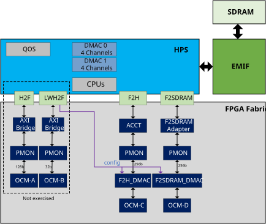
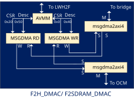
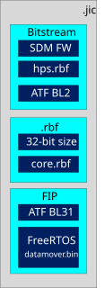
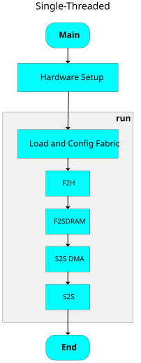
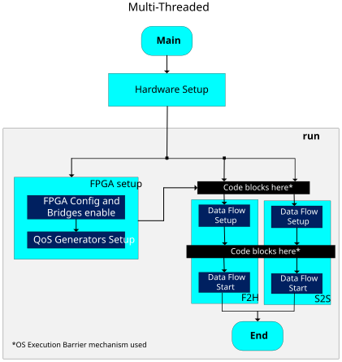
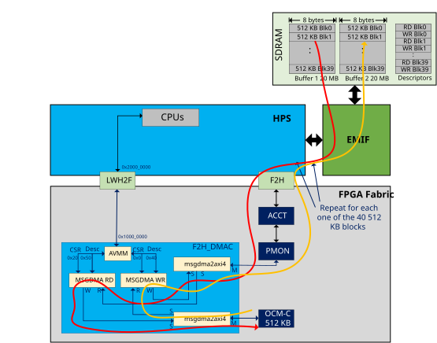
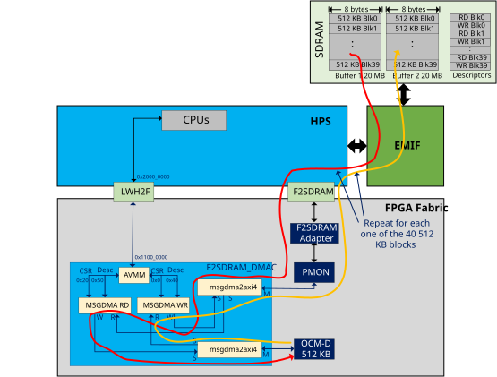
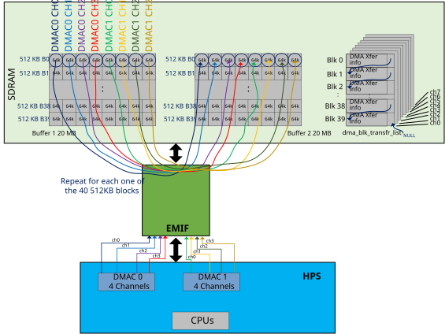
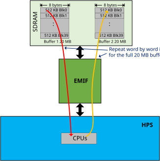

## Introduction

This example demonstrates how to exercise a set of FreeRTOS applications in which data is moved between different components such as HPS SDRAM and OCRAMs in the fabric, following different data paths. The example is exercised in a development kit and. The example describes the hardware project, the FreeRTOS applications and also provides instructions on how to build the hardware design and HPS software binaries.

### Overview

The Data Mover design example showcases data transactions among FPGA fabric, HPS, and external SDRAM memory. This embedded system is implemented in the Agilex™ 5 FPGA E-Series 065A Premium Development Kit and incorporates all data channels between the FPGA fabric and the HPS (F2H, F2SDRAM, H2F, and LWH2F). The example moves several blocks of data between the HPS SDRAM to different OCMs (On-Chip Memory) in the fabric, in both directions. The data movement can be controlled either by the HPS CPUs or DMA (Direct Memory Access) controllers in HPS or fabric. Currently, the example includes a set of FreeRTOS applications, running on the HPS, that coordinates the different data flows. The applications also benchmark the data transfer rate to highlight performance metrics for different data paths.  The example also showcases DDR contention that occurs when HPS and FPGA fabric are simultaneously trying to access their shared DDR IP. DDR contention is a significant consideration for designs that involve both continual FPGA-memory data transactions and data-intensive HPS applications.

Ultimately, this example aims to deliver crucial data movement performance information that can guide users towards using the appropriate fabric-SDRAM data channels for their designs. 

The example includes:

* Hardware design which is based on the Baseline Hardware Reference Design, also using **HPS Boot first** configuration mode.
* HPS Software is based on FreeRTOS and this is integrated by:

  - ARM Trusted Firmware used as bootloader for the FreeRTOS application that includes the FSBL (BL2) and SSBL(BL31).
  - FreeRTOS BSP for Agilex™ 5 SOC that includes support functions to configure the HPS hardware and configure the FPGA fabric.
  - FreeRTOS application support libraries used to exercise the different data flows supported. 
  - FreeRTOS applications: **single-threaded** and **multi-threaded**.

The HPS software, the initial bitstream  and the 2nd Phase fabric design are integrated into a **.jic** image that is loaded into the QSPI device in the development kit.

The complete Data Mover System Example is located at the following path: [https://github.com/altera-fpga/agilex5e-ed-gsrd/tree/QPDS26.1.1_REL_GSRD_PR/dk-a5e065ab32aea-enablement/datamover](https://github.com/altera-fpga/agilex5e-ed-gsrd/tree/QPDS26.1.1_REL_GSRD_PR/dk-a5e065ab32aea-enablement/datamover)

### Data Mover Hardware Design

The hardware design for this example  is based on the Baseline hardware reference design but adds the **dm_fab_system** component. This new component complements the original Baseline hardware reference design by adding additional fabric modules that exercise the data movement in different paths. These data movement paths include:

* Moving data between HPS SDRAM and OCM-A through **H2F bridge** ¹.
* Moving data between HPS SDRAM and OCM-B through **LWH2F bridge** ¹.
* Moving data between HPS SDRAM and OCM-C through **F2H bridge**.
* Moving data between HPS SDRAM and OCM-D through **F2SDRAM bridge**.
* Moving data between different HPS SDRAM regions  through HPS DMA controllers(**S2S_DMA**).
* Moving data between different HPS SDRAM regions  through direct CPU read/write operations (**S2S**).

**¹** This data path is not exercised in this version of the example.

A block diagram of the hardware design with the relevant components for this example is shown in the next diagram.

{:style="display:block; margin-left:auto; margin-right:auto; width: 70%"}

A brief description of the hardware design components is shown next:

* **HPS IP**: The HPS controls all data transaction functionalities, including DMA operations (using DMA controllers in HPS or in the fabric), QoS generation, EMIF data transfer, and the general execution of the FreeRTOS application. In this design, the F2H bridge MMU port setting of this IP is enabled so that F2H transactions will go through the SMMU for cache-coherent transactions. In FreeRTOS applications, the MMU is configured to map 1 to 1 the physical to virtual memory, so these 2 always match.

* **ACCT (ACE5-Lite CCT) IP**: This component converts AXI4 data traffic from the FPGA fabric into ACE5-Lite data traffic before entering the ACE5-Lite F2H bridge. Subsequently, the ACE5-Lite F2H bridge allows FPGA data traffic to directly enter L3 cache in the HPS complex.

* **F2SDRAM adapter**: This component  hardcodes AWCACHE, ARCACHE, and AxUSER parameters to enable F2SDRAM direct access from the fabric to the SDRAM: 

  - ARCACHE = ‘b0010 or ‘b0011. 
  - AWCACHE = ‘b0010 or ‘b0011. 
  - AxUSER = ‘b1110_0000. 
  - Address width: 40, Data width: 256<br><br>

* **F2H_DMAC and F2SDRAM_DMAC Sub-systems:** The Data mover example makes use of the Modular Scatter-Gather Direct-Memory-Access (mSGDMA) IPs to facilitate the F2H and F2SDRAM data movement to/from HPS SDRAM.
  Each one of the F2H_DMAC and F2SDRAM_DMAC sub-systems include 2 mSGDMA instances: Write mSGDMA and Read mSGDMA. The Read/Write terminology is chosen from operations that go from Fabric to the HPS SDRAM. So Write mSGDMA is used to write data from the OCM into the SDRAM. The Read mSGDMA is used to read data from the HPS SDRAM and write it into the OCM. The mSGDMAs are configured with prefetcher-disabled with HPS software controlling the start of each data block transfer. The HPS initiates data transactions in the mSGDMAs by directly accessing their CSR and Descriptors registers.<br>
  The F2H_DMAC and F2SDRAM_DMAC sub-systems also include a couple of **msgdma2axi4**  components. One of these combines the write channel of the Write mSGDMA and the read channel of the Read mSGDMA into one single AXI channel interfacing the upstream bridge (F2H or F2SDRAM). The second **msgdma2axi4** component combines the read channel of the Write mSGDMA and the write channel of the Write mSGDMA into another AXI channel interfacing the corresponding downstream OCM component in the fabric.
  The F2H_DMAC and F2SDRAM_DMAC sub-systems also include an **AVMM** (Avalon Memory Mapped Pipeline Bridge)  component. This component is used to reduce the register-to-register delay between the LWH2F bridge and the configuration registers in the mSGDMA components. This helps to improve the maximum operation frequency in the system. A block diagram of the DMAC component is shown in the next figure, this applies for F2H_DMAC and F2SDRAM_DMAC . 
  
  {:style="display:block; margin-left:auto; margin-right:auto; width: 45%"}
  
  The configuration interface in the AVMM component has a base address relative to the LWH2F bridge (address 0x20000000).  The following table shows the starting address of the CSR and descriptor registers in the mSGDMAs components included in both F2H_DMAC and F2SDRAM_DMAC sub-systems, these offsets are with respect to the base address of the corresponding AVMM configuration interface, also shown in the table.
  
  | Component | AVMM Base Address| Registers Blocks | Address | Physical address from HPS |
  | :-- | :-- | :-- | :-- |  :-- |
  | F2H_DMAC | 0x10000000 | CSRs Write mSGDMA| 0x0 | 0x30000000 |
  | | | CSRs Read mSGDMA| 0x20| 0x30000020 |
  | | | Descriptor Write mSGDMA | 0x40 | 0x30000040 |
  | | | Descriptor Read mSGDMA| 0x50 | 0x30000050 |
  | F2SDRAM_DMAC | 0x11000000 | CSRs Write mSGDMA| 0x0 | 0x31000000 |
  | | | CSRs Read mSGDMA| 0x20| 0x31000020 |
  | | | Descriptor Write mSGDMA | 0x40 | 0x31000040 |
  | | | Descriptor Read mSGDMA| 0x50 | 0x31000051 |
  
  The HPS is the one in charge of writing to these registers to start the data transfer. Please refer to the [Modular Scatter-Gather DMA Core in Embedded Peripherals IP User Guide ](https://docs.altera.com/r/docs/683130/25.3/embedded-peripherals-ip-user-guide/modular-scatter-gather-dma-core) for reference about how to configure the corresponding registers.
  
* **On-Chip Memories**: There are 4 instances of OCMs, one for each of the data flows that involve the FPGA bridges. These act as endpoint for these flows. The size of each OCM is 512 KB. The following table shows the based address of each OCM indicating also the component to which this address is relative to:

    | OCM | Base Address | Reference Component | Physical address from HPS |
    | :-- | :-- |  :-- | :-- |
    | OCM-A | 0x00000000 | H2F | 0X40000000 |
    | OCM-B | 0x00000000 | LWH2F | 0x20000000 |
    | OCM-C | 0x00000000 | mSGDMAs in F2H_DMAC | N/A |
    | OCM-D | 0x00000000 | mSGDMA in F2SDRAM_DMAC | N/A |

* **Performance Monitor**: This component is instantiated into the fabric-HPS data bridge interface as a pass-through connection to monitor the performance metrics of the data path in which this is instantiated. This design example instantiates 4 PMON modules,  one for each fabric-HPS data bridge, and focuses on read/write efficiencies, read/write latencies, and throughput for each data bridge. The statistics captured can be observed through the System Console in Quartus.

### Data Mover HPS Software

The HPS software for the Data Mover System Example Design was developed as a set of applications and has 2 main objectives:

* Demonstrate the data movement in the different data paths integrated in the hardware design. The data movement is performed in several ways:

  a)  Move data from a 20 MB buffer in SDRAM to a 512KB On-Chip memory in the fabric.<br>
  b) Move data from a 512KB On-Chip memory in the fabric to a 20 MB buffer in SDRAM.<br>
  c) Move data from a 20 MB buffer in SDRAM to another 20 MB buffer also in the SDRAM.<br>
  
  The data movement is exercised in different hardware data paths and this is done through software tasks that will be explained later. The data is transferred continuously during a configurable period of time. This transfer also can be done at data blocks of 512 KB using a DMA mechanism (either from the **mSGDMA** components in the fabric or the DMA controllers in the HPS ) or directly by CPU read/write operations.

* Benchmarking the data throughput in the different data paths exercised so you can evaluate the performance of the system. The performance metrics are obtained by the software by determining the total number of bytes transferred during the transfer time window.

At this time, the HPS software consists of a set of FreeRTOS applications that are described in the following section.

<h4> HPS FreeRTOS Software </h4>

The HPS FreeRTOS application software relies on the Arm Trusted Firmware as the bootloader and to provide the SVC services needed to configure the FPGA fabric. The ATF BL2 layer is included as part of the Bitstream. The ATF BL31 and the FreeRTOS software (acting as BL33) are packed into a FIP file. There is a .rbf that is integrated by the a 32-bit word followed by the 2nd phase core.rbf file. This 32-bit word corresponds to the size of the core.rbf. The Bitstream, the .rbf and the FIP are packed into a .jic file as shown in the following diagram. The .jic must be stored in the QSPI device to boot from this.

{:style="display:block; margin-left:auto; margin-right:auto; width: 15%"}

The example design includes 2 main applications: **Single-Threaded** and **Multi-Threaded**. These applications start by performing the initial HPS HW configuration. Then it continues configuring the FPGA Fabric (2nd Phase) and finally executing the data movement exercise tasks. 

For the 2nd Phase FPGA configuration, each FreeRTOS application needs to determine the size of the core.rbf file so it can know the number of bytes it needs to read from the QSPI device. The size is obtained by reading the first 4 bytes from the .rbf file in the jic. Once the HPS knows the size of file, it proceed to load the actual core.rbf (located at the location of the .rbf + 4) and then perform the FPGA configuration with this.

Both applications support **Symmetric Multi Processing** to allow to split the applications workload among the available HPS CPUs. You can enable this feature at build time. This can be enabled by changing the **-DSMP=ON** setting in the [datamover-app/build.sh](https://github.com/altera-fpga/agilex5e-ed-gsrd/tree/QPDS26.1.1_REL_GSRD_PR/dk-a5e065ab32aea-enablement/datamover/software/freertos/datamover-app/build.sh) script.

The following sections describe these 2 main applications, and also each one of the data mover tasks that are exercised.

<h5> Single-Threaded Application </h5>

This application starts by performing the FPGA configuration in which it loads into SDRAM the 2nd phase .rbf file from QSPI and configures the fabric with this. After this, it executes the tasks that perform the data movement operations sequentially one by one. The data movement tasks exercise the following functionality: 

* Data movement exercising the F2H data path (SDRAM to OCM and back) using **mSGDMA** DMA controller in the fabric.
* Data movement exercising the F2SDRAM path (SDRAM to OCM and back)  using **mSGDMA** DMA controller in the fabric.
* Data movement exercising S2S DMA path ( SDRAM to SDRAM) using HPS DMA controllers.
* Data movement exercising S2S path ( SDRAM to SDRAM) moving data word by word through CPU direct read and write operations.

The source code for Single-Threaded application can be found at:
 [https://github.com/altera-fpga/agilex5e-ed-gsrd/tree/QPDS26.1.1_REL_GSRD_PR/dk-a5e065ab32aea-enablement/datamover/software/freertos/datamover-app/single-threaded]( https://github.com/altera-fpga/agilex5e-ed-gsrd/tree/QPDS26.1.1_REL_GSRD_PR/dk-a5e065ab32aea-enablement/datamover/software/freertos/datamover-app/single-threaded)

The **application source code** is [datamover-app/single-threaded/main.c]( https://github.com/altera-fpga/agilex5e-ed-gsrd/tree/QPDS26.1.1_REL_GSRD_PR/dk-a5e065ab32aea-enablement/datamover/software/freertos/datamover-app/single-threaded/main.c).

The following image shows  the high-level flow diagram of the Single-Threaded application.

{:style="display:block; margin-left:auto; margin-right:auto; width: 20%"}


<h5> Multi-Threaded Application </h5>

This application executes the functions that perform the FPGA configuration and the data movement in parallel using the FreeRTOS multi-thread support. This application uses the execution barrier mechanism provided by FreeRTOS to coordinate the execution of the tasks. The application launches in parallel the following tasks:

* FPGA Configuration. Performs the 2nd Phase fabric configuration and configures QOS (quality of service) generator. When this is done, the completion is signaled using a flag in the execution barrier mechanism. This flag is used to let the other tasks launched in parallel to know when they can proceed with the data movement.
* Data movement exercising the F2H data path (SDRAM to OCM and back) using **mSGDMA** DMA controller in the fabric. This task initially waits for the completion of the FPGA 2nd Phase configuration using the execution barrier. When this task detects the completion of the fabric configuration, it signals with a different flag in the same execution barrier mechanism that it is ready to start the data movement execution and then wait for the corresponding flag from the rest of the data movement tasks enabled. This guarantees that all the tasks start the data movement at the same time.
* Data movement exercising S2S path ( SDRAM to SDRAM) moving data word by word through the CPU. This task initially waits for the completion of the FPGA 2nd Phase configuration using the execution barrier. When this task detects the completion of the fabric configuration, it signals with a different flag in the same execution barrier mechanism that it is ready to start the data movement execution and then wait for the corresponding flag from the rest of the data movement tasks enabled. This guarantees that all the tasks start the data movement at the same time.

You can edit this application to change the tasks that you want to execute in parallel.
The source code for Multi-Threaded application and the data movement tasks can be found at:
   [https://github.com/altera-fpga/agilex5e-ed-gsrd/tree/QPDS26.1.1_REL_GSRD_PR/dk-a5e065ab32aea-enablement/datamover/software/freertos/datamover-app/multi-threaded](https://github.com/altera-fpga/agilex5e-ed-gsrd/tree/QPDS26.1.1_REL_GSRD_PR/dk-a5e065ab32aea-enablement/datamover/software/freertos/datamover-app/multi-threaded)

The **application source code** is [datamover-app/multi-threaded/main.c]( https://github.com/altera-fpga/agilex5e-ed-gsrd/tree/QPDS26.1.1_REL_GSRD_PR/dk-a5e065ab32aea-enablement/datamover/software/freertos/datamover-app/multi-threaded/main.c) .

The following image shows  the high-level flow diagram of the Multi-Threaded application.

{:style="display:block; margin-left:auto; margin-right:auto; width: 60%"}

<h5> Data Movement Task in Applications </h5>

Each of the applications described above includes an implementation-specific set of the data movement functions. These are located at the **datamover_tasks/** directory under the specific application directory. This is a brief description of the actions that the data mover functions do: 

* **F2H Data Movement Task - f2h_task()**: This exercises the data movement using the F2H bridge during a configurable period of time ( defined through the **transaction_seconds** input parameter ). The function creates 2 data buffers in SDRAM of 20 MB (each one with space to store 40 blocks of 512 KB data).The buffer 1 is initialized with a data pattern. The data movement consists of moving  chunks of data with size of 512 KB from one of the SDRAM buffers to the OCM-C using the READ MSGDMA controller in the F2H_DMAC component and then moving back this chunk of data from the OCM-C to the second SDRAM buffer using the WRITE MSGDMA controller in the the F2H_DMAC component. The data movement is coordinated by this task using a set of 80 descriptors (40 used for reading from buffer 1 and 40 used for writing to buffer 2) that are pre-filled and used to configure the MSGDMAs (using the common [fabric_dmac]( https://github.com/altera-fpga/agilex5e-ed-gsrd/tree/QPDS26.1.1_REL_GSRD_PR/dk-a5e065ab32aea-enablement/datamover/software/freertos/datamover-app/fabric_dmac/) library also included as part of this example design). Each one of these descriptors indicates the size of the data block to move, the source and destination address of source/target components. This task also relies on semaphores and interrupts to coordinate the data transfer. The MSGDMA controllers are configured to trigger an  interrupt when the data transfer completes. To signal the completion of the data transfer, the READ MSGDMA uses **FPGA2HPS_Interrupt0** and the WRITE MSGDMA uses **FPGA2HPS_Interrupt1**. In this task, every time that a block of data transfer is started in any direction, the task waits there until data transfer completes. The wait makes use of a semaphore which is taken during the wait and released at the interrupt handler, executed when the data transfer completes and the corresponding interrupt triggers. At this time, the task proceeds to push the next descriptor to continue with the next data movement (the descriptors are defined in a Read -> Write order to move data from buffer1 to OCM, i.e. read, and then from OCM to buffer2, i.e. write). This process continues until all data in buffer 1 has been moved to the buffer 2. This task continuously monitors the execution time and if the execution period of time has not elapsed, then the data movement process is repeated from the initial chunk of data in the buffer 1. The task also keeps track of the total of bytes that have been transferred. When the execution time has finished, the task calculates and displays the average data transfer rate for benchmarking purposes. The next figure shows the data path that is followed by this task.
  
  {:style="display:block; margin-left:auto; margin-right:auto; width: 110%"}
  

  The source code of this task is shown at the following path:

  **single-threaded:** [datamover-app/single-threaded/datamover_tasks/f2h_task.c](https://github.com/altera-fpga/agilex5e-ed-gsrd/tree/QPDS26.1.1_REL_GSRD_PR/dk-a5e065ab32aea-enablement/datamover/datamover/software/freertos/datamover-app/single-threaded/datamover_tasks/f2h_task.c)<br>
  **multi-threaded:** [datamover-app/multi-threaded/datamover_tasks/f2h_task.c](https://github.com/altera-fpga/agilex5e-ed-gsrd/tree/QPDS26.1.1_REL_GSRD_PR/dk-a5e065ab32aea-enablement/datamover/software/freertos/datamover-app/multi-threaded/datamover_tasks/f2h_task.c)<br>

  The execution time is configurable using the **TEN_SECONDS** definition from the datamover_tasks/datamover_tasks.h header file.

* **F2SDRAM Data Movement Task - f2sdram_task()**: This exercises the data movement using the F2SDRAM bridge during a configurable period of time ( defined through the **transaction_seconds** input parameter ). The function creates 2 data buffers in SDRAM of 20 MB (each one with space to store 40 blocks of 512 KB data). The buffer 1 is initialized with a data pattern. The data movement consists of moving  chunks of data with size of 512 KB from one of the SDRAM buffers to the OCM-D using the READ MSGDMA controller in the F2SDRAM_DMAC component and then moving back this chunk of data from the OCM-D to the second SDRAM buffer using the WRITE MSGDMA controller in the F2SDRAM_DMAC component. The data movement is coordinated by this task using a set of 80 descriptors (40 used for reading from buffer 1 and 40 used for writing to buffer 2) that are pre-filled and used to configure the MSGDMAs (using the common [fabric_dmac]( https://github.com/altera-fpga/agilex5e-ed-gsrd/tree/QPDS26.1.1_REL_GSRD_PR/dk-a5e065ab32aea-enablement/datamover/software/freertos/datamover-app/fabric_dmac/) software library also included as part of this example design). Each one of these descriptors indicates the size of the data block to move, the source and destination address of the source/target components. This task also relies on semaphores and interrupts to coordinate the data transfer. The MSGDMA controllers are configured to trigger an  interrupt when the data transfer completes. To signal the completion of the data transfer, the READ MSGDMA uses **FPGA2HPS_Interrupt2** and the WRITE MSGDMA uses **FPGA2HPS_Interrupt3**. In this task, every time that a block of data transfer is started in any direction, the task waits there until data transfer completes. The wait makes use of a semaphore which is taken during the wait and released at the interrupt handler, executed when the data transfer completes and the corresponding interrupt triggers. At this time, the task proceeds to push the next descriptor to continue with the next data movement (the descriptors are defined in a Read -> Write order to move data from buffer1 to OCM, i.e. read, and then from OCM to buffer2, i.e. write). This process continues until all data in buffer 1 has been moved to the buffer 2. This task continuously monitors the execution time and if the execution period of time has not elapsed, then the data movement process is repeated from the initial chunk of data in the buffer 1. The task also keeps track of the total of bytes that have been transferred. When the execution time has finished, the task calculates and displays the average data transfer rate for benchmarking purposes. The next figure shows the data path that is followed by this task.
  
  {:style="display:block; margin-left:auto; margin-right:auto; width: 110%"}
  
  The source code of this task is shown at the following path:
  
  **single-threaded:** [datamover-app/single-threaded/datamover_tasks/f2sdram_task.c](https://github.com/altera-fpga/agilex5e-ed-gsrd/tree/QPDS26.1.1_REL_GSRD_PR/dk-a5e065ab32aea-enablement/datamover/datamover/software/freertos/datamover-app/single-threaded/datamover_tasks/f2sdram_task.c)<br>
  **multi-threaded:** [datamover-app/multi-threaded/datamover_tasks/f2sdram_task.c](https://github.com/altera-fpga/agilex5e-ed-gsrd/tree/QPDS26.1.1_REL_GSRD_PR/dk-a5e065ab32aea-enablement/datamover/software/freertos/datamover-app/multi-threaded/datamover_tasks/f2sdram_task.c)<br>
  
  The execution time is configurable using the **TEN_SECONDS** definition from the datamover_tasks/datamover_tasks.h header file.


* **S2S DMA Data Movement Task - s2s_dma_task()**: This exercises the data movement using the HPS DMACs (DMAC0 and DMAC1) controllers during a configurable period of time ( defined through the **transaction_seconds** input parameter ). The function creates 2 data buffers in SDRAM of 20 MB (each one with space to store 40 blocks of 512 KB data). The buffer 1 is initialized with a data pattern. The data movement consists of moving  chunks of data with size of 512 KB from one of the SDRAM buffers to the other. The 512 KB of data is split in 8 smaller data blocks of 64 KB and each one of these is transferred in parallel using a dedicated DMAC channel (each DMAC controller supports 4 channels, so the 8 channels available in DMAC0 and DMAC1 are used). To coordinate the data movement, this task creates 8 transfer lists (one per channel) of 40 items. Each item in the transfer lists indicates the size of the transfer block to move, start address of the source buffer and the start address of the destination buffer. When using the HPS DMAC the data transfer of the full 20 MB of data is done automatically using the **next_xfer_cfg** field in each one of the items in the transfer list. This field is initialized with the address of the next item in the transfer list, so when the data transfer of each 64 KB data chunk finishes, the next item pointed by **next_xfer_cfg** is processed to start automatically the new 64KB data transfer. This occurs in parallel for each one of the DMA channels. This task also relies on semaphores and interrupts to coordinate the data transfer. In this case, each one of the DMA channels is considered a resource, so when the initial transfer of  64 KB of data is started the task enters into a wait, taking a resource (each channel takes a resource) and remains there until all resources are released. When all of the 8 channels finish the automatic transfer of the 40 data chunks, the DMAC interrupt triggers, it executes the corresponding ISR handler in which the resource is released. When all channels finish their transfer, all the resources are released and the task exits from the wait. This task continuously monitors the execution time and if the execution period of time has not elapsed, then the data movement process is repeated from the initial chunks of data in the buffer 1. The task also keeps track of the total of bytes that have been transferred. When the execution time has finished, the task calculates and displays the average data transfer rate for benchmarking purposes.<br>
  <span style="color: red;">**NOTE**: Using DMAC0/DMAC1 controllers in the  HPS to move data between SDRAM regions is not the ideal path because the performance is not the best (as you can see it in the [Data Mover Benchmark Results](#data-mover-benchmark-results) section). For this purpose, it's recommended to use the F2H or F2SDRAM paths. </span>
  
  The next figure shows the data path that is followed by this task.
  
  {:style="display:block; margin-left:auto; margin-right:auto; width: 55%"}
  
  The source code of this task is shown at the following path:

  **single-threaded:** [datamover-app/single-threaded/datamover_tasks/s2s_dma_task.c](https://github.com/altera-fpga/agilex5e-ed-gsrd/tree/QPDS26.1.1_REL_GSRD_PR/dk-a5e065ab32aea-enablement/datamover/datamover/software/freertos/datamover-app/single-threaded/datamover_tasks/s2s_dma_task.c)<br>
  **multi-threaded:** [datamover-app/multi-threaded/datamover_tasks/s2s_dma_task.c](https://github.com/altera-fpga/agilex5e-ed-gsrd/tree/QPDS26.1.1_REL_GSRD_PR/dk-a5e065ab32aea-enablement/datamover/software/freertos/datamover-app/multi-threaded/datamover_tasks/s2s_dma_task.c)<br>
  
  The execution time is configurable using the **TEN_SECONDS** definition from the datamover_tasks/datamover_tasks.h header file.
  
* **S2S Data Movement Task - s2s_task():** This exercises the data movement from SDRAM to SDRAM using direct CPU read and write operations during a configurable period of time ( defined through the **transaction_seconds** input parameter). The function creates 2 data buffers in SDRAM of 20 MB. The buffer 1 is initialized with a data pattern and the CPU moves single 8-bytes words from buffer 1 to buffer 2. This task monitors the execution time, and when it finishes to transfer the full content of buffer 1 to buffer 2, it checks if the execution period of time has not elapsed. If this is the case, then the data movement process is restarted from the initial data in the buffer 1. The task also keeps track of the total of bytes that have been transferred. When the execution time has finished, the task calculates and displays the average data transfer rate for benchmarking purposes. The next figure shows the data path that is followed by this task.
  
  {:style="display:block; margin-left:auto; margin-right:auto; width: 60%"}
  
  The source code of this task is shown at the following path:
  
  **single-threaded:** [datamover-app/single-threaded/datamover_tasks/s2s_task.c](https://github.com/altera-fpga/agilex5e-ed-gsrd/tree/QPDS26.1.1_REL_GSRD_PR/dk-a5e065ab32aea-enablement/datamover/datamover/software/freertos/datamover-app/single-threaded/datamover_tasks/s2s_task.c)<br>
  **multi-threaded:** [datamover-app/multi-threaded/datamover_tasks/s2s_task.c](https://github.com/altera-fpga/agilex5e-ed-gsrd/tree/QPDS26.1.1_REL_GSRD_PR/dk-a5e065ab32aea-enablement/datamover/software/freertos/datamover-app/multi-threaded/datamover_tasks/s2s_task.c)<br>
  
  The execution time is configurable using the **TEN_SECONDS** definition from the datamover_tasks/datamover_tasks.h header file.

* **QOS Generator Configuration function - configure_qos_generator()**: The Quality-of-Service (QoS) feature  allows user to specify a mode and priority to the transaction order of different traffic sources when they attempt to use the same interconnect at the same time. In this example, data contention occurs when different sources from fabric-HPS bridges and the HPS attempt to use the EMIF interface for external memory access. Users can manipulate QoS values when such scenarios occur to find optimal data movement solutions on Agilex™ 5 FPGAs. The QOS is applicable to the  **Multi-Threaded application**, in which 2 or more tasks that access the SDRAM are executed in parallel, so this application calls the  **configure_qos_generator()** function as part of the **setup_fpga()** function. The four fabric-HPS data bridges can be configured with different QoS values by directly writing to the corresponding QoS registers in the HPS. In this design, users can modify the **setup_fpga()** function in [datamover-app/multi-threaded/main.c]( https://github.com/altera-fpga/agilex5e-ed-gsrd/tree/QPDS26.1.1_REL_GSRD_PR/dk-a5e065ab32aea-enablement/datamover/software/freertos/datamover-app/multi-threaded/main.c) to call **configure_qos_generator()** with the QOS address register and value as parameters to assign a different mode and priority to a specific transaction. By default the mode and priority assigned to all paths is mode **Fixed** (0) and **Priority/Urgency** is 0 for read and write transactions. The source code and header files created to control the QOS is also provided as part of this example and is located at  [datamover-app/qos_generator](https://github.com/altera-fpga/agilex5e-ed-gsrd/tree/QPDS26.1.1_REL_GSRD_PR/dk-a5e065ab32aea-enablement/datamover/software/freertos/datamover-app/qos_generator) directory.  The QOS components that are relevant and supported by this example design are:

  * CCU_DMI0 - HPS CCU cache initiator 0, used by  F2H Data Movement Task.
  * CCU_DMI1 - HPS CCU cache initiator 1, used by  F2H Data Movement Task.
  * TBU2NOC - F2SDRAM Bridge, used by F2SDRAM Data Movement Task.
  * DMA - DMA_TBU, used by S2S DMA Data Movement Task.
  
  Please refer to [13.4.4. Arbitration and Quality-of-Service](https://docs.altera.com/r/docs/814346/26.1/hard-processor-system-technical-reference-manual-agilex-5-socs/arbitration-and-quality-of-service) section in the Agilex™ 5 Technical Reference Manual to get more information about the QOS feature and QOS generator.

### Prerequisites

The following are required to be able to fully exercise this System Example Design:

* Altera&reg; Agilex&trade; 5 FPGA E-Series 065A Premium Development Kit, ordering code DK-A5E065AB32AEA. Refer to [board documentation](https://www.altera.com/products/devkit/po-3285/agilex-5-fpga-e-series-065a-premium-development-kit) for more information.

  * HPS Enablement Expansion Board. Included with the development kit.  
  * Mini USB Cable. Included with the development kit.
  * Micro USB Cable. Included with the development kit.
  * Ethernet Cable. Included with the development kit.
  * Micro SD card and USB card writer. Included with the development kit.

* Host PC with:

  * 64 GB of RAM. Less will be fine for only exercising the binaries, and not rebuilding the System Example Design.
  * 10 GB of free disk space for FreeRTOS builds
  * Linux OS installed. Ubuntu 22.04LTS was used to create this page, other versions and distributions may work too
  * Serial terminal (for example GtkTerm or Minicom on Linux and TeraTerm or PuTTY on Windows)
  * Altera&reg; Quartus<sup>&reg;</sup> Prime Pro Edition Version 26.1.1 
  
* Local Ethernet network, with DHCP server
* Internet connection. For downloading the files, especially when rebuilding the System Example Design.

For more information about the development kit setup, please refer to the corresponding Baseline System Example Design user guide.

### Component Versions

Altera&reg; Quartus<sup>&reg;</sup> Prime Pro Edition Version 26.1.1 and the following software component versions integrate the 26.1.1 release. 


| Component                             | Location                                                     | Branch                       | Commit ID/Tag       |
| :------------------------------------ | :----------------------------------------------------------- | :--------------------------- | :------------------ |
| Agilex 5 Design | [https://github.com/altera-fpga/agilex5e-ed-gsrd](https://github.com/altera-fpga/agilex5e-ed-gsrd) | main                    | QPDS26.1.1_REL_GSRD_PR |
| Arm Trusted Firmware                  | [https://github.com/altera-fpga/arm-trusted-firmware](https://github.com/altera-fpga/arm-trusted-firmware) | socfpga_v2.14.1   | QPDS26.1.1_REL_GSRD_PR |
| FreeRTOS      | [https://github.com/Ignitarium-Technology/freertos-socfpga](https://github.com/Ignitarium-Technology/freertos-socfpga)   | main | 7000df2db62f |

**Note:** The combination of the component versions indicated in the table above has been validated through the use cases described in this page and it is strongly recommended to use these versions together. If you decided to use any component with different version than the indicated, there is not warranty that this will work.

### Pre-Built Binaries

The pre-built binaries for the Data Mover System Example Design are located at: [https://releases.rocketboards.org/2026.08/datamover/agilex5_dk_a5e065ab32aea_datamover/freertos/](https://releases.rocketboards.org/2026.08/datamover/agilex5_dk_a5e065ab32aea_datamover/freertos/). These consist of a  jic file for each one of the supported  applications (single-threaded and multi-threaded applications). The .sof for the Quartus project is common for the applications and this is located at  [https://releases.rocketboards.org/2026.08/datamover/agilex5_dk_a5e065ab32aea_datamover/](https://releases.rocketboards.org/2026.08/datamover/agilex5_dk_a5e065ab32aea_datamover/) directory.

## Exercise Pre-Built Binaries

This section presents how to use the pre-built binaries included with this System Example Design in the DK-A5E065AB32AEA development kit. The description that we present here also applies to the binaries that you can build following the instructions at [Rebuild FreeRTOS Binaries](#rebuild-freertos-binaries) section.

### Configure Board

1\. Leave all jumpers and switches in their default configuration.

2\. Install the appropriate HPS Daughtercard.

3\. Connect mini USB cable from vertical connector on HPS Daughtercard to host PC. This is used for the HPS serial console.

4\. Connect micro USB cable from development board to host PC. This is used by the tools for JTAG communication.

### Configure Serial Console

All the scenarios included in this release require a serial connection. This section presents how to configure the serial connection.

1\. Install a serial terminal emulator application on your host PC:  

* For Windows: TeraTerm or PuTTY are available
* For Linux: GtkTerm or Minicom are available

2\. Power down your board if powered up. This is important, as once powered up, with the micro USB JTAG cable connected, a couple more USB serial ports will enumerate, and you may choose the wrong port.

3\. Connect mini-USB cable from the vertical mini-USB connector on the HPS Board to the host PC

4\. On the host PC, an USB serial port will enumerate. On Windows machines it will be something like `COM4`, while on Linux machines it will be something like `/dev/tty/USB0`.

5\. Configure your serial terminal emulator to use the following settings:  

* Serial port: as mentioned above
* Baud rate: 115,200
* Data bits: 8
* Stop bits: 1
* CRC: disabled
* Hardware flow control: disabled

6\. Connect your terminal emulator

### Program the Application JIC File

1\. Power down board

2\. Set MSEL dipswitch SW27 to JTAG: OFF-OFF-OFF-OFF

3\. Power up the board

4\. Download and extract the JIC image:

For Single-Threaded application:
```bash
wget https://releases.rocketboards.org/2026.08/datamover/agilex5_dk_a5e065ab32aea_datamover/freertos/single-threaded/qspi_image.jic
```
For Multi-Threaded application:
```bash
wget https://releases.rocketboards.org/2026.08/datamover/agilex5_dk_a5e065ab32aea_datamover/freertos/multi-threaded/qspi_image.jic
```
5\. Write the JIC file to QSPI:

```bash
jtagconfig --setparam 1 JtagClock 16M
quartus_pgm -c 1 -m jtag -o "pvi;qspi_image.jic"
```
### Exercise Single-Threaded Application

Once the QSPI has been programmed with the Single-Threaded JIC file, you need perform the following steps to launch the application.

1\. Power down board

2\. Set MSEL dipswitch SW27 to ASX4 (QSPi): OFF-ON-ON-OFF

3\. Power up the board

4\. Observe in the Serial console the output that the application displays. Here you can see that ATF starts booting after the power cycle, and later this launches the FreeRTOS application. The log shows that the 2nd Phase fabric design configuration and then the data mover task are executed serially. Each one of the data mover tasks runs for 10 sec, and when each one of the tasks finishes it prints the average data transfer rate that the task calculates.

```bash
NOTICE:  DDR: Reset type is 'Power-On'
NOTICE:  IOSSM: Calibration success status check...
NOTICE:  IOSSM: All EMIF instances within the IO96 have calibrated successfully!
NOTICE:  DDR: Calibration success
NOTICE:  DDR: ECC is enabled
NOTICE:  IOSSM: Memory initialized successfully on IO96B
NOTICE:  ###DDR:init success###
NOTICE:  DFI interface selected successfully to SDEMMC
NOTICE:  SOCFPGA: QSPI boot
NOTICE:  BL2: v2.14.0(release):
NOTICE:  BL2: Built : 18:15:56, Jun  1 2026
NOTICE:  BL2: Booting BL31
NOTICE:  SOCFPGA: Boot Core = 0
NOTICE:  SOCFPGA: CPU ID = 0
NOTICE:  SOCFPGA: Setting CLUSTERECTRL_EL1
NOTICE:  BL31: v2.14.0(release):
NOTICE:  BL31: Built : 18:15:56, Jun  1 2026
=====================================
Data Mover FreeRTOS Program Starting.
=====================================

Bitstream size: 3878912 bytes
Flushing bitstream data from cache to memory...
Loading FPGA bitstream...
Bitstream data send successfully
FPGA bitstream loaded successfully.

Waiting finished!

Starting Data Mover Tasks...

FPGA2HPS bridge disabled
FPGA2HPS bridge enabled
Starting F2H transfers for 10 seconds ...
Total data transferred for F2H transfers in 10.005549 seconds: 63585 MB -- Average transfer bandwidth is: 6354.973535 MB/s
F2H Task completed.

FPGA2SDRAM bridge disabled
FPGA2SDRAM bridge enabled
Starting F2SDRAM transfers for 10 seconds ...
Total data transferred for F2SDRAM transfers in 10.003209 seconds: 65179 MB -- Average transfer bandwidth is: 6515.809095 MB/s
F2SDRAM Task completed.

Starting S2S DMA transfers for 10 seconds ...
Total data transferred for S2S transfers in 10.030906 seconds: 26373 MB -- Average transfer bandwidth is: 2633.487747 MB/s
S2S DMA Task completed.

Starting S2S transfers for 10 seconds ...
Total data transferred for S2S transfers in 10.005372 seconds: 51799 MB -- Average transfer bandwidth is: 5177.118973 MB/s
S2S Task completed.

Data Mover FreeRTOS Program Completed.
```


### Exercise Multi-Threaded Application

Once the QSPI has been programmed with the Multi-Threaded JIC file, you need perform the following steps to launch the application.

1\. Power down board

2\. Set MSEL dipswitch SW27 to ASX4 (QSPi): OFF-ON-ON-OFF

3\. Power up the board

4\. Observe in the Serial console the output that the application displays. Here you can see that ATF starts booting after the power cycle, and later this launches the FreeRTOS application. The log shows that the 2nd Phase fabric design configuration is performed followed by the FPGA setup. After this, the data mover tasks are executed in parallel and both finish after 10 seconds . By the time the data movement tasks finish, they print the average data transfer that the tasks calculate.

**NOTE:** To get the best performance, you need to build this application with SMP (Symmetric Multi Processing) enabled. See [Build Binaries for Data Mover Applications](#build-binaries-for-data-mover-applications) section for details on how to do it.

```bash
NOTICE:  DDR: Reset type is 'Power-On'
NOTICE:  IOSSM: Calibration success status check...
NOTICE:  IOSSM: All EMIF instances within the IO96 have calibrated successfully!
NOTICE:  DDR: Calibration success
NOTICE:  DDR: ECC is enabled
NOTICE:  IOSSM: Memory initialized successfully on IO96B
NOTICE:  ###DDR:init success###
NOTICE:  DFI interface selected successfully to SDEMMC
NOTICE:  SOCFPGA: QSPI boot
NOTICE:  BL2: v2.14.0(release):
NOTICE:  BL2: Built : 19:50:18, Jun  4 2026
NOTICE:  BL2: Booting BL31
NOTICE:  SOCFPGA: Boot Core = 0
NOTICE:  SOCFPGA: CPU ID = 0
NOTICE:  SOCFPGA: Setting CLUSTERECTRL_EL1
NOTICE:  BL31: v2.14.0(release):
NOTICE:  BL31: Built : 19:50:18, Jun  4 2026
=====================================
Data Mover FreeRTOS Program Starting.
=====================================

Bitstream size: 3878912 bytes
Flushing bitstream data from cache to memory...
Loading FPGA bitstream...
Bitstream data send successfully
FPGA bitstream loaded successfully.

FPGA setup complete.
F2H Task Started.S2S Task Started.

Starting F2H transfers for 10 seconds ...
Starting S2S transfers for 10 seconds ...
Total data transferred for S2S transfers in 10.011555 seconds: 28647 MB -- Average transfer bandwidth is: 2861.393713 MB/s
Total data transferred for F2H transfers in 10.012349 seconds: 22817 MB -- Average transfer bandwidth is: 2278.885913 MB/s
```
### Getting Performance Data from Performance Monitor

As indicated in the [Data Mover Hardware Design](#data-mover-hardware-design) section, each data path in the HPS-FPGA bridges includes a Performance Monitor component that capture performance metrics (focused on read/write efficiencies, read/write latencies, and throughput for each data bridge) when data is passing through the corresponding path. You can retrieve the metrics captured using the System Console included as part of Quartus. 

Follow the next steps to retrieve the information captured by the performance monitor:

1\. Power down board

2\. Set MSEL dipswitch SW27 to ASX4 (QSPi): OFF-ON-ON-OFF

3\. Power up the board

4\. Look in the serial console output and wait until the 2nd Phase fabric design has been configured.

5\. In a terminal in which Quartus has been setup, open the System Console using **system-console --cli** command. The terminal will become the System Console CLI.

6\. At the System Console terminal, execute the [datamover_pmon.tcl](https://github.com/altera-fpga/agilex5e-ed-gsrd/tree/QPDS26.1.1_REL_GSRD_PR/dk-a5e065ab32aea-enablement/datamover/pmon/datamover_pmon.tcl) script included as part of this System Example Design. This script continuously retrieves information from the performance monitors in the design and will show the captured metrics.

**Note:** Since the PMON access is only available after FPGA bitstream configuration, if you want to start capturing the metrics by the time the data movement begins, you may want to add a 30 second delay after the 2nd Phase FPGA configuration is performed and then rebuild the application. This delay can be added as shown next ( the example is based on the Single-Threaded application at the software/freertos/datamover-app/single-threaded/main.c path):

```bash
:
if (load_bitstream_from_qspi() != 0) {
        ERROR("Failed to load FPGA bitstream. Halting execution.");
        vTaskSuspend(NULL);
    }
    PRINT("FPGA bitstream loaded successfully.\n");

    /*Waiting 30 secs to give you sometime to load the System Console and start the datamover_pmon.tcl script */
    PRINT("Waiting 30 secs to allow you to load the System Console CLI\n");
    vTaskDelay(pdMS_TO_TICKS( 30000 ));
    PRINT("Waiting finished!\n");
:
// Start the Data Mover Tasks
    PRINT("Starting Data Mover Tasks...\n");
```

A capture of this is shown next. Here you can see that only the PMON0 and PMON1 show data captured. These correspond to the monitors in the F2H and F2SDRAM paths. PMON3 and PMON4 do not show metrics as these paths are not being exercised in the test.

```bash
$ system-console --cli
< terminal switch to system console >
% source  pmon/datamover_pmon.tcl
PMON 0
Monitor 0 (Unit ID: 2) Configuration detected: Basic Efficiency
Read Efficiency is 39.4 % 
Write Efficiency is 39.4 % 
Average number of data transactions per cycle is 0.788 


PMON 1
Monitor 0 (Unit ID: 3) Configuration detected: Basic Efficiency
Read Efficiency is 40.7 % 
Write Efficiency is 40.7 % 
Average number of data transactions per cycle is 0.814 


PMON 2
Monitor 0 (Unit ID: 0) Configuration detected: Basic Efficiency
No Read traffic detected
No Write traffic detected
No Traffic detected
Read Efficiency is 0.0 % 
Write Efficiency is 0.0 % 
Average number of data transactions per cycle is 0.000 


PMON 3
Monitor 0 (Unit ID: 1) Configuration detected: Basic Efficiency
No Read traffic detected
No Write traffic detected
No Traffic detected
Read Efficiency is 0.0 % 
Write Efficiency is 0.0 % 
Average number of data transactions per cycle is 0.000 

```
Please refer to the [Performance Monitor FPGA IP User Guide Agilex™ 3, Agilex™ 5, and Agilex™ 7 FPGAs](https://docs.altera.com/r/docs/817760/25.1.1/performance-monitor-fpga-ip-user-guide-agilextm-3-agilextm-5-and-agilextm-7-fpgas/about-the-performance-monitor-pmon-fpga-ip) for more information about the Performance Monitor IP and how the metrics are calculated (refer to the **PDF** version which provides the equations used to calculate these metrics).


### Data Mover Benchmark Results

The following table summarizes the benchmark results obtained from the execution of the data mover tasks.

| Data Mover Task | Bandwidth measured<br> MB/s | Theoretical Bandwidth<br> MB/s | % Yield<br> real vs theoretical |
| :-- | :-- |  :-- | :-- |
| F2H | 6315 | 8000 | 78.9 |
| F2SDRAM  | 6516 | 8000 | 81.4  |
| S2S DMA  | 2622 | 3200 | 81.9 |
| S2S (non-DMA) | 5178 | 10667 | 48.5 |


## Rebuild FreeRTOS Binaries

This section guides you to build the binaries for both Single-Threaded Application and Multi-Threaded Application.


### Setup Environment


1\. Create the top folder to store all the build artifacts:


```bash
sudo rm -rf agilex5_065a_freeRTOS_datamover
mkdir agilex5_065a_freeRTOS_datamover
cd agilex5_065a_freeRTOS_datamover
export TOP_FOLDER=`pwd`
```


Enable Quartus tools to be called from command line:


```bash
source ~/altera_pro/26.1.1/qinit.sh
```


### Build Hardware Design


```bash
cd $TOP_FOLDER
rm -rf agilex5_soc_devkit_sed && mkdir agilex5_soc_devkit_sed && cd agilex5_soc_devkit_sed
wget https://github.com/altera-fpga/agilex5e-ed-gsrd/releases/download/QPDS26.1.1_REL_GSRD_PR/dk-a5e065ab32aea-enablement-datamover.zip 
unzip dk-a5e065ab32aea-enablement-datamover.zip
rm -f dk-a5e065ab32aea-enablement-datamover.zip
make datamover-install 
```


The following SOF file is created:

* `$TOP_FOLDER/agilex5_soc_devkit_sed/install/binaries/datamover.sof`

### Build Binaries for Data Mover Applications
You can build the final .jic binaries for each of the supported applications following the steps below. The **build.sh** script allows you to build the binaries for a specific application in an independent way. This script uses the .sof file created before to create the 2nd phase fabric design .rbf  and integrates this into the fip file.


```bash
cd $TOP_FOLDER/agilex5_soc_devkit_sed/software/freertos/datamover-app/
# Build Single-Threaded application
./build.sh single-threaded
# Build Multi-Threaded application
./build.sh multi-threaded
```


The following files and directories are created:

* `$TOP_FOLDER/agilex5_soc_devkit_sed/software/freertos/datamover-app/st-datamover.hps.jic` - Single-Threaded App QSPI Binary
* `$TOP_FOLDER/agilex5_soc_devkit_sed/software/freertos/datamover-app/mt-datamover.hps.jic` - Multi-Threaded App QSPI Binary
* `$TOP_FOLDER/agilex5_soc_devkit_sed/software/freertos/datamover-app/single-threaded/build` - Build directory for Single-Threaded app ( ATF (bl2/bl31), FreeRTOS datamover.bin)
* `$TOP_FOLDER/agilex5_soc_devkit_sed/software/freertos/datamover-app/multi-threaded/build` - Build directory for Single-Threaded app ( ATF (bl2/bl31), FreeRTOS datamover.bin)
* `$TOP_FOLDER/agilex5_soc_devkit_sed/software/freertos/datamover-app/single-threaded/build/fpga_binaries/` -  FPGA build binaries directory for Single-Threaded app (ghrd.rbf, fip.bin and .jic)
* `$TOP_FOLDER/agilex5_soc_devkit_sed/software/freertos/datamover-app/multi-threaded/build/fpga_binaries/` -  FPGA build binaries directory for Multi-Threaded app (ghrd.rbf, fip.bin and .jic)


There are some properties or parameters that can be customized in each application before building the applications. The following table describes these and where this need to be updated.

| Property | Where to update in ST App | Where to update in MT App |
| :-- | :-- | :-- |
| Execution time of each data movement task | Replace **TEN_SECOND** input parameter in the calling of  **f2h_task(), f2sdram_task(), s2s_dma_task(), s2s_task()** functions at **run()** function in **main.c**. | Replace **TEN_SECOND** input parameter when calling **f2h_task(), f2sdram_task(), s2s_dma_task(), s2s_task()** functions in **main.c** |
| Memory buffers size in SDRAM | This is based on the NUM_BLOCKS and OCM_SIZE definitions in **datamover_tasks.h** (each item in the buffer has an 8-byte size) | This is based on the NUM_BLOCKS and OCM_SIZE definitions in **datamover_tasks.h** (each item in the buffer has an 8-byte size) |
| Transfer data block size | Tied to the size of the OCM set by **OCM_SIZE** definition in **datamover_tasks.h**. | Tied to the size of the OCM set by **OCM_SIZE** definition in **datamover_tasks.h**. |
| QoS generator values | N/A | Values defined in **setup_fpga()** function in **main.c** |
| SMP Enable/Disable | Not needed as applications are run serially. | Set in the **datamover-app/build.sh** with the **-DSMP=OFF/ON** switch when creating the **$PATH** variable. |
| Enable any other set of data mover tasks in the application | N/A as all apps are enabled | Modify **main()** function to enable creating the desired tasks. You also need to modify the **ALL_THREADS** definition to include the flags for all the task enabled. These updates are done in **main.c**. |


Please refer to the application [README]( https://github.com/altera-fpga/agilex5e-ed-gsrd/tree/QPDS26.1.1_REL_GSRD_PR/dk-a5e065ab32aea-enablement/datamover/datamover/software/freertos/datamover-app/README.md) for more detail about building the applications.

## Notices & Disclaimers

Altera<sup>&reg;</sup> Corporation technologies may require enabled hardware, software or service activation.
No product or component can be absolutely secure. 
Performance varies by use, configuration and other factors.
Your costs and results may vary. 
You may not use or facilitate the use of this document in connection with any infringement or other legal analysis concerning Altera or Intel products described herein. You agree to grant Altera Corporation a non-exclusive, royalty-free license to any patent claim thereafter drafted which includes subject matter disclosed herein.
No license (express or implied, by estoppel or otherwise) to any intellectual property rights is granted by this document, with the sole exception that you may publish an unmodified copy. You may create software implementations based on this document and in compliance with the foregoing that are intended to execute on the Altera or Intel product(s) referenced in this document. No rights are granted to create modifications or derivatives of this document.
The products described may contain design defects or errors known as errata which may cause the product to deviate from published specifications.  Current characterized errata are available on request.
Altera disclaims all express and implied warranties, including without limitation, the implied warranties of merchantability, fitness for a particular purpose, and non-infringement, as well as any warranty arising from course of performance, course of dealing, or usage in trade.
You are responsible for safety of the overall system, including compliance with applicable safety-related requirements or standards. 
<sup>&copy;</sup> Altera Corporation.  Altera, the Altera logo, and other Altera marks are trademarks of Altera Corporation.  Other names and brands may be claimed as the property of others. 

OpenCL* and the OpenCL* logo are trademarks of Apple Inc. used by permission of the Khronos Group™. 


