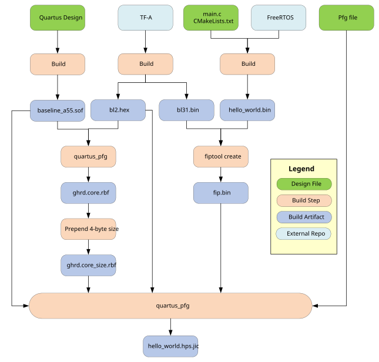

## Introduction

This example design shows hows to builds and runs a FreeRTOS-based application on the Agilex 5 FPGA E-Series 065A Premium Development Kit. The example uses the same Quartus hardware design as the [HPS Baseline System Examle Design](https://altera-fpga.github.io/rel-26.1.1/embedded-designs/agilex-5/e-series/premium-065a/gsrd/ug-gsrd-agx5e-premium-065a/), but replaces Linux with FreeRTOS. 

### Prerequisites

The following are needed:

* [Agilex 5 FPGA E-Series 065A Premium Development Kit](https://www.altera.com/products/devkit/po-3285/agilex-5-fpga-e-series-065a-premium-development-kit), ordering code DK-A5E065AB32AEA.
* Host PC with Linux (Ubuntu 22.04 was used, but others should work too)
* Quartus Pro 26.1.1 (or just Quartus Pro standalone Programmer 26.1.1).
* Network access, for downloading the sources while building the binaries

### Source repositories and revisions

These are the repositories whose source is compiled or packaged into this example. The top-level SDK revision is pinned directly by this application's `CMakeLists.txt`; the FreeRTOS Kernel and Trusted Firmware-A revisions are pinned by that SDK's Git submodule entries. The commit is the authoritative build input; tag and branch names in the descriptions provide release context.

| Repository address | Tag/hash | Description |
| --- | --- | --- |
| [Ignitarium-Software/freertos-socfpga](https://github.com/Ignitarium-Software/freertos-socfpga) | `f3935c85170c58fd3a73855ca802a9facfd64f5d` | SoC FPGA FreeRTOS integration from the `main` branch, including Agilex 5 drivers, the AArch64 port, build logic, and dependency manifest. |
| [FreeRTOS/FreeRTOS-Kernel](https://github.com/FreeRTOS/FreeRTOS-Kernel.git) | `dbf70559b27d39c1fdb68dfb9a32140b6a6777a0` | FreeRTOS Kernel release tag `V11.1.0`; provides the scheduler, tasks, queues, timers, and memory management. |
| [altera-fpga/arm-trusted-firmware](https://github.com/altera-fpga/arm-trusted-firmware.git) | `4a4b4573e12fabd0a88e95952af49840db6b770d` | Altera Trusted Firmware-A tag `QPDS26.1_REL_GSRD_PR` on the `socfpga_v2.14.0` branch line. Builds BL2, BL31, and `fiptool`. |


## Example Details

This section presents some details abou the example.

### FreeRTOS Configuration

The default configuration is used for FreeRTOS:

| Setting | Value |
| --- | --- |
| SoC | Agilex 5 |
| Boot core | Cortex-A55 |
| FreeRTOS SMP | Off; one core |
| Build type | Release |
| Application optimization | `-O3` |
| Console | UART0, 115200-8N1 |
| FATFS, TCP/IP, USB, RSU, FCS | Disabled |

### QSPI Image Layout

The example binary resides completely in QSPI flash.

The QSPI flash image is created with the help of a PFG file, which targets an MT25QU02G QSPI device and uses this layout:

| QSPI address | Content |
| --- | --- |
| `0x00000000`-`0x001FFFFF` | Reserved boot information |
| Automatically placed after boot info | Initial SOF with BL2 |
| `0x03C00000` | `fip.bin` containing BL31 and the FreeRTOS application |
| `0x08000000` | Four-byte RBF size followed by the phase-2 core RBF |

*Note*: `main.c` reads the phase-2 image from `0x08000000`, so the address in the PFG file and `BITSTREAM_OFFSET` in the application must remain synchronized.

### Example Operation

The FreeRTOS example performs the following operations:

1\. Reads core.rbf from QSPI and configures the fabric with it.
2\. Enables the H2F and lightweight H2F bridge
3\. Writes and verifies 64 KiB of FPGA on-chip memory through H2F.
4\. Reads the FPGA System ID through lightweight H2F.
5\. Mirrors the DIP-switch PIO to the user LED PIO every 10 ms.

## Build the Example


The following diagram depicts the build process:



The Quartus hardware design is built by using `make`, and the embedded software is built by invoking the `build.sh` script.

The script performs these stages:

1\. Downloads and extracts Arm GNU Toolchain 14.3.Rel1 if its completion marker is absent.
2\. Configures `hello-world-app/build/` with the Unix Makefiles CMake generator.
3\. Fetches the pinned SoC FPGA FreeRTOS SDK and its required submodules.
4\. Cross-compiles the FreeRTOS application to `hello_world.elf`, then creates `hello_world.bin`, `hello_world.asm`, and `hello_world.map`.
5\. Builds QSPI versions of Trusted Firmware-A BL2 and BL31 for Agilex 5.
6\. Builds the native TF-A `fiptool`.
7\. Packages BL31 and `hello_world.bin` into `fip.bin`.
8\. Converts BL2 to Intel HEX as `bl2.hex`.
9\. Embeds BL2 into `baseline_a55.sof` to create `fsbl.sof`.
10\. Converts the FPGA core image to `ghrd.core.rbf`.
11\. Prepends the RBF byte count as a four-byte little-endian value, producing `ghrd.core_size.rbf`.
12\. Uses `qspi_flash_image_agilex5_boot.pfg` to create `qspi_image.jic`.
13\. Copies that JIC to `hello_world.hps.jic`.

### Setup Environment


Create a folder to contain all the example files:


```bash
sudo rm -rf agilex5_pdk_065a.freertos_hello
mkdir agilex5_pdk_065a.freertos_hello
cd 	agilex5_pdk_065a.freertos_hello
export TOP_FOLDER=`pwd`
```

Enable Quartus tools to be called from command line:


```bash
source ~/altera_pro/26.1.1/qinit.sh
```


Several utilities are needed for building the example. On an Ubuntu machine they are typically installed using the follwing commands:

```bash
sudo apt-get update
sudo apt-get install build-essential cmake git libssl-dev python3 wget xz-utils
```

*Note*: The build script downloads this cross-compiler automatically:

```text
arm-gnu-toolchain-14.3.rel1-x86_64-aarch64-none-elf
```

### Build Quartus Design


```bash
cd $TOP_FOLDER
rm -rf agilex5_soc_devkit_ghrd && mkdir agilex5_soc_devkit_ghrd && cd agilex5_soc_devkit_ghrd
wget https://github.com/altera-fpga/agilex5e-ed-gsrd/releases/download/QPDS26.1.1_REL_GSRD_PR/dk-a5e065ab32aea-enablement-baseline-a55.zip
unzip dk-a5e065ab32aea-enablement-baseline-a55.zip
rm -f dk-a5e065ab32aea-enablement-baseline-a55.zip
make baseline_a55-build
```


The following files are created:

* `$TOP_FOLDER/agilex5_soc_devkit_ghrd/output_files/binaries/baseline_a55.sof`


### Build FreeRTOS


The following command is used to build all the embedded software, and the final QSPI flash image:


```bash
cd $TOP_FOLDER/agilex5_soc_devkit_ghrd/software/freertos/hello-world-app
./build.sh
```


The following file is created:

* `$TOP_FOLDER/agilex5_soc_devkit_ghrd/software/freertos/hello-world-app/hello_world.hps.jic`


## Run the Example Design

1\. Power off board. Set MSEL=JTAG. Power on board.

2\. Write JIC file:

```bash
$cd TOP_FOLDER/agilex5_soc_devkit_ghrd/software/freertos/hello-world-app/
quartus_pgm -c 1 -m jtag -o "pvi;hello_world.hps.jic"
```

3\. Set MSEL=QSPI. Power on board.

4\. The following will be displayed on the serial console:

```text
NOTICE:  DDR: Reset type is 'Power-On'
NOTICE:  IOSSM: Calibration success status check...
NOTICE:  IOSSM: All EMIF instances within the IO96 have calibrated successfully!
NOTICE:  DDR: Calibration success
NOTICE:  DDR: ECC is enabled
NOTICE:  IOSSM: Memory initialized successfully on IO96B
NOTICE:  ###DDR:init success###
NOTICE:  DFI interface selected successfully to SDEMMC
NOTICE:  SOCFPGA: QSPI boot
NOTICE:  BL2: v2.14.0(release):
NOTICE:  BL2: Built : 12:38:53, Aug 26 2026
NOTICE:  BL2: Booting BL31
NOTICE:  SOCFPGA: Boot Core = 0
NOTICE:  SOCFPGA: CPU ID = 0
NOTICE:  SOCFPGA: Setting CLUSTERECTRL_EL1
NOTICE:  BL31: v2.14.0(release):
NOTICE:  BL31: Built : 12:38:53, Aug 26 2026
======================================
FreeRTOS Hello World Program Starting.
======================================

Loading FPGA bitstream...
Bitstream size: 2228224 bytes
Flushing bitstream data from cache to memory...
Loading FPGA bitstream...
Bitstream data send successfully
FPGA bitstream loaded successfully.

Initializing H2F and LWH2F bridges...
H2F and LWH2F bridges initialized successfully.
Writing to On-Chip Memory through H2F bridge...
Reading from On-Chip Memory through H2F bridge...
H2F bridge test successful.
SysID: 1 (0x1)
```

5\. After startup, changing the DIP switches changes the three software-controlled user LEDs. The remaining LED is the hardware heartbeat LED, cannot be controlled by the DIP switch. As this happens, there is no additional output on the console.

## Notices & Disclaimers

Altera<sup>&reg;</sup> Corporation technologies may require enabled hardware, software or service activation.
No product or component can be absolutely secure. 
Performance varies by use, configuration and other factors.
Your costs and results may vary. 
You may not use or facilitate the use of this document in connection with any infringement or other legal analysis concerning Altera or Intel products described herein. You agree to grant Altera Corporation a non-exclusive, royalty-free license to any patent claim thereafter drafted which includes subject matter disclosed herein.
No license (express or implied, by estoppel or otherwise) to any intellectual property rights is granted by this document, with the sole exception that you may publish an unmodified copy. You may create software implementations based on this document and in compliance with the foregoing that are intended to execute on the Altera or Intel product(s) referenced in this document. No rights are granted to create modifications or derivatives of this document.
The products described may contain design defects or errors known as errata which may cause the product to deviate from published specifications.  Current characterized errata are available on request.
Altera disclaims all express and implied warranties, including without limitation, the implied warranties of merchantability, fitness for a particular purpose, and non-infringement, as well as any warranty arising from course of performance, course of dealing, or usage in trade.
You are responsible for safety of the overall system, including compliance with applicable safety-related requirements or standards. 
<sup>&copy;</sup> Altera Corporation.  Altera, the Altera logo, and other Altera marks are trademarks of Altera Corporation.  Other names and brands may be claimed as the property of others. 

OpenCL* and the OpenCL* logo are trademarks of Apple Inc. used by permission of the Khronos Group™. 