# Agilex&trade; 5 2-Port 25GbE Precision Time Protocol System Example Design

## Introduction

The Precision Time Protocol (IEEE1588v2) synchronizes clocks across networked devices to maintain a unified and precise time reference. In systems where components must coordinate actions — such as logging, data exchange, or event triggering — PTP ensures consistent timing, enabling deterministic operations and enhancing overall system integrity.

Agilex&trade; 5 is designed to operate as a PTP network node configured as an Ordinary Clock, Boundary Clock, or Transparent Clock, as defined by IEEE 1588-2008—Standard for a Precision Clock Synchronization Protocol for Networked Measurement and Control Systems.

The details of the Precision Time Protocol are beyond the scope of this document.  For comprehensive information, refer to [1588-2008 - IEEE Standard for a Precision Clock Synchronization Protocol for Networked Measurement and Control Systems](https://standards.ieee.org/ieee/1588/4355/).

### System Example Design Overview

The Agilex&trade; 5 2-Port 25GbE Precision Time Protocol System Example Design includes two Ethernet ports with built-in two-step hardware PTP1588 timestamping capabilities. The integrated Agilex&trade; 5 Hard Processor System (HPS) runs a PTP software stack that complements the hardware-based timestamping functionality.

The System Example Design (SED) provides the necessary drivers and user applications to support the Linux Network stack, the Linux PTP stack, and Layer 2 Packet Switch through the Linux kernel Traffic Control (TC) system.

The system's primary components include:

- Golden Hardware Reference Design (GHRD)
- Reference HPS software including:
  - Arm Trusted Firmware
  - U-Boot
  - Linux Kernel
  - Linux Drivers
  - User Space Applications

The high-level hardware setup for the system example design is shown below:

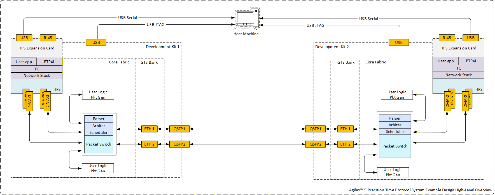

**Figure 1.** Agilex&trade; 5 Precision Time Protocol system example design hardware setup

### Glossary

| _Acronym_ | _Full Form_                      |
|-----------|----------------------------------|
| PTP       | Precision Time Protocol          |
| SED       | System Example Design            |
| ToD       | Time of Day                      |
| mSGDMA    | Modular Scatter-Gather DMA       |
| QoS       | Quality of Service               |
| AVST      | Avalon Streaming                 |
| AXI       | Advanced eXtensible Interface    |
| CDC       | Clock Domain Crossing            |
| ETS       | Egress Timestamp                 |
| ITS       | Ingress Timestamp                |
| TS        | Timestamp                        |
| FP        | Fingerprint                      |
| NVM       | Non-Volatile Memory              |
| GHRD      | Golden Hardware Reference Design |
| GSRD      | Golden Software Reference Design |

### Prerequisites

This system example design builds upon the [Golden System Reference Design (GSRD) for the Agilex&trade; 5 FPGA E-Series 065A Premium Development Kit)](https://altera-fpga.github.io/rel-26.1/embedded-designs/agilex-5/e-series/modular-065a/gsrd/ug-gsrd-agx5e-modular-065a/). It is recommended that you familiarize yourself with the GSRD development flow before proceeding with this document.

The following items are required to fully utilize the SED:

- Agilex&trade; 5 FPGA E-Series 065A Premium Development Kit ([DK-A5E065AB32AEA](https://www.altera.com/products/devkit/po-3285/agilex-5-fpga-e-series-065a-premium-development-kit)) × 2.
  - HPS IO48 OOBE daughter card × 2.
  - Micro USB cable for serial output × 2.
  - USB Type B cable for on-board FPGA Download Cable II × 2.
  - Micro SD card (4GB or greater) × 2.
  - Mini USB cable for OOBE daughter card serial port × 2.
  - 100G/40G QSFP Cable. Design tested with:
    - [FS (Q28-PC01)](https://www.fs.com/products/47096.html?attribute=10124&id=4695132) - 1m (3ft) 100G QSFP28 Passive Direct Attach Copper Twinax Cable.
    - [FS(Q28-AO03)](https://www.fs.com/au/products/205185.html) - 3m (10ft) 100G QSFP28 Active Optical Cable.
    - [FS(QSFP-40G-AO03)](https://www.fs.com/au/products/120522.html) - 3m (10ft) 40G QSFP+ Active Optical Cable.
    
- A Host PC with:
  - OS:Ubuntu 22.04 LTS. The system example design source files were compiled using Ubuntu 22.04 LTS; other versions and distributions may also be compatible.
  - Serial terminal software (e.g., Minicom on Linux, Tera Term, or PuTTY on Windows) is required.
  - Micro SD card slot or Micro SD card writer/reader
  - Altera Quartus&reg; Prime Pro 26.1

U-Boot and Linux compilation, Yocto build, and SD card image creation requires a Linux host PC. All other operations can be performed on either a Windows or a Linux host.

## Release Contents

### Binaries

Release notes and pre-built binaries are available under the [GitHub repository release](https://github.com/altera-fpga/agilex5-ed-ptp/releases/tag/SED-2X25GE_PTP-a5e065a-pdk-Q26.1-Rel1.1).

| _File_                                        | _Description_                                                   |
|-----------------------------------------------|-----------------------------------------------------------------|
| Images.zip                                    | Pre-compiled bitstream files for system example design(.jic, .rbf, .wic etc.,). |
| list.json                                     | Design Json file                                                |
| sdimage.tar.gz                                | SD binary image containing Linux boot files.                    |
| SI5518A_clock_config.zip                      | Clock Config binaries for Si5518A -PDK 065B                     |
| Source code (zip)                             | System example design source files provided as a ZIP archive    |
| Source code (tar.gz)                          | System example design source files provided as a TAR GZ archive |

### Sources

| _Component_                           | _Location_                                                                                                            | _Branch_                         | _Commit ID/Tag_                                             |
|---------------------------------------|-----------------------------------------------------------------------------------------------------------------------|----------------------------------|-------------------------------------------------------------|
| Harfware Design                       | <https://github.com/altera-fpga/agilex5-ed-ptp/tree/rel/26.1/a5e065a-prem-devkit-exp-prod/src/hw>                         | rel/26.1                         | SED-2X25GE_PTP-a5e065a-pdk-Q26.1-Rel1.1       |
| Linux                                 | <https://github.com/altera-fpga/linux-socfpga>                                                                          | socfpga-6.12.19-lts-ethernet-sed | SED-2X25GE_PTP-a5e065a-pdk-Q26.1-Rel1.1       |
| Arm Trusted Firmware                  | <https://github.com/altera-fpga/arm-trusted-firmware>                                                                  | socfpga_v2.14.0                  | 4a4b4573e12fabd0a88e95952af49840db6b770d                    |
| U-Boot                                | <https://github.com/altera-fpga/u-boot-socfpga>                                                                         | socfpga_v2026.01                | 6e59447316d06b25ca98caaa5c16787f5c74e862                    |
| Yocto Project: poky                   | <https://git.yoctoproject.org/poky/>                                                                                    | scarthgap                         | 802e4c1135c4eb451e504996aa797c04736496d4                    |
| Yocto Project: meta-intel-fpga        | <https://git.yoctoproject.org/meta-intel-fpga/>                                                                         | scarthgap                         | QPDS26.1_REL_GSRD_PR                    |
| Yocto Project: meta-intel-fpga-refdes | <https://github.com/altera-fpga/meta-intel-fpga-refdes/>                                                                | scarthgap                         | QPDS26.1_REL_GSRD_PR                    |
| Yocto Project: meta-agilex5-sed       | <https://github.com/altera-fpga/agilex5-ed-ptp/tree/rel/26.1/a5e065a-prem-devkit-exp-prod/src/sw/yocto/meta-agilex5-sed>  | rel/26.1                         | SED-2X25GE_PTP-a5e065a-pdk-Q26.1-Rel1.1       |
| GSRD Build Script: gsrd-socfpga       | <https://github.com/altera-fpga/agilex5-ed-ptp/tree/rel/26.1/a5e065a-prem-devkit-exp-prod/src/sw/yocto/build.sh>          | rel/26.1                         | SED-2X25GE_PTP-a5e065a-pdk-Q26.1-Rel1.1       |

## Release Notes

[Agilex&trade; 5 2-Port 25GbE Precision Time Protocol System Example Design Release Notes](https://github.com/altera-fpga/agilex5-ed-ptp/releases/tag/SED-2X25GE_PTP-a5e065a-pdk-Q26.1-Rel1.1).

## Agilex&trade; 5 2-Port 25GbE Precision Time Protocol System Example Design Architecture

### Hardware Architecture

Figure 2 illustrates the high-level architecture of the system example design. The main components include:

- HPS Subsystem
- DMA Subsystem
- Packet Switch Subsystem
- Ethernet Subsystem
- Main Time Of the Day Subsystem
- Subordinate Time Of the Day Subsystem
- Ethernet Packet Generators

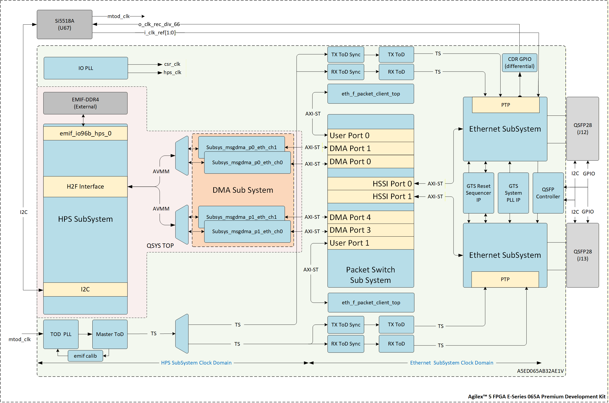

**Figure 2.** Agilex&trade; 5 Precision Time Protocol SED High Level Hardware Architecture

#### HPS Subsystem

The HPS Subsystem, built around the Agilex&trade; 5 Hard Processor System (HPS) and supporting logic, manages PTP synchronization and handles Time of Day (ToD) adjustments. It also provides access to status and control registers for other system components.

The subsystem communicates with onboard components via its peripherals, using an I2C bus to monitor and configure the QSFP28 module. It also controls the Clock IC [Skyworks Si5518 PTP & SyncE Network Synchronizer](https://www.skyworksinc.com/en/Products/Timing/NetSync-Network-Synchronizer-Clocks/Si5518A) over the same bus, performing phase and frequency adjustments to maintain system-wide timing accuracy.

#### Ethernet Subsystem

The Ethernet Subsystem is a flexible and high-performance solution for connecting your system to a network. It is designed for easy integration, expansion, and reliable synchronous operation.
It consists of the following components,

- Ethernet QHIP (includes PTP Tile Adaptor): Handles Ethernet data and provides precise time synchronization.
- System Clock, SRC: Manages clock signals.
- CSR Access: Allows Control and Status Registers (CSR) access directly to the Host/HPS, as detailed in the [system memory map](#address-map).

The Ethernet Subsystem connects to the QSFP and clock cleaner on the board to create a complete Synchronous Ethernet link. It provides network packet access and includes Ethernet Layer 1 and Layer 2 components such as MAC, PCS, FEC, and PMA, which interface with an external Ethernet PHY.

The Ethernet Subsystem instantiates the Agilex&trade;  5 GTS Ethernet Hard IP . Refer to the [GTS Ethernet Hard IP User Guide Agilex&trade; 5 FPGAs and SoCs](https://docs.altera.com/r/docs/817676/current) for details.

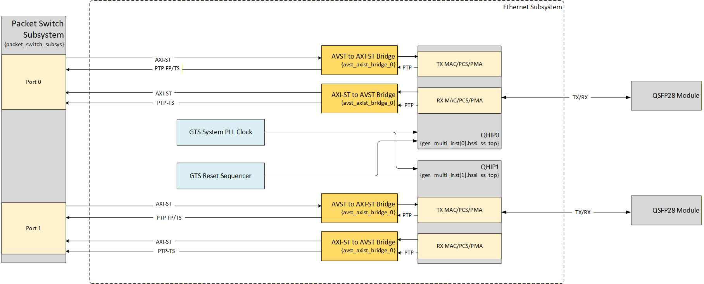

**Figure 3.** Ethernet Subsystem High-level Architecture

#### DMA Subsystem

The DMA Subsystem uses mSGDMA engines to transfer data between the HPS and the Ethernet Subsystem. It includes four DMA Ports, 2-transmit (TX) and 2-receive (RX) for each Ethernet port. These channels natively handle PTP Timestamps and Tx Fingerprints.

The subsystem groups DMA Ports into sets of two, assigning each group to one Ethernet port in the Ethernet Subsystem. It also translates protocols between Avalon® Streaming (AVST) and AXI-Stream (AXI-ST) interfaces, and performs clock domain crossing between the HPS Subsystem and Ethernet Subsystem clock domains. Figure 3 shows a high-level architecture diagram of one of the DMA Subsystem ports.

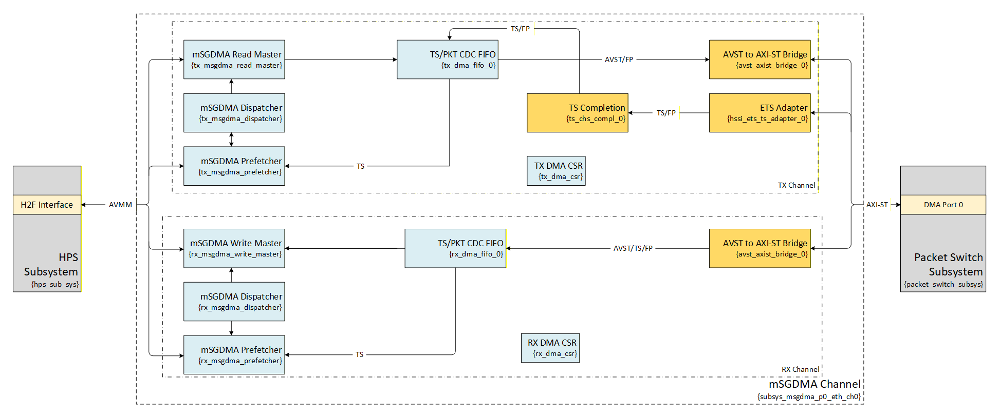

**Figure 4.** DMA Subsystem Port High-level Architecture

#### Packet Switch Subsystem

The Packet Switch Subsystem implements an L2–L4 Ethernet packet switch that arbitrates among four client interfaces per port, connecting two DMA engines and a traffic generator to the transmit path. On the receive path, packet routing between ports and clients is handled by a [TCAM (refer Section 3.2.2.)](https://docs.altera.com/r/docs/789389/current), with rules dynamically configurable via software. By default, packets without a TCAM match are dropped for security reasons. Matched entries, the Packet Switch subsystem routes packets to either a DMA Port or a User Port (Traffic Generator).

 The TX datapath arbitration ignores Ethernet packet type and uses a weighted priority round-robin scheme to manage requests from DMA and User Ports. Figure 5 illustrates the high-level architecture of the Packet Switch transmitter path. On the transmit path, the Ethernet Subsystem returns the egress timestamp (ETS) for each packet along with its corresponding fingerprint for tracking.

 The RX datapath does not implement priority-based arbitration. Instead, traffic priority to the HPS is software-defined, with each DMA Port represented as a queue and assigned a configurable priority level. Figure 6 illustrates the high-level architecture of the Packet Switch receiver path.

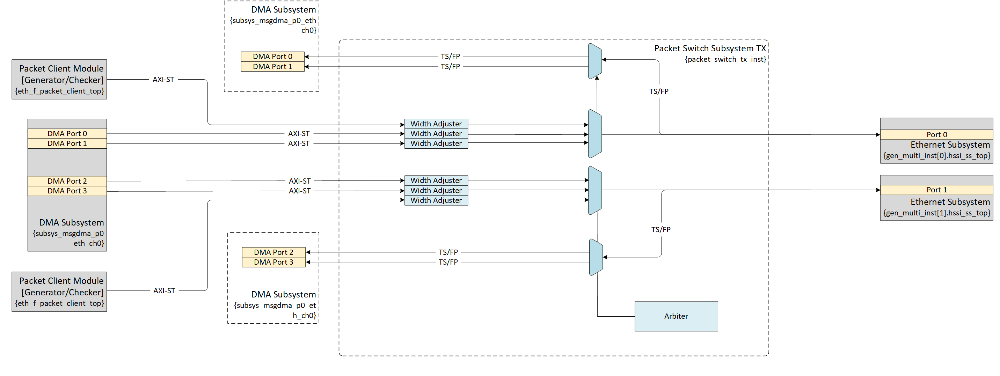

**Figure 5.** Packet Switch Subsystem TX Datapath High Level Architecture


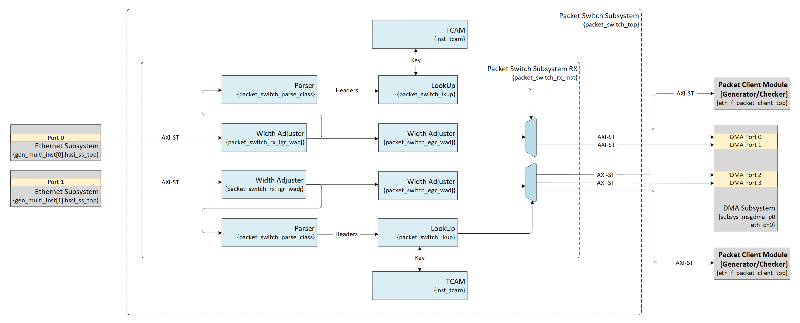

**Figure 6.** Packet Switch Subsystem RX Datapath High Level Architecture

##### TCAM Data Structure

The TCAM supports lookups using Ethernet frame headers, protocol headers, and IEEE 1588-specific fields.

The table below lists the 492-bit TCAM key fields. If a packet lacks a corresponding header field, the key field is set to 0. Otherwise, the Packet Switch parser populates the field with extracted data. Unused bits from shorter headers are also zeroed.

| _Field_     | _Width (bits)_ | _Description_                                                                                                                                                                                                                                                    |
|-------------|:--------------:|------------------------------------------------------------------------------------------------------------------------------------------------------------------------------------------------------------------------------------------------------------------|
| rsvd        |       32       | Reserved.                                                                                                                                                                                                                                                        |
| flagField   |       16       | flagField field in PTP header.                                                                                                                                                                                                                                   |
| messageType |       4        | messageType field in PTP header.                                                                                                                                                                                                                                 |
| ip_protocol |       8        | IP header protocol field, defined as Protocol in IPv4 or next_header in IPv6.                                                                                                                                                                                    |
| ethtype     |       16       | Ethernet header ethtype                                                                                                                                                                                                                                          |
|             |                | **dot2q**: (eth.{da,sa}) / (vlana.{tpid,tci}) / (vlanb.{tpid,tci}) / ethtype <br> **dot1q**: (eth.{da,sa}) / (vlana.{tpid,tci}) / ethtype <br> **eth**:   (eth.{da,sa,ethtype})  <br> - ethtype = ethtype                                                        |
| tci_vlana   |       16       | TCI field for VLAN A in IEEE 802.1Q frames                                                                                                                                                                                                                       |
|             |                | **dot2q**: (eth.{da,sa}) / (vlana.{tpid,tci}) / (vlanb.{tpid,tci}) / ethtype <br> - tci_vlana = vlana.tci <br> **dot1q**: (eth.{da,sa}) / (vlana.{tpid,tci}) / ethtype <br> - tci_vlana = vlana.tci <br> **eth**:   (eth.{da,sa,ethtype}) <br> - tci_vlana = '0  |                                                                                                                                                               |
| tci_vlanb   |       16       | TCI field for VLAN B in IEEE 802.1Q frames                                                                                                                                                                                                                       |
|             |                | **dot2q**: (eth.{da,sa}) / (vlana.{tpid,tci}) / (vlanb.{tpid,tci}) / ethtype <br> - tci_vlanb = vlanb.tci <br> **dot1q**: (eth.{da,sa}) / (vlana.{tpid,tci}) / ethtype <br> - tci_vlanb = '0 <br> **eth**:   (eth.{da,sa,ethtype}) <br> - tci_vlanb = '0         |                                                                                                                                                               |
| l4_src_port |       16       | L4 header source port.                                                                                                                                                                                                                                           |
|             |                | - l4_src_port = udp.sport <br> - l4_src_port = tcp.sport                                                                                                                                                                                                         |
| l4_dst_port |       16       | L4 header destination port.                                                                                                                                                                                                                                      |
|             |                | - l4_dst_port = udp.dport <br> - l4_dst_port = tcp.dport                                                                                                                                                                                                         |
| src_ip      |      128       | L3 source address field.                                                                                                                                                                                                                                         |
|             |                | **IPv4**: <br> - src_ip[31:0] = ipv4.src_ip, src_ip[127:32] = '0 <br> **IPv6**: <br> - src_ip[127:0] = ipv6.src_ip                                                                                                                                               |
| dst_ip      |      128       | L3 destination address field.                                                                                                                                                                                                                                    |
|             |                | **IPv4**: <br> - dst_ip[31:0] = ipv4.dst_ip, dst_ip[127:32] = '0 <br> **IPv6**: <br> - dst_ip[127:0] = ipv6.dst_ip                                                                                                                                               |
| src_mac     |       48       | Ethernet header source MAC address. <br>                                                                                                                                                                                                                         |
|             |                | - src_mac = eth.sa                                                                                                                                                                                                                                               |
| dst_mac     |       48       | Ethernet header destination MAC address.                                                                                                                                                                                                                         |
|             |                | - dst_mac = eth.da                                                                                                                                                                                                                                               |

**Table 1.** TCAM Key Fields

The Linux [`packetswitch`](#packetswitch) user application provides access to the TCAM key registers from the OS, removing the complexity of doing low level access to the Packet Switch IP.

The table below defines the structure of a TCAM query result. This data is used to route in-transit packets to the destination port specified by the matching TCAM rule.

| _Field_  | _Width (bits)_ | _Description_                                                                                                                                                                                         |
|----------|:--------------:|-------------------------------------------------------------------------------------------------------------------------------------------------------------------------------------------------------|
| rsvd     |       27       | Reserved.                                                                                                                                                                                             |
| drop     |       1        | Drop packet.                                                                                                                                                                                          |
| egr_port |       4        | Selects which egress port to send traffic. <br> 4’d0: MSGDMA Channel 0 <br> 4’d1: MSGDMA Channel 1 <br> 4’d2 – 4’d7: reserved <br> 4’d8: User <br> 4’d8 – 4’d15: reserved |

**Table 2.** TCAM Query Result Fields

#### Time Of the Day Subsystem

The Main ToD (Time of Day) module uses a 96-bit counter to represent the current time. Software synchronizes this counter with the PTP network time, using data from the Subordinate PTP port. The Main ToD operates with a 156.25 MHz clock sourced from the onboard clock cleaner, causing the counter to increment every 6.4 ns. An additional IOPLL can be added to fine-tune the ToD clock, enhancing the accuracy of the 1PPS (one pulse per second) signal, especially since the counter may not align perfectly with one-second intervals. The 1PPS signal is primarily used for precise timing across various applications. For further details, refer to the ToD User Guide.

The Main ToD Subsystem wraps the IEEE 1588 Time of Day Clock FPGA IP and its support logic, serving as the system’s local ToD reference. The IP is configured for Accuracy Advanced mode and uses the IOPLL Reconfig FPGA IP, as described in the [_IOPLL and TOD Setup using IOPLL Reconfig IP_](https://docs.altera.com/r/docs/683044/25.1/ethernet-design-example-components-user-guide/iopll-and-tod-setup-using-iopll-reconfig-ip) chapter of the Ethernet Design Example Components User Guide.

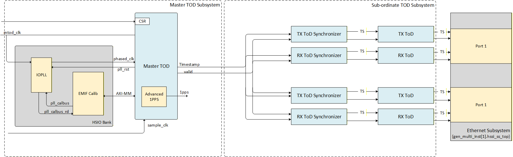
**Figure 7.** Board High Level Clocking Architecture

The Subordinate ToD Subsystem instantiates a dedicated IEEE 1588 Time of Day Clock FPGA IP per Ethernet interface and integrates an [IEEE 1588 TOD Synchronizer FPGA IP](https://docs.altera.com/r/docs/683044/25.1/ethernet-design-example-components-user-guide/time-of-day-synchronizer) to present timestamps in the Ethernet clock domain, as described in the [Connect the Precision Time Protocol Interface](https://docs.altera.com/r/docs/817676/25.3.1/gts-ethernet-hard-ip-user-guide-agilextm-5-fpgas-and-socs/connect-the-precision-time-protocol-interface) chapter of the GTS Ethernet Hard IP User Guide.

#### Ethernet Packet client Modules(Generator/Checker)

Two system blocks can generate Ethernet packets. The HPS produces PTP packets when the ptp4l service is enabled and can optionally generate synthetic traffic via ping or iperf3. Additionally, two hardware traffic generators can saturate Ethernet bandwidth with synthetic traffic when enabled by HPS software.

#### SED Custom IP

| _Block_                  | _Entity Name_                       |Description_                                                                                                                                    |
|--------------------------|-------------------------------------|------------------------------------------------------------------------------------------------------------------------------------------------|
| AVST to AXI Bridge       | avst_axist_bridge                   | AVST to AXI bridge facilitating data transfer between the DMA channels and the Ethernet Subsystem. The bridge operates bidirectionally, providing AXI to AVST translation for data flowing from the Ethernet Subsystem to the DMA channels. It is a single block servicing both TX and RX DMA channels. |
| TX DMA Fifo              | tx_dma_fifo                         | Top-level wrapper for custom blocks in the TX DMA Datapath.                                                                                    |
| TX ETS Adapter           | hssi_ets_ts_adapter                 | Adapts the egress timestamp and fingerprint from the Ethernet Subsystem to a format manageable by the TX DMA channel.                          |
| TX DMA PKT FIFO          | cdc_packet_fifo                     | Dual clock FIFO for clock domain crossing of packet information from the DMA channel to the Ethernet Subsystem.                                |
| TX FP Generator          | tx_dma_fifo                         | Sequential fingerprint generator. A fingerprint will be generated for all packets going out of the system. This is combinational logic inside the 'tx_dma_fifo' module. |
| TX TS Valid              | tx_dma_fifo                         | Logic that inserts egress timestamps into the MSGDMA prefetcher. This is combinational logic inside the 'tx_dma_fifo' module.                  |
| TX TS/FP FIFO            | fp_resp_fifo/ts_fifo                | Two independent FIFOs to store the returned egress timestamp and its corresponding fingerprint.                                                |
| TX Completion            | ts_chs_compl                        | Timestamp completion follow-up module. Captures FP and TS from the HSSI subsystem and forwards them to the TX DMA FIFO module if they are valid.|
| FP Compare               | ts_chs_compl                        | Combinational logic that tracks fingerprints returned by the HSSI Subsystem to validate and return the associated egress timestamp.            |
| TX TS FIFO               | ts_fifo                             | FIFO to store the returned egress timestamp.                                                                                                   |
| RX DMA Fifo              | rx_dma_fifo                         | Top-level wrapper for custom blocks in the RX DMA Datapath.                                                                                    |
| RX TS Valid              | rx_dma_fifo                         | Logic that inserts ingress timestamps into the MSGDMA prefetcher. This is combinational logic inside the 'rx_dma_fifo' module.                 |
| RX DMA PKT FIFO          | cdc_packet_fifo                     | Dual clock FIFO for clock domain crossing of packet information from the Ethernet Subsystem to the DMA channel.                                |
| RX TS FIFO               | ts_fifo                             | Single clock FIFO to store ingress timestamps from the Ethernet Subsystem.                                                                     |
| Main ToD                 | master_tod                          | Wrapper for the Ethernet IEEE 1588 Time of Day Clock FPGA IP. Includes a state machine that flags when the Main ToD Subsystem output is valid for the ToD Subordinate Subsystem to consume.      |
| Packet Generator         | eth_f_packet_client_top             | Generic Ethernet packet generator/checker. Packet generation parameters are configurable at runtime via software.                              |
| Packet Generator Adaptor | eth_f_packet_client_top_axi_adaptor | Provides translation services between AVST and AXI-ST for the system Packet Generators.                                                        |
| Packet Switch            | packet_switch_subsys                | Top level wrapper for TCAM, arbitration and routing logic to handle the system TX/RX data path                                                 |

### Board Level Clocking Architecture

At the board level, the system clocking architecture includes the following components:

- Skyworks Si5518A PTP & SyncE Network Synchronizer (U67)
- Oven Controlled Crystal Oscillator (OCXO) (X2)
- Agilex&trade; 5 A5ED065AB32AE1V (U5)
- Si5332A Low-Jitter Clock Generator (U411,U412)

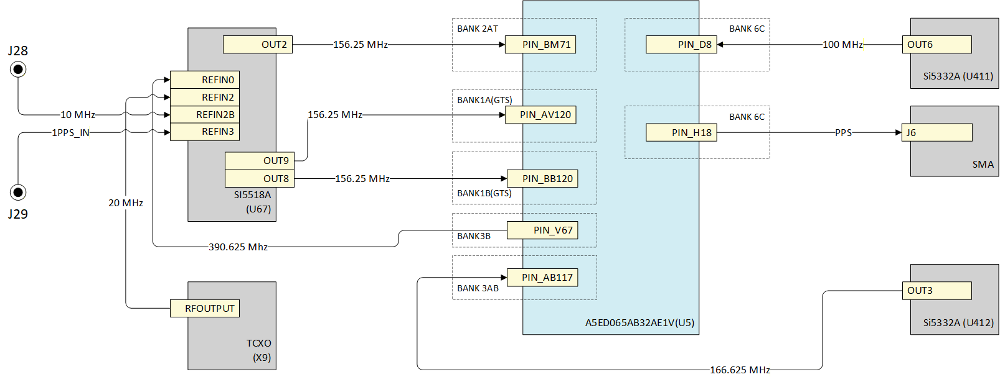

**Figure 8.** Board High Level Clocking Architecture

In the default clock configuration for the Development Kit, SI5518A OUT2 is set to 125 MHz. User needs to configure SI5518A clock IC with new settings for this solution.
The steps to carry out this configuration are shown in the [Section](#si5518a-synce-clock-generator-configuration).

### FPGA Design Clocking Architecture

The clock frequencies for the GTS Ethernet Hard IP ports `i_clk_tx`, `i_clk_rx`, `i_clk_ref_p`, `i_clk_sys`, `o_clk_pll`, `o_clk_rec_div`, `i_clk_tx_tod`, `i_clk_rx_tod`and  `i_clk_ptp_sample` follow the guidelines in the [Section 4.1. Implement Required Clocking](https://docs.altera.com/r/docs/817676/current) of GTS Ethernet Hard IP User Guide Agilex&trade; 5 FPGAs and SoCs.

Figure 9 shows the high-level system clock distribution tree. For clarity, only one Ethernet port (P0) and one DMA Subsystem port are shown. All DMA ports share the same clock connections. Ports connected to Ethernet port 1 use its output clocks.

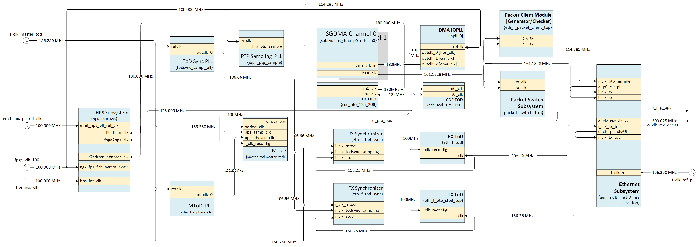

**Figure 9.** FPGA High Level Clocking Architecture Reduced Diagram

### Software Architecture

The system example design uses an [HPS-first boot flow](https://docs.altera.com/r/docs/813762/26.1/hard-processor-system-booting-user-guide/boot-flow-overview), where the HPS initializes before configuring the FPGA fabric. U-Boot is loaded from SPI flash or via a partial RBF. The [second-stage boot loader](https://docs.altera.com/r/docs/813762/26.1/hard-processor-system-booting-user-guide/first-stage-bootloader?tocId=wHsT9dAUiMQRMfKF6TnSOQ) loads the Linux kernel and full FPGA bitstream from the SD card. U-Boot enables the HPS bridges and programs the FPGA via the SDM. Once configured, the HPS boots into Linux.

The solution includes drivers and user-space tools for the Linux network stack, PTP stack, and QoS via Traffic Control (TC). GTS Ethernet Hard IP drivers support standard tools such as `ethtool`. Drivers for the IEEE 1588 TOD Clock IP, Skyworks Si5518A synchronizer, and DMA ports interface are also provided.

Egress QoS is managed by the Linux kernel’s Traffic Control (TC) system. The Ethernet driver uses device tree data to enumerate DMA channels for each physical port. For each channel, it registers a TX buffer ring and exposes it as a separate hardware queue. TC applies queue disciplines (`qdiscs`) to control packet enqueue/dequeue behavior per queue. The driver integrates with TC to enable per-queue priorities and flow control.

For each DMA ingress channel, the Ethernet driver registers an RX buffer. Ingress QoS is controlled by the Packet Switch IP and the `packetswitch` application, which defines filtering and routing rules. Packets matching a rule are directed to a specific DMA RX channel, queue, or User Port; unmatched packets are dropped by default.

The HPS polls RX queues based on interrupt priority, with higher-priority channels mapped to higher-priority interrupts.

#### Intel Agilex&trade; 5 SoC FPGA Ethernet Drivers

| _Driver_              | Description_                                                                                                                                                  | _File_                                                            |
|-----------------------|---------------------------------------------------------------------------------------------------------------------------------------------------------------|-------------------------------------------------------------------|
| Ethernet Driver       | The Ethernet driver exposes a standard `netdev` API to the kernel, enabling DMA channel discovery, hardware Time-of-Day (ToD) access, and `ethtool` enabling  | `/drivers/net/ethernet/altera/intel_fpga_eth_main.c`              |
| ToD Driver            | Provides access to the configuration and status registers of the Ethernet IEEE 1588 Time of Day Clock FPGA IP.                                                | `/drivers/net/ethernet/altera/intel_fpga_tod.c`                   |
| HSSI Driver           | Provides access to the Ethernet subsystem configuration and status registers.                                                                                 | `/drivers/net/ethernet/altera/intel_fpga_hssiss.c`                |
| GTS Ethernet IP Driver| Provides access to the GTS Ethernet Hard IP configuration and status registers.                                                                               | `/drivers/net/ethernet/altera/intel_fpga_hssigl_gts_driver.c`     |
| QSFP Driver           | The QSFP driver interfaces with the onboard QSFP module, handling configuration registers reads and controlling power and interrupt pins.                     | `/drivers/net/phy/qsfp-mem-core.c`                                |
| Si5518A Driver        | The Si5518A driver enables frequency steering for Time-of-Day (ToD) adjustment via the onboard Si5518A SyncE & IEEE 1588 Network Synchronizer.                | `/drivers/net/ethernet/altera/dpll/intel_freq_ctrl_si5518_i2c.c`  |
| Freq control Driver   | This driver enables frequency steering for Time-of-Day (ToD) adjustment via the onboard Si5518A SyncE & IEEE 1588 Network Synchronizer.                       | `/drivers/net/ethernet/altera/intel_freq_control.c`               |

#### User Space Applications

##### ptp4l

`ptp4l` is IEEE 1588 PTP software implementation from the [The Linux PTP Project](https://linuxptp.sourceforge.net), included in the HPS image. It offers extensive configuration options for system setup. Refer to the [`ptp4l` man page](https://manpages.ubuntu.com/manpages/xenial/man8/ptp4l.8.html) for details

##### phc2sys

`phc2sys` is an open-source utility that synchronizes system clocks, typically aligning the system clock with a PTP Hardware Clock (PHC) managed by `ptp4l`. For configuration details, refer to the [`phc2sys` man page](https://manpages.ubuntu.com/manpages/xenial/man8/phc2sys.8.html).

##### ethtool

`ethtool` is an open-source utility for querying and configuring network driver and hardware settings. For usage details, refer to the [`ethtool` man page](https://manpages.ubuntu.com/manpages/jammy/man8/ethtool.8.html).

##### packetgenerator

This application configures the Packet Generator/Checker IP core in the FPGA to generate synthetic Ethernet traffic for validating data path integrity and line rates. It can also modulate bandwidth to test system QoS policies.

Packet generation is customizable via parameters such as:

- Source and destination MAC addresses
- Frame sizes
- Idle packet gaps

**Syntax**

``` bash
packetgenerator [--device] [/dev/uioX] [options]
```

**Parameters**

- `--help`: Print this help contents
- `--device`: `UIO` device name
- `--dump`: Dump all register contents
- `--register-offset offset`: 32-bit aligned register offset to do direct register read/write
- `--register-value value`: 32-bit value to be written to the register
- `--dest-mac`: Destination MAC address in the packet
- `--src-mac`: Source MAC address in the packet
- `--traffic bool`: Enable or disable traffic
- `--one-shot bool`: Enable or disable one-shot mode
- `--soft-reset`: Trigger a soft reset
- `--packet-checker bool`: Enable or disable packet checker
- `--cntr-snapshot bool`: Take a counter snapshot
- `--cntr-clear bool`: Clear all counter CSRs
- `--cntr-internal-clear bool`: Clear all internal counters
- `--fixed-gap bool`: Enable or disable fixed gap between packets
- `--pkt-len-mode value`: Set packet generation length mode (Fixed/Incremental) [1,2]
- `--num-idle-cycles value`: Number of idle cycles to insert [0...255]
- `--tx-pkt-size value`: TX packet size [64...9216]
- `--tx-max-pkt-size value`: Maximum TX packet size [64...9216]
- `--num-packets value`: Number of packets to generate [0...0xFFFFFFFF]

System example design packet generators are mapped to `/dev/uio0` and `/dev/uio1`.

**Basic Usage**

_Synthetic Traffic Configuration_ – The command below sets up the packet generator with parameters including dynamic packet mode, fixed gap, packet length mode, idle cycles, packet checker, one-shot mode, and packet sizes before initiating traffic generation.

``` bash
packetgenerator --device /dev/uio0 --traffic false --fixed-gap true --pkt-len-mode 0x01 --num-idle-cycles 22 --packet-checker true --one-shot false --tx-pkt-size 1024 --tx-max-pkt-size 1024
```

_Start Packet Generator_ – The command below initiates traffic generation based on the current configuration parameters.

``` bash
packetgenerator --device /dev/uio0 --traffic 1
```

_Configuration and Status Report_ – The command below captures a snapshot of all internal configuration and status registers in the packet generator hardware.

``` bash
packetgenerator --device /dev/uio0 --dump
```

##### packetswitch

The `packetswitch` application configures the hardware Packet Switch IP, which routes incoming packets to one of two DMA channels per Ethernet interface based on user-defined (Packet switch) rules. Packets that do not match any rule are dropped by default.

Rule priority is determined by index number; higher index means higher priority. If multiple rules match, the rule with the highest index is applied. To ensure correct behavior, generic rules should be programmed first followed by more specific rules at higher indices.

A maximum of 32 keys can be programmed (0-31).

**Syntax**

``` bash
packetswitch [--device] [/dev/uioX] [Options]
```

**Parameters**

- `--help`: Print this help contents
- `--device`: *UIO device name
- `--dump`: Dump all register contents
- `--set-key`: Set Key. Requires Key fields to be provided
- `--remove-key`: Remove Key using key-index
- `--flush-all-keys`: Flush all Key entries from the system
- `--flush-all-counters`: Flush all debug counters value to 0
- `--show-key`: Search for Keys fulfilling a search criteria for a port
- `--register-rw`: Do a direct register read write
- `--key-index`: Key index to work on
- `--dest-mac`: Key - Destination MAC. ```packetswitch``` can resolve MAC addresses from Ethernet interface names, e.g. eth1.
- `--src-mac`: Key - Source MAC. ```packetswitch``` can resolve MAC addresses from Ethernet interface names, e.g. eth1.
- `--dest-ip`: Key - Destination IP Address
- `--src-ip`: Key - Source IP address
- `--dest-port`: Key - Destination L4 port
- `--src-port`: Key - Source L4 port
- `--vlanb`: Key - VALNB
- `--vlana`: Key - VLANA
- `--ethtype`: Key - Ethernet type
- `--protocol`: Key - IP Protocol type
- `--message`: Key - IP Message type
- `--flag`: Key - Flag field
- `--result`: Defines the DMA or user port to which the Ethernet packet will be routed if the rule evaluation is true. The mapping for this parameter is as follows:
  - 0x0: route packet to DMA-0
  - 0x1: route packet to DMA-1
  - 0x8: route packet to User Port (Packet Generator)
- `port`: Ethernet interface to which the rule will apply.
  - 0: Apply rule to ```eth1``` Ethernet interface
  - 1: Apply rule to ```eth2``` Ethernet interface
- `register-offset`: Register offset to read/write to. Refer to the [Packet switch Register Map](#packet-switch-register-map) for direct registers base address and offsets.
- `register-value`: Register value to write. Can be comma separated to write multiple values.
- `length`: Number of registers to read
- `mask`: Set Mask properties for fields manually

System example design Packet Switch is mapped to `/dev/uio2`.

**Basic Usage**

_Route all incoming traffic to DMA 0:_

```bash
packetswitch --port 0 --set-key --key-index 0 --result 0x0
```

- `--port 0`: This rule applies to Ethernet interface ```eth1```.
- `--key-index 0`: This rule is stored in key index 0, setting the lowest priority for the rule.
- `--result 0x0`: Packets fulfilling the rule will be routed to DMA-0.

The above command defines the following rule:

_Route traffic based on destination MAC address_

``` bash
packetswitch --port 0 --set-key --key-index 0 --dest-mac "eth1" --result 0x1
```

The above command defines the following rule:

- `--port 0`: This rule applies to Ethernet interface ```eth1```.
- `--key-index 0`: This rule is stored in key index 0, setting the lowest priority for the rule.
- `--dest-mac "eth1"`: This is the filter established by the rule. The rule will return a hit if the evaluated Ethernet frame has the ```eth1``` interface MAC address in the MAC address destination field.
- `--result 0x1`: Packets fulfilling the rule will be routed to DMA-1.

_Route traffic based on VLAN and DF flag_

``` bash
packetswitch --port 0 --set-key --key-index 2 --ethtype 0x0800 --protocol 0x01 --vlana 100 --vlanb 200 --flag 0x2 --result 0x1
```

The above command defines the following rule:

- `--port 0`: This rule applies to Ethernet interface eth1.
- `--key-index 2`: This rule is stored in key index 2.
- `--ethtype 0x0800`: Ethernet Type is set to IPv4.
- `--protocol 0x01`: The IP protocol is set to ICMP.
- `--vlana 100`: The primary VLAN ID is 100.
- `--vlanb 200`: The secondary VLAN ID is 200.
- `--flag 0x2`: The fragment flag is set to 0x2.
- `--result 0x1`: Packets fulfilling the rule will be routed to DMA-1.

### Address Map Details

#### Address Map

| _Subordinate Name_                         | _Component_                     | _Agilex&trade; HPS H2F AXI Manager_ | _Register Description_                                 |
|--------------------------------------------|---------------------------------|:-----------------------------------:|--------------------------------------------------------|
| top.qhip_port0_s0                          | GTS Ethernet Hard IP - Port 0   | 0x4030_0000 - 0x403f_ffff           |[Link](https://docs.altera.com/r/docs/817676/current)   |
| top.qhip_port1_s0                          | GTS Ethernet Hard IP - Port 1   | 0x4050_0000 - 0x405f_ffff           |[Link](https://docs.altera.com/r/docs/817676/current)   |
| top.eth_f_packet_client_top[0]             | User Port-0(Packet Client)      | 0x5000_0000 - 0x5000_0fff           |[Link](#packet-client-register-description)             |
| top.eth_f_packet_client_top[1]             | User Port-1(Packet Client)      | 0x5000_1000 - 0x5000_1fff           |[Link](#packet-client-register-description)             |
| top.packet_switch_subsys_csr_s0            | PTP Packet Switch               | 0x5001_0000 - 0x5001_ffff           |                                                        |
| top.master_tod_csr                         | Main ToD Subsystem              | 0x4405_0000 - 0x4405_003f           |[Link](#dma-subsystem-port-memory-map)                  |
| top.soc_inst.cdc_tod_125_100M              | CDC TOD FIFO                    | 0x4405_0000 - 0x4405_03ff           |   <TBD>                                                     |
| top.qsfp_cntlr_csr_s0                      | QSFP Controller-0/1             | 0x4404_0000 - 0x4404_ffff           |                                                        |
| top.top_user_space_csr_s0                  | User Space CSR                  | 0x4020_0000 - 0x4020_0fff           |                                                        |
| top.soc_inst.subsys_msgdma_p0_eth_ch0.csr  | DMA Subsystem Port 0 -Channel 0 | 0x4500_0000 - 0x4500_00ff           |[Link](#dma-subsystem-port-memory-map)                  |
| top.soc_inst.subsys_msgdma_p0_eth_ch1.csr  | DMA Subsystem Port 0 -Channel 1 | 0x4500_0100 - 0x4500_01ff           |[Link](#dma-subsystem-port-memory-map)                  |
| top.soc_inst.subsys_msgdma_p1_eth_ch0.csr  | DMA Subsystem Port 1 -Channel 0 | 0x4500_0200 - 0x4500_02ff           |[Link](#dma-subsystem-port-memory-map)                  |
| top.soc_inst.subsys_msgdma_p1_eth_ch1.csr  | DMA Subsystem Port 1 -Channel 1 | 0x4500_0300 - 0x4500_03ff           |[Link](#dma-subsystem-port-memory-map)                  |

**Table 3.** Qsys_top Platform Designer system address map.

##### Packet Generator Register Description

Refer to section [Packet Client Register Map](https://docs.altera.com/r/docs/767516/23.4/macsec-system-design-user-guide/packet-client-register-map) in the MACsec FPGA System Design User Guide for the register description.

##### DMA SubSystem Port Memory Map

| _Subordinate Name_     | _Component_    | _[rx/tx]_dma_csr_ | _Register Description_                                                                                       |
|------------------------|----------------|:-----------------:|--------------------------------------------------------------------------------------------------------------|
| tx_dma_prefetcher      | DMA prefetcher | 0x0000 - 0x001F   | [Register Map of mSGDMA](https://docs.altera.com/r/docs/683130/26.1/embedded-peripherals-ip-user-guide/register-map-of-msgdma)                           |
| tx_dma_dispatcher      | DMA dispatcher | 0x0020 - 0x003F   | [Register Map of mSGDMA](https://docs.altera.com/r/docs/683130/26.1/embedded-peripherals-ip-user-guide/register-map-of-msgdma)                           |
| dma_fifo_0             | DMA FIFO       | 0x0040 - 0x005F   | [Register Map of mSGDMA](https://docs.altera.com/r/docs/683130/26.1/embedded-peripherals-ip-user-guide/register-map-of-msgdma)                           |
| rx_dma_prefetcher      | DMA prefetcher | 0x0080 - 0x009F   | [Register Map of mSGDMA](https://docs.altera.com/r/docs/683130/26.1/embedded-peripherals-ip-user-guide/register-map-of-msgdma)                           |
| rx_dma_dispatcher      | DMA dispatcher | 0x00A0 - 0x00BF   | [Register Map of mSGDMA](https://docs.altera.com/r/docs/683130/26.1/embedded-peripherals-ip-user-guide/register-map-of-msgdma)                           |

**Table 4.** DMA Subsystem channel memory map.

##### Packet Switch Register Map

| _Module_                              | _Start Address_ | _End Address_ |
|---------------------------------------|:---------------:|:-------------:|
| Ingress Arbiter 0                     | 0x0             | 0x8           |
| Ingress Arbiter 1                     | 0xC             | 0x14          |
| Egress RX Demux 0                     | 0x60            | 0x70          |
| Egress RX Demux 1                     | 0x88            | 0x98          |
| Ingress RX Width Adapter 0            | 0x1A0           | 0x1A8         |
| Ingress RX Width Adapter 1            | 0x1AC           | 0x1B4         |
| TCAM_0 (16KB)                         | 0x200           | 0x41FC        |
| TCAM_1 (16KB)                         | 0x4200          | 0x81FC        |
| Egress RX Width Adapter 0 (User Port) | 0x8200          | 0x8208        |
| Egress RX Width Adapter 1 (User Port) | 0x820C          | 0x8214        |

**Table 5.** Packet Switch Register Description

###### Packet Switch Ingress Arbiter Register Description

| _Register Name_   | _Offset_ | _Field_  | _Width (bits)_ | _Type_ | _HW Reset Value_ | _Description_                                                                                                            |
|-------------------|:--------:|----------|:--------------:|:------:|:----------------:|--------------------------------------------------------------------------------------------------------------------------|
| scratch_reg       | 0x00     | scratch  | 32             | RW     | 32'h0            | Scratch Register.                                                                                                        |
| cfg_priority_dma  | 0x04     | reserved | [31:8]         | RO     | 16'h0            | Reserved.                                                                                                                |
|                   |          | ch_1     | [7:4]          | RW     | 4'h2             | Configured priority level for DMA channel 1. 0: highest priority, 3: lowest priority, other values are reserved. This register along with cfg_priority_user register (0x8) configures the ingress arbiter priority levels. Values across both registers must have unique priority values. |
|                   |          | ch_0     | [3:0]          | RW     | 4'h0             | Configured priority level for DMA channel 0. 0: highest priority, 3: lowest priority, other values are reserved. This register along with cfg_priority_user register (0x8) configures the ingress arbiter priority levels. Values across both registers must have unique priority values. |
| cfg_priority_user | 0x08     | reserved | [31:4]         | RO     | 28'h0            | Reserved.                                                                                                                |
|                   |          | port_0   | [3:0]          | RW     | 4'h1             | Configured priority level for User_0 port. 0: highest priority, 3: lowest priority, ‘d4-‘d15: reserved. This register along with cfg_priority_dma register (0x4) configures the ingress arbiter priority levels. Values across both registers must have unique priority values.           |

**Table 6.** Packet Switch Ingress Arbiter Register Description.

###### Packet Switch Egress RX Demux Register Description

| _Register Name_          | _Offset_ | _Field_        | _Width (bits)_ | _Type_ | _HW Reset Value_ | _Description_                                  |
|--------------------------|:--------:|----------------|:--------------:|:------:|:----------------:|------------------------------------------------|
| scratch_reg              | 0x00     | scratch        | [31:0]         | RW     | 32'h0            | Scratch Register.                              |
| control_reg              | 0x04     | reserved       | [31:2]         | RO     | 29'h0            | Reserved.                                      |
|                          |          | dma_1_drop_en  | [1]            | RW     | 1'h0             | Enable drop threshold to be used for DMA CH_1. |
|                          |          | dma_0_drop_en  | [0]            | RW     | 1'h0             | Enable drop threshold to be used for DMA CH_0. |
| dma_0_drop_threshold_reg | 0x08     | reserved       | [31:16]        | RO     | 16'h0            | Reserved.                                      |
|                          |          | drop_threshold | [15:0]         | RW     | 16'd496          | Drop threshold for DMA CH_0.                   |
| dma_1_drop_threshold_reg | 0x0C     | reserved       | [31:16]        | RO     | 16'h0            | Reserved.                                      |
|                          |          | drop_threshold | [15:0]         | RW     | 16'd496          | Drop threshold for DMA CH_1.                   |

**Table 7.** Packet Switch Egress RX Demux Register Description.

###### Packet Switch Ingress RX Width Adjuster Register Description

| _Register Name_   | _Offset_ | _Field_            | _Width (bits)_ | _Type_ | _HW Reset Value_ | _Description_                                   |
|-------------------|:--------:|--------------------|:--------------:|:------:|:----------------:|-------------------------------------------------|
| scratch_reg       | 0x00     | scratch            | [31:0]         | RW     | 32'h0            | Scratch Register.                               |
| control_reg       | 0x04     | Reserved           | [31:1]         | RO     | 31'h0            |                                                 |
|                   |          | cfg_rx_pause_en    | [0]            | RW     | 1'h0             | Enable RX pause.                                |
| cfg_threshold_reg | 0x08     | drop_threshold     | [31:16]        | RW     | 16'd1948         | Configured threshold when packets are dropped.  |
|                   |          | rx_pause_threshold | [15:0]         | RW     | 16'd1024         | Configured threshold when RX pause is asserted. |

**Table 8.** Packet Switch Ingress RX Width Adjuster Register Description.

###### Packet Switch Egress RX Width Adjuster Register Description

| _Register Name_        | _Offset_ | _Field_        | _Width (bits)_ | _Type_ | _HW Reset Value_ | _Description_                                              |
|------------------------|:--------:|----------------|:--------------:|:------:|:----------------:|------------------------------------------------------------|
| scratch_reg            | 0x00     | scratch        | [31:0]         | RW     | 32'h0            | Scratch Register.                                          |
| control_reg            | 0x04     | reserved       | [31:1]         | RO     | 31'h0            | Reserved.                                                  |
|                        |          | drop_en        | [0:0]          | RW     | 1'h0             | Enable drop threshold to be used for egress width adapter. |
| cfg_drop_threshold_reg | 0x08     | reserved       | [31:16]        | RO     | 16'h0            | Reserved.                                                  |
|                        |          | drop_threshold | [15:0]         | RW     | 16'd496          | Drop threshold for egress width adapter.                   |

**Table 9.** Packet Switch Egress RX Width Adjuster Register Description.

###### TCAM Key Register Map

| _Register Field_ | _Register Offset_ | _Register Bit_ | _Key Field_       |
|------------------|:-----------------:|----------------|-------------------|
| Key_15           | 0x103C            | [31:12]        | reserved          |
| Key_15           | 0x103C            | [11:0]         | rsvd[31:20]       |
| Key_14           | 0x1038            | [31:12]        | rsvd[19:0]        |
| Key_14           | 0x1038            | [11:0]         | flagField[15:4]   |
| Key_13           | 0x1034            | [31:28]        | flagField[3:0]    |
| Key_13           | 0x1034            | [27:24]        | messageType[3:0]  |
| Key_13           | 0x1034            | [23:16]        | ip_protocol[7:0]  |
| Key_13           | 0x1034            | [15:0]         | ethtype[15:0]     |
| Key_12           | 0x1030            | [31:16]        | tci_vlana[15:0]   |
| Key_12           | 0x1030            | [15:0]         | tci_vlanb[15:0]   |
| Key_11           | 0x102C            | [31:16]        | l4_src_port[15:0] |
| Key_11           | 0x102C            | [15:0]         | l4_dst_port[15:0] |
| Key_10           | 0x1028            | [31:0]         | src_ip[127:96]    |
| Key_9            | 0x1024            | [31:0]         | src_ip[95:64]     |
| Key_8            | 0x1020            | [31:0]         | src_ip[63:32]     |
| Key_7            | 0x101C            | [31:0]         | src_ip[31:0]      |
| Key_6            | 0x1018            | [31:0]         | dst_ip[127:96]    |
| Key_5            | 0x1014            | [31:0]         | dst_ip[95:64]     |
| Key_4            | 0x1010            | [31:0]         | dst_ip[63:32]     |
| Key_3            | 0x100C            | [31:0]         | dst_ip[31:0]      |
| Key_2            | 0x1008            | [31:0]         | src_mac[47:16]    |
| Key_1            | 0x1004            | [31:16]        | src_mac[15:0]     |
| Key_1            | 0x1004            | [15:0]         | dst_mac[47:32]    |
| Key_0            | 0x1000            | [31:0]         | dst_mac[31:0]     |

**Table 10.** TCAM key register map.

###### Interrupt Map

Below table provides the interrupts and their numbers from HW design and Linux OS with mapping. you can refer device tree [`socfpga_agilex5_ptp_2p25g.dtsi`](https://github.com/altera-fpga/linux-socfpga/tree/socfpga-6.12.19-lts-ethernet-sed/arch/arm64/boot/dts/intel/socfpga_agilex5_ptp_2p25g.dtsi) file of the design for more details.

| _Interrupt_                        | _F2H IRQ_ | _Linux Interrupt_ |
|------------------------------------|:---------:|:-----------------:|
| dipsw_pio                          |     0     |                   |
| button_pio_irq                     |     1     |                   |
| subsys_msgdma_p0_eth_tx_ch0_irq    |    17     |        32         |
| subsys_msgdma_p0_eth_rx_ch0_irq    |    18     |        31         |
| subsys_msgdma_p0_eth_tx_ch1_irq    |    19     |        30         |
| subsys_msgdma_p0_eth_rx_ch1_irq    |    20     |        29         |
| subsys_msgdma_p1_eth_tx_ch0_irq    |    21     |        28         |
| subsys_msgdma_p1_eth_rx_ch0_irq    |    22     |        27         |
| subsys_msgdma_p1_eth_tx_ch1_irq    |    23     |        26         |
| subsys_msgdma_p1_eth_rx_ch1_irq    |    24     |        25         |

**Table 11.** Interrupt map.

## Hardware Setup

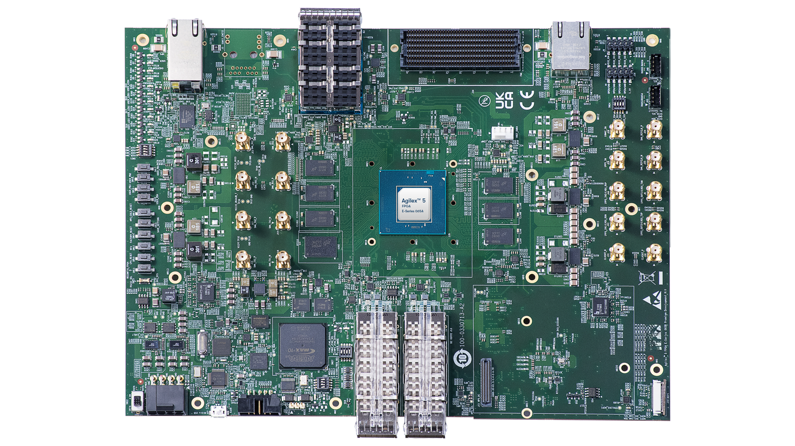

**Figure 10.** Agilex&trade; 5 FPGA and SoC E-Series 065A Premium Development Kit 

Set up the board default settings, as listed by the Agilex&trade; 5 FPGA and SoC E-Series 065A Premium Development Kit  User Guide, "[Default Settings](https://docs.altera.com/r/docs/d554638/current/agilex-5-fpga-e-series-065a-premium-development-kit-user-guide/default-settings)" section:

| Switch    | Default Position |
|:----------|:-----------------|
| S22       | OFF              |
| S16 [1:4] | OFF/ON/ON/ON     |
| S27 [1:4] | OFF/ON/ON/OFF    |
| S23       | OFF              |
| S21 [1:4] | OFF/OFF/OFF/OFF  |
| S24 [1:4] | ON/ON/ON/ON      |
| S25 [1:4] | ON/OFF/OFF/OFF   |

**Table 12.** Factory Default Switch Settings

Connect the Type B USB cable from each development kit (J27 - Highlighted as 12 in Figure 11) to the host for JTAG access.

Connect the two Agilex&trade; 5 FPGA and SoC E-Series Premium Development Kits (ES) with a QSFP cable(DAC/AOC) via the QSFP+ cages - J12 and J13 (Highlighted as 16 in Figure 11).

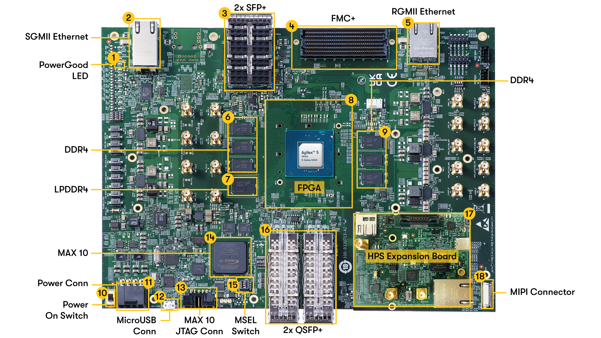

**Figure 11.** Module Identification for Agilex&trade; 5 FPGA and SoC E-Series 065A Premium Development Kit 

Follow instructions in "[Installing the HPS Expansion Board (HPS-EB)](https://docs.altera.com/r/docs/d554638/current/agilex-5-fpga-e-series-065a-premium-development-kit-user-guide/installing-the-hps-expansion-board-hps-eb)" to install HPS Expansion Board in the Development Kit.

Connect the mini-USB port(J7 - Highlighted as 16 in Figure 11) from each of the HPS Expansion Board to your host machine. Both development kits with HPS Expansion Board are connected to the same host.

Figure 12 shows a high level connectivity diagram for both development kits.

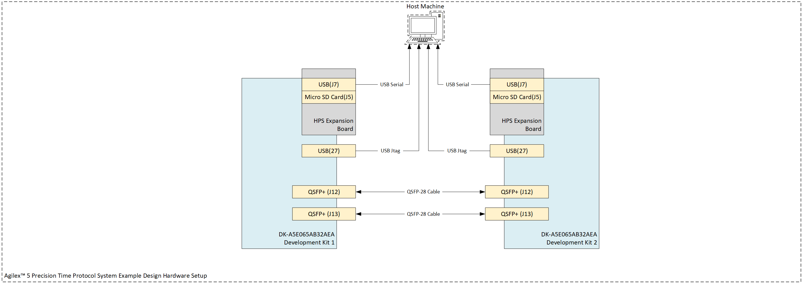

**Figure 12.** High level hardware connectivity diagram

### Configure the Serial Connection

The Embedded Linux OS on the Agilex&trade; 5 FPGA and SoC E-Series 065A Premium Development Kit  can be accessed via a serial terminal such as Minicom or PuTTY. First, identify the serial connection IDs between your host and each development kit. On an Ubuntu host, list the most recently connected USB-to-Serial devices using:

``` bash
admin@10.1.23.255:~$ dmesg | grep "ttyUSB*"
[1636111.470334] usb 1-1.2: FTDI USB Serial Device converter now attached to ttyUSB2
[1636111.470597] usb 1-1.2: FTDI USB Serial Device converter now attached to ttyUSB3
[1636114.478469] usb 1-11.2: FTDI USB Serial Device converter now attached to ttyUSB4
[1636114.478705] usb 1-11.2: FTDI USB Serial Device converter now attached to ttyUSB5

```

In this example, the four detected devices correspond to the serial connections for the Agilex&trade; 5 FPGA and SoC E-Series Premium Development Kits, as no other USB-to-Serial cables are connected to the host.

Start a serial session for each development kit using Minicom. Open separate terminal windows and launch a Minicom instance in each to monitor both kits concurrently.

Development Kit 1 terminal:

``` bash
# Note: Device names may vary depending on your system. Adjust accordingly.
admin@10.1.23.255:~$ minicom -D /dev/ttyUSB3
```

Development Kit 2 terminal:

``` bash
# Note: Device names may vary depending on your system. Adjust accordingly.
admin@10.1.23.255:~$ minicom -D /dev/ttyUSB5
```

Access the Minicom configuration screen using the following key combination:

- `Ctrl + A`, then press `Z` for the Command Summary menu
- `SHIFT + O` for the configuration menu

Configure each serial session with the following parameters:

- Bps/Par/Bits: 115200 8N1
- Hardware Flow Control: No
- Software Flow Control: No

Your 'Serial port setup' screen should look like the following after adjusting the configuration parameters:

``` bash  
Welcome to minicom 2.7.1                                                                  

OPTI+--------------------------------------------------------------------#             
Comp| A -    Serial Device      : /dev/ttyUSB3                              |             
Port| B - Lockfile Location     : /var/lock                                 |             
    | C -   Callin Program      :                                           |             
Pres| D -  Callout Program      :                                           |             
    | E -    Bps/Par/Bits       : 115200 8N1                                |             
    | F - Hardware Flow Control : No                                        |             
    | G - Software Flow Control : No                                        |             
    |                                                                       |             
    |    Change which setting?                                              |             
    +--------------------------------------------------------------------#             
            | Screen and keyboard      |                                                  
            | Save setup as dfl        |                                                  
            | Save setup as..          |                                                  
            | Exit                     |                                                  
            +-----------------------#
```

Both terminal will remain inactive until the Agilex&trade; 5 device is configured.

## User Flow

There are two ways to test the design based on use case.

- **User Flow 1**: Testing with Pre-build Binaries.

- **User Flow 2**: Testing Complete Flow.

| User Flow                               | Description                                                                                       | Required for User Flow 1 | Required for User Flow 2 |
|-----------------------------------------|---------------------------------------------------------------------------------------------------|--------------------------|--------------------------|
| [Environment Setup](#environment-setup) | [Tools Download and Installation](#tools-download-and-installation)                               | Yes                      | Yes                      |
|                                         | [Install the dependency packages for software compilation](#install-dependency-packages-for-sw-compilation) | No                       | Yes                      |
|                                         | [Package Download](#package-download)                                                             | Yes                      | Yes                      |
| [Compilation](#compilation)             | [HW compilation](#hw-compilation)                                                                 | No                       | Yes                      |
|                                         | [SW compilation](#sw-compilation)                                                                 | No                       | Yes                      |
| [Programming](#programming)             | [Programming the SW binary](#programming-the-sw-binary)                                           | Yes                      | Yes                      |
|                                         | [SI5518A SyncE Clock generator Configuration](#si5518a-synce-clock-generator-configuration)                         | Yes                      | Yes                      |
|                                         | [Programming the HW binary](#programming-the-hw-binary)                                           | Yes                      | Yes                      |
|                                         | [Linux Boot](#linux-boot)                                                                         | Yes                      | Yes                      |
| [Testing](#testing)                     | [Initial System Configuration](#initial-system-configuration)                                     | Yes                      | Yes                      |
|                                         | [Run Ping test](#run-ping-test)                                                                   | Yes                      | Yes                      |
|                                         | [Run iPerf3 test](#run-iperf3-test)                                                               | Yes                      | Yes                      |
|                                         | [Run Packet Generator test](#run-packet-generator-test)                                           | Yes                      | Yes                      |
|                                         | [Run ptp4l test](#run-ptp4l-test)                                                                 | Yes                      | Yes                      |

**Table 13.** User Test Flows.

## Environment Setup

### Tools Download and Installation

#### Altera Quartus Prime Pro

Download the Quartus&reg; Prime Pro Edition Software Version 26.1 from the [FPGA Software Download Center](https://www.altera.com/downloads/fpga-development-tools/quartus-prime-pro-edition-design-software-version-26-1-linux.html). Follow the on-screen instructions to complete the installation process.

Refer to the [Altera&reg; FPGA Software Installation and Licensing](https://docs.altera.com/r/docs/683472/current) for more information on the installation and licensing process.

Set up the Altera&reg; Quartus&reg; tools in the PATH environmental variable.

``` bash
# Adjust QUARTUS_ROOTDIR target to reflect your Quartus installation path  
export QUARTUS_ROOTDIR=~/altera_pro/26.1/quartus/
export PATH=$QUARTUS_ROOTDIR/bin:$QUARTUS_ROOTDIR/linux64:$QUARTUS_ROOTDIR/../qsys/bin:$PATH
```

### Install dependency packages for SW compilation

#### Arm GNU Toolchain 11.3.Rel1

Download the GCC ARM cross-compiler toolchain, add it to the PATH variable, to be used by the GHRD makefile to build the HPS Debug FSBL:

```bash
wget https://developer.arm.com/-/media/files/downloads/gnu/11.3.rel1/binrel/\
arm-gnu-toolchain-11.3.rel1-x86_64-aarch64-none-linux-gnu.tar.xz
tar xf arm-gnu-toolchain-11.3.rel1-x86_64-aarch64-none-linux-gnu.tar.xz
rm -f arm-gnu-toolchain-11.3.rel1-x86_64-aarch64-none-linux-gnu.tar.xz
export PATH=`pwd`/arm-gnu-toolchain-11.3.rel1-x86_64-aarch64-none-linux-gnu/bin:$PATH
export ARCH=arm64
export CROSS_COMPILE=aarch64-none-linux-gnu-
```

#### Yocto Build Prerequisites

Before building the Yocto-based Linux image, ensure the host system meets the [Yocto system requirements](https://docs.yoctoproject.org/scarthgap/ref-manual/system-requirements.html).

The command to install the required packages and set the environment on Ubuntu 22.04-LTS is:

``` bash
sudo apt-get update
sudo apt-get upgrade
sudo apt-get install openssh-server mc libgmp3-dev libmpc-dev gawk wget git diffstat unzip texinfo gcc \
build-essential chrpath socat cpio python3 python3-pip python3-pexpect xz-utils debianutils iputils-ping \
python3-git python3-jinja2 libegl1-mesa libsdl1.2-dev pylint xterm python3-subunit mesa-common-dev zstd \
liblz4-tool git fakeroot build-essential ncurses-dev xz-utils libssl-dev bc flex libelf-dev bison xinetd \
tftpd tftp nfs-kernel-server libncurses5 libc6-i386 libstdc++6:i386 libgcc++1:i386 lib32z1 \
device-tree-compiler curl mtd-utils u-boot-tools net-tools swig -y
export LC_ALL="en_US.UTF-8"
export LC_CTYPE="en_US.UTF-8"
export LC_NUMERIC="en_US.UTF-8"
export LANG=en_US.UTF-8
export LANGUAGE=en_US.UTF-8
```

#### Bash as Default Command Interpreter

On Ubuntu 22.04, set Bash as the system default command interpreter:

``` bash
sudo ln -sf /bin/bash /bin/sh
```

### Package Download

Clone the GitHub repository to obtain the System Example Design source package.

``` bash
git clone https://github.com/altera-fpga/agilex5-ed-ptp.git
cd agilex5-ed-ptp
git checkout SED-2X25GE_PTP-a5e065a-pdk-Q26.1-Rel1.1
cd a5e065a-prem-devkit-exp-prod
export TOP_FOLDER=`pwd`
mkdir bin
```

Directory Structure Used in This Example Design:

``` bash
|--- a5e065a-prem-devkit-exp-prod
  |   |--- src
  |   |   |--- hw
  |   |   |--- sw

```

Pre-built binaries are available under the [GitHub repository releases](https://github.com/altera-fpga/agilex5-ed-ptp/releases/tag/SED-2X25GE_PTP-a5e065a-pdk-Q26.1-Rel1.1). File descriptions are provided in the [Binaries](#binaries) section.

Extract all files and copy them to `$TOP_FOLDER/bin` to run hardware tests on the development kit.

## Compilation

The following steps outline the build process for both hardware (HW) and software (SW) components.

### HW compilation

The `src/hw/synth` directory contains the Quartus project and a Makefile with the following build targets:

- `make synth`   - Runs synthesis stage of Altera&reg; Quartus&reg;
- `make compile` - Runs the compile stage of Altera&reg; Quartus&reg;
- `make all`     - Runs a full Altera&reg; Quartus&reg; compilation flow

Run the following command to compile the project.

``` bash
cd $TOP_FOLDER/src/hw/synth/
make all CONFIG=25G_NON_ANLT 
```

Alternatively, launch Altera&reg; Quartus&reg; in GUI mode, open `top.qpf`, and run the compile operation. This generates `top.sof` at `$TOP_FOLDER/src/hw/output_files/`.

#### Build HPS and CORE RBF file

The configuration bitstream generated by Altera&reg; Quartus&reg; Prime includes the FPGA core, I/O, and the HPS First-Stage Bootloader (FSBL). After compiling the project, you must integrate your current U-Boot FSBL (`u-boot-spl-dtb.hex`) into the bitstream.

To embed the .hex file into the bitstream, run the following command:

``` bash
cd $TOP_FOLDER
quartus_pfg -c -o hps=on -o hps_path=src/sw/artifacts/u-boot-spl-dtb.hex src/hw/synth/output_files/top.sof bin/top.rbf
cp src/hw/synth/output_files/top.sof bin/
```

The following files are generated:

- `$TOP_FOLDER/bin/top.hps.rbf`  - HPS First configuration bitstream, phase 1 (HPS and DDR)
- `$TOP_FOLDER/bin/top.core.rbf` - HPS First configuration bitstream, phase 2 (FPGA fabric)

#### Build QSPI Image

The QSPI image will contain the FPGA configuration data and the HPS FSBL and it can be built using the following command:

``` bash
cd $TOP_FOLDER 
quartus_pfg -c src/hw/synth/output_files/top.sof \
bin/top.jic \
-o hps_path=src/sw/artifacts/u-boot-spl-dtb.hex \
-o device=MT25QU128 \
-o flash_loader=A5ED065AB32AE1V \
-o mode=ASX4 \
-o hps=1
```

The following files will be created:

- `$TOP_FOLDER/bin/top.hps.jic`   - Flash image for HPS First configuration bitstream, phase 1 (HPS and DDR)
- `$TOP_FOLDER/bin/top.core.rbf` - HPS First configuration bitstream, phase 2 (FPGA fabric, discarded, as we already have it on the SD card)

### SW Compilation

#### Build Yocto

Start the Yocto build process by executing the following command:

``` bash
cd $TOP_FOLDER/src/sw/yocto
. agilex5_dk_a5e065ab32aes1_b0-PTP_2P25G-build.sh
build_default
```

After a successful build, all required images are stored in the `$TOP_FOLDER/src/sw/yocto/agilex5_dk_a5e065ab32aes1_b0-gsrd-images` directory. Build time varies depending on the host system's resource specifications. Upon successful compilation of the ${{ env_local.ETH_RATE }} system example design, the following files are generated:

- `$TOP_FOLDER/src/sw/yocto/agilex5_dk_a5e065ab32aes1_b0-gsrd-images/u-boot-agilex5-socdk-gsrd-atf/u-boot-spl-dtb.hex`
- `$TOP_FOLDER/src/sw/yocto/agilex5_dk_a5e065ab32aes1_b0-gsrd-images/u-boot-agilex5-socdk-gsrd-atf/u-boot.itb`
- `$TOP_FOLDER/src/sw/yocto/agilex5_dk_a5e065ab32aes1_b0-gsrd-images/kernel_sed.itb`
- `$TOP_FOLDER/src/sw/yocto/agilex5_dk_a5e065ab32aes1_b0-gsrd-images/sdimage.tar.gz`

Copy `sdimage.tar.gz` and `kernel_sed.itb` to the `bin` folder.

``` bash
cp -rf $TOP_FOLDER/src/sw/yocto/agilex5_dk_a5e065ab32aes1_b0-gsrd-images/sdimage.tar.gz $TOP_FOLDER/bin/sdimage.tar.gz
cp -rf $TOP_FOLDER/src/sw/yocto/agilex5_dk_a5e065ab32aes1_b0-gsrd-images/kernel_sed.itb $TOP_FOLDER/bin/kernel_sed.itb
```

#### Yocto Update

If the hardware project is modified, the software must be updated to match the new bitstream. The HPS second-stage bootloader embeds a SHA signature of the FPGA bitstream during compilation. Any change to the bitstream alters the SHA, requiring a bootloader update.

To update the FPGA bitstream SHA signature in the HPS second-stage bootloader, follow these steps:

1. Replace `$TOP_FOLDER/src/sw/yocto/meta-agilex5-sed/recipes-bsp/ghrd/files/agilex5_dk_a5e065bb32aes1_b0_gsrd_ghrd_PTP_2P25G.core.rbf` with the updated `top.core.rbf`
2. Update the recipe at `$TOP_FOLDER/src/sw/yocto/meta-agilex5-sed/recipes-bsp/ghrd/hw-ref-design.bb` using the following commands

``` bash
cd $TOP_FOLDER
CORE_RBF=src/sw/yocto/meta-agilex5-sed/recipes-bsp/ghrd/files/agilex5_dk_a5e065bb32aes1_b0_gsrd_ghrd_PTP_2P25G.core.rbf
rm -rf $CORE_RBF
cp -f bin/top.core.rbf $CORE_RBF
FILE=src/sw/yocto/meta-agilex5-sed/recipes-bsp/ghrd/hw-ref-design.bbappend
CORE_SHA=$(sha256sum $CORE_RBF | cut -f1 -d" ") 
OLD_SHA=".*sha256sum_PTP_2P25G.*"
NEW_SHA="sha256sum_PTP_2P25G = \"$CORE_SHA\"" 
sed -i "s/$OLD_SHA/$NEW_SHA/" "$FILE"
```

After completing the previous step, rebuild the design as described in [Build Yocto](#build-yocto).

## Programming

If following User Flow 1, download the [Prebuild Binaries](#binaries). Ensure all steps under [Hardware Setup](#hardware-setup) are completed before proceeding.

### Programming the SW binary

The SD card image file `sdimage.tar.gz` is provided in the as part of the [Prebuild Binaries](#binaries), you may refer to [Release Content](#release-contents) for more information.

Follow the instructions under "[Write SD Card](https://altera-fpga.github.io/rel-26.1/embedded-designs/agilex-5/e-series/premium-065a/gsrd/ug-gsrd-agx5e-premium-065a/#boot-from-sd-card)" in the HPS GSRD User Guide for the Agilex&trade; 5 FPGA and SoC E-Series 065A Premium Development Kit  to create two bootable SD cards using the provided image file.

Insert the SD cards into each development kit.

### SI5518A SyncE Clock generator Configuration

This Design needs 156.25 MHz on OUT2 of Si5518 for the ToD input for better performance. The default clock profile on  Agilex&trade; 5 FPGA E-Series 065B Premium Development Kit outputs 125 MHz on OUT2. The clock profile has been regenerated using ClockBuilder Pro software for the desired output. Also, the clock profile is changed to default holdover mode, and on boot up, the boards need to be programmed as master or slave.

- Download the Developement kit Installer packeage from [Agilex™ 5 FPGA E-Series Premium FPGA Development Kit Installer Package](https://docs.altera.com/v/u/resources/822942/agilextm-5-fpga-e-series-065b-premium-fpga-development-kit-installer-package-dk-a5e065bb32aes1-v25.1.1-or-higher).
- Setup the Board Test System for Development on the host PC as mentioned in [Section 4.1](https://docs.altera.com/r/docs/d554638/current/agilex-5-fpga-e-series-065a-premium-development-kit-user-guide/set-up-the-bts-gui-running-environment) of Agilex&trade; 5 FPGA E-Series 065A Premium Development Kit User Guide.
- Open clock controller GUI fro SI5518A as mentioned in [Section 4.3.2.2](https://docs.altera.com/r/docs/d554638/current/agilex-5-fpga-e-series-065a-premium-development-kit-user-guide/si5518-clock) of gilex&trade; 5 FPGA E-Series 065A Premium Development Kit User Guide.
- You can find the config files path `$TOP_FOLDER/src/sw/clk_ic_config/SI5518A_clock_config.zip` or you can download the clock configuration files from [`SI5518A_clock_config.zip`](https://github.com/altera-fpga/agilex5-ed-ptp/blob/rel/26.1/a5e065a-prem-devkit-exp-prod/src/sw/clk_ic_config/SI5518A_clock_config.zip) and extract the files from `unzip` command.
   ```bash
   $ unzip SI5518A_clock_config.zip
   Archive:  SI5518A_clock_config.zip
      creating: 390.625_Forceholdover_0.01ppb/
   inflating: Si5518G-Bxxxxx-GM-v0-ISM72E1-Project_TOD156P25MHz_ForceHoldover_0.01ppb.slabtimeproj
   inflating: Si5518G-Bxxxxx-GM-v0-ISM72E1_TOD156P25MHz_ForceHoldover_0.01ppb-design_report.txt
   inflating: Si5518G-Bxxxxx-GM-v0-ISM72E1_TOD156P25MHz_ForceHoldover_0.01ppb-prod_fw_pps.boot.bin
   inflating: Si5518G-Bxxxxx-GM-v0-ISM72E1_TOD156P25MHz_ForceHoldover_0.01ppb-user_config.boot.bin
   ```
- Program the 156.25MHz clock profile using above extracted files by importing them into SI5518 clock controller GUI.
- You can save the imported clock settings to flash if you want the board to load the user settings on power-up next time. To do so, follow these steps:
   - To import user settings, click the Import button.
   - Wait for the successful completion of importing, and press SW15 for 5 seconds. The board saves all the clock settings to flash. The LED D11 blinks once to notify you that it is in saving state. The saving only takes effect tat the next power cycling.
   - If you want to restore the factory default clock settings, press SW14 for 5 seconds. The LED D11 blinks 5 times to notify you of its recovering state.

### Programming the HW binary

#### Program the onboard Agilex&trade; 5 device

Using Quartus&reg; Programmer Tool Version 26.1 GUI, configure the onboard `A5ED065AB32AE1V` device with `top.hps.rbf`.

Alternatively, you can perform this operation via the command line. First, verify that all devices on the development kit are recognized and identify the JTAG cable number using the following command:

``` bash
/home/user$ jtagconfig
1) Agilex 5E065B Premium DK [USB-1]
  4BA06477   ARM_CORESIGHT_SOC_600
  4364F0DD   A5EC065(AB32A|BB32A)/..
  020D10DD   VTAP10

2) Agilex 5E065B Premium DK [USB-2]
  4BA06477   ARM_CORESIGHT_SOC_600
  4364F0DD   A5EC065(AB32A|BB32A)/..
  020D10DD   VTAP10

```

From the `jtagconfig` output, two Agilex&trade; 5 FPGA and SoC E-Series Premium Development Kits are detected, with devices identified and assigned to cable 1 and cable 2.

Configure the development kits from your host using the following command:

``` bash
cd $TOP_FOLDER/bin
# Update the -c parameter to match the JTAG cable numbers assigned to your development kits
# If the Agilex 5 FPGA is in position 1, update the parameter after @ to reflect the correct device index.
quartus_pgm -c 1 -m jtag -o "p;./bin/top.hps.rbf@2" && quartus_pgm -c 2 -m jtag -o "p;./bin/top.hps.rbf@2"
```

## Linux Boot

On the HPS UART (Minicom connection), you’ll observe the HPS booting Linux from the SD card. Once booted, log in with username `root` and no password. The system is now ready for configuration.

If everything is functioning correctly, each Minicom terminal will display boot messages from the HPS running Linux.

```bash
agilex5dka5e065bb32a login: root

WARNING: Poky is a reference Yocto Project distribution that should be used for
testing and development purposes only. It is recommended that you create your
own distribution for production use.
root@agilex5dka5e065bb32a:~# uname -a
Linux agilex5dka5e065bb32a 6.12.19-altera-2x25G-ptp-sed-Q26.1-R1.1 #1 SMP PREEMPT Wed Jun 17 07:05:03 UTC 2026 aarch64 GNU/Linux
root@agilex5dka5e065bb32a:~# cat /etc/os-release
ID=poky
NAME="Poky (Yocto Project Reference Distro)"
VERSION="5.0.18 (scarthgap)"
VERSION_ID=5.0.18
VERSION_CODENAME="scarthgap"
PRETTY_NAME="Poky (Yocto Project Reference Distro) 5.0.18 (scarthgap)"
CPE_NAME="cpe:/o:openembedded:poky:5.0.18"
root@agilex5dka5e065bb32a:~#

```

Commands:
```
uname -a
cat /etc/os-release
```

Repeat the same steps for the second Agilex&trade; 5 FPGA and SoC E-Series 065A Premium Development Kit.


### Clock configuration

 Below commands will configure the boards on role as given below:

- DUT as clock master: `/home/root/scripts/si5518config.sh master`
- DUT as clock slave: `/home/root/scripts/si5518config.sh slave`
- DUT as Boundary Clock: `/home/root/scripts/si5518config.sh slave`

**Scenarios:**

1. When link is UP and DUT as clock slave:

      ```bash
      root@agilex5dka5e065bb32a:~# ./scripts/si5518config.sh slave
      [ 1710.401114] i2c 0-0059: i2c_si5518_set_holdover: pll: 2, state: 0
      [ 1710.410503] i2c 0-0059: i2c_si5518_select_input: pll: 2, input: 0
      [ 1710.417734] i2c 0-0059: input_status_store: input: 0
      CDR clock input is valid
      ./scripts/si5518config.sh: line 58: echo: write error: Input/output error
      ./scripts/si5518config.sh: line 67: echo: write error: Input/output error
      ./scripts/si5518config.sh: line 67: echo: write error: Input/output error
      ./scripts/si5518config.sh: line 67: echo: write error: Input/output error
      Input set to CDR and PLL is locked... Slave set successful!!
      root@agilex5dka5e065bb32a:~#

      ```

2. When link is DOWN and DUT as clock slave:

      ```bash
      "CDR clock not available and PLL is in holdover... Slave set successful!!"
      NOTE: once the link is UP the PLL will be set to locked and can be validated by reading the PLL state using command: “echo "0x2 0x1" > /sys/bus/i2c/devices/0-0059/pll_wait”. This will NOT RETURN ANY ERROR if the pll is locked. It may takes 5~10 seconds for the PLL A to be locked.
      ```

3. 10MHz input is available and DUT as master

      ```bash
      root@agilex5dka5e065bb32aes1:~# ./scripts/si5518config.sh master
      "10MHz is connected and DSPLLA is locked... Master set successful!!"
      ```

4. 10MHz input is not available and DUT as master. DUT is driven by TCXO

      ```bash
      "10MHz is not connected and DSPLLA in holdover... Master set successful!!"
      ```

For this test please run below commands in respective development kit.

 Execute in Development Kit 1:

```bash
source ./scripts/si5518config.sh master
```

Output:

   ```bash
	root@agilex5dka5e065bb32a:~# source ./scripts/si5518config.sh master
	Set master
	[ 1807.570745] i2c 0-0059: i2c_si5518_set_holdover: pll: 2, state: 0
	[ 1807.580789] i2c 0-0059: i2c_si5518_select_input: pll: 2, input: 5
	[ 1807.588231] i2c 0-0059: input_status_store: input: 5
	./scripts/si5518config.sh: line 13: echo: write error: Resource temporarily unavailable[ 1807.600042] i2c 0-0059: input_status_store: input: 6

	./scripts/si5518config.sh: line 15: echo: write error: Resource temporarily unavailable
	10MHz input is invalid
	10MHz is not connected and DSPLLA in holdover... Master set successful!!
	root@agilex5dka5e065bb32a:~#
   ```

 Execute in Development Kit 2:

```bash
source ./scripts/si5518config.sh slave
```

   output:

   ```bash
	root@agilex5dka5e065bb32a:~# source ./scripts/si5518config.sh slave
	[ 1710.401114] i2c 0-0059: i2c_si5518_set_holdover: pll: 2, state: 0
	[ 1710.410503] i2c 0-0059: i2c_si5518_select_input: pll: 2, input: 0
	[ 1710.417734] i2c 0-0059: input_status_store: input: 0
	CDR clock input is valid
	./scripts/si5518config.sh: line 58: echo: write error: Input/output error
	./scripts/si5518config.sh: line 67: echo: write error: Input/output error
	./scripts/si5518config.sh: line 67: echo: write error: Input/output error
	./scripts/si5518config.sh: line 67: echo: write error: Input/output error
	Input set to CDR and PLL is locked... Slave set successful!!
	root@agilex5dka5e065bb32a:~#
   ```

### Ethernet Link Status

Check the network status on each Agilex&trade; 5 FPGA and SoC E-Series 065A Premium Development Kit  using the following command:

``` bash
root@agilex5dka5e065bb32a:~# ip addr
1: lo: <LOOPBACK,UP,LOWER_UP> mtu 65536 qdisc noqueue state UNKNOWN group default qlen 1000
    link/loopback 00:00:00:00:00:00 brd 00:00:00:00:00:00
    inet 127.0.0.1/8 scope host lo
       valid_lft forever preferred_lft forever
    inet6 ::1/128 scope host noprefixroute
       valid_lft forever preferred_lft forever
2: eth0: <BROADCAST,MULTICAST,UP,LOWER_UP> mtu 1500 qdisc mq state UP group default qlen 1000
    link/ether 86:80:39:ff:f9:fd brd ff:ff:ff:ff:ff:ff
    inet 10.244.192.221/22 brd 10.244.195.255 scope global eth0
       valid_lft forever preferred_lft forever
    inet6 fe80::8480:39ff:feff:f9fd/64 scope link proto kernel_ll
       valid_lft forever preferred_lft forever
3: teql0: <NOARP> mtu 1500 qdisc noop state DOWN group default qlen 100
    link/void
4: sit0@NONE: <NOARP> mtu 1480 qdisc noop state DOWN group default qlen 1000
    link/sit 0.0.0.0 brd 0.0.0.0
5: eth1: <BROADCAST,MULTICAST,UP,LOWER_UP> mtu 1500 qdisc mq state UP group default qlen 1000
    link/ether ae:81:19:bf:6e:63 brd ff:ff:ff:ff:ff:ff
    inet 169.254.60.10/16 brd 169.254.255.255 scope global eth1
       valid_lft forever preferred_lft forever
    inet6 fe80::ac81:19ff:febf:6e63/64 scope link proto kernel_ll
       valid_lft forever preferred_lft forever
6: eth2: <BROADCAST,MULTICAST,UP,LOWER_UP> mtu 1500 qdisc mq state UP group default qlen 1000
    link/ether 42:db:c1:9b:6e:2e brd ff:ff:ff:ff:ff:ff
    inet 169.254.50.120/16 brd 169.254.255.255 scope global eth2
       valid_lft forever preferred_lft forever
    inet6 fe80::40db:c1ff:fe9b:6e2e/64 scope link proto kernel_ll
       valid_lft forever preferred_lft forever
root@agilex5dka5e065bb32a:~#

```

Three Ethernet interfaces will be listed in the output of `ip addr`:

1. `eth0` : HPS dedicated Ethernet interface (1Gbps)
2. `eth1` : 25G Ethernet Port (25Gbps)
3. `eth2` : 25G Ethernet Port (25Gbps)

## Initial System Configuration

After booting on both development kits, the System Example design requires initialization of key components: DMA subsystem, User Logic (Packet Generator), Packet Switch, Egress QoS-TC, and Iperf. Two configuration methods are supported.

1. One-step configuration via script
2. Step-by-Step configuration of each interface.

### Configuration Via Script

For [manual configuration](#manual-configuration), skip this section.

The `2PortMCQ.sh` script is included in the Yocto rootfs image at `/home/root/scripts/`. It accepts a single numeric argument specifying the target development kit. Usage:

``` bash
source ./scripts/2PortMCQ.sh <development kit number>
```

Valid argument values are `1` or `2`.

Run the following command on Development Kit 1:

``` bash
source ./scripts/2PortMCQ.sh 1
```

Expected output:

``` bash
root@agilex5dka5e065bb32a:~# source ./scripts/2PortMCQ.sh 1
Programming the Basic IP address...
Clearing old PacketSwitch rules Port - 0...
UIO device file found. Using /dev/uio2
Key Flush successful...
No Filters attached to eth1. Continuing...
Clearing old PacketSwitch rules Port - 1...
UIO device file found. Using /dev/uio2
Key Flush successful...
No Filters attached to eth2. Continuing...
Flushing old IPv4 and IPv6 addresses and routes
Setting DEVKIT to 1.
Running script for Devkit 1.
    link/ether aa:d4:e9:d3:e7:c9 brd ff:ff:ff:ff:ff:ff
    link/ether 26:ec:cb:d6:97:2d brd ff:ff:ff:ff:ff:ff
    link/ether 0e:df:e7:c2:7f:36 brd ff:ff:ff:ff:ff:ff
Programming the PacketSwitch Port - 0...
Programming the PacketSwitch Generic rule...

<-- output truncated -->

UIO device file found. Using /dev/uio2
Setting Entry: Success
Copying Keyfields: Port: 0 Key index: 21 Success
Setting Result Register: 8. Success
Setting Mask Register: Success
Setting Mgmt Cntrl Register: Success
Wait till operation is done: Key Insertion successful...
Programming the PacketSwitch - Port 1 User packets to User port...
UIO device file found. Using /dev/uio2
Setting Entry: Success
Copying Keyfields: Port: 1 Key index: 21 Success
Setting Result Register: 8. Success

Traffic Class Egress QOS programming - Port - eth1
Create QDisc...
Create Filters - PTP packets to DMA0...
Create Filters - IPERF 530X packets to DMA0...
Create Filters - IPERF 520X packets to DMA1...
Create Filters - ICMP packets to DMA1...
Create Filters - All other packets to DMA1...
Create Filters - All broadcast packets to DMA1...
Traffic Class Egress QOS programming - Port - eth2
Create QDisc...
Create Filters - PTP packets to DMA0...
Create Filters - IPERF 530X packets to DMA0...
Create Filters - IPERF 520X packets to DMA1...
Create Filters - ICMP packets to DMA1...
Create Filters - All other packets to DMA1...
Create Filters - All broadcast packets to DMA1...
Configuration for Devkit 1 set
root@agilex5dka5e065bb32a:~#

```

Configure Development Kit 2:

``` bash
source ./scripts/2PortMCQ.sh 2
```

### Manual Configuration

#### Define Interrupt Core Handling

Set up SMP affinity for Ethernet interrupts to distribute handling across different CPUs.

Execute the following commands on both development kits:

``` bash
echo -e "Programming the Basic IP address..."
echo "4" > /proc/irq/23/smp_affinity && echo "4" > /proc/irq/24/smp_affinity
echo "8" > /proc/irq/25/smp_affinity && echo "8" > /proc/irq/26/smp_affinity
echo "4" > /proc/irq/27/smp_affinity && echo "4" > /proc/irq/28/smp_affinity
echo "8" > /proc/irq/29/smp_affinity && echo "8" > /proc/irq/30/smp_affinity
```

#### Clear Old Configurations

Clear existing Packet Switch TCAM keys, traffic class (TC) configurations, and any pre-existing IPv6 settings.

Execute the following commands on both development kits:

``` bash
echo -e "Clearing old PacketSwitch rules Port - 0..."
packetswitch --port 0 --flush-all-keys
echo -e "Clearing old TC rules Port - 0..."
tc filter del dev eth1 egress
tc qdisc del dev eth1 clsact
echo -e "Clearing old PacketSwitch rules Port - 1..."
packetswitch --port 1 --flush-all-keys
echo -e "Clearing old TC rules Port - 1..."
tc filter del dev eth2 egress
tc qdisc del dev eth2 clsact
echo -e "Flushing old IPv4 and IPv6 addresses and routes"
ip addres flush eth1 && ip route flush dev eth1
ip -6 addres flush eth1 && ip -6 route flush dev eth1
ip addres flush eth2 && ip route flush dev eth2
ip -6 addres flush eth2 && ip -6 route flush dev eth2
```

If no configuration is stored, the commands may return error messages. These errors are safe to ignore.

#### Set IPv4 Addresses

`eth1` and `eth2` are the Linux interface names assigned to GTS Ethernet Hard IP ports 8 and 9, respectively. Both interfaces must be in the UP state and have IP addresses assigned. Use the following commands to overwrite the IP addresses and bring the interfaces up.

Execute the following commands on development kit 1:

``` bash
ip link set eth1 up && ip addr add 192.168.121.1 dev eth1 && ip route add 192.168.121.0/24 dev eth1 src 192.168.121.1
ip link set eth2 up && ip addr add 192.168.122.1 dev eth2 && ip route add 192.168.122.0/24 dev eth2 src 192.168.122.1

ip addr | grep ether
```

Execute the following commands on development kit 2:

``` bash
ip link set eth1 up && ip addr add 192.168.121.2 dev eth1 && ip route add 192.168.121.0/24 dev eth1 src 192.168.121.2
ip link set eth2 up && ip addr add 192.168.122.2 dev eth2 && ip route add 192.168.122.0/24 dev eth2 src 192.168.122.2

ip addr | grep ether
```

#### Packet Switch Rules

##### Generic Traffic Rules

The following rules configure the Packet Switch to route ping requests to the lowest priority DMA (DMA-1) on both Ethernet interfaces.

``` bash
echo -e "Programming the PacketSwitch Port - 0..."
echo -e "Programming the PacketSwitch Generic rule..."
packetswitch --port 0 --set-key --key-index 0 --dest-mac "eth1"  --result 0x1
echo -e "Programming the PacketSwitch - Low priority rules..."
packetswitch --port 0 --set-key --key-index 1 --ethtype 0x0806 --result 0x1
packetswitch --port 0 --set-key --key-index 2 --ethtype 0x0800 --protocol 0x01 --result 0x1


echo -e "Programming the PacketSwitch Port - 1..."
echo -e "Programming the PacketSwitch Generic rule..."
packetswitch --port 1 --set-key --key-index 0 --dest-mac "eth2"  --result 0x1
echo -e "Programming the PacketSwitch - Low priority rules..."
packetswitch --port 1 --set-key --key-index 1 --ethtype 0x0806 --result 0x1
packetswitch --port 1 --set-key --key-index 2 --ethtype 0x0800 --protocol 0x01 --result 0x1
```

The first rule matches packets with a destination MAC address equal to that of the Ethernet interface. The second rule filters Ethernet frames with Ethertype set to IPv4 and the IPv4 protocol field set to ICMP. The final rule filters frames with Ethertype set to ARP.

##### iPerf3 Synthetic Traffic Rules

iPerf3 is a tool for active measurement of maximum achievable bandwidth on IP networks. It can generate traffic between a client and server, with configurable parameters such as the network port used. The following rules assign a target DMA based on the network port of incoming Ethernet packets.

``` bash
echo -e "Programming the PacketSwitch Port - 0..."
echo -e "Programming the PacketSwitch - IPERF 530X to DMA0..."
packetswitch --port 0 --set-key --key-index 3 --ethtype 0x0800 --dest-port 5301 --result 0x0
packetswitch --port 0 --set-key --key-index 4 --ethtype 0x0800 --dest-port 5302 --result 0x0
packetswitch --port 0 --set-key --key-index 5 --ethtype 0x0800 --src-port 5301 --result 0x0
packetswitch --port 0 --set-key --key-index 6 --ethtype 0x0800 --src-port 5302 --result 0x0
echo -e "Programming the PacketSwitch - IPERF 520X to DMA1..."
packetswitch --port 0 --set-key --key-index 7 --ethtype 0x0800 --dest-port 5201 --result 0x1
packetswitch --port 0 --set-key --key-index 8 --ethtype 0x0800 --dest-port 5202 --result 0x1
packetswitch --port 0 --set-key --key-index 9 --ethtype 0x0800 --src-port 5201 --result 0x1
packetswitch --port 0 --set-key --key-index 10 --ethtype 0x0800 --src-port 5202 --result 0x1
echo -e "Programming the PacketSwitch - VLAN frames IPERF 530X to DMA0..."
packetswitch --port 0 --set-key --key-index 15 --ethtype 0x8100 --dest-port 5300 --mask 0xFFFC --result 0x0
packetswitch --port 0 --set-key --key-index 16 --ethtype 0x8100 --src-port 5300 --mask 0xFFFC --result 0x0
echo -e "Programming the PacketSwitch - VLAN frames IPERF 530X to DMA1..."
packetswitch --port 0 --set-key --key-index 17 --ethtype 0x8100 --dest-port 5200 --mask 0xFFFC --result 0x1
packetswitch --port 0 --set-key --key-index 18 --ethtype 0x8100 --src-port 5200 --mask 0xFFFC --result 0x1
packetswitch --port 0 --set-key --key-index 19 --dest-mac "01:00:5E:00:00:00" --mask "FF:FF:FF:FF:FE:00" --result 0x0
packetswitch --port 0 --set-key --key-index 20 --dest-mac "33:33:00:00:01:80" --mask "FF:FF:FF:FF:FF:FC" --result 0x0

echo -e "Programming the PacketSwitch Port - 1..."
echo -e "Programming the PacketSwitch - IPERF 530X to DMA0..."
packetswitch --port 1 --set-key --key-index 3 --ethtype 0x0800 --dest-port 5301 --result 0x0
packetswitch --port 1 --set-key --key-index 4 --ethtype 0x0800 --dest-port 5302 --result 0x0
packetswitch --port 1 --set-key --key-index 5 --ethtype 0x0800 --src-port 5301 --result 0x0
packetswitch --port 1 --set-key --key-index 6 --ethtype 0x0800 --src-port 5302 --result 0x0
echo -e "Programming the PacketSwitch - IPERF 520X to DMA1..."
packetswitch --port 1 --set-key --key-index 7 --ethtype 0x0800 --dest-port 5201 --result 0x1
packetswitch --port 1 --set-key --key-index 8 --ethtype 0x0800 --dest-port 5202 --result 0x1
packetswitch --port 1 --set-key --key-index 9 --ethtype 0x0800 --src-port 5201 --result 0x1
packetswitch --port 1 --set-key --key-index 10 --ethtype 0x0800 --src-port 5202 --result 0x1
echo -e "Programming the PacketSwitch - VLAN frames IPERF 530X to DMA0..."
packetswitch --port 1 --set-key --key-index 15 --ethtype 0x8100 --dest-port 5300 --mask 0xFFFC --result 0x0
packetswitch --port 1 --set-key --key-index 16 --ethtype 0x8100 --src-port 5300 --mask 0xFFFC --result 0x0
echo -e "Programming the PacketSwitch - VLAN frames IPERF 520X to DMA1..."
packetswitch --port 1 --set-key --key-index 17 --ethtype 0x8100 --dest-port 5200 --mask 0xFFFC --result 0x1
packetswitch --port 1 --set-key --key-index 18 --ethtype 0x8100 --src-port 5200 --mask 0xFFFC --result 0x1
packetswitch --port 1 --set-key --key-index 19 --dest-mac "01:00:5E:00:00:00" --mask "FF:FF:FF:FF:FE:00" --result 0x0
packetswitch --port 1 --set-key --key-index 20 --dest-mac "33:33:00:00:01:80" --mask "FF:FF:FF:FF:FF:FC" --result 0x0
```

The commands above configure the Packet Switch to route all traffic using port 520X to DMA-0, 530X to DMA-1.

##### PTP Traffic Rules

PTP Ethernet packets will be routed to the highest priority DMA (DMA-0) to keep the system time synchronized with the network time. Execute the following commands on both development kits to make both Ethernet interfaces prioritize the PTP traffic:

``` bash
echo -e "Programming the PacketSwitch Port - 0..."
echo -e "Programming the PacketSwitch - PTP Packets to DMA0..."
packetswitch --port 0 --set-key --key-index 11 --dest-mac "01:80:C2:00:00:0E" --result 0x0
packetswitch --port 0 --set-key --key-index 12 --dest-mac "01:1B:19:00:00:00" --result 0x0
packetswitch --port 0 --set-key --key-index 13 --ethtype 0x88F7 --result 0x0
packetswitch --port 0 --set-key --key-index 14 --ethtype 0x88F8 --result 0x0

echo -e "Programming the PacketSwitch - PTP Packets to DMA0..."
packetswitch --port 1 --set-key --key-index 11 --dest-mac "01:80:C2:00:00:0E" --result 0x0
packetswitch --port 1 --set-key --key-index 12 --dest-mac "01:1B:19:00:00:00" --result 0x0
packetswitch --port 1 --set-key --key-index 13 --ethtype 0x88F7 --result 0x0
packetswitch --port 1 --set-key --key-index 14 --ethtype 0x88F8 --result 0x0
```

The commands above set rules to filter packets based on the destination address used for PTP broadcast messages and the protocol identifier encapsulated in the EtherType field of the Ethernet frame. The rules are applied to both Ethernet interfaces in this example, but there is an independent scheduler for each Ethernet interface, making it possible to have different rules for each one of them.

##### Packet Generator Traffic Rules

The following set of rules defines the routing to the client ports where the system example design packet generators are connected.

The `packetgenerator` commands set the source and destination MAC addresses to be used by each packet generator. Then, the `packetswitch` is used to filter incoming Ethernet frames coming from the opposite development kit and route them to one of the user ports (user ports are represented by '0x8'). There are two additional commands to program the packet generator module with traffic configuration parameters.

Execute the following commands on development kit 1:

``` bash
echo -e "Programming the PacketSwitch - Port 0 User packets to User port..."
packetgenerator --device /dev/uio0 --dest-mac "12:34:56:78:0A:2" --src-mac "12:34:56:78:0A:1"
packetswitch --set-key --port 0 --key-index 21 --dest-mac "12:34:56:78:0A:1" --result 0x8
echo -e "Programming the PacketSwitch - Port 1 User packets to User port..."
packetgenerator --device /dev/uio1 --dest-mac "12:34:56:78:0A:4" --src-mac "12:34:56:78:0A:3"
packetswitch --set-key --port 1 --key-index 21 --dest-mac "12:34:56:78:0A:3" --result 0x8
echo -e "Programming the Packet Generator - Port 0"
packetgenerator --device /dev/uio0 --traffic false --fixed-gap true --pkt-len-mode 0x01 --num-idle-cycles 22 --packet-checker true --num-packets 0xFFFFFFFF --one-shot false --tx-pkt-size 1024 --tx-max-pkt-size 1024
echo -e "Programming the Packet Generator - Port 1"
packetgenerator --device /dev/uio1 --traffic false --fixed-gap true --pkt-len-mode 0x01 --num-idle-cycles 22 --packet-checker true --num-packets 0xFFFFFFFF --one-shot false --tx-pkt-size 1024 --tx-max-pkt-size 1024

```

Execute the following commands on development kit 2:

``` bash
echo -e "Programming the PacketSwitch - Port 0 User packets to User port..."
packetgenerator --device /dev/uio0 --dest-mac "12:34:56:78:0A:1" --src-mac "12:34:56:78:0A:2"
packetswitch --set-key --port 0 --key-index 21 --dest-mac "12:34:56:78:0A:2" --result 0x8
echo -e "Programming the PacketSwitch - Port 1 User packets to User port..."
packetgenerator --device /dev/uio1 --dest-mac "12:34:56:78:0A:3" --src-mac "12:34:56:78:0A:4"
packetswitch --set-key --port 1 --key-index 21 --dest-mac "12:34:56:78:0A:4" --result 0x8
echo -e "Programming the Packet Generator - Port 0"
packetgenerator --device /dev/uio0 --traffic false --fixed-gap true --pkt-len-mode 0x01 --num-idle-cycles 22 --packet-checker true --num-packets 0xFFFFFFFF --one-shot false --tx-pkt-size 1024 --tx-max-pkt-size 1024
echo -e "Programming the Packet Generator - Port 1"
packetgenerator --device /dev/uio1 --traffic false --fixed-gap true --pkt-len-mode 0x01 --num-idle-cycles 22 --packet-checker true --num-packets 0xFFFFFFFF --one-shot false --tx-pkt-size 1024 --tx-max-pkt-size 1024
```

##### IPv6 Traffic Rules

The next commands set set IPv6 addresses and update the routing table  for both ethernet interfaces. Then, the `packetswitch` rules define that that IPv6 ping requests needs to be channeled to the lowest-priority DMA (DMA-1) on both Ethernet interfaces.

Execute the following commands on development kit 1:

``` bash
echo -e "Programming the IPV6 rules - Port 0"
echo -e "Setting IPv6 local addresses"
ip -6 addr add 2001:db8:abcd:0012::1/64 dev eth1 && ip link set dev eth1 up
sleep 2
ip -6 route add 2001:db8:abcd:0012::1/64 dev eth1 src 2001:db8:abcd:0012::1

packetswitch --port 0 --set-key --key-index 22 --ethtype 0x86DD --result 0x1
packetswitch --port 0 --set-key --key-index 23 --ethtype 0x86DD --protocol 0x3A  --result 0x1

echo -e "Programming the IPV6 rules - Port 1"
echo -e "Setting IPv6 local addresses"

ip -6 addr add 2001:db8:abcd:0013::1/64 dev eth2 && ip link set dev eth2 up
sleep 2
ip -6 route add 2001:db8:abcd:0013::1/64 dev eth2 src 2001:db8:abcd:0013::1

packetswitch --port 1 --set-key --key-index 22 --ethtype 0x86DD --result 0x1
packetswitch --port 1 --set-key --key-index 23 --ethtype 0x86DD --protocol 0x3A  --result 0x1
```

Execute the following commands on development kit 2:

``` bash
echo -e "Programming the IPV6 rules - Port 0"
echo -e "Setting IPv6 local addresses"
ip -6 addr add 2001:db8:abcd:0012::2/64 dev eth1 && ip link set dev eth1 up
sleep 2
ip -6 route add 2001:db8:abcd:0012::2/64 dev eth1 src 2001:db8:abcd:0012::2

packetswitch --port 0 --set-key --key-index 22 --ethtype 0x86DD --result 0x1
packetswitch --port 0 --set-key --key-index 23 --ethtype 0x86DD --protocol 0x3A  --result 0x1

echo -e "Programming the IPV6 rules - Port 1"
echo -e "Setting IPv6 local addresses"

ip -6 addr add 2001:db8:abcd:0013::2/64 dev eth2 && ip link set dev eth2 up
sleep 2
ip -6 route add 2001:db8:abcd:0013::2/64 dev eth2 src 2001:db8:abcd:0013::2

packetswitch --port 1 --set-key --key-index 22 --ethtype 0x86DD --result 0x1
packetswitch --port 1 --set-key --key-index 23 --ethtype 0x86DD --protocol 0x3A  --result 0x1
```

### Traffic Classes

Egress QoS is implemented using the Linux TC (Traffic Control) subsystem alongside the network stack.

The next steps define a qdisc-based TC configuration, which can be paired with filters to route egress packets to specific DMA paths. Packet routing is determined by the `skb`->priority field, which must be set according to test requirements. Execute the following commands on both development kits.

The `tc` filters define:

tc filters route traffic as follows:

- PTP and iPerf3 on port 520X → DMA 0
- iPerf3 on port 530X → DMA 1

``` bash
echo -e "Traffic Class Egress QOS programming - Port - eth1"
echo -e "Create QDisc..."
tc qdisc add dev eth1 clsact
BC_MAC="FF:FF:FF:FF:FF:FF"
BC_HEX=$(echo $BC_MAC | sed 's/://g')
echo -e "Create Filters - PTP packets to DMA0..."
MAC1_ADDR="01:80:C2:00:00:0E"
MAC1_HEX=$(echo $MAC1_ADDR | sed 's/://g' | tr 'a-f' 'A-F')
MAC2_ADDR="01:1B:19:00:00:00"
MAC2_HEX=$(echo $MAC2_ADDR | sed 's/://g' | tr 'a-f' 'A-F')
tc filter add dev eth1 egress prio 1 u32 match ip dport 319 0xffff match ip protocol 17 0xff action skbedit priority 7
tc filter add dev eth1 egress prio 2 u32 match ip dport 320 0xffff match ip protocol 17 0xff action skbedit priority 7
tc filter add dev eth1 egress prio 3 u32 match u16 0x${MAC1_HEX:0:4} 0xFFFF at -14 match u32 0x${MAC1_HEX:4:8} 0xFFFFFFFF at -12 action skbedit priority 7
tc filter add dev eth1 egress prio 4 u32 match u16 0x${MAC2_HEX:0:4} 0xFFFF at -14 match u32 0x${MAC2_HEX:4:8} 0xFFFFFFFF at -12 action skbedit priority 7

tc filter add dev eth1 egress prio 14 protocol ip u32 match u16 0x0000 0xffc0 at 2 action skbedit priority 1
echo -e "Create Filters - IPERF 530X packets to DMA0..."
tc filter add dev eth1 egress prio 17 u32 match ip dport 5301 0xffff match ip protocol 6 0xff action skbedit priority 7
tc filter add dev eth1 egress prio 18 u32 match ip sport 5301 0xffff match ip protocol 6 0xff action skbedit priority 7
echo -e "Create Filters - IPERF 520X packets to DMA1..."
tc filter add dev eth1 egress prio 19 u32 match ip dport 5201 0xffff match ip protocol 6 0xff action skbedit priority 1
tc filter add dev eth1 egress prio 20 u32 match ip sport 5201 0xffff match ip protocol 6 0xff action skbedit priority 1
echo -e "Create Filters - ICMP packets to DMA1..."
tc filter add dev eth1 egress prio 21 u32 match ip protocol 1 0xff action skbedit priority 1
echo -e "Create Filters - All other packets to DMA1..."
tc filter add dev eth1 egress prio 998 protocol ip matchall action skbedit priority 1
echo -e "Create Filters - All broadcast packets to DMA1..."
# Match the first 2 bytes at offset -14 (Dest MAC bytes 1-2)
# Match the remaining 4 bytes at offset -12 (Dest MAC bytes 3-6)
tc filter add dev eth1 egress prio 999 u32 match u16 0x${BC_HEX:0:4} 0xFFFF at -14 match u32 0x${BC_HEX:4:8} 0xFFFFFFFF at -12 action skbedit priority 1

echo -e "Traffic Class Egress QOS programming - Port - eth2"
echo -e "Create QDisc..."
tc qdisc add dev eth2 clsact
echo -e "Create Filters - PTP packets to DMA0..."
tc filter add dev eth2 egress prio 1 u32 match ip dport 319 0xffff match ip protocol 17 0xff action skbedit priority 7
tc filter add dev eth2 egress prio 2 u32 match ip dport 320 0xffff match ip protocol 17 0xff action skbedit priority 7
tc filter add dev eth2 egress prio 3 u32 match u16 0x${MAC1_HEX:0:4} 0xFFFF at -14 match u32 0x${MAC1_HEX:4:8} 0xFFFFFFFF at -12 action skbedit priority 7
tc filter add dev eth2 egress prio 4 u32 match u16 0x${MAC2_HEX:0:4} 0xFFFF at -14 match u32 0x${MAC2_HEX:4:8} 0xFFFFFFFF at -12 action skbedit priority 7

tc filter add dev eth2 egress prio 14 protocol ip u32 match u16 0x0000 0xffc0 at 2 action skbedit priority 1
echo -e "Create Filters - IPERF 530X packets to DMA0..."
tc filter add dev eth2 egress prio 17 u32 match ip dport 5301 0xffff match ip protocol 6 0xff action skbedit priority 7
tc filter add dev eth2 egress prio 18 u32 match ip sport 5301 0xffff match ip protocol 6 0xff action skbedit priority 7
echo -e "Create Filters - IPERF 520X packets to DMA1..."
tc filter add dev eth2 egress prio 19 u32 match ip dport 5201 0xffff match ip protocol 6 0xff action skbedit priority 1
tc filter add dev eth2 egress prio 20 u32 match ip sport 5201 0xffff match ip protocol 6 0xff action skbedit priority 1
echo -e "Create Filters - ICMP packets to DMA1..."
tc filter add dev eth2 egress prio 21 u32 match ip protocol 1 0xff action skbedit priority 1
echo -e "Create Filters - All other packets to DMA1..."
tc filter add dev eth2 egress prio 998 protocol ip matchall action skbedit priority 1
echo -e "Create Filters - All broadcast packets to DMA1..."
tc filter add dev eth2 egress prio 999 u32 match u16 0x${BC_HEX:0:4} 0xFFFF at -14 match u32 0x${BC_HEX:4:8} 0xFFFFFFFF at -12 action skbedit priority 1
```

### Ethernet Connectivity Test

After finishing the [Initial System Configuration](#initial-system-configuration), verify the network connectivity between both development kits with the next steps.

Confirm both Ethernet interfaces are up in both development kits:

Execute the following commands on development kit 1:

``` bash
root@agilex5dka5e065bb32aes1:~# ip addr
1: lo: <LOOPBACK,UP,LOWER_UP> mtu 65536 qdisc noqueue state UNKNOWN group default qlen 1000
    link/loopback 00:00:00:00:00:00 brd 00:00:00:00:00:00
    inet 127.0.0.1/8 scope host lo
       valid_lft forever preferred_lft forever
    inet6 ::1/128 scope host noprefixroute
       valid_lft forever preferred_lft forever
2: eth0: <BROADCAST,MULTICAST,DYNAMIC,UP,LOWER_UP> mtu 1500 qdisc mq state UP group default qlen 1000
    link/ether 62:c6:e6:70:a3:8e brd ff:ff:ff:ff:ff:ff
    inet 10.244.193.4/22 metric 10 brd 10.244.195.255 scope global dynamic eth0
       valid_lft 14121sec preferred_lft 14121sec
    inet6 fe80::60c6:e6ff:fe70:a38e/64 scope link proto kernel_ll
       valid_lft forever preferred_lft forever
3: teql0: <NOARP> mtu 1500 qdisc noop state DOWN group default qlen 100
    link/void
4: sit0@NONE: <NOARP> mtu 1480 qdisc noop state DOWN group default qlen 1000
    link/sit 0.0.0.0 brd 0.0.0.0
5: eth1: <BROADCAST,MULTICAST,DYNAMIC,UP,LOWER_UP> mtu 1500 qdisc mq state UP group default qlen 1000
    link/ether 76:5f:25:84:cc:0f brd ff:ff:ff:ff:ff:ff
    inet 192.168.121.1/32 scope global eth1
       valid_lft forever preferred_lft forever
    inet6 2001:db8:abcd:12::1/64 scope global
       valid_lft forever preferred_lft forever
6: eth2: <BROADCAST,MULTICAST,DYNAMIC,UP,LOWER_UP> mtu 1500 qdisc mq state UP group default qlen 1000
    link/ether 4e:53:68:d4:d6:2f brd ff:ff:ff:ff:ff:ff
    inet 192.168.122.1/32 scope global eth2
       valid_lft forever preferred_lft forever
    inet6 2001:db8:abcd:13::1/64 scope global
       valid_lft forever preferred_lft forever
```

Execute the following commands on development kit 2:

``` bash
root@agilex5dka5e065bb32aes1:~# ip addr
1: lo: <LOOPBACK,UP,LOWER_UP> mtu 65536 qdisc noqueue state UNKNOWN group default qlen 1000
    link/loopback 00:00:00:00:00:00 brd 00:00:00:00:00:00
    inet 127.0.0.1/8 scope host lo
       valid_lft forever preferred_lft forever
    inet6 ::1/128 scope host noprefixroute
       valid_lft forever preferred_lft forever
2: eth0: <BROADCAST,MULTICAST,DYNAMIC,UP,LOWER_UP> mtu 1500 qdisc mq state UP group default qlen 1000
    link/ether c2:f1:56:21:c2:08 brd ff:ff:ff:ff:ff:ff
    inet 10.244.193.5/22 metric 10 brd 10.244.195.255 scope global dynamic eth0
       valid_lft 14102sec preferred_lft 14102sec
    inet6 fe80::c0f1:56ff:fe21:c208/64 scope link proto kernel_ll
       valid_lft forever preferred_lft forever
3: teql0: <NOARP> mtu 1500 qdisc noop state DOWN group default qlen 100
    link/void
4: sit0@NONE: <NOARP> mtu 1480 qdisc noop state DOWN group default qlen 1000
    link/sit 0.0.0.0 brd 0.0.0.0
5: eth1: <BROADCAST,MULTICAST,DYNAMIC,UP,LOWER_UP> mtu 1500 qdisc mq state UP group default qlen 1000
    link/ether 62:a9:98:4a:12:e4 brd ff:ff:ff:ff:ff:ff
    inet 192.168.121.2/32 scope global eth1
       valid_lft forever preferred_lft forever
    inet6 2001:db8:abcd:12::2/64 scope global
       valid_lft forever preferred_lft forever
6: eth2: <BROADCAST,MULTICAST,DYNAMIC,UP,LOWER_UP> mtu 1500 qdisc mq state UP group default qlen 1000
    link/ether 5a:9f:8b:a8:06:09 brd ff:ff:ff:ff:ff:ff
    inet 192.168.122.2/32 scope global eth2
       valid_lft forever preferred_lft forever
    inet6 2001:db8:abcd:13::2/64 scope global
       valid_lft forever preferred_lft forever
```

## Testing

Before running a test, ensure the hardware setup matches the [Hardware Setup](#hardware-setup) section, and you have executed the steps listed in [Initial System Configuration](#initial-system-configuration).

### Run Ping Test

The transcript below shows a ping test from development kit 1 serial session. 100,000 pings are sent to development kit 2 over an eth1 port. DMA-1 handles egress traffic, verified by polling its interrupt count. As shown, all ping requests were correctly filtered to DMA-1[fourth column on the cat results].

Execute the following commands on development kit 1:

``` bash
ping -i 0.0001 -q -c 100000 -I eth1 192.168.121.2
cat /proc/interrupts | grep eth1
```

``` bash
root@agilex5dka5e065bb32a:~# ping -i 0.0001 -q -c 100000 -I eth1 192.168.121.2
PING 192.168.121.2 (192.168.121.2): 56 data bytes

--- 192.168.121.2 ping statistics ---
100000 packets transmitted, 100000 packets received, 0% packet loss
round-trip min/avg/max = 0.054/0.089/4.171 ms
root@agilex5dka5e065bb32a:~# cat /proc/interrupts | grep eth1
 71:         11          0          7          0     GICv3  49 Level     eth1
 72:          0          0         16          0     GICv3  50 Level     eth1
 73:       5201          0          0     100022     GICv3  51 Level     eth1
 74:          0          0          0      99991     GICv3  52 Level     eth1

```

Execute the following commands on development kit 2:

```bash
ping -i 0.0001 -q -c 100000 -I eth1 192.168.121.1
cat /proc/interrupts | grep eth1
```

``` bash
root@agilex5dka5e065bb32a:~# ping -i 0.0001 -q -c 100000 -I eth1 192.168.121.1
PING 192.168.121.1 (192.168.121.1): 56 data bytes

--- 192.168.121.1 ping statistics ---
100000 packets transmitted, 99999 packets received, 1 duplicates, 0% packet loss
round-trip min/avg/max = 0.055/0.093/4.158 ms
root@agilex5dka5e065bb32a:~# cat /proc/interrupts | grep eth1
 71:         11          0          7          0     GICv3  49 Level     eth1
 72:          0          0          0          0     GICv3  50 Level     eth1
 73:       5673          0          0     200019     GICv3  51 Level     eth1
 74:          0          0          0     199932     GICv3  52 Level     eth1

```
You can carry out above test for eth2 port using the commands below

Commands on development kit 1:

```
ping -i 0.0001 -q -c 100000 -I eth2 192.168.122.2
cat /proc/interrupts | grep eth2
```

Commands on development kit 2:

```
ping -i 0.0001 -q -c 100000 -I eth2 192.168.122.1
cat /proc/interrupts | grep eth2
```

### Run iPerf3 Test

The iPerf3 test uses development kit 2 as the server and development kit 1 as the client. Start the iPerf3 server on kit 2 with parallel instances listening on ports 5201 and 5301.

Execute the following commands on development kit 2:

``` bash
iperf3 -D -s -B 192.168.121.2 -p 5201 > /var/log/iperf.eth1.1 2>&1 &
iperf3 -D -s -B 192.168.121.2 -p 5301 > /var/log/iperf.eth1.2 2>&1 &
```

#### iPerf traffic to DMA 0

The transcript below shows an iPerf3 test from development kit 1, targeting port 5301 on the server and using port 5302 locally. DMA-0 usage (highest priority) is confirmed by the interrupt count on its associated queue.

Execute the following commands on development kit 1:

```
iperf3 -M 1460 -c 192.168.121.2 -t 80000 -p 5301 --cport 5302
```

Output:
``` bash
root@agilex5dka5e065bb32a:~# iperf3 -M 1460 -c 192.168.121.2 -t 80000 -p 5301 --cport 5302
Connecting to host 192.168.121.2, port 5301
[  5] local 192.168.121.1 port 5302 connected to 192.168.121.2 port 5301
[ ID] Interval           Transfer     Bitrate         Retr  Cwnd
[  5]   0.00-1.00   sec   110 MBytes   919 Mbits/sec  1667   25.5 KBytes       
[  5]   1.00-2.00   sec   109 MBytes   912 Mbits/sec  2044   29.7 KBytes       
[  5]   2.00-3.00   sec   109 MBytes   916 Mbits/sec  1676   46.7 KBytes       
[  5]   3.00-4.00   sec   106 MBytes   892 Mbits/sec  2003   66.5 KBytes       
[  5]   4.00-5.00   sec   108 MBytes   908 Mbits/sec  1481   42.4 KBytes       
[  5]   5.00-6.00   sec   110 MBytes   920 Mbits/sec  1620   41.0 KBytes       
[  5]   6.00-7.00   sec   106 MBytes   890 Mbits/sec  1931   31.1 KBytes            
[  5]  16.00-17.00  sec   110 MBytes   927 Mbits/sec  1606   41.0 KBytes       
[  5]  17.00-18.00  sec   108 MBytes   909 Mbits/sec  1495   36.8 KBytes       
[  5]  18.00-19.00  sec   110 MBytes   923 Mbits/sec  1585   91.9 KBytes       
[  5]  19.00-20.00  sec   111 MBytes   933 Mbits/sec  1497   38.2 KBytes       
[  5]  20.00-21.00  sec   109 MBytes   918 Mbits/sec  1665   36.8 KBytes       
^C[  5]  21.00-21.30  sec  32.0 MBytes   908 Mbits/sec  449    225 KBytes       
- - - - - - - - - - - - - - - - - - - - - - - - -
[ ID] Interval           Transfer     Bitrate         Retr
[  5]   0.00-21.30  sec  2.27 GBytes   915 Mbits/sec  36483            sender
[  5]   0.00-21.30  sec  0.00 Bytes  0.00 bits/sec                  receiver
iperf3: interrupt - the client has terminated

```

#### iPerf traffic to DMA 1

The transcript below shows an iPerf3 test from development kit 1, targeting port 5201 on the server and using port 5202 locally. DMA-1 usage is confirmed by the interrupt count on its associated queue.

```
iperf3 -M 1460 -c 192.168.121.2 -t 80000 -p 5201 --cport 5202 -A 2,2
```
Output:
``` bash
root@agilex5dka5e065bb32a:~# iperf3 -M 1460 -c 192.168.121.2 -t 80000 -p 5201 --cport 5202
Connecting to host 192.168.121.2, port 5201
[  5] local 192.168.121.1 port 5202 connected to 192.168.121.2 port 5201
[ ID] Interval           Transfer     Bitrate         Retr  Cwnd
[  5]   0.00-1.00   sec   115 MBytes   962 Mbits/sec   76    273 KBytes       
[  5]   1.00-2.00   sec   115 MBytes   964 Mbits/sec  199    257 KBytes       
[  5]   2.00-3.00   sec   113 MBytes   951 Mbits/sec   42    219 KBytes       
[  5]   3.00-4.00   sec   115 MBytes   966 Mbits/sec   12    313 KBytes       
[  5]   4.00-5.00   sec   112 MBytes   937 Mbits/sec  214    286 KBytes       
[  5]   5.00-6.00   sec   114 MBytes   959 Mbits/sec  112    223 KBytes       
[  5]   6.00-7.00   sec   113 MBytes   946 Mbits/sec   36    255 KBytes       
[  5]   7.00-8.00   sec   114 MBytes   956 Mbits/sec   31    290 KBytes       
[  5]   8.00-9.00   sec   114 MBytes   958 Mbits/sec   57    221 KBytes       
[  5]   9.00-10.00  sec   114 MBytes   955 Mbits/sec   23    273 KBytes       
[  5]  10.00-11.00  sec   113 MBytes   948 Mbits/sec   70    293 KBytes       
[  5]  11.00-12.00  sec   114 MBytes   952 Mbits/sec   37    226 KBytes       
[  5]  12.00-13.00  sec   114 MBytes   953 Mbits/sec   38    284 KBytes       
[  5]  13.00-14.00  sec   112 MBytes   936 Mbits/sec   72    304 KBytes       
[  5]  14.00-15.00  sec   115 MBytes   962 Mbits/sec  154    314 KBytes       
[  5]  15.00-16.00  sec   114 MBytes   952 Mbits/sec    4    255 KBytes       
^C[  5]  16.00-16.03  sec  3.38 MBytes   976 Mbits/sec    0    255 KBytes       
- - - - - - - - - - - - - - - - - - - - - - - - -
[ ID] Interval           Transfer     Bitrate         Retr
[  5]   0.00-16.03  sec  1.78 GBytes   954 Mbits/sec  1177            sender
[  5]   0.00-16.03  sec  0.00 Bytes  0.00 bits/sec                  receiver
iperf3: interrupt - the client has terminated

```

**NOTE** :Kindly note the `iperf` performance numbers are subjected to HPS and the number of DMA channels active in the design. HPS can drive up to 1.4Gbps traffic to the Ethernet port at the same time, and this bandwidth is further shared between the DMA ports used in the design.You can observe from above results that consolidated bandwidth numbers are shared with DMA0+DMA1 and the total resulted bandwidth is approximately 1.4Gbps.

### Run Packet Generator Test

System packet generators operate independently of the HPS and DMA engines. Their datapath traverses the Packet Switch and can saturate the 25GbE ports. No `tc` filters apply, as they are not HPS-connected and not software-controlled. Bandwidth allocation is managed solely by the Packet Switch arbiter.

Test execution involves configuring traffic parameters for the generators. The transcript below shows initial setup and traffic start. The `--dump` flag captures packet generator status registers, indicating TX bandwidth utilization of ~9.16 Gbps.

Execute the following commands on development kit 1:

``` bash
packetgenerator --device /dev/uio0 --traffic true --fixed-gap true --pkt-len-mode 0x01 --num-idle-cycles 8 --packet-checker true  --one-shot false --tx-pkt-size 512 --tx-max-pkt-size 512
packetgenerator --device /dev/uio0 --dump
```

output:
``` bash
root@agilex5dka5e065bb32a:~# packetgenerator --device /dev/uio0 --traffic true --fixed-gap true --pkt-len-mode 0x01 --num-idle-cycles 8 --packet-checker true  --one-shot false --tx-pkt-size 512 --tx-max-pkt-size 512
Tx traffic state set: Enabled
Fixed Gap set: Enabled
Packet length mode set: 1
Number of Idle Cycles set: 8
Pkt Checker set: Enabled
One Shot mode set: Disabled
Tx Packet Size set: 512
Max Tx Packet Size set: 512
root@agilex5dka5e065bb32a:~# packetgenerator --device /dev/uio0 --dump
Config Control: 0x8635
        Tx traffic: Enabled
        Packet Generation Mode: Continuous
        Soft Reset: Disabled
        Dynamic Mode: Enabled
        Pkt Checker: Enabled
        Counter Snapshot Status: Disabled
        Counter Clear Status: Disabled
        Internal Counter Clear Status: Disabled
        Fixed Gap: Enabled
        Packet Length Mode: Fixed
        Number of Idle Cycles: 8
Destination Mac Address: 12:34:56:78:0A:02
Source Mac Address: 12:34:56:78:0A:01
Number of Packets: 4294967295
Packet Size Config Control: 0x2000200
        Tx Packet Size: 512 Tx Max Packet Size: 512
Packet Generator Status: 0x1c
        SADB configuration status: Incomplete
        System Reset Sequence status: Incomplete
        HSSI SS tx_lanes_stable status: Asserted
        HSSI SS tx_pll_locked status: Asserted
        HSSI SS rx_pcs status: Asserted
Packet Checker Status: 0x0
        Data Mismatch status: Not seen
TX Start of Packet Count: 35963270
TX End of Packet Count: 35963654
TX Error Packet Count: 0
RX Start of Packet Count: 14812047
RX End of Packet Count: 14812422
RX Error Packet Count: 0
Pkt Checker Live Counter: 14812832
PKT TX Byte Count: 18414609840
PKT RX Byte Count: 7584664280
PKT TX Num Ticks Count: 2301873564
PKT RX Num Ticks Count: 1066647498
TX Bandwidth: 22222222336 bps
RX Bandwidth: 22222222272 bps
Number of words: 1
root@agilex5dka5e065bb32a:~#
```

TX bandwidth utilization can be tuned by adjusting packet length and idle cycles. The transcript below modifies the number of idle cycles between packets in flight. The change is verified via a read of the packet generator status registers, which shows a maximum bandwidth of ~22 Gbps.

``` bash
packetgenerator --device /dev/uio0 --num-idle-cycles 16 --tx-pkt-size 1024 --tx-max-pkt-size 1024
packetgenerator --device /dev/uio0 --dump
```

``` bash
root@agilex5dka5e065bb32a:~# packetgenerator --device /dev/uio0 --num-idle-cycles 16 --tx-pkt-size 1024 --tx-max-pkt-size 1024
Number of Idle Cycles set: 16
Tx Packet Size set: 1024
Max Tx Packet Size set: 1024
root@agilex5dka5e065bb32a:~# packetgenerator --device /dev/uio0 --dump
Config Control: 0x10635
        Tx traffic: Enabled
        Packet Generation Mode: Continuous
        Soft Reset: Disabled
        Dynamic Mode: Enabled
        Pkt Checker: Enabled
        Counter Snapshot Status: Disabled
        Counter Clear Status: Disabled
        Internal Counter Clear Status: Disabled
        Fixed Gap: Enabled
        Packet Length Mode: Fixed
        Number of Idle Cycles: 16
Destination Mac Address: 12:34:56:78:0A:02
Source Mac Address: 12:34:56:78:0A:01
Number of Packets: 4294967295
Packet Size Config Control: 0x4000400
        Tx Packet Size: 1024 Tx Max Packet Size: 1024
Packet Generator Status: 0x1c
        SADB configuration status: Incomplete
        System Reset Sequence status: Incomplete
        HSSI SS tx_lanes_stable status: Asserted
        HSSI SS tx_pll_locked status: Asserted
        HSSI SS rx_pcs status: Asserted
Packet Checker Status: 0x0
        Data Mismatch status: Not seen
TX Start of Packet Count: 280883929
TX End of Packet Count: 280884088
TX Error Packet Count: 0
RX Start of Packet Count: 269460354
RX End of Packet Count: 269460508
RX Error Packet Count: 0
Pkt Checker Live Counter: 269460670
PKT TX Byte Count: 154078866504
PKT RX Byte Count: 143248891520
PKT TX Num Ticks Count: 19259898110
PKT RX Num Ticks Count: 20144425653
TX Bandwidth: 22222222144 bps
RX Bandwidth: 22222222592 bps
Number of words: 1
root@agilex5dka5e065bb32a:~#
```

Enabling the packet generator on the second development kit starts the integrated packet checker and reports RX bandwidth. The transcript below shows the status change after activation.

Execute the following commands on development kit 2:

``` bash
root@agilex5dka5e065bb32a:~# packetgenerator --device /dev/uio0 --num-idle-cycles 16 --tx-pkt-size 1024 --tx-max-pkt-size 1024
Number of Idle Cycles set: 16
Tx Packet Size set: 1024
Max Tx Packet Size set: 1024
root@agilex5dka5e065bb32a:~# packetgenerator --device /dev/uio0 --dump
Config Control: 0x10635
        Tx traffic: Enabled
        Packet Generation Mode: Continuous
        Soft Reset: Disabled
        Dynamic Mode: Enabled
        Pkt Checker: Enabled
        Counter Snapshot Status: Disabled
        Counter Clear Status: Disabled
        Internal Counter Clear Status: Disabled
        Fixed Gap: Enabled
        Packet Length Mode: Fixed
        Number of Idle Cycles: 16
Destination Mac Address: 12:34:56:78:0A:01
Source Mac Address: 12:34:56:78:0A:02
Number of Packets: 4294967295
Packet Size Config Control: 0x4000400
        Tx Packet Size: 1024 Tx Max Packet Size: 1024
Packet Generator Status: 0x1c
        SADB configuration status: Incomplete
        System Reset Sequence status: Incomplete
        HSSI SS tx_lanes_stable status: Asserted
        HSSI SS tx_pll_locked status: Asserted
        HSSI SS rx_pcs status: Asserted
Packet Checker Status: 0x0
        Data Mismatch status: Not seen
TX Start of Packet Count: 262170426
TX End of Packet Count: 262170617
TX Error Packet Count: 0
RX Start of Packet Count: 273595030
RX End of Packet Count: 273595215
RX Error Packet Count: 0
Pkt Checker Live Counter: 273595421
PKT TX Byte Count: 135784529520
PKT RX Byte Count: 146614845960
PKT TX Num Ticks Count: 16973113495
PKT RX Num Ticks Count: 20617772777
TX Bandwidth: 22221968384 bps
RX Bandwidth: 22222221952 bps
Number of words: 1
root@agilex5dka5e065bb32a:~#
```

RX bandwidth is reported to be ~22 Gbps.

To fully saturate an Ethernet port(bandwidth to ~24Gbps), run the following commands on both development kits to enable their respective packet generators:

``` bash
packetgenerator --device /dev/uio0 --num-idle-cycles 8 --tx-pkt-size 2048 --tx-max-pkt-size 2048
packetgenerator --device /dev/uio0 --traffic 1
packetgenerator --device /dev/uio0 --dump
```

Both development kits are now transmitting and receiving Ethernet traffic on port 1. Run a status dump on either kit to report bandwidth utilization:

``` bash
root@agilex5dka5e065bb32a:~# packetgenerator --device /dev/uio0 --num-idle-cycles 8 --tx-pkt-size 2048 --tx-max-pktze 2048
Number of Idle Cycles set: 8
Tx Packet Size set: 2048
Max Tx Packet Size set: 2048
root@agilex5dka5e065bb32a:~# packetgenerator --device /dev/uio0 --dump
Config Control: 0x8635
        Tx traffic: Enabled
        Packet Generation Mode: Continuous
        Soft Reset: Disabled
        Dynamic Mode: Enabled
        Pkt Checker: Enabled
        Counter Snapshot Status: Disabled
        Counter Clear Status: Disabled
        Internal Counter Clear Status: Disabled
        Fixed Gap: Enabled
        Packet Length Mode: Fixed
        Number of Idle Cycles: 8
Destination Mac Address: 12:34:56:78:0A:01
Source Mac Address: 12:34:56:78:0A:02
Number of Packets: 4294967295
Packet Size Config Control: 0x8000800
        Tx Packet Size: 2048 Tx Max Packet Size: 2048
Packet Generator Status: 0x1c
        SADB configuration status: Incomplete
        System Reset Sequence status: Incomplete
        HSSI SS tx_lanes_stable status: Asserted
        HSSI SS tx_pll_locked status: Asserted
        HSSI SS rx_pcs status: Asserted
Packet Checker Status: 0x0
        Data Mismatch status: Not seen
TX Start of Packet Count: 1158896854
TX End of Packet Count: 1158896939
TX Error Packet Count: 0
RX Start of Packet Count: 1084128349
RX End of Packet Count: 1084128433
RX Error Packet Count: 0
Pkt Checker Live Counter: 1084128521
PKT TX Byte Count: 1056736831344
PKT RX Byte Count: 1071625205880
PKT TX Num Ticks Count: 132092146912
PKT RX Num Ticks Count: 145202565137
TX Bandwidth: 24006799104 bps
RX Bandwidth: 24006799552 bps
Number of words: 1
root@agilex5dka5e065bb32a:~#
```

Both TX and RX channels are now active.
you can carry out the same Traffic test on eth2 channel with below commands.
Commands for both Development Kits:

``` bash
packetgenerator --device /dev/uio1 --traffic true --fixed-gap true --pkt-len-mode 0x01 --num-idle-cycles 8 --packet-checker true  --one-shot false --tx-pkt-size 512 --tx-max-pkt-size 512 --traffic 1
packetgenerator --device /dev/uio1 --dump
packetgenerator --device /dev/uio1 --num-idle-cycles 16 --tx-pkt-size 1024 --tx-max-pkt-size 1024
packetgenerator --device /dev/uio1 --dump
packetgenerator --device /dev/uio1 --num-idle-cycles 8 --tx-pkt-size 2048 --tx-max-pkt-size 2048
packetgenerator --device /dev/uio1 --dump
```
Disabling the traffic generator:
	```bash
	packetgenerator --device /dev/uio0 --traffic 0
	packetgenerator --device /dev/uio0 --dump
	```
### Run ptp4l Test

Development kit 1 acts as the network master; development kit 2 is the subordinate. Both are configured as ordinary clocks using ptp4l. Configuration files provided by the system example design are located at `/root/cfg/`.

``` bash
root@agilex5dka5e065bb32aes1:~# ls /root/cfg/
boundary.cfg
master.cfg
slave.cfg
```

The transcript below configures development kit 1 as the network master.

Execute the following commands on development kit 1:

``` bash
root@agilex5dka5e065bb32a:~# ptp4l -i eth1 -m -f /root/cfg/master.cfg
option slaveOnly is deprecated, please use clientOnly instead
option masterOnly is deprecated, please use serverOnly instead
ptp4l[62278.975]: selected /dev/ptp0 as PTP clock
ptp4l[62279.024]: port 1 (eth1): INITIALIZING to LISTENING on INIT_COMPLETE
ptp4l[62279.024]: port 0 (/var/run/ptp4l): INITIALIZING to LISTENING on INIT_COMPLETE
ptp4l[62279.025]: port 0 (/var/run/ptp4lro): INITIALIZING to LISTENING on INIT_COMPLETE
ptp4l[62279.415]: port 1 (eth1): LISTENING to MASTER on ANNOUNCE_RECEIPT_TIMEOUT_EXPIRES
ptp4l[62279.415]: selected local clock 221469.fffe.b7d3f1 as best master
ptp4l[62279.415]: port 1 (eth1): assuming the grand master role
```

Development kit 2 loads `slave.cfg` to operate as the network slave.

Execute the following commands on development kit 2:

``` bash
root@agilex5dka5e065bb32a:~# ptp4l -i eth1 -m -s -f /root/cfg/slave.cfg
option slaveOnly is deprecated, please use clientOnly instead
option masterOnly is deprecated, please use serverOnly instead
ptp4l[62355.525]: selected /dev/ptp0 as PTP clock
ptp4l[62355.580]: port 1 (eth1): INITIALIZING to LISTENING on INIT_COMPLETE
ptp4l[62355.580]: port 0 (/var/run/ptp4l): INITIALIZING to LISTENING on INIT_COMPLETE
ptp4l[62355.580]: port 0 (/var/run/ptp4lro): INITIALIZING to LISTENING on INIT_COMPLETE
ptp4l[62355.580]: port 1 (eth1): received SYNC without timestamp
ptp4l[62355.623]: port 1 (eth1): new foreign master 221469.fffe.b7d3f1-1
ptp4l[62355.874]: selected best master clock 221469.fffe.b7d3f1
ptp4l[62355.874]: port 1 (eth1): LISTENING to UNCALIBRATED on RS_SLAVE
ptp4l[62355.999]: master offset 70816475800 s0 freq      -0 path delay        11
ptp4l[62356.061]: master offset 70816475800 s0 freq      -0 path delay        11
ptp4l[62356.124]: master offset 70816475800 s0 freq      -0 path delay        11
ptp4l[62356.186]: master offset 70816475801 s0 freq      -0 path delay        11
ptp4l[62356.249]: master offset 70816475801 s0 freq      -0 path delay        11
ptp4l[62356.311]: master offset 70816475801 s0 freq      -0 path delay        11
ptp4l[62356.374]: master offset 70816475802 s0 freq      -0 path delay        11

<-- output truncated -->

ptp4l[62369.065]: master offset 70816475800 s0 freq      -0 path delay        11
ptp4l[62369.128]: master offset 70816475800 s0 freq      -0 path delay        11
ptp4l[62369.190]: master offset 70816475801 s0 freq      -0 path delay        11
ptp4l[62369.253]: master offset 70816475801 s0 freq      -0 path delay        11
ptp4l[62369.315]: master offset 70816475801 s0 freq      -0 path delay        11
ptp4l[62369.378]: master offset 70816475801 s1 freq      +0 path delay        11
ptp4l[62369.440]: master offset      -3226 s2 freq   -2101 path delay        11
ptp4l[62369.440]: port 1 (eth1): UNCALIBRATED to SLAVE on MASTER_CLOCK_SELECTED
ptp4l[62369.503]: master offset      -3111 s2 freq   -2030 path delay       -40
ptp4l[62369.565]: master offset      -3006 s2 freq   -1965 path delay       -16
ptp4l[62369.628]: master offset      -2844 s2 freq   -1863 path delay       -48
ptp4l[62369.690]: master offset      -2777 s2 freq   -1823 path delay         6
ptp4l[62369.753]: master offset      -2659 s2 freq   -1749 path delay         5
ptp4l[62369.815]: master offset      -2552 s2 freq   -1683 path delay        10
ptp4l[62369.878]: master offset      -2395 s2 freq   -1584 path delay       -38

<-- output truncated -->

ptp4l[62544.053]: master offset          0 s2 freq      -0 path delay        11
ptp4l[62544.115]: master offset          0 s2 freq      -0 path delay        11
ptp4l[62544.178]: master offset          0 s2 freq      -0 path delay        11
ptp4l[62544.240]: master offset          0 s2 freq      -0 path delay        11
ptp4l[62544.303]: master offset          0 s2 freq      -0 path delay        11
ptp4l[62544.365]: master offset          0 s2 freq      -0 path delay        11
ptp4l[62544.428]: master offset          1 s2 freq      +0 path delay        11
ptp4l[62544.490]: master offset          0 s2 freq      -0 path delay        11
ptp4l[62544.553]: master offset          0 s2 freq      -0 path delay        11
ptp4l[62544.615]: master offset          0 s2 freq      -0 path delay        11

```

To verify that both systems use DMA-0 for PTP traffic, inspect `/proc/interrupts` and confirm that the highest-priority interrupts are triggered for PTP TX/RX handling.

Execute the following commands on development kit 1:

``` bash
root@agilex5dka5e065bb32a:~# cat /proc/interrupts | grep eth1
 23:         23          0       4787          0     GICv3  49 Level     eth1
 24:          0          0        980          0     GICv3  50 Level     eth1
 25:          9          0          0          7     GICv3  51 Level     eth1
 26:          0          0          0         12     GICv3  52 Level     eth1
root@agilex5dka5e065bb32a:~#
```

Execute the following commands on development kit 2:

``` bash
root@agilex5dka5e065bb32aes1:~# cat /proc/interrupts | grep eth1
 23:         34          0       1019          0     GICv3  49 Level     eth1
 24:          0          0       4746          0     GICv3  50 Level     eth1
 25:          9          0          0          8     GICv3  51 Level     eth1
 26:          0          0          0          7     GICv3  52 Level     eth1
root@agilex5dka5e065bb32aes1:~#
```

To test the PTP4l test on the second Ethernet[eth2] port please change the commands from `eth1` to `eth2`.

## Debug

This section outlines common issues and solutions encountered during system bring-up.

### Ethernet Interfaces are Missing

After login into the HPS, the Ethernet ports are not listed by Linux as shown below.

``` bash
root@agilex5dka5e065bb32aes1:~# ip addr
1: lo: <LOOPBACK,UP,LOWER_UP> mtu 65536 qdisc noqueue state UNKNOWN group default qlen 1000
    link/loopback 00:00:00:00:00:00 brd 00:00:00:00:00:00
    inet 127.0.0.1/8 scope host lo
       valid_lft forever preferred_lft forever
    inet6 ::1/128 scope host noprefixroute
       valid_lft forever preferred_lft forever
2: eth0: <BROADCAST,MULTICAST,DYNAMIC,UP,LOWER_UP> mtu 1500 qdisc mq state UP group default qlen 1000
    link/ether fe:22:e4:3a:00:aa brd ff:ff:ff:ff:ff:ff
    inet 10.244.193.14/22 brd 10.244.195.255 scope global eth0
       valid_lft forever preferred_lft forever
    inet6 fe80::fc22:e4ff:fe3a:aa/64 scope link proto kernel_ll
       valid_lft forever preferred_lft forever
3: teql0: <NOARP> mtu 1500 qdisc noop state DOWN group default qlen 100
    link/void
    root@agilex5dka5e065bb32aes1:~# 
```

A common cause of this error are listed below.

### Ethernet Interfaces are DOWN

After login into the HPS, the Ethernet ports are not listed by Linux as shown below.

``` bash
root@agilex5dka5e065bb32aes1:~# ip addr
1: lo: <LOOPBACK,UP,LOWER_UP> mtu 65536 qdisc noqueue state UNKNOWN group default qlen 1000
    link/loopback 00:00:00:00:00:00 brd 00:00:00:00:00:00
    inet 127.0.0.1/8 scope host lo
       valid_lft forever preferred_lft forever
    inet6 ::1/128 scope host noprefixroute
       valid_lft forever preferred_lft forever
2: eth0: <BROADCAST,MULTICAST,DYNAMIC,UP,LOWER_UP> mtu 1500 qdisc mq state UP group default qlen 1000
    link/ether fe:22:e4:3a:00:aa brd ff:ff:ff:ff:ff:ff
    inet 10.244.193.14/22 brd 10.244.195.255 scope global eth0
       valid_lft forever preferred_lft forever
    inet6 fe80::fc22:e4ff:fe3a:aa/64 scope link proto kernel_ll
       valid_lft forever preferred_lft forever
3: teql0: <NOARP> mtu 1500 qdisc noop state DOWN group default qlen 100
    link/void
4: sit0@NONE: <NOARP> mtu 1480 qdisc noop state DOWN group default qlen 1000
    link/sit 0.0.0.0 brd 0.0.0.0
5: eth1: <NO-CARRIER,BROADCAST,MULTICAST,DYNAMIC,UP> mtu 1500 qdisc mq state DOWN group default qlen 1000
    link/ether 42:4b:9b:7a:4e:94 brd ff:ff:ff:ff:ff:ff
    valid_lft forever preferred_lft forever
6: eth2: <NO-CARRIER,BROADCAST,MULTICAST,DYNAMIC,UP> mtu 1500 qdisc mq state DOWN group default qlen 1000
    link/ether 36:00:e2:fb:03:0e brd ff:ff:ff:ff:ff:ff
    valid_lft forever preferred_lft forever
root@agilex5dka5e065bb32aes1:~#

```

A common cause of this error are listed below.

#### Suboptimal Link Quality

The System Example Design does not support auto-negotiation or link training, it uses fixed analog settings optimized for active optical cables (AOC). Validated with FS Q28-AO05 (5 m / 16 ft) 100G QSFP28 AOC and FS Q28-PC01 (1 m / 3 ft) 100G QSFP28 passive DAC. Longer DAC cables or different cable types (length, vendor, optical) may require manual tuning of the Ethernet interface analog settings.

Before debugging, ensure cables are properly connected to both development kits. Begin by assessing link health using the procedure in [Reading the GTS Ethernet Hard IP Configuration and Status Registers with the HPS](#reading-the-gts-ethernet-hard-ip-configuration-and-status-registers-with-the-hps). If a port shows degraded status and a DAC cable is used, adjust analog settings as described in [Enabling Transceiver Tool Kit for the GTS Ethernet Hard IP](#enabling-transceiver-tool-kit-for-the-ethernet-subsystem). Run BER and Eye Viewer tests; if results are suboptimal, follow the guidance in section [8.3.7 of the GTS Transceiver PHY User Guide Agilex&trade; 5 FPGAs and SoCs](https://docs.altera.com/r/docs/817660/26.1/gts-transceiver-phy-user-guide-agilextm-5-fpgas-and-socs/running-link-optimization-tests).

### System Debug Tools

#### Enabling Transceiver Tool Kit for GTS Ethernet IP

The system example design supports the GTS Transceiver Toolkit for debugging potential link quality issues. Follow the next steps to enable the Transceiver Toolkit:

1. With Quartus&reg; Prime Pro version 26.1, open the system example design project.
2. In 'Project Navigator' click on 'IP Components' Tab.
3. Double click on the entity 'GTS Ethernet Hard IP', the IP Parameter Editor will open the GTS Ethernet Hard IP instance.
4. In the 'IP' >> 'General Options' >> 'Configuration, Debug and Extension Options' tab, set to 'Enable' the 'Enable Debug endpoint for Ethernet toolkit' parameter. Refer to the screen shot below.
5. In the 'IP' >> 'General Options' >> 'Configuration, Debug and Extension Options' tab, set to 'Enable' the  click on the 'Enable debug endpoint for transceiver toolkit' parameter.
6. Save and regenerate the IP.
7. Recompile the Altera Quartus Prime project.
8. Regenerate the software with the new generated 'core.rbf' file.

Refer to section '[8. Debugging GTS Transceiver Links with Transceiver Toolkit](https://docs.altera.com/r/docs/817660/26.1/gts-transceiver-phy-user-guide-agilextm-5-fpgas-and-socs/debugging-gts-transceiver-links-with-transceiver-toolkit)' from the 'GTS Transceiver PHY User Guide Agilex&trade; 5 FPGAs and SoCs' for more information on link quality related issues and their resolution. Sections '[8.3.5. Running BER Tests](https://docs.altera.com/r/docs/817660/26.1/gts-transceiver-phy-user-guide-agilextm-5-fpgas-and-socs/running-ber-tests)' and '[8.3.6 Running Eye Viewer Tests](https://docs.altera.com/r/docs/817660/26.1/gts-transceiver-phy-user-guide-agilextm-5-fpgas-and-socs/running-eye-viewer-tests)' are essential to qualify the Ethernet link health.

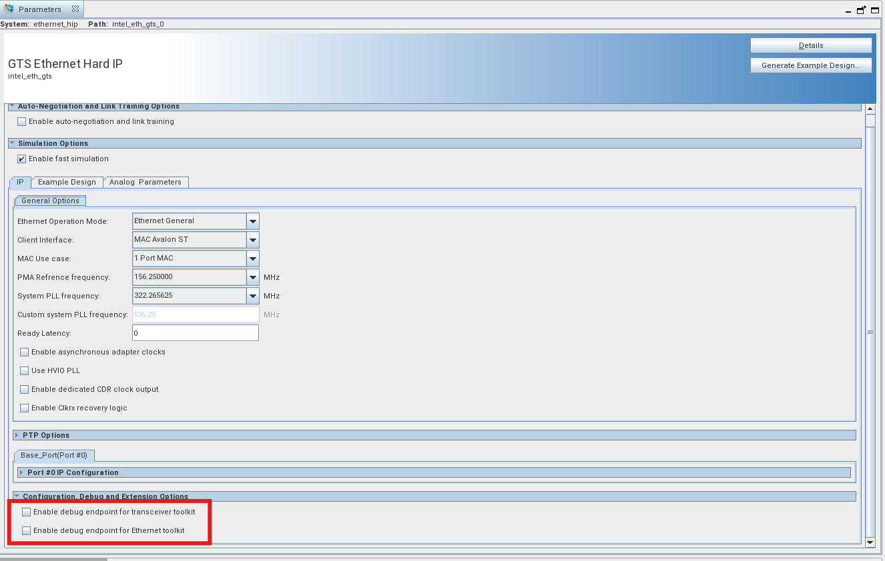

**Figure 13.** Set 'Enable debug endpoint for transceiver toolkit' & 'Enable debug endpoint for transceiver toolkit'for the GTS Ethernet Hard IP.


## Simulation

The Agilex&trade; 5 2-Port 25GbE Precision Time Protocol System Example Design includes a suite of standalone UVM simulation tests for hardware verification. These tests validate the Quartus&reg; project within a Universal Verification Methodology (UVM) environment, ensuring functional correctness.

The UVM suite provides a structured framework for simulating various operating conditions and use cases, enabling thorough validation of system behavior.

### Simulation Environment Setup

The following third-party tools and associated verification IPs, along with valid licenses, are required to execute the UVM simulation test cases for the design:

| _Design Tool_                           | _Version_       |
|-----------------------------------------|-----------------|
| Synopsys VCS* Tool                      | V-2023.03-SP2-1 |
| Altera&reg; Quartus&reg; Prime Pro Tool | 26.1            |
| Synopsys DesignWare VIP                 | W-2025.03C      |
| Python                                  | 3.7.7           |
| Perl                                    | 5.8.8           |
| CMAKE                                   | 3.11.4          |
| GCC                                     | 7.2.0           |

The system testbench instantiates two AXI Synopsys Verification IP (VIP) modules, requiring a separate license in addition to the Synopsys VCS simulation tool license.

### Simulation Directory

Simulation source files and scripts are located at: `$TOP_FOLDER/src/hw/verification/`

### UVM Test Use Cases

The design includes six UVM test cases to validate the following functionality:

- Configuration and status register access
- DMA Subsystem <-> Ethernet Subsystem data path
- Packet Generator <-> Ethernet Subsystem data path
- DMA and Packet generator data path test

The test cases are:

**1. CSR access test**

The test exercises full configuration and status register access for Ethernet Subsystem. After initial system configuration and Ethernet link bring-up, all registers are read and compared against expected default values. The test then performs read operations at target offsets to validate register accessibility.

Test Case Sequence: `sm_ptp_hssi_csr_seq`

**2. Data path test - DMA base test**

This test showcases the scenario where traffic is generated from all the channels of dma port port 0. This sequence enables prefetcher for all channels of DMA port 0. For each channel, the payload length for each eth packet is 90B. 

Also, the packet switch is configured to route the packets to intended dma port. The key used is a unique combination of SA and DA of eth packet for each of the port channels 

Test Case Sequence: `sm_ptp_h2d0_90B_seq`

**3. Data path test - DMA traffic test**

This test showcases the scenario where traffic is generated from all the channels of dma port port 0.  This sequence enables prefetcher for all channels of DMA port 0. For each channel, the payload length for each eth packet is 90B. 

 Also, the packet switch is configured to route the packets to intended dma port. The key used is a unique combination of SA and DA of eth packet for each of the port channels 

Test Case Sequence: `sm_ptp_all_dma_ports_64B_traffic_seq`

**4. Packet generator data path test**

This sequence showcases transactions from user client 0 and 1. Both user clients are configured to generate random number of ethernet packets. 

Also, the packet switch are configured to route the packets to intended user port. The key used is a unique combination of SA and DA of eth packet for each of the ports 

Test Case Sequence: `sm_ptp_user1_user0_seq`

**5. DMA and Packet generator data path test**

This test Showcases the scenario where traffic is generated from all the dma ports and user client  ports simultaneously. This sequence enables prefetcher for all channels of both ports 1 and 2 of DMA. For each channel, the payload length for each eth packet is random. user client 0 and 1 are enabled to generate random number of packets 

Also, the packet switch are configured to route the packets to intended dma and user port. The key used is a unique combination of SA and DA of eth packet for each of the ports 

Test Case Sequence: `sm_ptp_all_ports_traffic_seq`

### Configuring UVM Environment

Export the simulation folder path to the environment with the following command:

``` bash
export ROOTDIR=$TOP_FOLDER/src/hw
```

Update `setup.sh` with values from your local environment to configure simulation variables. The script is located at: `$TOP_FOLDER/src/hw/verification/setup.sh`

The following parameter variables are required for simulation:

``` bash
export ROOTDIR=$TOP_FOLDER/src/hw
export WORKDIR=$ROOTDIR
export QUARTUS_HOME=$QUARTUS_ROOTDIR
export QUARTUS_INSTALL_DIR=$QUARTUS_ROOTDIR
export DESIGNWARE_HOME=<synopsys vip location>
export VERDIR=$WORKDIR/verification
export DESIGN=src
export DESIGN_DIR=$ROOTDIR/$DESIGN/
export VCS_HOME=<Synopsys VCS simulation installation dir>
export UVM_HOME=$VCS_HOME/etc/uvm-1.2
```

`QUARTUS_ROOTDIR` and `TOP_FOLDER` must be defined as described in [Environment Setup](#environment-setup).

### Test Flow

This section outlines the step-by-step procedures for simulating each of the test cases listed above.

#### Prerequisites

Navigate to the verification scripts directory:

```bash
cd $ROOTDIR/verification/scripts
```

Invoke Altera® Quartus®, Synopsys VCS* and Synopsys Verdi tool licenses.

#### Simulation Steps

1. Initial Compilation (One-time Setup)

    Execute this command when compiling the DUT for the first time or after any IP changes:

    ```bash
    make -f Makefile.mk cmplib
    ```

    Note: This is a one-time operation required only during initial setup or when IP modifications occur.

2. Build DUT and Testbench

    Compile and elaborate the Design Under Test (DUT) and testbench:

    ```bash
    make -f Makefile.mk build
    ```

3. Execute Test Sequence

    Run a specific test sequence using the following command:

    ```bash
    make -f Makefile.mk run SEQNAME=<sequence_identifier>
    ```

   EX:

      ```bash
      make -f Makefile.mk run SEQNAME=sm_ptp_h2d0_90B_seq
      ```

4. Combined Build and Run (Alternative)

    Steps 2 and 3 can be combined into a single command for efficiency:

   ```bash
   make -f Makefile.mk build run SEQNAME=sm_ptp_h2d0_90B_seq
   ```

#### Waveform Generation

To enable waveform dumping, add the DUMP=1 option to the build and run commands.\

**Method 1:** Separate Build and Run Commands

```bash
make -f Makefile.mk build DUMP=1
make -f Makefile.mk run SEQNAME=sm_ptp_h2d0_90B_seq DUMP=1
```

**Method 2:** Combined Command

```bash
make -f Makefile.mk build run SEQNAME=sm_ptp_h2d0_90B_seq DUMP=1
```

#### Command Reference Summary:

| Operation             | Command                                                         |
|-----------------------|-----------------------------------------------------------------|
  Initial compilation   | `make -f Makefile.mk cmplib`                                    |
| Build DUT/Testbench   | `make -f Makefile.mk build`                                     |
| Run Test sequence     | `make -f Makefile.mk run SEQNAME=<sequence_identifier>`         |
| Combined build/run    | `make -f Makefile.mk build run SEQNAME=<sequence_identifier>`   |

Enable waveform dump Add DUMP=1 to any build/run command.

Replace `<sequence_identifier>` with the appropriate Test Case Sequence identifier for your specific test case.


#### Results

Simulation of each of the test cases listed above can be carried out from below steps.

1. `cd $ROOTDIR/verification/scripts`

2. Below is a one time run that needs to be given when compiling
   the DUT for the first time or if there is any change in the IP

   `make -f Makefile.mk cmplib`

3. Run below make commands to compile and elaborate the DUT and TESTBENCH

   `make -f Makefile.mk build`

4. Run below command to run a sequence

   `make -f Makefile.mk run SEQNAME=<sequence name>`

    Eg:
       `make -f Makefile.mk run SEQNAME=sm_ptp_h2d0_90B_seq`

5. Steps 3 and 4 can be combined and run in a single step

   `make -f Makefile.mk build run SEQNAME=sm_ptp_h2d0_90B_seq`

6. Dumping a waveform
  Please add option DUMP=1 to steps 3 and 4 or step 5 to enable waveform dumping

   Eg 1:

   `make -f Makefile.mk build DUMP=1`

   `make -f Makefile.mk run SEQNAME=sm_ptp_h2d0_90B_seq DUMP=1`
  
   Eg 2:

   `make -f Makefile.mk build run SEQNAME=sm_ptp_h2d0_90B_seq DUMP=1`

#### Output Directory Structure

- The simulation framework stores test results in `$ROOTDIR/verification/sim`.

- When the library compilation step (step 2) executes again, the system automatically renames the existing `sim` directory to `sim.#` where `#` represents an incremental number.

- A fresh sim directory is then created for new results

- The system saves logs and waveform files in `$ROOTDIR/verification/sim/<sequence_identifier>` directory

- When running the same sequence multiple times, the system preserves previous results by renaming the existing sequence directory to `$ROOTDIR/verification/sim/<sequence_identifier>.#`.

- A new `$ROOTDIR/verification/sim/<sequence_identifier>` directory is created for the current run.

- This versioning system ensures that historical simulation data remains accessible while providing a clean workspace for new test executions.

## Reference


- [GTS Ethernet Hard IP User Guide Agilex&trade; 5 FPGAs and SoCs](https://docs.altera.com/r/docs/817676/current)
- [Ethernet Design Example Components User Guide](https://docs.altera.com/r/docs/683044/current)
- [Embedded Peripherals IP User Guide](https://docs.altera.com/r/docs/683130/current)
- [GTS Transceiver PHY User Guide Agilex&trade; 5 FPGAs and SoCs](https://docs.altera.com/r/docs/817660/26.1/gts-transceiver-phy-user-guide-agilextm-5-fpgas-and-socs/gts-transceiver-overview)
- [Agilex™ 5 FPGA E-Series 065A Premium Development Kit User Guide](https://docs.altera.com/r/docs/d554638/current/agilex-5-fpga-e-series-065a-premium-development-kit-user-guide/overview)

## Notices & Disclaimers

Altera<sup>&reg;</sup> Corporation technologies may require enabled hardware, software or service activation.
No product or component can be absolutely secure. 
Performance varies by use, configuration and other factors.
Your costs and results may vary. 
You may not use or facilitate the use of this document in connection with any infringement or other legal analysis concerning Altera or Intel products described herein. You agree to grant Altera Corporation a non-exclusive, royalty-free license to any patent claim thereafter drafted which includes subject matter disclosed herein.
No license (express or implied, by estoppel or otherwise) to any intellectual property rights is granted by this document, with the sole exception that you may publish an unmodified copy. You may create software implementations based on this document and in compliance with the foregoing that are intended to execute on the Altera or Intel product(s) referenced in this document. No rights are granted to create modifications or derivatives of this document.
The products described may contain design defects or errors known as errata which may cause the product to deviate from published specifications.  Current characterized errata are available on request.
Altera disclaims all express and implied warranties, including without limitation, the implied warranties of merchantability, fitness for a particular purpose, and non-infringement, as well as any warranty arising from course of performance, course of dealing, or usage in trade.
You are responsible for safety of the overall system, including compliance with applicable safety-related requirements or standards. 
<sup>&copy;</sup> Altera Corporation.  Altera, the Altera logo, and other Altera marks are trademarks of Altera Corporation.  Other names and brands may be claimed as the property of others. 

OpenCL* and the OpenCL* logo are trademarks of Apple Inc. used by permission of the Khronos Group™. 