## Introduction

This tutorial demonstrates how to extend the [HPS Baseline System Example Design](https://altera-fpga.github.io/rel-26.1/embedded-designs/agilex-5/e-series/premium-065b/gsrd/ug-gsrd-agx5e-premium-065b/#hardware-design-overview) hardware project by adding an IP core to the fabric subsystem and enabling it through the software stack. You will integrate a [Lightweight UART Core](https://docs.altera.com/r/docs/683130/26.1/embedded-peripherals-ip-user-guide/lightweight-uart-core) to simulate a custom IP that lacks a native Linux kernel driver. Rather than developing a complex kernel-space driver from scratch, this tutorial highlights the standard hardware-to-software enablement path utilizing the generic User Space I/O (UIO) platform driver.

The hardware architecture interfaces the new UART IP with the Hard Processor System (HPS) via the Lightweight AXI Bridge. To facilitate a self-contained validation process without requiring external wiring, the design incorporates a System ID Peripheral IP — acting as a verifiable hardware fingerprint — and utilizes an internal loopback (TX to RX) within the SystemVerilog top-level wrapper.

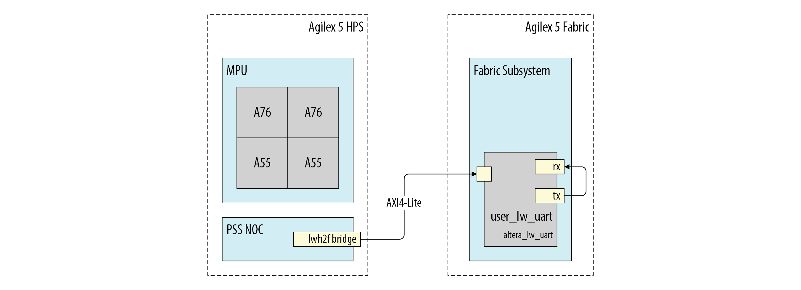

Software enablement is organized into a progressive, three-tier integration/verification stack. This ensures the hardware is fundamentally sound before OS complexity is introduced:

| Validation Level         | Boot Environment    | Verification Tool          | Purpose                                                               |
|:-------------------------|:--------------------|:---------------------------|:----------------------------------------------------------------------|
| **Level 1: Low-Level**   | U-Boot (Standalone) | `mw.l` / `md.l` commands   | Verify raw register address space and IP connectivity.                |
| **Level 2: OS-Level**    | Yocto Linux         | `devmem2`                  | Confirm Device Tree mappings and base kernel accessibility.           |
| **Level 3: Application** | Linux User Space    | UIO Driver & C Application | Handle interrupts (IRQ) and mapped memory in a custom user-space app. |

The following figure shows the Yocto Project structure from the HPS Baseline System Example Design, highlighting the "hooks" or layers where custom recipes and kernel configuration changes (such as .scc configuration files) are performed to bind the new hardware to the UIO driver.

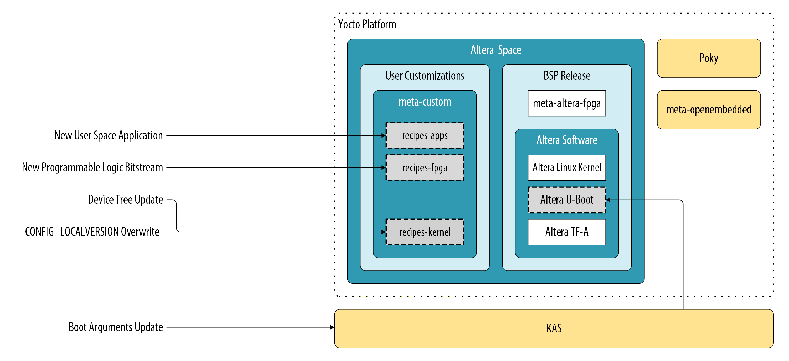

This tutorial utilizes the [HPS Expansion Board (HPS-EB)](https://docs.altera.com/r/docs/814550/current/agilextm-5-fpga-e-series-065b-premium-development-kit-user-guide/hps-expansion-board-hps-eb?tocId=RnMgo4C4EyXZyqa%7ErswC8A) mounted on an Agilex™ 5 FPGA E-Series 065B Premium Development Kit. It employs an HPS-First, split-boot topology. In this configuration, the HPS is responsible for configuring the FPGA fabric logic. The First Stage Bootloader (FSBL) executes directly from onboard QSPI memory to initialize the system, while the Second Stage Bootloader (SSBL), Linux kernel, device tree, and root filesystem are subsequently loaded from a micro SD card.

### Tutorial Organization

The tutorial follows a progressive building-block approach, where each section validates a deeper layer of the system.

#### Level 1: Hardware Integration and Low-Level Validation

- **Baseline System Configuration**: Build the initial HPS Baseline System Example Design to validate the toolchain and establish a software baseline.
- **Hardware IP Integration**: Add the Lightweight UART IP in Platform Designer, map its memory space, and route its signals through the SystemVerilog top-level wrapper.
- **U-Boot Enablement**: Use the ["Roll Your Own"](https://altera-fpga.github.io/rel-26.1/embedded-designs/agilex-5/e-series/premium-065b/gsrd/ug-gsrd-agx5e-premium-065b/#build-and-exercise-roll-your-own-binaries) (RYO) flow to build a standalone bootloader and verify hardware connectivity before loading an OS.

#### Level 2: Linux Integration and Driver Binding

- **Linux IP Integration and Testing**: Update the Yocto device tree, the Kernel UIO modules, and Kernel boot arguments to bind the custom hardware to the [`uio_pdrv_genirq`](https://www.kernel.org/doc/html/v5.0/driver-api/uio-howto.html) driver.
- **Hardware Verification**: Use the updated Linux image to confirm that the HPS can access the FPGA fabric registers with [`devmem2`](https://github.com/radii/devmem2).

#### Level 3: Application Development and Deployment

- **Application Development**: Configure the Arm GNU Toolchain and develop a C application to perform an integration test on the new hardware module.
- **Deployment and Debugging**: Integrate the application into the Yocto project as a recipe and use the RiscFree IDE for remote hardware debugging.

### Prerequisites

Ensure you have the following hardware and software:

**Agilex 5 Development Kit**

- [**Agilex™ 5 FPGA and SoC E-Series Premium Development Kit (Production)**](https://www.altera.com/products/devkit/po-3284/agilex-5-fpga-e-series-065b-premium-development-kit) (Ordering code: DK-A5E065BB32AEA).
- **Required Accessories**: HPS-EB, Mini USB, Micro USB, Ethernet cables, Micro SD card, and USB card writer.

**Host PC Requirements**

- **OS**: Linux (Ubuntu 22.04 LTS recommended).
- **Hardware**: Minimum 64 GB RAM and 200 GB free disk space.
- **Software**: Altera® Quartus® Prime Pro Edition Version 26.1.
- **Serial Terminal**: GtkTerm, Minicom, TeraTerm, or PuTTY.

**Network & Connectivity**

- **Local Ethernet**: Connection to a network with an active DHCP server.
- **Internet Access**: Required for downloading Yocto dependencies.

#### Hardware Components & Layout

To facilitate the identification of physical interfaces and jumpers mentioned throughout this tutorial, refer to the development kit layout below.

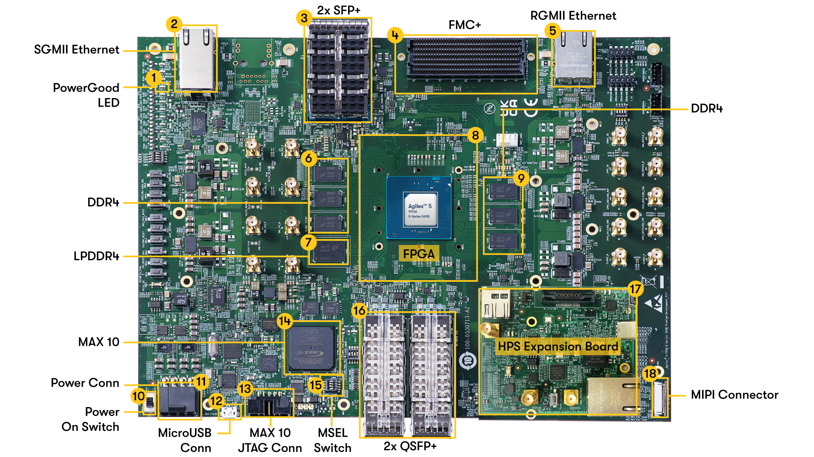

For users new to this hardware, it is critical to follow official handling and power-up procedures to avoid equipment damage. Please consult the following Altera documentation before proceeding:

- **[Development Kit Setup](https://docs.altera.com/r/docs/814550/current/agilextm-5-fpga-e-series-065b-premium-development-kit-user-guide/development-kit-setup)**: Provides the essential steps for cabling, power-up, and initial configuration.
- **[Getting Started](https://docs.altera.com/r/docs/814550/current/agilextm-5-fpga-e-series-065b-premium-development-kit-user-guide/getting-started)**: Offers critical instructions on **handling the board** safely and includes links to **install required software** dependencies and tools.

#### Host Software and Dependency Configuration

Install the required software dependencies for the Kas and Yocto build system. For Ubuntu 22.04 LTS, execute the following commands:

``` bash
sudo apt-get update
sudo apt-get upgrade
sudo apt-get install openssh-server mc libgmp3-dev libmpc-dev gawk wget git diffstat unzip texinfo gcc \
build-essential chrpath socat cpio python3 python3-pip python3-pexpect xz-utils debianutils iputils-ping \
python3-git python3-jinja2 libegl1-mesa libsdl1.2-dev pylint xterm python3-subunit mesa-common-dev zstd \
liblz4-tool git fakeroot build-essential ncurses-dev xz-utils libssl-dev bc flex libelf-dev bison xinetd \
tftpd tftp nfs-kernel-server libncurses5 libc6-i386 libstdc++6:i386 libgcc++1:i386 lib32z1 \
device-tree-compiler curl mtd-utils u-boot-tools net-tools swig python3-newt python3.10-venv mtools p7zip-full -y
sudo locale-gen en_US.UTF-8
```

Configure Bash as the default system shell:

``` bash
sudo ln -sf /bin/bash /bin/sh
```

Add the Quartus® Prime Pro Edition Version 26.1 binaries to your system path:

``` bash
source ~/altera_pro/26.1/qinit.sh
```

> To make this change permanent, add these lines to `~/.bashrc` or `~/.profile`.

---

## Level 1: Baseline System Configuration

### Hardware Design Checkout and Build

#### Source Code Initialization and Environment Setup

Clone the hardware design project from the [altera-fpga](https://github.com/altera-fpga/) repository. Execute the following commands to check out the project configured for booting Linux on **Core 0 (A55)** within the HPS:

``` bash
git clone --filter=blob:none --sparse https://github.com/altera-fpga/agilex5e-ed-gsrd.git
cd agilex5e-ed-gsrd
git checkout QPDS26.1_REL_GSRD_PR
git sparse-checkout set a5ed065b-premium-devkit-oobe/baseline-a55
cd  a5ed065b-premium-devkit-oobe/baseline-a55
CWD=`pwd`
```

#### FPGA Project Compilation

Compile the Quartus project to generate the FPGA configuration bitstream:

``` bash
make baseline_a55-build
```
As a result, `$CDW/output_files/baseline_a55.sof` bitstream is created.


#### First Stage Bootloader (FSBL) Generation

A FPGA fabric bitstream is needed for a Yocto Linux build. This process requires an intermediate **dummy [FSBL](https://docs.altera.com/r/docs/813762/25.3/hard-processor-system-booting-user-guide-agilextm-3-and-agilextm-5-socs/first-stage-bootloader?tocId=wHsT9dAUiMQRMfKF6TnSOQ)** artifact, which you will update with the production bootloader later.

Compile the `hps_debug` source to create this placeholder FSBL:

``` bash
pushd software/hps_debug && ./build.sh && popd
```

As a result `$CWD/software/hps_debug/hps_wipe.ihex`is created, which serves as a mandatory input for the `quartus_pfg` tool when generating the peripheral and core configuration files for the Agilex 5 SoC.

For more information on `hps_debug` contents refer to `$CWD/software/hps_debug/README.md`

#### FPGA Programming File Integration

Merge the FSBL with the FPGA bitstream. Use the Quartus Programming File Generator to integrate `hps_wipe.ihex` into your `baseline_a55.sof`:

``` bash
quartus_pfg -c output_files/baseline_a55.sof output_files/baseline_a55_hps_debug.sof -o hps_path=software/hps_debug/hps_wipe.ihex
```

Process the resulting  `$CWD/output_files/baseline_a55_hps_debug.sof` into a Raw Binary File (`.rbf`) required by the HPS:

``` bash
quartus_pfg -c output_files/baseline_a55_hps_debug.sof output_files/baseline_a55_hps_debug.rbf -o hps=1
```

The build produces `$CWD/output_files/baseline_a55_hps_debug.core.rbf`, which contains the FPGA fabric logic configuration data. This file is a required input for the Yocto build process to ensure the Linux image bundles the correct hardware configuration.

### Yocto Project Build

#### Custom Layer and Recipe Configuration

Build a Linux image for the previously compiled hardware project. This process uses default Yocto settings, modified only to include the custom FPGA core fabric bitstream and a unique Linux Kernel version suffix.

Customize the Yocto project using the `meta-custom` layer, which provides recipes for modifying Linux image components.

#### Linux Kernel Identification and Modification

Copy the `baseline_a55_hps_debug.core.rbf` to the FPGA bitstream recipe folder:

``` bash
cp output_files/baseline_a55_hps_debug.core.rbf software/yocto_linux/meta-custom/recipes-fpga/fpga-bitstream/files/baseline_a55_hps_debug.core.rbf
```

> The Yocto build requires the filename `baseline_a55_hps_debug.core.rbf`. To use a different name, update the KAS configuration as described in the `software/yocto_linux/README.md`.

Identify your custom build by appending a unique string to the Linux kernel version. Use the `linux-socfpga-lts_%.bbappend` recipe in the `meta-custom` layer to modify the kernel configuration. Apply the `forcevariable` override to set `LINUX_VERSION_EXTENSION` to `-altera-F06D06`:

``` bash
cat <<EOF >> software/yocto_linux/meta-custom/recipes-kernel/linux/linux-socfpga-lts_%.bbappend 

# Use the forcevariable override to ensure this value sticks
LINUX_VERSION_EXTENSION:forcevariable = "-altera-F06D06" 
EOF
```

#### Build Environment Setup and KAS Tooling

[Isolate the KAS build tool dependencies](https://docs.python.org/3/library/venv.html) from your global system packages by performing this one-time setup:

``` bash
cd $CWD/software/yocto_linux
python3 -m venv venv --system-site-packages
source venv/bin/activate
pip install --upgrade pip
pip install kas
pip install --upgrade kas
pip install kconfiglib
```

To reactivate the Python virtual environment in a future session, run the following command from the environment's root folder:

``` bash
source ./venv/bin/activate
```

To exit and active python virtual environment, execute:

``` bash
deactivate
```

#### Image Assembly and Artifact Deployment

Use the KAS Command Line Interface (CLI) with the default [`kas.yml` configuration](https://kas.readthedocs.io/en/latest/userguide/project-configuration.html) to build the `gsrd-console-image`:

``` bash
kas build kas.yml gsrd-console-image
```

Upon completion, the build produces the following deployment artifacts:

- `./build/tmp/deploy/images/agilex5e/gsrd-console-image-agilex5e.rootfs.wic`
- `./build/tmp/deploy/images/agilex5e/u-boot-spl-dtb.hex`

Exit the Python virtual environment by executing the following command:

``` bash
deactivate
```

### Base Linux Boot

#### SD Card Image Deployment

Connect the USB card writer and micro SD card to your host PC. Locate the assigned system name using `dmesg`:

``` bash
dmesg | tail -n 20
```

> Identify the correct device name (e.g., `sdb`, `sdc`). Writing to the wrong device will result in data loss on your host system.

Flash the Linux image to the micro SD card using the [`dd`](https://man7.org/linux/man-pages/man1/dd.1.html) utility. Replace `sdX` with your specific identifier:

``` bash
# Use dd to write the image to the corresponding device
sudo dd if=./build/tmp/deploy/images/agilex5e/gsrd-console-image-agilex5e.rootfs.wic of=/dev/sdx bs=1M
# Flush the changes to the SD card
sync
```

#### Serial Console and Hardware Connectivity

Remove the micro SD card from the host PC and insert it into the SD card slot on the Agilex™ 5 development kit.

Power down the development kit and connect the mini-USB cable from the HPS Enablement Expansion Board to the host PC. Apply the following connection parameters to your serial terminal emulator:

- **Baud rate**: 115,200
- **Data bits**: 8
- **Stop bits**: 1
- **Parity**: None
- **Flow control**: None

#### Production FSBL and QSPI Programming

Update the FPGA HPS and peripheral bitstream using the production FSBL (`u-boot-spl-dtb.hex`) generated by the Yocto build. This command replaces the dummy FSBL with the functional bootloader and generates a JTAG Indirect Configuration (`.jic`) file:

``` bash
cd $CWD
quartus_pfg -c output_files/baseline_a55.sof output_files/baseline_a55.jic -o device=MT25QU128 -o flash_loader=A5ED065BB32AE4S -o hps_path=software/yocto_linux/build/tmp/deploy/images/agilex5e/u-boot-spl-dtb.hex -o mode=ASX4 -o hps=1
```

> Ensure the board is connected via the USB-Blaster II cable and recognized by `jtagconfig` before running the programmer command.

Flash the `.jic` bitstream to the QSPI memory:

1. Power off the development kit.
2. Set the MSEL dipswitch (SW27) to JTAG mode: **OFF / OFF / OFF / OFF**.
3. Power up the board.
4. Program the QSPI memory:

``` bash
jtagconfig --setparam 1 JtagClock 16M
quartus_pgm -c 1 -m jtag -o "pvi;output_files/baseline_a55.hps.jic"
```

#### System Power-Up and Software Validation

Complete the boot sequence:

1. Power off the development kit.
2. Set the MSEL dipswitch (SW27) to ASx4 mode: **OFF / ON / ON / OFF**.
3. Power up the board.
4. Log in to Linux using `root` as the username; no password is required.

Verify your custom build by checking the kernel version string:

``` bash
uname -r
```

The expected output should contain the kernel version with the **-altera-F06D06-** suffix. This confirms that the system is running the specific kernel image generated by your Yocto build.

### Hardware IP Integration

#### Adding the Lightweight UART Core to the System

Open the hardware project using the Quartus graphical interface.

``` bash
cd $CWD
quartus top.qpf &
```

To modify the hardware, open the `u_fabric_subsys` Platform Designer system by double-clicking its instance within the **Project Navigator** panel in Quartus Prime.

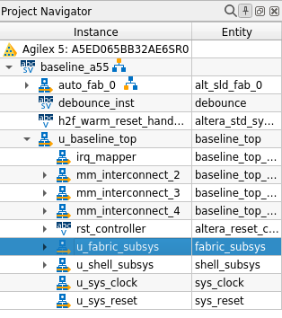

#### Component Integration in Platform Designer

Add the new IP into the system by following these steps:

1. **Add the Lightweight UART Core**: In the **IP Catalog**, navigate to **Interface Protocols > Serial > Lightweight UART (RS-232 Serial Port)** and double-click it.

  - **HDL Entity Name**: `u_user_lw_uart`.
  - **Parameters**: Retain all default values.
  - Select **Finish**.
  
2. **Connect Clock and Reset Signals**: Synchronize the new components with the rest of the system.

  - **Reset**: Connect `u_user_lw_uart|reset` to `u_system_reset|out_reset`.
  - **Clock**: Connect `u_user_lw_uart|clk` to `u_system_clock|out_clk`.

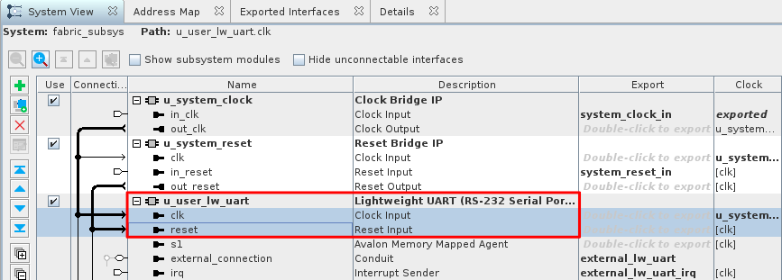

#### Address Mapping and I/O Export

Finalize the IP integration by mapping memory interfaces and exporting signals for the top-level FPGA design:

1. **Map Avalon-MM Interfaces**: Connect the slave port (**s1**) of the UART IP to the master port (**m0**) of the peripheral bridge.

  - Connect `u_user_lw_uart|s1` to `u_peripherals_mm_bridge|m0`.

2. **Export External Signals**: Export I/O and interrupt signals for top-level system connections:

  - **UART Data**: Export `u_user_lw_uart|external_connection` to `external_lw_uart`.
  - **UART Interrupt**: Export `u_user_lw_uart|irq` to `external_lw_uart_irq`.

3. **Assign Base Addresses**: Manually set the base address to `0x0001_00a0`. As the Lightweight UART IP is connected to the HPS thought the Lightweight HPS2FPGA Bridge, the system memory address to the IP is the [Lightweight HPS2FPGA Bridge base address](https://docs.altera.com/r/docs/814346/26.1/hard-processor-system-technical-reference-manual-agilextm-5-socs/total-address-map-tabular) (`0x2000_0000`) plus the Lightweight UART IP offset (`0x0001_00a0`). The resulting address `0x2001_00a0` will be use in the Linux device tree file to indicate where the OS can access the new hardware IP.

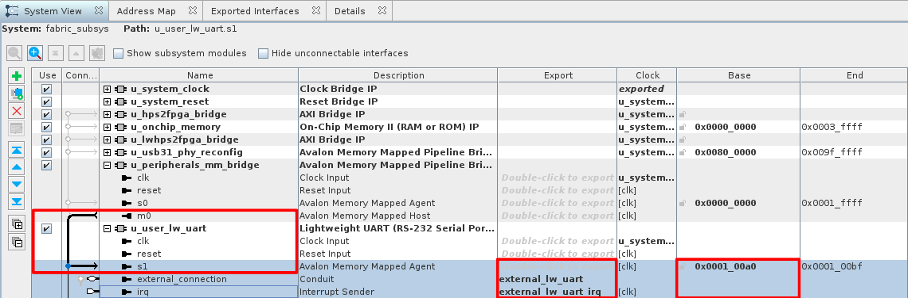

#### Fabric Subsystem Identification Update

Update the hardware identification **System ID Peripheral IP** within `fabric_subsys.qsys` to verify the hardware matches the expected design version.

1. Select the **u_system_id** instance and change the **32-bit System ID** to `0x0a17e12a`.
2. Click on `Sync System Infos` and **Save** `fabric_subsys.qsys`.
3. Click on **Generate HDL...**.
4. Close Platform Designer.

#### Top-Level System Interrupt Configuration

Configure the top-level system to export the UART signals and route interrupts to the HPS.

1. Open `baseline_top.qsys`.
2. Export the I/O signals for top-level connectivity:

  - **UART Data**: Export `u_fabric_subsys|external_lw_uart` as `user_lw_uart`.

3. Locate the **`f2h_irq0_in`** (FPGA-to-HPS Interrupt) receiver port on the **`u_shell_subsys`** instance.
4. Connect the **`external_lw_uart_irq`** port (exported from `u_fabric_subsys`) to the **`f2h_irq0_in`** port.
5. **Save** `baseline_top.qsys` and select **Generate HDL...**.

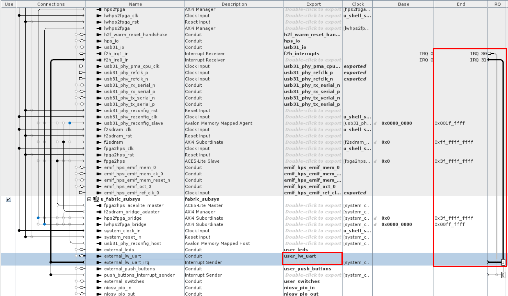

#### Top-Level Wrapper Modification

Update the top-level System Verilog wrapper, `baseline_a55.sv`, to loopback the TX and RX signals within the core fabric.

1. **Define Internal Wires**: At **line 106**, insert the wire definitions and a local loopback assignment:

  ``` verilog
      // lw_uart ip signals
      wire fpga_lw_uart_rxd;
      wire fpga_lw_uart_txd;

      // lightweight uart core loopback
      assign fpga_lw_uart_rxd = fpga_lw_uart_txd;
  ```

2. **Integrate Port Mappings**: At **line 193**, insert the following into the `u_baseline_top` instance:

  ``` verilog
      .user_lw_uart_rxd                     (fpga_lw_uart_rxd),
      .user_lw_uart_txd                     (fpga_lw_uart_txd),
  ```

3. **Generate Bitstream**: Save the file, close Quartus Prime and run a full compilation:

  ``` bash
  make clean
  make baseline_a55-build
  ```

> The `make clean` command removes all generated artifacts from the GHRD and GSRD project folders, including the compiled binaries and the Python virtual environment.

---

## Level 1: U-Boot Enablement

### Build and Boot U-Boot

#### RYO Toolchain and Environment Setup

Set up a minimal software environment to validate the basic functionality of the IP integrated into the hardware project. The "[Roll Your Own](https://altera-fpga.github.io/rel-26.1/embedded-designs/agilex-5/e-series/premium-065b/gsrd/ug-gsrd-agx5e-premium-065b/#build-and-exercise-roll-your-own-binaries)" (RYO) flow facilitates the build of U-Boot and Arm Trusted Firmware for rapid bring-up.

Navigate to the RYO folder:

``` bash
cd $CWD/software/ryo_linux
```

Download a ARM64 toolchain and configure your environment to use it as the preferred ARM cross-compiler:

``` bash
curl -L --progress-bar -o arm-gnu-toolchain-14.3.rel1-x86_64-aarch64-none-linux-gnu.tar.xz  https://developer.arm.com/-/media/Files/downloads/gnu/14.3.rel1/binrel/arm-gnu-toolchain-14.3.rel1-x86_64-aarch64-none-linux-gnu.tar.xz
tar xf arm-gnu-toolchain-14.3.rel1-x86_64-aarch64-none-linux-gnu.tar.xz
rm -f arm-gnu-toolchain-14.3.rel1-x86_64-aarch64-none-linux-gnu.tar.xz
export PATH=`pwd`/arm-gnu-toolchain-14.3.rel1-x86_64-aarch64-none-linux-gnu/bin/:$PATH
export ARCH=arm64
export CROSS_COMPILE=aarch64-none-linux-gnu-
```

#### Arm Trusted Firmware Compilation

Clone the Altera Arm Trusted Firmware repository and compile the binary for the Agilex 5 platform:

``` bash
git clone -b QPDS26.1_REL_GSRD_PR https://github.com/altera-fpga/arm-trusted-firmware arm-trusted-firmware
cd arm-trusted-firmware
make clean
make -j "$(nproc)" PLAT=agilex5 bl31
cd ..
```

#### U-Boot Configuration and Compilation

Clone the Altera U-Boot repository and enable debug messages within the compiler output to assist with potential troubleshooting:

``` bash
git clone -b QPDS26.1_REL_GSRD_PR https://github.com/altera-fpga/u-boot-socfpga u-boot-socfpga
cd u-boot-socfpga
sed -i 's/PLATFORM_CPPFLAGS += -D__ARM__/PLATFORM_CPPFLAGS += -D__ARM__ -gdwarf-4/g' arch/arm/config.mk
```

Create a soft link to the Arm Trusted Firmware binary previously compiled.

``` bash
ln -sf "../arm-trusted-firmware/build/agilex5/release/bl31.bin"
```

Modify the Agilex 5 device tree to set the SD card as the default boot device for the Secondary Program Loader (SPL) and disable NAND memory:

``` bash
# Configure for SD card boot
sed -i 's/u-boot,spl-boot-order.*/u-boot,spl-boot-order = \&mmc;/g' arch/arm/dts/socfpga_agilex5_socdk-u-boot.dtsi
# Disable NAND in device tree
sed -i '/&nand {/!b;n;c\\tstatus = "disabled";' arch/arm/dts/socfpga_agilex5_socdk-u-boot.dtsi
```

Create a configuration fragment to overwrite the Agilex 5 default values. Define a custom message with `CONFIG_BOOTCOMMAND` to validate the environment changes at the U-Boot prompt.

``` bash
# Create SD card specific U-Boot configuration
cat > config-fragment << 'EOF'
# Use Image instead of kernel.itb
CONFIG_BOOTFILE="Image"
# Disable NAND/UBI related settings
CONFIG_NAND_BOOT=n
CONFIG_SPL_NAND_SUPPORT=n
CONFIG_CMD_NAND_TRIMFFS=n
CONFIG_CMD_NAND_LOCK_UNLOCK=n
CONFIG_NAND_DENALI_DT=n
CONFIG_SYS_NAND_U_BOOT_LOCATIONS=n
CONFIG_SPL_NAND_FRAMEWORK=n
CONFIG_CMD_NAND=n
CONFIG_MTD_RAW_NAND=n
CONFIG_CMD_UBI=n
CONFIG_CMD_UBIFS=n
CONFIG_MTD_UBI=n
CONFIG_ENV_IS_IN_UBI=n
CONFIG_UBI_SILENCE_MSG=n
CONFIG_UBIFS_SILENCE_MSG=n
CONFIG_DISTRO_DEFAULTS=n
CONFIG_HUSH_PARSER=y
CONFIG_SYS_PROMPT_HUSH_PS2="> "
CONFIG_USE_BOOTCOMMAND=y
# User configurable prompt message
CONFIG_BOOTCOMMAND="echo Agilex 5 U-Boot prompt ready"
CONFIG_BOOTDELAY=1
CONFIG_CMD_FAT=y
CONFIG_CMD_FS_GENERIC=y
CONFIG_DOS_PARTITION=y
CONFIG_SPL_DOS_PARTITION=y
CONFIG_CMD_PART=y
CONFIG_SPL_CRC32=y
CONFIG_LZO=y
CONFIG_CMD_DHCP=y
# Enable more QSPI flash manufacturers
CONFIG_SPI_FLASH_MACRONIX=y
CONFIG_SPI_FLASH_GIGADEVICE=y
CONFIG_SPI_FLASH_WINBOND=y
CONFIG_SPI_FLASH_ISSI=y
EOF
```

Apply a configuration fragment to customize the U-Boot environment and build the bootloader artifacts:

``` bash
make clean && make mrproper
make socfpga_agilex5_defconfig 
./scripts/kconfig/merge_config.sh -O . -m .config config-fragment
make -j "$(nproc)"
cd ..
```

#### Boot Artifact Deployment and SD Card Creation

Generate the JTAG Indirect Configuration (`.jic`) file for the QSPI memory and the Raw Binary File (`.rbf`) for the FPGA core logic:

``` bash
cd $CWD
quartus_pfg -c output_files/baseline_a55.sof  output_files/baseline_a55_u-boot.jic -o device=MT25QU128 -o flash_loader=A5ED065BB32AE4S -o hps_path=software/ryo_linux/u-boot-socfpga/spl/u-boot-spl-dtb.hex -o mode=ASX4 -o hps=1
```

Create an SD card image containing the SSBL and the FPGA core logic bitstream:

``` bash
cd software/ryo_linux
dd if=/dev/zero of=sdcard.img bs=1M count=64
mformat -i sdcard.img :: -F
mcopy -i sdcard.img ./u-boot-socfpga/u-boot.itb ::
mcopy -i sdcard.img ../../output_files/baseline_a55_u-boot.core.rbf ::
```

### Lightweight UART IP Sanity Check

#### Automated Script Preparation

Create a U-Boot script named `hw_sanity_check.scr.txt` on your host machine to automate IP verification. Transcribe the script content from the [U-Boot Sanity Check Script](#u-boot-sanity-check-script) section. Compile the script into a U-Boot binary format and copy it to the SD card image:

``` bash
# Compile the text script into a U-Boot image
mkimage -A arm64 -O linux -T script -C none -a 0 -e 0 -n "Hardware Sanity Check Script" -d hw_sanity_check.scr.txt hw_sanity_check.scr

# Copy the binary to the SD card image
mcopy -i sdcard.img ./hw_sanity_check.scr ::
```

#### SD Card Image Deployment

Connect the USB card writer and micro SD card to your host PC. 

Flash the U-Boot image to the micro SD card using the `dd` utility. Replace `sdX` with your specific identifier:

``` bash
# Use dd to write the image to the corresponding device
sudo dd if=./sdcard.img of=/dev/sdx bs=1M 
# Flush the changes to the SD card
sync
```

Run the following command to list the contents of the SD card image:

``` bash
7z l sdcard.img
```

This utility displays the partition structure and file details without needing to mount the image to your file system.

#### QSPI Programming And System Power-Up

Flash the `.jic` bitstream to the QSPI memory:

1. Power off the development kit.
2. Set the MSEL dipswitch (SW27) to JTAG mode: **OFF / OFF / OFF / OFF**.
3. Power up the board.
4. Program the QSPI memory:

``` bash
cd $CWD
jtagconfig --setparam 1 JtagClock 16M
quartus_pgm -c 1 -m jtag -o "pvi;output_files/baseline_a55_u-boot.jic"
```

Complete the boot sequence:

1. Power off the development kit.
2. Set the MSEL dipswitch (SW27) to ASx4 mode: **OFF / ON / ON / OFF**.
3. Power up the board.
4. Wait for the U-Boot prompt and "Agilex 5 U-Boot prompt ready" message to appear.

#### Script Execution and IP Verification

Execute the verification script to perform register-level checks and loopback testing on the UART IP. On the U-Boot console execute:

``` bash
# load hw_sanity_check.scr from the SD card to memory (address 0x90000000)
fatload mmc 0:1 0x90000000 hw_sanity_check.scr 
# Execute hw_sanity_check.scr
source 0x90000000
```

The script executes the following steps:

1. Get `baseline_a55_u-boot.core.rbf` bitstream file from the SD card into memory and configure the FPGA fabric. Enable the HPS to FPGA bridges.
2. Read and compare the FPGA System ID IP fingerprint with hardware assigned value (`0x0a17e12a`).
3. Read the Lightweight UART IP status register and verify that it is in a clean state.
4. Write 4 characters into the UART TX FIFO.
5. Read the UART IP RX FIFO level register and verify that the 4 characters from the previous steps are registered. All the characters are now in the RX FIFO after traveling through the IP fabric loopback.
6. Read the 4 characters out of the RX FIFO and verify the characters data integrity.
7. Look for errors in the IP status register and exit the test.

Verify the output confirms a successful System ID match (`0x0a17312a`) and a clean data round-trip through the FIFO.

``` bash
## Executing script at 90000000
--- PHASE 1: FPGA Configuration ---
2195456 bytes read in 123 ms (17 MiB/s)
...FPGA reconfiguration OK!
INFO: FPGA and Bridges Initialized
SUCCESS: Core fabric System ID match (0x0a17312a)
SUCCESS: UART Status Register clean (0x60)
--- Starting 4-Word Write Sequence ---
  Writing: 0x1
  Writing: 0x2
  Writing: 0x3
  Writing: 0x4
SUCCESS: RX FIFO Level reached 4 words
--- Starting 4-Word Read Verification ---
  PASS: Read 0x1
  PASS: Read 0x2
  PASS: Read 0x3
  PASS: Read 0x4
SUCCESS: UART Status returned to clean (0x60)
--- Script Execution Complete ---
```

---

## Level 2: Linux Integration and Testing

### Updating the Device Tree and Boot Arguments

#### Device Tree Fragment Modification

Navigate to the `software/yocto_linux` directory to begin the software integration phase.

```bash
cd $CWD/software/yocto_linux
```

Add the binding for the new `u_user_lw_uart` core to the `meta-custom/recipes-kernel/linux/device-tree/baseline_a55.dts` file. Insert the following node immediately after the existing `led_pio` entry to define the new hardware to the Linux kernel:

``` yaml

    // LW UART
    lw_uart: lw_uart@200100a0 {
        compatible = "generic-uio";
        reg = <0x200100a0 0x20>;
        reg-names = "lw_uart_csr";
        interrupt-parent = <&intc>;
        interrupts = <0 18 4>;
        status = "okay";
    };

```

This configuration uses the `generic-uio` compatible string to delegate interrupt and memory mapping control to [UIO generic driver](https://www.kernel.org/doc/html/v4.14/driver-api/uio-howto.html). The `reg` property targets base address `0x200100a0` with a `0x20` byte span, and the `interrupts` property uses number `18`, corresponding to the `f2h_irq0[1]` connection in Platform Designer.

#### Boot Argument Configuration via KAS

Configure the Linux boot arguments to bind the `uio_pdrv_genirq` driver to your custom hardware IP. Setting the `of_id` variable to `generic-uio` matches the `compatible` string defined in your device tree.

1. Initialize the Python environment and launch the KAS interface:

  ``` bash
  python3 -m venv venv --system-site-packages
  source venv/bin/activate
  pip install --upgrade pip
  pip install kas
  pip install --upgrade kas
  pip install kconfiglib
  kas menu
  ```

2. Navigate to **FPGA Options** and select **Linux kernel bootargs**.
3. Replace the existing string with the following command line:

  ``` bash
  earlycon panic=-1 root=/dev/mmcblk0p2 rw rootwait uio_pdrv_genirq.of_id=generic-uio
  ```

  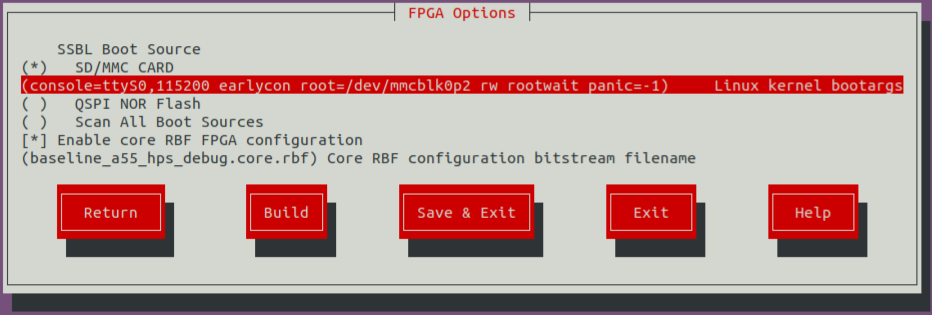

4. Select **Ok**, then choose **Save & Exit**. 

> As an alternative to the KAS GUI, you can edit all KAS parameters in `$CWD/software/yocto_linux/.config.yaml`. For example, the 'Linux kernel bootargs' entry can be found in the configuration file under `KERNEL_BOOTARGS_SD_MMC`.

Verify the update in `$CWD/software/yocto_linux/.config.yaml`, `KERNEL_BOOTARGS_SD_MMC` variable must matches your input.

#### User Space I/O (UIO) Built-in Kernel Module

>The User Space I/O (UIO) interface Kernel support depends on [CONFIG_UIO](https://www.kernelconfig.io/CONFIG_UIO) and [CONFIG_UIO_PDRV_GENIRQ](https://www.kernelconfig.io/CONFIG_UIO_PDRV_GENIRQ) parameters. These configurations are pre-enabled as a loading module in the GSRD 2.0 kernel. `CONFIG_UIO` and `CONFIG_UIO_PDRV_GENIRQ` need to be compile as built-in modules in the Kernel to be able to bind the driver after boot without user intervention.

Configure the Yocto Linux Kernel (`linux-socfpga-lts`) to include UIO support as a built-in module through a Kernel configuration Fragment.

1. Launch the Kernel configuration tool. After executing the commands below, you will transition to a bitbake environment and the active directory change to `$CWD/software/yocto_linux/build`.

  ``` bash
  cd $CWD/software/yocto_linux
  kas shell kas.yml
  bitbake -c menuconfig linux-socfpga-lts
  ```

> `$CWD` and other environmental variable are no longer available in the bitbake environment.

2. Navigate to `Device Drivers --->` and hit enter.

  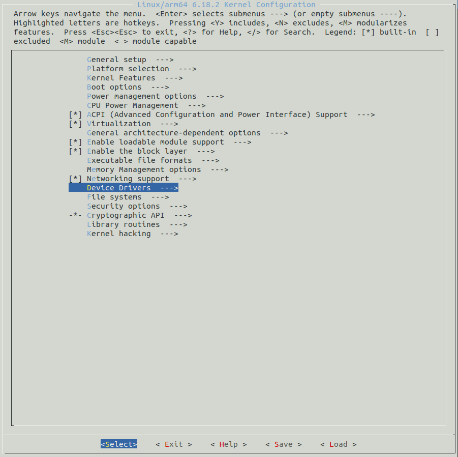

3. Navigate to `Userspace I/O drivers --->` and hit the space bar. `Userspace I/O drivers` are now tagged '<*>' to be compiled as a built-in module.

  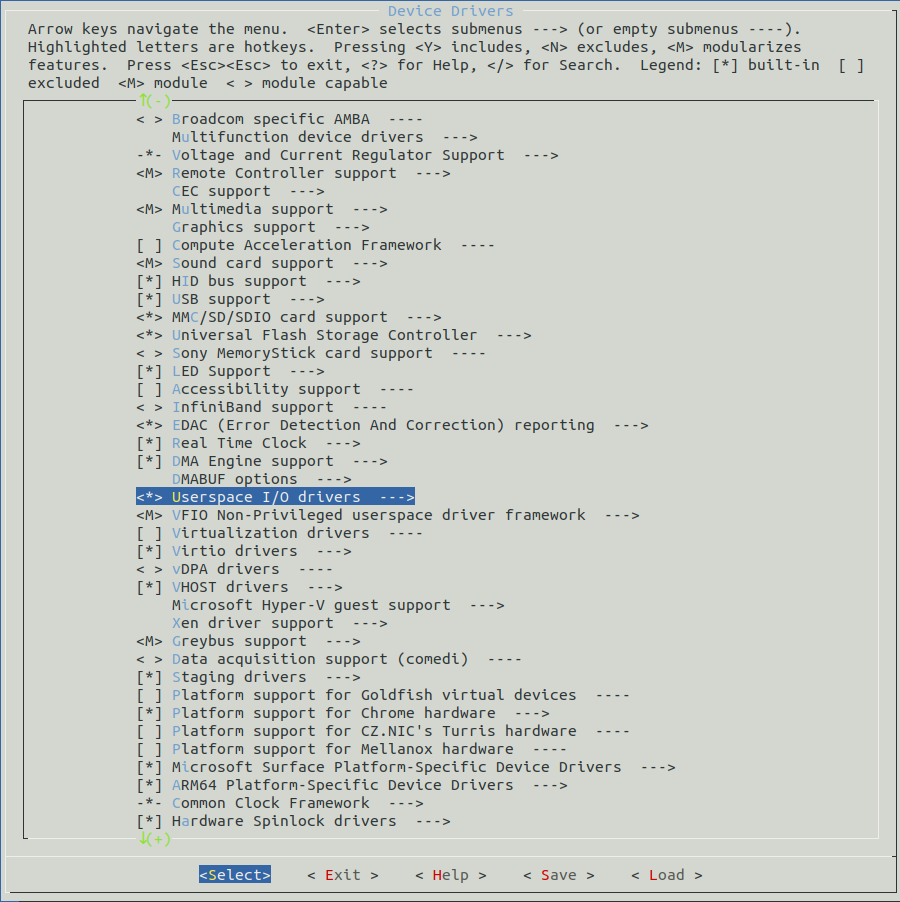

4. Navigate to `Userspace I/O drivers --->` and hit enter. Go to `userspace I/O platform driver with generic IRQ handling` and hit the space bar. `userspace I/O platform driver with generic IRQ handling` is now tagged '<*>' to be compiled as a built-in module.

  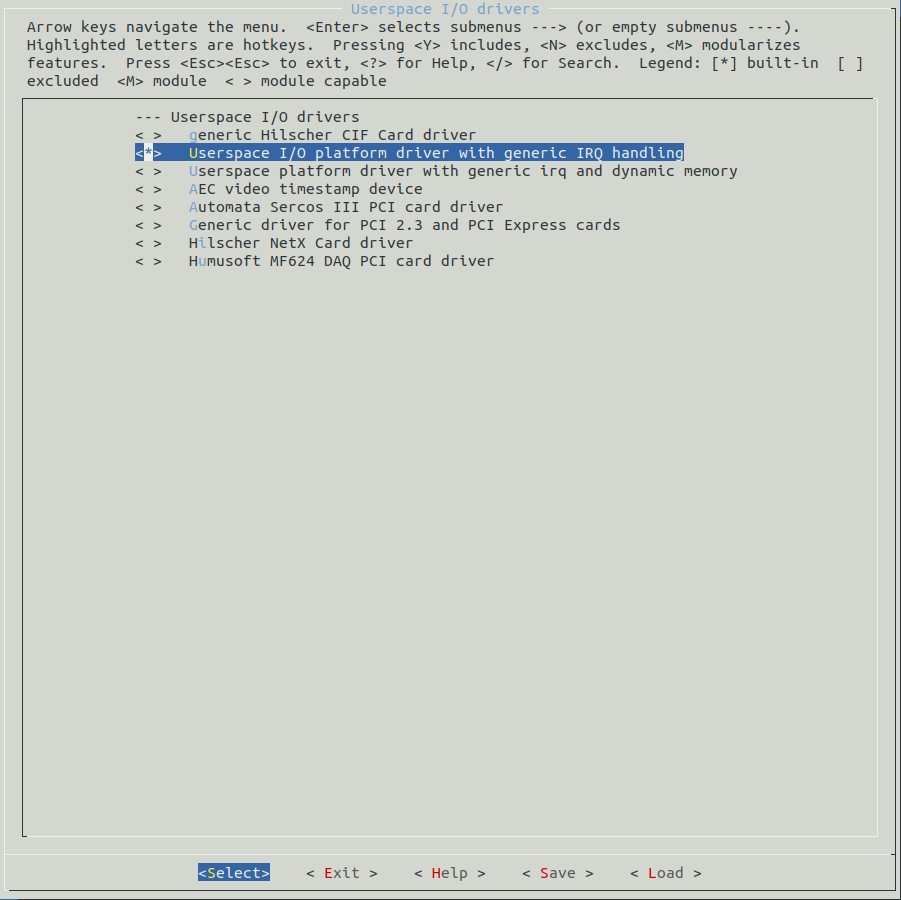

5. Navigating to `Save` and hit enter. When prompted, keep the `.config` file name, navigate to `Ok` and hit enter.
6. Navigate to `Exit` and hit enter. Repeat this step until you exit from the Kernel configuration tool.
7. Generate a Kernel configuration fragment. This file contain the Kernel parameter changes compared to the Kernel base configuration. After executing the command below, the Kernel fragment is stored in `./tmp/work-shared/agilex5e/kernel-source/.kernel-meta/configs/fragment.cfg`

  ``` bash
  bitbake -c diffconfig linux-socfpga-lts
  ```

8. Copy the configuration fragment to `../meta-custom/recipes-kernel/linux/linux-socfpga-lts/configs/`

  ``` bash
  cp ./tmp/work-shared/agilex5e/kernel-source/kernel-meta/configs/fragment.cfg ../meta-custom/recipes-kernel/linux/linux-socfpga-lts/configs/
  ```

9. Create `fragment.scc` file in `../meta-custom/recipes-kernel/linux/linux-socfpga-lts/configs/`. Add the next line as `fragment.scc` content.

  ``` bash
  kconf non-hardware fragment.cfg
  ```

10. Add `fragment.scc` to `../meta-custom/recipes-kernel/linux/linux-socfpga-lts/linux-socfpga-lts_%.bbappend` recipe. Add `file://fragment.scc \` to `SRC_URI` list as shown below.

  ``` bash
  SRC_URI:append = " file://agilex5.scc \
        file://edac.scc \
        file://initrd.scc \
        file://jffs2.scc \
        file://sensors.scc \
        file://ubifs.scc \
        file://usbedac.scc \
        file://fragment.scc \
  "
  ```

11.  Execute the `exit` command in the terminal to exit the bitbake shell and return to the virtual python environment.

#### Yocto Image Assembly

Copy the `baseline_a55_u-boot.core.rbf` to the FPGA bitstream recipe folder:

``` bash
cp $CWD/output_files/baseline_a55_u-boot.core.rbf $CWD/software/yocto_linux/meta-custom/recipes-fpga/fpga-bitstream/files/baseline_a55_hps_debug.core.rbf
```

Launch the KAS graphical interface to begin the final image assembly:

``` bash
kas menu
```

Highlight the **Build** button and press **Enter** to trigger the Yocto build. This process integrates your custom FPGA bitstream, updated device tree, Kernel configuration, and kernel boot arguments into a single deployment package.

After the build process completes, exit the Python virtual environment by executing the next command:

``` bash
deactivate
```

### Hardware Verification

#### Hardware Reprogramming

You must re-flash the QSPI and SD card because these recent edits modified the Linux kernel environment. Re-write the updated `.wic` image to your SD card and re-generate the `.jic` file from your new `baseline_a55.sof`.

Connect the USB card writer and micro SD card to your host PC. Locate the assigned system name using `dmesg`:

Flash the Linux image to the micro SD card using the `dd` utility. Replace `sdX` with your specific identifier:

``` bash
# Use dd to write the image to the corresponding device
sudo dd if=./build/tmp/deploy/images/agilex5e/gsrd-console-image-agilex5e.rootfs.wic of=/dev/sdx bs=1M
# Flush the changes to the SD card
sync
```

Update the FPGA HPS and peripheral bitstream using the production FSBL (`u-boot-spl-dtb.hex`) generated by the Yocto build. This command replaces the dummy FSBL with the functional bootloader and generates a JTAG Indirect Configuration (`.jic`) file:

``` bash
cd $CWD
quartus_pfg -c output_files/baseline_a55.sof output_files/baseline_a55.jic -o device=MT25QU128 -o flash_loader=A5ED065BB32AE4S -o hps_path=software/yocto_linux/build/tmp/deploy/images/agilex5e/u-boot-spl-dtb.hex -o mode=ASX4 -o hps=1
```

Flash the `.jic` bitstream to the QSPI memory:

1. Power off the development kit.
2. Set the MSEL dipswitch (SW27) to JTAG mode: **OFF / OFF / OFF / OFF**.
3. Power up the board.
4. Program the QSPI memory:

  ``` bash
  jtagconfig --setparam 1 JtagClock 16M
  quartus_pgm -c 1 -m jtag -o "pvi;output_files/baseline_a55.hps.jic"
  ```

Complete the boot sequence:

1. Power off the development kit.
2. Set the MSEL dipswitch (SW27) to ASx4 mode: **OFF / ON / ON / OFF**.
3. Power up the board.
4. Log in to Linux using `root` as the username; no password is required.

#### Driver and IP Verification

Once the system boots, confirm the hardware bitstream by reading the System ID fingerprint in the Linux console executing:

``` bash
devmem2 0x20010000 w
```

The expected output is **0x0A17e12A**, verifying the correct hardware version is active. Verify that the Linux kernel initialized the UIO interface for the UART core executing:

``` bash
cat /sys/class/uio/uio0/name
```

The command returns `lw_uart@200100a0`.

Verify the boot arguments by executing:

``` bash
cat /proc/cmdline
```

The expected output is:

``` bash
earlycon panic=-1 root=/dev/mmcblk0p2 rw rootwait uio_pdrv_genirq.of_id=generic-uio
```

#### Register-Level Loopback Testing

Verify the `user_lw_uart` hardware registers using `devmem2`. Write `0xE` to the `TXFIFO` register (offset `0xA4`) to trigger a transmission through the fabric loopback:

``` bash
devmem2 0x200100a4 w 0xe
```

Read the `RXFIFO_LVL` register at address `0x200100b8` to confirm character capture; the expected value is `0x1`:

``` bash
devmem2 0x200100b8 w
```

Retrieve the character from the `RXFIFO` register at `0x200100a0`; the expected value is `0xe`:

``` bash
devmem2 0x200100a0 w
```

The successful data round-trip confirms the Lightweight UART core IP is operational.

---

## Level 3: Application Development & Deployment

### Implementing the UART BIST Application

#### Host Environment and Toolchain Setup

Create a [UIO](https://www.kernel.org/doc/html/v4.14/driver-api/uio-howto.html#writing-a-driver-in-userspace) based application to verify lightweight UART IP access and operation. On the host machine, create `apps` as the working directory:

``` bash
cd  $CWD/software
mkdir apps
cd apps
```

Download the Arm **GNU Toolchain** and configure your terminal to use it as the preferred ARM cross-compiler. This toolchain is essential for building applications compatible with the Agilex 5 HPS architecture:

``` bash
wget https://developer.arm.com/-/media/Files/downloads/gnu/14.3.rel1/binrel/\
arm-gnu-toolchain-14.3.rel1-x86_64-aarch64-none-linux-gnu.tar.xz
tar xf arm-gnu-toolchain-14.3.rel1-x86_64-aarch64-none-linux-gnu.tar.xz
rm -f arm-gnu-toolchain-14.3.rel1-x86_64-aarch64-none-linux-gnu.tar.xz
export PATH=`pwd`/arm-gnu-toolchain-14.3.rel1-x86_64-aarch64-none-linux-gnu/bin/:$PATH
export ARCH=arm64
export CROSS_COMPILE=aarch64-none-linux-gnu-
```

#### Application Source Files

Create the following three files by transcribing the contents from the specified sources:

- **lw-uart-map.h**: Defines the IP address map and bit masks for register field access. Refer to [Register Map Header](#register-map-header).
- **uio-bist-uart.h**: Application header file containing function declarations and UIO data structures. Refer to [Application Header](#application-header).
- **uio-bist-uart.c**: Main application source file containing the hardware validation routine. Refer to [Main Application Logic](#main-application-logic)

Generate the application binary using the Arm cross-compiler:

``` bash
${CROSS_COMPILE}gcc -g -o uio-bist-uart uio-bist-uart.c
```

#### Binary Deployment and Execution

Identify the assigned IP address of the development kit by executing the `ip addr` command. Locate the `inet` address associated with the primary Ethernet interface (`eth0`). In the transcript below, the assigned IP address is '10.244.157.136'.

``` bash
root@agilex5e:~# ip addr
1: lo: <LOOPBACK,UP,LOWER_UP> mtu 65536 qdisc noqueue state UNKNOWN group default qlen 1000
    link/loopback 00:00:00:00:00:00 brd 00:00:00:00:00:00
    inet 127.0.0.1/8 scope host lo
       valid_lft forever preferred_lft forever
    inet6 ::1/128 scope host noprefixroute 
       valid_lft forever preferred_lft forever
2: eth0: <BROADCAST,MULTICAST,UP,LOWER_UP> mtu 1500 qdisc mq state UP group default qlen 1000
    link/ether ba:3e:b6:00:6e:17 brd ff:ff:ff:ff:ff:ff
    inet 10.244.157.136/24 metric 10 brd 10.244.157.255 scope global dynamic eth0
       valid_lft 1843sec preferred_lft 1843sec
    inet6 fe80::b83e:b6ff:fe00:6e17/64 scope link proto kernel_ll 
       valid_lft forever preferred_lft forever
3: sit0@NONE: <NOARP> mtu 1480 qdisc noop state DOWN group default qlen 1000
    link/sit 0.0.0.0 brd 0.0.0.0
```

From the Linux host, transfer the binary using `scp`, substituting the target IP address accordingly:

``` bash
scp uio-bist-uart root@10.244.157.136:/home/root
```

On the development kit, grant execution permissions and run the application:

``` bash
chmod ug+x uio-bist-uart
./uio-bist-uart
```

See the expected output below:

``` bash
root@agilex5e:/home/root# ./uio-bist-uart 
INFO: UIO device name verified: lw_uart@200100a0
INFO: UIO Map 0 details:
INFO:   Physical Addr: 0x20010000
INFO:   Offset:        0xa0
INFO:   Size:          0x1000
INFO: UIO initialization successful.
INFO: Clearing RX FIFO.
INFO: UIO device is ready.
INFO: Starting RX FIFO underflow trigger test.
INFO: RXFIFO_LVL_REG (0x18): 0x00000000
INFO: RXFIFO (0x00): 0x0000000F
INFO: RUE condition detected, clearing flag.
INFO: Starting RX FIFO level test.
INFO: RXFIFO_LVL (0x18): 0x00000004
INFO: RX_FIFO_LVL has the expected value. Flushing RX FIFO for the next test.
INFO: Clearing RX FIFO.
INFO: Starting RX FIFO data integrity test (0x0A17E12A).
INFO: Starting UIO Interrupt (IRQ) test.
INFO: Triggering IRQ via TX data write...
INFO: Interrupt caught! Total UIO events: 1
INFO: Received 0x0F, hardware IRQ line should now be LOW.
INFO: All tests passed successfully.
```

### Hardware Debugging with RiscFree IDE and GDB

#### Remote GDB Server Initialization

Enable a remote debugging session on the host computer to inspect `uio-bist-uart`. This section requires that you have completed the [Implementing the UART BIST Application](#implementing-the-uart-bist-application).

1. **Start a serial session** in the development kit.
2. **Navigate to the root directory** where the binary resides:

  ``` bash
  cd /home/root
  ```

3. **Start a `gdbserver` session** with the `uio-bist-uart` app attached to it by executing the following command:

  ``` bash
  gdbserver localhost:1000 uio-bist-uart
  ```

4. **Return to a Linux host terminal** to proceed with the IDE configuration steps.

#### IDE Project Import and Configuration

Return to the Linux host terminal and launch the RiscFree IDE:

``` bash
cd  $CWD/software/apps
RiscFree -data workspace -nosplash &
```

Import the `uio-bist-uart` binary and source code into the RiscFree workspace:

1. On the RiscFree IDE, go to the **File** menu and select **Import...**.
2. In the Import window, select **C/C++ > C/C++ Executable** and select **Next**.

  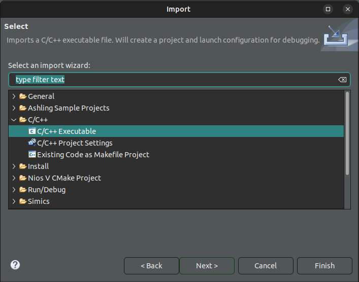

3. In the **Import Executable** window, navigate to **Select executable** and select the **Browse** button.
4. Select the `uio-bist-uart` binary from the file browser.
5. Back in the **Import Executable** window, select **Next**.

  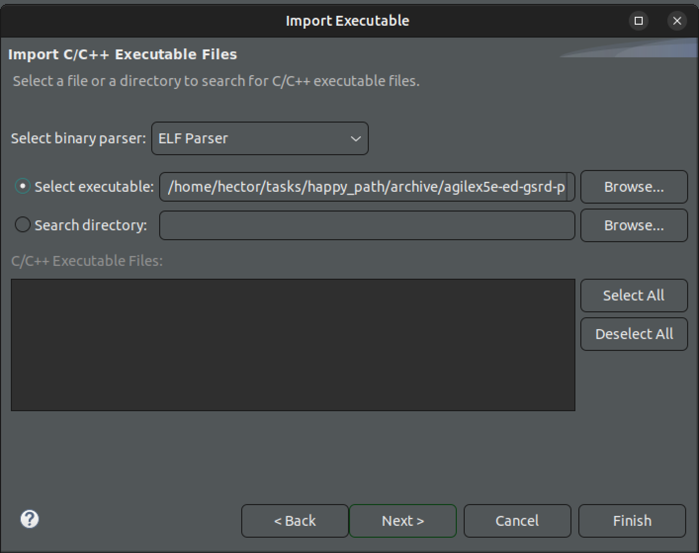

6. Select the **Create Launch Configuration** to be **C/C++ Remote Application**, then select **Finish**.

  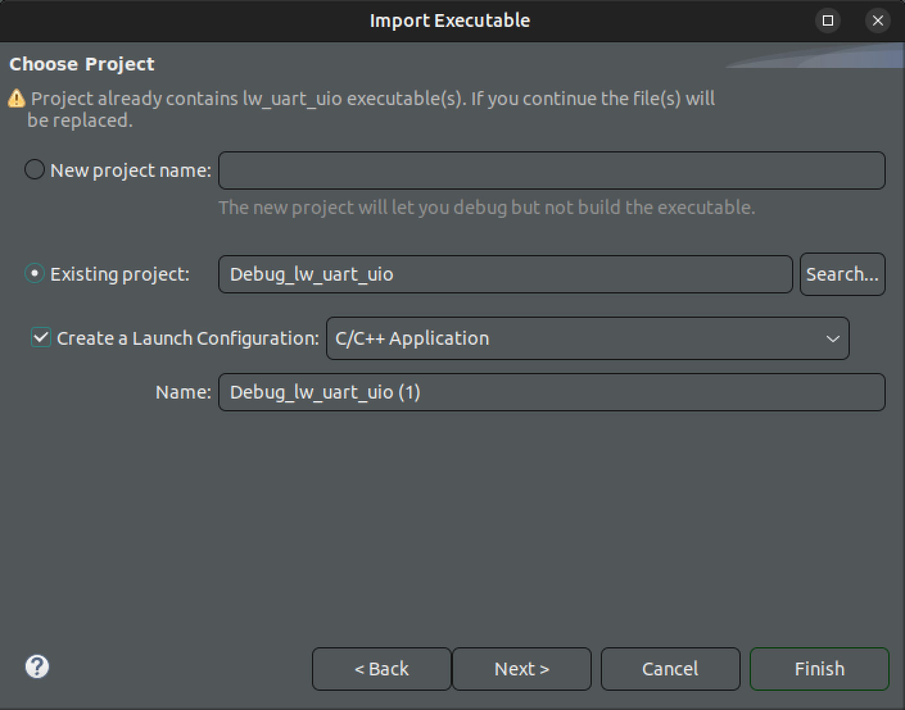

#### Debug Launcher and Target Connection

1. In the **Debug Configurations** window, **Main** tab, select **Select one...** on the **Multiple launchers available** at the bottom left.

  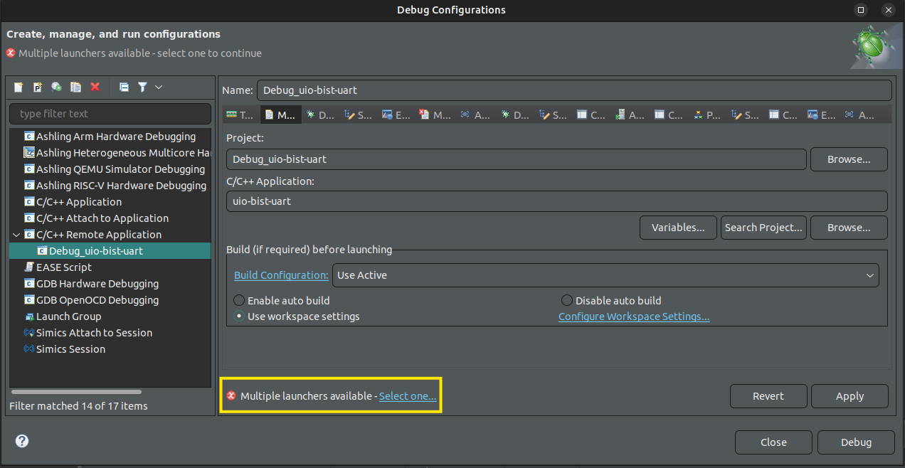

2. In the **Select Preferred Launcher** window, check **Use configuration specific settings**, select the **GDB (DSF) Manual Remote Debugging Launcher**, and select **OK**.

  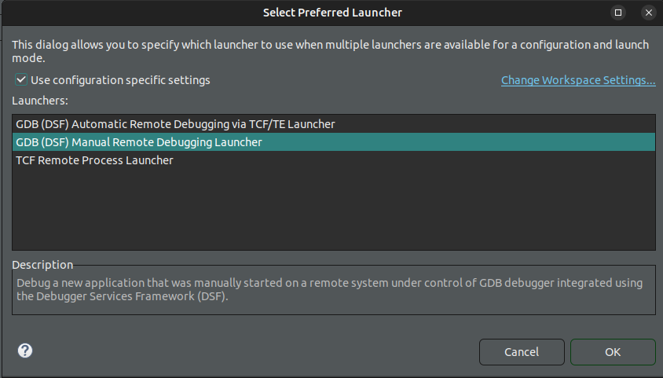

3. In the **Debugger** tab, check **Stop on startup at main**.

  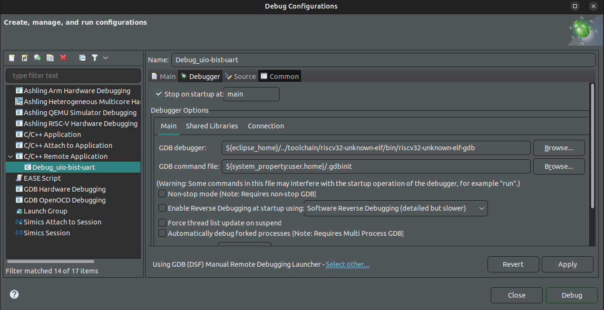

4. Under **Debugger > Main > GDB Debugger**, select **Browse**.
5. Select the **aarch64-none-linux-gdb** debugger shipped with RiscFree, typically installed in the `~/altera_fpga/26.1/riscfree/toolchain/Arm/aarch64-none-linux-gnu/bin/` folder, and select **Open**.

  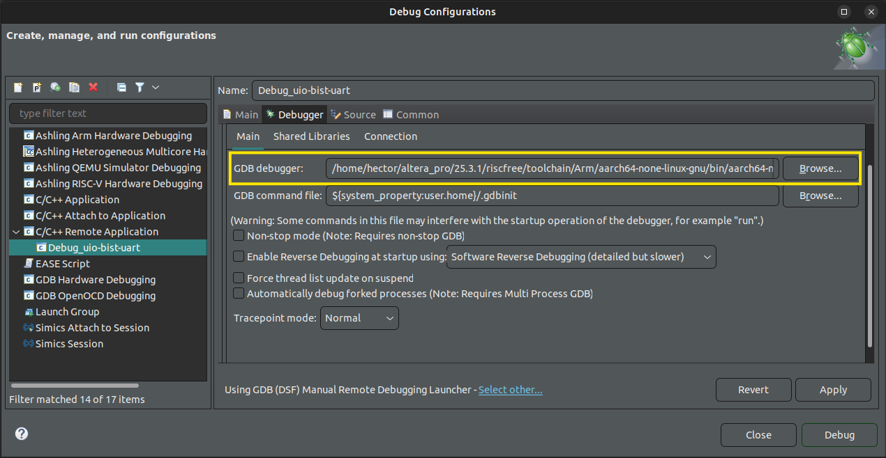

6. Go to the **Connection** tab and update the **Host Name or IP Address** to the IP address of your development kit.
7. Change the **Port number** to `1000`.

  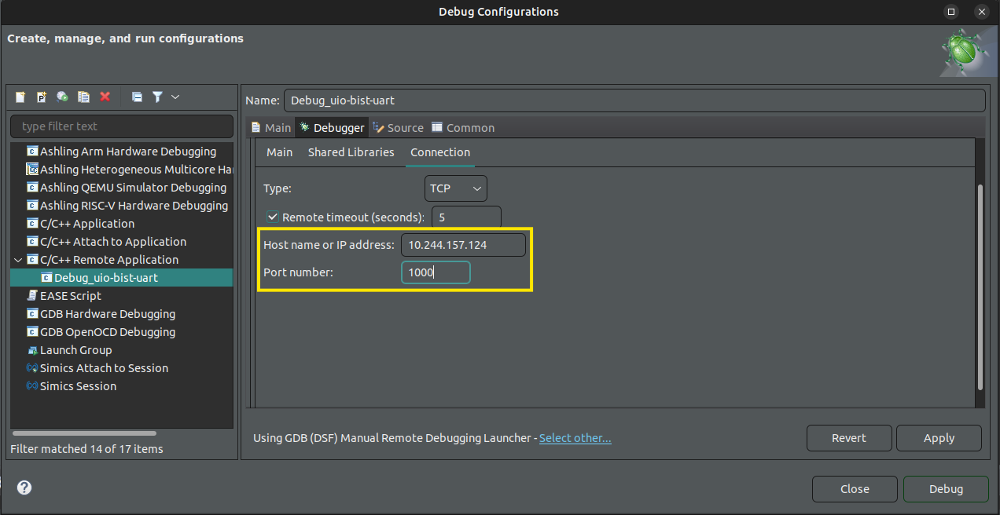

8. Select **Apply** at the bottom of the window, then select **Close**.
9. Select the dropdown next to the **debug** icon in the toolbar and choose **Organize Favorites...**.

  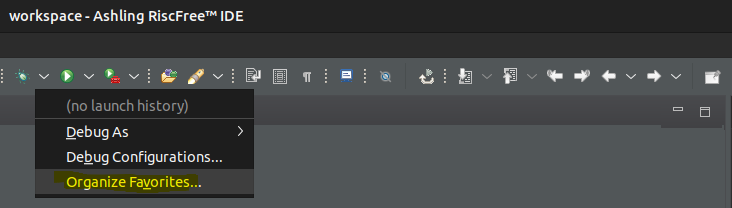

10. Select **Add**, choose **Debug_uio-bist-uart**, and select **OK** to close the dialog boxes.

  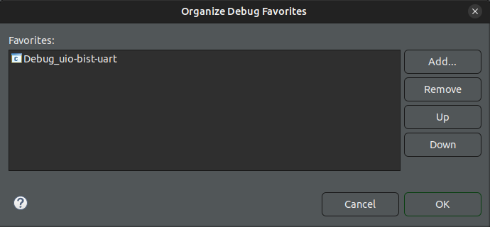

#### Establish Remote Debugging Connection

1. Select the dropdown menu next to the **debug** icon in the toolbar and choose **Debug_uio-bist-uart**.
2. Select **Switch** when prompted to switch perspectives.
3. The debugger will now load the application and stop at the `main()` function, allowing you to begin debugging.

  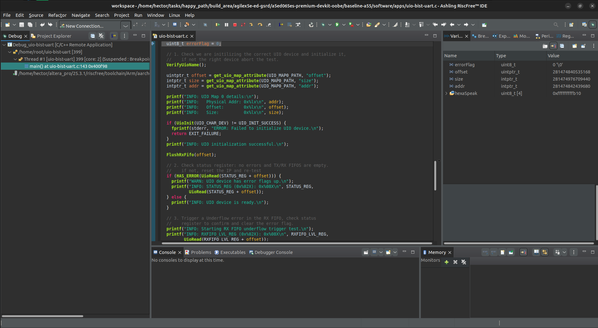

> Refer to [HPS Linux Application Debuging with Ashling RiscFree](https://altera-fpga.github.io/rel-26.1/embedded-designs/agilex-5/e-series/premium-065b/riscfree-linux-app-debug/ug-riscfree-linux-app-debug-agx5e-premium-065b/) document for additional information on debugging with RiscFree.

### Deploy Linux Application to Linux Image

#### Yocto Recipe Creation

The GSRD 2.0 Yocto project includes a hook to add custom applications. Follow these steps to integrate `uio-bist-uart` into the Yocto build process.

Create a new recipe by copying the `hello-world` example:

```  bash
cd $CWD/software/yocto_linux/meta-custom/recipes-apps/
cp -r hello/ uio-bist-uart
cd uio-bist-uart
```

Replace the example files with your `uio-bist-uart` source files in the `files` directory. 

``` bash
rm files/hello.c
cp $CWD/software/apps/lw-uart-map.h $CWD/software/apps/uio-bist-uart.h $CWD/software/apps/uio-bist-uart.c files/.
```

Rename the recipe file to `uio-bist-uart.bb` and update its content to instruct the build system on how to compile and install the binary:

```  bash
mv hello.bb uio-bist-uart.bb && cat << 'EOF' > uio-bist-uart.bb
DESCRIPTION = "UIO-Based sanity check for lightweight UART Altera IP"
LICENSE = "MIT"
LIC_FILES_CHKSUM = "file://${COMMON_LICENSE_DIR}/MIT;md5=0835ade698e0bcf8506ecda2f7b4f302"

SRC_URI = " \
    file://uio-bist-uart.c \
    file://uio-bist-uart.h \
    file://lw-uart-map.h \
"

S = "${WORKDIR}"

do_compile() {
    ${CC} ${LDFLAGS} ${S}/uio-bist-uart.c -o ${B}/uio-bist-uart
}

do_install() {
    install -d ${D}${bindir}
    install -m 0755 ${B}/uio-bist-uart ${D}${bindir}/uio-bist-uart
}
EOF
```

#### KAS GUI Integration and Final Build

Register the application in the 'kas' folder to enable it in the build system GUI. Create `kas/apps/uio-bist-uart.yaml` to include the application in the image installation list:

``` bash
cd $CWD/software/yocto_linux
cat << 'EOF' > kas/apps/uio-bist-uart.yaml
header:
  version: 17
local_conf_header:
  uio-bist-uart: |
    IMAGE_INSTALL:append = " uio-bist-uart"
EOF
```

Add a menu entry to `kas/apps/Kconfig`:

``` bash
sed -i.bak '/endmenu/i config UIO_BIST_UART_APP\n    bool "UIO Bist Lightweight Uart app"\n    default y\n\nconfig KAS_INCLUDE_UIO_BIST_UART_APP\n    string\n    default "kas/apps/uio-bist-uart.yaml" if UIO_BIST_UART_APP\n' kas/apps/Kconfig
```

Launch `kas menu`, navigate to **Example applications**, and ensure the application is enabled.

``` bash
cd $CWD/software/yocto_linux
python3 -m venv venv --system-site-packages
source venv/bin/activate
pip install --upgrade pip
pip install kas
pip install --upgrade kas
pip install kconfiglib
kas menu
```

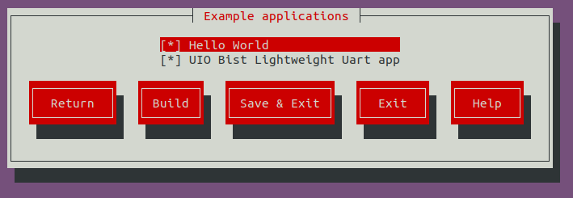

After enabling the **uio-bist-uart.bb** recipe in the configuration menu, launch the compilation to generate the final Yocto image. In the Kas GUI, navigate to the **Build** button and press **Enter** to start the build process. This integrates the `uio-bist-uart` binary as a user-executable installed in the `/usr/bin` directory of the Linux image.

#### Deployment Image Checkout

You must re-flash the QSPI and SD card as these edits modified the Yocto environment. Re-write the updated `.wic` image to your SD card and re-generate the `.jic` file from `baseline_a55.sof`.

Connect the USB card writer and micro SD card to your host PC. Locate the assigned system name using `dmesg`:

Flash the Linux image to the micro SD card using the `dd` utility. Replace `sdX` with your specific identifier:

``` bash
# Use dd to write the image to the corresponding device
sudo dd if=./build/tmp/deploy/images/agilex5e/gsrd-console-image-agilex5e.rootfs.wic of=/dev/sdx bs=1M
# Flush the changes to the SD card
sync
```

Update the FPGA HPS and peripheral bitstream using the production FSBL (`u-boot-spl-dtb.hex`) generated by the Yocto build. 

``` bash
cd $CWD
quartus_pfg -c output_files/baseline_a55.sof output_files/baseline_a55.jic -o device=MT25QU128 -o flash_loader=A5ED065BB32AE4S -o hps_path=software/yocto_linux/build/tmp/deploy/images/agilex5e/u-boot-spl-dtb.hex -o mode=ASX4 -o hps=1
```

Flash the `.jic` bitstream to the QSPI memory:

1. Power off the development kit.
2. Set the MSEL dipswitch (SW27) to JTAG mode: **OFF / OFF / OFF / OFF**.
3. Power up the board.
4. Program the QSPI memory:

  ``` bash
  jtagconfig --setparam 1 JtagClock 16M
  quartus_pgm -c 1 -m jtag -o "pvi;output_files/baseline_a55.hps.jic"
  ```

Complete the boot sequence:

1. Power off the development kit.
2. Set the MSEL dipswitch (SW27) to ASx4 mode: **OFF / ON / ON / OFF**.
3. Power up the board.
4. Log in to Linux using `root` as the username; no password is required.

Execute `uio-bist-uart` from the console. The executable is located in the `/usr/bin` directory.

## Appendix

### IP Address and Register Reference

#### Register Memory Map

Calculate Lightweight UART IP addresses using the formula: $Address = Base + Offset + (Reg \times 4)$.

| **Register Name** | **IP Register Offset** | **Platform Designer Register Offset** | **Description**              |
| ----------------- | ---------------------- | ------------------------------------- | ---------------------------- |
| `RXFIFO`          | 0x0                    | 0xA0                                  | Receive data FIFO            |
| `TXFIFO`          | 0x1                    | 0xA4                                  | Transmit data FIFO           |
| `status`          | 0x2                    | 0xA8                                  | Status register              |
| `control`         | 0x3                    | 0xAC                                  | Control register             |
| `divisor`         | 0x4                    | 0xB0                                  | Divisor register             |
| `endofpacket`     | 0x5                    | 0xB4                                  | End-of-packet register       |
| `RXFIFO_LVL`      | 0x6                    | 0xB8                                  | RXFIFO filled level register |
| `TXFIFO_LVL`      | 0x7                    | 0xBC                                  | TXFIFO filled level register |

---

### Source Code: Hardware Verification

#### U-Boot Sanity Check Script

This script automates the initialization of the FPGA and bridges, followed by a loopback data integrity test to verify the UART IP logic.

``` bash
# =========================================================
# AGILEX 5 HPS-TO-FPGA VERIFICATION SCRIPT
# Purpose: Initialize FPGA, Bridges, and Test UART IP Logic
# =========================================================

echo "--- PHASE 1: FPGA Configuration ---"
fatload mmc 0:1 ${loadaddr} baseline_a55_u-boot.core.rbf
fpga load 0 ${loadaddr} ${filesize}

bridge enable
sleep 1
echo "INFO: FPGA and Bridges Initialized"

# --- PHASE 2: System ID Verification ---
setexpr chip_id *0x20010000
if itest.l "0x${chip_id}" == 0x0a17e12a
then
    echo "SUCCESS: Core fabric System ID match (0x0a17e12a)"
else
    echo "ERROR: System ID mismatch! Read: 0x${chip_id}"
fi

# --- PHASE 3: UART Status Pre-Check ---
setexpr status_reg *0x200100a8
if itest.l "0x${status_reg}" == 0x00000060
then
    echo "SUCCESS: UART Status Register clean (0x60)"
else
    echo "ERROR: UART Status Register dirty! Read: 0x${status_reg}"
fi

# --- PHASE 4: UART Loopback Write Test ---
echo "--- Starting 4-Word Write Sequence ---"
setenv val 1
setenv write_loop 'mw.l 0x200100a4 ${val} 1; echo "  Writing: 0x${val}"; setexpr val ${val} + 1; if itest ${val} <= 4; then run write_loop; fi'
run write_loop

setenv val
setenv write_loop
sleep 1

# --- PHASE 5: RX FIFO Level Validation ---
setexpr rxfifo_lvl *0x200100b8
if itest.l "0x${rxfifo_lvl}" == 0x00000004
then
    echo "SUCCESS: RX FIFO Level reached 4 words"
else
    echo "ERROR: RX FIFO Level mismatch! Read: 0x${rxfifo_lvl}"
fi

# --- PHASE 6: UART Loopback Read Test ---
echo "--- Starting 4-Word Read Verification ---"
setenv expected 1
setenv read_loop 'setexpr current_val *0x200100a0; if itest.l "0x${current_val}" == "0x${expected}"; then echo "  PASS: Read 0x${current_val}"; else echo "  FAIL: Expected 0x${expected}, Got 0x${current_val}"; fi; setexpr expected ${expected} + 1; if itest ${expected} <= 4; then run read_loop; fi'
run read_loop

setenv expected
setenv current_val
setenv read_loop

# --- PHASE 7: UART Status Final-Check ---
setexpr status_reg *0x200100a8
if itest.l "0x${status_reg}" == 0x00000060
then
    echo "SUCCESS: UART Status returned to clean (0x60)"
else
    echo "ERROR: UART Status remained dirty! Read: 0x${status_reg}"
fi

echo "--- Script Execution Complete ---"
```

---

### Source Code: Linux UIO Application

#### Register Map Header

This file defines the register offsets and bit masks required to access specific fields within the UART IP registers.

``` c
#ifndef SOFTWARE_APPS_LW_UART_UIO_LW_UART_MAP_H_
#define SOFTWARE_APPS_LW_UART_UIO_LW_UART_MAP_H_

#include <stdint.h>

// Register offsets for the Lightweight UART UIO device.
#define RXFIFO_REG 0x00
#define TXFIFO_REG 0x04
#define STATUS_REG 0x08
#define CONTROL_REG 0x0C
#define RXFIFO_LVL_REG 0x18
#define TXFIFO_LVL_REG 0x1C

// RX Data Register Definitions (DATABITS = 8) Offset 0x0
#define RXDATA_MASK 0x00FFU  // Bits 7:0
// Helper Macro to extract data from a 16-bit register read
#define EXTRACT_RX_DATA(reg) ((reg)&RXDATA_MASK)

// TX Data Register Definitions (DATABITS = 8) Offset 0x04
#define TXDATA_MASK 0x00FFU  // Bits 7:0
// Helper Macro to prepare a write value
#define PREPARE_TX_REG(data) ((data)&TXDATA_MASK)

// Status Register Bit Definitions Offset 0x08
#define STATUS_RAFULL (1U << 15)
#define STATUS_RFULL (1U << 14)
#define STATUS_RUE (1U << 13)
#define STATUS_EOP (1U << 12)
#define STATUS_CTS (1U << 11)
#define STATUS_DCTS (1U << 10)
// Bit 9 is Reserved
#define STATUS_E (1U << 8)
#define STATUS_RRDY (1U << 7)
#define STATUS_TRDY (1U << 6)
#define STATUS_TMT (1U << 5)
#define STATUS_TOE (1U << 4)
#define STATUS_ROE (1U << 3)
#define STATUS_BRK (1U << 2)
#define STATUS_FE (1U << 1)
#define STATUS_PE (1U << 0)

// Quick Access Macros for Status Register
#define IS_RX_EMPTY(reg) (((reg)&STATUS_RRDY) == 0)
#define IS_TX_EMPTY(reg) (((reg)&STATUS_TRDY) == 0)
#define HAS_ERROR(reg) (((reg)&STATUS_E) != 0)
#define RUE_ERROR(reg) (((reg)&STATUS_RUE) != 0)

// Control Register Bit Definitions Offset 0x0C
#define CTRL_IRAFULL (1U << 15)
#define CTRL_IRFULL (1U << 14)
#define CTRL_IRUE (1U << 13)
#define CTRL_IEOP (1U << 12)
#define CTRL_RTS (1U << 11)
#define CTRL_IDCTS (1U << 10)
#define CTRL_TRBK (1U << 9)
#define CTRL_IE (1U << 8)
#define CTRL_IRRDY (1U << 7)
#define CTRL_ITRDY (1U << 6)
#define CTRL_ITMT (1U << 5)
#define CTRL_ITOE (1U << 4)
#define CTRL_IROE (1U << 3)
#define CTRL_IBRK (1U << 2)
#define CTRL_IFE (1U << 1)
#define CTRL_IPE (1U << 0)

// RX FIFO Level Definitions Offset 0x18
#define RX_LEVEL_MASK 0x07FFU  // Bits 10:0
// Helper Macro to get the level
#define GET_RX_FIFO_LEVEL(reg) ((reg)&RX_LEVEL_MASK)

// TX FIFO Level Definitions Offset 0x1C
#define TX_LEVEL_MASK 0x07FFU  // Bits 10:0
// Helper Macro to get the level
#define GET_TX_FIFO_LEVEL(reg) ((reg)&TX_LEVEL_MASK)

#endif  // SOFTWARE_APPS_LW_UART_UIO_LW_UART_MAP_H_
```

#### Application Header

Defines the UIO device paths, sysfs interface locations, and function prototypes for the BIST application.

``` c
#ifndef SOFTWARE_APPS_LW_UART_UIO_H_
#define SOFTWARE_APPS_LW_UART_UIO_H_

#include <stdint.h>

// Return codes for UIO initialization.
#define UIO_INIT_ERROR -1
#define UIO_INIT_SUCCESS 0

#define EXIT_FAILURE -1
#define EXIT_SUCCESS 0

// Default mmap offset.
#define MMAP_OFFSET 0

// Base UIO device path in sysfs.
#define UIO_DEV_PATH "/sys/class/uio/uio0"

// Device information files in sysfs.
#define UIO_DEV_NAME "lw_uart@200100a0"
#define UIO_FILE_NAME UIO_DEV_PATH "/name"
#define UIO_FILE_VERSION UIO_DEV_PATH "/version"
#define UIO_FILE_EVENT_COUNT UIO_DEV_PATH "/event"

// Memory map 0 attributes.
#define UIO_MAP0_PATH UIO_DEV_PATH "/maps/map0"
#define UIO_MAP0_ADDR UIO_MAP0_PATH "/addr"     // Physical start address.
#define UIO_MAP0_SIZE UIO_MAP0_PATH "/size"     // Size of the mapping in bytes.
#define UIO_MAP0_OFFSET UIO_MAP0_PATH "/offset" // Offset within the page.
#define UIO_MAP0_NAME UIO_MAP0_PATH "/name"     // String name assigned in DTS.

// The actual character device node for mmap().
#define UIO_CHAR_DEV "/dev/uio0"

// Initializes the UIO driver.
// Returns UIO_INIT_SUCCESS on success, UIO_INIT_ERROR otherwise.
int32_t UioInit(const char* device_path);

// Writes a 32-bit value to a register of the UIO device at the given offset.
void UioWrite(uint32_t offset, uint32_t value);

// Reads a 32-bit value from a register of the UIO device at the given offset.
uint32_t UioRead(uint32_t offset);

// Closes the UIO device and unmaps memory.
// This must be called after all operations are complete.
void UioExit();

// Verify that the UIO device is the lw uart IP
void VerifyUioName(void);

// Read a RXFIFO entry until the FIFO is empty
void FlushRxFifo(uint32_t offset);

// Read the UIO memory map attributtes and make them
// available in the current scope
uintptr_t get_uio_map_attribute(const char *map_path, const char *attribute);

#endif  // SOFTWARE_APPS_LW_UART_UIO_H_
```

#### Main Application Logic

Contains the primary routine to map the hardware into virtual address space and execute the Built-In Self-Test (BIST).

``` c
/*******************************************************************************
 * FILE NAME: main.c (UIO Loopback & Interrupt Test Application)
 * 
 * DESCRIPTION:
 *  This application validates the functionality of a lightweight (lw) UART IP 
 *  core using the Linux Userspace I/O (UIO) driver framework. It maps physical 
 *  hardware registers into user space, verifies device attributes via sysfs, 
 *  and runs a battery of hardware tests.
 ******************************************************************************/
#include "uio-bist-uart.h"
#include "lw-uart-map.h"

#include <poll.h>
#include <fcntl.h>
#include <stdio.h>
#include <stdlib.h>
#include <string.h>
#include <sys/mman.h>
#include <unistd.h>

#define UIO_MMAP_SIZE 0x1000  // UIO_MMAP_SIZE (0x1000): The size of the memory 
                              // region to map, in bytes. Minimum size 1 page
                              // (4KB)
#define OPEN_ERROR -1         // open() returns -1 on error

// File descriptor for the open UIO device.
static int f;
// Virtual address mapping of the UIO device registers.
static char *ptr;

// Initializes the UIO driver.
// Returns UIO_INIT_SUCCESS on success, UIO_INIT_ERROR otherwise.
int32_t UioInit(const char *device_path) {
  // Open the device.
  f = open(device_path, O_RDWR);
  if (f == OPEN_ERROR) {
    perror("uio example init error");
    return UIO_INIT_ERROR;
  }

  // Memory map the physical address of the hardware into virtual address space.
  ptr = mmap(NULL, UIO_MMAP_SIZE, PROT_READ | PROT_WRITE, MAP_SHARED, f,
             MMAP_OFFSET);
  if (ptr == MAP_FAILED) {
    perror("mmap failed");
    close(f);
    return UIO_INIT_ERROR;
  }

  /* Hardware-specific setup should be placed here. */

  return UIO_INIT_SUCCESS;
}

// Writes a 32-bit value to a register of the UIO device.
void UioWrite(uint32_t offset, uint32_t value) {
  // The address is cast as a pointer so it can be dereferenced.
  *((volatile uint32_t *)(ptr + offset)) = value;
}

// Reads a 32-bit value from a register of the UIO device.
uint32_t UioRead(uint32_t offset) {
  return *((volatile uint32_t *)(ptr + offset));
}

// Closes the UIO device and unmaps memory.
// This function must be called after all read/write operations are done
// to properly unmap the memory and close the file descriptor.
void UioExit() {
  if (ptr != NULL && ptr != MAP_FAILED) {
    munmap(ptr, UIO_MMAP_SIZE);
  }
  if (f != OPEN_ERROR) {
    close(f);
  }
}

// Verify that the UIO device is the lw uart IP
void VerifyUioName(void) {
  FILE *fp;
  char buffer[128];

  // 1. Open the sysfs name file
  fp = fopen(UIO_FILE_NAME, "r");
  if (fp == NULL) {
    perror("Error opening UIO name file");
    exit(EXIT_FAILURE);
  }

  // 2. Read the name into the buffer
  if (fgets(buffer, sizeof(buffer), fp) == NULL) {
    fprintf(stderr, "ERROR: Failed to read from %s\n", UIO_FILE_NAME);
    fclose(fp);
    exit(EXIT_FAILURE);
  }
  fclose(fp);

  // 3. Strip the trailing newline character (\n)
  buffer[strcspn(buffer, "\r\n")] = 0;

  // 4. Compare with target name
  if (strcmp(buffer, UIO_DEV_NAME) != 0) {
    fprintf(stderr, "ERROR: Device mismatch! Expected '%s' but found '%s'\n",
            UIO_DEV_NAME, buffer);
    exit(EXIT_FAILURE);
  }

  printf("INFO: UIO device name verified: %s\n", buffer);
}

// Read a RXFIFO entry until the FIFO is empty
void FlushRxFifo(uint32_t offset) {
  printf("INFO: Clearing RX FIFO.\n");
  while (UioRead(RXFIFO_LVL_REG + offset)) UioRead(RXFIFO_REG + offset);
  // debug printf("RXFIFO (0x%02X): 0x%08X\n", RXFIFO_REG,
  // EXTRACT_RX_DATA(UioRead(RXFIFO_REG+offset)));
}

// Read the UIO memory map attributtes and make them
// available in the current scope
uintptr_t get_uio_map_attribute(const char *map_path, const char *attribute) {
  char full_path[256];
  uintptr_t value = 0;

  // Construct path: e.g., /sys/class/uio/uio0/maps/map0/offset
  snprintf(full_path, sizeof(full_path), "%s/%s", map_path, attribute);

  FILE *f = fopen(full_path, "r");
  if (!f) {
    perror("Failed to open UIO attribute");
    return 0;
  }

  // Parse hex value (handles the '0x' prefix automatically)
  if (fscanf(f, "%lx", &value) != 1) {
    fprintf(stderr, "ERROR: Failed to parse %s\n", attribute);
  }

  fclose(f);
  return value;
}

// Entry point function.
int32_t main(void) {
  uint8_t errorFlag = 0;

  // 1. Check we are initilizing the correct UIO device and initialize it,
  //    if not the right device abort the test.
  VerifyUioName();

  /* 'addr': Physical Base Address of the UART on the system bus.
   * This is the absolute hardware address decoded by the bus infrastructure,
   * representing the true starting point of the chip in physical memory.
   */
  uintptr_t offset = get_uio_map_attribute(UIO_MAP0_PATH, "offset");
  /* 'size':total memory range allocated to this hardware device.
   * This defines the bounds of the entire register block (Data, Status, 
   * Control, etc.), telling the OS how much physical space to protect.
   */
  intptr_t size = get_uio_map_attribute(UIO_MAP0_PATH, "size");
  /* 'offset' is the byte distance between the 4KB page start and the device.
   * Because mmap() must round down to a strict 4KB page boundary, this 
   * displacement value bridges the gap to hit the actual hardware registers.
   */
  intptr_t addr = get_uio_map_attribute(UIO_MAP0_PATH, "addr");

  printf("INFO: UIO Map 0 details:\n");
  printf("INFO:   Physical Addr: 0x%lx\n", addr);
  printf("INFO:   Offset:        0x%lx\n", offset);
  printf("INFO:   Size:          0x%lx\n", size);

  if (UioInit(UIO_CHAR_DEV) != UIO_INIT_SUCCESS) {
    fprintf(stderr, "ERROR: Failed to initialize UIO device.\n");
    return EXIT_FAILURE;
  }
  printf("INFO: UIO initialization successful.\n");

  FlushRxFifo(offset);

  // 2. Check status register: no errors and TX/RX FIFOS are empty.
  //    if not, reset the IP and re-test
  if (HAS_ERROR(UioRead(STATUS_REG + offset))) {
    printf("WARN: UIO device has error flags up.\n");
    printf("INFO: STATUS_REG (0x%02X): 0x%08X\n", STATUS_REG,
           UioRead(STATUS_REG + offset));
  } else {
    printf("INFO: UIO device is ready.\n");
  }

  // 3. Trigger a Underflow error in the RX FIFO, check status
  //    register to confirm and clear the error flag.
  printf("INFO: Starting RX FIFO underflow trigger test.\n");
  printf("INFO: RXFIFO_LVL_REG (0x%02X): 0x%08X\n", RXFIFO_LVL_REG,
         UioRead(RXFIFO_LVL_REG + offset));
  printf("INFO: RXFIFO (0x%02X): 0x%08X\n", RXFIFO_REG,
         EXTRACT_RX_DATA(UioRead(RXFIFO_REG + offset)));
  if (RUE_ERROR(UioRead(STATUS_REG + offset))) {
    printf("INFO: RUE condition detected, clearing flag.\n");
    UioWrite((STATUS_REG + offset),
             (UioRead(RXFIFO_REG + offset) ^ STATUS_RUE));
  } else {
    fprintf(stderr, "ERROR: RUE condition not detected.\n");
    errorFlag++;
  }

  // 4. Write 0x0, 0x1, 0x2 and 0x3 to the TX FIFO, check RX FIFO
  //    level and confirm the 4 words arrived. Clear the RX FIFO
  printf("INFO: Starting RX FIFO level test.\n");
  UioWrite((TXFIFO_REG + offset), 0x00);
  UioWrite((TXFIFO_REG + offset), 0x01);
  UioWrite((TXFIFO_REG + offset), 0x02);
  UioWrite((TXFIFO_REG + offset), 0x03);
  usleep(1000);
  printf("INFO: RXFIFO_LVL (0x%02X): 0x%08X\n", RXFIFO_LVL_REG,
         UioRead(RXFIFO_LVL_REG + offset));
  if (UioRead(RXFIFO_LVL_REG + offset) != 4) {
    fprintf(stderr, "ERROR: RX_FIFO_LVL has an unexpected value.\n");
    errorFlag++;
  } else {
    printf(
        "INFO: RX_FIFO_LVL has the expected value. Flushing RX FIFO for the next test.\n");
    FlushRxFifo(offset);
  }

  // 5. Write 0x0A17E12A to the TX FIFO, read back from RX FIFO
  //    and validate data integrity
  printf("INFO: Starting RX FIFO data integrity test (0x0A17E12A).\n");
  uint8_t hexaSpeak[] = {0x0A, 0x17, 0xE1, 0x2A};

  for(int idx=0; idx<4; idx++)
    UioWrite((TXFIFO_REG + offset), hexaSpeak[idx]);
  usleep(1000);

  for (int idx = 0; idx < 4; idx++) {
    uint32_t val = UioRead(RXFIFO_REG + offset);
    if (val != hexaSpeak[idx]) {
        errorFlag++;
        fprintf(stderr, "ERROR: Mismatch at byte %d. Expected 0x%02X, got 0x%02X\n", idx, hexaSpeak[idx], val);
    }
  }

  // 6. Test UIO Interrupt functionality
  printf("INFO: Starting UIO Interrupt (IRQ) test.\n");
  struct pollfd fds;
  uint32_t irq_en = 1;
  uint32_t irq_count;
  
  // A. Enable IRQ in the UART Control Register (bit 7 IRRDY)
  UioWrite(CONTROL_REG + offset, 0x80);

  // B. Tell the UIO driver to unmask the interrupt in the GIC
  if (write(f, &irq_en, sizeof(irq_en)) != sizeof(irq_en)) {
      fprintf(stderr, "ERROR: Failed to unmask UIO interrupt.\n");
      errorFlag++;
  } else {
      // C. Trigger IRQ by sending data in loopback
      printf("INFO: Triggering IRQ via TX data write...\n");
      UioWrite(TXFIFO_REG + offset, 0xFF);

      // D. Wait for interrupt with 2 second timeout
      fds.fd = f;
      fds.events = POLLIN;
      int ret = poll(&fds, 1, 2000);

      if (ret > 0 && (fds.revents & POLLIN)) {
          read(f, &irq_count, sizeof(irq_count));
          printf("INFO: Interrupt caught! Total UIO events: %u\n", irq_count);
          
          // E. Clear hardware IRQ by reading the data (rxdata read clears rrdy)
          uint32_t received = UioRead(RXFIFO_REG + offset);
          printf("INFO: Received 0x%02X, hardware IRQ line should now be LOW.\n", received);
      } else if (ret == 0) {
          fprintf(stderr, "ERROR: Interrupt timeout. Check Signal Tap or Control Reg.\n");
          errorFlag++;
      } else {
          perror("poll error");
          errorFlag++;
      }
  }
  // Disable UART interrupts before finishing
  UioWrite(CONTROL_REG + offset, 0x00);


  // 6. Close the UIO device
  UioExit();

  if (errorFlag) {
    fprintf(stderr, "ERROR: One or more tests failed.\n");
    return EXIT_FAILURE;
  } else {
    printf("INFO: All tests passed successfully.\n");
    return EXIT_SUCCESS;
  }
}
```