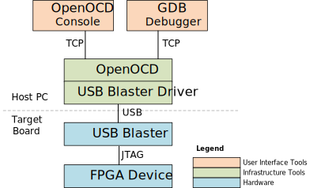
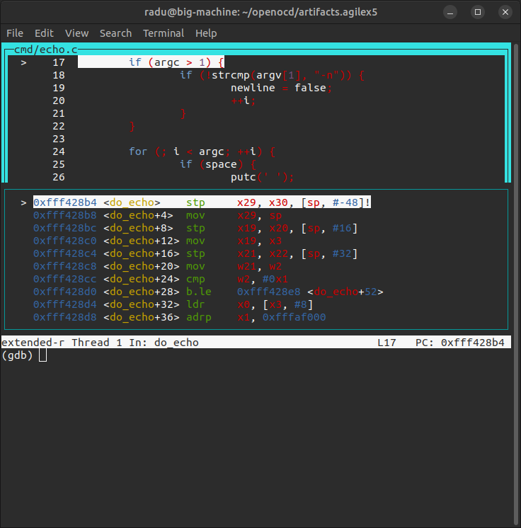
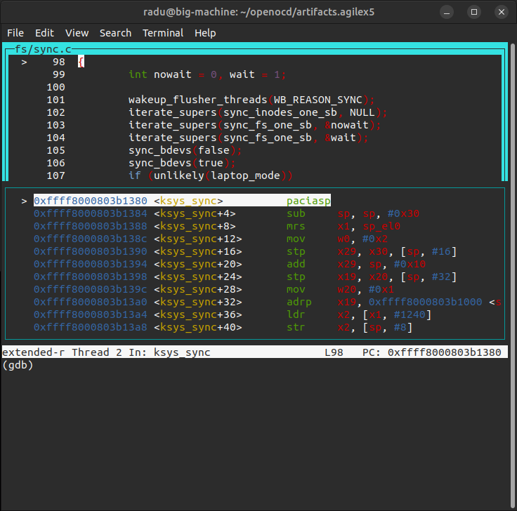

## Introduction

OpenOCD (Open On-Chip Debugger) is a free, open-source tool that provides debugging for embedded target devices. It acts as a bridge between a host PC and target hardware by interfacing with JTAG or SWD adapters to expose a GDB server, Telnet, and Tcl interfaces that let developers halt cores, inspect memory and registers, set breakpoints, flash firmware, and script complex debug sequences. 

OpenOCD is widely adopted, supporting a broad range of architectures—Arm Cortex-A/R/M, RISC-V, Xtensa, MIPS, and others—making it a staple in SoC bring-up, bootloader development, and production programming workflows where vendor tools are either unavailable, too restrictive, or insufficient for automation.

This page demonstrates how to use OpenOCD included with Quartus 26.1 to debug the HPS Arm cores on Agilex 5. The following examples are provided:

* Connect to U-Boot running on A55.0 core, and debug it.
* Connect to Linux running on all cores in SMP, and debug it.

### Architecture

The following diagram shows the overall architecture for debugging Agilex 5 HPS with OpenOCD:



The instructions demonstrate both use cases:

* Debugging from OpenOCD console
* Debugging from GDB connected to OpenOCD

### Known Issues

The OpenOCD included with Quartus 26.1 has the following known issues:

* JTAG Clock must be reduced to 6MHz to ensure proper operation
* HPS First Stage Bootloader must be run first, to ensure proper operation

### Prerequisites

The following are needed:

* [Agilex 5 FPGA E-Series 065B Premium Development Kit](https://www.altera.com/products/devkit/po-3284/agilex-5-fpga-e-series-065b-premium-development-kit), ordering code DK-A5E065BB32AEA. Other Agilex 5 development boards will also work in the same manner, but the instructions for building the binaries would need to be modified to target a different board. The `agilex5.cfg` file and the instructions would remain unchanged.
* Host PC with Linux (Ubuntu 22.04 was used, but others should work too)
* Quartus Pro 26.1 (or just Quartus Pro Programmer 26.1). Quartus versions prior to 26.1 contained an older version of OpenOCD which did not support debugging HPS on Agilex 3.
* `gdb-multiarch` tool (installed with `sudo apt-install gdb-multiarch ` on Ubuntu)
* Network access, for downloading the sources while building the binaries


## Build Embedded Software


Build the binaries necessary to boot U-Boot and Linux. We need them built locally, so we have the ELF files, and also the sources for debugging purposes:


```bash
# -----------------------------------------------------------------------------
# Create top folder
# -----------------------------------------------------------------------------
sudo rm -rf openocd.agilex5-065b-pdk
mkdir openocd.agilex5-065b-pdk
cd openocd.agilex5-065b-pdk
export TOP_FOLDER=`pwd`

# -----------------------------------------------------------------------------
# Setup compiler toolchain
# -----------------------------------------------------------------------------
cd $TOP_FOLDER
wget https://developer.arm.com/-/media/Files/downloads/gnu/14.3.rel1/binrel/\
arm-gnu-toolchain-14.3.rel1-x86_64-aarch64-none-linux-gnu.tar.xz
tar xf arm-gnu-toolchain-14.3.rel1-x86_64-aarch64-none-linux-gnu.tar.xz
rm -f arm-gnu-toolchain-14.3.rel1-x86_64-aarch64-none-linux-gnu.tar.xz
export PATH=`pwd`/arm-gnu-toolchain-14.3.rel1-x86_64-aarch64-none-linux-gnu/bin/:$PATH
export ARCH=arm64
export CROSS_COMPILE=aarch64-none-linux-gnu-

# -----------------------------------------------------------------------------
# Add Quartus tools to PATH
# -----------------------------------------------------------------------------
source ~/altera_pro/26.1/qinit.sh

# -----------------------------------------------------------------------------
# Get precompiled SOF
# -----------------------------------------------------------------------------
cd $TOP_FOLDER
rm -f *.sof
wget https://releases.rocketboards.org/2026.04/gsrd/agilex5_dk_a5e065bb32aea_gsrd.baseline-a55/baseline_a55.sof

# -----------------------------------------------------------------------------
# Build atf
# -----------------------------------------------------------------------------
cd $TOP_FOLDER
rm -rf arm-trusted-firmware
git clone -b QPDS26.1_REL_GSRD_PR https://github.com/altera-fpga/arm-trusted-firmware
cd arm-trusted-firmware
make -j 48 PLAT=agilex5 bl31 
cd ..

# -----------------------------------------------------------------------------
# Build U-boot
# -----------------------------------------------------------------------------
cd $TOP_FOLDER
rm -rf u-boot-socfpga
git clone -b QPDS26.1_REL_GSRD_PR https://github.com/altera-fpga/u-boot-socfpga
cd u-boot-socfpga 
sed -i 's/PLATFORM_CPPFLAGS += -D__ARM__/PLATFORM_CPPFLAGS += -D__ARM__ -gdwarf-4/g' arch/arm/config.mk
sed -i 's/u-boot,spl-boot-order.*/u-boot\,spl-boot-order = \&mmc;/g' arch/arm/dts/socfpga_agilex5_socdk-u-boot.dtsi
sed -i '/&nand {/!b;n;c\\tstatus = "disabled";' arch/arm/dts/socfpga_agilex5_socdk-u-boot.dtsi
ln -s ../arm-trusted-firmware/build/agilex5/release/bl31.bin 
cat << 'EOF' > config-fragment
CONFIG_BOOTFILE="Image"
CONFIG_NAND_BOOT=n
CONFIG_SPL_NAND_SUPPORT=n
CONFIG_CMD_NAND_TRIMFFS=n
CONFIG_CMD_NAND_LOCK_UNLOCK=n
CONFIG_NAND_DENALI_DT=n
CONFIG_SYS_NAND_U_BOOT_LOCATIONS=n
CONFIG_SPL_NAND_FRAMEWORK=n
CONFIG_CMD_NAND=n
CONFIG_MTD_RAW_NAND=n
CONFIG_CMD_UBI=n
CONFIG_CMD_UBIFS=n
CONFIG_MTD_UBI=n
CONFIG_ENV_IS_IN_UBI=n
CONFIG_UBI_SILENCE_MSG=n
CONFIG_UBIFS_SILENCE_MSG=n
CONFIG_DISTRO_DEFAULTS=n
CONFIG_HUSH_PARSER=y
CONFIG_SYS_PROMPT_HUSH_PS2="> "
CONFIG_USE_BOOTCOMMAND=y
CONFIG_BOOTCOMMAND="load mmc 0:1 ${loadaddr} ghrd.core.rbf; fpga load 0 ${loadaddr} ${filesize};bridge enable; mmc rescan; fatload mmc 0:1 82000000 Image;fatload mmc 0:1 86000000 socfpga_agilex5_socdk.dtb;setenv bootargs console=ttyS0,115200 root=${mmcroot} rw rootwait;booti 0x82000000 - 0x86000000"
CONFIG_CMD_FAT=y
CONFIG_CMD_FS_GENERIC=y
CONFIG_DOS_PARTITION=y
CONFIG_SPL_DOS_PARTITION=y
CONFIG_CMD_PART=y
CONFIG_SPL_CRC32=y
CONFIG_LZO=y
CONFIG_CMD_DHCP=y
CONFIG_SPI_FLASH_MACRONIX=y
CONFIG_SPI_FLASH_GIGADEVICE=y
CONFIG_SPI_FLASH_WINBOND=y
CONFIG_SPI_FLASH_ISSI=y
CONFIG_CMD_WDT=n
CONFIG_WDT=n
CONFIG_SPL_WDT=n
EOF
make clean && make mrproper
make socfpga_agilex5_defconfig 
./scripts/kconfig/merge_config.sh -O . -m .config config-fragment
make -j 64
cd ..

# -----------------------------------------------------------------------------
# Build hps.jic and core.rbf
# -----------------------------------------------------------------------------
cd $TOP_FOLDER
rm -f *.jic *.rbf
 quartus_pfg -c baseline_a55.sof ghrd.jic \
-o device=MT25QU128 \
-o flash_loader=A5ED065BB32AE4S \
-o hps_path=$TOP_FOLDER/u-boot-socfpga/spl/u-boot-spl-dtb.hex \
-o mode=ASX4 \
-o hps=1

# -----------------------------------------------------------------------------
# Build Linux kernel & device tree
# -----------------------------------------------------------------------------
cd $TOP_FOLDER
rm -rf linux-socfpga
git clone -b QPDS26.1_REL_GSRD_PR https://github.com/altera-opensource/linux-socfpga
cd linux-socfpga
make clean
make defconfig
./scripts/config --set-val CONFIG_DEBUG_INFO y
./scripts/config --set-val CONFIG_DEBUG_INFO_COMPRESSED_NONE y
./scripts/config --set-val CONFIG_GDB_SCRIPTS y
./scripts/config --disable CONFIG_DEBUG_INFO_REDUCED
./scripts/config --disable CONFIG_DEBUG_INFO_BTF
./scripts/config --set-val CONFIG_RANDOMIZE_BASE n
./scripts/config --set-val CONFIG_RANDOMIZE_MODULE_REGION_FULL n
./scripts/config --set-val CONFIG_MAGIC_SYSRQ y
make oldconfig
make -j 48 Image
make intel/socfpga_agilex5_socdk.dtb

# -----------------------------------------------------------------------------
# Get prebuilt root filesystem
# -----------------------------------------------------------------------------
cd $TOP_FOLDER
rm -f console-image-minimal-agilex5e.rootfs.tar.gz
wget https://releases.rocketboards.org/2026.04/gsrd/agilex5_dk_a5e065bb32aea_gsrd.baseline-a55/console-image-minimal-agilex5e.rootfs.tar.gz

# -----------------------------------------------------------------------------
# Create SD card image
# -----------------------------------------------------------------------------
cd $TOP_FOLDER
sudo rm -rf sd_card && mkdir sd_card && cd sd_card
wget https://releases.rocketboards.org/release/2020.11/gsrd/tools/make_sdimage_p3.py
sed -i 's/\"\-F 32\",//g' make_sdimage_p3.py
chmod +x make_sdimage_p3.py
mkdir fatfs &&  cd fatfs
cp $TOP_FOLDER/ghrd.core.rbf .
cp $TOP_FOLDER/u-boot-socfpga/u-boot.itb .
cp $TOP_FOLDER/linux-socfpga/arch/arm64/boot/Image .
cp $TOP_FOLDER/linux-socfpga/arch/arm64/boot/dts/intel/socfpga_agilex5_socdk.dtb .
cd ..
mkdir rootfs && cd rootfs
sudo tar xf $TOP_FOLDER/console-image-minimal-agilex5e.rootfs.tar.gz
cd ..
sudo python3 make_sdimage_p3.py -f \
-P fatfs/*,num=1,format=fat32,size=64M \
-P rootfs/*,num=2,format=ext3,size=300M \
-s 384M \
-n sdcard.img
```


This will create the following files:

* `ghrd.hps.jic`: QSPI image file
* `sd_card/sdcard.img`: SD card image file


## Create OpenOCD Config File


Create the `agilex5.cfg` file by using the following command:


```bash
cd $TOP_FOLDER
base64 -d <<'EOF' | gunzip > agilex5.cfg
H4sIAAAAAAACA7VabW/bOBL+7l8xlzVw9m7stdK8dHPoAq6TptlL2yBxtwdkA4OWaFmtLHpFKY4R
+Hfc/7lfdjNDUi+J2/hD7KKtLZHD4XDmmWdG+gnevOSn8RN8msvk0+AEfJVMojBPRRapBCZRLGGi
UjhPMhlDP8Tf93AA12oA7y+vcd4L64ESr/P5XKWZhgH+K+87/YMDuN+DX4rfR4f0uzWOwu7F+XB4
cdqGRZRNj3EuQAf6J+d3h/ArDZfXUTjNSNvOYa8HJ/1LO+ZkmYhZ5ONuUwlaxtLn7bZ0lIS4Y7q8
C36c60ymu4D7F3HMV3XbrZJnaoZG8mEhMn8aqBDmItfyVxyTzyQEeYqyIJDjPIS7SMBgeA5+qrTu
ZGkUhpJu834/axFKkPdiNo+lNru4NnrQ1lnFViAnIo+ztrlNH4UHpvwAOhMQfCwHXX8S1majoWj2
mjk+7GiZQR+V+vN0NPh0dXoND+LosNtb7ayT2Hfbh9ZUok1UKBOpcg3XHy534SJK8nuz1RCXbm+8
4MFBtwf0rwe8OP/rrVPhZd2sIQIxx21AkEZ3+J/4Go38OJJJ1shSkWjyP+sW8DUTYePlHZ3dE64L
17tQYeS//EajCTz84yZKJgo9LNIYVdUjuF3BQ4PO6Ttns2qsaOtv8ygOIJsiFORxvOz8nYs4mkQS
r4k0xKkYTBJiFA8t2Q27sMOz8Rh/h53pXHfNz3aDlnl3/rF/4VZZNRBcpPCnxs2bdR1YtVjM0YmC
2jwW2qQpO0bDK5nlaaLBA9wwKRriuSY/VDfSECU8VuAJ3BEMZI15qny8M7KXHmiks1EYq7GIq3rw
5ZSXhht5P0/h4SbWUqS4nw4GNHpPs6p2k8Tdwu9voLe6NYq/tFf9MeyfwbUvEhhMBe5PoOUM7L14
wkjiJZuvf/WBloAh/kWjIlJFCdp6KlPZBRw4xDF0H8FRW3BGM2fKVzG0OiKI7g7bu7CYRmg1nJ/K
v/MoRQGUdki+Re/uywcHhTYkcpGJOaBHAf3fidIYPWefDnCOsSmDThRA737/bb93uH901EDkQByX
IpM0p0s/Oz7ZujNXOuJYpussize3NfAYqrmKVbiEEzI5L72FpU4pOlO1sAerQSWyklZMSI04pPCD
cVN8Nx+6MhZajkQQpGCyRHmBM6DJLrM5Sk4QoURKMelLrSlkp6nKw6nxtMu3HXQkkVk3IgE4Ck+n
h5+9HjuJc02TrgiUUApGQg1aaIko0ZlIsghPMugiwbExb+bhABSkv0UIPgGgWuiSKPR//4VEcSpX
46/oHXqXfhsbmO9nJ2+B6csW/JXgk9QbZe7kbxh0/2IgKoCWv+Fm7C+yzj4Zx371+Gt9jleb4/HA
g3LOwZM5nK2LOfyLBh6Wcw7XzfFqc8w6R+WcIzfntlEkhgcL2jip8CUIxiH9v4Jm3R4GqSnp3ZQo
3jQSimRnvdJFcZO+dwKDASaexbyT5LOKX0GHlmMPbjolCllOQSvO/hSUBg73n5X8VwMqn47dGTTd
lw6pZ3RMM6VhusCQQFV42mo7WeR6iVEzw7yPgM2BCJfo0ltYiHJD/z/nFNWt74T1Pv5tU8a4iwIM
zAADEfPqONedWN5hTTKTM5UuUZaBjF0YL+dCE5FnzBhcfrYkPMISJp0IX24hMusuQKetl3qESpJ6
Izr49V5Am9vGAQ6NPiW9JB6AXB3OEE3nXHls5SwnUaoNRj2B3LFEiMcDpEOx1YyLHMr0fDomYFFW
C6vNRGZtIg2sO82ap9FMpEuGWCxTE7M1A/nnE5jRqtkUqY/LUEQnjMhdErBk2A/JApwSMoWi2Sq2
0iPHODdXZiqQrqDcmYo42wGNKKPLQtCxR5ZnRzL44z1OYyWtFTgNbNTa6hFspVnfC33NUhUbK5ms
UyywhWTCxzViHTGTJAHW9jXC2ru1nq2hWY41VcVNjDwpzKa1GUhuwXM4K++QLtsj1rN5beB2cOuL
K8UvuRS/MqU4V99ceQ8rlfd2sMw1SN5fXpeNgSyaydTwmo+fhiBc6wB9aWm6BgHyX8n+hIJMIY1l
KfkduQ4ZvQtfomyq8sxEyh05h0p2YarigLBOWJSjORCrBOejKA4H8qWaLiSllS3nVoODjtcD3QZf
MEUXXDbxDsiVMxNgn5M4+oY+KVKsk7FwlneRT+2AwdKPKd7+3IV+mqKlPUTrBZF/OHl71h/8G5fW
sCBGT1tj9KbCQdXVYiug3lgE75ZWtLUAxtL9PI78KCPqhWJqfZR6y8poO1woRF6k5UmkZ7i8Sr/h
kuiIqBiRuLFCx6XzcNXGMU8D8NDOJ6g43giJOqbQssnwg0hESN2g3r3XO/Ewd79uuz7HwGogbdSX
1lZkQyS2AX0l3uiUjpJ5bkgif76kyN/xGHv37971+A/VowZuJipPC5GaBBlrMawvCx0w0fHhuxUI
Nm0zyozkIXgFQ7IYVSgwnFJBbIDn55pFfyaDoekRki0wTUUaLMh6iykm7Uw5GUy2E4JzzMLoY4FC
gyQqA+oWpZQZGdbuGB6jTMt40rV23+uubZChfxVdPLofJZNU6CzNfSy6ZWH/ExlTH0e7ch4LfraF
a8bZJR87nduHU4KsiC6TIKsgBhEmM5xWNrOKmz14Y0wNyFoSU2rwBYxj6nmY4ylOrP1UgocSrG6l
BHMhIAnulKoynBS0RoL7mwvX8rQuaHXQ5TWSxNfJdPM8puj2iz0ogwyMjGCREb0cjX+PZh9+aD8S
NDzvnA3RK6tC1g5B20nq3w6vzs8+fR7eHHa7v91Cq2L2OBth4N30ut1Xt4+W+VL4ubFiC3ONiUh0
TueXMqhEVsU01gzGkBsawisMMfzw/I69jXbs4c68V9U92wPdYNtGed6TlV5AESJCPoeWmkwYGyap
mrkxXCogMh287gVEmI1nMIOmIYNPH4dXny54tTd02UPXlYkYx9JKaLsJ49d0BXdx+vEQ6hNK30GN
7V4P6f4i6BWnWgryC0FHGwg6MoK8p4L8XiHo9QaCXhtBe2sE7ReCfttA0G9G0Ks1gkobYeosBO1V
BHkVQV7P2qjiBaWs0kyet4Esz5ppnaygtJS3t4GsPWuptbJKY3mvNpD1yhprjSxvn/U66w9Pncuz
LBTbypOQEoMViUUf5y2v/fKEt4inSYxZaz5dauI/RbXZKlpOxBdt+bbL6cv1oDB/mh728TGKGqEo
qMRcoyycLVd4RCXsVHPRTLVEosFNK9nRU5XZKA9zTE6cssSdiiiTB3kSiARzAlIFbsOBzsca+Qsm
qWq2s8ssgmAcjgLiZojT5hq1LsLMXGR9Oy/5IWKGC7B+x5AnsfK/8WnyFeSVtuYhEC4wrWLsLehT
Zw9uUUPFqQnNDV4YY2UIrG3ron/V7sIpkomlVXuGpSFKGtME6cvAjF9YvkaJw+70GxaYvfvBQX8w
OD04oJMzQE2c7i23r6nPab1MQ6gKv6r2C1qmHdImY/mGMJWbIM+lTod12VQgzae8SE7K3TIG9GrL
tGx/mD4J04bui1uan5sUhw8PnI7s9rEKzIuHKLXWyGLhHps0ecIvaKrJuLe6rdhxk1lNsxLOa/Ji
prh8aV8yDyRHNoY4So+p1dChksphS405b0GJy1SFqZgZpmufSDnCz+UF0iIs72SF57UIG9ociFUW
0zJo0V7Dik22cwWEQ/NiHZTvapcB1icYEPymAHV+aO6/irb5U4jSHO91IGKk25JLrjkzeFhV2sTN
mi4r+zSvwfd/gtMqQ2q4pxnGx5tFEjAsi4iEm/eBnhGtYRTfpcLcAqNab79K+UmYa4Oji8ODoWeG
WxlixKwGN7RWMYoLQ3BW6zSrpu8fU9bN1fNfW05j2AjziOfU2yvV+7yeDYBWpoGHhzoXoakkKyCH
zP37h0Psg8hGo3jSXfc/b6twoZIRHfIx+CZUuM9DJV/lcRNBuC0fx0vbIDUtoC3o5XXhmqoHjASL
Wa0ydjFk4yVxL6zHvxieYegKgkRRfNV7Eev7G9pKNVVOTfSrrj1mA2JkgH9qU/27YzfHbSo1k9js
YFOj7Xfh8nE1a1HO1nKlUPdkufAc7VzHqGalWvXRHLtQaT/U+1NbxSjrKPBAvqnGX6sodeOTHpXH
V4YuVhMPY1txfw3uNdZNNodbT1puGL860qwSyeoDtHVpuenIbdnFqo1/Qky94vaqqp5FAW61O5fg
g+UWQOEuBA3GRdhwZQ3XLmQ1rTEtl+MKBLHg3dMBpSexSPN0DWSa1h4bSn+qYOc9LYfjgxiz4USg
qYNjaOLYnepDue0Bisncz0KK6ydtH1Oei+fipKptF0dAbISimKcxuml42lzV3XaE2p7d4xj9oZs9
cTHPuthWHoGcUqsT3lvnvOKKp2CjL70Ysgnb8a66Hp5VlOnKWxJMH570Y00E4THalj03llnt0QxZ
SsbUS2itfHpFQ6953cQaFlfgC/bdDzD59rEzWlUiaiyaN0vUI+h1qYKeglS6c1C8G1sRM5PZVGF9
3uIT33Vny2zatjQKp+8atVzUamFQ+xmNzPAtvUVSNfQm75D8+G2RH78X8uM3QL73rscKmlUlN36x
w71+UbKVjvM20583232UdClGb5+X4RD1sQzr1qUUTAH/B54aFUGjLQAA
EOF
```


The `agilex5.cfg` file will look like this:

```tcl
# =============================================================================
# OpenOCD configuration file for Intel Agilex 5 SoC HPS
# =============================================================================
#
# Supports Cortex-A55 x2 + Cortex-A76 x2 (big.LITTLE) with:
#   - ADIv6 / CoreSight SoC-600 DAP
#   - Dynamic core selection (single core, cluster, or all cores)
#   - Automatic watchdog pause/resume during debug via CTI cross-triggering
#
# Usage examples:
#   Single A55 core (default):
#       openocd -f agilex5.cfg
#   Single A76 core:
#       openocd -c "set ACTIVE_CORES {a76.0}" -f agilex5.cfg
#   All cores (heterogeneous SMP, Linux debugging):
#       openocd -c "set ACTIVE_CORES {a55.0 a55.1 a76.0 a76.1}" -f agilex5.cfg
# =============================================================================

adapter driver aji_client
transport select jtag

# =============================================================================
# Core Selection Logic
# =============================================================================

if {![info exists ACTIVE_CORES]} {
    set ACTIVE_CORES {a55.0}
}

# Build the fully-qualified target name list (e.g. "a55.0" -> "hps.a55.0")
set FINAL_CORES {}
foreach core $ACTIVE_CORES {
    lappend FINAL_CORES "hps.$core"
}

# Returns 1 if the given fully-qualified target name is in the active set
proc is_active {name} {
    global FINAL_CORES
    return [expr {[lsearch -exact $FINAL_CORES $name] >= 0}]
}

# =============================================================================
# JTAG Scan Chain and DAP
# =============================================================================
# Only the ARM DAP TAP is defined here. 
# The DAP uses ADIv6 protocol (-adiv6), which is required for the SoC-600.
# =============================================================================

jtag newtap hps tap -irlen 4 -expected-id 0x4BA06477
dap create hps.dap -chain-position hps.tap -adiv6

# =============================================================================
# Core Topology Definition
# =============================================================================
# Each row defines one core:
#   target_name    cti_name          cti_base_addr  debug_base_addr
#
# All components are accessed through the APB-AP at ADIv6 address 0x00002000.
#
# Only cores listed in ACTIVE_CORES are instantiated. Inactive cores are
# skipped entirely — no CTI objects, no targets, no GDB ports.
# =============================================================================

set core_topology [list \
    hps.a55.0 hps.cti.a55.0 0x00420000 0x00410000 \
    hps.a55.1 hps.cti.a55.1 0x00520000 0x00510000 \
    hps.a76.0 hps.cti.a76.0 0x00620000 0x00610000 \
    hps.a76.1 hps.cti.a76.1 0x00720000 0x00710000 \
]

foreach {target cti cti_base dbgbase} $core_topology {
    if {[is_active $target]} {
        cti create $cti -dap hps.dap -ap-num 0x00002000 -baseaddr $cti_base
        target create $target aarch64 -dap hps.dap -ap-num 0x00002000 \
            -dbgbase $dbgbase -cti $cti -rtos hwthread
    }
}

# =============================================================================
# System Bus Access Port
# =============================================================================
# The AXI-AP (at ADIv6 address 0x00004000) provides direct bus-level memory
# access, bypassing the CPU debug interface.
# =============================================================================

target create hps.sys_bus mem_ap -dap hps.dap -ap-num 0x4000

# =============================================================================
# Target Selection and SMP Grouping
# =============================================================================
# The first core in ACTIVE_CORES becomes the default target for interactive
# (telnet) use and the primary GDB connection.
#
# If more than one core is active, they are grouped into an SMP cluster.
# In SMP mode:
#   - "halt" stops all cores in the group
#   - GDB presents each core as a thread
#   - A single GDB connection controls the entire group
# =============================================================================

set first_core [lindex $FINAL_CORES 0]
targets $first_core

if {[llength $FINAL_CORES] > 1} {
    eval target smp $FINAL_CORES
}

# =============================================================================
# Watchdog Pause/Resume via Cross-Triggering
# =============================================================================
# The Agilex 5 HPS watchdog timers are NOT automatically paused when the
# debugger halts a core. Without intervention, holding a debug halt longer
# than the watchdog timeout (typically 5-10 s) causes a full HPS reset.
#
# Unlike earlier devices (Cyclone V, Arria 10) where DBGACK was wired
# directly to the watchdog pause logic, Agilex 5 requires explicit CTI
# cross-trigger configuration.
#
# Two mechanisms work together — both are required:
#
#   1. WDDBG register (System Manager, 0x10D12008)
#      Configures each watchdog to respond to CTI trigger inputs.
#      Writing 0xFF0F0F0F sets all four watchdogs to pause on any
#      CPU halt trigger and resume on any CPU restart trigger.
#      This is the *configuration* — it tells the hardware what to
#      listen for, but does not generate the events itself.
#
#   2. CTI cross-triggering (CoreSight CTI infrastructure)
#      Delivers the actual halt/resume events to the watchdog hardware.
#
#      Channel assignment:
#        Channel 0 = halt   (any core halted  -> pause watchdogs)
#        Channel 1 = resume (any core resumed -> restart watchdogs)
#
#      Signal path:
#        Core halts
#         -> Core CTI pulses channel 0 on the Cross Trigger Matrix (CTM)
#         -> CTI-GT sees channel 0
#         -> CTI-GT asserts TRIGOUT[6..9] (watchdog halt_req[0..3])
#         -> Watchdogs pause (if WDDBG is configured to respond)
#
#        Core resumes
#         -> Core CTI pulses channel 1 on the CTM
#         -> CTI-GT sees channel 1
#         -> CTI-GT asserts TRIGOUT[10..13] (watchdog restart_req[0..3])
#         -> Watchdogs resume
#
# CTI-GT register setup (offsets from CTI-GT base 0x1580d000):
#   0x000 CTICONTROL     = 0x01  (enable CTI-GT)
#   0x0b8 CTIOUTEN6      = 0x01  (channel 0 -> TRIGOUT6  = wd0 halt_req)
#   0x0bc CTIOUTEN7      = 0x01  (channel 0 -> TRIGOUT7  = wd1 halt_req)
#   0x0c0 CTIOUTEN8      = 0x01  (channel 0 -> TRIGOUT8  = wd2 halt_req)
#   0x0c4 CTIOUTEN9      = 0x01  (channel 0 -> TRIGOUT9  = wd3 halt_req)
#   0x0c8 CTIOUTEN10     = 0x02  (channel 1 -> TRIGOUT10 = wd0 restart_req)
#   0x0cc CTIOUTEN11     = 0x02  (channel 1 -> TRIGOUT11 = wd1 restart_req)
#   0x0d0 CTIOUTEN12     = 0x02  (channel 1 -> TRIGOUT12 = wd2 restart_req)
#   0x0d4 CTIOUTEN13     = 0x02  (channel 1 -> TRIGOUT13 = wd3 restart_req)
#   0x140 CTIGATE        = 0x03  (ungate channels 0 and 1)
# =============================================================================

# CTI-GT flat physical address (accessed via sys_bus, not through CPU)
set ::CTI_GT   0x1580d000

# System Manager WDDBG register
set ::WDDBG    0x10D12008

# One-shot setup guards to avoid redundant writes on subsequent halt/resume
set ::wddbg_done  0
set ::cti_gt_done 0

# -----------------------------------------------------------------------------
# cti_write: unlock and write a single CTI register via sys_bus
# -----------------------------------------------------------------------------
# CoreSight CTI registers are protected by a lock (LAR). Every write must
# be preceded by writing the unlock key 0xC5ACCE55 to offset 0xFB0.
# All accesses go through hps.sys_bus (AXI-AP) since the CoreSight flat
# address range is not reachable through the CPU debug memory path.
# -----------------------------------------------------------------------------
proc cti_write {base offset value} {
    hps.sys_bus mww [expr {$base + 0xfb0}] 0xC5ACCE55
    hps.sys_bus mww [expr {$base + $offset}] $value
}

# -----------------------------------------------------------------------------
# agilex_cti_gt_setup: one-time CTI-GT configuration
# -----------------------------------------------------------------------------
# Programs the global trigger CTI to route channel 0 (halt) and channel 1
# (resume) to the watchdog halt_req and restart_req trigger outputs.
# Called on first halt; skipped on subsequent halts via ::cti_gt_done guard.
# -----------------------------------------------------------------------------
proc agilex_cti_gt_setup {} {
    if {$::cti_gt_done} return

    # Enable CTI-GT
    cti_write $::CTI_GT 0x000 0x01

    # Map channel 0 -> TRIGOUT[6..9] (watchdog halt_req for all 4 watchdogs)
    foreach off {0x0b8 0x0bc 0x0c0 0x0c4} { cti_write $::CTI_GT $off 0x01 }

    # Map channel 1 -> TRIGOUT[10..13] (watchdog restart_req for all 4 watchdogs)
    foreach off {0x0c8 0x0cc 0x0d0 0x0d4} { cti_write $::CTI_GT $off 0x02 }

    # Ungate channels 0 and 1 so they propagate through the CTM
    cti_write $::CTI_GT 0x140 0x03

    set ::cti_gt_done 1
}

# -----------------------------------------------------------------------------
# agilex_on_halt: called when any active core is halted by the debugger
# -----------------------------------------------------------------------------
# 1. Sets up CTI-GT (first halt only)
# 2. Writes WDDBG to configure watchdogs to respond to CTI triggers (first
#    halt only)
# 3. Ungates the core's CTI channels so the pulse reaches the CTM
# 4. Pulses channel 0 (halt) on the core's CTI, which propagates through
#    the CTM to CTI-GT, triggering watchdog pause
# -----------------------------------------------------------------------------
proc agilex_on_halt {cti_obj} {
    if {[catch {
        # One-time CTI-GT setup
        agilex_cti_gt_setup

        # One-time WDDBG configuration
        if {!$::wddbg_done} {
            hps.sys_bus mww $::WDDBG 0xFF0F0F0F
            set ::wddbg_done 1
        }

        # Ungate all channels on this core's CTI and pulse halt (channel 0)
        $cti_obj write GATE 0x0F
        $cti_obj channel 0 pulse
    } err]} {
        echo "Halt handler failed: $err"
    }
}

# -----------------------------------------------------------------------------
# agilex_on_resume: called when any active core is resumed by the debugger
# -----------------------------------------------------------------------------
# Ungates the core's CTI channels and pulses channel 1 (resume), which
# propagates through the CTM to CTI-GT, triggering watchdog restart.
# -----------------------------------------------------------------------------
proc agilex_on_resume {cti_obj} {
    $cti_obj write GATE 0x0F
    $cti_obj channel 1 pulse
}

# =============================================================================
# Event Handler Registration
# =============================================================================
# Maps each active core to its CTI object for halt/resume event handling.
#
# The handler_map table associates:
#   target_name  cti_object_name
#
# On halt:  the core's CTI object is passed to agilex_on_halt, which uses
#           OpenOCD CTI object methods (write, channel) to ungate and pulse.
# On resume: same CTI object is passed to agilex_on_resume.
# =============================================================================

set handler_map [list \
    hps.a55.0 hps.cti.a55.0 \
    hps.a55.1 hps.cti.a55.1 \
    hps.a76.0 hps.cti.a76.0 \
    hps.a76.1 hps.cti.a76.1 \
]

foreach {target cti} $handler_map {
    if {[is_active $target]} {
        $target configure -event halted  [list agilex_on_halt $cti]
        $target configure -event resumed [list agilex_on_resume $cti]
    }
}
```

The file allows you to start OpenOCD targeting an Agilex 5 devkit. You can call it several ways:
* When core a55.0 is the boot core, and is the only one up:
```openocd -f agilex5.cfg```
* When core a76.0 is the boot core, and is the only one up:
```openocd -c "set ACTIVE_CORES {a76.0}" -f agilex5.cfg```
* When all cores are up:
```openocd -c "set ACTIVE_CORES {a55.0 a55.1 a76.0 a76.1}" -f agilex5.cfg```

> *Note*: The config file uses cross-triggering to ensure the watchdogs are paused when the cores are in debug mode. Same approach is used by the other tools for Agilex 5, such as Ashling RiscFree, Arm DS and Lauterbach T32.
> 


## Debug U-Boot

1\. Write both SD card image and QSPI image

2\. Ensure MSEL=QSPI and power up the board

3\. When asked, press any key to stop the U-Boot countdown, and drop to U-Boot console:

```bash
CPU: Altera FPGA SoCFPGA Platform (ARMv8 64bit Cortex-A55/A76)
Model: SoCFPGA Agilex5 SoCDK
DRAM:  2 GiB (total 8 GiB)
Core:  48 devices, 23 uclasses, devicetree: separate
MMC:   mmc0@10808000: 0
Loading Environment from FAT... Unable to read "uboot.env" from mmc0:1...
In:    serial0@10c02000
Out:   serial0@10c02000
Err:   serial0@10c02000
Net:   
Warning: ethernet@10810000 (eth0) using random MAC address - 9e:1d:45:f3:62:c7
eth0: ethernet@10810000
Warning: ethernet@10830000 (eth2) using random MAC address - ca:78:5f:d8:87:99
, eth2: ethernet@10830000
Hit any key to stop autoboot: 0
SOCFPGA_AGILEX5 # 
```

4\. Run `jtagconfig` to confirm a JTAG connection is established:
```bash
$ jtagconfig
1) Agilex 5E065B Premium DK on grayling-15.an.altera.com [1-3.1]
  4BA06477   ARM_CORESIGHT_SOC_600
  4364F0DD   A5EC065(AB32A|BB32A)/..
  020D10DD   VTAP10
```

5\. Reduce JTAG clock to 6MHz

```bash
$ jtagconfig --setparam 1 JtagClock 6M
```

6\. Start OpenOCD instructing it to use the config file, but without providing additional parameters by running `openocd -f agilex5.cfg`. This will cause OpenOCD to just consider the A55.0 core. See below the commands and sample output messages.

```bash
$ openocd -f agilex5.cfg
Licensed under GNU GPL v2
For bug reports, read
	http://openocd.org/doc/doxygen/bugs.html
Info : [hps.a55.0] Hardware thread awareness created
Info : Listening on port 6666 for tcl connections
Info : Listening on port 4444 for telnet connections
Info : Application name is OpenOCD.20260422225332
Info : No cable specified, so will be searching for cables

Info : At present, The first hardware cable will be used [1 cable(s) detected]
Info : Cable 1: device_name=(null), hw_name=Agilex 5E065B Premium DK, server=grayling-15.an.altera.com, port=1-3.1, chain_id=0x6349a8040990, persistent_id=16777217, chain_type=0, features=34816, server_version_info=Version 26.1.0 Build 110 03/26/2026 SC Pro Edition
Info : TAP position 0 (4BA06477) has 0 SLD nodes
Info : TAP position 1 (4364F0DD) has 0 SLD nodes
Info : TAP position 2 (20D10DD) has 5 SLD nodes
Info :     node  0 idcode=08586E00 position_n=0
Info :     node  1 idcode=0C006E00 position_n=0
Info :     node  2 idcode=0C206E00 position_n=0
Info :     node  3 idcode=19104600 position_n=0
Info :     node  4 idcode=30006E00 position_n=0
Info : Discovered 3 TAP devices
Info : Detected device (tap_position=0) device_id=4ba06477, instruction_length=4, features=0, device_name=ARM_CORESIGHT_SOC_600
Info : Found a ARM device at tap_position 0. Currently assume it is JTAG-DP capable
Info : Detected device (tap_position=1) device_id=4364f0dd, instruction_length=10, features=12, device_name=A5EC065(AB32A|BB32A)/..
Info : Found an Intel device at tap_position 1.Currently assuming it is SLD Hub
Info : Detected device (tap_position=2) device_id=020d10dd, instruction_length=10, features=4, device_name=VTAP10
Info : Found an Intel device at tap_position 2.Currently assuming it is SLD Hub
Info : Note: The adapter "aji_client" doesn't support configurable speed
Info : JTAG tap: hps.tap tap/device found: 0x4ba06477 (mfg: 0x23b (ARM Ltd), part: 0xba06, ver: 0x4)
Warn : AUTO auto0.tap - use "jtag newtap auto0 tap -irlen 10 -expected-id 0x4364f0dd"
Warn : AUTO auto1.tap - use "jtag newtap auto1 tap -irlen 10 -expected-id 0x020d10dd"
Info : hps.a55.0: hardware has 6 breakpoints, 4 watchpoints
Info : [hps.a55.0] external reset detected
Info : [hps.a55.0] Examination succeed
Info : [hps.sys_bus] Examination succeed
Info : [hps.a55.0] starting gdb server on 3333
Info : Listening on port 3333 for gdb connections
Info : [hps.sys_bus] gdb port disabled
```

7\. In another terminal on the host PC, run `telnet localhost 4444` to connect to the OpenOCD console:

```bash
$ telnet localhost 4444
Trying 127.0.0.1...
Connected to localhost.
Escape character is '^]'.
Open On-Chip Debugger
> 
```

On the terminal when OpenOCD was started, the log will show this new message:

```bash
Info : accepting 'telnet' connection on tcp/4444
```

8\. Debug using OpenOCD commands:

Run the `targets` command on OpenOCD console, it will show hps.a55.0 running, and with an asterisk, indicating it is the currently selected target

```bash
> targets
    TargetName         Type       Endian TapName            State       
--  ------------------ ---------- ------ ------------------ ------------
 0* hps.a55.0          aarch64    little hps.tap            running
 1  hps.sys_bus        mem_ap     little hps.tap            running
```

Stop the execution by running `halt` command:

```bash
> halt
hps.a55.0 socket 0 cluster 0 core 0 thread 0 multi core
hps.a55.0 halted in AArch64 state due to debug-request, current mode: EL2H
cpsr: 0x800002c9 pc: 0xfff7c308
MMU: enabled, D-Cache: enabled, I-Cache: enabled
```

Show the `x0` and `pc` registers

```bash
> reg x0
x0 (/64): 0x00000000a4280f5c
> reg pc
pc (/64): 0x00000000fff7c308
```

Read memory through the System Bus, and then through the selected A55.0 core:

```bash
> hps.sys_bus mdw 0x10D12008 1
0x10d12008: ff0f0f0f 
> mdw 0x10D12008 1            
0x10d12008: ff0f0f0f
```

Continue execution:

```bash
> resume
```

There are a lot of other commands available in the OpenOCD console.

9\. In the U-Boot console, console run the `bdinfo` command to determine the relocation offset:

```bash
SOCFPGA_AGILEX5 # bdinfo
boot_params = 0x0000000080000100
DRAM bank   = 0x0000000000000000
-> start    = 0x0000000080000000
-> size     = 0x0000000080000000
DRAM bank   = 0x0000000000000001
-> start    = 0x0000000880000000
-> size     = 0x0000000180000000
flashstart  = 0x0000000000000000
flashsize   = 0x0000000000000000
flashoffset = 0x0000000000000000
baudrate    = 115200 bps
relocaddr   = 0x00000000fff2c000
reloc off   = 0x000000007fd2c000
Build       = 64-bit
current eth = ethernet@10810000
ethaddr     = 16:7e:b4:66:74:1a
IP addr     = <NULL>
fdt_blob    = 0x00000000ffb24040
lmb_dump_all:
 memory.count = 0x2
 memory[0]	[0x80000000-0xffffffff], 0x80000000 bytes, flags: none
 memory[1]	[0x880000000-0x9ffffffff], 0x180000000 bytes, flags: none
 reserved.count = 0x1
 reserved[0]	[0xfeb22ff0-0xffffffff], 0x14dd010 bytes, flags: no-overwrite
devicetree  = separate
serial addr = 0x0000000010c02000_
 width      = 0x0000000000000004
 shift      = 0x0000000000000002
 offset     = 0x0000000000000000
 clock      = 0x0000000005f5e100
arch_number = 0x0000000000000000
TLB addr    = 0x00000000fffe0000
irq_sp      = 0x00000000ffb22ff0
sp start    = 0x00000000ffb22ff0
Early malloc usage: 1900 / 2000

```

The offset is given by this line:

```bash
reloc off   = 0x000000007fd2c000
```

10\. In a new Terminal window on host, start a gdb session using the following command:

```bash
gdb-multiarch \
	-ex 'set arch aarch64' \
	-ex 'set remotetimeout 60' \
	-ex 'target extended-remote localhost:3333' \
	-ex 'interrupt' \
	-ex 'delete breakpoints' \
	-ex 'symbol-file' \
	-ex 'symbol-file u-boot-socfpga/u-boot -o 0x7fd2c000'
```

What we are doing is to connect to the board, select aarch64 and specify the ELF file and the relocation offset so that symbols match.

The gdb console will be shown, with the following messages:

```bash
The target architecture is set to "aarch64".
Remote debugging using localhost:3333
warning: No executable has been specified and target does not support
determining executable automatically.  Try using the "file" command.
0x00000000fff7c308 in ?? ()
No symbol file now.
Reading symbols from u-boot-socfpga/u-boot...
(gdb) 
```

11\. Debug using GDB:

Disassemble a few instructions after current `pc`:

```bash
(gdb) x/5i $pc
=> 0xfff7c308 <dw_apb_timer_get_count+20>:	dmb	sy
   0xfff7c30c <dw_apb_timer_get_count+24>:	ldp	x29, x30, [sp], #16
   0xfff7c310 <dw_apb_timer_get_count+28>:	mvn	w0, w0
   0xfff7c314 <dw_apb_timer_get_count+32>:	
    b	0xfff7c20c <timer_conv_64>
   0xfff7c318 <dw_apb_timer_of_to_plat>:	stp	x29, x30, [sp, #-32]!
```

Show a few registers:

```bash
(gdb) info registers x0 x1 pc
x0             0xaf9024f6          2945459446
x1             0xfff7c2f4          4294427380
pc             0xfff7c308          0xfff7c308 <dw_apb_timer_get_count+20>
```
Look at the current local variables:

```bash
(gdb) info locals
__v = 2945459446
priv = <optimized out>
```

Put a temporary hardware breakpoint at `do_echo` and continue program execution:

```bash
(gdb) thbreak do_echo
Hardware assisted breakpoint 1 at 0xfff428b4: file cmd/echo.c, line 17.
(gdb) continue
Continuing.
```

In U-Boot console run `echo` command:

```bash
SOCFPGA_AGILEX5 # echo meow
```

The breakpoint will be hit, and GDB will show this:

```bash
Temporary breakpoint 1, do_echo (cmdtp=0xfffc5fa8 <_u_boot_list_2_cmd_2_echo>, flag=0, argc=2, argv=0xffb3ec80) at cmd/echo.c:17
17		if (argc > 1) {
```

Run the `layout split` command, it will show both the source code and the disassembly at the same time, and the gdb command console at the bottom:



Run the `stepi` command a few times, to see the program advancing, and the cursors for both the C and disassembly moving along.

There are a lot more GDB commands and features that can be used for a full debugging experience from command line.


## Debug Linux

1\. Write both SD card image and QSPI image, if not already done

2\. Ensure MSEL=QSPI and power up the board

3\. When prompted, enter 'root' as user name to log in, and no password will be required:

```bash
[  OK  ] Started Hostname Service.
[  OK  ] Started WPA supplicant.
[    9.731525] socfpga-dwmac 10830000.ethernet eth0: Link is Up - 1Gbps/Full - flow control rx/tx

Poky (Yocto Project Reference Distro) 5.0.16 agilex5e ttyS0

agilex5e login: root

WARNING: Poky is a reference Yocto Project distribution that should be used for
testing and development purposes only. It is recommended that you create your
own distribution for production use.

root@agilex5e:~#
```

4\. Run `jtagconfig` to confirm a JTAG connection is established:
```bash
$ jtagconfig
1) Agilex 5E065B Premium DK on grayling-15.an.altera.com [1-3.1]
  4BA06477   ARM_CORESIGHT_SOC_600
  4364F0DD   A5EC065(AB32A|BB32A)/..
  020D10DD   VTAP10
```

5\. Reduce JTAG clock to 6MHz

```bash
$ jtagconfig --setparam 1 JtagClock 6M
```

6\. Start OpenOCD instructing it to use the config file, and enabling all cores to be used with `openocd -c "set ACTIVE_CORES {a55.0 a55.1 a76.0 a76.1}" -f agilex5.cfg`.
See below the commands and sample output messages.

```bash
$ openocd -c "set ACTIVE_CORES {a55.0 a55.1 a76.0 a76.1}" -f agilex5.cfg
Open On-Chip Debugger 0.12.0+quartus-gc58ca4ebc (2026-02-26-10:54)
Licensed under GNU GPL v2
For bug reports, read
	http://openocd.org/doc/doxygen/bugs.html
a55.0 a55.1 a76.0 a76.1
Info : [hps.a55.0] Hardware thread awareness created
Info : [hps.a55.1] Hardware thread awareness created
Info : [hps.a76.0] Hardware thread awareness created
Info : [hps.a76.1] Hardware thread awareness created
Info : Listening on port 6666 for tcl connections
Info : Listening on port 4444 for telnet connections
Info : Application name is OpenOCD.20260423210509
Info : No cable specified, so will be searching for cables
Info : At present, The first hardware cable will be used [1 cable(s) detected]
Info : Cable 1: device_name=(null), hw_name=Agilex 5E065B Premium DK, server=grayling-15.an.altera.com, port=1-3.1, chain_id=0x59a2dbc0dbe0, persistent_id=16777217, chain_type=1, features=34816, server_version_info=Version 26.1.0 Build 110 03/26/2026 SC Pro Edition
Info : TAP position 0 (4BA06477) has 0 SLD nodes
Info : TAP position 1 (4364F0DD) has 3 SLD nodes
Info :     node  0 idcode=08986E00 position_n=0
Info :     node  1 idcode=0C006E00 position_n=0
Info :     node  2 idcode=0C206E00 position_n=0
Info : TAP position 2 (20D10DD) has 5 SLD nodes
Info :     node  0 idcode=08586E00 position_n=0
Info :     node  1 idcode=0C006E00 position_n=0
Info :     node  2 idcode=0C206E00 position_n=0
Info :     node  3 idcode=19104600 position_n=0
Info :     node  4 idcode=30006E00 position_n=0
Info : Discovered 3 TAP devices
Info : Detected device (tap_position=0) device_id=4ba06477, instruction_length=4, features=0, device_name=ARM_CORESIGHT_SOC_600
Info : Found a ARM device at tap_position 0. Currently assume it is JTAG-DP capable
Info : Detected device (tap_position=1) device_id=4364f0dd, instruction_length=10, features=12, device_name=A5EC065(AB32A|BB32A)/..
Info : Found an Intel device at tap_position 1.Currently assuming it is SLD Hub
Info : Detected device (tap_position=2) device_id=020d10dd, instruction_length=10, features=4, device_name=VTAP10
Info : Found an Intel device at tap_position 2.Currently assuming it is SLD Hub
Info : Note: The adapter "aji_client" doesn't support configurable speed
Info : JTAG tap: hps.tap tap/device found: 0x4ba06477 (mfg: 0x23b (ARM Ltd), part: 0xba06, ver: 0x4)
Warn : AUTO auto0.tap - use "jtag newtap auto0 tap -irlen 10 -expected-id 0x4364f0dd"
Warn : AUTO auto1.tap - use "jtag newtap auto1 tap -irlen 10 -expected-id 0x020d10dd"
Info : hps.a55.0: hardware has 6 breakpoints, 4 watchpoints
Info : [hps.a55.0] external reset detected
Info : [hps.a55.0] Examination succeed
Info : hps.a55.1: hardware has 6 breakpoints, 4 watchpoints
Info : [hps.a55.1] external reset detected
Info : [hps.a55.1] Examination succeed
Info : hps.a76.0: hardware has 6 breakpoints, 4 watchpoints
Info : [hps.a76.0] external reset detected
Info : [hps.a76.0] Examination succeed
Info : hps.a76.1: hardware has 6 breakpoints, 4 watchpoints
Info : [hps.a76.1] external reset detected
Info : [hps.a76.1] Examination succeed
Info : [hps.sys_bus] Examination succeed
Info : [hps.a55.0] starting gdb server on 3333
Info : Listening on port 3333 for gdb connections
Info : [hps.sys_bus] gdb port disabled
```

7\. In another terminal on the host PC, run `telnet localhost 4444` to connect to the OpenOCD console:

```bash
$ telnet localhost 4444
Trying 127.0.0.1...
Connected to localhost.
Escape character is '^]'.
Open On-Chip Debugger
> 
```

On the terminal when OpenOCD was started, the log will show this new message:

```bash
Info : accepting 'telnet' connection on tcp/4444
```

8\. Debug using OpenOCD commands:

Run the `targets` command on OpenOCD console, it will show hps.a55.0 running, and with an asterisk, indicating it is the currently selected target

```bash
> targets
    TargetName         Type       Endian TapName            State       
--  ------------------ ---------- ------ ------------------ ------------
 0* hps.a55.0          aarch64    little hps.tap            running
 1  hps.a55.1          aarch64    little hps.tap            running
 2  hps.a76.0          aarch64    little hps.tap            running
 3  hps.a76.1          aarch64    little hps.tap            running
 4  hps.sys_bus        mem_ap     little hps.tap            running
```

Switch the active target to a76.0 by running `target hps.a76.1`:

```bash
> targets hps.a76.1
> targets
    TargetName         Type       Endian TapName            State       
--  ------------------ ---------- ------ ------------------ ------------
 0  hps.a55.0          aarch64    little hps.tap            running
 1  hps.a55.1          aarch64    little hps.tap            running
 2  hps.a76.0          aarch64    little hps.tap            running
 3* hps.a76.1          aarch64    little hps.tap            running
 4  hps.sys_bus        mem_ap     little hps.tap            running
```

Stop the execution by running `halt` command:

```bash
> halt
hps.a76.1 socket 0 cluster 0 core 3 thread 0 multi core
hps.a55.1 socket 0 cluster 0 core 1 thread 0 multi core
hps.a55.0 socket 0 cluster 0 core 0 thread 0 multi core
hps.a76.0 socket 0 cluster 0 core 2 thread 0 multi core
hps.a76.0 halted in AArch64 state due to debug-request, current mode: EL2H
cpsr: 0x604000c9 pc: 0xffff800081263c08
MMU: enabled, D-Cache: enabled, I-Cache: enabled
hps.a55.0 halted in AArch64 state due to debug-request, current mode: EL2H
cpsr: 0x604000c9 pc: 0xffff800081263c08
MMU: enabled, D-Cache: enabled, I-Cache: enabled
hps.a55.1 halted in AArch64 state due to debug-request, current mode: EL2H
cpsr: 0x604000c9 pc: 0xffff800081263c08
MMU: enabled, D-Cache: enabled, I-Cache: enabled
hps.a76.1 halted in AArch64 state due to debug-request, current mode: EL2H
cpsr: 0x604000c9 pc: 0xffff800081263c08
MMU: enabled, D-Cache: enabled, I-Cache: enabled
```

Show the `x0` and `pc` registers

```bash
> reg x0
x0 (/64): 0x00000000a4280f5c
> reg pc
pc (/64): 0x00000000fff7c308
```

Read memory through the System Bus, and then through the selected A55.0 core:

```bash
> hps.sys_bus mdw 0x10D12008 1
0x10d12008: ff0f0f0f 
> mdw 0x10D12008 1            
0x10d12008: ff0f0f0f
```

Continue execution:

```bash
> resume
```

There are a lot of other commands available in the OpenOCD console.


9\. In a new Terminal window on host, start a gdb session using the following command:

```bash
$ gdb-multiarch linux-socfpga/vmlinux \
	-ex 'set arch aarch64' \
	-ex 'set remotetimeout 60' \
	-ex 'target extended-remote localhost:3333' \
	-ex 'interrupt'
```

What we are doing is to connect to the board, select aarch64 and specify the ELF file for the kernel, then stopping execution.

The gdb console will be shown, with the following messages:

```bash
The target architecture is set to "aarch64".
Remote debugging using localhost:3333
warning: multi-threaded target stopped without sending a thread-id, using first non-exited thread
cpu_do_idle () at arch/arm64/kernel/idle.c:32
32		arm_cpuidle_restore_irq_context(&context);
(gdb) 
```

10\. Debug using GDB:

Show the different cores:

```bash
(gdb) info threads
  Id   Target Id                                                    Frame 
* 1    Thread 1 "hps.a55.0" (Name: hps.a55.0, state: debug-request) cpu_do_idle
    () at arch/arm64/kernel/idle.c:32
  2    Thread 2 "hps.a55.1" (Name: hps.a55.1, state: debug-request) cpu_do_idle
    () at arch/arm64/kernel/idle.c:32
  3    Thread 3 "hps.a76.0" (Name: hps.a76.0, state: debug-request) cpu_do_idle
    () at arch/arm64/kernel/idle.c:32
  4    Thread 4 "hps.a76.1" (Name: hps.a76.1, state: debug-request) cpu_do_idle
    () at arch/arm64/kernel/idle.c:32

```

You can see that the a55.0 core is currently selected. Switch to using the a76.1 core using the command `thread 3`

```bash
(gdb) thread 3
[Switching to thread 3 (Thread 3)]
#0  cpu_do_idle () at arch/arm64/kernel/idle.c:32
32		arm_cpuidle_restore_irq_context(&context);
(gdb) info threads
  Id   Target Id                                                    Frame 
  1    Thread 1 "hps.a55.0" (Name: hps.a55.0, state: debug-request) cpu_do_idle
    () at arch/arm64/kernel/idle.c:32
  2    Thread 2 "hps.a55.1" (Name: hps.a55.1, state: debug-request) cpu_do_idle
    () at arch/arm64/kernel/idle.c:32
* 3    Thread 3 "hps.a76.0" (Name: hps.a76.0, state: debug-request) cpu_do_idle
    () at arch/arm64/kernel/idle.c:32
  4    Thread 4 "hps.a76.1" (Name: hps.a76.1, state: debug-request) cpu_do_idle
    () at arch/arm64/kernel/idle.c:32

```

Print the stack trace, using `bt` command, showing current chain of functions that are called:

```bash
(gdb) bt
#0  cpu_do_idle () at arch/arm64/kernel/idle.c:32
#1  0xffff800081263c1c in arch_cpu_idle () at arch/arm64/kernel/idle.c:44
#2  0xffff800081263cc8 in default_idle_call () at kernel/sched/idle.c:122
#3  0xffff80008011bb9c in cpuidle_idle_call () at kernel/sched/idle.c:190
#4  do_idle () at kernel/sched/idle.c:330
#5  0xffff80008011be24 in cpu_startup_entry (
    state=state@entry=CPUHP_AP_ONLINE_IDLE) at kernel/sched/idle.c:428
#6  0xffff80008004676c in secondary_start_kernel ()
    at arch/arm64/kernel/smp.c:271
#7  0xffff800080052ebc in __secondary_switched ()
    at arch/arm64/kernel/head.S:404
```

Show the values of some registers:

```bash
(gdb) info registers x0 x1 pc
x0             0x85dc              34268
x1             0xffff00097efac1d0  18446462639517909456
pc             0xffff800081263c08  0xffff800081263c08 <cpu_do_idle+8>
```

Disassemble a few instructions after current pc, using the `x/5i $pc` command:

```bash
(gdb) x/5i $pc
=> 0xffff800081263c08 <cpu_do_idle+8>:	ret
   0xffff800081263c0c <arch_cpu_idle>:	paciasp
   0xffff800081263c10 <arch_cpu_idle+4>:	stp	x29, x30, [sp, #-16]!
   0xffff800081263c14 <arch_cpu_idle+8>:	mov	x29, sp
   0xffff800081263c18 <arch_cpu_idle+12>:	
    bl	0xffff800081263c00 <cpu_do_idle>
```


Put a temporary hardware breakpoint at `ksys_sync` symbol and continue program execution:

```bash
(gdb) thbreak ksys_sync
Hardware assisted breakpoint 1 at 0xffff8000803b1380: file fs/sync.c, line 98.
(gdb) continue
Continuing.
```

Sometimes you would see the following message, with the execution being interrupted before the breakpoint is hit:

```bash
hps.a76.1 halted in AArch64 state due to debug-request, current mode: EL2H
cpsr: 0x604000c9 pc: 0xffff800081263c08
MMU: enabled, D-Cache: enabled, I-Cache: enabled

Thread 3 "hps.a76.0" received signal SIGINT, Interrupt.
cpu_do_idle () at arch/arm64/kernel/idle.c:32
32		arm_cpuidle_restore_irq_context(&context);
```

If that is the case, just run `continue` again:

```bash
(gdb) continue
Continuing.
```

On board Linux console, run the command `sync`:

```bash
root@agilex5e:~# sync
```

The breakpoint will be hit, and GDB will show this:

```bash
hps.a76.0 halted in AArch64 state due to debug-request, current mode: EL2H
cpsr: 0x604000c9 pc: 0xffff800081263c08
MMU: enabled, D-Cache: enabled, I-Cache: enabled
hps.a76.1 halted in AArch64 state due to debug-request, current mode: EL2H
cpsr: 0x604000c9 pc: 0xffff800081263c08
MMU: enabled, D-Cache: enabled, I-Cache: enabled
[New Thread 2]
[Switching to Thread 2]

Thread 5 "hps.a55.1" hit Temporary breakpoint 1, ksys_sync () at fs/sync.c:98
98	{
(gdb) 
```

Run the `layout split` command, it will show both the source code and the disassembly at the same time, and the gdb command console at the bottom:



Run the `stepi` command a few times, to see the program advancing, and the cursors for both the C and disassembly moving along.

There are a lot more GDB commands and features that can be used for a full Linux debugging experience from command line.

## Notices & Disclaimers

Altera<sup>&reg;</sup> Corporation technologies may require enabled hardware, software or service activation.
No product or component can be absolutely secure. 
Performance varies by use, configuration and other factors.
Your costs and results may vary. 
You may not use or facilitate the use of this document in connection with any infringement or other legal analysis concerning Altera or Intel products described herein. You agree to grant Altera Corporation a non-exclusive, royalty-free license to any patent claim thereafter drafted which includes subject matter disclosed herein.
No license (express or implied, by estoppel or otherwise) to any intellectual property rights is granted by this document, with the sole exception that you may publish an unmodified copy. You may create software implementations based on this document and in compliance with the foregoing that are intended to execute on the Altera or Intel product(s) referenced in this document. No rights are granted to create modifications or derivatives of this document.
The products described may contain design defects or errors known as errata which may cause the product to deviate from published specifications.  Current characterized errata are available on request.
Altera disclaims all express and implied warranties, including without limitation, the implied warranties of merchantability, fitness for a particular purpose, and non-infringement, as well as any warranty arising from course of performance, course of dealing, or usage in trade.
You are responsible for safety of the overall system, including compliance with applicable safety-related requirements or standards. 
<sup>&copy;</sup> Altera Corporation.  Altera, the Altera logo, and other Altera marks are trademarks of Altera Corporation.  Other names and brands may be claimed as the property of others. 

OpenCL* and the OpenCL* logo are trademarks of Apple Inc. used by permission of the Khronos Group™. 