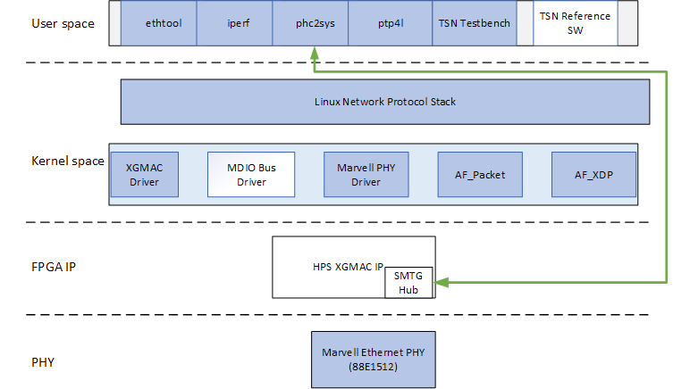
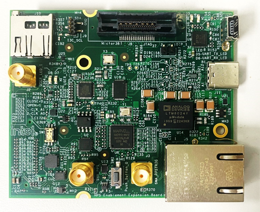
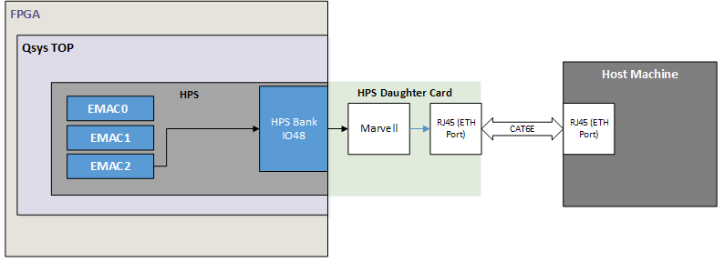
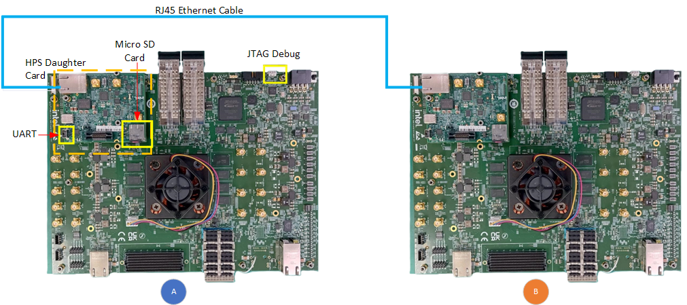
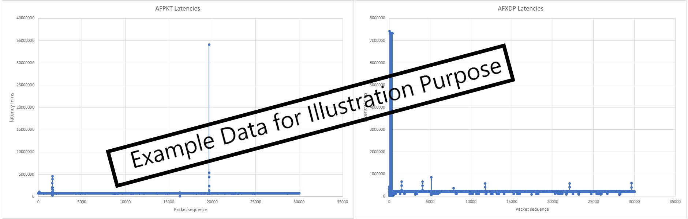

## Introduction

IEEE Ethernet is a core technology which is a backbone for IT operations and was designed to provide best effort communication suitable for IT operations. Operational Technology vendors have innovatively used Core IEEE Ethernet technology with proprietary solutions for enabling time-bounded communication. To address the need for precision timing, traffic shaping, and time-bounded communication over networks, IEEE introduced a suite of standards known as Time Sensitive Networking (TSN).

Agilex&trade; 5 E-Series is designed as an end point for Industrial automation application with support for the following TSN protocols:

* __Time Synchronization Protocols__:
  * IEEE 1588-2008 Advanced Timestamp (Precision Time Protocol - PTP):
    * Function: Provides sub-microsecond accuracy for time synchronization between computing systems over a local area network.
    * Key Features: 2-step synchronization, PTP offload, and timestamping.
    * Use Case: Synchronizing industrial devices to operate in unison, ensuring coordinated actions across factory or plant operations.
  * IEEE 802.1AS (Timing and Synchronization):
    * Function: A profile of PTP (version 2) that ensures precise time synchronization in a hierarchical master-slave architecture.
    * Key Features: Prioritizes accuracy and variability of timing, crucial for industrial and automotive systems.
    * Use Case: Synchronizing devices to a common time for optimal operation and collaboration.

* __Credit Based Shaper Protocol__:
  * IEEE 802.1Qav (Time-Sensitive Streams Forwarding and Queuing):
    * Function: Provides low-latency, time-synchronized delivery of audio and video streams over Ethernet networks.
    * Key Features: Credit-based shaper ensuring end-to-end guaranteed bandwidth with fairness to best-effort traffic.
    * Use Case: Ensuring dedicated bandwidth for audio-video bridging (AVB) streams with minimal latency.

* __Traffic Scheduling Protocols__:
  * IEEE 802.1Qbv (Time-Scheduled Traffic Enhancements):
    * Function: Enables the transmission of frames at specific scheduled times within microsecond ranges.
    * Key Features: Critical for time-sensitive scheduled traffic in industrial applications.
    * Use Case: Facilitating precise, time-critical communication for industrial devices like PLCs and drives.
  * IEEE 802.1Qbu (Frame Preemption):
    * Function: Allows high-priority frames to preempt lower-priority frames, reducing latency and jitter.
    * Key Features: Utilizes Express Media Access Control (eMAC) and Preemptable Media Access Control (pMAC).
    * Use Case: Ensuring high-priority frames arrive with fixed latency, crucial for applications requiring consistent timing.

These TSN standards collectively enable precise timing, traffic shaping, and time-bounded communication, making them indispensable for applications requiring high reliability and determinism. 

The details of TSN is not in the scope of this document. Here are some reference to the TSN specifications

- [IEEE Std 802.1AS™-2011 "Timing and Synchronization for Time-Sensitive Applications in Bridged Local Area Networks"](https://standards.ieee.org/standard/802_1AS-2011.html?oslc_config.context=https%3A%2F%2Frtc.intel.com%2Fgc%2Fconfiguration%2F964)
- [IEEE Std 802.1Qav™-2009 “Forwarding and Queuing Enhancements for Time-Sensitive Streams”](https://standards.ieee.org/standard/802_1Qav-2009.html?oslc_config.context=https%3A%2F%2Frtc.intel.com%2Fgc%2Fconfiguration%2F964)
- [IEEE Std 802.1Qbv™-2015 “Enhancements for Scheduled Traffic”](https://standards.ieee.org/standard/802_1Qbv-2015.html?oslc_config.context=https%3A%2F%2Frtc.intel.com%2Fgc%2Fconfiguration%2F964)
- [IEEE Std 802.1Qbu™-2016 “Frame Preemption”](https://standards.ieee.org/standard/802_1Qbu-2016.html?oslc_config.context=https%3A%2F%2Frtc.intel.com%2Fgc%2Fconfiguration%2F964)


### TSN HPS RGMII System Example Design Overview

The Time Sensitive Network (TSN) through Hard Processor System (HPS) IO System Example Design (SED) is a reference design running on the Agilex&trade; 5 E-Series 065B Premium Development Kit.  
This System Example Design comprises the following components:

* Hardware Reference Design (GHRD)
* Reference HPS software including:
  * Arm Trusted Firmware
  * U-Boot
  * Linux Kernel
  * Linux Drivers
  * Sample Applications

TSN Solution Architecture for this SED is illustrated as:



>[Note:]
>This is a pre-production release of Agilex&trade; 5 TSN HPS RGMII System Example Design, on Agilex&trade; 5 FPGA E-Series 065B Premium Development Kit.


### Prerequisites

This system example design is based on the [Agilex 5 E-Series Premium Development Kit GSRD](https://altera-fpga.github.io/rel-26.1/embedded-designs/agilex-5/e-series/premium-065b/gsrd/ug-gsrd-agx5e-premium-065b/). It is recommended that you familiarize yourself with the GSRD development flow before proceeding with this design.
The TSN through HPS IO System Example Design will be implemented on the HPS Enablement Expansion Board (also referred as HPS Daughter Card), which is included with the development kit.

#### Development Kit

This Example Design targets the Agilex 5 FPGA E-Series 065B Premium Development Kit, utilizing the HPS. 
Refer to [GSRD\#Development Kit](https://altera-fpga.github.io/rel-26.1/embedded-designs/agilex-5/e-series/premium-065b/gsrd/ug-gsrd-agx5e-premium-065b/#development-kit) for details about the board, including how to install the HPS Daughter Card.

* Altera&reg; Agilex&trade; 5 FPGA E-Series 065B Premium Development Kit
* HPS Enablement Expansion Board. Included with the development kit.
* Mini USB Cable
* Micro USB Cable
* Ethernet Cable
* Micro SD card and USB card writer

**Altera&reg; Agilex&trade; 5 FPGA E-Series 065B Premium Development Kit:**


**HPS Enablement Expandsion Board Card:**




#### Development Environment

Host PC with:

*   64 GB of RAM. Less will be fine for only exercising the binaries, and not rebuilding the GSRD.
*   Linux OS installed. Ubuntu 22.04LTS was used to create this page, other versions and distributions may work too.
*   Serial terminal (for example GtkTerm or Minicom on Linux and TeraTerm or PuTTY on Windows)
*   Altera&reg; Quartus&reg; Prime Pro Edition version. Used to recompile the hardware design. If only writing binaries is required, then the smaller Altera&reg; Quartus&reg; Prime Pro Edition Programmer is sufficient.
*   The prebuilt binaries were built using Altera&reg; Quartus&reg; 26.1
*   The instructions for rebuilding the binaries use Altera&reg; Quartus&reg; 26.1
*   Local Ethernet network, with DHCP server
*   Internet connection. For downloading the files, especially when rebuilding the GSRD.


### Release Contents

This page documents content testing with prebuild binaries flow and testing with complete flow.

* See [HPS GSRD User Guide for the Agilex™ 5 E-Series Premium Dev Kit](https://altera-fpga.github.io/rel-26.1/embedded-designs/agilex-5/e-series/premium-065b/gsrd/ug-gsrd-agx5e-premium-065b/)
  
  * See Prerequisites
  * See [Prebuild Binaries](https://altera-fpga.github.io/rel-26.1/embedded-designs/agilex-5/e-series/premium-065b/gsrd/ug-gsrd-agx5e-premium-065b/#prebuilt-binaries)
  * See Component Versions
  * See Exercise-prebuilt-binaries

## TSN RGMII Architecture

This system example design showcases Ethernet design through the HPS IO on the HPS Enablement Expansion Board,  with support for TSN features including IEEE 802.1AS, IEEE 802.1Qav, IEEE 802.1Qbv, IEEE 802.1Qbu.



* HPS Peripherals connected to HPS Enablement Expansion Board:

  * Micro SD Card
  * EMAC
  * HPS JTAG debug
  * UART

[End of Introduction]: <>


## User Flow

There are two ways to test the design based on use case.
    <a id="UserFlow1"></a>

* User Flow 1: [Testing with Prebuilt Binaries](https://altera-fpga.github.io/rel-26.1/embedded-designs/agilex-5/e-series/premium-065b/gsrd/ug-gsrd-agx5e-premium-065b/#exercise-prebuilt-binaries)

    <a id="UserFlow2"></a>

* User Flow 2a: [Testing Complete Flow Rebuilt Binaries](https://altera-fpga.github.io/rel-26.1/embedded-designs/agilex-5/e-series/premium-065b/gsrd/ug-gsrd-agx5e-premium-065b/#rebuild-binaries)
>[Note:]
>Please refer to "Exercise Prebuilt Binaries" to program the binaries

| User Flow | Description | Required for [Userflow#1](#UserFlow1) | Required for [Userflow#2](#UserFlow2) |
| --- | --- | --- | --- |
|Environment Setup|Tools Download and Installation|Yes|Yes|
||Install dependencies for SW compilation|No|Yes|
 |Compilation|Simulation|No|No|
||Hardware Compilation|No|Yes|
||Software Compilation|No|Yes|
|Programming|Programming the binaries|Yes|Yes|
||[Linux boot](#linux-boot)|Yes|Yes|
|Testing|[Run Test Application](#testing)|Yes|Yes|


#### Linux Boot

1. Power down board
2. Set MSEL dipswitch SW27 to ASX4 (QSPI): OFF-ON-ON-OFF
3. Power up the board
4. Wait for Linux to boot, use `root` as user name, and no password will be requested.

___

### Testing

For the purpose of demonstration, 2 development kits (refer to GSRD) will be required with Ethernet connected back to back from one board to another. 

Note: Ethernet port is on the HPS Enablement Expansion Board attached.



#### Running Ping Test
Use ifconfig to configure the IP address on both the Devkit DUT and start testing.

Example:-

Devkit #1 : $ ifconfig eth0 192.168.1.100

Devkit #2 : $ ifconfig eth0 192.168.1.200

#### Running _iperf_ Test:

1. Execute below command on Devkit #1 DUT.

    `iperf3 -s eth0`

2. Execute below command on Devkit #2 DUT.

    `iperf3 eth0 -c 192.168.1.100 -b 0 -l 1500`

    _Note : Update the Devkit #1 DUT IP address in above command._

#### Run TSN Application

The following examples are demonstrated using 2 units of the Agilex 5 platform.  Please take note of the notation "[Board A or B]". The following steps assumes both platforms are connected to each other via an Ethernet connection.

1\. Boot to Linux

2\. Navigate to the `tsn` directory

```bash
cd tsn
```

<h5>Configuration for Both Boards</h5>

<h6>Step I: Setup Environment Path on Both Boards</h6>

3\. Board A

   ```bash
   export LIBXDP_OBJECT_PATH=/usr/lib64/bpf
   export LD_LIBRARY_PATH=/usr/lib/custom_bpf/lib 
   ```

4\. Board B

   ```bash
   export LIBXDP_OBJECT_PATH=/usr/lib64/bpf
   export LD_LIBRARY_PATH=/usr/lib/custom_bpf/lib 
   ```

<h5>TXRX-TSN App</h5>

<h6>Step II: Run Configuration Script</h6>

5\. Board A: Run the configuration script and wait for it to configure the IP and MAC address, start clock synchronization, and set up TAPRIO qdisc.

   ```bash
   ./run.sh agilex5 eth0 vs1a setup
   ```

6\. Board B: Run the configuration script and wait for it to configure the IP and MAC address, start clock synchronization, and set up ingress qdiscs.

   ```bash
   ./run.sh agilex5 eth0 vs1b setup
   ```

<h6>Step III: Start the Application</h6>

7\. Board B: Run the application.

   ```bash
   ./run.sh agilex5 eth0 vs1b run
   ```

8\. Board A: Immediately after starting the application on Board B, run the application on Board A.

   ```bash
   ./run.sh agilex5 eth0 vs1a run
   ```

<h5>Post-Test Procedure</h5>
Once the test is completed, copy the following files from Board B (listener) to the host machine:

- afpkt-rxtstamps.txt
- afxdp-rxtstamps.txt

<h5>Generating Latency Plot Using Excel</h5>

Import 'afpkt-rxtstamps.txt' and 'afxdp-rxtstamps.txt' to excel in 2 seperate sheets.


Plot Column 1 for each sheets using Scatter chart,


This will generate plot for AFPKT and AFXDP with latency(on Y-axis) against packet count (on X-axis).
  

The latency for this design example can be seen as below:


#### Run Time Synchronization commands


You may use the following command guide to perform time synchronization on the Agilex&trade; 5 system using PTP4L and PHC2SYS, and to obtain delay values

__End-to-End PTP master and slave synchronization__

- Board B (as slave):

    ```bash
    ptp4l -i eth0  -s -H -E -2 -m
    ```

    ``` 
    -i  eth0: This option specifies the `eth0` as the network interface to use for PTP.
    -s  This option enables the slave-only mode. 
    -H  This option enables hardware time stamping. 
    -E  This option selects the end-to-end (E2E) delay measurement mechanism. This is the default.The E2E mechanism is also referred to as the delay “request-response” mechanism.
    -2  Use Ethernet Layer (L2)
    -m  This option enables printing of messages to the standard output.
    ```

- Boards A (as master):

    ```bash
    ptp4l -i eth0  -H -E -2 -m
    ```


- At Board B (as slave), perform sync on local System Clock with EMAC Hardwware Clock.

    ```bash
    phc2sys -s eth0 -w -m -c CLOCK_REALTIME -O 0 -n 0
    ```

__Peer-to-Peer PTP synchronization__:

- Board B (as slave):
    ```bash
    slave: ptp4l -i eth0  -s -H -P -2 -m
    ```

    -P: This option enables the use of the Peer Delay Mechanism.


- Board A (as master):
    ```bash
    master: ptp4l -i eth0  -H -P -2 -m
    ```


- At Board B (as slave), perform sync on local System Clock with EMAC Hardwware Clock.

    ```bash
    phc2sys -s eth0 -w -m -c CLOCK_REALTIME -O 0 -n 0
    ```


__gPTP synchronization__:

- Board B (as slave):

    ```bash
    ptp4l -i eth0  -s -H -P -2 -m --transportSpecific=1
    ```

- Board A (as master): 

    ```bash
    ptp4l -i eth0  -H -P -2 -m --transportSpecific=1
    ```


- At Board B (as slave), perform sync on local System Clock with EMAC Hardwware Clock.

    ```bash
    phc2sys -s eth0 -w -m --transportSpecific 1 -c CLOCK_REALTIME -O 0 -n 0
    ```

[End of ## User Flow]: <>

## Notices & Disclaimers

Altera<sup>&reg;</sup> Corporation technologies may require enabled hardware, software or service activation.
No product or component can be absolutely secure. 
Performance varies by use, configuration and other factors.
Your costs and results may vary. 
You may not use or facilitate the use of this document in connection with any infringement or other legal analysis concerning Altera or Intel products described herein. You agree to grant Altera Corporation a non-exclusive, royalty-free license to any patent claim thereafter drafted which includes subject matter disclosed herein.
No license (express or implied, by estoppel or otherwise) to any intellectual property rights is granted by this document, with the sole exception that you may publish an unmodified copy. You may create software implementations based on this document and in compliance with the foregoing that are intended to execute on the Altera or Intel product(s) referenced in this document. No rights are granted to create modifications or derivatives of this document.
The products described may contain design defects or errors known as errata which may cause the product to deviate from published specifications.  Current characterized errata are available on request.
Altera disclaims all express and implied warranties, including without limitation, the implied warranties of merchantability, fitness for a particular purpose, and non-infringement, as well as any warranty arising from course of performance, course of dealing, or usage in trade.
You are responsible for safety of the overall system, including compliance with applicable safety-related requirements or standards. 
<sup>&copy;</sup> Altera Corporation.  Altera, the Altera logo, and other Altera marks are trademarks of Altera Corporation.  Other names and brands may be claimed as the property of others. 

OpenCL* and the OpenCL* logo are trademarks of Apple Inc. used by permission of the Khronos Group™. 
