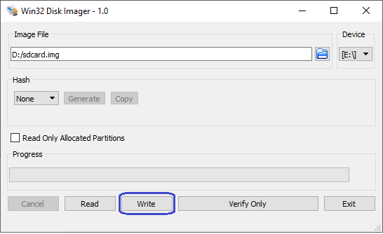

##  Introduction

### Overview

This page contains instructions on how to build Linux systems from separate components: Hardware Design, U-Boot, Arm Trusted Firmware, Linux kernel and device tree, Linux root filesystem. This is different from the Golden System Reference Design, where all the software is built through Yocto. While the instructions use Yocto for building the root file system, alternatives could be used there, such as the buildroot utility for example.

The key differences versus the GSRD are:

 * Fabric is configured from U-Boot directly with the rbf file, with `fpga load` command, instead of using the `bootm` command with the core.rbf part of the kernel.itb file
 * Single image boot is disabled in U-Boot, and it boots directly with the slected boot source, not trying them all
 * The applications and drivers form `meta-intel-fpga-refdes` are not included. That includes acessing GPIOs in the fabric for LEDs, pushbuttons, dip switches, the webserver running on the board, etc.

The following scenarios are covered:

* HPS Enablement Board: boot from SD card, and boot from QSPI
* HPS NAND Board: boot from eMMC flash
* HPS Test Board: boot from SD card

The instructions on this page are based on the [GSRD](https://altera-fpga.github.io/rel-25.1/embedded-designs/agilex-5/e-series/premium/gsrd/ug-gsrd-agx5e-premium/).

### Prerequisites

The following are required to be able to fully exercise the guides from this page:

* [Altera&reg; Agilex&trade; 5 FPGA E-Series 065B Premium Development Kit](https://www.intel.com/content/www/us/en/products/details/fpga/development-kits/agilex/a5e065b-premium.html), ordering code DK-A5E065BB32AES1.
  * HPS Enablement  Expansion Board. Included with the development kit
  * HPS NAND Board. Enables eMMC storage for HPS. Orderable separately
  * HPS Test Board. Supports SD card boot, and external Arm tracing. Orderable separately
  * Mini USB Cable. Included with the development kit
  * Micro USB Cable. Included with the development kit
  * Ethernet Cable. Included with the development kit
  * Micro SD card and USB card writer. Included with the development kit
* Host PC with
  * 64 GB of RAM or more
  * Linux OS installed. Ubuntu 22.04LTS was used to create this page, other versions and distributions may work too
  * Serial terminal (for example GtkTerm or Minicom on Linux and TeraTerm or PuTTY on Windows)
  * Altera&reg; Quartus<sup>&reg;</sup> Prime Pro Edition Version 25.1 
  * TFTP server. This used to download the eMMC binaries to board to be flashed by U-Boot
* Local Ethernet network, with DHCP server
* Internet connection. For downloading the files.

### Component Versions

Altera&reg; Quartus<sup>&reg;</sup> Prime Pro Edition Version 25.1 and the following software component versions are used to build the GSRD: 

| Component | Location | Branch | Commit ID/Tag |
| :-- | :-- | :-- | :-- |
| GHRD | [https://github.com/altera-fpga/ghrd-socfpga](https://github.com/altera-fpga/ghrd-socfpga) | master | QPDS25.1_REL_GSRD_PR |
| Linux | [https://github.com/altera-fpga/linux-socfpga](https://github.com/altera-fpga/linux-socfpga) | socfpga-6.12.11-lts | QPDS25.1_REL_GSRD_PR |
| Arm Trusted Firmware | [https://github.com/altera-fpga/arm-trusted-firmware](https://github.com/altera-fpga/arm-trusted-firmware) | socfpga_v2.12.0 | QPDS25.1_REL_GSRD_PR |
| U-Boot | [https://github.com/altera-fpga/u-boot-socfpga](https://github.com/altera-fpga/u-boot-socfpga) | socfpga_v2025.01 | QPDS25.1_REL_GSRD_PR |
| Yocto Project | [https://git.yoctoproject.org/poky](https://git.yoctoproject.org/poky) | styhead | latest | 
| Yocto Project: meta-intel-fpga | [https://git.yoctoproject.org/meta-intel-fpga](https://git.yoctoproject.org/meta-intel-fpga) | styhead | latest |
| Yocto Project: meta-intel-fpga-refdes | [https://github.com/altera-fpga/meta-intel-fpga-refdes](https://github.com/altera-fpga/meta-intel-fpga-refdes) | styhead | QPDS25.1_REL_GSRD_PR |

### Development Kit

Refer to [Development Kit](https://altera-fpga.github.io/rel-25.1/embedded-designs/agilex-5/e-series/premium/gsrd/ug-gsrd-agx5e-premium/#development-kit) for details about the board, including how to install the HPS Boards, and how to set MSEL dispswitches.

### Release Notes

Refer to [Release Notes](https://altera-fpga.github.io/rel-25.1/embedded-designs/agilex-5/e-series/premium/gsrd/ug-gsrd-agx5e-premium/#release-contents) for release readiness information and known issues.


## HPS Enablement Board

This section demonstrates how to build a Linux system from separate components, targetting the HPS Enablement Board. Both booting from SD card and booting from QSPI are covered.


### Boot from SD Card 


<h4>Setup Environment</h4>


1\. Create the top folder to store all the build artifacts:


```bash
sudo rm -rf agilex5_boot.enablement
mkdir agilex5_boot.enablement
cd agilex5_boot.enablement
export TOP_FOLDER=`pwd`
```


Download the compiler toolchain, add it to the PATH variable, to be used by the GHRD makefile to build the HPS Debug FSBL:


```bash
cd $TOP_FOLDER
wget https://developer.arm.com/-/media/Files/downloads/gnu/11.2-2022.02/binrel/\
gcc-arm-11.2-2022.02-x86_64-aarch64-none-linux-gnu.tar.xz
tar xf gcc-arm-11.2-2022.02-x86_64-aarch64-none-linux-gnu.tar.xz
rm -f gcc-arm-11.2-2022.02-x86_64-aarch64-none-linux-gnu.tar.xz
export PATH=`pwd`/gcc-arm-11.2-2022.02-x86_64-aarch64-none-linux-gnu/bin:$PATH
export ARCH=arm64
export CROSS_COMPILE=aarch64-none-linux-gnu-
```

Enable Quartus tools to be called from command line:


```bash
export QUARTUS_ROOTDIR=~/altera_pro/25.1/quartus/
export PATH=$QUARTUS_ROOTDIR/bin:$QUARTUS_ROOTDIR/linux64:$QUARTUS_ROOTDIR/../qsys/bin:$PATH
```


<h4>Build Hardware Design</h4>


```bash
cd $TOP_FOLDER
rm -rf agilex5_soc_devkit_ghrd && mkdir agilex5_soc_devkit_ghrd && cd agilex5_soc_devkit_ghrd
wget https://github.com/altera-fpga/agilex5e-ed-gsrd/releases/download/QPDS25.1_REL_GSRD_PR/a5ed065es-premium-devkit-oobe-legacy-baseline.zip
unzip a5ed065es-premium-devkit-oobe-legacy-baseline.zip
rm -f a5ed065es-premium-devkit-oobe-legacy-baseline.zip
make legacy_baseline-build
make legacy_baseline-sw-build
quartus_pfg -c output_files/legacy_baseline.sof \
  output_files/legacy_baseline_hps_debug.sof \
  -o hps_path=software/hps_debug/hps_wipe.ihex
cd ..
```

The following files are created:

* `$TOP_FOLDER/agilex5_soc_devkit_ghrd/output_files/legacy_baseline.sof`
* `$TOP_FOLDER/agilex5_soc_devkit_ghrd/output_files/legacy_baseline_hps_debug.sof`


<h4>Build Arm Trusted Firmware</h4>


```bash
cd $TOP_FOLDER
rm -rf arm-trusted-firmware
git clone -b QPDS25.1_REL_GSRD_PR https://github.com/altera-fpga/arm-trusted-firmware
cd arm-trusted-firmware
make -j 48 PLAT=agilex5 bl31 
cd ..
```

The following file is created:

* `$TOP_FOLDER/arm-trusted-firmware/build/agilex5/release/bl31.bin`


<h4>Build U-Boot</h4>


```bash
cd $TOP_FOLDER
rm -rf u-boot-socfpga
git clone -b QPDS25.1_REL_GSRD_PR https://github.com/altera-fpga/u-boot-socfpga
cd u-boot-socfpga 
# enable dwarf4 debug info, for compatibility with arm ds
sed -i 's/PLATFORM_CPPFLAGS += -D__ARM__/PLATFORM_CPPFLAGS += -D__ARM__ -gdwarf-4/g' arch/arm/config.mk
# only boot from SD, do not try QSPI and NAND
sed -i 's/u-boot,spl-boot-order.*/u-boot\,spl-boot-order = \&mmc;/g' arch/arm/dts/socfpga_agilex5_socdk-u-boot.dtsi
# disable NAND in the device tree
sed -i '/&nand {/!b;n;c\\tstatus = "disabled";' arch/arm/dts/socfpga_agilex5_socdk-u-boot.dtsi
# link to atf
ln -s ../arm-trusted-firmware/build/agilex5/release/bl31.bin 
# create configuration custom file. 
cat << EOF > config-fragment
# use Image instead of kernel.itb
CONFIG_BOOTFILE="Image"
# disable NAND/UBI related settings from defconfig. 
CONFIG_NAND_BOOT=n
CONFIG_SPL_NAND_SUPPORT=n
CONFIG_CMD_NAND_TRIMFFS=n
CONFIG_CMD_NAND_LOCK_UNLOCK=n
CONFIG_NAND_DENALI_DT=n
CONFIG_SYS_NAND_U_BOOT_LOCATIONS=n
CONFIG_SPL_NAND_FRAMEWORK=n
CONFIG_CMD_NAND=n
CONFIG_MTD_RAW_NAND=n
CONFIG_CMD_UBI=n
CONFIG_CMD_UBIFS=n
CONFIG_MTD_UBI=n
CONFIG_ENV_IS_IN_UBI=n
CONFIG_UBI_SILENCE_MSG=n
CONFIG_UBIFS_SILENCE_MSG=n
# disable distroboot and use specific boot command. 
CONFIG_DISTRO_DEFAULTS=n
CONFIG_HUSH_PARSER=y
CONFIG_SYS_PROMPT_HUSH_PS2="> "
CONFIG_USE_BOOTCOMMAND=y
CONFIG_BOOTCOMMAND="load mmc 0:1 \${loadaddr} ghrd.core.rbf; fpga load 0 \${loadaddr} \${filesize};bridge enable; mmc rescan; fatload mmc 0:1 82000000 Image;fatload mmc 0:1 86000000 socfpga_agilex5_socdk.dtb;setenv bootargs console=ttyS0,115200 root=\${mmcroot} rw rootwait;booti 0x82000000 - 0x86000000"
CONFIG_CMD_FAT=y
CONFIG_CMD_FS_GENERIC=y
CONFIG_DOS_PARTITION=y
CONFIG_SPL_DOS_PARTITION=y
CONFIG_CMD_PART=y
CONFIG_SPL_CRC32=y
CONFIG_LZO=y
CONFIG_CMD_DHCP=y
# enable more QSPI flash manufacturers
CONFIG_SPI_FLASH_MACRONIX=y
CONFIG_SPI_FLASH_GIGADEVICE=y
CONFIG_SPI_FLASH_WINBOND=y
CONFIG_SPI_FLASH_ISSI=y
EOF
# build U-Boot
make clean && make mrproper
make socfpga_agilex5_defconfig 
# use created custom configuration file to merge with the default configuration obtained in .config file. 
./scripts/kconfig/merge_config.sh -O . -m .config config-fragment
make -j 64
cd ..
```

The following files are created:

* `$TOP_FOLDER/u-boot-socfpga/u-boot.itb`
* `$TOP_FOLDER/u-boot-socfpga/spl/u-boot-spl-dtb.hex`


<h4>Build QSPI Image</h4>


```bash
cd $TOP_FOLDER
quartus_pfg -c agilex5_soc_devkit_ghrd/output_files/legacy_baseline.sof ghrd.jic \
-o device=MT25QU128 \
-o flash_loader=A5ED065BB32AE6SR0 \
-o hps_path=$TOP_FOLDER/u-boot-socfpga/spl/u-boot-spl-dtb.hex \
-o mode=ASX4 \
-o hps=1

```

The following file is created:

* `$TOP_FOLDER/ghrd.hps.jic`


<h4>Build HPS RBF</h4>

This is an optional step, in which you can build an HPS RBF file, which can be used to configure the HPS through JTAG instead of QSPI though the JIC file.


```bash
cd $TOP_FOLDER
quartus_pfg -c agilex5_soc_devkit_ghrd/output_files/legacy_baseline.sof ghrd.rbf \
-o hps_path=$TOP_FOLDER/u-boot-socfpga/spl/u-boot-spl-dtb.hex \
-o hps=1
```

The following file is created:

* `$TOP_FOLDER/ghrd.hps.rbf


<h4>Build Linux</h4>


```bash
cd $TOP_FOLDER
rm -rf linux-socfpga
git clone -b QPDS25.1_REL_GSRD_PR https://github.com/altera-fpga/linux-socfpga
cd linux-socfpga
cat << EOF > config-fragment-agilex5
# Enable Ethernet connectivity so we can get an IP address
CONFIG_MARVELL_PHY=y
EOF
make defconfig
# Apply custom Configs in file
./scripts/kconfig/merge_config.sh -O ./ ./.config ./config-fragment-agilex5
make oldconfig
make -j 64 Image && make intel/socfpga_agilex5_socdk.dtb
```

The following files are created:

* `$TOP_FOLDER/linux-socfpga/arch/arm64/boot/dts/intel/socfpga_agilex5_socdk.dtb`
* `$TOP_FOLDER/linux-socfpga/arch/arm64/boot/Image`


<h4>Install Yocto Dependencies</h4>

1\. Make sure you have Yocto system requirements met: https://docs.yoctoproject.org/5.0.1/ref-manual/system-requirements.html#supported-linux-distributions.

The command to install the required packages on Ubuntu 22.04 is:

```bash
sudo apt-get update
sudo apt-get upgrade
sudo apt-get install openssh-server mc libgmp3-dev libmpc-dev gawk wget git diffstat unzip texinfo gcc \
build-essential chrpath socat cpio python3 python3-pip python3-pexpect xz-utils debianutils iputils-ping \
python3-git python3-jinja2 libegl1-mesa libsdl1.2-dev pylint xterm python3-subunit mesa-common-dev zstd \
liblz4-tool git fakeroot build-essential ncurses-dev xz-utils libssl-dev bc flex libelf-dev bison xinetd \
tftpd tftp nfs-kernel-server libncurses5 libc6-i386 libstdc++6:i386 libgcc++1:i386 lib32z1 \
device-tree-compiler curl mtd-utils u-boot-tools net-tools swig -y
```

On Ubuntu 22.04 you will also need to point the /bin/sh to /bin/bash, as the default is a link to /bin/dash:

```bash
 sudo ln -sf /bin/bash /bin/sh
```

**Note**: You can also use a Docker container to build the Yocto recipes, refer to https://rocketboards.org/foswiki/Documentation/DockerYoctoBuild for details. When using a Docker container, it does not matter what Linux distribution or packages you have installed on your host, as all dependencies are provided by the Docker container.

<h4>Build Rootfs</h4>


```bash
cd $TOP_FOLDER
rm -rf yocto && mkdir yocto && cd yocto
git clone -b styhead https://git.yoctoproject.org/poky
git clone -b styhead https://git.yoctoproject.org/meta-intel-fpga
git clone -b styhead https://github.com/openembedded/meta-openembedded
source poky/oe-init-build-env ./build
echo 'MACHINE = "agilex5_dk_a5e065bb32aes1"' >> conf/local.conf
echo 'BBLAYERS += " ${TOPDIR}/../meta-intel-fpga "' >> conf/bblayers.conf
echo 'BBLAYERS += " ${TOPDIR}/../meta-openembedded/meta-oe "' >> conf/bblayers.conf
echo 'CORE_IMAGE_EXTRA_INSTALL += "openssh gdbserver"' >> conf/local.conf
bitbake core-image-minimal
```

The following file is created:

* `$TOP_FOLDER/yocto/build/tmp/deploy/images/agilex5_dk_a5e065bb32aes1/core-image-minimal-agilex5_dk_a5e065bb32aes1.rootfs.tar.gz`


<h4>Create SD Card Image</h4>


```bash
cd $TOP_FOLDER
sudo rm -rf sd_card && mkdir sd_card && cd sd_card
wget https://releases.rocketboards.org/release/2020.11/gsrd/tools/make_sdimage_p3.py
sed -i 's/\"\-F 32\",//g' make_sdimage_p3.py
chmod +x make_sdimage_p3.py
mkdir fatfs &&  cd fatfs
cp $TOP_FOLDER/ghrd.core.rbf .
cp $TOP_FOLDER/u-boot-socfpga/u-boot.itb .
cp $TOP_FOLDER/linux-socfpga/arch/arm64/boot/Image .
cp $TOP_FOLDER/linux-socfpga/arch/arm64/boot/dts/intel/socfpga_agilex5_socdk.dtb .
cd ..
mkdir rootfs && cd rootfs
sudo tar xf $TOP_FOLDER/yocto/build/tmp/deploy/images/agilex5_dk_a5e065bb32aes1/core-image-minimal-agilex5_dk_a5e065bb32aes1.rootfs.tar.gz
cd ..
sudo python3 make_sdimage_p3.py -f \
-P fatfs/*,num=1,format=fat32,size=64M \
-P rootfs/*,num=2,format=ext3,size=64M \
-s 140M \
-n sdcard.img
cd ..
```

The following file is created:

* `$TOP_FOLDER/sd_card/sdcard.img`

<h4>Write SD Card</h4>

Write the SD card image `sd_card/sdcard.img` to the micro SD card using the included USB writer:

- On Linux, use the `dd` utility as shown next:
```bash
	# Determine the device asociated with the SD card on the host computer.	
	cat /proc/partitions
	# This will return for example /dev/sdx
	# Use dd to write the image in the corresponding device
	sudo dd if=sdcard.img of=/dev/sdx bs=1M
	# Flush the changes to the SD card
	sync
```
- On Windows, use the Win32DiskImager program, available at [https://sourceforge.net/projects/win32diskimager](https://sourceforge.net/projects/win32diskimager). Write the image as shown in the next figure:
 

<h4>Write QSPI Flash</h4>

1\. Power down board

2\. Set MSEL dipswitch SW27 to JTAG: OFF-OFF-OFF-OFF

3\. Power up the board

4\. Write JIC image to QSPI:

```bash
cd $TOP_FOLDER
jtagconfig --setparam 1 JtagClock 16M
quartus_pgm -c 1 -m jtag -o "pvi;ghrd.hps.jic"
```

<h4>Boot Linux</h4>

1\. Power down board

2\. Set MSEL dipswitch SW27 to ASX4 (QSPi): OFF-ON-ON-OFF

3\. Power up the board

4\. Wait for Linux to boot, use `root` as user name, and no password wil be requested.


### Boot from QSPI


This section demonstrates how to build Linux system from separate components, which boots from QSPI.

**NOTE:**  This section assumes that the [Boot from SD Card](#boot-from-sd-card) section has been already built and the environment setup in that section is still available.

This section presents how to build the binaries and boot from QSPI with the HPS Enablement Board.
While the example is based on the GSRD, it contains the following differences:

* U-Boot tries to boot only from QSPI flash, does not try SD card
* U-Boot does not use a script to boot, instead it used the `BOOTCMD` environment variable directly
* kernel.itb file contains only one set of core.rbf, kernel and device tree files, targeted for this scenario

1\. Prepare the top folder


```bash
rm -rf $TOP_FOLDER/qspi-boot
mkdir $TOP_FOLDER/qspi-boot
```


2\. Build U-Boot:


```bash
cd $TOP_FOLDER/qspi-boot
rm -rf u-boot-socfpga
git clone -b QPDS25.1_REL_GSRD_PR https://github.com/altera-fpga/u-boot-socfpga
cd u-boot-socfpga 
# enable dwarf4 debug info, for compatibility with arm ds
sed -i 's/PLATFORM_CPPFLAGS += -D__ARM__/PLATFORM_CPPFLAGS += -D__ARM__ -gdwarf-4/g' arch/arm/config.mk
# only boot from QSPI
sed -i 's/u-boot,spl-boot-order.*/u-boot\,spl-boot-order = \&flash0;/g' arch/arm/dts/socfpga_agilex5_socdk-u-boot.dtsi
# disable NAND in the device tree
sed -i '/&nand {/!b;n;c\\tstatus = "disabled";' arch/arm/dts/socfpga_agilex5_socdk-u-boot.dtsi
# link to atf
ln -s $TOP_FOLDER/arm-trusted-firmware/build/agilex5/release/bl31.bin 
# create configuration custom file. 
cat << EOF > config-fragment
# mtd info
CONFIG_MTDIDS_DEFAULT="nor0=nor0"
CONFIG_MTDPARTS_DEFAULT="mtdparts=nor0:66m(u-boot),190m(root)"
# use Image instead of kernel.itb
CONFIG_BOOTFILE="Image"
# do not keep env on sd card
CONFIG_ENV_IS_IN_FAT=n
# disable NAND related settings from defconfig
CONFIG_NAND_BOOT=n
CONFIG_SPL_NAND_SUPPORT=n
CONFIG_CMD_NAND_TRIMFFS=n
CONFIG_CMD_NAND_LOCK_UNLOCK=n
CONFIG_NAND_DENALI_DT=n
CONFIG_SYS_NAND_U_BOOT_LOCATIONS=n
CONFIG_SPL_NAND_FRAMEWORK=n
CONFIG_CMD_NAND=n
CONFIG_MTD_RAW_NAND=n
# disable distroboot and use specific boot command. 
CONFIG_DISTRO_DEFAULTS=n
CONFIG_HUSH_PARSER=y
CONFIG_SYS_PROMPT_HUSH_PS2="> "
CONFIG_USE_BOOTCOMMAND=y
CONFIG_BOOTCOMMAND="mtdparts;ubi part root;ubi readvol \${loadaddr} kernel;ubi detach;setenv bootargs earlycon panic=-1 ubi.mtd=1 root=ubi0:rootfs rootfstype=ubifs rw rootwait;bootm \${loadaddr}#board-0;"
CONFIG_CMD_FAT=y
CONFIG_CMD_FS_GENERIC=y
CONFIG_DOS_PARTITION=y
CONFIG_SPL_DOS_PARTITION=y
CONFIG_CMD_PART=y
CONFIG_SPL_CRC32=y
CONFIG_LZO=y
CONFIG_CMD_DHCP=y
# enable more QSPI flash manufacturers
CONFIG_SPI_FLASH_MACRONIX=y
CONFIG_SPI_FLASH_GIGADEVICE=y
CONFIG_SPI_FLASH_WINBOND=y
CONFIG_SPI_FLASH_ISSI=y
EOF
# build U-Boot
make clean && make mrproper
make socfpga_agilex5_defconfig 
# use created custom configuration file to merge with the default configuration obtained in .config file. 
./scripts/kconfig/merge_config.sh -O . -m .config config-fragment
make -j 64
cd ..
```

The following files are created:

* `$TOP_FOLDER/qspi-boot/u-boot-socfpga/u-boot.itb`
* `$TOP_FOLDER/qspi-boot/u-boot-socfpga/spl/u-boot-spl-dtb.hex`

3\. Build `kernel.itb` FIT file containing kernel, device tree and fpga fabric configuration file:


```bash
cd $TOP_FOLDER/qspi-boot
rm -f core.rbf devicetree.dtb Image.lzma kernel.its kernel.itb
ln -s ../ghrd.core.rbf core.rbf
ln -s ../linux-socfpga/arch/arm64/boot/dts/intel/socfpga_agilex5_socdk.dtb devicetree.dtb
xz --format=lzma --extreme -k -c ../linux-socfpga/arch/arm64/boot/Image > Image.lzma
cat << EOF > kernel.its
// SPDX-License-Identifier: GPL-2.0
/*
 * Copyright (C) 2024 Intel Corporation
 *
 */

/dts-v1/;

/ {
    description = "FIT image with kernel, DTB and FPGA core binary";
    #address-cells = <1>;

    images {
        kernel {
            description = "Linux Kernel";
            data = /incbin/("./Image.lzma");
            type = "kernel";
            arch = "arm64";
            os = "linux";
            compression = "lzma";
            load = <0x86000000>;
            entry = <0x86000000>;
            hash {
                algo = "crc32";
            };
        };

        fdt-0 {
            description = "Device Tree";
            data = /incbin/("./devicetree.dtb");
            type = "flat_dt";
            arch = "arm64";
            compression = "none";
            hash {
                algo = "crc32";
            };
        };

        fpga-0 {
            description = "FPGA bitstream";
            data = /incbin/("./core.rbf");
            type = "fpga";
            arch = "arm64";
            compression = "none";
            load = <0x8A000000>;
            hash {
                algo = "crc32";
            };
        };
    };

    configurations {
        default = "board-0";

        board-0 {
            description = "board_0";
            kernel = "kernel";
            fdt = "fdt-0";
            fpga = "fpga-0";
            signature {
                algo = "crc32";
                key-name-hint = "dev";
                sign-images = "fdt-0", "kernel", "fpga-0";
            };
        };
    };
};
EOF
./u-boot-socfpga/tools/mkimage -f kernel.its kernel.itb
```

The following file is created:

* `$TOP_FOLDER/qspi-boot/kernel.itb`

4\. Create U-Boot binary `u-boot.bin` with a size of exactly 2MB:


```bash
cp u-boot-socfpga/u-boot.itb .
uboot_part_size=2*1024*1024
uboot_size=`wc -c < u-boot.itb`
uboot_pad="$((uboot_part_size-uboot_size))"
truncate -s +$uboot_pad u-boot.itb
mv u-boot.itb u-boot.bin
```


5\. Build the `rootfs.ubifs` file:


```bash
rm -rf rootfs rootfs.ubifs
mkdir rootfs 
tar -xzvf $TOP_FOLDER/yocto/build/tmp/deploy/images/agilex5_dk_a5e065bb32aes1/core-image-minimal-agilex5_dk_a5e065bb32aes1.rootfs.tar.gz -C rootfs 
mkfs.ubifs -r rootfs -F -e 65408 -m 1 -c 6500 -o rootfs.ubifs 
```

The following file is created:

* `$TOP_FOLDER/qspi-boot/rootfs.ubifs`


6\. Build the `root.ubi` file:


```bash
cat << EOF > ubinize.cfg
[env]
mode=ubi
vol_id=0
vol_name=env
vol_size=256KiB
vol_type=dynamic

[script]
mode=ubi
vol_id=1
vol_name=script
vol_size=128KiB 
vol_type=dynamic

[kernel]
mode=ubi
image=kernel.itb
vol_id=2
vol_name=kernel
vol_size=24MiB
vol_type=dynamic

[dtb]
mode=ubi
vol_id=3    
vol_name=dtb   
vol_size=256KiB 
vol_type=dynamic

[rootfs]
mode=ubi
image=rootfs.ubifs
vol_id=4
vol_name=rootfs
vol_type=dynamic
vol_size=160MiB
vol_flag=autoresize
EOF
ubinize -o root.ubi -p 65536 -m 1 -s 1 ubinize.cfg
```

The following file is created:

* `$TOP_FOLDER/qspi-boot/root.ubi`

7\. Build the QSPI flash image:


```bash
ln -s $TOP_FOLDER/agilex5_soc_devkit_ghrd/output_files/legacy_baseline.sof fpga.sof
ln -s u-boot-socfpga/spl/u-boot-spl-dtb.hex spl.hex
ln -s root.ubi hps.bin
cat << EOF > flash_image.pfg
<pfg version="1">
    <settings custom_db_dir="./" mode="ASX4"/>
    <output_files>
        <output_file name="flash_image" hps="1" directory="./" type="PERIPH_JIC">
            <file_options/>
            <secondary_file type="MAP" name="flash_image_jic">
                <file_options/>
            </secondary_file>
            <flash_device_id>Flash_Device_1</flash_device_id>
        </output_file>
    </output_files>
    <bitstreams>
        <bitstream id="Bitstream_1">
            <path hps_path="spl.hex">fpga.sof</path>
    </bitstream>
    </bitstreams>
    <raw_files>
        <raw_file bitswap="1" type="RBF" id="Raw_File_1">u-boot.bin</raw_file>
        <raw_file bitswap="1" type="RBF" id="Raw_File_2">hps.bin</raw_file>
    </raw_files>
    <flash_devices>
        <flash_loader>A5ED065BB32AE6SR0</flash_loader>
        <flash_device type="MT25QU02G" id="Flash_Device_1">
            <partition reserved="1" fixed_s_addr="1" s_addr="0x00000000" e_addr="0x001FFFFF" fixed_e_addr="1" id="BOOT_INFO" size="0"/>
            <partition reserved="0" fixed_s_addr="0" s_addr="auto" e_addr="auto" fixed_e_addr="0" id="P1" size="0"/>
            <partition reserved="0" fixed_s_addr="0" s_addr="0x04000000" e_addr="auto" fixed_e_addr="0" id="UBOOT" size="0"/>
            <partition reserved="0" fixed_s_addr="0" s_addr="0x04200000" e_addr="auto" fixed_e_addr="0" id="HPS" size="0"/>
        </flash_device>
    </flash_devices>
    <assignments>
        <assignment page="0" partition_id="P1">
            <bitstream_id>Bitstream_1</bitstream_id>
        </assignment>
        <assignment page="0" partition_id="UBOOT">
            <raw_file_id>Raw_File_1</raw_file_id>
        </assignment>
        <assignment page="0" partition_id="HPS">
            <raw_file_id>Raw_File_2</raw_file_id>
        </assignment>
    </assignments>
</pfg>
EOF
quartus_pfg -c flash_image.pfg
```

The following file is created:

* `$TOP_FOLDER/qspi-boot/flash_image.hps.jic`

<h4>Write QSPI Flash</h4>

1\. Power down board

2\. Set MSEL dipswitch SW27 to JTAG: OFF-OFF-OFF-OFF

3\. Power up the board

4\. Write JIC image to QSPI:

```bash
cd $TOP_FOLDER
jtagconfig --setparam 1 JtagClock 16M
quartus_pgm -c 1 -m jtag -o "qspi-boot/flash_image.hps.jic"
```
Note: You need to wipe the micro SD card or remove it from the board before start running.

<h4>Boot Linux</h4>

1\. Power down board

2\. Set MSEL dipswitch SW27 to ASX4 (QSPi): OFF-ON-ON-OFF

3\. Power up the board

4\. Wait for Linux to boot, use `root` as user name, and no password wil be requested.


## HPS NAND Board

This section demonstrates how to build a Linux system from separate components, targetting the HPS NAND Board. Boot source is eMMC Flash.

### Boot from eMMC


<h4>Setup Environment</h4>


1\. Create the top folder to store all the build artifacts:


```bash
sudo rm -rf agilex5_boot.emmc
mkdir agilex5_boot.emmc
cd agilex5_boot.emmc
export TOP_FOLDER=`pwd`
```


Download the compiler toolchain, add it to the PATH variable, to be used by the GHRD makefile to build the HPS Debug FSBL:


```bash
cd $TOP_FOLDER
wget https://developer.arm.com/-/media/Files/downloads/gnu/11.2-2022.02/binrel/\
gcc-arm-11.2-2022.02-x86_64-aarch64-none-linux-gnu.tar.xz
tar xf gcc-arm-11.2-2022.02-x86_64-aarch64-none-linux-gnu.tar.xz
rm -f gcc-arm-11.2-2022.02-x86_64-aarch64-none-linux-gnu.tar.xz
export PATH=`pwd`/gcc-arm-11.2-2022.02-x86_64-aarch64-none-linux-gnu/bin:$PATH
export ARCH=arm64
export CROSS_COMPILE=aarch64-none-linux-gnu-
```

Enable Quartus tools to be called from command line:


```bash
export QUARTUS_ROOTDIR=~/altera_pro/25.1/quartus/
export PATH=$QUARTUS_ROOTDIR/bin:$QUARTUS_ROOTDIR/linux64:$QUARTUS_ROOTDIR/../qsys/bin:$PATH
```


<h4>Build Hardware Design</h4>


```bash
cd $TOP_FOLDER
rm -rf agilex5_soc_devkit_ghrd && mkdir agilex5_soc_devkit_ghrd && cd agilex5_soc_devkit_ghrd
wget https://github.com/altera-fpga/agilex5e-ed-gsrd/releases/download/QPDS25.1_REL_GSRD_PR/a5ed065es-premium-devkit-emmc-legacy-baseline.zip
unzip a5ed065es-premium-devkit-emmc-legacy-baseline.zip
rm -f a5ed065es-premium-devkit-emmc-legacy-baseline.zip
make legacy_baseline-build
make legacy_baseline-sw-build
quartus_pfg -c output_files/legacy_baseline.sof \
  output_files/legacy_baseline_hps_debug.sof \
  -o hps_path=software/hps_debug/hps_wipe.ihex
cd ..
```

The following files are created:

* `$TOP_FOLDER/agilex5_soc_devkit_ghrd/output_files/legacy_baseline.sof`
* `$TOP_FOLDER/agilex5_soc_devkit_ghrd/output_files/legacy_baseline_hps_debug.sof`


<h4>Build Arm Trusted Firmware</h4>


```bash
cd $TOP_FOLDER
rm -rf arm-trusted-firmware
git clone -b QPDS25.1_REL_GSRD_PR https://github.com/altera-fpga/arm-trusted-firmware
cd arm-trusted-firmware
make -j 48 PLAT=agilex5 bl31 
cd ..
```

The following file is created:

* `$TOP_FOLDER/arm-trusted-firmware/build/agilex5/release/bl31.bin`


<h4>Build U-Boot</h4>


```bash
cd $TOP_FOLDER
rm -rf u-boot-socfpga
git clone -b QPDS25.1_REL_GSRD_PR https://github.com/altera-fpga/u-boot-socfpga
cd u-boot-socfpga 
# enable dwarf4 debug info, for compatibility with arm ds
sed -i 's/PLATFORM_CPPFLAGS += -D__ARM__/PLATFORM_CPPFLAGS += -D__ARM__ -gdwarf-4/g' arch/arm/config.mk
# only boot from SD, do not try QSPI and NAND
sed -i 's/u-boot,spl-boot-order.*/u-boot\,spl-boot-order = \&mmc;/g' arch/arm/dts/socfpga_agilex5_socdk-u-boot.dtsi
# disable NAND in the device tree
sed -i '/&nand {/!b;n;c\\tstatus = "disabled";' arch/arm/dts/socfpga_agilex5_socdk-u-boot.dtsi
# swap gmac0 and gmac2
sed -i '/&gmac2/ { N; s/status = "okay"/status = "disabled"/; }' arch/arm/dts/socfpga_agilex5_socdk.dts
sed -i '/&gmac0/ { N; s/status = "disabled"/status = "okay"/; }' arch/arm/dts/socfpga_agilex5_socdk.dts
# link to atf
ln -s ../arm-trusted-firmware/build/agilex5/release/bl31.bin 
# create configuration custom file. 
cat << EOF > config-fragment
# use Image instead of kernel.itb
CONFIG_BOOTFILE="Image"
# disable NAND/UBI related settings from defconfig. 
CONFIG_NAND_BOOT=n
CONFIG_SPL_NAND_SUPPORT=n
CONFIG_CMD_NAND_TRIMFFS=n
CONFIG_CMD_NAND_LOCK_UNLOCK=n
CONFIG_NAND_DENALI_DT=n
CONFIG_SYS_NAND_U_BOOT_LOCATIONS=n
CONFIG_SPL_NAND_FRAMEWORK=n
CONFIG_CMD_NAND=n
CONFIG_MTD_RAW_NAND=n
CONFIG_CMD_UBI=n
CONFIG_CMD_UBIFS=n
CONFIG_MTD_UBI=n
CONFIG_ENV_IS_IN_UBI=n
CONFIG_UBI_SILENCE_MSG=n
CONFIG_UBIFS_SILENCE_MSG=n
# disable distroboot and use specific boot command. 
CONFIG_DISTRO_DEFAULTS=n
CONFIG_HUSH_PARSER=y
CONFIG_SYS_PROMPT_HUSH_PS2="> "
CONFIG_USE_BOOTCOMMAND=y
CONFIG_BOOTCOMMAND="load mmc 0:1 \${loadaddr} ghrd.core.rbf; fpga load 0 \${loadaddr} \${filesize};bridge enable; mmc rescan; fatload mmc 0:1 82000000 Image;fatload mmc 0:1 86000000 socfpga_agilex5_socdk_emmc.dtb;setenv bootargs console=ttyS0,115200 root=\${mmcroot} rw rootwait;booti 0x82000000 - 0x86000000"
CONFIG_CMD_FAT=y
CONFIG_CMD_FS_GENERIC=y
CONFIG_DOS_PARTITION=y
CONFIG_SPL_DOS_PARTITION=y
CONFIG_CMD_PART=y
CONFIG_SPL_CRC32=y
CONFIG_LZO=y
CONFIG_CMD_DHCP=y
# enable more QSPI flash manufacturers
CONFIG_SPI_FLASH_MACRONIX=y
CONFIG_SPI_FLASH_GIGADEVICE=y
CONFIG_SPI_FLASH_WINBOND=y
CONFIG_SPI_FLASH_ISSI=y
EOF
# build U-Boot
make clean && make mrproper
make socfpga_agilex5_defconfig 
# use created custom configuration file to merge with the default configuration obtained in .config file. 
./scripts/kconfig/merge_config.sh -O . -m .config config-fragment
make -j 64
cd ..
```

The following files are created:

* `$TOP_FOLDER/u-boot-socfpga/u-boot.itb`
* `$TOP_FOLDER/u-boot-socfpga/spl/u-boot-spl-dtb.hex`


<h4>Build QSPI Image</h4>


```bash
cd $TOP_FOLDER
quartus_pfg -c agilex5_soc_devkit_ghrd/output_files/legacy_baseline.sof ghrd.jic \
-o device=MT25QU128 \
-o flash_loader=A5ED065BB32AE6SR0 \
-o hps_path=$TOP_FOLDER/u-boot-socfpga/spl/u-boot-spl-dtb.hex \
-o mode=ASX4 \
-o hps=1

```

The following file is created:

* `$TOP_FOLDER/ghrd.hps.jic`


<h4>Build HPS RBF</h4>

This is an optional step, in which you can build an HPS RBF file, which can be used to configure the HPS through JTAG instead of QSPI though the JIC file.

```bash
cd $TOP_FOLDER
quartus_pfg -c agilex5_soc_devkit_ghrd/output_files/legacy_baseline.sof ghrd.rbf \
-o hps_path=$TOP_FOLDER/u-boot-socfpga/spl/u-boot-spl-dtb.hex \
-o hps=1
```

The following file is created:

* `$TOP_FOLDER/ghrd.hps.rbf


<h4>Build Linux</h4>


```bash
cd $TOP_FOLDER
rm -rf linux-socfpga
git clone -b QPDS25.1_REL_GSRD_PR https://github.com/altera-fpga/linux-socfpga
cd linux-socfpga
make defconfig 
make -j 64 Image && make intel/socfpga_agilex5_socdk_emmc.dtb 
```

The following files are created:

* `$TOP_FOLDER/linux-socfpga/arch/arm64/boot/dts/intel/socfpga_agilex5_socdk_emmc.dtb`
* `$TOP_FOLDER/linux-socfpga/arch/arm64/boot/Image`


<h4>Build Rootfs</h4>


```bash
cd $TOP_FOLDER
rm -rf yocto && mkdir yocto && cd yocto
git clone -b styhead https://git.yoctoproject.org/poky
git clone -b styhead https://git.yoctoproject.org/meta-intel-fpga
git clone -b styhead https://github.com/openembedded/meta-openembedded
# work around issue
echo 'do_package_qa[noexec] = "1"' >> $(find meta-intel-fpga -name linux-socfpga_6.6.bb)
source poky/oe-init-build-env ./build
echo 'MACHINE = "agilex5_dk_a5e065bb32aes1"' >> conf/local.conf
echo 'BBLAYERS += " ${TOPDIR}/../meta-intel-fpga "' >> conf/bblayers.conf
echo 'BBLAYERS += " ${TOPDIR}/../meta-openembedded/meta-oe "' >> conf/bblayers.conf
echo 'CORE_IMAGE_EXTRA_INSTALL += "openssh gdbserver"' >> conf/local.conf
bitbake core-image-minimal
```

The following file is created:

* `$TOP_FOLDER/yocto/build/tmp/deploy/images/agilex5_dk_a5e065bb32aes1/core-image-minimal-agilex5_dk_a5e065bb32aes1.rootfs.tar.gz`


<h4>Create eMMC Image</h4>


```bash
cd $TOP_FOLDER
sudo rm -rf sd_card && mkdir sd_card && cd sd_card
wget https://releases.rocketboards.org/release/2020.11/gsrd/tools/make_sdimage_p3.py
sed -i 's/\"\-F 32\",//g' make_sdimage_p3.py
chmod +x make_sdimage_p3.py
mkdir fatfs &&  cd fatfs
cp $TOP_FOLDER/ghrd.core.rbf .
cp $TOP_FOLDER/u-boot-socfpga/u-boot.itb .
cp $TOP_FOLDER/linux-socfpga/arch/arm64/boot/Image .
cp $TOP_FOLDER/linux-socfpga/arch/arm64/boot/dts/intel/socfpga_agilex5_socdk_emmc.dtb .
cd ..
mkdir rootfs && cd rootfs
sudo tar xf $TOP_FOLDER/yocto/build/tmp/deploy/images/agilex5_dk_a5e065bb32aes1/core-image-minimal-agilex5_dk_a5e065bb32aes1.rootfs.tar.gz
cd ..
sudo python3 make_sdimage_p3.py -f \
-P fatfs/*,num=1,format=fat32,size=64M \
-P rootfs/*,num=2,format=ext3,size=64M \
-s 140M \
-n sdcard.img
cd ..
```

The following file is created:

* `$TOP_FOLDER/sd_card/sdcard.img`


<h4>Create Helper JIC</h4>
In this section we are building a helper JIC which will boot from QSPI and will allow us to program the eMMC from U-Boot.

1\. Create the jic helper folder to contain all related build artifacts:


```bash
rm -rf $TOP_FOLDER/helper-jic
mkdir $TOP_FOLDER/helper-jic
```


2\. Build a modified U-Boot, which boots from QSPI and stops at command line prompt:


```bash
cd $TOP_FOLDER/helper-jic
rm -rf u-boot-socfpga
git clone -b QPDS25.1_REL_GSRD_PR https://github.com/altera-fpga/u-boot-socfpga
cd u-boot-socfpga 
# enable dwarf4 debug info, for compatibility with arm ds
sed -i 's/PLATFORM_CPPFLAGS += -D__ARM__/PLATFORM_CPPFLAGS += -D__ARM__ -gdwarf-4/g' arch/arm/config.mk
# only boot from SD, do not try QSPI and NAND
sed -i 's/u-boot,spl-boot-order.*/u-boot\,spl-boot-order = \&flash0;/g' arch/arm/dts/socfpga_agilex5_socdk-u-boot.dtsi
# disable NAND in the device tree
sed -i '/&nand {/!b;n;c\\tstatus = "disabled";' arch/arm/dts/socfpga_agilex5_socdk-u-boot.dtsi
# swap gmac0 and gmac2
sed -i '/&gmac2/ { N; s/status = "okay"/status = "disabled"/; }' arch/arm/dts/socfpga_agilex5_socdk.dts
sed -i '/&gmac0/ { N; s/status = "disabled"/status = "okay"/; }' arch/arm/dts/socfpga_agilex5_socdk.dts
# link to atf
ln -s $TOP_FOLDER/arm-trusted-firmware/build/agilex5/release/bl31.bin 
# create configuration custom file. 
cat << EOF > config-fragment
# use Image instead of kernel.itb
CONFIG_BOOTFILE="Image"
# disable NAND/UBI related settings from defconfig. 
CONFIG_NAND_BOOT=n
CONFIG_SPL_NAND_SUPPORT=n
CONFIG_CMD_NAND_TRIMFFS=n
CONFIG_CMD_NAND_LOCK_UNLOCK=n
CONFIG_NAND_DENALI_DT=n
CONFIG_SYS_NAND_U_BOOT_LOCATIONS=n
CONFIG_SPL_NAND_FRAMEWORK=n
CONFIG_CMD_NAND=n
CONFIG_MTD_RAW_NAND=n
CONFIG_CMD_UBI=n
CONFIG_CMD_UBIFS=n
CONFIG_MTD_UBI=n
CONFIG_ENV_IS_IN_UBI=n
CONFIG_UBI_SILENCE_MSG=n
CONFIG_UBIFS_SILENCE_MSG=n
# disable distroboot and use specific boot command. 
CONFIG_DISTRO_DEFAULTS=n
CONFIG_HUSH_PARSER=y
CONFIG_SYS_PROMPT_HUSH_PS2="> "
CONFIG_USE_BOOTCOMMAND=y
CONFIG_BOOTCOMMAND="echo hello"
CONFIG_CMD_FAT=y
CONFIG_CMD_FS_GENERIC=y
CONFIG_DOS_PARTITION=y
CONFIG_SPL_DOS_PARTITION=y
CONFIG_CMD_PART=y
CONFIG_SPL_CRC32=y
CONFIG_LZO=y
CONFIG_CMD_DHCP=y
# enable more QSPI flash manufacturers
CONFIG_SPI_FLASH_MACRONIX=y
CONFIG_SPI_FLASH_GIGADEVICE=y
CONFIG_SPI_FLASH_WINBOND=y
CONFIG_SPI_FLASH_ISSI=y
# boot from QSPI
CONFIG_ENV_IS_IN_FAT=n
CONFIG_ENV_IS_NOWHERE=y
CONFIG_SYS_SPI_U_BOOT_OFFS=0x00300000
EOF
# build U-Boot
make clean && make mrproper
make socfpga_agilex5_defconfig 
# use created custom configuration file to merge with the default configuration obtained in .config file. 
./scripts/kconfig/merge_config.sh -O . -m .config config-fragment
make -j 64
cd ..
```


The following files are created:

* `$TOP_FOLDER/u-boot-socfpga/u-boot.itb`
* `$TOP_FOLDER/u-boot-socfpga/spl/u-boot-spl-dtb.hex`

3\. Build the helper JIC:


```bash
cd $TOP_FOLDER/helper-jic
rm -f flash.pfg fpga.sof u-boot.bin spl.hex *.jic *.rbf
ln -s $TOP_FOLDER/agilex5_soc_devkit_ghrd/output_files/legacy_baseline.sof fpga.sof
ln -s u-boot-socfpga/u-boot.itb u-boot.bin
ln -s u-boot-socfpga/spl/u-boot-spl-dtb.hex spl.hex
cat << EOF > flash.pfg
<pfg version="1">
    <settings custom_db_dir="./" mode="ASX4"/>
    <output_files>
        <output_file name="flash" hps="1" directory="./" type="PERIPH_JIC">
            <file_options/>
            <secondary_file type="MAP" name="flash_jic">
                <file_options/>
            </secondary_file>
            <flash_device_id>Flash_Device_1</flash_device_id>
        </output_file>
    </output_files>
    <bitstreams>
        <bitstream id="Bitstream_1">
            <path signing="OFF" finalize_encryption="0" hps_path="spl.hex">fpga.sof</path>
        </bitstream>
    </bitstreams>
    <raw_files>
        <raw_file bitswap="1" type="RBF" id="Raw_File_1">u-boot.bin</raw_file>
    </raw_files>
    <flash_devices>
        <flash_device type="MT25QU128" id="Flash_Device_1">
            <partition reserved="1" fixed_s_addr="1" s_addr="0x00000000" e_addr="0x001FFFFF" fixed_e_addr="1" id="BOOT_INFO" size="0"/>
            <partition reserved="0" fixed_s_addr="0" s_addr="auto" e_addr="auto" fixed_e_addr="0" id="P1" size="0"/>
            <partition reserved="0" fixed_s_addr="0" s_addr="0x00300000" e_addr="0x004CFFFF" fixed_e_addr="1" id="u-boot" size="0"/>
        </flash_device>
        <flash_loader>A5ED065BB32AE5SR0</flash_loader>
    </flash_devices>
    <assignments>
        <assignment page="0" partition_id="P1">
            <bitstream_id>Bitstream_1</bitstream_id>
        </assignment>
        <assignment page="0" partition_id="u-boot">
            <raw_file_id>Raw_File_1</raw_file_id>
        </assignment>
    </assignments>
</pfg>
EOF
quartus_pfg -c flash.pfg
```

The following file will be created:

* `$TOP_FOLDER/helper-jic/flash.hps.jic`


<h4>Write eMMC Image</h4>

1\. Write the helper JIC to QSPI:
<ul>
<li>Power down board</li>
<li>Set MSEL dipswitch SW27 to JTAG: OFF-OFF-OFF-OFF</li>
<li>Power up the board</li>
<li>Write JIC image to QSPI:
```bash
cd $TOP_FOLDER
jtagconfig --setparam 1 JtagClock 16M
quartus_pgm -c 1 -m jtag -o "pvi;helper-jic/flash.hps.jic"
```
</li></ul>


2\. Boot to U-Boot prompt with the helper JIC:
<ul>
<li>Power down board</li>
<li>Set MSEL dipswitch SW27 to ASX4 (QSPi): OFF-ON-ON-OFF</li>
<li>Power up the board</li>
<li>Wait for U-Boot to boot, press any key to get to U-Boot console</li></ul>

3\. Use `ifconfig` on your host machine to determine the IP of your TFTP server

4\. Copy the eMMC image `$TOP_FOLDER/sd_card/sdcard.img` to your TFTP server folder

5\. Use the following U-Boot commands to download and write the eMMC image:

```bash
setenv autoload no
dhcp
setenv serverip <your_tftp_server_ip>
tftp ${loadaddr} sdcard.img
setexpr blkcnt ${filesize} / 0x200
mmc write ${loadaddr} 0 ${blkcnt}
```

<h4>Write QSPI Flash</h4>

1\. Power down board

2\. Set MSEL dipswitch SW27 to JTAG: OFF-OFF-OFF-OFF

3\. Power up the board

4\. Write JIC image to QSPI:

```bash
cd $TOP_FOLDER
jtagconfig --setparam 1 JtagClock 16M
quartus_pgm -c 1 -m jtag -o "pvi;ghrd.hps.jic"
```

<h4>Boot Linux</h4>

1\. Power down board

2\. Set MSEL dipswitch SW27 to ASX4 (QSPi): OFF-ON-ON-OFF

3\. Power up the board

4\. Wait for Linux to boot, use `root` as user name, and no password wil be requested.


## HPS Test Board

This section demonstrates how to build a Linux system from separate components, targetting the HPS Test Board. Boot source is SD Card.

### Boot from SD Card 


<h4>Setup Environment</h4>


1\. Create the top folder to store all the build artifacts:


```bash
sudo rm -rf agilex5_boot.test
mkdir agilex5_boot.test
cd agilex5_boot.test
export TOP_FOLDER=`pwd`
```


Download the compiler toolchain, add it to the PATH variable, to be used by the GHRD makefile to build the HPS Debug FSBL:


```bash
cd $TOP_FOLDER
wget https://developer.arm.com/-/media/Files/downloads/gnu/11.2-2022.02/binrel/\
gcc-arm-11.2-2022.02-x86_64-aarch64-none-linux-gnu.tar.xz
tar xf gcc-arm-11.2-2022.02-x86_64-aarch64-none-linux-gnu.tar.xz
rm -f gcc-arm-11.2-2022.02-x86_64-aarch64-none-linux-gnu.tar.xz
export PATH=`pwd`/gcc-arm-11.2-2022.02-x86_64-aarch64-none-linux-gnu/bin:$PATH
export ARCH=arm64
export CROSS_COMPILE=aarch64-none-linux-gnu-
```

Enable Quartus tools to be called from command line:


```bash
export QUARTUS_ROOTDIR=~/altera_pro/25.1/quartus/
export PATH=$QUARTUS_ROOTDIR/bin:$QUARTUS_ROOTDIR/linux64:$QUARTUS_ROOTDIR/../qsys/bin:$PATH
```


<h4>Build Hardware Design</h4>


```bash
cd $TOP_FOLDER
rm -rf agilex5_soc_devkit_ghrd && mkdir agilex5_soc_devkit_ghrd && cd agilex5_soc_devkit_ghrd
wget https://github.com/altera-fpga/agilex5e-ed-gsrd/releases/download/QPDS25.1_REL_GSRD_PR/a5ed065es-premium-devkit-debug2-legacy-baseline.zip
unzip a5ed065es-premium-devkit-debug2-legacy-baseline.zip
rm -f a5ed065es-premium-devkit-debug2-legacy-baseline.zip
make legacy_baseline-build
make legacy_baseline-sw-build
quartus_pfg -c output_files/legacy_baseline.sof \
  output_files/legacy_baseline_hps_debug.sof \
  -o hps_path=software/hps_debug/hps_wipe.ihex
cd ..
```

The following files are created:

* `$TOP_FOLDER/agilex5_soc_devkit_ghrd/output_files/legacy_baseline.sof`
* `$TOP_FOLDER/agilex5_soc_devkit_ghrd/output_files/legacy_baseline_hps_debug.sof`


<h4>Build Arm Trusted Firmware</h4>


```bash
cd $TOP_FOLDER
rm -rf arm-trusted-firmware
git clone -b QPDS25.1_REL_GSRD_PR https://github.com/altera-fpga/arm-trusted-firmware
cd arm-trusted-firmware
make -j 48 PLAT=agilex5 bl31 
cd ..
```

The following file is created:

* `$TOP_FOLDER/arm-trusted-firmware/build/agilex5/release/bl31.bin`


<h4>Build U-Boot</h4>


```bash
cd $TOP_FOLDER
rm -rf u-boot-socfpga
git clone -b QPDS25.1_REL_GSRD_PR https://github.com/altera-fpga/u-boot-socfpga
cd u-boot-socfpga 
# enable dwarf4 debug info, for compatibility with arm ds
sed -i 's/PLATFORM_CPPFLAGS += -D__ARM__/PLATFORM_CPPFLAGS += -D__ARM__ -gdwarf-4/g' arch/arm/config.mk
# only boot from SD, do not try QSPI and NAND
sed -i 's/u-boot,spl-boot-order.*/u-boot\,spl-boot-order = \&mmc;/g' arch/arm/dts/socfpga_agilex5_socdk-u-boot.dtsi
# disable NAND in the device tree
sed -i '/&nand {/!b;n;c\\tstatus = "disabled";' arch/arm/dts/socfpga_agilex5_socdk-u-boot.dtsi
# swap gmac0 and gmac2
sed -i '/&gmac2/ { N; s/status = "okay"/status = "disabled"/; }' arch/arm/dts/socfpga_agilex5_socdk.dts
sed -i '/&gmac0/ { N; s/status = "disabled"/status = "okay"/; }' arch/arm/dts/socfpga_agilex5_socdk.dts
# link to atf
ln -s ../arm-trusted-firmware/build/agilex5/release/bl31.bin 
# create configuration custom file. 
cat << EOF > config-fragment
# use Image instead of kernel.itb
CONFIG_BOOTFILE="Image"
# disable NAND/UBI related settings from defconfig. 
CONFIG_NAND_BOOT=n
CONFIG_SPL_NAND_SUPPORT=n
CONFIG_CMD_NAND_TRIMFFS=n
CONFIG_CMD_NAND_LOCK_UNLOCK=n
CONFIG_NAND_DENALI_DT=n
CONFIG_SYS_NAND_U_BOOT_LOCATIONS=n
CONFIG_SPL_NAND_FRAMEWORK=n
CONFIG_CMD_NAND=n
CONFIG_MTD_RAW_NAND=n
CONFIG_CMD_UBI=n
CONFIG_CMD_UBIFS=n
CONFIG_MTD_UBI=n
CONFIG_ENV_IS_IN_UBI=n
CONFIG_UBI_SILENCE_MSG=n
CONFIG_UBIFS_SILENCE_MSG=n
# disable distroboot and use specific boot command. 
CONFIG_DISTRO_DEFAULTS=n
CONFIG_HUSH_PARSER=y
CONFIG_SYS_PROMPT_HUSH_PS2="> "
CONFIG_USE_BOOTCOMMAND=y
CONFIG_BOOTCOMMAND="load mmc 0:1 \${loadaddr} ghrd.core.rbf; fpga load 0 \${loadaddr} \${filesize};bridge enable; mmc rescan; fatload mmc 0:1 82000000 Image;fatload mmc 0:1 86000000 socfpga_agilex5_socdk_debug.dtb;setenv bootargs console=ttyS0,115200 root=\${mmcroot} rw rootwait;booti 0x82000000 - 0x86000000"
CONFIG_CMD_FAT=y
CONFIG_CMD_FS_GENERIC=y
CONFIG_DOS_PARTITION=y
CONFIG_SPL_DOS_PARTITION=y
CONFIG_CMD_PART=y
CONFIG_SPL_CRC32=y
CONFIG_LZO=y
CONFIG_CMD_DHCP=y
# enable more QSPI flash manufacturers
CONFIG_SPI_FLASH_MACRONIX=y
CONFIG_SPI_FLASH_GIGADEVICE=y
CONFIG_SPI_FLASH_WINBOND=y
CONFIG_SPI_FLASH_ISSI=y
EOF
# build U-Boot
make clean && make mrproper
make socfpga_agilex5_defconfig 
# use created custom configuration file to merge with the default configuration obtained in .config file. 
./scripts/kconfig/merge_config.sh -O . -m .config config-fragment
make -j 64
cd ..
```

The following files are created:

* `$TOP_FOLDER/u-boot-socfpga/u-boot.itb`
* `$TOP_FOLDER/u-boot-socfpga/spl/u-boot-spl-dtb.hex`


<h4>Build QSPI Image</h4>


```bash
cd $TOP_FOLDER
quartus_pfg -c agilex5_soc_devkit_ghrd/output_files/legacy_baseline.sof ghrd.jic \
-o device=MT25QU128 \
-o flash_loader=A5ED065BB32AE6SR0 \
-o hps_path=$TOP_FOLDER/u-boot-socfpga/spl/u-boot-spl-dtb.hex \
-o mode=ASX4 \
-o hps=1

```

The following file is created:

* `$TOP_FOLDER/ghrd.hps.jic`


<h4>Build HPS RBF</h4>

This is an optional step, in which you can build an HPS RBF file, which can be used to configure the HPS through JTAG instead of QSPI though the JIC file.


```bash
cd $TOP_FOLDER
quartus_pfg -c agilex5_soc_devkit_ghrd/output_files/legacy_baseline.sof ghrd.rbf \
-o hps_path=$TOP_FOLDER/u-boot-socfpga/spl/u-boot-spl-dtb.hex \
-o hps=1
```

The following file is created:

* `$TOP_FOLDER/ghrd.hps.rbf


<h4>Build Linux</h4>


```bash
cd $TOP_FOLDER
rm -rf linux-socfpga
git clone -b QPDS25.1_REL_GSRD_PR https://github.com/altera-fpga/linux-socfpga
cd linux-socfpga
make defconfig 
make -j 64 Image && make intel/socfpga_agilex5_socdk_debug.dtb 
```

The following files are created:

* `$TOP_FOLDER/linux-socfpga/arch/arm64/boot/dts/intel/socfpga_agilex5_socdk_debug.dtb`
* `$TOP_FOLDER/linux-socfpga/arch/arm64/boot/Image`


<h4>Build Rootfs</h4>


```bash
cd $TOP_FOLDER
rm -rf yocto && mkdir yocto && cd yocto
git clone -b styhead https://git.yoctoproject.org/poky
git clone -b styhead https://git.yoctoproject.org/meta-intel-fpga
git clone -b styhead https://github.com/openembedded/meta-openembedded
# work around issue
echo 'do_package_qa[noexec] = "1"' >> $(find meta-intel-fpga -name linux-socfpga_6.6.bb)
source poky/oe-init-build-env ./build
echo 'MACHINE = "agilex5_dk_a5e065bb32aes1"' >> conf/local.conf
echo 'BBLAYERS += " ${TOPDIR}/../meta-intel-fpga "' >> conf/bblayers.conf
echo 'BBLAYERS += " ${TOPDIR}/../meta-openembedded/meta-oe "' >> conf/bblayers.conf
echo 'CORE_IMAGE_EXTRA_INSTALL += "openssh gdbserver"' >> conf/local.conf
bitbake core-image-minimal
```

The following file is created:

* `$TOP_FOLDER/yocto/build/tmp/deploy/images/agilex5_dk_a5e065bb32aes1/core-image-minimal-agilex5_dk_a5e065bb32aes1.rootfs.tar.gz`


<h4>Create SD Card Image</h4>


```bash
cd $TOP_FOLDER
sudo rm -rf sd_card && mkdir sd_card && cd sd_card
wget https://releases.rocketboards.org/release/2020.11/gsrd/tools/make_sdimage_p3.py
sed -i 's/\"\-F 32\",//g' make_sdimage_p3.py
chmod +x make_sdimage_p3.py
mkdir fatfs &&  cd fatfs
cp $TOP_FOLDER/ghrd.core.rbf .
cp $TOP_FOLDER/u-boot-socfpga/u-boot.itb .
cp $TOP_FOLDER/linux-socfpga/arch/arm64/boot/Image .
cp $TOP_FOLDER/linux-socfpga/arch/arm64/boot/dts/intel/socfpga_agilex5_socdk_debug.dtb .
cd ..
mkdir rootfs && cd rootfs
sudo tar xf $TOP_FOLDER/yocto/build/tmp/deploy/images/agilex5_dk_a5e065bb32aes1/core-image-minimal-agilex5_dk_a5e065bb32aes1.rootfs.tar.gz
cd ..
sudo python3 make_sdimage_p3.py -f \
-P fatfs/*,num=1,format=fat32,size=64M \
-P rootfs/*,num=2,format=ext3,size=64M \
-s 140M \
-n sdcard.img
cd ..
```

The following file is created:

* `$TOP_FOLDER/sd_card/sdcard.img`


<h4>Write SD Card</h4>

Write the SD card image `sd_card/sdcard.img` to the micro SD card using the included USB writer:

- On Linux, use the `dd` utility as shown next:
```bash
	# Determine the device asociated with the SD card on the host computer.	
	cat /proc/partitions
	# This will return for example /dev/sdx
	# Use dd to write the image in the corresponding device
	sudo dd if=sdcard.img of=/dev/sdx bs=1M
	# Flush the changes to the SD card
	sync
```
- On Windows, use the Win32DiskImager program, available at [https://win32diskimager.org/](https://win32diskimager.org/). Write the image as shown in the next figure:
 

<h4>Write QSPI Flash</h4>

1\. Power down board

2\. Set MSEL dipswitch SW27 to JTAG: OFF-OFF-OFF-OFF

3\. Power up the board

4\. Write JIC image to QSPI:

```bash
cd $TOP_FOLDER
jtagconfig --setparam 1 JtagClock 16M
quartus_pgm -c 1 -m jtag -o "pvi;ghrd.hps.jic"
```

<h4>Boot Linux</h4>

1\. Power down board

2\. Set MSEL dipswitch SW27 to ASX4 (QSPi): OFF-ON-ON-OFF

3\. Power up the board

4\. Wait for Linux to boot, use `root` as user name, and no password wil be requested.


## Direct ATF to Linux Boot on HPS Enablement Board

Starting from 24.3.1 release, the Agilex™ 5 device is provided with the support of direct booting from ATF to Linux. In this boot flow, ATF acts as a First Stage Bootloader (BL2) and also as a Second Stage Bootloader (BL31). This last one is in charge of loading and launching Linux OS, so U-Boot is not used in this boot flow.

    

In this boot flow, the BL2 (FSBL) is included in the bitstream together with the SDM FW and hardware design (first phase only in HPS boot first mode). When booting from QSPI, this bitstream is stored in the QSPI memory. In this boot flow, the BL31 (SSBL) is packed with the Linux kernel and device tree into a FIP format image. This format provides to ATF the information about the components included in the image in a partition header. The resulting FIP image is added to the final flash image used to boot from (QSPI, SDCard, NAND or eMMC). 

When creating the flash image, it's necessary to provide the location in where ATF expects to find the FIP image (fip.bin). This is hardcoded in the ATF code (**plat/intel/soc/common/include/platform_def.h**) for each one of the flash devices in which this boot flow is supported as indicated in the next table:

| Flash Device | Definition | Location in Flash device |
| :-- | :-- | :-- | 
| QSPI | PLAT_QSPI_DATA_BASE | 0x3C00000 |
| SDCard | PLAT_SDMMC_DATA_BASE | 0x0 |

The following sections provide instructions about how to generate the binaries to exercise this boot flow booting from different boot sources.  The instructions provided to build the binaries to boot form any flash device are expected to be executed togheter becuase therre are some dependencies among them. In all the cases the environment set up is needed. For dependencies, check at the beggining of each one of the sections.


### Boot from SD Card

Here we provide all the steps needed to create the binaries that allow you to exercise the ATF to Linux boot flow from a SD Card device. This includes building the hardware design, ATF (BL2, BL31), Linux file system, and Linux. These are some notes about the build instructions:

* Excercise the HPS boot first flow.
* When building ATF, we indicate the device used to boot from. We also indicate the SDRAM memory locations where the Linux kernel image and device tree will be loaded and launched from. In this boot flow, Linux is referred to as BL33.
* The FIP image (fip.bin) is created using the ATF fiptool, indicating the binaries that integrate this image.
* The SD Card created will include 2 partitions. One in which the fip.bin file is located (raw format and type A2) and the other for the file system (ext3 format).
* If wanted to perform FPGA configuration (2nd phase from Linux) from Linux create overlays.dtb as indicated in [Agilex™ 7 SoC Fabric Configuration from Linux Example](https://altera-fpga.github.io/latest/embedded-designs/agilex-7/f-series/soc/fabric-config/ug-linux-fabric-config-agx7f-soc/)

    

<h4>Toolchain Setup (ATF-To-Linux)</h4>


```bash
sudo rm -rf agilex5_boot.atf2linux
mkdir agilex5_boot.atf2linux && cd agilex5_boot.atf2linux
export TOP_FOLDER=`pwd`
```

Download the compiler toolchain, add it to the PATH variable, to be used by the GHRD makefile to build the HPS Debug FSBL:


```bash
cd $TOP_FOLDER
wget https://developer.arm.com/-/media/Files/downloads/gnu/11.2-2022.02/binrel/\
gcc-arm-11.2-2022.02-x86_64-aarch64-none-linux-gnu.tar.xz
tar xf gcc-arm-11.2-2022.02-x86_64-aarch64-none-linux-gnu.tar.xz
rm -f gcc-arm-11.2-2022.02-x86_64-aarch64-none-linux-gnu.tar.xz
export PATH=`pwd`/gcc-arm-11.2-2022.02-x86_64-aarch64-none-linux-gnu/bin:$PATH
export ARCH=arm64
export CROSS_COMPILE=aarch64-none-linux-gnu-
```

Enable Quartus tools to be called from command line:


```bash
export QUARTUS_ROOTDIR=~/altera_pro/25.1/quartus/
export PATH=$QUARTUS_ROOTDIR/bin:$QUARTUS_ROOTDIR/linux64:$QUARTUS_ROOTDIR/../qsys/bin:$PATH
```


<h4>Build Hardware Design</h4>


```bash
cd $TOP_FOLDER
rm -rf agilex5_soc_devkit_ghrd_sdqspi && mkdir agilex5_soc_devkit_ghrd_sdqspi && cd agilex5_soc_devkit_ghrd_sdqspi
wget https://github.com/altera-fpga/agilex5e-ed-gsrd/releases/download/QPDS25.1_REL_GSRD_PR/a5ed065es-premium-devkit-oobe-legacy-baseline.zip
unzip a5ed065es-premium-devkit-oobe-legacy-baseline.zip
rm -f a5ed065es-premium-devkit-oobe-legacy-baseline.zip
# Workaround for 14024688400 in which handoff indicates to ATF tp powerdown the SDMMC controller. Will be fix in 25.1.1
sed -zi 's|\(<ipxact:name>SDMMC_PinMuxing</ipxact:name>\n[^\n]*\n[[:space:]]*<ipxact:value>\)Unused\(<\/ipxact:value>\)|\1IO\2|' ./hps_subsys/ip/hps_subsys/agilex_hps.ip 
sed -zi 's|\(<ipxact:name>SDMMC_Mode</ipxact:name>\n[^\n]*\n[[:space:]]*<ipxact:value>\)N/A\(<\/ipxact:value>\)|\14-bit\2|' ./hps_subsys/ip/hps_subsys/agilex_hps.ip
make legacy_baseline-build
make legacy_baseline-sw-build
quartus_pfg -c output_files/legacy_baseline.sof \
  output_files/legacy_baseline_hps_debug.sof \
  -o hps_path=software/hps_debug/hps_wipe.ihex
cd ..
```


The following file is created:

* $TOP_FOLDER/agilex5_soc_devkit_ghrd_sdqspi/output_files/legacy_baseline.sof

<h4>Build Arm Trusted Firmware</h4>


```bash
cd $TOP_FOLDER
rm -rf arm-trusted-firmware-sdcard
git clone -b QPDS25.1_REL_GSRD_PR https://github.com/altera-fpga/arm-trusted-firmware arm-trusted-firmware-sdcard
cd arm-trusted-firmware-sdcard
make realclean
# Setting Bootsource as SDMMC
make bl2 bl31 PLAT=agilex5 ARM_LINUX_KERNEL_AS_BL33=1  PRELOADED_BL33_BASE=0x82000000 ARM_PRELOADED_DTB_BASE=0x90000000 SOCFPGA_BOOT_SOURCE_SDMMC=1
# Create Fiptool tool
make -C tools/fiptool clean
make fiptool
cd ..
```


The following files are created:

* $TOP_FOLDER/arm-trusted-firmware-sdcard/build/agilex5/release/bl2.bin
* $TOP_FOLDER/arm-trusted-firmware-sdcard/build/agilex5/release/bl31.bin

<h4>Build Linux</h4>


```bash
cd $TOP_FOLDER
rm -rf linux-socfpga-sdcard
git clone -b QPDS25.1_REL_GSRD_PR https://github.com/altera-fpga/linux-socfpga linux-socfpga-sdcard
cd linux-socfpga-sdcard
# Create a device tree for this flow
cat << EOF > arch/arm64/boot/dts/intel/socfpga_agilex5_socdk_atfboot.dts
#include "socfpga_agilex5_socdk.dts"

/ {

    model = "SoCFPGA Agilex5 SoCDK";
  compatible = "intel,socfpga-agilex5-socdk", "intel,socfpga-agilex5";

  chosen {
	  stdout-path = "serial0:115200n8";
	  bootargs = "console=ttys0,115200 earlycon panic=-1 root=/dev/mmcblk0p2 rw rootwait";
    };

};
EOF

# Build socfpga_agilex5_socdk_atfboot.dtb
sed -i '/socfpga_agilex5_socdk.dtb \\/a socfpga_agilex5_socdk_atfboot.dtb \\' arch/arm64/boot/dts/intel/Makefile

cat << EOF > config-fragment-agilex5
# Enable DHCP 
CONFIG_IP_PNP_DHCP=y
# enable kernel debugging with RiscFree
CONFIG_DEBUG_INFO=y
CONFIG_GDB_SCRIPTS=y
CONFIG_INITRAMFS_ROOT_UID=0
CONFIG_INITRAMFS_ROOT_GID=0
CONFIG_INITRAMFS_COMPRESSION_GZIP=y

# Include these configs if wanted to perform fpga reconfiguration using overlays (enable device tree overlays and fpga bridges)
# Taken from https://altera-fpga.github.io/latest/embedded-designs/agilex-7/f-series/soc/fabric-config/ug-linux-fabric-config-agx7f-soc/
CONFIG_OF_RESOLVE=y
CONFIG_OF_OVERLAY=y
CONFIG_OF_CONFIGFS=y
CONFIG_FPGA_MGR_STRATIX10_SOC=y
CONFIG_FPGA_BRIDGE=y
CONFIG_FPGA_REGION=y
CONFIG_OF_FPGA_REGION=y
CONFIG_OVERLAY_FS=y
CONFIG_ALTERA_SYSID=y

# Needed for netwrok connectivity
CONFIG_MARVELL_PHY=y
EOF

make clean && make mrproper
make defconfig
# Apply custom Configs in file
./scripts/kconfig/merge_config.sh -O ./ ./.config ./config-fragment-agilex5

make oldconfig
make -j 64 Image dtbs
```


The following files are created:

* $TOP_FOLDER/linux-socfpga-sdcard/arch/arm64/boot/Image
* $TOP_FOLDER/linux-socfpga-sdcard/arch/arm64/boot/dts/intel/socfpga_agilex5_socdk_atfboot.dtb

<h4>Build Rootfs</h4>


```bash
cd $TOP_FOLDER
rm -rf yocto && mkdir yocto && cd yocto
git clone -b styhead https://git.yoctoproject.org/poky
git clone -b styhead https://git.yoctoproject.org/meta-intel-fpga
git clone -b styhead https://github.com/openembedded/meta-openembedded
# work around issue
echo 'do_package_qa[noexec] = "1"' >> $(find meta-intel-fpga -name linux-socfpga_6.6.bb)
source poky/oe-init-build-env ./build
echo 'MACHINE = "agilex5_dk_a5e065bb32aes1"' >> conf/local.conf
echo 'BBLAYERS += " ${TOPDIR}/../meta-intel-fpga "' >> conf/bblayers.conf
echo 'BBLAYERS += " ${TOPDIR}/../meta-openembedded/meta-oe "' >> conf/bblayers.conf
echo 'IMAGE_FSTYPES = "tar.gz cpio jffs2"' >> conf/local.conf
echo 'CORE_IMAGE_EXTRA_INSTALL += "openssh gdbserver devmem2"' >> conf/local.conf
bitbake core-image-minimal

```


The following files are created:

* $TOP_FOLDER/yocto/build/tmp/deploy/images/agilex5_dk_a5e065bb32aes1/core-image-minimal-agilex5_dk_a5e065bb32aes1.rootfs.tar.gz
* $TOP_FOLDER/yocto/build/tmp/deploy/images/agilex5_dk_a5e065bb32aes1/core-image-minimal-agilex5_dk_a5e065bb32aes1.rootfs.jffs2

<h4>Build QSPI Image</h4>


```bash
cd $TOP_FOLDER
rm -rf jic_sdcard
mkdir jic_sdcard && cd jic_sdcard
# Convert fsbl
aarch64-none-linux-gnu-objcopy -v -I binary -O ihex --change-addresses 0x00000000 $TOP_FOLDER/arm-trusted-firmware-sdcard/build/agilex5/release/bl2.bin fsbl.hex
ln -s $TOP_FOLDER/agilex5_soc_devkit_ghrd_sdqspi/output_files/legacy_baseline.sof legacy_baseline.sof
# Create .jic file
quartus_pfg -c legacy_baseline.sof \
design_atf.jic \
-o hps_path=fsbl.hex \
-o device=MT25QU128 \
-o flash_loader=A5ED065BB32AE6SR0  \
-o mode=ASX4 \
-o hps=1
```


The following files are created:

* $TOP_FOLDER/jic_sdcard/design_atf.hps.jic
* $TOP_FOLDER/jic_sdcard/design_atf.core.rbf

<h4>Build SD Card Image</h4>


```bash
cd $TOP_FOLDER
sudo rm -rf sd_card
mkdir sd_card && cd sd_card
## Create FIP image
$TOP_FOLDER/arm-trusted-firmware-sdcard/tools/fiptool/fiptool create \
--soc-fw $TOP_FOLDER/arm-trusted-firmware-sdcard/build/agilex5/release/bl31.bin \
--nt-fw $TOP_FOLDER/linux-socfpga-sdcard/arch/arm64/boot/Image \
--nt-fw-config $TOP_FOLDER/linux-socfpga-sdcard/arch/arm64/boot/dts/intel/socfpga_agilex5_socdk_atfboot.dtb fip.bin

# Build now the SDCard
wget https://releases.rocketboards.org/release/2020.11/gsrd/tools/make_sdimage_p3.py
# remove mkfs.fat parameter which has some issues on Ubuntu 22.04
sed -i 's/\"\-F 32\",//g' make_sdimage_p3.py
chmod +x make_sdimage_p3.py
mkdir rootfs && cd rootfs
sudo tar -xf $TOP_FOLDER/yocto/build/tmp/deploy/images/agilex5_dk_a5e065bb32aes1/core-image-minimal-agilex5_dk_a5e065bb32aes1.rootfs.tar.gz
sudo cp $TOP_FOLDER/jic_sdcard/design_atf.core.rbf home/root/
sudo rm -rf lib/modules/*
cd ..
sudo python3 make_sdimage_p3.py -f \
-P fip.bin,num=1,format=raw,size=64M,type=a2 \
-P rootfs/*,num=2,format=ext3,size=64M \
-s 128M -n sdimage_atf.img

```


The following file is created:

* $TOP_FOLDER/sd_card/sdimage_atf.img

You can exercise ATF to Linux boot flow from SD Card using the following binaries generated:

* $TOP_FOLDER/sd_card/sdimage_atf.img
* $TOP_FOLDER/jic_sdcard/design_atf.hps.jic

When booting with the binaries generated, this is the log that you will see:

```
NOTICE:  DDR: Reset type is 'Power-On'
NOTICE:  IOSSM: Calibration success status check...
NOTICE:  IOSSM: All EMIF instances within the IO96 have calibrated successfully!
NOTICE:  DDR: Calibration success
NOTICE:  DDR: DDR size configured is (2048 MiB)
NOTICE:  DDR: Mismatch with hardware size (8192 MiB).
NOTICE:  ###DDR:init success###
NOTICE:  SOCFPGA: SDMMC boot
NOTICE:  BL2: v2.11.1(release):QPDS24.1STD_REL_GSRD_PR-dirty
NOTICE:  BL2: Built : 11:05:13, Mar 25 2025
NOTICE:  BL2: Booting BL31
NOTICE:  SOCFPGA: CPU ID = 0
NOTICE:  BL31: v2.11.1(release):QPDS24.1STD_REL_GSRD_PR-dirty
NOTICE:  BL31: Built : 11:05:18, Mar 25 2025
NOTICE:  BL31: Initializing runtime services
[    0.000000] Booting Linux on physical CPU 0x0000000000 [0x412fd050]
[    0.000000] Linux version 6.6.51-g7dddbad0a3a7-dirty (rolando@rolando3-linux-lab) (aarch64-none-linux-gnu-gcc (GNU Toolchain for the Arm Architecture 11.2-2022.02 (arm-11.14)) 11.2.1 20220111, GNU ld (GNU Toolchain for the Arm Architecture 11.2-2022.02 (arm-11.14)) 2.37.20220122) #1 SMP PREEMPT Mon Mar 31 17:31:03 CDT 2025
[    0.000000] KASLR disabled due to lack of seed
[    0.000000] Machine model: SoCFPGA Agilex5 SoCDK
[    0.000000] efi: UEFI not found.
[    0.000000] Reserved memory: created DMA memory pool at 0x0000000080000000, size 32 MiB
[    0.000000] OF: reserved mem: initialized node svcbuffer@0, compatible id shared-dma-pool
[    0.000000] OF: reserved mem: 0x0000000080000000..0x0000000081ffffff (32768 KiB) nomap non-reusable svcbuffer@0
[    0.000000] earlycon: uart0 at MMIO32 0x0000000010c02000 (options '115200n8')
[    0.000000] printk: bootconsole [uart0] enabled
:
[    0.000000] Kernel command line: console=ttys0,115200 earlycon panic=-1 root=/dev/mmcblk0p2 rw rootwait
:
[    8.026580] socfpga-dwmac 10830000.ethernet eth0: No Safety Features support found
[    8.034175] socfpga-dwmac 10830000.ethernet eth0: IEEE 1588-2008 Advanced Timestamp supported
[    8.043140] socfpga-dwmac 10830000.ethernet eth0: registered PTP clock
[    8.050111] socfpga-dwmac 10830000.ethernet eth0: FPE workqueue start
[    8.056545] socfpga-dwmac 10830000.ethernet eth0: configuring for phy/rgmii link mode
[   12.156912] socfpga-dwmac 10830000.ethernet eth0: Link is Up - 1Gbps/Full - flow control rx/tx
[   18.401711] dw-apb-uart 10c02000.serial: failed to request DMA

Poky (Yocto Project Reference Distro) 5.1.3 agilex5_dk_a5e065bb32aes1 /dev/ttyS0

agilex5_dk_a5e065bb32aes1 login: root

WARNING: Poky is a reference Yocto Project distribution that should be used for testing and development purposes only. It is recommended that you create your own distribution for production use.

root@agilex5_dk_a5e065bb32aes1:~# 

```

### Boot from QSPI

This section provides instructions to build binaries to exercise ATF to Linux direct boot flow booting from a QSPI device.

**NOTE:** This section depends on some steps from the [ATF to Linux from SD Card](#atf-to-linux-from-sd-card) section. So, to build the binaries in this section, the instructions in the following sections need to be executed earlier:

* [Toolchain Setup (ATF-To-Linux)](#toolchain-setup-atf-to-linux)
* [Build Hardware Design SD_QSPI (ATF-To-Linux)](#build-hardware-design-sd_qspi-atf-to-linux)
* [Build Linux File System  (ATF-To-Linux)](#build-linux-file-system-atf-to-linux)

ATF requires to be rebuilt to enable booting from QSPI updating BOOT_SOURCE to BOOT_SOURCE_QSPI. Linux also need to be rebuild since this time we are including a JFFS2 file system and since booting from QSPI we need to change some parameters in the device tree. The FIP image is created in the same way but this time the FIP image is put into the QSPI image using a specific .pfg file. In this .pfg file, we are indicating that the fip file will be located at **0x3C00000** location in the QSPI since this is also indicated by the **PLAT_QSPI_DATA_BASE** definition in the ATF.

    

<h4>Build Arm Trusted Firmware</h4>


```bash
cd $TOP_FOLDER
# Building ATF
rm -rf arm-trusted-firmware-qspi
git clone -b QPDS25.1_REL_GSRD_PR https://github.com/altera-fpga/arm-trusted-firmware arm-trusted-firmware-qspi
cd arm-trusted-firmware-qspi

make realclean
# Setting Bootsource as SDMMC
make bl2 bl31 PLAT=agilex5 ARM_LINUX_KERNEL_AS_BL33=1  PRELOADED_BL33_BASE=0x82000000 ARM_PRELOADED_DTB_BASE=0x90000000 SOCFPGA_BOOT_SOURCE_QSPI=1

# Create Fiptool tool
make -C tools/fiptool clean
make fiptool
cd ..

```


The following files are created:

* $TOP_FOLDER/arm-trusted-firmware-qspi/build/agilex5/release/bl2.bin 
* $TOP_FOLDER/arm-trusted-firmware-qspi/build/agilex5/release/bl31.bin
* $TOP_FOLDER/arm-trusted-firmware-qspi/tools/fiptool/fiptool

<h4>Build Linux</h4>


```bash
cd $TOP_FOLDER
rm -rf linux-socfpga-qspi
git clone -b QPDS25.1_REL_GSRD_PR https://github.com/altera-fpga/linux-socfpga linux-socfpga-qspi
cd linux-socfpga-qspi

# Create a device tree for this flow in which we create the command line to get the file system from QSPI
cat << EOF > arch/arm64/boot/dts/intel/socfpga_agilex5_socdk_atfboot.dts
#include "socfpga_agilex5_socdk.dts"

/ {

    model = "SoCFPGA Agilex5 SoCDK";
    compatible = "intel,socfpga-agilex5-socdk", "intel,socfpga-agilex5";

    chosen {
       stdout-path = "serial0:115200n8";
       bootargs = "console=ttys0,115200 earlycon panic=-1 root=/dev/mtdblock1 rw rootfstype=jffs2 rootwait";
    };

};
EOF

## Modify QSPI clock frequency to 50 MHz to match ATF and modify the QSPI partitions ranges to fit the current images
sed -i  's/spi-max-frequency = <100000000>;/spi-max-frequency = <50000000>;/g' arch/arm64/boot/dts/intel/socfpga_agilex5_socdk.dts

## Adjust the partitions so the commponents in QSPI can fit
sed -i  's/reg = <0x0 0x04200000>;/reg = <0x0 0x0700000>;/g' arch/arm64/boot/dts/intel/socfpga_agilex5_socdk.dts
sed -i  's/root: partition@4200000/root: partition@7000000/g' arch/arm64/boot/dts/intel/socfpga_agilex5_socdk.dts
sed -i  's/reg = <0x04200000 0x0be00000>/reg = <0x07000000 0x09000000>/g' arch/arm64/boot/dts/intel/socfpga_agilex5_socdk.dts

# Include the build socfpga_agilex5_socdk_atfboot.dtb in the Makefile
sed -i '/socfpga_agilex5_socdk.dtb \\/a socfpga_agilex5_socdk_atfboot.dtb \\' arch/arm64/boot/dts/intel/Makefile

cat << EOF > config-fragment-agilex5
# Enable DHCP 
CONFIG_IP_PNP_DHCP=y
# enable kernel debugging with RiscFree
CONFIG_DEBUG_INFO=y
CONFIG_GDB_SCRIPTS=y
CONFIG_INITRAMFS_ROOT_UID=0
CONFIG_INITRAMFS_ROOT_GID=0
CONFIG_INITRAMFS_COMPRESSION_GZIP=y

# Include these configs if wanted to perform fpga reconfiguration using overlays (enable device tree overlays and fpga bridges)
# Taken from https://altera-fpga.github.io/latest/embedded-designs/agilex-7/f-series/soc/fabric-config/ug-linux-fabric-config-agx7f-soc/
CONFIG_OF_RESOLVE=y
CONFIG_OF_OVERLAY=y
CONFIG_OF_CONFIGFS=y
CONFIG_FPGA_MGR_STRATIX10_SOC=y
CONFIG_FPGA_BRIDGE=y
CONFIG_FPGA_REGION=y
CONFIG_OF_FPGA_REGION=y
CONFIG_OVERLAY_FS=y
CONFIG_ALTERA_SYSID=y
# Enabling JFFS2 File system
CONFIG_JFFS2_FS=y

# Needed for netwrok connectivity
CONFIG_MARVELL_PHY=y
EOF

make clean && make mrproper
make defconfig
# Apply custom Configs in file
./scripts/kconfig/merge_config.sh -O ./ ./.config ./config-fragment-agilex5

make oldconfig
make -j 64 Image dtbs
```


The output files from this stage are:

* $TOP_FOLDER/linux-socfpga-qspi/arch/arm64/boot/Image
* $TOP_FOLDER/linux-socfpga-qspi/arch/arm64/boot/dts/intel/socfpga_agilex_socdk_atfboot.dtb

<h4>Buid QSPI Image</h4>


```bash
cd $TOP_FOLDER
rm -rf jic_qspi
mkdir jic_qspi && cd jic_qspi

## Create .pfg to create the .jic
cat << EOF > qspi_flash_image_agilex_boot.pfg
<pfg version="1">
  <settings custom_db_dir="./" mode="ASX4"/>
  <output_files>
      <output_file name="flash_image_atf_qspi" directory="." type="JIC">
          <file_options/>
          <secondary_file type="MAP" name="flash_image_atf_qspi_jic">
              <file_options/>
          </secondary_file>
          <secondary_file type="SEC_RPD" name="flash_image_atf_qspi_jic">
              <file_options bitswap="1"/>
          </secondary_file>
          <flash_device_id>Flash_Device_1</flash_device_id>
      </output_file>
  </output_files>
  <bitstreams>
      <bitstream id="Bitstream_1">
          <path hps_path="./fsbl.hex">./legacy_baseline.sof</path>
      </bitstream>
  </bitstreams>
  <raw_files>
      <raw_file bitswap="1" type="RBF" id="Raw_File_1">fip.bin</raw_file>
      <raw_file bitswap="1" type="RBF" id="Raw_File_2">rootfs.bin</raw_file>
  </raw_files>
  <flash_devices>
      <flash_device type="MT25QU02G" id="Flash_Device_1">
          <partition reserved="1" fixed_s_addr="1" s_addr="0x00000000" e_addr="0x001FFFFF" fixed_e_addr="1" id="BOOT_INFO" size="0"/>
          <partition reserved="0" fixed_s_addr="0" s_addr="auto" e_addr="auto" fixed_e_addr="0" id="P1" size="0"/>
          <partition reserved="0" fixed_s_addr="0" s_addr="0x03C00000" e_addr="auto" fixed_e_addr="0" id="fip" size="0"/>
          <partition reserved="0" fixed_s_addr="0" s_addr="0x07000000" e_addr="auto" fixed_e_addr="0" id="Rootfs" size="0"/>
      </flash_device>
      <flash_loader>A5ED065BB32AE6SR0</flash_loader>
  </flash_devices>
  <assignments>
      <assignment page="0" partition_id="P1">
          <bitstream_id>Bitstream_1</bitstream_id>
      </assignment>
      <assignment page="0" partition_id="fip">
          <raw_file_id>Raw_File_1</raw_file_id>
      </assignment>
      <assignment page="0" partition_id="Rootfs">
          <raw_file_id>Raw_File_2</raw_file_id>
      </assignment>
  </assignments>
</pfg>
EOF

# Convert bl2.bin
aarch64-none-linux-gnu-objcopy -v -I binary -O ihex --change-addresses 0x00000000 $TOP_FOLDER/arm-trusted-firmware-qspi/build/agilex5/release/bl2.bin fsbl.hex

# Build FIP Image  
$TOP_FOLDER/arm-trusted-firmware-qspi/tools/fiptool/fiptool create \
--soc-fw $TOP_FOLDER/arm-trusted-firmware-qspi/build/agilex5/release/bl31.bin \
--nt-fw $TOP_FOLDER/linux-socfpga-qspi/arch/arm64/boot/Image \
--nt-fw-config $TOP_FOLDER/linux-socfpga-qspi/arch/arm64/boot/dts/intel/socfpga_agilex5_socdk_atfboot.dtb fip.bin

# Create the jic file
ln -s $TOP_FOLDER/agilex5_soc_devkit_ghrd_sdqspi/output_files/legacy_baseline.sof legacy_baseline.sof
ln -s $TOP_FOLDER/yocto/build/tmp/deploy/images/agilex5_dk_a5e065bb32aes1/core-image-minimal-agilex5_dk_a5e065bb32aes1.rootfs.jffs2 rootfs.bin
quartus_pfg -c qspi_flash_image_agilex_boot.pfg

```


After building, you can use the following binary to exercise the ATF to Linux boot flow booting from QSPI:

* $TOP_FOLDER/jic_qspi/flash_image_atf_qspi.jic

When booting with the binaries generated, this is the log that you will see. This is the log observed by the time the page was created and in the future the versions in the components may change.

```
NOTICE:  DDR: Reset type is 'Power-On'
NOTICE:  IOSSM: Calibration success status check...
NOTICE:  IOSSM: All EMIF instances within the IO96 have calibrated successfully!
NOTICE:  DDR: Calibration success
NOTICE:  ###DDR:init success###
NOTICE:  SOCFPGA: QSPI boot
NOTICE:  BL2: v2.11.1(release):QPDS24.1STD_REL_GSRD_PR-dirty
NOTICE:  BL2: Built : 13:04:50, Mar 25 2025
NOTICE:  BL2: Booting BL31
NOTICE:  SOCFPGA: Boot Core = 0
NOTICE:  SOCFPGA: CPU ID = 0
NOTICE:  BL31: v2.11.1(release):QPDS24.1STD_REL_GSRD_PR-dirty
NOTICE:  BL31: Built : 13:04:57, Mar 25 2025
[    0.000000] Booting Linux on physical CPU 0x0000000000 [0x412fd050]
[    0.000000] Linux version 6.6.51-g7dddbad0a3a7-dirty (rolando@rolando3-linux-lab) (aarch64-none-linux-gnu-gcc (GNU Toolchain for the Arm Architecture 11.2-2022.02 (arm-11.14)) 11.2.1 20220111, GNU ld (GNU Toolchain for the Arm Architecture 11.2-2022.02 (arm-11.14)) 2.37.20220122) #1 SMP PREEMPT Mon Mar 31 17:55:55 CDT 2025
[    0.000000] KASLR disabled due to lack of seed
[    0.000000] Machine model: SoCFPGA Agilex5 SoCDK
[    0.000000] efi: UEFI not found.
[    0.000000] Reserved memory: created DMA memory pool at 0x0000000080000000, size 32 MiB
[    0.000000] OF: reserved mem: initialized node svcbuffer@0, compatible id shared-dma-pool
[    0.000000] OF: reserved mem: 0x0000000080000000..0x0000000081ffffff (32768 KiB) nomap non-reusable svcbuffer@0
[    0.000000] earlycon: uart0 at MMIO32 0x0000000010c02000 (options '115200n8')
[    0.000000] printk: bootconsole [uart0] enabled
:
[    0.000000] Kernel command line: console=ttys0,115200 earlycon panic=-1 root=/dev/mtdblock1 rw rootfstype=jffs2 rootwait
:
[    5.420883] socfpga-dwmac 10830000.ethernet eth0: PHY [stmmac-2:00] driver [Generic PHY] (irq=POLL)
[    5.430051] socfpga-dwmac 10830000.ethernet eth0: No Safety Features support found
[    5.437626] socfpga-dwmac 10830000.ethernet eth0: IEEE 1588-2008 Advanced Timestamp supported
[    5.446552] socfpga-dwmac 10830000.ethernet eth0: registered PTP clock
[    5.453515] socfpga-dwmac 10830000.ethernet eth0: FPE workqueue start
[    5.459947] socfpga-dwmac 10830000.ethernet eth0: configuring for phy/rgmii link mode
[    9.565492] socfpga-dwmac 10830000.ethernet eth0: Link is Up - 1Gbps/Full - flow control rx/tx
[   15.047704] dw-apb-uart 10c02000.serial: failed to request DMA

Poky (Yocto Project Reference Distro) 5.1.3 agilex5_dk_a5e065bb32aes1 /dev/ttyS0

agilex5_dk_a5e065bb32aes1 login: root

WARNING: Poky is a reference Yocto Project distribution that should be used for testing and development purposes only. It is recommended that you create your own distribution for production use.

root@agilex5_dk_a5e065bb32aes1:~# 

```


## Notices & Disclaimers

Altera<sup>&reg;</sup> Corporation technologies may require enabled hardware, software or service activation.
No product or component can be absolutely secure. 
Performance varies by use, configuration and other factors.
Your costs and results may vary. 
You may not use or facilitate the use of this document in connection with any infringement or other legal analysis concerning Altera or Intel products described herein. You agree to grant Altera Corporation a non-exclusive, royalty-free license to any patent claim thereafter drafted which includes subject matter disclosed herein.
No license (express or implied, by estoppel or otherwise) to any intellectual property rights is granted by this document, with the sole exception that you may publish an unmodified copy. You may create software implementations based on this document and in compliance with the foregoing that are intended to execute on the Altera or Intel product(s) referenced in this document. No rights are granted to create modifications or derivatives of this document.
The products described may contain design defects or errors known as errata which may cause the product to deviate from published specifications.  Current characterized errata are available on request.
Altera disclaims all express and implied warranties, including without limitation, the implied warranties of merchantability, fitness for a particular purpose, and non-infringement, as well as any warranty arising from course of performance, course of dealing, or usage in trade.
You are responsible for safety of the overall system, including compliance with applicable safety-related requirements or standards. 
<sup>&copy;</sup> Altera Corporation.  Altera, the Altera logo, and other Altera marks are trademarks of Altera Corporation.  Other names and brands may be claimed as the property of others. 

OpenCL* and the OpenCL* logo are trademarks of Apple Inc. used by permission of the Khronos Group™. 