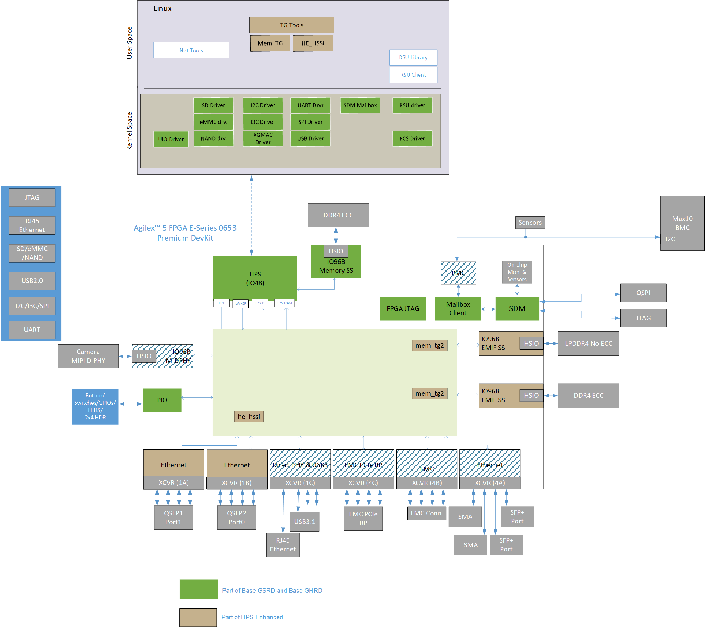
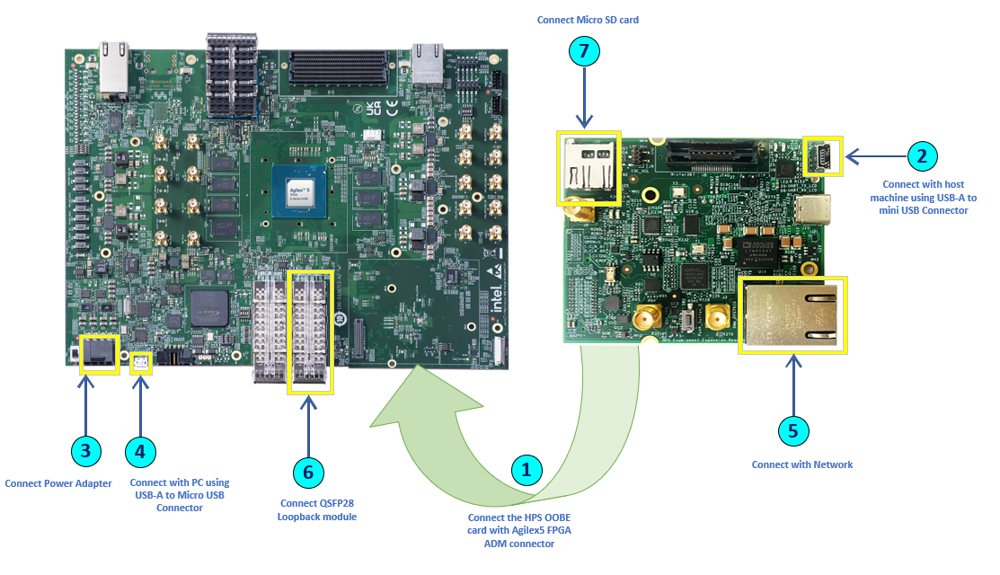

# Agilex™ 5E HPS Enhanced System Example Design Overview

## Introduction

  The Agilex™ 5E HPS Enhanced System Example Design Shell builds on top of the [Base GSRD](https://altera-fpga.github.io/rel-25.1/embedded-designs/agilex-5/e-series/premium/gsrd/ug-gsrd-agx5e-premium/) and serves as a reference 
  shell starting point for system designer building solutions like PTP1588 which require ethernet interface or other designs which need DDR/LPDDR connected to fabric EMIF.

### Glossary

|Term|Description|
|-|-|
|GSRD|Golden System Reference Design|
|GHRD|Golden Hardware Reference Design|
|CSR|Configuration Space Register|
|HPS|Hard Processor Subsystem|
|QSFP|Quad Small Form-factor Pluggable|
|DHCP|Dynamic Host Configuration Protocol|
|FSBL|First Stage Bootloader|

### Prerequisites

* Agilex&trade; 5 FPGA E-Series 065B Premium Development Kit, ordering code DK-A5E065BB32AES1. [Refer to the board documentation](https://www.intel.com/content/www/us/en/products/details/fpga/development-kits/agilex/a5e065b-premium.html) for more information about the development kit.
 
* HPS Enablement Expansion Board. Included with the development kit.
 
* Mini and Micro USB Cable. Included with the development kit.
 
* QSFP Loopback module : Amphenol QSFP + Loopback SF-100GLB0W00-0DB - 630510003
 
* Micro SD card and USB card writer. Included with the development kit.
 
* Host PC with 64 GB of RAM. Less will be fine for only exercising the binaries, and not rebuilding the GSRD.
 
* Linux OS installed on host PC, preferably Ubuntu 22.04LTS , while other versions and distributions may work too.
 
* Serial terminal (for example GtkTerm or Minicom on Linux and TeraTerm or PuTTY on Windows)
 
* Quartus&reg; Prime Pro Edition software version 25.1 is used to recompile the hardware design. If only writing binaries is required, then the Quartus&reg; Prime Pro Edition Programmer version 25.1 is sufficient.
 
 
* Local Ethernet network, with DHCP server
Internet connection. For downloading the files, especially when rebuilding the GSRD.
### Release Contents  
#### Binaries

Prebuilt binaries are located [here](https://github.com/altera-fpga/agilex5e-ed-hps-enhanced/releases/tag/25.1).

#### Sources

  |Component	|Location	|Branch	| Commit ID/Tag|
  |-|-|-|-|
  |GHRD|https://github.com/altera-fpga/agilex5e-ed-hps-enhanced/tree/rel/25.1/src/hw|rel/25.1|QPDS25.1_REL_GSRD_PR|
  |Linux|https://github.com/altera-opensource/linux-socfpga|socfpga-6.12.11-lts|QPDS25.1_REL_GSRD_PR|
  |Arm Trusted Firmware|https://github.com/altera-opensource/arm-trusted-firmware|socfpga_v2.12.0|QPDS25.1_REL_GSRD_PR|
  |U-Boot|https://github.com/altera-opensource/u-boot-socfpga|socfpga_v2025.01|QPDS25.1_REL_GSRD_PR|
  |Yocto Project: |https://git.yoctoproject.org/poky/|styhead|latest|
  |Yocto Project: meta-intel-fpga|https://git.yoctoproject.org/meta-intel-fpga/|styhead|QPDS25.1_REL_GSRD_PR|
  |Yocto Project: meta-intel-fpga-refdes|https://github.com/altera-opensource/meta-intel-fpga-refdes|styhead|QPDS25.1_REL_GSRD_PR|
  |GSRD Build Script: gsrd-socfpga|https://github.com/altera-fpga/agilex5e-ed-hps-enhanced/tree/rel/25.1/src/sw|rel/25.1|QPDS25.1_REL_GSRD_PR|


### Release Notes

Please refer this link for [Release Notes and Known Issues.](https://github.com/altera-fpga/agilex5e-ed-hps-enhanced/releases/tag/25.1) 

## Agilex™ 5E HPS Enhanced System Example Design Architecture

 The hardware architecture of the Agilex™ 5E HPS Enhanced System Example Design supports the following interfaces on top of Base GSRD:

* Fabric Memory EMIF. 
* Ethernet Interfaces.

The Golden Hardware Reference Design (GHRD) includes simple Traffic Generators (TG) which are controlled from HPS Linux test applications viz.,


**Figure 1**: Enhanced HPS Design




The Shell have two EMIF and one Ethernet subsystems for each along with two memory and one Ethernet traffic generators-cum-monitors respectively.

[_Note: Only one ethernet subsytem or ethernet Port0 enabled in this release and Port1 will be enabled in future release._]
  
_EMIF Channel Mapping_:

| Mem channel | DDR Type | DDR Frequency |
|-------------|----------|----------|
| 0           | DDR4     | 200Mhz   |
| 1 (Default)        | LPDDR4   | 200Mhz   |

###  Traffic Exerciser Application Software Architecture
 The Traffic generators are controlled by the host side driver running as an application in Linux user-space software. The Linux user-space application uses UIO interfaces `/dev/uio0` and `/dev/uio1` to access the Traffic Generator (or exerciser) IPs. It controls the traffic generator via a memory mapped CSR registers. The CSR access by HPS software uses the _LWHPS2FPGA_ interface. 


## Hardware Setup 

The hardware setup connection details are captured in the below image.



_Note: Please refer base GSRD [Installing HPS Daughtercard](https://altera-fpga.github.io/rel-25.1/embedded-designs/agilex-5/e-series/premium/gsrd/ug-gsrd-agx5e-premium/#development-kit) section for [1]_.

## Address Map Details

### HPS LW H2F Register Map

| Address Offset | Size (Bytes) | Peripheral | Description |
|-----|-----|-----|-----|
| GHRD-aligned address space |
|0x2001_0000 |8|System ID |Hardware configuration system ID (0xacd5cafe) |
|0x2001_0060 | 16 | Button PIO | Push Button |
|0x2001_0070 |16 | DIPSW PIO | DIP Switch |
|0x2001_0080 | 16 | LED PIO | LED connections on board |
| Application-specific address space |
| 0x2300_1000 - 0x2300_1FFF | 512 | DDR4 TG | DDR4 Memory TG Base offset |
| 0x2300_9000 - 0x2300_9FFF | 512 | LPDDR4 TG | LPDDR4 Memory TG Base offset |
|0x2400_0000 - 0x2401_FFFF|16384| HSSI | HSSI Base offset|

### User Space CSR

The CSR register details are captured [here](https://github.com/altera-fpga/agilex5e-ed-hps-enhanced/tree/rel/25.1/src/hw/reg_map).

## User Flow 

There are two ways to test the design based on the use case. 

   <h5> User Flow 1: Testing with Prebuild Binaries.</h5>
   
   <h5> User Flow 2: Testing Complete Flow.</h5>

 |User Flow|Description|Required for [Userflow#1](#user-flow-1-testing-with-prebuild-binaries)|Required for [Userflow#2](#user-flow-2-testing-complete-flow)|
 |-|-|-|-|
 |Environment Setup|[Tools Download and Installation](#tools-download-and-installation)|[Yes](#tools-download-and-installation)|Yes|
 ||[Install dependency packages for SW compilation](#installing-dependency-packages-for-sw-compilation)|No|Yes|
 ||[Package Download](#package-download)|No|Yes|
 |Compilation|Simulation|No|No|
 ||[HW compilation](#hardware-compilation)|No|Yes|
 ||[SW compilation](#software-compilation)|No|Yes|    
 |Programming|[Programming Hardware binary](#programming-hardware-binary)|[Yes](#programming-hardware-binary)|Yes|
 ||[Programming Software binary](#programming-software-binary)|[Yes](#programming-software-binary)|Yes|
 ||[Linux boot](#linux-boot)|[Yes](#linux-boot)|Yes|
 |Testing|[Run Mem TG Test](#run-mem-tg-test)|[Yes](#testing)|Yes|
 ||[Run Eth TG Test](#run-eth-tg-test)|[Yes](#testing)|Yes|

### Environment Setup

#### Tools Download and Installation

1\. Quartus Prime Pro

* Download the Quartus® Prime Pro Edition software version 25.1 from the FPGA Software Download Center [webpage](https://www.intel.com/content/www/us/en/software-kit/851652/intel-quartus-prime-pro-edition-design-software-version-25-1-for-linux.html) of the Intel website. Follow the on-screen instructions to complete the installation process. Choose an installation directory that is relative to the Quartus® Prime Pro Edition software installation directory.

* Set up the Quartus tools in the PATH, so they are accessible without full path.

```bash
   export QUARTUS_ROOTDIR=~/altera_pro/25.1/quartus/
   export PATH=$QUARTUS_ROOTDIR/bin:$QUARTUS_ROOTDIR/linux64:$QUARTUS_ROOTDIR/../qsys/bin:$PATH
```

2\. Win32 Disk Imager

* Please download and install the latest [Win32 Disk Imager](https://win32diskimager.org/).
3\. Create the top folder to store all the build artifacts:

```bash
  # Create the top folder to store all the build artifacts
    sudo rm -rf artifacts.enablement
    mkdir artifacts.enablement
    cd artifacts.enablement
    export TOP_FOLDER=`pwd`
```

Download the compiler toolchain, add it to the PATH variable, to be used by the GHRD makefile to build the HPS Debug FSBL:
```bash
  cd $TOP_FOLDER
  wget https://developer.arm.com/-/media/Files/downloads/gnu/11.2-2022.02/binrel/gcc-arm-11.2-2022.02-x86_64-aarch64-none-linux-gnu.tar.xz
  tar xf gcc-arm-11.2-2022.02-x86_64-aarch64-none-linux-gnu.tar.xz
  rm -f gcc-arm-11.2-2022.02-x86_64-aarch64-none-linux-gnu.tar.xz
  export PATH=`pwd`/gcc-arm-11.2-2022.02-x86_64-aarch64-none-linux-gnu/bin:$PATH
  export ARCH=arm64
  export CROSS_COMPILE=aarch64-none-linux-gnu-
```

#### Installing dependency packages for SW compilation
Please follow Base GSRD [Yocto Build Prerequisites](https://altera-fpga.github.io/rel-25.1/embedded-designs/agilex-5/e-series/premium/gsrd/ug-gsrd-agx5e-premium/#yocto-build-prerequisites) section to install the dependency packages.

#### Package Download
```bash
# Create the top folder to store all the build artifacts:
cd $TOP_FOLDER
rm -rf agilex5e-ed-hps-enhanced/
git clone https://github.com/altera-fpga/agilex5e-ed-hps-enhanced.git
cd agilex5e-ed-hps-enhanced/src/sw
git submodule update --init -r
```

### Compilation Flow

_Note: If want to use [Prebuild Binaries](#binaries), please skip this compilation step and go to [programming](#programming-the-binaries) step directly as per HW/SW binary availability._ 
#### Hardware Compilation
```bash
cd $TOP_FOLDER/agilex5e-ed-hps-enhanced/src/hw

make legacy_baseline-build
make legacy_baseline-sw-build
quartus_pfg -c output_files/legacy_baseline.sof\ output_files/legacy_baseline_hps_debug.sof\ -o hps_path=software/hps_debug/hps_wipe.ihex
```
The following file will be generated:

`$TOP_FOLDER/agilex5e-ed-hps-enhanced/src/hw/output_files/legacy_baseline.sof`

`$TOP_FOLDER/agilex5e-ed-hps-enhanced/src/hw/output_files/legacy_baseline_hps_debug.sof`

<h5> Build Core RBF </h5>

```bash
cd $TOP_FOLDER

rm -f ghrd_a5ed065bb32ae6sr0.rbf

quartus_pfg -c agilex5e-ed-hps-enhanced/src/hw/output_files/legacy_baseline_hps_debug.sof ghrd_a5ed065bb32ae6sr0.rbf -o hps=1
```

The following file is created:
`$TOP_FOLDER/ghrd_a5ed065bb32ae6sr0.core.rbf`

#### Software Compilation

This section provides a comprehensive guide to bringing up the HPS (Hard Processor System) software for the Agilex™ 5E HPS Enhanced System Example Design. 

<h5> Setup Yocto </h5>

```bash
cd $TOP_FOLDER/agilex5e-ed-hps-enhanced/src/sw
. agilex5_dk_a5e065bb32aes1-gsrd-build.sh
build_setup
```

<h5> Optional: Follow these steps, if you have a custom GHRD </h5>

Follow the procedure below to add the generated ghrd_a5ed065bb32ae6sr0.core.rbf file.

Update the recipe `$WORKSPACE/meta-sm-gsrd-enhanced/recipes-bsp/ghrd/hw-ref-design.bb` as follows

```bash 
cd $TOP_FOLDER 

CORE_RBF=$WORKSPACE/meta-sm-gsrd-enhanced/recipes-bsp/ghrd/files/agilex5_dk_a5e065bb32aes1_gsrd_ghrd.core.rbf 

rm -rf $CORE_RBF 

ln -s $TOP_FOLDER/ghrd_a5ed065bb32ae6sr0.core.rbf $CORE_RBF 

CORE_SHA=$(sha256sum $CORE_RBF | cut -f1 -d" ") 

FILE="$WORKSPACE/meta-sm-gsrd-enhanced/recipes-bsp/ghrd/hw-ref-design.bbappend" 

OLD_URI='SRC_URI\[agilex5_dk_a5e065bb32aes1_gsrd_core_enhanced.sha256sum\] += "[^"]*"' 

NEW_URI="SRC_URI[agilex5_dk_a5e065bb32aes1_gsrd_core_enhanced.sha256sum] += \"$CORE_SHA\"" 

sed -i "s|$OLD_URI|$NEW_URI|" "$FILE" 
```
<h5> Build Yocto </h5>

```bash
bitbake_image
```

<h5> Gather files</h5>

```bash
package
```

The following files will be created:

  `$TOP_FOLDER/agilex5e-ed-hps-enhanced/src/sw/agilex5_dk_a5e065bb32aes1-gsrd-images/u-boot-agilex5-socdk-gsrd-atf/u-boot-spl-dtb.hex`

  `$TOP_FOLDER/agilex5e-ed-hps-enhanced/src/sw/agilex5_dk_a5e065bb32aes1-gsrd-images/u-boot.itb`
  
  `$TOP_FOLDER/agilex5e-ed-hps-enhanced/src/sw/agilex5_dk_a5e065bb32aes1-gsrd-images/sdimage.tar.gz`

<h5> Build QSPI Image </h5>

```bash
cd $TOP_FOLDER
rm -f ghrd_a5ed065bb32ae6sr0.hps.jic ghrd_a5ed065bb32ae6sr0.core.rbf
quartus_pfg \
-c agilex5e-ed-hps-enhanced/src/hw/output_files/legacy_baseline.sof ghrd_a5ed065bb32ae6sr0.jic \
-o device=MT25QU128 \
-o flash_loader=A5ED065BB32AE6SR0 \
-o hps_path=agilex5e-ed-hps-enhanced/src/sw/agilex5_dk_a5e065bb32aes1-gsrd-images/u-boot-agilex5-socdk-gsrd-atf/u-boot-spl-dtb.hex \
-o mode=ASX4 \
-o hps=1
```

The following file is created:

`$TOP_FOLDER/ghrd_a5ed065bb32ae6sr0.hps.jic`

<h5> Build HPS RBF </h5>

This is an optional step, in which you can build an HPS RBF file, which can be used to configure the HPS through JTAG instead of QSPI through the JIC file.

```bash
cd $TOP_FOLDER
rm -f ghrd_a5ed065bb32ae6sr0.hps.rbf
quartus_pfg \
-c agilex5e-ed-hps-enhanced/src/hw/output_files/legacy_baseline.sof  ghrd_a5ed065bb32ae6sr0.rbf \
-o hps_path=agilex5e-ed-hps-enhanced/src/sw/agilex5_dk_a5e065bb32aes1-gsrd-images/u-boot-agilex5-socdk-gsrd-atf/u-boot-spl-dtb.hex \
-o hps=1
```
The following file is created:
`$TOP_FOLDER/ghrd_a5ed065bb32ae6sr0.hps.rbf`
### Programming the Binaries
_Note:_

* Download the [Prebuild Binaries](#binaries) into this path $TOP_FOLDER, if you are leveraging on _User Flow 1_.

* Leave all jumpers and switches in their default configuration.

#### Programming Software Binary
<h5> Write SD Card </h5>

1. Extract the SD card image(sdimage.tar.gz) archive and obtain the file gsrd-console-image-agilex5.wic.

2. Write the extracted SD card image (gsrd-console-image-agilex5_devkit.wic) to the micro-SD card using the included USB writer in the host computer:

On Linux, use the dd utility as shown next:

    # Determine the device associated with the SD card on the host computer. 
    cat /proc/partitions
    # This will return for example /dev/sdx
    # Use dd to write the image in the corresponding device
    sudo dd if=gsrd-console-image-agilex5_devkit.wic of=/dev/sdx bs=1M
    # Flush the changes to the SD card
    sync
On Windows, use the Win32DiskImager program, available at https://win32diskimager.org/. For this, first rename the gsrd-console-image-agilex5_devkit.wic to an .img file (sdcard.img for example) and write the image as shown in the next figure:
      
  

#### Programming Hardware binary

<h5> Write QSPI Flash </h5>
1. Identify the FPGA device position in jtag chain.

```bash
$ jtagconfig

1) Agilex 5E065B Premium DK [1-1.1.1]
  4BA06477   ARM_CORESIGHT_SOC_600
  0364F0DD   A5E(C065BB32AR0|D065BB32AR0)
  020D10DD   VTAP10
# Here, FPGA device in position #2

cd $TOP_FOLDER
quartus_pgm -c 1 -m jtag -o "pvi;ghrd_a5ed065bb32ae6sr0.hps.jic@2" 
#  If FPGA device in position #1 no need to mention the position number, by default it will take position #1."

```

#### Linux Boot

1. Open the serial port of Board by using serial communication utility.

    Note: Follow the instructions in the Base GSRD [configure-serial-console](https://altera-fpga.github.io/rel-25.1/embedded-designs/agilex-5/e-series/premium/gsrd/ug-gsrd-agx5e-premium/#configure-serial-console) section, to configure and setup serial connection.

2. Power cycle the board.

3. Monitor the serial communication windows and wait for Linux to boot, use root as user name, and no password is required.
### Testing

#### Run Mem TG Test

Memory Traffic Generator is used to exercise the EMIF memory attached to the FPGA.
```bash
python3 memtg.py [-h] [-I INTERFACE] -D DEVICE {tg_test} ...
```

```bash
python3 memtg.py tg_test [-h] [-c {on,off}] [-m {0,1} [{0,1} ...]] [-l LOOPS [LOOPS ...]] [-w WRITES [WRITES ...]]
                        [-r READS [READS ...]] [-b {1,2,4,8,16} [{1,2,4,8,16} ...]] [-s STRIDE [STRIDE ...]]
                        [-p {fixed,prbs7,prbs15,prbs31,rot1} [{fixed,prbs7,prbs15,prbs31,rot1} ...]]
                        [-f MEM_FREQUENCY [MEM_FREQUENCY ...]] [-a]
```

| Option | Name          | Description                                                        | Default |
|--------|---------------|--------------------------------------------------------------------|---------|
| -h     | --help        | Displays available options for the command                         |   -      |
| -I     | --interface   | Interface details                                                  |      -   |
| -D     | --device      | Device name or Device index for the interface                      |   -      |
| -m     | --mem_channel | Multiple target memory banks for test to run on                    | 1       |
| -r     | --reads       | Number of unique read transactions per loop                        | 1       |
| -w     | --writes      | Number of unique write transactions per loop                       | 1       |
| -b     | --bls         | Burst length of each request                                       | 1       |
| -s     | --stride      | Address stride for each sequential transaction                     | 1       |
| -p     | --data        | Memory traffic data pattern                                        | fixed   |
| -l     | --loops       | Number of read/write loops to be run                               | 1       |
| -f     | --mem_frequency| Memory traffic clock frequency in MHz                             | 0       |
| -c     | --continuous  | Run TG test to run continuously. Press ctrl+c to exit              | off     |
| -a     | --check_id    | Display the TG ID                                             |-       |       

_Note_ : 

1\. User can leaverage `-f` option to modify the Mem TG clock frequency and default frequency is 200Mhz.

2\. Use -I hps and -D uio0 options for running Mem TG test.

3\. Parameters for each channel's option need to be specified separately. For example, in the case of dual channel test where "-m 0 1" is used, then the parameters for -r, -w, -p, etc. must be specified in the following manner "-r <channel 0 count> <channel 1 count> -w <channel 0 count> <channel 1 count> -p <channel 0 data pattern> <channel 1 data pattern> ..."


Example :-

1\. Single Channel Test Configuration:

 Sets up a memory test on channel `0` with `100,000` read and write transactions per loop, using a memory frequency of `200 MHz`, running for `10` loops, with an address stride of `4` and a burst length of `8`.

  ```bash
    python3 ffrd_exercisor_sw/memtg.py -I hps -D uio0 tg_test -m 0 -r 100000 -w 100000 -f 200 --loops 10 -s 4 -b 8 -f 200

    #output
    [02:52:25] Starting test run...!
    Memory clock from command line: [200] MHz.
    Press CTRL+C to exit.

    =================================
    Mem Channel: 0
    Mem Clock Cycles: 17651846
    Write BW : 23.20 Gb/s
    Read BW  : 23.20 Gb/s
  ```

2\.  Dual Channel Test Configuration:

When performing a dual-channel test with the `memtg.py` tool, need to specify parameters for each channel individually. This allows for precise control over the operations and configurations for each memory channel

```bash
    python3 ffrd_exercisor_sw/memtg.py -I hps -D uio0 tg_test -m 0 1 -r 100000 100000 -w 100000 100000 -f 200 200 --loops 10 10 -s 4 4 -b 8 8

    #output
    [02:47:26] Starting test run...!                                                                                                                                                          
    Memory clock from command line: [200, 200] MHz.                                                                                                    
    Press CTRL+C to exit.                                                                       
    =================================                                                            
    Mem Channel: 0                                                                           
    Mem Clock Cycles: 17651998                                                                                                                                                                                      
    Write BW : 23.20 Gb/s                                                                         
    Read BW  : 23.20 Gb/s                                                                              
    =================================                                                                                                                                                                               
    Mem Channel: 1                                                                                                                                                                                                  
    Mem Clock Cycles: 17025971                                                                                                                                                                                      
    Write BW : 24.08 Gb/s                                                                                                                                                                                           
    Read BW  : 24.08 Gb/s          
```

#### Run Eth TG Test

HSSI (High Speed Serial Interface) module is used to access Ethernet TG(Traffic Generator) which generates traffic on Ethernet MAC with different data patterns, programmable packet length and continuous or fixed traffic.

```bash
python3 hssi_10g.py [-h] [-I INTERFACE] -D DEVICE [--port [{0,1,2,3,4,5,6} ...]] [--num_packets NUM_PACKETS]
                   [--random_length {random,fixed}] [--random_payload {random,incremental}] [--packet_length PACKET_LENGTH]
                   [--continuous {on,off}] [--contmonitor CONTMONITOR] [-a]

```


| Option | Name              | Description                                                      |Default |
|--------|-------------------|------------------------------------------------------------------|--------|
| -h     | --help            | show this help message and exit                                 |     -   |
| -I     | --interface       | INTERFACE find interfaces supported using --list or -l argument |    -    |
| -D     | --device          | DEVICE Device name or Device index for the interface.          |     -   | 
|        | --port            |[{0,1,2,3,4,5,6} ...] QSFP Tx/Rx ports                            |   0    |
|        | --num_packets     | NUM_PACKETS Number of packets                                    |   1    |
|        | --random_length   | {random,fixed} packet length randomization                       | fixed  |
|        | --random_payload  |{random,incremental} payload randomization                        | random |
|        | --packet_length   | PACKET_LENGTH packet length                                      |  64    |
|        | --continuous      |{on,off} continuous mode                                          |  off   |
|        | --contmonitor     |CONTMONITOR time period(in seconds) for performance monitor       |   0    |
| -a     | --check_id        |Display the TG ID                                               |   -     | 

`Note` : 

1\.	For this release QSFP port 0 is only enabled. 

2\.	Use -I hps and -D uio1 option for running Eth TG test.
 
Example :- 

1\. Verify Ethernet traffic self lookback with a random payload and random packet_length running for a long time
   
```bash
python3 ffrd_exercisor_sw/hssi_10g.py -I hps -D uio1 --port 0 --num_packets 10000 --random_payload random --random_length random --continuous on --contmonitor 600

##output

testing HSSI 10G
Press CTRL+C to exit...!

10G loopback test
  port: 0
  num_packets: 10000
  random_length: random
  random_payload: random
  packet_length: random
  continuous mode: on
  monitor duration: 600 sec


HSSI performance:
        Time Elapsed               : 600 s
        Selected clock frequency   : 156.25 MHz
        TX Packet Count            : 1134241360
        RX Good Packet             : 1134241360
        RX Bad Packet              : 0
        Tx_end_tstamp              : 16819507448771
        Tx_sta_tstamp              : 16722864165119
        Rx_end_tstamp              : 16819507448841
        Rx_sta_tstamp              : 16722864165189

```
2. Verify Ethernet traffic self-lookback with a certain lower packet number and
packet_length
```bash
python3 ffrd_exercisor_sw/hssi_10g.py -I hps -D uio1 --port 0 --packet_length 1504 --num_packets 1000

##output

10G loopback test
  port: 0
  num_packets: 1000
  random_length: fixed
  random_payload: random
  packet_length: 1504
  continuous mode: off
  monitor duration: 0 sec


HSSI performance:
        Selected clock frequency   : 156.25 MHz
        TX Packet Count            : 1000
        RX Good Packet             : 1000
        RX Bad Packet              : 0
        Tx_end_tstamp              : 38444895915567
        Tx_sta_tstamp              : 38444895719631
        Rx_end_tstamp              : 38444895915637
        Rx_sta_tstamp              : 38444895719702
        Achieved Tx throughput     : 9.59 Gb/s
        Achieved Rx throughput     : 9.6 Gb/s
```

## Notices & Disclaimers

Altera<sup>&reg;</sup> Corporation technologies may require enabled hardware, software or service activation.
No product or component can be absolutely secure. 
Performance varies by use, configuration and other factors.
Your costs and results may vary. 
You may not use or facilitate the use of this document in connection with any infringement or other legal analysis concerning Altera or Intel products described herein. You agree to grant Altera Corporation a non-exclusive, royalty-free license to any patent claim thereafter drafted which includes subject matter disclosed herein.
No license (express or implied, by estoppel or otherwise) to any intellectual property rights is granted by this document, with the sole exception that you may publish an unmodified copy. You may create software implementations based on this document and in compliance with the foregoing that are intended to execute on the Altera or Intel product(s) referenced in this document. No rights are granted to create modifications or derivatives of this document.
The products described may contain design defects or errors known as errata which may cause the product to deviate from published specifications.  Current characterized errata are available on request.
Altera disclaims all express and implied warranties, including without limitation, the implied warranties of merchantability, fitness for a particular purpose, and non-infringement, as well as any warranty arising from course of performance, course of dealing, or usage in trade.
You are responsible for safety of the overall system, including compliance with applicable safety-related requirements or standards. 
<sup>&copy;</sup> Altera Corporation.  Altera, the Altera logo, and other Altera marks are trademarks of Altera Corporation.  Other names and brands may be claimed as the property of others. 

OpenCL* and the OpenCL* logo are trademarks of Apple Inc. used by permission of the Khronos Group™. 
