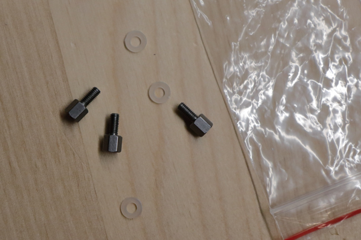

##  Introduction

### GSRD Overview

The Golden System Reference Design (GSRD) is a reference design running on the Agilex 5 E-Series Premium  Development Kit.

The GSRD is comprised of the following components:

- Golden Hardware Reference Design (GHRD)
- Reference HPS software including:
  - Arm Trusted Firmware
  - U-Boot
  - Linux Kernel
  - Linux Drivers
  - Sample Applications

### Prerequisites

The following are required to be able to fully exercise the Agilex 5 Premium Development Kit GSRD:

* Altera Agilex 5 FPGA E-Series 065B Premium Development Kit, ordering code DK-A5E065BB32AES1. Refer to [board documentation](https://www.intel.com/content/www/us/en/products/details/fpga/development-kits/agilex/a5e065b-premium.html) for more information about the development kit.

  * HPS Enablement Expansion Board. Included with the development kit.
  * HPS NAND Board. Enables eMMC storage for HPS. Orderable separately.
  * HPS Test Board. Supports SD card boot, and external Arm tracing. Orderable separately.
  * Mini USB Cable. Included with the development kit.
  * Micro USB Cable. Included with the development kit.
  * Ethernet Cable. Included with the development kit.
  * Micro SD card and USB card writer. Included with the development kit.
* Host PC with
  * 64 GB of RAM. Less will be fine for only exercising the binaries, and not rebuilding the GSRD.
  * Linux OS installed. Ubuntu 22.04LTS was used to create this page, other versions and distributions may work too
  * Serial terminal (for example GtkTerm or Minicom on Linux and TeraTerm or PuTTY on Windows)
  * Intel Quartus Prime Pro Edition version 24.1. Used to recompile the hardware design. If only writing binaris is required, then the smaller Intel Quartus Prime Pro Edition Programmer version 24.1 is sufficient.
  * TFTP server. This used to download the eMMC binaries to board to be flashed by U-Boot
* Local Ethernet network, with DHCP server
* Internet connection. For downloading the files, especially when rebuilding the GSRD.

### Release Contents

<h4>Binaries</h4>

The Agilex 5 Premium Development Kit GSRD binaries are located at [https://releases.rocketboards.org/2024.05/](https://releases.rocketboards.org/2024.05/):

| HPS Daughter Card | Boot Source | Link |
| -- | ---------------------- | -- |
| Enablement Board | SD Card | [https://releases.rocketboards.org/2024.05/gsrd/agilex5_dk_a5e065bb32aes1_gsrd](https://releases.rocketboards.org/2024.05/gsrd/agilex5_dk_a5e065bb32aes1_gsrd) |
| Enablement Board | QSPI | [https://releases.rocketboards.org/2024.05/qspi/agilex5_dk_a5e065bb32aes1_qspi](https://releases.rocketboards.org/2024.05/qspi/agilex5_dk_a5e065bb32aes1_qspi) |
| NAND Board | eMMC | [https://releases.rocketboards.org/2024.05/emmc/agilex5_dk_a5e065bb32aes1_emmc](https://releases.rocketboards.org/2024.05/emmc/agilex5_dk_a5e065bb32aes1_emmc) |
| Test Board | SD Card | [https://releases.rocketboards.org/2024.05/debug/agilex5_dk_a5e065bb32aes1_debug](https://releases.rocketboards.org/2024.05/debug/agilex5_dk_a5e065bb32aes1_debug) |

<h4>Sources</h4>

Quartus Prime Pro v24.1 and the following software component versions are used to build the GSRD:

| Component | Location | Branch | Commit ID/Tag |
| :-- | :-- | :-- | :-- |
| GHRD | [https://github.com/altera-opensource/ghrd-socfpga](https://github.com/altera-opensource/ghrd-socfpga) | master | QPDS24.1_REL_AGILEX5_GSRD_PR |
| Linux | [https://github.com/altera-opensource/linux-socfpga](https://github.com/altera-opensource/linux-socfpga) | socfpga-6.1.68-lts | QPDS24.1_REL_AGILEX5_GSRD_PR |
| Arm Trusted Firmware | [https://github.com/altera-opensource/arm-trusted-firmware](https://github.com/altera-opensource/arm-trusted-firmware) | socfpga_v2.10.0 | QPDS24.1_REL_AGILEX5_GSRD_PR |
| U-Boot | [https://github.com/altera-opensource/u-boot-socfpga](https://github.com/altera-opensource/u-boot-socfpga) | socfpga_v2023.10   | QPDS24.1_REL_AGILEX5_GSRD_PR |
| Yocto Project: poky | [https://git.yoctoproject.org/poky](https://git.yoctoproject.org/poky) | nanbield | latest |
| Yocto Project: meta-intel-fpga | [https://git.yoctoproject.org/meta-intel-fpga](https://git.yoctoproject.org/meta-intel-fpga) | nanbield | QPDS24.1_REL_AGILEX5_GSRD_PR |
| Yocto Project: meta-intel-fpga-refdes | [https://github.com/altera-opensource/meta-intel-fpga-refdes](https://github.com/altera-opensource/meta-intel-fpga-refdes) | nanbield | QPDS24.1_REL_AGILEX5_GSRD_PR |
| GSRD Build Script: gsrd-socfpga | [https://github.com/altera-opensource/gsrd-socfpga](https://github.com/altera-opensource/gsrd-socfpga) | nanbield | QPDS24.1_REL_AGILEX5_GSRD_PR |

### Release Notes
<h4>Embedded Software Readiness</h4>

Y - hardware validated; N - hardware validation in progress; Y\* - tested with condition; Y\*\* - tested, with known issues listed in the next section.

| HPS Peripherals/Features | 24.1 Readiness<br> QPDS24.1_REL_AGILEX5_GSRD_PR tag |
| :-- | :--: |
| Timer/Watchdog  | Y |
| Clock Manager  | Y |
| Power Manager  | Y |
| MPU | Y |
| Reset Manager  | Y\*\* |
| UART | Y |
| GPIO | Y |
| QSPI | Y |
| SD/eMMC | Y\*\* |
| I3C | N |
| I2C | Y |
| USB3.1 | Y\* (2.0 mode only, 3.1 mode by PRQ) |
| USB2.0 | Y |
| NAND | Not supported in Agilex™ 5 FPGA E-Series 065B Premium Development Kit |
| SPI | Y |
| Bridge | Y\*\* |
| EMAC | Y\*\* |
| FPGA Configuration | Y\*\* |
| RSU | Y\*\* |

<h4>Known Issues</h4>

| Issue | Workaround | Impacted Peripherals/Features | Internal IDs | Impacted Branch/Tag |
| :-- | :-- | :-- | :-- | :-- |
| HPS Ethernet controller (XGMAC)is observed performing at lower rates (~50%) and having packet loss when running at 1G Mbps speed mode. | Contact Altera support for more details. | Ethernet | 15015213942, 18036458750, 15015743194 | QPDS24.1_REL_AGILEX5_GSRD_PR |
| Read/write across the F2H bridge fails | Fixed in 24.1 Patch 0.08. Refer to [KDB](https://www.intel.com/content/www/us/en/support/programmable/articles/000098815.html) for details. | Bridge | 15015307934 | QPDS24.1_REL_AGILEX5_GSRD_PR |
| Warm reset fails in U-Boot | None | Reset Manager | 16023530680 | QPDS24.1_REL_AGILEX5_GSRD_PR |
| Reconfiguring FPGA fabric from Linux fail | A patch can be provided. Contact Altera support for more details. | FPGA Configuration | 15015929503 | QPDS24.1_REL_AGILEX5_GSRD_PR |
| ADMA error seen during "dd" operation | Avoid using "dd" command" | SD/eMMC | 15015146909 | QPDS24.1_REL_AGILEX5_GSRD_PR |
| For HPS Boot First Mode, F2H bridge fails when phase 2 core.rbf is reconfigured | None | Bridge | 22019988055 | QPDS24.1_REL_AGILEX5_GSRD_PR |
| ECC is not enabled for HPS EMIF in 24.1 GHRD | None | HPS EMIF | 15015984966 | QPDS24.1_REL_AGILEX5_GSRD_PR |
| DDR calibration took about 10 seconds in 24.1 GSRD | None | HPS EMIF | 14022235400 | QPDS24.1_REL_AGILEX5_GSRD_PR |
| "XGMAC_DMA_MODE_SWR_stuck: -110" message seen after "dhcp" command on HPS Enablement Board in 24.1 GSRD | You can ignore the error, "dhcp" works as usual. Alternatively, you can also disable gmac0 instance in socfpga_agilex5_socdk.dts. | EMAC | 15016071381 | QPDS24.1_REL_AGILEX5_GSRD_PR |

### Development Kit

This release targets the Agilex 5 FPGA E-Series 065B Premium Development Kit. Refer to [board documentation](https://www.intel.com/content/www/us/en/products/details/fpga/development-kits/agilex/a5e065b-premium.html) for more information about the development kit.


<h4>Installing HPS Daughtercard</h4>

This section shows how to install the included HPS Enablement Daughtercard.  The installation for the other optional HPS Boards is similar.

1\. Identify the correct thumb screws and washers needed, they are in a plastic bag:  


2\. Locate the area on the development board where the HPS Daughtercard needs to be installed:  


3\. Place the plastic washers on top of the three hex mounting posts:  


4\. Place HPS Board on top of the posts and washers:  


5\. Place the hex thumb screws on the two posts, as shown below. Note the 3rd one on the bottom is best unplaced as fully screwing that in may move the board. Also note the thumb screw close to the Ethernet connector is hard to screw, recommend to use small pliers and patience to make it secure. It is important that the HPS Board is secure, and does not move:  
 

**Note**: If you need to swap HPS Boards frequently,  it is recommended to remove the hex posts, and install the plastic washers between the PCB and the posts. This way you do not need to be careful for the washers not to move when you place the HPS Board on top of the posts. Note there are also plastic washers underneath the development board PCB, make sure to leave those in place when performing this operation

<h4>Changing MSEL</h4>

MSEL signals instruct the FPGA device on which configuration scheme to use. Configuration schemes used by the scenarios presented in this guide are JTAG and QSPI. MSEL is changed through dipswitch SW27. Only change the settings while the board is powered off.

Configuration OFF-OFF-OFF-OFF corresponds to JTAG:


Configuration OFF-ON-ON-OFF corresponds to JTAG:


### GHRD Overview

The Golden Hardware Reference Design is an important part of the GSRD and consists of the following components:

- Hard Processor System (HPS)
  - Dual core Arm Cortex-A76 processor
  - Dual core Arm Cortex-A55 processor
  - HPS Peripherals connected to Out-of-Box Experience (OOBE2) Daughter Card:
    - SDMMC
    - EMAC
    - HPS JTAG debug
    - I3C
    - USB UART
    - USB 3.1
- Multi-Ported Front End (MPFE) for HPS External Memory Interface (EMIF)
- FPGA Peripherals connected to Lightweight HPS-to-FPGA (LWS2F) AXI Bridge and JTAG to Avalon Master Bridge
  - Three user LED outputs
  - Four user DIP switch inputs
  - Four user push-button inputs
  - System ID
- FPGA Peripherals connected to HPS-to-FPGA (S2F) AXI Bridge
  - 256KB of FPGA on-chip memory

 

The GHRD allows hardware designers to access each peripheral in the FPGA portion of the SoC with System Console, through the JTAG master module. This signal-level access is independent of the driver readiness of each peripheral.

<h4> MPU Address Maps</h4>

This section presents the address maps as seen from the MPU side.  
<h5> HPS-to-FPGA Address Map</h5>

The three FPGA windows in the MPU address map provide access to 256 GB of FPGA space. First window is 1 GB from 00_4000_0000, second window is 15 GB from 04_4000_0000, third window is 240 GB from 44_0000_0000. The following table lists the offset of each peripheral from the HPS-to-FPGA bridge in the FPGA portion of the SoC.

| Peripheral | Address Offset | Size (bytes) | Attribute |
| :-- | :-- | :-- | :-- |
| onchip_memory2_0 | 0x0 | 256K | On-chip RAM as scratch pad |

<h5>Lightweight HPS-to-FPGA Address Map</h5>

The the memory map of system peripherals in the FPGA portion of the SoC as viewed by the MPU, which starts at the lightweight HPS-to-FPGA base address of 0x00_2000_0000, is listed in the following table.

| Peripheral | Address Offset | Size (bytes) | Attribute |
| :-- | :-- | :-- | :-- |
| sysid | 0x0001_0000 | 32 | Unique system ID   |
| led_pio | 0x0001_0080 | 16 | LED outputs   |
| button_pio | 0x0001_0060 | 16 | Push button inputs |
| dipsw_pio | 0x0001_0070 | 16 | DIP switch inputs |

<h5>JTAG Master Address Map</h5>

There are three JTAG master interfaces in the design, one for accessing non-secure peripherals in the FPGA fabric, and another for accessing secure peripheral in the HPS through the FPGA-to-HPS Interface and another for FPGA fabric to SDRAM.

The following table lists the address of each peripheral in the FPGA portion of the SoC, as seen through the non-secure JTAG master interface.

| Peripheral | Address Offset | Size (bytes) | Attribute |
| :-- | :-- | :-- | :-- |
| onchip_memory2_0 | 0x0004_0000 | 256K | On-chip RAM |
| sysid | 0x0001_0000 | 32 | Unique system ID |
| led_pio | 0x0001_0080 | 16 | LED outputs |
| button_pio | 0x0001_0060 | 16 | Push button inputs |
| dipsw_pio | 0x0001_0070 | 16 | DIP switch inputs |

<h4> Interrupt Routing</h4>

The HPS exposes 64 interrupt inputs for the FPGA logic. The following table lists the interrupt connections from soft IP peripherals to the HPS interrupt input interface.
      
| Peripheral | Interrupt Number | Attribute |
| :-- | :-- | :-- |
| dipsw_pio | f2h_irq0[0] | 4 DIP switch inputs |
| button_pio | f2h_irq0[1] | 4 Push button inputs |

## Exercising Prebuilt Binaries

This section presents how to use the prebuilt binaries included with the GSRD release.

### Configure Board

1\. Leave all jumpers and switches in their default configuration.

2\. Install the appropriate HPS Daughtercard.

3\. Connect mini USB cable from vertical connector on HPS Daughtercard to host PC. This is used for the HPS serial console.

4\. Connect micro USB cable from development board to host PC. This is used by the tools for JTAG communication.

5\. Connect Ethernet cable from HPS Board to an Ethernet switch connected to local network. Local network must provide a DCHP server.

### Configure Serial Console

All the scenarios included in this release require a serial connection. This section presents how to configure the serial connection.

1\. Install a serial terminal emulator application on your host PC:  

* For Windows: TeraTerm or PuTTY are available
* For Linux: GtkTerm or Minicom are available

2\. Power down your board if powered up. This is important, as once powered up, with the micro USB JTAG cable connected, a couple more USB serial ports will enumerate, and you may choose the wrong port.

3\. Connect mini-USB cable from the vertical mini-USB connector on the HPS Board to the host PC

4\. On the host PC, an USB serial port will enumerate. On Windows machines it will be something like `COM4`, while on Linux machines it will be something like `/dev/tty/USB0`.

5\. Configure your serial terminal emulator to use the following settings:  

* Serial port: as mentioned above
* Baud rate: 115,200
* Data bits: 8
* Stop bits: 1
* CRC: disabled
* Hardware flow control: disabled

6\. Connect your terminal emulator

### HPS Enablement BOard

This section presents how to use HPS Enablement BOard to boot from SD card, and also from QSPI.

#### Booting from SD Card
<hr/>
<h5>Write SD Card</h5>

1\. Download SD card image from the prebuilt binaries [https://releases.rocketboards.org/2024.05/gsrd/agilex5_dk_a5e065bb32aes1_gsrd/sdimage.tar.gz](https://releases.rocketboards.org/2024.05/gsrd/agilex5_dk_a5e065bb32aes1_gsrd/sdimage.tar.gz) and extract the archive, obtaining the file `gsrd-console-image-agilex5_devkit.wic`.

2\. Write the SD card image to the micro SD card using the included USB writer, and `dd` utility on Linux, or  Win32DiskImager on Windows, available at [https://win32diskimager.org/](https://win32diskimager.org/).

<h5>Write QSPI Flash</h5>

1\. Power down board

2\. Set MSEL dipswitch SW27 to JTAG: OFF-OFF-OFF-OFF

3\. Power up the board

4\. Download and extract the JIC image, then write it to QSPI
```bash
wget https://releases.rocketboards.org/2024.05/gsrd/agilex5_dk_a5e065bb32aes1_gsrd/ghrd_a5ed065bb32ae6sr0.hps.jic.tar.gz
tar xf ghrd_a5ed065bb32ae6sr0.hps.jic.tar.gz
quartus_pgm -c 1 -m jtag -o "pvi;ghrd_a5ed065bb32ae6sr0.hps.jic"
```

<h5>Boot Linux</h5>

1\. Power down board

2\. Set MSEL dipswitch SW27 to QSPI: OFF-ON-ON-OFF

3\. Power up the board

4\. Wait for Linux to boot, use `root` as user name, and no password wil be requested.

<h5>Run Sample Applications</h5>

1\. Boot to Linux

2\. Change current folder to `intelFPGA` folder
```bash
cd intelFPGA
```
3\. Run the hello world application
```bash
./hello
```
4\. Run the `syscheck` application
```bash
./syscheck
```
Press `q` to exit the `syscheck` application.

<h5>Control LEDs</h5>

1\. Boot to Linux

2\. Control LEDs by using the following sysfs entries:

* /sys/class/leds/fpga_led0/brightness
* /sys/class/leds/fpga_led1/brightness
* /sys/class/leds/fpga_led2/brightness
* /sys/class/leds/hps_led1/brightness

using commands such as:
```bash
cat /sys/class/leds/fpga_led0/brightness
echo 0 > /sys/class/leds/fpga_led0/brightness
echo 1 > /sys/class/leds/fpga_led1/brightness
```

Because of how the LEDs are connected, for the above commands `0` means LED is turned on, `1` means LED is turned off.

<h5>Connect to Board Using SSH</h5>

1\. Boot to Linux  

2\. Determine the board IP address using the `ifconfig` command:
```bash
root@agilex5devkit:~# ifconfig
eth0: flags=-28605<UP,BROADCAST,RUNNING,MULTICAST,DYNAMIC>  mtu 1500
        inet 192.168.1.153  netmask 255.255.255.0  broadcast 192.168.1.255
        inet6 fe80::f0eb:c8ff:fec4:eed7  prefixlen 64  scopeid 0x20<link>
        ether f2:eb:c8:c4:ee:d7  txqueuelen 1000  (Ethernet)
        RX packets 649  bytes 45132 (44.0 KiB)
        RX errors 0  dropped 226  overruns 0  frame 0
        TX packets 56  bytes 8789 (8.5 KiB)
        TX errors 0  dropped 0 overruns 0  carrier 0  collisions 0
        device interrupt 23  

lo: flags=73<UP,LOOPBACK,RUNNING>  mtu 65536
        inet 127.0.0.1  netmask 255.0.0.0
        inet6 ::1  prefixlen 128  scopeid 0x10<host>
        loop  txqueuelen 1000  (Local Loopback)
        RX packets 100  bytes 8408 (8.2 KiB)
        RX errors 0  dropped 0  overruns 0  frame 0
        TX packets 100  bytes 8408 (8.2 KiB)
        TX errors 0  dropped 0 overruns 0  carrier 0  collisions 0
```
3\. Connect to the board over SSH using `root` username, no password will be requested:
```bash
ssh root@192.168.1.153
```
**Note**: Make sure to replace the above IP address to the one matching the output of running `ifconfig` on youir board.

<h5>Visit Board Web Page</h5>

1\. Boot to Linux  

2\. Determine board IP address using `ifconfig` like in the previous scenario  

3\. Start a web browser and enter the IP address in the address bar  

4\. The web browser will display a page served by the web server running on the board.  

**Note**: Current release has a limitation, in that the LEDs are not controllable from the web page. This will be resolved in the next release.

#### Booting from QSPI
<hr/>
This section presents how to boot from QSPI. One notable aspect is that you need to wipe the SD card partitioning information, as otherwise U-Boot SPL could find a valid SD card image, and try to boot from that first.

<h5>Wipe SD Card</h5>

Either write 1MB of zeroes at the beginning of the SD card, or remove the SD card from the HPS Daughter Card. You can use `dd` on Linux, or `Win32DiskImager` on Windows to achieve this.

<h5>Write QSPI Flash</h5>

1\. Power down board

2\. Set MSEL dipswitch SW27 to JTAG: OFF-OFF-OFF-OFF

3\. Power up the board

4\. Download and extract the JIC image, then write it to QSPI:
```bash
wget https://releases.rocketboards.org/2024.05/qspi/agilex5_dk_a5e065bb32aes1_qspi/agilex_flash_image.hps.jic.tar.gz
tar xf agilex_flash_image.hps.jic.tar.gz
quartus_pgm -c 1 -m jtag -o "pvi;agilex_flash_image.hps.jic"
```

<h5>Boot Linux</h5>

1\. Power down board

2\. Set MSEL dipswitch SW27 to QSPI: OFF-ON-ON-OFF

3\. Power up the board

4\. Wait for Linux to boot, use `root` as user name, and no password wil be requested.

**Note**: On first boot, the UBIFS rootfilesystem is initialized, and that takes a few minutes. This will not happen on next reboots. See a sample log below:

```
[   17.033558] UBIFS (ubi0:4): Mounting in unauthenticated mode
[   17.039470] UBIFS (ubi0:4): background thread "ubifs_bgt0_4" started, PID 130
[   17.061510] UBIFS (ubi0:4): start fixing up free space
[   20.644496] random: crng init done
[   27.120040] platform soc:leds: deferred probe pending
[  243.190874] UBIFS (ubi0:4): free space fixup complete
[  243.315909] UBIFS (ubi0:4): UBIFS: mounted UBI device 0, volume 4, name "rootfs"
[  243.323290] UBIFS (ubi0:4): LEB size: 65408 bytes (63 KiB), min./max. I/O unit sizes: 8 bytes/256 bytes
[  243.332653] UBIFS (ubi0:4): FS size: 167117440 bytes (159 MiB, 2555 LEBs), max 6500 LEBs, journal size 
```

### HPS NAND BOard

This section presents how to use HPS NAND BOard to boot from eMMC.

#### Booting from eMMC
<hr/>
<h5>Configure Board</h5>
For this scenario, we are using the HPS NAND Board, which can be configured through dipswitch SW3 to enable either eMMC or NAND. Set SW3 to ON to enable eMMC.

<h5>Write eMMC Flash</h5>

We are writing the eMMC Flash by using U-Boot commands. We are getting to U-Boot prompt by booting from QSPI using a JIC image which contains U-Boot, thereby not relying on what is already in eMMC.

1\. Download, and extract the eMMC image
```bash
wget https://releases.rocketboards.org/2024.05/emmc/agilex5_dk_a5e065bb32aes1_emmc/sdimage.tar.gz
tar xf sdimage.tar.gz
```
2\. Split the eMMC image into 1GB chunks and copy them to your TFT folder:
```bash
split --bytes=1G gsrd-console-image-agilex5_devkit.wic
mv xa* <your_tfp_folder>
```
This will put the two chunks called `xaa` and `xab` on your TFTP folder.
3\. Power down the board. 

4\. Set MSEL dipswitch SW27 to JTAG: OFF-OFF-OFF-OFF

5\. Power up the board

6\. Download the helper JIC used to write the eMMC image, extract it and write it to QSPI:
```bash
wget https://releases.rocketboards.org/2024.05/emmc/agilex5_dk_a5e065bb32aes1_emmc/uboot.jic.tar.gz
tar xf uboot.jic.tar.gz
quartus_pgm -c 1 -m jtag -o "pvi;uboot.jic"
```
7\. Determine your host IP address using `ifconfig` to use it as the IP address of the TFTP server

8\. Power down the board

9\. Set MSEL dipswitch SW27 to QSPI: OFF-ON-ON-OFF

10\. Power up the board

11\. Stop U-Boot at the boot countdown, to drop to U-Boot console

12\. At the U-Boot console, run the following commands to write the SD card image:
```
setenv autoload no
dhcp
setenv serverip <tftp_server_ip_address>
tftp ${loadaddr} xaa
setexpr blkcnt1 ${filesize} / 0x200
mmc write ${loadaddr} 0 ${blkcnt1}
tftp ${loadaddr} xab
setexpr blkcnt2 ${filesize} / 0x200
mmc write ${loadaddr} ${blkcnt1} ${blkcnt2}
```
**Note**: If you already have a valid image in eMMC, the U-Boot SPL which runs from QSPI will be able to see that and load it instead of the U-Boot from QSPI. To prevent this from happening, you can wipe out the eMMC card partitioning, then issue a reset for U-Boot to reboot into the QSPI helper JIC:

```
mw.w ${loadaddr} 0x0 0x80000
mmc rescan
mmc write ${loadaddr} 0x0 0x400
reset
```
<h5>Write QSPI Flash</h5>

1\. Power down the board. 

2\. Set MSEL dipswitch SW27 to JTAG: OFF-OFF-OFF-OFF

3\. Power up the board

4\. Download the JIC and write it to QSPI:
```bash
wget https://releases.rocketboards.org/2024.05/emmc/agilex5_dk_a5e065bb32aes1_emmc/ghrd_a5ed065bb32ae6sr0.hps.jic.tar.gz 
tar xf ghrd_a5ed065bb32ae6sr0.hps.jic.tar.gz 
quartus_pgm -c 1 -m jtag -o "pvi;ghrd_a5ed065bb32ae6sr0.hps.jic"
```
<h5>Boot Linux</h5>
1\. Power down the board. 

2\. Set MSEL dipswitch SW27 to QSPI: OFF-ON-ON-OFF

3\. Power up the board

4\. Board will boot to Linux. Enter `root` as username, no password will be requested

### HPS Test BOard

This section presents how to use HPS Test BOard to boot from SD card.

#### Booting from SD Card
<hr/>
<h5>Configure Board</h5>

For this scenario we are using the HPS Test Board. There is single dipswitch on that board called SW1, which needs to be set to the ON position.

<h5>Write SD Card</h5>

1\. Download SD card image from the prebuilt binaries https://releases.rocketboards.org/2024.05/debug/agilex5_dk_a5e065bb32aes1_debug/sdimage.tar.gz and extract the archive, obtaining the file `gsrd-console-image-agilex5_devkit.wic`.

2\. Write the SD card image to the micro SD card using the included USB writer, and `dd` utility on Linux, or  Win32DiskImager on Windows, available at https://win32diskimager.org/.

<h5>Write QSPI Flash</h5>

1\. Power down the board. 

2\. Set MSEL dipswitch SW27 to JTAG: OFF-OFF-OFF-OFF

3\. Power up the board

4\. Download the JIC and write it to QSPI:
```bash
wget https://releases.rocketboards.org/2024.05/debug/agilex5_dk_a5e065bb32aes1_debug/ghrd_a5ed065bb32ae6sr0.hps.jic.tar.gz 
tar xf ghrd_a5ed065bb32ae6sr0.hps.jic.tar.gz 
quartus_pgm -c 1 -m jtag -o "pvi;ghrd_a5ed065bb32ae6sr0.hps.jic"
```

<h5>Boot Linux</h5>

1\. Power down the board. 

2\. Set MSEL dipswitch SW27 to QSPI: OFF-ON-ON-OFF

3\. Power up the board

4\. Board will boot to Linux. Enter `root` as username, no password will be requested

## Rebuilding the GSRD

### Yocto Build Prerequisites
Make sure you have Yocto system requirements met: https://docs.yoctoproject.org/3.4.1/ref-manual/system-requirements.html#supported-linux-distributions.

The command to install the required packages on Ubuntu 22.04-LTS is:
```bash
sudo apt-get update
sudo apt-get upgrade
sudo apt-get install openssh-server mc libgmp3-dev libmpc-dev gawk wget git diffstat unzip texinfo gcc \
build-essential chrpath socat cpio python3 python3-pip python3-pexpect xz-utils debianutils iputils-ping \
python3-git python3-jinja2 libegl1-mesa libsdl1.2-dev pylint3 xterm python3-subunit mesa-common-dev zstd \
liblz4-tool git fakeroot build-essential ncurses-dev xz-utils libssl-dev bc flex libelf-dev bison xinetd \
tftpd tftp nfs-kernel-server libncurses5 libc6-i386 libstdc++6:i386 libgcc++1:i386 lib32z1 \
device-tree-compiler curl mtd-utils u-boot-tools net-tools swig -y
```
On Ubuntu 22.04 you will also need to point the /bin/sh to /bin/bash, as the default is a link to `/bin/dash`:
```bash
sudo ln -sf /bin/bash /bin/sh
```
### HPS Enablement BOard

<!--{"type":"recipe", "name":"Agilex5GSRD.Enablement", "results":["$TOP_FOLDER/ghrd_a5ed065bb32ae6sr0.hps.jic","$TOP_FOLDER/ghrd_a5ed065bb32ae6sr0.hps.rbf","$TOP_FOLDER/gsrd-socfpga/agilex5_devkit-gsrd-images/sdimage.tar.gz","$TOP_FOLDER/qspi_boot/agilex_flash_image.hps.jic"],"TOP_FOLDER":"artifacts.enablement", "board_keywords":["DK-A5E065BB32AES1","SD"], "test_commands":["write-sd=$TOP_FOLDER/gsrd-socfpga/agilex5_devkit-gsrd-images/sdimage.tar.gz","write-jic=$TOP_FOLDER/ghrd_a5ed065bb32ae6sr0.hps.jic","boot-linux-qspi","wipe-sd","write-jic=$TOP_FOLDER/qspi_boot/agilex_flash_image.hps.jic","boot-linux-qspi"]}-->

This section presents how to build the binaries for HPS Enablement BOard.

#### Build SD Card Boot Binaries
<hr/>
The following diagram shows an overview of how the build process works for this use case:


<h5>Setup Environment</h5>
<!--{"type":"step", "name":"Setup Environment"}-->
1\. Create the top folder to store all the build artifacts:
<!--{"type":"code" }-->

```bash
sudo rm -rf artifacts.enablement
mkdir artifacts.enablement
cd artifacts.enablement
export TOP_FOLDER=`pwd`
```
<!--{"type":"/code" }-->
2\. Download and setup the build toolchain. It will be used only by the GHRD makefile to build the debug HPS FSBL, to build the _hps_debug.sof file:
<!--{"type":"code" }-->

```bash
cd $TOP_FOLDER
wget https://developer.arm.com/-/media/Files/downloads/gnu/11.2-2022.02/binrel\
/gcc-arm-11.2-2022.02-x86_64-aarch64-none-linux-gnu.tar.xz
tar xf gcc-arm-11.2-2022.02-x86_64-aarch64-none-linux-gnu.tar.xz
rm -f gcc-arm-11.2-2022.02-x86_64-aarch64-none-linux-gnu.tar.xz
export PATH=`pwd`/gcc-arm-11.2-2022.02-x86_64-aarch64-none-linux-gnu/bin:$PATH
export ARCH=arm64
export CROSS_COMPILE=aarch64-none-linux-gnu-
```
<!--{"type":"/code" }-->
3\. Set up the Quartus tools in the PATH, so they are accessible without full path
<!--{"type":"code" }-->
```bash
export QUARTUS_ROOTDIR=~/intelFPGA_pro/24.1/quartus/
export PATH=$QUARTUS_ROOTDIR/bin:$QUARTUS_ROOTDIR/linux64:$QUARTUS_ROOTDIR/../qsys/bin:$PATH
```
<!--{"type":"/code" }-->
<!--{"type":"/step" }-->

<h5>Build Hardware Design</h5>
<!--{"type":"step", "name":"Build Hardware Design", "results":["$TOP_FOLDER/agilex5_soc_devkit_ghrd/output_files/ghrd_a5ed065bb32ae6sr0.sof","$TOP_FOLDER/agilex5_soc_devkit_ghrd/output_files/ghrd_a5ed065bb32ae6sr0_hps_debug.sof"]}-->
<!--{"type":"code" }-->
```bash
cd $TOP_FOLDER
rm -rf ghrd-socfpga agilex5_soc_devkit_ghrd
git clone -b QPDS24.1_REL_AGILEX5_GSRD_PR https://github.com/altera-opensource/ghrd-socfpga
mv ghrd-socfpga/agilex5_soc_devkit_ghrd .
rm -rf ghrd-socfpga
cd agilex5_soc_devkit_ghrd
make config
make DEVICE=A5ED065BB32AE6SR0 HPS_EMIF_MEM_CLK_FREQ_MHZ=800 HPS_EMIF_REF_CLK_FREQ_MHZ=100 generate_from_tcl
make all
cd ..
```
<!--{"type":"/code" }-->
<!--{"type":"/step" }-->
The following files are created:

* `$TOP_FOLDER/agilex5_soc_devkit_ghrd/output_files/ghrd_a5ed065bb32ae6sr0.sof`
* `$TOP_FOLDER/agilex5_soc_devkit_ghrd/output_files/ghrd_a5ed065bb32ae6sr0_hps_debug.sof`
<h5>Build Core RBF</h5>
<!--{"type":"step", "name":"Build Core RBF", "results":["$TOP_FOLDER/ghrd_a5ed065bb32ae6sr0.core.rbf"]}-->
<!--{"type":"code" }-->

```bash
cd $TOP_FOLDER
rm -f ghrd_a5ed065bb32ae6sr0.rbf
quartus_pfg -c agilex5_soc_devkit_ghrd/output_files/ghrd_a5ed065bb32ae6sr0_hps_debug.sof ghrd_a5ed065bb32ae6sr0.rbf -o hps=1
```
<!--{"type":"/code" }-->
<!--{"type":"/step" }-->
The following file is created:

* `$TOP_FOLDER/ghrd_a5ed065bb32ae6sr0.core.rbf`

<h5>Set Up Yocto</h5>
<!--{"type":"step","name":"Set Up Yocto", "results":[]}-->
1\. Clone the Yocto script and prepare the build:
<!--{"type":"code" }-->
```bash
cd $TOP_FOLDER
rm -rf gsrd-socfpga
git clone --branch QPDS24.1_REL_AGILEX5_GSRD_PR --single-branch https://github.com/altera-opensource/gsrd-socfpga
cd gsrd-socfpga
. agilex5_devkit-gsrd-build.sh
build_setup
```
<!--{"type":"/code" }-->
<!--{"type":"/step" }-->

<h5>Customize Yocto</h5>
<!--{"type":"step","name":"Customize Yocto", "results":[]}-->
1\. Save the `core.rbf` as `$WORKSPACE/meta-intel-fpga-refdes/recipes-bsp/ghrd/files/agilex5_devkit_gsrd_ghrd.core.rbf`

2\. Update the recipe `$WORKSPACE/meta-intel-fpga-refdes/recipes-bsp/ghrd/hw-ref-design.bb` as follows:  

* Replace the entry `${GHRD_REPO}/agilex5_devkit_gsrd_${ARM64_GHRD_CORE_RBF};name=agilex5_devkit_gsrd_core` with `file://agilex5_devkit_gsrd_ghrd.core.rbf;sha256sum=<CORE_SHA>` where `CORE_SHA` is the sha256 checksum of the file
* Delete the line `SRC_URI[agilex5_devkit_gsrd_core.sha256sum] = "bf11c8cb3b6d9487f93ce0e055b1e5256998a25b25ac4690bef3fcd6225ee1ae"`
The above are achieved by the following instructions:
<!--{"type":"code" }-->
```bash
CORE_RBF=$WORKSPACE/meta-intel-fpga-refdes/recipes-bsp/ghrd/files/agilex5_devkit_gsrd_ghrd.core.rbf
ln -s $TOP_FOLDER/ghrd_a5ed065bb32ae6sr0.core.rbf $CORE_RBF
OLD_URI="\${GHRD_REPO}\/agilex5_devkit_gsrd_\${ARM64_GHRD_CORE_RBF};name=agilex5_devkit_gsrd_core"
CORE_SHA=$(sha256sum $CORE_RBF | cut -f1 -d" ")
NEW_URI="file:\/\/agilex5_devkit_gsrd_ghrd.core.rbf;sha256sum=$CORE_SHA"
sed -i "s/$OLD_URI/$NEW_URI/g" $WORKSPACE/meta-intel-fpga-refdes/recipes-bsp/ghrd/hw-ref-design.bb
sed -i "/agilex5_devkit_gsrd_core\.sha256sum/d" $WORKSPACE/meta-intel-fpga-refdes/recipes-bsp/ghrd/hw-ref-design.bb
```
<!--{"type":"/code" }-->
<!--{"type":"/step" }-->

<h5>Build Yocto</h5>
<!--{"type":"step","name":"Build Yocto", "results":["$TOP_FOLDER/gsrd-socfpga/agilex5_devkit-gsrd-images/sdimage.tar.gz","$TOP_FOLDER/gsrd-socfpga/agilex5_devkit-gsrd-images/console-image-minimal-agilex5_devkit_nor.ubifs","$TOP_FOLDER/gsrd-socfpga/agilex5_devkit-gsrd-images/kernel.itb","$TOP_FOLDER/gsrd-socfpga/agilex5_devkit-gsrd-images/u-boot-agilex5_devkit-socdk-gsrd-atf/boot.scr.uimg","$TOP_FOLDER/gsrd-socfpga/agilex5_devkit-gsrd-images/u-boot-agilex5_devkit-socdk-gsrd-atf/u-boot-spl-dtb.hex","$TOP_FOLDER/gsrd-socfpga/agilex5_devkit-gsrd-images/u-boot-agilex5_devkit-socdk-gsrd-atf/u-boot.itb"]}-->
Build Yocto:
<!--{"type":"code" }-->
```bash
bitbake_image
```
<!--{"type":"/code" }-->
Gather files:
<!--{"type":"code" }-->
```bash
package
```
<!--{"type":"/code" }-->
<!--{"type":"/step" }-->
The following files are created:

* `$TOP_FOLDER/gsrd-socfpga/agilex5_devkit-gsrd-images/u-boot-agilex5_devkit-socdk-gsrd-atf/u-boot-spl-dtb.hex`
* `$TOP_FOLDER/gsrd-socfpga/agilex5_devkit-gsrd-images/u-boot.itb`
* `$TOP_FOLDER/gsrd-socfpga/agilex5_devkit-gsrd-images/sdimage.tar.gz`

<h5>Build QSPI Image</h5>
<!--{"type":"step", "name":"Build QSPI Image", "results":["$TOP_FOLDER/ghrd_a5ed065bb32ae6sr0.hps.jic"]}-->
<!--{"type":"code" }-->
```bash
cd $TOP_FOLDER
rm -f ghrd_a5ed065bb32ae6sr0.hps.jic ghrd_a5ed065bb32ae6sr0.core.rbf
quartus_pfg \
-c agilex5_soc_devkit_ghrd/output_files/ghrd_a5ed065bb32ae6sr0.sof ghrd_a5ed065bb32ae6sr0.jic \
-o device=MT25QU128 \
-o flash_loader=A5ED065BB32AE6SR0 \
-o hps_path=gsrd-socfpga/agilex5_devkit-gsrd-images/u-boot-agilex5_devkit-socdk-gsrd-atf/u-boot-spl-dtb.hex \
-o mode=ASX4 \
-o hps=1
```
<!--{"type":"/code" }-->
<!--{"type":"/step" }-->
The following file is created:

* `$TOP_FOLDER/ghrd_a5ed065bb32ae6sr0.hps.jic`

<h5>Build HPS RBF</h5>
This is an optional step, in which you can build an HPS RBF file, which can be used to configure the HPS through JTAG instead of QSPI though the JIC file.
<!--{"type":"step", "name":"Build HPS RBF", "results":["$TOP_FOLDER/ghrd_a5ed065bb32ae6sr0.hps.rbf"]}-->
<!--{"type":"code" }-->
```bash
cd $TOP_FOLDER
rm -f ghrd_a5ed065bb32ae6sr0.hps.rbf
quartus_pfg \
-c agilex5_soc_devkit_ghrd/output_files/ghrd_a5ed065bb32ae6sr0.sof  ghrd_a5ed065bb32ae6sr0.rbf \
-o hps_path=gsrd-socfpga/agilex5_devkit-gsrd-images/u-boot-agilex5_devkit-socdk-gsrd-atf/u-boot-spl-dtb.hex \
-o hps=1
```
<!--{"type":"/code" }-->
<!--{"type":"/step" }-->
The following file is created:

* `$TOP_FOLDER/ghrd_a5ed065bb32ae6sr0.hps.rbf`

#### Build QSPI Boot Binaries
<hr/>
<!--{"type":"step","name":"Boot from QSPI", "results":["$TOP_FOLDER/qspi_boot/agilex_flash_image.hps.jic"]}-->
The diagram below shows how booting from QSPI JIC is built. The hardware project compilation and Yocto build remain the same, and the QSPI JIC is built based on the resulted files:


1\. Create the folder to contain all the files:
<!--{"type":"code" }-->
```bash
cd $TOP_FOLDER
sudo rm -rf qspi_boot
mkdir qspi_boot
cd qspi_boot
```
<!--{"type":"/code" }-->
2\. Get the `ubinize.cfg` file which contains the details on how to build the `root.ubi` volume, and `agilex5_devkit_flash_image_hps.pfg` which contains the instructions for Programming File Generator on how to create the .jic file:
<!--{"type":"code" }-->
```bash
wget https://releases.rocketboards.org/2024.05/qspi/agilex5_dk_a5e065bb32aes1_qspi/ubinize.cfg
wget https://releases.rocketboards.org/2024.05/qspi/agilex5_dk_a5e065bb32aes1_qspi/agilex5_devkit_flash_image_hps.pfg
```
<!--{"type":"/code" }-->
3\. Link to the files that are needed from building the hardware design, and yocto:
<!--{"type":"code" }-->
```bash
ln -s $TOP_FOLDER/gsrd-socfpga/agilex5_devkit-gsrd-images/console-image-minimal-agilex5_devkit_nor.ubifs rootfs.ubifs
ln -s $TOP_FOLDER/gsrd-socfpga/agilex5_devkit-gsrd-images/kernel.itb .
ln -s $TOP_FOLDER/gsrd-socfpga/agilex5_devkit-gsrd-images/u-boot-agilex5_devkit-socdk-gsrd-atf/boot.scr.uimg
ln -s $TOP_FOLDER/gsrd-socfpga/agilex5_devkit-gsrd-images/u-boot-agilex5_devkit-socdk-gsrd-atf/u-boot-spl-dtb.hex .
ln -s $TOP_FOLDER/agilex5_soc_devkit_ghrd/output_files/ghrd_a5ed065bb32ae6sr0.sof .
```
<!--{"type":"/code" }-->
4\. Process the u-boot.itb file to be exactly 2MB in size:
<!--{"type":"code" }-->
```bash
cp $TOP_FOLDER/gsrd-socfpga/agilex5_devkit-gsrd-images/u-boot-agilex5_devkit-socdk-gsrd-atf/u-boot.itb .
uboot_part_size=2*1024*1024
uboot_size=`wc -c < u-boot.itb`
uboot_pad="$((uboot_part_size-uboot_size))"
truncate -s +$uboot_pad u-boot.itb
mv u-boot.itb u-boot.bin
```
<!--{"type":"/code" }-->
5\. Create the `root.ubi` file and rename it to `hps.bin` as Programming File Generator needs the `.bin` extension:
<!--{"type":"code" }-->
```bash
ubinize -o root.ubi -p 65536 -m 1 -s 1 ubinize.cfg
ln -s root.ubi hps.bin
```
<!--{"type":"/code" }-->
6\. Create the JIC file:
<!--{"type":"code" }-->
```bash
quartus_pfg -c agilex5_devkit_flash_image_hps.pfg
```
<!--{"type":"/code" }-->
<!--{"type":"/step" }-->
<!--{"type":"/recipe" }-->

### HPS NAND BOard

This section presents how to build the binaries for HPS NAND BOard, for booting from eMMC.

#### Build eMMC binaries
<hr/>
<!--{"type":"recipe", "name":"Agilex5GSRD.eMMC", "results":["$TOP_FOLDER/ghrd_a5ed065bb32ae6sr0.hps.jic","$TOP_FOLDER/ghrd_a5ed065bb32ae6sr0.hps.rbf","$TOP_FOLDER/gsrd-socfpga/agilex5_devkit-gsrd-images/sdimage.tar.gz","$TOP_FOLDER/jic-helper/agilex_flash_image.hps.jic"],"TOP_FOLDER":"artifacts.emmc", "board_keywords":["DK-A5E065BB32AES1","eMMC"], "test_commands":["write-sd=$TOP_FOLDER/gsrd-socfpga/agilex5_devkit-gsrd-images/sdimage.tar.gz","write-jic=$TOP_FOLDER/ghrd_a5ed065bb32ae6sr0.hps.jic","boot-linux-qspi"]}-->
The following diagram shows how to build the eMMC binaries that target the HPS NAND Daughtercard:

<h5>Setup Environment</h5>
<!--{"type":"step", "name":"Setup Environment"}-->
1\. Create the top folder to store all the build artifacts:
<!--{"type":"code" }-->
```bash
sudo rm -rf artifacts.emmc
mkdir artifacts.emmc
cd artifacts.emmc
export TOP_FOLDER=`pwd`
```
<!--{"type":"/code" }-->
2\. Download and setup the build toolchain. It will be used only by the GHRD makefile to build the debug HPS FSBL, to build the _hps_debug.sof file:
<!--{"type":"code" }-->
```bash
cd $TOP_FOLDER
wget https://developer.arm.com/-/media/Files/downloads/gnu/11.2-2022.02/binrel\
/gcc-arm-11.2-2022.02-x86_64-aarch64-none-linux-gnu.tar.xz
tar xf gcc-arm-11.2-2022.02-x86_64-aarch64-none-linux-gnu.tar.xz
rm -f gcc-arm-11.2-2022.02-x86_64-aarch64-none-linux-gnu.tar.xz
export PATH=`pwd`/gcc-arm-11.2-2022.02-x86_64-aarch64-none-linux-gnu/bin:$PATH
export ARCH=arm64
export CROSS_COMPILE=aarch64-none-linux-gnu-
```
<!--{"type":"/code" }-->
3\. Set up the Quartus tools in the PATH, so they are accessible without full path:
<!--{"type":"code" }-->
```bash
export QUARTUS_ROOTDIR=~/intelFPGA_pro/24.1/quartus/
export PATH=$QUARTUS_ROOTDIR/bin:$QUARTUS_ROOTDIR/linux64:$QUARTUS_ROOTDIR/../qsys/bin:$PATH
```
<!--{"type":"/code" }-->
<!--{"type":"/step" }-->
<h5>Build Hardware Design</h5>
<!--{"type":"step", "name":"Build Hardware Design", "results":["$TOP_FOLDER/agilex5_soc_devkit_ghrd/output_files/ghrd_a5ed065bb32ae6sr0.sof","$TOP_FOLDER/agilex5_soc_devkit_ghrd/output_files/ghrd_a5ed065bb32ae6sr0_hps_debug.sof"]}-->
<!--{"type":"code" }-->
```bash
cd $TOP_FOLDER
rm -rf ghrd-socfpga agilex5_soc_devkit_ghrd
git clone -b QPDS24.1_REL_AGILEX5_GSRD_PR https://github.com/altera-opensource/ghrd-socfpga
mv ghrd-socfpga/agilex5_soc_devkit_ghrd .
rm -rf ghrd-socfpga
cd agilex5_soc_devkit_ghrd
make config
make DEVICE=A5ED065BB32AE6SR0 HPS_EMIF_MEM_CLK_FREQ_MHZ=800 HPS_EMIF_REF_CLK_FREQ_MHZ=100 DAUGHTER_CARD=devkit_dc_emmc generate_from_tcl
make all
cd ..
```
<!--{"type":"/code" }-->
<!--{"type":"/step" }-->
The following files are created:

* `$TOP_FOLDER/agilex5_soc_devkit_ghrd/output_files/ghrd_a5ed065bb32ae6sr0.sof`
* `$TOP_FOLDER/agilex5_soc_devkit_ghrd/output_files/ghrd_a5ed065bb32ae6sr0_hps_debug.sof`
<h5>Build Core RBF</h5>
<!--{"type":"step", "name":"Build Core RBF", "results":["$TOP_FOLDER/ghrd_a5ed065bb32ae6sr0.core.rbf"]}-->
<!--{"type":"code" }-->
```bash
cd $TOP_FOLDER
rm -f ghrd_a5ed065bb32ae6sr0.rbf
quartus_pfg -c agilex5_soc_devkit_ghrd/output_files/ghrd_a5ed065bb32ae6sr0_hps_debug.sof ghrd_a5ed065bb32ae6sr0.rbf -o hps=1
```
<!--{"type":"/code" }-->
<!--{"type":"/step" }-->
The following file is created:

* `$TOP_FOLDER/ghrd_a5ed065bb32ae6sr0.core.rbf`

<h5>Set Up Yocto</h5>
<!--{"type":"step","name":"Set Up Yocto", "results":[]}-->

1\. Clone the Yocto script and prepare the build:
<!--{"type":"code" }-->
```bash
cd $TOP_FOLDER
rm -rf gsrd-socfpga
git clone --branch QPDS24.1_REL_AGILEX5_GSRD_PR --single-branch https://github.com/altera-opensource/gsrd-socfpga
cd gsrd-socfpga
. agilex5_devkit-gsrd-build.sh
build_setup
```
<!--{"type":"/code" }-->
<!--{"type":"/step" }-->

<h5>Customize Yocto</h5>
<!--{"type":"step","name":"Customize Yocto", "results":[]}-->
1\. Save the `core.rbf` as `$WORKSPACE/meta-intel-fpga-refdes/recipes-bsp/ghrd/files/agilex5_devkit_emmc_ghrd.core.rbf`  

2\. Update the recipe `$WORKSPACE/meta-intel-fpga-refdes/recipes-bsp/ghrd/hw-ref-design.bb` as follows:  

* Replace the entry `${GHRD_REPO}/agilex5_devkit_emmc_${ARM64_GHRD_CORE_RBF};name=agilex5_devkit_emmc_core` with `file://agilex5_devkit_emmc_ghrd.core.rbf;sha256sum=<CORE_SHA>` where `CORE_SHA` is the sha256 checksum of the file
* Delete the line `SRC_URI[agilex5_devkit_emmc_core.sha256sum] = "bf11c8cb3b6d9487f93ce0e055b1e5256998a25b25ac4690bef3fcd6225ee1ae"`
The above are achieved by the following instructions:
<!--{"type":"code" }-->
```bash
CORE_RBF=$WORKSPACE/meta-intel-fpga-refdes/recipes-bsp/ghrd/files/agilex5_devkit_emmc_ghrd.core.rbf
ln -s $TOP_FOLDER/ghrd_a5ed065bb32ae6sr0.core.rbf $CORE_RBF
OLD_URI="\${GHRD_REPO}\/agilex5_devkit_emmc_\${ARM64_GHRD_CORE_RBF};name=agilex5_devkit_emmc_core"
CORE_SHA=$(sha256sum $CORE_RBF | cut -f1 -d" ")
NEW_URI="file:\/\/agilex5_devkit_emmc_ghrd.core.rbf;sha256sum=$CORE_SHA"
sed -i "s/$OLD_URI/$NEW_URI/g" $WORKSPACE/meta-intel-fpga-refdes/recipes-bsp/ghrd/hw-ref-design.bb
sed -i "/agilex5_devkit_emmc_core\.sha256sum/d" $WORKSPACE/meta-intel-fpga-refdes/recipes-bsp/ghrd/hw-ref-design.bb
```
<!--{"type":"/code" }-->
<!--{"type":"/step" }-->

<h5>Build Yocto</h5>
<!--{"type":"step","name":"Build Yocto", "results":["$TOP_FOLDER/gsrd-socfpga/agilex5_devkit-gsrd-images/sdimage.tar.gz","$TOP_FOLDER/gsrd-socfpga/agilex5_devkit-gsrd-images/u-boot-agilex5_devkit-socdk-gsrd-atf/u-boot-spl-dtb.hex","$TOP_FOLDER/gsrd-socfpga/agilex5_devkit-gsrd-images/u-boot-agilex5_devkit-socdk-gsrd-atf/u-boot.itb"]}-->
Build Yocto:
<!--{"type":"code" }-->
```bash
bitbake_image
```
<!--{"type":"/code" }-->
Gather files:
<!--{"type":"code" }-->
```bash
package
```
<!--{"type":"/code" }-->
<!--{"type":"/step" }-->
The following files are created:

* `$TOP_FOLDER/gsrd-socfpga/agilex5_devkit-gsrd-images/u-boot-agilex5_devkit-socdk-gsrd-atf/u-boot-spl-dtb.hex`
* `$TOP_FOLDER/gsrd-socfpga/agilex5_devkit-gsrd-images/u-boot.itb`
* `$TOP_FOLDER/gsrd-socfpga/agilex5_devkit-gsrd-images/sdimage.tar.gz`

<h5>Build QSPI Image</h5>
<!--{"type":"step", "name":"Build QSPI Image", "results":["$TOP_FOLDER/ghrd_a5ed065bb32ae6sr0.hps.jic"]}-->
<!--{"type":"code" }-->
```bash
cd $TOP_FOLDER
rm -f ghrd_a5ed065bb32ae6sr0.hps.jic ghrd_a5ed065bb32ae6sr0.core.rbf
quartus_pfg \
-c agilex5_soc_devkit_ghrd/output_files/ghrd_a5ed065bb32ae6sr0.sof ghrd_a5ed065bb32ae6sr0.jic \
-o device=MT25QU128 \
-o flash_loader=A5ED065BB32AE6SR0 \
-o hps_path=gsrd-socfpga/agilex5_devkit-gsrd-images/u-boot-agilex5_devkit-socdk-gsrd-atf/u-boot-spl-dtb.hex \
-o mode=ASX4 \
-o hps=1
```
<!--{"type":"/code" }-->
<!--{"type":"/step" }-->
The following file is created:

* `$TOP_FOLDER/ghrd_a5ed065bb32ae6sr0.hps.jic`

<h5>Build HPS RBF</h5>
This is an optional step, in which you can build an HPS RBF file, which can be used to configure the HPS through JTAG instead of QSPI though the JIC file.
<!--{"type":"step", "name":"Build HPS RBF", "results":["$TOP_FOLDER/ghrd_a5ed065bb32ae6sr0.hps.rbf"]}-->
<!--{"type":"code" }-->
```bash
cd $TOP_FOLDER
rm -f ghrd_a5ed065bb32ae6sr0.hps.rbf
quartus_pfg \
-c agilex5_soc_devkit_ghrd/output_files/ghrd_a5ed065bb32ae6sr0.sof  ghrd_a5ed065bb32ae6sr0.rbf \
-o hps_path=gsrd-socfpga/agilex5_devkit-gsrd-images/u-boot-agilex5_devkit-socdk-gsrd-atf/u-boot-spl-dtb.hex \
-o hps=1
```
<!--{"type":"/code" }-->
<!--{"type":"/step" }-->
The following file is created:

* `$TOP_FOLDER/ghrd_a5ed065bb32ae6sr0.hps.rbf`
<h5>Building QSPI Helper JIC</h5>
<!--{"type":"step","name":"JIC Helper", "results":["$TOP_FOLDER/jic-helper/agilex_flash_image.hps.jic"]}-->
We are writing the eMMC Flash by using U-Boot commands. We are getting to U-Boot prompt by booting from QSPI using a helper JIC image which contains U-Boot, thereby not relying on what is already in eMMC.
The following diagram illustrates how the helper JIC is built, base on the GHRD and Yocto compilation results:


1\. Create folder to contain the helper JIC artifacts
<!--{"type":"code" }-->
```bash
cd $TOP_FOLDER
rm -rf jic-helper
mkdir jic-helper
```
<!--{"type":"/code" }-->
2\. Retrieve the .pfg file instructing the Quartus Programming File Generator on how to create the JIC file, and tweak it a little bit to make it smaller:
<!--{"type":"code" }-->
```bash
cd jic-helper
wget https://releases.rocketboards.org/2024.05/emmc/agilex5_dk_a5e065bb32aes1_emmc/uboot-only.pfg
sed -i 's/directory=/hps="1" directory=/g' uboot-only.pfg
sed -i 's/type="JIC"/type="PERIPH_JIC"/g' uboot-only.pfg
sed -i 's/MT25QU02G/MT25QU01G/g' uboot-only.pfg
```
<!--{"type":"/code" }-->
3\. Bring in the files that are needed:
<!--{"type":"code" }-->
```bash
ln -s $TOP_FOLDER/gsrd-socfpga/agilex5_devkit-gsrd-images/u-boot-agilex5_devkit-socdk-gsrd-atf/u-boot-spl-dtb.hex .
ln -s $TOP_FOLDER/agilex5_soc_devkit_ghrd/output_files/ghrd_a5ed065bb32ae6sr0.sof .
```
<!--{"type":"/code" }-->
4\. Process `u-boot.itb` file to be exactly 2MB in size, and have a `.bin` extension as needed by Quartus Programming File Generator:
<!--{"type":"code" }-->
```bash
cp $TOP_FOLDER/gsrd-socfpga/agilex5_devkit-gsrd-images/u-boot-agilex5_devkit-socdk-gsrd-atf/u-boot.itb .
uboot_part_size=2*1024*1024
uboot_size=`wc -c < u-boot.itb`
uboot_pad="$((uboot_part_size-uboot_size))"
truncate -s +$uboot_pad u-boot.itb
mv u-boot.itb u-boot.bin
```
<!--{"type":"/code" }-->
5\. Create the JIC file:
<!--{"type":"code" }-->
```bash
quartus_pfg -c uboot-only.pfg
```
<!--{"type":"/code" }-->
The following file will be created:

* `$TOP_FOLDER/jic-helper/agilex_flash_image.hps.jic`
<!--{"type":"/step" }-->
<!--{"type":"/recipe" }-->

### HPS Test BOard

This section presents how to build the binaries for HPS Test BOard.

#### Build SD Card Binaries
<hr/>
<!--{"type":"recipe", "name":"Agilex5GSRD.Test", "results":["$TOP_FOLDER/ghrd_a5ed065bb32ae6sr0.hps.jic","$TOP_FOLDER/ghrd_a5ed065bb32ae6sr0.hps.rbf","$TOP_FOLDER/gsrd-socfpga/agilex5_devkit-gsrd-images/sdimage.tar.gz"],"TOP_FOLDER":"artifacts.test", "board_keywords":["DK-A5E065BB32AES1","DEBUG"], "test_commands":["write-sd=$TOP_FOLDER/gsrd-socfpga/agilex5_devkit-gsrd-images/sdimage.tar.gz","write-jic=$TOP_FOLDER/ghrd_a5ed065bb32ae6sr0.hps.jic","boot-linux-qspi"]}-->
The following diagram shows how the binaries are built for the HPS Test Daughtercard:  


<h5>Setup Environment</h5>
<!--{"type":"step", "name":"Setup Environment"}-->
1\. Create the top folder to store all the build artifacts:
<!--{"type":"code" }-->
```bash
sudo rm -rf artifacts.test
mkdir artifacts.test
cd artifacts.test
export TOP_FOLDER=`pwd`
```
<!--{"type":"/code" }-->
2\. Download and setup the build toolchain. It will be used only by the GHRD makefile to build the debug HPS FSBL, to build the _hps_debug.sof file:
<!--{"type":"code" }-->
```bash
cd $TOP_FOLDER
wget https://developer.arm.com/-/media/Files/downloads/gnu/11.2-2022.02/binrel\
/gcc-arm-11.2-2022.02-x86_64-aarch64-none-linux-gnu.tar.xz
tar xf gcc-arm-11.2-2022.02-x86_64-aarch64-none-linux-gnu.tar.xz
rm -f gcc-arm-11.2-2022.02-x86_64-aarch64-none-linux-gnu.tar.xz
export PATH=`pwd`/gcc-arm-11.2-2022.02-x86_64-aarch64-none-linux-gnu/bin:$PATH
export ARCH=arm64
export CROSS_COMPILE=aarch64-none-linux-gnu-
```
<!--{"type":"/code" }-->
3\. Set up the Quartus tools in the PATH, so they are accessible without full path
<!--{"type":"code" }-->
```bash
export QUARTUS_ROOTDIR=~/intelFPGA_pro/24.1/quartus/
export PATH=$QUARTUS_ROOTDIR/bin:$QUARTUS_ROOTDIR/linux64:$QUARTUS_ROOTDIR/../qsys/bin:$PATH
```
<!--{"type":"/code" }-->
<!--{"type":"/step" }-->

<h5>Build Hardware Design</h5>
<!--{"type":"step", "name":"Build Hardware Design", "results":["$TOP_FOLDER/agilex5_soc_devkit_ghrd/output_files/ghrd_a5ed065bb32ae6sr0.sof","$TOP_FOLDER/agilex5_soc_devkit_ghrd/output_files/ghrd_a5ed065bb32ae6sr0_hps_debug.sof"]}-->
<!--{"type":"code" }-->
```bash
cd $TOP_FOLDER
rm -rf ghrd-socfpga agilex5_soc_devkit_ghrd
git clone -b QPDS24.1_REL_AGILEX5_GSRD_PR https://github.com/altera-opensource/ghrd-socfpga
mv ghrd-socfpga/agilex5_soc_devkit_ghrd .
rm -rf ghrd-socfpga
cd agilex5_soc_devkit_ghrd
make config
make DEVICE=A5ED065BB32AE6SR0 HPS_EMIF_MEM_CLK_FREQ_MHZ=800 HPS_EMIF_REF_CLK_FREQ_MHZ=100 DAUGHTER_CARD=debug2 generate_from_tcl
make all
cd ..
```
<!--{"type":"/code" }-->
<!--{"type":"/step" }-->
The following files are created:

* `$TOP_FOLDER/agilex5_soc_devkit_ghrd/output_files/ghrd_a5ed065bb32ae6sr0.sof`
* `$TOP_FOLDER/agilex5_soc_devkit_ghrd/output_files/ghrd_a5ed065bb32ae6sr0_hps_debug.sof`
<h5>Build Core RBF</h5>
<!--{"type":"step", "name":"Build Core RBF", "results":["$TOP_FOLDER/ghrd_a5ed065bb32ae6sr0.core.rbf"]}-->
<!--{"type":"code" }-->
```bash
cd $TOP_FOLDER
rm -f ghrd_a5ed065bb32ae6sr0.rbf
quartus_pfg -c agilex5_soc_devkit_ghrd/output_files/ghrd_a5ed065bb32ae6sr0_hps_debug.sof ghrd_a5ed065bb32ae6sr0.rbf -o hps=1
```
<!--{"type":"/code" }-->
<!--{"type":"/step" }-->

The following file is created:

* `$TOP_FOLDER/ghrd_a5ed065bb32ae6sr0.core.rbf`

<h5>Set Up Yocto</h5>
<!--{"type":"step","name":"Set Up Yocto", "results":[]}-->

1\. Clone the Yocto script and prepare the build:
<!--{"type":"code" }-->
```bash
cd $TOP_FOLDER
rm -rf gsrd-socfpga
git clone --branch QPDS24.1_REL_AGILEX5_GSRD_PR --single-branch https://github.com/altera-opensource/gsrd-socfpga
cd gsrd-socfpga
. agilex5_devkit-gsrd-build.sh
build_setup
```
<!--{"type":"/code" }-->
<!--{"type":"/step" }-->

<h5>Customize Yocto</h5>
<!--{"type":"step","name":"Customize Yocto", "results":[]}-->
Replace the file `$WORKSPACE/meta-intel-fpga-refdes/recipes-bsp/ghrd/files/agilex5_devkit_debug2_ghrd.core.rbf` with the rebuilt core.rbf file:
<!--{"type":"code" }-->
```bash
CORE_RBF=$WORKSPACE/meta-intel-fpga-refdes/recipes-bsp/ghrd/files/agilex5_devkit_debug2_ghrd.core.rbf
rm -f $CORE_RBF
ln -s $TOP_FOLDER/ghrd_a5ed065bb32ae6sr0.core.rbf $CORE_RBF
```
<!--{"type":"/code" }-->
<!--{"type":"/step" }-->

<h5>Build Yocto</h5>
<!--{"type":"step","name":"Build Yocto", "results":["$TOP_FOLDER/gsrd-socfpga/agilex5_devkit-gsrd-images/sdimage.tar.gz","$TOP_FOLDER/gsrd-socfpga/agilex5_devkit-gsrd-images/u-boot-agilex5_devkit-socdk-gsrd-atf/u-boot-spl-dtb.hex"]}-->
Build Yocto:
<!--{"type":"code" }-->
```bash
bitbake_image
```
<!--{"type":"/code" }-->
Gather files:
<!--{"type":"code" }-->
```bash
package
```
<!--{"type":"/code" }-->
<!--{"type":"/step" }-->
The following files are created:

* `$TOP_FOLDER/gsrd-socfpga/agilex5_devkit-gsrd-images/u-boot-agilex5_devkit-socdk-gsrd-atf/u-boot-spl-dtb.hex`
* `$TOP_FOLDER/gsrd-socfpga/agilex5_devkit-gsrd-images/sdimage.tar.gz`

<h5>Build QSPI Image</h5>
<!--{"type":"step", "name":"Build QSPI Image", "results":["$TOP_FOLDER/ghrd_a5ed065bb32ae6sr0.hps.jic"]}-->
<!--{"type":"code" }-->
```bash
cd $TOP_FOLDER
rm -f ghrd_a5ed065bb32ae6sr0.hps.jic ghrd_a5ed065bb32ae6sr0.core.rbf
quartus_pfg \
-c agilex5_soc_devkit_ghrd/output_files/ghrd_a5ed065bb32ae6sr0.sof ghrd_a5ed065bb32ae6sr0.jic \
-o device=MT25QU128 \
-o flash_loader=A5ED065BB32AE6SR0 \
-o hps_path=gsrd-socfpga/agilex5_devkit-gsrd-images/u-boot-agilex5_devkit-socdk-gsrd-atf/u-boot-spl-dtb.hex \
-o mode=ASX4 \
-o hps=1
```
<!--{"type":"/code" }-->
<!--{"type":"/step" }-->

The following file is created:

* `$TOP_FOLDER/ghrd_a5ed065bb32ae6sr0.hps.jic`

<h5>Build HPS RBF</h5>
This is an optional step, in which you can build an HPS RBF file, which can be used to configure the HPS through JTAG instead of QSPI though the JIC file.
<!--{"type":"step", "name":"Build HPS RBF", "results":["$TOP_FOLDER/ghrd_a5ed065bb32ae6sr0.hps.rbf"]}-->
<!--{"type":"code" }-->

```bash
cd $TOP_FOLDER
rm -f ghrd_a5ed065bb32ae6sr0.hps.rbf
quartus_pfg \
-c agilex5_soc_devkit_ghrd/output_files/ghrd_a5ed065bb32ae6sr0.sof  ghrd_a5ed065bb32ae6sr0.rbf \
-o hps_path=gsrd-socfpga/agilex5_devkit-gsrd-images/u-boot-agilex5_devkit-socdk-gsrd-atf/u-boot-spl-dtb.hex \
-o hps=1
```
<!--{"type":"/code" }-->

The following file is created:

* `$TOP_FOLDER/ghrd_a5ed065bb32ae6sr0.hps.rbf`

<!--{"type":"/step" }-->
<!--{"type":"/recipe" }-->
