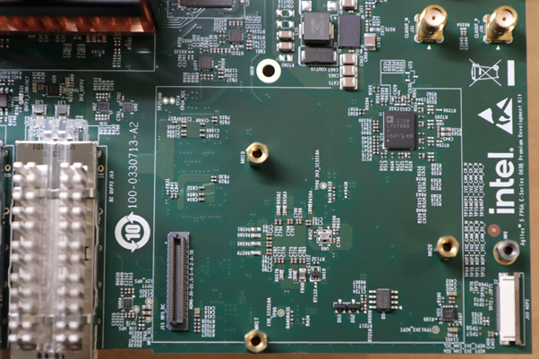

# HPS GSRD User Guide for the Agilex™ 5 E-Series Premium Dev Kit


##  Introduction

### GSRD Overview

The Golden System Reference Design (GSRD) is a reference design running on the Agilex&trade; 5 E-Series Premium  Development Kit.

The GSRD is comprised of the following components:

- Golden Hardware Reference Design (GHRD)
- Reference HPS software including:
  - Arm Trusted Firmware
  - U-Boot
  - Linux Kernel
  - Linux Drivers
  - Sample Applications

> <span style="color: red; font-weight: bold;">Important Note</span>: In order to simplify the GSRD build process, Altera introduced GSRD 2.0, which uses Kas as a lightweight build orchestration layer on top of BitBake / Yocto. In this release, the HPS Enablement daughter card is supported, for both booting from SD card and QSPI. In future releases, all HPS daughtercards will be supported by GSRD 2.0.

### Prerequisites

The following are required to be able to fully exercise the Agilex 5 Premium Development Kit GSRD:

* Altera&reg; Agilex&trade; 5 FPGA E-Series 065B Premium Development Kit, ordering code DK-A5E065BB32AES1. Refer to [board documentation](https://www.intel.com/content/www/us/en/products/details/fpga/development-kits/agilex/a5e065b-premium.html) for more information about the development kit.

  * HPS Enablement Expansion Board. Included with the development kit.
  * HPS NAND Board. Enables eMMC storage for HPS. Orderable separately.
  * HPS Test Board. Supports SD card boot, and external Arm tracing. Orderable separately.
  * Mini USB Cable. Included with the development kit.
  * Micro USB Cable. Included with the development kit.
  * Ethernet Cable. Included with the development kit.
  * Micro SD card and USB card writer. Included with the development kit.

* Host PC with:

  * 64 GB of RAM. Less will be fine for only exercising the binaries, and not rebuilding the GSRD.
  * 200 GB of free disk space for Yocto buils
  * Linux OS installed. Ubuntu 22.04LTS was used to create this page, other versions and distributions may work too
  * Serial terminal (for example GtkTerm or Minicom on Linux and TeraTerm or PuTTY on Windows)
  * Altera&reg; Quartus<sup>&reg;</sup> Prime Pro Edition Version 25.3.1 
  * TFTP server. This used to download the eMMC binaries to board to be flashed by U-Boot
  
* Local Ethernet network, with DHCP server
* Internet connection. For downloading the files, especially when rebuilding the GSRD.

### Prebuilt Binaries

The Agilex&trade; 5 Premium Development Kit GSRD binaries are located at [https://releases.rocketboards.org/2026.01/](https://releases.rocketboards.org/2026.01/):

| HPS Daughter Card | Boot Source | Link |
| -- | ---------------------- | -- |
| Enablement Board | SD Card | [https://releases.rocketboards.org/2026.01/gsrd/agilex5_dk_a5e065bb32aes1_gsrd.baseline-a55/](https://releases.rocketboards.org/2026.01/gsrd/agilex5_dk_a5e065bb32aes1_gsrd.baseline-a55/) |
| Enablement Board | SD Card | [https://releases.rocketboards.org/2026.01/gsrd/agilex5_dk_a5e065bb32aes1_gsrd.baseline-a76/](https://releases.rocketboards.org/2026.01/gsrd/agilex5_dk_a5e065bb32aes1_gsrd.baseline-a76/) |
| Enablement Board | QSPI | [https://releases.rocketboards.org/2026.01/qspi/agilex5_dk_a5e065bb32aes1_qspi](https://releases.rocketboards.org/2026.01/qspi/agilex5_dk_a5e065bb32aes1_qspi) |
| NAND Board | eMMC | [https://releases.rocketboards.org/2026.01/emmc/agilex5_dk_a5e065bb32aes1_emmc](https://releases.rocketboards.org/2026.01/emmc/agilex5_dk_a5e065bb32aes1_emmc) |
| Test Board | SD Card | [https://releases.rocketboards.org/2026.01/debug/agilex5_dk_a5e065bb32aes1_debug](https://releases.rocketboards.org/2026.01/debug/agilex5_dk_a5e065bb32aes1_debug) |


> *Note*: The GSRD release for the HPS Enablement Board comes in two versions: one which uses a Cortex-A55 as the boot core, and one which uses a Cortex-A76 as the boot core. The rest of the functionality is the same, and all cores are enabled in Linux by default. The instructions on how to exercise the binaries are the same for both versions. And the instructions for rebuilding the binaries are similar, just using a different version of the GHRD which has the respective option selected. 

### Component Versions

Altera&reg; Quartus<sup>&reg;</sup> Prime Pro Edition Version 25.3.1 and the following software component versions integrate the 25.3.1 release. 

**Note:** Regarding the GHRD components in the following table, only the device-specific GHRD is used in this page.

| Component                             | Location                                                     | Branch                       | Commit ID/Tag       |
| :------------------------------------ | :----------------------------------------------------------- | :--------------------------- | :------------------ |
| Agilex 3 GHRD | [https://github.com/altera-fpga/agilex3c-ed-gsrd](https://github.com/altera-fpga/agilex3c-ed-gsrd)    | main  | QPDS25.3.1_REL_GSRD_PR   |
| Agilex 5 GHRD - Include GSRD 2.0 baseline design + meta_custom | [https://github.com/altera-fpga/agilex5e-ed-gsrd](https://github.com/altera-fpga/agilex5e-ed-gsrd) | main                    | QPDS25.3.1_REL_GSRD_PR |
| Agilex 7 GHRD                         | [https://github.com/altera-fpga/agilex7f-ed-gsrd](https://github.com/altera-fpga/agilex7f-ed-gsrd) | main | QPDS25.3.1_REL_GSRD_PR |
| Stratix 10 GHRD                       | [https://github.com/altera-fpga/stratix10-ed-gsrd](https://github.com/altera-fpga/stratix10-ed-gsrd) | main | QPDS25.3.1_REL_GSRD_PR |
| Arria 10 GHRD                         | [https://github.com/altera-fpga/arria10-ed-gsrd](https://github.com/altera-fpga/arria10-ed-gsrd)  | main | QPDS25.3.1_REL_GSRD_PR |
| Linux                                 | [https://github.com/altera-fpga/linux-socfpga](https://github.com/altera-fpga/linux-socfpga) | socfpga-6.12.43-lts | QPDS25.3.1_REL_GSRD_PR |
| Arm Trusted Firmware                  | [https://github.com/altera-fpga/arm-trusted-firmware](https://github.com/altera-fpga/arm-trusted-firmware) | socfpga_v2.13.1   | QPDS25.3.1_REL_GSRD_PR |
| U-Boot                                | [https://github.com/altera-fpga/u-boot-socfpga](https://github.com/altera-fpga/u-boot-socfpga) | socfpga_v2025.10 | QPDS25.3.1_REL_GSRD_PR |
| Yocto Project                         | [https://git.yoctoproject.org/poky](https://git.yoctoproject.org/poky) | walnascar | latest              |
| Yocto Project: meta-altera-fpga (for GSRD 2.0) | [https://github.com/altera-fpga/meta-altera-fpga](https://github.com/altera-fpga/meta-altera-fpga) | walnascar | QPDS25.3.1_REL_GSRD_PR |
| Yocto Project: meta-intel-fpga (for Legacy GSRD) | [https://git.yoctoproject.org/meta-intel-fpga](https://git.yoctoproject.org/meta-intel-fpga) | walnascar | latest |
| Yocto Project: meta-intel-fpga-refdes (for Legacy GSRD) | [https://github.com/altera-fpga/meta-intel-fpga-refdes](https://github.com/altera-fpga/meta-intel-fpga-refdes) | walnascar | QPDS25.3.1_REL_GSRD_PR |
| Legacy GSRD | [https://github.com/altera-fpga/gsrd-socfpga](https://github.com/altera-fpga/gsrd-socfpga) | walnascar | QPDS25.3.1_REL_GSRD_PR |

**Note:** The combination of the component versions indicated in the table above has been validated through the use cases described in this page and it is strongly recommended to use these versions together. If you decided to use any component with different version than the indicated, there is not warranty that this will work.

### Release Notes

See [https://github.com/altera-fpga/gsrd-socfpga/releases/tag/QPDS25.3.1_REL_GSRD_PR](https://github.com/altera-fpga/gsrd-socfpga/releases/tag/QPDS25.3.1_REL_GSRD_PR)

### Development Kit

This release targets the Agilex 5 FPGA E-Series 065B Premium Development Kit. Refer to [board documentation](https://www.intel.com/content/www/us/en/products/details/fpga/development-kits/agilex/a5e065b-premium.html) for more information about the development kit.


<h4>Installing HPS Daughtercard</h4>

This section shows how to install the included HPS Enablement Daughtercard.  The installation for the other optional HPS Boards is similar.

1\. Identify the correct thumb screws and washers needed, they are in a plastic bag:  


2\. Locate the area on the development board where the HPS Daughtercard needs to be installed:  


3\. Place the plastic washers on top of the three hex mounting posts:  


4\. Place HPS Board on top of the posts and washers:  


5\. Place the hex thumb screws on the two posts, as shown below. Note the 3rd one on the bottom is best unplaced as fully screwing that in may move the board. Also note the thumb screw close to the Ethernet connector is hard to screw, recommend to use small pliers and patience to make it secure. It is important that the HPS Board is secure, and does not move:  
 

**Note**: If you need to swap HPS Boards frequently,  it is recommended to remove the hex posts, and install the plastic washers between the PCB and the posts. This way you do not need to be careful for the washers not to move when you place the HPS Board on top of the posts. Note there are also plastic washers underneath the development board PCB, make sure to leave those in place when performing this operation

<h4>Changing MSEL</h4>

MSEL signals instruct the FPGA device on which configuration scheme to use. Configuration schemes used by the scenarios presented in this guide are JTAG and QSPI. MSEL is changed through dipswitch SW27. Only change the settings while the board is powered off.

Configuration OFF-OFF-OFF-OFF corresponds to JTAG:


Configuration OFF-ON-ON-OFF corresponds to QSPI:


### GHRD Overview

The Golden Hardware Reference Design is an important part of the GSRD and consists of the following components:

- Hard Processor System (HPS)
  - Dual core Arm Cortex-A76 processor
  - Dual core Arm Cortex-A55 processor
  - HPS Peripherals connected to HPS Enablement Expansion Board:
    - Micro SD Card
    - EMAC
    - HPS JTAG debug
    - I3C
    - UART
    - USB 3.1
- Multi-Ported Front End (MPFE) for HPS External Memory Interface (EMIF)
- FPGA Peripherals connected to Lightweight HPS-to-FPGA (LWH2F) AXI Bridge and JTAG to Avalon Master Bridge
  - Three user LED outputs
  - Four user DIP switch inputs
  - Four user push-button inputs
  - System ID
- FPGA Peripherals connected to HPS-to-FPGA (H2F) AXI Bridge
  - 256KB of FPGA on-chip memory

 

The GHRD allows hardware designers to access each peripheral in the FPGA portion of the SoC with System Console, through the JTAG master module. This signal-level access is independent of the driver readiness of each peripheral.

<h4> MPU Address Maps</h4>

This section presents the address maps as seen from the MPU side.  
<h5> HPS-to-FPGA Address Map</h5>

The three FPGA windows in the MPU address map provide access to 256 GB of FPGA space. First window is 1 GB from 00_4000_0000, second window is 15 GB from 04_4000_0000, third window is 240 GB from 44_0000_0000. The following table lists the offset of each peripheral from the HPS-to-FPGA bridge in the FPGA portion of the SoC.

| Peripheral | Address Offset | Size (bytes) | Attribute |
| :-- | :-- | :-- | :-- |
| onchip_memory2_0 | 0x0 | 256K | On-chip RAM as scratch pad |

<h5>Lightweight HPS-to-FPGA Address Map</h5>

The the memory map of system peripherals in the FPGA portion of the SoC as viewed by the MPU, which starts at the lightweight HPS-to-FPGA base address of 0x00_2000_0000, is listed in the following table.

| Peripheral | Address Offset | Size (bytes) | Attribute |
| :-- | :-- | :-- | :-- |
| sysid | 0x0001_0000 | 32 | Unique system ID   |
| led_pio | 0x0001_0080 | 16 | LED outputs   |
| button_pio | 0x0001_0060 | 16 | Push button inputs |
| dipsw_pio | 0x0001_0070 | 16 | DIP switch inputs |

<h5>JTAG Master Address Map</h5>

There are three JTAG master interfaces in the design, one for accessing non-secure peripherals in the FPGA fabric, and another for accessing secure peripheral in the HPS through the FPGA-to-HPS Interface and another for FPGA fabric to SDRAM.

The following table lists the address of each peripheral in the FPGA portion of the SoC, as seen through the non-secure JTAG master interface.

| Peripheral | Address Offset | Size (bytes) | Attribute |
| :-- | :-- | :-- | :-- |
| onchip_memory2_0 | 0x0004_0000 | 256K | On-chip RAM |
| sysid | 0x0001_0000 | 32 | Unique system ID |
| led_pio | 0x0001_0080 | 16 | LED outputs |
| button_pio | 0x0001_0060 | 16 | Push button inputs |
| dipsw_pio | 0x0001_0070 | 16 | DIP switch inputs |

<h4> Interrupt Routing</h4>

The HPS exposes 64 interrupt inputs for the FPGA logic. The following table lists the interrupt connections from soft IP peripherals to the HPS interrupt input interface.
      
| Peripheral | Interrupt Number | Attribute |
| :-- | :-- | :-- |
| dipsw_pio | f2h_irq0[0] | 4 DIP switch inputs |
| button_pio | f2h_irq0[1] | 4 Push button inputs |

## Exercise Prebuilt Binaries

This section presents how to use the prebuilt binaries included with the GSRD release. 

### Configure Board

1\. Leave all jumpers and switches in their default configuration.

2\. Install the appropriate HPS Daughtercard.

3\. Connect mini USB cable from vertical connector on HPS Daughtercard to host PC. This is used for the HPS serial console.

4\. Connect micro USB cable from development board to host PC. This is used by the tools for JTAG communication.

5\. Connect Ethernet cable from HPS Board to an Ethernet switch connected to local network. Local network must provide a DCHP server.

### Configure Serial Console

All the scenarios included in this release require a serial connection. This section presents how to configure the serial connection.

1\. Install a serial terminal emulator application on your host PC:  

* For Windows: TeraTerm or PuTTY are available
* For Linux: GtkTerm or Minicom are available

2\. Power down your board if powered up. This is important, as once powered up, with the micro USB JTAG cable connected, a couple more USB serial ports will enumerate, and you may choose the wrong port.

3\. Connect mini-USB cable from the vertical mini-USB connector on the HPS Board to the host PC

4\. On the host PC, an USB serial port will enumerate. On Windows machines it will be something like `COM4`, while on Linux machines it will be something like `/dev/tty/USB0`.

5\. Configure your serial terminal emulator to use the following settings:  

* Serial port: as mentioned above
* Baud rate: 115,200
* Data bits: 8
* Stop bits: 1
* CRC: disabled
* Hardware flow control: disabled

6\. Connect your terminal emulator

### HPS Enablement Board

This section presents how to use HPS Enablement Board to boot from SD card, and also from QSPI.

#### Boot from SD Card
<hr/>
<h5 id="write-sd-card-image">Write SD Card</h5>

1\. Download SD card image archive from the prebuilt binaries, for either Cortex-A55 or Cortex-A76 as the boot core:

* [https://releases.rocketboards.org/2026.01/gsrd/agilex5_dk_a5e065bb32aes1_gsrd.baseline-a55/sdimage.tar.gz](https://releases.rocketboards.org/2026.01/gsrd/agilex5_dk_a5e065bb32aes1_gsrd.baseline-a55/sdimage.tar.gz)
* [https://releases.rocketboards.org/2026.01/gsrd/agilex5_dk_a5e065bb32aes1_gsrd.baseline-a76/sdimage.tar.gz](https://releases.rocketboards.org/2026.01/gsrd/agilex5_dk_a5e065bb32aes1_gsrd.baseline-a76/sdimage.tar.gz)

2\. Extract the archive, obtaining the file `gsrd-console-image-agilex5_devkit.wic`

3\. Write the gsrd-console-image-agilex5_devkit.wic. SD card image to the micro SD card using the included USB writer in the host computer:

- On Linux, use the `dd` utility as shown next:
```bash
# Determine the device asociated with the SD card on the host computer.	
cat /proc/partitions
# This will return for example /dev/sdx
# Use dd to write the image in the corresponding device
sudo dd if=gsrd-console-image-agilex5_devkit.wic of=/dev/sdx bs=1M
# Flush the changes to the SD card
sync
```
- On Windows, use the Win32DiskImager program, available at [https://sourceforge.net/projects/win32diskimager](https://sourceforge.net/projects/win32diskimager). For this, first rename the gsrd-console-image-agilex5_devkit.wic to an .img file (sdcard.img for example) and write the image as shown in the next figure:

 

<h5>Write QSPI Flash</h5>

1\. Power down board

2\. Set MSEL dipswitch SW27 to JTAG: OFF-OFF-OFF-OFF

3\. Power up the board

4\. Download and extract the JIC image:

When using Cortex-A55 as the boot core:

```bash
wget https://releases.rocketboards.org/2026.01/gsrd/agilex5_dk_a5e065bb32aes1_gsrd.baseline-a55/ghrd_a5ed065bb32ae6sr0.hps.jic.tar.gz
tar xf ghrd_a5ed065bb32ae6sr0.hps.jic.tar.gz
```

When using Cortex-A76 as the boot core:

```bash
wget https://releases.rocketboards.org/2026.01/gsrd/agilex5_dk_a5e065bb32aes1_gsrd.baseline-a76/ghrd_a5ed065bb32ae6sr0.hps.jic.tar.gz
tar xf ghrd_a5ed065bb32ae6sr0.hps.jic.tar.gz
```

5\. Write the JIC file to QSPI:

```bash
jtagconfig --setparam 1 JtagClock 16M
quartus_pgm -c 1 -m jtag -o "pvi;ghrd_a5ed065bb32ae6sr0.hps.jic"
```

<h5>Boot Linux</h5>

1\. Power down board

2\. Set MSEL dipswitch SW27 to ASX4 (QSPi): OFF-ON-ON-OFF

3\. Power up the board

4\. Wait for Linux to boot, use `root` as user name, and no password wil be requested.


<h5>Connect to Board Using SSH</h5>

1\. Boot to Linux  

2\. Determine the board IP address using the `ifconfig` command:
```bash
root@agilex5devkit:~# ifconfig
eth0: flags=-28605<UP,BROADCAST,RUNNING,MULTICAST,DYNAMIC>  mtu 1500
        inet 192.168.1.153  netmask 255.255.255.0  broadcast 192.168.1.255
        inet6 fe80::f0eb:c8ff:fec4:eed7  prefixlen 64  scopeid 0x20<link>
        ether f2:eb:c8:c4:ee:d7  txqueuelen 1000  (Ethernet)
        RX packets 649  bytes 45132 (44.0 KiB)
        RX errors 0  dropped 226  overruns 0  frame 0
        TX packets 56  bytes 8789 (8.5 KiB)
        TX errors 0  dropped 0 overruns 0  carrier 0  collisions 0
        device interrupt 23  

lo: flags=73<UP,LOOPBACK,RUNNING>  mtu 65536
        inet 127.0.0.1  netmask 255.0.0.0
        inet6 ::1  prefixlen 128  scopeid 0x10<host>
        loop  txqueuelen 1000  (Local Loopback)
        RX packets 100  bytes 8408 (8.2 KiB)
        RX errors 0  dropped 0  overruns 0  frame 0
        TX packets 100  bytes 8408 (8.2 KiB)
        TX errors 0  dropped 0 overruns 0  carrier 0  collisions 0
```
3\. Connect to the board over SSH using `root` username, no password will be requested:
```bash
ssh root@192.168.1.153
```
> *Note*: Make sure to replace the above IP address to the one matching the output of running `ifconfig` on youir board.

<h5>Run Sample Applications</h5>

> <span style="color: red; font-weight: bold;">Important Note</span>: By default, the sample applications are not built into the image. You need to rebuild the GSRD with the corresponding options enabled in Kas configuration: *Altera Linux Applications*>*Syschck*, *Example Applications*>*Hello World*.

1\. Boot to Linux

2\. Change current folder to `intelFPGA` folder
```bash
cd intelFPGA
```
3\. Run the hello world application
```bash
./hello
```
4\. Run the `syscheck` application
```bash
./syscheck
```
Press `q` to exit the `syscheck` application.

<h5>Control LEDs Connected to FPGA Fabric</h5>

> <span style="color: red; font-weight: bold;">Important Note</span>: By default, the LED control apps are not built into the image. You need to rebuild the GSRD with the corresponding option enabled in Kas configuration *Altera Linux Applications*: *LED Control*.


The following LEDs are exercised:

| Led Number | Silkscreen | Component |
| :-- | :-- | :-- |
| 0 | USER_LED1 | D16 |
| 1 | USER_LED2 | D17 |
| 2 | USER_LED3 | D18 |

> *Note*: USER_LED4/D19 is quickly blinking, and cannot be controlled from software.

1\. In order to blink an LED in a loop, with a specific delay in ms, run the following command:

```bash
./blink <led_number> <delay_ms>
```

- The **led_number** specifies the desired LED, and is a value between 0 and 3.
- The **delay_ms** is a number that specifies the desired delay in ms between turning the LED on and off.

2\. In order to turn an individual LED on or off, run the following command:

```bash
./toggle <led_number> <state>
```

- The **led_number** specifies the desired LED, and is a value between 0 and 3.
- The **state** needs to be 0 to turn the LED off, and 1 to turn the LED on.

3\. In order to scroll the FPGA LEDs with a specific delay, please run the following command:

```bash
./scroll_client <delay>
```

The **delay** specifies the desired scrolling behavior:

- **delay > 0** - specify new scrolling delay in ms, and start scrolling
- **delay < 0** - stop scrolling
- **delay = 0** - display current scroll delay


You can also control the LEDs directly by accessing the following sysfs entries:

* /sys/class/leds/fpga_led0/brightness
* /sys/class/leds/fpga_led1/brightness
* /sys/class/leds/fpga_led2/brightness

using commands such as:
```bash
cat /sys/class/leds/fpga_led0/brightness
echo -e 0 > /sys/class/leds/fpga_led0/brightness
echo -e 1 > /sys/class/leds/fpga_led1/brightness
```

<h5>Visit Board Web Page</h5>

> <span style="color: red; font-weight: bold;">Important Note</span>: By default, the web server functionality is not built into the image. You need to rebuild the GSRD with the corresponding option enabled in Kas configuration *Altera Linux Applications*: *LED Control*. If you use the default image, the webserver will sever a simple page that says "It works!"


1\. Boot to Linux  

2\. Determine board IP address using `ifconfig` like in the previous scenario  

3\. Start a web browser and enter the IP address in the address bar  

4\. The web browser will display a page served by the web server running on the board.  


* You will able to see which LED are ON and OFF in **LED Status**.
* You can **Start** and **Stop** the LED from scrolling. Set the delay(ms) in the **LED Lightshow** box. 
* You can controll each LED with ON and OFF button.
* Blink each LED by entering the delay(ms) and click on the **BLINK** button.


#### Boot from QSPI
<hr/>
This section presents how to boot from QSPI. One notable aspect is that you need to wipe the SD card partitioning information, as otherwise U-Boot SPL could find a valid SD card image, and try to boot from that first.

<h5>Wipe SD Card</h5>

Either write 1MB of zeroes at the beginning of the SD card, or remove the SD card from the HPS Daughter Card. You can use `dd` on Linux, or `Win32DiskImager` on Windows to achieve this.

<h5>Write QSPI Flash</h5>

1\. Power down board

2\. Set MSEL dipswitch SW27 to JTAG: OFF-OFF-OFF-OFF

3\. Power up the board

4\. Download and extract the JIC image:

To use Cortex-A55 as the boot core:
```bash
wget https://releases.rocketboards.org/2026.01/qspi/agilex5_dk_a5e065bb32aes1_qspi.baseline-a55/agilex_flash_image.hps.jic.tar.gz
tar xf agilex_flash_image.hps.jic.tar.gz
jtagconfig --setparam 1 JtagClock 16M
quartus_pgm -c 1 -m jtag -o "pvi;agilex_flash_image.hps.jic"
```

To use Cortex-A76 as the boot core:
```bash
wget https://releases.rocketboards.org/2026.01/qspi/agilex5_dk_a5e065bb32aes1_qspi.baseline-a76/agilex_flash_image.hps.jic.tar.gz
tar xf agilex_flash_image.hps.jic.tar.gz
jtagconfig --setparam 1 JtagClock 16M
quartus_pgm -c 1 -m jtag -o "pvi;agilex_flash_image.hps.jic"
```

5\. Write JIC image to QSPI:
```bash
jtagconfig --setparam 1 JtagClock 16M
quartus_pgm -c 1 -m jtag -o "pvi;agilex_flash_image.hps.jic"
```

<h5>Boot Linux</h5>

1\. Power down board

2\. Set MSEL dipswitch SW27 to ASX4 (QSPi): OFF-ON-ON-OFF

3\. Power up the board

4\. Wait for Linux to boot, use `root` as user name, and no password wil be requested.

**Note**: On first boot, the UBIFS rootfilesystem is initialized, and that takes a few minutes. This will not happen on next reboots. See a sample log below:

```
[   17.033558] UBIFS (ubi0:4): Mounting in unauthenticated mode
[   17.039470] UBIFS (ubi0:4): background thread "ubifs_bgt0_4" started, PID 130
[   17.061510] UBIFS (ubi0:4): start fixing up free space
[   20.644496] random: crng init done
[   27.120040] platform soc:leds: deferred probe pending
[  243.190874] UBIFS (ubi0:4): free space fixup complete
[  243.315909] UBIFS (ubi0:4): UBIFS: mounted UBI device 0, volume 4, name "rootfs"
[  243.323290] UBIFS (ubi0:4): LEB size: 65408 bytes (63 KiB), min./max. I/O unit sizes: 8 bytes/256 bytes
[  243.332653] UBIFS (ubi0:4): FS size: 167117440 bytes (159 MiB, 2555 LEBs), max 6500 LEBs, journal size 
```

### HPS NAND Board

This section presents how to use HPS NAND Board to boot from eMMC.

#### Boot from eMMC
<hr/>
<h5>Configure Board</h5>
For this scenario, we are using the HPS NAND Board, which can be configured through dipswitch SW3 to enable either eMMC or NAND. Set SW3 to ON to enable eMMC.

<h5>Write eMMC Flash</h5>

We are writing the eMMC Flash by using U-Boot commands. We are getting to U-Boot prompt by booting from QSPI using a JIC image which contains U-Boot, thereby not relying on what is already in eMMC.

1\. Download, and extract the eMMC image
```bash
wget https://releases.rocketboards.org/2026.01/emmc/agilex5_dk_a5e065bb32aes1_emmc/sdimage.tar.gz
tar xf sdimage.tar.gz
```
2\. Split the eMMC image into 1GB chunks and copy them to your TFT folder:
```bash
split --bytes=1G gsrd-console-image-agilex5_devkit.wic
mv xa* <your_tfp_folder>
```
This will put the two chunks called `xaa` and `xab` on your TFTP folder.
3\. Power down the board. 

4\. Set MSEL dipswitch SW27 to JTAG: OFF-OFF-OFF-OFF

5\. Power up the board

6\. Download the helper JIC used to write the eMMC image, extract it and write it to QSPI:
```bash
wget https://releases.rocketboards.org/2026.01/emmc/agilex5_dk_a5e065bb32aes1_emmc/uboot.jic.tar.gz
tar xf uboot.jic.tar.gz
jtagconfig --setparam 1 JtagClock 16M
quartus_pgm -c 1 -m jtag -o "pvi;uboot.jic"
```
7\. Determine your host IP address using `ifconfig` to use it as the IP address of the TFTP server

8\. Power down the board

9\. Set MSEL dipswitch SW27 to ASX4 (QSPi): OFF-ON-ON-OFF

10\. Power up the board

11\. Stop U-Boot at the boot countdown, to drop to U-Boot console

12\. At the U-Boot console, run the following commands to write the SD card image:
```
setenv autoload no
dhcp
setenv serverip <tftp_server_ip_address>
tftp ${loadaddr} xaa
setexpr blkcnt1 ${filesize} / 0x200
mmc write ${loadaddr} 0 ${blkcnt1}
tftp ${loadaddr} xab
setexpr blkcnt2 ${filesize} / 0x200
mmc write ${loadaddr} ${blkcnt1} ${blkcnt2}
```
**Note**: If you already have a valid image in eMMC, the U-Boot SPL which runs from QSPI will be able to see that and load it instead of the U-Boot from QSPI. To prevent this from happening, you can wipe out the eMMC card partitioning, then issue a reset for U-Boot to reboot into the QSPI helper JIC:

```
mw.w ${loadaddr} 0x0 0x80000
mmc rescan
mmc write ${loadaddr} 0x0 0x400
reset
```
<h5>Write QSPI Flash</h5>

1\. Power down the board. 

2\. Set MSEL dipswitch SW27 to JTAG: OFF-OFF-OFF-OFF

3\. Power up the board

4\. Download the JIC and write it to QSPI:
```bash
wget https://releases.rocketboards.org/2026.01/emmc/agilex5_dk_a5e065bb32aes1_emmc/ghrd_a5ed065bb32ae6sr0.hps.jic.tar.gz 
tar xf ghrd_a5ed065bb32ae6sr0.hps.jic.tar.gz
jtagconfig --setparam 1 JtagClock 16M
quartus_pgm -c 1 -m jtag -o "pvi;ghrd_a5ed065bb32ae6sr0.hps.jic"
```
<h5>Boot Linux</h5>
1\. Power down the board. 

2\. Set MSEL dipswitch SW27 to ASX4 (QSPi): OFF-ON-ON-OFF

3\. Power up the board

4\. Board will boot to Linux. Enter `root` as username, no password will be requested

### HPS Test Board

This section presents how to use HPS Test Board to boot from SD card.

#### Boot from SD Card
<hr/>
<h5>Configure Board</h5>

For this scenario we are using the HPS Test Board. There is single dipswitch on that board called SW1, which needs to be set to the ON position.

<h5>Write SD Card</h5>

1\. Download SD card image from the prebuilt binaries https://releases.rocketboards.org/2026.01/debug/agilex5_dk_a5e065bb32aes1_debug/sdimage.tar.gz and extract the archive, obtaining the file `gsrd-console-image-agilex5_devkit.wic`.

2\. Write the SD card image to the micro SD card using the included USB writer in the host computer, and `dd` utility on Linux, or  Win32DiskImager on Windows, available at [https://sourceforge.net/projects/win32diskimager](https://sourceforge.net/projects/win32diskimager). Please refer to the [Booting from SD Card](#booting-from-sd-card) section for more details about this.

<h5>Write QSPI Flash</h5>

1\. Power down the board. 

2\. Set MSEL dipswitch SW27 to JTAG: OFF-OFF-OFF-OFF

3\. Power up the board

4\. Download the JIC and write it to QSPI:
```bash
wget https://releases.rocketboards.org/2026.01/debug/agilex5_dk_a5e065bb32aes1_debug/ghrd_a5ed065bb32ae6sr0.hps.jic.tar.gz 
tar xf ghrd_a5ed065bb32ae6sr0.hps.jic.tar.gz
jtagconfig --setparam 1 JtagClock 16M
quartus_pgm -c 1 -m jtag -o "pvi;ghrd_a5ed065bb32ae6sr0.hps.jic"
```

<h5>Boot Linux</h5>

1\. Power down the board. 

2\. Set MSEL dipswitch SW27 to ASX4 (QSPi): OFF-ON-ON-OFF

3\. Power up the board

4\. Board will boot to Linux. Enter `root` as username, no password will be requested

## Build GSRD 2.0 Binaries

Kas is a Python-based lightweight build orchestration layer on top of BitBake/Yocto. Kas allows you to define your build environment in a YAML manifest, so you can perform checkout, environment setup, configuration, and build invocation with a single command. 

In order to simplify the GSRD build process, Altera introduces GSRD 2.0, which uses [Kas](https://github.com/siemens/kas). In this release, the HPS Enablement daughter card is supported, for both booting from SD card and QSPI. In the future, more boards and daughter cards will be supported.

Kas replaces the [gsrd-socfpga repository](https://github.com/altera-fpga/gsrd-socfpga), providing a more maintainable build description. It offers improved reproducibility, reduced setup friction, and a clearer abstraction for managing multiple layers, revisions, and configuration fragments. Once all GSRD variations move to Kas, the gsrd-soc-fpga repository and GSRD build script will be retired.

The GSRD 2.0 software source code is released inside the [software/yocto_linux](https://github.com/altera-fpga/agilex5e-ed-gsrd/tree/QPDS25.3.1_REL_GSRD_PR/a5ed065es-premium-devkit-oobe/baseline/software/yocto_linux) directory of the Agilex 5 E-Series Golden Hardware Reference Design (GHRD). Accessing the link will display a README page with details on how the GSRD 2.0 is organized around the Kas tool.

For more details about Kas, refer to the official documentation at [https://kas.readthedocs.io/en/latest/](https://kas.readthedocs.io/en/latest/).

### Kas Build Prerequisites

The same [prerequisites](#yocto-build-prerequisites) as for regular Yocto build are required. 

1\. Make sure you have Yocto system requirements met: https://docs.yoctoproject.org/5.0.1/ref-manual/system-requirements.html#supported-linux-distributions.

The command to install the required packages on Ubuntu 22.04 is:

```bash
sudo apt-get update
sudo apt-get upgrade
sudo apt-get install openssh-server mc libgmp3-dev libmpc-dev gawk wget git diffstat unzip texinfo gcc \
build-essential chrpath socat cpio python3 python3-pip python3-pexpect xz-utils debianutils iputils-ping \
python3-git python3-jinja2 libegl1-mesa libsdl1.2-dev pylint xterm python3-subunit mesa-common-dev zstd \
liblz4-tool git fakeroot build-essential ncurses-dev xz-utils libssl-dev bc flex libelf-dev bison xinetd \
tftpd tftp nfs-kernel-server libncurses5 libc6-i386 libstdc++6:i386 libgcc++1:i386 lib32z1 \
device-tree-compiler curl mtd-utils u-boot-tools net-tools swig -y
```

On Ubuntu 22.04 you will also need to point the /bin/sh to /bin/bash, as the default is a link to /bin/dash:

```bash
 sudo ln -sf /bin/bash /bin/sh
```

**Note**: You can also use a Docker container to build the Yocto recipes, refer to https://rocketboards.org/foswiki/Documentation/DockerYoctoBuild for details. When using a Docker container, it does not matter what Linux distribution or packages you have installed on your host, as all dependencies are provided by the Docker container.

In addition to the above, you must also install `python3-newt`, and `python3.10-venv` with a command like this:

```bash
sudo apt-get install python3-newt python3.10-venv
```

### HPS Enablement Board

#### Build SD Card Binaries


<h5>Setup Environment</h5>

1\. Create the top folder to store all the build artifacts:


```bash
sudo rm -rf agilex5_gsrd_20.enablement_sd
mkdir agilex5_gsrd_20.enablement_sd
cd agilex5_gsrd_20.enablement_sd
export TOP_FOLDER=`pwd`
```


Enable Quartus tools to be called from command line:


```bash
export QUARTUS_ROOTDIR=~/altera_pro/25.3.1/quartus/
export PATH=$QUARTUS_ROOTDIR/bin:$QUARTUS_ROOTDIR/linux64:$QUARTUS_ROOTDIR/../qsys/bin:$PATH
```


<h5>Build Hardware Design</h5>


```bash
cd $TOP_FOLDER
rm -rf agilex5_soc_devkit_ghrd && mkdir agilex5_soc_devkit_ghrd && cd agilex5_soc_devkit_ghrd
wget https://github.com/altera-fpga/agilex5e-ed-gsrd/releases/download/QPDS25.3.1_REL_GSRD_PR/a5ed065es-premium-devkit-oobe-baseline-a55.zip
unzip a5ed065es-premium-devkit-oobe-baseline-a55.zip
rm -f a5ed065es-premium-devkit-oobe-baseline-a55.zip
make baseline_a55-install
```


The following files are created:

* `$TOP_FOLDER/agilex5_soc_devkit_ghrd/output_files/baseline_a55.sof`
* `$TOP_FOLDER/agilex5_soc_devkit_ghrd/output_files/baseline_a55_hps_debug.sof`
* `$TOP_FOLDER/agilex5_soc_devkit_ghrd/output_files/baseline_a55_hps_debug.core.rbf`


<h5>Build Yocto Using Kas</h5>


1\. Create and enter a new Python virtual environment:


```bash
cd $TOP_FOLDER/agilex5_soc_devkit_ghrd/software/yocto_linux
python3 -m venv venv --system-site-packages
source venv/bin/activate
pip install --upgrade pip
pip install kas
pip install --upgrade kas
pip install kconfiglib
```


2\. Copy the core.rbf file to where Kas expects it to be:


```bash
cp $TOP_FOLDER/agilex5_soc_devkit_ghrd/output_files/baseline_a55_hps_debug.core.rbf \
   $TOP_FOLDER/agilex5_soc_devkit_ghrd/software/yocto_linux/meta-custom/recipes-fpga/fpga-bitstream/files/
```


3\. Build Yocto with Kas:


```bash
kas build kas.yml gsrd-console-image
```


The following relevant files are created in `$TOP_FOLDER/agilex5_soc_devkit_ghrd/software/yocto_linux/build/tmp/deploy/images/agilex5e/`:

* `gsrd-console-image-agilex5e.rootfs.wic`
* `u-boot-spl-dtb.hex`

> **Note**: If you experience build failures related to file-locks, you can work around these by reducing the parallelism of your build by running the following commands before running `kas`:

```bash
export PARALLEL_MAKE="-j 8"
export BB_NUMBER_THREADS="8"
export BB_ENV_PASSTHROUGH_ADDITIONS="$BB_ENV_PASSTHROUGH_ADDITIONS PARALLEL_MAKE BB_NUMBER_THREADS"
```


<h5>Build QSPI Image</h5>


```bash
cd $TOP_FOLDER
rm -f baseline.hps.jic baseline.core.rbf
quartus_pfg \
-c agilex5_soc_devkit_ghrd/output_files/baseline_a55.sof baseline.jic \
-o device=MT25QU128 \
-o flash_loader=A5ED065BB32AE6SR0 \
-o hps_path=agilex5_soc_devkit_ghrd/software/yocto_linux/build/tmp/deploy/images/agilex5e/u-boot-spl-dtb.hex \
-o mode=ASX4 \
-o hps=1
```


The following file is created:

* `$TOP_FOLDER/baseline.hps.jic`


#### Build QSPI Binaries


<h5>Setup Environment</h5>

1\. Create the top folder to store all the build artifacts:


```bash
sudo rm -rf agilex5_gsrd_20.enablement_qspi
mkdir agilex5_gsrd_20.enablement_qspi
cd agilex5_gsrd_20.enablement_qspi
export TOP_FOLDER=`pwd`
```


Enable Quartus tools to be called from command line:


```bash
export QUARTUS_ROOTDIR=~/altera_pro/25.3.1/quartus/
export PATH=$QUARTUS_ROOTDIR/bin:$QUARTUS_ROOTDIR/linux64:$QUARTUS_ROOTDIR/../qsys/bin:$PATH
```


<h5>Build Hardware Design</h5>


```bash
cd $TOP_FOLDER
rm -rf agilex5_soc_devkit_ghrd && mkdir agilex5_soc_devkit_ghrd && cd agilex5_soc_devkit_ghrd
wget https://github.com/altera-fpga/agilex5e-ed-gsrd/releases/download/QPDS25.3.1_REL_GSRD_PR/a5ed065es-premium-devkit-oobe-baseline-a55.zip
unzip a5ed065es-premium-devkit-oobe-baseline-a55.zip
rm -f a5ed065es-premium-devkit-oobe-baseline-a55.zip
make baseline_a55-install
```


The following files are created:

* `$TOP_FOLDER/agilex5_soc_devkit_ghrd/output_files/baseline_a55.sof`
* `$TOP_FOLDER/agilex5_soc_devkit_ghrd/output_files/baseline_a55_hps_debug.sof`
* `$TOP_FOLDER/agilex5_soc_devkit_ghrd/output_files/baseline_a55_hps_debug.core.rbf`


<h5>Build Yocto Using Kas</h5>


1\. Create and enter a new Python virtual environment. A virtual environment allows you to install packages without impacting your global environment:


```bash
cd $TOP_FOLDER/agilex5_soc_devkit_ghrd/software/yocto_linux
python3 -m venv venv --system-site-packages
source venv/bin/activate
pip install --upgrade pip
pip install kas
pip install --upgrade kas
pip install kconfiglib
```


2\. Copy the core.rbf file to where Kas expects it to be:


```bash
cp $TOP_FOLDER/agilex5_soc_devkit_ghrd/output_files/baseline_a55_hps_debug.core.rbf \
   $TOP_FOLDER/agilex5_soc_devkit_ghrd/software/yocto_linux/meta-custom/recipes-fpga/fpga-bitstream/files/
```


3\. Build Yocto with Kas:


```bash
kas build kas.yml:qspi_boot_src.yml console-image-minimal
```


> **Note**: If you wish to customize your Linux image, you can use the `kas menu` command instead. The options here are explained in section [Customizing Yocto Kas Build](#customizing-yocto-kas-build) below.

The following relevant files are created in `$TOP_FOLDER/agilex5_soc_devkit_ghrd/software/yocto_linux/build/tmp/deploy/images/agilex5e/`:

* `u-boot-spl-dtb.hex`
* `u-boot.itb`
* `core-image-minimal-agilex5e.rootfs_nor.ubifs`
* `kernel.itb`
* `boot.scr.uimg`


<h5>Build QSPI Image</h5>


1\. Create the folder to contain all the files:

```bash
cd $TOP_FOLDER
sudo rm -rf qspi_boot
mkdir qspi_boot
cd qspi_boot
```

2\. Get the `ubinize_nor.cfg` file which contains the details on how to build the `root.ubi` volume, and `agilex5_devkit_flash_image_hps.pfg` which contains the instructions for Programming File Generator on how to create the .jic filem and the `uboot.env` containing the U-Boot environment:

```bash
wget https://releases.rocketboards.org/2026.01/qspi/agilex5_dk_a5e065bb32aes1_qspi.baseline-a55/ubinize_nor.cfg
wget https://releases.rocketboards.org/2026.01/qspi/agilex5_dk_a5e065bb32aes1_qspi.baseline-a55/flash_image_hps.pfg
wget https://releases.rocketboards.org/2026.01/qspi/agilex5_dk_a5e065bb32aes1_qspi.baseline-a55/uboot.env
```

3\. Link to the files that are needed from building the hardware design, and yocto:

```bash
ln -s $TOP_FOLDER/agilex5_soc_devkit_ghrd/output_files/baseline_a55.sof ghrd.sof
ln -s $TOP_FOLDER/agilex5_soc_devkit_ghrd/software/yocto_linux/build/tmp/deploy/images/agilex5e/u-boot-spl-dtb.hex .
ln -s $TOP_FOLDER/agilex5_soc_devkit_ghrd/software/yocto_linux/build/tmp/deploy/images/agilex5e/u-boot.itb u-boot.bin
ln -s $TOP_FOLDER/agilex5_soc_devkit_ghrd/software/yocto_linux/build/tmp/deploy/images/agilex5e/console-image-minimal-agilex5e.rootfs_nor.ubifs .
ln -s $TOP_FOLDER/agilex5_soc_devkit_ghrd/software/yocto_linux/build/tmp/deploy/images/agilex5e/kernel.itb .
ln -s $TOP_FOLDER/agilex5_soc_devkit_ghrd/software/yocto_linux/build/tmp/deploy/images/agilex5e/boot.scr.uimg .
```


4\. Create the `root.ubi` file and rename it to `hps.bin` as Programming File Generator needs the `.bin` extension:

```bash
ubinize -o root.ubi -p 65536 -m 1 -s 1 ubinize_nor.cfg
ln -s root.ubi hps.bin
```

5\. Create the JIC file:

```bash
quartus_pfg -c flash_image_hps.pfg
```


The following file will be created:

* `$TOP_FOLDER/qspi_boot/qspi_flash_image.hps.jic`


### Additional Guides


#### Customize Kas Build

The `kas.yml` file is the central configuration file used by Kas to define all components required for a reproducible Yocto build environment. It specifies the repositories, branches, layers, and build targets, as well as optional environment variables and machine settings. By consolidating this information into a single YAML file, `kas.yml` eliminates manual setup steps and ensures that builds can be easily replicated across systems or shared with collaborators. This makes it an essential part of version-controlled, automated build workflows.

Kas also offers Kconfig-based customizations to provide a flexible and user-friendly configuration experience. This enables you to select repositories, layers, and build targets through a structured menu interface instead of editing YAML files directly. This approach combines the clarity and reproducibility of Kas with the modular configurability of the Linux kernel’s Kconfig system, making it easier to tailor builds for different platforms or use cases while maintaining a consistent and automated setup.

Review the kas.yml file, the Kconfig options and associated documentation at [https://github.com/altera-fpga/agilex5e-ed-gsrd/tree/QPDS25.3.1_REL_GSRD_PR/a5ed065es-premium-devkit-oobe/baseline-a55/software/yocto_linux](https://github.com/altera-fpga/agilex5e-ed-gsrd/tree/QPDS25.3.1_REL_GSRD_PR/a5ed065es-premium-devkit-oobe/baseline-a55/software/yocto_linux).

In the build instructions presented in [Rebuilding GSRD 2.0 Binaries](#rebuilding-gsrd-20-binaries), we did not use the Kconfig options, only the default options from `kas.yml` were used. This section shows how you can use `kas menu` to customize the build.

When using `kas menu`, the initial settings from `kas.yml` are customized with the user selected options through Kconfig, and are saved to a file called `.config.yaml` which is then used for build purposes.


1\. Build the hardware design as mentioned before. Note the same hardware design is used for both booting from SD card and booting from QSPI.

2\. Copy the core.rbf file to where Kas needs it to be. Note that the filename when using Kconfig is different than when using the `kas.yml` alone (`top.core.rbf` vs `baseline_a55_hps_debug.core.rbf`)

```bash
cp $TOP_FOLDER/agilex5_soc_devkit_ghrd/output_files/baseline_a55_hps_debug.core.rbf \
   $TOP_FOLDER/agilex5_soc_devkit_ghrd/software/yocto_linux/meta-custom/recipes-fpga/fpga-bitstream/files/top.core.rbf
```

3\. Create an enter a new Python virtual environment, not to interfere with the current system Python packages:

```bash
cd $TOP_FOLDER/agilex5_soc_devkit_ghrd/software/yocto_linux
python3 -m venv venv --system-site-packages
source venv/bin/activate
pip install --upgrade pip
pip install kas
pip install --upgrade kas
pip install kconfiglib
```

4\. Run `kas menu`:

```bash
kas menu
```

5\. You will be presented with a Kconfig text menu, similar to the ones from Linux Kernel & U-Boot:


6\. Go to **FPGA Options** screen and make any changes you desire:


7\. Go to **Image Target Selection** screen and select which images to be built:


8\. Go to **Networking Libraries and Apllications** screen and select desired options:


9\. Go to **Altera Linux Applications** screen and select the desired applications:


10\. Go to **Example Applications** screen and select what you need:


11\. Once you have selected all the options you want, you can clik the **Build** button to start the build process:


See below the locations where different components selected above are located in the generated filesystem:

```bash
/usr/bin/hello-world
/usr/bin/coremark
/usr/bin/etherlink
/home/root/intelFPGA/blink
/home/root/intelFPGA/scroll_client
/home/root/intelFPGA/syschk
/home/root/intelFPGA/toggle
```

#### Build Kas Interactively

In addition to using `kas build` to build Yocto based on the `kas.yml` and `kas menu` to build Yocto based on Kconfig options selected from the text GUI, there is also the `kas shell` option, which allows you to build Yocto interactively.


1\. Build the hardware design as mentioned before. Note the same hardware design is used for both booting from SD card and booting from QSPI.

2\. Copy the core.rbf file to where bitbake needs it to be. 

```bash
cp $TOP_FOLDER/agilex5_soc_devkit_ghrd/output_files/baseline_a55_hps_debug.core.rbf \
   $TOP_FOLDER/agilex5_soc_devkit_ghrd/software/yocto_linux/meta-custom/recipes-fpga/fpga-bitstream/files/
```

3\. Create an enter a new Python virtual environment, not to interfere with the current system Python packages:

```bash
cd $TOP_FOLDER/agilex5_soc_devkit_ghrd/software/yocto_linux
python3 -m venv venv --system-site-packages
source venv/bin/activate
pip install --upgrade pip
pip install kas
pip install --upgrade kas
pip install kconfiglib
```

4\. You can optionally use `kas menu` to change settings, and at the end press the **Save** button instead of the **Build** button. This will save the custom configuration in the file `.config.yaml`.

5\. Run `kas shell`, there are several options:

| Command | Description |
| :-- | :-- |
| `kas shell` | Use the configuration from the `.config.yaml ` resulted from using `kas menu` |
| `kas shell kas.yml` | Use the default configuration for SD card boot |
| `kas shell kas.yml:qspi_boot_src.yml` | Use the default configuration for QSPI boot |

6\. Use regular `bitbake` commands. For example to simply build the rootfs, use:

```bash
bitbake core-image-minimal
bitbake console-image-minimal
bitbake gsrd-console-image
```

#### Update kernel.itb File


The **kernel.itb** file is a Flattattened Image Tree (FIT) file that includes the following components:

* Linux kernel.
* Board configurations* that indicate what components from the **kernel.itb** (Linux kernel, device tree and Phase 2 FPGA configuration bitstream) should be used for a specific board.
* Linux device tree*.
* Phase 2 FPGA configuration bitstream*.

 \* One or more of these components to support the different board configurations.

The **kernel.itb** is created from a **.its** (Image Tree Source file) that describes its structure. In the GSRD 2.0, the  **kernel.itb** file is generated in the following directory. In this directory you can also find the **.its** files and all other the components needed to create the **kernel.itb** :

* **$TOP_FOLDER/<*gsrd-directory*>/<*project-directory*>/software/yocto_linux/build/tmp/work/<*device*>-poky-linux/linux-socfpga-lts/<*linux-branch*>+git/linux-<*device*>-standard-build/**

As an example of this path, for the Agilex 5 device you will find this directory as
$TOP_FOLDER/a5ed065es-premium-devkit-oobe/baseline-a55/software/yocto_linux/build/tmp/work/agilex5e-poky-linux/linux-socfpga-lts/6.12.43-lts+git/linux-agilex5e-standard-build

If you want to modify the **kernel.itb** by replacing one of the component or modifying any board configuration, you can do the following:

1. Install **mtools** package in your Linux machine.
   ```bash
   $ sudo apt update
   $ sudo apt install mtools
   ```
   
2. Go to the folder in which the **kernel.itb** is being created under the GSRD.
   ```bash
   $ cd $TOP_FOLDER/<gsrd-directory>/<project-directory>/software/yocto_linux/build/tmp/work/<device>-poky-linux/linux-socfpga-lts/<linux-branch>+git/linux-<device>-standard-build/
   $ ls *.its
   fit_<device>_kernel_.its
   ```
   
3. In the **.its** file, observe the components that integrates the kernel.itb identifying the nodes as indicated next:

   **images** node:<br>
   - **kernel** node - Linux kernel defined with the **data** parameter in the node.<br>
   - **fdt-X** node    - Device tree X defined with the **data** parameter in the node.<br>
   - **fpga-X** node -  Phase 2 FPGA configuration bitstream .rbf defined with the **data** parameter in the node. 

   **configurations** node:<br>
   - **board-X** node - Board configuration with the name defined with the **description** parameter. The components for a specific board configuration are defined with the **kernel**, **fdt** and **fpga** parameters.   

4. In this directory, you can replace any of the file components that integrate the **kernel.itb**, or you can also modify the **.its** to change the structure and components of the kernel.itb.

5. Finally, you need to re-generate the new **kernel.itb** running the following command in the same **linux-<device>-standard-build/** directory.
   ```bash
   $ rm kernel.itb
   $ mkimage -f fit_<device>_kernel.its kernel.itb
   ```

Once that you have completed this procedure, you can use the new **kernel.itb** as needed. Some options could be:

* Use U-Boot to load this into the SDRAM board through TFTP to boot Linux or to write it to a flash device
* Directly update the flash image in your board (QSPI, SD Card, eMMC or NAND) from your working machine.
 

#### Update SD Card Image


As part of the Yocto GSRD build flow, the SD Card image is built for the SD Card boot flow. This image includes a couple of partitions. One of these partition (a FAT32) includes the U-Boot proper, the Distroboot boot script, U-Boot environment and the Linux **.itb** - which includes the Linux kernel image, the Linux device tree, the phase 2 FPGA configuration bitstream and board configuration (there may be several versions of these last 3 components). The 2nd partition (an EXT3 or EXT4 ) includes the Linux file system. 

{: style="height:500px"}

If you want to replace any the components or add a new item in any of these partitions, without having to run again the Yocto build flow. 

This can be done through the **wic** script available on the **Poky** repository that is included as part of the GSRD build directory:

* **$TOP_FOLDER/<*gsrd-directory*>/<*project-directory*>/software/yocto_linux/poky/scripts/wic** 

The **wic** command requires to be run in the Yocto build environment that can be setup as shown next in a Linux terminal:

  ```bash
  cd $TOP_FOLDER/<gsrd-directory>/<project-directory>/software/yocto_linux/
  source poky/oe-init-build-env build
  ```
You can verify that the Yocto environment has been setup using the **which bitbake**  command, which will respond with the path of the **bitbake** command located at **poky/bitbake/bin/bitbake**.

The **wic** command allows you to inspect the content of a SD Card image, delete, add or replace any component inside of the image. This command is also provided with help support:

   ```bash
   $ $TOP_FOLDER/<gsrd-directory>/<project-directory>/software/yocto_linux/poky/scripts/wic help
   
   Creates a customized OpenEmbedded image.

   Usage:  wic [--version]
           wic help [COMMAND or TOPIC]
           wic COMMAND [ARGS]

       usage 1: Returns the current version of Wic
       usage 2: Returns detailed help for a COMMAND or TOPIC
       usage 3: Executes COMMAND

   COMMAND:

    list   -   List available canned images and source plugins
    ls     -   List contents of partitioned image or partition
    rm     -   Remove files or directories from the vfat or ext* partitions
    help   -   Show help for a wic COMMAND or TOPIC
    write  -   Write an image to a device
    cp     -   Copy files and directories to the vfat or ext* partitions
    create -   Create a new OpenEmbedded image
    :
    :
   ```
   
   The following steps show you how to replace the **kernel.itb** file inside of the fat32 partition in a .wic image.

1. The **wic ls** command allows you to inspect or navigate over the directory structure inside of the SD Card image. For example you can observe the partitions  in the SD Card image in this way.

  ```bash   
  # Here you can inspect the content a wic image see the 2 partitions inside of the SD Card image
  $ $TOP_FOLDER/<gsrd-directory>/<project-directory>/software/yocto_linux/poky/scripts/wic ls my_image.wic
   Num     Start        End          Size      Fstype
   1       1048576    525336575    524288000  fat32
   2     525336576   2098200575   1572864000  ext4

   
  # Here you can naviagate inside of the partition 1
   $ $TOP_FOLDER/<gsrd-directory>/<project-directory>/software/yocto_linux/poky/scripts/wic ls my_image.wic:1
  Volume in drive : is boot       
  Volume Serial Number is 8F65-ACE9
  Directory for ::/

  BOOTSC~1 UIM      2739 2011-04-05  23:00  boot.scr.uimg
  kernel   itb  12885831 2011-04-05  23:00 
  uboot    env      8192 2011-04-05  23:00 
  u-boot   itb    938816 2011-04-05  23:00 
        4 files          13 835 578 bytes
                        509 370 368 bytes free

  ```
   
2. The **wic rm** command allows you to delete any of the components in the selected partition. For example, you can delete the **kernel.itb** image from the partition 1(fat32 partition).

   ```bash
   $ $TOP_FOLDER/<gsrd-directory>/<project-directory>/software/yocto_linux/poky/scripts/wic rm my_image.wic:1/kernel.itb
   ```

3. The **wic cp** command allows you to copy any new item or file from your Linux machine to a specific partition and location inside of the SD Card image. For example, you can copy a new **kernel.itb** to the partition 1.

   ```bash
   $ $TOP_FOLDER/<gsrd-directory>/<project-directory>/software/yocto_linux/poky/scripts/wic cp <path_new_kernel.itb> my_image.wic:1/kernel.itb
   ```

**NOTE**: The **wic** application also allows you to modify any image with compatible vfat and ext* type partitions which also covers images used for **eMMC** boot flow.

## Build GSRD 1.0 Binaries

### Yocto Build Prerequisites

1\. Make sure you have Yocto system requirements met: https://docs.yoctoproject.org/5.0.1/ref-manual/system-requirements.html#supported-linux-distributions.

The command to install the required packages on Ubuntu 22.04 is:

```bash
sudo apt-get update
sudo apt-get upgrade
sudo apt-get install openssh-server mc libgmp3-dev libmpc-dev gawk wget git diffstat unzip texinfo gcc \
build-essential chrpath socat cpio python3 python3-pip python3-pexpect xz-utils debianutils iputils-ping \
python3-git python3-jinja2 libegl1-mesa libsdl1.2-dev pylint xterm python3-subunit mesa-common-dev zstd \
liblz4-tool git fakeroot build-essential ncurses-dev xz-utils libssl-dev bc flex libelf-dev bison xinetd \
tftpd tftp nfs-kernel-server libncurses5 libc6-i386 libstdc++6:i386 libgcc++1:i386 lib32z1 \
device-tree-compiler curl mtd-utils u-boot-tools net-tools swig -y
```

On Ubuntu 22.04 you will also need to point the /bin/sh to /bin/bash, as the default is a link to /bin/dash:

```bash
 sudo ln -sf /bin/bash /bin/sh
```

**Note**: You can also use a Docker container to build the Yocto recipes, refer to https://rocketboards.org/foswiki/Documentation/DockerYoctoBuild for details. When using a Docker container, it does not matter what Linux distribution or packages you have installed on your host, as all dependencies are provided by the Docker container.

### HPS NAND Board

This section presents how to build the binaries for HPS NAND Board, for booting from eMMC.

#### Build eMMC binaries
<hr/>

The following diagram shows how to build the eMMC binaries that target the HPS NAND Daughtercard:

<h5>Setup Environment</h5>

1\. Create the top folder to store all the build artifacts:

```bash
sudo rm -rf agilex5_gsrd.emmc
mkdir agilex5_gsrd.emmc
cd agilex5_gsrd.emmc
export TOP_FOLDER=`pwd`
```


Download the compiler toolchain, add it to the PATH variable, to be used by the GHRD makefile to build the HPS Debug FSBL:


```bash
cd $TOP_FOLDER
wget https://developer.arm.com/-/media/Files/downloads/gnu/14.3.rel1/binrel/\
arm-gnu-toolchain-14.3.rel1-x86_64-aarch64-none-linux-gnu.tar.xz
tar xf arm-gnu-toolchain-14.3.rel1-x86_64-aarch64-none-linux-gnu.tar.xz
rm -f arm-gnu-toolchain-14.3.rel1-x86_64-aarch64-none-linux-gnu.tar.xz
export PATH=`pwd`/arm-gnu-toolchain-14.3.rel1-x86_64-aarch64-none-linux-gnu/bin/:$PATH
export ARCH=arm64
export CROSS_COMPILE=aarch64-none-linux-gnu-
```

Enable Quartus tools to be called from command line:


```bash
export QUARTUS_ROOTDIR=~/altera_pro/25.3.1/quartus/
export PATH=$QUARTUS_ROOTDIR/bin:$QUARTUS_ROOTDIR/linux64:$QUARTUS_ROOTDIR/../qsys/bin:$PATH
```


<h5>Build Hardware Design</h5>


```bash
cd $TOP_FOLDER
rm -rf agilex5_soc_devkit_ghrd && mkdir agilex5_soc_devkit_ghrd && cd agilex5_soc_devkit_ghrd
wget https://github.com/altera-fpga/agilex5e-ed-gsrd/releases/download/QPDS25.3.1_REL_GSRD_PR/a5ed065es-premium-devkit-emmc-legacy-baseline.zip
unzip a5ed065es-premium-devkit-emmc-legacy-baseline.zip
rm -f a5ed065es-premium-devkit-emmc-legacy-baseline.zip
make legacy_baseline-build
pushd software/hps_debug && ./build.sh && popd
quartus_pfg -c output_files/legacy_baseline.sof \
  output_files/legacy_baseline_hps_debug.sof \
  -o hps_path=software/hps_debug/hps_wipe.ihex
cd ..
```


The following files are created:

* `$TOP_FOLDER/agilex5_soc_devkit_ghrd/output_files/legacy_baseline.sof`
* `$TOP_FOLDER/agilex5_soc_devkit_ghrd/output_files/legacy_baseline_hps_debug.sof`

<h5>Build Core RBF</h5>


```bash
cd $TOP_FOLDER
rm -f ghrd_a5ed065bb32ae6sr0.rbf
quartus_pfg -c agilex5_soc_devkit_ghrd/output_files/legacy_baseline_hps_debug.sof ghrd_a5ed065bb32ae6sr0.rbf -o hps=1
```


The following file is created:

* `$TOP_FOLDER/ghrd_a5ed065bb32ae6sr0.core.rbf`


<h5>Set Up Yocto</h5>

1\. Clone the Yocto script and prepare the build:

```bash
cd $TOP_FOLDER
rm -rf gsrd-socfpga
git clone -b QPDS25.3.1_REL_GSRD_PR https://github.com/altera-fpga/gsrd-socfpga
cd gsrd-socfpga
. agilex5_dk_a5e065bb32aes1-gsrd-build.sh
build_setup
```


<h5>Customize Yocto</h5>
1\. Save the `core.rbf` as `$WORKSPACE/meta-intel-fpga-refdes/recipes-bsp/ghrd/files/agilex5_dk_a5e065bb32aes1_emmc_ghrd.core.rbf`  

2\. Update the recipe `$WORKSPACE/meta-intel-fpga-refdes/recipes-bsp/ghrd/hw-ref-design.bb` as follows:  

* Replace the entry `${GHRD_REPO}/agilex5_dk_a5e065bb32aes1_emmc_${ARM64_GHRD_CORE_RBF};name=agilex5_dk_a5e065bb32aes1_emmc_core` with `file://agilex5_dk_a5e065bb32aes1_emmc_ghrd.core.rbf;sha256sum=<CORE_SHA>` where `CORE_SHA` is the sha256 checksum of the file
* Delete the line `SRC_URI[agilex5_dk_a5e065bb32aes1_emmc_core.sha256sum] = "bf11c8cb3b6d9487f93ce0e055b1e5256998a25b25ac4690bef3fcd6225ee1ae"`
The above are achieved by the following instructions:

```bash
CORE_RBF=$WORKSPACE/meta-intel-fpga-refdes/recipes-bsp/ghrd/files/agilex5_dk_a5e065bb32aes1_emmc_ghrd.core.rbf
ln -s $TOP_FOLDER/ghrd_a5ed065bb32ae6sr0.core.rbf $CORE_RBF
OLD_URI="\${GHRD_REPO}\/agilex5_dk_a5e065bb32aes1_emmc_\${ARM64_GHRD_CORE_RBF};name=agilex5_dk_a5e065bb32aes1_emmc_core"
CORE_SHA=$(sha256sum $CORE_RBF | cut -f1 -d" ")
NEW_URI="file:\/\/agilex5_dk_a5e065bb32aes1_emmc_ghrd.core.rbf;sha256sum=$CORE_SHA"
sed -i "s/$OLD_URI/$NEW_URI/g" $WORKSPACE/meta-intel-fpga-refdes/recipes-bsp/ghrd/hw-ref-design.bb
sed -i "/agilex5_dk_a5e065bb32aes1_emmc_core\.sha256sum/d" $WORKSPACE/meta-intel-fpga-refdes/recipes-bsp/ghrd/hw-ref-design.bb
```


<h5>Build Yocto</h5>

Build Yocto:

```bash
bitbake_image
```

Gather files:

```bash
package
```


The following files are created:

* `$TOP_FOLDER/gsrd-socfpga/agilex5_dk_a5e065bb32aes1-gsrd-images/u-boot-agilex5-socdk-gsrd-atf/u-boot-spl-dtb.hex`
* `$TOP_FOLDER/gsrd-socfpga/agilex5_dk_a5e065bb32aes1-gsrd-images/u-boot.itb`
* `$TOP_FOLDER/gsrd-socfpga/agilex5_dk_a5e065bb32aes1-gsrd-images/sdimage.tar.gz`


<h5>Build QSPI Image</h5>


```bash
cd $TOP_FOLDER
rm -f ghrd_a5ed065bb32ae6sr0.hps.jic ghrd_a5ed065bb32ae6sr0.core.rbf
quartus_pfg \
-c agilex5_soc_devkit_ghrd/output_files/legacy_baseline.sof ghrd_a5ed065bb32ae6sr0.jic \
-o device=MT25QU128 \
-o flash_loader=A5ED065BB32AE6SR0 \
-o hps_path=gsrd-socfpga/agilex5_dk_a5e065bb32aes1-gsrd-images/u-boot-agilex5-socdk-gsrd-atf/u-boot-spl-dtb.hex \
-o mode=ASX4 \
-o hps=1
```

The following file is created:

* `$TOP_FOLDER/ghrd_a5ed065bb32ae6sr0.hps.jic`


<h5>Build HPS RBF</h5>
This is an optional step, in which you can build an HPS RBF file, which can be used to configure the HPS through JTAG instead of QSPI though the JIC file.


```bash
cd $TOP_FOLDER
rm -f ghrd_a5ed065bb32ae6sr0.hps.rbf
quartus_pfg \
-c agilex5_soc_devkit_ghrd/output_files/legacy_baseline.sof  ghrd_a5ed065bb32ae6sr0.rbf \
-o hps_path=gsrd-socfpga/agilex5_dk_a5e065bb32aes1-gsrd-images/u-boot-agilex5-socdk-gsrd-atf/u-boot-spl-dtb.hex \
-o hps=1
```


The following file is created:

* `$TOP_FOLDER/ghrd_a5ed065bb32ae6sr0.hps.rbf`

<h5>Building QSPI Helper JIC</h5>

We are writing the eMMC Flash by using U-Boot commands. We are getting to U-Boot prompt by booting from QSPI using a helper JIC image which contains U-Boot, thereby not relying on what is already in eMMC.
The following diagram illustrates how the helper JIC is built, base on the GHRD and Yocto compilation results:


1\. Create folder to contain the helper JIC artifacts

```bash
cd $TOP_FOLDER
rm -rf jic-helper
mkdir jic-helper
```

2\. Retrieve the .pfg file instructing the Quartus Programming File Generator on how to create the JIC file, and tweak it a little bit to make it smaller:

```bash
cd jic-helper
wget https://releases.rocketboards.org/2026.01/emmc/agilex5_dk_a5e065bb32aes1_emmc/uboot-only.pfg
sed -i 's/directory=/hps="1" directory=/g' uboot-only.pfg
sed -i 's/type="JIC"/type="PERIPH_JIC"/g' uboot-only.pfg
sed -i 's/MT25QU02G/MT25QU01G/g' uboot-only.pfg
sed -i 's/ghrd_a5ed065bb32ae6sr0\.sof/legacy_baseline.sof/g' uboot-only.pfg
```

3\. Bring in the files that are needed:

```bash
ln -s $TOP_FOLDER/gsrd-socfpga/agilex5_dk_a5e065bb32aes1-gsrd-images/u-boot-agilex5-socdk-gsrd-atf/u-boot-spl-dtb.hex .
ln -s $TOP_FOLDER/agilex5_soc_devkit_ghrd/output_files/legacy_baseline.sof .
```

4\. Process `u-boot.itb` file to be exactly 2MB in size, and have a `.bin` extension as needed by Quartus Programming File Generator:

```bash
cp $TOP_FOLDER/gsrd-socfpga/agilex5_dk_a5e065bb32aes1-gsrd-images/u-boot-agilex5-socdk-gsrd-atf/u-boot.itb .
uboot_part_size=2*1024*1024
uboot_size=`wc -c < u-boot.itb`
uboot_pad="$((uboot_part_size-uboot_size))"
truncate -s +$uboot_pad u-boot.itb
mv u-boot.itb u-boot.bin
```

5\. Create the JIC file:

```bash
quartus_pfg -c uboot-only.pfg
```

The following file will be created:

* `$TOP_FOLDER/jic-helper/agilex_flash_image.hps.jic`


### HPS Test Board

This section presents how to build the binaries for HPS Test Board.

#### Build SD Card Binaries
<hr/>

The following diagram shows how the binaries are built for the HPS Test Daughtercard:  


<h5>Setup Environment</h5>

1\. Create the top folder to store all the build artifacts:

```bash
sudo rm -rf agilex5_gsrd.test
mkdir agilex5_gsrd.test
cd agilex5_gsrd.test
export TOP_FOLDER=`pwd`
```


Enable Quartus tools to be called from command line:


```bash
export QUARTUS_ROOTDIR=~/altera_pro/25.3.1/quartus/
export PATH=$QUARTUS_ROOTDIR/bin:$QUARTUS_ROOTDIR/linux64:$QUARTUS_ROOTDIR/../qsys/bin:$PATH
```


<h5>Build Hardware Design</h5>


```bash
cd $TOP_FOLDER
rm -rf agilex5_soc_devkit_ghrd && mkdir agilex5_soc_devkit_ghrd && cd agilex5_soc_devkit_ghrd
wget https://github.com/altera-fpga/agilex5e-ed-gsrd/releases/download/QPDS25.3.1_REL_GSRD_PR/a5ed065es-premium-devkit-debug2-legacy-baseline.zip
unzip a5ed065es-premium-devkit-debug2-legacy-baseline.zip
rm -f a5ed065es-premium-devkit-debug2-legacy-baseline.zip
make legacy_baseline-build
pushd software/hps_debug && ./build.sh && popd
quartus_pfg -c output_files/legacy_baseline.sof \
  output_files/legacy_baseline_hps_debug.sof \
  -o hps_path=software/hps_debug/hps_wipe.ihex
cd ..
```


The following files are created:

* `$TOP_FOLDER/agilex5_soc_devkit_ghrd/output_files/legacy_baseline.sof`
* `$TOP_FOLDER/agilex5_soc_devkit_ghrd/output_files/legacy_baseline_hps_debug.sof`
<h5>Build Core RBF</h5>


```bash
cd $TOP_FOLDER
rm -f ghrd_a5ed065bb32ae6sr0.rbf
quartus_pfg -c agilex5_soc_devkit_ghrd/output_files/legacy_baseline_hps_debug.sof ghrd_a5ed065bb32ae6sr0.rbf -o hps=1
```


The following file is created:

* `$TOP_FOLDER/ghrd_a5ed065bb32ae6sr0.core.rbf`


<h5>Set Up Yocto</h5>

1\. Clone the Yocto script and prepare the build:

```bash
cd $TOP_FOLDER
rm -rf gsrd-socfpga
git clone -b QPDS25.3.1_REL_GSRD_PR https://github.com/altera-fpga/gsrd-socfpga
cd gsrd-socfpga
. agilex5_dk_a5e065bb32aes1-gsrd-build.sh
build_setup
```


<h5>Customize Yocto</h5>
Replace the file `$WORKSPACE/meta-intel-fpga-refdes/recipes-bsp/ghrd/files/agilex5_dk_a5e065bb32aes1_debug2_ghrd.core.rbf` with the rebuilt core.rbf file:

```bash
CORE_RBF=$WORKSPACE/meta-intel-fpga-refdes/recipes-bsp/ghrd/files/agilex5_dk_a5e065bb32aes1_debug2_ghrd.core.rbf
rm -f $CORE_RBF
ln -s $TOP_FOLDER/ghrd_a5ed065bb32ae6sr0.core.rbf $CORE_RBF
```


<h5>Build Yocto</h5>

Build Yocto:

```bash
bitbake_image
```

Gather files:

```bash
package
```

The following files are created:

* `$TOP_FOLDER/gsrd-socfpga/agilex5_dk_a5e065bb32aes1-gsrd-images/u-boot-agilex5-socdk-gsrd-atf/u-boot-spl-dtb.hex`
* `$TOP_FOLDER/gsrd-socfpga/agilex5_dk_a5e065bb32aes1-gsrd-images/sdimage.tar.gz`


<h5>Build QSPI Image</h5>


```bash
cd $TOP_FOLDER
rm -f ghrd_a5ed065bb32ae6sr0.hps.jic ghrd_a5ed065bb32ae6sr0.core.rbf
quartus_pfg \
-c agilex5_soc_devkit_ghrd/output_files/legacy_baseline.sof ghrd_a5ed065bb32ae6sr0.jic \
-o device=MT25QU128 \
-o flash_loader=A5ED065BB32AE6SR0 \
-o hps_path=gsrd-socfpga/agilex5_dk_a5e065bb32aes1-gsrd-images/u-boot-agilex5-socdk-gsrd-atf/u-boot-spl-dtb.hex \
-o mode=ASX4 \
-o hps=1
```


The following file is created:

* `$TOP_FOLDER/ghrd_a5ed065bb32ae6sr0.hps.jic`


<h5>Build HPS RBF</h5>
This is an optional step, in which you can build an HPS RBF file, which can be used to configure the HPS through JTAG instead of QSPI though the JIC file.


```bash
cd $TOP_FOLDER
rm -f ghrd_a5ed065bb32ae6sr0.hps.rbf
quartus_pfg \
-c agilex5_soc_devkit_ghrd/output_files/legacy_baseline.sof  ghrd_a5ed065bb32ae6sr0.rbf \
-o hps_path=gsrd-socfpga/agilex5_dk_a5e065bb32aes1-gsrd-images/u-boot-agilex5-socdk-gsrd-atf/u-boot-spl-dtb.hex \
-o hps=1
```


The following file is created:

* `$TOP_FOLDER/ghrd_a5ed065bb32ae6sr0.hps.rbf`


### Additional Guides

#### Update kernel.itb File


The **kernel.itb** file is a Flattattened Image Tree (FIT) file that includes the following components:

* Linux kernel.
* Several board configurations that indicate what components from the **kernel.itb** (Linux kernel, device tree and 2nd Phase fabric design) should be used for a specific board.
* Linux device tree*.
* 2nd Phase Fabric Design*.

 \* One or more of these components to support the different board configurations.

The **kernel.itb** is created from a **.its** (Image Tree Source file) that describes its structure. In the GSRD, the  **kernel.itb** file is located in the following directory, where you can find also all the components needed to create it, including the .its file:

* **$TOP_FOLDER/gsrd-socfpga/<*device-devkit*>-gsrd-rootfs/tmp/work/<*device-devkit*>-poky-linux/linux-socfpga-lts/<*linux branch*>+git/linux-<*device devkit*>-standard-build/**

If you want to modify the kernel.itb by replacing one of the component or modifying any board configuration, you can do the following:

1. Install **mtools** package in your Linux machine.
   ```bash
   $ sudo apt update
   $ sudo apt install mtools
   ```
   
2. Go to the folder in which the **kernel.itb** is being created under the GSRD.
   ```bash
   $ cd $TOP_FOLDER/gsrd-socfpga/<device-devkit>-gsrd-rootfs/tmp/work/<device-devkit>-poky-linux/linux-socfpga-lts/<linux branch>+git/linux-<device-devkit>-standard-build/
   $ ls *.its
   fit_kernel_<device-devkit>.its
   ```
   
3. In the .its file, observe the components that integrates the kernel.itb identifying the nodes as indicated next:

   **images** node:<br>
   - **kernel** node - Linux kernel defined with the **data** parameter in the node.<br>
   - **fdt-X** node    - Device tree X defined with the **data** parameter in the node.<br>
   - **fpga-X** node -  2nd Phase FPGA Configuration .rbf defined with the **data** parameter in the node.
   
   **configurations** node:<br>
   - **board-X** node - Board configuration with the name defined with the **description** parameter. The components for a specific board configuration are defined with the **kernel**, **fdt** and **fpga** parameters.   

4. In this directory, you can replace any of the files corresponding to any of the components that integrate the **kernel.itb**, or you can also modify the **.its** to change the name/location of any of the components or change the board configuration.

5. Finally, you need to re-generate the new **kernel.itb** as indicated next.
   ```bash
   $ rm kernel.itb
   $ mkimage -f fit_kernel_<device-devkit>.its kernel.itb
   ```

At this point you can use the new **kernel.itb** as needed. Some options could be:

* Use U-Boot to bring it to your SDRAM board through TFTP to boot Linux or to write it to a SD Card device
* Update the flash image (QSPI, SD Card, eMMC or NAND) from your working machine.
 

#### Update SD Card Image


As part of the Yocto GSRD build flow, the SD Card image is built for the SD Card boot flow. This image includes a couple of partitions. One of these partition (a FAT32) includes the U-Boot proper, a Distroboot boot script and the Linux **.itb** - which includes the Linux kernel image, , the Linux device tree, the phase 2 FPGA configuration bitstream and board configuration (there may be several versions of these last 3 components). The 2nd partition (an EXT3 or EXT4 ) includes the Linux file system. 

{: style="height:500px"}

If you want to replace any the components or add a new item in any of these partitions, without having to run again the Yocto build flow. 

This can be done through the **wic** application available on the **Poky** repository that is included as part of the GSRD build directory: **$TOP_FOLDER/gsrd-socfpga/poky/scripts/wic** 

This command requires to be run in the Yocto build environment that can be setup as shown next in a Linux terminal:
  ```bash
  cd $TOP_FOLDER/gsrd-socfpga/
  source poky/oe-init-build-env build
  ```
You can verify that the Yocto environment has been setup using the **which bitbake** command, which will respond with the path of the **bitbake** command located at **poky/bitbake/bin/bitbake**.

The **wic** command allows you to inspect the content of a SD Card image, delete, add or replace any component inside of the image. This command is also provided with help support:

   ```bash
   $ $TOP_FOLDER/gsrd-socfpga/poky/scripts/wic help
   
   Creates a customized OpenEmbedded image.

   Usage:  wic [--version]
           wic help [COMMAND or TOPIC]
           wic COMMAND [ARGS]

       usage 1: Returns the current version of Wic
       usage 2: Returns detailed help for a COMMAND or TOPIC
       usage 3: Executes COMMAND

   COMMAND:

    list   -   List available canned images and source plugins
    ls     -   List contents of partitioned image or partition
    rm     -   Remove files or directories from the vfat or ext* partitions
    help   -   Show help for a wic COMMAND or TOPIC
    write  -   Write an image to a device
    cp     -   Copy files and directories to the vfat or ext* partitions
    create -   Create a new OpenEmbedded image
    :
    :
   ```
   The following steps show you how to replace the **kernel.itb** file inside of the fat32 partition in a .wic image.

1. The **wic ls** command allows you to inspect or navigate over the directory structure inside of the SD Card image. For example you can observe the partitions  in the SD Card image in this way:

   ```bash
   # Here you can inspect the content a wic image see the 2 partitions inside of the SD Card image
   $ $TOP_FOLDER/gsrd-socfpga/poky/scripts/wic ls my_image.wic
   Num     Start        End          Size      Fstype
   1       1048576    525336575    524288000  fat32    
   2     525336576   2098200575   1572864000  ext4   
   
   # Here you can naviagate inside of the partition 1
   $ $TOP_FOLDER/gsrd-socfpga/poky/scripts/wic ls my_image.wic:1
   Volume in drive : is boot       
   Volume Serial Number is 9D2B-6341
   Directory for ::/
   
   BOOTSC~1 UIM      2431 2011-04-05  23:00  boot.scr.uimg
   kernel   itb  15160867 2011-04-05  23:00 
   u-boot   itb   1052180 2011-04-05  23:00 
        3 files          16 215 478 bytes
                        506 990 592 bytes free
   ```
   
2. The **wic rm** command allows you to delete any of the components in the selected partition. For example, you can delete the **kernel.itb** image from the partition 1(fat32 partition).

   ```bash
   $ $TOP_FOLDER/gsrd-socfpga/poky/scripts/wic rm my_image.wic:1/kernel.itb
   ```

3. The **wic cp** command allows you to copy any new item or file from your Linux machine to a specific partition and location inside of the SD Card image. For example, you can copy a new **kernel.itb** to the partition 1.

   ```bash
   $ $TOP_FOLDER/gsrd-socfpga/poky/scripts/wic cp <path_new_kernel.itb> my_image.wic:1/kernel.itb
   ```

**NOTE**: The **wic** application also allows you to modify any image with compatible vfat and ext* type partitions which also covers images used for **eMMC** boot flow. 


## Notices & Disclaimers

Altera<sup>&reg;</sup> Corporation technologies may require enabled hardware, software or service activation.
No product or component can be absolutely secure. 
Performance varies by use, configuration and other factors.
Your costs and results may vary. 
You may not use or facilitate the use of this document in connection with any infringement or other legal analysis concerning Altera or Intel products described herein. You agree to grant Altera Corporation a non-exclusive, royalty-free license to any patent claim thereafter drafted which includes subject matter disclosed herein.
No license (express or implied, by estoppel or otherwise) to any intellectual property rights is granted by this document, with the sole exception that you may publish an unmodified copy. You may create software implementations based on this document and in compliance with the foregoing that are intended to execute on the Altera or Intel product(s) referenced in this document. No rights are granted to create modifications or derivatives of this document.
The products described may contain design defects or errors known as errata which may cause the product to deviate from published specifications.  Current characterized errata are available on request.
Altera disclaims all express and implied warranties, including without limitation, the implied warranties of merchantability, fitness for a particular purpose, and non-infringement, as well as any warranty arising from course of performance, course of dealing, or usage in trade.
You are responsible for safety of the overall system, including compliance with applicable safety-related requirements or standards. 
<sup>&copy;</sup> Altera Corporation.  Altera, the Altera logo, and other Altera marks are trademarks of Altera Corporation.  Other names and brands may be claimed as the property of others. 

OpenCL* and the OpenCL* logo are trademarks of Apple Inc. used by permission of the Khronos Group™. 