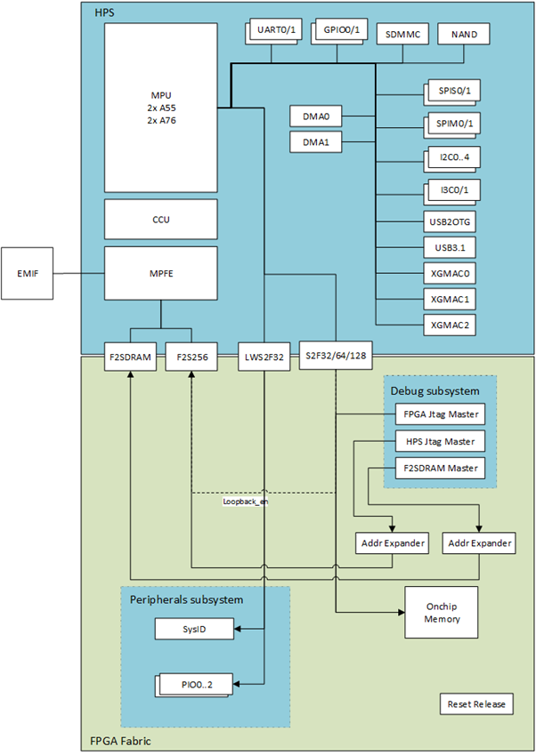

##  Introduction

### GSRD Overview

The Zephyr Golden System Reference Design (ZGSRD) is a reference design running on the Agilex 5 E-Series Premium  Development Kit.

The GSRD is comprised of the following components:

- Golden Hardware Reference Design (GHRD)
- Reference HPS software including:
  - Arm Trusted Firmware
  - Zephyr RTOS
  - Zephyr Drivers
  - Sample Applications

### Prerequisites

The following are required to be able to fully exercise the Agilex 5 Premium Development Kit GSRD:

* Altera Agilex 5 FPGA E-Series 065B Premium Development Kit, ordering code DK-A5E065BB32AES1. Refer to [board documentation](https://www.intel.com/content/www/us/en/products/details/fpga/development-kits/agilex/a5e065b-premium.html) for more information about the development kit.

  * HPS Enablement Expansion Board. Included with the development kit.
  * Mini USB Cable. Included with the development kit.
  * Micro USB Cable. Included with the development kit.
* Host PC with
  * 64 GB of RAM. Less will be fine for only exercising the binaries, and not rebuilding the GSRD.
  * Linux OS installed. Ubuntu 22.04LTS was used to create this page, other versions and distributions may work too
  * Serial terminal (for example GtkTerm or Minicom on Linux and TeraTerm or PuTTY on Windows)
  * Quartus<sup>&reg;</sup> Prime Pro Edition Version 24.3 Used to recompile the hardware design. If only writing binaries is required, then the smaller Quartus Prime Pro Edition Programmer version 24.3 is sufficient.

### Release Contents

<h4>Binaries</h4>

The Agilex 5 Premium Development Kit Zephyr GSRD binaries are located at [https://releases.rocketboards.org/2024.11/zephyr/agilex5/hps_zephyr/](https://releases.rocketboards.org/2024.11/zephyr/agilex5/hps_zephyr/):

| HPS Daughter Card | Boot Source | Link |
| -- | ---------------------- | -- |
| Enablement Board | QSPI | CLI Application: [https://releases.rocketboards.org/2024.11/zephyr/agilex5/hps_zephyr/cli/qspi_boot/](https://releases.rocketboards.org/2024.11/zephyr/agilex5/hps_zephyr/cli/qspi_boot/) <br>Hello World Application: [https://releases.rocketboards.org/2024.11/zephyr/agilex5/hps_zephyr/hello_world/qspi_boot](https://releases.rocketboards.org/2024.11/zephyr/agilex5/hps_zephyr/hello_world/qspi_boot) |

<h4>Sources</h4>

Quartus<sup>&reg;</sup> Prime Pro Edition Version 24.3 and the following software component versions are used to build the GSRD:

| Component | Location | Branch | Commit ID/Tag |
| :-- | :-- | :-- | :-- |
| GHRD | [https://github.com/altera-opensource/ghrd-socfpga](https://github.com/altera-opensource/ghrd-socfpga) | master | QPDS24.3_REL_GSRD_PR |
| Zephyr | [https://github.com/altera-opensource/zephyr-socfpga](https://github.com/altera-opensource/zephyr-socfpga) | socfpga_rel_24.3 | QPDS24.3_REL_GSRD_PR |
| Arm Trusted Firmware | [https://github.com/altera-opensource/arm-trusted-firmware](https://github.com/altera-opensource/arm-trusted-firmware) | socfpga_v2.11.0 | QPDS24.3_REL_GSRD_PR |

### Release Notes
<h4>Embedded Software Readiness</h4>

Yes - hardware validated; No - hardware validation in progress; Yes\* - tested with condition; Yes\*\* - tested, with known issues listed in the next section.


| HPS Peripheral | Sample App |
| :--- | :--- |
| GPIO Driver | Yes |
| UART Driver | Yes |
| Timer Driver | Yes |
| WatchDog Driver  | Yes |
| SMP Driver | No |
| QSPI Driver | Yes |
| SDRAM Driver | Yes |
| HPS DMA Driver | Yes |
| SDM Mailbox drivers | Yes |
| SEU | Yes |
| Clock Driver | Yes |
| Warm/Cold reset Driver | Yes-CLI App |

### Development Kit

This release targets the Agilex 5 FPGA E-Series 065B Premium Development Kit. Refer to [board documentation](https://www.intel.com/content/www/us/en/products/details/fpga/development-kits/agilex/a5e065b-premium.html) for more information about the development kit.


<h4>Installing HPS Daughtercard</h4>

This section shows how to install the included HPS Enablement Daughtercard.  The installation for the other optional HPS Boards is similar.

1\. Identify the correct thumb screws and washers needed, they are in a plastic bag:  


2\. Locate the area on the development board where the HPS Daughtercard needs to be installed:  


3\. Place the plastic washers on top of the three hex mounting posts:  


4\. Place HPS Board on top of the posts and washers:  


5\. Place the hex thumb screws on the two posts, as shown below. Note the 3rd one on the bottom is best unplaced as fully screwing that in may move the board. Also note the thumb screw close to the Ethernet connector is hard to screw, recommend to use small pliers and patience to make it secure. It is important that the HPS Board is secure, and does not move:  
 

**Note**: If you need to swap HPS Boards frequently,  it is recommended to remove the hex posts, and install the plastic washers between the PCB and the posts. This way you do not need to be careful for the washers not to move when you place the HPS Board on top of the posts. Note there are also plastic washers underneath the development board PCB, make sure to leave those in place when performing this operation

<h4>Changing MSEL</h4>

MSEL signals instruct the FPGA device on which configuration scheme to use. Configuration schemes used by the scenarios presented in this guide are JTAG and QSPI. MSEL is changed through dipswitch SW27. Only change the settings while the board is powered off.

Configuration OFF-OFF-OFF-OFF corresponds to JTAG:


Configuration OFF-ON-ON-OFF corresponds to JTAG:


### GHRD Overview

The Golden Hardware Reference Design is an important part of the Zephyr GSRD and consists of the following components:

- Hard Processor System (HPS)
  - Dual core Arm Cortex-A76 processor
  - Dual core Arm Cortex-A55 processor
  - HPS Peripherals connected to Out-of-Box Experience (OOBE2) Daughter Card:
    - EMAC
    - HPS JTAG debug
    - USB UART
- Multi-Ported Front End (MPFE) for HPS External Memory Interface (EMIF)
- FPGA Peripherals connected to Lightweight HPS-to-FPGA (LWS2F) AXI Bridge and JTAG to Avalon Master Bridge
  - Three user LED outputs
  - Four user DIP switch inputs
  - Four user push-button inputs
  - System ID
- FPGA Peripherals connected to HPS-to-FPGA (S2F) AXI Bridge
  - 256KB of FPGA on-chip memory

 

The GHRD allows hardware designers to access each peripheral in the FPGA portion of the SoC with System Console, through the JTAG master module. This signal-level access is independent of the driver readiness of each peripheral.

## Exercising Prebuilt Binaries

This section presents how to use the prebuilt binaries included with the GSRD release.

### Prebuilt Binaries

Prebuilt binaries can be found at the following URL: [https://releases.rocketboards.org/2024.11/zephyr/agilex5/hps_zephyr/](https://releases.rocketboards.org/2024.11/zephyr/agilex5/hps_zephyr/).
The prebuilt binaries consist of application programs built to run on the MPU cores in multicore configuration.
Additionally, files used by the recipes to create the binaries to boot from QSPI and NAND are provided in their respective folders.
The sample applications provided are:


| Directory | Application Description |
| --- | --- |
| cli  | Application to demonstrate Command Line Interface |
| hello_world | Application that displays a Hello World! message|


### Configure Board

1\. Leave all jumpers and switches in their default configuration.

2\. Install the appropriate HPS Daughtercard.

3\. Connect mini USB cable from vertical connector on HPS Daughtercard to host PC. This is used for the HPS serial console.

4\. Connect micro USB cable from development board to host PC. This is used by the tools for JTAG communication.


### Configure Serial Console

All the scenarios included in this release require a serial connection. This section presents how to configure the serial connection.

1\. Install a serial terminal emulator application on your host PC:  

* For Windows: TeraTerm or PuTTY are available
* For Linux: GtkTerm or Minicom are available

2\. Power down your board if powered up. This is important, as once powered up, with the micro USB JTAG cable connected, a couple more USB serial ports will enumerate, and you may choose the wrong port.

3\. Connect mini-USB cable from the vertical mini-USB connector on the HPS Board to the host PC

4\. On the host PC, an USB serial port will enumerate. On Windows machines it will be something like `COM4`, while on Linux machines it will be something like `/dev/tty/USB0`.

5\. Configure your serial terminal emulator to use the following settings:  

* Serial port: as mentioned above
* Baud rate: 115,200
* Data bits: 8
* Stop bits: 1
* CRC: disabled
* Hardware flow control: disabled

6\. Connect your terminal emulator

### HPS Enablement Board

This section presents how to use HPS Enablement Board to boot  from QSPI.

#### Booting from QSPI
<hr/>
This section presents how to boot from QSPI. 


1\. Download prebuilt binaries and create jic file. This example uses as reference the **CLI** application, but the **hello world application** could be excercised in the same way. 

<span style="color: red;">NOTE:  At the moment of creating this page, the .jic file for the prebuild applications was not included in the official binaries release page, so in the example below we are using an alternate location in the meantime these binaries are uploaded. The temporary location of the page is https://www.rocketboards.org/foswiki/Projects/ZephyrPrebuildBinaries </span>. The .jic files were generated from the current available binaries from the official page following the instuctions at [Creating Boot Images](#Creating Boot Images) section.

```bash
mkdir agilex5_zgsrd
cd agilex5_zgsrd
export TOP_FOLDER=$(pwd)
mkdir $TOP_FOLDER/prebuiltbin
cd $TOP_FOLDER/prebuiltbin
wget https://www.rocketboards.org/foswiki/pub/Projects/ZephyrPrebuildBinaries/ZephyrPrebuildBinaries24p3.tar
tar xf ZephyrPrebuildBinaries24p3.tar
```
The file to be used to flash the QSPI device is:

- $TOP_FOLDER/prebuiltbin/ZephyrPrebuildBinaries24.3/cli/qspi_boot/qspi_image.jic

2\. Power down board

3\. Set MSEL dipswitch SW27 to JTAG: OFF-OFF-OFF-OFF

4\. Power up the board

5.\ Flash the QSPI flash device using the command:

```bash
quartus_pgm -c 1 -m jtag -o "pvi;$TOP_FOLDER/prebuiltbin/ZephyrPrebuildBinaries24.3/cli/qspi_boot/qspi_image.jic"
```
6\. Power down board

7\. Set MSEL dipswitch SW27 to QSPI: OFF-ON-ON-OFF

8\. Power up the board

9\. Wait for Zephyr CLI App  to boot.

The output from the CLI application will look like this:
```
NOTICE:  DDR: Reset type is 'Power-On'
NOTICE:  IOSSM: Calibration success status check...
NOTICE:  IOSSM: All EMIF instances within the IO96 have calibrated successfully!
NOTICE:  DDR: Calibration success
NOTICE:  ###DDR:init success###
NOTICE:  QSPI boot
NOTICE:  BL2: 2.11.0(release):9aee18305
NOTICE:  BL2: Built : 12:01:53, Nov 18 2024
NOTICE:  BL2: Booting BL31
NOTICE:  BL31: Boot Core = 0
NOTICE:  BL31: CPU ID = 0
NOTICE:  BL31: v2.11.0(release):9aee18305
NOTICE:  BL31: Built : 12:02:02, Nov 18 2024
*** Booting Zephyr OS build socfpga_rel_24.3 ***
Secondary CPU core 1 (MPID:0x100) is up
Secondary CPU core 2 (MPID:0x200) is up
Secondary CPU core 3 (MPID:0x300) is up
intel_socfpga_agilex5_socdk: Starting Command Line Interface...

agilex5$ help
You can try to call commands with <-h> or <--help> parameter for more information.

Available commands:
  device   : Device commands
  flash    : Flash shell commands
  gpio     : GPIO commands
  help     : Prints the help message.
  mailbox  : Intel SoC FPGA SDM mailbox client commands
  psci     : ARM PSCI interface commands
  sip_svc  : ARM SiP services commands
  timer    : Timer commands
agilex5$ device list
devices:
- clock@10d10000 (READY)
- reset-controller@10D11000 (READY)
- interrupt-controller@1d000000 (READY)
- gpio@10c03300 (READY)
- gpio@10c03200 (READY)
- psci (READY)
- uart@10c02000 (READY)
- sysmgr@10d12000 (READY)
- dma@10DC0000 (READY)
- dma@10DB0000 (READY)
- smc (READY)
- qspi@108d2000 (READY)
- timer@10D00100 (READY)
- timer@10D00000 (READY)
- timer@10C03100 (READY)
- timer@10C03000 (READY)
agilex5$ 
```

## Building the Zephyr GSRD


- Update and upgrade your Ubuntu system
  
   
```bash
sudo apt-get update
sudo apt-get upgrade
```

- Install all the required dependencies: 

```bash
sudo apt-get install --no-install-recommends git cmake ninja-build gperf 
ccache dfu-util device-tree-compiler wget 
python3-dev python3-pip python3-setuptools python3-tk python3-wheel python3-venv xz-utils file libpython3-dev 
make gcc gcc-multilib g++-multilib libsdl2-dev libmagic1 libguestfs-tools  libssl-dev
```

|  Package  |  Zephyr Requirement  |  Ubuntu 22.04 (default versions)  |  command  |
| --- | --- | --- | --- |
| cmake | 3.20.5 | 3.16.3 (Upgrade is required) | cmake --version |
| python | 3.8 | 3.8.10 | python3 --version |
| dtc | 1.4.6 | 1.5.0 | dtc --version |

- As a minimum cmake version 3.20.5 is required, if you have an older version, then execute the following commands to add a non-intrusive cmake binary:

```bash
CURR_FOLDER=$PWD
mkdir -p $HOME/bin/cmake && cd $HOME/bin/cmake
wget https://github.com/Kitware/CMake/releases/download/v3.21.1/cmake-3.21.1-Linux-x86_64.sh
yes | sh cmake-3.21.1-Linux-x86_64.sh | cat
echo "export PATH=$PWD/cmake-3.21.1-linux-x86_64/bin:\$PATH" >> $HOME/.zephyrrc
cd $CURR_FOLDER
```

- Load the profile that was created to use the newer CMake (*this should be done for every session when* [Building Zephyr](#zephyr-build-environment-setup):
  
```bash
source  $HOME/.zephyrrc
```

### Setting up Environment

- Create the Zephyr GSRD top level directory:

  
```bash
rm -rf agilex5_zgsrd
mkdir agilex5_zgsrd
cd agilex5_zgsrd
export TOP_FOLDER=$(pwd)
```


- Download the compiler toolchain. Define environment variables and append the toolchain path in the environment PATH variable. so the toolchain can be used to build the binaries:


```bash
cd $TOP_FOLDER
wget https://developer.arm.com/-/media/Files/downloads/gnu/11.3.rel1/binrel/arm-gnu-toolchain-11.3.rel1-x86_64-aarch64-none-linux-gnu.tar.xz
tar xf arm-gnu-toolchain-11.3.rel1-x86_64-aarch64-none-linux-gnu.tar.xz
rm -f arm-gnu-toolchain-11.3.rel1-x86_64-aarch64-none-linux-gnu.tar.xz
export PATH=`pwd`/arm-gnu-toolchain-11.3.rel1-x86_64-aarch64-none-linux-gnu/bin:$PATH
echo "export PATH=`pwd`/arm-gnu-toolchain-11.3.rel1-x86_64-aarch64-none-linux-gnu/bin:\$PATH" >> $TOP_FOLDER/.zephyrrc
```


Enable Quartus tools to be called from command line:


```bash
export QUARTUS_ROOTDIR=~/intelFPGA_pro/24.3/quartus/
export PATH=$QUARTUS_ROOTDIR/bin:$QUARTUS_ROOTDIR/linux64:$QUARTUS_ROOTDIR/../qsys/bin:$PATH
```


### Build the hardware design 

Use the following commands to build the hardware design: 


```bash
cd $TOP_FOLDER
rm -rf ghrd-socfpga agilex5_soc_devkit_ghrd
git clone -b QPDS24.3_REL_GSRD_PR  https://github.com/altera-opensource/ghrd-socfpga 
mv ghrd-socfpga/agilex5_soc_devkit_ghrd .
rm -rf ghrd-socfpga
cd agilex5_soc_devkit_ghrd
make config
make DEVICE=A5ED065BB32AE6SR0 HPS_EMIF_MEM_CLK_FREQ_MHZ=800 HPS_EMIF_REF_CLK_FREQ_MHZ=100 INITIALIZATION_FIRST=hps generate_from_tcl
make sof
cd ..
```


The following files are created:

* `$TOP_FOLDER/agilex5_soc_devkit_ghrd/output_files/ghrd_a5ed065bb32ae6sr0.sof`
* `$TOP_FOLDER/agilex5_soc_devkit_ghrd/output_files/ghrd_a5ed065bb32ae6sr0_hps_debug.sof`

### Building Arm Trusted Firmware

The ATF needs to be built accordingliy to the boot device. This is needed because the BL2 stage requires to load the fip.bin (that includes the BL31 and Zephyr application) from the specific flash device. The next sub-sections provides you with instructions on how to build the ATF for each one of the boot flows supported.

#### Build ATF QSPI


```bash
cd $TOP_FOLDER
git clone -b  QPDS24.3_REL_GSRD_PR   https://github.com/altera-opensource/arm-trusted-firmware arm-trusted-firmware-qspi
cd arm-trusted-firmware-qspi
make realclean
ARCH=arm64 CROSS_COMPILE=aarch64-none-linux-gnu- make PLAT=agilex5 SOCFPGA_BOOT_SOURCE_QSPI=1 bl2 bl31 PRELOADED_BL33_BASE=0x80100000 -j$(nproc)
```


- Build Fiptool to be able to create the sdimage in later steps.


```bash
make fiptool
cp tools/fiptool/fiptool $TOP_FOLDER
cd $TOP_FOLDER
```


The previous instructions will produce:

- $TOP_FOLDER/arm-trusted-firmware-qspi/build/agilex5/release/bl2.bin
- $TOP_FOLDER/arm-trusted-firmware-qspi/build/agilex5/release/bl31.bin
- $TOP_FOLDER/fiptool


### Zephyr Build Environment Setup


- Create a new virtual environment and activate it


```bash
cd $TOP_FOLDER
python3 -m venv ~/.zephyrproject/.venv
#Environment Activation
source ~/.zephyrproject/.venv/bin/activate
```


- Install west, pull the official Zephyr repository and other Zephyr dependencies:


```bash
pip3 install wheel
pip3 install west
west init -m https://github.com/zephyrproject-rtos/zephyr --mr v3.6-branch zephyrproject
cd $TOP_FOLDER/zephyrproject
west update
west zephyr-export
pip install -r $TOP_FOLDER/zephyrproject/zephyr/scripts/requirements.txt
```


Note: If you get a similar error like:
```
ERROR: sphinx-tabs 3.4.1 has requirement docutils~=0.18.0, but you'll have docutils 0.19 which is incompatible.
ERROR: sphinx-rtd-theme 1.2.2 has requirement docutils<0.19, but you'll have docutils 0.19 which is incompatible
```

Run:
```bash
pip install sphinx-rtd-theme sphinx
```

- Install Zephyr SDK in home folder so it can be used on many Zephyr projects:


```bash
wget https://github.com/zephyrproject-rtos/sdk-ng/releases/download/v0.16.4/zephyr-sdk-0.16.4_linux-x86_64.tar.xz
wget -O - https://github.com/zephyrproject-rtos/sdk-ng/releases/download/v0.16.4/sha256.sum | shasum --check --ignore-missing
wget https://github.com/zephyrproject-rtos/sdk-ng/releases/download/v0.16.1/zephyr-sdk-0.16.1_linux-x86_64.tar.xz
wget -O - https://github.com/zephyrproject-rtos/sdk-ng/releases/download/v0.16.1/sha256.sum | shasum --check --ignore-missing 
tar xf zephyr-sdk*.tar.xz -C ~/
rm zephyr-sdk*.tar.xz
$HOME/zephyr-sdk*/setup.sh -t aarch64-zephyr-elf -h -c
```


- Substitute the official "Zephyr" folder for zephyr-socfpga repository:
  
```bash
cd $TOP_FOLDER/zephyrproject
rm -rf zephyr
git clone -b QPDS24.3_REL_GSRD_PR  --single-branch https://github.com/altera-opensource/zephyr-socfpga zephyr
west update
west zephyr-export
```


### Building Zephyr Application

Every Zephyr application is composed of several configurable key components that work together in the same executable:

 - Zephyr Kernel: Manages system resources and task scheduling.
 - Device Drivers: Enable interaction with hardware peripherals.
 - Libraries: Provide additional functionality and utilities.
 - Application Code: Written in C to define application behavior

The following Zephyr sample applications are available to test:

- HelloWorld: samples/hello_world/
- GPIO: samples/basic/blinky/
- Timer/Counter: samples/drivers/counter/alarm/
- Watchdog: samples/drivers/watchdog/
- UART: samples/drivers/uart/echo_bot/
- SPI: samples/drivers/jesd216/
- QSPI : samples/drivers/soc_flash_qspi/
- SDM Mailbox: sample/subsys/sip_svc/
- HPS DMA: samples/drivers/dma/mem_to_mem/
- SEU: samples/drivers/seu
- CLI: samples/boards/intel_socfpga/cli

In this regard, we will focus on building the "Hello World" sample that will allow us to test our development environment and run it in Agilex 5 E-Series Premium Development Kit.

- Build the "Hello World" Zephyr application binary and place the built outputs in an "agilex5" directory in the current active directory.


```bash
cd $TOP_FOLDER/zephyrproject/zephyr
west build -b intel_socfpga_agilex5_socdk samples/hello_world -d agilex5
```


Successful build console output should be similar to the following:

```
Zephyr version: 3.6.0 (/home/miguel/tasks/agilex5-zgsrd/agilex5_zgsrd/zephyrproject/zephyr), build: v3.6.0-128-gc49ce6725d2d
[112/113] Linking C executable zephyr/zephyr.elf
Memory region         Used Size  Region Size  %age Used
           FLASH:          0 GB         0 GB
             RAM:      155652 B         8 MB      1.86%
        IDT_LIST:          0 GB        32 KB      0.00%
```
The output of this stage is:

- $TOP_FOLDER/zephyrproject/zephyr/agilex5/zephyr/zephyr.bin

### Creating Boot Images

The types of boot devices are supported:

1. [QSPI Flash](#qspi-binaries)


#### QSPI binaries


- Create FIP(Firmware Image Package) binary. This will pack the Zephyr binary and ATF BL31 binary into one single binary called FIP binary.


```bash
cd $TOP_FOLDER
mkdir qspi_bin && cd qspi_bin
cp $TOP_FOLDER/arm-trusted-firmware-qspi/build/agilex5/release/bl2.bin .
$TOP_FOLDER/fiptool create --soc-fw $TOP_FOLDER/arm-trusted-firmware-qspi/build/agilex5/release/bl31.bin  --nt-fw $TOP_FOLDER/zephyrproject/zephyr/agilex5/zephyr/zephyr.bin fip.bin
```


Build *bl2.hex* file from *bl2.bin* to create a QSPI JIC file through Quartus:


```bash
cd $TOP_FOLDER/qspi_bin
aarch64-none-linux-gnu-objcopy -v -I binary -O ihex --change-addresses 0x0 bl2.bin  bl2.hex
```


Build JIC Image:


```bash
cd $TOP_FOLDER/qspi_bin
ln -s $TOP_FOLDER/agilex5_soc_devkit_ghrd/output_files/ghrd_a5ed065bb32ae6sr0.sof .
wget https://releases.rocketboards.org/2024.11/zephyr/agilex5/hps_zephyr/hello_world/qspi_boot/qspi_flash_image_agilex5_boot.pfg  
quartus_pfg -c qspi_flash_image_agilex5_boot.pfg
cd ..
```


The output of this stage is:

- $TOP_FOLDER/qspi_bin/qspi_image.jic


##### Resulted Files

After the build is completed successfully the most relevant files are:

| File  | Description |
| --- | --- |
| bl2.bin  | The BL2 FSBL  |
| bl2.hex  | The FSBL in hex format |
| bl31.bin  | The ATF BL31 (similar to legacy SSBL stage)  |
| zephyr.bin  | Zephyr Application/Kernel  |
| fip.bin  | Firmware Image Package |
| qspi_image.jic | QSPI Application image  |


### Writing the QSPI Flash Image

1. Configure MSEL to JTAG:

2. Power cycle the board

3. Write the image using the following commands:

```bash
quartus_pgm -c 1 -m jtag -o "pvi;bin/qspi_image.jic"
```

4. Set Msel to QSPI and power cycle the board. You should see the following:

```
NOTICE:  DDR: Reset type is 'Power-On'
NOTICE:  IOSSM: Calibration success status check...
NOTICE:  IOSSM: All EMIF instances within the IO96 have calibrated successfully!
NOTICE:  DDR: Calibration success
NOTICE:  ###DDR:init success###
NOTICE:  QSPI boot
NOTICE:  BL2: v2.11.0(release):QPDS24.3_REL_GSRD_PR
NOTICE:  BL2: Built : 18:47:30, Dic 10 2024
NOTICE:  BL2: Booting BL31
NOTICE:  BL31: Boot Core = 0
NOTICE:  BL31: CPU ID = 0
NOTICE:  BL31: v2.11.0(release):QPDS24.3_REL_GSRD_PR
NOTICE:  BL31: Built : 18:47:30, Dic 10 2024
*** Booting Zephyr OS build b755e7bab5f8 ***
Secondary CPU core 1 (MPID:0x100) is up
Secondary CPU core 2 (MPID:0x200) is up
Secondary CPU core 3 (MPID:0x300) is up
Hello World! intel_socfpga_agilex5_socdk
```


## Exercising SEU test

Zephyr RTOS brings a driver and implementation for SEU's tests (Single Event Upsets). These tests are intended to monitor changes in the internal memory elements of the FPGA caused by cosmic radiation. If you need to know more about it, please visit: [Intel SEU Mitigation Overview](https://www.intel.com/content/www/us/en/docs/programmable/683128/24-1/seu-mitigation-overview-fm-sm.html).

This driver requires some special configurations to be executed.


### Setting up Environment - SEU

- Create the Zephyr GSRD top level directory:

  
```bash
rm -rf agilex5_zgsrd_seu
mkdir agilex5_zgsrd_seu
cd agilex5_zgsrd_seu
export TOP_FOLDER=$(pwd)
```


- Download the compiler toolchain. Define environment variables and append the toolchain path in the environment PATH variable. so the toolchain can be used to build the binaries:


```bash
cd $TOP_FOLDER
wget https://developer.arm.com/-/media/Files/downloads/gnu/11.3.rel1/binrel/arm-gnu-toolchain-11.3.rel1-x86_64-aarch64-none-linux-gnu.tar.xz
tar xf arm-gnu-toolchain-11.3.rel1-x86_64-aarch64-none-linux-gnu.tar.xz
rm -f arm-gnu-toolchain-11.3.rel1-x86_64-aarch64-none-linux-gnu.tar.xz
export PATH=`pwd`/arm-gnu-toolchain-11.3.rel1-x86_64-aarch64-none-linux-gnu/bin:$PATH
echo "export PATH=`pwd`/arm-gnu-toolchain-11.3.rel1-x86_64-aarch64-none-linux-gnu/bin:\$PATH" >> $TOP_FOLDER/.zephyrrc
```


Enable Quartus tools to be called from command line:


```bash
export QUARTUS_ROOTDIR=~/intelFPGA_pro/24.3/quartus/
export PATH=$QUARTUS_ROOTDIR/bin:$QUARTUS_ROOTDIR/linux64:$QUARTUS_ROOTDIR/../qsys/bin:$PATH
```


### GHRD with FPGA First Boot - SEU

As this driver requires the FPGA to boot first and SEU fault injection enabled, please execute the following commands:


```bash
cd $TOP_FOLDER
rm -rf ghrd-socfpga agilex5_soc_devkit_ghrd
git clone -b QPDS24.3_REL_GSRD_PR  https://github.com/altera-opensource/ghrd-socfpga 
mv ghrd-socfpga/agilex5_soc_devkit_ghrd .
rm -rf ghrd-socfpga
cd agilex5_soc_devkit_ghrd
make config
make DEVICE=A5ED065BB32AE6SR0 HPS_EMIF_MEM_CLK_FREQ_MHZ=800 HPS_EMIF_REF_CLK_FREQ_MHZ=100 INITIALIZATION_FIRST=fpga generate_from_tcl
echo "set_global_assignment -name ALLOW_SEU_FAULT_INJECTION ON" >> ghrd_a5ed065bb32ae6sr0.qsf
make sof
```


The output from the GHRD build is:

- $TOP_FOLDER/agilex5_soc_devkit_ghrd/output_files/ghrd_a5ed065bb32ae6sr0.sof


### Building Arm Trusted Firmware - SEU

The ATF needs to be built accordingliy to the boot device. This is needed because the BL2 stage requires to load the fip.bin (that includes the BL31 and Zephyr application) from the specific flash device. The next sub-sections provides you with instructions on how to build the ATF for each one of the boot flows supported.

#### Build ATF QSPI - SEU


```bash
cd $TOP_FOLDER
git clone -b  QPDS24.3_REL_GSRD_PR   https://github.com/altera-opensource/arm-trusted-firmware arm-trusted-firmware-qspi
cd arm-trusted-firmware-qspi
make realclean
ARCH=arm64 CROSS_COMPILE=aarch64-none-linux-gnu- make PLAT=agilex5 SOCFPGA_BOOT_SOURCE_QSPI=1 bl2 bl31 PRELOADED_BL33_BASE=0x80100000 -j$(nproc)
```


- Build Fiptool to be able to create the sdimage in later steps.


```bash
make fiptool
cp tools/fiptool/fiptool $TOP_FOLDER
cd $TOP_FOLDER
```


The previous instructions will produce:

- $TOP_FOLDER/arm-trusted-firmware-qspi/build/agilex5/release/bl2.bin
- $TOP_FOLDER/arm-trusted-firmware-qspi/build/agilex5/release/bl31.bin
- $TOP_FOLDER/fiptool


### Zephyr Build Environment Setup - SEU


- Create a new virtual environment and activate it


```bash
cd $TOP_FOLDER
python3 -m venv ~/.zephyrproject/.venv
#Environment Activation
source ~/.zephyrproject/.venv/bin/activate
```


- Install west, pull the official Zephyr repository and other Zephyr dependencies:


```bash
pip3 install wheel
pip3 install west
west init -m https://github.com/zephyrproject-rtos/zephyr --mr v3.6-branch zephyrproject
cd $TOP_FOLDER/zephyrproject
west update
west zephyr-export
pip install -r $TOP_FOLDER/zephyrproject/zephyr/scripts/requirements.txt
```


Note: If you get a similar error like:
```
ERROR: sphinx-tabs 3.4.1 has requirement docutils~=0.18.0, but you'll have docutils 0.19 which is incompatible.
ERROR: sphinx-rtd-theme 1.2.2 has requirement docutils<0.19, but you'll have docutils 0.19 which is incompatible
```

Run:
```bash
pip install sphinx-rtd-theme sphinx
```

- Install Zephyr SDK in home folder so it can be used on many Zephyr projects:


```bash
wget https://github.com/zephyrproject-rtos/sdk-ng/releases/download/v0.16.4/zephyr-sdk-0.16.4_linux-x86_64.tar.xz
wget -O - https://github.com/zephyrproject-rtos/sdk-ng/releases/download/v0.16.4/sha256.sum | shasum --check --ignore-missing
wget https://github.com/zephyrproject-rtos/sdk-ng/releases/download/v0.16.1/zephyr-sdk-0.16.1_linux-x86_64.tar.xz
wget -O - https://github.com/zephyrproject-rtos/sdk-ng/releases/download/v0.16.1/sha256.sum | shasum --check --ignore-missing 
tar xf zephyr-sdk*.tar.xz -C ~/
rm zephyr-sdk*.tar.xz
$HOME/zephyr-sdk*/setup.sh -t aarch64-zephyr-elf -h -c
```


- Substitute the official "Zephyr" folder for zephyr-socfpga repository:
  
```bash
cd $TOP_FOLDER/zephyrproject
rm -rf zephyr
git clone -b QPDS24.3_REL_GSRD_PR  --single-branch https://github.com/altera-opensource/zephyr-socfpga zephyr
west update
west zephyr-export
```


### Building  Zephyr Application - SEU


- Build the "SEU" Zephyr application binary and place the built outputs in an "agilex5" directory in the current active directory.


```bash
cd $TOP_FOLDER/zephyrproject/zephyr
west build -b intel_socfpga_agilex5_socdk samples/drivers/seu -d agilex5
```


The output of this stage is:

- $TOP_FOLDER/zephyrproject/zephyr/agilex5/zephyr/zephyr.bin

### Creating Boot Images - SEU

The types of boot devices are supported:

1. [QSPI Flash](#qspi-binaries)


#### QSPI binaries - SEU


- Create FIP(Firmware Image Package) binary. This will pack the Zephyr binary and ATF BL31 binary into one single binary called FIP binary.


```bash
cd $TOP_FOLDER
mkdir qspi_bin && cd qspi_bin
cp $TOP_FOLDER/arm-trusted-firmware-qspi/build/agilex5/release/bl2.bin .
$TOP_FOLDER/fiptool create --soc-fw $TOP_FOLDER/arm-trusted-firmware-qspi/build/agilex5/release/bl31.bin  --nt-fw $TOP_FOLDER/zephyrproject/zephyr/agilex5/zephyr/zephyr.bin fip.bin
```


Build *bl2.hex* file from *bl2.bin* to create a QSPI JIC file through Quartus:


```bash
cd $TOP_FOLDER/qspi_bin
aarch64-none-linux-gnu-objcopy -v -I binary -O ihex --change-addresses 0x0 bl2.bin  bl2.hex
```


Build JIC Image:


```bash
cd $TOP_FOLDER/qspi_bin
ln -s $TOP_FOLDER/agilex5_soc_devkit_ghrd/output_files/ghrd_a5ed065bb32ae6sr0.sof .
wget https://releases.rocketboards.org/2024.11/zephyr/agilex5/hps_zephyr/hello_world/qspi_boot/qspi_flash_image_agilex5_boot.pfg  
quartus_pfg -c qspi_flash_image_agilex5_boot.pfg
cd ..
```


The output of this stage is:

- $TOP_FOLDER/qspi_bin/qspi_image.jic


### Writing the QSPI Flash Image - SEU

1. Configure MSEL to JTAG

2. Power cycle the board

3. Write the image using the following commands:

```bash
quartus_pgm -c 1 -m jtag -o "pvi;bin/qspi_image.jic"
```
4. Set Msel to QSPI and power cycle the board. You should see the following:

```
ser2net port telnet,2000 device serialdev, /dev/ttyBoard, 115200n81,local [,115200N81,CLOCAL] (Debian GNU/Linux)

NOTICE:  DDR: Reset type is 'Power-On'
NOTICE:  IOSSM: Calibration success status check...
NOTICE:  IOSSM: All EMIF instances within the IO96 have calibrated successfully!
NOTICE:  DDR: Calibration success
NOTICE:  ###DDR:init success###
NOTICE:  QSPI boot
NOTICE:  BL2: v2.11.0(release):QPDS24.3_REL_GSRD_PR
NOTICE:  BL2: Built : 18:47:30, Dec 10 2024
NOTICE:  BL2: Booting BL31
NOTICE:  BL31: Boot Core = 0
NOTICE:  BL31: CPU ID = 0
NOTICE:  BL31: v2.11.0(release):QPDS24.3_REL_GSRD_PR
NOTICE:  BL31: Built : 18:47:30, Dic 10 2024
*** Booting Zephyr OS build b755e7bab5f8 ***
Secondary CPU core 1 (MPID:0x100) is up
Secondary CPU core 2 (MPID:0x200) is up
Secondary CPU core 3 (MPID:0x300) is up
SEU Test Started
The Client No is 0x3ea509eb
The Client No is 0x3eb4528c
SEU Safe Error Insert Test Started
The SEU Error Type: 1:
The Sector Address: 5
The Correction status: 0
The row frame index: 0
The bit position: 0
SEU Safe Error Insert Test Completed
Read SEU Statistics Test Started
The value of t_seu_cycle : 0x77359469
The value of t_seu_detect : 0xb7309
The value of t_seu_correct : 0xffffffff
The value of t_seu_inject_detect : 0x4f19e1a4
The value of t_sdm_seu_poll_interval : 0x61a87
The value of t_sdm_seu_pin_toggle_overhead : 0x3be6
Read SEU Statistics Test Completed
Read ECC Error Test Started
The ECC Error Type: 1:
The Sector Address: 255
The Correction status: 1
Ram Id: 1
Read ECC Error Test Completed
SEU Test Completed
```

## Notices & Disclaimers

Altera<sup>&reg;</sup> Corporation technologies may require enabled hardware, software or service activation.
No product or component can be absolutely secure. 
Performance varies by use, configuration and other factors.
Your costs and results may vary. 
You may not use or facilitate the use of this document in connection with any infringement or other legal analysis concerning Altera or Intel products described herein. You agree to grant Altera Corporation a non-exclusive, royalty-free license to any patent claim thereafter drafted which includes subject matter disclosed herein.
No license (express or implied, by estoppel or otherwise) to any intellectual property rights is granted by this document, with the sole exception that you may publish an unmodified copy. You may create software implementations based on this document and in compliance with the foregoing that are intended to execute on the Altera or Intel product(s) referenced in this document. No rights are granted to create modifications or derivatives of this document.
The products described may contain design defects or errors known as errata which may cause the product to deviate from published specifications.  Current characterized errata are available on request.
Altera disclaims all express and implied warranties, including without limitation, the implied warranties of merchantability, fitness for a particular purpose, and non-infringement, as well as any warranty arising from course of performance, course of dealing, or usage in trade.
You are responsible for safety of the overall system, including compliance with applicable safety-related requirements or standards. 
<sup>&copy;</sup> Altera Corporation.  Altera, the Altera logo, and other Altera marks are trademarks of Altera Corporation.  Other names and brands may be claimed as the property of others. 

OpenCL* and the OpenCL* logo are trademarks of Apple Inc. used by permission of the Khronos Group™. 