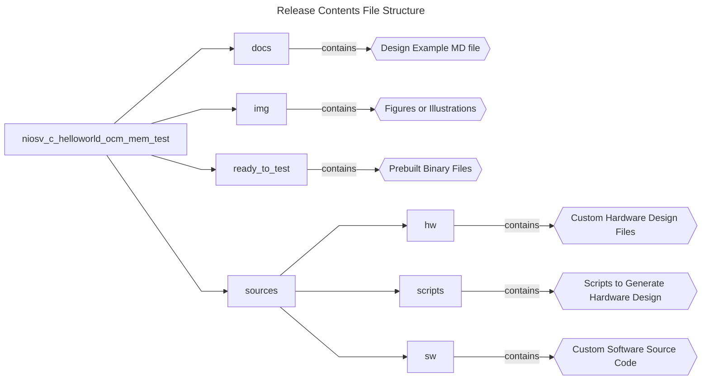
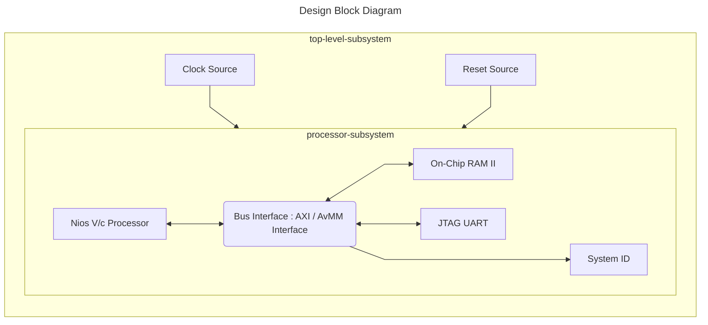

## Introduction

### Nios® V/c Helloworld On-Chip Memory Memory Test Design Overview

 This design demonstrates a simple Hello World message and performs a simple On-Chip Memory test with Nios® V/c processor in Agilex™ 5 FPGA E-Series 065B Premium Development Kit. </br>
 The design is built with basic peripherals required for simple application execution:
 - JTAG UART for serial output.

### Prerequisites

 - Agilex™ 5 FPGA E-Series 065B Premium Development Kit, ordering code DK- A5E065BB32AES1. </br> Refer to the board documentation for more information about the development kit.
 - Mini and Micro USB Cable. Included with the development kit.
 - Host PC with 64 GB of RAM. Less will be fine for only exercising the prebuilt binaries, and not rebuilding the design.
 - Quartus® Prime Pro Edition Software version 25.3
 - Ashling* RiscFree* IDE for Altera® FPGAs
 
### Release Contents  

Every Nios V processor design example is maintained based on this folder structure. </br>
Here is the Github link to root directory of this design example: [Nios® V/c Helloworld On-Chip Memory Memory Test Design Github link](https://github.com/altera-fpga/agilex5e-nios-ed/tree/rel/25.3.0/niosv_c/niosv_c_helloworld_ocm_mem_test)



## Nios® V/c Helloworld On-Chip Memory Memory Test
 This example design includes a Nios® V/c processor connected to the On-Chip RAM II, JTAG UART IP and System ID peripheral core. </br>
 The objective of the design is to accomplish data transfer between the processor and soft IP peripherals:
 - Prints a Hello World message and memory test result thru JTAG UART IP.



### Nios® V/c Processor IP
- 32-bit Compact microcontroller focus on minimal logic area utilization.
- Implements RV32I instruction set instruction set.
- Supports non-pipelined datapath.
- It is a customizable soft-core processor, that can be tailored to meet specific application requirements, providing flexibility and scalability in embedded system designs.
 
### Embedded Peripheral IP Cores
The following embedded peripheral IPs are used in this design:
- On-Chip RAM II IP
- JTAG UART IP
- System ID IP

### System Components
The following components are used in this design:
- Clock Source (Clock Bridge with IO PLL)
- Reset Source (Reset Release IP)

### Nios® V Processor Address Map Details
 |Address Offset	|Size (Bytes)	|Peripheral	| Description|
  |-|-|-|-|
  |0x0000_0000|1MB|On-Chip RAM|To store application|
  |0x0010_0008|8|JTAG UART|Communication between a host PC and the Nios V processor system|
  |0x0010_0000|8|System ID|Hardware configuration system ID (0xa5)|
  ||||

## Development Kit Setup

Refer to [Agilex™ 5 FPGA Premium Development Kit User Guide](https://www.intel.com/content/www/us/en/docs/programmable/814550.html) to setup the development kit.


## Exercising Prebuilt Binaries

### Program Hardware Binary SOF
1. Connect the development kit to the host PC using USB Blaster II.
2. Change the JTAG clock frequency to 6 MHz, and probe the JTAGServer to get the JTAG scan chain.

```console
jtagconfig --setparam 1 JtagClock 6M
jtagconfig -d
```

For example:
```console
 1) Agilex 5E065B Premium DK
  4BA06477   ARM_CORESIGHT_SOC_600 (IR=4)
  0364F0DD   A5E(C065BB32AR0|D065BB32AR0) (IR=10)
  020D10DD   VTAP10 (IR=10)
    Design hash    2696B57EB10A539DFB3F
    + Node 08586E00  (110:11) #0
    + Node 0C006E00  JTAG UART #0
    + Node 0C206E00  JTAG PHY #0
    + Node 19104600  Nios II #0
    + Node 30006E00  Signal Tap #0
 
  Captured DR after reset = (4BA064770364F0DD020D10DD) [96]
  Captured IR after reset = (100555) [24]
  Captured Bypass after reset = (0) [3]
  Captured Bypass chain = (0) [3]
  JTAG clock speed auto-adjustment is enabled. To disable, set JtagClockAutoAdjust parameter to 0
  JTAG clock speed 6 MHz
```

3. Execute the following command to program the SOF file with the correct device number. </br>Based on the JTAG scan chain earlier, the FPGA is at device number 2. You may require to provide a different device number if your JTAG chain is different from the given example. 

```console
quartus_pgm --cable=1 -m jtag -o 'p;ready_to_test/top.sof@2'
```

Note: The Nios V/c processor does not support RISC-V Debug Module. </br> Thus, the software application ELF file is converted into a HEX file, and memory initialized into the SOF file during Quartus project compilation. 

### Run Serial Console
You may proceed to to display the application printouts, and verify the design.

```console
juart-terminal -d 1 -c 1 -i 0 
```

For example, you should see similar display at the end of the application.


## Rebuilding the Design 

### Generate Hardware Binary SOF, Software Image HEX and Memory Initialize the On-Chip RAM
Run the following command in the terminal from the *source* directory. </br> 
The script performs the following tasks, which generates the hardware binary SOF file of this design.

1. Create a new project
2. Create a new Platform Designer system
3. Configure assignments and constraints
4. Create a board support package (BSP) project.
5. Create a Nios® V processor application project with Hello World source code.
6. Build the Hello World application.
7. Generate a software image HEX file.
8. Compile the project to memory initialize the On-Chip RAM.
9. Generate a hardware binary SOF file
 
```console
quartus_py ./scripts/build_sof.py
```

Note: The Nios V/c processor does not support RISC-V Debug Module. </br> Thus, the software application ELF file is converted into a HEX file, and memory initialized into the On-Chip RAM during Quartus project compilation. 

### Program Hardware Binary SOF
1. Connect the development kit to the host PC using USB Blaster II.
2. Change the JTAG clock frequency to 6 MHz, and probe the JTAGServer to get the JTAG scan chain.

```console
jtagconfig --setparam 1 JtagClock 6M
jtagconfig -d
```

For example:
```console
 1) Agilex 5E065B Premium DK
  4BA06477   ARM_CORESIGHT_SOC_600 (IR=4)
  0364F0DD   A5E(C065BB32AR0|D065BB32AR0) (IR=10)
  020D10DD   VTAP10 (IR=10)
    Design hash    2696B57EB10A539DFB3F
    + Node 08586E00  (110:11) #0
    + Node 0C006E00  JTAG UART #0
    + Node 0C206E00  JTAG PHY #0
    + Node 19104600  Nios II #0
    + Node 30006E00  Signal Tap #0
 
  Captured DR after reset = (4BA064770364F0DD020D10DD) [96]
  Captured IR after reset = (100555) [24]
  Captured Bypass after reset = (0) [3]
  Captured Bypass chain = (0) [3]
  JTAG clock speed auto-adjustment is enabled. To disable, set JtagClockAutoAdjust parameter to 0
  JTAG clock speed 6 MHz
```

3. Execute the following command to program the SOF file with the correct device number. </br>Based on the JTAG scan chain earlier, the FPGA is at device number 2. You may require to provide a different device number if your JTAG chain is different from the given example.

```console
quartus_pgm --cable=1 -m jtag -o 'p;hw/output_files/top.sof@2'
```

### Run Serial Console
You may proceed to to display the application printouts, and verify the design.

```console
juart-terminal -d 1 -c 1 -i 0 
```

For example, you should see similar display at the end of the application.


## Simulating the Design

### Generate Hardware Design-Under-Test (DUT) and Testbench System
Run the following command in the terminal from the *source* directory. </br> 
The commands below perform the following tasks, which generates the hardware DUT and testbench system.

1. Create a new project
2. Create a new Platform Designer system
3. Create a board support package (BSP) project.
4. Create a Nios® V processor application project with Hello World source code.
5. Build the Hello World application.
6. Generate a software image HEX file.
7. Generate testbench system.
 
```console
quartus_py ./scripts/build_sof.py
qsys-generate hw/qsys_top.qsys --testbench=STANDARD --testbench-simulation=VERILOG
```

### Check Simulation Files 
You have generated your system and created all the files necessary for simulation.
| File | Description |
| - | - |
| Working Directory/hw/qsys_top_tb | Generated testbench system |
| Working Directory/hw/qsys_top_tb/qsys_top_tb/sim/mentor/msim_setup.tcl | Questa simulation setup script |
| Working Directory/hw/onchip_mem.hex | On-Chip RAM II memory initialization file |

### Run Simulation
With all the necessary simulation files, you can start the simulation.
1. Copy the memory initialization file into *mentor* folder.
2. Change directory to the same *mentor* folder.
3. Open the **Questa for Altera FPGA** simulator using the command *vsim*.

```console
cp hw/onchip_mem.hex hw/qsys_top_tb/qsys_top_tb/sim/mentor 
cd hw/qsys_top_tb/qsys_top_tb/sim/mentor/
vsim
```

4. In the **Questa for Altera FPGA** software, run the following commands in the **Transcript**.

```console
source msim_setup.tcl
ld_debug
```

5. Run the simulation with *run -all* command. <br/>
For example, you should see similar display at the start of the simulation.


