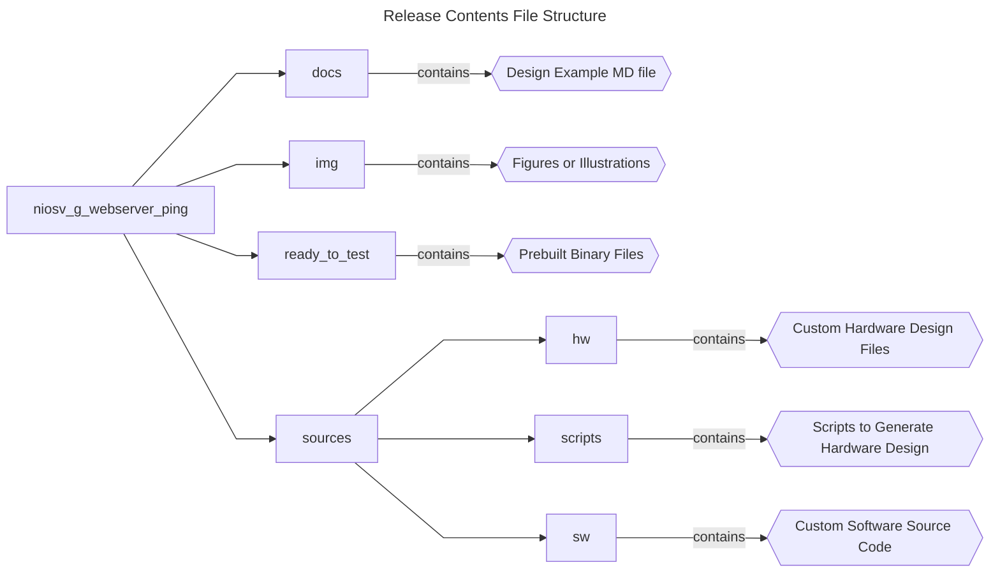

## Introduction

### Nios® V/g Ping Application Example Design Overview

 This design demonstrates a ping application on a Nios® V/g processor using the Triple Speed Ethernet IP in Agilex™ 5 FPGA E-Series 065B Premium Development Kit. </br>
 The Triple Speed Ethernet (TSE) IP is configured in RGMII mode and connects to the onboard 88E1512 PHY via RGMII interface. </br> 
 To complement the TSE IP, two Modular Scatter-Gather DMA (MSGDMA) IP with Descriptor Memory to offload Ethernet data transfer tasks from the processor.</br>

 Besides the TSE IP, the design is built with basic peripherals required for other essential application execution:

 - JTAG UART for serial output.
 - System ID IP for design identification.
 - Parallel Input/Output IP for LED control.

### Prerequisites

 - Agilex™ 5 FPGA E-Series 065B Premium Development Kit, ordering code DK- A5E065BB32AES1. </br> Refer to the board documentation for more information about the development kit.
 - Mini and Micro USB Cable. Included with the development kit.
 - RJ-45 Ethernet cable. Not included with the development kit.
 - Host PC with 64 GB of RAM. Less will be fine for only exercising the prebuilt binaries, and not rebuilding the design.
 - Quartus® Prime Pro Edition Software version 25.3
 - Ashling* RiscFree* IDE for Altera® FPGAs
 
### Release Contents  

Every Nios V processor design example is maintained based on this folder structure. </br>
Here is the Github link to root directory of this design example: [Nios® V/g Ping Application Example Design  Github link](https://github.com/altera-fpga/agilex5e-nios-ed/tree/rel/25.3.0/niosv_g/niosv_g_webserver_ping)



## Nios® V/g Ping Application LiteRT Design Architecture
 This example design includes a Nios® V/g processor connected to multiple soft IP peripherals. </br>
 The objective of the design is to perform a ping operation between the FPGA device (Nios® V/g processor) and the Host PC thru static IP address.

 - Establish Ethernet connection between FPGA and Host PC using Triple Speed Ethernet IP.
 - Assign On-Chip Memory II IP as the processor instruction and data memory.
 - Offload Ethernet data transfer from processor using Modular Scatter-Gather DMA (MSGDMA) IP with Descriptor Memory.
 - Verify device identification with System ID IP.
 - JTAG UART IP for printf outputs.

Note: The Nios V/g processor controls all embedded peripheral IP in the processor-subsystem. </br>
To simplify the block diagram, this relationship is omitted.

 


### Nios® V/g Processor IP
- General-purpose 32-bit CPU for high performance applications with larger logic area utilization.
- Implements RV32IMZicsr_Zicbom instruction set (optionally with “F” and "Smclic" extension) instruction set.
- Supports five-stages pipelined datapath.
- It is a customizable soft-core processor, that can be tailored to meet specific application requirements, providing flexibility and scalability in embedded system designs.
 
### Embedded Peripheral IP Cores
The following embedded peripheral IPs are used in this design:

- On-Chip RAM II IP as System RAM
- On-Chip RAM II IP as Descriptor Memory
- Triple Speed Etherner IP
- mSGDMA with Prefetcher Enabled for TX and RX
- Parallel IO IP
- System ID IP
- JTAG UART IP

### System Components
The following components are used in this design:

- Clock Source (Clock Bridge with IO PLL)
- Reset Source (Reset Release IP)
- In-System Sources and Probes (Reset RGMII PHY)

### Nios® V Processor Address Map Details
 |Address Offset	|Size (Bytes)	|Peripheral	| Description|
  |-|-|-|-|
  |0x0000_0000|2MB|On-Chip RAM|To store application|
  |0x0021_0000|8KB|Descriptor Memory|To store mSGDMA descriptor|
  |0x0021_2000|1KB|Triple Speed Ethernet|To access the TSE IP configuration register space|
  |0x0021_2440|32|TX mSGDMA Prefetcher|To access the TX mSGDMA Prefetcher configuration register space|
  |0x0021_2460|32|TX mSGDMA|To access the TX mSGDMA Dispatcher configuration register space|
  |0x0021_2480|32|RX mSGDMA Prefetcher|To access the RX mSGDMA Prefetcher configuration register space|
  |0x0021_24A0|32|RX mSGDMA|To access the RX mSGDMA Dispatcher configuration register space|
  |0x0021_24C0|16|Parallel IO|For LED control. Not used in this example|
  |0x0021_24D0|8|System ID|Hardware configuration system ID (0xFACECAFE)|
  |0x0021_24D8|8|JTAG UART|Communication between a host PC and the Nios V processor system|
  ||||

## Development Kit Setup

Refer to [Agilex™ 5 FPGA Premium Development Kit User Guide](https://www.intel.com/content/www/us/en/docs/programmable/814550.html) to setup the development kit.


Once the board is powered on successfully, 

1. Connect the **RGMII Ethernet** to your host PC.
2. Set the IP address of your host PC to 192.168.1.50. 
   
The Nios V processor will ping this IP address during runtime.


## Exercising Prebuilt Binaries

### Program Hardware Binary SOF
1. Connect the development kit to the host PC using USB Blaster II.
2. Change the JTAG clock frequency to 6 MHz, and probe the JTAGServer to get the JTAG scan chain.
3. Execute the quartus_pgm command to program the SOF file with the correct device number. </br>Based on the JTAG scan chain below, the FPGA is at device number 2. You may require to provide a different device number if your JTAG chain is different from the given example.
4. Toggle the In-System Sources and Probe (ISSP) to to initialize RGMII PHY and set it to 1G.

```console
jtagconfig --setparam 1 JtagClock 6M
jtagconfig -d
quartus_pgm --cable=1 -m jtag -o 'p;ready_to_test/top.sof@2'
quartus_stp -t ready_to_test/toggle_issp.tcl
```

For example:
```console
 1) Agilex 5E065B Premium DK
  4BA06477   ARM_CORESIGHT_SOC_600 (IR=4)
  0364F0DD   A5E(C065BB32AR0|D065BB32AR0) (IR=10)
  020D10DD   VTAP10 (IR=10)
    Design hash    2696B57EB10A539DFB3F
    + Node 08586E00  (110:11) #0
    + Node 0C006E00  JTAG UART #0
    + Node 0C206E00  JTAG PHY #0
    + Node 19104600  Nios II #0
    + Node 30006E00  Signal Tap #0
 
  Captured DR after reset = (4BA064770364F0DD020D10DD) [96]
  Captured IR after reset = (100555) [24]
  Captured Bypass after reset = (0) [3]
  Captured Bypass chain = (0) [3]
  JTAG clock speed auto-adjustment is enabled. To disable, set JtagClockAutoAdjust parameter to 0
  JTAG clock speed 6 MHz
```


### Program Software Image ELF
1. Ensure that the development kit is successfully configured with the Hardware Binary SOF file.
2. Launch the Nios V Command Shell. You may skip this if the shell is active.
3. Execute the following command to download the ELF file.

```console
niosv-shell
niosv-download -g ready_to_test/app_freertos.elf -c 1
```

### Run Serial Console
You may proceed to to display the application printouts, and verify the design.

```console
juart-terminal -d 1 -c 1 -i 0 
```

For example, you should see similar display at the start of the application, which the FPGA (192.168.1.40) pings the host PC (192.168.1.50).


Alternatively, host PC (192.168.1.50) can ping the FPGA (192.168.1.40) from the opposite direction.


## Rebuilding the Design 

### Generate Hardware Binary SOF
Run the following command in the terminal from the *source* directory. </br> 
The script performs the following tasks, which generates the hardware binary SOF file of this design.

1. Create a new project
2. Create a new Platform Designer system
3. Configure assignments and constraints
4. Compile the project
5. Generate a hardware binary SOF file
 
```console
quartus_py ./scripts/build_sof.py
```

### Generate Software Image ELF
After the hardware binary SOF file is ready, you may begin building the software design. </br>
It consists of the following steps:

1. Create a board support package (BSP) project.
2. Create a Nios® V processor application project with Ping source codes.
3. Build the Ping application.
4. Generate a software image ELF file.

Launch the Nios V Command Shell. You may skip this if the shell is active. </br>
Run the following command in the shell from the *source* directory.
```console
niosv-shell

niosv-bsp -c --quartus-project=hw/top.qpf --qsys=hw/qsys_top.qsys --type=freertos --cmd="enable_sw_package altera_freertos_tcpip" sw/bsp_freertos/settings.bsp

niosv-app --bsp-dir=sw/bsp_freertos --app-dir=sw/app_freertos --srcs=sw/app_freertos/main.c

cmake -S ./sw/app_freertos -B sw/app_freertos/build

make -C sw/app_freertos/build
```

### Program Hardware Binary SOF
1. Connect the development kit to the host PC using USB Blaster II.
2. Change the JTAG clock frequency to 6 MHz, and probe the JTAGServer to get the JTAG scan chain.
3. Execute the quartus_pgm command to program the SOF file with the correct device number. </br>Based on the JTAG scan chain below, the FPGA is at device number 2. You may require to provide a different device number if your JTAG chain is different from the given example.
4. Toggle the ISSP to to initialize RGMII PHY and set it to 1G.

```console
jtagconfig --setparam 1 JtagClock 6M
jtagconfig -d
quartus_pgm --cable=1 -m jtag -o 'p;hw/output_files/top.sof@2'
quartus_stp -t ready_to_test/toggle_issp.tcl
```

For example:
```console
 1) Agilex 5E065B Premium DK
  4BA06477   ARM_CORESIGHT_SOC_600 (IR=4)
  0364F0DD   A5E(C065BB32AR0|D065BB32AR0) (IR=10)
  020D10DD   VTAP10 (IR=10)
    Design hash    2696B57EB10A539DFB3F
    + Node 08586E00  (110:11) #0
    + Node 0C006E00  JTAG UART #0
    + Node 0C206E00  JTAG PHY #0
    + Node 19104600  Nios II #0
    + Node 30006E00  Signal Tap #0
 
  Captured DR after reset = (4BA064770364F0DD020D10DD) [96]
  Captured IR after reset = (100555) [24]
  Captured Bypass after reset = (0) [3]
  Captured Bypass chain = (0) [3]
  JTAG clock speed auto-adjustment is enabled. To disable, set JtagClockAutoAdjust parameter to 0
  JTAG clock speed 6 MHz
```


### Program Software Image ELF
1. Ensure that the development kit is successfully configured with the Hardware Binary SOF file.
2. Launch the Nios V Command Shell. You may skip this if the shell is active.
3. Execute the following command to download the ELF file.

```console
niosv-shell
niosv-download -g sw/app_freertos/build/app_freertos.elf -c 1
```

### Run Serial Console
You may proceed to to display the application printouts, and verify the design.

```console
juart-terminal -d 1 -c 1 -i 0 
```

For example, you should see similar display at the start of the application, which the FPGA (192.168.1.40) pings the host PC (192.168.1.50).


Alternatively, host PC (192.168.1.50) can ping the FPGA (192.168.1.40) from the opposite direction.


## Known Issue
You might experience packet loss when bidirectional ping operation is carried out. </br>
In other words, both host PC and FPGA are pinging each other simulateneously. </br>


This issue is not replicated when the ping operation is unidirectional.


