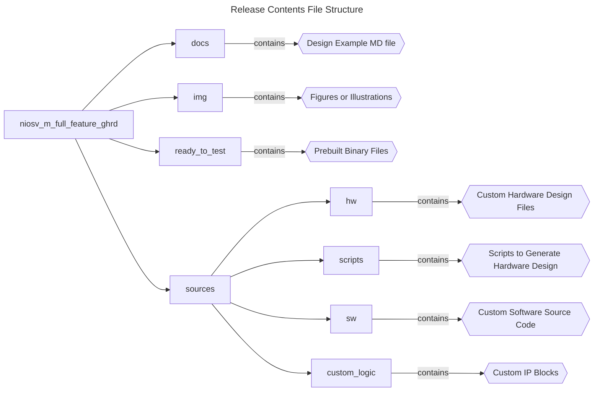
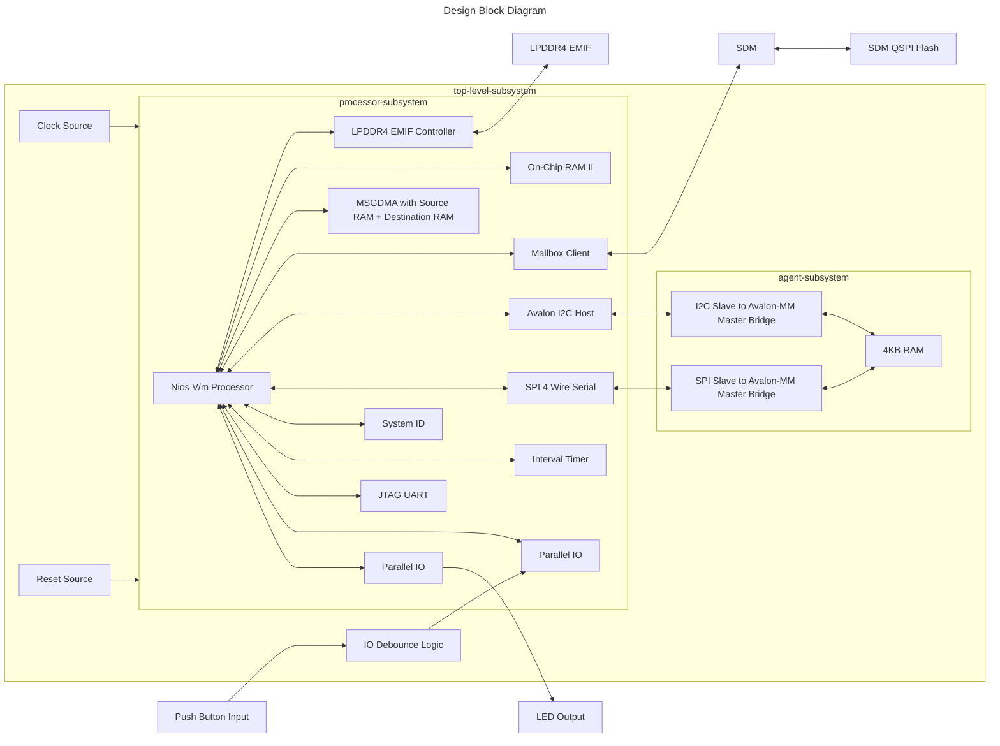

## Introduction

### Nios® V/m Full Feature Golden Hardware Reference Design (GHRD) Overview

 This design demonstrates the full feature Golden Hardware Reference Design (GHRD) for a Nios® V/m processor in Agilex™ 5 FPGA E-Series 065B Premium Development Kit. </br>
 The design is built with popular peripherals required for common application execution:

 - LPDDR4 External Memory Interface (EMIF) IP with Address Span Extender IP for large data or application.
 - On-Chip Memory II IP for small data or application.
 - Modular Scatter-Gather DMA (MSGDMA) IP to offload data transfer from the processor.
 - Mailbox Client IP for SDM-related tasks (such as SDM QSPI data transfer).
 - Avalon I2C (Host) IP for I2C communication.
 - SPI (4 Wire Serial) IP for SPI communication.
 - System ID IP for design identification.
 - Interval Timer IP for periodic interrupt servicing.
 - JTAG UART IP for serial UART output.
 - Parallel Input/Output IP for IO control (such as LED and Pushbutton).

### Prerequisites

 - Agilex™ 5 FPGA E-Series 065B Premium Development Kit, ordering code DK- A5E065BB32AES1. </br> Refer to the board documentation for more information about the development kit.
 - Mini and Micro USB Cable. Included with the development kit.
 - Host PC with 64 GB of RAM. Less will be fine for only exercising the prebuilt binaries, and not rebuilding the design.
 - Quartus® Prime Pro Edition Software version 25.3
 - Ashling* RiscFree* IDE for Altera® FPGAs
 
### Release Contents  

Every Nios V processor design example is maintained based on this folder structure. </br>
Here is the Github link to root directory of this design example: [Nios® V/m Full Feature Golden Hardware Reference Design (GHRD) Github link](https://github.com/altera-fpga/agilex5e-nios-ed/tree/rel/25.3.0/niosv_m/niosv_m_full_feature_ghrd)




## Nios® V/m Full Feature Golden Hardware Reference Design (GHRD) Architecture
 This example design includes a Nios® V/m processor connected to multiple soft IP peripherals. </br>
 The objective of the design is to accomplish data transfer between the processor and soft IP peripherals:

 - Read and Write Memory operation with LPDDR4 External Memory Interface (EMIF) IP.
 - Assign On-Chip Memory II IP as the processor instruction and data memory.
 - Offload memory data transfer from processor using Modular Scatter-Gather DMA (MSGDMA) IP.
 - Read and Write SDM QSPI Flash operation with Mailbox Client IP.
 - Demonstrate I2C communication between Avalon I2C (Host) IP and a I2C agent.
 - Demonstrate SPI communication between SPI (4 Wire Serial) IP and a SPI agent.
 - Verify device identification with System ID IP.
 - Setup periodic interrupts using Interval Timer IP or ALARM HAL API.
 - JTAG UART IP for printf outputs.
 - Toggle LED with Parallel Input/Output IP.

Note: The Nios V/g processor controls all embedded peripheral IP in the processor-subsystem. </br>
To simplify the block diagram, this relationship is omitted.



### Nios® V/m Processor IP
- 32-bit Microcontroller to achieve balance between performance and logic area utilization. 
- Implements RV32I_Zicsr instruction set.
- Supports five-stages pipelined or non-pipelined datapath.
- It is a customizable soft-core processor, that can be tailored to meet specific application requirements, providing flexibility and scalability in embedded system designs.
 
### Embedded Peripheral IP Cores
The following embedded peripheral IPs are used in this design:

 - LPDDR4 External Memory Interface (EMIF) IP
 - On-Chip Memory II IP
 - Modular Scatter-Gather DMA (MSGDMA) IP
 - Mailbox Client IP
 - Avalon I2C (Host) IP
 - SPI (4 Wire Serial) IP
 - System ID IP
 - Interval Timer IP
 - JTAG UART IP
 - Parallel Input/Output IP

### System Components
The following components are used in this design:

- Clock Source (Clock Bridge with IO PLL)
- Reset Source (Reset Release IP)
- IO Debounce Logic
- Address Span Extender IP

### Nios® V/m Processor Address Map Details
 |Address Offset	|Size (Bytes)	|Peripheral	| Description|
  |-|-|-|-|
  |0x0000_0000|512KB|On-Chip Memory II IP|To store application|
  |0x0009_0040|64|Avalon I2C (Host) IP|To communicate through I2C|
  |0x0009_0080|64|Mailbox Client IP|To communicate with SDM|
  |0x0009_00c0|32|SPI (4 Wire Serial) IP|To communicate through SPI|
  |0x0009_00e0|32|Interval Timer IP|To produce a periodic interrupt once every second|
  |0x0009_0100|32|MSGDMA IP|To offload data transfer operation from processor|
  |0x0009_0120|16|Parallel Input/Output IP 0|To toggle LED connection on board|
  |0x0009_0130|16|MSGDMA IP Descriptor Agent Interface|To support extended descriptors|
  |0x0009_0140|8|System ID|Hardware configuration system ID (0xa5)|
  |0x0009_0150|8|JTAG UART|Communication between a host PC and the Nios V processor system|
  |0x000c_0000|256KB|LPDDR4 EMIF|To store data through Address Span Extender IP|
  |0x0010_0000|1MB|Destination RAM|The destination memory for MSGDMA IP data transfer|
  |0x0020_0000|1MB|Source RAM|The source data for MSGDMA IP data transfer|
  |0x0030_0000|16|Parallel Input/Output IP 1|To receive input from pushbutton on board|
  ||||

## Development Kit Setup

Refer to [Agilex™ 5 FPGA Premium Development Kit User Guide](https://www.intel.com/content/www/us/en/docs/programmable/814550.html) to setup the development kit. </br> Set the MSEL DIP switch SW27[3:1] as ASx4 FAST [on on off] or ASx4 Normal [on off off].


## Exercising Prebuilt Binaries

### Program Hardware Binary SOF
1. Connect the development kit to the host PC using USB Blaster II.
2. Change the JTAG clock frequency to 6 MHz, and probe the JTAGServer to get the JTAG scan chain.
3. Execute the quartus_pgm command to program the SOF file with the correct device number. </br>Based on the JTAG scan chain below, the FPGA is at device number 2. You may require to provide a different device number if your JTAG chain is different from the given example.

```console
jtagconfig --setparam 1 JtagClock 6M
jtagconfig -d
quartus_pgm --cable=1 -m jtag -o 'p;ready_to_test/top.sof@2'
```

Example of JTAG Scan Chain:
```console
 1) Agilex 5E065B Premium DK
  4BA06477   ARM_CORESIGHT_SOC_600 (IR=4)
  0364F0DD   A5E(C065BB32AR0|D065BB32AR0) (IR=10)
  020D10DD   VTAP10 (IR=10)
    Design hash    2696B57EB10A539DFB3F
    + Node 08586E00  (110:11) #0
    + Node 0C006E00  JTAG UART #0
    + Node 0C206E00  JTAG PHY #0
    + Node 19104600  Nios II #0
    + Node 30006E00  Signal Tap #0
 
  Captured DR after reset = (4BA064770364F0DD020D10DD) [96]
  Captured IR after reset = (100555) [24]
  Captured Bypass after reset = (0) [3]
  Captured Bypass chain = (0) [3]
  JTAG clock speed auto-adjustment is enabled. To disable, set JtagClockAutoAdjust parameter to 0
  JTAG clock speed 6 MHz
```


### Program Software Image ELF
1. Ensure that the development kit is successfully configured with the Hardware Binary SOF file.
2. Launch the Nios V Command Shell. You may skip this if the shell is active.
3. Pick any of the prebuilt ELF files to download.
4. Execute the following command to download the ELF file.

```console
niosv-shell
niosv-download -g ready_to_test/app_<peripheral>.elf -c 1
```

### Run Serial Console
You may proceed to to display the application printouts, and verify the design.

```console
juart-terminal -d 1 -c 1 -i 0 
```

For example, you should see similar display at the end of the application.

#### DMA Operation from Source to Destination RAM by MSGDMA 


#### Simple Read Write Operation in LPDDR4 EMIF 


#### I2C Operation 


#### Toggling LEDs and Polling PushButton Inputs 


#### Simple Read Write Operation in SDM QSPI Flash 


#### SPI Operation


#### Periodic Interrupt with Interval Timer IP and Alarm HAL API


## Rebuilding the Design 

### Generate Hardware Binary SOF
Run the following command in the terminal from the *source* directory. </br> 
Copy the custom IP in the *hw* directory, and execute the build script. </br> 
The script performs the following tasks, which generates the hardware binary SOF file of this design.

1. Create a new project
2. Create a new Platform Designer system
3. Configure assignments and constraints
4. Compile the project
5. Generate a hardware binary SOF file
 
```console
cp custom_logic/emif_axi_adaptor_hw.tcl hw 
cp custom_logic/emif_axi_handler.sv hw 
quartus_py ./scripts/build_sof.py
```

### Generate Software Image ELF
After the hardware binary SOF file is ready, you may begin building the software design. </br>
It consists of the following steps:

1. Create a board support package (BSP) project.
2. Select the interested peripherals.
3. Create a Nios® V processor application project with each peripherals' source code.
4. Build the application.
5. Generate a software image ELF file.

Launch the Nios V Command Shell. You may skip this if the shell is active. </br>
Run the following command in the shell from the *source* directory.
```console
niosv-shell
niosv-bsp -c --quartus-project=hw/top.qpf --qsys=hw/qsys_top.qsys --type=hal sw/bsp/settings.bsp

# app_dma_ocm
niosv-app --bsp-dir=sw/bsp --app-dir=sw/app_dma_ocm --srcs=sw/app_dma_ocm/main.c
cmake -S ./sw/app_dma_ocm -B sw/app_dma_ocm/build -G "Unix Makefiles"
make -C sw/app_dma_ocm/build

# app_emif
niosv-app --bsp-dir=sw/bsp --app-dir=sw/app_emif --srcs=sw/app_emif/main.c
cmake -S ./sw/app_emif -B sw/app_emif/build -G "Unix Makefiles"
make -C sw/app_emif/build

# app_i2c
niosv-app --bsp-dir=sw/bsp --app-dir=sw/app_i2c --srcs=sw/app_i2c/i2c.c
cmake -S ./sw/app_i2c -B sw/app_i2c/build -G "Unix Makefiles"
make -C sw/app_i2c/build

# app_pio
niosv-app --bsp-dir=sw/bsp --app-dir=sw/app_pio --srcs=sw/app_pio/main.c
cmake -S ./sw/app_pio -B sw/app_pio/build -G "Unix Makefiles"
make -C sw/app_pio/build

# app_qspi
niosv-app --bsp-dir=sw/bsp --app-dir=sw/app_qspi --srcs=sw/app_qspi/main.c
cmake -S ./sw/app_qspi -B sw/app_qspi/build -G "Unix Makefiles"
make -C sw/app_qspi/build

# app_spi
niosv-app --bsp-dir=sw/bsp --app-dir=sw/app_spi --srcs=sw/app_spi/
cmake -S ./sw/app_spi -B sw/app_spi/build -G "Unix Makefiles"
make -C sw/app_spi/build

# app_timer
niosv-app --bsp-dir=sw/bsp --app-dir=sw/app_timer --srcs=sw/app_timer/main.c
cmake -S ./sw/app_timer -B sw/app_timer/build -G "Unix Makefiles"
make -C sw/app_timer/build

```

### Program Hardware Binary SOF
1. Connect the development kit to the host PC using USB Blaster II.
2. Change the JTAG clock frequency to 6 MHz, and probe the JTAGServer to get the JTAG scan chain.
3. Execute the quartus_pgm command to program the SOF file with the correct device number. </br>Based on the JTAG scan chain below, the FPGA is at device number 2. You may require to provide a different device number if your JTAG chain is different from the given example.

```console
jtagconfig --setparam 1 JtagClock 6M
jtagconfig -d
quartus_pgm --cable=1 -m jtag -o 'p;hw/output_files/top.sof@2'
```

Example of JTAG Scan Chain:
```console
 1) Agilex 5E065B Premium DK
  4BA06477   ARM_CORESIGHT_SOC_600 (IR=4)
  0364F0DD   A5E(C065BB32AR0|D065BB32AR0) (IR=10)
  020D10DD   VTAP10 (IR=10)
    Design hash    2696B57EB10A539DFB3F
    + Node 08586E00  (110:11) #0
    + Node 0C006E00  JTAG UART #0
    + Node 0C206E00  JTAG PHY #0
    + Node 19104600  Nios II #0
    + Node 30006E00  Signal Tap #0
 
  Captured DR after reset = (4BA064770364F0DD020D10DD) [96]
  Captured IR after reset = (100555) [24]
  Captured Bypass after reset = (0) [3]
  Captured Bypass chain = (0) [3]
  JTAG clock speed auto-adjustment is enabled. To disable, set JtagClockAutoAdjust parameter to 0
  JTAG clock speed 6 MHz
```


### Program Software Image ELF
1. Ensure that the development kit is successfully configured with the Hardware Binary SOF file.
2. Launch the Nios V Command Shell. You may skip this if the shell is active.
3. Execute the following command to download the ELF file.

```console
niosv-shell
niosv-download -g sw/app_<peripheral>/build/app_<peripheral>.elf -c 1
```

### Run Serial Console
You may proceed to to display the application printouts, and verify the design.

```console
juart-terminal -d 1 -c 1 -i 0 
```

For example, you should see similar display at the end of the application.

#### DMA Operation from Source to Destination RAM by MSGDMA 


#### Simple Read Write Operation in LPDDR4 EMIF 


#### I2C Operation 


#### Toggling LEDs and Polling PushButton Inputs 


#### Simple Read Write Operation in SDM QSPI Flash 


#### SPI Operation


#### Periodic Interrupt with Interval Timer IP and Alarm HAL API


