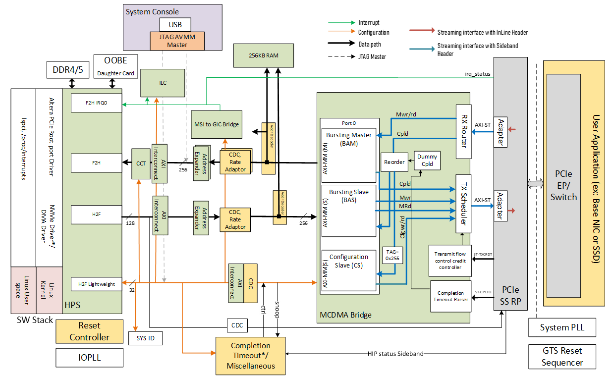

## Introduction

This design demonstrates a PCIe root port running on Agilex&trade; 5 E-Series Premium  Development Kit connected to end point. A Gen4x4 link is shown.

**Note:** This is design is running on internal board with **-4S speed grade** silicon.

## Release Content

Release note and pre-build binaries can be found in the [GitHub repository](https://github.com/altera-fpga/agilex5-ed-pcie-rp/releases/tag/25.1-1)

## System Example Design Overview

This design is based on the Agilex5 SoC Development Golden Hardware Reference Design (GHRD) which is part of the Golden System Reference Design (GSRD). This design demonstrate the Root port capability, configures the PCIe Subsystem to work in Root port mode and use MCDMA Bridge logic that converts the incoming TLPs from PCIe Subsystem into Memory mapped interface.



* F2H AXI4 (burst enabled)/ACELite interface for data transfers from PCIe EP.
* H2F AXI4 (burst enabled) interface is used for PCIe EP downstream application.
* H2F Light weight AXI-4 interface connect to configuration slave of the MCDMA IP.

### Helpful Reference Documentation

* [GTS AXI Streaming FPGA IP for PCI Express User Guide](https://www.intel.com/content/www/us/en/docs/programmable/813754.html)
* [GTS AXI MultiChannel DMA  FPGA IP for PCI Express User Guide](https://www.intel.com/content/www/us/en/docs/programmable/847470.html)

## Hardware Description

### Memory Map

#### HPS H2F Memory Map

| Address Offset | Size (Bytes) | Peripheral      | Remarks         |
|----------------|--------------|-----------------|-----------------|
|0x4000_0000      |256K          |On Chip Memory   |Block memory implemented in the FPGA fabric|
|0x5000_0000      |256M          |BAS              |Avalon MM Slave of AVMM Bridge’s BAS port|
|0x6000_0000      |1M            |PCIe SS AXI-Lite interface|AXI-Lite of PCIe SS|

#### HPS LWH2F Memory Map

| Address Offset | Size (Bytes) | Peripheral      | Remarks         |
|----------------|--------------|-----------------|-----------------|
|0x2000_0000     |8             |System ID        |Hardware configuration system ID|
|0x20001100      |256           |ILC              |Interrupt Latency Counter|
|0x20010000      |16k           |PCIe CS         |Avalon MM Slave of PCIe Configuration Slave port (14b address space)|
|0x20018000      |128           |MSI-to-GIC Vector| |
|0x20018080      |16            |MSI-to-GIC CSR   |Avalon MM Slave of MSI-to-GIC CSR port|
|0x200180A0      |32            |Performance Counter|Hardware timer for benchmarking purposes|
|0x200180C0      |1K            |AVMM CS Cpl TimeOut & System level Reg. map |Error registers along with Timeout values |

#### PCIe BAM interface

| Address Offset | Size (Bytes) | Peripheral      | Remarks         |
|----------------|--------------|-----------------|-----------------|
|0x4000_0000      |256k          |On Chip Memory   |Block memory implemented in the FPGA fabric|
|0x2001_8000      |128           |MSI-to-GIC Vector|MSI/MSI-X Transactions from PCIe Endpoint. These should be aligned addresses to avoid any re-alignment on BAM AVMM interface.|
|0x8000_0000 to 0xFFFF_FFFF      |2G            |HPS F2H          | HPS FPGA to HPS interface (SDRAM access)|
|0x08_8000_0000 to 0x09_FFFF_FFFF|6G            |HPS F2H          | HPS FPGA to HPS interface (SDRAM access) -Expanded memory range. Actual allocation is 8G (from 0x08_0000_0000 to 0x09_FFFF_FFFF) to match the 2 power of <Num of bits).|

### Memory Range Support Expansion

HPS support additional memory for F2H interface. For this example design, memory range support start from initial 2GB at the address offset of 0x8000_0000 and additional 6G memory at address offset of 0x08_8000_0000 to 0x09_FFFF_FFFF.
BAM to HPS F2H have multiple path with different Address Expander range as shown in the block diagram.

| Memory Range | Address |
|----------------|-----------|
| Base 2GB |0x8000_0000 to 0xFFFF_FFFF      |
| Additional 30GB |0x08_8000_0000 to 0x0F_FFFF_FFFF|

## Setup Configuration

* [Agilex™ 5 E-Series Premium Development Kit](https://www.intel.com/content/www/us/en/products/details/fpga/development-kits/agilex/a5e065b-premium.html) (DK-A5E065BB32AES1) for running the example
  * Current Agilex™ 5 development kit is a **-6S speed grade**, can support up to **Gen3x4**. Agilex™ 5 **-4S speed grade** is required to demonstrate **PCIe Gen4x4**.
  * **Note:** This is design is running on internal board with **-4S speed grade** silicon (A5ED065BB32AE4SR0).
* [PCIe FMC+ Hitech Daughter Card](https://www.hitechglobal.com/FMCModules/FMC+_X16PCIExpress.htm) 

* Tested End Point:
  * PCI Express NVMe Gen4 SSD (Samsung 980 PRO PCIe 4.0 NVMe)
  * PCI Express Network Interface Card (Intel I350/I210)

* Tools and software:
  * System with supported Linux distribution with Ubuntu 22.04 (LTS)
  * Intel ® Quartus ®Prime Design Suite software 25.1 version
  * Serial terminal application such as Putty

## Building Agilex™ 5 PCIe Root Port Design

Here are the steps to build either HW and SW files:

* [HW_Readme](https://github.com/altera-fpga/agilex5-ed-pcie-rp/tree/rel/25.1/src/hw)
* [SW_Readme](https://github.com/altera-fpga/agilex5-ed-pcie-rp/tree/rel/25.1/src/sw)

Both links show how to build the files needed for the project, according with the [Altera SoC FPGA Golden Software Reference Design (GSRD)](https://github.com/altera-opensource/gsrd-socfpga)

Setting up the environment: 
```bash
git clone https://github.com/altera-fpga/agilex5-ed-pcie-rp
cd agilex5-ed-pcie-rp/src
export TOP_FOLDER=`pwd`
```
Download the compiler toolchain, add it to the PATH variable, to be used by the GHRD makefile to build the HPS Debug FSBL:
```bash
cd $TOP_FOLDER
wget https://developer.arm.com/-/media/Files/downloads/gnu/11.2-2022.02/binrel/\
gcc-arm-11.2-2022.02-x86_64-aarch64-none-linux-gnu.tar.xz
tar xf gcc-arm-11.2-2022.02-x86_64-aarch64-none-linux-gnu.tar.xz
rm -f gcc-arm-11.2-2022.02-x86_64-aarch64-none-linux-gnu.tar.xz
export PATH=`pwd`/gcc-arm-11.2-2022.02-x86_64-aarch64-none-linux-gnu/bin:$PATH
export ARCH=arm64
export CROSS_COMPILE=aarch64-none-linux-gnu-
```
Enable Quartus tools to be called from command line:
```bash
export QUARTUS_ROOTDIR=~/altera_pro/25.1/quartus/
export PATH=$QUARTUS_ROOTDIR/bin:$QUARTUS_ROOTDIR/linux64:$QUARTUS_ROOTDIR/../qsys/bin:$PATH
```
Building the Hardware files:
```bash
cd hw/a5e065bb32aes1_pdk/syn/sm_4x4
quartus_sh --flow compile top
```
Building the Software files:
```bash
cd $TOP_FOLDER
cd sw
. agilex5_dk_a5e065bb32aes1-rped-build.sh
build_setup
```
Perform Yocto bitbake to generate binaries:
```bash
bitbake_image
```
Package binaries into build folder:
```bash
package
```
Generate the Programming file
```bash
cd $TOP_FOLDER
cd hw/a5e065bb32aes1_pdk/syn/sm_4x4
quartus_pfg -c -o hps=on -o hps_path=u-boot-spl-dtb.hex output_files/agilex5_dk_a5e065bb32aes1_rped_ghrd.sof output_files/agilex5_dk_a5e065bb32aes1_rped_ghrd.rbf
```
### Adding PCIe root port in dts

Manually add the PCIe Root Port bindings to your custom DTS by applying a patch to your custom DTSI.
[arm64-dts-agilex5-add-dtsi-for-PCIe-Root-Port](https://github.com/altera-fpga/agilex5-ed-pcie-rp/blob/rel/25.1/src/sw/meta-altera-pcie-rp/recipes-kernel/linux/linux-socfpga-lts/0002-arm64-dts-agilex5-add-dtsi-for-PCIe-Root-Port.patch)

## Running the System Example Design

Program the development kit with [hps.rbf](https://github.com/altera-fpga/agilex5-ed-pcie-rp/releases/download/25.1-1/agilex5_dk_a5e065bb32aes1_rped_ghrd.hps.rbf) file.
```bash
        quartus_pgm -c 1 -m jtag -o p;agilex5_dk_a5e065bb32aes1_rped_ghrd.hps.rbf@1
```

Open the Putty serial terminal, it will show the board boot-up process.
  
Execute the `lspci` command to display information about all PCI devices on the system
```bash
root@agilex5dka5e065bb32aes1:~# lspci
00:00.0 PCI bridge: Altera Corporation Device 0000 (rev 01)
01:00.0 Non-Volatile memory controller: Samsung Electronics Co Ltd NVMe SSD Controller PM9A1/PM9A3/980PRO

```

There you will see both PCIe devices Rootport(00:00.0) & End Point(01:00.0)

Run the following command to retrieve detailed information about the Agilex 5 E-Series PCIe Root Port:
```bash
        lspci -vv
```

Info "Console Output:"
```bash
    00:00.0 PCI bridge: Altera Corporation Device 0000 (rev 01) (prog-if 00 [Normal decode])
        Control: I/O- Mem+ BusMaster+ SpecCycle- MemWINV- VGASnoop- ParErr- Stepping- SERR- FastB2B- DisINTx-
        Status: Cap+ 66MHz- UDF- FastB2B- ParErr- DEVSEL=fast >TAbort- <TAbort- <MAbort- >SERR- <PERR- INTx-
        Latency: 0
        Interrupt: pin A routed to IRQ 0
        Bus: primary=00, secondary=01, subordinate=01, sec-latency=0
        I/O behind bridge: [disabled] [16-bit]
        Memory behind bridge: 50100000-501fffff [size=1M] [32-bit]
        Prefetchable memory behind bridge: [disabled] [64-bit]
        Secondary status: 66MHz- FastB2B- ParErr- DEVSEL=fast >TAbort- <TAbort- <MAbort- <SERR- <PERR-
        BridgeCtl: Parity- SERR+ NoISA- VGA- VGA16- MAbort- >Reset- FastB2B-
                PriDiscTmr- SecDiscTmr- DiscTmrStat- DiscTmrSERREn-
        Capabilities: [40] Power Management version 3
                Flags: PMEClk- DSI- D1- D2- AuxCurrent=0mA PME(D0+,D1-,D2-,D3hot+,D3cold-)
                Status: D0 NoSoftRst+ PME-Enable- DSel=0 DScale=0 PME-
        Capabilities: [70] Express (v2) Root Port (Slot-), IntMsgNum 0
                DevCap: MaxPayload 256 bytes, PhantFunc 0
                        ExtTag+ RBE+ TEE-IO-
                DevCtl: CorrErr+ NonFatalErr+ FatalErr+ UnsupReq+
                        RlxdOrd+ ExtTag+ PhantFunc- AuxPwr- NoSnoop+
                        MaxPayload 256 bytes, MaxReadReq 512 bytes
                DevSta: CorrErr- NonFatalErr- FatalErr- UnsupReq- AuxPwr+ TransPend-
                LnkCap: Port #1, Speed 16GT/s, Width x4, ASPM L0s L1, Exit Latency L0s unlimited, L1 unlimited
                        ClockPM- Surprise- LLActRep+ BwNot+ ASPMOptComp+
                LnkCtl: ASPM Disabled; RCB 64 bytes, LnkDisable- CommClk+
                        ExtSynch- ClockPM- AutWidDis- BWInt+ AutBWInt+
                LnkSta: Speed 16GT/s, Width x4
                        TrErr- Train- SlotClk+ DLActive+ BWMgmt- ABWMgmt+
                RootCap: CRSVisible-
                RootCtl: ErrCorrectable- ErrNon-Fatal- ErrFatal- PMEIntEna- CRSVisible-
                RootSta: PME ReqID 0000, PMEStatus- PMEPending-
                DevCap2: Completion Timeout: Range ABCD, TimeoutDis+ NROPrPrP+ LTR+
                         10BitTagComp+ 10BitTagReq- OBFF Not Supported, ExtFmt+ EETLPPrefix+, MaxEETLPPrefixes 1
                         EmergencyPowerReduction Not Supported, EmergencyPowerReductionInit-
                         FRS- LN System CLS Not Supported, TPHComp+ ExtTPHComp- ARIFwd+
                         AtomicOpsCap: Routing+ 32bit+ 64bit+ 128bitCAS+
                DevCtl2: Completion Timeout: 50us to 50ms, TimeoutDis- ARIFwd+
                         AtomicOpsCtl: ReqEn- EgressBlck-
                         IDOReq- IDOCompl- LTR+ EmergencyPowerReductionReq-
                         10BitTagReq- OBFF Disabled, EETLPPrefixBlk-
                LnkCap2: Supported Link Speeds: 2.5-16GT/s, Crosslink- Retimer+ 2Retimers+ DRS-
                LnkCtl2: Target Link Speed: 16GT/s, EnterCompliance- SpeedDis-
                         Transmit Margin: Normal Operating Range, EnterModifiedCompliance- ComplianceSOS-
                         Compliance Preset/De-emphasis: -6dB de-emphasis, 0dB preshoot
                LnkSta2: Current De-emphasis Level: -6dB, EqualizationComplete+ EqualizationPhase1+
                         EqualizationPhase2+ EqualizationPhase3+ LinkEqualizationRequest-
                         Retimer- 2Retimers- CrosslinkRes: Downstream Port
        Capabilities: [100 v2] Advanced Error Reporting
                UESta:  DLP- SDES- TLP- FCP- CmpltTO- CmpltAbrt- UnxCmplt- RxOF- MalfTLP-
                        ECRC- UnsupReq- ACSViol- UncorrIntErr- BlockedTLP- AtomicOpBlocked- TLPBlockedErr-
                        PoisonTLPBlocked- DMWrReqBlocked- IDECheck- MisIDETLP- PCRC_CHECK- TLPXlatBlocked-
                UEMsk:  DLP- SDES- TLP- FCP- CmpltTO- CmpltAbrt- UnxCmplt- RxOF- MalfTLP-
                        ECRC- UnsupReq- ACSViol- UncorrIntErr+ BlockedTLP- AtomicOpBlocked- TLPBlockedErr-
                        PoisonTLPBlocked- DMWrReqBlocked- IDECheck- MisIDETLP- PCRC_CHECK- TLPXlatBlocked-
                UESvrt: DLP+ SDES+ TLP- FCP+ CmpltTO- CmpltAbrt- UnxCmplt- RxOF+ MalfTLP+
                        ECRC- UnsupReq- ACSViol- UncorrIntErr+ BlockedTLP- AtomicOpBlocked- TLPBlockedErr-
                        PoisonTLPBlocked- DMWrReqBlocked- IDECheck- MisIDETLP- PCRC_CHECK- TLPXlatBlocked-
                CESta:  RxErr- BadTLP- BadDLLP- Rollover- Timeout- AdvNonFatalErr- CorrIntErr- HeaderOF-
                CEMsk:  RxErr- BadTLP- BadDLLP- Rollover- Timeout- AdvNonFatalErr+ CorrIntErr+ HeaderOF+
                AERCap: First Error Pointer: 00, ECRCGenCap+ ECRCGenEn- ECRCChkCap+ ECRCChkEn-
                        MultHdrRecCap- MultHdrRecEn- TLPPfxPres- HdrLogCap-
                HeaderLog: 00000000 00000000 00000000 00000000
                RootCmd: CERptEn- NFERptEn- FERptEn-
                RootSta: CERcvd- MultCERcvd- UERcvd- MultUERcvd-
                         FirstFatal- NonFatalMsg- FatalMsg- IntMsgNum 0
                ErrorSrc: ERR_COR: 0000 ERR_FATAL/NONFATAL: 0000
        Capabilities: [148 v1] Virtual Channel
                Caps:   LPEVC=0 RefClk=100ns PATEntryBits=1
                Arb:    Fixed- WRR32- WRR64- WRR128-
                Ctrl:   ArbSelect=Fixed
                Status: InProgress-
                VC0:    Caps:   PATOffset=00 MaxTimeSlots=1 RejSnoopTrans-
                        Arb:    Fixed- WRR32- WRR64- WRR128- TWRR128- WRR256-
                        Ctrl:   Enable+ ID=0 ArbSelect=Fixed TC/VC=ff
                        Status: NegoPending- InProgress-
        Capabilities: [184 v1] Secondary PCI Express
                LnkCtl3: LnkEquIntrruptEn- PerformEqu-
                LaneErrStat: 0
        Capabilities: [1a4 v1] Physical Layer 16.0 GT/s <?>
        Capabilities: [1c8 v1] Lane Margining at the Receiver
                PortCap: Uses Driver-
                PortSta: MargReady+ MargSoftReady+
        Capabilities: [420 v1] Data Link Feature <?>
        Kernel modules: altera_cvp

```

Run the following command to retrieve detailed information about the NVMe PCIe Gen4 EP:

    lspci -vv -s 01:00.0

Info "Console Output:"
```bash
   01:00.0 Non-Volatile memory controller: Samsung Electronics Co Ltd NVMe SSD Controller PM9A1/PM9A3/980PRO (prog-if 02 [NVM Express])
        Subsystem: Samsung Electronics Co Ltd SSD 980 PRO
        Control: I/O- Mem+ BusMaster+ SpecCycle- MemWINV- VGASnoop- ParErr- Stepping- SERR- FastB2B- DisINTx+
        Status: Cap+ 66MHz- UDF- FastB2B- ParErr- DEVSEL=fast >TAbort- <TAbort- <MAbort- >SERR- <PERR- INTx-
        Latency: 0
        Interrupt: pin A routed to IRQ 0
        Region 0: Memory at 50100000 (64-bit, non-prefetchable) [size=16K]
        Capabilities: [40] Power Management version 3
                Flags: PMEClk- DSI- D1- D2- AuxCurrent=0mA PME(D0-,D1-,D2-,D3hot-,D3cold-)
                Status: D0 NoSoftRst+ PME-Enable- DSel=0 DScale=0 PME-
        Capabilities: [50] MSI: Enable- Count=1/32 Maskable- 64bit+
                Address: 0000000000000000  Data: 0000
        Capabilities: [70] Express (v2) Endpoint, IntMsgNum 0
                DevCap: MaxPayload 256 bytes, PhantFunc 0, Latency L0s unlimited, L1 unlimited
                        ExtTag+ AttnBtn- AttnInd- PwrInd- RBE+ FLReset+ SlotPowerLimit 0W TEE-IO-
                DevCtl: CorrErr+ NonFatalErr+ FatalErr+ UnsupReq+
                        RlxdOrd+ ExtTag+ PhantFunc- AuxPwr- NoSnoop+ FLReset-
                        MaxPayload 256 bytes, MaxReadReq 512 bytes
                DevSta: CorrErr- NonFatalErr- FatalErr- UnsupReq- AuxPwr- TransPend-
                LnkCap: Port #0, Speed 16GT/s, Width x4, ASPM L1, Exit Latency L1 <64us
                        ClockPM+ Surprise- LLActRep- BwNot- ASPMOptComp+
                LnkCtl: ASPM Disabled; RCB 64 bytes, LnkDisable- CommClk+
                        ExtSynch- ClockPM- AutWidDis- BWInt- AutBWInt-
                LnkSta: Speed 16GT/s, Width x4
                        TrErr- Train- SlotClk+ DLActive- BWMgmt- ABWMgmt-
                DevCap2: Completion Timeout: Range ABCD, TimeoutDis+ NROPrPrP- LTR+
                         10BitTagComp+ 10BitTagReq- OBFF Not Supported, ExtFmt- EETLPPrefix-
                         EmergencyPowerReduction Not Supported, EmergencyPowerReductionInit-
                         FRS- TPHComp- ExtTPHComp-
                         AtomicOpsCap: 32bit- 64bit- 128bitCAS-
                DevCtl2: Completion Timeout: 50us to 50ms, TimeoutDis-
                         AtomicOpsCtl: ReqEn-
                         IDOReq- IDOCompl- LTR+ EmergencyPowerReductionReq-
                         10BitTagReq- OBFF Disabled, EETLPPrefixBlk-
                LnkCap2: Supported Link Speeds: 2.5-16GT/s, Crosslink- Retimer+ 2Retimers+ DRS-
                LnkCtl2: Target Link Speed: 16GT/s, EnterCompliance- SpeedDis-
                         Transmit Margin: Normal Operating Range, EnterModifiedCompliance- ComplianceSOS-
                         Compliance Preset/De-emphasis: -6dB de-emphasis, 0dB preshoot
                LnkSta2: Current De-emphasis Level: -3.5dB, EqualizationComplete+ EqualizationPhase1+
                         EqualizationPhase2+ EqualizationPhase3+ LinkEqualizationRequest-
                         Retimer- 2Retimers- CrosslinkRes: Upstream Port
        Capabilities: [b0] MSI-X: Enable+ Count=130 Masked-
                Vector table: BAR=0 offset=00003000
                PBA: BAR=0 offset=00002000
        Capabilities: [100 v2] Advanced Error Reporting
                UESta:  DLP- SDES- TLP- FCP- CmpltTO- CmpltAbrt- UnxCmplt- RxOF- MalfTLP-
                        ECRC- UnsupReq- ACSViol- UncorrIntErr- BlockedTLP- AtomicOpBlocked- TLPBlockedErr-
                        PoisonTLPBlocked- DMWrReqBlocked- IDECheck- MisIDETLP- PCRC_CHECK- TLPXlatBlocked-
                UEMsk:  DLP- SDES- TLP- FCP- CmpltTO- CmpltAbrt- UnxCmplt- RxOF- MalfTLP-
                        ECRC- UnsupReq- ACSViol- UncorrIntErr+ BlockedTLP- AtomicOpBlocked- TLPBlockedErr-
                        PoisonTLPBlocked- DMWrReqBlocked- IDECheck- MisIDETLP- PCRC_CHECK- TLPXlatBlocked-
                UESvrt: DLP+ SDES+ TLP- FCP+ CmpltTO- CmpltAbrt- UnxCmplt- RxOF+ MalfTLP+
                        ECRC- UnsupReq- ACSViol- UncorrIntErr+ BlockedTLP- AtomicOpBlocked- TLPBlockedErr-
                        PoisonTLPBlocked- DMWrReqBlocked- IDECheck- MisIDETLP- PCRC_CHECK- TLPXlatBlocked-
                CESta:  RxErr- BadTLP- BadDLLP- Rollover- Timeout- AdvNonFatalErr- CorrIntErr- HeaderOF-
                CEMsk:  RxErr- BadTLP- BadDLLP- Rollover- Timeout- AdvNonFatalErr+ CorrIntErr+ HeaderOF+
                AERCap: First Error Pointer: 00, ECRCGenCap+ ECRCGenEn- ECRCChkCap+ ECRCChkEn-
                        MultHdrRecCap+ MultHdrRecEn- TLPPfxPres- HdrLogCap-
                HeaderLog: 00000000 00000000 00000000 00000000
        Capabilities: [168 v1] Alternative Routing-ID Interpretation (ARI)
                ARICap: MFVC- ACS-, Next Function: 0
                ARICtl: MFVC- ACS-, Function Group: 0
        Capabilities: [178 v1] Secondary PCI Express
                LnkCtl3: LnkEquIntrruptEn- PerformEqu-
                LaneErrStat: 0
        Capabilities: [198 v1] Physical Layer 16.0 GT/s <?>
        Capabilities: [1bc v1] Lane Margining at the Receiver
                PortCap: Uses Driver-
                PortSta: MargReady+ MargSoftReady+
        Capabilities: [214 v1] Latency Tolerance Reporting
                Max snoop latency: 0ns
                Max no snoop latency: 0ns
        Capabilities: [21c v1] L1 PM Substates
                L1SubCap: PCI-PM_L1.2+ PCI-PM_L1.1+ ASPM_L1.2+ ASPM_L1.1+ L1_PM_Substates+
                          PortCommonModeRestoreTime=10us PortTPowerOnTime=10us
                L1SubCtl1: PCI-PM_L1.2- PCI-PM_L1.1- ASPM_L1.2- ASPM_L1.1-
                           T_CommonMode=0us LTR1.2_Threshold=0ns
                L1SubCtl2: T_PwrOn=10us
        Capabilities: [3a0 v1] Data Link Feature <?>
        Kernel driver in use: nvme

```

### fio transactions

Recommended command to perform write transactions on an NVMe SSD:
```bash
        fio --filename=/dev/nvme0n1 --rw=write --gtod_reduce=1 --blocksize=64k --size=2G --iodepth=2 --group_reporting --name=myjob --ioengine=libaio --numjobs=num_of_job
```

Recommended command to perform read transactions on an NVMe SSD:
```bash
        fio --filename=/dev/nvme0n1 --rw=read --gtod_reduce=1 --blocksize=64k --size=2G --iodepth=2 --group_reporting --name=myjob --ioengine=libaio --numjobs=num_of_job
```

#### Note
```bash
    You could change the parameters ==--size=**xG**== with 2G or 8G, ==--rw=**x**== with write or read, ==--numjobs=**x**== with values 4, 8, 16 or 20, i.e.:

    * fio --filename=/dev/nvme0n1 --rw= ==**write**== --gtod_reduce=1 --blocksize=64k --size= ==**2G**== --iodepth=2 --group_reporting --name=myjob --ioengine=libaio --numjobs= ==**4**==
    
    * fio --filename=/dev/nvme0n1 --rw= ==**read**== --gtod_reduce=1 --blocksize=64k --size= ==**2G**== --iodepth=2 --group_reporting --name=myjob --ioengine=libaio --numjobs= ==**8**==
    
    * fio --filename=/dev/nvme0n1 --rw= ==**write**== --gtod_reduce=1 --blocksize=64k --size= ==**8G**== --iodepth=2 --group_reporting --name=myjob --ioengine=libaio --numjobs= ==**16**==
    
    * fio --filename=/dev/nvme0n1 --rw= ==**read**== --gtod_reduce=1 --blocksize=64k --size= ==**8G**== --iodepth=2 --group_reporting --name=myjob --ioengine=libaio --numjobs= ==**20**==
```

## Notices & Disclaimers

Altera® Corporation technologies may require enabled hardware, software or service activation. No product or component can be absolutely secure. Performance varies by use, configuration and other factors. Your costs and results may vary. You may not use or facilitate the use of this document in connection with any infringement or other legal analysis concerning Altera or Intel products described herein. You agree to grant Altera Corporation a non-exclusive, royalty-free license to any patent claim thereafter drafted which includes subject matter disclosed herein. No license (express or implied, by estoppel or otherwise) to any intellectual property rights is granted by this document, with the sole exception that you may publish an unmodified copy. You may create software implementations based on this document and in compliance with the foregoing that are intended to execute on the Altera or Intel product(s) referenced in this document. No rights are granted to create modifications or derivatives of this document. The products described may contain design defects or errors known as errata which may cause the product to deviate from published specifications. Current characterized errata are available on request. Altera disclaims all express and implied warranties, including without limitation, the implied warranties of merchantability, fitness for a particular purpose, and non-infringement, as well as any warranty arising from course of performance, course of dealing, or usage in trade. You are responsible for safety of the overall system, including compliance with applicable safety-related requirements or standards. © Altera Corporation. Altera, the Altera logo, and other Altera marks are trademarks of Altera Corporation. Other names and brands may be claimed as the property of others.
