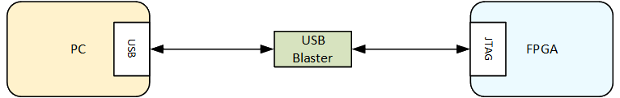
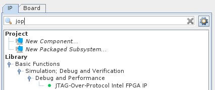

# SoC FPGA Remote Debug Tutorial Example Design: Agilex™ 5 E-Series Premium Dev Kit

##  Introduction

Altera® offers an integrated set of System Level Debug (SLD) tools, including:

* SignalTap II Logic Analyzer
* In-System Sources and Probes (ISSP),
* In-System Memory Content Editor)

Typically, the System-Level Debugging (SLD) communication solution was interfacing with the outside world through the JTAG. Then either an USB or Ethernet Blaster could be used to interface JTAG to the host PC.




Another alternative approach is also available, to interface the SLD to the outside world directly through Ethernet, without requiring either an USB or Ethernet Blaster.


This page presents an example on how enable this remote debug feature on top of the GSRD.

## Architecture

In the traditional approach the SLD communication solution was based on the Altera JTAG Interface (AJI) which interfaced with the JTAG TAP controller (hard atom in Altera devices which implements the JTAG protocol). The SLD tools used the JTAG channel for communication between software and hardware.


The remote FPGA debugging solution consists of the following:

* JTAG-Over Protocol (JOP) Component: Platform Designer component which enables access to debug information through an Avalon&reg;-MM slave bus
* Etherlink: HPS application exporting debug information over Ethernet, available on github: https://github.com/altera-fpga/remote-debug-for-intel-fpga


The JOP component requires reset and clocking and also provides an Avalon&reg;-MM slave bus through which is configured and debug information is accessed.

Th Etherlink application runs on HPS, accesses the JOP component slave bus to access the debug information, and provides a TCP/IP link from the host PC running the Quartus Pro debug tools to the board.

The etherlink works with the standard UIO Linux kernel driver.


## Example


This section shows an example of how to use the Remote Debug feature. Communication is established from the board to the host PC through Ethernet, so that the board appears as another JTAG device, listed by jtagconfig utility.

The example is based on the [GSRD](https://altera-fpga.github.io/rel-25.3.1/embedded-designs/agilex-5/e-series/premium/gsrd/ug-gsrd-agx5e-premium/), with the following changes:

 * Adding JOP component to the GHRD
 * Adding JOP to the Linux device tree

Notes:

 * UIO driver is enabled as module in the default kernel configuration file
 * etherlink is already part of the rootfs, built by the Yocto recipes

### Prerequisites

The following are required:

* Altera Agilex&trade; 5 FPGA E-Series 065B Premium Development Kit, ordering code DK-A5E065BB32AES1.
  * HPS Enablement Expansion Board. Included with the development kit.
  * SD/MMC HPS Daughtercard
  * Mini USB cable for serial output
  * Micro USB cable for on-board Altera® FPGA Download Cable II
* Host PC with:
  * 64 GB of RAM. Less will be fine for only exercising the binaries, and not rebuilding the GSRD.
  * Linux OS installed. Ubuntu 22.04LTS was used to create this page, other versions and distributions may work too
  * Serial terminal (for example GtkTerm or Minicom on Linux and TeraTerm or PuTTY on Windows)
  * Altera Quartus<sup>&reg;</sup> Prime Pro Edition Version 25.3.1
* Local Ethernet network, with DHCP server
* Internet connection. For downloading the files, especially when rebuilding the GSRD.

Refer to [board documentation](https://www.intel.com/content/www/us/en/products/details/fpga/development-kits/agilex/a5e065b-premium.html) for more information about the development kit.

### Set up Environment


Create a top folder for this example, as the rest of the commands assume this location:


```bash
sudo rm -rf agilex5.remote_debug
mkdir agilex5.remote_debug
cd agilex5.remote_debug
export TOP_FOLDER=$(pwd)
```

Enable Quartus tools to be called from command line:


```bash
export QUARTUS_ROOTDIR=~/altera_pro/25.3.1/quartus/
export PATH=$QUARTUS_ROOTDIR/bin:$QUARTUS_ROOTDIR/linux64:$QUARTUS_ROOTDIR/../qsys/bin:$PATH
```


### Build Hardware Design


1\. Generate the hardware design:


```bash
cd $TOP_FOLDER
rm -rf agilex5_soc_devkit_ghrd && mkdir agilex5_soc_devkit_ghrd && cd agilex5_soc_devkit_ghrd
wget https://github.com/altera-fpga/agilex5e-ed-gsrd/releases/download/QPDS25.3.1_REL_GSRD_PR/a5ed065es-premium-devkit-oobe-baseline-a55.zip
unzip a5ed065es-premium-devkit-oobe-baseline-a55.zip
rm -f a5ed065es-premium-devkit-oobe-baseline-a55.zip
```


2\. Open the project in Quartus, open the `baseline_top.qsys` file in Platform Designer.

3\. In the IP Catalog search for jop and double-click the component to add it to the system:



4\. Configure the JOP component as follows:


5\. Connect the reset and clock to JOP component, also connect it's slave bus to the HPS LW bridge, and map it at offset 0x0001_4000:


6\. Alternatively, steps 2-6 can be peformed from command line, using the provided tcl script:


```bash
cd $TOP_FOLDER
rm -f agilex5-ghrd-add-jop.tcl
wget https://altera-fpga.github.io/rel-25.3.1/embedded-designs/agilex-5/e-series/premium/remote-debug/collateral/agilex5-ghrd-add-jop.tcl
cd agilex5_soc_devkit_ghrd
qsys-script --quartus-project=top.qpf --script=../agilex5-ghrd-add-jop.tcl --system-file=fabric_subsys.qsys

```


7\. Finish compilation of the GHRD from command line:


```bash
cd $TOP_FOLDER/agilex5_soc_devkit_ghrd
make baseline_a55-install
cd ..
```


The following files are created:
* `$TOP_FOLDER/agilex5_soc_devkit_ghrd/output_files/baseline_a55.sof`
* `$TOP_FOLDER/agilex5_soc_devkit_ghrd/output_files/baseline_a55_hps_debug.sof`
* `$TOP_FOLDER/agilex5_soc_devkit_ghrd/output_files/baseline_a55_hps_debug.core.rbf`
* `$TOP_FOLDER/agilex5_soc_devkit_ghrd/output_files/legacy_a55_baseline.sof`


### Build Yocto Using Kas


1\. Create and enter a new Python virtual environment:


```bash
cd $TOP_FOLDER/agilex5_soc_devkit_ghrd/software/yocto_linux
python3 -m venv venv --system-site-packages
source venv/bin/activate
pip install --upgrade pip
pip install kas
pip install --upgrade kas
pip install kconfiglib
```


2\. Copy the core.rbf file to where Kas expects it to be:


```bash
cp $TOP_FOLDER/agilex5_soc_devkit_ghrd/output_files/baseline_a55_hps_debug.core.rbf \
   $TOP_FOLDER/agilex5_soc_devkit_ghrd/software/yocto_linux/meta-custom/recipes-fpga/fpga-bitstream/files/
```


3\. Update the device tree to add the JOP component:


```bash
rm agilex5-dts-add-jop.patch
wget https://altera-fpga.github.io/rel-25.3.1/embedded-designs/agilex-5/e-series/premium/remote-debug/collateral/agilex5-dts-add-jop.patch
patch -p1 < agilex5-dts-add-jop.patch
```


For reference, the patch looks like this:

```patch
--- a/meta-custom/recipes-bsp/device-tree/files/socfpga_agilex5_ghrd.dtsi 2026-01-14 15:59:24.691579381 -0600
+++ b/meta-custom/recipes-bsp/device-tree/files/socfpga_agilex5_ghrd.dtsi 2026-01-14 16:05:24.686554319 -0600
@@ -41,6 +41,11 @@
        resetvalue = <0>;
    };
 */
+   jop@20014000 {
+     compatible = "generic-uio";
+     reg = <0x20014000 0x4000>;
+     reg-names = "jop";
+   };
    soc_leds: leds {
      compatible = "gpio-leds";
```

4\. Avoid using an older version of remote-debug-app which had an issue:


```bash
mkdir -p meta-custom/recipes-gsrd/remote-debug-app 
echo 'SRCREV_default = "b6a13b03fe7e9566063eae65d99bd8bc1190ce62"' > meta-custom/recipes-gsrd/remote-debug-app/remote-debug-app_1.0.bbappend
```


5\. Enable including the remote debug application in the rootfs build:


```bash
echo -e 'header:\n  version: 17\n\nlocal_conf_header:\n  remote-debug: |\n    GSRD_APP_REMOTE_DEBUG = "true"' > remote-debug.yml
```


The file will contain the following:

```yml

cat <<'EOX' > remote-debug.yml
  header:
    version: 17

  local_conf_header:
    remote-debug: |
      GSRD_APP_REMOTE_DEBUG = "true"
EOX
```

6\. Build Yocto with Kas:


```bash
kas build kas.yml:remote-debug.yml gsrd-console-image
```


The following relevant files are created in `$TOP_FOLDER/agilex5_soc_devkit_ghrd/software/yocto_linux/build/tmp/deploy/images/agilex5e/`:

* `gsrd-console-image-agilex5e.rootfs.wic`
* `u-boot-spl-dtb.hex`

> **Note**: If you experience build failures related to file-locks, you can work around these by reducing the parallelism of your build by running the following commands before running `kas`:

```bash
export PARALLEL_MAKE="-j 8"
export BB_NUMBER_THREADS="8"
export BB_ENV_PASSTHROUGH_ADDITIONS="$BB_ENV_PASSTHROUGH_ADDITIONS PARALLEL_MAKE BB_NUMBER_THREADS"
```


### Build QSPI Image


```bash
cd $TOP_FOLDER
rm -f baseline.hps.jic baseline.core.rbf
quartus_pfg \
-c agilex5_soc_devkit_ghrd/output_files/baseline_a55.sof baseline.jic \
-o device=MT25QU128 \
-o flash_loader=A5ED065BB32AE6SR0 \
-o hps_path=agilex5_soc_devkit_ghrd/software/yocto_linux/build/tmp/deploy/images/agilex5e/u-boot-spl-dtb.hex \
-o mode=ASX4 \
-o hps=1
```


The following file is created:

* `$TOP_FOLDER/baseline.hps.jic`


### Run Example

The instructions from this section present how to run the remote debug example. Refer to the [GSRD](https://altera-fpga.github.io/rel-25.3.1/embedded-designs/agilex-5/e-series/premium/gsrd/ug-gsrd-agx5e-premium/) for more detailed instructions on how to set up the board, serial port, and write the binaries.

1\. Write the QSPI image `$TOP_FOLDER/ghrd_a5ed065bb32ae6sr0.hps.jic` to flash.

2\. Extract and write the SD card image `$TOP_FOLDER/gsrd-socfpga/agilex5_dk_a5e065bb32aes1-gsrd-images/sdimage.tar.gz` to the SD card

3\. Boot board and log into Linux.

4\. Determine board IP address by running the `ifconfig` command:


```bash
root@agilex5dka5e065bb32aes1:~# ifconfig
eth0: flags=-28605<UP,BROADCAST,RUNNING,MULTICAST,DYNAMIC>  mtu 1500
        inet 10.122.105.175  netmask 255.255.255.0  broadcast 10.122.105.255
        inet6 fe80::7097:4bff:fe41:b7c2  prefixlen 64  scopeid 0x20<link>
        ether 72:97:4b:41:b7:c2  txqueuelen 1000  (Ethernet)
        RX packets 218  bytes 23619 (23.0 KiB)
        RX errors 0  dropped 0  overruns 0  frame 0
        TX packets 78  bytes 11072 (10.8 KiB)
        TX errors 0  dropped 0 overruns 0  carrier 0  collisions 0
        device interrupt 22  
```

5\. Remove pre-existing instances of the driver, and load it again:

```bash
root@agilex5dka5e065bb32aes1:~# rmmod uio_pdrv_genirq
root@agilex5dka5e065bb32aes1:~# modprobe uio_pdrv_genirq of_id="generic-uio"
```

6\. Start the etherlink application, specifying which port to accept connections on as shown below:

```bash
root@agilex5dka5e065bb32aes1:~# etherlink --port=33301
INFO: Etherlink Server Configuration:
INFO:    H2T/T2H Memory Size  : 4096
INFO:    Listening Port       : 33301
INFO:    IP Address           : 0.0.0.0
INFO: UIO Platform Configuration:
INFO:    Driver Path: /dev/uio0
INFO:    Address Span: 16384
INFO:    Start Address: 0x0
INFO: Server socket is listening on port: 33301
```

7\. On the host, establish the JTAG communication to the board through Ethernet, using the board IP and the selected port number:

```bash
$ jtagconfig --add JTAG-over-protocol sti://localhost:0/intel/remote-debug/10.122.105.175:33301/0
```

8\. Also on the host, run the 'jtagconfig' command to show the newly added connection:

```bash
$ jtagconfig
1) JTAG-over-protocol [sti://localhost:0/intel/remote-debug/10.122.105.175:33301/0]
  020D10DD   VTAP10
```

At this point, the connection can be used by the tools which need a JTAG connection, like SignalTap.

## Notices & Disclaimers

Altera<sup>&reg;</sup> Corporation technologies may require enabled hardware, software or service activation.
No product or component can be absolutely secure. 
Performance varies by use, configuration and other factors.
Your costs and results may vary. 
You may not use or facilitate the use of this document in connection with any infringement or other legal analysis concerning Altera or Intel products described herein. You agree to grant Altera Corporation a non-exclusive, royalty-free license to any patent claim thereafter drafted which includes subject matter disclosed herein.
No license (express or implied, by estoppel or otherwise) to any intellectual property rights is granted by this document, with the sole exception that you may publish an unmodified copy. You may create software implementations based on this document and in compliance with the foregoing that are intended to execute on the Altera or Intel product(s) referenced in this document. No rights are granted to create modifications or derivatives of this document.
The products described may contain design defects or errors known as errata which may cause the product to deviate from published specifications.  Current characterized errata are available on request.
Altera disclaims all express and implied warranties, including without limitation, the implied warranties of merchantability, fitness for a particular purpose, and non-infringement, as well as any warranty arising from course of performance, course of dealing, or usage in trade.
You are responsible for safety of the overall system, including compliance with applicable safety-related requirements or standards. 
<sup>&copy;</sup> Altera Corporation.  Altera, the Altera logo, and other Altera marks are trademarks of Altera Corporation.  Other names and brands may be claimed as the property of others. 

OpenCL* and the OpenCL* logo are trademarks of Apple Inc. used by permission of the Khronos Group™. 