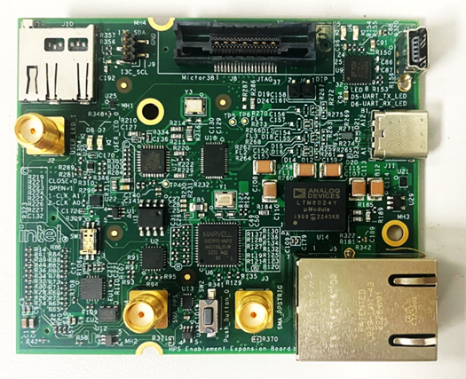

## Introduction

IEEE Ethernet is a core technology which is a backbone for IT operations and was designed to provide best effort communication suitable for IT operations. Operational Technology vendors have innovatively used Core IEEE Ethernet technology with proprietary solutions for enabling time-bounded communication. To address the need for precision timing, traffic shaping, and time-bounded communication over networks, IEEE introduced a suite of standards known as Time Sensitive Networking (TSN).

Agilex&trade; 5 E-Series is designed as an end point for Industrial automation application with support for the following TSN protocols:

* __Time Synchronization Protocols__:
  * IEEE 1588-2008 Advanced Timestamp (Precision Time Protocol - PTP):
    * Function: Provides sub-microsecond accuracy for time synchronization between computing systems over a local area network.
    * Key Features: 2-step synchronization, PTP offload, and timestamping.
    * Use Case: Synchronizing industrial devices to operate in unison, ensuring coordinated actions across factory or plant operations.
  * IEEE 802.1AS (Timing and Synchronization):
    * Function: A profile of PTP (version 2) that ensures precise time synchronization in a hierarchical master-slave architecture.
    * Key Features: Prioritizes accuracy and variability of timing, crucial for industrial and automotive systems.
    * Use Case: Synchronizing devices to a common time for optimal operation and collaboration.

* __Credit Based Shaper Protocol__:
  * IEEE 802.1Qav (Time-Sensitive Streams Forwarding and Queuing):
    * Function: Provides low-latency, time-synchronized delivery of audio and video streams over Ethernet networks.
    * Key Features: Credit-based shaper ensuring end-to-end guaranteed bandwidth with fairness to best-effort traffic.
    * Use Case: Ensuring dedicated bandwidth for audio-video bridging (AVB) streams with minimal latency.

* __Traffic Scheduling Protocols__:
  * IEEE 802.1Qbv (Time-Scheduled Traffic Enhancements):
    * Function: Enables the transmission of frames at specific scheduled times within microsecond ranges.
    * Key Features: Critical for time-sensitive scheduled traffic in industrial applications.
    * Use Case: Facilitating precise, time-critical communication for industrial devices like PLCs and drives.
  * IEEE 802.1Qbu (Frame Preemption):
    * Function: Allows high-priority frames to preempt lower-priority frames, reducing latency and jitter.
    * Key Features: Utilizes Express Media Access Control (eMAC) and Preemptable Media Access Control (pMAC).
    * Use Case: Ensuring high-priority frames arrive with fixed latency, crucial for applications requiring consistent timing.

These TSN standards collectively enable precise timing, traffic shaping, and time-bounded communication, making them indispensable for applications requiring high reliability and determinism. 

The details of TSN is not in the scope of this document. Here are some reference to the TSN specifications

- [IEEE Std 802.1AS™-2011 "Timing and Synchronization for Time-Sensitive Applications in Bridged Local Area Networks"](https://standards.ieee.org/standard/802_1AS-2011.html?oslc_config.context=https%3A%2F%2Frtc.intel.com%2Fgc%2Fconfiguration%2F964)
- [IEEE Std 802.1Qav™-2009 “Forwarding and Queuing Enhancements for Time-Sensitive Streams”](https://standards.ieee.org/standard/802_1Qav-2009.html?oslc_config.context=https%3A%2F%2Frtc.intel.com%2Fgc%2Fconfiguration%2F964)
- [IEEE Std 802.1Qbv™-2015 “Enhancements for Scheduled Traffic”](https://standards.ieee.org/standard/802_1Qbv-2015.html?oslc_config.context=https%3A%2F%2Frtc.intel.com%2Fgc%2Fconfiguration%2F964)
- [IEEE Std 802.1Qbu™-2016 “Frame Preemption”](https://standards.ieee.org/standard/802_1Qbu-2016.html?oslc_config.context=https%3A%2F%2Frtc.intel.com%2Fgc%2Fconfiguration%2F964)


### TSN RGMII HVIO System Example Design Overview

The Time Sensitive Network (TSN) through Hard Processor System (HPS) with RGMII HVIO (FPGA IO) System Example Design (SED) is a reference design implemented on the Agilex™ 5 E-Series 065B Premium Development Kit. 
This design utilizes the HPS GMII-to-RGMII adapter IP to convert GMII to RGMII protocol within the FPGA. The converted RGMII signal is then routed to the FPGA High-Voltage Input/Output (HVIO) for interfacing with the external RGMII PHY. The conversion to RGMII is advantageous because it significantly reduces the number of pins required for the interface compared to using GMII directly.

Please refer to the following documentation for further information:

1. Agilex™ 5 Hard Processor System Technical Reference Manual: chapter 12.3.1. [GMII to RGMII through RGMII adapter via FPGA HVIOs](https://www.intel.com/content/www/us/en/docs/programmable/814346/24-3-1/gmii-to-rgmii-through-rgmii-adapter.html)
2. Embedded Peripherals IP User Guide: chapter 50 [HPS GMII to RGMII Adapter Intel® FPGA IP](https://www.intel.com/content/www/us/en/docs/programmable/683130/24-3/hps-gmii-to-rgmii-adapter.html)

This System Example Design comprises the following components:

* Hardware Reference Design
* Reference HPS software including:
  * Arm Trusted Firmware
  * U-Boot
  * Linux Kernel
  * Linux Drivers
  * Sample Applications

TSN Solution Architecture for this SED is illustrated as:


>[Note:]
>This is a pre-production release of Agilex&trade; 5 TSN RGMII HVIO System Example Design, on Agilex&trade; 5 FPGA E-Series 065B Premium Development Kit with speed grade -6S. This corresponds to Engineering Samples Silicon quality.


### Prerequisites

This system example design is based on the [Agilex 5 E-Series Premium Development Kit GSRD](https://altera-fpga.github.io/rel-24.3.1/embedded-designs/agilex-5/e-series/premium/gsrd/ug-gsrd-agx5e-premium/). It is recommended that you familiarize yourself with the GSRD development flow before proceeding with this design.
The TSN through FPGA IO System Example Design requires the HPS Enablement Expansion Board (also referred as HPS Daughter Card), which is included with the development kit.

#### Development Kit

This Example Design targets the Agilex 5 FPGA E-Series 065B Premium Development Kit, utilizing the HPS. 
Refer to [GSRD\#Development Kit](https://altera-fpga.github.io/rel-24.3.1/embedded-designs/agilex-5/e-series/premium/gsrd/ug-gsrd-agx5e-premium#development-kit) for details about the board, including how to install the HPS Daughter Card.

* Altera&reg; Agilex&trade; 5 FPGA E-Series 065B Premium Development Kit
* HPS Enablement Expansion Board. Included with the development kit.
* Mini USB Cable
* Micro USB Cable
* Ethernet Cable
* Micro SD card and USB card writer

**Altera&reg; Agilex&trade; 5 FPGA E-Series 065B Premium Development Kit:**


**HPS Enablement Expandsion Board Card:**




#### Development Environment

Host PC with:

*   64 GB of RAM. Less will be fine for only exercising the binaries, and not rebuilding the GSRD.
*   Linux OS installed. Ubuntu 22.04LTS was used to create this page, other versions and distributions may work too.
*   Serial terminal (for example GtkTerm or Minicom on Linux and TeraTerm or PuTTY on Windows)
*   Altera&reg; Quartus&reg; Prime Pro Edition version. Used to recompile the hardware design. If only writing binaries is required, then the smaller Altera&reg; Quartus&reg; Prime Pro Edition Programmer is sufficient.
*   The prebuilt binaries were built using Quartus version 24.3.1
*   The instructions for rebuilding the binaries use Quartus version 24.3.1
*   Local Ethernet network, with DHCP server
*   Internet connection. For downloading the files, especially when rebuilding the GSRD.


### Release Contents

This page documents the following:

*   Binary Release - see [Programming the Binaries](#programming-the-binaries) section for release content details
*   Source Code Release - see [Programming Software Image](#programming-software-image) section for release content details

#### Prebuilt Binaries

The Agilex 5 Premium Development Kit 24.3.1 Example Design binaries are located at [https://releases.rocketboards.org/2025.01/rgmii-hvio/](https://releases.rocketboards.org/2025.01/rgmii-hvio/):

| HPS Daughter Card | Boot Source | Link |
| --- | --- | --- |
| Enablement Board | SD Card | [https://releases.rocketboards.org/2025.01/rgmii-hvio/agilex5_dk_a5e065bb32aes1_rgmii-hvio/](https://releases.rocketboards.org/2025.01/rgmii-hvio/agilex5_dk_a5e065bb32aes1_rgmii-hvio/) |

#### Sources

Quartus Prime Pro v24.3.1 and the following software component versions were used to build the provided prebuilt binaries:


| Component | Location | Branch | Commit ID/Tag |
| --- | --- | --- | --- |
| GHRD | [https://github.com/altera-opensource/ghrd-socfpga](https://github.com/altera-opensource/ghrd-socfpga) | master | [QPDS24.3.1_REL_GSRD_PR](https://github.com/altera-opensource/ghrd-socfpga/tree/QPDS24.3.1_REL_GSRD_PR) |
| Linux | [https://github.com/altera-opensource/linux-socfpga](https://github.com/altera-opensource/linux-socfpga) | socfpga-6.6.37-lts | [QPDS24.3.1_REL_GSRD_PR](https://github.com/altera-opensource/linux-socfpga/tree/QPDS24.3.1_REL_GSRD_PR) |
| Arm Trusted Firmware | [https://github.com/altera-opensource/arm-trusted-firmware](https://github.com/altera-opensource/arm-trusted-firmware) | socfpga_v2.11.0 | [QPDS24.3.1_REL_GSRD_PR](https://github.com/altera-opensource/arm-trusted-firmware/tree/QPDS24.3.1_REL_GSRD_PR) |
| U-Boot | [https://github.com/altera-opensource/u-boot-socfpga](https://github.com/altera-opensource/u-boot-socfpga) | socfpga_v2024.04 | [QPDS24.3.1_REL_GSRD_PR](https://github.com/altera-opensource/u-boot-socfpga/tree/QPDS24.3.1_REL_GSRD_PR) |
| Yocto Project: poky | [https://git.yoctoproject.org/poky](https://git.yoctoproject.org/poky) | styhead | latest |
| Yocto Project: meta-intel-fpga | [https://git.yoctoproject.org/meta-intel-fpga](https://git.yoctoproject.org/meta-intel-fpga) | styhead | latest |
| Yocto Project: meta-intel-fpga-refdes | [https://github.com/altera-opensource/meta-intel-fpga-refdes](https://github.com/altera-opensource/meta-intel-fpga-refdes) | styhead | [QPDS24.3.1_REL_GSRD_PR](https://github.com/altera-opensource/meta-intel-fpga-refdes/tree/QPDS24.3.1_REL_GSRD_PR) |
| GSRD Build Script: gsrd-socfpga | [https://github.com/altera-opensource/gsrd-socfpga](https://github.com/altera-opensource/gsrd-socfpga) | styhead | [QPDS24.3.1_REL_GSRD_PR](https://github.com/altera-opensource/gsrd-socfpga/tree/QPDS24.3.1_REL_GSRD_PR) |

### Release Notes

See [https://github.com/altera-opensource/gsrd-socfpga/releases/tag/QPDS24.3.1_REL_GSRD_PR](https://github.com/altera-opensource/gsrd-socfpga/releases/tag/QPDS24.3.1_REL_GSRD_PR)


## TSN RGMII Architecture

This system example design showcases Ethernet solution using the HPS EMAC controller with FPGA HVIO as the RGMII interface. This design uses the HPS GMII to RGMII Adapter Altera FPGA IP to convert GMII interface from HPS EMAC to the FPGA fabric. The support for TSN features (IEEE 802.1AS, IEEE 802.1Qav, IEEE 802.1Qbv, IEEE 802.1Qbu) are from the HPS EMAC controller.


* HPS Peripherals connected to HPS Enablement Expansion Board for this design:

  * Micro SD Card
  * EMAC
  * HPS JTAG debug
  * UART

#### HPS Subsystem
The following are the key connections of the HPS to other design components;

* HPS Ethernet MAC controller provide an 8-bit EMAC GMII interface to FPGA fabric.
* EMAC MDIO PHY Management Interface (through FPGA HVIO pins) to manage external PHY.


#### FPGA RGMII Subsystem

* The GMII to RGMII adapter core provides a single to double data rate conversion of the  data coming out from the EMAC1. The RGMII interface is connected to an onboard Marvell PHY (88E1512).
* IOPLL provides two reference clock 2.5MHz and 25MHz to the adapter core. 2.5Mhz reference clock is used for generating a 10Mbps TX clock while the 25MHz reference clock is used for generating 100Mbps TX clock.

>[Note:]
>There is no register map access needed as the hps_gmii conduit interface will connect directly to HPS exported GMII conduit interface into SoC-FPGA Interface in Platform Designer.
 
#### Software Subsystem

The software subsystem for the TSN RGMII HVIO System Example Design is built on the Linux OS, which is responsible for managing the proper register settings of the peripheral components. A crucial part of this setup involves configuring the Device Tree Source (.dts) file to ensure the correct operation. In this design, the MAC signals are GMII, while the PHY signals are RGMII, so the .dts file must explicitly describe the MAC and PHY modes.

In this design example, `gmac1` is routed to the FPGA IO and the corresponding device tree node `gmac1` is described as follows:
<br />(Note that while the `phy-mode` remains `rgmii`, the `mac-mode` should be specified as `gmii`.)

```c
&gmac1 {
	status = "disabled";
	phy-mode = "rgmii";
	mac-mode = "gmii";
	phy-handle = <&emac1_phy0>;

	max-frame-size = <9000>;

	mdio0 {
		#address-cells = <1>;
		#size-cells = <0>;
		compatible = "snps,dwmac-mdio";
		emac1_phy0: ethernet-phy@0 {
			reg = <0>;
		};
	};
};
```

## User Flow 
 
There are two ways to test the design based on use case. 
    <a id="UserFlow1"></a> 
 
* User Flow 1: Testing with Prebuilt Binaries. 
 
    <a id="UserFlow2"></a> 
 
* User Flow 2: Testing Complete Flow.

| User Flow | Description | Required for [Userflow#1](#UserFlow1) | Required for [Userflow#2](#UserFlow2) |
| --- | --- | --- | --- |
|Environment Setup|[Tools Download and Installation](#tools-download-and-installation)|Yes|Yes|
||[Install dependencies for SW compilation](#install-dependencies-for-sw-compilation)|No|Yes|
 |Compilation|Simulation|No|No|
||[Hardware Compilation](#hardware-compilation-flow)|No|Yes|
||[Software Compilation](#software-compilation-flow)|No|Yes|
| Programming | [Programming the binaries](#programming-the-binaries) | Yes | Yes |
| | [Linux boot](#linux-boot) | Yes | Yes |
| [Testing](#testing)|[Run Ping Test](#ping-test)|Yes|Yes|
|| [Run TSN Reference Application](#run-tsn-application) | Yes | Yes |

### Environment Setup

#### Tools Download and Installation

1. Quartus Prime Pro

    Please download and install the Quartus&reg; Prime Pro Edition version 24.3.1 version software. 

2. Win32 Disk Imager

    Please download and install the latest Win32 Disk Imager, available at [https://win32diskimager.org/](https://win32diskimager.org/)

#### Download and setup the build toolchain
1\. Create the top folder to store all the build artifacts:

```bash
sudo rm -rf gsrd.enablement
mkdir gsrd.enablement
cd gsrd.enablement
export TOP_FOLDER=`pwd` # The $TOP_FOLDER must be defined for every fresh terminal session.
```

2\. Download and setup the build toolchain. It will be used only by the GHRD makefile to build the debug HPS FSBL, to build the \_hps\_debug.sof file:

Note that this is installed in the `TOP_FOLDER`. You may installed this is in other location, but note the path and export it accordingly

```bash
cd $TOP_FOLDER
wget https://developer.arm.com/-/media/Files/downloads/gnu/11.2-2022.02/binrel\
/gcc-arm-11.2-2022.02-x86_64-aarch64-none-linux-gnu.tar.xz
tar xf gcc-arm-11.2-2022.02-x86_64-aarch64-none-linux-gnu.tar.xz
rm -f gcc-arm-11.2-2022.02-x86_64-aarch64-none-linux-gnu.tar.xz
```
```bash
export PATH=`pwd`/gcc-arm-11.2-2022.02-x86_64-aarch64-none-linux-gnu/bin:$PATH
export ARCH=arm64
export CROSS_COMPILE=aarch64-none-linux-gnu- 
```

3\. Set up the Quartus tools in the PATH, so they are accessible without full path.

    Note: The following must be re-done for fresh terminal session

```bash
export QUARTUS_ROOTDIR=~/intelFPGA_pro/24.3.1/quartus/
export PATH=$QUARTUS_ROOTDIR/bin:$QUARTUS_ROOTDIR/linux64:$QUARTUS_ROOTDIR/../qsys/bin:$PATH
```

#### Install dependencies for SW compilation

Make sure you have Yocto system requirements met: [Yocto Requirements](https://docs.yoctoproject.org/3.4.1/ref-manual/system-requirements.html#supported-linux-distributions).

The command to install the required packages on Ubuntu 22.04-LTS is:

```bash
sudo apt-get update
sudo apt-get upgrade
sudo apt-get install openssh-server mc libgmp3-dev libmpc-dev gawk wget git diffstat unzip texinfo gcc \
build-essential chrpath socat cpio python3 python3-pip python3-pexpect xz-utils debianutils iputils-ping \
python3-git python3-jinja2 libegl1-mesa libsdl1.2-dev pylint xterm python3-subunit mesa-common-dev zstd \
liblz4-tool git fakeroot build-essential ncurses-dev xz-utils libssl-dev bc flex libelf-dev bison xinetd \
tftpd tftp nfs-kernel-server libncurses5 libc6-i386 libstdc++6:i386 libgcc++1:i386 lib32z1 \
device-tree-compiler curl mtd-utils u-boot-tools net-tools swig -y
```

On Ubuntu 22.04 you will also need to point the /bin/sh to /bin/bash, as the default is a link to `/bin/dash`:

```bash
sudo ln -sf /bin/bash /bin/sh
```

### Compilation Flow

#### Hardware Compilation Flow

```bash
cd $TOP_FOLDER
rm -rf ghrd-socfpga agilex5_soc_devkit_ghrd
git clone -b QPDS24.3.1_REL_GSRD_PR https://github.com/altera-opensource/ghrd-socfpga
mv ghrd-socfpga/agilex5_soc_devkit_ghrd .
rm -rf ghrd-socfpga
cd agilex5_soc_devkit_ghrd
make config
make BOARD_TYPE=DK-A5E065BB32AES1 DEVICE=A5ED065BB32AE6SR0 DAUGHTER_CARD=devkit_dc_oobe HPS_EMIF_EN=1 HPS_EMIF_MEM_CLK_FREQ_MHZ=800 HPS_EMIF_REF_CLK_FREQ_MHZ=100 SUB_FPGA_RGMII_EN=1 generate_from_tcl
make sof
cd ..
```

The following files are created:

*   `$TOP_FOLDER/agilex5_soc_devkit_ghrd/output_files/ghrd_a5ed065bb32ae6sr0.sof`
*   `$TOP_FOLDER/agilex5_soc_devkit_ghrd/output_files/ghrd_a5ed065bb32ae6sr0_hps_debug.sof`

##### Build Core RBF

```bash
cd $TOP_FOLDER
rm -f ghrd_a5ed065bb32ae6sr0.rbf
quartus_pfg -c agilex5_soc_devkit_ghrd/output_files/ghrd_a5ed065bb32ae6sr0_hps_debug.sof ghrd_a5ed065bb32ae6sr0.rbf -o hps=1
```

The following file is created:

* `$TOP_FOLDER/ghrd_a5ed065bb32ae6sr0.core.rbf`

#### Software Compilation Flow


##### Set Up Yocto

1\. Clone the Yocto script and prepare the build:

```bash
cd $TOP_FOLDER
rm -rf gsrd-socfpga
git clone -b QPDS24.3.1_REL_GSRD_PR https://github.com/altera-opensource/gsrd-socfpga
cd gsrd-socfpga
. agilex5_dk_a5e065bb32aes1-gsrd-build.sh
build_setup
```

##### Customize Yocto

1\. Save the `core.rbf` as `$WORKSPACE/meta-intel-fpga-refdes/recipes-bsp/ghrd/files/agilex5_dk_a5e065bb32aes1_gsrd_ghrd.core.rbf`

2\. Update the recipe `$WORKSPACE/meta-intel-fpga-refdes/recipes-bsp/ghrd/hw-ref-design.bb` as follows:

*  Replace the entry `${GHRD_REPO}/agilex5_dk_a5e065bb32aes1_gsrd_${ARM64_GHRD_CORE_RBF};name=agilex5_dk_a5e065bb32aes1_gsrd_core` with `file://agilex5_dk_a5e065bb32aes1_gsrd_ghrd.core.rbf;sha256sum=<CORE_SHA>` where `CORE_SHA` is the sha256 checksum of the file
*  Delete the line `SRC_URI[agilex5_dk_a5e065bb32aes1_gsrd_core.sha256sum] = "bf11c8cb3b6d9487f93ce0e055b1e5256998a25b25ac4690bef3fcd6225ee1ae"`  
    The above are achieved by the following instructions:

```bash
CORE_RBF=$WORKSPACE/meta-intel-fpga-refdes/recipes-bsp/ghrd/files/agilex5_dk_a5e065bb32aes1_gsrd_ghrd.core.rbf
ln -s $TOP_FOLDER/ghrd_a5ed065bb32ae6sr0.core.rbf $CORE_RBF
OLD_URI="\${GHRD_REPO}\/agilex5_dk_a5e065bb32aes1_gsrd_\${ARM64_GHRD_CORE_RBF};name=agilex5_dk_a5e065bb32aes1_gsrd_core"
CORE_SHA=$(sha256sum $CORE_RBF | cut -f1 -d" ")
NEW_URI="file:\/\/agilex5_dk_a5e065bb32aes1_gsrd_ghrd.core.rbf;sha256sum=$CORE_SHA"
sed -i "s/$OLD_URI/$NEW_URI/g" $WORKSPACE/meta-intel-fpga-refdes/recipes-bsp/ghrd/hw-ref-design.bb
sed -i "/agilex5_dk_a5e065bb32aes1_gsrd_core\.sha256sum/d" $WORKSPACE/meta-intel-fpga-refdes/recipes-bsp/ghrd/hw-ref-design.bb
```

##### Build Yocto

Build Yocto:

```bash
bitbake_image
```

Gather files:

```bash
package
```

The following files are created:

*   `$TOP_FOLDER/gsrd-socfpga/agilex5_dk_a5e065bb32aes1-gsrd-images/u-boot-agilex5-socdk-gsrd-atf/u-boot-spl-dtb.hex`
*   `$TOP_FOLDER/gsrd-socfpga/agilex5_dk_a5e065bb32aes1-gsrd-images/u-boot.itb`
*   `$TOP_FOLDER/gsrd-socfpga/agilex5_dk_a5e065bb32aes1-gsrd-images/sdimage.tar.gz`


#### Building HPS Bootable Configuration Files

Ensure you have completed the [Hardware Compilation Flow](#hardware-compilation-flow) and [Software Compilation Flow](#software-compilation-flow) successfully before continuing below.

##### Build QSPI Image

```
cd $TOP_FOLDER
rm -f ghrd_a5ed065bb32ae6sr0.hps.jic ghrd_a5ed065bb32ae6sr0.core.rbf
quartus_pfg \
-c agilex5_soc_devkit_ghrd/output_files/ghrd_a5ed065bb32ae6sr0.sof ghrd_a5ed065bb32ae6sr0.jic \
-o device=MT25QU128 \
-o flash_loader=A5ED065BB32AE6SR0 \
-o hps_path=gsrd-socfpga/agilex5_dk_a5e065bb32aes1-gsrd-images/u-boot-agilex5-socdk-gsrd-atf/u-boot-spl-dtb.hex \
-o mode=ASX4 \
-o hps=1
```

The following file is created:

* `$TOP_FOLDER/ghrd_a5ed065bb32ae6sr0.hps.jic`

##### Build HPS RBF

This is an *optional* step, in which you can build an HPS RBF file, which can be used to configure the HPS through JTAG instead of QSPI though the JIC file.

```
cd $TOP_FOLDER
rm -f ghrd_a5ed065bb32ae6sr0.hps.rbf
quartus_pfg \
-c agilex5_soc_devkit_ghrd/output_files/ghrd_a5ed065bb32ae6sr0.sof  ghrd_a5ed065bb32ae6sr0.rbf \
-o hps_path=gsrd-socfpga/agilex5_dk_a5e065bb32aes1-gsrd-images/u-boot-agilex5-socdk-gsrd-atf/u-boot-spl-dtb.hex \
-o hps=1
```

The following file is created:

*   `$TOP_FOLDER/ghrd_a5ed065bb32ae6sr0.hps.rbf`


### Programming the Binaries

This section presents how to use the prebuilt binaries included with the System Example Design release.

_Note: Please download Prebuilt Binaries from [here](#prebuilt-binaries), if you are leveraging [userflow#1](#UserFlow1)._


#### Configure Board

1\. Leave all jumpers and switches in their default configuration.

2\. Install the appropriate HPS Daughtercard.

3\. Connect mini USB cable from vertical connector on HPS Daughtercard to host PC. This is used for the HPS serial console.

4\. Connect micro USB cable from development board to host PC. This is used by the tools for JTAG communication.

5\. Connect Ethernet cable from HPS Daughter Card to an Ethernet switch connected to local network. Local network must provide a DCHP server.

#### Configure Serial Console

All the scenarios included in this release require a serial connection. This section presents how to configure the serial connection.

1\. Install a serial terminal emulator application on your host PC:

*   For Windows: TeraTerm or PuTTY are available
*   For Linux: GtkTerm or Minicom are available

2\. Power down your board if powered up. This is important, as once powered up, with the micro USB JTAG cable connected, a couple more USB serial ports will enumerate, and you may choose the wrong port.

3\. Connect mini-USB cable from the vertical mini-USB connector on the HPS Daughter Card to the host PC

4\. On the host PC, an USB serial port will enumerate. On Windows machines it will be something like `COM4`, while on Linux machines it will be something like `/dev/tty/USB0`.

5\. Configure your serial terminal emulator to use the following settings:

*   Serial port: as mentioned above
*   Baud rate: 115,200
*   Data bits: 8
*   Stop bits: 1
*   CRC: disabled
*   Hardware flow control: disabled

6\. Connect your terminal emulator

#### Write QSPI Flash

1\. Power down board

2\. Set MSEL dipswitch SW27 to JTAG: OFF-OFF-OFF-OFF

3\. Power up the board

4\. Write QSPI Flash:

<h5> Using pre-built image </h5>

- Download and extract the JIC image, then write it to QSPI

```bash
cd $TOP_FOLDER
wget https://releases.rocketboards.org/2025.01/rgmii-hvio/agilex5_dk_a5e065bb32aes1_rgmii-hvio/ghrd_a5ed065bb32ae6sr0.hps.jic.tar.gz
tar xf ghrd_a5ed065bb32ae6sr0.hps.jic.tar.gz
quartus_pgm -c 1 -m jtag -o "pvi;ghrd_a5ed065bb32ae6sr0.hps.jic"
```

<h5> Using compiled image </h5>

- Write JIC image to QSPI:

```bash
cd $TOP_FOLDER
quartus_pgm -c 1 -m jtag -o "pvi;ghrd_a5ed065bb32ae6sr0.hps.jic"
```


#### Programming Software Image

<h5>For Prebuilt:</h5>

- Download SD card image from the prebuilt binaries [https://releases.rocketboards.org/2025.01/rgmii-hvio/agilex5_dk_a5e065bb32aes1_rgmii-hvio/sdimage.tar.gz](https://releases.rocketboards.org/2025.01/rgmii-hvio/agilex5_dk_a5e065bb32aes1_rgmii-hvio/sdimage.tar.gz) and extract the archive, obtaining the file `gsrd-console-image-agilex5_devkit.wic`.

<h5>For compiled image:</h5>

- Extract sdcard image from the archive located at `$TOP_FOLDER/gsrd-socfpga/agilex5_dk_a5e065bb32aes1-gsrd-images/sdimage.tar.gz` 


##### Write SD Card
1\. Write the gsrd-console-image-agilex5\_devkit.wic. SD card image to the micro SD card using the included USB writer in the host computer:

* On Linux, use the `dd` utility as shown next:

```c
# Determine the device associated with the SD card on the host computer.
cat /proc/partitions
# This will return for example /dev/sdx
# Use dd to write the image in the corresponding device
sudo dd if=gsrd-console-image-agilex5_devkit.wic of=/dev/sdx bs=1M
# Flush the changes to the SD card
sync
```

* On Windows, use the Win32DiskImager program. For this, first rename the extension of gsrd-console-image-agilex5\_devkit.wic to an **.img** file (sdcard.img for example) and write the image as shown in the next figure:


#### Linux Boot

   1. Power down board
   2. Set MSEL dipswitch SW27 to ASX4 (QSPI): OFF-ON-ON-OFF
   3. Power up the board
   4. Wait for Linux to boot, use `root` as user name, and no password will be requested.

___

### Testing

For the purpose of demonstration, 2 development kits (refer to GSRD) will be required with Ethernet connected back to back from one board to another. 

Note: Ethernet port is on the HPS Enablement Expansion Board attached.


#### Ping Test
Use ifconfig to configure the IP address on both the Devkit DUT and start testing.

Example:-

Devkit #1 : $ ifconfig eth1 192.168.1.100

Devkit #2 : $ ifconfig eth1 192.168.1.200

#### Running _iperf_ Test:

1. Execute below command on Devkit #1 DUT.

    `iperf3 -s eth1`

2. Execute below command on Devkit #2 DUT.

    `iperf3 eth1 -c 192.168.1.100 -b 0 -l 1500`

    _Note : Update the Devkit #1 DUT IP address in above command._

#### Run TSN Application

The following examples are demonstrated using 2 units of the Agilex 5 platform.  Please take note of the notation "[Board A or B]". The following steps assumes both platforms are connected to each other via an Ethernet connection.

1\. Boot to Linux

2\. Navigate to the `tsn` directory

```bash
cd tsn
```

<h5>Configuration for Both Boards</h5>

<h6>Step I: Setup Environment Path on Both Boards</h6>

3\. Board A

   ```bash
   export LIBXDP_OBJECT_PATH=/usr/lib/bpf
   export LD_LIBRARY_PATH=/usr/lib/custom_bpf/lib 
   ```

4\. Board B

   ```bash
   export LIBXDP_OBJECT_PATH=/usr/lib/bpf
   export LD_LIBRARY_PATH=/usr/lib/custom_bpf/lib 
   ```

<h5>TXRX-TSN App</h5>

<h6>Step II: Run Configuration Script</h6>

5\. Board A: Run the configuration script and wait for it to configure the IP and MAC address, start clock synchronization, and set up TAPRIO qdisc.

   ```bash
   ./run.sh agilex5 eth0 vs1a setup
   ```

6\. Board B: Run the configuration script and wait for it to configure the IP and MAC address, start clock synchronization, and set up ingress qdiscs.

   ```bash
   ./run.sh agilex5 eth0 vs1b setup
   ```

<h6>Step III: Start the Application</h6>

7\. Board B: Run the application.

   ```bash
   ./run.sh agilex5 eth0 vs1b run
   ```

8\. Board A: Immediately after starting the application on Board B, run the application on Board A.

   ```bash
   ./run.sh agilex5 eth0 vs1a run
   ```

<h5>Post-Test Procedure</h5>
Once the test is completed, copy the following files from Board B (listener) to the host machine:

- afpkt-rxtstamps.txt
- afxdp-rxtstamps.txt

<h5>Generating Latency Plot Using Excel</h5>

Import 'afpkt-rxtstamps.txt' and 'afxdp-rxtstamps.txt' to excel in 2 seperate sheets.


Plot Column 1 for each sheets using Scatter chart,


This will generate plot for AFPKT and AFXDP with latency(on Y-axis) against packet count (on X-axis).
  

The latency for this design example can be seen as below:


#### Run Time Synchronization commands


You may use the following command guide to perform time synchronization on the Agilex&trade; 5 system using PTP4L and PHC2SYS, and to obtain delay values

__End-to-End PTP master and slave synchronization__

- Board B (as slave):

    ```bash
    ptp4l -i eth0  -s -H -E -2 -m
    ```

    ``` 
    -i  eth0: This option specifies the `eth0` as the network interface to use for PTP.
    -s  This option enables the slave-only mode. 
    -H  This option enables hardware time stamping. 
    -E  This option selects the end-to-end (E2E) delay measurement mechanism. This is the default.The E2E mechanism is also referred to as the delay “request-response” mechanism.
    -2  Use Ethernet Layer (L2)
    -m  This option enables printing of messages to the standard output.
    ```

- Boards A (as master):

    ```bash
    ptp4l -i eth0  -H -E -2 -m
    ```


- At Board B (as slave), perform sync on local System Clock with EMAC Hardwware Clock.

    ```bash
    phc2sys -s eth0 -w -m -c CLOCK_REALTIME -O 0 -n 0
    ```

__Peer-to-Peer PTP synchronization__:

- Board B (as slave):
    ```bash
    slave: ptp4l -i eth0  -s -H -P -2 -m
    ```

    -P: This option enables the use of the Peer Delay Mechanism.


- Board A (as master):
    ```bash
    master: ptp4l -i eth0  -H -P -2 -m
    ```


- At Board B (as slave), perform sync on local System Clock with EMAC Hardwware Clock.

    ```bash
    phc2sys -s eth0 -w -m -c CLOCK_REALTIME -O 0 -n 0
    ```


__gPTP synchronization__:

- Board B (as slave):

    ```bash
    ptp4l -i eth0  -s -H -P -2 -m --transportSpecific=1
    ```

- Board A (as master): 

    ```bash
    ptp4l -i eth0  -H -P -2 -m --transportSpecific=1
    ```


- At Board B (as slave), perform sync on local System Clock with EMAC Hardwware Clock.

    ```bash
    phc2sys -s eth0 -w -m --transportSpecific 1 -c CLOCK_REALTIME -O 0 -n 0
    ```

[End of ## User Flow]: <>

___

### Known Issues/Workarounds (Ethernet/TSN related)
This section capture issues specific to Ethernet/TSN use case that are not covered in [Release Notes](#release-note), and/or may involve third party components beyond Altera's control.

| Issue | Workaround | HSD (Internal Use) | Impacted Branch/Tag |
|--- |--- | --- | --- |
|tc utility - a Linux open source tool which configures GCL only supports 31 entries. Adding entries beyond 31 will result in error message:<br /> "*addattr_l ERROR: message exceeded bound of 1024*"| Do not use more than 31 entries |16024090632| QPDS24.1_REL_AGILEX5_GSRD_PR onwards |
|The HPS EMAC does not support GCL for cases when the time interval(TI) of the first GCL entry is greater than or equal cycle-time(CTR) | Use software to perform gate mask (For example in Linux, use "`taprio`" with following options –  "`flags 0x0`" and "`clockid CLOCK_TAI`") |15016455304| All tags |

## Notices & Disclaimers

Altera<sup>&reg;</sup> Corporation technologies may require enabled hardware, software or service activation.
No product or component can be absolutely secure. 
Performance varies by use, configuration and other factors.
Your costs and results may vary. 
You may not use or facilitate the use of this document in connection with any infringement or other legal analysis concerning Altera or Intel products described herein. You agree to grant Altera Corporation a non-exclusive, royalty-free license to any patent claim thereafter drafted which includes subject matter disclosed herein.
No license (express or implied, by estoppel or otherwise) to any intellectual property rights is granted by this document, with the sole exception that you may publish an unmodified copy. You may create software implementations based on this document and in compliance with the foregoing that are intended to execute on the Altera or Intel product(s) referenced in this document. No rights are granted to create modifications or derivatives of this document.
The products described may contain design defects or errors known as errata which may cause the product to deviate from published specifications.  Current characterized errata are available on request.
Altera disclaims all express and implied warranties, including without limitation, the implied warranties of merchantability, fitness for a particular purpose, and non-infringement, as well as any warranty arising from course of performance, course of dealing, or usage in trade.
You are responsible for safety of the overall system, including compliance with applicable safety-related requirements or standards. 
<sup>&copy;</sup> Altera Corporation.  Altera, the Altera logo, and other Altera marks are trademarks of Altera Corporation.  Other names and brands may be claimed as the property of others. 

OpenCL* and the OpenCL* logo are trademarks of Apple Inc. used by permission of the Khronos Group™. 