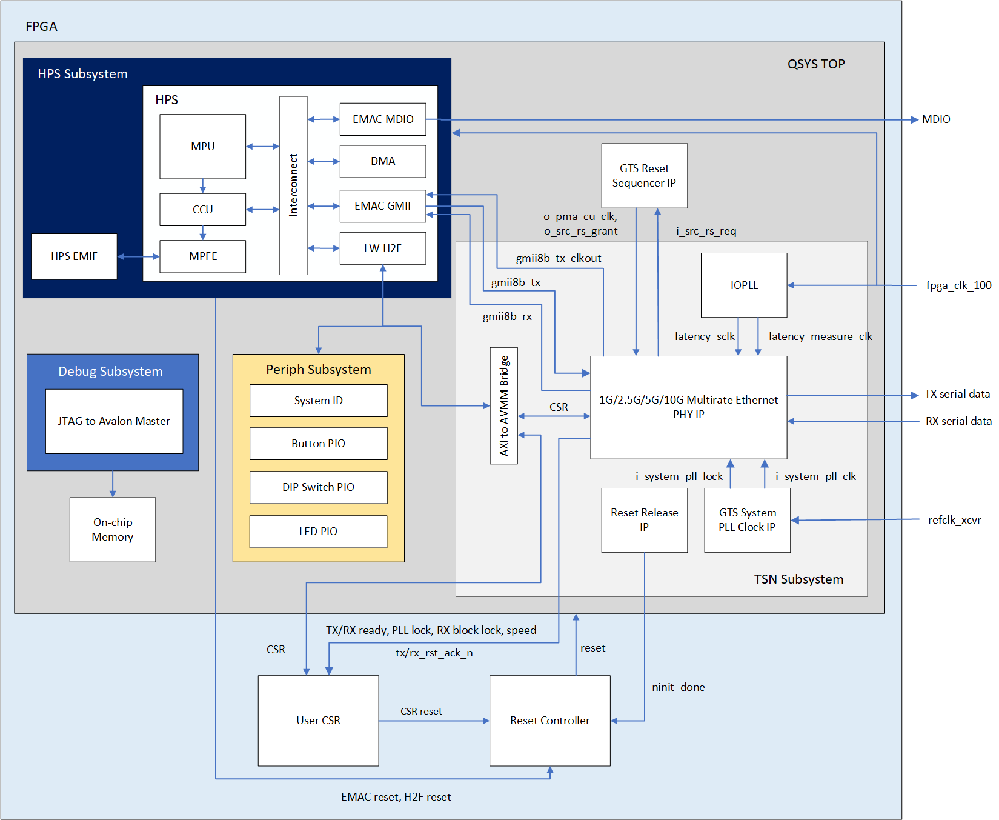
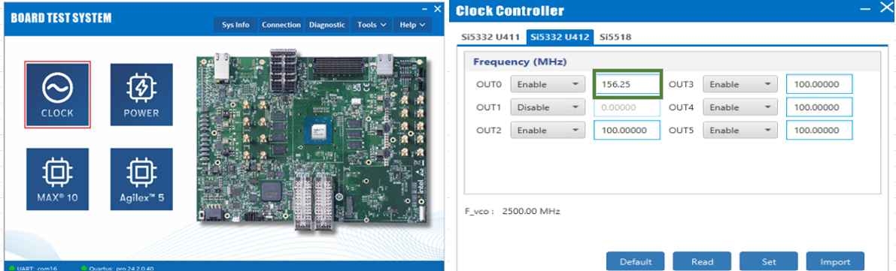
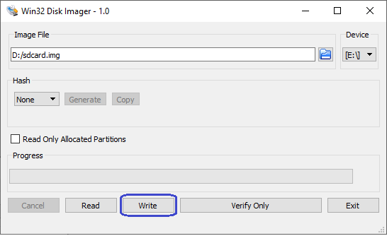
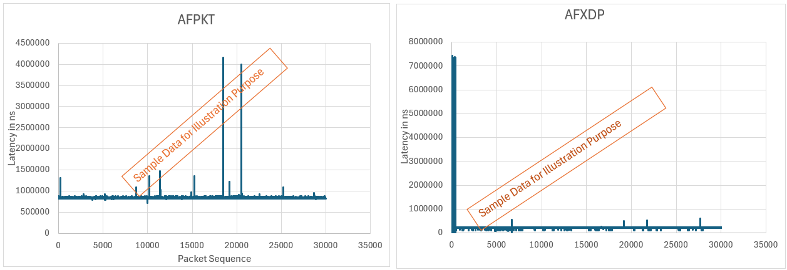

## Introduction

The IEEE Ethernet is a core technology which is a backbone for IT operations and was designed to provide best effort communication suitable for IT operations. Operational Technology vendors have innovatively used Core IEEE Ethernet technology with proprietary solutions for enabling time-bounded communication. To address the need for precision timing, traffic shaping, and time-bounded communication over networks, IEEE introduced a suite of standards known as Time Sensitive Networking (TSN).

Agilex&trade; 5 E-Series is designed as an end point for Industrial automation application with support for the following TSN protocols:

<h5> Time Synchronization Protocols: </h5>
  
* IEEE 1588-2008 Advanced Timestamp (Precision Time Protocol - PTP):
  * Function: Provides sub-microsecond accuracy for time synchronization between computing systems over a local area network.
    * Key Features: 2-step synchronization, PTP offload, and timestamping.
    * Use Case: Synchronizing industrial devices to operate in unison, ensuring coordinated actions across factory or plant operations.
  * IEEE 802.1AS (Timing and Synchronization):
    * Function: A profile of PTP (version 2) that ensures precise time synchronization in a hierarchical master-slave architecture.
    * Key Features: Prioritizes accuracy and variability of timing, crucial for industrial and automotive systems.
    * Use Case: Synchronizing devices to a common time for optimal operation and collaboration.

<h5> Credit Based Shaper Protocol: </h5>

* IEEE 802.1Qav (Time-Sensitive Streams Forwarding and Queuing):
  * Function: Provides low-latency, time-synchronized delivery of audio and video streams over Ethernet networks.
    * Key Features: Credit-based shaper ensuring end-to-end guaranteed bandwidth with fairness to best-effort traffic.
    * Use Case: Ensuring dedicated bandwidth for audio-video bridging (AVB) streams with minimal latency.

<h5> Traffic Scheduling Protocols: </h5>

* IEEE 802.1Qbv (Time-Scheduled Traffic Enhancements):
  * Function: Enables the transmission of frames at specific scheduled times within microsecond ranges.
    * Key Features: Critical for time-sensitive scheduled traffic in industrial applications.
    * Use Case: Facilitating precise, time-critical communication for industrial devices like PLCs and drives.
  * IEEE 802.1Qbu (Frame Preemption):
    * Function: Allows high-priority frames to preempt lower-priority frames, reducing latency and jitter.
    * Key Features: Utilizes Express Media Access Control (eMAC) and Preemptable Media Access Control (pMAC).
    * Use Case: Ensuring high-priority frames arrive with fixed latency, crucial for applications requiring consistent timing.
  
These TSN standards collectively enable precise timing, traffic shaping, and time-bounded communication, making them indispensable for applications requiring high reliability and determinism.

The details of TSN is not in the scope of this document. Here are some reference to the TSN specifications:

- [The IEEE Std 802.1AS™-2011 "Timing and Synchronization for Time-Sensitive Applications in Bridged Local Area Networks"](https://standards.ieee.org/standard/802_1AS-2011.html?oslc_config.context=https%3A%2F%2Frtc.intel.com%2Fgc%2Fconfiguration%2F964)
- [The IEEE Std 802.1Qav™-2009 “Forwarding and Queuing Enhancements for Time-Sensitive Streams”](https://standards.ieee.org/standard/802_1Qav-2009.html?oslc_config.context=https%3A%2F%2Frtc.intel.com%2Fgc%2Fconfiguration%2F964)
- [The IEEE Std 802.1Qbv™-2015 “Enhancements for Scheduled Traffic”](https://standards.ieee.org/standard/802_1Qbv-2015.html?oslc_config.context=https%3A%2F%2Frtc.intel.com%2Fgc%2Fconfiguration%2F964)
- [The IEEE Std 802.1Qbu™-2016 “Frame Preemption”](https://standards.ieee.org/standard/802_1Qbu-2016.html?oslc_config.context=https%3A%2F%2Frtc.intel.com%2Fgc%2Fconfiguration%2F964)
  
### TSN SGMII+ XCVR 2.5G Overview

The TSN SGMII+ XCVR  is a Reference design, enable datapath between [HPS](https://www.intel.com/content/www/us/en/docs/programmable/814346/24-3/hard-processor-system-technical-reference.html), [EMAC Controller](https://www.intel.com/content/www/us/en/docs/programmable/814346/24-3/ethernet-media-access-controller-11801.html), [Multirate Ethernet
PHY IP](https://www.intel.com/content/www/us/en/docs/programmable/813667/24-3/about-the-for-devices.html) and [Marvell PHY 88E2110](https://www.marvell.com/content/dam/marvell/en/public-collateral/phys-transceivers/marvell-phys-transceivers-alaska-m-88e21x0-datasheet.pdf) running at 2.5G rate on the Agilex™ 5 FPGA E-Series 065B Premium Development Kit.

```bash
Note:              
 1. This is the pre-production release of the Agilex™ 5 TSN SGMII XCVR System Example Design, on Agilex™ 5 FPGA E-Series 065B Premium Development Kit with -6S speed grade. This corresponds to Engineering Samples Silicon quality.
 2.  A single PHY is enabled with 2.5G fixed rate in this release.
```

### Prerequisites

* Agilex&trade; 5 FPGA E-Series 065B Premium Development Kit, ordering code DK-A5E065BB32AES1. [Refer to the board documentation](https://www.intel.com/content/www/us/en/products/details/fpga/development-kits/agilex/a5e065b-premium.html) for more information about the development kit.

* HPS Enablement Expansion Board. Included with the development kit.

* Mini and Micro USB Cable. Included with the development kit.

* CAT6A Ethernet Cable. Included with the development kit.

* Micro SD card and USB card writer. Included with the development kit.

* Host PC with 64 GB of RAM. Less will be fine for only exercising the binaries, and not rebuilding the GSRD.

* Linux OS installed on host PC, preferably Ubuntu 22.04LTS , while other versions and distributions may work too.

* Serial terminal (for example GtkTerm or Minicom on Linux and TeraTerm or PuTTY on Windows)

* Quartus&reg; Prime Pro Edition software version 24.3 is used to recompile the hardware design. If only writing binaries is required, then the Quartus&reg; Prime Pro Edition Programmer version 24.3 is sufficient.


* Local Ethernet network, with DHCP server
Internet connection. For downloading the files, especially when rebuilding the GSRD.


### Release Contents  

#### Binaries

 * Prebuilt binaries are located [here](https://github.com/altera-fpga/agilex5-ed-tsn-sgmii/releases/tag/24.3-1).

#### Sources

  |Component	|Location	|Branch	| Commit ID/Tag|
  |-|-|-|-|
  |GHRD|https://github.com/altera-fpga/agilex5-ed-tsn-sgmii/tree/rel/24.3/src/hw|rel/24.3|[24.3-1](https://github.com/altera-fpga/agilex5-ed-tsn-sgmii/releases/tag/24.3-1)|
  |Linux|https://github.com/altera-opensource/linux-socfpga|socfpga-6.6.37-lts|[QPDS24.3_REL_GSRD_PR](https://github.com/altera-opensource/linux-socfpga/releases/tag/QPDS24.3_REL_GSRD_PR)|
  |Arm Trusted Firmware|https://github.com/altera-opensource/arm-trusted-firmware|socfpga_v2.11.0|[QPDS24.3_REL_GSRD_PR](https://github.com/altera-opensource/arm-trusted-firmware/releases/tag/QPDS24.3_REL_GSRD_PR)|
  |U-Boot|https://github.com/altera-opensource/u-boot-socfpga|socfpga_v2024.04|[QPDS24.3_REL_GSRD_PR](https://github.com/altera-opensource/u-boot-socfpga/releases/tag/QPDS24.3_REL_GSRD_PR)|
  |Yocto Project: poky|https://git.yoctoproject.org/poky/|scarthgap|Latest|
  |Yocto Project: meta-intel-fpga|https://git.yoctoproject.org/meta-intel-fpga/|scarthgap|[QPDS24.3_REL_GSRD_PR](https://git.yoctoproject.org/meta-intel-fpga/tag/?h=QPDS24.3_REL_GSRD_PR)|
  |Yocto Project: meta-intel-fpga-refdes|https://github.com/altera-opensource/meta-intel-fpga-refdes|scarthgap|[QPDS24.3_REL_GSRD_PR](https://github.com/altera-opensource/meta-intel-fpga-refdes/releases/tag/QPDS24.3_REL_GSRD_PR)|
  |GSRD Build Script: gsrd-socfpga|https://github.com/altera-fpga/agilex5-ed-tsn-sgmii/tree/rel/24.3/src/sw|rel/24.3|[24.3-1](https://github.com/altera-fpga/agilex5-ed-tsn-sgmii/releases/tag/24.3-1)|

### Release Notes 

* Refer this link for [Known Issues](https://github.com/altera-fpga/agilex5-ed-tsn-sgmii/releases/tag/24.3-1).

### TSN XCVR SGMII+ 2.5G Architecture

Agilex™  FPGAs provide a powerful platform for showcasing 2.5G Ethernet with TSN-enabled applications with all the TSN features including IEEE 802.1AS, IEEE802.1Qbv, IEEE802.1Qbu, IEEE802.1Qav in HPS subsystem by enabling the EMAC Controller.  To support the 2.5G rate, you must enable the 8-bit GMII interface to the FPGA fabric, from where it gets connected to a [Marvell PHY 88E2110](https://www.marvell.com/content/dam/marvell/en/public-collateral/phys-transceivers/marvell-phys-transceivers-alaska-m-88e21x0-datasheet.pdf)  (through the FPGA transceivers) device to drive the RJ45 CAT6A copper media.



#### HPS Subsystem
The Hard Processor System (HPS) in this design is a critical component that interfaces with various subsystems and peripherals to ensure efficient and high-performance operation. The following are the key connections of the HPS to other design components;

*	Light Weight HPS to FPGA Manager (H2F) interface to access control and status registers of TSN Subsystem and Peripheral Subsystem 

*   8-bit EMAC GMII interface to connect to 1G/2.5G/5G/10G Multirate Ethernet PHY IP for TSN-enabled ethernet data transfers 

*	EMAC MDIO PHY Management Interface (through FPGA HVIO pins) to manage external Marvell 88E2110 Ethernet Transceiver 
 
#### TSN Subsystem

The main components of the TSN Subsystem are _[Multirate Ethernet PHY IP](https://www.intel.com/content/www/us/en/docs/programmable/813667/24-3/about-the-for-devices.html), [GTS System PLL Clocks IP](https://www.intel.com/content/www/us/en/docs/programmable/817713/24-3/gts-system-pll-clocks-intel-fpga-ip.html), [Reset Release IP](https://www.intel.com/content/www/us/en/docs/programmable/817713/24-3/reset-release-intel-fpga-ip.html) and IOPLL IP_. 

* The Multirate Ethernet PHY IP transmits outgoing traffic (from HPS GMII interface) and receives incoming traffic through GTS Transceiver PHY. 

* The GMII adapter is enabled to convert the 8-bit GMII data from HPS to the 16-bit data inside the Multirate Ethernet PHY IP
  
* The IEEE 1588 Precision Time Protocol feature is enabled to accurately measure internal data path delay, ensuring high accuracy of TSN applications. 
 
* The GTS System PLL Clocks IP provides a system PLL clock input to Multirate Ethernet PHY IP, while the IOPLL IP generates a clock source for latency_sclk and latency_measurement_clk of Multirate Ethernet PHY IP. 

### Hardware Setup
 
 The _Board-to-Board_ hardware setup connection details are captured in the image below.
 

Note:

_1. Refer to the base GSRD [Installing HPS Daughtercard](https://altera-fpga.github.io/rel-24.2/embedded-designs/agilex-5/e-series/premium/gsrd/ug-gsrd-agx5e-premium/#development-kit) section to perform 1a and 1b._

_2. This is the reference hardware setup  and user can leverage with their own hardware setup(Ex: Board to Third party device)._   
### Address Map Details

#### HPS LW H2F Register Map

| Address Offset | Size (Bytes) | Peripheral | Description |
|-----|-----|-----|-----|
| GHRD-aligned address space |
|0x2001_0000 |8|System ID |Hardware configuration system ID (0xacd5cafe) |
|0x2001_0060 | 16 | Button PIO | Push Button |
|0x2001_0070 |16 | DIPSW PIO | DIP Switch |
|0x2001_0080 | 16 | LED PIO | LED connections on board |
| Application-specific address space |
| 0x3002_0100 | 64 | Multirate Ethernet PHY | Multirate Ethernet PHY IP CSR |
| 0x2002_0300 | 128 | User space CSR | Sideband status and control signals of various modules |

#### User Space CSR

The User Space CSR contains registers specific to system-level status (e.g. PLL locked, RX ready) and control (e.g., reset).

| Access | Definition |
|---|---|
| RO | Read only |
| RW | Read and write |

<h5> Multirate Ethernet PHY Status Register (Offset 0x00)</h5>

| Name | Bit | Access | Default | Description |
|-----|-----|-----|-----|-----|
| Reserved | [31:7] | RO | 0 | Reserved |
| op_speed | [6:4] | RO | 3’b100 | Operating speed of Multirate Ethernet PHY IP: <br> 3’b000: 10G (Only valid for NBASE-T) <br> 3’b001: 1G <br> 3’b010: 100M <br> 3’b011: 10M <br> 3’b100: 2.5G <br> 3’b101: 5G (Only valid for NBASE-T) <br> 3’b110: Unused <br> 3’b111: Unused |
| rx_block_lock | [3] | RO | 0 | Asserted when the 66b block alignment is finished on all PCS virtual lanes |
| tx_ready | [2] | RO  | 0 | When asserted, it indicates that the Multirate Ethernet PHY TX data path is ready for transmission. |
| rx_ready | [1] | RO | 0 | When asserted, it indicates that the Multirate Ethernet PHY RX data path is ready to receive data. |
| mrphy_pll_lock | [0] | RO | 0 | When asserted, it indicates that the PLLs in Multirate Ethernet PHY soft logic are locked. |

<h5>Multirate Ethernet PHY Reset Control Register (Offset 0x04)</h5>

| Name | Bit | Access | Default | Description |
|-----|-----|-----|-----|-----|
| Reserved | [31:3] | RO | 0 | Reserved |
| i_rx_rst_n | [2] | RW | 1 | Resets Multirate Ethernet PHY IP RX path. Self-clearing bit based on o_rx_rst_ack_n. |
| i_tx_rst_n | [1] | RW | 1 | Resets Multirate Ethernet PHY IP TX path. Self-clearing bit based on o_tx_rst_ack_n. |
| i_rst_n | [0] | RW | 1 | Multirate Ethernet PHY IP global reset. Self-clearing bit based on o_rst_ack_n. |

<h5>TX Delay Register (Offset 0x08)</h5>

| Name | Bit | Access | Default | Description |
|-----|-----|-----|-----|-----|
| Reserved | [31:4] | RO | 0 | Reserved |
| TX delay | [3:0] | RO | 0 | Additional GMII data path delay to be added. In number of gmii8b_tx_clkout clock cycles.|

<h5>RX Delay Register (Offset 0x0C)</h5>

| Name | Bit | Access | Default | Description |
|-----|-----|-----|-----|-----|
| Reserved | [31:4] | RO | 0 | Reserved |
| RX delay | [3:0] | RO | 0 | Additional GMII data path delay to be added. In number of gmii8b_rx_clkout clock cycles. |

<h5>Error Status Register (Offset 0x10)</h5>

| Name | Bit | Access | Default | Description |
|-----|-----|-----|-----|-----|
| Reserved | [31:1] | RO | 0 | Reserved |
| Unsupported speed error | [0] | RW | 0 | Assert this bit when EMAC Controller published unsupported speeds. Software clears this bit once addressed. |

## User Flow

 There are two ways to test the design based on user flow.

<h5> User Flow 1: Testing with Prebuild Binaries. </h5>
   
<h5> User Flow 2: Testing Complete Flow. </h5>

 |User Flow|Description|Required for [User flow 1](#user-flow)|Required for [User flow 2](#user-flow)|
 |-|-|-|-|
 |Environment Setup|[Tools Download and Installation](#tools-download-and-installation)|Yes|Yes|
 ||[Installing Dependency Packages for SW Compilation](#installing-dependency-packages-for-sw-compilation)|No|Yes|
 ||[Package Download](#package-download)|No|Yes|
 |Compilation|Simulation|No|No|
 ||[Hardware Compilation](#hardware-compilation)|No|Yes|
 ||[Software Compilation](#software-compilation)|No|Yes|
 |Programing|[Programing Hardware binary](#programing-hardware-binary)|Yes|Yes|
 ||[Programing Software Image](#programing-software-image)|Yes|Yes|
 ||[Linux boot](#linux-boot)|Yes|Yes|
 |Testing|[Run Ping Test](#running-ping-test)|Yes|Yes|
 ||[Run TSN Reference Application](#running-tsn-reference-appilication-test)|Yes|Yes|
 

### Environment Setup

#### Tools Download and Installation

1\. Quartus Prime Pro
   
* Download the Quartus® Prime Pro Edition software version 24.3 from the FPGA Software Download Center [webpage](https://www.intel.com/content/www/us/en/software-kit/839515/intel-quartus-prime-pro-edition-design-software-version-24-3-for-linux.html) of the Intel website. Follow the on-screen instructions to complete the installation process. Choose an installation directory that is relative to the Quartus® Prime Pro Edition software installation directory.
   
* Set up the Quartus tools in the PATH, so they are accessible without full path.
  
```bash
    export QUARTUS_ROOTDIR=~/intelFPGA_pro/24.3/quartus/
    export PATH=$QUARTUS_ROOTDIR/bin:$QUARTUS_ROOTDIR/linux64:$QUARTUS_ROOTDIR/../qsys/bin:$PATH
```

2\. Win32 Disk Imager

* Download and install the latest [Win32 Disk Imager](https://win32diskimager.org/).

3\. Agile&trade;  5 FPGA E-Series 065B Premium Development Kit Board Test System (BTS)

* Go to the [Agilex™ 5 FPGA E-Series 065B Premium Development Kit](https://www.intel.com/content/www/us/en/products/details/fpga/development-kits/agilex/a5e065b-premium.html) webpage, download and extract the [installer package](https://cdrdv2.intel.com/v1/dl/getContent/822942), which includes [BTS](https://www.intel.com/content/www/us/en/docs/programmable/814550/current/board-test-system.html).
  
   _Note: If you are using [User Flow 1](#1-testing-with-prebuild-binaries), after the BTS installation, go to [Programming](#programing-the-binaries) stage directly._

#### Installing Dependency Packages for SW Compilation

Follow the instructions in the Base GSRD [Yocto Build Prerequisites](https://altera-fpga.github.io/rel-24.1/embedded-designs/agilex-5/e-series/premium/gsrd/ug-gsrd-agx5e-premium/#yocto-build-prerequisites) section.

#### Package Download

```bash
# Create the top folder to store all the build artifacts:
sudo rm -rf artifacts.enablement
mkdir artifacts.enablement
cd artifacts.enablement
export TOP_FOLDER=`pwd`
cd $TOP_FOLDER

rm -rf agilex5-ed-tsn-sgmii
git clone https://github.com/altera-fpga/agilex5-ed-tsn-sgmii.git
cd agilex5-ed-tsn-sgmii/src/sw
git submodule update --init -r
```

### Compilation

#### Hardware Compilation

```bash
cd $TOP_FOLDER/agilex5-ed-tsn-sgmii/src/hw
make config
make H2F_WIDTH=0 F2SDRAM_DATA_WIDTH=0 all
```
The following file will be generated:

`$TOP_FOLDER/agilex5-ed-tsn-sgmii/src/hw/output_files/ghrd_a5ed065bb32ae6sr0.sof`

<h5>Build Core RBF</h5>

```bash
cd $TOP_FOLDER
rm -f ghrd_a5ed065bb32ae6sr0.rbf
quartus_pfg -c agilex5-ed-tsn-sgmii/src/hw/output_files/ghrd_a5ed065bb32ae6sr0_hps_debug.sof ghrd_a5ed065bb32ae6sr0.rbf -o hps=1
```

<h5>Build QSPI Image</h5>

```bash
cd $TOP_FOLDER
rm -f ghrd_a5ed065bb32ae6sr0.hps.jic ghrd_a5ed065bb32ae6sr0.core.rbf

# Note : If user doing compilation first time, download the prebuilt u-boot-spl-dtb.hex  file and create the following path $TOP_FOLDER/agilex5-ed-tsn-sgmii/src/sw/agilex5_dk_a5e065bb32aes1-gsrd-images/u-boot-agilex5-socdk-gsrd-atf/ and copy the u boot file here.

quartus_pfg \
-c agilex5-ed-tsn-sgmii/src/hw/output_files/ghrd_a5ed065bb32ae6sr0.sof ghrd_a5ed065bb32ae6sr0.jic \
-o device=MT25QU128 \
-o flash_loader=A5ED065BB32AE6SR0 \
-o hps_path=agilex5-ed-tsn-sgmii/src/sw/agilex5_dk_a5e065bb32aes1-gsrd-images/u-boot-agilex5-socdk-gsrd-atf/u-boot-spl-dtb.hex \
-o mode=ASX4 \
-o hps=1
```
The following file will be created:

`$TOP_FOLDER/ghrd_a5ed065bb32ae6sr0.hps.jic`

<h5>Build RBF</h5>

```bash
cd $TOP_FOLDER
rm -f ghrd_a5ed065bb32ae6sr0.*.rbf

# Note : If user doing compilation first time, download the prebuilt u-boot-spl-dtb.hex  file and create the following path $TOP_FOLDER/agilex5-ed-tsn-sgmii/src/sw/agilex5_dk_a5e065bb32aes1-gsrd-images/u-boot-agilex5-socdk-gsrd-atf/ and copy the u boot file here.

quartus_pfg \
-c agilex5-ed-tsn-sgmii/src/hw/output_files/ghrd_a5ed065bb32ae6sr0.sof  ghrd_a5ed065bb32ae6sr0.rbf \
-o hps_path=agilex5-ed-tsn-sgmii/src/sw/agilex5_dk_a5e065bb32aes1-gsrd-images/u-boot-agilex5-socdk-gsrd-atf/u-boot-spl-dtb.hex \
-o hps=1
```
The following file will be generated:

`$TOP_FOLDER/ghrd_a5ed065bb32ae6sr0.core.rbf`
`$TOP_FOLDER/ghrd_a5ed065bb32ae6sr0.hps.rbf`

#### Software Compilation

<h5>Set Up Yocto</h5>

```bash
   cd $TOP_FOLDER/agilex5-ed-tsn-sgmii/src/sw
   # Run the `agilex5_dk_a5e065bb32aes1-gsrd-build.sh` script to sync the submodules.
   . agilex5_dk_a5e065bb32aes1-gsrd-build.sh
   # Run the `build_setup` script to set up the build environment.
   build_setup
```

<h5> Optional: Follow these steps, if you have a custom GHRD  </h5>
   
Follow the below procedure to add the generated `agilex5_dk_a5e065bb32aes1_gsrd_ghrd.core.rbf` file.

* Update the recipe `$WORKSPACE/meta-sm-tsn-cfg3/recipes-bsp/ghrd/hw-ref-design.bbappend` as follows:

```bash
cd $TOP_FOLDER
CORE_RBF=$WORKSPACE/meta-sm-tsn-cfg3/recipes-bsp/ghrd/files/agilex5_dk_a5e065bb32aes1_gsrd_ghrd.core.rbf
rm -rf $CORE_RBF
ln -s $TOP_FOLDER/ghrd_a5ed065bb32ae6sr0.core.rbf $CORE_RBF
CORE_SHA=$(sha256sum $CORE_RBF | cut -f1 -d" ")
FILE="$WORKSPACE/meta-sm-tsn-cfg3/recipes-bsp/ghrd/hw-ref-design.bbappend"
OLD_URI='SRC_URI\[agilex5_dk_a5e065bb32aes1_gsrd_core_cfg3.sha256sum\] += "[^"]*"'
NEW_URI="SRC_URI[agilex5_dk_a5e065bb32aes1_gsrd_core_cfg3.sha256sum] += \"$CORE_SHA\""
sed -i "s|$OLD_URI|$NEW_URI|" "$FILE"
```
<h5> Build Yocto </h5>

Build Yocto:
```bash
    # Run the `bitbake_image` command to generate the binaries.
    bitbake_image
```
Gather Files:

```bash
   #  Package the binaries into the build folder.
    package
```
The following files will be created:

* `$TOP_FOLDER/agilex5-ed-tsn-sgmii/src/sw/agilex5_dk_a5e065bb32aes1-gsrd-images/u-boot-agilex5-socdk-gsrd-atf/u-boot-spl-dtb.hex`

* `$TOP_FOLDER/agilex5-ed-tsn-sgmii/src/sw/agilex5_dk_a5e065bb32aes1-gsrd-images/u-boot-agilex5-socdk-gsrd-atf/u-boot.itb`

* `$TOP_FOLDER/agilex5-ed-tsn-sgmii/src/sw/agilex5_dk_a5e065bb32aes1-gsrd-images/sdimage.tar.gz`

### Programing

_Note:_

* Download the [Prebuild Binaries](#binaries), if you are leveraging on _[User Flow 1](#user-flow-1-testing-with-prebuild-binaries)._
* Leave all jumpers and switches in their default configuration.

#### Clock Configuration

1.	Switch ON the FIRST board and switch OFF the SECOND board.
2.	Open the BTS application and set the clock frequency of OUT0 to 156.25 MHz (click Set after changing the value to 156.25 MHz) under Si5332 U412 tab. Click the Read button to verify that the OUT0 value remains 156.25 MHz itself.
3.	On the FIRST board, press the push button SW15 and hold for 5 seconds to save the settings to EEPROM. The LED D11 blinks one time, which confirms the save state. The board is now always power up with the user setting (OUT0 = 156.25 MHz).
4.	Switch ON the SECOND board and switch OFF the FIRST board.
5.	Close and open the BTS application and set the clock frequency of OUT0 to 156.25 MHz (click Set after changing the value to 156.25 MHz) under Si5332 U412 tab. Click the Read button to verify that the OUT0 value remains 156.25 MHz itself.
6.	Now on the SECOND board, press the push button SW15 and hold for 5s to save settings to EEPROM. The LED D11 blinks one time, which confirms the save state. The board is now always power up with the user setting (OUT0 = 156.25 MHz).

 

#### Programing Software Image

<h5> Write SD Card </h5>

1. Extract the SD card image(sdimage.tar.gz) archive and obtain the file `gsrd-console-image-agilex5.wic`.

2. Write the extracted SD card image (gsrd-console-image-agilex5_devkit.wic) to the micro-SD card using the included USB writer in the host computer:

On Linux, use the dd utility as shown below:

```bash
    # Determine the device associated with the SD card on the host computer. 
    cat /proc/partitions
    # This will return for example /dev/sdx
    # Use dd to write the image in the corresponding device
    sudo dd if=gsrd-console-image-agilex5.wic of=/dev/sdx bs=1M
    # Flush the changes to the SD card
    sync
```
On Windows, use the Win32DiskImager program. First, rename the gsrd-console-image-agilex5.wic to an .img file (sdcard.img, for example) and write the image as shown in the following figure:



#### Programing Hardware binary

<h5> Write QSPI Flash</h5>

1. Identify the FPGA device position in the JTAG chain by using `jtagconfig`.

```bash
jtagconfig

1) Agilex 5E065B Premium DK [1-1.1.1]
  4BA06477   ARM_CORESIGHT_SOC_600
  0364F0DD   A5E(C065BB32AR0|D065BB32AR0)
  020D10DD   VTAP10
# Here, FPGA device in position #2

cd $TOP_FOLDER
quartus_pgm -c 1 -m jtag -o "pvi;ghrd_a5ed065bb32ae6sr0.hps.jic@2" 
#  If FPGA device in position #1 no need to mention the position number, by default it will take position #1.
```
#### Linux Boot

1. Open the serial port of Board A and Board B by using serial communication utility.

    _Note: Follow the instructions in the Base GSRD [configure-serial-console](https://altera-fpga.github.io/rel-24.1/embedded-designs/agilex-5/e-series/premium/gsrd/ug-gsrd-agx5e-premium/#configure-serial-console) section, to configure and setup serial connection._   

2. Power cycle the board.

3. Monitor the serial communication windows and wait for Linux to boot, use _root_ as user name, and no password is required.


### Testing

Once booted to OS, run the prgm_mrphy_delay_app `(./prgm_mrphy_delay_app)` present at `/home/root/` from both DUTs. Do this on both DUTs to configure the egress and ingress delay in the EMAC Controller register, which is based on the MRPHY ip delays read. Note that this application needs to be executed only once at every reboot before running the tests. This is required only when you are running the TSN/PTP test cases.

#### Running Ping Test

Use _ifconfig_ to configure the IP address on both the Board DUT and start testing.

Example:- 

```bash
ifconfig

eth0: flags=4163<UP,BROADCAST,RUNNING,MULTICAST>  mtu 1500
        inet 169.254.154.69  netmask 255.255.0.0  broadcast 169.254.255.255
        inet6 fe80::c8fc:35ff:feae:8333  prefixlen 64  scopeid 0x20<link>
        ether ca:fc:35:ae:83:33  txqueuelen 1000  (Ethernet)
        RX packets 2394  bytes 874355 (853.8 KiB)
        RX errors 0  dropped 7  overruns 0  frame 0
        TX packets 3870  bytes 970927 (948.1 KiB)
        TX errors 0  dropped 0 overruns 0  carrier 0  collisions 0
        device interrupt 22

lo: flags=73<UP,LOOPBACK,RUNNING>  mtu 65536
        inet 127.0.0.1  netmask 255.0.0.0
        inet6 ::1  prefixlen 128  scopeid 0x10<host>
        loop  txqueuelen 1000  (Local Loopback)
        RX packets 96573  bytes 5893245 (5.6 MiB)
        RX errors 0  dropped 0  overruns 0  frame 0
        TX packets 96573  bytes 5893245 (5.6 MiB)
        TX errors 0  dropped 0 overruns 0  carrier 0  collisions 0

# Execute this command on Board #A DUT: 
 ifconfig eth0 192.168.1.100
  
# Execute this command on Board #B DUT: 
 ifconfig eth0 192.168.1.200

# Do ping to Board #A from Board #B

 ping 192.168.1.100
PING 192.168.1.100 (192.168.1.100): 56 data bytes
64 bytes from 192.168.1.100: seq=0 ttl=64 time=1.411 ms
64 bytes from 192.168.1.100: seq=1 ttl=64 time=0.473 ms
64 bytes from 192.168.1.100: seq=2 ttl=64 time=0.487 ms
64 bytes from 192.168.1.100: seq=3 ttl=64 time=0.418 ms
64 bytes from 192.168.1.100: seq=4 ttl=64 time=0.513 ms
64 bytes from 192.168.1.100: seq=5 ttl=64 time=0.453 ms

--- 192.168.1.100 ping statistics ---
6 packets transmitted, 6 packets received, 0% packet loss
```

#### Running _iperf_ Test:

1. Execute below command on Board #A DUT.

    `iperf3 -s eth0`

2. Execute below command on Board #B DUT.

    `iperf3 eth0 -c 192.168.1.100 -b 0 -l 1500`

    _Note : Update the Board #A DUT IP address using the above command._

#### Run Time Synchronization

Synchronize Agilex&trade; 5 system through PTP4L and PHC2SYS and obtain delay values.

<h5> End-to-End PTP master and slave synchronization </h5>

- Board B (as slave):

    ```bash
    ptp4l -i eth0  -s -H -E -2 -m
    # Description 
    -i  eth0: This option specifies the `eth0` as the network interface to use for PTP.
    -s  This option enables the slave-only mode. 
    -H  This option enables hardware time stamping. 
    -E  This option selects the end-to-end (E2E) delay measurement mechanism. This is the default.The E2E mechanism is also referred to as the delay “request-response” mechanism.
    -2  Use Ethernet Layer (L2)
    -m  This option enables printing of messages to the standard output.
    ```

- Board  A (as master):

    ```bash
    ptp4l -i eth0  -H -E -2 -m
    ```

- At Board B (as slave), perform sync on local System Clock with EMAC Hardwware Clock.

    ```bash
    phc2sys -s eth0 -w -m -c CLOCK_REALTIME -O 0 -n 0
    ```

<h5> Peer-to-Peer PTP synchronization: </h5>

- Board B (as slave):
    ```bash
    slave: ptp4l -i eth0  -s -H -P -2 -m
    ```

    -P: This option enables the use of the Peer Delay Mechanism.

- Board A (as master):
    ```bash
    master: ptp4l -i eth0  -H -P -2 -m
    ```

- At Board B (as slave), perform sync on local System Clock with EMAC Hardwware Clock.

    ```bash
    phc2sys -s eth0 -w -m -c CLOCK_REALTIME -O 0 -n 0
    ```

<h5> gPTP synchronization: </h5>

- Board B (as slave):

    ```bash
    ptp4l -i eth0  -s -H -P -2 -m --transportSpecific=1
    ```

- Board A (as master): 

    ```bash
    ptp4l -i eth0  -H -P -2 -m --transportSpecific=1
    ```

- At Board B (as slave), perform sync on local System Clock with EMAC Hardwware Clock.

    ```bash
    phc2sys -s eth0 -w -m --transportSpecific 1 -c CLOCK_REALTIME -O 0 -n 0
    ```
 
#### Running TSN Reference Appilication Test

The following examples are demonstrated using 2 units of the Agilex 5 platform.  Please take note of the notation "[Board A or B]". The following steps assumes both platforms are connected to each other via an Ethernet connection.

1\. Boot to Linux

2\. Navigate to the `tsn` directory

```bash
cd tsn
```

<h5>Configuration for Both Boards</h5>

<h6>Step I: Setup Environment Path on Both Boards</h6>

3\. Board A

   ```bash
   export LIBXDP_OBJECT_PATH=/usr/lib/bpf
   export LD_LIBRARY_PATH=/usr/lib/custom_bpf/lib 
   ```

4\. Board B

   ```bash
   export LIBXDP_OBJECT_PATH=/usr/lib/bpf
   export LD_LIBRARY_PATH=/usr/lib/custom_bpf/lib 
   ```

<h5>TXRX-TSN App</h5>

<h6>Step II: Run Configuration Script</h6>

5\. Board A: Run the configuration script and wait for it to configure the IP and MAC address, start clock synchronization, and set up TAPRIO qdisc.

   ```bash
   ./run.sh agilex5 eth0 vs1a setup
   ```

6\. Board B: Run the configuration script and wait for it to configure the IP and MAC address, start clock synchronization, and set up ingress qdiscs.

   ```bash
   ./run.sh agilex5 eth0 vs1b setup
   ```

<h6>Step III: Start the Application</h6>

7\. Board B: Run the application.

   ```bash
   ./run.sh agilex5 eth0 vs1b run
   ```

8\. Board A: Immediately after starting the application on Board B, run the application on Board A.

   ```bash
   ./run.sh agilex5 eth0 vs1a run
   ```

<h5>Post-Test Procedure</h5>
Once the test is completed, copy the following files from Board B (listener) to the host machine:

- afpkt-rxtstamps.txt
- afxdp-rxtstamps.txt

<h5>Generating Latency Plot Using Excel</h5>

Import 'afpkt-rxtstamps.txt' and 'afxdp-rxtstamps.txt' to excel in 2 seperate sheets.


Plot Column 1 for each sheets using Scatter chart,


This will generate plot for AFPKT and AFXDP with latency(on Y-axis) against packet count (on X-axis).
  



## Notices & Disclaimers

Altera<sup>&reg;</sup> Corporation technologies may require enabled hardware, software or service activation.
No product or component can be absolutely secure. 
Performance varies by use, configuration and other factors.
Your costs and results may vary. 
You may not use or facilitate the use of this document in connection with any infringement or other legal analysis concerning Altera or Intel products described herein. You agree to grant Altera Corporation a non-exclusive, royalty-free license to any patent claim thereafter drafted which includes subject matter disclosed herein.
No license (express or implied, by estoppel or otherwise) to any intellectual property rights is granted by this document, with the sole exception that you may publish an unmodified copy. You may create software implementations based on this document and in compliance with the foregoing that are intended to execute on the Altera or Intel product(s) referenced in this document. No rights are granted to create modifications or derivatives of this document.
The products described may contain design defects or errors known as errata which may cause the product to deviate from published specifications.  Current characterized errata are available on request.
Altera disclaims all express and implied warranties, including without limitation, the implied warranties of merchantability, fitness for a particular purpose, and non-infringement, as well as any warranty arising from course of performance, course of dealing, or usage in trade.
You are responsible for safety of the overall system, including compliance with applicable safety-related requirements or standards. 
<sup>&copy;</sup> Altera Corporation.  Altera, the Altera logo, and other Altera marks are trademarks of Altera Corporation.  Other names and brands may be claimed as the property of others. 

OpenCL* and the OpenCL* logo are trademarks of Apple Inc. used by permission of the Khronos Group™. 
