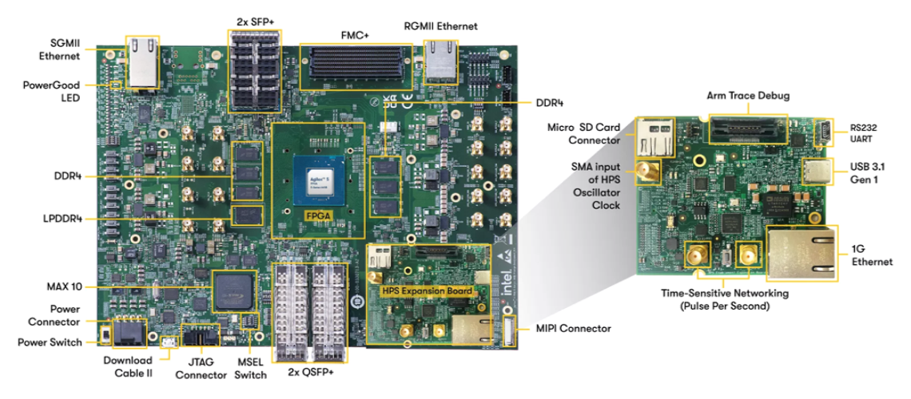
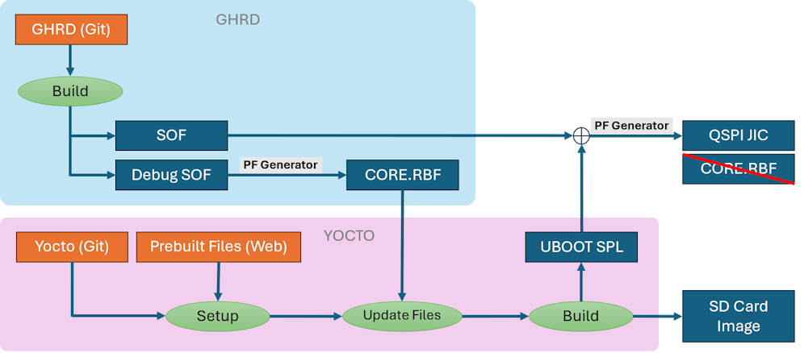
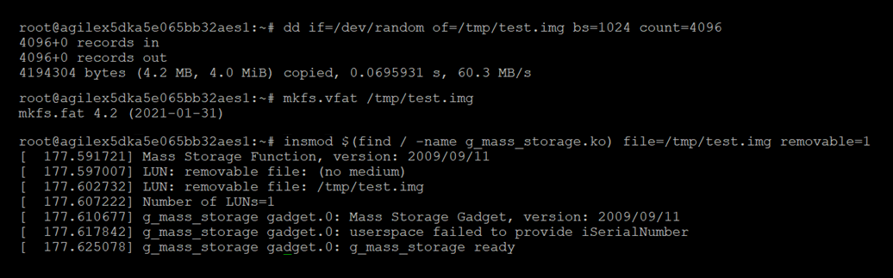
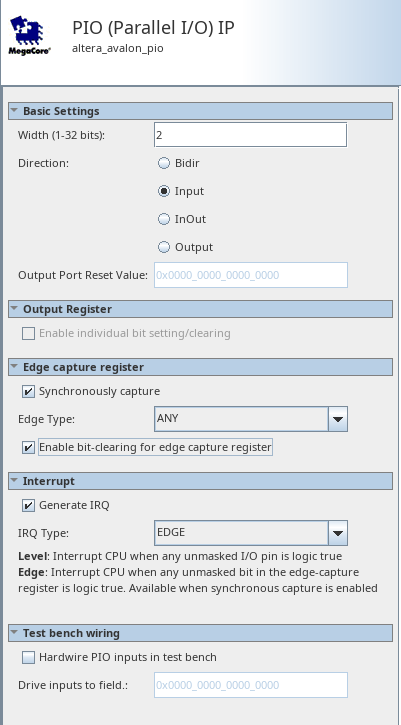

True


# USB 3.1 Gen-1 Controller in Host Mode, Device Mode, and Dual Role Device Mode

## Introduction

The USB 3.1, an advancement in the Universal Serial Bus (USB) standard, introduces significant improvements in data transfer speed, power delivery, and overall performance. USB 3.1 Gen 1 controller on Agilex™ 5 E-Series supports a maximum data transfer rate of 5 Gigabits per second (5 Gbps) in Super Speed. It is compatible with USB 2.0 devices and utilizes both Type-A and the versatile Type-C connectors.

In addition to enhanced speed, USB 3.1 offers better power efficiency and improved data encoding, making it ideal for high-bandwidth applications such as 4K video transfer and fast external storage. The USB 3.1 is a key enabler for faster and more efficient data communication in embedded and HPS devices.

## Overview

The Hard Processor System (HPS) in the Agilex™ 5 E-Series Premium Dev Kit provides a USB 3.1 Gen 1 Controller that supports host, device, and dual role device (DRD) mode functions for high-speed applications. Both the USB 2.0 protocol and USB 3.1 protocol are supported. 

This page provide instructions on how to enable the **Host Mode**, **Device Mode**, and **Dual Role Device (DRD) Mode**.




For the enablement of the three modes, there are modifications to be made respectively on the Golden Hardware System Design (GHRD) and/or Yocto Build, please refer to the table below to understand the modification required for each mode.

| USB 3.1 Mode | GHRD | Yocto |
| :-- | :-- | :-- |
| Host | Use Default, No Changes | Use Default, No Changes |
| Device | Use Default, No Changes | Patch on Yocto Required |
| Dual Role Device | Quartus Design Changes Required | Patch on Yocto Required |
| | | |

These are the subsections included in this page:

 1. **The Enablement of USB 3.1 in Host Mode**
  
    1.1 GHRD and Yocto

    1.2 Boot-Up and Testing - Transfer a file to a Removable Storage

 2. **The Enablement of USB 3.1 in Device Mode**

    2.1 GHRD

    2.2 Yocto

    2.3 Boot-Up and Testing - Using the Dev Kit as a Removable Storage

 3. **The Enablement of USB 3.1 in Dual-Role Device (DRD) Mode**

    3.1 GHRD

    3.2 Yocto

    3.3 Boot-Up and Testing - Using the Dev Kit in DRD Mode

**Note**: that all examples in this page are tested based on **Booting the *Modified* Golden System Reference Design (GSRD) from SD Card** method only.

## Binary Versions

Please take note that all instructions on this page is targetting **ONLY** the release versions listed below. The instructions **MAY NOT** be applicable to other versions.

### Prebuilt Binaries

The Agilex&trade; 5 Premium Development Kit GSRD binaries are located at [https://releases.rocketboards.org/2025.08/](https://releases.rocketboards.org/2025.08/)

### Component Versions
Altera® Quartus® Prime Pro Edition Version 25.1.1 and the following software component versions are used to build the binaries presented in this page:

| Component                             | Location                                                     | Branch                       | Commit ID/Tag       |
| :------------------------------------ | :----------------------------------------------------------- | :--------------------------- | :------------------ |
| Agilex 5 GHRD                         | [https://github.com/altera-fpga/agilex5e-ed-gsrd](https://github.com/altera-fpga/agilex5e-ed-gsrd) | master                       | QPDS25.1.1_REL_GSRD_PR |
| Agilex 7 GHRD                         | [https://github.com/altera-fpga/agilex7f-ed-gsrd](https://github.com/altera-fpga/agilex7f-ed-gsrd) | master | QPDS25.1.1_REL_GSRD_PR |
| Stratix 10 GHRD                       | [https://github.com/altera-fpga/stratix10-ed-gsrd](https://github.com/altera-fpga/stratix10-ed-gsrd) | master | QPDS25.1.1_REL_GSRD_PR |
| Linux                                 | [https://github.com/altera-fpga/linux-socfpga](https://github.com/altera-fpga/linux-socfpga) | socfpga-6.12.19-lts | QPDS25.1.1_REL_GSRD_PR |
| Arm Trusted Firmware                  | [https://github.com/altera-fpga/arm-trusted-firmware](https://github.com/altera-fpga/arm-trusted-firmware) | socfpga_v2.12.1   | QPDS25.1.1_REL_GSRD_PR |
| U-Boot                                | [https://github.com/altera-fpga/u-boot-socfpga](https://github.com/altera-fpga/u-boot-socfpga) | socfpga_v2025.04 | QPDS25.1.1_REL_GSRD_PR |
| Yocto Project                         | [https://git.yoctoproject.org/poky](https://git.yoctoproject.org/poky) | walnascar | latest              |
| Yocto Project: meta-intel-fpga        | [https://git.yoctoproject.org/meta-intel-fpga](https://git.yoctoproject.org/meta-intel-fpga) | walnascar | latest              |
| Yocto Project: meta-intel-fpga-refdes | [https://github.com/altera-fpga/meta-intel-fpga-refdes](https://github.com/altera-fpga/meta-intel-fpga-refdes) | walnascar | QPDS25.1.1_REL_GSRD_PR |
| | | |

## Prerequisites

### Development Kit

This tutorial example design is based on the Agilex 5 E-Series Premium Development Kit GSRD. It is recommended that you familiarize yourself with the GSRD development flow before proceeding with this tutorial. The HPS Enablement Expansion Board (also referred as HPS Daughter Card) is included with the development kit.

* [Altera&reg; Agilex&trade; 5 FPGA E-Series 065B Premium Development Kit](https://www.intel.com/content/www/us/en/products/details/fpga/development-kits/agilex/a5e065b-premium.html), ordering code DK-A5E065BB32AES1.
  * HPS Enablement  Expansion Board. Included with the development kit
  * HPS NAND Board. Enables eMMC storage for HPS. Orderable separately
  * HPS Test Board. Supports SD card boot, and external Arm tracing. Orderable separately
  * Mini USB Cable. Included with the development kit
  * Micro USB Cable. Included with the development kit
  * Ethernet Cable. Included with the development kit
  * Micro SD card and USB card writer. Included with the development kit
  
Refer to [Development Kit](https://altera-fpga.github.io/rel-25.1.1/embedded-designs/agilex-5/e-series/premium/gsrd/ug-gsrd-agx5e-premium/#development-kit) for details about the board, including how to install the HPS Boards, and how to set MSEL dispswitches.

### Development Environment

* Host PC with
  * 64 GB of RAM or more
  * Linux OS installed. Ubuntu 22.04LTS was used to create this page, other versions and distributions may work too
  * Serial terminal (for example GtkTerm or Minicom on Linux and TeraTerm or PuTTY on Windows)
  * Altera&reg; Quartus<sup>&reg;</sup> Prime Pro Edition Version 25.1.1 
  * TFTP server. This used to download the eMMC binaries to board to be flashed by U-Boot
* Local Ethernet network, with DHCP server
* Internet connection. For downloading the files.

### Test Environment

* Test PC with
  * Can be Windows OS or Linux OS
  * USB Ports
* USB Type-C thumbdrive larger than 5GB storage
* USB Type-C cable to connect to the dev kit and Test PC

### Release Notes

Refer to [Release Notes](https://altera-fpga.github.io/rel-25.1.1/embedded-designs/agilex-5/e-series/premium/gsrd/ug-gsrd-agx5e-premium/#release-contents) for release readiness information and known issues.


## 1. The Enablement of USB 3.1 in Host Mode

 The USB 3.1 Host Mode is enabled by default in the GSRD, thus no modification required.

 

### 1.1 GHRD and Yocto

1\. Refer to [HPS GSRD User Guide for the Agilex™ 5 E-Series Premium Dev Kit](https://altera-fpga.github.io/rel-25.1.1/embedded-designs/agilex-5/e-series/premium/gsrd/ug-gsrd-agx5e-premium/) for the instructions to create the GSRD reference design.

2\. To boot the premium dev kit from SD Card, follow the instructions in [Build SD Card Boot Binaries](https://altera-fpga.github.io/rel-25.1/embedded-designs/agilex-5/e-series/premium/gsrd/ug-gsrd-agx5e-premium/#build-sd-card-boot-binaries) to create the SD Image, the premium dev kit will boot in Host mode.

### 1.2 Boot-Up and Testing - Transfer a file to a Removable Storage

1\. Boot up the dev kit with the SD Card and Quartus Programmer, login with “root”.

2\. Plug in the dev kit’s USB Type-C port with a USB Type-C thumbdrive.


3\. The thumbdrive should be appeared as **/dev/sda1**.

4\. Mount the thumbdrive as a new mountpoint **mp1**.

```bash
mkdir /mnt/mp1
mount -t auto /dev/sda1 /mnt/mp1
dd if=/dev/random of=/tmp/test.txt bs=1M count=200
```


5\. Create a sample file “test.txt” in /tmp, copy the text.txt to the mounted drive

```bash
touch /tmp/host_test.txt
cp /tmp/host_test.txt /mnt/mp1
```


6\. Remove the test file from the mounted drive.

```bash
ls /mnt/mp1/host_test.txt
rm /mnt/mp1/host_test.txt
```


7\. At the end of the test, unmount the mounted drive.

```bash
umount –l /mnt/mp1
```


## 2. The Enablement of USB 3.1 in Device Mode

To enable the USB 3.1 in Device Mode, the GHRD requires no changes, but the modification in the Yocto Build is required.


### 2.1 GHRD

1\. First, refer to the instructions in [HPS GSRD User Guide for the Agilex™ 5 E-Series Premium Dev Kit - Build SD Card Boot Binaries](https://altera-fpga.github.io/rel-25.1/embedded-designs/agilex-5/e-series/premium/gsrd/ug-gsrd-agx5e-premium/#build-sd-card-boot-binaries). Follow the "**Setup Environment**" and "**Build Hardware Design**" sections to build the GHRD.

2\. When the GHRD is successfully built, you shall obtain the **SOF, CORE.RBF, and HPS.RBF** files.

### 2.2 Yocto

For modification of Yocto Build, follow the instructions below:

1\. Clone the Yocto script and prepare the build:

```bash
cd $TOP_FOLDER
rm -rf gsrd-socfpga
git clone -b QPDS25.1.1_REL_GSRD_PR https://github.com/altera-fpga/gsrd-socfpga
cd gsrd-socfpga
. agilex5_dk_a5e065bb32aes1-gsrd-build.sh
build_setup
```


2\. Apply the Device Mode Enablement Patch

    a. Download the patch: 

    b. Copy and apply the patch with instuctions:

```bash
cd $TOP_FOLDER/gsrd-socfpga/meta-intel-fpga-refdes/
cp 0001-update-yocto-build-for-USB3.1-Device-Mode-v1.patch .
git am 0001-update-yocto-build-for-USB3.1-Device-Mode-v1.patch
```

**Note**: You may ignore the whitespace error message when applying the patch.

3\. Follow the "**Customize Yocto**" section and "**Build Yocto**" section in [Build SD Card Boot Binaries](https://altera-fpga.github.io/rel-25.1/embedded-designs/agilex-5/e-series/premium/gsrd/ug-gsrd-agx5e-premium/#build-sd-card-boot-binaries) for the rest of the instructions to generate the SD Card Image:

   * `$TOP_FOLDER/gsrd-socfpga/agilex5_dk_a5e065bb32aes1-gsrd-images/u-boot-agilex5-socdk-gsrd-atf/u-boot-spl-dtb.hex`
   * `$TOP_FOLDER/gsrd-socfpga/agilex5_dk_a5e065bb32aes1-gsrd-images/u-boot.itb`
   * `$TOP_FOLDER/gsrd-socfpga/agilex5_dk_a5e065bb32aes1-gsrd-images/sdimage.tar.gz`

### 2.3 Boot-Up and Testing - Using the Dev Kit as a Removable Storage

1\. Boot up the dev kit with the SD Card and Quartus Programmer, login with “root”.

2\. Run the following commands to set up the dev kit as a Storage Device.

```bash
dd if=/dev/random of=/tmp/test.img bs=1024 count=4096
mkfs.vfat /tmp/test.img
```


3\. Load the kernel driver for gadget storage.

```bash
insmod $(find / -name g_mass_storage.ko) file=/tmp/test.img removable=1
```




4\. Plug in the dev kit’s USB Type-C port with the USB Cable, connect the other end to the Test PC.
Observe that the dev kit is being seen by Test PC as a storage.


5\. On the Test PC, write a file “device_test.txt” in the dev kit storage.

6\. On the dev kit, create a new mountpoint **mp2**.

```bash
mkdir /mnt/mp2
mount /tmp/test.img /mnt/mp2
```


7\.  You should be able to read the file from both the dev kit and Test PC.

```bash
ls /mnt/mp2/device_test.txt
```


8\. At the end of the test, unmount the mounted drive.

```bash
umount –l /mnt/mp2
```


## 3. The Enablement of USB 3.1 in Dual-Role Device (DRD) Mode

 To enable the USB 3.1 in Dual Role Device (DRD) Mode, the modifications of both the Quartus Project and the Yocto Build are required.

 

### 3.1 GHRD

1\. Setup Environment

```bash
sudo rm -rf agilex5_gsrd.enablement
mkdir agilex5_gsrd.enablement
cd agilex5_gsrd.enablement
export TOP_FOLDER=`pwd`
```

Download the compiler toolchain, add it to the PATH variable, to be used by the GHRD makefile to build the HPS Debug FSBL:


```bash
cd $TOP_FOLDER
wget https://developer.arm.com/-/media/Files/downloads/gnu/14.3.rel1/binrel/\
arm-gnu-toolchain-14.3.rel1-x86_64-aarch64-none-linux-gnu.tar.xz
tar xf arm-gnu-toolchain-14.3.rel1-x86_64-aarch64-none-linux-gnu.tar.xz
rm -f arm-gnu-toolchain-14.3.rel1-x86_64-aarch64-none-linux-gnu.tar.xz
export PATH=`pwd`/arm-gnu-toolchain-14.3.rel1-x86_64-aarch64-none-linux-gnu/bin/:$PATH
export ARCH=arm64
export CROSS_COMPILE=aarch64-none-linux-gnu-
```

Enable Quartus tools to be called from command line:


```bash
export QUARTUS_ROOTDIR=~/altera_pro/25.1.1/quartus/
export PATH=$QUARTUS_ROOTDIR/bin:$QUARTUS_ROOTDIR/linux64:$QUARTUS_ROOTDIR/../qsys/bin:$PATH
```


2\. Build Hardware Design


**Use Quartus Prime Pro Version 25.1.1**

```bash
cd $TOP_FOLDER
rm -rf agilex5_soc_devkit_ghrd && mkdir agilex5_soc_devkit_ghrd && cd agilex5_soc_devkit_ghrd
wget https://github.com/altera-fpga/agilex5e-ed-gsrd/releases/download/QPDS25.1.1_REL_GSRD_PR/a5ed065es-premium-devkit-oobe-legacy-baseline.zip
unzip a5ed065es-premium-devkit-oobe-legacy-baseline.zip
```


3\. Launch GHRD Project in Quartus


4\. Launch Qsys File in Platform Designer


5\. Add new Parallel IO (PIO) in the Peripheral Subsystem

a. On the Filter tab, click on the **subsys_periph** to open the peripheral subsystem view.


b. Search for "Parallel IO", double click to add the component to the Subsystem.


c. Setting of PIO:



d. Add the PIO to the Peripheral Subsystem.


e. Rename the PIO to **usb31_pio_0** and make the connections:

| Pin | Connection |
| :-- | :-- |
| clk | periph_clk |
| rst | periph_rst_in |
| s1 | pb_cpu_0, offset set to 0x0001 0090 |
| external connection | *exported* as **usb31_pio_0_external_connection** |
| irq | *exported* as **usb31_pio_0_irq** |
| | |

6\. Setting in the Top System

a. Back to the Top System View


b. You should see the **usb31_pio_0_external_connection** and **usb31_pio_0_irq** exported in the subsys_periph block.


c. Make the following connections:

| Pin | Connection |
| :-- | :-- |
| usb31_pio_0_irq | f2h_irq0_in |
| usb31_pio_0_external_connection | *exported* as **subsys_periph_usb31_pio_0_external_connection** |
| | |

d. Take note that the usb31_pio_0_irq must be connected to IRQ [3], as this pin is defined in Yocto device tree file.


7\. Synthesize Design in Platform Designer

Platform Designer changes are completed. Click “Sync System Infos” and “Generate HDL” for design synthesis.


8\. Modify Verilog File

a. In Quartus, open the **legacy_baseline_top.v** file.

b. Add a new wire for **fpga_usb31_pio**

```verilog
module ghrd_agilex5_top (

    input wire fpga_clk_100,

    output wire [4-1:0] fpga_led_pio,
    input  wire [4-1:0] fpga_dipsw_pio,
    input  wire [4-1:0] fpga_button_pio,
    // Add the line below
    input  wire [  1:0] fpga_usb31_pio,
```

c. Comment the original **usb31_io_vbus_det** and **usb31_io_usb31_id**

```verilog
    // comment the 2 lines below:
    // input  wire usb31_io_vbus_det,
    // input  wire usb31_io_usb31_id,
```

d. Add the exported external connection to the qsys_top instance
    
```verilog
// Qsys Top instance    
qsys_top soc_inst (
        // comment the 2 lines below:
        // .usb31_io_vbus_det                    (usb31_io_vbus_det),
        // .usb31_io_usb31_id                    (usb31_io_usb31_id),

        // add the line below:
        .subsys_periph_usb31_pio_0_external_connection_export    (fpga_usb31_pio),
```

9\. Modify QSF File

    a. In Quartus, open the **legacy_baseline.qsf** file.
    
    b. Search for the lines below, comment and add in the lines respectively.

    ```bash
    # comment these lines with #
    # set_location_assignment PIN_CF118 -to usb31_io_usb31_id
    # set_instance_assignment -name IO_STANDARD "3.3-V LVCMOS" -to usb31_io_usb31_id
    # set_location_assignment PIN_CF121 -to usb31_io_vbus_det
    # set_instance_assignment -name IO_STANDARD "3.3-V LVCMOS" -to usb31_io_vbus_det

    # add in these lines:
    set_location_assignment PIN_CF118 -to fpga_usb31_pio[0]
    set_instance_assignment -name IO_STANDARD "3.3-V LVCMOS" -to fpga_usb31_pio[0]
    set_location_assignment PIN_CF121 -to fpga_usb31_pio[1]
    set_instance_assignment -name IO_STANDARD "3.3-V LVCMOS" -to fpga_usb31_pio[1]
    ```

10\. Compilation of the Design

a. After the files are update, you may proceed with Compilation of the Design.

- If there are new changes in Platform Designer, you need to re-run "Analysis & Synthesis".
- Check "Assembler (Generate Programming Files)" to generate the SOF.


The following files are created:
* $TOP_FOLDER/agilex5_soc_devkit_ghrd/output_files/legacy_baseline.sof


b. To convert the SOF to RBF, run the command below
```bash
cd $TOP_FOLDER
rm -f ghrd_a5ed065bb32ae6sr0.rbf
quartus_pfg -c agilex5_soc_devkit_ghrd/output_files/legacy_baseline.sof ghrd_a5ed065bb32ae6sr0.rbf -o hps=1
```

The following files are created:
* $TOP_FOLDER/agilex5_soc_devkit_ghrd/ghrd_a5ed065bb32ae6sr0.core.rbf
* $TOP_FOLDER/agilex5_soc_devkit_ghrd/ghrd_a5ed065bb32ae6sr0.hps.rbf


### 3.2 Yocto

For modification of Yocto Build, follow the instructions below:

1\. Clone the Yocto script and prepare the build:

```bash
cd $TOP_FOLDER
rm -rf gsrd-socfpga
git clone -b QPDS25.1.1_REL_GSRD_PR https://github.com/altera-fpga/gsrd-socfpga
cd gsrd-socfpga
. agilex5_dk_a5e065bb32aes1-gsrd-build.sh
build_setup
```


2\. Apply the Device Mode Enablement Patch

a. Download the patch: 

b. Copy and apply the patch with instuctions:

```bash
cd $TOP_FOLDER/gsrd-socfpga/meta-intel-fpga-refdes/
cp 0001-update-yocto-build-for-USB3.1-DRD-mode-v1.patch .
git am 0001-update-yocto-build-for-USB3.1-DRD-mode-v1.patch
```

**Note**: You may ignore the whitespace error message when applying the patch.

c. Edit the device tree file **socfpga_agilex5_ghrd.dtsi**.

```bash
vim $TOP_FOLDER/gsrd-socfpga//meta-intel-fpga-refdes/recipes-bsp/device-tree/files/socfpga_agilex5_ghrd.dtsi
```


d. Add in new nodes for **usb_pio** and **extcon_usb**, save the file:

```bash
        usb_pio: gpio@20010090 {
                compatible = "altr,pio-1.0";
                reg = <0x20010090 0x10>;
                interrupts = <GIC_SPI 20 IRQ_TYPE_EDGE_RISING>;
                altr,gpio-bank-width = <4>;
                altr,interrupt-type = <3>;
                #gpio-cells = <2>;
                gpio-controller;
        };

        extcon_usb: extcon-usb {
                compatible = "linux,extcon-usb-gpio";
                id-gpio = <&usb_pio 0 GPIO_ACTIVE_HIGH>;
                vbus-gpio = <&usb_pio 1 GPIO_ACTIVE_HIGH>;
        };
```


3\. Follow the "**Customize Yocto**" section and "**Build Yocto**" section in [Build SD Card Boot Binaries](https://altera-fpga.github.io/rel-25.1/embedded-designs/agilex-5/e-series/premium/gsrd/ug-gsrd-agx5e-premium/#build-sd-card-boot-binaries) for the rest of the instructions to generate the SD Card Image:

* `$TOP_FOLDER/gsrd-socfpga/agilex5_dk_a5e065bb32aes1-gsrd-images/u-boot-agilex5-socdk-gsrd-atf/u-boot-spl-dtb.hex`
* `$TOP_FOLDER/gsrd-socfpga/agilex5_dk_a5e065bb32aes1-gsrd-images/u-boot.itb`
* `$TOP_FOLDER/gsrd-socfpga/agilex5_dk_a5e065bb32aes1-gsrd-images/sdimage.tar.gz`


### 3.3 Boot-Up and Testing - Using the Dev Kit in DRD Mode

1\. Boot up the dev kit with the SD Card and Quartus Programmer, login with “root”.

2\. Plug in the dev kit’s USB Type-C port with a USB Type-C thumbdrive.


3\. The thumbdrive should be appeared as **/dev/sda1**.

4\. Mount the thumbdrive as a new mountpoint **mp1**.

```bash
mkdir /mnt/mp1
mount -t auto /dev/sda1 /mnt/mp1
dd if=/dev/random of=/tmp/test.txt bs=1M count=200
```


5\. Create a sample file “test.txt” in /tmp, copy the text.txt to the mounted drive

```bash
touch /tmp/test.txt
cp /tmp/test.txt /mnt/mp1
```


6\. Remove the test file from the mounted drive.

```bash
ls /mnt/mp1/test.txt
rm /mnt/mp1/test.txt
```


7\. Run the following commands to set up the dev kit as a Storage Device.

```bash
dd if=/dev/random of=/tmp/test.img bs=1024 count=4096
mkfs.vfat /tmp/test.img
```


8\. Load the kernel driver for gadget storage.

```bash
insmod $(find / -name g_mass_storage.ko) file=/tmp/test.img removable=1
```


9\. Plug in the dev kit’s USB Type-C port with the USB Cable, connect the other end to the Test PC.
Observe that the dev kit is being seen by Test PC as a storage.


10\. On the Test PC, write a file “devtest.txt” in the dev kit storage.

11\. On the dev kit, create a new mountpoint **mp2**.

```bash
mkdir /mnt/mp2
mount /tmp/test.img /mnt/mp2
```


12\.  You should be able to read the file from both the dev kit and Test PC.

```bash
ls /mnt/mp2/devtest.txt
```


13\.  At the end of the tests, unmount the mounted drives.

```bash
umount –l /mnt/mp1
umount –l /mnt/mp2
```
