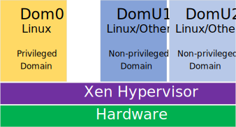

##  Introduction

This page presents the Xen GSRD, which is based on the [Linux GSRD for the Agilex&trade; 5 E-Series Premium Development Kit](https://altera-fpga.github.io/rel-24.3.1/embedded-designs/agilex-5/e-series/premium/gsrd/ug-gsrd-agx5e-premium/). The Xen GSRD uses the HPS Enablement Board, and SD card for storing the root filesystem.

### Xen Overview

Xen is a free open-source Type-1 hypervisor which enables efficient and secure virtualization of hardware resources to run multiple operating systems on a single physical machine. 



In Xen's architecture, there are two domains. Dom0 is the privileged management domain that runs the hypervisor and has full access to physical hardware, acting as the bridge between the hypervisor and other virtual machines. DomUs are unprivileged guest domains that run operating systems or applications, relying on Dom0 for resource allocation. Dom0 and DomUs operate independently, ensuring isolation and security.

### Prerequisites

The following are required to be able to fully exercise the Agilex 5 Premium Development Kit GSRD:

* Altera&reg; Agilex&trade; 5 FPGA E-Series 065B Premium Development Kit, ordering code DK-A5E065BB32AES1, with the following included accessories:

  * HPS Enablement Expansion Board. 
  * Mini USB Cable.
  * Micro USB Cable.
  * Ethernet Cable.
  * Micro SD card and USB card writer.

* Host PC with:

  * 64 GB of RAM. Less will be fine for only exercising the binaries, and not rebuilding the GSRD.
  * Linux OS installed. Ubuntu 22.04LTS was used to create this page, other versions and distributions may work too
  * Serial terminal (for example GtkTerm or Minicom on Linux and TeraTerm or PuTTY on Windows)
  * SSH server installer, to enable using 'scp' command from target board to host PC
  * Altera&reg; Quartus<sup>&reg;</sup> Prime Pro Edition Version 24.3.1 
  
* Local Ethernet network, with DHCP server
* Internet connection. For downloading the files, especially when rebuilding the GSRD.


Refer to [board documentation](https://www.intel.com/content/www/us/en/products/details/fpga/development-kits/agilex/a5e065b-modular.html) for more information about the development kit.

### Prebuilt Binaries

The Agilex&trade; 5 Premium Development Kit Xen binaries are located at [https://releases.rocketboards.org/2025.01/xen/agilex5_dk_a5e065bb32aes1_xen/](https://releases.rocketboards.org/2025.01/xen/agilex5_dk_a5e065bb32aes1_xen/).

### Component Versions

Altera&reg; Quartus<sup>&reg;</sup> Prime Pro Edition Version 24.3.1 and the following software component versions are used to build the GSRD: 

| Component | Location | Branch | Commit ID/Tag |
| :-- | :-- | :-- | :-- |
| GHRD | [https://github.com/altera-opensource/ghrd-socfpga](https://github.com/altera-opensource/ghrd-socfpga) | master | QPDS24.3.1_REL_GSRD_PR |
| Linux | [https://github.com/altera-opensource/linux-socfpga](https://github.com/altera-opensource/linux-socfpga) | socfpga-6.6.51-lts | QPDS24.3.1_REL_GSRD_PR |
| Arm Trusted Firmware | [https://github.com/altera-opensource/arm-trusted-firmware](https://github.com/altera-opensource/arm-trusted-firmware) | socfpga_v2.11.1 | QPDS24.3.1_REL_GSRD_PR |
| U-Boot | [https://github.com/altera-opensource/u-boot-socfpga](https://github.com/altera-opensource/u-boot-socfpga) | socfpga_v2024.07 | QPDS24.3.1_REL_GSRD_PR |
| Yocto Project | [https://git.yoctoproject.org/poky](https://git.yoctoproject.org/poky) | styhead | latest | 
| Yocto Project: meta-intel-fpga | [https://git.yoctoproject.org/meta-intel-fpga](https://git.yoctoproject.org/meta-intel-fpga) | styhead | latest |
| Yocto Project: meta-intel-fpga-refdes | [https://github.com/altera-opensource/meta-intel-fpga-refdes](https://github.com/altera-opensource/meta-intel-fpga-refdes) | styhead | QPDS24.3.1_REL_GSRD_PR |
| Yocto Build Script: gsrd-socfpga | [https://github.com/altera-opensource/gsrd-socfpga](https://github.com/altera-opensource/gsrd-socfpga) | styhead | - |

### Release Notes

See [https://github.com/altera-opensource/gsrd-socfpga/releases/tag/QPDS24.3.1_REL_GSRD_PR](https://github.com/altera-opensource/gsrd-socfpga/releases/tag/QPDS24.3.1_REL_GSRD_PR).

## Exercise Prebuilt Binaries

This section presents how to use the prebuilt binaries included with the Xen example, on the Agilex 5 FPGA E-Series 065B Premium Development Kit, with the HPS Enablement Expansion board.

Running the boot from SD card section of the GSRD is a prerequisite step for running the Xen examples, as not all steps are as detailed on this page as in the GSRD page. Refer to the following links for help on getting started:

| Link | Description |
| :- | :- |
| [Board Documentation](https://www.intel.com/content/www/us/en/products/details/fpga/development-kits/agilex/a5e065b-premium.html) | Board user guide, schematics, etc |
| [GSRD Development Kit Section](https://altera-fpga.github.io/rel-24.3.1/embedded-designs/agilex-5/e-series/premium/gsrd/ug-gsrd-agx5e-premium/#development-kit) | Details about the development kit |
| [GSRD Board Setup Section](https://altera-fpga.github.io/rel-24.3.1/embedded-designs/agilex-5/e-series/premium/gsrd/ug-gsrd-agx5e-premium/#configure-board) | Setting up the development kit |
| [GSRD Serial Console Section](https://altera-fpga.github.io/rel-24.3.1/embedded-designs/agilex-5/e-series/premium/gsrd/ug-gsrd-agx5e-premium/#configure-serial-console) | Setting up serial console |
| [GSRD Write SD Card Section](https://altera-fpga.github.io/rel-24.3.1/embedded-designs/agilex-5/e-series/premium/gsrd/ug-gsrd-agx5e-premium//#write-sd-card-image)  | Writing SD card image |

### Write Binaries

This section shows presents downloading and flashing the SD card image and JIC files, and downloading the xen rootfs cpio archive to be used by DomUs VMs.

1\. Download and write to SD card the image [https://releases.rocketboards.org/2025.01/xen/agilex5_dk_a5e065bb32aes1_xen/sdimage.tar.gz](https://releases.rocketboards.org/2025.01/xen/agilex5_dk_a5e065bb32aes1_xen/sdimage.tar.gz)

2\. Download and write to QSPI flash the JIC file [https://releases.rocketboards.org/2025.01/xen/agilex5_dk_a5e065bb32aes1_xen/ghrd_a5ed065bb32ae6sr0.hps.jic.tar.gz](https://releases.rocketboards.org/2025.01/xen/agilex5_dk_a5e065bb32aes1_xen/ghrd_a5ed065bb32ae6sr0.hps.jic.tar.gz)

3\. Set MSEL to QSPI, and power cycle the board to boot to Linux.

4\. Once logged into Linux, run the following command to remove the source code archives, to make some room on the rootfs:

```bash
rm -rf *src*

```
**Note**: In future releases the rootfs partition will be In Xen's architecture, there are two domains. Dom0 is the privileged management domain that runs the hypervisor and has full access to physical hardware, acting as the bridge between the hypervisor and other virtual machines. DomUs are unprivileged guest domains that run operating systems or applications, relying on Dom0 for resource allocation. Dom0 and DomUs operate independently, ensuring isolation and security.

larger, and this step would not be necessary.

5\. On the host computer, download the xen rootf cpio archive:

```bash
wget https://releases.rocketboards.org/2025.01/xen/agilex5_dk_a5e065bb32aes1_xen/xen-image-minimal-agilex5.cpio.gz
```

6\. On the Linux on target board, copy over the above downloaded file in 'xen' folder:

```bash
cd xen
scp <host_user>@<host-ip>:/<host-folder>/xen-image-minimal-agilex5.cpio.gz .
```

### Boot Xen GSRD

This section shows how to boot the Xen GSRD. By default, if no other operation is done, the board boots into normal, non-Xen enabled GSRD on a power cycle. In order to boot with the Xen Hypervisor, you need to stop the U-Boot countdown, and boot Linux manually using the commands shown in the below sections. This is provided for convenience, and when used in a real production system, U-Boot can be configured to boot the required Xen configuration automatically.


<h4>Boot Without Passthrough</h4>

1\. Set MSEL to QSPI, and power cycle the board

2\. Press any key during U-Boot countdown to stop it

3\. Run the following U-Boot commands:

```bash
fatls mmc 0:1
fatload mmc 0:1 $loadaddr boot.scr.xen.uimg
source $loadaddr
booti 0x8a000000 - 0x88000000
```

4\. Xen console messages will be shown, then regular Linux boot console messages.

5\. Log into Linux as usual with 'root' login and no passoword will be requested

<h4>Boot With Passthrough</h4>

The instructions are the same as without passthrough, just that the following command needs to be added befote the 'booti' command:

| Device Passthrough | Command |
| :- | :- |
| QSPI | fdt set /soc@0/spi@108d2000 xen,passthrough |
| Ethernet | fdt set /soc@0/ethernet@10830000 xen,passthrough |

### Manage VMs

This section shows how to use the 'xl' Xen utility to manage VMs running on DomUs. Only a few options are used, refer to 'xl' command help for more options.

1\. Boot Xen GSRD as shown above. It can be either with or without passthrough

2\. Create VM1 configuration file:

```bash
cat << EOT > test_vm_1.cfg
# Guest name
name = "DomU1"

# Kernel image to boot
kernel = "/boot/Image"

ramdisk = "xen-image-minimal-agilex5.cpio.gz"

extra = "root=/dev/ram0 init=/bin/sh console=hvc0 rdinit=/sbin/init"

# Initial memory allocation (MB)
memory = 1024
EOT
```

3\. Start VM1:

```bash
xl create test_vm_1.cfg
```

4\. List running VMs:

```bash
xl list
```

5\. Connect to VM1 console:

```bash
xl console DomU1
```

6\. Run some commands in VM1:

```bash
pwd
ls -la
```

7\. Exit from VM1 console by pressing CTRL + ]. Note this works only from serial console, and not over SSH connection.

8\. Create VM2 configuration file:

```bash
cat << EOT > test_vm_2.cfg
# Guest name
name = "DomU2"

# Kernel image to boot
kernel = "/boot/Image"

ramdisk = "xen-image-minimal-agilex5.cpio.gz"

extra = "root=/dev/ram0 init=/bin/sh console=hvc0 rdinit=/sbin/init"

# Initial memory allocation (MB)
memory = 1024
EOT
```

9\. Start VM2:

```bash
xl create test_vm_2.cfg
```

10\. List running VMs:

```bash
xl list
```

11\. Shutdown VM1:

```bash
xl shutdown DomU1
```

The above command politely asks DomU1 to shut down by using the ACPI shutdown signal and letting the OS shut down.

Alternatively, when needed, you can also use 'destroy' commands which acts as a hard power cycle:

```bash
xl destroy DomU1
```

12\. List VMs again, it will not show VM1 anymore

```bash
xl list
```

### Ethernet Passthrough


This section shows an example of how to assign the Ethernet IP to a DomU VM, instead of being used by Dom0, which is the default.

1\. Write binaries

2\. Boot to U-Boot prompt by interrupting the U-Boot countdown

3\. Run the following U-Boot commands:

```bash
fatls mmc 0:1
fatload mmc 0:1 $loadaddr boot.scr.xen.uimg
source $loadaddr
fdt set /soc@0/ethernet@10830000 xen,passthrough
booti 0x8a000000 - 0x88000000
```

4\. Xen console messages will be shown, then regular Linux boot console messages.

5\. Log into Linux as usual with 'root' login and no passoword will be requested

6\. Run 'ifconfig' to confirm Dom0 Linux does not have Ethernet anymore:

```bash
root@agilex5dka5e065bb32aes1:~# ifconfig
lo: flags=73<UP,LOOPBACK,RUNNING>  mtu 65536
        inet 127.0.0.1  netmask 255.0.0.0
        inet6 ::1  prefixlen 128  scopeid 0x10<host>
        loop  txqueuelen 1000  (Local Loopback)
        RX packets 2172  bytes 134772 (131.6 KiB)
        RX errors 0  dropped 0  overruns 0  frame 0
        TX packets 2172  bytes 134772 (131.6 KiB)
        TX errors 0  dropped 0 overruns 0  carrier 0  collisions 0
```

7\. Go to xen folder and look at the provided Ethernet passthrough files (dtb file and VM configuration file)

```bash
root@agilex5dka5e065bb32aes1:~/# cd xen
root@agilex5dka5e065bb32aes1:~/xen# ls *ethernet*
ethernet@10830000.cfg  ethernet@10830000.dtb
root@agilex5dka5e065bb32aes1:~/xen# cat ethernet@10830000.cfg
# SPDX-License-Identifier: MIT-0
# Guest name
name = "DomU1"

# Kernel image to boot
kernel = "/boot/Image"

ramdisk = "/home/root/xen/xen-image-minimal-agilex5.cpio.gz"

extra = "root=/dev/ram0 init=/bin/sh console=hvc0 rdinit=/sbin/init"

# Initial memory allocation (MB)
memory = 1024

device_tree = "ethernet@10830000.dtb"
dtdev = [ "/soc@0/ethernet@10830000" ]
iomem = [ "0x10830,4","0x10d12,1" ]
irqs = [ 256, 257, 258, 259, 260, 261, 262, 263, 264, 265, 267, 268, 269, 270, 271, 272 ]
```

8\. Start the VM:

```bash
xl create ethernet\@10830000.cfg
```

9\. Connect to VM console 

```bash
xl console DomU1
```

10\. In the VM console, login with 'root' account, then do an 'ifconfig' or other commands to confirm Ethernet is working:

```bash
root@agilex5dka5e065bb32aes1:~# ifconfig
eth0      Link encap:Ethernet  HWaddr 1A:CD:51:03:2A:55  
          inet addr:192.168.1.154  Bcast:192.168.1.255  Mask:255.255.255.0
          inet6 addr: fe80::18cd:51ff:fe03:2a55/64 Scope:Link
          inet6 addr: 2603:8081:7700:1092::1bb7/128 Scope:Global
          inet6 addr: 2603:8081:7700:1092:18cd:51ff:fe03:2a55/64 Scope:Global
          UP BROADCAST RUNNING MULTICAST  MTU:1500  Metric:1
          RX packets:12 errors:0 dropped:0 overruns:0 frame:0
          TX packets:20 errors:0 dropped:0 overruns:0 carrier:0
          collisions:0 txqueuelen:1000 
          RX bytes:1715 (1.6 KiB)  TX bytes:2275 (2.2 KiB)
          Interrupt:14 Base address:0xc000 

lo        Link encap:Local Loopback  
          inet addr:127.0.0.1  Mask:255.0.0.0
          inet6 addr: ::1/128 Scope:Host
          UP LOOPBACK RUNNING  MTU:65536  Metric:1
          RX packets:0 errors:0 dropped:0 overruns:0 frame:0
          TX packets:0 errors:0 dropped:0 overruns:0 carrier:0
          collisions:0 txqueuelen:1000 
          RX bytes:0 (0.0 B)  TX bytes:0 (0.0 B)
```


### QSPI Passthrough

This section shows an example of how to assign the QSPI IP to a DomU VM, instead of being used by Dom0, which is the default.


1\. Write binaries

2\. Boot to U-Boot prompt by interrupting the U-Boot countdown

3\. Run the following U-Boot commands:

```bash
fatls mmc 0:1
fatload mmc 0:1 $loadaddr boot.scr.xen.uimg
source $loadaddr
fdt set /soc@0/spi@108d2000 xen,passthrough
booti 0x8a000000 - 0x88000000
```

4\. Xen console messages will be shown, then regular Linux boot console messages.

5\. Log into Linux as usual with 'root' login and no passoword will be requested

6\. Go to xen folder and look at the provided QSPI passthrough files (dtb file and VM configuration file):

```bash
root@agilex5dka5e065bb32aes1:~/# cd xen
root@agilex5dka5e065bb32aes1:~/xen# ls *spi*
spi@108d2000.cfg  spi@108d2000.dtb
root@agilex5dka5e065bb32aes1:~/xen# cat spi@108d2000.cfg
#SPDX-License-Identifier: MIT-0
# Guest name
name = "DomU1"

# Kernel image to boot
kernel = "/boot/Image"

# Ramdisk
ramdisk = "/home/root/xen/xen-image-minimal-agilex5.cpio.gz"

extra = "root=/dev/ram0 init=/bin/sh console=hvc0 rdinit=/sbin/init"

# Initial memory allocation (MB)
memory = 1024

device_tree = "spi@108d2000.dtb"
iomem = [ "0x108d2,1", "0x10900,100" ]
irqs = [ 35 ]

```

7\. Start the VM, and connect to its console

```bash
xl create spi@108d2000.cfg
xl console DomU1
```

8\. In the VM console, login with 'root' account, then run a couple of commands to see QSPI is enabled:

```bash
root@agilex5dka5e065bb32aes1:~# mtdinfo
Count of MTD devices:           2
Present MTD devices:            mtd0, mtd1
Sysfs interface supported:      yes
root@agilex5dka5e065bb32aes1:~# cat /proc/mtd 
dev:    size   erasesize  name
mtd0: 04200000 00010000 "u-boot"
mtd1: 0be00000 00010000 "root"
```

## Rebuild Xen GSRD

This section presents how to build the Xen GSRD binaries. The instructions are the same as for the GSRD, except that the environment variable BUILD_HYP=1 needs to be set for building the Xen enabled GSRD version. This environment variable is only used by the Yocto GSRD script.


<h5>Yocto Build Prerequisites</h5>

1\. Make sure you have Yocto system requirements met: https://docs.yoctoproject.org/5.0.1/ref-manual/system-requirements.html#supported-linux-distributions.

The command to install the required packages on Ubuntu 22.04 is:

```bash
sudo apt-get update
sudo apt-get upgrade
sudo apt-get install openssh-server mc libgmp3-dev libmpc-dev gawk wget git diffstat unzip texinfo gcc \
build-essential chrpath socat cpio python3 python3-pip python3-pexpect xz-utils debianutils iputils-ping \
python3-git python3-jinja2 libegl1-mesa libsdl1.2-dev pylint xterm python3-subunit mesa-common-dev zstd \
liblz4-tool git fakeroot build-essential ncurses-dev xz-utils libssl-dev bc flex libelf-dev bison xinetd \
tftpd tftp nfs-kernel-server libncurses5 libc6-i386 libstdc++6:i386 libgcc++1:i386 lib32z1 \
device-tree-compiler curl mtd-utils u-boot-tools net-tools swig -y
```

On Ubuntu 22.04 you will also need to point the /bin/sh to /bin/bash, as the default is a link to /bin/dash:

```bash
 sudo ln -sf /bin/bash /bin/sh
```

**Note**: You can also use a Docker container to build the Yocto recipes, refer to https://rocketboards.org/foswiki/Documentation/DockerYoctoBuild for details. When using a Docker container, it does not matter what Linux distribution or packages you have installed on your host, as all dependencies are provided by the Docker container.

The following diagram shows an overview of how the build process works for this use case:


<h5>Setup Environment</h5>

1\. Create the top folder to store all the build artifacts:


```bash
sudo rm -rf agilex5_gsrd_premium.xen
mkdir agilex5_gsrd_premium.xen
cd agilex5_gsrd_premium.xen
export TOP_FOLDER=`pwd`
```


Download the compiler toolchain, add it to the PATH variable, to be used by the GHRD makefile to build the HPS Debug FSBL:


```bash
cd $TOP_FOLDER
wget https://developer.arm.com/-/media/Files/downloads/gnu/11.2-2022.02/binrel/\
gcc-arm-11.2-2022.02-x86_64-aarch64-none-linux-gnu.tar.xz
tar xf gcc-arm-11.2-2022.02-x86_64-aarch64-none-linux-gnu.tar.xz
rm -f gcc-arm-11.2-2022.02-x86_64-aarch64-none-linux-gnu.tar.xz
export PATH=`pwd`/gcc-arm-11.2-2022.02-x86_64-aarch64-none-linux-gnu/bin:$PATH
export ARCH=arm64
export CROSS_COMPILE=aarch64-none-linux-gnu-
```

Enable Quartus tools to be called from command line:


```bash
export QUARTUS_ROOTDIR=~/intelFPGA_pro/24.3.1/quartus/
export PATH=$QUARTUS_ROOTDIR/bin:$QUARTUS_ROOTDIR/linux64:$QUARTUS_ROOTDIR/../qsys/bin:$PATH
```


<h5>Build Hardware Design</h5>


```bash
cd $TOP_FOLDER
rm -rf ghrd-socfpga agilex5_soc_devkit_ghrd
git clone -b QPDS24.3.1_REL_GSRD_PR https://github.com/altera-opensource/ghrd-socfpga
mv ghrd-socfpga/agilex5_soc_devkit_ghrd .
rm -rf ghrd-socfpga
cd agilex5_soc_devkit_ghrd
make config
make DEVICE=A5ED065BB32AE6SR0 HPS_EMIF_MEM_CLK_FREQ_MHZ=800 HPS_EMIF_REF_CLK_FREQ_MHZ=100 generate_from_tcl
make sof
cd ..
```


The following files are created:

* `$TOP_FOLDER/agilex5_soc_devkit_ghrd/output_files/ghrd_a5ed065bb32ae6sr0.sof`
* `$TOP_FOLDER/agilex5_soc_devkit_ghrd/output_files/ghrd_a5ed065bb32ae6sr0_hps_debug.sof`
<h5>Build Core RBF</h5>


```bash
cd $TOP_FOLDER
rm -f ghrd_a5ed065bb32ae6sr0.rbf
quartus_pfg -c agilex5_soc_devkit_ghrd/output_files/ghrd_a5ed065bb32ae6sr0_hps_debug.sof ghrd_a5ed065bb32ae6sr0.rbf -o hps=1
```


The following file is created:

* `$TOP_FOLDER/ghrd_a5ed065bb32ae6sr0.core.rbf`


<h5>Set Up Yocto</h5>

1\. Clone the Yocto script and prepare the build:

```bash
cd $TOP_FOLDER
rm -rf gsrd-socfpga
git clone -b styhead https://github.com/altera-opensource/gsrd-socfpga
cd gsrd-socfpga
export HYP_BUILD=1
. agilex5_dk_a5e065bb32aes1-gsrd-build.sh
build_setup
```


<h5>Customize Yocto</h5>

1\. Save the `core.rbf` as `$WORKSPACE/meta-intel-fpga-refdes/recipes-bsp/ghrd/files/agilex5_dk_a5e065bb32aes1_gsrd_ghrd.core.rbf`

2\. Update the recipe `$WORKSPACE/meta-intel-fpga-refdes/recipes-bsp/ghrd/hw-ref-design.bb` as follows:  

* Replace the entry `${GHRD_REPO}/agilex5_dk_a5e065bb32aes1_gsrd_${ARM64_GHRD_CORE_RBF};name=agilex5_dk_a5e065bb32aes1_gsrd_core` with `file://agilex5_dk_a5e065bb32aes1_gsrd_ghrd.core.rbf;sha256sum=<CORE_SHA>` where `CORE_SHA` is the sha256 checksum of the file
* Delete the line `SRC_URI[agilex5_dk_a5e065bb32aes1_gsrd_core.sha256sum] = "bf11c8cb3b6d9487f93ce0e055b1e5256998a25b25ac4690bef3fcd6225ee1ae"`
The above are achieved by the following instructions:

```bash
CORE_RBF=$WORKSPACE/meta-intel-fpga-refdes/recipes-bsp/ghrd/files/agilex5_dk_a5e065bb32aes1_gsrd_ghrd.core.rbf
ln -s $TOP_FOLDER/ghrd_a5ed065bb32ae6sr0.core.rbf $CORE_RBF
OLD_URI="\${GHRD_REPO}\/agilex5_dk_a5e065bb32aes1_gsrd_\${ARM64_GHRD_CORE_RBF};name=agilex5_dk_a5e065bb32aes1_gsrd_core"
CORE_SHA=$(sha256sum $CORE_RBF | cut -f1 -d" ")
NEW_URI="file:\/\/agilex5_dk_a5e065bb32aes1_gsrd_ghrd.core.rbf;sha256sum=$CORE_SHA"
sed -i "s/$OLD_URI/$NEW_URI/g" $WORKSPACE/meta-intel-fpga-refdes/recipes-bsp/ghrd/hw-ref-design.bb
sed -i "/agilex5_dk_a5e065bb32aes1_gsrd_core\.sha256sum/d" $WORKSPACE/meta-intel-fpga-refdes/recipes-bsp/ghrd/hw-ref-design.bb
```


<h5>Build Yocto</h5>

Build Yocto:

```bash
bitbake_image
```

Gather files:

```bash
package
```


The following files are created:

* `$TOP_FOLDER/gsrd-socfpga/agilex5_dk_a5e065bb32aes1-gsrd-images/u-boot-agilex5-socdk-gsrd-atf/u-boot-spl-dtb.hex`
* `$TOP_FOLDER/gsrd-socfpga/agilex5_dk_a5e065bb32aes1-gsrd-images/u-boot.itb`
* `$TOP_FOLDER/gsrd-socfpga/agilex5_dk_a5e065bb32aes1-gsrd-images/sdimage.tar.gz`


<h5>Build QSPI Image</h5>


```bash
cd $TOP_FOLDER
rm -f ghrd_a5ed065bb32ae6sr0.hps.jic ghrd_a5ed065bb32ae6sr0.core.rbf
quartus_pfg \
-c agilex5_soc_devkit_ghrd/output_files/ghrd_a5ed065bb32ae6sr0.sof ghrd_a5ed065bb32ae6sr0.jic \
-o device=MT25QU128 \
-o flash_loader=A5ED065BB32AE6SR0 \
-o hps_path=gsrd-socfpga/agilex5_dk_a5e065bb32aes1-gsrd-images/u-boot-agilex5-socdk-gsrd-atf/u-boot-spl-dtb.hex \
-o mode=ASX4 \
-o hps=1
```


The following file is created:

* `$TOP_FOLDER/ghrd_a5ed065bb32ae6sr0.hps.jic`

<h5>Build HPS RBF</h5>
This is an optional step, in which you can build an HPS RBF file, which can be used to configure the HPS through JTAG instead of QSPI though the JIC file.


```bash
cd $TOP_FOLDER
rm -f ghrd_a5ed065bb32ae6sr0.hps.rbf
quartus_pfg \
-c agilex5_soc_devkit_ghrd/output_files/ghrd_a5ed065bb32ae6sr0.sof  ghrd_a5ed065bb32ae6sr0.rbf \
-o hps_path=gsrd-socfpga/agilex5_dk_a5e065bb32aes1-gsrd-images/u-boot-agilex5-socdk-gsrd-atf/u-boot-spl-dtb.hex \
-o hps=1
```


The following file is created:

* `$TOP_FOLDER/ghrd_a5ed065bb32ae6sr0.hps.rbf`


## Use Zephyr on DomU

This section shows how to build a simple Zephyr example and run in inside a Xen VM.

### Build Zephyr Binary

For theis example the Zephyr binary was built on an Ubuntu 22.04 machine, with the required packages installed as indicated in [https://docs.zephyrproject.org/latest/develop/getting_started/index.html](https://docs.zephyrproject.org/latest/develop/getting_started/index.html).

1\. Create a virtual Python environment:

```bash
export TOP_FOLDER=`pwd`
python3 -m venv $TOP_FOLDER/.zephyr_venv
source $TOP_FOLDER/.zephyr_venv/bin/activate
```

2\. Install the Zephr project:

```bash
pip3 install wheel 
pip3 install west 
west init -m https://github.com/zephyrproject-rtos/zephyr --mr main zephyrproject 
cd zephyrproject
west update 
west zephyr-export
pip install -r zephyr/scripts/requirements.txt
```

3\. Download the Altera&reg; Zephyr repo and install SDK:

```bash
git clone -b socfpga_rel_24.3 https://github.com/altera-opensource/zephyr-socfpga
cd zephyr-socfpga
west update
west zephyr-export
west sdk install
```

4\. Work around an issue that happens at least on certain Ubuntu 22.04 installations:

```bash
pushd boards/arm64/xenvm
rm xenvm_defconfig && mv xenvm_gicv3_defconfig xenvm_defconfig
rm xenvm_gicv3.yaml
mv xenvm.dts xenvm_base.dts && mv xenvm_gicv3.dts xenvm.dts && sed -i 's/xenvm\.dts/xenvm_base.dts/g' xenvm.dts
popd
```

5\. Build the sample application:

```bash
west build -b xenvm samples/hello_world -p
```

This will create the file $TOP_FOLDER/zephyrproject/zephyr-socfpga/build/zephyr/zephyr.bin


### Run Zephyr VM

1\. Write the Xen GSRD binaries.

2\. Boot to XEN GSRD, does not matter if passthrough is enabled or not

3\. Copy the Zephyr binary to the target rootfs:

```bash
cd xen
scp <host_user>@<host-ip>:/<host-folder>/zephyr.bin .
```

4\. Still in the xen folder, create the Zephyr VM configuration file:

```bash
cat << EOT > zephyr.cfg
kernel="zephyr.bin"
name="zephyr"
vcpus=1
memory=16
gic_version="v3"
on_crash="preserve"
EOT
```

5\. Start the Zephyr VM:

```bash
xl create zephyr.cfg
```

6\. Connect to VM console:

```bash
xl console zephyr
```

7\. In the VM console, you will see the message output by the Zephyr:

```bash
Hello World! xenvm
[00:00:00.000,000] <inf> xen_events: xen_events_init: events inited

[00:00:00.000,000] <inf> uart_hvc_xen: Xen HVC inited successfully

*** Booting Zephyr OS build v4.0.0-4569-g8cff70a95d6c ***
```

## Notices & Disclaimers

Altera<sup>&reg;</sup> Corporation technologies may require enabled hardware, software or service activation.
No product or component can be absolutely secure. 
Performance varies by use, configuration and other factors.
Your costs and results may vary. 
You may not use or facilitate the use of this document in connection with any infringement or other legal analysis concerning Altera or Intel products described herein. You agree to grant Altera Corporation a non-exclusive, royalty-free license to any patent claim thereafter drafted which includes subject matter disclosed herein.
No license (express or implied, by estoppel or otherwise) to any intellectual property rights is granted by this document, with the sole exception that you may publish an unmodified copy. You may create software implementations based on this document and in compliance with the foregoing that are intended to execute on the Altera or Intel product(s) referenced in this document. No rights are granted to create modifications or derivatives of this document.
The products described may contain design defects or errors known as errata which may cause the product to deviate from published specifications.  Current characterized errata are available on request.
Altera disclaims all express and implied warranties, including without limitation, the implied warranties of merchantability, fitness for a particular purpose, and non-infringement, as well as any warranty arising from course of performance, course of dealing, or usage in trade.
You are responsible for safety of the overall system, including compliance with applicable safety-related requirements or standards. 
<sup>&copy;</sup> Altera Corporation.  Altera, the Altera logo, and other Altera marks are trademarks of Altera Corporation.  Other names and brands may be claimed as the property of others. 

OpenCL* and the OpenCL* logo are trademarks of Apple Inc. used by permission of the Khronos Group™. 