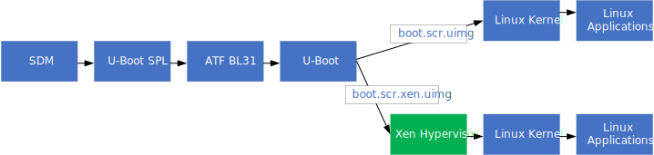
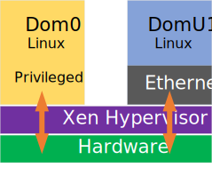

# HPS Xen Hypervisor GSRD for the Agilex™ 5 E-Series Premium Dev Kit

##  Introduction

This page presents the Xen GSRD, which is based on the [Linux GSRD for the Agilex&trade; 5 E-Series Premium Development Kit](https://altera-fpga.github.io/rel-25.1.1/embedded-designs/agilex-5/e-series/premium/gsrd/ug-gsrd-agx5e-premium/). The Xen GSRD uses the HPS Enablement Board, and SD card for storing the root filesystem.

### Xen Overview

Xen is a free open-source Type-1 hypervisor which enables efficient and secure virtualization of hardware resources to run multiple operating systems on a single physical machine. 


In Xen's architecture, there are two domains. Dom0 is the privileged management domain that runs the hypervisor and has full access to physical hardware, acting as the bridge between the hypervisor and other virtual machines. DomUs are unprivileged guest domains that run operating systems or applications, relying on Dom0 for resource allocation. Dom0 and DomUs operate independently, ensuring isolation and security.

### Prerequisites

The following are required to be able to fully exercise the Agilex 5 Premium Development Kit GSRD:

* Altera&reg; Agilex&trade; 5 FPGA E-Series 065B Premium Development Kit, ordering code DK-A5E065BB32AES1, with the following included accessories:

  * HPS Enablement Expansion Board. 
  * Mini USB Cable.
  * Micro USB Cable.
  * Ethernet Cable.
  * Micro SD card and USB card writer.

* Host PC with:

  * 64 GB of RAM. Less will be fine for only exercising the binaries, and not rebuilding the GSRD.
  * Linux OS installed. Ubuntu 22.04LTS was used to create this page, other versions and distributions may work too
  * Serial terminal (for example GtkTerm or Minicom on Linux and TeraTerm or PuTTY on Windows)
  * SSH server installer, to enable using 'scp' command from target board to host PC
  * Altera&reg; Quartus<sup>&reg;</sup> Prime Pro Edition Version 25.1.1 
  
* Local Ethernet network, with DHCP server
* Internet connection. For downloading the files, especially when rebuilding the GSRD.


Refer to [board documentation](https://www.intel.com/content/www/us/en/products/details/fpga/development-kits/agilex/a5e065b-modular.html) for more information about the development kit.

### Prebuilt Binaries

The Agilex&trade; 5 Premium Development Kit Xen binaries are located at [https://releases.rocketboards.org/2025.08/xen/agilex5_dk_a5e065bb32aes1_xen/](https://releases.rocketboards.org/2025.08/xen/agilex5_dk_a5e065bb32aes1_xen/).

### Component Versions

Altera&reg; Quartus<sup>&reg;</sup> Prime Pro Edition Version 25.1.1 and the following software component versions are used to build the binaries presented in this page:

| Component                             | Location                                                     | Branch                       | Commit ID/Tag       |
| :------------------------------------ | :----------------------------------------------------------- | :--------------------------- | :------------------ |
| Agilex 3 GHRD                         | [https://github.com/altera-fpga/agilex3c-ed-gsrd](https://github.com/altera-fpga/agilex3c-ed-gsrd)    | main  | QPDS25.1.1_REL_GSRD_PR   |
| Agilex 5 GHRD                                  | [https://github.com/altera-fpga/agilex5e-ed-gsrd](https://github.com/altera-fpga/agilex5e-ed-gsrd) | main                    | QPDS25.1.1_REL_GSRD_PR |
| Agilex 7 GHRD | [https://github.com/altera-fpga/agilex7f-ed-gsrd](https://github.com/altera-fpga/agilex7f-ed-gsrd) | main | QPDS25.1.1_REL_GSRD_PR |
| Stratix 10 GHRD | [https://github.com/altera-fpga/stratix10-ed-gsrd](https://github.com/altera-fpga/stratix10-ed-gsrd) | main | QPDS25.1.1_REL_GSRD_PR |
| Linux                                 | [https://github.com/altera-fpga/linux-socfpga](https://github.com/altera-fpga/linux-socfpga) | socfpga-6.12.19-lts | QPDS25.1.1_REL_GSRD_PR |
| Arm Trusted Firmware                  | [https://github.com/altera-fpga/arm-trusted-firmware](https://github.com/altera-fpga/arm-trusted-firmware) | socfpga_v2.12.1   | QPDS25.1.1_REL_GSRD_PR |
| U-Boot                                | [https://github.com/altera-fpga/u-boot-socfpga](https://github.com/altera-fpga/u-boot-socfpga) | socfpga_v2025.04 | QPDS25.1.1_REL_GSRD_PR |
| Yocto Project                         | [https://git.yoctoproject.org/poky](https://git.yoctoproject.org/poky) | walnascar | latest              |
| Yocto Project: meta-intel-fpga        | [https://git.yoctoproject.org/meta-intel-fpga](https://git.yoctoproject.org/meta-intel-fpga) | walnascar | latest              |
| Yocto Project: meta-intel-fpga-refdes | [https://github.com/altera-fpga/meta-intel-fpga-refdes](https://github.com/altera-fpga/meta-intel-fpga-refdes) | walnascar | QPDS25.1.1_REL_GSRD_PR |

**Note:** The combination of the component versions indicated in the table above has been validated through the use cases described in this page and it is strongly recommended to use these versions together. If you decided to use any component with different version than the indicated, there is not warranty that this will work.

### Release Notes

See [https://github.com/altera-fpga/gsrd-socfpga/releases/tag/QPDS25.1.1_REL_GSRD_PR](https://github.com/altera-fpga/gsrd-socfpga/releases/tag/QPDS25.1.1_REL_GSRD_PR).

## Exercise Prebuilt Binaries

This section presents how to use the prebuilt binaries included with the Xen example, on the Agilex 5 FPGA E-Series 065B Premium Development Kit, with the HPS Enablement Expansion board.

Running the boot from SD card section of the GSRD is a prerequisite step for running the Xen examples, as not all steps are as detailed on this page as in the GSRD page. Refer to the following links for help on getting started:

| Link | Description |
| :- | :- |
| [Board Documentation](https://www.intel.com/content/www/us/en/products/details/fpga/development-kits/agilex/a5e065b-premium.html) | Board user guide, schematics, etc |
| [GSRD Development Kit Section](https://altera-fpga.github.io/rel-25.1.1/embedded-designs/agilex-5/e-series/premium/gsrd/ug-gsrd-agx5e-premium/#development-kit) | Details about the development kit |
| [GSRD Board Setup Section](https://altera-fpga.github.io/rel-25.1.1/embedded-designs/agilex-5/e-series/premium/gsrd/ug-gsrd-agx5e-premium/#configure-board) | Setting up the development kit |
| [GSRD Serial Console Section](https://altera-fpga.github.io/rel-25.1.1/embedded-designs/agilex-5/e-series/premium/gsrd/ug-gsrd-agx5e-premium/#configure-serial-console) | Setting up serial console |
| [GSRD Write SD Card Section](https://altera-fpga.github.io/rel-25.1.1/embedded-designs/agilex-5/e-series/premium/gsrd/ug-gsrd-agx5e-premium//#write-sd-card-image)  | Writing SD card image |

### Write Binaries

This section shows presents downloading and flashing the SD card image and JIC files, and downloading the xen rootfs cpio archive to be used by DomUs VMs.

1\. Download and write to SD card the image [https://releases.rocketboards.org/2025.08/xen/agilex5_dk_a5e065bb32aes1_xen/sdimage.tar.gz](https://releases.rocketboards.org/2025.08/xen/agilex5_dk_a5e065bb32aes1_xen/sdimage.tar.gz)

2\. Download and write to QSPI flash the JIC file [https://releases.rocketboards.org/2025.08/xen/agilex5_dk_a5e065bb32aes1_xen/ghrd_a5ed065bb32ae6sr0.hps.jic.tar.gz](https://releases.rocketboards.org/2025.08/xen/agilex5_dk_a5e065bb32aes1_xen/ghrd_a5ed065bb32ae6sr0.hps.jic.tar.gz)

3\. Set MSEL to QSPI, and power cycle the board to boot to Linux.

4\. On the host computer, download the xen rootf cpio archive:

```bash
wget https://releases.rocketboards.org/2025.08/xen/agilex5_dk_a5e065bb32aes1_xen/xen-image-minimal-agilex5.cpio.gz
```

5\. On the Linux on target board, copy over the above downloaded file in 'xen' folder:

```bash
cd xen
scp <host_user>@<host-ip>:/<host-folder>/xen-image-minimal-agilex5.cpio.gz .
```

### Boot Xen GSRD

This section shows how to boot the Xen GSRD. By default, if no other operation is done, the board boots into normal, non-Xen enabled GSRD on a power cycle. In order to boot with the Xen Hypervisor, you need to stop the U-Boot countdown, and boot Linux manually using the commands shown in the below sections. This is provided for convenience, and when used in a real production system, U-Boot can be configured to boot the required Xen configuration automatically.



<h4>Boot Without Passthrough</h4>

1\. Set MSEL to QSPI, and power cycle the board

2\. Press any key during U-Boot countdown to stop it

3\. Run the following U-Boot commands:

```bash
fatls mmc 0:1
fatload mmc 0:1 $loadaddr boot.scr.xen.uimg
source $loadaddr
booti 0x8a000000 - 0x88000000
```

4\. Xen console messages will be shown, then regular Linux boot console messages.

5\. Log into Linux as usual with 'root' login and no passoword will be requested

<h4>Boot With Passthrough</h4>

The instructions are the same as without passthrough, just that the following command needs to be added befote the 'booti' command:

| Device Passthrough | Command |
| :- | :- |
| QSPI | fdt set /soc@0/spi@108d2000 xen,passthrough |
| Ethernet | fdt set /soc@0/ethernet@10830000 xen,passthrough |

### Manage VMs

This section shows how to use the 'xl' Xen utility to manage VMs running on DomUs. Only a few options are used, refer to 'xl' command help for more options.

1\. Boot Xen GSRD as shown above. It can be either with or without passthrough

2\. Create VM1 configuration file:

```bash
cat << EOT > test_vm_1.cfg
# Guest name
name = "DomU1"

# Kernel image to boot
kernel = "/boot/Image"

ramdisk = "xen-image-minimal-agilex5.cpio.gz"

extra = "root=/dev/ram0 init=/bin/sh console=hvc0 rdinit=/sbin/init"

# Initial memory allocation (MB)
memory = 1024
EOT
```

3\. Start VM1:

```bash
xl create test_vm_1.cfg
```

4\. List running VMs:

```bash
xl list
```

5\. Connect to VM1 console:

```bash
xl console DomU1
```

6\. Run some commands in VM1:

```bash
pwd
ls -la
```

7\. Exit from VM1 console by pressing CTRL + ]. Note this works only from serial console, and not over SSH connection.

8\. Create VM2 configuration file:

```bash
cat << EOT > test_vm_2.cfg
# Guest name
name = "DomU2"

# Kernel image to boot
kernel = "/boot/Image"

ramdisk = "xen-image-minimal-agilex5.cpio.gz"

extra = "root=/dev/ram0 init=/bin/sh console=hvc0 rdinit=/sbin/init"

# Initial memory allocation (MB)
memory = 1024
EOT
```

9\. Start VM2:

```bash
xl create test_vm_2.cfg
```

10\. List running VMs:

```bash
xl list
```

11\. Shutdown VM1:

```bash
xl shutdown DomU1
```

The above command politely asks DomU1 to shut down by using the ACPI shutdown signal and letting the OS shut down.

Alternatively, when needed, you can also use 'destroy' commands which acts as a hard power cycle:

```bash
xl destroy DomU1
```

12\. List VMs again, it will not show VM1 anymore

```bash
xl list
```

### Ethernet Passthrough



This section shows an example of how to assign the Ethernet IP to a DomU VM, instead of being used by Dom0, which is the default.

1\. Write binaries

2\. Boot to U-Boot prompt by interrupting the U-Boot countdown

3\. Run the following U-Boot commands:

```bash
fatls mmc 0:1
fatload mmc 0:1 $loadaddr boot.scr.xen.uimg
source $loadaddr
fdt set /soc@0/ethernet@10830000 xen,passthrough
booti 0x8a000000 - 0x88000000
```

4\. Xen console messages will be shown, then regular Linux boot console messages.

5\. Log into Linux as usual with 'root' login and no passoword will be requested

6\. Run 'ifconfig' to confirm Dom0 Linux does not have Ethernet anymore:

```bash
root@agilex5dka5e065bb32aes1:~# ifconfig
lo: flags=73<UP,LOOPBACK,RUNNING>  mtu 65536
        inet 127.0.0.1  netmask 255.0.0.0
        inet6 ::1  prefixlen 128  scopeid 0x10<host>
        loop  txqueuelen 1000  (Local Loopback)
        RX packets 2172  bytes 134772 (131.6 KiB)
        RX errors 0  dropped 0  overruns 0  frame 0
        TX packets 2172  bytes 134772 (131.6 KiB)
        TX errors 0  dropped 0 overruns 0  carrier 0  collisions 0
```

7\. Go to xen folder and look at the provided Ethernet passthrough files (dtb file and VM configuration file)

```bash
root@agilex5dka5e065bb32aes1:~/# cd xen
root@agilex5dka5e065bb32aes1:~/xen# ls *ethernet*
ethernet@10830000.cfg  ethernet@10830000.dtb
root@agilex5dka5e065bb32aes1:~/xen# cat ethernet@10830000.cfg
# SPDX-License-Identifier: MIT-0
# Guest name
name = "DomU1"

# Kernel image to boot
kernel = "/boot/Image"

ramdisk = "/home/root/xen/xen-image-minimal-agilex5.cpio.gz"

extra = "root=/dev/ram0 init=/bin/sh console=hvc0 rdinit=/sbin/init"

# Initial memory allocation (MB)
memory = 1024

device_tree = "ethernet@10830000.dtb"
dtdev = [ "/soc@0/ethernet@10830000" ]
iomem = [ "0x10830,4","0x10d12,1" ]
irqs = [ 256, 257, 258, 259, 260, 261, 262, 263, 264, 265, 267, 268, 269, 270, 271, 272 ]
```

8\. Start the VM:

```bash
xl create ethernet\@10830000.cfg
```

9\. Connect to VM console 

```bash
xl console DomU1
```

10\. In the VM console, login with 'root' account, then do an 'ifconfig' or other commands to confirm Ethernet is working:

```bash
root@agilex5dka5e065bb32aes1:~# ifconfig
eth0      Link encap:Ethernet  HWaddr 1A:CD:51:03:2A:55  
          inet addr:192.168.1.154  Bcast:192.168.1.255  Mask:255.255.255.0
          inet6 addr: fe80::18cd:51ff:fe03:2a55/64 Scope:Link
          inet6 addr: 2603:8081:7700:1092::1bb7/128 Scope:Global
          inet6 addr: 2603:8081:7700:1092:18cd:51ff:fe03:2a55/64 Scope:Global
          UP BROADCAST RUNNING MULTICAST  MTU:1500  Metric:1
          RX packets:12 errors:0 dropped:0 overruns:0 frame:0
          TX packets:20 errors:0 dropped:0 overruns:0 carrier:0
          collisions:0 txqueuelen:1000 
          RX bytes:1715 (1.6 KiB)  TX bytes:2275 (2.2 KiB)
          Interrupt:14 Base address:0xc000 

lo        Link encap:Local Loopback  
          inet addr:127.0.0.1  Mask:255.0.0.0
          inet6 addr: ::1/128 Scope:Host
          UP LOOPBACK RUNNING  MTU:65536  Metric:1
          RX packets:0 errors:0 dropped:0 overruns:0 frame:0
          TX packets:0 errors:0 dropped:0 overruns:0 carrier:0
          collisions:0 txqueuelen:1000 
          RX bytes:0 (0.0 B)  TX bytes:0 (0.0 B)
```


### QSPI Passthrough

This section shows an example of how to assign the QSPI IP to a DomU VM, instead of being used by Dom0, which is the default.


1\. Write binaries

2\. Boot to U-Boot prompt by interrupting the U-Boot countdown

3\. Run the following U-Boot commands:

```bash
fatls mmc 0:1
fatload mmc 0:1 $loadaddr boot.scr.xen.uimg
source $loadaddr
fdt set /soc@0/spi@108d2000 xen,passthrough
booti 0x8a000000 - 0x88000000
```

4\. Xen console messages will be shown, then regular Linux boot console messages.

5\. Log into Linux as usual with 'root' login and no passoword will be requested

6\. Go to xen folder and look at the provided QSPI passthrough files (dtb file and VM configuration file):

```bash
root@agilex5dka5e065bb32aes1:~/# cd xen
root@agilex5dka5e065bb32aes1:~/xen# ls *spi*
spi@108d2000.cfg  spi@108d2000.dtb
root@agilex5dka5e065bb32aes1:~/xen# cat spi@108d2000.cfg
#SPDX-License-Identifier: MIT-0
# Guest name
name = "DomU1"

# Kernel image to boot
kernel = "/boot/Image"

# Ramdisk
ramdisk = "/home/root/xen/xen-image-minimal-agilex5.cpio.gz"

extra = "root=/dev/ram0 init=/bin/sh console=hvc0 rdinit=/sbin/init"

# Initial memory allocation (MB)
memory = 1024

device_tree = "spi@108d2000.dtb"
iomem = [ "0x108d2,1", "0x10900,100" ]
irqs = [ 35 ]

```

7\. Start the VM, and connect to its console

```bash
xl create spi@108d2000.cfg
xl console DomU1
```

8\. In the VM console, login with 'root' account, then run a couple of commands to see QSPI is enabled:

```bash
root@agilex5dka5e065bb32aes1:~# mtdinfo
Count of MTD devices:           2
Present MTD devices:            mtd0, mtd1
Sysfs interface supported:      yes
root@agilex5dka5e065bb32aes1:~# cat /proc/mtd 
dev:    size   erasesize  name
mtd0: 04200000 00010000 "u-boot"
mtd1: 0be00000 00010000 "root"
```

### Physical Core Assignment to Virtual Machines

When Xen creates a new virtual machine, the Xen scheduler will assign a physical core to be used by this VM depending on load and configuration. However, you can assign specific cores through CPU pinning. Here is described how you can assign a specific core to any of the VM created.

In order to exercise this, you can use any of the test procedures described previously, but the following example will show you how to do it using the procedure described in [Manage VMs](#manage-vms) (booting without passthrough).

1\.  Boot to Linux and create DomU1 and DomU2 VMs keeping both alive. You can check that both of them exist using the following command:

```bash
root@agilex5dka5e065bb32aes1:~/xen# xl list
Name                 ID   Mem VCPUs      State   Time(s)
Domain-0              0  2048     2     r-----      45.0
DomU1                 1  1024     1     -b----      23.7
DomU2                 2  1024     1     r-----      15.7
```

2\. Check the current core assignment for each one of the VMs created using the **xl vcpu-list** command:

```bash
root@agilex5dka5e065bb32aes1:~/xen# xl vcpu-list
Name             ID  VCPU   CPU State   Time(s) Affinity (Hard / Soft)
Domain-0         0     0    0   r--      27.5    0 / all
Domain-0         0     1    1   -b-      21.3    1 / all
DomU1            1     0    3   -b-      30.6    all / all
DomU2            2     0    2   -b-      30.6    all / all
```

The output of this command indicates in the **CPU** column whcih is the current physical core assigned to each one of the VM. In this case we can see that **DomU1** is running in the physical core 3 while **DomU2** is runninng in the physical core 2.  Also observe the **Affinity** column, in whcih for the **DomU1** and **Dom2**, the Hard Affinity is not restricted to any specific core as it is indicated with **all**.

3\. You can change the core assigned to the VMs using the **xl vcpu-pin** command. The syntax of this command is as follow:

   **xl vcpu-pin**  <VM Domain ID>  <VCPU>  <Physical core>

The parameters of this command can been retrieved from the information provided by the **xl vcpu-list** command.

4\. In this exercise, let's restrict the physical core that can be assinged to the **DomU1** and **DomU2** inverting the core observed in the step 2. In this case we will assign the physical core 2 to **DomU1** and the physical core 3 to **DomU2**.

```bash
root@agilex5dka5e065bb32aes1:~/xen# xl vcpu-pin 1 0 2
root@agilex5dka5e065bb32aes1:~/xen# xl vcpu-pin 2 0 3
root@agilex5dka5e065bb32aes1:~/xen#  xl vcpu-list
Name             ID  VCPU   CPU State   Time(s) Affinity (Hard / Soft)
Domain-0         0     0    0   r--      36.1    0 / all
Domain-0         0     1    1   -b-      30.6    1 / all
DomU1            1     0    2   -b-      64.2    2 / all
DomU2            2     0    3   -b-      64.2    3 / all
```

From the previous campture you can verify that now the core 2 is being assigned to **DOMU1**  and the core 3 is being assigned to **DomU2**. Also observe that in the **Affinity** column these cores are the only ones that can be used by these VMs.

If you want to go beyond, you can compile the following **getCore** application and take it to any created VM. The output of this application tells you in which physical core this is being executed. The easier way to transfer this to a VM is by using the [Ethernet Passthrough](#ethernet-passthrough) example.  You can build the application in your development computer,  and then take it to your VM created in your board through TFTP or SCP applications.

```bash
/* getCore.c app to get the physical core used to execute it.
   This can be compiled with the following command after the appropiate setup of ARM Tool chain
   gcc -g -o getCore getCore.c 
*/
#define _GNU_SOURCE
#include <stdio.h>

unsigned long int read_mpidr(void)
{
    unsigned long int value;
    asm volatile("mrs %[result], mpidr_el1" : [result] "=r" (value));
    return value;
}

unsigned int getCore(){  
   unsigned long mpidr;
   unsigned int core;

   mpidr = read_mpidr();
   core = (mpidr >> 8) & 0xFF;    
   
   return core;
}

int main()
{

  unsigned int core;    
  core = getCore();
  printf("=== My Debug example started on Core %d ===\n", core); 
  
  return 0;
}
```
In any of the VMs created, you can execute  this application before and after calling the **xl vcpu-pin** command to assign an exclusive core and observe that the physical core in which the application is running is changed as expected. This is shown in the following capture. In this capture only one VM is being created. You can see that initially the core 2 was assigned to the **DomU1** VM and when the **getCore** application was run in this VM, it indicates that  this was run in that core. Then in **Domain-0** , the **xl vcpu-pin 1 0 3** is used to assign the core 3 to the **DomU1** VM and when the **getCore** application is run there we can confirm that this is being executed in the core 3.

```bash
#In Domain-0
root@agilex5dka5e065bb32aes1:~/xen# xl vcpu-list
Name           ID  VCPU   CPU State   Time(s) Affinity (Hard / Soft)
Domain-0       0     0    0   r--      20.5     0 / all
Domain-0       0     1    1   -b-      16.7     1 / all
DomU1          1     0    2   -b-      36.5     all / all

root@agilex5dka5e065bb32aes1:~/xen# xl console DomU1 
<Now in DomU1>
root@agilex5dka5e065bb32aes1:~/# tftp -gr getCore 10.10.0.1
root@agilex5dka5e065bb32aes1:~/# chmod +x ./getCore
root@agilex5dka5e065bb32aes1:~/# ./getCore
=== My Debug example started on Core 2 ===
# Exit from DomU1 with Ctrl+] and return to Domain-0
root@agilex5dka5e065bb32aes1:~/xen# xl vcpu-pin 1 0 3
root@agilex5dka5e065bb32aes1:~/xen# xl vcpu-list
Name          ID  VCPU   CPU State   Time(s) Affinity (Hard / Soft)
Domain-0      0     0    0   -b-      34.1  0 / all
Domain-0      0     1    1   r--      32.7  1 / all
DomU1         1     0    3   -b-      60.6  3 / all
# Return to DomU1
root@agilex5dka5e065bb32aes1:~/# xl console DomU1
root@agilex5dka5e065bb32aes1:~/# ./getCore        
=== My Debug example started on Core 3 ===
```

### Memory Isolation in VMs

When creating a secondary virtual machine (i.e. **DomUx**), this runs as a guest and is given access only to the resources given by Xen. Typically, only the RAM is assigned to a VM, like in the VMs created at [Manage VMs](#manage-vms). When Xen creates this VM, it creates a virtualized memory map based on the  resources assigned to this and Xen keeps the mapping in internal tables. These resources could be RAM memory or peripheral that could be configured as passthrough. The main VM (i.e. **Dom0**) will show the full memory map as defined in the device Technical Refernece Manual unless any peripheral is transfer to a secondary VM also using PassThrough mechanism. Xen Hypervisor provide complete isolation between different VMs. Xen uses Guest Physical Addresses **(GPAs)** to represent the physical address space inside a guest OS. Each **DomU** is given its own **GPA** (Guest Physical Addresses ) space, which Xen maps to different  **MFN** (Machine Frame Numbers) in the host’s actual memory. Even though  the VM memory map observed through **/proc/iomem** inside multiple DomUs may look identical, the GPAs are backed by different host memory pages, ensuring isolation between VMs (unless a shared memory region is explicitly defined as part of the VMs configuration).

The following example demonstrates the memory isolation feature in the VMs. This is based on the [Manage VMs](#manage-vms) using only **Dom0** and **DomU1**. This example, demonstrates the memory layout for each one of these VMs using **cat /proc/iomem**. The exercise also access one memory location that is included in the local memory layout, using **devmem2**, to confirm that this is accessible from the same VM. Finally, the exercise tries to access a memory location that belongs to the other VM, verifying that this is not possible as they are isolated from each other.

In **Dom0** read the memory layout and read the 1st  memory location in **GICD**:
```bash
root@agilex5dka5e065bb32aes1:~/xen/# cat /proc/iomem 
00000000-0007ffff : 0.sram sram@0
10808000-10808fff : 10808000.mmc0 mmc0@10808000
10830000-108334ff : 10830000.ethernet ethernet@10830000
108d2000-108d20ff : 108d2000.spi spi@108d2000
10900000-109fffff : 108d2000.spi spi@108d2000
10b00000-10b3ffff : 10b00000.usb usb@10b00000
10c03200-10c032ff : 10c03200.gpio gpio@10c03200
10c03300-10c033ff : 10c03300.gpio gpio@10C03300
10d00200-10d002ff : 10d00200.watchdog watchdog@10d00200
10d00300-10d003ff : 10d00300.watchdog watchdog@10d00300
10d00400-10d004ff : 10d00400.watchdog watchdog@10d00400
10d00500-10d005ff : 10d00500.watchdog watchdog@10d00500
10d00600-10d006ff : 10d00600.watchdog watchdog@10d00600
10d10000-10d10fff : 10d10000.clock-controller clock-controller@10d10000
10d11000-10d11fff : 10d11000.rstmgr rstmgr@10d11000
10da0000-10da0fff : 10da0000.i3c i3c@10da0000
10da1000-10da1fff : 10da1000.i3c i3c@10da1000
10db0000-10db04ff : 10db0000.dma-controller dma-controller@10db0000
10dc0000-10dc04ff : 10dc0000.dma-controller dma-controller@10dc0000
11000000-11007fff : usb1@11000000
  11000000-11007fff : xhci-hcd.0.auto usb1@11000000
1100c100-110fffff : 11000000.usb1 usb1@11000000
16002000-16002fff : 16002000.pmu-tcu pmu-tcu@16002000
16042000-16042fff : 16042000.pmu-tbu pmu-tbu@16042000
16062000-16062fff : 16062000.pmu-tbu pmu-tbu@16062000
16082000-16082fff : 16082000.pmu-tbu pmu-tbu@16082000
160a2000-160a2fff : 160a2000.pmu-tbu pmu-tbu@160A2000
160c2000-160c2fff : 160c2000.pmu-tbu pmu-tbu@160C2000
160e2000-160e2fff : 160e2000.pmu-tbu pmu-tbu@160E2000
1d000000-1d00ffff : GICD
1d060000-1d15ffff : GICR
20000000-2fffffff : System RAM
80000000-81ffffff : reserved
98000000-f7ffffff : System RAM
  98010000-99e9ffff : Kernel code
  99ea0000-9a17ffff : reserved
  9a180000-9a71ffff : Kernel data
  a0000000-a0006fff : reserved
  a0200000-a81fffff : reserved
  f2000000-f7ffffff : reserved
9c0000000-9dfffffff : System RAM
  9dd440000-9df9fffff : reserved
  9dfaa8000-9dfaa8fff : reserved
  9dfaa9000-9dfadafff : reserved
  9dfadd000-9dfadefff : reserved
  9dfadf000-9dfadffff : reserved
  9dfae0000-9dfae0fff : reserved
  9dfae1000-9dfbe4fff : reserved
  9dfbe5000-9dfc09fff : reserved
  9dfc0a000-9dfffffff : reserved
  
root@agilex5dka5e065bb32aes1:~/xen/# devmem2 0x1d000000
/dev/mem opened.
Memory mapped at address 0xffffa178b000.
Read at address  0x1D000000 (0xffffa178b000): 0x00000012
```

In **DomU1** read the memory layout and read the 1st  memory location in **GICD**:
```bash
root@agilex5dka5e065bb32aes1:~# cat /proc/iomem 
03001000-03010fff : GICD
03020000-0401ffff : GICR
40000000-7fffffff : System RAM
  40010000-41e9ffff : Kernel code
  41ea0000-4217ffff : reserved
  42180000-4271ffff : Kernel data
  48000000-4e3e4fff : reserved
  7ca00000-7fbfffff : reserved
  7fc65000-7fc67fff : reserved
  7fc68000-7fce8fff : reserved
  7fce9000-7fd01fff : reserved
  7fd04000-7fd06fff : reserved
  7fd07000-7fe0afff : reserved
  7fe0b000-7fffffff : reserved
root@agilex5dka5e065bb32aes1:~# devmem2 0x03001000
/dev/mem opened.
Memory mapped at address 0xffffb8980000.
Read at address  0x03001000 (0xffffb8980000): 0x00000012
```

In **DomU1** read the read the 1st  memory location in **GICD** using the memory address indicated in **Dom0**  to confirm that this is not accessible:
```bash
root@agilex5dka5e065bb32aes1:~# devmem2 0x1d000000
/dev/mem opened.
Memory mapped at address 0xffff87bfe000.
Killed
```
In **Dom0** read the read the 1st  memory location in **GICD** using the memory address indicated in **DomU1** to confirm that this is not accessible:
```bash
root@agilex5dka5e065bb32aes1:~/xen/# devmem2 0x03001000
/dev/mem opened.
Memory mapped at address 0xffffb738b000.
Killed
```

## Rebuild Xen GSRD

This section presents how to build the Xen GSRD binaries. The instructions are the same as for the GSRD, except that the environment variable BUILD_HYP=1 needs to be set for building the Xen enabled GSRD version. This environment variable is only used by the Yocto GSRD script.


<h5>Yocto Build Prerequisites</h5>

1\. Make sure you have Yocto system requirements met: https://docs.yoctoproject.org/5.0.1/ref-manual/system-requirements.html#supported-linux-distributions.

The command to install the required packages on Ubuntu 22.04 is:

```bash
sudo apt-get update
sudo apt-get upgrade
sudo apt-get install openssh-server mc libgmp3-dev libmpc-dev gawk wget git diffstat unzip texinfo gcc \
build-essential chrpath socat cpio python3 python3-pip python3-pexpect xz-utils debianutils iputils-ping \
python3-git python3-jinja2 libegl1-mesa libsdl1.2-dev pylint xterm python3-subunit mesa-common-dev zstd \
liblz4-tool git fakeroot build-essential ncurses-dev xz-utils libssl-dev bc flex libelf-dev bison xinetd \
tftpd tftp nfs-kernel-server libncurses5 libc6-i386 libstdc++6:i386 libgcc++1:i386 lib32z1 \
device-tree-compiler curl mtd-utils u-boot-tools net-tools swig -y
```

On Ubuntu 22.04 you will also need to point the /bin/sh to /bin/bash, as the default is a link to /bin/dash:

```bash
 sudo ln -sf /bin/bash /bin/sh
```

**Note**: You can also use a Docker container to build the Yocto recipes, refer to https://rocketboards.org/foswiki/Documentation/DockerYoctoBuild for details. When using a Docker container, it does not matter what Linux distribution or packages you have installed on your host, as all dependencies are provided by the Docker container.

The following diagram shows an overview of how the build process works for this use case:


<h5>Setup Environment</h5>

1\. Create the top folder to store all the build artifacts:


```bash
sudo rm -rf agilex5_gsrd_premium.xen
mkdir agilex5_gsrd_premium.xen
cd agilex5_gsrd_premium.xen
export TOP_FOLDER=`pwd`
```


Download the compiler toolchain, add it to the PATH variable, to be used by the GHRD makefile to build the HPS Debug FSBL:


```bash
cd $TOP_FOLDER
wget https://developer.arm.com/-/media/Files/downloads/gnu/14.3.rel1/binrel/\
arm-gnu-toolchain-14.3.rel1-x86_64-aarch64-none-linux-gnu.tar.xz
tar xf arm-gnu-toolchain-14.3.rel1-x86_64-aarch64-none-linux-gnu.tar.xz
rm -f arm-gnu-toolchain-14.3.rel1-x86_64-aarch64-none-linux-gnu.tar.xz
export PATH=`pwd`/arm-gnu-toolchain-14.3.rel1-x86_64-aarch64-none-linux-gnu/bin/:$PATH
export ARCH=arm64
export CROSS_COMPILE=aarch64-none-linux-gnu-
```

Enable Quartus tools to be called from command line:


```bash
export QUARTUS_ROOTDIR=~/altera_pro/25.1.1/quartus/
export PATH=$QUARTUS_ROOTDIR/bin:$QUARTUS_ROOTDIR/linux64:$QUARTUS_ROOTDIR/../qsys/bin:$PATH
```


<h5>Build Hardware Design</h5>


```bash
cd $TOP_FOLDER
rm -rf agilex5_soc_devkit_ghrd && mkdir agilex5_soc_devkit_ghrd && cd agilex5_soc_devkit_ghrd
wget https://github.com/altera-fpga/agilex5e-ed-gsrd/releases/download/QPDS25.1.1_REL_GSRD_PR/a5ed065es-premium-devkit-oobe-legacy-baseline.zip
unzip a5ed065es-premium-devkit-oobe-legacy-baseline.zip
rm -f a5ed065es-premium-devkit-oobe-legacy-baseline.zip
make legacy_baseline-build
make legacy_baseline-sw-build
quartus_pfg -c output_files/legacy_baseline.sof \
  output_files/legacy_baseline_hps_debug.sof \
  -o hps_path=software/hps_debug/hps_wipe.ihex
cd ..
```


The following files are created:

* `$TOP_FOLDER/agilex5_soc_devkit_ghrd/output_files/legacy_baseline.sof`
* `$TOP_FOLDER/agilex5_soc_devkit_ghrd/output_files/legacy_baseline_hps_debug.sof`
<h5>Build Core RBF</h5>


```bash
cd $TOP_FOLDER
rm -f ghrd_a5ed065bb32ae6sr0.rbf
quartus_pfg -c agilex5_soc_devkit_ghrd/output_files/legacy_baseline_hps_debug.sof ghrd_a5ed065bb32ae6sr0.rbf -o hps=1
```


The following file is created:

* `$TOP_FOLDER/ghrd_a5ed065bb32ae6sr0.core.rbf`


<h5>Set Up Yocto</h5>

1\. Clone the Yocto script and prepare the build:

```bash
cd $TOP_FOLDER
rm -rf gsrd-socfpga
git clone -b walnascar https://github.com/altera-fpga/gsrd-socfpga
cd gsrd-socfpga
export HYP_BUILD=1
. agilex5_dk_a5e065bb32aes1-gsrd-build.sh
build_setup
```


<h5>Customize Yocto</h5>

1\. Save the `core.rbf` as `$WORKSPACE/meta-intel-fpga-refdes/recipes-bsp/ghrd/files/agilex5_dk_a5e065bb32aes1_gsrd_ghrd.core.rbf`

2\. Update the recipe `$WORKSPACE/meta-intel-fpga-refdes/recipes-bsp/ghrd/hw-ref-design.bb` as follows:  

* Replace the entry `${GHRD_REPO}/agilex5_dk_a5e065bb32aes1_gsrd_${ARM64_GHRD_CORE_RBF};name=agilex5_dk_a5e065bb32aes1_gsrd_core` with `file://agilex5_dk_a5e065bb32aes1_gsrd_ghrd.core.rbf;sha256sum=<CORE_SHA>` where `CORE_SHA` is the sha256 checksum of the file
* Delete the line `SRC_URI[agilex5_dk_a5e065bb32aes1_gsrd_core.sha256sum] = "bf11c8cb3b6d9487f93ce0e055b1e5256998a25b25ac4690bef3fcd6225ee1ae"`
The above are achieved by the following instructions:

```bash
CORE_RBF=$WORKSPACE/meta-intel-fpga-refdes/recipes-bsp/ghrd/files/agilex5_dk_a5e065bb32aes1_gsrd_ghrd.core.rbf
ln -s $TOP_FOLDER/ghrd_a5ed065bb32ae6sr0.core.rbf $CORE_RBF
OLD_URI="\${GHRD_REPO}\/agilex5_dk_a5e065bb32aes1_gsrd_\${ARM64_GHRD_CORE_RBF};name=agilex5_dk_a5e065bb32aes1_gsrd_core"
CORE_SHA=$(sha256sum $CORE_RBF | cut -f1 -d" ")
NEW_URI="file:\/\/agilex5_dk_a5e065bb32aes1_gsrd_ghrd.core.rbf;sha256sum=$CORE_SHA"
sed -i "s/$OLD_URI/$NEW_URI/g" $WORKSPACE/meta-intel-fpga-refdes/recipes-bsp/ghrd/hw-ref-design.bb
sed -i "/agilex5_dk_a5e065bb32aes1_gsrd_core\.sha256sum/d" $WORKSPACE/meta-intel-fpga-refdes/recipes-bsp/ghrd/hw-ref-design.bb
```


<h5>Build Yocto</h5>

Build Yocto:

```bash
bitbake_image
```

Gather files:

```bash
package
```


The following files are created:

* `$TOP_FOLDER/gsrd-socfpga/agilex5_dk_a5e065bb32aes1-gsrd-images/u-boot-agilex5-socdk-gsrd-atf/u-boot-spl-dtb.hex`
* `$TOP_FOLDER/gsrd-socfpga/agilex5_dk_a5e065bb32aes1-gsrd-images/u-boot.itb`
* `$TOP_FOLDER/gsrd-socfpga/agilex5_dk_a5e065bb32aes1-gsrd-images/sdimage.tar.gz`


<h5>Build QSPI Image</h5>


```bash
cd $TOP_FOLDER
rm -f ghrd_a5ed065bb32ae6sr0.hps.jic ghrd_a5ed065bb32ae6sr0.core.rbf
quartus_pfg \
-c agilex5_soc_devkit_ghrd/output_files/legacy_baseline.sof ghrd_a5ed065bb32ae6sr0.jic \
-o device=MT25QU128 \
-o flash_loader=A5ED065BB32AE6SR0 \
-o hps_path=gsrd-socfpga/agilex5_dk_a5e065bb32aes1-gsrd-images/u-boot-agilex5-socdk-gsrd-atf/u-boot-spl-dtb.hex \
-o mode=ASX4 \
-o hps=1
```


The following file is created:

* `$TOP_FOLDER/ghrd_a5ed065bb32ae6sr0.hps.jic`

<h5>Build HPS RBF</h5>
This is an optional step, in which you can build an HPS RBF file, which can be used to configure the HPS through JTAG instead of QSPI though the JIC file.


```bash
cd $TOP_FOLDER
rm -f ghrd_a5ed065bb32ae6sr0.hps.rbf
quartus_pfg \
-c agilex5_soc_devkit_ghrd/output_files/legacy_baseline.sof  ghrd_a5ed065bb32ae6sr0.rbf \
-o hps_path=gsrd-socfpga/agilex5_dk_a5e065bb32aes1-gsrd-images/u-boot-agilex5-socdk-gsrd-atf/u-boot-spl-dtb.hex \
-o hps=1
```


The following file is created:

* `$TOP_FOLDER/ghrd_a5ed065bb32ae6sr0.hps.rbf`


## Use Zephyr on DomU

This section shows how to build a simple Zephyr example and run in inside a Xen VM.

### Build Zephyr Binary

For theis example the Zephyr binary was built on an Ubuntu 22.04 machine, with the required packages installed as indicated in [https://docs.zephyrproject.org/latest/develop/getting_started/index.html](https://docs.zephyrproject.org/latest/develop/getting_started/index.html).

1\. Create a virtual Python environment:

```bash
export TOP_FOLDER=`pwd`
python3 -m venv $TOP_FOLDER/.zephyr_venv
source $TOP_FOLDER/.zephyr_venv/bin/activate
```

2\. Install the Zephr project:

```bash
pip3 install wheel 
pip3 install west 
west init -m https://github.com/zephyrproject-rtos/zephyr --mr main zephyrproject 
cd zephyrproject
west update 
west zephyr-export
pip install -r zephyr/scripts/requirements.txt
```

3\. Download the Altera&reg; Zephyr repo and install SDK:

```bash
git clone -b socfpga_rel_24.3 https://github.com/altera-fpga/zephyr-socfpga
cd zephyr-socfpga
west update
west zephyr-export
west sdk install
```

4\. Work around an issue that happens at least on certain Ubuntu 22.04 installations:

```bash
pushd boards/arm64/xenvm
rm xenvm_defconfig && mv xenvm_gicv3_defconfig xenvm_defconfig
rm xenvm_gicv3.yaml
mv xenvm.dts xenvm_base.dts && mv xenvm_gicv3.dts xenvm.dts && sed -i 's/xenvm\.dts/xenvm_base.dts/g' xenvm.dts
popd
```

5\. Build the sample application:

```bash
west build -b xenvm samples/hello_world -p
```

This will create the file $TOP_FOLDER/zephyrproject/zephyr-socfpga/build/zephyr/zephyr.bin


### Run Zephyr VM

1\. Write the Xen GSRD binaries.

2\. Boot to XEN GSRD, does not matter if passthrough is enabled or not

3\. Copy the Zephyr binary to the target rootfs:

```bash
cd xen
scp <host_user>@<host-ip>:/<host-folder>/zephyr.bin .
```

4\. Still in the xen folder, create the Zephyr VM configuration file:

```bash
cat << EOT > zephyr.cfg
kernel="zephyr.bin"
name="zephyr"
vcpus=1
memory=16
gic_version="v3"
on_crash="preserve"
EOT
```

5\. Start the Zephyr VM:

```bash
xl create zephyr.cfg
```

6\. Connect to VM console:

```bash
xl console zephyr
```

7\. In the VM console, you will see the message output by the Zephyr:

```bash
Hello World! xenvm
[00:00:00.000,000] <inf> xen_events: xen_events_init: events inited

[00:00:00.000,000] <inf> uart_hvc_xen: Xen HVC inited successfully

*** Booting Zephyr OS build v4.0.0-4569-g8cff70a95d6c ***
```

## Notices & Disclaimers

Altera<sup>&reg;</sup> Corporation technologies may require enabled hardware, software or service activation.
No product or component can be absolutely secure. 
Performance varies by use, configuration and other factors.
Your costs and results may vary. 
You may not use or facilitate the use of this document in connection with any infringement or other legal analysis concerning Altera or Intel products described herein. You agree to grant Altera Corporation a non-exclusive, royalty-free license to any patent claim thereafter drafted which includes subject matter disclosed herein.
No license (express or implied, by estoppel or otherwise) to any intellectual property rights is granted by this document, with the sole exception that you may publish an unmodified copy. You may create software implementations based on this document and in compliance with the foregoing that are intended to execute on the Altera or Intel product(s) referenced in this document. No rights are granted to create modifications or derivatives of this document.
The products described may contain design defects or errors known as errata which may cause the product to deviate from published specifications.  Current characterized errata are available on request.
Altera disclaims all express and implied warranties, including without limitation, the implied warranties of merchantability, fitness for a particular purpose, and non-infringement, as well as any warranty arising from course of performance, course of dealing, or usage in trade.
You are responsible for safety of the overall system, including compliance with applicable safety-related requirements or standards. 
<sup>&copy;</sup> Altera Corporation.  Altera, the Altera logo, and other Altera marks are trademarks of Altera Corporation.  Other names and brands may be claimed as the property of others. 

OpenCL* and the OpenCL* logo are trademarks of Apple Inc. used by permission of the Khronos Group™. 