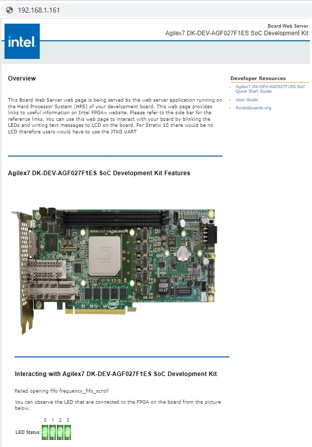

## Overview 

This page presents the Golden System Reference Design for the [Altera&reg; Agilex&trade; F-Series FPGA Development Kit (2x F-Tile)](https://www.intel.com/content/www/us/en/products/details/fpga/development-kits/agilex/f-series/dev-agf027-and-agf023.html). The GSRD demonstrates the following: 

- FPGA side 
  - LEDs connected to GPIO soft IP modules 
- HPS side 
  - Linux, booted by U-Boot and ATF 
  - Board web server 
  - Sample applications 
  - Hello world 
  - Controlling FPGA LEDs: blink, scroll, toggle 
  - System check application 

### Prerequisites 

The following are required in order to be able to fully exercise the GSRD: 

- Intel® Agilex&trade; F-Series FPGA Development Kit (2x F-Tile), ordering code DK-DEV-AGF027F1ES  (binaries included) or DK-DEV-AGF023FA (only source code inlcuded)
  - SD/MMC HPS Daughtercard 
  - Mini USB cable for serial output 
  - Micro USB cable for on-board Intel FPGA Download Cable II 
  - Micro SD card (4GB or greater) 
- Host PC with 
  - Linux - Ubuntu 22.04LTS was used to create this page, other versions and distributions may work too 
  - Serial terminal (for example Minicom on Linux and TeraTerm or PuTTY on Windows) 
  - Micro SD card slot or Micro SD card writer/reader 
  - Altera&reg; Quartus<sup>&reg;</sup> Prime Pro Edition Version 24.3.1 
- Local Ethernet network, with DHCP server (will be used to provide IP address to the board) 

The U-Boot and Linux compilation, Yocto compilation and creating the SD card image require a Linux host PC. The rest of the operations can be performed on either a Windows or Linux host PC. 

### Release Notes 

The Intel FPGA HPS Embedded Software release notes can be accessed from the following link: [https://github.com/altera-opensource/gsrd-socfpga/releases/tag/QPDS24.3.1_REL_GSRD_PR](https://github.com/altera-opensource/gsrd-socfpga/releases/tag/QPDS24.3.1_REL_GSRD_PR )

### Prebuilt Binaries for DK-DEV-AGF027F1ES

The GSRD binaries are located at [https://releases.rocketboards.org/2025.01/gsrd/agilex7_dk_dev_agf027f1es_gsrd/](https://releases.rocketboards.org/2025.01/gsrd/agilex7_dk_dev_agf027f1es_gsrd)

The source code is also included on the SD card in the Linux rootfs path `/home/root`: 

| File | Description | 
| :-- | :-- | 
| linux-socfpga-v6.6.51-lts-src.tar.gz | Source code for Linux kernel | 
| u-boot-socfpga-v2024.07-src.tar.gz | Source code for U-Boot | 
| arm-trusted-firmware-v2.11.1-src.tar.gz | Source code for Arm Trusted Firmware |  

Before downloading the hardware design please read the agreement in the link [https://www.intel.com/content/www/us/en/programmable/downloads/software/license/lic-prog_lic.html](https://www.intel.com/content/www/us/en/programmable/downloads/software/license/lic-prog_lic.html)

### Component Versions

Altera&reg; Quartus<sup>&reg;</sup> Prime Pro Edition Version 24.3.1 and the following software component versions are used to build the GSRD: 

| Component | Location | Branch | Commit ID/Tag |
| :-- | :-- | :-- | :-- |
| GHRD | [https://github.com/altera-opensource/ghrd-socfpga](https://github.com/altera-opensource/ghrd-socfpga) | master | QPDS24.3.1_REL_GSRD_PR |
| Linux | [https://github.com/altera-opensource/linux-socfpga](https://github.com/altera-opensource/linux-socfpga) | socfpga-6.6.51-lts | QPDS24.3.1_REL_GSRD_PR |
| Arm Trusted Firmware | [https://github.com/arm-trusted-firmware](https://github.com/arm-trusted-firmware) | socfpga_v2.11.1 | QPDS24.3.1_REL_GSRD_PR |
| U-Boot | [https://github.com/altera-opensource/u-boot-socfpga](https://github.com/altera-opensource/u-boot-socfpga) | socfpga_v2024.07 | QPDS24.3.1_REL_GSRD_PR |
| Yocto Project | [https://git.yoctoproject.org/poky](https://git.yoctoproject.org/poky) | styhead | latest | 
| Yocto Project: meta-intel-fpga | [https://git.yoctoproject.org/meta-intel-fpga](https://git.yoctoproject.org/meta-intel-fpga) | styhead | latest |
| Yocto Project: meta-intel-fpga-refdes | [https://github.com/altera-opensource/meta-intel-fpga-refdes](https://github.com/altera-opensource/meta-intel-fpga-refdes) | styhead | QPDS24.3.1_REL_GSRD_PR |

## Exercise GSRD

### Boot Linux 

#### Configure Board 

 

Set up the board switches: 

| Switch | Setting | 
| :-- | :-- | 
| SW1[1:4] | ON/OFF/OFF/OFF | 
| SW2 | ON | 
| SW3[1:4] | OFF/OFF/ON/OFF | 
| SW4[1:4] | OFF/OFF/OFF/OFF | 
| SW5 | OFF | 
| SW6 | OFF | 

For more details about the settings, consult the [Intel® Agilex&trade; F-Series FPGA (Two F-Tiles) Development Kit User Guide](https://www.intel.com/content/www/us/en/docs/programmable/739942/current/overview.html). 

#### Write QSPI Image 

1\. Download and extract the jic file: 

```bash 
cd $TOP_FOLDER 
wget https://releases.rocketboards.org2025.01/gsrd/agilex7_dk_dev_agf027f1es_gsrd/ghrd_agfb027r24c2e2v.jic.tar.gz 
tar xf ghrd_agfb027r24c2e2v.jic.tar.gz 
```

2\. Power up the board 

3\. Write the JIC file 

```bash 
quartus_pgm -c 1 -m jtag -o "pvi;ghrd_agfb027r24c2e2v.jic.tar" 
```

#### Write SD Card 

This section explains how to create the SD card necessary to boot Linux, using the SD card image available with the pre-built Linux binaries package. Once the SD card has been created, insert the card into the SD slot of the Micro SD daughter card. 

<h5> Write SD Card on Linux </h5>

1\. Download the SD card image and extract it: 

```bash 
wget https://releases.rocketboards.org/2025.01/gsrd/agilex7_dk_dev_agf027f1es_gsrd/sdimage.tar.gz 
tar xf sdimage.tar.gz 
```

The extacted file is named `gsrd-console-image-agilex.wic`. 

2\. Determine the device associated with the SD card on the host by running the following command before and after inserting the card. 

```bash 
$ cat /proc/partitions 
```

Let's assume it is /dev/sdx. 

3\. Use *dd* utility to write the SD image to the SD card. 

```bash 
$ sudo dd if=gsrd-console-image-agilex.wic of=/dev/sdx bs=1M 
```

Note we are using *sudo* to be able to write to the card. 

4\. Use *sync* utility to flush the changes to the SD card. 

```bash 
$ sudo sync 
```

<h5>  Write SD Card on Windows </h5>

1\. Download the SD card from [https://releases.rocketboards.org/2025.01/gsrd/agilex7_dk_dev_agf027f1es_gsrd/sdimage.tar.gz](https://releases.rocketboards.org/2025.01/agilex7_dk_dev_agf027f1es_gsrd/sdimage.tar.gz) and extract it. 

The extacted file is named `gsrd-console-image-agilex.wic`. 

2\. Rename the wic file as `sdcard.img` 

3\. Use Win32DiskImager to write the image to the SD card. The tool can be downloaded from [https://sourceforge.net/projects/win32diskimager/files/latest/download](https://sourceforge.net/projects/win32diskimager/files/latest/download)

 

#### Configure Serial Connection 

The OOBE Daughter Card has a built-in FTDI USB to Serial converter chip that allows the host computer to see the board as a virtual serial port. Ubuntu and other modern Linux distributions have built-in drivers for the FTDI USB to Serial converter chip, so no driver installation is necessary on those platforms. On Windows, the SoC EDS Pro installer automatically installs the required drivers if necessary. 

The serial communication parameters are: 

- Baud-rate: 115,200 
- Parity: none 
- Flow control: none 
- Stop bits: 1 

On Windows, utilities such as TeraTerm and PuTTY can be used to connect to the board. They are easily configured from the tool menus. 

On Linux, the minicom utility can be used. Here is how to configure it: 

1\. The virtual serial port is usually named /dev/ttyUSB0. In order to determine the device name associated with the virtual serial port on your host PC, please perform the following: 

- Use the following command to determine which USB serial devices are already installed: ls /dev/ttyUSB* 
- Connect mini USB cable from J7 to the PC. This will enable the PC to communicate with the board, even if the board is not powered yet. 
- Use the ls /dev/ttyUSB* command command again to determine which new USB serial device appeared. 
- Install **minicom** application on host PC, if not installed. 

- On Ubuntu, use *sudo apt-get install minicom* 
- Configure minicom. 

```bash 
$ sudo minicom -s 
```

Under **Serial Port Setup** choose the following: 

- Serial Device: **/dev/ttyUSB0** (edit to match the system as necessary) 
- Bps/Par/Bits: **115200 8N1** 
- Hardware Flow Control: **No** 
- Software Flow Control: **No** 
- Hit **[ESC]** to return to the main configuration menu 

Select **Save Setup as dfl** to save the default setup. Then select **Exit**. 

#### Boot Linux 

1\. Make sure to have the SD card inserted in the board slot. 

2\. Start serial terminal (when using Minicom it will connect using the selected settings, for others connect manually). 

3\. Set MSEL to ASx4/QSPI: 

4\. Power up the board 

5\. The device will be configurd, HPS will be loaded with the U-Boot SPL, which will then load ATF and U-Boot proper, then Linux will be booted. 

6\. Login using 'root' and no password.

7\. Run 'ifconfig' command to determine the IP of the board: 

```bash 
root@agilex7dkdevagf027f1es:~/intelFPGA# ifconfig 
eth0: flags=4163 mtu 1500 
 inet 192.168.1.161 netmask 255.255.255.0 broadcast 192.168.1.255 
 inet6 fe80::7cac:dff:fe64:88d9 prefixlen 64 scopeid 0x20 
 ether 7e:ac:0d:64:88:d9 txqueuelen 1000 (Ethernet) 
 RX packets 183 bytes 32164 (31.4 KiB) 
 RX errors 0 dropped 0 overruns 0 frame 0 
 TX packets 69 bytes 8864 (8.6 KiB) 
 TX errors 0 dropped 0 overruns 0 carrier 0 collisions 0 
 device interrupt 21 base 0x2000 
 
lo: flags=73 mtu 65536 
 inet 127.0.0.1 netmask 255.0.0.0 
 inet6 ::1 prefixlen 128 scopeid 0x10 
 loop txqueuelen 1000 (Local Loopback) 
 RX packets 100 bytes 8468 (8.2 KiB) 
 RX errors 0 dropped 0 overruns 0 frame 0 
 TX packets 100 bytes 8468 (8.2 KiB) 
 TX errors 0 dropped 0 overruns 0 carrier 0 collisions 0 
```

### Run Sample Applications 

#### Prerequisites 

1\. Boot Linux on the target board as described in [Booting Linux](https://www.rocketboards.org/foswiki/Documentation/AgilexSoCGSRDDEVAGF027#BootingLinux). You will not need to use the serial terminal if you plan on using ssh connection. 

2\. Connect to the board using one of the following options: 

- Connect using serial console, as described in [Booting Linux](https://www.rocketboards.org/foswiki/Documentation/AgilexSoCGSRDDEVAGF027#BootingLinux) 
- Connect using ssh, as described in [Connect Using SSH](https://www.rocketboards.org/foswiki/Documentation/AgilexSoCGSRDDEVAGF027#ConnectSSH) 

3\. In serial console, or ssh client console, change current folder to be */home/root/intelFPGA*. This is where the application binaries are stored. 

```bash 
root@agilex7dkdevagf027f1es:~# cd /home/root/intelFPGA/ 
```

#### Display Hello World Message 

Run the following command to display the Hello World message on the console: 

```bash 
root@agilex7dkdevagf027f1es:~/intelFPGA# ./hello 
Hello SoC FPGA!%ENDCOLOR 
```

#### Exercise Soft PIO Driver for LED Control 

The following green LEDs are exercised: 

- USER LED0 
- USER LED1 
- USER LED2 

Note: USER LED3 is always blinking, and cannot be controlled from software. 

1\. In order to blink an LED in a loop, with a specific delay in ms, run the following command: 

```bash 
./blink <led_number> <delay_ms> 
```

- The **led_number** specifies the desired LED, and is a value between 0 and 3. 
- The **delay_ms** is a number that specifies the desired delay in ms between turning the LED on and off. 

2\. In order to turn an individual LED on or off, run the following command: 

```bash 
./toggle <led_number> <state> 
```

- The **led_number** specifies the desired LED, and is a value between 0 and 3. 
- The **state** needs to be 0 to turn the LED off, and 1 to turn the LED on. 

3\. In order to scroll the FPGA LEDs with a specific delay, please run the following command: 

```bash 
./scroll_client <delay> 
```

The **delay** specifies the desired scrolling behavior: 

- **delay > 0** - specify new scrolling delay in ms, and start scrolling 
- **delay < 0** - stop scrolling 
- **delay = 0** - display current scroll delay 

#### System Check Application 

System check application provides a glance of system status of basic peripherals such as: 

- **USB**: USB device driver 
- **Network IP (IPv4)**: Network IP address 
- **HPS LEDs**: HPS LED state 
- **FPGA LEDs**: FPGA LED state 

Run the application by issuing the following command: 

```bash 
root@agilex7dkdevagf027f1es:~/intelFPGA# ./syschk 
```

The window will look as shown below - press 'q' to exit: 

```bash 
 ALTERA SYSTEM CHECK 
 
lo : 127.0.0.1 usb1 : DWC OTG Controller 
eth0 : 192.168.1.161 
 serial@ffc02100 : disabled 
fpga_led2 : OFF serial@ffc02000 : okay 
hps_led2 : OFF 
fpga_led0 : ON 
hps_led0 : OFF 
fpga_led3 : ON 
fpga_led1 : OFF 
hps_led1 : OFF 
```

### Connect to Board Web Server and SSH Client 

#### Connect to Web Server 

1\. Boot Linux as described in [Booting Linux](https://www.rocketboards.org/foswiki/Documentation/AgilexSoCGSRDDEVAGF027#BootingLinux). 

2\. Determine the IP address of the board using 'ifconfig' as shown above. Note there will be network interfaces of them, either can be used. 

3\. Open a web browser on the host PC and type *http://* on the address box, then type the IP of your board and hit Enter. 

 

4\. In the section named **Interacting with Agilex SoC Development Kit** you can perform the following actions: 

- See which LEDs are ON and which are off in the **LED Status**. Note that if the LEDs are setup to be scrolling, the displayed scrolling speed will not match the actual scrolling speed on the board. 
- Stop LEDs from scrolling, by clicking **START** and **STOP** buttons. The delay between LEDs turning ON and OFF is set in the **LED Lightshow** box. 
- Turn individual LEDs ON and OFF with the **ON** and **OFF** buttons. Note that this action is only available when the LED scrolling/lightshow is stopped. 
- Blink individual LEDs by typing a delay value in ms then clicking the corresponding **BLINK** button. Note that this action is only available when the LED scrolling/lightshow is stopped. 

#### Connect Using SSH 

1\. The lower bottom of the web page presents instructions on how to connect to the board using an SSH connection. 

 

2\. If the SSH client is not installed on your host computer, you can install it by running the following command on CentOS: 

```bash 
$ sudo yum install openssh-clients 
```

or the following command on Ubuntu: 

```bash 
$ sudo apt-get install openssh-client 
```

3\. Connect to the board, and run some commands, such as **pwd**, **ls** and **uname** to see Linux in action: 

```bash 
ssh root@192.168.1.161 
```

## Rebuild GSRD for DK-DEV-AGF027F1ES


### Build Flow 

The following diagram illustrates the full build flow for the GSRD based on source code from GitHub. 

 

### Set up Environment 


Create a top folder for this example, as the rest of the commands assume this location: 


```bash 
sudo rm -rf agilex7f_fpga.gsrd 
mkdir agilex7f_fpga.gsrd 
cd agilex7f_fpga.gsrd 
export TOP_FOLDER=$(pwd) 
```


Download the compiler toolchain, add it to the PATH variable, to be used by the GHRD makefile to build the HPS Debug FSBL:


```bash
cd $TOP_FOLDER
wget https://developer.arm.com/-/media/Files/downloads/gnu/11.2-2022.02/binrel/\
gcc-arm-11.2-2022.02-x86_64-aarch64-none-linux-gnu.tar.xz
tar xf gcc-arm-11.2-2022.02-x86_64-aarch64-none-linux-gnu.tar.xz
rm -f gcc-arm-11.2-2022.02-x86_64-aarch64-none-linux-gnu.tar.xz
export PATH=`pwd`/gcc-arm-11.2-2022.02-x86_64-aarch64-none-linux-gnu/bin:$PATH
export ARCH=arm64
export CROSS_COMPILE=aarch64-none-linux-gnu-
```

Enable Quartus tools to be called from command line:


```bash
export QUARTUS_ROOTDIR=~/intelFPGA_pro/24.3.1/quartus/
export PATH=$QUARTUS_ROOTDIR/bin:$QUARTUS_ROOTDIR/linux64:$QUARTUS_ROOTDIR/../qsys/bin:$PATH
```


### Build Hardware Design 


Use the following commands to build the hardware design: 


```bash 
cd $TOP_FOLDER 
rm -rf ghrd-socfpga agilex_soc_devkit_ghrd 
git clone -b QPDS24.3.1_REL_GSRD_PR https://github.com/altera-opensource/ghrd-socfpga 
mv ghrd-socfpga/agilex_soc_devkit_ghrd . 
rm -rf ghrd-socfpga 
cd agilex_soc_devkit_ghrd 
make BOARD_TYPE=devkit_fm86 BOARD_PWRMGT=linear QUARTUS_DEVICE=AGFB027R24C2E2VR2 generate_from_tcl all
cd .. 
```


The following files are created: 

- `$TOP_FOLDER/agilex_soc_devkit_ghrd/output_files/ghrd_agfb027r24c2e2vr2_hps_debug.sof` - FPGA configuration file, without HPS FSBL 
- `$TOP_FOLDER/agilex_soc_devkit_ghrd/software/hps_debug/hps_debug.ihex` - HPS Debug FSBL 
- `$TOP_FOLDER/agilex_soc_devkit_ghrd/output_files/ghrd_gfb027r24c2e2vr2_hps_debug.sof` - FPGA configuration file, with HPS Debug FSBL 


### Build Core RBF 


Create the Core RBF file to be used in the rootfs created by Yocto by using the HPS Debug SOF built by the GHRD makefile: 


```bash 
cd $TOP_FOLDER 
rm -f *jic* *rbf* 
quartus_pfg -c agilex_soc_devkit_ghrd/output_files/ghrd_agfb027r24c2e2vr2_hps_debug.sof \ 
 ghrd_agfb027r24c2e2vr2.jic \ 
 -o device=MT25QU02G \ 
 -o flash_loader=AGFB027R24C2E2VR2 \ 
 -o mode=ASX4 \ 
 -o hps=1 
rm ghrd_agfb027r24c2e2vr2.hps.jic 
```


The following files will be created: 

- `$TOP_FOLDER/ghrd_agfb027r24c2e2vr2.core.rbf` - HPS First configuration bitstream, phase 2: FPGA fabric 

Note we are also creating an HPS JIC file, but we are discarding it, as it has the HPS Debug FSBL, while the final image needs to have the U-Boot SPL created by the Yocto recipes. 


### Set Up Yocto

1\. Make sure you have Yocto system requirements met: https://docs.yoctoproject.org/5.0.1/ref-manual/system-requirements.html#supported-linux-distributions.

The command to install the required packages on Ubuntu 22.04 is:

```bash
sudo apt-get update
sudo apt-get upgrade
sudo apt-get install openssh-server mc libgmp3-dev libmpc-dev gawk wget git diffstat unzip texinfo gcc \
build-essential chrpath socat cpio python3 python3-pip python3-pexpect xz-utils debianutils iputils-ping \
python3-git python3-jinja2 libegl1-mesa libsdl1.2-dev pylint xterm python3-subunit mesa-common-dev zstd \
liblz4-tool git fakeroot build-essential ncurses-dev xz-utils libssl-dev bc flex libelf-dev bison xinetd \
tftpd tftp nfs-kernel-server libncurses5 libc6-i386 libstdc++6:i386 libgcc++1:i386 lib32z1 \
device-tree-compiler curl mtd-utils u-boot-tools net-tools swig -y
```

On Ubuntu 22.04 you will also need to point the /bin/sh to /bin/bash, as the default is a link to /bin/dash:

```bash
 sudo ln -sf /bin/bash /bin/sh
```

**Note**: You can also use a Docker container to build the Yocto recipes, refer to https://rocketboards.org/foswiki/Documentation/DockerYoctoBuild for details. When using a Docker container, it does not matter what Linux distribution or packages you have installed on your host, as all dependencies are provided by the Docker container.

**Note**: You can also use a Docker container to build the Yocto recipes, refer to https://rocketboards.org/foswiki/Documentation/DockerYoctoBuild for details. When using a Docker container, it does not matter what Linux distribution or packages you have installed on your host, as all dependencies are provided by the Docker container. 

2\. Clone the Yocto script and prepare the build: 


```bash 
cd $TOP_FOLDER 
rm -rf gsrd_socfpga 
git clone -b QPDS24.3.1_REL_GSRD_PR https://github.com/altera-opensource/gsrd_socfpga 
cd gsrd_socfpga 
. agilex7_dk_dev_agf027f1es-gsrd-build.sh 
build_setup 
```


### Customize Yocto

1\. Copy the rebuilt files to `$WORKSPACE/meta-intel-fpga-refdes/recipes-bsp/ghrd/files` using the following names, as expected by the yocto recipes: 

- agilex7_dk_dev_agf027f1es_gsrd_ghrd.core.rbf - core rbf file for configuring the fabric 

In our case we just copy the core.ghrd file in the Yocto recipe location: 


```bash 
CORE_RBF=$WORKSPACE/meta-intel-fpga-refdes/recipes-bsp/ghrd/files/agilex7_dk_dev_agf027f1es_gsrd_ghrd.core.rbf 
ln -s $TOP_FOLDER/ghrd_agfb027r24c2e2vr2.core.rbf $CORE_RBF 
```


2\. In the Yocto recipe `$WORKSPACE/meta-intel-fpga-refdes/recipes-bsp/ghrd/hw-ref-design.bb` modify the agilex_gsrd_code file location: 

```bash 
SRC_URI:agilex7_dk_dev_agf027f1es ?= "\ 
 ${GHRD_REPO}/agilex7_dk_dev_agf027f1es_gsrd_${ARM64_GHRD_CORE_RBF};name=agilex7_dk_dev_agf027f1es_gsrd_core\ 
 " 
```

to look like this: 

```bash 
SRC_URI:agilex7_dk_dev_agf027f1es ?= "\ 
 file://agilex7_dk_dev_agf027f1es_gsrd_ghrd.core.rbf \ 
 " 
```

using the following commands: 


```bash 
OLD_URI="\${GHRD_REPO}\/agilex7_dk_dev_agf027f1es_gsrd_\${ARM64_GHRD_CORE_RBF};name=agilex7_dk_dev_agf027f1es_gsrd_core" 
NEW_URI="file:\/\/agilex7_dk_dev_agf027f1es_gsrd_ghrd.core.rbf" 
sed -i "s/$OLD_URI/$NEW_URI/g" $WORKSPACE/meta-intel-fpga-refdes/recipes-bsp/ghrd/hw-ref-design.bb 
```


3\. In the same Yocto recipe update the SHA256 checksum for the file: 

```bash 
SRC_URI[agilex7_dk_dev_agf027f1es_gsrd_core.sha256sum] = "e11a2068f96882a07c6ad7c3614ab6f53a5122834e58defd0a975a61ac176ccf" 
```

by using the following commands: 


```bash 
CORE_SHA=$(sha256sum $CORE_RBF | cut -f1 -d" ") 
OLD_SHA="SRC_URI\[agilex7_dk_dev_agf027f1es_gsrd_core\.sha256sum\] = .*" 
NEW_SHA="SRC_URI[agilex7_dk_dev_agf027f1es_gsrd_core.sha256sum] = \"$CORE_SHA\"" 
sed -i "s/$OLD_SHA/$NEW_SHA/g" $WORKSPACE/meta-intel-fpga-refdes/recipes-bsp/ghrd/hw-ref-design.bb 
```


4\. Optionally change the following files in `$WORKSPACE/meta-intel-fpga-refdes/recipes-bsp/u-boot/files/`: 

- [uboot.txt](https://github.com/altera-opensource/meta-intel-fpga-refdes/blob/master/recipes-bsp/u-boot/files/uboot.txt) - distroboot script 
- [uboot_script.its](https://github.com/altera-opensource/meta-intel-fpga-refdes/blob/master/recipes-bsp/u-boot/files/uboot_script.its) - its file for creating FIT image from the above script 

5\. Optionally change the following file in `$WORKSPACE/meta-intel-fpga-refdes/recipes-kernel/linux/linux-socfpga-lts`: 

- [fit_kernel_agilex7_dk_dev_agf027f1es.its](https://github.com/altera-opensource/meta-intel-fpga-refdes/blob/master/recipes-kernel/linux/linux-socfpga-lts/fit_kernel_agilex7_dk_dev_agf027f1es.its) - its file for creating the kernel.itb image 


### Build Yocto 


```bash 
bitbake_image 
```


Gather files: 


```bash 
package 
```


Once the build is completed successfully, you will see the following two folders are created: 

- `agilex7_dk_dev_agf027f1es-gsrd-rootfs`: area used by OpenEmbedded build system for builds. Description of build directory structure - https://docs.yoctoproject.org/ref-manual/structure.html#the-build-directory-build 
- `agilex7_dk_dev_agf027f1es-gsrd-images`: the build script copies here relevant files built by Yocto from the `agilex7_dk_dev_agf027f1es-gsrd-rootfs/tmp/deploy/images/agilex7_dk_dev_agf027f1es/` folder, but also other relevant files. 

The two most relevant files created in the `$TOP_FOLDER/gsrd_socfpga/agilex-gsrd-images` folder are: 

| File | Description | 
| :-- | :-- | 
| sdimage.tar.gz | SD Card Image, to be written on SD card | 
| u-boot-agilex7-socdk-gsrd-atf/u-boot-spl-dtb.hex | U-Boot SPL Hex file, to be used for generating the bootable SOF file | 


### Create JIC File 


The bootable JIC image will contain the FPGA configuration data and the HPS FSBL and it can be built using the following command: 


```bash 
cd $TOP_FOLDER 
rm -f *jic* *rbf* 
quartus_pfg -c agilex_soc_devkit_ghrd/output_files/ghrd_agfb027r24c2e2vr2.sof \ 
 ghrd_agfb027r24c2e2vr2.jic \ 
 -o hps_path=gsrd_socfpga/agilex7_dk_dev_agf027f1es-gsrd-images/u-boot-agilex7-socdk-gsrd-atf/u-boot-spl-dtb.hex \ 
 -o device=MT25QU02G \ 
 -o flash_loader=AGFB027R24C2E2VR2 \ 
 -o mode=ASX4 \ 
 -o hps=1 
```


The following files will be created: 

- $TOP_FOLDER/ghrd_agfb027r24c2e2vr2.hps.jic - JIC file to configure the device for HPS first, phase 1 


## Build GSRD for DK-DEV-AGF023FA

Note: these are preliminary build instructions, obtained by changing the part number in the DK-DEV-AGF027F1ES GSRD instructions, as the boards are very similar. In the future the board will be directly supported, including prebuilt binaries.


### Build Flow 

The following diagram illustrates the full build flow for the GSRD based on source code from GitHub. 

 

### Set up Environment 


Create a top folder for this example, as the rest of the commands assume this location: 


```bash 
sudo rm -rf agilex7f_fpga_prod.gsrd 
mkdir agilex7f_fpga_prod.gsrd 
cd agilex7f_fpga_prod.gsrd 
export TOP_FOLDER=$(pwd) 
```


Download the compiler toolchain, add it to the PATH variable, to be used by the GHRD makefile to build the HPS Debug FSBL:


```bash
cd $TOP_FOLDER
wget https://developer.arm.com/-/media/Files/downloads/gnu/11.2-2022.02/binrel/\
gcc-arm-11.2-2022.02-x86_64-aarch64-none-linux-gnu.tar.xz
tar xf gcc-arm-11.2-2022.02-x86_64-aarch64-none-linux-gnu.tar.xz
rm -f gcc-arm-11.2-2022.02-x86_64-aarch64-none-linux-gnu.tar.xz
export PATH=`pwd`/gcc-arm-11.2-2022.02-x86_64-aarch64-none-linux-gnu/bin:$PATH
export ARCH=arm64
export CROSS_COMPILE=aarch64-none-linux-gnu-
```

Enable Quartus tools to be called from command line:


```bash
export QUARTUS_ROOTDIR=~/intelFPGA_pro/24.3.1/quartus/
export PATH=$QUARTUS_ROOTDIR/bin:$QUARTUS_ROOTDIR/linux64:$QUARTUS_ROOTDIR/../qsys/bin:$PATH
```


### Build Hardware Design 


Use the following commands to build the hardware design: 


```bash 
cd $TOP_FOLDER 
rm -rf ghrd-socfpga agilex_soc_devkit_ghrd 
git clone -b QPDS24.3.1_REL_GSRD_PR https://github.com/altera-opensource/ghrd-socfpga 
mv ghrd-socfpga/agilex_soc_devkit_ghrd . 
rm -rf ghrd-socfpga 
cd agilex_soc_devkit_ghrd 
make BOARD_TYPE=devkit_fm86 BOARD_PWRMGT=linear QUARTUS_DEVICE=AGFD023R24C2E1VC generate_from_tcl all 
cd .. 
```


The following files are created: 

- `$TOP_FOLDER/agilex_soc_devkit_ghrd/output_files/ghrd_agfd023r24c2e1vc_hps_debug.sof` - FPGA configuration file, without HPS FSBL 
- `$TOP_FOLDER/agilex_soc_devkit_ghrd/software/hps_debug/hps_debug.ihex` - HPS Debug FSBL 
- `$TOP_FOLDER/agilex_soc_devkit_ghrd/output_files/ghrd_gfb027r24c2e2vr2_hps_debug.sof` - FPGA configuration file, with HPS Debug FSBL 


### Build Core RBF 


Create the Core RBF file to be used in the rootfs created by Yocto by using the HPS Debug SOF built by the GHRD makefile: 


```bash 
cd $TOP_FOLDER 
rm -f *jic* *rbf* 
quartus_pfg -c agilex_soc_devkit_ghrd/output_files/ghrd_agfd023r24c2e1vc_hps_debug.sof \ 
 ghrd_agfd023r24c2e1vc.jic \ 
 -o device=MT25QU02G \ 
 -o flash_loader=AGFB027R24C2E2VR2 \ 
 -o mode=ASX4 \ 
 -o hps=1 
rm ghrd_agfd023r24c2e1vc.hps.jic 
```


The following files will be created: 

- `$TOP_FOLDER/ghrd_agfd023r24c2e1vc.core.rbf` - HPS First configuration bitstream, phase 2: FPGA fabric 

Note we are also creating an HPS JIC file, but we are discarding it, as it has the HPS Debug FSBL, while the final image needs to have the U-Boot SPL created by the Yocto recipes. 


### Set Up Yocto

1\. Make sure you have Yocto system requirements met: https://docs.yoctoproject.org/5.0.1/ref-manual/system-requirements.html#supported-linux-distributions.

The command to install the required packages on Ubuntu 22.04 is:

```bash
sudo apt-get update
sudo apt-get upgrade
sudo apt-get install openssh-server mc libgmp3-dev libmpc-dev gawk wget git diffstat unzip texinfo gcc \
build-essential chrpath socat cpio python3 python3-pip python3-pexpect xz-utils debianutils iputils-ping \
python3-git python3-jinja2 libegl1-mesa libsdl1.2-dev pylint xterm python3-subunit mesa-common-dev zstd \
liblz4-tool git fakeroot build-essential ncurses-dev xz-utils libssl-dev bc flex libelf-dev bison xinetd \
tftpd tftp nfs-kernel-server libncurses5 libc6-i386 libstdc++6:i386 libgcc++1:i386 lib32z1 \
device-tree-compiler curl mtd-utils u-boot-tools net-tools swig -y
```

On Ubuntu 22.04 you will also need to point the /bin/sh to /bin/bash, as the default is a link to /bin/dash:

```bash
 sudo ln -sf /bin/bash /bin/sh
```

**Note**: You can also use a Docker container to build the Yocto recipes, refer to https://rocketboards.org/foswiki/Documentation/DockerYoctoBuild for details. When using a Docker container, it does not matter what Linux distribution or packages you have installed on your host, as all dependencies are provided by the Docker container.

**Note**: You can also use a Docker container to build the Yocto recipes, refer to https://rocketboards.org/foswiki/Documentation/DockerYoctoBuild for details. When using a Docker container, it does not matter what Linux distribution or packages you have installed on your host, as all dependencies are provided by the Docker container. 

2\. Clone the Yocto script and prepare the build: 


```bash 
cd $TOP_FOLDER 
rm -rf gsrd_socfpga 
git clone -b QPDS24.3.1_REL_GSRD_PR https://github.com/altera-opensource/gsrd_socfpga 
cd gsrd_socfpga 
. agilex7_dk_dev_agf027f1es-gsrd-build.sh 
build_setup 
```


### Customize Yocto

1\. Copy the rebuilt files to `$WORKSPACE/meta-intel-fpga-refdes/recipes-bsp/ghrd/files` using the following names, as expected by the yocto recipes: 

- agilex7_dk_dev_agf027f1es_gsrd_ghrd.core.rbf - core rbf file for configuring the fabric 

In our case we just copy the core.ghrd file in the Yocto recipe location: 


```bash 
CORE_RBF=$WORKSPACE/meta-intel-fpga-refdes/recipes-bsp/ghrd/files/agilex7_dk_dev_agf027f1es_gsrd_ghrd.core.rbf 
ln -s $TOP_FOLDER/ghrd_agfd023r24c2e1vc.core.rbf $CORE_RBF 
```


2\. In the Yocto recipe `$WORKSPACE/meta-intel-fpga-refdes/recipes-bsp/ghrd/hw-ref-design.bb` modify the agilex_gsrd_code file location: 

```bash 
SRC_URI:agilex7_dk_dev_agf027f1es ?= "\ 
 ${GHRD_REPO}/agilex7_dk_dev_agf027f1es_gsrd_${ARM64_GHRD_CORE_RBF};name=agilex7_dk_dev_agf027f1es_gsrd_core\ 
 " 
```

to look like this: 

```bash 
SRC_URI:agilex7_dk_dev_agf027f1es ?= "\ 
 file://agilex7_dk_dev_agf027f1es_gsrd_ghrd.core.rbf \ 
 " 
```

using the following commands: 


```bash 
OLD_URI="\${GHRD_REPO}\/agilex7_dk_dev_agf027f1es_gsrd_\${ARM64_GHRD_CORE_RBF};name=agilex7_dk_dev_agf027f1es_gsrd_core" 
NEW_URI="file:\/\/agilex7_dk_dev_agf027f1es_gsrd_ghrd.core.rbf" 
sed -i "s/$OLD_URI/$NEW_URI/g" $WORKSPACE/meta-intel-fpga-refdes/recipes-bsp/ghrd/hw-ref-design.bb 
```


3\. In the same Yocto recipe update the SHA256 checksum for the file: 

```bash 
SRC_URI[agilex7_dk_dev_agf027f1es_gsrd_core.sha256sum] = "e11a2068f96882a07c6ad7c3614ab6f53a5122834e58defd0a975a61ac176ccf" 
```

by using the following commands: 


```bash 
CORE_SHA=$(sha256sum $CORE_RBF | cut -f1 -d" ") 
OLD_SHA="SRC_URI\[agilex7_dk_dev_agf027f1es_gsrd_core\.sha256sum\] = .*" 
NEW_SHA="SRC_URI[agilex7_dk_dev_agf027f1es_gsrd_core.sha256sum] = \"$CORE_SHA\"" 
sed -i "s/$OLD_SHA/$NEW_SHA/g" $WORKSPACE/meta-intel-fpga-refdes/recipes-bsp/ghrd/hw-ref-design.bb 
```


4\. Optionally change the following files in `$WORKSPACE/meta-intel-fpga-refdes/recipes-bsp/u-boot/files/`: 

- [uboot.txt](https://github.com/altera-opensource/meta-intel-fpga-refdes/blob/master/recipes-bsp/u-boot/files/uboot.txt) - distroboot script 
- [uboot_script.its](https://github.com/altera-opensource/meta-intel-fpga-refdes/blob/master/recipes-bsp/u-boot/files/uboot_script.its) - its file for creating FIT image from the above script 

5\. Optionally change the following file in `$WORKSPACE/meta-intel-fpga-refdes/recipes-kernel/linux/linux-socfpga-lts`: 

- [fit_kernel_agilex7_dk_dev_agf027f1es.its](https://github.com/altera-opensource/meta-intel-fpga-refdes/blob/master/recipes-kernel/linux/linux-socfpga-lts/fit_kernel_agilex7_dk_dev_agf027f1es.its) - its file for creating the kernel.itb image 


### Build Yocto 

Remove reference to patch which was retired after 24.2 tag was applied: 


```bash 
bitbake_image 
```


Gather files: 


```bash 
package 
```


Once the build is completed successfully, you will see the following two folders are created: 

- `agilex7_dk_dev_agf027f1es-gsrd-rootfs`: area used by OpenEmbedded build system for builds. Description of build directory structure - https://docs.yoctoproject.org/ref-manual/structure.html#the-build-directory-build 
- `agilex7_dk_dev_agf027f1es-gsrd-images`: the build script copies here relevant files built by Yocto from the `agilex7_dk_dev_agf027f1es-gsrd-rootfs/tmp/deploy/images/agilex7_dk_dev_agf027f1es/` folder, but also other relevant files. 

The two most relevant files created in the `$TOP_FOLDER/gsrd_socfpga/agilex-gsrd-images` folder are: 

| File | Description | 
| :-- | :-- | 
| sdimage.tar.gz | SD Card Image, to be written on SD card | 
| u-boot-agilex7-socdk-gsrd-atf/u-boot-spl-dtb.hex | U-Boot SPL Hex file, to be used for generating the bootable SOF file | 


### Create JIC File 


The bootable JIC image will contain the FPGA configuration data and the HPS FSBL and it can be built using the following command: 


```bash 
cd $TOP_FOLDER 
rm -f *jic* *rbf* 
quartus_pfg -c agilex_soc_devkit_ghrd/output_files/ghrd_agfd023r24c2e1vc.sof \ 
 ghrd_agfd023r24c2e1vc.jic \ 
 -o hps_path=gsrd_socfpga/agilex7_dk_dev_agf027f1es-gsrd-images/u-boot-agilex7-socdk-gsrd-atf/u-boot-spl-dtb.hex \ 
 -o device=MT25QU02G \ 
 -o flash_loader=AGFB027R24C2E2VR2 \ 
 -o mode=ASX4 \ 
 -o hps=1 
```


The following files will be created: 

- $TOP_FOLDER/ghrd_agfd023r24c2e1vc.hps.jic - JIC file to configure the device for HPS first, phase 1 


## Reconfigure Core Fabric from U-Boot 

The GSRD configures the FPGA core fabric only once, from U-Boot, by using the **bootm** command. 

**Important** : If the FPGA fabric is already configured and bridges are enabled, you must call the **bridge disable** command from U-Boot before issuing the **bootm** or **fppga load** commands to reconfigure the fabric. Only do this if you are using an **arm-trusted-firmware** version more recent than the following: 

- v2.7.1 = https://github.com/altera-opensource/arm-trusted-firmware/commit/0a5edaed853e0dc1e687706ccace8e844b2a8db7 
- v2.8.0 = https://github.com/altera-opensource/arm-trusted-firmware/commit/bf933536d4582d63d0e29434e807a641941f3937

## Notices & Disclaimers

Altera<sup>&reg;</sup> Corporation technologies may require enabled hardware, software or service activation.
No product or component can be absolutely secure. 
Performance varies by use, configuration and other factors.
Your costs and results may vary. 
You may not use or facilitate the use of this document in connection with any infringement or other legal analysis concerning Altera or Intel products described herein. You agree to grant Altera Corporation a non-exclusive, royalty-free license to any patent claim thereafter drafted which includes subject matter disclosed herein.
No license (express or implied, by estoppel or otherwise) to any intellectual property rights is granted by this document, with the sole exception that you may publish an unmodified copy. You may create software implementations based on this document and in compliance with the foregoing that are intended to execute on the Altera or Intel product(s) referenced in this document. No rights are granted to create modifications or derivatives of this document.
The products described may contain design defects or errors known as errata which may cause the product to deviate from published specifications.  Current characterized errata are available on request.
Altera disclaims all express and implied warranties, including without limitation, the implied warranties of merchantability, fitness for a particular purpose, and non-infringement, as well as any warranty arising from course of performance, course of dealing, or usage in trade.
You are responsible for safety of the overall system, including compliance with applicable safety-related requirements or standards. 
<sup>&copy;</sup> Altera Corporation.  Altera, the Altera logo, and other Altera marks are trademarks of Altera Corporation.  Other names and brands may be claimed as the property of others. 

OpenCL* and the OpenCL* logo are trademarks of Apple Inc. used by permission of the Khronos Group™. 