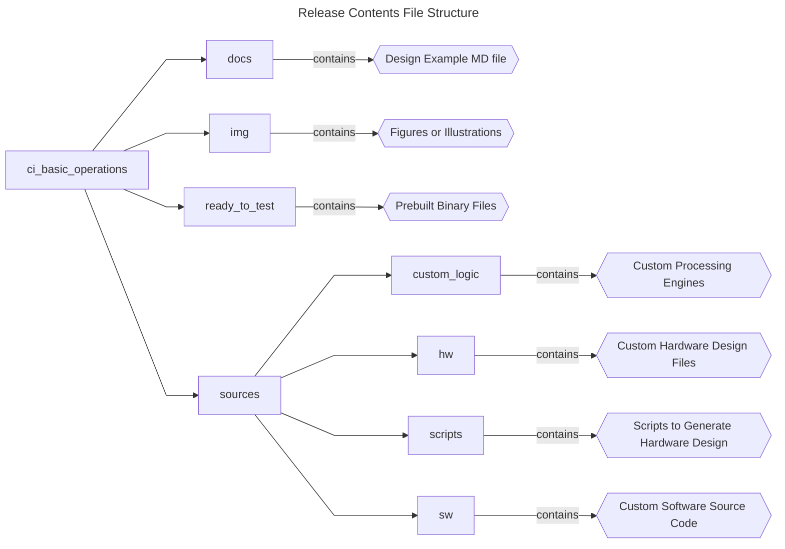
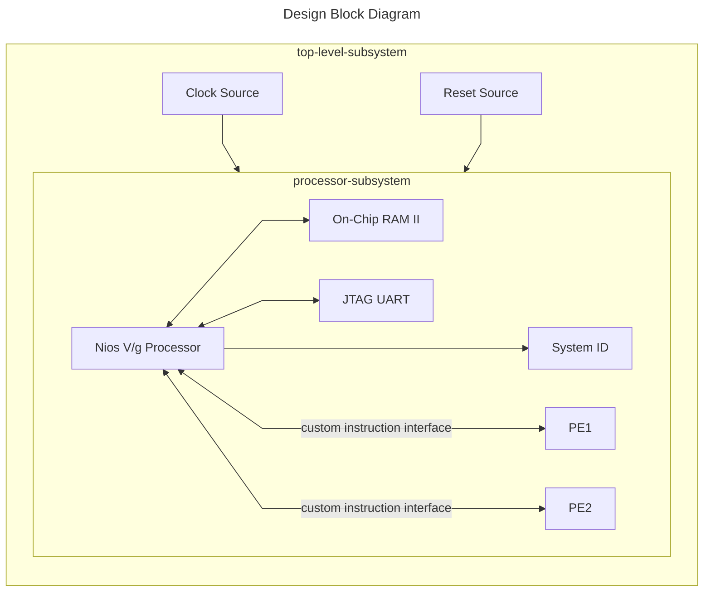

## Introduction

### Nios® V/g Basic Custom Instruction Example Design Overview

 This design demonstrates a basic application of custom processing engine blocks with Nios® V/g processor custom instruction in Agilex® 7 FPGA F-Series Development Kit. </br>
 The design is built with basic peripherals required for basic application execution:

 - JTAG UART for serial output.

### Prerequisites

 - Agilex® 7 FPGA F-Series Development Kit, ordering code DK-DEV-AGF014EA. </br> Refer to the board documentation for more information about the development kit.
 - Mini and Micro USB Cable. Included with the development kit.
 - Host PC with 64 GB of RAM. Less will be fine for only exercising the prebuilt binaries, and not rebuilding the design.
 - Quartus® Prime Pro Edition Software version 25.1.1
 - Ashling* RiscFree* IDE for Altera® FPGAs
 
### Release Contents  

Every Nios V processor design example is maintained based on this folder structure. </br>
Here is the Github link to root directory of this design example: [Nios® V/g Basic Custom Instruction Example Design Github link](https://github.com/altera-fpga/agilex7f-nios-ed/tree/rel/25.1.1/agf014ea-dev-devkit/niosv_g/ci_basic_operations)



## Nios® V/g Basic Custom Instruction Design Architecture
 This example design includes a Nios® V/g processor connected to two custom processing engine blocks (PE1 and PE2), a On-Chip RAM II, JTAG UART IP, and System ID peripheral core. </br>
 The objective of the design is to execute unique instruction supported within the PEs. </br>

 Both PEs contain the exact same unique instructions, but with different C Macros.

 | Unique Instruction in PE | PE1 | PE2 |
   |-|-|-|
   |1’s complement of Data1|basic_operations(Data1,0,**0**,0)|**comp_1s**(Data1,0,0)|
   |2’s complement of Data1|basic_operations(Data1,0,**1**,0)|**comp_2s**(Data1,0,0)|
   |Multiply Data1 with Data2|basic_operations(Data1,Data2,**2**,0)|**multiply**(Data1,Data2,0)|
   |Bit reversal of Data1|basic_operations(Data1,0x00,**3**,0)|**bit_reversal**(Data1,0x00,0)|
   |Byte reversal of Data1|basic_operations(Data1, 0x00,**4**,0)|**byte_reversal**(Data1, 0x00,0)|
   |Word reversal of Data1|basic_operations(Data1, 0x00,**5**,0)|**word_reversal**(Data1, 0x00,0)|
   |Lower word merge of Data1 and Data2|basic_operations(Data1,Data2,**6**,0)|**merge_lower**(Data1,Data2,0)|
   |Higher word merge of Data1 and Data2|basic_operations(Data1,Data2,**7**,0)|**merge_higher**(Data1,Data2,0)|
   ||||



### Nios® V/g Processor IP
- General-purpose 32-bit CPU for high performance applications with larger logic area utilization.
- Implements RV32IMZicsr_Zicbom instruction set (optionally with “F” and "Smclic" extension) instruction set.
- Supports five-stages pipelined datapath.
- It is a customizable soft-core processor, that can be tailored to meet specific application requirements, providing flexibility and scalability in embedded system designs.
 
### Embedded Peripheral IP Cores
The following embedded peripheral IPs are used in this design:

- On-Chip RAM II IP
- JTAG UART IP
- System ID IP

### System Components
The following components are used in this design:

- Clock Source (Clock Bridge with IO PLL)
- Reset Source (Reset Release IP)

### Nios® V Processor Address Map Details
 |Address Offset	|Size (Bytes)	|Peripheral	| Description|
  |-|-|-|-|
  |0x0000_0000|650KB|On-Chip RAM|To store application|
  |0x0011_0040|8|JTAG UART|Communication between a host PC and the Nios V processor system|
  |0x0021_2040|8|System ID|Hardware configuration system ID (0xA9B8C7D6)|
  ||||

## Development Kit Setup

Refer to [Agilex® 7 FPGA F-Series Development Kit User Guide](https://www.altera.com/products/devkit/a1jui0000061rlpmay/agilex-7-fpga-f-series-development-kit-p-tile-and-e-tile-rev) to setup the development kit.


## Exercising Prebuilt Binaries

### Program Hardware Binary SOF
1. Connect the development kit to the host PC using USB Blaster II.
2. Change the JTAG clock frequency to 6 MHz, and probe the JTAGServer to get the JTAG scan chain.
3. Execute the quartus_pgm command to program the SOF file with the correct device number. </br>Based on the JTAG scan chain below, the FPGA is at device number 1. You may require to provide a different device number if your JTAG chain is different from the given example.

```console
jtagconfig --setparam 1 JtagClock 6M
jtagconfig -d
quartus_pgm --cable=1 -m jtag -o 'p;ready_to_test/niosv_custom_instruction.sof@1'
```

For example:
```console
1) AGF FPGA Development Kit
  C341A0DD   AGFB014R24A(.|R1|R2)/.. (IR=10)
  020D10DD   VTAP10 (IR=10)
    Design hash    5FDC6B667C01E6ADD7A4
    + Node 0C206E00  JTAG PHY #0
 
  Captured DR after reset = (4BA064770364F0DD020D10DD) [96]
  Captured IR after reset = (100555) [24]
  Captured Bypass after reset = (0) [3]
  Captured Bypass chain = (0) [3]
  JTAG clock speed auto-adjustment is enabled. To disable, set JtagClockAutoAdjust parameter to 0
  JTAG clock speed 6 MHz
```


### Program Software Image ELF
1. Ensure that the development kit is successfully configured with the Hardware Binary SOF file.
2. Launch the Nios V Command Shell. You may skip this if the shell is active.
3. Execute the following command to download the ELF file.

```console
niosv-shell
niosv-download -g ready_to_test/app.elf -c 1
```

### Run Serial Console
You may proceed to to display the application printouts, and verify the design.

```console
juart-terminal -d 1 -c 1 -i 0 
```

For example, you should see similar display at the start of the application.


## Rebuilding the Design 

### Generate Hardware Binary SOF
Run the following command in the terminal from the *source* directory. </br> 
Copy the custom IP in the hw directory, and execute the build script. </br>
The script performs the following tasks, which generates the hardware binary SOF file of this design.

1. Create a new project
2. Create a new Platform Designer system
3. Configure assignments and constraints
4. Compile the project
5. Generate a hardware binary SOF file
 
```console
cp -a custom_logic/. hw 
quartus_py ./scripts/build_sof.py
```

### Generate Software Image ELF
After the hardware binary SOF file is ready, you may begin building the software design. </br>
It consists of the following steps:

1. Create a board support package (BSP) project.
2. Create a Nios® V processor application project with the example source codes.
3. Build the custom instruction application.
4. Generate a software image ELF file.

Launch the Nios V Command Shell. You may skip this if the shell is active. </br>
Run the following command in the shell from the *source* directory.
```console
niosv-shell

niosv-bsp -c --quartus-project=hw/niosv_custom_instruction.qpf --qsys=hw/sys.qsys --type=hal sw/bsp/settings.bsp

niosv-app --bsp-dir=sw/bsp --app-dir=sw/app --srcs=sw/app/custom_instr_app.c

cmake -S ./sw/app -G "Unix Makefiles" -B sw/app/build

make -C sw/app/build
```

### Program Hardware Binary SOF
1. Connect the development kit to the host PC using USB Blaster II.
2. Change the JTAG clock frequency to 6 MHz, and probe the JTAGServer to get the JTAG scan chain.
3. Execute the quartus_pgm command to program the SOF file with the correct device number. </br>Based on the JTAG scan chain below, the FPGA is at device number 1. You may require to provide a different device number if your JTAG chain is different from the given example.

```console
jtagconfig --setparam 1 JtagClock 6M
jtagconfig -d
quartus_pgm --cable=1 -m jtag -o 'p;hw/output_files/niosv_custom_instruction.sof@1' 
```

For example:
```console
1) AGF FPGA Development Kit
  C341A0DD   AGFB014R24A(.|R1|R2)/.. (IR=10)
  020D10DD   VTAP10 (IR=10)
    Design hash    5FDC6B667C01E6ADD7A4
    + Node 0C206E00  JTAG PHY #0
 
  Captured DR after reset = (4BA064770364F0DD020D10DD) [96]
  Captured IR after reset = (100555) [24]
  Captured Bypass after reset = (0) [3]
  Captured Bypass chain = (0) [3]
  JTAG clock speed auto-adjustment is enabled. To disable, set JtagClockAutoAdjust parameter to 0
  JTAG clock speed 6 MHz
```


### Program Software Image ELF
1. Ensure that the development kit is successfully configured with the Hardware Binary SOF file.
2. Launch the Nios V Command Shell. You may skip this if the shell is active.
3. Execute the following command to download the ELF file.

```console
niosv-shell
niosv-download -g sw/app/build/app.elf -c 1 
```

### Run Serial Console
You may proceed to to display the application printouts, and verify the design.

```console
juart-terminal -d 1 -c 1 -i 0 
```

For example, you should see similar display at the start of the application.


