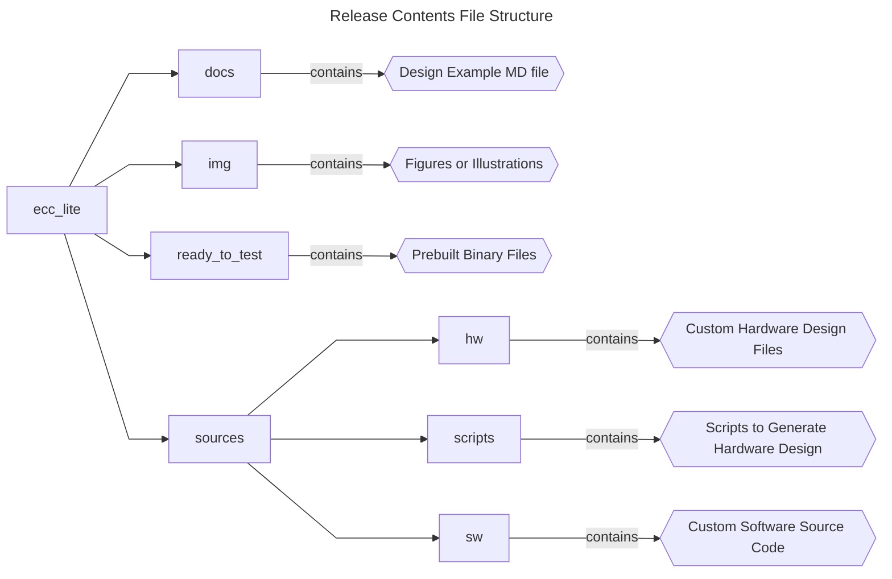
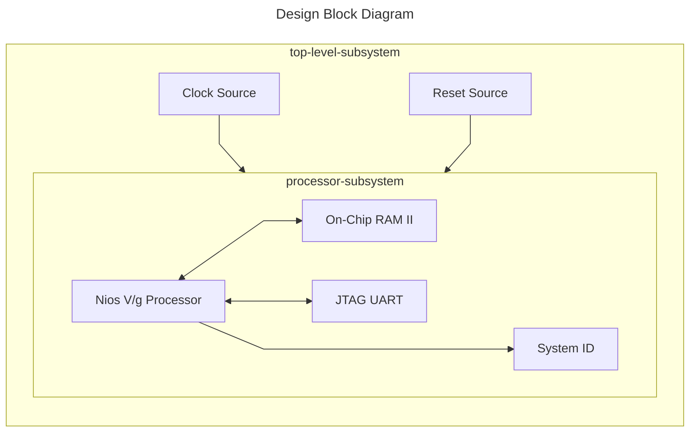

## Introduction

### Nios® V/g ECC Feature Example Design Overview

 This design demonstrates the ECC capabilities of Nios® V/g processor through simulation. </br>
 The design is paired with a testbench file to inject the ECC errors.

### Prerequisites

 - Host PC with 64 GB of RAM.
 - Quartus® Prime Pro Edition Software version 25.1.1
 - Questa* – Altera® FPGA Edition software version 25.1.1
 - Ashling* RiscFree* IDE for Altera® FPGAs
 
### Release Contents  

Every Nios V processor design example is maintained based on this folder structure. </br>
Here is the Github link to root directory of this design example: [Nios® V/g ECC Feature Example Design Github link](https://github.com/altera-fpga/agilex7f-nios-ed/tree/rel/25.1.1/agf014ea-dev-devkit/niosv_g/ecc_lite)



## Nios® V/g ECC Feature Design Architecture
 This example design includes a Nios® V/g processor connected to the On-Chip RAM II, JTAG UART IP and System ID peripheral core. </br>
 The objective of the design is to showcase the ECC capabilities of the processor upon an ECC error injection.



### Nios® V/g Processor IP
- General-purpose 32-bit CPU for high performance applications with larger logic area utilization.
- Implements RV32IMZicsr_Zicbom instruction set (optionally with “F” and "Smclic" extension) instruction set.
- Supports five-stages pipelined datapath.
- It is a customizable soft-core processor, that can be tailored to meet specific application requirements, providing flexibility and scalability in embedded system designs.
 
### Embedded Peripheral IP Cores
The following embedded peripheral IPs are used in this design:

- On-Chip RAM II IP
- JTAG UART IP
- System ID IP

### System Components
The following components are used in this design:

- Clock Source (Clock Bridge)
- Reset Source (Reset Release IP)

### Nios® V Processor Address Map Details
 |Address Offset	|Size (Bytes)	|Peripheral	| Description|
  |-|-|-|-|
  |0x0000_0000|640KB|On-Chip RAM|To store application|
  |0x0011_0040|8|JTAG UART|Communication between a host PC and the Nios V processor system|
  |0x0021_2040|8|System ID|Hardware configuration system ID (0x9)|
  ||||

## Simulating the Design

### Generate Hardware Design-Under-Test (DUT) and Testbench System
Run the following command in the terminal from the *source* directory. </br> 
The commands below perform the following tasks, which generates the hardware DUT and testbench system.

1. Create a new project
2. Create a new Platform Designer system
3. Generate testbench system.
 
```console
quartus_py ./scripts/build_sof.py
qsys-generate hw/sys.qsys --testbench=STANDARD --testbench-simulation=VERILOG 
```

### Generate Software Image ELF
After the hardware DUT and testbench system is ready, you may begin building the software design. </br>
It consists of the following steps:

1. Create a board support package (BSP) project.
2. Create a Nios® V processor application project with example source codes.
3. Build the application.
4. Generate a software image HEX file.

Launch the Nios V Command Shell. You may skip this if the shell is active. </br>
Run the following command in the shell from the *source* directory.
```console
niosv-shell

niosv-bsp -c --quartus-project=hw/top.qpf --qsys=hw/sys.qsys --type=hal sw/bsp/settings.bsp

niosv-app --bsp-dir=sw/bsp --app-dir=sw/app --srcs=sw/app/hello.c

cmake -S ./sw/app -B sw/app/build

make -C sw/app/build

elf2hex sw/app/build/app.elf -b 0x0 -w 32 -e 0xfffff ./hw/onchip_mem.hex 
```

### Check Simulation Files 
You have generated your system and created all the files necessary for simulation.

| File | Description |
| - | - |
| Working Directory/hw/sys_tb | Generated testbench system |
| Working Directory/hw/sys_tb/sys_tb/sim/mentor/msim_setup.tcl | Questa simulation setup script |
| Working Directory/hw/onchip_mem.hex | On-Chip RAM II memory initialization file |

### Start Simulator
With all the necessary simulation files, you can start the simulation.

1. Copy the memory initialization file into *mentor* folder.
2. Replace the default *sys_tb.v* with the custom *sys_tb.v*.
3. Change directory to the same *mentor* folder.
4. Open the **Questa for Altera FPGA** simulator using the command *vsim*.

```console
cp hw/onchip_mem.hex hw/sys_tb/sys_tb/sim/mentor 
cp -rf ./hw/sys_tb.v ./hw/sys_tb/sys_tb/sim  
cd hw/sys_tb/sys_tb/sim/mentor/  
vsim
```

### Setup Simulator
In the **Questa for Altera FPGA** software, run the following commands in the **Transcript**.

```console
source msim_setup.tcl
ld_debug
```

### Run Simulation
Add the relevant waveform, and run the simulation with *run -all* command. <br/>
For example, you should see similar display at the start of the simulation.</br>

1st injection - Correctable single-bit ECC error into General Purpose Register </br>
2nd injection - Uncorrectable single-bit ECC error into General Purpose Register


