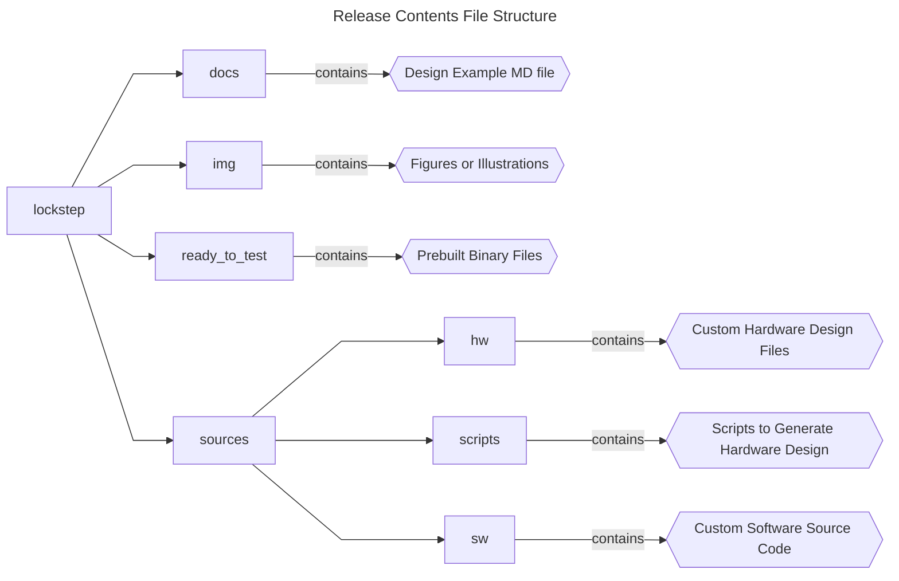
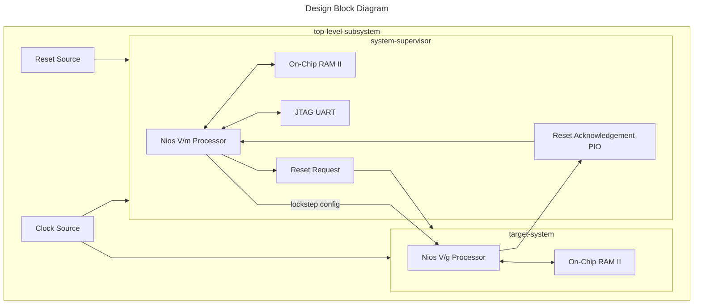

## Introduction

### Nios® V/g Lockstep Design Example Design Overview

 This design demonstrates the Nios V/g lockstep feature on Agilex® 7 FPGA F-Series Development Kit P-Tile and E-Tile DK-DEV-AGF014EA. </br>
 It is based on UC_1 (Standard fail safe or No availability) control mechanism, with Nios® V/m as the system supervisor that injects root faults, reads alarms, and execute failure control mechanism.</br>
 
 The design is built with basic peripherals required for simple application execution:

 - JTAG UART for serial output.

### Prerequisites

 - Agilex® 7 FPGA F-Series Development Kit, ordering code DK-DEV-AGF014EA. </br> Refer to the board documentation for more information about the development kit.
 - Mini and Micro USB Cable. Included with the development kit.
 - Host PC with 64 GB of RAM. Less will be fine for only exercising the prebuilt binaries, and not rebuilding the design.
 - Quartus® Prime Pro Edition Software version 25.3.1
 - Ashling* RiscFree* IDE for Altera® FPGAs
 
### Release Contents  

Every Nios V processor design example is maintained based on this folder structure. </br>
Here is the Github link to root directory of this design example: [Nios® V/g Lockstep with Nios® V/m as System Supervisor Example Design Github link](https://github.com/altera-fpga/agilex7f-nios-ed/tree/rel/25.3.1/agf014ea-dev-devkit/niosv_g/lockstep)



## Nios® V/g Lockstep Design Design Architecture
 This example design is made up of two subsystems:

 - Target System: Nios® V/g Lockstep processor connected to its dedicated peripherals (On-Chip RAM II).
 - System Supervisor: Nios® V/m processor connected to its dedicated peripherals (Reset Request PIO, On-Chip RAM II and JTAG UART IP).
 - Shared peripherals between subsystems (Reset Acknowledgement PIO)

 The objective of the design is to showcase the role of the System Supervisor in supervising the execution of the Target System.</br></br>
 
 The Target System runs a simple application that update the Reset Acknowledgement PIO to represents activity.</br>
 
 While the Target System is running, the System Supervisor:

 - Polls the status of ALARMs of Target System. 
 - Triggers a false alarm within Target System through Root Fault Injection.
 - Executes failure control mechanism on Target System using Reset Request (based on Reset Scenario 1 - CPUs and fRSmartComp asynchronous reset).
 - Check the activity of Target System using the Reset Acknowledge PIO

 </br></br>The value in Reset Acknowledgement PIO indicates as follows:

 - 00 >> System Supervisor is out-of-reset, but haven't send reset request to Target System.
 - 01 >> System Supervisor resets Target System, and checks for Target System's activity.
 - 02 >> Target System replies it is active.
 - 03 >> The demonstration ends.



### Nios® V/g Processor IP as the Lockstep Processor
- General-purpose 32-bit CPU for high performance applications with larger logic area utilization.
- Implements RV32IMZicsr_Zicbom instruction set (optionally with “F” and "Smclic" extension) instruction set.
- Supports five-stages pipelined datapath.
- It is a customizable soft-core processor, that can be tailored to meet specific application requirements, providing flexibility and scalability in embedded system designs.

### Nios® V/m Processor IP as the System Supervisor
- 32-bit Microcontroller to achieve balance between performance and logic area utilization.
- Implements RV32I_Zicsr instruction set.
- Supports five-stages pipelined or non-pipelined datapath.
- It is a customizable soft-core processor, that can be tailored to meet specific application requirements, providing flexibility and scalability in embedded system designs.

### Embedded Peripheral IP Cores
The following embedded peripheral IPs are used in this design:

- On-Chip RAM II IP
- JTAG UART IP
- PIO IP

### System Components
The following components are used in this design:

- Clock Source (Clock Bridge with IO PLL)
- Reset Source (Reset Release IP)

### Lockstep Processor Instance 0 Address Map Details (target-system)
 |Address Offset	|Size (Bytes)	|Peripheral	| Description|
  |-|-|-|-|
  |0x0000_0000|256KB|On-Chip RAM Instance 1|To store application|
  |0x0005_0050|16|Reset Acknowledgement PIO|To report its activity|
  ||||

### System Supervisor Instance 1 Address Map Details (system-supervisor)
 |Address Offset	|Size (Bytes)	|Peripheral	| Description|
  |-|-|-|-|
  |0x0000_0000|256KB|On-Chip RAM Instance 0|To store application|
  |0x0005_0040|8|JTAG UART Instance 1|Communication between a host PC and the System Supervisor|
  |0x0005_0050|16|Reset Acknowledgement PIO|To check Lockstep processor's activity|
  |0x0005_0060|16|Reset Request PIO|Resets the Lockstep Processor|
  |0x0006_0000|64KB|Lockstep Processor|Access the Lockstep-related CSRs|
  ||||

## Development Kit Setup

Refer to [Agilex® 7 FPGA F-Series Development Kit User Guide](https://www.altera.com/products/devkit/a1jui0000061rlpmay/agilex-7-fpga-f-series-development-kit-p-tile-and-e-tile-rev) to setup the development kit.


## Environment Setup

Download the Quartus® Prime Pro Edition and Ashling* RiscFree* IDE for Altera® FPGAs (software version 25.3.1) from the [Quartus® Prime Design Software - Download](https://www.altera.com/products/development-tools/quartus#download) from Altera website. </br>
Follow the on-screen instructions to complete the installation process.

Next, set up the Quartus® Prime Pro Edition and Ashling* RiscFree* IDE tools in the PATH.
```console
export QUARTUS_ROOTDIR=~/altera_pro/25.3.1/quartus/
export PATH=$QUARTUS_ROOTDIR/bin:$QUARTUS_ROOTDIR/linux64:$QUARTUS_ROOTDIR/../qsys/bin:$QUARTUS_ROOTDIR/../riscfree/RiscFree:$QUARTUS_ROOTDIR/../niosv/bin/$PATH
```

## Exercising Prebuilt Binaries

### Program Hardware Binary SOF
1. Connect the development kit to the host PC using USB Blaster II.
2. Change the JTAG clock frequency to 6 MHz, and probe the JTAGServer to get the JTAG scan chain.
3. Execute the quartus_pgm command to program the SOF file with the correct device number. </br>Based on the JTAG scan chain below, the FPGA is at device number 1. You may require to provide a different device number if your JTAG chain is different from the given example.

```console
jtagconfig --setparam 1 JtagClock 6M
jtagconfig -d
quartus_pgm --cable=1 -m jtag -o 'p;ready_to_test/top.sof@1'
```

For example:
```console
1) AGF FPGA Development Kit
  C341A0DD   AGFB014R24A(.|R1|R2)/.. (IR=10)
  020D10DD   VTAP10 (IR=10)
    Design hash    5FDC6B667C01E6ADD7A4
    + Node 0C206E00  JTAG PHY #0
 
  Captured DR after reset = (4BA064770364F0DD020D10DD) [96]
  Captured IR after reset = (100555) [24]
  Captured Bypass after reset = (0) [3]
  Captured Bypass chain = (0) [3]
  JTAG clock speed auto-adjustment is enabled. To disable, set JtagClockAutoAdjust parameter to 0
  JTAG clock speed 6 MHz
```

!!! info "Current Design State (Reset Acknowledgement PIO) = 0x0"
    Upon power‑on, System Supervisor is immediately released from reset, however, it is not executing any applications.
    Target System remains in reset and does not start operating until it receives reset‑release request from System Supervisor.
    Since the System Supervisor is idling, no reset-release request is sent.

### Program Software Image ELF into System Supervisor
1. Ensure that the development kit is successfully configured with the Hardware Binary SOF file.
2. Launch the Nios V Command Shell. You may skip this if the shell is active.
3. Execute the following command to download the ELF file into the System Supervisor (Instance 1).

```console
niosv-shell
niosv-download -g ready_to_test/app_lockstep.elf -c 1 -d 0 -i 1
```

!!! info "Current Design State (Reset Acknowledgement PIO) = 0x1"
    System Supervisor begins its initialization sequence, and sends reset-release request to Target System (through Reset Request PIO).
    Target System is released from reset, however, it is not executing any applications.
    Since the Target System is idling, no reset-release acknowledgement is sent.
    This ensures that System Supervisor completes its necessary startup tasks before Target System becomes active.

### Program Software Image ELF into Target System
1. Ensure that the development kit is successfully configured with the Hardware Binary SOF file.
2. Launch the Nios V Command Shell. You may skip this if the shell is active.
3. Execute the following command to download the ELF file into the Target System (Instance 0).

```console
niosv-shell
niosv-download -g ready_to_test/app_lockstep_hello.elf -c 1 -d 0 -i 0
```

!!! info "Current Design State (Reset Acknowledgement PIO) = 0x2"
    Target System begins its initialization sequence, and sends reset-release acknowledgement to System Supervisor (through Reset Acknowledgement PIO).
    System Supervisor receives the reset-release acknowledgement.
    The Lockstep Mock Test begins.

### Run Serial Console
You may proceed to to display the application printouts from System Supervisor (JTAG UART Instance 1), and verify the design.

```console
juart-terminal -d 0 -c 1 -i 1 
```

For example, you should see similar display at the start of the application.


## Rebuilding the Design 

### Generate Project and Design Files
Run the following command in the terminal from the *source* directory. </br> 
The script performs the following tasks, which generates the project and Platform Designer file of this design.

1. Create a new project
2. Create a new Platform Designer system
3. Configure assignments and constraints
 
```console
quartus_py ./scripts/build_sof.py
```

### Generate Software Image ELF
After the hardware binary SOF file is ready, you may begin building the software design. </br>
It consists of the following steps:

1. Create a board support package (BSP) project.
2. Create a Nios® V processor application projects with the provided source code.
3. Build the applications.
4. Generate a software image ELF file.

Launch the Nios V Command Shell. You may skip this if the shell is active. </br>
Run the following command in the shell from the *source* directory.

#### Nios V/m processor as System Supervisor
```console
niosv-shell
niosv-bsp -c --quartus-project=hw/top.qpf --qsys=hw/qsys_top.qsys --type=hal sw/bsp_lockstep/settings.bsp -i=intel_niosv_m_0
niosv-app --bsp-dir=sw/bsp_lockstep --app-dir=sw/app_lockstep --srcs=sw/app_lockstep/lockstep.c
cmake -S ./sw/app_lockstep -B sw/app_lockstep/build -G "Unix Makefiles"
make -C sw/app_lockstep/build
```

#### Nios V/g Lockstep processor as Target System
```console
niosv-shell
niosv-bsp -c --quartus-project=hw/top.qpf --qsys=hw/qsys_top.qsys --type=hal sw/bsp_lockstep_hello/settings.bsp -i=intel_niosv_g_0
niosv-app --bsp-dir=sw/bsp_lockstep_hello --app-dir=sw/app_lockstep_hello --srcs=sw/app_lockstep_hello/hello.c
cmake -S ./sw/app_lockstep_hello -B sw/app_lockstep_hello/build -G "Unix Makefiles"
make -C sw/app_lockstep_hello/build
```

### Program Hardware Binary SOF
1. Connect the development kit to the host PC using USB Blaster II.
2. Change the JTAG clock frequency to 6 MHz, and probe the JTAGServer to get the JTAG scan chain.
3. Execute the quartus_pgm command to program the SOF file with the correct device number. </br>Based on the JTAG scan chain below, the FPGA is at device number 1. You may require to provide a different device number if your JTAG chain is different from the given example.

```console
jtagconfig --setparam 1 JtagClock 6M
jtagconfig -d
quartus_pgm --cable=1 -m jtag -o 'p;hw/output_files/top.sof@1'
```

For example:
```console
1) AGF FPGA Development Kit
  C341A0DD   AGFB014R24A(.|R1|R2)/.. (IR=10)
  020D10DD   VTAP10 (IR=10)
    Design hash    5FDC6B667C01E6ADD7A4
    + Node 0C206E00  JTAG PHY #0
 
  Captured DR after reset = (4BA064770364F0DD020D10DD) [96]
  Captured IR after reset = (100555) [24]
  Captured Bypass after reset = (0) [3]
  Captured Bypass chain = (0) [3]
  JTAG clock speed auto-adjustment is enabled. To disable, set JtagClockAutoAdjust parameter to 0
  JTAG clock speed 6 MHz
```

!!! info "Current Design State (Reset Acknowledgement PIO) = 0x0"
    Upon power‑on, System Supervisor is immediately released from reset, however, it is not executing any applications.
    Target System remains in reset and does not start operating until it receives reset‑release request from System Supervisor.
    Since the System Supervisor is idling, no reset-release request is sent.

### Program Software Image ELF into System Supervisor
1. Ensure that the development kit is successfully configured with the Hardware Binary SOF file.
2. Launch the Nios V Command Shell. You may skip this if the shell is active.
3. Execute the following command to download the ELF file into the System Supervisor (Instance 1).

```console
niosv-shell
niosv-download -g sw/app_lockstep/build/app_lockstep.elf -c 1 -d 0 -i 1
```

!!! info "Current Design State (Reset Acknowledgement PIO) = 0x1"
    System Supervisor begins its initialization sequence, and sends reset-release request to Target System (through Reset Request PIO).
    Target System is released from reset, however, it is not executing any applications.
    Since the Target System is idling, no reset-release acknowledgement is sent.
    This ensures that System Supervisor completes its necessary startup tasks before Target System becomes active.

### Program Software Image ELF into Target System
1. Ensure that the development kit is successfully configured with the Hardware Binary SOF file.
2. Launch the Nios V Command Shell. You may skip this if the shell is active.
3. Execute the following command to download the ELF file into the Target System (Instance 0).

```console
niosv-shell
niosv-download -g sw/app_lockstep_hello/build/app_lockstep_hello.elf -c 1 -d 0 -i 0
```

!!! info "Current Design State (Reset Acknowledgement PIO) = 0x2"
    Target System begins its initialization sequence, and sends reset-release acknowledgement to System Supervisor (through Reset Acknowledgement PIO).
    System Supervisor receives the reset-release acknowledgement.
    The Lockstep Mock Test begins.

### Run Serial Console
You may proceed to to display the application printouts from System Supervisor (JTAG UART Instance 1), and verify the design.

```console
juart-terminal -d 0 -c 1 -i 1 
```

For example, you should see similar display at the start of the application.


