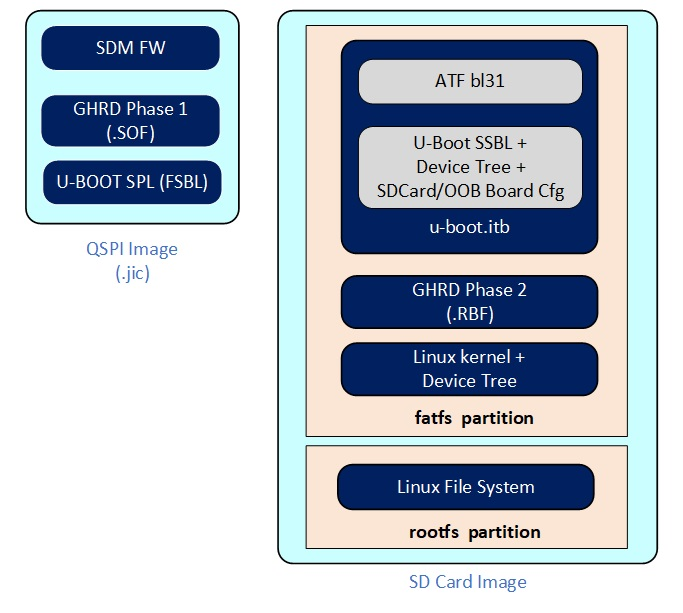
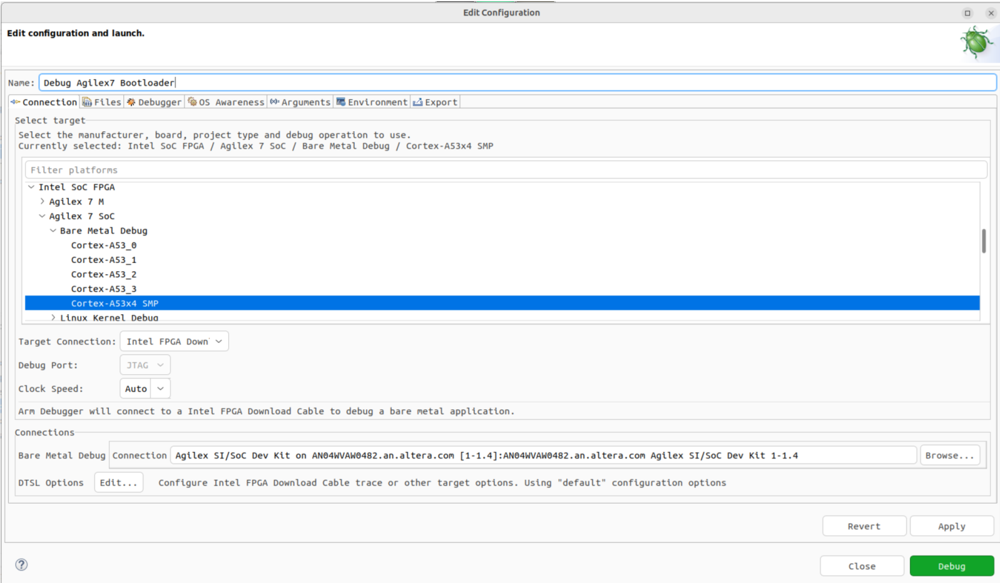
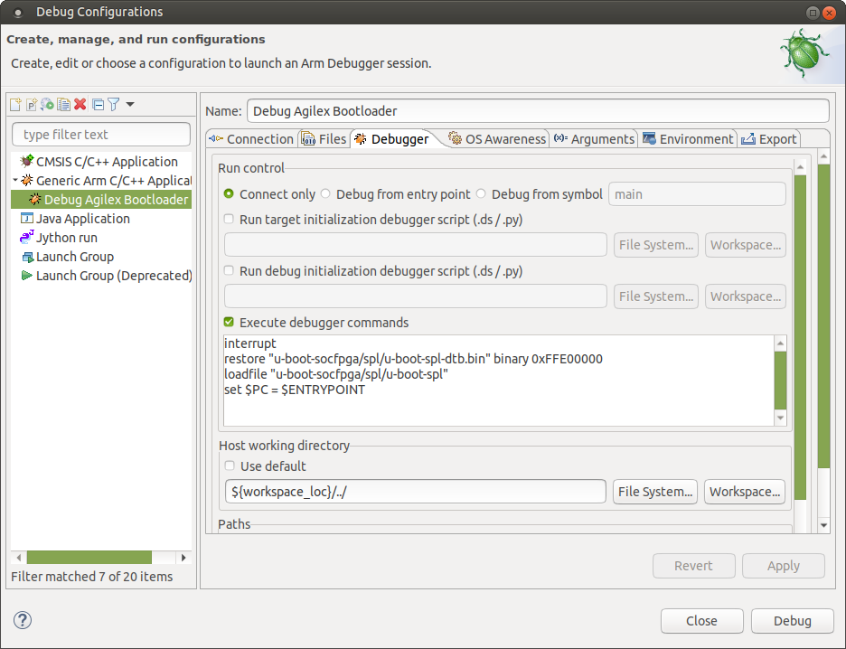
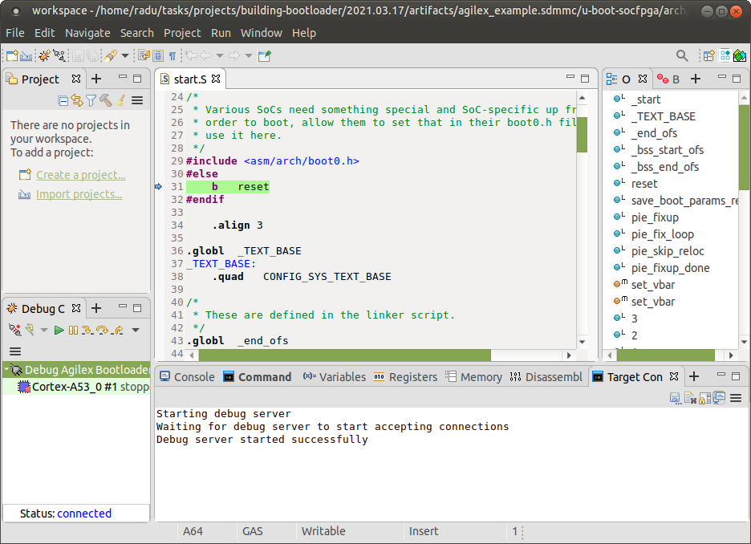
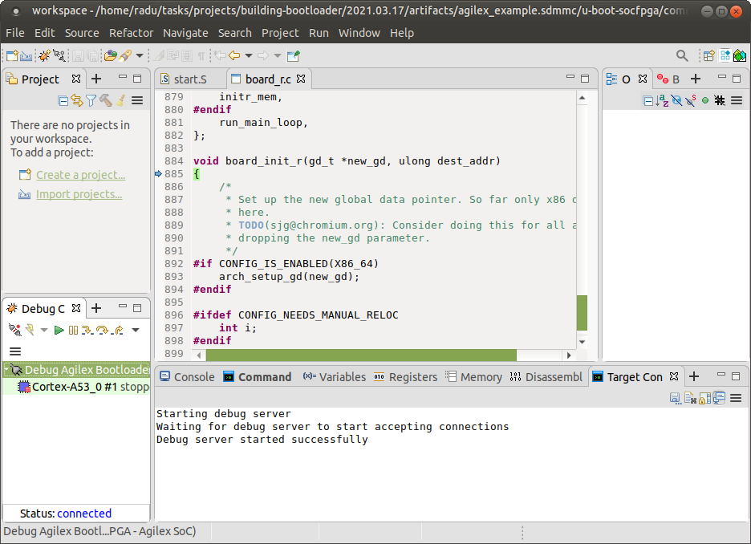
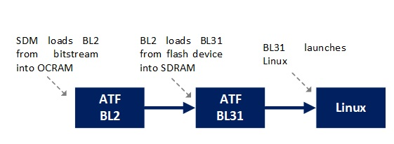
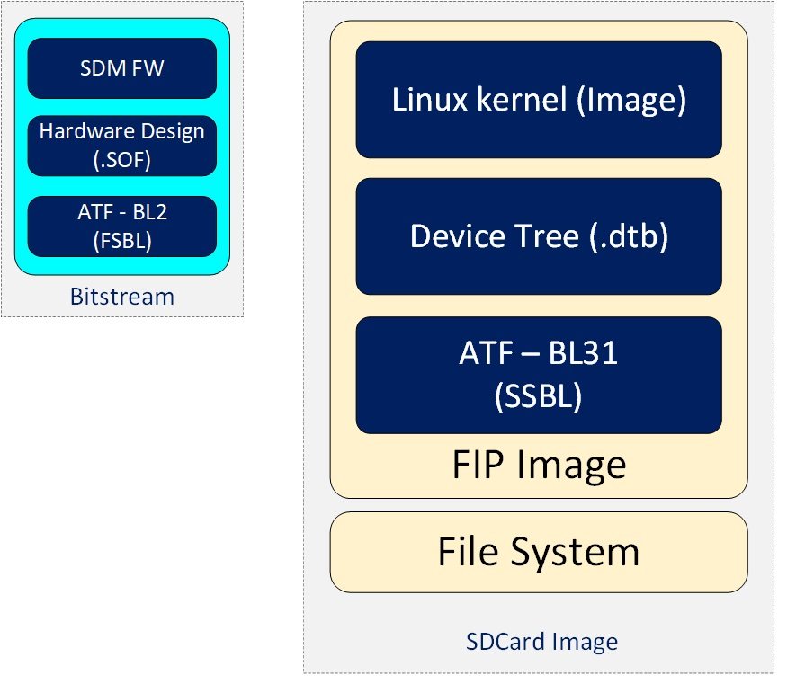
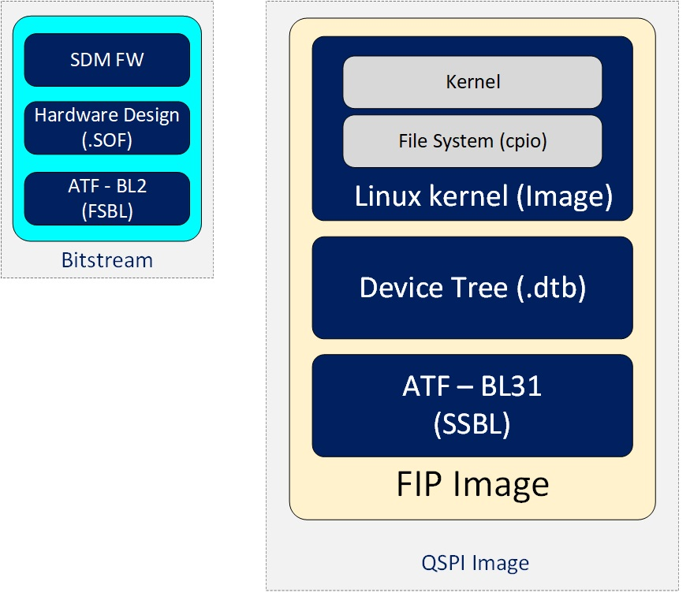

# HPS GHRD Linux Boot Examples for the Agilex™ 7 FPGA F-Series Transceiver-SoC Development Kit (P-Tiles & E-Tile)

## Intro

This page contains instructions on how to build Linux systems from separate components: Hardware Design, U-Boot, Arm Trusted Firmware, Linux kernel and device tree, Linux root filesystem. This is different from the Golden System Reference Design, where all the software is built through Yocto. While the instructions use Yocto for building the root file system, alternatives could be used there, such as the buildroot utility for example.

The key differences versus the GSRD are:

 * Fabric is configured from U-Boot directly with the rbf file, with `fpga load` command, instead of using the `bootm` command with the core.rbf part of the kernel.itb file
 * Single image boot is disabled in U-Boot, and it boots directly with the slected boot source, not trying them all
 * The applications and drivers form `meta-intel-fpga-refdes` are not included. That includes acessing GPIOs in the fabric for LEDs, pushbuttons, dip switches, the webserver running on the board, etc.

The examples provided in this page are focus on the Agilex™ 7 Transceiver-SoC Development kit P-Tile/E-Tile production (DK-SI-AGF014EB) which uses a Linear power regulators. 

## Component Versions

This example was created with Quartus<sup>&reg;</sup> Prime Pro Edition Version 25.1 and the following component versions.

| Repository | Branch/Tag |
| :-- | :-- |
| [ghrd-socfpga](https://github.com/altera-fpga/agilex7f-ed-gsrd) | QPDS25.1_REL_GSRD_PR |
| [linux-socfpga](https://github.com/altera-fpga/linux-socfpga) | socfpga-6.12.11-lts/QPDS25.1_REL_GSRD_PR |
| [arm-trusted-firmware](https://github.com/altera-fpga/arm-trusted-firmware) | socfpga_v2.12.0/QPDS25.1_REL_GSRD_PR |
| [u-boot-socfpga](https://github.com/altera-fpga/u-boot-socfpga) | socfpga_v2025.01/QPDS25.1_REL_GSRD_PR |

Starting with SoC EDS Pro version 19.3, the following changes were made:
The bootloader source code was removed from SoC EDS. Instead, the user needs to clone the git trees from https://github.com/altera-fpga/u-boot-socfpga.

The same U-Boot branch is used for all SoC FPGA devices: Cyclone® V SoC, Arria® V SoC, Arria® 10 SoC, Stratix® 10 SoC, Agilex™ 7 and Agilex™ 5.

Starting with Quartus® Pro 20.3, the SoC EDS was discontinued, and the functionality of the tools which were previously part of SoC EDS are provided separately.

## U-Boot Build Flow

For Stratix® 10, Agilex™ 7 and Agilex™ 5 devices, all the handoff information created by the Quartus® Pro compilation is part of the configuration bitstream. The bsp-editor is not used, and the bootloader build flow does not depend on the Quartus® Pro outputs.

 

## Single Boot Image

Starting with U-Boot 2021.07, the following changes were made to enable a single set of binaries to be used with multiple boards and hardware projects:

* The Quartus® hardware project defines a JTAG User Code which is used by the rest of the system as a board_id to indentify the hardware.
* U-Boot has a single defconfig enabling all possible HPS hardware, and depending on the timeouts to determine which hardware is not actually available.
* U-Boot has a single device tree FIT file enabling all possible HPS hardware, but with different configurations inside, selected according to the board_id.
* Linux FIT file also has a different configuration for each board_id. Each configuration includes the kernel, the specific device file, and an optional core.rbf file. If the core.rbf file is specified, the fabric is configured with that file.


Refer to [Single Image Boot](https://www.rocketboards.org/foswiki/Documentation/SingleImageBoot) for more details about this feature.

The Agilex™ 7 GSRDs are also updated to use this feature. See the GSRD documentation for details:

* [Agilex™ 7 F-Series SoC Development Kit GSRD User Guide (P-Tiles & E-Tiles)](https://altera-fpga.github.io/latest/embedded-designs/agilex-7/f-series/soc/gsrd/ug-gsrd-agx7f-soc/)
* [GSRD for Agilex 7 F-Series FPGA DevKit (2x F-Tile)](https://altera-fpga.github.io/latest/embedded-designs/agilex-7/f-series/fpga/gsrd/ug-gsrd-agx7f-fpga/)
* [Agilex™ 7 I-Series FPGA Development Kit GSRD User Guide](https://altera-fpga.github.io/latest/embedded-designs/agilex-7/i-series/soc/gsrd/ug-gsrd-agx7i-soc/)
* [Agilex™ 7 M-Series HBM2e Development Kit GSRD User Guide](https://altera-fpga.github.io/latest/embedded-designs/agilex-7/m-series/hbm2e/ug-gsrd-agx7m-hbm2e/)

## U-Boot Branches

The official Intel SOCFPGA U-Boot repository is located at https://github.com/altera-fpga/u-boot-socfpga.

**Notes:**

* A "RC" labeled branch is for internal active development use and customer early access without official customer support.
* Latest stable branch (no RC labeled) is strongly recommended for development and production use outside of Intel.
* See doc/README.socfpga for Quartus® Pro and Device support.

## U-Boot to Linux Boot - Booting From SDCard Example

This example shows a simple example of the U-Boot to Linux boot flow, booting Agilex™ 7 device  from SD card.

Note the following:

* Hardware design was customized as follows: <br>
    -Disable SGMII and PR to reduce boot time    
    
* U-Boot was customized as follows: <br>
    - Disable NAND in the unified defconfig file, as we do not need it. <br>
    - Boot only from SD card, as opposed to trying SD, QSPI and NAND. <br>
    - Use Dwarf4 for debug information, to be compatible with current Arm DS debugger. <br>
    - Configure FPGA fabric from boot command using fpga load command explicitly (instead of using the bootm command to do it). <br>
    - Use booti command to boot Linux, with separate files for kernel and device tree. <br>

The above customizations may be useful for debugging purposes for example.

The following build instructions produce a QSPI(.jic) and an SDCard Image (.img) which includes the components indicated in the following figure:

{: style="height:500px"}

This example uses building U-Boot manually. See [Agilex™ 7 F-Series SoC Development Kit GSRD User Guide (P-Tiles & E-Tiles)](https://altera-fpga.github.io/latest/embedded-designs/agilex-7/f-series/soc/gsrd/ug-gsrd-agx7f-soc/) for the full fledged booting from SD card example, where U-Boot is built through Yocto recipes.

This example, and the current GSRD release target the production version of the Intel Agilex™ 7 F-Series Transceiver-SoC Development Kit. You can confirm you have a production version of the board by checking that it's serial number, on a sticker on the back of the board, is greater than AGF61SI0000576. Refer to https://www.intel.com/content/www/us/en/products/details/fpga/development-kits/agilex/f-series-transceiver.html for more details about the board.

### Prerequisites

The following are required:

* Host machine running Linux. Ubuntu 22.04 was used, but other versions may work too.
* Internet connection to download the tools and clone the U-Boot git tree from github. If you are behind a firewall you will need your system administrator to enable you to get to the git trees.
* Agilex™ 7 Transceiver-SoC Development kit P-Tile E-Tile production (DK-SI-AGF014EB).
* Quartus<sup>&reg;</sup> Prime Pro Edition Version 25.1

Note that the examples presented on this page boot to Linux and they require Linux kernel, device tree and rootfilesystem to boot. However, you can omit the Linux binaries and just boot to U-Boot prompt if you want to.


### Setting Up Environment


Create a top folder to store the example files.


  ```bash 
  sudo rm -rf agilex7UbootToLinux.sdmmc
  mkdir agilex7UbootToLinux.sdmmc && cd agilex7UbootToLinux.sdmmc 
  export set TOP_FOLDER=`pwd` 
  ```


Download and setup the the toolchain as follows:

Download the compiler toolchain, add it to the PATH variable, to be used by the GHRD makefile to build the HPS Debug FSBL:


```bash
cd $TOP_FOLDER
wget https://developer.arm.com/-/media/Files/downloads/gnu/11.2-2022.02/binrel/\
gcc-arm-11.2-2022.02-x86_64-aarch64-none-linux-gnu.tar.xz
tar xf gcc-arm-11.2-2022.02-x86_64-aarch64-none-linux-gnu.tar.xz
rm -f gcc-arm-11.2-2022.02-x86_64-aarch64-none-linux-gnu.tar.xz
export PATH=`pwd`/gcc-arm-11.2-2022.02-x86_64-aarch64-none-linux-gnu/bin:$PATH
export ARCH=arm64
export CROSS_COMPILE=aarch64-none-linux-gnu-
```

Enable Quartus tools to be called from command line:


```bash
export QUARTUS_ROOTDIR=~/altera_pro/25.1/quartus/
export PATH=$QUARTUS_ROOTDIR/bin:$QUARTUS_ROOTDIR/linux64:$QUARTUS_ROOTDIR/../qsys/bin:$PATH
```


### Build Hardware Design


  ```bash 
  cd $TOP_FOLDER
  wget https://github.com/altera-fpga/agilex7f-ed-gsrd/archive/refs/tags/QPDS25.1_REL_GSRD_PR.zip
  unzip QPDS25.1_REL_GSRD_PR.zip
  rm QPDS25.1_REL_GSRD_PR.zip
  mv agilex7f-ed-gsrd-QPDS25.1_REL_GSRD_PR agilex7f-ed-gsrd
  cd agilex7f-ed-gsrd
  make agf014eb-si-devkit-oobe-baseline-all
  cd ..
  ```


After building the hardware design the following binary is created:

- $TOP_FOLDER/agilex7f-ed-gsrd/install/designs/agf014eb_si_devkit_oobe_baseline.sof

### Build Arm Trusted Firmware


The following commands are used to retrieve the Arm Trusted Firmware (ATF) and compile it.


  ```bash
  cd $TOP_FOLDER 
  rm -rf arm-trusted-firmware 
  git clone -b QPDS25.1_REL_GSRD_PR https://github.com/altera-fpga/arm-trusted-firmware 
  cd arm-trusted-firmware 
  make bl31 PLAT=agilex 
  cd .. 
  ```


After completing the above steps, the Arm Trusted Firmware binary file is created and is located here.

- $TOP_FOLDER/arm-trusted-firmware/build/agilex/release/bl31.bin 


### Build U-Boot


  ```bash 
  cd $TOP_FOLDER
  rm -rf u-boot-socfpga
  git clone -b QPDS25.1_REL_GSRD_PR https://github.com/altera-fpga/u-boot-socfpga
  cd u-boot-socfpga
  # enable dwarf4 debug info, for compatibility with arm ds 
  sed -i 's/PLATFORM_CPPFLAGS += -D__ARM__/PLATFORM_CPPFLAGS += -D__ARM__ -gdwarf-4/g' arch/arm/config.mk
  # only boot from SD, do not try QSPI and NAND 
  sed -i 's/u-boot,spl-boot-order.*/u-boot\,spl-boot-order = \&mmc;/g' arch/arm/dts/socfpga_agilex_socdk-u-boot.dtsi
  # disable NAND in the device tree 
  sed -i '/&nand {/!b;n;c\\tstatus = "disabled";' arch/arm/dts/socfpga_agilex_socdk-u-boot.dtsi 
  # remove the NAND configuration from device tree 
  sed -i '/images/,/binman/{/binman/!d}' arch/arm/dts/socfpga_agilex_socdk-u-boot.dtsi
  # link to atf
  ln -s $TOP_FOLDER/arm-trusted-firmware/build/agilex/release/bl31.bin .
  
  # Create configuration custom file.
  cat << EOF > config-fragment-agilex
  # Use 'Image' for kernel image instead of 'kernel.itb'
  CONFIG_BOOTFILE="Image"
  # - Disable NAND/UBI related settings from defconfig.
  CONFIG_NAND_BOOT=n
  CONFIG_SPL_NAND_SUPPORT=n
  CONFIG_CMD_NAND_TRIMFFS=n
  CONFIG_CMD_NAND_LOCK_UNLOCK=n
  CONFIG_NAND_DENALI_DT=n
  CONFIG_SYS_NAND_U_BOOT_LOCATIONS=n
  CONFIG_SPL_NAND_FRAMEWORK=n
  CONFIG_CMD_NAND=n
  CONFIG_MTD_RAW_NAND=n
  CONFIG_CMD_UBI=n
  CONFIG_CMD_UBIFS=n
  CONFIG_MTD_UBI=n
  CONFIG_ENV_IS_IN_UBI=n
  CONFIG_UBI_SILENCE_MSG=n
  CONFIG_UBIFS_SILENCE_MSG=n
  # - Disable distroboot and use specific boot command.
  CONFIG_DISTRO_DEFAULTS=n
  CONFIG_HUSH_PARSER=y
  CONFIG_SYS_PROMPT_HUSH_PS2="> "
  CONFIG_USE_BOOTCOMMAND=y
  CONFIG_BOOTCOMMAND="load mmc 0:1 \${loadaddr} ghrd.core.rbf; bridge disable;fpga load 0 \${loadaddr} \${filesize};bridge enable; setenv bootfile Image; run mmcload;run linux_qspi_enable;run rsu_status;run mmcboot"
  CONFIG_CMD_FAT=y
  CONFIG_CMD_FS_GENERIC=y
  CONFIG_DOS_PARTITION=y
  CONFIG_SPL_DOS_PARTITION=y
  CONFIG_CMD_PART=y
  CONFIG_SPL_CRC32=y
  CONFIG_LZO=y
  CONFIG_CMD_DHCP=y
  # Enable more QSPI flash manufacturers
  CONFIG_SPI_FLASH_MACRONIX=y
  CONFIG_SPI_FLASH_GIGADEVICE=y
  CONFIG_SPI_FLASH_WINBOND=y
  CONFIG_SPI_FLASH_ISSI=y
  EOF
  
  # build U-Boot 
  make clean && make mrproper
  make socfpga_agilex_defconfig
  # Use created custom configuration file to merge with the default configuration obtained in .config file.
  ./scripts/kconfig/merge_config.sh -O ./ ./.config ./config-fragment-agilex
  make -j 64
  cd .. 
  ```


After completing the above steps, the following files are created.

- $TOP_FOLDER/u-boot-socfpga/spl/u-boot-spl-dtb.hex - FSBL (U-boot SPL) hex file. 
- $TOP_FOLDER/u-boot-socfpga/u-boot.itb - FIT image file containing SSBL (U-Boot) and ATF (Arm Trusted Firmware) binaries. 

**Note:** The following commands are ran before starting Linux:

* **run linux_qspi_enable**: This passes the QSPI reference clock value to Linux. See [QSPI Reference Clock](#qspi-reference-clock) section..
* **run rsu_status**: This performs some RSU operations that must be done before booting Linux. Only needed when enabling RSU. See: [Agilex™ 7 HPS Remote System Update User Guide](https://www.intel.com/content/www/us/en/docs/programmable/683184/21-4.html).

**Important:** If the fabric is already configured, before running the 'fpga load' command, you must first run the 'bridge disable' command as shown in the above example. If the fabric is not already configured, the command will fail without any adverse effects.

### Prepare QSPI Image


  ```bash 
  quartus_pfg -c \
  agilex7f-ed-gsrd/install/designs/agf014eb_si_devkit_oobe_baseline.sof \
  ghrd.jic \
  -o device=MT25QU128 \
  -o flash_loader=AGFB014R24B2E2V \
  -o hps_path=u-boot-socfpga/spl/u-boot-spl-dtb.hex \
  -o mode=ASX4 \
  -o hps=1
  ```


The following binaries are created:

* $TOP_FOLDER/ghrd.hps.jic - Image to be flashed in the QSPI device
* $TOP_FOLDER/ghrd.core.rbf - Phase2 fabric design

### Building Linux Kernel


The following commands can be used to obtain the Linux source code and build Linux.


  ```bash 
  cd $TOP_FOLDER
  rm -rf linux-socfpga
  git clone -b QPDS25.1_REL_GSRD_PR  https://github.com/altera-fpga/linux-socfpga linux-socfpga
  cd linux-socfpga
  make clean && make mrproper
  make defconfig
  # enable kernel debugging with RiscFree
  ./scripts/config --set-val CONFIG_DEBUG_INFO  y
  ./scripts/config --set-val CONFIG_GDB_SCRIPTS y
  make oldconfig
  make -j 64 Image dtbs
  ```


The following items are built in $TOP_FOLDER:

* linux-socfpga/arch/arm64/boot/dts/intel/socfpga_agilex_socdk.dtb
* linux-socfpga/arch/arm64/boot/Image

### Building Yocto Rootfs


This section presents how to build the Linux rootfs using Yocto recipes. Note that the yocto recipes actually build everything, but are only interested in the rootfs.

First, make sure you have Yocto system requirements met: https://docs.yoctoproject.org/3.4.1/ref-manual/system-requirements.html#supported-linux-distributions.

1\. Make sure you have Yocto system requirements met: https://docs.yoctoproject.org/5.0.1/ref-manual/system-requirements.html#supported-linux-distributions.

The command to install the required packages on Ubuntu 22.04 is:

```bash
sudo apt-get update
sudo apt-get upgrade
sudo apt-get install openssh-server mc libgmp3-dev libmpc-dev gawk wget git diffstat unzip texinfo gcc \
build-essential chrpath socat cpio python3 python3-pip python3-pexpect xz-utils debianutils iputils-ping \
python3-git python3-jinja2 libegl1-mesa libsdl1.2-dev pylint xterm python3-subunit mesa-common-dev zstd \
liblz4-tool git fakeroot build-essential ncurses-dev xz-utils libssl-dev bc flex libelf-dev bison xinetd \
tftpd tftp nfs-kernel-server libncurses5 libc6-i386 libstdc++6:i386 libgcc++1:i386 lib32z1 \
device-tree-compiler curl mtd-utils u-boot-tools net-tools swig -y
```

On Ubuntu 22.04 you will also need to point the /bin/sh to /bin/bash, as the default is a link to /bin/dash:

```bash
 sudo ln -sf /bin/bash /bin/sh
```

**Note**: You can also use a Docker container to build the Yocto recipes, refer to https://rocketboards.org/foswiki/Documentation/DockerYoctoBuild for details. When using a Docker container, it does not matter what Linux distribution or packages you have installed on your host, as all dependencies are provided by the Docker container.

**Note:** You can also use a Docker container to build the Yocto recipes, refer to https://rocketboards.org/foswiki/Documentation/DockerYoctoBuild for details. When using a Docker container, it does not matter what Linux distribution or packages you have installed on your host, as all dependencies are provided by the Docker container.


  ```bash 
  cd $TOP_FOLDER 
  rm -rf yocto && mkdir yocto && cd yocto
  git clone -b styhead https://git.yoctoproject.org/poky
  git clone -b styhead https://git.yoctoproject.org/meta-intel-fpga
  git clone -b styhead   https://github.com/openembedded/meta-openembedded
  # work around issue
  echo 'do_package_qa[noexec] = "1"' >> $(find meta-intel-fpga -name linux-socfpga_6.6.bb)
  source poky/oe-init-build-env ./build
  echo 'MACHINE = "agilex7_dk_si_agf014eb"' >> conf/local.conf
  echo 'BBLAYERS += " ${TOPDIR}/../meta-intel-fpga "' >> conf/bblayers.conf
  echo 'BBLAYERS += " ${TOPDIR}/../meta-openembedded/meta-oe "' >> conf/bblayers.conf  
  echo 'CORE_IMAGE_EXTRA_INSTALL += "openssh gdbserver devmem2"' >> conf/local.conf
  bitbake core-image-minimal
  ```


After the build completes, which can take a few hours depending on your host system processing power and Internet connection speed, the following root file system archive is created.

* TOP_FOLDER/yocto/build/tmp/deploy/images/agilex7_dk_si_agf014eb/core-image-minimal-agilex7_dk_si_agf014eb.rootfs.tar.gz 

### Build SD Card Image


The following commands can be used to create the SD card image used in this example.


  ```bash
  cd $TOP_FOLDER
  sudo rm -rf sd_card && mkdir sd_card && cd sd_card
  wget https://releases.rocketboards.org/release/2020.11/gsrd/tools/make_sdimage_p3.py
  # remove mkfs.fat parameter which has some issues on Ubuntu 22.04
  sed -i 's/\"\-F 32\",//g' make_sdimage_p3.py
  chmod +x make_sdimage_p3.py
  mkdir sdfs &&  cd sdfs
  cp $TOP_FOLDER/u-boot-socfpga/u-boot.itb .
  cp $TOP_FOLDER/linux-socfpga/arch/arm64/boot/Image .
  cp $TOP_FOLDER/linux-socfpga/arch/arm64/boot/dts/intel/socfpga_agilex_socdk.dtb .
  cp $TOP_FOLDER/ghrd.core.rbf .
  cd ..
  mkdir rootfs && cd rootfs
  sudo tar xf $TOP_FOLDER/yocto/build/tmp/deploy/images/agilex7_dk_si_agf014eb/core-image-minimal-agilex7_dk_si_agf014eb.rootfs.tar.gz
  sudo rm -rf lib/modules/*
  cd ..
  sudo python3 make_sdimage_p3.py -f \
  -P sdfs/*,num=1,format=fat32,size=56M \
  -P rootfs/*,num=2,format=ext3,size=56M \
  -s 128M \
  -n sdcard.img
  cd ..
  ```
 

The following items are included in the rootfs on the SD card. 

- U-Boot 
- ATF 
- Linux kernel
- Linux device tree
- Linux Root File System
- Phase2 Fabric design


After completting the binaries build, the following files will be needed to boot Linux:

* $TOP_FOLDER/ghrd.hps.jic
* $TOP_FOLDER/sd_card/sdcard.img


### Boot Linux

Write SD card image to SD card and insert it in the slot.

  1) Set MSEL to JTAG<br>
  2) Write the QSPI flash image:

   Use Quartus® Pro Programmer to program the QSPI flash:
    ```
    cd $TOP_FOLDER/flash_image/
    quartus_pgm -m jtag -o "pvi;./ghrd.hps.jic"
    ```    
  3) Set MSEL to QSPI and power cycle the board. Linux will boot, log in with 'root' as username.


## Other Examples

### Boot from QSPI
See  [Agilex™ 7 Boot From QSPI](https://altera-fpga.github.io/latest/embedded-designs/agilex-7/f-series/soc/gsrd/ug-gsrd-agx7f-soc/#boot-from-qspi_1)

### Boot with NAND Storage on HPS

See [Agilex™ 7 Boot From NAND](https://altera-fpga.github.io/latest/embedded-designs/agilex-7/f-series/soc/gsrd/ug-gsrd-agx7f-soc/#boot-from-nand_1)

### Boot with eMMC Storage on HPS
See [HPS eMMC Boot Example](https://altera-fpga.github.io/latest/embedded-designs/agilex-7/f-series/soc/emmc/ug-emmc-agx7f-soc/)


## Running U-Boot with the Debugger from Command Line

This section presents examples of how to run U-Boot with the Arm Development Studio from command line. This offers a simple and convenient way to run U-Boot and use it for example to program onboard flash.

  1.- Use the binaries built for the [U-Boot to Linux Boot - Booting From SDCard Example](#u-boot-to-linux-boot-booting-from-sdcard-example):
  ```
  cd agilex7UbootToLinux.sdmmc
  ```

  2.-  Run **jtagconfig** command to determine if the HPS is currently in the JTAG scanchain:
  ```
  jtagconfig
  1) Agilex SI/SoC Dev Kit [3-4.3.4]
    6BA00477   S10HPS/AGILEX_HPS
    0341A0DD   AGFB014(F25A|R24AR0)
  ```
  If HPS is not present, the line with S10HPS/AGILEX_HPS above will not appear.

  3.- Configure the FPGA with the debug SOF:
  ```
   quartus_pgm -c 1 -m jtag -o "p;@2"
  ```
  If the HPS is not present in the jtagconfig output above, please remove the "agilex7f-ed-gsrd/install/designs/agf014eb_si_devkit_oobe_baseline_hps_debug.sof@2" from the command line above.

  4.-  Create debugger script:
  ```
  cat <<EOT > run-u-boot.ds
  interrupt
  restore "u-boot-socfpga/spl/u-boot-spl-dtb.bin" binary 0xFFE00000
  loadfile "u-boot-socfpga/spl/u-boot-spl"
  core 1
  set \$PC = \$ENTRYPOINT
  core 2
  set \$PC = \$ENTRYPOINT
  core 3
  set \$PC = \$ENTRYPOINT
  core 0
  set \$PC = \$ENTRYPOINT
  thbreak board_boot_order
  continue
  wait
  set spl_boot_list[0]=0
  set \$PC=\$LR
  restore "u-boot-socfpga/u-boot.itb" binary 0x2000000
  continue
  EOT
  ```
  5.- Run the debugger from command line, using the connection parameters reported above by jtagconfig, shown in red below:
  ```
  /opt/arm/developmentstudio-2022.2/bin/armdbg  \
  --cdb-entry="Intel SoC FPGA::Agilex 7 SoC::Bare Metal Debug::Bare Metal Debug::Cortex-A53x4 SMP::Intel FPGA Download Cable"  \
  --cdb-entry-param="rvi_address=Agilex SI/SoC Dev Kit on localhost [3-4.3.4]:Agilex SI/SoC Dev Kit 3-4.3.4"  \
  --continue_on_error=true \
  --stop_on_connect=false \
  -s run-u-boot.ds
  ```
  6.- The serial console will show SPL then U-Boot being run:
  ```
  U-Boot SPL 2025.01-35102-g135e53726d-dirty (Jan 29 2025 - 11:04:08 -0600)
  Reset state: Cold
  MPU          1200000 kHz
  L4 Main	      400000 kHz
  L4 sys free   100000 kHz
  L4 MP         200000 kHz
  L4 SP         100000 kHz
  SDMMC          50000 kHz
  DDR: 8192 MiB
  SDRAM-ECC: Initialized success with 1715 ms
  QSPI: Reference clock at 400000 kHz
  WDT:   Started watchdog@ffd00200 with servicing every 1000ms (10s timeout)
  Trying to boot from MMC1
  ## Checking hash(es) for config board-0 … OK
  ## Checking hash(es) for Image atf … crc32+ OK
  ## Checking hash(es) for Image uboot … crc32+ OK
  ## Checking hash(es) for Image fdt-0 … crc32+ OK
  NOTICE:  BL31: v2.12.0(release):QPDS25.1_REL_GSRD_PR
  NOTICE:  BL31: Built : 11:03:24, Jan 29 2025

  U-Boot 2025.01-35102-g135e53726d-dirty (Jan 29 2025 - 11:04:08 -0600)socfpga_agilex

  CPU:   Intel FPGA SoCFPGA Platform (ARMv8 64bit Cortex-A53)
  Model: SoCFPGA Agilex SoCDK
  DRAM:  2 GiB (effective 8 GiB)
  Core:  28 devices, 23 uclasses, devicetree: separate
  WDT:   Started watchdog@ffd00200 with servicing every 1000ms (10s timeout)
  MMC:   dwmmc0@ff808000: 0
  Loading Environment from FAT... Unable to read "uboot.env" from mmc0:1...
  In:    serial0@ffc02000
  Out:   serial0@ffc02000
  Err:   serial0@ffc02000
  Net:   
  Warning: ethernet@ff800000 (eth0) using random MAC address - 96:09:0f:73:d5:f5
  eth0: ethernet@ff800000
  Hit any key to stop autoboot:    
  SOCFPGA_AGILEX #
  ```

## Debugging U-Boot with Arm DS Eclipse

 This section presents examples of how to debug U-Boot with from the Arm Development Studio Eclipse-based GUI.

 ### Prerequisites
 1.- Use the binaries built for the [U-Boot to Linux Boot - Booting From SDCard Example](#u-boot-to-linux-boot-booting-from-sdcard-example):
  ```
  cd agilex7UbootToLinux.sdmmc
  ```

  2.- Run jtagconfig to determine if the HPS is currently in the JTAG scanchain:
  ```
  jtagconfig
  1) Agilex SI/SoC Dev Kit [3-4.3.4]
    6BA00477   S10HPS/AGILEX_HPS
    0341A0DD   AGFB014(F25A|R24AR0)
  ```

  If HPS is not present, the line with S10HPS/AGILEX_HPS above will not appear.

  3.- Configure the FPGA with the debug SOF:
  ```
    quartus_pgm -c 1 -m jtag -o "p;agilex7f-ed-gsrd/install/designs/agf014eb_si_devkit_oobe_baseline_hps_debug.sof@2"
  ```

  If the HPS is not present in the jtagconfig output above, please remove the "@2" from the command line above.

### Debugging SPL
  1.- Run the steps from **Prerequisites section**<br>
  2.- Start the Arm Development Studio Eclipse-based GUI:
  ```
  /opt/arm/developmentstudio-2022.2/bin/armds_ide -data workspace &
  ```

  Note the above creates a new workspace in the **agilex7UbootToLinux.sdmmc** folder.<br>
  3.- In **Eclipse**, Go to **Run > Debug Configurations** to open the **Debug Configurations** window. <br>
  4.- In the **Debug Configurations** window: <br>
  a) Select the **Generic Arm C/C++ Application** on the left panel and right-click it. From the menu that appears, select **New Configuration**.<br>
  b) Edit the **Name** field from **New_configuration** to something more descriptive, such as **Debug Agilex 7 Bootloader**.<br>
    
  5.- In the **Connection** tab:<br>
  a) Go to **Select target** section and select **Intel SoC FPGA > Agilex > Bare Metal Debug > Cortex-A53x4 SMP**<br>
  b) Select the **Target Connection** to be **Intel FPGA Download Cable**<br>
  c) Click the **Bare Metal Debug > Connection Browse** button and select your cable.

  The **Debug Configurations** window should now look like this:
   

  6.- Go to the **Debugger** tab, and do the following:<br>
  a) Select **Connect Only**<br>
  b) Check **Execute debugger commands** and enter the following commands:
    
    ```
    interrupt
    restore "u-boot-socfpga/spl/u-boot-spl-dtb.bin" binary 0xFFE00000
    loadfile "u-boot-socfpga/spl/u-boot-spl"
    set $PC = $ENTRYPOINT
    ```

  c) Uncheck **Host working directory > Use default** and edit the value to add "/../" so that it looks in the parent folder of the workspace.<br>

 The **Debug Configurations** window should now look like this:

  
     
  7.- Click the **Debug** button. Arm Development Studio will run the commands, therefore downloading the SPL to board and starting it. The Eclipse window should now look like this: 
    
  

  8.- At this point you can use standard debug techniques to debug U-Boot SPL: viewing registers, variables, putting breakpoints, running step-by-step etc.

### Debugging U-Boot

  1.- Run the steps from **Prerequisites** section<br>
  2.- Create the **Debug Agilex Bootloader** debug configuration as described in [Debugging SPL](#debugging-spl) section.<br>
  3.- Change the **Execute debugger commands** box to contain the following commands:

  ```
  interrupt
  restore "u-boot-socfpga/spl/u-boot-spl-dtb.bin" binary 0xFFE00000
  loadfile "u-boot-socfpga/spl/u-boot-spl"
  thb board_boot_order
  core 1
  set $PC = $ENTRYPOINT
  core 2
  set $PC = $ENTRYPOINT
  core 3
  set $PC = $ENTRYPOINT
  core 0
  set $PC = $ENTRYPOINT
  continue
  wait 60s
  set spl_boot_list[0]=0
  set $PC=$LR
  restore "u-boot-socfpga/u-boot.itb" binary 0x2000000
  thb el3:0x1000
  continue
  wait 60s
  symbol-file "u-boot-socfpga/u-boot"
  thb el2:relocate_code
  continue
  wait 60s
  symbol-file "u-boot-socfpga/u-boot" ((gd_t*)$x18)->reloc_off
  thb board_init_r
  continue
  wait 60s
  ```
  What the above does is:<br>
  a) Load and run SPL<br>
  b) Make SPL report boot from RAM was selected <br>
  c) Load ATF+U-Boot image and run it up until U-Boot starts running<br>
  d) Load U-Boot symbols<br>
  e) Run U-Boot until the relocation routine is called<br>
  f) Relocate the U-Boot symbols<br>
  g) Run U-Boot until the *board_init_r* function<br>

  4.-  Click on the **Debug** button. All the above will be executed, and Eclipse will show the code stopped at *board_init_r* function. The **Eclipse** window should look like this:



  5.- At this point you can use standard debug techniques to debug U-Boot SPL: viewing registers, variables, putting breakpoints, running step-by-step etc.

## Direct ATF to Linux Boot Flow

Starting from 24.2 release, the Agilex™ 7 device is provided with the support of direct booting from ATF to Linux. In this boot flow, ATF acts as a First Stage Bootloader (BL2) and also as a Second Stage Bootloader (BL31). This last one is in charge of loading and launching Linux OS, so U-Boot is not used in this boot flow.

   

 In this boot flow, the BL2 (FSBL) is included in the bitstream together with the SDM FW and hardware design (first phase only in HPS boot first mode). When booting from QSPI, this bitstream is stored in the QSPI memory. In this boot flow, the BL31 (SSBL) is packed with the Linux kernel and device tree into a FIP format image. This format provides to ATF the information about the components included in the image in a partition header. The resulting FIP image is added to the final flash image used to boot from (QSPI or SDCard). 

When creating the flash image, it's necessary to provide the location in where ATF expects to find the FIP image (fip.bin). This is hardcoded in the ATF code (**plat/intel/soc/common/include/platform_def.h**) for each one of the flash devices in which this boot flow is supported as indicated in the next table:

| Flash Device | Definition | Location in Flash device |
| :-- | :-- | :-- | 
| QSPI | PLAT_QSPI_DATA_BASE | 0x3C00000 |
| SDCard | PLAT_SDMMC_DATA_BASE | 0x0 |

The following sections provide instructions about how to generate the binaries to exercise this boot flow booting from an SDcard and QSPI devices. The instructions provided to build the binaries to boot form SD Card and boot from QSPI are expected to be executed togheter, so you need to build these starting from the steps to generate the SD Card binaries.

### ATF to Linux from SD Card

The following recipe provides all the steps needed to create the binaries that allow you to exercise the ATF to Linux boot flow from a SD Card device. The recipe includes building the hardware design, ATF (BL2, BL31), Linux file system, and Linux. These are some notes about the build instructions:

* Excercise the HPS boot first flow.
* When building ATF, we indicate the device used to boot from. We also indicate the SDRAM memory locations where the Linux kernel image and device tree will be loaded and launched from. In this boot flow, Linux is referred to as BL33.
* The FIP image (fip.bin) is created using the ATF fiptool, indicating the binaries that integrate this image.
* The SD Card created will include 2 partitions. One in which the fip.bin file is located (raw format and type A2) and the other for the file system (ext3 format).
* If wanted to perform FPGA configuration (2nd phase from Linux) from Linux create overlays.dtb as indicated in [Agilex™ 7 SoC Fabric Configuration from Linux Example](https://altera-fpga.github.io/latest/embedded-designs/agilex-7/f-series/soc/fabric-config/ug-linux-fabric-config-agx7f-soc/)

   


#### Toolchain Setup (ATF-To-Linux)


  ```bash
  sudo rm -rf atfToLinux_sdcard_qspi
  mkdir atfToLinux_sdcard_qspi && cd atfToLinux_sdcard_qspi
  export TOP_FOLDER=`pwd`
  ```

Download the compiler toolchain, add it to the PATH variable, to be used by the GHRD makefile to build the HPS Debug FSBL:


```bash
cd $TOP_FOLDER
wget https://developer.arm.com/-/media/Files/downloads/gnu/11.2-2022.02/binrel/\
gcc-arm-11.2-2022.02-x86_64-aarch64-none-linux-gnu.tar.xz
tar xf gcc-arm-11.2-2022.02-x86_64-aarch64-none-linux-gnu.tar.xz
rm -f gcc-arm-11.2-2022.02-x86_64-aarch64-none-linux-gnu.tar.xz
export PATH=`pwd`/gcc-arm-11.2-2022.02-x86_64-aarch64-none-linux-gnu/bin:$PATH
export ARCH=arm64
export CROSS_COMPILE=aarch64-none-linux-gnu-
```

Enable Quartus tools to be called from command line:


```bash
export QUARTUS_ROOTDIR=~/altera_pro/25.1/quartus/
export PATH=$QUARTUS_ROOTDIR/bin:$QUARTUS_ROOTDIR/linux64:$QUARTUS_ROOTDIR/../qsys/bin:$PATH
```


#### Build Hardware Design (ATF-To-Linux)


  ```bash
  cd $TOP_FOLDER
  wget https://github.com/altera-fpga/agilex7f-ed-gsrd/archive/refs/tags/QPDS25.1_REL_GSRD_PR.zip
  unzip QPDS25.1_REL_GSRD_PR.zip
  rm QPDS25.1_REL_GSRD_PR.zip
  mv agilex7f-ed-gsrd-QPDS25.1_REL_GSRD_PR agilex7f-ed-gsrd
  cd agilex7f-ed-gsrd
  make agf014eb-si-devkit-oobe-baseline-all
  cd ..
  ```


The following file is created:

* $TOP_FOLDER/agilex7f-ed-gsrd/output_files/ghrd_agfb014r24b2e2vagilex7f-ed-gsrd/install/designs/agf014eb_si_devkit_oobe_baseline.sof

#### Build Arm Trusted Firmware for SDCard (ATF-To-Linux)


  ```bash
  cd $TOP_FOLDER
  rm -rf arm-trusted-firmware-sdcard
  git clone -b QPDS25.1_REL_GSRD_PR https://github.com/altera-fpga/arm-trusted-firmware arm-trusted-firmware-sdcard
  cd arm-trusted-firmware-sdcard 
  make realclean
  # Setting Bootsource as SDMMC
  make bl2 bl31 PLAT=agilex ARM_LINUX_KERNEL_AS_BL33=1 SOCFPGA_BOOT_SOURCE_SDMMC=1 PRELOADED_BL33_BASE=0x02000000 ARM_PRELOADED_DTB_BASE=0x10000000 

  # Create Fiptool tool
  make -C tools/fiptool clean
  make fiptool
  cd ..
  ```


The following files are created:

* $TOP_FOLDER/arm-trusted-firmware-sdcard/build/agilex/release/bl2.bin
* $TOP_FOLDER/arm-trusted-firmware-sdcard/build/agilex/release/bl31.bin

#### Build Linux File System  (ATF-To-Linux)


  ```bash
  cd $TOP_FOLDER
  rm -rf yocto && mkdir yocto && cd yocto
  git clone -b styhead https://git.yoctoproject.org/poky
  git clone -b styhead https://git.yoctoproject.org/meta-intel-fpga
  git clone -b styhead https://github.com/openembedded/meta-openembedded
  # work around issue
  echo 'do_package_qa[noexec] = "1"' >> $(find meta-intel-fpga -name linux-socfpga_6.6.bb)
  source poky/oe-init-build-env ./build
  echo 'MACHINE = "agilex7_dk_si_agf014eb"' >> conf/local.conf
  echo 'BBLAYERS += " ${TOPDIR}/../meta-intel-fpga "' >> conf/bblayers.conf
  echo 'BBLAYERS += " ${TOPDIR}/../meta-openembedded/meta-oe "' >> conf/bblayers.conf
  echo 'IMAGE_FSTYPES = "tar.gz cpio jffs2"' >> conf/local.conf
  # enable ssh and gdb access
  echo 'CORE_IMAGE_EXTRA_INSTALL += "openssh gdbserver devmem2"' >> conf/local.conf
  bitbake core-image-minimal
  ```


The following file is created:

* $TOP_FOLDER/yocto/build/tmp/deploy/images/agilex7_dk_si_agf014eb/core-image-minimal-agilex7_dk_si_agf014eb.rootfs.cpio

#### Build Linux for SDCard (ATF-To-Linux)


  ```bash
  cd $TOP_FOLDER
  rm -rf linux-socfpga
  git clone -b QPDS25.1_REL_GSRD_PR https://github.com/altera-fpga/linux-socfpga linux-socfpga-sdcard
  cd linux-socfpga-sdcard

  # Replace bootargs to use file system from SDcard instead of RAMFS (New device tree will be provided later 14023675777)
  sed -i 's/bootargs/bootargs_old/g' arch/arm64/boot/dts/intel/socfpga_agilex_socdk_atfboot.dts
  sed -i '/bootargs_old/i \\t\tbootargs = "earlycon panic=-1 root=/dev/mmcblk0p2 rw rootwait";' arch/arm64/boot/dts/intel/socfpga_agilex_socdk_atfboot.dts
  sed -i '/bootargs_old/,+2d' arch/arm64/boot/dts/intel/socfpga_agilex_socdk_atfboot.dts
  ## Disabling GMAC (14023884834)
  echo -e "&gmac0 {\n\tstatus = \"disabled\";\n};" >> arch/arm64/boot/dts/intel/socfpga_agilex_socdk_atfboot.dts

  cat << EOF > config-fragment-agilex
  # enable kernel debugging with RiscFree
  CONFIG_DEBUG_INFO=y
  CONFIG_GDB_SCRIPTS=y
  CONFIG_INITRAMFS_ROOT_UID=0
  CONFIG_INITRAMFS_ROOT_GID=0
  CONFIG_INITRAMFS_COMPRESSION_GZIP=y

  # Include these configs if wanted to perform fpga reconfiguration using overlays (enable device tree overlays and fpga bridges)
  # Taken from https://altera-fpga.github.io/latest/embedded-designs/agilex-7/f-series/soc/fabric-config/ug-linux-fabric-config-agx7f-soc/
  CONFIG_OF_RESOLVE=y
  CONFIG_OF_OVERLAY=y
  CONFIG_OF_CONFIGFS=y
  CONFIG_FPGA_MGR_STRATIX10_SOC=y
  CONFIG_FPGA_BRIDGE=y
  CONFIG_FPGA_REGION=y
  CONFIG_OF_FPGA_REGION=y
  CONFIG_OVERLAY_FS=y
  CONFIG_ALTERA_SYSID=y
  EOF

  make clean && make mrproper
  make defconfig
  # Apply custom Configs in file
  ./scripts/kconfig/merge_config.sh -O ./ ./.config ./config-fragment-agilex

  make oldconfig
  make -j 64 Image dtbs
  ```


The following files are created:

* $TOP_FOLDER/linux-socfpga-sdcard/arch/arm64/boot/Image
* $TOP_FOLDER/linux-socfpga-sdcard/arch/arm64/boot/dts/intel/socfpga_agilex_socdk_atfboot.dtb

#### Build SD Card image with FIP inside (ATF-To-Linux)


  ```bash
  #--- Build FIP Image
  cd $TOP_FOLDER
  mkdir sd_card && cd sd_card
  $TOP_FOLDER/arm-trusted-firmware-sdcard/tools/fiptool/fiptool create \
  --soc-fw $TOP_FOLDER/arm-trusted-firmware-sdcard/build/agilex/release/bl31.bin \
  --nt-fw $TOP_FOLDER/linux-socfpga-sdcard/arch/arm64/boot/Image \
  --nt-fw-config $TOP_FOLDER/linux-socfpga-sdcard/arch/arm64/boot/dts/intel/socfpga_agilex_socdk_atfboot.dtb fip.bin

  #--- Build SDCard Image
  wget https://releases.rocketboards.org/release/2020.11/gsrd/tools/make_sdimage_p3.py
  # remove mkfs.fat parameter which has some issues on Ubuntu 22.04
  sed -i 's/\"\-F 32\",//g' make_sdimage_p3.py
  chmod +x make_sdimage_p3.py
  mkdir rootfs && cd rootfs
  sudo tar -xf $TOP_FOLDER/yocto/build/tmp/deploy/images/agilex7_dk_si_agf014eb/core-image-minimal-agilex7_dk_si_agf014eb.rootfs.tar.gz
  sudo rm -rf lib/modules/*
  cd ..
  sudo python3 make_sdimage_p3.py -f \
  -P fip.bin,num=1,format=raw,size=64M,type=a2 \
  -P rootfs/*,num=2,format=ext3,size=64M \
  -s 128M -n sdimage_atf.img
  ```


The following file is created:

* $TOP_FOLDER/sd_card/sdimage_atf.img

#### Build JIC image for SDCard Boot (ATF-To-Linux)


  ```bash 
  cd $TOP_FOLDER
  # Convert fsbl
  aarch64-none-linux-gnu-objcopy -v -I binary -O ihex --change-addresses 0xffe00000 arm-trusted-firmware-sdcard/build/agilex/release/bl2.bin fsbl.hex
  # Create .jic file
  quartus_pfg -c agilex7f-ed-gsrd/install/designs/agf014eb_si_devkit_oobe_baseline.sof \
  design_atf.jic \
  -o hps_path=fsbl.hex \
  -o device=MT25QU128 \
  -o flash_loader=AGFB014R24B2E2V  \
  -o mode=ASX4 \
  -o hps=1
  ```


You can exercise ATF to Linux boot flow from SD Card using the following binaries generated:

* $TOP_FOLDER/sd_card/sdimage_atf.img
* $TOP_FOLDER/design_atf.hps.jic

When booting with the binaries generated, this is the log that you will see:
  ```
  NOTICE:  SDMMC boot
  NOTICE:  BL2: 2.12.0(release):QPDS25.1_REL_GSRD_PR
  NOTICE:  BL2: Built : 11:48:31, Jan 29 2025
  NOTICE:  BL2: Booting BL31
  NOTICE:  BL31: 2.12.0(release):QPDS25.1_REL_GSRD_PR
  NOTICE:  BL31: Built : 11:48:36, Jan 29 2025
  [    0.000000] Booting Linux on physical CPU 0x0000000000 [0x410fd034]
  [    0.000000] Linux version 6.12.11-lts-g346486b5245f-dirty (rolando@rolando2-linux-lab) (aarch64-none-linux-gnu-gcc (GNU Toolchain for the Arm Architecture 11.2-2022.02 (arm-11.14)) 11.2.1 20220111, GNU ld (GNU Toolchain for the Arm Architecture 11.2-2022.02 (arm-11.14)) 2.37.20220122) #1 SMP PREEMPT Wed Jan 29 11:56:17 CST 2025
  [    0.000000] KASLR disabled due to lack of seed
  [    0.000000] Machine model: SoCFPGA Agilex SoCDK
  [    0.000000] efi: UEFI not found.
  [    0.000000] Reserved memory: created DMA memory pool at 0x0000000000000000, size 32 MiB
  [    0.000000] OF: reserved mem: initialized node svcbuffer@0, compatible id shared-dma-pool
  [    0.000000] OF: reserved mem: 0x0000000000000000..0x0000000001ffffff (32768 KiB) nomap non-reusable svcbuffer@0
  [    0.000000] earlycon: uart0 at MMIO32 0x00000000ffc02000 (options '115200n8')
  [    0.000000] printk: bootconsole [uart0] enabled

  :
  Poky (Yocto Project Reference Distro) 5.0.5 agilex7_dk_si_agf014eb /dev/ttyS0

  WARNING: Poky is a reference Yocto Project distribution that should be used for
  testing and development purposes only. It is recommended that you create your
  own distribution for production use.

  root@agilex7_dk_si_agf014eb:~# 
  ```
### ATF to Linux from QSPI

This section provides instructions to build binaries to exercise ATF to Linux direct boot flow booting from a QSPI device.

**NOTE:** This section depends on some steps from the [ATF to Linux from SD Card](#atf-to-linux-from-sd-card) section. So, to build the binaries in this section, the instructions in the following sections need to be executed earlier:

* [Toolchain Setup (ATF-To-Linux)](#toolchain-setup-(atf-to-linux))
* [Build Hardware Design (ATF-To-Linux)](#build-hardware-design-atf-to-linux)
* [Build Linux File System  (ATF-To-Linux)](#build-linux-file-system-atf-to-linux)


ATF requires to be rebuilt to enable booting from QSPI updating BOOT_SOURCE to BOOT_SOURCE_QSPI. Linux also need to be rebuild since this time we are including a JFFS2 file system and since booting from QSPI we need to change some parameters in the device tree. The FIP image is created in the same way but this time the FIP image is put into the QSPI image using a specific .pfg file. In this .pfg file we are indicating that the fip file will be located at **0x3C00000** location in the QSPI since this is also indicated by the **PLAT_QSPI_DATA_BASE** definition in the ATF.

   

#### Build Arm Trusted Firmware for QSPI (ATF-To-Linux)


  ```bash
  cd $TOP_FOLDER
  # Building ATF
  rm -rf arm-trusted-firmware-qspi
  git clone -b QPDS25.1_REL_GSRD_PR https://github.com/altera-fpga/arm-trusted-firmware arm-trusted-firmware-qspi
  cd arm-trusted-firmware-qspi

  # Select QSPI as boot source
  make realclean
  make bl2 bl31 PLAT=agilex ARM_LINUX_KERNEL_AS_BL33=1 SOCFPGA_BOOT_SOURCE_QSPI=1 PRELOADED_BL33_BASE=0x02000000 ARM_PRELOADED_DTB_BASE=0x10000000 DEBUG=0

  # Create Fiptool tool
  make -C tools/fiptool clean
  make fiptool
  cd ..
  ```


The following files are created:

* $TOP_FOLDER/arm-trusted-firmware-qspi/build/agilex/release/bl2.bin 
* $TOP_FOLDER/arm-trusted-firmware-qspi/build/agilex/release/bl31.bin
* $TOP_FOLDER/arm-trusted-firmware-qspi/tools/fiptool/fiptool

#### Build Linux for QSPI (ATF-To-Linux)


  ```bash
  cd $TOP_FOLDER
  rm -rf linux-socfpga-qspi
  git clone -b QPDS25.1_REL_GSRD_PR https://github.com/altera-fpga/linux-socfpga linux-socfpga-qspi
  cd linux-socfpga-qspi
  
  ## Change QSPI CLK frequency to 50 MHZ to match ATF cfg (This may not be needed after 14023675777)
  sed -i  's/spi-max-frequency = <100000000>;/spi-max-frequency = <50000000>;/g' arch/arm64/boot/dts/intel/socfpga_agilex_socdk.dts
  sed -i  's/root: partition@4200000/root: partition@7000000/g' arch/arm64/boot/dts/intel/socfpga_agilex_socdk.dts
  sed -i  's/reg = <0x04200000 0x0BE00000>/reg = <0x07000000 0x09000000>/g' arch/arm64/boot/dts/intel/socfpga_agilex_socdk.dts

  # Replace bootargs to use file system from QSPI instead of RAMFS (New device tree will be provided later 14023675777)
  sed -i 's/bootargs/bootargs_old/g' arch/arm64/boot/dts/intel/socfpga_agilex_socdk_atfboot.dts
  sed -i '/bootargs_old/i \\t\tbootargs = "earlycon panic=-1 root=/dev/mtdblock1 rw rootfstype=jffs2 rootwait";' arch/arm64/boot/dts/intel/socfpga_agilex_socdk_atfboot.dts
  sed -i '/bootargs_old/,+2d' arch/arm64/boot/dts/intel/socfpga_agilex_socdk_atfboot.dts

  ## Disabling GMAC (14023884834)
  echo -e "&gmac0 {\n\tstatus = \"disabled\";\n};" >> arch/arm64/boot/dts/intel/socfpga_agilex_socdk_atfboot.dts

  cat << EOF > config-fragment-agilex
  # enable kernel debugging with RiscFree
  CONFIG_DEBUG_INFO=y
  CONFIG_GDB_SCRIPTS=y

  # Include these configs if wanted to perform fpga reconfiguration using overlays (enable device tree overlays and fpga bridges)
  # Taken from https://altera-fpga.github.io/latest/embedded-designs/agilex-7/f-series/soc/fabric-config/ug-linux-fabric-config-agx7f-soc/  
  CONFIG_OF_RESOLVE=y
  CONFIG_OF_OVERLAY=y
  CONFIG_OF_CONFIGFS=y
  CONFIG_FPGA_MGR_STRATIX10_SOC=y
  CONFIG_FPGA_BRIDGE=y
  CONFIG_FPGA_REGION=y
  CONFIG_OF_FPGA_REGION=y
  CONFIG_OVERLAY_FS=y
  CONFIG_ALTERA_SYSID=y
  # Enabling JFFS2 File system
  CONFIG_JFFS2_FS=y
  EOF

  make clean && make mrproper
  make defconfig
  # Apply custom Configs in file
  ./scripts/kconfig/merge_config.sh -O ./ ./.config ./config-fragment-agilex

  make oldconfig
  make -j 64 Image dtbs
  ```


The output files from this stage are:

* $TOP_FOLDER/linux-socfpga-qspi/arch/arm64/boot/Image
* $TOP_FOLDER/linux-socfpga-qspi/arch/arm64/boot/dts/intel/socfpga_agilex_socdk_atfboot.dtb

#### Create pfg file for QSPI Boot (ATF-To-Linux)


  ```bash
  cd $TOP_FOLDER
  cat << EOF > qspi_flash_image_agilex_boot.pfg
  <pfg version="1">
    <settings custom_db_dir="./" mode="ASX4"/>
    <output_files>
        <output_file name="flash_image_atf_qspi" directory="." type="JIC">
            <file_options/>
            <secondary_file type="MAP" name="flash_image_atf_qspi_jic">
                <file_options/>
            </secondary_file>
            <secondary_file type="SEC_RPD" name="flash_image_atf_qspi_jic">
                <file_options bitswap="1"/>
            </secondary_file>
            <flash_device_id>Flash_Device_1</flash_device_id>
        </output_file>
    </output_files>
    <bitstreams>
        <bitstream id="Bitstream_1">
            <path hps_path="./fsbl.hex">./agf014eb_si_devkit_oobe_baseline.sof</path>
        </bitstream>
    </bitstreams>
    <raw_files>
        <raw_file bitswap="1" type="RBF" id="Raw_File_1">fip.bin</raw_file>
        <raw_file bitswap="1" type="RBF" id="Raw_File_2">rootfs.bin</raw_file>
    </raw_files>
    <flash_devices>
        <flash_device type="MT25QU02G" id="Flash_Device_1">
            <partition reserved="1" fixed_s_addr="1" s_addr="0x00000000" e_addr="0x001FFFFF" fixed_e_addr="1" id="BOOT_INFO" size="0"/>
            <partition reserved="0" fixed_s_addr="0" s_addr="auto" e_addr="auto" fixed_e_addr="0" id="P1" size="0"/>
            <partition reserved="0" fixed_s_addr="0" s_addr="0x03C00000" e_addr="auto" fixed_e_addr="0" id="fip" size="0"/>
            <partition reserved="0" fixed_s_addr="0" s_addr="0x07000000" e_addr="auto" fixed_e_addr="0" id="Rootfs" size="0"/>
        </flash_device>
        <flash_loader>agfb014r24b2e2v</flash_loader>
    </flash_devices>
    <assignments>
        <assignment page="0" partition_id="P1">
            <bitstream_id>Bitstream_1</bitstream_id>
        </assignment>
        <assignment page="0" partition_id="fip">
            <raw_file_id>Raw_File_1</raw_file_id>
        </assignment>
        <assignment page="0" partition_id="Rootfs">
            <raw_file_id>Raw_File_2</raw_file_id>
        </assignment>
    </assignments>
  </pfg>
  EOF
  ```


The following file will be created:

* $TOP_FOLDER/qspi_flash_image_agilex_boot.pfg

#### Create QSPI JIC image for QSPI Boot (ATF-To-Linux)


  ```bash
  cd $TOP_FOLDER
  # Create FIP image
  ./arm-trusted-firmware-qspi/tools/fiptool/fiptool create --soc-fw arm-trusted-firmware-qspi/build/agilex/release/bl31.bin \
  --nt-fw $TOP_FOLDER/linux-socfpga-qspi/arch/arm64/boot/Image \
  --nt-fw-config $TOP_FOLDER/linux-socfpga-qspi/arch/arm64/boot/dts/intel/socfpga_agilex_socdk_atfboot.dtb fip.bin

  # Convert bl2.bin
  aarch64-none-linux-gnu-objcopy -v -I binary -O ihex --change-addresses 0xffe00000 arm-trusted-firmware-qspi/build/agilex/release/bl2.bin fsbl.hex

  # Create the local links to .sof and rootfs
  ln -s $TOP_FOLDER/agilex7f-ed-gsrd/install/designs/agf014eb_si_devkit_oobe_baseline.sof .
  ln -s $TOP_FOLDER/yocto/build/tmp/deploy/images/agilex7_dk_si_agf014eb/core-image-minimal-agilex7_dk_si_agf014eb.rootfs.jffs2 rootfs.bin
  #Create final .jic
  quartus_pfg -c qspi_flash_image_agilex_boot.pfg
  ```


After building, you can use the following binary to exercise the ATF to Linux boot flow booting from QSPI:

* $TOP_FOLDER/flash_image_atf_qspi.jic


When booting with flash_image_atf_qspi.jic, this is the log that you will see:

  ```
  NOTICE:  QSPI boot
  NOTICE:  BL2: v2.12.0(release):QPDS25.1_REL_GSRD_PR
  NOTICE:  BL2: Built : 11:57:29, Jan 29 2025
  NOTICE:  BL2: Booting BL31
  NOTICE:  BL31: v2.12.0(release):QPDS24.3_REL_GSRD_PR
  NOTICE:  BL31: Built : 11:57:34, Jan 29 2025
  [    0.000000] Booting Linux on physical CPU 0x0000000000 [0x410fd034]
  [    0.000000] Linux version 6.6.37-g346486b5245f-dirty (rolando@rolando2-linux-lab) (aarch64-none-linux-gnu-gcc (GNU Toolchain for the Arm Architecture 11.2-2022.02 (arm-11.14)) 11.2.1 20220111, GNU ld (GNU Toolchain for the Arm Architecture 11.2-2022.02 (arm-11.14)) 2.37.20220122) #1 SMP PREEMPT Wed Jan 29 12:03:28 CST 2025
  [    0.000000] KASLR disabled due to lack of seed
  [    0.000000] Machine model: SoCFPGA Agilex SoCDK
  [    0.000000] efi: UEFI not found.
  [    0.000000] Reserved memory: created DMA memory pool at 0x0000000000000000, size 32 MiB
  [    0.000000] OF: reserved mem: initialized node svcbuffer@0, compatible id shared-dma-pool
  [    0.000000] OF: reserved mem: 0x0000000000000000..0x0000000001ffffff (32768 KiB) nomap non-reusable svcbuffer@0
  [    0.000000] earlycon: uart0 at MMIO32 0x00000000ffc02000 (options '115200n8')
  [    0.000000] printk: bootconsole [uart0] enabled

  :
  Poky (Yocto Project Reference Distro) 5.0.5 agilex7_dk_si_agf014eb /dev/ttyS0

  WARNING: Poky is a reference Yocto Project distribution that should be used for
  testing and development purposes only. It is recommended that you create your
  own distribution for production use.

  root@agilex7_dk_si_agf014eb:~#
  ```

## Managing Secure L3 Registers on Stratix® 10, Agilex™ and N5X®

On Stratix® 10, Agilex™ 7 and N5X® HPS there are specific peripherals which are critical for system operation which can only be accessed from software running at EL3.

The following HPS software components run at EL3 on these devices and can access Secure L3 registers:

* U-Boot SPL: initial values for the secure L3 registers are set here through the device tree 'secreg' entries. The user can customize them as needed by editing the device tree.
* Arm Trusted Firmware (ATF): Both U-Boot and Linux call the ATF SMC (Secure Monitor Call) handler to access a restricted subset of secure L3 registers needed for routine system operation.

This section presents the following:

* How to use the 'secreg' device tree entries to customize initial secure L3 registers values set by U-Boot SPL
* How to access registers from the restricted subset from U-Boot, for debug purposes.
* How to access other secure EL3 register from U-Boot, by by changing the ATF source code to add add them to the restricted subset.

### Setting Initial Values of Secure L3 Registers

The initial values for the Secure L3 registes are set from U-Boot SPL. The register values are specified in secreg entries in the U-Boot device tree file.

Refer to [u-boot-socfpga/blob/HEAD/doc/device-tree-bindings/misc/socfpga_secreg.txt](https://github.com/altera-opensource/u-boot-socfpga/blob/HEAD/doc/device-tree-bindings/misc/socfpga_secreg.txt) for documentation the **secreg**. The  socfpga_v2021.04 version shows the following:
  ```
  * Firewall and privilege register settings in device tree

  Required properties:
  --------------------
  - compatible: should contain "intel,socfpga-secreg"
  - intel,offset-settings: 32-bit offset address of block register, and then
						 followed by 32-bit value settings.
  Example:
  --------
		socfpga_secreg: socfpga-secreg {
			compatible = "intel,socfpga-secreg";
			#address-cells = <1>;
			#size-cells = <1>;
			u-boot,dm-pre-reloc;

			i_sys_mgr@ffd12000 {
				reg = <0xffd12000 0x00000228>;
				intel,offset-settings =
					<0x00000020 0xff010000>,
					<0x00000024 0xffffffff>;
				u-boot,dm-pre-reloc;
			};
		};
  ```
Notes about the example:

* The u-boot,dm-pre-reloc; statement in the example informs U-Boot the driver will be loaded in SPL.
* The i_sys_mgr@ffd12000 statement in the example is informative only to enable readers to quickly see what IP is being set up, it is not actually used by the code.
* The reg =<0xffd12000 0x00000228> entry specifies the IP module base address 0xffd12000 and span of 0x00000228 bytes.
* The <0x00000020 0xff010000>, specifies that the register at offset 0x00000020 from the IP module base address will be set to value 0xff010000.

These are the files which currently define the initial value of the Secure L3 registers:

* Common: u-boot-socfpga/arch/arm/dts/socfpga_soc64_u-boot.dtsi.
* Stratix® 10: u-boot-socfpga/arch/arm/dts/socfpga_stratix10-u-boot.dtsi.
* Agilex™ 7: arch/arm/dts/socfpga_agilex-u-boot.dtsi
* N5X®: u-boot-socfpga/arch/arm/dts/socfpga_n5x-u-boot.dtsi

You can edit the above files accordingly to change the default values, or set the initial value of more registers.

### Accessing Secure L3 Registers from U-Boot Command Line

A small subset of critical EL3 restricted access registers are made visible through the ATF SMC handler. The current list of registers is defined in [arm-trusted-firmware/blob/HEAD/plat/intel/soc/common/socfpga_sip_svc.c.](https://github.com/altera-opensource/arm-trusted-firmware/blob/HEAD/plat/intel/soc/common/socfpga_sip_svc.c).

The secure L3 registers accessible through the ATF SMC handler can also optionally be accessed from U-Boot command line for debug purposes. The feature can be enabled by setting **CONFIG_CMD_SMC=y** in the U-Boot configuration file.

Once the feature is enabled, the following command will be avaible from U-Boot command line interface:

  ```
  SOCFPGA # smc
  smc - Issue a Secure Monitor Call

  Usage:
  smc  [arg1 … arg6] [id]
    - fid Function ID
    - arg SMC arguments, passed to X1-X6 (default to zero)
    - id  Secure OS ID / Session ID, passed to W7 (defaults to zero)
  ```
The U-Boot environment already includes predefined ids to facilitate the usage of the command:
  ```
  smc_fid_rd=0xC2000007
  smc_fid_upd=0xC2000009
  smc_fid_wr=0xC2000008
  ```
The command can be used as follows:
  ```
  smc ${smc_fid_rd} <address>
  smc ${smc_fid_wr} <address> <value>
  smc ${smc_fid_upd} <address> <mask> <value>
  ```
See below using the new command to access the BOOT_SCRATCH_COLD0 register (note there is no need to access that register, this is just an example):

1.- Read the register:
  ```
  SOCFPGA_STRATIX10 # smc ${smc_fid_rd} 0xffd12200
  Res:  0 400000 4291895808 0
  ```
Note:

* First value from Res is the return code, 0 means operation succesfull.
* Second value represents the read register value in decimal 400000=0x00061a80.
* Third value is the address in decimal 4291895808=0xffd12200.

2.- Write the register with a new value:
  ```
  SOCFPGA_STRATIX10 # smc ${smc_fid_wr} 0xffd12200 0x00061a81
  Res:  0 400001 4291895808 0
  ```

3.-  Read back the register to confirm it has been updated:
  ```
  SOCFPGA_STRATIX10 # smc ${smc_fid_rd} 0xffd12200
  Res:  0 400001 4291895808 0
  ```
### Enabling Access to more Secure L3 Registers for Debug Purposes

By default, only a small subset of critical EL3 restricted access registers are made visible through the ATF SMC handler. The current list of registers is defined in [arm-trusted-firmware/blob/HEAD/plat/intel/soc/common/socfpga_sip_svc.c](https://github.com/altera-opensource/arm-trusted-firmware/blob/HEAD/plat/intel/soc/common/socfpga_sip_svc.c). For debug purposes, you can add more registers to the restricted register list that can be accessed through the ATF SMC handler.

**Warning: Changing the list of EL3 restricted access registers in ATF is risky, and must be done only for debug purposes only! Do not forget to remove the code once debugging has completed!**

When trying to access a register which is not made visible by the ATF SMC handler, an error will be reported. See below example trying to read the noc_fw_soc2fpga_soc2fpga_scr register:
  ```
  SOCFPGA_STRATIX10 # smc ${smc_fid_rd} 0xffd21200
  Res:  4 0 4291957248 0
  ```
Note:

* The non-zero (4) return code means the operation was not succesfull.

After editing the file [arm-trusted-firmware/blob/HEAD/plat/intel/soc/common/socfpga_sip_svc.c](https://github.com/altera-opensource/arm-trusted-firmware/blob/HEAD/plat/intel/soc/common/socfpga_sip_svc.c) to add this register to the list, and recompiling ATF, the operation is succesfull:

  ```
  SOCFPGA_STRATIX10 # smc ${smc_fid_rd} 0xffd21200
  Res:  0 268304641 4291957248
  ```
Note:

* Return code is zero, operation was succesfull.
* Read value is decimal 268304641=0xFFE0101.

## Boot Scratch Register Usage
On Stratix® 10 SoC, Agilex™ 7 and N5X® devices, the boot scratch registers are part of the System Manager and are used to pass values between various software components. The table below summarizes the usage.

**Note:**

* If no device is provided it means that it applies for all.
* If a cell is not specified for a device, then this could be used as a scratch memory.

| Address                      | Name                                       | Usage                                                        | SDM                                                          | U-Boot                                                       | ATF                                              | Linux               |
| :--------------------------- | :----------------------------------------- | :----------------------------------------------------------- | :----------------------------------------------------------- | :----------------------------------------------------------- | :----------------------------------------------- | :------------------ |
| 0xFFD1 2200                  | boot_scratch_cold0                         | Bits[31] N5X. DDR retention                                  | Sets this bit                                                | Read <br> (is_ddr_retention_enabled)                         |                                                  |                     |
| 0xFFD1 2200                  | boot_scratch_cold0                         | Bits[30:28] N5X, Agilex7M. DDR reset type                    | Sets this field                                              | Read <br> (get_reset_type)                                   |                                                  |                     |
| 0xFFD1 2200                  | boot_scratch_cold0                         | Bits[27:0] SOC 64-bit storing qspi ref clock(kHz)            | Sets this field                                              | Sets value cm_set_qspi_controller_clk_hz <br> Reads value cm_get_qspi_controller_clk_hz |                                                  |                     |
| 0xFFD1 2204                  | boot_scratch_cold1                         | osc1 clock freq                                              |                                                              | Sets and read(cm_get_osc_clk_hz)                             |                                                  |                     |
| 0xFFD1 2208                  | boot_scratch_cold 2                        | fpga clock freq                                              |                                                              | Sets and read (cm_get_fpga_clk_hz)                           |                                                  |                     |
| 0xFFD1 220C                  | boot_scratch_cold3                         | reserved for customer use                                    |                                                              |                                                              |                                                  |                     |
| 0xFFD1 2210 <br> 0xFFD1 2214 | boot_scratch_cold4 <br> boot_scratch_cold5 | Secondary CPU RELEASE ADDRESS                                |                                                              | Main core clears it (lowlevel_init)                          | Main CPU Write (bl31_platform_setup)             |                     |
| 0xFFD1 2218 <br> 0xFFD1 221C | boot_scratch_cold6 <br> boot_scratch_cold7 | 64-bit signature with L2 reset indication done.              | Writes signature (l2_reset_cpu) Reads the register (lowlevel_init) | Writes register (socfpga_system_reset2) Reads register (plat_get_my_entrypoint) |                                                  |                     |
| 0xFFD1 2220                  | boot_scratch_cold8                         | Bit[31:31] N5X, Agilex 7M. DBE status                        | Set by SDM                                                   | Check if bit is set (is_ddr_dbe_triggered)                   |                                                  |                     |
| 0xFFD1 2220                  | boot_scratch_cold8                         | Bit[30:30] N5X, Agilex 7M. DDR Init Progress                 |                                                              | Set and clear bit(ddr_init_inprogress) Read status (is_ddr_init_hang) |                                                  |                     |
| 0xFFD1 2220                  | boot_scratch_cold8                         | Bit[29:29] Agilex 7M. OCRAM_DBE  Error status                |                                                              |                                                              |                                                  |                     |
| 0xFFD1 2220                  | boot_scratch_cold8                         | Bits[28:27] Agilex 7M. Number of IO96B instances             |                                                              | Sets this field (update_io96b_assigned_to_hps)               |                                                  |                     |
| 0xFFD1 2220                  | boot_scratch_cold8                         | Bit[19:19] Agilex 7, Agilex 7M, S10. CPU power domain is about to be turned on. |                                                              |                                                              | Handled call under event (socfpga_pwr_domain_on) |                     |
| 0xFFD1 2220                  | boot_scratch_cold8                         | Bit[18:18] Agilex 7, S10. ACF DDR Data rate                  | Set this bit                                                 | Read this value (sdram_mmr_init_full)                        |                                                  |                     |
| 0xFFD1 2220                  | boot_scratch_cold8                         | Bit[17,16,1] ECC_DDR1 Error Flag, ECC_DDR0 Error Flag, ECC_OCRAM Error Flag |                                                              |                                                              |                                                  |                     |
| 0xFFD1 2220                  | boot_scratch_cold8                         | Checks if any of the flags are set (socfpga_system_reset2)   | Set via ATF SMC                                              |                                                              |                                                  |                     |
| 0xFFD1 2224                  | boot_scratch_cold9                         |                                                              |                                                              |                                                              |                                                  | Write (via ATF SMC) |

Links:

* [Stratix® 10 HPS Registers](https://www.intel.com/content/www/us/en/programmable/hps/stratix-10/hps.html)
* [Agilex™ 7 HPS Registers](https://www.intel.com/content/www/us/en/programmable/hps/agilex/hps.html)
* Review device-specific Boot User Guide for more information about these registers.


## QSPI Reference Clock
The QSPI peripheral clocks are provided by the SDM, based on the SDM input clocks and configuration clock settings defined in the Quartus® Pro project. However, the HPS needs to know the QSPI reference clock, so that it can properly set the dividers in the QSPI controller to create the desired external QSPI clock frequency.

The HPS obtains the QSPI controller reference clock frequency when it obtains exclusive access to the QSPI from the SDM. The frequency reported by the SDM is stored in the U-Boot environment variable called **${qspi_clock}**.

Before booting Linux, U-Boot loads the Linux device tree in memory, then runs the command **linux_qspi_enable** which sets the QSPI controller reference clock appropriately using the value from the **${qspi_clock}** environment variable.

## Reconfiguring Core Fabric from U-Boot
The GSRD configures the FPGA core fabric only once, from U-Boot, by using the **bootm** command. The example in this page configures the fabric only once, from U-Boot, using **fpga load** command.

**Important**: If the FPGA fabric is already configured and bridges are enabled, you must call the **bridge disable** command from U-Boot before issuing the **bootm** or **fppga load** commands to reconfigure the fabric. Only do this if you are using an **arm-trusted-firmware** version more recent than the following:

* v2.7.1 = https://github.com/altera-opensource/arm-trusted-firmware/commit/0a5edaed853e0dc1e687706ccace8e844b2a8db7
* v2.8.0 = https://github.com/altera-opensource/arm-trusted-firmware/commit/bf933536d4582d63d0e29434e807a641941f3937

## Enabling Bridges from U-Boot

U-Boot offers the **bridge** command for controlling the bridges.

The **bridge** command can be used with either **'enable'** or **'disable'** parameter, followed by an optional **'mask'** parameter indicating which of the bridges needs to be enabled or disabled. When the **'mask'** parameter is omitted, all bridges are either enabled or disabled.

See bellow the help message for the command:
  ```
  # bridge
  bridge - SoCFPGA HPS FPGA bridge control

  Usage:
  bridge enable [mask] - Enable HPS-to-FPGA (Bit 0), LWHPS-to-FPGA (Bit 1), FPGA-to-HPS (Bit 2), F2SDRAM0 (Bit 3), F2SDRAM1 (Bit 4), F2SDRAM2 (Bit 5) bridges 
  bridge disable [mask] - Disable HPS-to-FPGA (Bit 0), LWHPS-to-FPGA (Bit 1), FPGA-to-HPS (Bit 2), F2SDRAM0 (Bit 3), F2SDRAM1 (Bit 4), F2SDRAM2 (Bit 5) bridges
  Bit 3, Bit 4 and Bit 5 bridges only available in Stratix 10
  ```
The** 'mask'** is a hexadecimal number, with 3 bits available for Agilex™ 7, and 6 bits for Stratix® 10, as indicated above.

The following table shows examples of enabling and disabling various bridges:

| Command | Description |
| :-- | :-- | 
| bridge enable | Enable all bridges |
| bridge disable | Disable all bridges |
| bridge enable 1 | Enable HPS-to-FPGA bridge |
| bridge enable 2  | Enable LWHPS-to-FPGA bridge |
| bridge enable 4 | Enable FPGA-to-HPS bridge |
| bridge enable 7 | Enable HPS-to-FPGA, LWHPS-to-FPGA, FPGA-to-HPS bridges | 
| bridge enable 35 | Enable HPS-to-FPGA, FPGA-to-HPS, F2SDRAM1, F2SDRAM2 bridges(Stratix® 10 only)  |
| bridge disable 30 | Disable F2SDRAM1, F2SDRAM2 bridges (Stratix® 10 only) |


## Notices & Disclaimers

Altera<sup>&reg;</sup> Corporation technologies may require enabled hardware, software or service activation.
No product or component can be absolutely secure. 
Performance varies by use, configuration and other factors.
Your costs and results may vary. 
You may not use or facilitate the use of this document in connection with any infringement or other legal analysis concerning Altera or Intel products described herein. You agree to grant Altera Corporation a non-exclusive, royalty-free license to any patent claim thereafter drafted which includes subject matter disclosed herein.
No license (express or implied, by estoppel or otherwise) to any intellectual property rights is granted by this document, with the sole exception that you may publish an unmodified copy. You may create software implementations based on this document and in compliance with the foregoing that are intended to execute on the Altera or Intel product(s) referenced in this document. No rights are granted to create modifications or derivatives of this document.
The products described may contain design defects or errors known as errata which may cause the product to deviate from published specifications.  Current characterized errata are available on request.
Altera disclaims all express and implied warranties, including without limitation, the implied warranties of merchantability, fitness for a particular purpose, and non-infringement, as well as any warranty arising from course of performance, course of dealing, or usage in trade.
You are responsible for safety of the overall system, including compliance with applicable safety-related requirements or standards. 
<sup>&copy;</sup> Altera Corporation.  Altera, the Altera logo, and other Altera marks are trademarks of Altera Corporation.  Other names and brands may be claimed as the property of others. 

OpenCL* and the OpenCL* logo are trademarks of Apple Inc. used by permission of the Khronos Group™.   