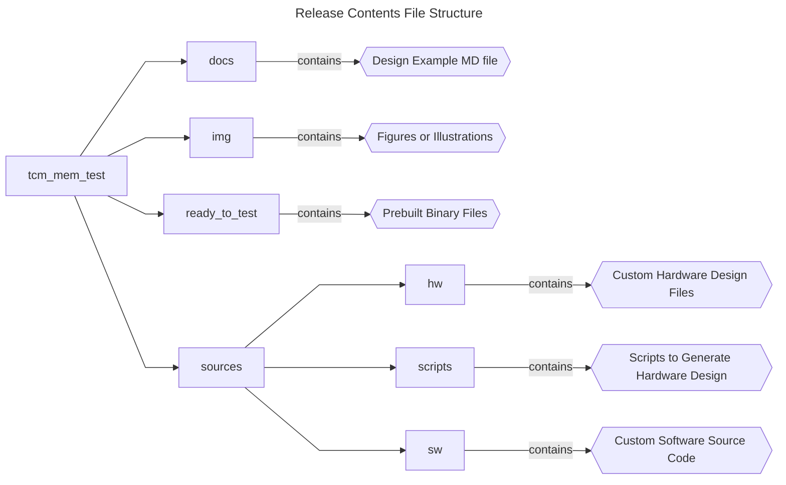
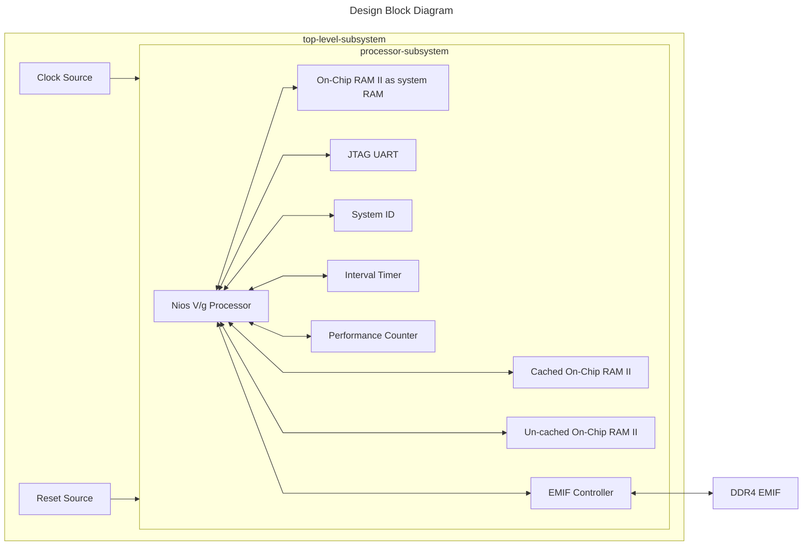

## Introduction

### Nios® V/g Processor Tightly Coupled Memory Example Design Overview

 This design measures the memory access speed of different memories connected to the Nios V/g processor, such as TCM, on-chip memory and external memory interface (EMIF). </br> 
 In Agilex™ 7 FPGA F-Series Transceiver-SoC Development Kit (P-Tile and E-Tile), the design is built with basic peripherals required for simple application execution:

 - JTAG UART for serial output.

### Prerequisites

 - Agilex™ 7 FPGA F-Series Transceiver-SoC Development Kit (P-Tile and E-Tile), ordering code DK-SI-AGF014EB. </br> Refer to the board documentation for more information about the development kit.
 - Mini and Micro USB Cable. Included with the development kit.
 - Host PC with 64 GB of RAM. Less will be fine for only exercising the prebuilt binaries, and not rebuilding the design.
 - Quartus® Prime Pro Edition Software version 25.1.1
 - Ashling* RiscFree* IDE for Altera® FPGAs
 
### Release Contents  

Every Nios V processor design example is maintained based on this folder structure. </br>
Here is the Github link to root directory of this design example: [Nios® V/g Processor Tightly Coupled Memory Example Design Github link](https://github.com/altera-fpga/agilex7f-nios-ed/tree/rel/25.1.1/agf014eb-si-devkit/niosv_g/tcm_mem_test)



## Nios® V/g Processor Tightly Coupled Memory Design Architecture
 This example design includes a Nios® V/g processor connected to: 
 
 - Basic system peripherals (On-chip RAM II, Interval Timer IP, JTAG UART IP and System ID peripheral core)
 - Test memories (cached & uncached On-Chip RAM II, tightly coupled memories, cached & uncached DDR4 memory)
 
 The objective of the design is to: 
 
 - Measure data transfer between the processor and memories.
 - Prints the benchmark result thru JTAG UART IP.



### Nios® V/g Processor IP
- General-purpose 32-bit CPU for high performance applications with larger logic area utilization.
- Implements RV32IMZicsr_Zicbom instruction set (optionally with “F” and "Smclic" extension) instruction set.
- Supports five-stages pipelined datapath.
- It is a customizable soft-core processor, that can be tailored to meet specific application requirements, providing flexibility and scalability in embedded system designs.
 
### Embedded Peripheral IP Cores
The following embedded peripheral IPs are used in this design:

- On-Chip RAM II IP
- JTAG UART IP
- System ID IP
- Interval Timer IP
- Performance Counter IP
- EMIF Controller IP

### System Components
The following components are used in this design:

- Clock Source (100MHz Clock Source at PIN_U52)
- Reset Source (Reset Release IP and FPGA Reset Pin at PIN_G52)

### Nios® V Processor Address Map Details
 |Address Offset	|Size (Bytes)	|Peripheral	| Description|
  |-|-|-|-|
  |0x0004_0000|256KB|Instruction TCM|Not used in this design|
  |0x0008_0000|256KB|Data TCM|Test Memory 1|
  |0x0010_0000|1MB|On-Chip RAM|To store application|
  |0x0021_0040|64|Performance Counter IP|To count the clock cycles needed for each test memories|
  |0x0021_00a0|32|Interval Timer|As system clock timer|
  |0x0021_00d0|8|System ID|Hardware configuration system ID (0x0)|
  |0x0021_00d8|8|JTAG UART|Communication between a host PC and the Nios V processor system|
  |0x1000_0000|1MB|Cached On-Chip RAM|Test Memory 3|
  |0x3000_0000|1MB|Uncached On-Chip RAM|Test Memory 2|
  |0x8000_0000|2GB|DDR4 EMIF Controller|The 1st 1GB space is cached, while the 2nd 1GB space is uncached.</br>Also refer as Test Memory 5 & 4 respectively|
  ||||

## Development Kit Setup

Refer to [Agilex™ 7 FPGA F-Series Transceiver-SoC Development Kit (P-Tile and E-Tile) User Guide](https://www.altera.com/products/devkit/a1jui0000061r0pmaq/agilex-7-fpga-f-series-transceiver-soc-development-kit-p-tile-and-e-tile) to setup the development kit.


## Exercising Prebuilt Binaries

### Program Hardware Binary SOF
1. Connect the development kit to the host PC using USB Blaster II.
2. Change the JTAG clock frequency to 6 MHz, and probe the JTAGServer to get the JTAG scan chain.
3. Execute the quartus_pgm command to program the SOF file with the correct device number. </br>Based on the JTAG scan chain below, the FPGA is at device number 2. You may require to provide a different device number if your JTAG chain is different from the given example.

```console
jtagconfig --setparam 1 JtagClock 6M
jtagconfig -d
quartus_pgm --cable=1 -m jtag -o 'p;ready_to_test/top.sof@2'
```

For example:
```console
1) Agilex SI/SoC Dev Kit
  6BA00477   S10HPS/AGILEX_HPS/N5X_HPS
  C341A0DD   AGFB014R24AR(1|2)/..
  031830DD   10M16S(A|C|L)
    Design hash    F8794217DDC74E81896B
    + Node 08586E00  (110:11) #0
    + Node 0C206E00  JTAG PHY #0
    + Node 30006E00  Signal Tap #0

  Captured DR after reset = (C341A0DD031830DD) [64]
  Captured IR after reset = (00555) [20]
  Captured Bypass after reset = (0) [2]
  Captured Bypass chain = (0) [2]
  JTAG clock speed auto-adjustment is enabled. To disable, set JtagClockAutoAdjust parameter to 0
  JTAG clock speed 6 MHz

```


### Program Software Image ELF
1. Ensure that the development kit is successfully configured with the Hardware Binary SOF file.
2. Launch the Nios V Command Shell. You may skip this if the shell is active.
3. Execute the following command to download the ELF file.

```console
niosv-shell
niosv-download -g ready_to_test/app.elf -c 1
```

### Run Serial Console
You may proceed to to display the application printouts, and verify the design.

```console
juart-terminal -d 1 -c 1 -i 0 
```

For example, you should see similar display at the start of the application.


## Rebuilding the Design 

### Generate Hardware Binary SOF
Run the following command in the terminal from the *source* directory. </br> 
The script performs the following tasks, which generates the hardware binary SOF file of this design.

1. Create a new project
2. Create a new Platform Designer system
3. Configure assignments and constraints
4. Compile the project
5. Generate a hardware binary SOF file
 
```console
quartus_py ./scripts/build_sof.py
```

### Generate Software Image ELF
After the hardware binary SOF file is ready, you may begin building the software design. </br>
It consists of the following steps:

1. Create a board support package (BSP) project.
2. Create a Nios® V processor application project with Linpack benchmark source codes.
3. Build the Linpack application.
4. Generate a software image ELF file.

Launch the Nios V Command Shell. You may skip this if the shell is active. </br>
Run the following command in the shell from the *source* directory.
```console
niosv-shell

niosv-bsp -c --quartus-project=hw/top.qpf --qsys=hw/ag_qsys.qsys --script=sw/bsp_linker_script.tcl --type=hal sw/bsp/settings.bsp 

niosv-app --bsp-dir=sw/bsp --app-dir=sw/app --srcs=sw/app/tcm.c 

cmake -S ./sw/app -G "Unix Makefiles" -B sw/app/build 

make -C sw/app/build
```

### Program Hardware Binary SOF
1. Connect the development kit to the host PC using USB Blaster II.
2. Change the JTAG clock frequency to 6 MHz, and probe the JTAGServer to get the JTAG scan chain.
3. Execute the quartus_pgm command to program the SOF file with the correct device number. </br>Based on the JTAG scan chain below, the FPGA is at device number 2. You may require to provide a different device number if your JTAG chain is different from the given example.

```console
jtagconfig --setparam 1 JtagClock 6M
jtagconfig -d
quartus_pgm --cable=1 -m jtag -o 'p;hw/output_files/top.sof@2'
```

For example:
```console
1) Agilex SI/SoC Dev Kit
  6BA00477   S10HPS/AGILEX_HPS/N5X_HPS
  C341A0DD   AGFB014R24AR(1|2)/..
  031830DD   10M16S(A|C|L)
    Design hash    F8794217DDC74E81896B
    + Node 08586E00  (110:11) #0
    + Node 0C206E00  JTAG PHY #0
    + Node 30006E00  Signal Tap #0

  Captured DR after reset = (C341A0DD031830DD) [64]
  Captured IR after reset = (00555) [20]
  Captured Bypass after reset = (0) [2]
  Captured Bypass chain = (0) [2]
  JTAG clock speed auto-adjustment is enabled. To disable, set JtagClockAutoAdjust parameter to 0
  JTAG clock speed 6 MHz

```


### Program Software Image ELF
1. Ensure that the development kit is successfully configured with the Hardware Binary SOF file.
2. Launch the Nios V Command Shell. You may skip this if the shell is active.
3. Execute the following command to download the ELF file.

```console
niosv-shell
niosv-download -g sw/app/build/app.elf -c 1
```

### Run Serial Console
You may proceed to to display the application printouts, and verify the design.

```console
juart-terminal -d 1 -c 1 -i 0 
```

For example, you should see similar display at the start of the application.


## Example Design Bugs
You might receive a warning about elf2hex when running the make command. </br>
This issue is caused by the auto-generation of HEX file by the APP CMakeLists.txt.


You may ignore the warning, and force stop the truncating action.</br>
The generated HEX files are not used in this design.


