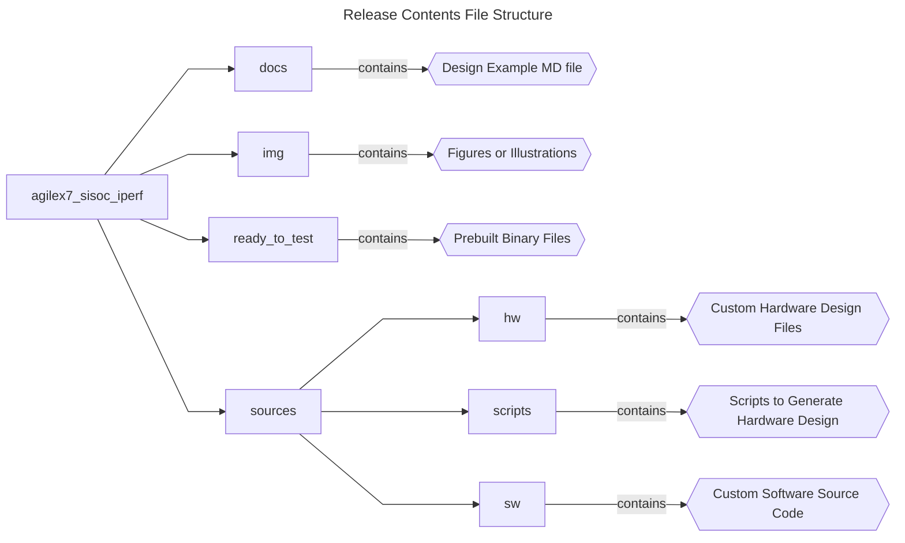
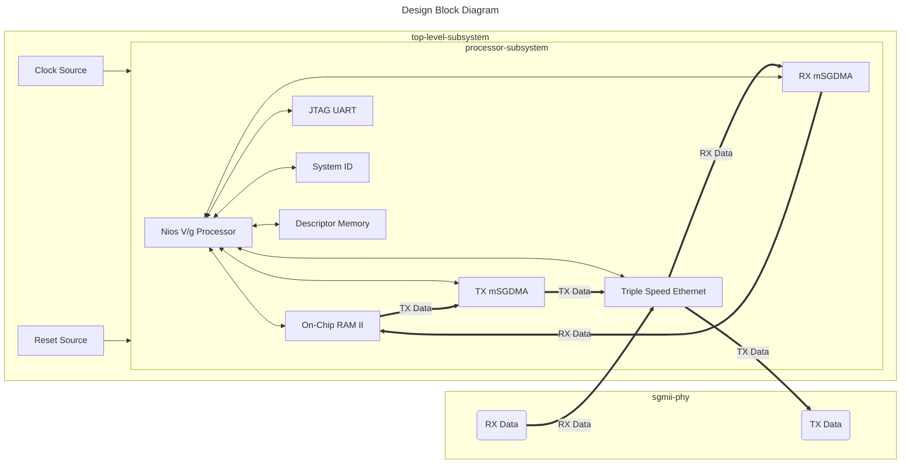

## Introduction

### Nios® V/m Processor IPerf Server Application Example Design Overview

 This design demonstrates an IPerf application on a Nios® V/m processor using the Triple Speed Ethernet IP in Agilex™ 7 FPGA F-Series Transceiver-SoC Development Kit (P-Tile and E-Tile). </br>
 The Triple Speed Ethernet (TSE) IP is configured in SGMII mode and connects to the onboard 80E1111 PHY via SGMII interface. </br> 
 To complement the TSE IP, two Modular Scatter-Gather DMA (MSGDMA) IP with Descriptor Memory to offload Ethernet data transfer tasks from the processor.</br>

 Besides the TSE IP, the design is built with basic peripherals required for other essential application execution:

 - JTAG UART for serial output.
 - System ID IP for design identification.

### Prerequisites

 - Agilex™ 7 FPGA F-Series Transceiver-SoC Development Kit (P-Tile and E-Tile), ordering code DK-SI-AGF014EB. </br> Refer to the board documentation for more information about the development kit.
 - Mini and Micro USB Cable. Included with the development kit.
 - RJ-45 Ethernet cable. Not included with the development kit.
 - Host PC with 64 GB of RAM. Less will be fine for only exercising the prebuilt binaries, and not rebuilding the design.
 - Quartus® Prime Pro Edition Software version 25.1.1
 - Ashling* RiscFree* IDE for Altera® FPGAs
 
### Release Contents  

Every Nios V processor design example is maintained based on this folder structure. </br>
Here is the Github link to root directory of this design example: [Nios® V/m Processor IPerf Server Application Example Design  Github link](https://github.com/altera-fpga/agilex7f-nios-ed/tree/rel/25.1.1/agf014eb-si-devkit/niosv_m/agilex7_sisoc_iperf)



## Nios® V/m Processor IPerf Server Application Design Architecture
 This example design includes a Nios® V/m processor connected to multiple soft IP peripherals. </br>
 The objective of the design is to setup the FPGA device (Nios® V/m processor) as the IPerf server, while the Host PC as the IPerf client. </br> 
 They are connected using static IP address.

 - Establish Ethernet connection between FPGA and Host PC using Triple Speed Ethernet IP.
 - Assign On-Chip Memory II IP as the processor instruction and data memory.
 - Offload Ethernet data transfer from processor using Modular Scatter-Gather DMA (MSGDMA) IP with Descriptor Memory.
 - Verify device identification with System ID IP.
 - JTAG UART IP for printf outputs.

Note: The Nios V/m processor controls all embedded peripheral IP in the processor-subsystem.




### Nios® V/m Processor IP
- 32-bit Microcontroller to achieve balance between performance and logic area utilization. 
- Implements RV32I_Zicsr instruction set.
- Supports five-stages pipelined or non-pipelined datapath.
- It is a customizable soft-core processor, that can be tailored to meet specific application requirements, providing flexibility and scalability in embedded system designs.
 
### Embedded Peripheral IP Cores
The following embedded peripheral IPs are used in this design:

- On-Chip RAM II IP as System RAM
- On-Chip RAM II IP as Descriptor Memory
- Triple Speed Ethernet IP
- mSGDMA with Prefetcher Enabled for TX and RX
- Parallel IO IP
- System ID IP
- JTAG UART IP

### System Components
The following components are used in this design:

- Clock Source (Clock Bridge with IO PLL)
- Reset Source (Reset Release IP)
- Reset Output (Reset SGMII PHY)

### Nios® V Processor Address Map Details
 |Address Offset	|Size (Bytes)	|Peripheral	| Description|
  |-|-|-|-|
  |0x0000_0000|1.9MB|On-Chip RAM|To store application|
  |0x0021_0000|8KB|Descriptor Memory|To store mSGDMA descriptor|
  |0x0021_2000|1KB|Triple Speed Ethernet|To access the TSE IP configuration register space|
  |0x0021_2440|32|TX mSGDMA Prefetcher|To access the TX mSGDMA Prefetcher configuration register space|
  |0x0021_2460|32|TX mSGDMA|To access the TX mSGDMA Dispatcher configuration register space|
  |0x0021_2480|32|RX mSGDMA Prefetcher|To access the RX mSGDMA Prefetcher configuration register space|
  |0x0021_24A0|32|RX mSGDMA|To access the RX mSGDMA Dispatcher configuration register space|
  |0x0021_24C0|16|Parallel IO|For LED control. Not used in this example|
  |0x0021_24D0|8|System ID|Hardware configuration system ID (0xFACECAFE)|
  |0x0021_24D8|8|JTAG UART|Communication between a host PC and the Nios V processor system|
  ||||

## Development Kit Setup

Refer to [Agilex® 7 FPGA F-Series TransceiverSoC Development Kit User Guide](https://www.altera.com/products/devkit/a1jui0000061r0pmaq/agilex-7-fpga-f-series-transceiver-soc-development-kit-p-tile-and-e-tile) to setup the development kit.


Once the board is powered on successfully, 

1. Connect the **SGMII Ethernet** to your host PC.
2. Set the IP address of your host PC to 192.168.1.50. </br> You can assign any valid IP address. 192.168.1.50 is here to ensure content consistency.


## Exercising Prebuilt Binaries

### Program Hardware Binary SOF
1. Connect the development kit to the host PC using USB Blaster II.
2. Change the JTAG clock frequency to 6 MHz, and probe the JTAGServer to get the JTAG scan chain.
3. Execute the quartus_pgm command to program the SOF file with the correct device number. </br>Based on the JTAG scan chain below, the FPGA is at device number 2. You may require to provide a different device number if your JTAG chain is different from the given example.

```console
jtagconfig --setparam 1 JtagClock 6M
jtagconfig -d
quartus_pgm --cable=1 -m jtag -o 'p;ready_to_test/top.sof@2'
```

For example:
```console
1) Agilex SI/SoC Dev Kit
  6BA00477   S10HPS/AGILEX_HPS/N5X_HPS
  C341A0DD   AGFB014R24AR(1|2)/..
  031830DD   10M16S(A|C|L)
    Design hash    F8794217DDC74E81896B
    + Node 08586E00  (110:11) #0
    + Node 0C206E00  JTAG PHY #0
    + Node 30006E00  Signal Tap #0

  Captured DR after reset = (C341A0DD031830DD) [64]
  Captured IR after reset = (00555) [20]
  Captured Bypass after reset = (0) [2]
  Captured Bypass chain = (0) [2]
  JTAG clock speed auto-adjustment is enabled. To disable, set JtagClockAutoAdjust parameter to 0
  JTAG clock speed 6 MHz
```


### Program Software Image ELF
1. Ensure that the development kit is successfully configured with the Hardware Binary SOF file.
2. Launch the Nios V Command Shell. You may skip this if the shell is active.
3. Execute the following command to download the ELF file.

```console
niosv-shell
niosv-download -g ready_to_test/app.elf -c 1
```

### Run Serial Console
You may proceed to to display the application printouts, and verify the design.

```console
juart-terminal -d 1 -c 1 -i 0 
```

For example, you should see similar display at the start of the server application, with the FPGA IP Address as 192.168.1.100.</br>
The FPGA is running as an IPerf server, waiting for a valid IPerf client connection.


The host PC (192.168.1.50) can start the IPerf benchmark as an IPerf client.


The same IPerf benchmark results is displayed from the IPerf server or FPGA (192.168.1.100).


## Rebuilding the Design 

### Generate Hardware Binary SOF
Run the following command in the terminal from the *source* directory. </br> 
The script performs the following tasks, which generates the hardware binary SOF file of this design.

1. Create a new project
2. Create a new Platform Designer system
3. Configure assignments and constraints
4. Compile the project
5. Generate a hardware binary SOF file
 
```console
quartus_py ./scripts/build_sof.py
```

### Generate Software Image ELF
After the hardware binary SOF file is ready, you may begin building the software design. </br>
It consists of the following steps:

1. Create a board support package (BSP) project.
2. Create a Nios® V processor application project with IPerf source codes.
3. Build the application.
4. Generate a software image ELF file.

Launch the Nios V Command Shell. You may skip this if the shell is active. </br>
Run the following command in the shell from the *source* directory.
```console
niosv-shell

niosv-bsp -c sw/bsp/settings.bsp -qpf=hw/top.qpf -qsys=hw/sys.qsys --type=ucosii --cmd="enable_sw_package uc_tcp_ip" --cmd="set_setting altera_avalon_jtag_uart_driver.enable_small_driver {1}" --cmd="set_setting hal.enable_instruction_related_exceptions_api {1}" --cmd="set_setting hal.log_flags {0}" --cmd="set_setting hal.log_port {sys_jtag_uart}" --cmd="set_setting hal.make.cflags_defined_symbols {-DTSE_MY_SYSTEM -DALT_DEBUG}" --cmd="set_setting hal.make.cflags_user_flags {-ffunction-sections -fdata-sections}" --cmd="set_setting hal.make.cflags_warnings {-Wall -Wextra -Wformat -Wformat-security}" --cmd="set_setting hal.make.link_flags {-Wl,--gc-sections}" --cmd="set_setting ucosii.miscellaneous.os_max_events {80}" --cmd="set_setting ucosii.os_tmr_en {1}" --cmd="set_setting hal.make.cflags_optimization {-O2 -fno-tree-vectorize}" 

niosv-app --bsp-dir=sw/bsp --app-dir=sw/app --incs=sw/app,sw/app/uC-IPerf --srcs=sw/app/app_iperf.c,sw/app/main.c,sw/app/uC-IPerf/OS/uCOS-II/iperf_os.c,sw/app/uC-IPerf/Reporter/Terminal/iperf_rep.c,sw/app/uC-IPerf/Source/iperf-c.c,sw/app/uC-IPerf/Source/iperf-s.c,sw/app/uC-IPerf/Source/iperf.c,sw/app/uc_tcp_ip_init.c

cmake -S sw/app -B sw/app/build -G 'Unix Makefiles' -DCMAKE_BUILD_TYPE=Debug

make -C sw/app/build
```

### Program Hardware Binary SOF
1. Connect the development kit to the host PC using USB Blaster II.
2. Change the JTAG clock frequency to 6 MHz, and probe the JTAGServer to get the JTAG scan chain.
3. Execute the quartus_pgm command to program the SOF file with the correct device number. </br>Based on the JTAG scan chain below, the FPGA is at device number 2. You may require to provide a different device number if your JTAG chain is different from the given example.

```console
jtagconfig --setparam 1 JtagClock 6M
jtagconfig -d
quartus_pgm --cable=1 -m jtag -o 'p;hw/output_files/top.sof@2'
```

For example:
```console
1) Agilex SI/SoC Dev Kit
  6BA00477   S10HPS/AGILEX_HPS/N5X_HPS
  C341A0DD   AGFB014R24AR(1|2)/..
  031830DD   10M16S(A|C|L)
    Design hash    F8794217DDC74E81896B
    + Node 08586E00  (110:11) #0
    + Node 0C206E00  JTAG PHY #0
    + Node 30006E00  Signal Tap #0

  Captured DR after reset = (C341A0DD031830DD) [64]
  Captured IR after reset = (00555) [20]
  Captured Bypass after reset = (0) [2]
  Captured Bypass chain = (0) [2]
  JTAG clock speed auto-adjustment is enabled. To disable, set JtagClockAutoAdjust parameter to 0
  JTAG clock speed 6 MHz
```


### Program Software Image ELF
1. Ensure that the development kit is successfully configured with the Hardware Binary SOF file.
2. Launch the Nios V Command Shell. You may skip this if the shell is active.
3. Execute the following command to download the ELF file.

```console
niosv-shell
niosv-download -g sw/app/build/app.elf -c 1
```

### Run Serial Console
You may proceed to to display the application printouts, and verify the design.

```console
juart-terminal -d 1 -c 1 -i 0 
```

For example, you should see similar display at the start of the server application, with the FPGA IP Address as 192.168.1.100.</br>
The FPGA is running as an IPerf server, waiting for a valid IPerf client connection.


The host PC (192.168.1.50) can start the IPerf benchmark as an IPerf client.


The same IPerf benchmark results is displayed from the IPerf server or FPGA (192.168.1.100).


## Example Design Tips
You might notice some difference between the printout of prebuilt binaries and rebuilt binaries. </br>
This is due to the slight change in the commands used during Generate Software Image ELF. </br>

### Debug Logs
The *-DALT_DEBUG* in cflags_defined_symbols enables more debug logs related to TSE IP and mSGDMA drivers. </br>
These debug logs are helpful in debugging network connectivity issues.

### IPerf Result
The *-DCMAKE_BUILD_TYPE=Debug* in cmake command builds the application for debug purposes. </br>
Optimizations are generally disabled, and debugging symbols (-g on GCC) are included for use with a debugger. </br>

For better IPerf performance, you can switch to *-DCMAKE_BUILD_TYPE=Release* for production builds.


