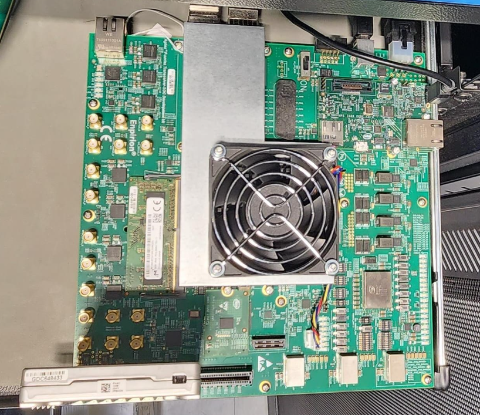
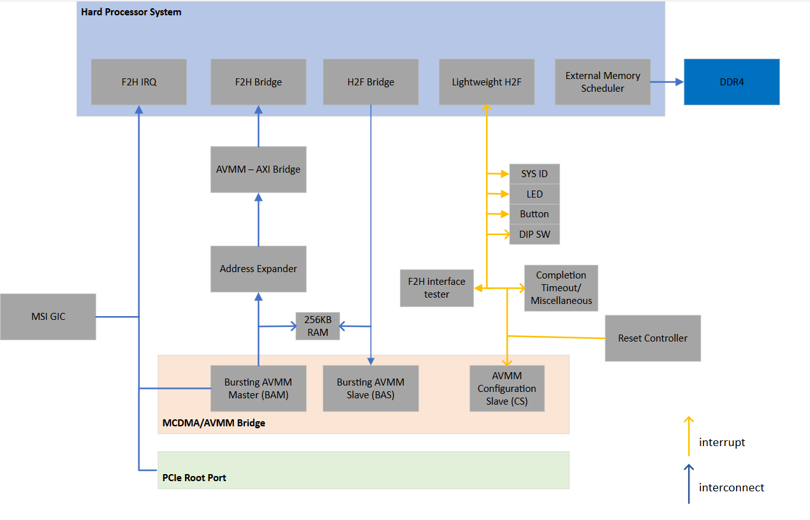
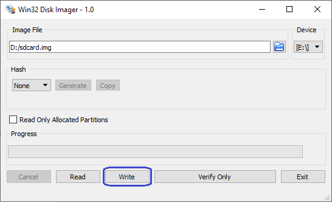

# HPS PCIe Root Port System Example Design for the Agilex™ 7 FPGA F-Series Transceiver-SoC Development Kit (P-tile and E-tile)

## Summary

PCIe root port is the downstream port of Root Complex which establish the PCIe link with any PCIe Endpoint or PCIe Bridge.

This reference design demonstrates a PCIe root port running on Agilex™ 7 FPGA F-Series Transceiver-SoC Development Kit (P-tile and E-tile) connected to end point. A Gen4x4 link is shown. The root port reference design is based on the Agilex 7 Golden System Reference Design, with PCIe root port and necessary Linux software infrastructure added.

Refer to the [GitHub repository](https://github.com/altera-fpga/agilex7-ed-pcie-rp) for the Quartus Project and Yocto Project files.

## Required Components

- Root Port Host Board.
  * Agilex™ 7 FPGA F-Series Transceiver-SoC Development Kit (P-tile and E-tile).
  * OOBE Daughter Card
  * Intel SSD D7 P5510 NVMe End Point

- Hardware Setup

Configuration switches on the board are as below

  * SW1: ON-ON-ON-ON
  * SW2: All ON
  * SW3: All OFF
  * SW4: ON-OFF-ON-OFF

Attach an OOBE Daughter Card to J5 on the Agilex 7 F-Series SoC Development Kit. Connect miniUSB cable between host PC, on the board connect USB cable from host computer to miniUSB port (J7) on the OOBE Daughter Card. The Agilex 7 F-Series Root Port Reference Design can be run with Intel SSD D7 P5510 NVMe End Point.

Ensure your NVMe has a valid partition enabled.



*Full setup with the Agilex™ 7 FPGA F-Series Development Kit and Intel SSD D7 P5510 NVMe End Point.


- [Pre-compiled Software/Firmware](https://github.com/altera-fpga/agilex7-ed-pcie-rp/releases/tag/26.1).

- Tools and software.
  * System with supported Linux distribution with Ubuntu 22.04 (LTS)
  * Intel ® Quartus ®Prime Design Suite software 26.1 version 
  * Serial terminal application such as Putty


## Helpful Reference Documentation 

* [Agilex™ 7 FPGA F-Series Transceiver-SoC Development Kit(P-tile and E-tile)](https://www.altera.com/products/devkit/po-3003/agilex-7-fpga-f-series-transceiver-soc-development-kit-p-tile-and-e-tile)

* [Multi Channel DMA IP for PCI Express User Guide](https://docs.altera.com/r/docs/683821/25.3.1/multi-channel-dma-ip-for-pci-express-user-guide/before-you-begin)

* [P-Tile Avalon ® Streaming IP for PCI Express](https://docs.altera.com/r/docs/683059/25.3/p-tile-avalon-streaming-ip-for-pci-express-user-guide/about-the-p-tile-avalon-fpga-ips-for-pci-express)

 
## Release Content

Release note and pre-build binaries can be found in the [GitHub repository](https://github.com/altera-fpga/agilex7-ed-pcie-rp/releases/tag/26.1)

The pre-build binaries [Agilex-7_F-series_Ptile_artifacts.zip](https://github.com/altera-fpga/agilex7-ed-pcie-rp/releases/download/26.1/Agilex-7_F-series_Ptile_artifacts.zip) contain the files below.

* ghrd.core.rbf
* ghrd.hps.rbf
* Image.lzma
* kernal.itb
* sdimage.tar.gz
* socfpga_agilex7_socdk.dtb
* u-boot.itb

## Hardware Description




### Memory Map

#### HPS H2F Memory Map
| Address Offset | Size (Bytes) | Peripheral      | Remarks         |
|----------------|--------------|-----------------|-----------------|
|0x80000000      |256k          |On Chip Memory   |	Block memory implemented in the FPGA fabric|
|0x90000000      |256M          |BAS              |	Avalon MM Slave of MCDMA BAS port |
|0xA0000000      |2M            |PCIe HIP Reconfig|Avalon MM Slave of PCIe HIP Reconfiguration port|

#### HPS LWH2F Memory Map
| Address Offset | Size (Bytes) | Peripheral      | Remarks         |
|----------------|--------------|-----------------|-----------------|
|0xF9000000      |8             |System ID        |Hardware configuration system ID|
|0xF9000210      |16            |CCT              |	Cache Coherent Translator|
|0xF9010000      |32k           |PCIe CRA         |Avalon MM Slave of PCIe HIP CRA port|
|0xF9018000      |128           |MSI-to-GIC Vector||
|0xF9018080      |16            |MSI-to-GIC CSR   |Avalon MM Slave of MSI-to-GIC CSR port|
|0xF90180A0      |32            |Performance Counter|Hardware timer for benchmarking purposes|
|0xF90180C0      |256           |AVMM CS Cpl TimeOut & System level Reg. map | Error registers along with Timeout values|

#### MCDMA BAM interface
| Address Offset | Size (Bytes) | Peripheral      | Remarks         |
|----------------|--------------|-----------------|-----------------|
|0xF901_8000      |128           |MSI-to-GIC       |MSI/MSI-X transactions from PCIe Endpoint. These should be aligned addresses to avoid any re-alignment on BAM AVMM interface.|
|0x0000_0000 to 0x7FFF_FFFF      |2G            |F2H          | FPGA to HPS interface (SDRAM access). Expandable.|
|0x10_8000_0000 to 0x11_FFFF_FFFF      |6G            |F2H          | FPGA to HPS interface (SDRAM access) - expanded memory range. Actual allocation is 8G (from 0x10_0000_0000 to 0x11_FFFF_FFFF) to match the 2 power of <Num. of bits>.|

## Building the PCIe Root Port Design

Here are the steps to build either HW and SW files:

- [SW_Readme](https://github.com/altera-fpga/agilex7-ed-pcie-rp/blob/main/src/sw/README.md)
- [HW_Readme](https://github.com/altera-fpga/agilex7-ed-pcie-rp/tree/main/src/hw)

Both links show how to build the files needed for the project, according with the [Altera® SoC FPGA Golden Software Reference Design (GSRD)](https://github.com/altera-opensource/gsrd-socfpga)

### Setting up the environment

```bash
 git clone https://github.com/altera-fpga/agilex7-ed-pcie-rp.git
 cd agilex7-ed-pcie-rp
 git checkout dev/rel/26.1
 export TOP_FOLDER=`pwd`
```

Download the compiler toolchain, add it to the PATH variable, to be used by the GHRD makefile to build the HPS Debug FSBL:

```bash
cd $TOP_FOLDER
wget https://developer.arm.com/-/media/Files/downloads/gnu/14.3.rel1/binrel/\
arm-gnu-toolchain-14.3.rel1-x86_64-aarch64-none-linux-gnu.tar.xz
tar xf arm-gnu-toolchain-14.3.rel1-x86_64-aarch64-none-linux-gnu.tar.xz
rm -f arm-gnu-toolchain-14.3.rel1-x86_64-aarch64-none-linux-gnu.tar.xz
export PATH=`pwd`/arm-gnu-toolchain-14.3.rel1-x86_64-aarch64-none-linux-gnu/bin/:$PATH
export ARCH=arm64
export CROSS_COMPILE=aarch64-none-linux-gnu-
```

### Building the Hardware Files

Enable Quartus tools to be called from command line:

```bash
export QUARTUS_ROOTDIR=~/altera_pro/26.1/quartus/
export PATH=$QUARTUS_ROOTDIR/bin:$QUARTUS_ROOTDIR/linux64:$QUARTUS_ROOTDIR/../qsys/bin:$PATH
```

Building the Hardware files:

```bash
cd $TOP_FOLDER/src/hw/ag7f014_devkit/syn/
make all
```

### Building the Software Files

Building the Software files:

```bash
cd $TOP_FOLDER/src/sw/
. agilex7_dk_si_agf014eb-gsrd-build.sh
build_setup
```

Perform Yocto bitbake to generate binaries:

```bash
bitbake_image
```

Package binaries into build folder:

```bash
package
```

Generate the Programming file

```bash
cd $TOP_FOLDER/src/hw/ag7f014_devkit/syn/
quartus_pfg -c -o hps=on -o hps_path=../../../sw/agilex7_dk_si_agf014eb-gsrd-rootfs/tmp/deploy/images/agilex7_dk_si_agf014eb/u-boot-spl-dtb.hex output_files/top.sof output_files/top.rbf
```

### Adding PCIe root port in dts

Refer to [socfpga_agilex_pcie_root_port.dtsi](https://github.com/altera-fpga/linux-socfpga/blob/QPDS26.1_REL_GSRD_PR/arch/arm64/boot/dts/intel/socfpga_agilex_pcie_root_port.dtsi) for adding PCIe Root Port bindings to your custom DTS.

## Running the System Example Design

Write the $TOP_FOLDER/src/sw/agilex7_dk_si_agf014eb-gsrd-images/gsrd-console-image-agilex7.wic. SD card image to the micro SD card using the included USB writer in the host computer:

* On Linux, use the `dd` utility as shown next:

```bash
# Determine the device asociated with the SD card on the host computer.	
cat /proc/partitions
# This will return for example /dev/sdx
# Use dd to write the image in the corresponding device
sudo dd if=gsrd-console-image-agilex7.wic of=/dev/sdx bs=1M
# Flush the changes to the SD card
sync
```

* On Windows, use the Win32DiskImager program, available at [https://sourceforge.net/projects/win32diskimager](https://sourceforge.net/projects/win32diskimager). For this, first rename the gsrd-console-image-agilex7.wic to an .img file (sdcard.img for example) and write the image as shown in the next figure:



Program the development kit with $TOP_FOLDER/src/hw/ag7f014_devkit/syn/output_files/top.hps.rbf file.

```bash
quartus_pgm -c 1 -m jtag -o p;ghrd.hps.rbf@1
```

Open the Putty serial terminal, it will show the board boot-up process.

Execute the `lspci` command to display information about all PCI devices on the system

```bash
        lspci
```

There you will see both PCIe devices Rootport(00:00.0) & End Point(01:00.0)

Run the following command to retrieve detailed information about the PCIe Root Port:
```bash
        lspci -vvv
```

### fio transactions

Recommended command to perform write transactions on an NVMe SSD:

```bash
        fio --filename=/dev/nvme0n1 --rw=write --gtod_reduce=1 --blocksize=64k --size=2G --iodepth=2 --group_reporting --name=myjob --ioengine=libaio --numjobs=num_of_job
```

Recommended command to perform read transactions on an NVMe SSD:

```bash
        fio --filename=/dev/nvme0n1 --rw=read --gtod_reduce=1 --blocksize=64k --size=2G --iodepth=2 --group_reporting --name=myjob --ioengine=libaio --numjobs=num_of_job
```

#### Note

```bash
    You could change the parameters ==--size=**xG**== with 2G or 8G, ==--rw=**x**== with write or read, ==--numjobs=**x**== with values 4, 8, 16 or 20, i.e.:

    * fio --filename=/dev/nvme0n1 --rw= ==**write**== --gtod_reduce=1 --blocksize=64k --size= ==**2G**== --iodepth=2 --group_reporting --name=myjob --ioengine=libaio --numjobs= ==**4**==
    
    * fio --filename=/dev/nvme0n1 --rw= ==**read**== --gtod_reduce=1 --blocksize=64k --size= ==**2G**== --iodepth=2 --group_reporting --name=myjob --ioengine=libaio --numjobs= ==**8**==
    
    * fio --filename=/dev/nvme0n1 --rw= ==**write**== --gtod_reduce=1 --blocksize=64k --size= ==**8G**== --iodepth=2 --group_reporting --name=myjob --ioengine=libaio --numjobs= ==**16**==
    
    * fio --filename=/dev/nvme0n1 --rw= ==**read**== --gtod_reduce=1 --blocksize=64k --size= ==**8G**== --iodepth=2 --group_reporting --name=myjob --ioengine=libaio --numjobs= ==**20**==
```


## Notices & Disclaimers

Altera<sup>&reg;</sup> Corporation technologies may require enabled hardware, software or service activation.
No product or component can be absolutely secure. 
Performance varies by use, configuration and other factors.
Your costs and results may vary. 
You may not use or facilitate the use of this document in connection with any infringement or other legal analysis concerning Altera or Intel products described herein. You agree to grant Altera Corporation a non-exclusive, royalty-free license to any patent claim thereafter drafted which includes subject matter disclosed herein.
No license (express or implied, by estoppel or otherwise) to any intellectual property rights is granted by this document, with the sole exception that you may publish an unmodified copy. You may create software implementations based on this document and in compliance with the foregoing that are intended to execute on the Altera or Intel product(s) referenced in this document. No rights are granted to create modifications or derivatives of this document.
The products described may contain design defects or errors known as errata which may cause the product to deviate from published specifications.  Current characterized errata are available on request.
Altera disclaims all express and implied warranties, including without limitation, the implied warranties of merchantability, fitness for a particular purpose, and non-infringement, as well as any warranty arising from course of performance, course of dealing, or usage in trade.
You are responsible for safety of the overall system, including compliance with applicable safety-related requirements or standards. 
<sup>&copy;</sup> Altera Corporation.  Altera, the Altera logo, and other Altera marks are trademarks of Altera Corporation.  Other names and brands may be claimed as the property of others. 

OpenCL* and the OpenCL* logo are trademarks of Apple Inc. used by permission of the Khronos Group™.  
