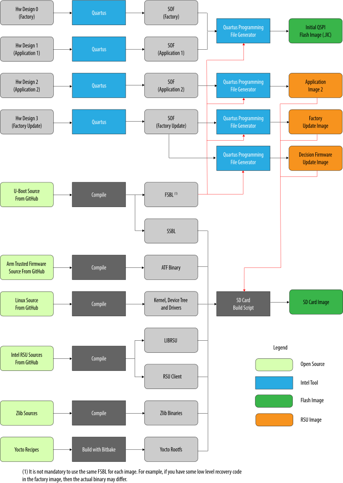
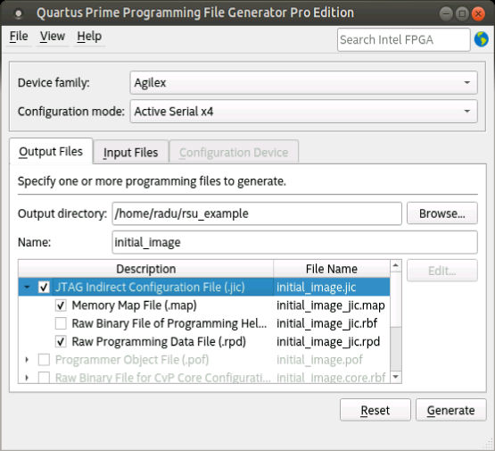
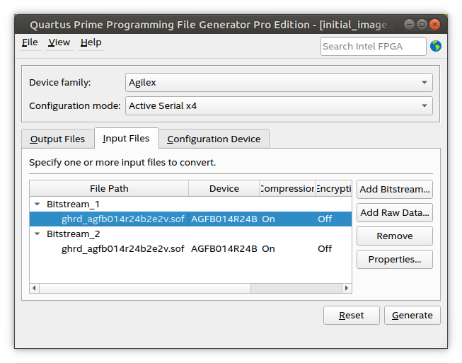
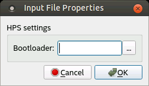
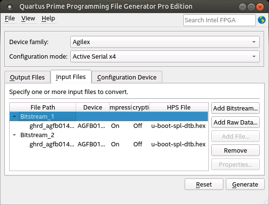
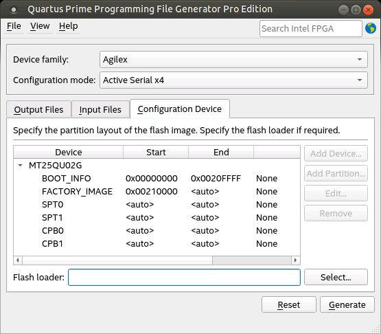
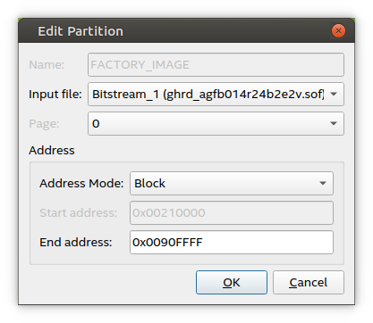
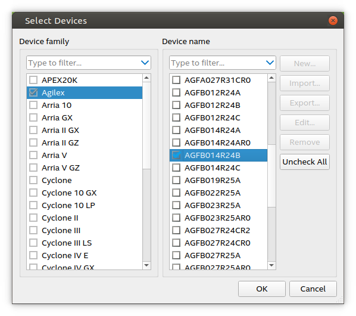
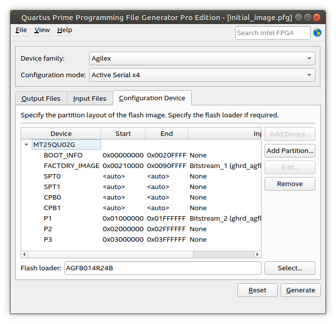
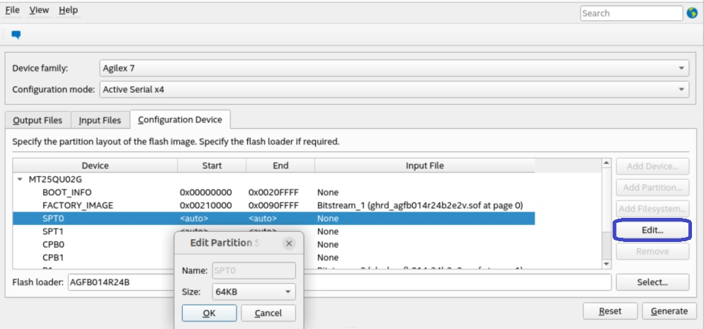

# HPS Remote System Update Example for the Agilex™ 7 FPGA F-Series Transceiver-SoC Development Kit (P-Tiles & E-Tile)

## Intro 

This page presents a complete Remote System Update example, running on the Agilex™ 7 Transceiver-SoC Development kit P-Tile E-Tile production Linear power solution (DK-SI-AGF014EB), including the following.

- Creating the initial flash image containing the following components.
  - Bitstreams for a factory image 
  - One application image 
  - Two empty slots to contain additional application images 

- Creating an SD card with the following components.
  - U-Boot 
  - Arm* Trusted Firmware 
  - f22Linux 
  - LIBRSU 
  - RSU client 
  - Application image 
  - Factory update image 
  - Decision firmware update image 
  - Combined application image 

- Exercising the Linux RSU client application. 
- Exercising the U-Boot RSU commands. 

Refer to [Agilex™ 7 Hard Processor System Remote System Update User Guide](https://www.intel.com/content/www/us/en/docs/programmable/683184/current/overview-s10-fm.html) for details about the Remote System Update. 

## Component Versions 

This example was created with Quartus<sup>&reg;</sup> Prime Pro Edition Version 25.1 and the following component versions.

| Repository | Branch/Tag |
| :-- | :-- |
| [agilex7f-ed-gsrd](https://github.com/altera-fpga/agilex7f-ed-gsrd) | QPDS25.1_REL_GSRD_PR |
| [linux-socfpga](https://github.com/altera-fpga/linux-socfpga) | socfpga-6.12.11-lts/QPDS25.1_REL_GSRD_PR |
| [arm-trusted-firmware](https://github.com/altera-fpga/arm-trusted-firmware) | socfpga_v2.12.0/QPDS25.1_REL_GSRD_PR |
| [u-boot-socfpga](https://github.com/altera-fpga/u-boot-socfpga) | socfpga_v2025.01/QPDS25.1_REL_GSRD_PR |
| [intel-rsu](https://github.com/altera-fpga/intel-rsu) | master |

For RSU example previous 24.2 version, please refer to [Agilex 7 SoC HPS Remote System Update](https://www.rocketboards.org/foswiki/Projects/AgilexHPSRemoteSystemUpdate).

## Prerequisites 

The following items are required to run the RSU example.

- Host PC running Ubuntu 22.04 LTS (other Linux versions may work too) 
 - Minimum 48 GB of RAM, required for compiling the hardware designs 
 - Quartus<sup>&reg;</sup> Prime Pro Edition Version 25.1  for compiling the hardware projects, generating the flash images and writing to flash 
- Access to Internet to download the hardware project archive, clone the git trees for U-Boot, Arm Trusted Firmware, Linux, zlib and LIBRSU and to build the Linux rootfs using Yocto. 
- [Agilex 7 Transceiver-SoC Development kit P-Tile E-Tile Production Linear power solution(DK-SI-AGF014EB)](https://www.intel.com/content/www/us/en/products/details/fpga/development-kits/agilex/si-agf014.html)  for running the example. 

## Building Binaries 


The diagram below illustrates the build flow used for this example.

 

The end results of the build flow are these.

- Initial flash image: contains the factory image, an application image and two empty application image partitions aka slots. 
- SD card image: contains SSBL (U-Boot), ATF (Arm Trusted Firmware), Linux device tree, Linux kernel, Linux rootfs with the Intel RSU driver, LIBRSU, RSU Client, an application image, a factory update image and a decision firmware update image. 

**Note:** To build binaries for a different development kit than the one used in this page, please refer to the [Building the Hardware Projects](#building-the-hardware-projects) section in the corresponding  GSRD page for that development kit, which is the section that may differ from the instructions presented here.

### Setting up the Environment 


Create a top folder to store the example files.


```bash 
sudo rm -rf agilex-rsu 
mkdir agilex-rsu 
cd agilex-rsu 
export set TOP_FOLDER=`pwd` 
```


Download the compiler toolchain, add it to the PATH variable, to be used by the GHRD makefile to build the HPS Debug FSBL:


```bash
cd $TOP_FOLDER
wget https://developer.arm.com/-/media/Files/downloads/gnu/11.2-2022.02/binrel/\
gcc-arm-11.2-2022.02-x86_64-aarch64-none-linux-gnu.tar.xz
tar xf gcc-arm-11.2-2022.02-x86_64-aarch64-none-linux-gnu.tar.xz
rm -f gcc-arm-11.2-2022.02-x86_64-aarch64-none-linux-gnu.tar.xz
export PATH=`pwd`/gcc-arm-11.2-2022.02-x86_64-aarch64-none-linux-gnu/bin:$PATH
export ARCH=arm64
export CROSS_COMPILE=aarch64-none-linux-gnu-
```

Enable Quartus tools to be called from command line:


```bash
export QUARTUS_ROOTDIR=~/altera_pro/25.1/quartus/
export PATH=$QUARTUS_ROOTDIR/bin:$QUARTUS_ROOTDIR/linux64:$QUARTUS_ROOTDIR/../qsys/bin:$PATH
```


### Building the Hardware Projects 


Create four different hardware projects, based on the GHRD from GitHub with a few changes listed next.

- Change the boot mode to FPGA first 
- Use a different ID in the SystemID component, to make the binaries for each project slightly different. 
- Change the behavior of watchdog timeout, to trigger an RSU event. 
- Set the max retry parameter to 3, so that each application image and the factory image are tried up to three time when configuration failures occur. 

The commands to create and compile the projects are listed below.


```bash 
cd $TOP_FOLDER 
# Build 4 versions of the hardware design
rm -rf hw && mkdir hw && cd hw
wget https://github.com/altera-fpga/agilex7f-ed-gsrd/archive/refs/tags/QPDS25.1_REL_GSRD_PR.zip
unzip QPDS25.1_REL_GSRD_PR.zip
rm QPDS25.1_REL_GSRD_PR.zip
mv agilex7f-ed-gsrd-QPDS25.1_REL_GSRD_PR agilex7f-ed-gsrd
# boot from FPGA 
export BOOTS_FIRST=fpga 
# enable watchdog 
export ENABLE_WATCHDOG_RST=1 
# treat watchdog timeout as configuration failure to trigger RSU 
export WATCHDOG_RST_ACTION=remote_update
# Customize parms in tcl
sed -i '/STRATIX_JTAG_USER_CODE 4/i set_global_assignment -name RSU_MAX_RETRY_COUNT 3' agilex7f-ed-gsrd/agilex_soc_devkit_ghrd/create_ghrd_quartus.tcl
for version in {0..3}
do
rm -rf ghrd.$version
cp -r agilex7f-ed-gsrd ghrd.$version
cd ghrd.$version
# update sysid to make binaries slightly different 
sed -i 's/0xACD5CAFE/0xABAB000'$version'/g' agilex_soc_devkit_ghrd/create_ghrd_qsys.tcl
# Finsish customization and now building the hardware design
make agf014eb-si-devkit-oobe-baseline-all
cd ..
done
rm -rf agilex7f-ed-gsrd 
cd .. 

```


After completing the above steps, the following SOF files are created.

- $TOP_FOLDER/hw/ghrd.0/install/designs/agf014eb_si_devkit_oobe_baseline.sof 
- $TOP_FOLDER/hw/ghrd.1/install/designs/agf014eb_si_devkit_oobe_baseline.sof 
- $TOP_FOLDER/hw/ghrd.2/install/designs/agf014eb_si_devkit_oobe_baseline.sof 
- $TOP_FOLDER/hw/ghrd.3/install/designs/agf014eb_si_devkit_oobe_baseline.sof 


### Building Arm Trusted Firmware 


The following commands are used to retrieve the Arm Trusted Firmware (ATF) and compile it.


```bash 
cd $TOP_FOLDER 
rm -rf arm-trusted-firmware 
git clone https://github.com/altera-fpga/arm-trusted-firmware 
cd arm-trusted-firmware 
# checkout the branch used for this document, comment out to use default 
git checkout -b test -t origin/socfpga_v2.12.0 
make bl31 PLAT=agilex 
cd .. 
```


After completing the above steps, the Arm Trusted Firmware binary file is created and is located here.

- $TOP_FOLDER/arm-trusted-firmware/build/agilex/release/bl31.bin 


### Building U-Boot 


The following commands can be used to get the U-Boot source code and compile it.


```bash 
cd $TOP_FOLDER
rm -rf u-boot-socfpga
git clone https://github.com/altera-fpga/u-boot-socfpga
cd u-boot-socfpga
# comment out next line to use the latest default branch 
git checkout -b test -t origin/socfpga_v2025.01 
# enable dwarf4 debug info, for compatibility with arm ds 
sed -i 's/PLATFORM_CPPFLAGS += -D__ARM__/PLATFORM_CPPFLAGS += -D__ARM__ -gdwarf-4/g' arch/arm/config.mk
# only boot from SD, do not try QSPI and NAND 
sed -i 's/u-boot,spl-boot-order.*/u-boot\,spl-boot-order = \&mmc;/g' arch/arm/dts/socfpga_agilex_socdk-u-boot.dtsi
# disable NAND in the device tree 
sed -i '/&nand {/!b;n;c\\tstatus = "disabled";' arch/arm/dts/socfpga_agilex_socdk-u-boot.dtsi 
# remove the NAND configuration from device tree 
sed -i '/images/,/binman/{/binman/!d}' arch/arm/dts/socfpga_agilex_socdk-u-boot.dtsi
# link to atf
ln -s $TOP_FOLDER/arm-trusted-firmware/build/agilex/release/bl31.bin .
# Create configuration custom file.
cat << EOF > config-fragment-agilex
# Use 'Image' for kernel image instead of 'kernel.itb'
CONFIG_BOOTFILE="Image"
# - Disable NAND/UBI related settings from defconfig.
CONFIG_NAND_BOOT=n
CONFIG_SPL_NAND_SUPPORT=n
CONFIG_CMD_NAND_TRIMFFS=n
CONFIG_CMD_NAND_LOCK_UNLOCK=n
CONFIG_NAND_DENALI_DT=n
CONFIG_SYS_NAND_U_BOOT_LOCATIONS=n
CONFIG_SPL_NAND_FRAMEWORK=n
CONFIG_CMD_NAND=n
CONFIG_MTD_RAW_NAND=n
CONFIG_CMD_UBI=n
CONFIG_CMD_UBIFS=n
CONFIG_MTD_UBI=n
CONFIG_ENV_IS_IN_UBI=n
CONFIG_UBI_SILENCE_MSG=n
CONFIG_UBIFS_SILENCE_MSG=n
# - Disable distroboot and use specific boot command.
CONFIG_DISTRO_DEFAULTS=n
CONFIG_HUSH_PARSER=y
CONFIG_SYS_PROMPT_HUSH_PS2="> "
CONFIG_USE_BOOTCOMMAND=y
CONFIG_BOOTCOMMAND="bridge enable; setenv bootfile Image; run mmcload;run linux_qspi_enable;run rsu_status;run mmcboot"
CONFIG_CMD_FAT=y
CONFIG_CMD_FS_GENERIC=y
CONFIG_DOS_PARTITION=y
CONFIG_SPL_DOS_PARTITION=y
CONFIG_CMD_PART=y
CONFIG_SPL_CRC32=y
CONFIG_LZO=y
CONFIG_CMD_DHCP=y
CONFIG_SYS_PROMPT="SOCFPGA # "
EOF
# build U-Boot 
make clean && make mrproper
make socfpga_agilex_defconfig
# Use created custom configuration file to merge with the default configuration obtained in .config file.
./scripts/kconfig/merge_config.sh -O ./ ./.config ./config-fragment-agilex
make -j 48
cd .. 
```


After completing the above steps, the following files are created.

- $TOP_FOLDER/u-boot-socfpga/spl/u-boot-spl-dtb.hex - FSBL (U-boot SPL) hex file 
- $TOP_FOLDER/u-boot-socfpga/u-boot.itb - FIT image file containing SSBL (U-Boot) and ATF (Arm Trusted Firmware) binaries 


### Building Linux 


The following commands can be used to obtain the Linux source code and build Linux.


```bash 
cd $TOP_FOLDER 
rm -rf linux-socfpga
git clone https://github.com/altera-fpga/linux-socfpga
cd linux-socfpga
# checkout the branch used for this document, comment out to use default
git checkout -b test -t origin/socfpga-6.12.11-lts 
# configure the RSU driver to be built into the kernel
make clean && make mrproper
make defconfig
./scripts/config --set-val CONFIG_INTEL_STRATIX10_RSU y
make oldconfig
make -j 48 Image dtbs
cd ..
```


After completing the above steps, the following files are created.

- $TOP_FOLDER/linux-socfpga/arch/arm64/boot/Image - kernel image 
- $TOP_FOLDER/linux-socfpga/arch/arm64/boot/dts/intel/socfpga_agilex_socdk.dtb - kernel device tree 


### Creating the Initial Flash Image 


This section presents detailed instructions on how to create the initial flash image, by using the Programming File Generator. 

For reference, an example of the  Programming File Generator configuration file is provided below so and you can easily create the initial flash image by passing it to the Programming File Generator as shown below.


```bash 
cd $TOP_FOLDER 
# Create automatically the .pfg file
cat << EOF > initial_image.pfg
<pfg version="1">
    <settings custom_db_dir="./" mode="ASX4"/>
    <output_files>
        <output_file name="initial_image" directory="./" type="JIC">
            <file_options/>
            <secondary_file type="MAP" name="initial_image_jic">
                <file_options/>
            </secondary_file>
            <secondary_file type="SEC_RPD" name="initial_image_jic">
                <file_options bitswap="1"/>
            </secondary_file>
            <flash_device_id>Flash_Device_1</flash_device_id>
        </output_file>
    </output_files>
    <bitstreams>
        <bitstream id="Bitstream_1">
            <path signing="OFF" finalize_encryption="0" hps_path="u-boot-socfpga/spl/u-boot-spl-dtb.hex">hw/ghrd.0/install/designs/agf014eb_si_devkit_oobe_baseline.sof</path>
        </bitstream>
        <bitstream id="Bitstream_2">
            <path signing="OFF" finalize_encryption="0" hps_path="u-boot-socfpga/spl/u-boot-spl-dtb.hex">hw/ghrd.1/install/designs/agf014eb_si_devkit_oobe_baseline.sof</path>
        </bitstream>
    </bitstreams>
    <flash_devices>
        <flash_device type="MT25QU02G" id="Flash_Device_1">
            <partition reserved="1" fixed_s_addr="1" s_addr="0x00000000" e_addr="0x0020FFFF" fixed_e_addr="1" id="BOOT_INFO" size="0"/>
            <partition reserved="1" extra_space="262144" fixed_s_addr="1" s_addr="0x00210000" e_addr="0x0090FFFF" fixed_e_addr="0" id="FACTORY_IMAGE" size="0"/>
            <partition reserved="1" fixed_s_addr="1" s_addr="auto" e_addr="auto" fixed_e_addr="1" id="SPT0" size="65536"/>
            <partition reserved="1" fixed_s_addr="1" s_addr="auto" e_addr="auto" fixed_e_addr="1" id="SPT1" size="65536"/>
            <partition reserved="1" fixed_s_addr="1" s_addr="auto" e_addr="auto" fixed_e_addr="1" id="CPB0" size="65536"/>
            <partition reserved="1" fixed_s_addr="1" s_addr="auto" e_addr="auto" fixed_e_addr="1" id="CPB1" size="65536"/>
            <partition reserved="0" fixed_s_addr="0" s_addr="0x01000000" e_addr="0x01FFFFFF" fixed_e_addr="0" id="P1" size="0"/>
            <partition reserved="0" fixed_s_addr="0" s_addr="0x02000000" e_addr="0x02FFFFFF" fixed_e_addr="0" id="P2" size="0"/>
            <partition reserved="0" fixed_s_addr="0" s_addr="0x03000000" e_addr="0x03FFFFFF" fixed_e_addr="0" id="P3" size="0"/>
        </flash_device>
        <flash_loader>AGFB014R24B</flash_loader>
    </flash_devices>
    <assignments>
        <assignment page="0" partition_id="FACTORY_IMAGE">
            <bitstream_id>Bitstream_1</bitstream_id>
        </assignment>
        <assignment page="1" partition_id="P1">
            <bitstream_id>Bitstream_2</bitstream_id>
        </assignment>
    </assignments>
</pfg>

EOF

# Create Initial Image for previous release (in case needed to test  combined application)
~/intelFPGA_pro/24.3.1/quartus/bin/quartus_pfg -c initial_image.pfg
mv initial_image.jic initial_image_prev.jic
mv initial_image_jic.rpd initial_image_jic_prev.rpd
mv initial_image_jic.map initial_image_jic_prev.map

# Create Initial Image for this release
quartus_pfg -c initial_image.pfg
```


Here are the complete instructions on how to manually create the initial flash image, without relying on the provided Programming File Generator configuration file.

1. Start the **Programming File Generator** tool by running the qpfgw command.

    ```bash 
    cd $TOP_FOLDER
    qpfgw &
    ```

2. Select the **Device family** as **Agilex 7**, and **Configuration mode** as **Active Serial x4**. 

3. Change the **Name** to initial_image. 

4. Select the output file type as **JTAG Indirect Configuration File (. jic )**, which is the format used by the Quartus Prime Programmer tool for writing to the QSPI flash. 

5. Select the optional **Memory Map File (.map )** file so that it is also generated. The .map file contains information about the resulted flash layout. 

6. Select the optional **Raw Programming Data File (.rpd )** file so that it is also generated. This file contains the binary flash content, without anything else added. 

    The window looks similar to this.

     

7. Click the **Raw Programming Data File (.rpd )** file to select it. Then click the **Edit ...** button and select the **Bitswap** option to be "On". This enables the RPD file to be usable by HPS software like U-Boot and Linux if needed. 

8. Once the output type was selected, click the **Input Files** tab. 

9. In the **Input Files** tab click the **Add Bitstream** button, then browse to **$TOP_FOLDER/hw/ghrd.0/output_files**, select the file **ghrd_agfb014r24b2e2v.sof**, and then click **Open**. This is the initial factory image. Do the same for the **$TOP_FOLDER/hw/ghrd.1/install/designs/agf014eb_si_devkit_oobe_baseline.sof** image. This is the initial application image. The tab now looks like below.

     

10. Click the first .sof file, then click the **Properties** button on the right side. This opens the window to browse for the FSBL and select authentication and encryption settings. 

     

11. Click the **Bootloader  (Browse)** button and select the file **$TOP_FOLDER/uboot-socfpga/spl/u-boot-spl-dtb.hex**, then click **OK**. 

12. Click the second .sof file and add the same FSBL file to it. The **Input Files** tab now looks like shown below.

      

13. Click the **Configuration Device** tab. Note that the tab is only enabled once at least one input file was added in the **Input Files** tab. 

14. Because more than one input file was added in the **Input Files** tab, it displays the options for remote system update. Otherwise, it only enables the standard configuration flow. 

15. In the **Configuration Device** tab, click **Add Device**, select the **MT25QU02G** in the dialog box window, then click **OK**. Once that is done, the window displays the default initial partitioning for RSU.

      

16. Select the **FACTORY_IMAGE** entry, and click the **Edit** button. The **Edit Partition** window pops up. Select the **Input file** as **Bitstream_1 (agf014eb_si_devkit_oobe_baseline.sof)**. Change **Address Mode** to **Block** because you want to make sure you are leaving enough space for the biggest factory image you anticipate using. Set the **End Address** to **0x0090FFFF** in order to reserve 7MB for the factory image. This end address was calculated by adding 8MB to the end of the **BOOT_INFO** partition. Click **OK**. 

     **Note:** There is a requirement that the starting address of the **SPT0** partition is aligned to 64KB. In order to warranty this, the **End Address** of the **FACTORY_IMAGE** must finish at an address ending with **0xXXXXFFFF**.

      

     **Note**: The Page property for **FACTORY_IMAGE** partition must always be set to 0. This means that the **FACTORY_IMAGE** will be trieed after all the application images failed. 

17. Select the **MT25QU02G** flash device in the Configuration Device tab by clicking it, then click the **Add Partition** button to open the **Add Partition** window. Leave the **Name** as **P1** and select the **Input file** as **Bitstream_2(agf014eb_si_devkit_oobe_baseline.sof)**. This becomes the initial application image. Select the **Page** as **1**. Select the **Address Mode** as **Block** and allocate 16MB of data by setting **Start Address** = **0x01000000** and **End Address** = **0x01FFFFFF**. Since this is the first partition defined, this becomes the initial application image to be loaded and has the highest priority of all application images that may be defined later.

     The actual priority in which an application in a partition is loaded is defined based on the order in which the partition is defined when creating the initial flash image as shown above in this step.
     The Programming File Generator issues an error if there are multiple partitions with the same page number, or if there are any “gaps” as in having a Page=1 then a Page=3, without a Page=2 for example.

     Only up to seven partitions can contain application images at initial flash image creation time. This limitation does not have adverse effects, as typically at creation time it is expected to have just a factory image and one application image

18. Create two more partitions **P2** and **P3** using the same procedure as for the previous step, except set the **Input file** to **None**, leave **Page** unchanged (it does not matter for empty partitions) and set the start and end addresses as follows. 

     * **P2**: **Start Address** = **0x02000000** and **End Address** = **0x02FFFFFF**. <br>
     * **P3**: **Start Address** = **0x03000000** and **End Address** = **0x03FFFFFF**. 

    **Note:** Make sure that all the partitions created for the applications fit in the appropriate QSPI partition or partitions defined in device corresponding device tree in U-Boot and Linux. In the case of Linux, also make sure that the QSPI partition or partitions defined in the device tree to store the applications partitions are also defined in the **qspi.rc** file in **LIBRSU**.

19. Click **Select** to select the **Flash loader**. The flash loader becomes part of the JIC file and is used by the Flash Programmer tool. Select the desired **Device family** and **Device name** as shown below.

      

     The Configuration Device tab now looks like as shown below.

      

20. You require to change the size of the SPTs and CPBs to 64 KB hence the HPS software uses now this size. This is done by selecting any of the components and pressing the **Edit** button. Expect to see a menu where you can select the option desired. Select the 64 KB size. You only need to update the size of one of these components and can expect to see the rest updated automatically with the same value chosen. 

      

21. Click **File > Save As ..** and save the file as **$TOP_FOLDER/initial_image.pfg**. This file can be useful later, if you wanted to re-generate the initial image by using the command.

     ```bash 
     cd $TOP_FOLDER
     quartus_pfg -c initial_image.pfg
     ```

     **Note**: The created pfg file is actually an XML file which can be manually edited to replace the absolute file paths with relative file paths. You cannot directly edit the .pfg file for other purposes. The .pfg file can be opened from Programming File Generator, if changes are needed. 

22. Click the **Generate** button to generate the initial flash image as **$TOP_FOLDER/initial_image.jic** and the map file as **$TOP_FOLDER/initial_image_jic.map**. A dialog box opens indicating the files were generated successfully. 


### Creating the Application Image 


The following commands are used to create the application image used in this example.


```bash 
cd $TOP_FOLDER
mkdir -p images
rm -rf images/application2.rpd
quartus_pfg -c hw/ghrd.2/install/designs/agf014eb_si_devkit_oobe_baseline.sof \
images/application2.rpd \
-o hps_path=u-boot-socfpga/spl/u-boot-spl-dtb.hex \
-o mode=ASX4 \
-o bitswap=ON
```


The following application image is created.

- $TOP_FOLDER/images/application2.rpd. 


### Creating the Factory Update Image 


The following commands are used to create the factory update image used in this example.


```bash 
cd $TOP_FOLDER
mkdir -p images
rm -f images/factory_update.rpd
quartus_pfg -c hw/ghrd.3/install/designs/agf014eb_si_devkit_oobe_baseline.sof \
images/factory_update.rpd \
-o hps_path=u-boot-socfpga/spl/u-boot-spl-dtb.hex \
-o mode=ASX4 \
-o bitswap=ON \
-o rsu_upgrade=ON
```


The following factory update image is created. 

- $TOP_FOLDER/images/factory_update.rpd 


### Creating the Decision Firmware Update Image 


The following commands are used to create the decision firmware update image used in this example.


```bash 
cd $TOP_FOLDER 
mkdir -p images
rm -f images/decision_firmware_update.rpd
quartus_pfg -c hw/ghrd.3/install/designs/agf014eb_si_devkit_oobe_baseline.sof \
images/decision_firmware_update.rpd \
-o hps_path=u-boot-socfpga/spl/u-boot-spl-dtb.hex \
-o mode=ASX4 \
-o bitswap=ON \
-o rsu_upgrade=ON \
-o firmware_only=ON
```


The following decision firmware update image is created. 

- $TOP_FOLDER/images/decision_firmware_update.rpd 

**Note**: The provided SOF file is used by the quartus_pfg to determine the parameters that are writen to the decision firmware data structure. This includes QSPI clock and pin settings, the value of max_retry parameter, and the selected behavior of the HPS watchdog. The actual configuration data from the SOF file is not used. 


### Creating the Combined Application Image 


The following commands are used to create the combined application image used in this example.


```bash 
cd $TOP_FOLDER 
mkdir -p images
rm -f images/combined_application.rpd
quartus_pfg -c hw/ghrd.3/install/designs/agf014eb_si_devkit_oobe_baseline.sof \
images/combined_application.rpd \
-o app_image=hw/ghrd.2/install/designs/agf014eb_si_devkit_oobe_baseline.sof \
-o hps_path=u-boot-socfpga/spl/u-boot-spl-dtb.hex \
-o app_image_hps_path=u-boot-socfpga/spl/u-boot-spl-dtb.hex \
-o mode=ASX4 \
-o bitswap=ON \
-o rsu_upgrade=ON \
-o app_image_only=ON
```


The following file is created.

- $TOP_FOLDER/images/combined_application.rpd 

**Notes:**

* The first SOF file contains the factory image, from which data is taken to fill out the new decision firmware data structure. This includes QSPI clock and pin settings, the value of max_retry parameter, and the selected behavior of the HPS watchdog. The actual configuration data from this SOF file is not used.
* The **app_image** parameter contains the SOF that is used for the application image section of the combined image.
* The **hps_path** parameter is unused, and may be removed in the future.
* The **app_image_hps_path** parameter contains the HPS FSBL hex file to be used for the application imge section of the combined image.
* When using HPS first, the additional parameter **"-o hps=1"** needs to be added, and
the following files are created **combined_application.hps.rpd** (combined application image)  and **combined_application.core.rbf** (corresponding fabric configuration file).


### Building the Root File System 


A root file system is required to boot Linux. There are a lot of ways to build a root file system, depending on your specific needs. This section shows how to build a small root file system using Yocto. 

1\. Make sure you have Yocto system requirements met: https://docs.yoctoproject.org/5.0.1/ref-manual/system-requirements.html#supported-linux-distributions.

The command to install the required packages on Ubuntu 22.04 is:

```bash
sudo apt-get update
sudo apt-get upgrade
sudo apt-get install openssh-server mc libgmp3-dev libmpc-dev gawk wget git diffstat unzip texinfo gcc \
build-essential chrpath socat cpio python3 python3-pip python3-pexpect xz-utils debianutils iputils-ping \
python3-git python3-jinja2 libegl1-mesa libsdl1.2-dev pylint xterm python3-subunit mesa-common-dev zstd \
liblz4-tool git fakeroot build-essential ncurses-dev xz-utils libssl-dev bc flex libelf-dev bison xinetd \
tftpd tftp nfs-kernel-server libncurses5 libc6-i386 libstdc++6:i386 libgcc++1:i386 lib32z1 \
device-tree-compiler curl mtd-utils u-boot-tools net-tools swig -y
```

On Ubuntu 22.04 you will also need to point the /bin/sh to /bin/bash, as the default is a link to /bin/dash:

```bash
 sudo ln -sf /bin/bash /bin/sh
```

**Note**: You can also use a Docker container to build the Yocto recipes, refer to https://rocketboards.org/foswiki/Documentation/DockerYoctoBuild for details. When using a Docker container, it does not matter what Linux distribution or packages you have installed on your host, as all dependencies are provided by the Docker container.

2\. Run the following commands to build the root file system.

  

  ```bash 
  cd $TOP_FOLDER 
  rm -rf yocto && mkdir yocto && cd yocto
  git clone -b styhead https://git.yoctoproject.org/poky
  git clone -b styhead https://git.yoctoproject.org/meta-intel-fpga
  git clone -b styhead   https://github.com/openembedded/meta-openembedded
  # work around issue
  echo 'do_package_qa[noexec] = "1"' >> $(find meta-intel-fpga -name linux-socfpga_6.6.bb)
  source poky/oe-init-build-env ./build
  echo 'MACHINE = "agilex7_dk_si_agf014eb"' >> conf/local.conf
  echo 'BBLAYERS += " ${TOPDIR}/../meta-intel-fpga "' >> conf/bblayers.conf
  echo 'BBLAYERS += " ${TOPDIR}/../meta-openembedded/meta-oe "' >> conf/bblayers.conf
  echo 'IMAGE_FSTYPES = "tar.gz"' >> conf/local.conf
  echo 'CORE_IMAGE_EXTRA_INSTALL += "openssh gdbserver"' >> conf/local.conf
  bitbake core-image-minimal
  ```
  

After the build completes, which can take a few hours depending on your host system processing power and Internet connection speed, the following root file system archive is created.

* TOP_FOLDER/yocto/build/tmp/deploy/images/agilex7_dk_si_agf014eb/core-image-minimal-agilex7_dk_si_agf014eb.rootfs.tar.gz 


### Building ZLIB 


The ZLIB is required by LIBRSU. The following steps can be used to compile it.


```bash 
cd $TOP_FOLDER
rm -rf zlib-1.3.1
wget http://zlib.net/zlib-1.3.1.tar.gz
tar xf zlib-1.3.1.tar.gz
rm zlib-1.3.1.tar.gz
cd zlib-1.3.1/
export CROSS_PREFIX=${CROSS_COMPILE}
./configure
make
export ZLIB_PATH=`pwd`
cd ..
```


After the above steps are completed, the following items are available.

- $TOP_FOLDER/zlib-1.3.1/zlib.h - header file, used to compile files using zlib services 
- $TOP_FOLDER/zlib-1.3.1/libz.so* - shared objects, used to run executables linked against zlib APIs 

**Note**: The version of zlib mentioned above is the one that was tested with this release. You may want to use the latest zlib version, as it may contain updates and bug fixes. 


### Building LIBRSU and RSU Client 


The following commands can be used to build the LIBRSU and the example client application. 


```bash 
cd $TOP_FOLDER 
rm -rf intel-rsu
git clone https://github.com/altera-fpga/intel-rsu
cd intel-rsu
# checkout the branch used for this document, comment out to use default 
# git checkout -b test -t origin/master
cd lib
# add -I$(ZLIB_PATH) to CFLAGS
sed -i 's/\(CFLAGS := .*\)$/\1 -I\$\(ZLIB_PATH\)/g' makefile
make
cd ..
cd example
# add -L$(ZLIB_PATH) to LDFLAGS
sed -i 's/\(LDFLAGS := .*\)$/\1 -L\$\(ZLIB_PATH\)/g' makefile
make
cd ..
cd ..
```


The following files are created.

- $TOP_FOLDER/intel-rsu/lib/librsu.so - shared object required at runtime for running applications using librsu 
- $TOP_FOLDER/intel-rsu/etc/qspi.rc - resource file for librsu configuration 
- $TOP_FOLDER/intel-rsu/example/rsu_client - example client application using librsu 


### Building the SD Card 


The following commands can be used to create the SD card image used in this example.


```bash 
cd $TOP_FOLDER
sudo rm -rf sd_card && mkdir sd_card && cd sd_card
wget https://releases.rocketboards.org/release/2021.04/gsrd/tools/make_sdimage_p3.py 
chmod +x make_sdimage_p3.py
# prepare the fat contents 
mkdir fat && cd fat
cp $TOP_FOLDER/u-boot-socfpga/u-boot.itb .
cp $TOP_FOLDER/linux-socfpga/arch/arm64/boot/Image .
cp $TOP_FOLDER/linux-socfpga/arch/arm64/boot/dts/intel/socfpga_agilex_socdk.dtb .
cp $TOP_FOLDER/images/*.rpd .
cd ..
# prepare the rootfs partition contents 
mkdir rootfs && cd rootfs
sudo tar xf $TOP_FOLDER/yocto/build/tmp/deploy/images/agilex7_dk_si_agf014eb/core-image-minimal-agilex7_dk_si_agf014eb.rootfs.tar.gz
sudo sed -i 's/agilex7_dk_si_agf014eb/linux/g' etc/hostname
sudo rm -rf lib/modules/*
sudo cp $TOP_FOLDER/images/*.rpd home/root
sudo cp $TOP_FOLDER/intel-rsu/example/rsu_client home/root/
sudo cp $TOP_FOLDER/intel-rsu/lib/librsu.so lib/
sudo cp $TOP_FOLDER/intel-rsu/etc/qspi.rc etc/librsu.rc
sudo cp $TOP_FOLDER/zlib-1.3.1/libz.so* lib/
cd ..
# create sd card image
sudo python3 ./make_sdimage_p3.py -f \
-P fat/*,num=1,format=vfat,size=100M \
-P rootfs/*,num=2,format=ext3,size=100M \
-s 256M \
-n sdcard_rsu.img
cd ..
```


This creates the SD card image as 

- $TOP_FOLDER/sd_card/sdcard_rsu.img. 

The following items are included in the rootfs on the SD card. 

- U-Boot 
- ATF 
- Linux kernel, including RSU driver 
- ZLIB shared objects 
- LIBRSU shared objects and resource files 
- RSU client application 
- Application image 
- Factory update image 
- Decision firmware update image 
- Combined application image 


## Flashing Binaries 

### Writing Initial RSU Image to QSPI 

1. Make sure to install the QSPI SDM bootcard on the Agilex SoC Development Kit 

2. Power down the board if powered up 

3. Configure the Agilex SoC Development Kit switches to have MSEL set to JTAG. 

4. Run the following command to write the image to SDM QSPI by using the command line version of the Quartus Prime Programmer.

    ```bash 
    cd $TOP_FOLDER 
    quartus_pgm -c 1 -m jtag -o "pvi;./initial_image.jic"
    ```

5. Configure the Agilex SoC Development Kit switches to have MSEL set to QSPI. 

### Writing the SD Card Image 

1. Write the SD card image $TOP_FOLDER/sd_card/sdcard_rsu.img to a microSD card. You can use an USB micro SD card writer and the Linux dd command on your host PC to achieve this. Exercise caution when using the dd command, as incorrect usage can lead to your host Linux system becoming corrupted and non-bootable. 

2. Insert the micro SD card in the slot on the Agilex SoC Development kit HPS daughtercard. 

## Exercising U-Boot RSU Commands 

### Basic RSU Operations 

This section demonstrates how to use U-Boot to perform the following basic operations.

- Querying the RSU status. 
- Querying the number of slots and the information about them. 
- Adding a new application image. 
- Verifying that an application image was written correctly. 
- Requesting a specific application image to be loaded. 

**Note**: This section assumes that the flash contains the initial RSU image. If that is not true, you need to re-flash the initial image, as shown in the Flashing the Initial RSU Image to QSPI . 

1. Power up the board and press any key when prompted, to get to the U-Boot command prompt.

    ```bash 
    U-Boot SPL 2024.01-33547-g098abd8f13-dirty (Aug 19 2024 - 12:15:42 -0500)
    Reset state: Cold
    MPU          1200000 kHz
    L4 Main	      400000 kHz
    L4 sys free   100000 kHz
    L4 MP         200000 kHz
    L4 SP         100000 kHz
    SDMMC          50000 kHz
    DDR: 8192 MiB
    SDRAM-ECC: Initialized success with 1722 ms
    QSPI: Reference clock at 400000 kHz
    WDT:   Started watchdog@ffd00200 with servicing every 1000ms (10s timeout)
    Trying to boot from MMC1
    ## Checking hash(es) for config board-0 ... OK
    ## Checking hash(es) for Image atf ... crc32+ OK
    ## Checking hash(es) for Image uboot ... crc32+ OK
    ## Checking hash(es) for Image fdt-0 ... crc32+ OK
    NOTICE:  BL31: v2.10.1	(release):QPDS24.2_REL_GSRD_PR
    NOTICE:  BL31: Built : 12:14:02, Aug 19 2024

    U-Boot 2024.01-33547-g098abd8f13-dirty (Aug 19 2024 - 12:15:42 -0500)socfpga_agilex
    
    CPU:   Intel FPGA SoCFPGA Platform (ARMv8 64bit Cortex-A53)
    Model: SoCFPGA Agilex SoCDK
    DRAM:  2 GiB (effective 8 GiB)
    Core:  28 devices, 23 uclasses, devicetree: separate
    WDT:   Started watchdog@ffd00200 with servicing every 1000ms (10s timeout)
    MMC:   dwmmc0@ff808000: 0
    Loading Environment from FAT... Unable to read "uboot.env" from mmc0:1...
    In:    serial0@ffc02000
    Out:   serial0@ffc02000
    Err:   serial0@ffc02000
    Net:   
    Warning: ethernet@ff800000 (eth0) using random MAC address - 86:c6:bd:7c:4f:7d
    eth0: ethernet@ff800000
    Hit any key to stop autoboot:  0 
    SOCFPGA # 
    ```

2. Run the rsu command without parameters, to display its help message, and usage options. 

    ```bash 
    SOCFPGA # rsu 
    rsu - Agilex SoC Remote System Update 
 
    Usage: 
    rsu dtb - Update Linux DTB qspi-boot parition offset with spt0 value 
    list - List down the available bitstreams in flash 
    slot_by_name <name> - find slot by name and display the slot number 
    slot_count - display the slot count 
    slot_disable <slot> - remove slot from CPB 
    slot_enable <slot> - make slot the highest priority 
    slot_erase <slot> - erase slot 
    slot_get_info <slot> - display slot information 
    slot_load <slot> - load slot immediately 
    slot_load_factory - load factory immediately 
    slot_priority <slot> - display slot priority 
    slot_program_buf <slot> <buffer> <size> - program buffer into slot, and make it highest priority 
    slot_program_buf_raw <slot> <buffer> <size> - program raw buffer into slot 
    slot_program_factory_update_buf <slot> <buffer> <size> - program factory update buffer into slot, and make it highest priority 
    slot_rename <slot> <name> - rename slot 
    slot_delete <slot> - delete slot 
    slot_create <name> <address> <size> - create slot 
    slot_size <slot> - display slot size 
    slot_verify_buf <slot> <buffer> <size> - verify slot contents against buffer 
    slot_verify_buf_raw <slot> <buffer> <size> - verify slot contents against raw buffer 
    status_log - display RSU status 
    update <flash_offset> - Initiate firmware to load bitstream as specified by flash_offset 
    notify <value> - Let SDM know the current state of HPS software 
    clear_error_status - clear the RSU error status 
    reset_retry_counter - reset the RSU retry counter 
    display_dcmf_version - display DCMF versions and store them for SMC handler usage 
    display_dcmf_status - display DCMF status and store it for SMC handler usage 
    display_max_retry - display max_retry parameter, and store it for SMC handler usage 
    restore_spt <address> - restore SPT from an address 
    save_spt <address> - save SPT to an address 
    create_empty_cpb - create a empty CPB 
    restore_cpb <address> - restore CPB from an address 
    save_cpb <address> - save CPB to an address 
    check_running_factory - check if currently running the factory image 
    ```

3. Run the rsu list command to display the RSU partitions, CPBs, the currently running image and the status. 

    ```bash
    SOCFPGA # rsu list 
    RSU: Remote System Update Status 
    Current Image : 0x01000000 
    Last Fail Image : 0x00000000 
    State : 0x00000000 
    Version : 0x00000202 
    Error location : 0x00000000 
    Error details : 0x00000000 
    Retry counter : 0x00000000 
    RSU: Sub-partition table 0 offset 0x00910000 
    RSU: Sub-partition table 1 offset 0x00920000 
    RSU: Sub-partition table content 
    BOOT_INFO Offset: 0x0000000000000000 Length: 0x00210000 Flag : 0x00000003 
    FACTORY_IMAGE Offset: 0x0000000000210000 Length: 0x00700000 Flag : 0x00000003 
    P1 Offset: 0x0000000001000000 Length: 0x01000000 Flag : 0x00000000 
    SPT0 Offset: 0x0000000000910000 Length: 0x00010000 Flag : 0x00000001 
    SPT1 Offset: 0x0000000000920000 Length: 0x00010000 Flag : 0x00000001 
    CPB0 Offset: 0x0000000000930000 Length: 0x00010000 Flag : 0x00000001 
    CPB1 Offset: 0x0000000000940000 Length: 0x00010000 Flag : 0x00000001 
    P2 Offset: 0x0000000002000000 Length: 0x01000000 Flag : 0x00000000 
    P3 Offset: 0x0000000003000000 Length: 0x01000000 Flag : 0x00000000 
    RSU: CMF pointer block offset 0x00930000 
    RSU: CMF pointer block's image pointer list 
    Priority 1 Offset: 0x0000000001000000 nslot: 0 
    ```

    **Note**: The rsu list U-Boot command does not have a RSU client equivalent. Instead, the same information can be retrieved using other commands, as shown next. 

4. Run the rsu status_log command to display the RSU status.

    ```bash 
     SOCFPGA # rsu status_log 
     Current Image : 0x01000000 
     Last Fail Image : 0x00000000 
     State : 0x00000000 
     Version : 0x00000202 
     Error location : 0x00000000 
     Error details : 0x00000000 
     Retry counter : 0x00000000 
    ```

    Application image P1 is loaded, as it is the highest priority in the CPB. There are no errors. 

5. Run the rsu display_dcmf_version to query and display the decision firmware versions.

    ```bash 
    SOCFPGA # rsu display_dcmf_version 
    DCMF0 version = 25.1.0 
    DCMF1 version = 25.1.0  
    DCMF2 version = 25.1.0  
    DCMF3 version = 25.1.0  
    SOCFPGA # rsu slot_count 
    Number of slots = 3. 
    SOCFPGA # rsu slot_get_info 0 
    NAME: P1 
    OFFSET: 0x0000000001000000 
    SIZE: 0x01000000 
    PRIORITY: 1 
    SOCFPGA # rsu slot_get_info 1 
    NAME: P2 
    OFFSET: 0x0000000002000000 
    SIZE: 0x01000000 
    PRIORITY: [disabled] 
    SOCFPGA # rsu slot_get_info 2 
    NAME: P3 
    OFFSET: 0x0000000003000000 
    SIZE: 0x01000000 
    PRIORITY: [disabled] 
    SOCFPGA # rsu slot_size 0 
    Slot 0 size = 16777216. 
    SOCFPGA # rsu slot_size 1 
    Slot 1 size = 16777216. 
    SOCFPGA # rsu slot_size 2 
    Slot 2 size = 16777216. 
    ```

6. Erase slot 1 and add the application2.rpd image to slot 1.

    ```bash 
    SOCFPGA # rsu slot_erase 1 
    Slot 1 erased. 
    SOCFPGA # load mmc 0:1 $loadaddr application2.rpd 
    2248704 bytes read in 103 ms (20.8 MiB/s) 
    SOCFPGA # rsu slot_program_buf 1 $loadaddr $filesize 
    Slot 1 was programmed with buffer=0x0000000002000000 size=2248704. 
    SOCFPGA # rsu slot_verify_buf 1 $loadaddr $filesize 
    Slot 1 was verified with buffer=0x0000000002000000 size=2248704. 
    SOCFPGA # rsu slot_get_info 1 
    NAME: P2 
    OFFSET: 0x0000000002000000 
    SIZE: 0x01000000 
    PRIORITY: 1 
    ```

7. Power cycle the board, stop U-Boot and check the RSU status log. 

    ```bash 
    SOCFPGA # rsu status_log 
    Current Image : 0x02000000 
    Last Fail Image : 0x00000000 
    State : 0x00000000 
    Version : 0x00000202 
    Error location : 0x00000000 
    Error details : 0x00000000 
    Retry counter : 0x00000000 
    ```

    The application image from slot 1 (partition P2) was loaded, because it is marked as the highest priority in the CPB. 

    **Important Note**: Causing the newly written application image to be loaded can also be done without a power cycle, by requesting the specific image to be loaded, in this case using the following command.

    ```bash 
    rsu slot_load 1 
    ```

8. Load the application image from slot 0 (partition P1) by running any of the following two commands. 

    ```bash 
    SOCFPGA # rsu update 0x01000000 
    RSU: RSU update to 0x0000000001000000 
    or 
    SOCFPGA # rsu slot_load 0 
    ```

9. Load the newly requested image. Stop at U-Boot prompt and check the status log to confirm it.

    ```bash 
    SOCFPGA # rsu status_log 
    Current Image : 0x01000000 
    Last Fail Image : 0x00000000 
    State : 0x00000000 
    Version : 0x00000202 
    Error location : 0x00000000 
    Error details : 0x00000000 
    Retry counter : 0x00000000 
    ```

    **Note**: In U-Boot, the effect of requesting a specific image is immediate. On Linux, it only takes effect on the next reboot command. 

### Watchdog and Max Retry Operation 

This section uses U-Boot to demonstrate the following. 

- RSU handling of watchdog timeouts. 
- max retry feature, which allows each image to be tried to be loaded up to three times. 
- RSU notify, which allows the HPS software state to be reported before and retrieved after a watchdog timeout. 
- Clearing the RSU status error fields. 
- Resetting the current retry counter value. 

**Note**: The commands listed in this section rely on the commands from the Basic Operation section running first, specifically adding an application image to the P2 flash partition. 

1. Power up the board, stop U-Boot and check the RSU status log. 

    ```bash 
    SOCFPGA # rsu status_log 
    Current Image : 0x02000000 
    Last Fail Image : 0x00000000 
    State : 0x00000000 
    Version : 0x00000202 
    Error location : 0x00000000 
    Error details : 0x00000000 
    Retry counter : 0x00000000 
    ```

    The application image from slot 1 (partition P2) was loaded, since it is marked as the highest priority in the CPB. What do the fields mean is described next. 
    
    - Version field is 0x00000202:  both decision firmware and application firmware RSU interface versions are 2, and the system supports the max retry feature. <br>
    - Retry counter is 0x00000000: first attempt to load this image. <br>
    - State is 0x00000000: No errors to report.<br>

2. Query and display the max_retry value.

    ```bash 
    SOCFPGA # rsu display_max_retry 
    max_retry = 3 
    ```

3. Cause a watchdog timeout by setting the timeout value to lowest possible. This prevents U-Boot from being able to service it in time.

    ```bash 
    SOCFPGA # mw.l 0xffd00204 0 
    ```

4. The watchdog immediately times out, and SDM reloads the same application image, since the max retry parameter is set to three. Look at the U-Boot console and check the status log.

    ```bash 
    SOCFPGA # rsu status_log 
    Current Image : 0x02000000 
    Last Fail Image : 0x02000000 
    State : 0xf0060001 
    Version : 0x0acf0202 
    Error location : 0x00000000 
    Error details : 0x00000000 
    Retry counter : 0x00000001 
    ```

    The same P2 image is loaded, but the retry counter value is now one, which means this is the second retry for this image to be loaded. The version field shows the last failure was by an application image (0xACF). The state field shows the last error was a watchdog timeout (0xF006) and that the latest notify value from HPS software was from SPL loading U-Boot (0x0001). 

5. Clear the error status so we can see the next errors. Query the status to show the errors were cleared.

    ```bash 
    SOCFPGA # rsu clear_error_status 
    SOCFPGA # rsu status_log 
    Current Image : 0x02000000 
    Last Fail Image : 0x00000000 
    State : 0x00000000 
    Version : 0x00000202 
    Error location : 0x00000000 
    Error details : 0x00000000 
    Retry counter : 0x00000001 
    ```

6. Cause another watchdog timeout. At the U-Boot prompt, query the RSU log and observe that the retry counter is now two.

    ```bash 
    SOCFPGA # rsu status_log 
    Current Image : 0x02000000 
    Last Fail Image : 0x02000000 
    State : 0xf0060001 
    Version : 0x0acf0202 
    Error location : 0x00000000 
    Error details : 0x00000000 
    Retry counter : 0x00000002 
    ```

7. Clear the error status so we can see the next errors. 

8. Use the notify command to let SDM know the state of HPS software as a 16bit value. 

    ```bash 
    SOCFPGA0 # rsu notify 0x1234 
    ```

9. Cause a watchdog timeout one more time and display the RSU status log after the restart.

    ```bash 
    SOCFPGA # rsu status_log 
    Current Image : 0x01000000 
    Last Fail Image : 0x02000000 
    State : 0xf0061234 
    Version : 0x0acf0202 
    Error location : 0x00000000 
    Error details : 0x00000000 
    Retry counter : 0x00000000 
    ```

    The SDM loaded the next application image in the CPB (P1), and it reports that the image P2 failed. The state indicates that a watchdog timeout occurred (upper 16 bits = 0xF006) and that the notify value reported by HPS software was 0x1234. The upper 16 bits of version are set to 0x0ACF which means the previous error was reported by the application image firmware. 

10. Clear the errors and display the status - it shows no errors. 

    ```bash 
    SOCFPGA # rsu clear_error_status 
    SOCFPGA # rsu status_log 
    Current Image : 0x01000000 
    Last Fail Image : 0x00000000 
    State : 0x00000000 
    Version : 0x00000202 
    Error location : 0x00000000 
    Error details : 0x00000000 
    Retry counter : 0x00000000 
    ```

11. Cause a watchdog timeout, boot to U-Boot, and display the status - it shows the retry counter is one.

    ```bash 
    SOCFPGA # rsu status_log 
    Current Image : 0x01000000 
    Last Fail Image : 0x01000000 
    State : 0xf0060001 
    Version : 0x0acf0202 
    Error location : 0x00000000 
    Error details : 0x00000000 
    Retry counter : 0x00000001 
    ```

12. Reset the current retry counter value to zero and query the status again to confirm it. 

    ```bash 
    SOCFPGA # rsu reset_retry_counter 
    SOCFPGA # rsu status_log 
    Current Image : 0x01000000 
    Last Fail Image : 0x01000000 
    State : 0xf0060001 
    Version : 0x0acf0202 
    Error location : 0x00000000 
    Error details : 0x00000000 
    Retry counter : 0x00000000 
    ```

### Updating the Factory Image 

This section demonstrates how to use U-Boot to update the factory image. 

**Note**: The commands listed in this section rely on the commands from the Basic Operation section running first, specifically adding an application image to the P2 flash partition. 

1. Power up the board, stop U-Boot and check the RSU status log. 

    ```bash 
    SOCFPGA # rsu status_log 
    Current Image : 0x02000000 
    Last Fail Image : 0x00000000 
    State : 0x00000000 
    Version : 0x00000202 
    Error location : 0x00000000 
    Error details : 0x00000000 
    Retry counter : 0x00000000 
    ```

    The application image from slot 1 (partition P2) was loaded, because it is marked as the highest priority in the CPB. 

2. Confirm that slot 2 is not used, erase slot 2, write the factory update image to it, and verify it was written correctly.

    ```bash 
    SOCFPGA # rsu slot_get_info 2 
    NAME: P3 
    OFFSET: 0x0000000003000000 
    SIZE: 0x01000000 
    PRIORITY: [disabled] 
    SOCFPGA # rsu slot_erase 2 
    Slot 2 erased. 
    SOCFPGA # load mmc 0:1 $loadaddr factory_update.rpd 
    2478080 bytes read in 113 ms (20.9 MiB/s) 
    SOCFPGA # rsu slot_program_factory_update_buf 2 $loadaddr $filesize 
    Slot 2 was programmed with buffer=0x0000000002000000 size=2478080. 
    SOCFPGA # rsu slot_verify_buf 2 $loadaddr $filesize 
    Slot 2 was verified with buffer=0x0000000002000000 size=2478080. 
    SOCFPGA # rsu slot_get_info 2 
    NAME: P3 
    OFFSET: 0x0000000003000000 
    SIZE: 0x01000000 
    PRIORITY: 1 
    ```

3. Instruct the SDM to load the factory update image from slot 2. 

    ```bash 
    SOCFPGA # rsu slot_load 2 
    Slot 2 loading. 
    ```

4. The factory update image runs for a few seconds, and updates the decision firmware, decision firmware data and factory image in flash. Then it removes itself from the CPB and loads the now highest priority image in the CPB. At the U-Boot prompt, confirm that P2 is now loaded and P3 is disabled. 

    ```bash 
    SOCFPGA # rsu status_log 
    Current Image : 0x02000000 
    Last Fail Image : 0x00000000 
    State : 0x00000000 
    Version : 0x00000202 
    Error location : 0x00000000 
    Error details : 0x00000000 
    Retry counter : 0x00000000 
    SOCFPGA # rsu slot_get_info 2 
    NAME: P3 
    OFFSET: 0x0000000003000000 
    SIZE: 0x01000000 
    PRIORITY: [disabled] 
    ```

### Fallback on Flash Corruption of Application Images 

This section uses U-Boot to demonstrate falling back in case of configuration errors caused by flash corruption of application images. 

**Note**: The commands listed in this section rely on the commands from the Basic Operation section running first, specifically adding an application image to the P2 flash partition. 

1. Power up the board, stop U-Boot and check the RSU status log. 

    ```bash 
    SOCFPGA # rsu status_log 
    Current Image : 0x02000000 
    Last Fail Image : 0x00000000 
    State : 0x00000000 
    Version : 0x00000202 
    Error location : 0x00000000 
    Error details : 0x00000000 
    Retry counter : 0x00000000 
    ```

    The application image from slot 1 (partition P2) was loaded, because it is marked as the highest priority in the CPB. What do the fields mean is described next. 
    
    - Version field is 0x00000202: both decision firmware and application firmware RSU interface versions are 2, and the system supports the max retry feature. <br>
    - Retry counter is 0x00000000: first attempt to load this image. <br>
    - State is 0x00000000: No errors to report <br>

2. Corrupt the image in the slot 1 by erasing some of it. 

    ```bash 
    SOCFPGA # sf probe 
    SF: Detected mt25qu02g with page size 256 Bytes, erase size 4 KiB, total 256 MiB 
    SOCFPGA # sf erase 0x02000000 0x10000 
    SF: 16384 bytes @ 0x2000000 Erased: OK 
    ```

3. Power cycle the board, stop at U-Boot prompt, and query the RSU log.

    ```bash 
    SOCFPGA # rsu status_log 
    Current Image : 0x01000000 
    Last Fail Image : 0x02000000 
    State : 0xf004d003 
    Version : 0x0dcf0202 
    Error location : 0x00000000 
    Error details : 0x00000000 
    Retry counter : 0x00000000 
    ```

    The current image is P1, and the P2 shows as a failure. Note that SDM tried to load the image three times from flash, as specified by the max retry option. The top 16 bits of the version field are set as 0x0DCF which means the error was caused reported by the decision firmware, as it was not able to load the image. The top 16 bits of the state field are set to 0xF004, which indicate an internal error. 

4. Clear the error status and display the log again to confirm it was cleared. 

    ```bash 
    SOCFPGA # rsu clear_error_status 
    SOCFPGA # rsu status_log 
    Current Image : 0x01000000 
    Last Fail Image : 0x00000000 
    State : 0x00000000 
    Version : 0x00000202 
    Error location : 0x00000000 
    Error details : 0x00000000 
    Retry counter : 0x00000000 
    ```

### Additional Flash Corruption Detection and Recovery 

This section presents examples of detecting and recovering corrupted decision firmware, decision firmware data, configuration pointer blocks and sub-partition tables with the aid of the U-Boot RSU commands. 

#### Corrupted Decision Firmware 

This example uses U-Boot commands to demonstrate detecting that a decision firmware copy is corrupted, and recovering it by running a decision firmware update image. 

**Note**: The commands listed in this example assume the initial flash image (JIC) was written to flash, with no other changes. 

1. Power up the board, boot to U-Boot prompt. 

2. Display the RSU status. 

    ```bash 
    SOCFPGA # rsu status_log 
    Current Image : 0x01000000 
    Last Fail Image : 0x00000000 
    State : 0x00000000 
    Version : 0x00000202 
    Error location : 0x00000000 
    Error details : 0x00000000 
    Retry counter : 0x00000000 
    ```

    The top four bits of the state field are 0x0 which means the currently used decision firmware index is zero. There are no errors. 

3. Display the decision firmware status. 

    ```bash 
    SOCFPGA # rsu display_dcmf_status 
    DCMF0: OK 
    DCMF1: OK 
    DCMF2: OK 
    DCMF3: OK 
    ```

    The command compares the currently used decision firmware copy 0 with the other copies, and displays that all decision firmware copies are fine. 

4. Corrupt decision firmware copies 0 and 2 (each copy is 512 KB). 

    ```bash 
    SOCFPGA # sf probe 
    SF: Detected mt25qu02g with page size 256 Bytes, erase size 4 KiB, total 
    256 MiB 
    SOCFPGA # sf erase 0 0x10000 
    SF: 4096 bytes @ 0x0 Erased: OK 
    SOCFPGA # sf erase 0x100000 0x10000 
    SF: 4096 bytes @ 0x100000 Erased: OK 
    ```

5. Power cycle the board, boot to U-Boot prompt, display the RSU status and decision firmware status.

    ```bash 
    SOCFPGA # rsu status_log 
    Current Image : 0x01000000 
    Last Fail Image : 0x00000000 
    State : 0x00000000 
    Version : 0x10000202 
    Error location : 0x00000000 
    Error details : 0x00000000 
    Retry counter : 0x00000000 
    SOCFPGA # rsu display_dcmf_status 
    DCMF0: Corrupted 
    DCMF1: OK 
    DCMF2: Corrupted 
    DCMF3: OK 
    ```

    The currently used copy of the decision firmware is 1, as indicated by top four bits of the version field. The decision firmware copies 0 and 2 are detected as corrupted. 

6. Erase an unused slot, add the decision firmware update image to the slot, verify it was written fine, and confirm it is now the highest priority slot.

    ```bash 
    SOCFPGA # rsu slot_erase 2 
    Slot 2 erased. 
    SOCFPGA # fatload mmc 0:1 ${loadaddr} decision_firmware_update.rpd 
    151552 bytes read in 9 ms (16.1 MiB/s) 
    SOCFPGA # rsu slot_program_factory_update_buf 2 ${loadaddr} ${filesize} 
    Slot 2 was programmed with buffer=0x0000000002000000 size=151552. 
    SOCFPGA # rsu slot_verify_buf 2 ${loadaddr} ${filesize} 
    Slot 2 was verified with buffer=0x0000000002000000 size=151552. 
    SOCFPGA # rsu slot_get_info 2 
    NAME: P3 
    OFFSET: 0x0000000003000000 
    SIZE: 0x01000000 
    PRIORITY: 1 
    ```

7. Pass control to the decision firmware update image. 

    ```bash 
    SOCFPGA # rsu slot_load 2 
    ```

8. The decision firmware update image writes new decision firmware copies and new decision firmware data to flash, remove itself from CPB, then pass control to the highest priority image. 

9. Stop at U-Boot prompt and confirm the decision firmware copies are all good, the decision firmware update image was removed from CPB, and the highest priority image is running. 

    ```bash 
    SOCFPGA # rsu status_log 
    Current Image : 0x01000000 
    Last Fail Image : 0x00000000 
    State : 0x00000000 
    Version : 0x00000202 
    Error location : 0x00000000 
    Error details : 0x00000000 
    Retry counter : 0x00000000 
    SOCFPGA # rsu display_dcmf_status 
    DCMF0: OK 
    DCMF1: OK 
    DCMF2: OK 
    DCMF3: OK 
    SOCFPGA # rsu slot_get_info 2 
    NAME: P3 
    OFFSET: 0x0000000003000000 
    SIZE: 0x01000000 
    PRIORITY: [disabled] 
    ```

#### Corrupted Decision Firmware Data 

This example uses U-Boot commands to demonstrate detecting that the decision firmware data is corrupted, and recovering it by running a decision firmware update image. 

**Note**: The commands listed in this example assume the initial flash image (JIC) was written to flash, with no other changes. 

1. Power up the board, boot to U-Boot prompt. 

2. Display the RSU status.

    ```bash 
    SOCFPGA # rsu status_log 
    Current Image : 0x01000000 
    Last Fail Image : 0x00000000 
    State : 0x00000000 
    Version : 0x00000202 
    Error location : 0x00000000 
    Error details : 0x00000000 
    Retry counter : 0x00000000 
    ```

    There are no errors. 

3. Corrupt decision firmware data. 

    ```bash 
    SOCFPGA # sf probe 
    SF: Detected mt25qu02g with page size 256 Bytes, erase size 4 KiB, total 
    256 MiB 
    SOCFPGA # sf erase 0x200000 0x10000 
    SF: 4096 bytes @ 0x200000 Erased: OK 
    ```

4. Power cycle the board, boot to U-Boot prompt, display the RSU status. 

    ```bash 
    SOCFPGA # rsu status_log 
    Current Image : 0x00110000 
    Last Fail Image : 0x00100000 
    State : 0xf004d00f 
    Version : 0x0dcf0202 
    Error location : 0x00000000 
    Error details : 0x00000000 
    Retry counter : 0x00000000 
    ```

    The State contains the special error code 0xf004d00f indictating that the decision firmware data was corrupted. The current image is listed as the factory image. The error source is listed as 0xdcf, meaning the error was reported by the decision firmware. The Last Fail Image is set to 0x00100000, which is a special value indicating an error was reported by the decision firmware. 

5. Erase an unused slot, add the decision firmware update image to the slot, verify it was written fine, and confirm it is now the highest priority running slot. 

    ```bash 
    SOCFPGA # rsu slot_erase 2 
    Slot 2 erased. 
    SOCFPGA # fatload mmc 0:1 ${loadaddr} decision_firmware_update.rpd 
    151552 bytes read in 9 ms (16.1 MiB/s) 
    SOCFPGA # rsu slot_program_factory_update_buf 2 ${loadaddr} ${filesize} 
    Slot 2 was programmed with buffer=0x0000000002000000 size=151552. 
    SOCFPGA # rsu slot_verify_buf 2 ${loadaddr} ${filesize} 
    Slot 2 was verified with buffer=0x0000000002000000 size=151552. 
    SOCFPGA # rsu slot_get_info 2 
    NAME: P3 
    OFFSET: 0x0000000003000000 
    SIZE: 0x01000000 
    PRIORITY: 1 
    ```
6. Pass control to the decision firmware update image. 

    ```bash 
    SOCFPGA # rsu slot_load 2 
    ```

7. The decision firmware update image writes new decision firmware copies and new decision firmware data to flash, remve itself from CPB, then pass control to the highest priority image. 

8. Stop at U-Boot prompt and confirm the decision firmware data is fine, the decision firmware update image was removed from CPB, and the highest priority image is running. 

    ```bash 
    SOCFPGA # rsu status_log 
    Current Image : 0x01000000 
    Last Fail Image : 0x00000000 
    State : 0x00000000 
    Version : 0x00000202 
    Error location : 0x00000000 
    Error details : 0x00000000 
    Retry counter : 0x00000000 
    SOCFPGA # rsu slot_get_info 2 
    NAME: P3 
    OFFSET: 0x0000000003000000 
    SIZE: 0x01000000 
    PRIORITY: [disabled] 
    ```

#### Corrupted Configuration Pointer Block 

This section uses U-Boot commands to demonstrate how configuration pointer block corruptions can be detected and recovered. 

**Note**: The commands listed in this example assume the initial flash image (JIC) was writtento flash, with no other changes. 

1. Power up board, stop at U-Boot prompt. 

2. Run the rsu list command to display a detailed status, including all the partitions, to determine the location of the SPTs. 

    ```bash 
    SOCFPGA # rsu list 
    RSU: Remote System Update Status 
    Current Image : 0x01000000 
    Last Fail Image : 0x00000000 
    State : 0x00000000 
    Version : 0x00000202 
    Error location : 0x00000000 
    Error details : 0x00000000 
    Retry counter : 0x00000000 
    RSU: Sub-partition table 0 offset 0x00910000 
    RSU: Sub-partition table 1 offset 0x00918000 
    SF: Detected mt25qu02g with page size 256 Bytes, erase size 4 KiB, total 
    256 MiB 
    RSU: Sub-partition table content 
     BOOT_INFO Offset: 0x0000000000000000 Length: 0x00110000 Flag : 0x00000003 
     FACTORY_IMAGE Offset: 0x0000000000110000 Length: 0x00800000 Flag : 0x00000003 
     P1 Offset: 0x0000000001000000 Length: 0x01000000 Flag : 0x00000000 
     SPT0 Offset: 0x0000000000910000 Length: 0x00010000 Flag : 0x00000001 
     SPT1 Offset: 0x0000000000920000 Length: 0x00010000 Flag : 0x00000001 
     CPB0 Offset: 0x0000000000930000 Length: 0x00010000 Flag : 0x00000001 
     CPB1 Offset: 0x0000000000940000 Length: 0x00010000 Flag : 0x00000001 
     P2 Offset: 0x0000000002000000 Length: 0x01000000 Flag : 0x00000000 
     P3 Offset: 0x0000000003000000 Length: 0x01000000 Flag : 0x00000000 
     RSU: CMF pointer block offset 0x00930000 
     RSU: CMF pointer block's image pointer list 
     Priority 1 Offset: 0x0000000001000000 nslot: 0 
    ```

3. Corrupt CPB0 by erasing the corresponding flash area.

    ```bash 
    SOCFPGA # sf probe 
    SF: Detected mt25qu02g with page size 256 Bytes, erase size 4 KiB, total 
    256 MiB 
    SOCFPGA # sf erase 0x0930000 0x10000 
    SF: 4096 bytes @ 0x930000 Erased: OK 
    ```
4. Power cycle the board, the stop to U-Boot prompt and query the RSU status.

    ```bash 
    SOCFPGA # rsu status_log 
    FW detects corrupted CPB0 but CPB1 is fine 
    Restoring CPB0 
    Current Image : 0x01000000 
    Last Fail Image : 0x00100000 
    State : 0xf004d010 
    Version : 0x0dcf0202 
    Error location : 0x00000000 
    Error details : 0x00000000 
    Retry counter : 0x00000000 
    ```
    The State field has the special error code 0xf004d010 which indicates that CPB0 was corrupted. The Last Fail Image has the special value 0x00100000 which is used in this case. The Version field indicates that the eror was reported by the decision firmware (0xDCF). The rsu_init function which is called first time an UBoot RSU command is executed detected the CPB corruption and recovered CPB0 from CPB1. 

5. Save the CPB contents to a file, to be used later for recovery. 

    ```bash 
    SOCFPGA # rsu save_cpb ${loadaddr} 
    4100 bytes CPB data saved 
    SOCFPGA # fatwrite mmc 0:1 ${loadaddr} cpb-backup.bin ${filesize} 
    4100 bytes written 
    ```
6. Corrupt both CPBs by erasing the flash at their location: 

    ```bash 
    SOCFPGA # sf probe 
    SF: Detected mt25qu02g with page size 256 Bytes, erase size 4 KiB, total 
    256 MiB 
    SOCFPGA # sf erase 0x0930000 0x10000 
    SF: 4096 bytes @ 0x930000 Erased: OK 
    SOCFPGA # sf erase 0x0940000 0x10000 
    SF: 4096 bytes @ 0x940000 Erased: OK 
    ```

7. Power cycle the board, boot to U-Boot prompt and query RSU status.

    ```bash 
    SOCFPGA # rsu status_log 
    FW detects both CPBs corrupted 
    Current Image : 0x00110000 
    Last Fail Image : 0x00100000 
    State : 0xf004d011 
    Version : 0x0dcf0202 
    Error location : 0x00000000 
    Error details : 0x00000000 
    Retry counter : 0x00000000 
    ```

    The Current Image is reported as being the factory image, as expected. The State field has the special error code 0xf004d011 which indicates that both CPBs were corrupted. The Last Fail Image has the special value 0x00100000 which is used in this case. The Version field indicates that the eror was reported by the decision firmware (0xDCF). The rsu_init function which is called first time an U-Boot RSU command is executed detected and reported that both CPBs are corrupted. 

8. Try to run a command which requires a valid CPB - it is rejected. 

    ```bash 
    SOCFPGA # rsu slot_get_info 0 
    corrupted CPB --run rsu create_empty_cpb or rsu restore_cpb <address> first 
    ```

9. Restore the saved CPB from the backup file that we created. 

    ```bash 
    SOCFPGA # fatload mmc 0:1 ${loadaddr} cpb-backup.bin 
    4100 bytes read in 3 ms (1.3 MiB/s) 
    SOCFPGA # rsu restore_cpb ${loadaddr} 
    ```

10. Clear the errors reported by firmware, as the CPB was restored. 

    ```bash 
    SOCFPGA # rsu clear_error_status 
    ```
    Alternatively you can also power cycle or assert nCONFIG to clear the errors reported by firmware. 

11. Try again to run a command which require a valid CPB - it succeeds. 

    ```bash 
    SOCFPGA # rsu slot_get_info 1 
    NAME: P2 
    OFFSET: 0x0000000002000000 
    SIZE: 0x01000000 
    PRIORITY: 1 
    ```

#### Corrupted Sub-Partition Table 

This example uses U-Boot commands to demonstrate how sub-partition table corruptions can be detected and recovered. 

**Note**: The commands listed in this example assume the initial flash image (JIC) was written to flash, with no other changes. 

1. Power up the board, boot up to the U-Boot prompt and query the RSU status. 

    ```bash 
    SOCFPGA # rsu status_log 
    Current Image : 0x01000000 
    Last Fail Image : 0x00000000 
    State : 0x00000000 
    Version : 0x00000202 
    Error location : 0x00000000 
    Error details : 0x00000000 
    Retry counter : 0x00000000 
    ```

    The highest priority image is running, and there are no errors. 

2. Corrupt SPT0 file by erasing the flash at its location. 

    ```bash 
    SOCFPGA # sf probe 
    SF: Detected mt25qu02g with page size 256 Bytes, erase size 4 KiB, total 
    256 MiB 
    SOCFPGA # sf erase 0x0910000 0x10000 
    SF: 4096 bytes @ 0x910000 Erased: OK 
    ```

3. Power cycle the board, stop to U-Boot prompt and query RSU status. 

    ```bash 
    SOCFPGA # rsu status_log 
    SF: Detected mt25qu02g with page size 256 Bytes, erase size 4 KiB, total 
    256 MiB 
    Bad SPT0 magic number 0xFFFFFFFF 
    Restoring SPT0 
    Current Image : 0x01000000 
    Last Fail Image : 0x00000000 
    State : 0x00000000 
    Version : 0x00000202 
    Error location : 0x00000000 
    Error details : 0x00000000 
    Retry counter : 0x00000000 
    ```

    The decision firmware loads the higest priority image, and it does not look at the SPTs. The rsu_init function is called when the first RSU U-Boot command is executed, it detects that the SPT0 is corrupted, and it recovers it from SPT1. 

4. Save the currently used SPT to a file for backup purposes. 

    ```bash 
    SOCFPGA # rsu save_spt ${loadaddr} 
    4100 bytes SPT data saved 
    SOCFPGA # fatwrite mmc 0:1 ${loadaddr} spt-backup.bin ${filesize} 
    4100 bytes written 
    ```

5. Corrupt both SPTs by erasing the flash at their locations. 

    ```bash 
    SOCFPGA # sf probe 
    SF: Detected mt25qu02g with page size 256 Bytes, erase size 4 KiB, total 
    256 MiB 
    SOCFPGA # sf erase 0x910000 0x10000 
    SF: 4096 bytes @ 0x910000 Erased: OK 
    SOCFPGA # sf erase 0x920000 0x10000 
    SF: 4096 bytes @ 0x918000 Erased: OK 
    ```

6. Power cycle the board, stop to U-Boot prompt and query RSU status. 

    ```bash 
    SOCFPGA # rsu status_log 
    Bad SPT1 magic number 0xFFFFFFFF 
    Bad SPT0 magic number 0xFFFFFFFF 
    no valid SPT0 and SPT1 found 
    Current Image : 0x01000000 
    Last Fail Image : 0x00000000 
    State : 0x00000000 
    Version : 0x00000202 
    Error location : 0x00000000 
    Error details : 0x00000000 
    Retry counter : 0x00000000 
    ```

    The decision firmware loads the highest priority image, and it does not look at the SPTs. The rsu_init function is called when the first RSU U-Boot command is executed and it detects that both SPTs are corrupted. 
    
    **Note:** In the case of having multiple SSBLs, corrupting both SPTs will make that U-Boot fail to be launched since without SPTs there is no way to identify the partitions available so it's not possible to determine which SSBL needs to be launched. 

7. Try to run an RSU command which requires a valid SPT - it fails. 

    ```bash 
    SOCFPGA # rsu slot_count 
    corrupted SPT --run rsu restore_spt <address> first 
    ```

8. Restore the SPT from the backup copy that we have created.

    ```bash 
    SOCFPGA # fatload mmc 0:1 ${loadaddr} spt-backup.bin 
    4100 bytes read in 2 ms (2 MiB/s) 
    SOCFPGA # rsu restore_spt ${loadaddr} 
    ```

9. Power cycle the board, the highest priority image loads, and all functionality is available. This power cycle is needed to cause the rsu_init function to be called in U-Boot, as it is only called once when the first RSU command is called. 

### Using the Combined Application Image

This section shows an example of using a combined application image, from U-Boot.
Similar commands can be used from Linux.

The combined application images are used the exact same way as regular application
images, just that they first update the decision firmware and decision firmware data if
necessary, before the device is configured with the functionality from the application
SOF.

**Note:** The combined application images do not have absolute pointers inside like the regular application images, the factory update images, or the decision firmware update images. Because of this, they can be written to flash with any of the U-Boot and LibRSU APIs that write to slots.

1. Program the RSU initial image created with the previous version (**$TOP_FOLDER/initial_image_prev.jic**).

    ```bash
    cd $TOP_FOLDER
    quartus_pgm -c 1 -m jtag -o "pvi;./initial_image_prev.jic"
    ```

2. Power cyle the board, stop to U-Boot prompt and query the decision firmware
information from U-Boot, this should be a previous version.

    ```bash 
    SOCFPGA # rsu display_dcmf_version
    DCMF0 version = 24.3.1.0 
    DCMF1 version = 24.3.1.0 
    DCMF2 version = 24.3.1.0 
    DCMF3 version = 24.3.1.0 
    ```

3. Find an unused slot (slot 1, P2), erase it, write the combined application image to it, verify that it was programmed successfully  and check it is now the highest priority.

    ```bash 
    SOCFPGA # rsu slot_erase 1
    Slot 1 erased.
    SOCFPGA # fatload mmc 0:1 ${loadaddr} combined_application.rpd
    151552 bytes read in 9 ms (16.1 MiB/s)
    SOCFPGA # rsu slot_program_buf 1 ${loadaddr} ${filesize}
    Slot 1 was programmed with buffer=0x0000000002000000 size=3510272.
    SOCFPGA # rsu slot_verify_buf 1 ${loadaddr} ${filesize}
    Slot 1 was verified with buffer=0x0000000002000000 size=3510272.
    SOCFPGA # rsu slot_get_info 1
    NAME: P2
    OFFSET: 0x0000000002000000
    SIZE: 0x01000000
    PRIORITY: 1
    ```

4. Pass control to the combined application update image.

    ```bash 
    SOCFPGA # rsu slot_load 1
    ```

5. The combined application image checks the currently used decision firmware copy, it sees that it is older, then it updates the decision firmware and decision firmware data, then it loads the actual application image section. Everything takes a few seconds.

6. Stop at U-Boot prompt and confirm the decision firmware is updated, and the
application image is running fine.

    ```bash
    SOCFPGA # rsu status_log
    Current Image : 0x02000000
    Last Fail Image : 0x00000000
    State : 0x00000000
    Version : 0x00000202
    Error location : 0x00000000
    Error details : 0x00000000
    Retry counter : 0x00000000
    SOCFPGA # rsu display_dcmf_version
    DCMF0 version = 25.1.0 
    DCMF1 version = 25.1.0 
    DCMF2 version = 25.1.0 
    DCMF3 version = 25.1.0
    ```

7. Power cycle the board, the same combined application image is loaded, as it is the highest priority. But it takes a couple of seconds less, as the decision firmware does not need to be updated.


## Exercising RSU Client 

### Basic RSU Operations 

This section demonstrates how to use the RSU client to perform the following basic operations.

- Querying the RSU status. 
- Querying the number of slots and the information about them. 
- Adding a new application image. 
- Verifying that the application image was written correctly. 
- Requesting a specific application image to be loaded. 

**Note**: This section assumes that the flash contains the initial RSU image. If that is not true, you need to re-flash the initial image, as shown in the Flashing the Initial RSU Image to QSPI section. 

1. Power up the board and let Linux boot. 

2. Log in using **root** as user name, no password is required. 

3. Run the rsu_client without parameters, to display its help message. 

    ```bash 
    root@linux:~# ./rsu_client 
    -- RSU app usage -- 
    -c|--count get the number of slots 
    -l|--list slot_num list the attribute info from the selected slot 
    -z|--size slot_num get the slot size in bytes 
    -p|--priority slot_num get the priority of the selected slot 
    -E|--enable slot_num set the selected slot as the highest priority 
    -D|--disable slot_num disable selected slot but to not erase it 
    -r|--request slot_num request the selected slot to be loaded after the next reboot 
    -R|--request-factory request the factory image to be loaded after the next reboot 
    -e|--erase slot_num erase app image from the selected slot 
    -a|--add file_name -s|--slot slot_num add a new app image to the selected slot 
    -u|--add-factory-update file_name -s|--slot slot_num add a new factory update image to the selected slot 
    -A|--add-raw file_name -s|--slot slot_num add a new raw image to the selected slot 
    -v|--verify file_name -s|--slot slot_num verify app image on the selected slot 
    -V|--verify-raw file_name -s|--slot slot_num verify raw image on the selected slot 
    -f|--copy file_name -s|--slot slot_num read the data in a selected slot then write to a file 
    -g|--log print the status log 
    -n|--notify value report software state 
    -C|--clear-error-status clear errors from the log 
    -Z|--reset-retry-counter reset current retry counter 
    -m|--display-dcmf-version print DCMF version 
    -y|--display-dcmf-status print DCMF status 
    -x|--display-max-retry print max_retry parameter 
    -t|--create-slot slot_name -S|--address slot_address -L|--length slot_size create a new slot using unallocated space 
    -d|--delete-slot slot_num delete selected slot, freeing up allocated space 
    -W|--restore-spt file_name restore spt from a file 
    -X|--save-spt file_name save spt to a file 
    -b|--create-empty-cpb create a empty cpb 
    -B|--restore-cpb file_name restore cpb from a file 
    -P|--save-cpb file_name save cpb to a file 
    -k|--check-running-factory check if currently running the factory image 
    -h|--help show usage message 
    ```

4. Exercise the rsu_client command that displays the current status, it shows the application image from slot 0 (partition P1) is loaded with no errors.

    ```bash 
    root@linux:~# ./rsu_client --log 
    VERSION: 0x00000202 
    STATE: 0x00000000 
    CURRENT IMAGE: 0x0000000001000000 
    FAIL IMAGE: 0x0000000000000000 
    ERROR LOC: 0x00000000 
    ERROR DETAILS: 0x00000000 
    RETRY COUNTER: 0x00000000 
    Operation completed 
    ```

5. Run the RSU client commands that display information about the slots.

    ```bash 
    root@linux:~# ./rsu_client --count 
    number of slots is 3 
    Operation completed 
    root@linux:~# ./rsu_client --list 0 
    NAME: P1 
    OFFSET: 0x0000000001000000 
    SIZE: 0x01000000 
    PRIORITY: 1 
    Operation completed 
    root@linux:~# ./rsu_client --list 1 
    NAME: P2 
    OFFSET: 0x0000000002000000 
    SIZE: 0x01000000 
    PRIORITY: [disabled] 
    Operation completed 
    root@linux:~# ./rsu_client --list 2 
    NAME: P3 
    OFFSET: 0x0000000003000000 
    SIZE: 0x01000000 
    PRIORITY: [disabled] 
    Operation completed 
    ```

6. Display the decision firmware version information.

    ```bash 
    root@linux:~# ./rsu_client --display-dcmf-version 
    DCMF0 version = 25.1.0
    DCMF1 version = 25.1.0
    DCMF2 version = 25.1.0
    DCMF3 version = 25.1.0
    Operation completed 
    ```

7. Erase slot 1 and add the application2.rpd application image to slot 1 (partition P2).

    ```bash 
    root@linux:~# ./rsu_client --erase 1 
    Operation completed 
    root@linux:~# ./rsu_client --add application2.rpd --slot 1 
    Operation completed 
    ```

8. Verify that the application image was written correctly to flash.

    ```bash 
    root@linux:~# ./rsu_client --verify application2.rpd --slot 1 
    Operation completed 
    ```

9. List again the slots, it shows the most recently written partition P2 image having the highest priority (lowest priority number that is).

    ```bash 
    root@linux:~# ./rsu_client --list 0 
    NAME: P1 
    OFFSET: 0x0000000001000000 
    SIZE: 0x01000000 
    PRIORITY: 2 
    Operation completed 
    root@linux:~# ./rsu_client --list 1 
    NAME: P2 
    OFFSET: 0x0000000002000000 
    SIZE: 0x01000000 
    PRIORITY: 1 
    Operation completed 
    root@linux:~# ./rsu_client --list 2 
    NAME: P3 
    OFFSET: 0x0000000003000000 
    SIZE: 0x01000000 
    PRIORITY: [disabled] 
    Operation completed 
    ```

10. Power cycle the board, boot Linux, and display the status.  It shows the image from partition P2 running.

    ```bash 
    root@linux:~# ./rsu_client --log 
    VERSION: 0x00000202 
    STATE: 0x00000000 
    CURRENT IMAGE: 0x0000000002000000 
    FAIL IMAGE: 0x0000000000000000 
    ERROR LOC: 0x00000000 
    ERROR DETAILS: 0x00000000 
    RETRY COUNTER: 0x00000000 
    Operation completed 
    ```

    **Important Note**: Causing the newly written application image to be loaded can also be done without a power cycle, by requesting a specific image to be loaded, using the following commands.

    ```bash 
    ./rsu_client --request 1 
    reboot 
    ```

11. Instruct the RSU client to request slot 0 (partition P1) from SDM on next reboot command.

    ```bash 
    root@linux:~# ./rsu_client --request 0 
    Operation completed 
    ```

12. Restart Linux by running the reboot command.

    ```bash 
    root@linux:~# reboot 
    ```

13. Log into Linux and display the RSU status.

    ```bash 
    root@linux:~# ./rsu_client --log 
    VERSION: 0x00000202 
    STATE: 0x00000000 
    CURRENT IMAGE: 0x0000000001000000 
    FAIL IMAGE: 0x0000000000000000 
    ERROR LOC: 0x00000000 
    ERROR DETAILS: 0x00000000 
    RETRY COUNTER: 0x00000000 
    Operation completed 
    ```

    The status shows that the image from partition P1 was loaded, as requested. 

### Watchdog and Max Retry Operation 

This section uses the RSU client to demonstrate the following. 

- RSU handling of watchdog timeouts. 
- max retry feature, which allows each image up to three times to load. 
- RSU notify, which allows the HPS software state to be reported and retrieved after a watchdog timeout. 
- Clearing the RSU status error fields. 
- Resetting the current retry counter value. 

**Note**: The commands listed in this section rely on the commands from the Basic Operation section running first, specifically adding image P2 to the flash. 

1. Power up the board, boot Linux, and display the status. It shows the P2 image running, as it is the highest priority.

    ```bash 
    root@linux:~# ./rsu_client --log 
    VERSION: 0x00000202 
    STATE: 0x00000000 
    CURRENT IMAGE: 0x0000000002000000 
    FAIL IMAGE: 0x0000000000000000 
    ERROR LOC: 0x00000000 
    ERROR DETAILS: 0x00000000 
    RETRY COUNTER: 0x00000000 
    Operation completed 
    ```

    What do the version fields mean is described next.
    
    - Version field is 0x00000202:both decision firmware and application firmware RSU interface versions are 2, and the system supports the max retry feature. <br>
    - Retry counter is 0x00000000: first attempt to load this image. <br>
    - State is 0x00000000: No errors to report .<br>

2. Query and display the max_retry value.

    ```bash 
    root@linux:~# ./rsu_client --display-max-retry 
    max_retry = 3 
    Operation completed 
    ```

    **Note**: The max_retry option must be queried from U-Boot first, in order for it to be available on Linux. 

3. Enable the watchdog but do not service it, as this produces a timeout, and restarts Linux.

    ```bash 
    root@linux:~# echo "something" > /dev/watchdog 
    [ 603.649746] watchdog: watchdog0: watchdog did not stop! 
    ```

4. Wait for Linux to restart after the watchdog timeout, then display the log.

    ```bash 
    root@linux:~# ./rsu_client --log 
    VERSION: 0x0ACF0202 
    STATE: 0xF0060002 
    CURRENT IMAGE: 0x0000000002000000 
    FAIL IMAGE: 0x0000000002000000 
    ERROR LOC: 0x00000000 
    ERROR DETAILS: 0x00000000 
    RETRY COUNTER: 0x00000001 
    Operation completed 
    ```

    The same P2 image is loaded, but the retry counter value is now one, which means this is the second retry for this image to be loaded. The version field shows the last failure was by an application image (0xACF). The state field shows the last error was a watchdog timeout (0xF006) and that the latest notify value from HPS software was from U-Boot loading Linux (0x0002). 

5. Clear the error status so we can see the next errors. Query the status to show the errors were cleared. 

    ```bash 
    root@linux:~# ./rsu_client --clear-error-status 
    Operation completed 
    root@linux:~# ./rsu_client --log 
    VERSION: 0x00000202 
    STATE: 0x00000000 
    CURRENT IMAGE: 0x0000000002000000 
    FAIL IMAGE: 0x0000000000000000 
    ERROR LOC: 0x00000000 
    ERROR DETAILS: 0x00000000 
    RETRY COUNTER: 0x00000001 
    Operation completed 
    ```

6. Cause another watchdog timeout and wait for Linux to restart. After the restart, query the RSU log and observe that the retry counter is now two.

    ```bash 
    root@linux:~# ./rsu_client --log 
    VERSION: 0x0ACF0202 
    STATE: 0xF0060002 
    CURRENT IMAGE: 0x0000000002000000 
    FAIL IMAGE: 0x0000000002000000 
    ERROR LOC: 0x00000000 
    ERROR DETAILS: 0x00000000 
    RETRY COUNTER: 0x00000002 
    Operation completed 
    ```

7. Clear the error status so we can see the next errors. 

8. Notify the SDM of the HPS execution stage as a 16bit number. 

    ```bash 
    root@linux:~# ./rsu_client --notify 0x1234 
    Operation completed 
    ```

9. Cause another watchdog timeout and watch for Linux to restart. After the restart, query the RSU log. 

    ```bash 
    root@linux:~# ./rsu_client --log 
    VERSION: 0x0ACF0202 
    STATE: 0xF0061234 
    CURRENT IMAGE: 0x0000000001000000 
    FAIL IMAGE: 0x0000000002000000 
    ERROR LOC: 0x00000000 
    ERROR DETAILS: 0x00000000 
    RETRY COUNTER: 0x00000000 
    Operation completed 
    ```

    The SDM loaded the next application image in the CPB (P1), and it reports that the image P2 failed. The state indicates that a watchdog timeout occurred (upper 16 bits = 0xF006) and that the notify value reported by HPS software was 0x1234. The upper 16 bits of the version are set to 0x0ACF which means the previous error was reported by the application image firmware. 

10. Clear the error status so we can see the next errors. 

11. Cause a watchdog timeout and display the status - it shows a retry counter value of one.

    ```bash 
    root@linux:~# ./rsu_client --log 
    VERSION: 0x0ACF0202 
    STATE: 0xF0060002 
    CURRENT IMAGE: 0x0000000001000000 
    FAIL IMAGE: 0x0000000001000000 
    ERROR LOC: 0x00000000 
    ERROR DETAILS: 0x00000000 
    RETRY COUNTER: 0x00000001 
    Operation completed 
    ```

12. Use the RSU client to reset the current retry counter value to zero, and query the status again to confirm it.

    ```bash 
    root@linux:~# ./rsu_client --reset-retry-counter 
    Operation completed 
    root@linux:~# ./rsu_client --log 
    VERSION: 0x0ACF0202 
    STATE: 0xF0060002 
    CURRENT IMAGE: 0x0000000001000000 
    FAIL IMAGE: 0x0000000001000000 
    ERROR LOC: 0x00000000 
    ERROR DETAILS: 0x00000000 
    RETRY COUNTER: 0x00000000 
    Operation completed 
    ```

### Updating the Factory Image 

This section demonstrates how to use the RSU client to update the factory image. 

**Note**: The commands listed in this section rely on the commands from the Basic Operation section running first, specifically adding an application image to the P2 flash partition. 

1. Power up the board, boot Linux and display the status. It shows the P2 image running, as it is the highest priority.

    ```bash 
    root@linux:~# ./rsu_client --log 
    VERSION: 0x00000202 
    STATE: 0x00000000 
    CURRENT IMAGE: 0x0000000002000000 
    FAIL IMAGE: 0x0000000000000000 
    ERROR LOC: 0x00000000 
    ERROR DETAILS: 0x00000000 
    RETRY COUNTER: 0x00000000 
    Operation completed 
    ```

2. Confirm that slot 2 (partition P3) is not used, erase slot 2, write the factory update image to it, and verify it was written correctly.

    ```bash 
    root@linux:~# ./rsu_client --list 2 
    NAME: P3 
    OFFSET: 0x0000000003000000 
    SIZE: 0x01000000 
    PRIORITY: [disabled] 
    Operation completed 
    root@linux:~# ./rsu_client --erase 2 
    Operation completed 
    root@linux:~# ./rsu_client --add-factory-update factory_update.rpd --slot 2 
    Operation completed 
    root@linux:~# ./rsu_client --verify factory_update.rpd --slot 2 
    Operation completed 
    ```

3. Confirm that slot 2 is now the highest priority in the CPB.

    ```bash 
    root@linux:~# ./rsu_client --list 2 
    NAME: P3 
    OFFSET: 0x0000000003000000 
    SIZE: 0x01000000 
    PRIORITY: 1 
    Operation completed 
    ```

4. Instruct the RSU client to request slot 2 (partition P3) to be loaded on next reboot command.

    ```bash 
    root@linux:~# ./rsu_client --request 2 
    Operation completed 
    ```

5. Restart Linux by running the reboot command.

    ```bash 
    root@linux:~# reboot 
    ```

6. Linux shuts down, then the factory update image updates the decision firmware, decision firmware data and factory image in flash. This takes a few seconds, and there is no activity on the serial console during this time. Then it removes itself from the CPB and loads the now highest priority image in the CPB. Confirm that P2 is now loaded and P3 is disabled.

    ```bash 
    root@linux:~# ./rsu_client --log 
    VERSION: 0x00000202 
    STATE: 0x00000000 
    CURRENT IMAGE: 0x0000000002000000 
    FAIL IMAGE: 0x0000000000000000 
    ERROR LOC: 0x00000000 
    ERROR DETAILS: 0x00000000 
    RETRY COUNTER: 0x00000000 
    Operation completed 
    root@linux:~# ./rsu_client --list 2 
    NAME: P3 
    OFFSET: 0x0000000003000000 
    SIZE: 0x01000000 
    PRIORITY: [disabled] 
    Operation completed 
    ```

### Fallback on Flash Corruption of Application Images 

This section uses the RSU client to demonstrate falling back in case of configuration errors caused by flash corruption of application images. 

**Note**: The commands listed in this section rely on the commands from the Basic Operation section running first, specifically adding image P2 to the flash. 

1. Power up the board, boot Linux and display the status:  It shows the P2 image running, as it is the highest priority.

    ```bash 
    root@linux:~# ./rsu_client --log 
    VERSION: 0x00000202 
    STATE: 0x00000000 
    CURRENT IMAGE: 0x0000000002000000 
    FAIL IMAGE: 0x0000000000000000 
    ERROR LOC: 0x00000000 
    ERROR DETAILS: 0x00000000 
    RETRY COUNTER: 0x00000000 
    Operation completed 
    ```

    What do the version fields mean is indicated next.
    
    - Version field is 0x00000202: both decision firmware and application firmware RSU interface versions are 2, and the system supports the max retry feature. <br>
    - Retry counter is 0x00000000: first attempt to load this image. <br>
    - State is 0x00000000: No errors to report <br>
    
2. Erase slot 1, which also takes it out of CPB. 

    ```bash 
    root@linux:~# ./rsu_client --erase 1 
    Operation completed 
    ```

3. Create a file with random data, and write it to the P2 slot.

    ```bash 
    root@linux:~# dd if=/dev/urandom of=corrupt.rpd bs=1M count=1 
    1+0 records in 
    1+0 records out 
    root@linux:~# ./rsu_client --add-raw corrupt.rpd --slot 1 
    Operation completed 
    ```

4. Enable the P2 slot, which puts it as the highest priority in the CPB. 

    ```bash 
    root@linux:~# ./rsu_client --enable 1 
    Operation completed 
    ```

5. Confirm that P2 is now the highest priority in the CPB.

    ```bash 
    root@linux:~# ./rsu_client --list 1 
    NAME: P2 
    OFFSET: 0x0000000002000000 
    SIZE: 0x01000000 
    PRIORITY: 1 
    Operation completed 
    ```

6. Power cycle the board, boot Linux and query the RSU log.

    ```bash 
    root@linux:~# ./rsu_client --log 
    VERSION: 0x0DCF0202 
    STATE: 0xF004D003 
    CURRENT IMAGE: 0x0000000001000000 
    FAIL IMAGE: 0x0000000002000000 
    ERROR LOC: 0x00000000 
    ERROR DETAILS: 0x00000000 
    RETRY COUNTER: 0x00000000 
    Operation completed 
    ```

    The current image is P1, and the P2 shows as failed. The top 4 bits of the version field are set to 0x0which means the currently used DCMF index is zero. Th next 12bit of the version field are set as 0xDCF which means the error was caused by the decision firmware, because it was not able to load the image. The top 16 bits of the state field are set to 0xF004, which indicates an internal error. For more information, refer to RSU Status and Error Codes on the RSU User Guide. 

7. Clear the error status and display the log again to confirm it was cleared.

    ```bash 
    root@linux:~# ./rsu_client --clear-error-status 
    Operation completed 
    root@linux:~# ./rsu_client --log 
    VERSION: 0x00000202 
    STATE: 0x00000000 
    CURRENT IMAGE: 0x0000000001000000 
    FAIL IMAGE: 0x0000000000000000 
    ERROR LOC: 0x00000000 
    ERROR DETAILS: 0x00000000 
    RETRY COUNTER: 0x00000000 
    Operation completed 
    ```

### Additional Flash Corruption Detection and Recovery 

This section presents examples of detecting and recovering corrupted decision firmware, decision firmware data, configuration pointer blocks and sub-partition tables with the aid of the RSU client. 

#### Corrupted Decision Firmware 

This example uses the RSU client to demonstrate detecting that some decision firmware copies are corrupted, and recovering them by running a decision firmware update image. The task uses U-Boot to corrupt flash, as it is the only component which has direct access to decision firmware. 

**Note**: The commands listed in this example assume the initial flash image (JIC) was written to flash, with no other changes. 

**Note**: The rsu display_dcmf_version command is called automatically by current U-Boot before booting Linux. This is required to have the status available in Linux. 

1. Power up the board, boot up to Linux. 

2. Query RSU status.

    ```bash 
    root@linux:~# ./rsu_client --log 
    VERSION: 0x00000202 
    STATE: 0x00000000 
    CURRENT IMAGE: 0x0000000001000000 
    FAIL IMAGE: 0x0000000000000000 
    ERROR LOC: 0x00000000 
    ERROR DETAILS: 0x00000000 
    RETRY COUNTER: 0x00000000 
    Operation completed 
    ```

    The top four bits of the state field are 0x0 which means the currently used decision firmware index is zero. There are no errors. 

3. Display decision firmware status, it shows no corruptions. 

    ```bash 
    root@linux:~# ./rsu_client --display-dcmf-status 
    DCMF0: OK 
    DCMF1: OK 
    DCMF2: OK 
    DCMF3: OK 
    Operation completed 
    ```

4. Power cycle board, stop to U-Boot, corrupt decision firmware copies 0 and 2.

    ```bash 
    SOCFPGA # sf probe 
    SF: Detected mt25qu02g with page size 256 Bytes, erase size 4 KiB, total 
    256 MiB 
    SOCFPGA # sf erase 0 0x10000 
    SF: 4096 bytes @ 0x0 Erased: OK 
    SOCFPGA # sf erase 0x100000 0x10000 
    SF: 4096 bytes @ 0x100000 Erased: OK 
    ```

5. Power cycle the board, boot to Linux, query the RSU status and decision firmware status.

    ```bash 
    root@linux:~# ./rsu_client --log 
    VERSION: 0x10000202 
    STATE: 0x00000000 
    CURRENT IMAGE: 0x0000000001000000 
    FAIL IMAGE: 0x0000000000000000 
    ERROR LOC: 0x00000000 
    ERROR DETAILS: 0x00000000 
    RETRY COUNTER: 0x00000000 
    Operation completed 
    root@linux:~# ./rsu_client --display-dcmf-status 
    DCMF0: Corrupted 
    DCMF1: OK 
    DCMF2: Corrupted 
    DCMF3: OK 
    Operation completed 
    ```

    The currently used copy of the decision firmware is 1, as indicated by top four bits of the version field. There are no errors reported by firmware. The decision firmware copies 0 and 2 are detected as corrupted. 

6. Erase an unused slot, add the decision firmware update image to the slot, verify it was written fine, and confirm it is now the highest priority running slot.

    ```bash 
    root@linux:~# ./rsu_client --erase 2 
    Operation completed 
    root@linux:~# ./rsu_client --add-factory-update 
    decision_firmware_update.rpd --slot 2 
    Operation completed 
    root@linux:~# ./rsu_client --verify decision_firmware_update.rpd --slot 2 
    Operation completed 
    root@linux:~# ./rsu_client --list 2 
    NAME: P3 
    OFFSET: 0x0000000003000000 
    SIZE: 0x01000000 
    PRIORITY: 1 
    Operation completed 
    ```

7. Pass control to the decision firmware update image.

    ```bash 
    root@linux:~# ./rsu_client --request 2 
    Operation completed 
    root@linux:~# reboot 
    ```

8. Linux shuts down, then the decision firmware update image writes new decision firmware copies and new decision firmware data to flash, remove itself from CPB, then pass control to the highest priority image. Let it boot to Linux. 

9. In Linux, query the RSU status and display the DCMF status.

    ```bash 
    root@linux:~# ./rsu_client --log 
    VERSION: 0x00000202 
    STATE: 0x00000000 
    CURRENT IMAGE: 0x0000000001000000 
    FAIL IMAGE: 0x0000000000000000 
    ERROR LOC: 0x00000000 
    ERROR DETAILS: 0x00000000 
    RETRY COUNTER: 0x00000000 
    Operation completed 
    root@linux:~# ./rsu_client --display-dcmf-status 
    DCMF0: OK 
    DCMF1: OK 
    DCMF2: OK 
    DCMF3: OK 
    Operation completed 
    ```

    All decision firmware copies are reported as fine, and copy 0 is the one currently used, as expected. 

#### Corrupted Decision Firmware Data 

This example uses the RSU client to demonstrate detecting that the decision firmware data is corrupted, and recovering it by running a decision firmware update image. 

**Note**: The commands listed in this example assume the initial flash image (JIC) was written to flash, with no other changes. 

1. Power up the board, boot to Linux, and query RSU status.

    ```bash 
    root@linux:~# ./rsu_client --log 
    VERSION: 0x00000202 
    STATE: 0x00000000 
    CURRENT IMAGE: 0x0000000001000000 
    FAIL IMAGE: 0x0000000000000000 
    ERROR LOC: 0x00000000 
    ERROR DETAILS: 0x00000000 
    RETRY COUNTER: 0x00000000 
    Operation completed 
    There are no errors. 
    ```

2. Reboot power cycle the board, stop at U-Boot prompt, and corrupt decision firmware data. 

    ```bash 
    SOCFPGA # sf probe 
    SF: Detected mt25qu02g with page size 256 Bytes, erase size 4 KiB, total 
    256 MiB 
    SOCFPGA # sf erase 0x200000 0x10000 
    SF: 4096 bytes @ 0x200000 Erased: OK 
    ```

3. Power cycle the board, boot to Linux and query the status.

    ```bash 
    root@linux:~# ./rsu_client --log 
    VERSION: 0x0DCF0202 
    STATE: 0xF004D00F 
    CURRENT IMAGE: 0x0000000000110000 
    FAIL IMAGE: 0x0000000000100000 
    ERROR LOC: 0x00000000 
    ERROR DETAILS: 0x00000000 
    RETRY COUNTER: 0x00000000 
    Operation completed 
    ```

    The State contains the special error code 0xF004D00F indicating that the decision firmware data was corrupted. The current image is listed as the factory image. The error source is listed as 0xDCF, meaning the error was reported by the decision firmware. The Last Fail Image is set to 0x00100000, which is a special value indicating an error was reported by the decision firmware. 

4. Erase an unused slot, add the decision firmware update image to the slot, verify it was written fine, and confirm it is now the highest priority running slot.

    ```bash 
    root@linux:~# ./rsu_client --erase 2 
    Operation completed 
    root@linux:~# ./rsu_client --add-factory-update 
    decision_firmware_update.rpd --slot 2 
    Operation completed 
    root@linux:~# ./rsu_client --verify decision_firmware_update.rpd --    slot 2 
    Operation completed 
    root@linux:~# ./rsu_client --list 2 
    NAME: P3 
    OFFSET: 0x0000000003000000 
    SIZE: 0x01000000 
    PRIORITY: 1 
    Operation completed 
    ```

5. Pass control to the decision firmware update image. 

    ```bash 
    root@linux:~# ./rsu_client --request 2 
    Operation completed 
    root@linux:~# reboot 
    ```

6. Linux shuts down, then the decision firmware update image writes new decision firmware copies and new decision firmware data to flash, remove itself from CPB, then pass control to the highest priority image. 

7. In Linux, query the RSU status.

    ```bash 
    root@linux:~# ./rsu_client --log 
    VERSION: 0x00000202 
    STATE: 0x00000000 
    CURRENT IMAGE: 0x0000000001000000 
    FAIL IMAGE: 0x0000000000000000 
    ERROR LOC: 0x00000000 
    ERROR DETAILS: 0x00000000 
    RETRY COUNTER: 0x00000000 
    Operation completed 
    ```

    The highest priority image is loaded, and there are no errors. The decision firmware data was restored. 

#### Corrupted Configuration Pointer Block 

This section uses the RSU client to demonstrate how configuration pointer block corruptions can be detected and recovered. It also uses U-Boot to corrupt the CPB, as it's more conveniently done there. 

**Note**: The commands listed in this example assume the initial flash image (JIC) was written to flash, with no other changes. 

1. Power cycle the board, boot to Linux, and query RSU status.

    ```bash 
    root@linux:~# ./rsu_client --log 
    VERSION: 0x00000202 
    STATE: 0x00000000 
    CURRENT IMAGE: 0x0000000001000000 
    FAIL IMAGE: 0x0000000000000000 
    ERROR LOC: 0x00000000 
    ERROR DETAILS: 0x00000000 
    RETRY COUNTER: 0x00000000 
    Operation completed 
    ```

    There are no errors. 

2. Reboot or power cycle the board, stop at U-Boot prompt, and corrupt CPB0 by erasing the corresponding flash area. 

    ```bash 
    SOCFPGA # sf probe 
    SF: Detected mt25qu02g with page size 256 Bytes, erase size 4 KiB, total 
    256 MiB 
    SOCFPGA # sf erase 0x0930000 0x10000 
    SF: 4096 bytes @ 0x920000 Erased: OK 
    ```

3. Power cycle the board. U-Boot runs, and before starting Linux, it executes a few RSU commands, which causes rsu_init to be called, and that restores CPB0 from the CPB1 copy.

    ```bash 
    FW detects corrupted CPB0 but CPB1 is fine 
    Restoring CPB0 
    ```

4. Once Linux has booted, query the RSU status.

    ```bash 
    root@linux:~# ./rsu_client --log 
    librsu: load_cpb(): FW detects corrupted CPB0, fine CPB1 
    [LOW] 
    librsu: load_cpb(): warning: Restoring CPB0 [LOW] 
    VERSION: 0x0DCF0202 
    STATE: 0xF004D010 
    CURRENT IMAGE: 0x0000000001000000 
    FAIL IMAGE: 0x0000000000100000 
    ERROR LOC: 0x00000000 
    ERROR DETAILS: 0x00000000 
    RETRY COUNTER: 0x00000000 
    Operation completed 
    ```

    The State field has the special error code 0xF004D010 which indicates that CPB0 was corrupted. The Last Fail Image has the special value 0x00100000 which is used in this case. The Version field indicates that the eror was reported by the decision firmware (0xDCF). Although the U-Boot already recovered CPB0 from CPB1, the firmware still reports CPB0 as corrupted, and LibRSU recovers it again. 

5. Clear the error status, so that the firmware stops reporting CPB0 corrupted, and query RSU status again to verify there are no errors.

    ```bash 
    root@linux:~# ./rsu_client --clear-error-status 
    librsu: load_cpb(): FW detects corrupted CPB0, fine CPB1 
    [LOW] 
    librsu: load_cpb(): warning: Restoring CPB0 [LOW] 
    Operation completed 
    root@linux:~# ./rsu_client --log 
    VERSION: 0x00000202 
    STATE: 0x00000000 
    CURRENT IMAGE: 0x0000000001000000 
    FAIL IMAGE: 0x0000000000000000 
    ERROR LOC: 0x00000000 
    ERROR DETAILS: 0x00000000 
    RETRY COUNTER: 0x00000000 
    Operation completed 
    ```

6. Power cycle the board, boot to Linux and query RSU status. Verify there are no errors.

    ```bash 
    root@linux:~# ./rsu_client --log 
    VERSION: 0x00000202 
    STATE: 0x00000000 
    CURRENT IMAGE: 0x0000000001000000 
    FAIL IMAGE: 0x0000000000000000 
    ERROR LOC: 0x00000000 
    ERROR DETAILS: 0x00000000 
    RETRY COUNTER: 0x00000000 
    Operation completed 
    ```

7. Save the CPB contents to a file, to be used later for recovery. Also call sync command to make sure the file is saved to storage.

    ```bash 
    root@linux:~# ./rsu_client --save-cpb cpb-backup.bin 
    Operation completed 
    root@linux:~# sync 
    ```

8. Reboot or power cycle, stop in U-Boot and corrupt both CPBs by erasing the flash at their location.

    ```bash 
    SOCFPGA # sf probe 
    SF: Detected mt25qu02g with page size 256 Bytes, erase size 4 KiB, total 
    256 MiB 
    SOCFPGA # sf erase 0x0930000 0x10000 
    SF: 4096 bytes @ 0x930000 Erased: OK 
    SOCFPGA # sf erase 0x0940000 0x10000 
    SF: 4096 bytes @ 0x940000 Erased: OK 
    ```

9. Power cycle the board, boot to Linux and query RSU status.

    ```bash 
    root@linux:~# ./rsu_client --log 
    librsu: load_cpb(): FW detects both CPBs corrupted 
    [LOW] 
    VERSION: 0x0DCF0202 
    STATE: 0xF004D011 
    CURRENT IMAGE: 0x0000000000110000 
    FAIL IMAGE: 0x0000000000100000 
    ERROR LOC: 0x00000000 
    ERROR DETAILS: 0x00000000 
    RETRY COUNTER: 0x00000000 
    Operation completed 
    ```

    The Current Image is reported as being the factory image, as expected. The State field has the special error code 0xF004D011 which indicates that both CPBs were corrupted. The Last Fail Image has the special value 0x00100000 which is used in this case. The Version field indicates that the eror was reported by the decision firmware (0xDCF). The LibRSU reported that both CPBs are corrupted. 

10. Try to run a command which requires a valid CPB - verify it is rejected.

    ```bash 
    root@linux:~# ./rsu_client --list 1 
    librsu: load_cpb(): FW detects both CPBs corrupted 
    [LOW] 
    librsu: rsu_cpb_corrupted_info(): corrupted CPB -- [LOW] 
    librsu: rsu_cpb_corrupted_info(): run rsu_client create-empty-cpb or     [LOW] 
    librsu: rsu_cpb_corrupted_info(): rsu_client restore_cpb first 
    [LOW] 
    ERROR: Failed to get slot attributes 
    ```

11. Clear errors, so that the CPBs are not reported as corrupted by the firmware anymore. 

    ```bash 
    root@linux:~# ./rsu_client --clear-error-status 
    librsu: load_cpb(): FW detects both CPBs corrupted 
    [LOW] 
    Operation completed 
    root@linux:~# ./rsu_client --log 
    librsu: load_cpb(): Bad CPB1 is bad [MED] 
    librsu: load_cpb(): Bad CPB0 is bad [MED] 
    librsu: load_cpb(): error: found both corrupted CPBs [LOW] 
    VERSION: 0x00000202 
    STATE: 0x00000000 
    CURRENT IMAGE: 0x0000000000110000 
    FAIL IMAGE: 0x0000000000000000 
    ERROR LOC: 0x00000000 
    ERROR DETAILS: 0x00000000 
    RETRY COUNTER: 0x00000000 
    Operation completed 
    ```

12. Restore the saved CPB from the backup file that we created.

    ```bash 
    root@linux:~# ./rsu_client --restore-cpb cpb-backup.bin 
    librsu: load_cpb(): Bad CPB1 is bad [MED] 
    librsu: load_cpb(): Bad CPB0 is bad [MED] 
    librsu: load_cpb(): error: found both corrupted CPBs [LOW] 
    Operation completed 
    ```

13. Query again RSU status, there should be no errors signaled now.

    ```bash 
    root@linux:~# ./rsu_client --log 
    VERSION: 0x00000202 
    STATE: 0x00000000 
    CURRENT IMAGE: 0x0000000000110000 
    FAIL IMAGE: 0x0000000000000000 
    ERROR LOC: 0x00000000 
    ERROR DETAILS: 0x00000000 
    RETRY COUNTER: 0x00000000 
    Operation completed 
    ```

14. Try to run a command which requires a valid CPB - verify it is not rejected.

    ```bash 
    root@linux:~# ./rsu_client --list 1 
    NAME: P2 
    OFFSET: 0x0000000002000000 
    SIZE: 0x01000000 
    PRIORITY: [disabled] 
    Operation completed 
    ```

#### Corrupted Sub-Partition Table 

This example uses the RSU client to demonstrate how sub-partition table corruptions can be detected and recovered. It also uses U-Boot to corrupt the SPT, as it's more conveniently done there. 

**Note**: The commands listed in this example assume the initial flash image (JIC) was written to flash, with no other changes. 

1. Power cycle the board, boot to Linux, and query RSU status.

    ```bash 
    root@linux:~# ./rsu_client --log 
    VERSION: 0x00000202 
    STATE: 0x00000000 
    CURRENT IMAGE: 0x0000000001000000 
    FAIL IMAGE: 0x0000000000000000 
    ERROR LOC: 0x00000000 
    ERROR DETAILS: 0x00000000 
    RETRY COUNTER: 0x00000000 
    Operation completed 
    ```

    There are no errors. 

2. Reboot or power cycle the board, stop at U-Boot prompt, and corrupt SPT0 by erasing the corresponding flash area.

    ```bash 
    SOCFPGA # sf probe 
    SF: Detected mt25qu02g with page size 256 Bytes, erase size 4 KiB, total 
    256 MiB 
    SOCFPGA # sf erase 0x0910000 0x10000 
    SF: 4096 bytes @ 0x910000 Erased: OK 
    ```

3. Power cycle the board. U-Boot runs, and before booting Linux it runs a few RSU commands. Running the first one causes rsu_init to be called, which detects corrupted SPT0 and recovers it from SPT1.

    ```bash 
    Bad SPT0 magic number 0xFFFFFFFF 
    Restoring SPT0 
    ```

4. Boot to Linux and query RSU status: 

    ```bash 
    root@linux:~# ./rsu_client --log 
    VERSION: 0x00000202 
    STATE: 0x00000000 
    CURRENT IMAGE: 0x0000000001000000 
    FAIL IMAGE: 0x0000000000000000 
    ERROR LOC: 0x00000000 
    ERROR DETAILS: 0x00000000 
    RETRY COUNTER: 0x00000000 
    Operation completed 
    ```

    There are no errors 

5. Save the currently used SPT to a file for backup purposes. Also call sync command to make sure the file is committed to flash.

    ```bash 
    root@linux:~# ./rsu_client --save-spt spt-backup.bin 
    Operation completed 
    root@linux:~# sync 
    ```

6. Reboot or power cycle, stop to U-Boot and corrupt both SPTs by erasing the flash at their locations.

    ```bash 
    SOCFPGA # sf probe 
    SF: Detected mt25qu02g with page size 256 Bytes, erase size 4 KiB, total 
    256 MiB 
    SOCFPGA # sf erase 0x910000 0x10000 
    SF: 4096 bytes @ 0x910000 Erased: OK 
    SOCFPGA # sf erase 0x920000 0x10000 
    SF: 4096 bytes @ 0x920000 Erased: OK 
    ```

7. Power cycle the board, boot to Linux, and query RSU status. 

    ```bash 
    root@linux:~# ./rsu_client --log 
    librsu: load_spt(): Bad SPT1 magic number 0xFFFFFFFF [MED] 
    librsu: load_spt(): Bad SPT0 magic number 0xFFFFFFFF [MED] 
    librsu: load_spt(): error: No valid SPT0 or SPT1 found [LOW] 
    VERSION: 0x00000202 
    STATE: 0x00000000 
    CURRENT IMAGE: 0x0000000001000000 
    FAIL IMAGE: 0x0000000000000000 
    ERROR LOC: 0x00000000 
    ERROR DETAILS: 0x00000000 
    RETRY COUNTER: 0x00000000 
    ```

The decision firmware loads the higest priority image, and it does not look at the SPTs. The LibRSU detects that both SPTs are corrupted. 
**Note:** In the case of having multiple SSBLs, corrupting both SPTs will make that U-Boot fail to be launched since without SPTs there is no way to identify the partitions available so it's not possible to determine which SSBL needs to be launched. 

8. Try to run an RSU client command which requires a valid SPT - it fails. 

    ```bash 
    root@linux:~# ./rsu_client --count 
    librsu: load_spt(): Bad SPT1 magic number 0xFFFFFFFF [MED] 
    librsu: load_spt(): Bad SPT0 magic number 0xFFFFFFFF [MED] 
    librsu: load_spt(): error: No valid SPT0 or SPT1 found [LOW] 
    librsu: rsu_spt_corrupted_info(): corrupted SPT -- [LOW] 
    librsu: rsu_spt_corrupted_info(): run rsu_client restore-spt <file_name> 
    first 
    [LOW] 
    ERROR: Failed to get number of slots 
    ```

9. Restore the SPT from the backup copy that we have created. 

    ```bash 
    root@linux:~# ./rsu_client --restore-spt spt-backup.bin 
    librsu: load_spt(): Bad SPT1 magic number 0xFFFFFFFF [MED] 
    librsu: load_spt(): Bad SPT0 magic number 0xFFFFFFFF [MED] 
    librsu: load_spt(): error: No valid SPT0 or SPT1 found [LOW] 
    Operation completed 
    ```

10. Try again running RSU client commands which require a valid SPT - the commands work fine. 

    ```bash 
    root@linux:~# ./rsu_client --count 
    number of slots is 3 
    Operation completed 
    ```

## Using Separate SSBL Per Bitstream

When using Remote System Update on Stratix® 10, Agilex™ 7, Agilex™ 5 and N5X™ devices, each configuration bitstream from QSPI contains the HPS FSBL (First Stage Bootloader), specifically U-Boot SPL. In order to allow the most flexibility and compatibility, you must design your system so that each bitstream loads its own copy of the HPS SSBL, specifically U-Boot image.

This page presents details on how to achieve this for both the cases when U-Boot images are stored in QSPI flash, and when they are stored in SD card. 

Refer to the following documents for details about the Remote System Update.

* [Stratix® 10 Hard Processor System Remote System Update User Guide](https://www.intel.com/content/www/us/en/docs/programmable/683021/current/overview-s10-fm.html)
* [Agilex™ Hard Processor System Remote System Update User Guide](https://www.intel.com/content/www/us/en/docs/programmable/683184/current/overview-s10-fm.html) 
*  [Agilex™ 5 Hard Processor System Remote System Update User Guide]() 

**Note:** In the scenario in which both SPTs tables are corrupted, U-Boot will fail to be launched because the FSBL won't be able to identify which SSBL needs to be launched since the partition information is kept in SPT tables.

### Configuring U-Boot for Separate U-Boot Images

In order to configure U-Boot to support one U-Boot image per bitstream, the following configuration option must be enabled.

```bash
CONFIG_SOCFPGA_RSU_MULTIBOOT=y
```

This configuration option is defined in https://github.com/altera-opensource/u-boot-socfpga/blob/socfpga_v2023.04/arch/arm/mach-socfpga/Kconfig as follows.

```bash
config SOCFPGA_RSU_MULTIBOOT
	bool "Enable RSU Multiboot Selection Feature"
	depends on TARGET_SOCFPGA_SOC64 && SPI_FLASH
	default n
	help
	 Multiboot u-boot proper image (SSBL) selection feature for RSU.
	 SPL will select the respective SSBL based on the partition it resides
	 inside RSU QSPI flash layout.
```

### Storing U-Boot Images on SD Card

When booting U-Boot from SD card, the effects of enabling **CONFIG_SOCFPGA_RSU_MULTIBOOT=y** are these.

* Instead of SPL loading the **u-boot.itb** or **u-boot.img** image, it loads the **u-boot_&lt;partition_name&gt;.itb** or **u-boot_&lt;partition_name&gt;.img** file.
* Instead of U-Boot using the environment stored in one location on SD card, it loads it from **uboot_&lt;partition_name&gt;.env** file

The **&lt;partition_name&gt;** is the partition name as defined in the Quartus Programming File Generator PFG file (using the **id** for the corresponding partition). For the factory image that is "**FACTORY_IMAGE**".

On the SD card, the following files will need to be stored, for each bitstream and the factory image.

* **u-boot_&lt;partition_name&gt;.itb** or **u-boot_&lt;partition_name&gt;.img** 
* **uboot_&lt;partition_name&gt;.env** 

Application image update procedure needs to be updated as follows.

1. Use LIBRSU or U-Boot to erase the application image partition. This also disables it, removing it from the CPB.
2. Replace the corresponding U-Boot image file on the FAT partition with the new version.
3. Replace the corresponding U-Boot environment file on the FAT partition with the new version
4. Use LIBRSU or U-Boot to write the new application image. This also enables it, putting it as the highest priority in the CPB.

**Notes:**

* If you do not need to have a modifiable environment, you will not need the **uboot_&lt;partition_name&gt;.env** files.
* You can ommit explicitly creating the **uboot_&lt;partition_name&gt;.env**  files. They will be created when  you run the **'saveenv'** command. If they are not present U-Boot will just use its default environment.

**Steps to Rebuild Binaries compared with regular RSU build flow**

1. GHRD, ATF, Linux, File System are built in the same way.
2. U-Boot is build adding **CONFIG_SOCFPGA_RSU_MULTIBOOT=y** to the **config-fragment-&lt;device&gt;** file. An independent U-Boot build is performed for each application. Name corresponding **u-boot.itb** as **u-boot_FACTORY_IMAGE.itb**, **u-boot_P1.itb**, **u-boot_P2.itb** and **u-boot_P3.itb**.
3. Modify **initial_image.pfg** to include the proper new FSBLs for Bitstream 1 (FACTORY_IMAGE application) and Bitstream 2 (P1 application). 
4. Generate the new **initial_image.jic** using the modified **initial_image.pfg** file.
5. Generate new *.rpd* applications using the new FSBLs created (application2, decision_firmware_update, factory_update and combined_application).
6. Generate the SD Card image copying to the **fat** partition the new **.itb** and **.rpd** files created. Also copy the new **.rpd** files to the **rootfs** partition at **home/root** directory. Adjust the size of the image to match the new size of the **fat** directory (**fat** partition will be larger as this includes now the SSBLs for each application).

### Storing U-Boot Images in QSPI 

When booting U-Boot from QSPI, the effects of enabling **CONFIG_SOCFPGA_RSU_MULTIBOOT=y** are these.

* Instead of SPL loading the U-Boot from a fixed address as defined by the **CONFIG_SYS_SPI_U_BOOT_OFFS** configuration option, it loads U-Boot from a partition called **SSBL.&lt;partition_name&gt;**.
* Instead of U-Boot loading the environment from a fixed location as defined by the **CONFIG_ENV_OFFSET** configuration option, it loads it from the last **CONFIG_ENV_SIZE** of the same partition called **SSBL.&lt;partition_name&gt;**.

On the QSPI PFG file, the following additional partition will need to be defined, for each bitstream and the factory image.

* **SSBL.&lt;partition_name&gt;**: containing the U-Boot image, and the environment at the end.

Application image update procedure needs to be updated as follows.

1. Use LIBRSU or U-Boot to erase the application image partition. This also disables it, removing it from the CPB.
2. Use LIBRSU or U-Boot to erase SSBL partition.
3. Use LIBRSU or U-Boot to write the new contents of the SSBL partition.
4. Use LIBRSU or U-Boot to write the new application image. This also enables it, putting it as highest priority in the CPB.

**Notes:**

* The total lenght of a partition name cannot exceed 15 characters, not including the zero line terminator. Because of that the SSBL partition names will have to be truncated to 15 characters. For example for factory image you will need to define it as "SSBL.FACTORY_IM".
* By default both U-Boot and Linux uses 64KB QSPI erase sectors. Make sure to configure your initial RSU QSPI flash image with SPT/CPB sizes=64KB, unless you change the default to 4KB for example, in which case you can leave the default of 32KB for SPT/CBP sizes
* The U-Boot environment must be stored in an individually erasable QSPI area. You need to define CONFIG_ENV_OFFSET=CONFIG_ENV_SECT_SIZE=qspi_erase_size, where that is either 64KB or 4KB depending on the above selection
* The partition will have to be large enough to contain both the U-Boot image (currently ~900KB) and the U-Boot environment (64KB or 4KB). It is reccomended it to set to at least 1.5MB to allow room for expansion in the future.
* Initially the environment part of the partition can be left empty, as the default U-Boot environment will be used by U-Boot. Then when you run 'saveenv' command, the updated environment will be saved and used.

**Steps to Rebuild Binaries compared with regular RSU build flow**

1. GHRD, ATF, Linux, File System are built in the same way.
2. U-Boot is build adding the following setting to the **config-fragment-&lt;device&gt;** file.
```bash
CONFIG_SOCFPGA_RSU_MULTIBOOT=y
CONFIG_ENV_OFFSET=0x10000
CONFIG_ENV_SECT_SIZE=0x10000
```
and updating **arch/arm/dts/socfpga_agilex_socdk-u-boot.dtsi** file to find the U-Boot FSBL in QSPI as indicated next.
```bash
sed -i 's/u-boot,spl-boot-order.*/u-boot\,spl-boot-order = \&flash0;/g' arch/arm/dts/socfpga_agilex_socdk-u-boot.dtsi
```
For each application, a specific U-Boot is required to be built. Name corresponding **u-boot.itb** as **u-boot_FACTORY_IMAGE.bin**, **u-boot_P1.bin**, **u-boot_P2.bin** and **u-boot_P3.bin**.

3. Modify **initial_image.pfg** to create new partitions for each one of the SSBLs and loading the corresponding binary into this. An example of the new sections created in the file is shown next.
```bash
<pfg version="1">
   :
    <raw_files>
       <raw_file bitswap="1" type="RBF" id="Raw_File_1">u-boot_FACTORY_IMAGE.bin</raw_file>
       <raw_file bitswap="1" type="RBF" id="Raw_File_2">u-boot_P1.bin </raw_file>
       <raw_file bitswap="1" type="RBF" id="Raw_File_3">u-boot_P2.bin </raw_file>
       <raw_file bitswap="1" type="RBF" id="Raw_File_4">u-boot_P3.bin</raw_file>
    </raw_files>
    <flash_devices>
     :
       <partition reserved="0" fixed_s_addr="0" s_addr="0x04000000" e_addr="0x041FFFFF" fixed_e_addr="0" id="SSBL.FACTORY_IM" size="0"/>
       <partition reserved="0" fixed_s_addr="0" s_addr="0x04200000" e_addr="0x043FFFFF" fixed_e_addr="0" id="SSBL.P1" size="0"/>
       <partition reserved="0" fixed_s_addr="0" s_addr="0x04400000" e_addr="0x045FFFFF" fixed_e_addr="0" id="SSBL.P2" size="0"/>
       <partition reserved="0" fixed_s_addr="0" s_addr="0x04600000" e_addr="0x047FFFFF" fixed_e_addr="0" id="SSBL.P3" size="0"/>
    </flash_device>
    <assignments>
       <assignment partition_id="SSBL.FACTORY_IM">
             <raw_file_id>Raw_File_1 </raw_file_id>
       </assignment>
       <assignment partition_id="SSBL.P1">
             <raw_file_id>Raw_File_2 </raw_file_id>
       </assignment>
       <assignment partition_id="SSBL.P2">
             <raw_file_id>Raw_File_3 </raw_file_id>
       </assignment>
       <assignment partition_id="SSBL.P3">
             <raw_file_id>Raw_File_4 </raw_file_id>
       </assignment>
    </assignments>
 </pfg>
```

4. Generate the new **initial_image.jic** using the modified **initial_image.pfg** file.
5. Generate new **.rpd** applications using the new FSBLs created (application2, decision_firmware_update, factory_update and combined_application). 
6. Generate the SD Card image copying to the **fat** partition the new **.rpd** files created. The **.itb** in **fat** partition are not required anymore. Also, copy the new **.rpd** files to the **rootfs** partition at **home/root** directory.

## Notices & Disclaimers

Altera<sup>&reg;</sup> Corporation technologies may require enabled hardware, software or service activation.
No product or component can be absolutely secure. 
Performance varies by use, configuration and other factors.
Your costs and results may vary. 
You may not use or facilitate the use of this document in connection with any infringement or other legal analysis concerning Altera or Intel products described herein. You agree to grant Altera Corporation a non-exclusive, royalty-free license to any patent claim thereafter drafted which includes subject matter disclosed herein.
No license (express or implied, by estoppel or otherwise) to any intellectual property rights is granted by this document, with the sole exception that you may publish an unmodified copy. You may create software implementations based on this document and in compliance with the foregoing that are intended to execute on the Altera or Intel product(s) referenced in this document. No rights are granted to create modifications or derivatives of this document.
The products described may contain design defects or errors known as errata which may cause the product to deviate from published specifications.  Current characterized errata are available on request.
Altera disclaims all express and implied warranties, including without limitation, the implied warranties of merchantability, fitness for a particular purpose, and non-infringement, as well as any warranty arising from course of performance, course of dealing, or usage in trade.
You are responsible for safety of the overall system, including compliance with applicable safety-related requirements or standards. 
<sup>&copy;</sup> Altera Corporation.  Altera, the Altera logo, and other Altera marks are trademarks of Altera Corporation.  Other names and brands may be claimed as the property of others. 

OpenCL* and the OpenCL* logo are trademarks of Apple Inc. used by permission of the Khronos Group™.   
