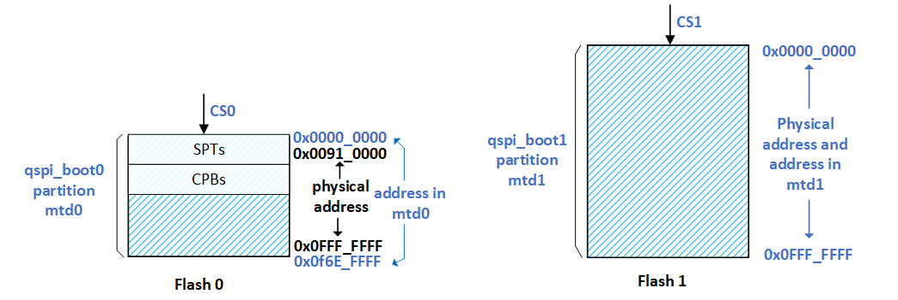
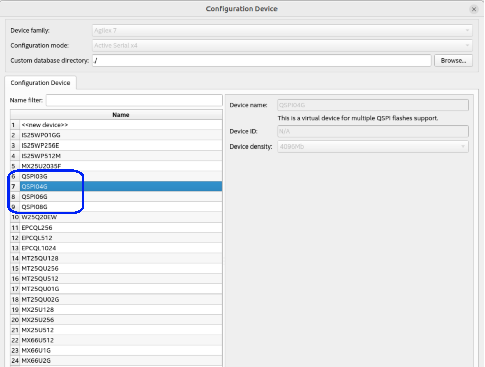

## Intro 

This page is an extension of the  [Agilex 7 SoC HPS Remote System Update Example](https://altera-fpga.github.io/rel-25.1/embedded-designs/agilex-7/f-series/soc/rsu/ug-rsu-agx7f-soc/) and will show you how to build RSU images with multi QSPI support. This feature allows you to extend the flash space available to store the RSU applications so the size of these could be increased. This feature allows you to support up to 4 QSPI flash devices of the same model (i.e. same size). 

**Note**: This feature is first enabled in 24.3 release.

When exercising multi-QSPI feature, there are few conditions that need to be satisfied:

* The Boot info, including the decision firmware and decision firmware data must be stored in the flash 0.
* The factory image also must be stored in the flash 0.
* The SPTs and CPBs also must be stored in in flash 0.
* The starting location of any component and partition in the QSPI flash devices should be aligned to the erase granularity defined in the devices.
* An application could be located in the cross boundary of 2 chips (i.e. located in more than one chip), but the previous condition still must be satisfied.

 

## Build Instructions


The binaries build instructions presented here are targeted for the Agilex™ 7 Transceiver-SoC Development kit P-Tile E-Tile production Linear power solution (DK-SI-AGF014EB). This provides the full recipes to build the binaries that you will need to exercise RSU functionality. The example provided here used only 2 flash devices (MT25QU02G) so the total memory size available is 512 MB. In the flash device layout, there is 1 partition defined in chip 0 and 2 partitions in chip 1. This QSPI layout can be seen in the following table:

| Component | Start Address | Size | Chip |
| :-- | :-- | :-- | :-- |
| BOOT_INFO	| 0x0000_0000 |	0x0020_FFFF | 0 |
| FACTORY IMAGE | 0x0021_0000 | 0x0070_0000	| 0 |
| SPT0 | 0x0091_0000 | 0x0001_0000 | 0 |
| SPT1 | 0x0092_0000 | 0x0001_0000 | 0 |
| CPB0 | 0x0093_0000 | 0x0001_0000 | 0 |
| CPB1 | 0x0094_0000 | 0x0001_0000 | 0 |
| P1 |	0x0100_0000 | 0x0100_0000 | 0 |
| P2 |	0x1000_0000 | 0x0100_0000 | 1 |
| P3 | 0x1100_0000 | 0x0100_0000 | 1 |

The end results of the build flow are described next.

- Initial flash image: contains the factory image, an application image and two empty application image partitions aka slots. 
- SD card image: contains SSBL (U-Boot), ATF (Arm Trusted Firmware), Linux device tree, Linux kernel, Linux rootfs with the RSU driver, LIBRSU, RSU Client, an application image, a factory update image and a decision firmware update image. 

### Setting up the Environment 


Create a top folder to store the example files.


```bash
sudo rm -rf agilex-multiQSPI-rsu
mkdir agilex-multiQSPI-rsu
cd agilex-multiQSPI-rsu
export TOP_FOLDER=`pwd`
```


Download the compiler toolchain, add it to the PATH variable, to be used by the GHRD makefile to build the HPS Debug FSBL:


```bash
cd $TOP_FOLDER
wget https://developer.arm.com/-/media/Files/downloads/gnu/11.2-2022.02/binrel/\
gcc-arm-11.2-2022.02-x86_64-aarch64-none-linux-gnu.tar.xz
tar xf gcc-arm-11.2-2022.02-x86_64-aarch64-none-linux-gnu.tar.xz
rm -f gcc-arm-11.2-2022.02-x86_64-aarch64-none-linux-gnu.tar.xz
export PATH=`pwd`/gcc-arm-11.2-2022.02-x86_64-aarch64-none-linux-gnu/bin:$PATH
export ARCH=arm64
export CROSS_COMPILE=aarch64-none-linux-gnu-
```

Enable Quartus tools to be called from command line:


```bash
export QUARTUS_ROOTDIR=~/altera_pro/25.1/quartus/
export PATH=$QUARTUS_ROOTDIR/bin:$QUARTUS_ROOTDIR/linux64:$QUARTUS_ROOTDIR/../qsys/bin:$PATH
```


### Building the Hardware Projects 


Create four different hardware projects, based on the GHRD from GitHub with a few changes.

- Change the boot mode to FPGA first 
- Use a different ID in the SystemID component, to make the binaries for each project slightly different. 
- Change the behavior of watchdog timeout, to trigger an RSU event. 
- Set the max retry parameter to 3, so that each application image and the factory image are tried up to three time when configuration failures occur. 

The commands to create and compile the projects are listed below.


```bash 
cd $TOP_FOLDER
# Build 4 versions of the hardware design
rm -rf hw && mkdir hw && cd hw
wget https://github.com/altera-fpga/agilex7f-ed-gsrd/archive/refs/tags/QPDS25.1_REL_GSRD_PR.zip
unzip QPDS25.1_REL_GSRD_PR.zip
rm QPDS25.1_REL_GSRD_PR.zip
mv agilex7f-ed-gsrd-QPDS25.1_REL_GSRD_PR agilex7f-ed-gsrd
# boot from FPGA
export BOOTS_FIRST=fpga
# enable watchdog
export ENABLE_WATCHDOG_RST=1
# treat watchdog timeout as configuration failure to trigger RSU
export WATCHDOG_RST_ACTION=remote_update
# Customize parms in tcl
sed -i '/STRATIX_JTAG_USER_CODE 4/i set_global_assignment -name RSU_MAX_RETRY_COUNT 3' agilex7f-ed-gsrd/agilex_soc_devkit_ghrd/create_ghrd_quartus.tcl
# Set QSPI clock to 25 Mhz (needed for multi-qspi support)
sed -i '/STRATIX_JTAG_USER_CODE 4/i set_global_assignment -name ACTIVE_SERIAL_CLOCK AS_FREQ_25MHZ' agilex7f-ed-gsrd/agilex_soc_devkit_ghrd/create_ghrd_quartus.tcl
for version in {0..3}
do
rm -rf ghrd.$version
cp -r agilex7f-ed-gsrd ghrd.$version
cd ghrd.$version
# update sysid to make binaries slightly different 
sed -i 's/0xACD5CAFE/0xABAB000'$version'/g' agilex_soc_devkit_ghrd/create_ghrd_qsys.tcl
# Finsish customization and now building the hardware design
make agf014eb-si-devkit-oobe-baseline-all
cd ..
done
rm -rf agilex7f-ed-gsrd 
cd .. 
```


After completing the above steps, the following SOF files are created.

- $TOP_FOLDER/hw/ghrd.0/install/designs/agf014eb_si_devkit_oobe_baseline.sof 
- $TOP_FOLDER/hw/ghrd.1/install/designs/agf014eb_si_devkit_oobe_baseline.sof 
- $TOP_FOLDER/hw/ghrd.2/install/designs/agf014eb_si_devkit_oobe_baseline.sof 
- $TOP_FOLDER/hw/ghrd.3/install/designs/agf014eb_si_devkit_oobe_baseline.sof 


### Building Arm Trusted Firmware 


The following commands are used to retrieve the Arm Trusted Firmware (ATF) and compile it.


```bash 
cd $TOP_FOLDER
rm -rf arm-trusted-firmware
git clone https://github.com/altera-fpga/arm-trusted-firmware
cd arm-trusted-firmware
# checkout the branch used for this document, comment out to use default
git checkout -b test -t origin/socfpga_v2.12.0
make bl31 PLAT=agilex
cd ..
```


After completing the above steps, the Arm Trusted Firmware binary file is created and is located here.

- $TOP_FOLDER/arm-trusted-firmware/build/agilex/release/bl31.bin 

### Building U-Boot 


The following commands can be used to get the U-Boot source code and compile it. To enable multi-qspi support in U-Boot RSU functionality, set **CONFIG_SOCFPGA_RSU_MULTIFLASH** to **y** in the build configuration file. Also make sure that **CONFIG_SF_DEFAULT_CS** is set to 0 to indicate that the SPTs and CPBs are located in chip 0. There are some required changes in the device tree that allow you to enable multi-QSPI in U-Boot. These changes are the following.

* Add the number of QSPI flash devices in the system in the **qspi** node in **socfpga_agilex.dtsi**. This parameter will allow u-boot to know the number of flash devices. You can manually probe each device from U-Boot shell using **sf probe 0:&lt;flash device&gt;**. This command also is used to select the QSPI chip for which the **sf read**, **sf write** and **sf erase** will operate over.
* Create the **flash1** node in **socfpga_agilex_socdk-u-boot.dtsi**, so it exist a node for each one of the flash devices in the system.
* For each one of the flash nodes is necessary to  reduce the maximum SPI clock frequency to 25 MHz. This is done through the **spi-max-frequency** field. You also need to assign the corresponding chip select number to each one of the QSPI devices using the **reg** field. You also need to define any partitions that you want to create in each of the flash devices. In this case a single partition is created in each of the chips. The partition size corresponds to the size of each chip. These updates are done in the **socfpga_agilex_socdk.dts** file.
* You can also add QSPI flash0 as the 1st device from which SPL will try to boot from. This is done by updating the **u-boot,spl-boot-order** field in the **socfpga_agilex_socdk-u-boot.dtsi**. 


```bash 
cd $TOP_FOLDER
rm -rf u-boot-socfpga
git clone https://github.com/altera-fpga/u-boot-socfpga
cd u-boot-socfpga
# comment out next line to use the latest default branch 
git checkout -b test -t origin/socfpga_v2025.01

# enable dwarf4 debug info, for compatibility with arm ds 
sed -i 's/PLATFORM_CPPFLAGS += -D__ARM__/PLATFORM_CPPFLAGS += -D__ARM__ -gdwarf-4/g' arch/arm/config.mk

# Update device tree to enable multi-qspi
# Adding the number of QSPI devices
sed -i '/clocks = <&qspi_clk>;/a \\t\t\tnum-cs = <2>;'  arch/arm/dts/socfpga_agilex.dtsi

# Starting booting from QSPI to probe QSPI devices. Removing atempt to boot from NAND
sed -i 's/u-boot,spl-boot-order.*/u-boot\,spl-boot-order = \&flash0,\&mmc;/g' arch/arm/dts/socfpga_agilex_socdk-u-boot.dtsi

# Rename the flash0 to flash1 (later will recreate the node for flash0)
# This is done to have a QSPI flash reference to add the new node just above the reference one.
sed -i 's/\&flash0 {/\&flash1 {/' arch/arm/dts/socfpga_agilex_socdk-u-boot.dtsi
sed -i '/\&flash1 {/i \&flash0 {\n\tcompatible = \"jedec,spi-nor\";\n\tspi-tx-bus-width = <4>;\n\tspi-rx-bus-width = <4>;\n\tbootph-all;\n\t/delete-property/ cdns,read-delay; \n};\n' \
arch/arm/dts/socfpga_agilex_socdk-u-boot.dtsi
# disable NAND in the device tree
sed -i '/&nand {/!b;n;c\\tstatus = "disabled";' arch/arm/dts/socfpga_agilex_socdk-u-boot.dtsi
# remove the NAND configuration from device tree
sed -i '/images/,/binman/{/binman/!d}' arch/arm/dts/socfpga_agilex_socdk-u-boot.dtsi

# Change max clk frequency of SPI flash0
sed -i 's/spi-max-frequency = <100000000>;/spi-max-frequency = <25000000>;/g' arch/arm/dts/socfpga_agilex_socdk.dts
# Change the partition size for flash0
sed -i 's/reg = <0x0 0x04200000>;/reg = <0x0 0x10000000>;/g' arch/arm/dts/socfpga_agilex_socdk.dts
# Delete 2nd partition
sed -i '/root/,/};/d' arch/arm/dts/socfpga_agilex_socdk.dts

# make this one flash1 (later will recreate node for flash0 using flash1 location as reference )
sed -i 's/flash0: flash@0 {/flash1: flash@1 {/' arch/arm/dts/socfpga_agilex_socdk.dts
sed -i '/flash1: flash@1 {/!b;n;n;n;n;c\\t\treg = <1>;' arch/arm/dts/socfpga_agilex_socdk.dts
sed -i 's/qspi_boot:/flash1_boot:/g' arch/arm/dts/socfpga_agilex_socdk.dts
# Re-create the original node for flash0
sed -i '/flash1: flash@1 {/i \\tflash0: flash@0 {\n\t\t#address-cells = <1>;\n\t\t#size-cells = <1>;\
\t\tcompatible = "mt25qu02g";\n\t\treg = <0>;\n\t\tspi-max-frequency = <25000000>;\n\n\t\tm25p,fast-read;\
\t\tcdns,page-size = <256>;\n\t\tcdns,block-size = <16>;\n\t\tcdns,read-delay = <1>;\n\t\tcdns,tshsl-ns = <50>;\
\t\tcdns,tsd2d-ns = <50>;\n\t\tcdns,tchsh-ns = <4>;\n\t\tcdns,tslch-ns = <4>;\n\n\t\tpartitions {\
\t\t\tcompatible = "fixed-partitions";\n\t\t\t#address-cells = <1>;\n\t\t\t#size-cells = <1>;\
\t\t\tqspi_boot: partition@0 {\n\t\t\t\tlabel = "u-boot";\n\t\t\t\treg = <0x0 0x10000000>;\
\t\t\t};\n\n\t\t};\n\t};\n' arch/arm/dts/socfpga_agilex_socdk.dts


# link to atf 
ln -s $TOP_FOLDER/arm-trusted-firmware/build/agilex/release/bl31.bin .
# Create configuration custom file.
cat << EOF > config-fragment-agilex
# Use 'Image' for kernel image instead of 'kernel.itb'
CONFIG_BOOTFILE="Image"
# ENABLE MULTIFLASH
CONFIG_SOCFPGA_RSU_MULTIFLASH=y
CONFIG_SF_DEFAULT_CS=0
# - Disable NAND/UBI related settings from defconfig.
CONFIG_NAND_BOOT=n
CONFIG_SPL_NAND_SUPPORT=n
CONFIG_CMD_NAND_TRIMFFS=n
CONFIG_CMD_NAND_LOCK_UNLOCK=n
CONFIG_NAND_DENALI_DT=n
CONFIG_SYS_NAND_U_BOOT_LOCATIONS=n
CONFIG_SPL_NAND_FRAMEWORK=n
CONFIG_CMD_NAND=n
CONFIG_MTD_RAW_NAND=n
CONFIG_CMD_UBI=n
CONFIG_CMD_UBIFS=n
CONFIG_MTD_UBI=n
CONFIG_ENV_IS_IN_UBI=n
CONFIG_UBI_SILENCE_MSG=n
CONFIG_UBIFS_SILENCE_MSG=n
# - Disable distroboot and use specific boot command.
CONFIG_DISTRO_DEFAULTS=n
CONFIG_HUSH_PARSER=y
CONFIG_SYS_PROMPT_HUSH_PS2="> "
CONFIG_USE_BOOTCOMMAND=y
CONFIG_BOOTCOMMAND="bridge enable; setenv bootfile Image; setenv fdtimage socfpga_agilex7f_socdk_multiqspi.dtb; run mmcload; run linux_qspi_enable; run rsu_status; run mmcboot"
CONFIG_CMD_FAT=y
CONFIG_CMD_FS_GENERIC=y
CONFIG_DOS_PARTITION=y
CONFIG_SPL_DOS_PARTITION=y
CONFIG_CMD_PART=y
CONFIG_SPL_CRC32=y
CONFIG_LZO=y
CONFIG_CMD_DHCP=y
CONFIG_SYS_PROMPT="SOCFPGA # "
# Enable more QSPI flash manufacturers
CONFIG_SPI_FLASH_MACRONIX=y
CONFIG_SPI_FLASH_GIGADEVICE=y
CONFIG_SPI_FLASH_WINBOND=y
CONFIG_SPI_FLASH_ISSI=y
EOF
# build U-Boot
make clean && make mrproper
make socfpga_agilex_defconfig
# Use created custom configuration file to merge with the default configuration obtained in .config file.
./scripts/kconfig/merge_config.sh -O ./ ./.config ./config-fragment-agilex
make -j 48
cd ..
```


After completing the above steps, the following files are created.

- $TOP_FOLDER/u-boot-socfpga/spl/u-boot-spl-dtb.hex - FSBL (U-boot SPL) hex file 
- $TOP_FOLDER/u-boot-socfpga/u-boot.itb - FIT image file containing SSBL (U-Boot) and ATF (Arm Trusted Firmware) binaries 


### Building Linux 


In Linux, the socfpga_agilex7f_socdk_multiqspi.dts device tree is used which includes the updates needed to support the multi-QSPI feature. The required changes are shown next.

* The definition of the flash nodes (up to 4). In each of these nodes the **qspi_bootx** partition is created. For each one of the flashes nodes defined Linux will create a MTD device for each partition if it detects that a flash device asociated with this node actually exists.
* In each one of the flash devices reducing the maximum SPI clock frequency to 25 MHz.
* In each one of the flash devices assigning to the **reg** field the corresponding chips select: 0, 1, 2 or 3.
* Define the **rsu_handle** field to point to the **qspi_boot0** partition. Although this is done for all the flash node, this is needed only for the flash0. The limits of this partition is patched by U-Boot (**rsu_dtb()** function) to restric this partition in flash 0 to the area  that goes from the starting location of the SPT0 table to the end of the chip. This makes that Linux could only access this region in chip 0 using the **mtd0** device.

 

The following commands can be used to obtain the Linux source code and build Linux.


```bash 
cd $TOP_FOLDER 
rm -rf linux-socfpga 
git clone https://github.com/altera-fpga/linux-socfpga 
cd linux-socfpga 
# checkout the branch used for this document, comment out to use default 
git checkout -b test -t origin/socfpga-6.12.11-lts 

# Workaround to the 14024915012 issue in whcih the number of QSPI devices was incorrecltly determined from the device tree.
# This is a temporal hack to update cqspi_setup_flash(). This Will be fixed in 25.1.1.
sed -i 's/max_cs = cqspi->num_chipselect - 1;/max_cs = 0;/g' drivers/spi/spi-cadence-quadspi.c
sed -i 's/else if (cs < max_cs)/else if (cs > max_cs)/g' drivers/spi/spi-cadence-quadspi.c

# configure the RSU driver to be built into the kernel 
make clean && make mrproper 
make defconfig 
./scripts/config --set-val CONFIG_INTEL_STRATIX10_RSU y
# enable kernel debugging with RiscFree
./scripts/config --set-val CONFIG_DEBUG_INFO  y
./scripts/config --set-val CONFIG_GDB_SCRIPTS y
make oldconfig 
make -j 48 Image dtbs 
cd .. 
```


After completing the above steps, the following files are created.

- $TOP_FOLDER/linux-socfpga/arch/arm64/boot/Image - kernel image 
- $TOP_FOLDER/linux-socfpga/arch/arm64/boot/dts/intel/socfpga_agilex7f_socdk_multiqspi.dtb - kernel device tree 


### Creating the Initial Flash Image 


This section presents detailed instructions on how to create the initial flash image, by using the Programming File Generator. 

For reference, an example of the  Programming File Generator configuration file is provided below so and you can easily create the initial flash image by passing it to the Programming File Generator as shown below. The layout described in this **.pfg** file matches the layout described earlier in this page.


```bash 
cd $TOP_FOLDER 
# Create automatically the .pfg file
cat << EOF > initial_image_multiQSPI.pfg
<pfg version="1">
    <settings custom_db_dir="./" mode="ASX4"/>
    <output_files>
        <output_file name="initial_image_multiQSPI" directory="./" type="JIC">
            <file_options/>
            <secondary_file type="MAP" name="initial_image_multiQSPI_jic">
                <file_options/>
            </secondary_file>
            <secondary_file type="SEC_RPD" name="initial_image_multiQSPI_jic">
                <file_options bitswap="1"/>
            </secondary_file>
            <flash_device_id>Flash_Device_1</flash_device_id>
        </output_file>
    </output_files>
    <bitstreams>
        <bitstream id="Bitstream_1">
            <path signing="OFF" finalize_encryption="0" hps_path="u-boot-socfpga/spl/u-boot-spl-dtb.hex">hw/ghrd.0/install/designs/agf014eb_si_devkit_oobe_baseline.sof</path>
        </bitstream>
        <bitstream id="Bitstream_2">
            <path signing="OFF" finalize_encryption="0" hps_path="u-boot-socfpga/spl/u-boot-spl-dtb.hex">hw/ghrd.1/install/designs/agf014eb_si_devkit_oobe_baseline.sof</path>
        </bitstream>
    </bitstreams>
    <flash_devices>
        <flash_device type="QSPI04G" id="Flash_Device_1">
            <partition reserved="1" fixed_s_addr="1" s_addr="0x00000000" multiple_flash_cs="2" factory_fallback="0" e_addr="0x0020FFFF" fixed_e_addr="1" id="BOOT_INFO" size="0"/>
            <partition reserved="1" extra_space="262144" fixed_s_addr="1" s_addr="0x00210000" e_addr="0x0090FFFF" fixed_e_addr="0" id="FACTORY_IMAGE" size="0"/>
            <partition reserved="1" fixed_s_addr="1" s_addr="auto" e_addr="auto" fixed_e_addr="1" id="SPT0" size="65536"/>
            <partition reserved="1" fixed_s_addr="1" s_addr="auto" e_addr="auto" fixed_e_addr="1" id="SPT1" size="65536"/>
            <partition reserved="1" fixed_s_addr="1" s_addr="auto" e_addr="auto" fixed_e_addr="1" id="CPB0" size="65536"/>
            <partition reserved="1" fixed_s_addr="1" s_addr="auto" e_addr="auto" fixed_e_addr="1" id="CPB1" size="65536"/>
            <partition reserved="0" fixed_s_addr="0" s_addr="0x01000000" e_addr="0x01FFFFFF" fixed_e_addr="0" id="P1" size="0"/>
            <partition reserved="0" fixed_s_addr="0" s_addr="0x10000000" e_addr="0x10FFFFFF" fixed_e_addr="0" id="P2" size="0"/>
            <partition reserved="0" fixed_s_addr="0" s_addr="0x11000000" e_addr="0x11FFFFFF" fixed_e_addr="0" id="P3" size="0"/>
        </flash_device>
        <flash_loader>AGFB014R24B</flash_loader>
    </flash_devices>
    <assignments>
        <assignment page="0" partition_id="FACTORY_IMAGE">
            <bitstream_id>Bitstream_1</bitstream_id>
        </assignment>
        <assignment page="1" partition_id="P1">
            <bitstream_id>Bitstream_2</bitstream_id>
        </assignment>
    </assignments>
</pfg>
EOF

# MultiQSPI is supported starting in 24.3
~/intelFPGA_pro/24.3.1/quartus/bin/quartus_pfg -c initial_image_multiQSPI.pfg
mv initial_image_multiQSPI.jic initial_image_multiQSPI_prev.jic
mv initial_image_multiQSPI_jic_2Gb_cs0.rpd #initial_image_multiQSPI_jic_2Gb_cs0_prev.rpd
mv initial_image_multiQSPI_jic_2Gb_cs1.rpd initial_image_multiQSPI_jic_2Gb_cs1_prev.rpd
mv initial_image_multiQSPI_jic.map initial_image_multiQSPI_jic_prev.map

# Create Initial Image for this release
cd $TOP_FOLDER
quartus_pfg -c initial_image_multiQSPI.pfg
```


After completion of this stage you should see the following files created. These are the images QSPI images.

* $TOP_FOLDER/initial_image_multiQSPI.jic - Initial QSPI image used for regular RSU use cases.
* $TOP_FOLDER/initial_image_multiQSPI_prev.jic - Initial QSPI image used to exercise combined application use case. - Not available in 24.3 release.

For detailed instructions on how to create the .pfg, please refer to the [Creating the initial flash-image](https://altera-fpga.github.io/rel-25.1/embedded-designs/agilex-7/f-series/soc/rsu/ug-rsu-agx7f-soc/#creating-the-initial-flash-image) in main RSU page. For a multi-QSPI initial image there are some variations that need to be obserrved and these are described next.

* When selecting the flash device in Configuration Device tab and clicking Add Device you need to select as device any of the QSPI0xG devices depending on the total size of the multi-QSPI system (in bits). In the figure below are shown the possible options. These options gets available when building an RSU image. In this figure, the QSPI04G is being selected for a 4 Gbit system (512 MB) integrated by 2 flash devices of 2Gbit each one.

   

* When configuring the memory locations for each one of the components make sure that the BOOT_INFO, FACTORY_IMAGE, STPs and CPBs fall into the memory area corresponding to the chip 0. 
* Also, when configuring the memory locations for the partitions, the memory ranges are defined based on having a single memory space that comprises the total memory available in all the QSPI flash devices. It is supported that a partition covers areas in more than one chip but the starting location of the partition should still be aligned to the erase granularity defined.


### Creating the Application Image 


The following commands are used to create the application image used in this example.


```bash 
cd $TOP_FOLDER
mkdir -p images
rm -rf images/application2.rpd
quartus_pfg -c hw/ghrd.2/install/designs/agf014eb_si_devkit_oobe_baseline.sof \
images/application2.rpd \
-o hps_path=u-boot-socfpga/spl/u-boot-spl-dtb.hex \
-o mode=ASX4 \
-o bitswap=ON
```


The following application image is created: 

- $TOP_FOLDER/images/application2.rpd. 


### Creating the Factory Update Image 


The following commands are used to create the factory update image used in this example.


```bash 
cd $TOP_FOLDER
mkdir -p images
rm -f images/factory_update.rpd
quartus_pfg -c hw/ghrd.3/install/designs/agf014eb_si_devkit_oobe_baseline.sof \
images/factory_update.rpd \
-o hps_path=u-boot-socfpga/spl/u-boot-spl-dtb.hex \
-o mode=ASX4 \
-o bitswap=ON \
-o rsu_upgrade=ON
```


The following factory update image is created.

- $TOP_FOLDER/images/factory_update.rpd 


### Creating the Decision Firmware Update Image 


The following commands are used to create the decision firmware update image used in this example.


```bash 
cd $TOP_FOLDER 
mkdir -p images 
rm -f images/decision_firmware_update.rpd
quartus_pfg -c hw/ghrd.3/install/designs/agf014eb_si_devkit_oobe_baseline.sof \
images/decision_firmware_update.rpd \
-o hps_path=u-boot-socfpga/spl/u-boot-spl-dtb.hex \
-o mode=ASX4 \
-o bitswap=ON \
-o rsu_upgrade=ON \
-o firmware_only=ON
```


The following decistion firmware update image is created.

- $TOP_FOLDER/images/decision_firmware_update.rpd 

**Note**: The provided SOF file is used by the quartus_pfg to determine the parameters that are writen to the decision firmware data structure. This includes QSPI clock and pin settings, the value of max_retry parameter, and the selected behavior of the HPS watchdog. The actual configuration data from the SOF file is not used. 


### Creating the Combined Application Image 


The following commands are used to create the combined application image used in this example.


```bash 
cd $TOP_FOLDER
mkdir -p images
rm -f images/combined_application.rpd
quartus_pfg -c hw/ghrd.3/install/designs/agf014eb_si_devkit_oobe_baseline.sof \
images/combined_application.rpd \
-o app_image=hw/ghrd.2/install/designs/agf014eb_si_devkit_oobe_baseline.sof \
-o hps_path=u-boot-socfpga/spl/u-boot-spl-dtb.hex \
-o app_image_hps_path=u-boot-socfpga/spl/u-boot-spl-dtb.hex \
-o mode=ASX4 \
-o bitswap=ON \
-o rsu_upgrade=ON \
-o app_image_only=ON
```


The following file is created.

- $TOP_FOLDER/images/combined_application.rpd 


### Building the Root File System 


A root file system is required to boot Linux. There are a lot of ways to build a root file system, depending on your specific needs. This section shows how to build a small root file system using Yocto. 

1\. Make sure you have Yocto system requirements met: https://docs.yoctoproject.org/5.0.1/ref-manual/system-requirements.html#supported-linux-distributions.

The command to install the required packages on Ubuntu 22.04 is:

```bash
sudo apt-get update
sudo apt-get upgrade
sudo apt-get install openssh-server mc libgmp3-dev libmpc-dev gawk wget git diffstat unzip texinfo gcc \
build-essential chrpath socat cpio python3 python3-pip python3-pexpect xz-utils debianutils iputils-ping \
python3-git python3-jinja2 libegl1-mesa libsdl1.2-dev pylint xterm python3-subunit mesa-common-dev zstd \
liblz4-tool git fakeroot build-essential ncurses-dev xz-utils libssl-dev bc flex libelf-dev bison xinetd \
tftpd tftp nfs-kernel-server libncurses5 libc6-i386 libstdc++6:i386 libgcc++1:i386 lib32z1 \
device-tree-compiler curl mtd-utils u-boot-tools net-tools swig -y
```

On Ubuntu 22.04 you will also need to point the /bin/sh to /bin/bash, as the default is a link to /bin/dash:

```bash
 sudo ln -sf /bin/bash /bin/sh
```

**Note**: You can also use a Docker container to build the Yocto recipes, refer to https://rocketboards.org/foswiki/Documentation/DockerYoctoBuild for details. When using a Docker container, it does not matter what Linux distribution or packages you have installed on your host, as all dependencies are provided by the Docker container.

2\. Run the following commands to build the root file system.

  

  ```bash 
  cd $TOP_FOLDER 
  rm -rf yocto && mkdir yocto && cd yocto
  git clone -b styhead https://git.yoctoproject.org/poky
  git clone -b styhead https://git.yoctoproject.org/meta-intel-fpga
  git clone -b styhead https://github.com/openembedded/meta-openembedded
  # work around issue
  echo 'do_package_qa[noexec] = "1"' >> $(find meta-intel-fpga -name linux-socfpga_6.6.bb)
  source poky/oe-init-build-env ./build 
  echo 'MACHINE = "agilex7_dk_si_agf014eb"' >> conf/local.conf 
  echo 'BBLAYERS += " ${TOPDIR}/../meta-intel-fpga "' >> conf/bblayers.conf 
  echo 'BBLAYERS += " ${TOPDIR}/../meta-openembedded/meta-oe "' >> conf/bblayers.conf 
  echo 'IMAGE_FSTYPES = "tar.gz"' >> conf/local.conf
  echo 'CORE_IMAGE_EXTRA_INSTALL += "openssh gdbserver"' >> conf/local.conf
  bitbake core-image-minimal 
  ```
  

After the build completes, which can take a few hours depending on your host system processing power and Internet connection speed, the following root file system archive is created.

- $TOP_FOLDER/yocto/build/tmp/deploy/images/agilex7_dk_si_agf014eb/core-image-minimal-agilex7_dk_si_agf014eb.rootfs.tar.gz 


### Building ZLIB 


The ZLIB is required by LIBRSU. The following steps can be used to compile it.


```bash 
cd $TOP_FOLDER 
rm -rf zlib-1.3.1 
wget http://zlib.net/zlib-1.3.1.tar.gz 
tar xf zlib-1.3.1.tar.gz 
rm zlib-1.3.1.tar.gz 
cd zlib-1.3.1/ 
export CROSS_PREFIX=${CROSS_COMPILE} 
./configure 
make 
export ZLIB_PATH=`pwd` 
cd .. 
```


After the above steps are completed, the following items are available.

- $TOP_FOLDER/zlib-1.3.1/zlib.h - header file, used to compile files using zlib services 
- $TOP_FOLDER/zlib-1.3.1/libz.so* - shared objects, used to run executables linked against zlib APIs 

**Note**: The version of zlib mentioned above is the one that was tested with this release. You may want to use the latest zlib version, as it may contain updates and bug fixes. 


### Building LIBRSU and RSU Client 


The following commands can be used to build the LIBRSU and the example client application. Notice that you will need to modify the **qspi.rc** file (file used by **librsu** to retreive some of the RSU configuration) to provide  the **mtd** partitions in QSPI to be used for RSU, in this case it will be **mtd0** and **mtd1**.


```bash 
cd $TOP_FOLDER 
rm -rf intel-rsu 
git clone https://github.com/altera-fpga/intel-rsu 
cd intel-rsu 
# checkout the branch used for this document, comment out to use default 
git checkout -b test -t origin/master 
# Replace single mtd device with the the mtd devices created 
# from each one of the QSPI partitions
sed  -i 's/root qspi \/dev\/mtd0/root qspi \/dev\/mtd0,\/dev\/mtd1/g'  etc/qspi.rc 
cd lib 
# add -I$(ZLIB_PATH) to CFLAGS 
sed -i 's/\(CFLAGS := .*\)$/\1 -I\$\(ZLIB_PATH\)/g' makefile 
make 
cd .. 
cd example 
# add -L$(ZLIB_PATH) to LDFLAGS 
sed -i 's/\(LDFLAGS := .*\)$/\1 -L\$\(ZLIB_PATH\)/g' makefile 
make 
cd .. 
cd .. 
```


The following files are created.

- $TOP_FOLDER/intel-rsu/lib/librsu.so - shared object required at runtime for running applications using librsu 
- $TOP_FOLDER/intel-rsu/etc/qspi.rc - resource file for librsu configuration 
- $TOP_FOLDER/intel-rsu/example/rsu_client - example client application using librsu 


### Building the SD Card 


The following commands can be used to create the SD card image used in this example.


```bash 
cd $TOP_FOLDER
sudo rm -rf sd_card && mkdir sd_card && cd sd_card
wget https://releases.rocketboards.org/release/2021.04/gsrd/\
tools/make_sdimage_p3.py
# remove mkfs.fat parameter which has some issues on Ubuntu 22.04
sed -i 's/\"\-F 32\",//g' make_sdimage_p3.py
chmod +x make_sdimage_p3.py
# prepare the fat contents
mkdir fat && cd fat
cp $TOP_FOLDER/u-boot-socfpga/u-boot.itb .
cp $TOP_FOLDER/linux-socfpga/arch/arm64/boot/Image .
cp $TOP_FOLDER/linux-socfpga/arch/arm64/boot/dts/intel/socfpga_agilex7f_socdk_multiqspi.dtb .
cp $TOP_FOLDER/images/*.rpd .
cd ..
# prepare the rootfs partition contents
mkdir rootfs && cd rootfs
sudo tar xf $TOP_FOLDER/yocto/build/tmp/deploy/images/agilex7_dk_si_agf014eb/core-image-minimal-agilex7_dk_si_agf014eb.rootfs.tar.gz
sudo sed -i 's/agilex7_dk_si_agf014eb/linux/g' etc/hostname
sudo rm -rf lib/modules/*
sudo cp $TOP_FOLDER/images/*.rpd home/root
sudo cp $TOP_FOLDER/intel-rsu/example/rsu_client home/root/
sudo cp $TOP_FOLDER/intel-rsu/lib/librsu.so lib/
sudo cp $TOP_FOLDER/intel-rsu/etc/qspi.rc etc/librsu.rc
sudo cp $TOP_FOLDER/zlib-1.3.1/libz.so* lib/
cd .. 
# create sd card image 
sudo python3 ./make_sdimage_p3.py -f \
-P fat/*,num=1,format=vfat,size=100M \
-P rootfs/*,num=2,format=ext3,size=100M \
-s 256M \
-n sdcard_rsu.img
cd ..
```


This creates the SD card image as indicated next.

- $TOP_FOLDER/sd_card/sdcard_rsu.img. 

The following items are included in the rootfs on the SD card.

- U-Boot 
- ATF 
- Linux kernel, including RSU driver 
- ZLIB shared objects 
- LIBRSU shared objects and resource files 
- RSU client application 
- Application image 
- Factory update image 
- Decision firmware update image 
- Combined application image 


## Flashing Binaries 

### Writing Initial multi-QSPI RSU Image to QSPI 

1. Make sure to install the QSPI SDM boot card on the Agilex 7 SoC Development Kit 

2. Power down the board if powered up 

3. Configure the Agilex 7 SoC Development Kit switches to have MSEL set to JTAG. 

4. Run the following command to write the image to SDM QSPI by using the command line version of the Quartus Prime Programmer: 

  ```bash 
  cd $TOP_FOLDER 
  quartus_pgm -c 1 -m jtag -o "pvi;./initial_image_multiQSPI.jic" 
  ```

5. Configure the Agilex 7 SoC Development Kit switches to have MSEL set to QSPI. 

### Writing the SD Card Image 

1. Write the SD card image $TOP_FOLDER/sd_card/sdcard_rsu.img to a microSD card. You can use an USB micro SD card writer and the Linux dd command on your host PC to achieve this. Exercise caution when using the dd command, as incorrect usage can lead to your host Linux system becoming corrupted and non-bootable. 

2. Insert the micro SD card in the slot on the Agilex 7 SoC Development kit HPS daughtercard. 


### Exercise RSU Binaries

The same RSU exercises for U-Boot and Linux described at [Agilex 7 SoC HPS Remote System Update Example](https://altera-fpga.github.io/rel-25.1/embedded-designs/agilex-7/f-series/soc/rsu/ug-rsu-agx7f-soc/) are supported for multi-QSPI. You can exercise all of them, but in the command responses just consider the new layout used in here (i.e. the location of the partitions will be different ). 

In the scenario in which an application is being corrupted using a U-Boot command, you also will need to use the correct location of the application. Also remember that in multi-QSPI the **sf probe** U-Boot command is used to select the appropriate flash device before performing any read, write or erase operation. The **sf erase**, **sf write** and **sd read** U-Boot commands use as memory address the relative address in the chip selected.

| Action | Command |
| --- | --- |
| Select chip 0 | sf probe 0:0  or sf probe |
| Select chip 1 | sf probe 0:1 |
| Write to chip selected | sf write &lt;address in SRAM&gt; &lt;offset in chip&gt; &lt;data size&gt; |
| Read from chip selected | sf read &lt;address in SRAM&gt; &lt;offset in chip&gt; &lt;data size&gt; |
|  Erase data in chip | sf erase &lt;offset in chip&gt; &lt;data size&gt; |

**Note:** When the combined application is used to upgrade the decision firmware, it is required to start with an initial image created with an older version than the one used to create this application. When exercising this use case in a multi-QSPI board, the decision firmware in the initial image also requires to support the multi-QSPI feature which is supported by Quartus Prime starting on 24.2 release.

## Notices & Disclaimers

Altera<sup>&reg;</sup> Corporation technologies may require enabled hardware, software or service activation.
No product or component can be absolutely secure. 
Performance varies by use, configuration and other factors.
Your costs and results may vary. 
You may not use or facilitate the use of this document in connection with any infringement or other legal analysis concerning Altera or Intel products described herein. You agree to grant Altera Corporation a non-exclusive, royalty-free license to any patent claim thereafter drafted which includes subject matter disclosed herein.
No license (express or implied, by estoppel or otherwise) to any intellectual property rights is granted by this document, with the sole exception that you may publish an unmodified copy. You may create software implementations based on this document and in compliance with the foregoing that are intended to execute on the Altera or Intel product(s) referenced in this document. No rights are granted to create modifications or derivatives of this document.
The products described may contain design defects or errors known as errata which may cause the product to deviate from published specifications.  Current characterized errata are available on request.
Altera disclaims all express and implied warranties, including without limitation, the implied warranties of merchantability, fitness for a particular purpose, and non-infringement, as well as any warranty arising from course of performance, course of dealing, or usage in trade.
You are responsible for safety of the overall system, including compliance with applicable safety-related requirements or standards. 
<sup>&copy;</sup> Altera Corporation.  Altera, the Altera logo, and other Altera marks are trademarks of Altera Corporation.  Other names and brands may be claimed as the property of others. 

OpenCL* and the OpenCL* logo are trademarks of Apple Inc. used by permission of the Khronos Group™.   