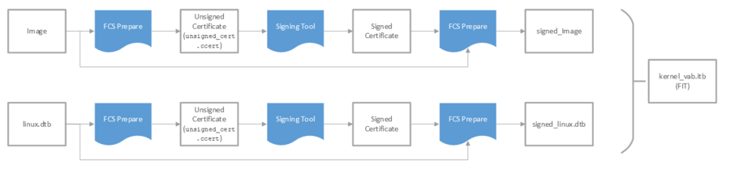

# Vendor Authorized Boot (HPS-First) Tutorial Example Design User Guide


## Introduction

The Vendor Authorized Boot (VAB) design demonstrates an end-to-end authenticated boot flow, from device power on until the Linux kernel is loaded. There are two main components of this design - the Secure Device Manager (SDM) which authenticates the configuration bitstream and U-boot with the Vendor Authorized Boot (VAB) feature. This design is demonstrated on the  [Agilex™ 7 FPGA F-Series Transceiver-SoC Development Kit (P-Tiles & E-Tile)](https://www.intel.com/content/www/us/en/products/details/fpga/development-kits/agilex/si-agf014.html) but can also be easily ported to other boards.

This demo design requires the following:
- QKY file to program virtual key for SDM authentication
- Signed RBF file (configuration bitstream) that consists of Agilex™ 7  GHRD and U-boot FSBL
- U-boot FSBL and SSBL with VAB features
- Linux LTSI
## Overview
The main purpose of a secure boot system is to ensure that the software running in the Hard Processor System (HPS) is trusted. Upon power up, a trusted first stage of boot will be executed - subsequent stages are only loaded and executed if it is authenticated by the current boot stage.
In the Altera® Agilex™ 7 SoC FPGA devices, the Secure Device Manager (SDM) is the entry point for all configuration and booting scenarios. As such, the SDM is the root of trust and will be authenticating the configuration bitstream before any HPS software is being loaded. The SDM's Configuration Management Firmware (CMF) and HPS's First Stage Bootloader (FSBL) are validated as part of the signed configuration bitstream. If VAB is enabled in U-Boot, the FSBL will validate the Second Stage Bootloader (SSBL) and the SSBL will validate the linux kernel.

**Note:** In this demo design, only the authentication feature of the SDM is being demonstrated. The SDM supports other security features such as bitstream encryption, Physically Unclonable Function (PUF) and many more. 


## Environment Setup
1\. Create the main directory of the design: 

```bash 
cd ~ 
mkdir agx7_vab && cd agx7_vab && export TOP_FOLDER=$(pwd) 
```

2\. Download and extract the Linaro toolchain. Then, configure your environment to access the Linaro cross compiler:

```bash
cd $TOP_FOLDER
wget https://developer.arm.com/-/media/Files/downloads/gnu/14.3.rel1/binrel/arm-gnu-toolchain-14.3.rel1-x86_64-aarch64-none-linux-gnu.tar.xz
tar xf arm-gnu-toolchain-14.3.rel1-x86_64-aarch64-none-linux-gnu.tar.xz
rm -f arm-gnu-toolchain-14.3.rel1-x86_64-aarch64-none-linux-gnu.tar.xz
export PATH=`pwd`/arm-gnu-toolchain-14.3.rel1-x86_64-aarch64-none-linux-gnu/bin/:$PATH
export ARCH=arm64
export CROSS_COMPILE=aarch64-none-linux-gnu-
```
3\. Enable Quartus tools to be called from command line:

```bash
export QUARTUS_ROOTDIR=~/altera_pro/25.3/quartus/
export PATH=$QUARTUS_ROOTDIR/bin:$QUARTUS_ROOTDIR/linux64:$QUARTUS_ROOTDIR/../qsys/bin:$PATH
```

4\. Install Yocto Dependencies:

Make sure you have Yocto system requirements met: https://docs.yoctoproject.org/5.0.1/ref-manual/system-requirements.html#supported-linux-distributions. The commands to install the required packages on Ubuntu 22.04 are:

```bash
sudo apt-get update
sudo apt-get upgrade
sudo apt-get install openssh-server mc libgmp3-dev libmpc-dev gawk wget git diffstat unzip texinfo gcc \
build-essential chrpath socat cpio python3 python3-pip python3-pexpect xz-utils debianutils iputils-ping \
python3-git python3-jinja2 libegl1-mesa libsdl1.2-dev pylint xterm python3-subunit mesa-common-dev zstd \
liblz4-tool git fakeroot build-essential ncurses-dev xz-utils libssl-dev bc flex libelf-dev bison xinetd \
tftpd tftp nfs-kernel-server libncurses5 libc6-i386 libstdc++6:i386 libgcc++1:i386 lib32z1 \
device-tree-compiler curl mtd-utils u-boot-tools net-tools swig -y
```

On Ubuntu 22.04 you will also need to point the /bin/sh to /bin/bash, as the default is a link to /bin/dash:

```bash
sudo ln -sf /bin/bash /bin/sh
```

## Building the System Image

### Build Arm Trusted Firmware
```bash
cd $TOP_FOLDER
git clone -b QPDS25.3_REL_GSRD_PR https://github.com/altera-fpga/arm-trusted-firmware 
cd arm-trusted-firmware 
make bl31 PLAT=agilex 
cd ..
```
### Build U-Boot
The VAB deconfig will add the Vendor Authorized Boot firmware to the FSBL and SSBL.
```bash
cd $TOP_FOLDER
git clone -b QPDS25.3_REL_GSRD_PR https://github.com/altera-fpga/u-boot-socfpga
cd u-boot-socfpga
# enable dwarf4 debug info, for compatibility with arm ds 
sed -i 's/PLATFORM_CPPFLAGS += -D__ARM__/PLATFORM_CPPFLAGS += -D__ARM__ -gdwarf-4/g' arch/arm/config.mk
# only boot from SD, do not try QSPI and NAND 
sed -i 's/u-boot,spl-boot-order.*/u-boot\,spl-boot-order = \&mmc;/g' arch/arm/dts/socfpga_agilex_socdk-u-boot.dtsi
# disable NAND in the device tree 
sed -i '/&nand {/!b;n;c\\tstatus = "disabled";' arch/arm/dts/socfpga_agilex_socdk-u-boot.dtsi 
# remove the NAND configuration from device tree 
sed -i '/images/,/binman/{/binman/!d}' arch/arm/dts/socfpga_agilex_socdk-u-boot.dtsi
# link to atf
ln -s $TOP_FOLDER/arm-trusted-firmware/build/agilex/release/bl31.bin .

# Create configuration custom file.
cat << EOF > config-fragment-agilex
#ENABLE  VAB
CONFIG_SOCFPGA_SECURE_VAB_AUTH=y
CONFIG_FIT_IMAGE_POST_PROCESS=y
CONFIG_SPL_SHA512=y
CONFIG_SPL_SHA384=y
CONFIG_SOCFPGA_SECURE_VAB_AUTH_ALLOW_NON_FIT_IMAGE=n
# - Disable NAND/UBI related settings from defconfig.
CONFIG_NAND_BOOT=n
CONFIG_SPL_NAND_SUPPORT=n
CONFIG_CMD_NAND_TRIMFFS=n
CONFIG_CMD_NAND_LOCK_UNLOCK=n
CONFIG_NAND_DENALI_DT=n
CONFIG_SYS_NAND_U_BOOT_LOCATIONS=n
CONFIG_SPL_NAND_FRAMEWORK=n
CONFIG_CMD_NAND=n
CONFIG_MTD_RAW_NAND=n
CONFIG_CMD_UBI=n
CONFIG_CMD_UBIFS=n
CONFIG_MTD_UBI=n
CONFIG_ENV_IS_IN_UBI=n
CONFIG_UBI_SILENCE_MSG=n
CONFIG_UBIFS_SILENCE_MSG=n
# - Disable distroboot and use specific boot command.
CONFIG_DISTRO_DEFAULTS=n
CONFIG_HUSH_PARSER=y
CONFIG_SYS_PROMPT_HUSH_PS2="> "
CONFIG_USE_BOOTCOMMAND=y
CONFIG_BOOTCOMMAND="load mmc 0:1 \${loadaddr} signed_bitstream_core.rbf; bridge disable;fpga load 0 \${loadaddr} \${filesize};bridge enable; run mmcfitload; run mmcfitboot"
CONFIG_CMD_FAT=y
CONFIG_CMD_FS_GENERIC=y
CONFIG_DOS_PARTITION=y
CONFIG_SPL_DOS_PARTITION=y
CONFIG_CMD_PART=y
CONFIG_SPL_CRC32=y
CONFIG_LZO=y
CONFIG_CMD_DHCP=y
# Enable more QSPI flash manufacturers
CONFIG_SPI_FLASH_MACRONIX=y
CONFIG_SPI_FLASH_GIGADEVICE=y
CONFIG_SPI_FLASH_WINBOND=y
CONFIG_SPI_FLASH_ISSI=y
EOF

# build U-Boot 
make clean && make mrproper
make socfpga_agilex_defconfig
# Use created custom configuration file to merge with the default configuration obtained in .config file.
./scripts/kconfig/merge_config.sh -O ./ ./.config ./config-fragment-agilex
make -j 64
cd .. 
```
Few Errors will be seen and can be ignored for now. These errors will be resolved once the signed images are created. These errors can be seen as below:

```bash
Image 'u-boot' is missing external blobs and is non-functional: blob-ext blob-ext blob-ext
/binman/u-boot/fit/images/uboot/blob-ext (signed-u-boot-nodtb.bin):
   Missing blob
/binman/u-boot/fit/images/atf/blob-ext (signed-bl31.bin):
   Missing blob
/binman/u-boot/fit/images/fdt-0/blob-ext (signed-u-boot.dtb):
   Missing blob
   
Image 'kernel' is missing external blobs and is non-functional: blob-ext blob-ext
/binman/kernel/fit/images/kernel/blob-ext (signed-Image):
   Missing blob
/binman/kernel/fit/images/fdt/blob-ext (signed-linux.dtb):
   Missing blob
   
Some images are invalid
make: *** [Makefile:1126: .binman_stamp] Error 103
```

The following files are created:

- $TOP_FOLDER/u-boot-socfpga/u-boot.itb
- $TOP_FOLDER/u-boot-socfpga/spl/u-boot-spl-dtb.hex

### Build Linux Kernel 

```bash
cd $TOP_FOLDER
rm -rf linux-socfpga
git clone -b QPDS25.3_REL_GSRD_PR  https://github.com/altera-fpga/linux-socfpga linux-socfpga
cd linux-socfpga
make clean && make mrproper
make defconfig
make -j 64 Image dtbs
```
The following items are built in $TOP_FOLDER:

- linux-socfpga/arch/arm64/boot/dts/intel/socfpga_agilex_socdk.dtb
- linux-socfpga/arch/arm64/boot/Image

### Build Rootfs

```bash
cd $TOP_FOLDER
rm -rf yocto && mkdir yocto && cd yocto
git clone -b styhead https://git.yoctoproject.org/poky
git clone -b styhead https://git.yoctoproject.org/meta-intel-fpga
git clone -b styhead https://github.com/openembedded/meta-openembedded
# work around issue
echo 'do_package_qa[noexec] = "1"' >> $(find meta-intel-fpga -name linux-socfpga_6.6.bb)
source poky/oe-init-build-env ./build
echo 'MACHINE = "agilex7_dk_si_agf014eb"' >> conf/local.conf
echo 'BBLAYERS += " ${TOPDIR}/../meta-intel-fpga "' >> conf/bblayers.conf
echo 'BBLAYERS += " ${TOPDIR}/../meta-openembedded/meta-oe "' >> conf/bblayers.conf
echo 'CORE_IMAGE_EXTRA_INSTALL += "openssh gdbserver"' >> conf/local.conf
bitbake core-image-minimal
```

The following file is created:

- TOP_FOLDER/yocto/build/tmp/deploy/images/agilex7_dk_si_agf014eb/core-image-minimal-agilex7_dk_si_agf014eb.rootfs.tar.gz

### Generate Signature Chains

Create two signature chains (FPGA and HPS software).
Create directories for the keys and signature chains.
```bash
cd $TOP_FOLDER
mkdir keys && cd keys
mkdir -p privatekeys; mkdir -p publickeys; mkdir -p qky 
```
Start a Nios command shell to have all Quartus tools in the PATH:
```
~/altera_pro/25.3/quartus/niosv/bin/niosv-shell
```
#### Generate Root Key
```bash
quartus_sign --family=agilex7 --operation=make_private_pem --curve=secp384r1 --no_passphrase privatekeys/private_root0.pem
quartus_sign --family=agilex7 --operation=make_public_pem privatekeys/private_root0.pem publickeys/public_root0.pem
quartus_sign --family=agilex7 --operation=make_root publickeys/public_root0.pem qky/root0.qky
```
#### Generate Signing Keys

FPGA Signing

```bash
quartus_sign --family=agilex7 --operation=make_private_pem --curve=secp384r1 --no_passphrase privatekeys/private_sign0.pem
quartus_sign --family=agilex7 --operation=make_public_pem privatekeys/private_sign0.pem publickeys/public_sign0.pem
```
HPS Software
```bash
quartus_sign --family=agilex7 --operation=make_private_pem --curve=secp384r1 --no_passphrase privatekeys/private_software0.pem
quartus_sign --family=agilex7 --operation=make_public_pem privatekeys/private_software0.pem publickeys/public_software0.pem
```
Generate Signature Chains:
FPGA Signing - Cancel ID 1 – Permissions: FPGA/HPS/HPS Debug
```bash
quartus_sign --family=agilex7 --operation=append_key --previous_pem=privatekeys/private_root0.pem --previous_qky=qky/root0.qky \
--permission=14 --cancel=1 --input_pem=publickeys/public_sign0.pem qky/sign0_cancel1.qky
```
HPS Software - cancel ID 3 – Permissions: HPS Firmware
```bash
quartus_sign --family=agilex7 --operation=append_key --previous_pem=privatekeys/private_root0.pem --previous_qky=qky/root0.qky \
--permission=0x80 --cancel=3 --input_pem=publickeys/public_software0.pem qky/software0_cancel3.qky
```
### Build the Hardware Design

#### Build the GHRD

Download the GHRD from Github, and build it using the commands below:
Note: (Make sure to use the required GHRD based on your development kit)

```bash
cd $TOP_FOLDER
wget https://github.com/altera-fpga/agilex7f-ed-gsrd/archive/refs/tags/QPDS25.3_REL_GSRD_PR.zip
unzip QPDS25.3_REL_GSRD_PR.zip
rm QPDS25.3_REL_GSRD_PR.zip
mv agilex7f-ed-gsrd-QPDS25.3_REL_GSRD_PR agilex7f-ed-gsrd
cd agilex7f-ed-gsrd
make agf014eb-si-devkit-oobe-baseline-all
cd ..
```
#### Enable Security Features: Authentication

For the FPGA configuration bitstream to be properly signed, enable the Quartus key File in the Quartus Project.

- Open the GHRD project in Quartus.
- From the Assignments Menu, navigate to Device > Device and Pin Options > Security. Under Quartus key file, browse and select qky/sign0_cancel1.qky.
- Alternately, you can add the following assignment to the .qsf file: "set_global_assignment -name QKY_FILE "

Regenerate the sof by running the Assembler.
- From the Processing menu, select Compilation Dashboard. In the Compilation Dashboard, select Assembler to regenerate the sof.

#### Generate and Sign FPGA and HPS RBF Files

Add FSBL bootloader to configuration bitstream, and generate the Raw Binary File (rbf) files:

```bash
cd $TOP_FOLDER
mkdir bitstreams && cd bitstreams
cp ../agilex7f-ed-gsrd/agilex_soc_devkit_ghrd/output_files/ghrd_agfb014r24b2e2v.sof ghrd.sof
quartus_pfg -c ghrd.sof ghrd.rbf -o hps_path=../u-boot-socfpga/spl/u-boot-spl-dtb.hex -o hps=1 -o sign_later=ON
```
After that, two .rbf files are created:

- $TOP_FOLDER /bitstreams/ghrd.core.rbf
- $TOP_FOLDER /bitstreams/ghrd.hps.rbf

Finally, sign the .rbf files:

```bash
quartus_sign --family=agilex7 --operation=sign --qky=../keys/qky/sign0_cancel1.qky \
--pem=../keys/privatekeys/private_sign0.pem ghrd.core.rbf signed_bitstream_core.rbf
quartus_sign --family=agilex7 --operation=sign --qky=../keys/qky/sign0_cancel1.qky \
--pem=../keys/privatekeys/private_sign0.pem ghrd.hps.rbf signed_bitstream_hps.rbf
```
Create .jic for flash programmer. (Optional - Used only with Physical Root Key Hash Fusing)
```bash
quartus_pfg -c signed_bitstream_hps.rbf signed_flash.jic -o device=MT25QU128 -o flash_loader=AGFB014R24B -o mode=ASX4
```
### Prepare the Signed Images

#### Compile fcs_prepare

The VAB preparation tool is used along with quartus_sign to create a signed firmware image. The signing process perfoms the following:
- The VAB preparation tool calculates the SHA384 hash of the firmware image and creates an unsigned certificate, named unsigned_cert.ccert.
- The signing tool signs the unsigned certification using the appropriate signature chain and creates a signed certificate.
- The VAB preparation tool will append the signed certificate and certificate length to the firmware image, creating a signed firmware image hps_image_signed.vab.
- Create a FIT image of the individually signed firmware images.
```bash
cd $TOP_FOLDER
git clone https://github.com/altera-fpga/libfcs.git
cd libfcs
export CROSS_COMPILE=; export ARCH=
cmake -S . -B build -DBUILD_FCS_PREPARE=ON
cmake --build build
```
#### Create Signed U-boot Image

A signed U-boot image will consist of three individually signed firmware images (bl31.bin, u-boot.dtb and u-boot-nodtb.bin) in a FIT image:

Create a working directory for signing images

```bash
cd $TOP_FOLDER
mkdir signed_hps_images && cd signed_hps_images
cp ../libfcs/build/tools/fcs_prepare/fcs_prepare .
```
Create the certificate for bl31.bin
```bash
./fcs_prepare --hps_cert ../arm-trusted-firmware/build/agilex/release/bl31.bin -v
quartus_sign --family=agilex7 --operation=SIGN --qky=../keys/qky/software0_cancel3.qky \
 --pem=../keys/privatekeys/private_software0.pem unsigned_cert.ccert signed_cert_bl31.bin.ccert
./fcs_prepare --finish signed_cert_bl31.bin.ccert --imagefile \
 ../arm-trusted-firmware/build/agilex/release/bl31.bin
mv hps_image_signed.vab ../u-boot-socfpga/signed-bl31.bin
rm unsigned_cert*
```
Create the certificate for u-boot.dtb
```bash
./fcs_prepare --hps_cert ../u-boot-socfpga/u-boot.dtb -v
quartus_sign --family=agilex7 --operation=SIGN --qky=../keys/qky/software0_cancel3.qky \
 --pem=../keys/privatekeys/private_software0.pem unsigned_cert.ccert signed_cert_u-boot_pad.dtb.ccert
./fcs_prepare --finish ./signed_cert_u-boot_pad.dtb.ccert --imagefile ../u-boot-socfpga/u-boot.dtb
mv hps_image_signed.vab ../u-boot-socfpga/signed-u-boot.dtb
rm unsigned_cert*
```
Create the certificate for u-boot-nodtb.bin
```bash
./fcs_prepare --hps_cert ../u-boot-socfpga/u-boot-nodtb.bin -v
quartus_sign --family=agilex7 --operation=SIGN --qky=../keys/qky/software0_cancel3.qky \
 --pem=../keys/privatekeys/private_software0.pem ./unsigned_cert.ccert ./signed_cert_u-boot-nodtb.bin.ccert
./fcs_prepare --finish ./signed_cert_u-boot-nodtb.bin.ccert --imagefile \
 ../u-boot-socfpga/u-boot-nodtb.bin
mv hps_image_signed.vab ../u-boot-socfpga/signed-u-boot-nodtb.bin
rm unsigned_cert*
```
#### Create Signed Linux Image
A signed Linux image will consist of two individually signed firmware images (Image and linux.dtb) in a FIT image:

Create the certificate for the Image.

```bash
./fcs_prepare --hps_cert ../linux-socfpga/arch/arm64/boot/Image -v
quartus_sign --family=agilex7 --operation=SIGN --qky=../keys/qky/software0_cancel3.qky \
 --pem=../keys/privatekeys/private_software0.pem unsigned_cert.ccert signed_cert_Image.ccert
./fcs_prepare --finish signed_cert_Image.ccert --imagefile ../linux-socfpga/arch/arm64/boot/Image
mv hps_image_signed.vab ../u-boot-socfpga/signed-Image
rm unsigned_cert*
```
Create the certificate for linux.dtb.
```bash
./fcs_prepare --hps_cert \
 ../linux-socfpga/arch/arm64/boot/dts/intel/socfpga_agilex_socdk.dtb -v
quartus_sign --family=agilex7 --operation=SIGN --qky=../keys/qky/software0_cancel3.qky \
 --pem=../keys/privatekeys/private_software0.pem unsigned_cert.ccert signed_cert_linux.dtb.ccert
./fcs_prepare --finish signed_cert_linux.dtb.ccert --imagefile \
 ../linux-socfpga/arch/arm64/boot/dts/intel/socfpga_agilex_socdk.dtb
mv hps_image_signed.vab ../u-boot-socfpga/signed-linux.dtb
rm unsigned_cert*
```
Move into the U-Boot directory and run the FIT creation script.
```bash
cd ../u-boot-socfpga/
export CROSS_COMPILE=aarch64-none-linux-gnu-; export ARCH=arm64
make
cd ..
```
The output of the "make" command can be seen below:
```bash
  UPD     include/generated/timestamp_autogenerated.h
  CC      common/version.o
  AR      common/built-in.o
  LD      u-boot
  OBJCOPY u-boot.srec
  OBJCOPY u-boot-nodtb.bin
  RELOC   u-boot-nodtb.bin
  CAT     u-boot-dtb.bin
  COPY    u-boot.bin
  SYM     u-boot.sym
  CC      spl/common/spl/spl.o
  AR      spl/common/spl/built-in.o
  LD      spl/u-boot-spl
  OBJCOPY spl/u-boot-spl-nodtb.bin
  CAT     spl/u-boot-spl-dtb.bin
  COPY    spl/u-boot-spl.bin
  SYM     spl/u-boot-spl.sym
  OBJCOPY spl/u-boot-spl-dtb.hex
  MKIMAGE u-boot.img
  MKIMAGE u-boot-dtb.img
  BINMAN  .binman_stamp
  OFCHK   .config
```
The generated FIT files are:

- u-boot.itb
- kernel.itb 

You can use dumpimage command to view the map structure of the .itb file, as below:

```
$ dumpimage -l kernel.itb 
FIT description: FIT with Linux kernel image and FDT blob
Created:         Fri Nov 14 15:11:03 2025
 Image 0 (kernel)
  Description:  Linux Kernel
  Created:      Fri Nov 14 15:11:03 2025
  Type:         Kernel Image
  Compression:  uncompressed
  Data Size:    39300220 Bytes = 38379.12 KiB = 37.48 MiB
  Architecture: AArch64
  OS:           Linux
  Load Address: 0x06000000
  Entry Point:  0x06000000
  Hash algo:    crc32
  Hash value:   d245cef9
 Image 1 (fdt)
  Description:  Linux DTB
  Created:      Fri Nov 14 15:11:03 2025
  Type:         Flat Device Tree
  Compression:  uncompressed
  Data Size:    16356 Bytes = 15.97 KiB = 0.02 MiB
  Architecture: AArch64
  Hash algo:    crc32
  Hash value:   d3eb0418
 Default Configuration: 'conf'
 Configuration 0 (conf)
  Description:  Intel SoC64 FPGA
  Kernel:       kernel
  FDT:          fdt
```

### Create SD Card Image
```bash
cd $TOP_FOLDER
sudo rm -rf sd_card && mkdir sd_card && cd sd_card
# Download the sd-card image creator
wget https://releases.rocketboards.org/release/2020.11/gsrd/tools/make_sdimage_p3.py
sed -i 's/\"\-F 32\",//g' make_sdimage_p3.py
chmod +x make_sdimage_p3.py
# Prepare the image files
mkdir fatfs && cd fatfs
cp $TOP_FOLDER/bitstreams/signed_bitstream_core.rbf .
cp $TOP_FOLDER/u-boot-socfpga/u-boot.itb .
cp $TOP_FOLDER/u-boot-socfpga/kernel.itb .
cd ..
mkdir rootfs && cd rootfs
sudo tar xf $TOP_FOLDER/yocto/build/tmp/deploy/images/agilex7_dk_si_agf014eb/core-image-minimal-agilex7_dk_si_agf014eb.rootfs.tar.gz
cd ..
# Create the image
sudo python3 make_sdimage_p3.py -f \
-P fatfs/*,num=1,format=fat,size=100M \
-P rootfs/*,num=2,format=ext3,size=512M \
-s 640M \
-n agilex7_vab.img
cd ..
```
### Program the Board and Boot
Configure board for SDM to boot from JTAG:

- SW1: 1:ON 2:ON 3:ON 4: OFF
- All other switches are in the default position
Insert the updated SD card into the slot on the OOBE HPS Daughtercard
Connect to the board with a serial terminal with 115,200-8-N-1 settings
Power up the board. Program and verify the virtual key using the following command. After this step, the device will no longer accept any unsigned bitstream or bitstream that has been signed with a different key until the device has received a power cycle.
```bash
cd $TOP_FOLDER
quartus_pgm -c 1 -m jtag -o "pi;keys/qky/root0.qky"
```
Program the signed RBF file using the following command:
```bash
quartus_pgm -c 1 -m jtag -o "p;bitstreams/signed_bitstream_hps.rbf"
```
SDM will authenticate the bitstream and only allow configuration to proceed if the image is authenticated. Once RBF programming is done, you will be able to observe the U-boot boot messages at the serial terminal. The FSBL will verify the SSBL (in blue). The SSBL will then boot and verify the Linux kernel (in red).
```bash
U-Boot SPL 2025.07-ge5f40a8ed1ec-dirty (Nov 10 2025 - 09:29:16 -0500)
Reset state: Cold
MPU          1200000 kHz
L4 Main       400000 kHz
L4 sys free   100000 kHz
L4 MP         200000 kHz
L4 SP         100000 kHz
SDMMC          50000 kHz
DDR: 8192 MiB
SDRAM-ECC: Initialized success with 1707 ms
QSPI: Reference clock at 400000 kHz
WDT:   Started watchdog@ffd00200 with servicing every 1000ms (10s timeout)
Trying to boot from MMC1
## Checking hash(es) for config board-0 ... OK
## Checking hash(es) for Image atf ... crc32+ OK
Image Authentication passed at address 0x000000000000102c (57360 bytes)
## Checking hash(es) for Image uboot ... crc32+ OK
Image Authentication passed at address 0x0000000000200000 (776944 bytes)
## Checking hash(es) for Image fdt-0 ... crc32+ OK
Image Authentication passed at address 0x00000000002bdb38 (18656 bytes)
NOTICE:  BL31: v2.13.0(release):QPDS25.3_REL_GSRD_PR
NOTICE:  BL31: Built : 09:14:02, Nov 10 2025


U-Boot 2025.07-ge5f40a8ed1ec-dirty (Nov 10 2025 - 09:29:16 -0500)socfpga_agilex

CPU: Altera FPGA SoCFPGA Platform (ARMv8 64bit Cortex-A53)
Model: SoCFPGA Agilex SoCDK
DRAM:  2 GiB (total 8 GiB)
Core:  29 devices, 23 uclasses, devicetree: separate
WDT:   Started watchdog@ffd00200 with servicing every 1000ms (10s timeout)
MMC:   dwmmc0@ff808000: 0
Loading Environment from FAT... Unable to read "uboot.env" from mmc0:1...
In:    serial0@ffc02000
Out:   serial0@ffc02000
Err:   serial0@ffc02000
Net:
Warning: ethernet@ff800000 (eth0) using random MAC address - 56:83:a3:e4:c3:58
eth0: ethernet@ff800000
Hit any key to stop autoboot:  0

Loading Environment from MMC... *** Warning - bad CRC, using default environment

In:    serial0@ffc02000
Out:   serial0@ffc02000
Err:   serial0@ffc02000
Net:
Warning: ethernet@ff800000 (eth0) using random MAC address - 52:ec:38:d3:48:8e
eth0: ethernet@ff800000
Hit any key to stop autoboot:  0
39318434 bytes read in 1831 ms (20.5 MiB/s)
## Loading kernel (any) from FIT Image at 02000000 ...
   Using 'conf' configuration
   Verifying Hash Integrity ... OK
   Trying 'kernel' kernel subimage
     Description:  Linux Kernel
     Type:         Kernel Image
     Compression:  uncompressed
     Data Start:   0x02000148
     Data Size:    39300220 Bytes = 37.5 MiB
     Architecture: AArch64
     OS:           Linux
     Load Address: 0x06000000
     Entry Point:  0x06000000
     Hash algo:    crc32
     Hash value:   3c0b5ddf
   Verifying Hash Integrity ... crc32+ OK
Image Authentication passed at address 0x0000000002000148 (39299584 bytes)
## Loading fdt (any) from FIT Image at 02000000 ...
   Using 'conf' configuration
   Verifying Hash Integrity ... OK
   Trying 'fdt' fdt subimage
     Description:  Linux DTB
     Type:         Flat Device Tree
     Compression:  uncompressed
     Data Start:   0x0457ae64
     Data Size:    16356 Bytes = 16 KiB
     Architecture: AArch64
     Hash algo:    crc32
     Hash value:   f9c438a9
   Verifying Hash Integrity ... crc32+ OK
Image Authentication passed at address 0x000000000457ae64 (15720 bytes)
   Booting using the fdt blob at 0x457ae64
Working FDT set to 457ae64
   Loading Kernel Image to 6000000
   Loading Device Tree to 000000007eb12000, end 000000007eb18d61 ... OK
Working FDT set to 7eb12000

Starting kernel …
```