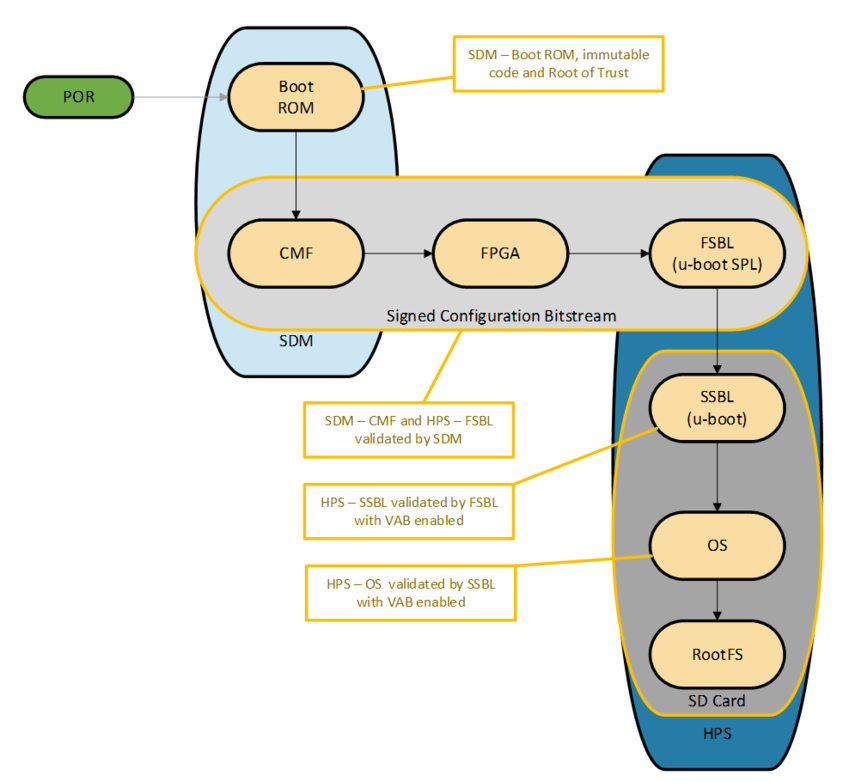
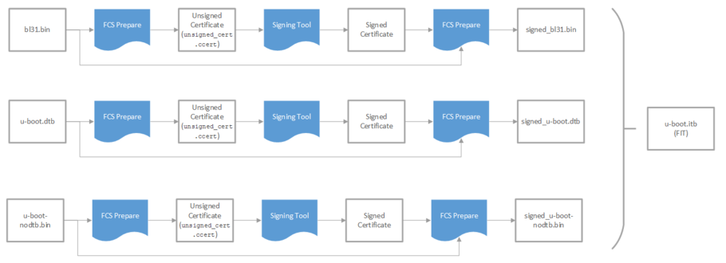

# Vendor Authorized Boot (HPS-First) Tutorial Example Design User Guide


## Introduction

The Vendor Authorized Boot (VAB) design demonstrates an end-to-end authenticated boot flow, from device power on until the Linux kernel is loaded. There are two main components of this design - the Secure Device Manager (SDM) which authenticates the configuration bitstream and U-boot with the Vendor Authorized Boot (VAB) feature. This design is demonstrated on the  [Agilex™ 7 FPGA F-Series Transceiver-SoC Development Kit (P-Tiles & E-Tile)](https://www.intel.com/content/www/us/en/products/details/fpga/development-kits/agilex/si-agf014.html) but can also be easily ported to other boards.

This demo design requires the following:
- QKY file to program virtual key for SDM authentication
- Signed RBF file (configuration bitstream) that consists of Agilex™ 7  GHRD and U-boot FSBL
- U-boot FSBL and SSBL with VAB features
- Linux LTSI
## Overview
The main purpose of a secure boot system is to ensure that the software running in the Hard Processor System (HPS) is trusted. Upon power up, a trusted first stage of boot will be executed - subsequent stages are only loaded and executed if it is authenticated by the current boot stage.
In the Altera® Agilex™ 7 SoC FPGA devices, the Secure Device Manager (SDM) is the entry point for all configuration and booting scenarios. As such, the SDM is the root of trust and will be authenticating the configuration bitstream before any HPS software is being loaded. The SDM's Configuration Management Firmware (CMF) and HPS's First Stage Bootloader (FSBL) are validated as part of the signed configuration bitstream. If VAB is enabled in U-Boot, the FSBL will validate the Second Stage Bootloader (SSBL) and the SSBL will validate the linux kernel.

**Note:** In this demo design, only the authentication feature of the SDM is being demonstrated. The SDM supports other security features such as bitstream encryption, Physically Unclonable Function (PUF) and many more. 


## Environment Setup
1. Create the main directory of the design: 

```bash 
cd ~ 
mkdir agx7_vab && cd agx7_vab && export TOP_DIR=$(pwd) 
```

2. Download and extract the Linaro toolchain. Then, configure your environment to access the Linaro cross compiler:

```bash
wget https://developer.arm.com/-/media/Files/downloads/gnu/11.2-2022.02/binrel/gcc-arm-11.2-2022.02-x86_64-aarch64-none-linux-gnu.tar.xz
tar xf gcc-arm-11.2-2022.02-x86_64-aarch64-none-linux-gnu.tar.xz
export PATH=`pwd`/gcc-arm-11.2-2022.02-x86_64-aarch64-none-linux-gnu/bin:$PATH
rm -f gcc-arm-11.2-2022.02-x86_64-aarch64-none-linux-gnu.tar.xz
```
3. Enable Quartus tools to be called from command line:

```bash
export QUARTUS_ROOTDIR=~/intelFPGA_pro/24.3.1/quartus/
export PATH=$QUARTUS_ROOTDIR/bin:$QUARTUS_ROOTDIR/linux64:$QUARTUS_ROOTDIR/../qsys/bin:$PATH
```

## Building the System Image

### Build Arm Trusted Firmware
```bash
cd $TOP_DIR
git clone https://github.com/altera-opensource/arm-trusted-firmware 
cd arm-trusted-firmware
git checkout -b socfpga_v2.8.1_vab origin/socfpga_v2.8.1
make realclean
make bl31 CROSS_COMPILE=aarch64-none-linux-gnu- PLAT=agilex DEPRECATED=1 \
 HANDLE_EA_EL3_FIRST=1
cd ..
```
### Build U-Boot
The VAB deconfig will add the Vendor Authorized Boot firmware to the FSBL and SSBL.
```bash
cd $TOP_DIR
git clone https://github.com/altera-opensource/u-boot-socfpga
cd u-boot-socfpga
git checkout -b socfpga_v2023.01_vab origin/socfpga_v2023.01
export CROSS_COMPILE=aarch64-none-linux-gnu-; export ARCH=arm
make clean && make mrproper
make socfpga_agilex_vab_defconfig
make -j 24 u-boot u-boot.img u-boot.dtb spl/u-boot-spl-dtb.hex
cd ..
```
### Build Linux Kernel with Altera® FGPA Crypto Service Support
```bash
cd $TOP_DIR
git clone https://github.com/altera-opensource/linux-socfpga
cd linux-socfpga
git checkout -b socfpga-6.1.20 origin/socfpga-6.1.20-lts
export CROSS_COMPILE=aarch64-none-linux-gnu-; export ARCH=arm64
make clean
make defconfig
make menuconfig
   (Browse and enable Cryptographic API > Hardware crypto devices > (*)Altera® FPGA Crypto Service support)
make -j 16 all && make dtbs && make -j 16 modules
cd ..
```
### Generate Signature Chains
Create three signature chains (FPGA, SDM FW Cosigning, and HPS software).
Create directories for the keys and signature chains.
```bash
mkdir -p privatekeys
mkdir -p publickeys
mkdir -p qky
```
Start a Nios command shell to have all Quartus tools in the PATH:
```
~/intelFPGA_pro/<VERSION>/niosv/bin/niosv-shell
```
#### Generate Root Key
```bash
quartus_sign --family=agilex --operation=make_private_pem --curve=secp384r1 --no_passphrase \
 privatekeys/root0.pem
quartus_sign --family=agilex --operation=make_public_pem privatekeys/root0.pem \
 publickeys/root0_public.pem
quartus_sign --family=agilex --operation=make_root publickeys/root0_public.pem qky/root0.qky
```
#### Generate Signing Keys

FPGA Signing

```bash
quartus_sign --family=agilex --operation=make_private_pem --curve=secp384r1 --no_passphrase \
 privatekeys/sign0.pem
quartus_sign --family=agilex --operation=make_public_pem privatekeys/sign0.pem \
 publickeys/sign0_public.pem
```
SDM Cosigning
```bash
quartus_sign --family=agilex --operation=make_private_pem --curve=secp384r1 --no_passphrase \
 privatekeys/cosign0.pem
quartus_sign --family=agilex --operation=make_public_pem privatekeys/cosign0.pem \
 publickeys/cosign0_public.pem
```
HPS Software
```bash
quartus_sign --family=agilex --operation=make_private_pem --curve=secp384r1 --no_passphrase \
 privatekeys/software0.pem
quartus_sign --family=agilex --operation=make_public_pem privatekeys/software0.pem \
 publickeys/software0_public.pem
```
Generate Signature Chains:
FPGA Signing - Cancel ID 1 – Permissions: FPGA/HPS/HPS Debug
```bash
quartus_sign --family=agilex --operation=append_key --previous_pem=privatekeys/root0.pem \
 --previous_qky=qky/root0.qky --permission=14 --cancel=1 \
 --input_pem=publickeys/sign0_public.pem qky/sign0_cancel1.qky
```
SDM cosigning - cancel ID 2 – Permissions: SDM Firmware
```bash
quartus_sign --family=agilex --operation=append_key --previous_pem=privatekeys/root0.pem \
 --previous_qky=qky/root0.qky --permission=0x1 --cancel=2 \
 --input_pem=publickeys/cosign0_public.pem qky/cosign0_cancel2.qky
```
HPS Software - cancel ID 3 – Permissions: HPS Firmware
```bash
quartus_sign --family=agilex --operation=append_key --previous_pem=privatekeys/root0.pem \
 --previous_qky=qky/root0.qky --permission=0x80 --cancel=3 \
 --input_pem=publickeys/software0_public.pem qky/software0_cancel3.qky
```
### Build the Hardware Design

#### Build the GHRD

Download the GHRD from Github, and build it using the commands below:

```bash
cd $TOP_DIR
rm -rf ghrd-socfpga agilex_soc_devkit_ghrd
git clone -b QPDS23.2_REL_GSRD_PR https://github.com/altera-opensource/ghrd-socfpga
mv ghrd-socfpga/agilex_soc_devkit_ghrd .
cd agilex_soc_devkit_ghrd
make scrub_clean_all
make generate_from_tcl
make all
cd ..
```
#### Enable Security Features: Authentication

For the FPGA configuration bitstream to be properly signed, enable the Quartus key File in the Quartus Project.

- Open the GHRD project in Quartus.
- From the Assignments Menu, navigate to Device > Device and Pin Options > Security. Under Quartus key file, browse and select qky/sign0_cancel1.qky.
- Alternately, you can add the following assignment to the .qsf file: "set_global_assignment -name QKY_FILE "

Regenerate the sof by running the Assembler.
- From the Processing menu, select Compilation Dashboard. In the Compilation Dashboard, select Assembler to regenerate the sof.

#### Generate and Sign FPGA and HPS RBF Files

Add FSBL bootloader to configuration bitstream.

```bash
cd $TOP_DIR
mkdir bitstreams
cd bitstreams
quartus_pfg -c \
../agilex_soc_devkit_ghrd/output_files/ghrd_agfb014r24b2e2v.sof \
../agilex_soc_devkit_ghrd/output_files/ghrd_agfb014r24b2e2v_hps.sof -o hps_path=../u-boot-socfpga/spl/u-boot-spl-dtb.hex
```
Cosign the SDM firmware.
```bash
quartus_sign --family=agilex --operation=sign --qky=../qky/cosign0_cancel2.qky --pem=../privatekeys/cosign0.pem \
$QUARTUS_ROOTDIR/../devices/programmer/firmware/agilex.zip signed_agilex.zip
```
Create Raw Binary File (rbf) with SDM Firmware included.
```bash
quartus_pfg -c -o fw_source=signed_agilex.zip ../agilex_soc_devkit_ghrd/output_files/ghrd_agfb014r24b2e2v_hps.sof \
-o sign_later=ON unsigned_bitstream.rbf
```
Sign the rbf.
```bash
quartus_sign --family=agilex --operation=sign --qky=../qky/sign0_cancel1.qky \
--pem=../privatekeys/sign0.pem unsigned_bitstream.rbf signed_bitstream.rbf
```
Create .jic for flash programmer. (Optional)
```bash
quartus_pfg -c signed_bitstream.rbf signed_flash.jic -o device=MT25QU128 -o flash_loader=AGFB014R24B -o mode=ASX4
```
Move back into the project directory.
```bash
cd ..
```
### Prepare the Signed Images

#### Compile fcs_prepare

The VAB preparation tool is used along with quartus_sign to create a signed firmware image. The signing process perfoms the following:
- The VAB preparation tool calculates the SHA384 hash of the firmware image and creates an unsigned certificate, named unsigned_cert.ccert.
- The signing tool signs the unsigned certification using the appropriate signature chain and creates a signed certificate.
- The VAB preparation tool will append the signed certificate and certificate length to the firmware image, creating a signed firmware image hps_image_signed.vab.
- Create a FIT image of the individually signed firmware images.
```bash
cd $TOP_DIR
git clone https://github.com/altera-opensource/fcs_apps
mv fcs_apps fcs_prepare
cd fcs_prepare
git checkout -b fcs_prepare_vab origin/fcs_prepare
export CROSS_COMPILE=; export ARCH=
make clean && make all
cd ..
```
#### Create Signed U-boot Image

A signed U-boot image will consist of three individually signed firmware images (bl31.bin, u-boot.dtb and u-boot-nodtb.bin) in a FIT image:

Create a working directory for signing images

```bash
cd $TOP_DIR
mkdir signed_hps_images && cd signed_hps_images
```
Create the certificate for bl31.bin
```bash
../fcs_prepare/fcs_prepare --hps_cert ../arm-trusted-firmware/build/agilex/release/bl31.bin -v
quartus_sign --family=agilex --operation=SIGN --qky=../qky/software0_cancel3.qky \
 --pem=../privatekeys/software0.pem ./unsigned_cert.ccert ./signed_cert_bl31.bin.ccert
../fcs_prepare/fcs_prepare --finish ./signed_cert_bl31.bin.ccert --imagefile \
 ../arm-trusted-firmware/build/agilex/release/bl31.bin
mv hps_image_signed.vab ../u-boot-socfpga/signed-bl31.bin
rm unsigned_cert.ccert 
```
Create the certificate for u-boot.dtb
```bash
../fcs_prepare/fcs_prepare --hps_cert ../u-boot-socfpga/u-boot.dtb -v
quartus_sign --family=agilex --operation=SIGN --qky=../qky/software0_cancel3.qky \
 --pem=../privatekeys/software0.pem ./unsigned_cert.ccert ./signed_cert_u-boot_pad.dtb.ccert
../fcs_prepare/fcs_prepare --finish ./signed_cert_u-boot_pad.dtb.ccert --imagefile ../u-boot-socfpga/u-boot.dtb
mv hps_image_signed.vab ../u-boot-socfpga/signed-u-boot.dtb
rm unsigned_cert.ccert
```
Create the certificate for u-boot-nodtb.bin
```bash
../fcs_prepare/fcs_prepare --hps_cert ../u-boot-socfpga/u-boot-nodtb.bin -v
quartus_sign --family=agilex --operation=SIGN --qky=../qky/software0_cancel3.qky \
 --pem=../privatekeys/software0.pem ./unsigned_cert.ccert ./signed_cert_u-boot-nodtb.bin.ccert
../fcs_prepare/fcs_prepare --finish ./signed_cert_u-boot-nodtb.bin.ccert --imagefile \
 ../u-boot-socfpga/u-boot-nodtb.bin
mv hps_image_signed.vab ../u-boot-socfpga/signed-u-boot-nodtb.bin
rm unsigned_cert.ccert
```
Move into the U-Boot directory and run the FIT creation script
```bash
cd ../u-boot-socfpga/
export CROSS_COMPILE=aarch64-none-linux-gnu-; export ARCH=arm64
./tools/binman/binman build -u -d u-boot.dtb -O . -i u-boot
cd ..
```
#### Create Signed Linux Image
A signed Linux image will consist of two individually signed firmware images (Image and linux.dtb) in a FIT image:

Move into the signed images working directory
```bash
cd $TOP_DIR/signed_hps_images
```
Create the certificate for the Image.
```bash
../fcs_prepare/fcs_prepare --hps_cert ../linux-socfpga/arch/arm64/boot/Image -v
quartus_sign --family=agilex --operation=SIGN --qky=../qky/software0_cancel3.qky \
 --pem=../privatekeys/software0.pem ./unsigned_cert.ccert ./signed_cert_Image.ccert
../fcs_prepare/fcs_prepare --finish ./signed_cert_Image.ccert --imagefile ../linux-socfpga/arch/arm64/boot/Image
mv hps_image_signed.vab ../u-boot-socfpga/signed-Image
rm unsigned_cert.ccert 
```
Create the certificate for linux.dtb.
```bash
../fcs_prepare/fcs_prepare --hps_cert \
 ../linux-socfpga/arch/arm64/boot/dts/intel/socfpga_agilex_socdk.dtb -v
quartus_sign --family=agilex --operation=SIGN --qky=../qky/software0_cancel3.qky \
 --pem=../privatekeys/software0.pem ./unsigned_cert.ccert ./signed_cert_linux.dtb.ccert
../fcs_prepare/fcs_prepare --finish ./signed_cert_linux.dtb.ccert --imagefile \
 ../linux-socfpga/arch/arm64/boot/dts/intel/socfpga_agilex_socdk.dtb
mv hps_image_signed.vab ../u-boot-socfpga/signed-linux.dtb
rm unsigned_cert.ccert
```
Move into the U-Boot directory and run the FIT creation script.
```bash
cd ../u-boot-socfpga/
export CROSS_COMPILE=aarch64-none-linux-gnu-; export ARCH=arm64
./tools/binman/binman build -u -d u-boot.dtb -O . -i kernel
cd ..
```
### Create fcs_client (optional)
The FCS_Client is an application that will allow validation of firmware images from the linux kernel. This application interfaces the Altera® FPGA Crypto Services drivers included with the linux build.
```bash
cd $TOP_DIRcd $TOP_DIR
git clone https://github.com/altera-opensource/fcs_apps
mv fcs_apps fcs_client
cd fcs_client
git checkout -b fcs_client_vab origin/fcs_client
export CROSS_COMPILE=aarch64-none-linux-gnu-; export ARCH=arm64
make clean && make all
cd ..
```
### Create Rootfs
Refer to [Building Yocto Rootfs](https://altera-fpga.github.io/rel-25.3/embedded-designs/agilex-7/f-series/soc/boot-examples/ug-linux-boot-agx7-soc/#building-yocto-rootfs )
```bash
cd $TOP_DIR
mkdir rootfs && cd rootfs
git clone -b honister git://git.yoctoproject.org/poky.git
git clone -b honister git://git.yoctoproject.org/meta-intel-fpga.git
source poky/oe-init-build-env ./build
echo 'MACHINE = "agilex"' >> conf/local.conf
echo 'BBLAYERS += " ${TOPDIR}/../meta-intel-fpga "' >> conf/bblayers.conf
bitbake core-image-minimal
cd ../..
```
### Create SD Card Image
```bash
cd $TOP_DIR
mkdir sd_card && cd sd_card
wget https://releases.rocketboards.org/2020.11/gsrd/tools/make_sdimage_p3.py
chmod +x make_sdimage_p3.py
```
Copy over U-boot and Linux
```bash
mkdir sdfs && cd sdfs
cp ../../u-boot-socfpga/u-boot.itb .
cp ../../u-boot-socfpga/kernel.itb .
cd ..
```
Copy over rootfs
```bash
mkdir rootfs && cd rootfs
sudo tar xf ../../rootfs/build/tmp/deploy/images/agilex/core-image-minimal-agilex.tar.gz
cd ..
```
Copy fcs_client into rootfs (optional)
```bash
cd rootfs
sudo mkdir home/root/tools
sudo cp ../../fcs_client/fcs_client home/root/tools/fcs_client
cd ..
```
Copy signed images into rootfs to test fcs_client (optional). In this example, we copied over signed-bl31.bin.
```bash
cd rootfs
sudo mkdir home/root/images
sudo cp ../../u-boot-socfpga/signed-bl31.bin home/root/images/signed-bl31.bin
cd ..
```
Create the SD Card Image
```bash
sudo python3 make_sdimage_p3.py -f \
 -P sdfs/*,num=1,format=fat32,size=50M \
 -P rootfs/*,num=2,format=ext3,size=400M \
 -s 512M \
 -n sdcard_agilex_secure_boot.img
cd ..
```
### Program the Board and Boot
Configure board for SDM to boot from JTAG:

- SW1: 1:ON 2:ON 3:ON 4: OFF
- All other switches are in the default position
Insert the updated SD card into the slot on the OOBE HPS Daughtercard
Connect to the board with a serial terminal with 115,200-8-N-1 settings
Power up the board. Program and verify the virtual key using the following command. After this step, the device will no longer accept any unsigned bitstream or bitstream that has been signed with a different key until the device has received a power cycle.
```bash
quartus_pgm -c 1 -m jtag -o "pi;qky/root0.qky"
```
Program the signed RBF file using the following command:
```bash
quartus_pgm -c 1 -m jtag -o "p;bitstreams/signed_bitstream.rbf"
```
SDM will authenticate the bitstream and only allow configuration to proceed if the image is authenticated. Once RBF programming is done, you will be able to observe the U-boot boot messages at the serial terminal. The FSBL will verify the SSBL (in blue). The SSBL will then boot and verify the Linux kernel (in red).
```bash
U-Boot SPL 2021.04-14501-gbdc9a4409d (Jan 13 2022 - 17:20:53 -0600)
Reset state: Cold
MPU          1200000 kHz
L4 Main       400000 kHz
L4 sys free   100000 kHz
L4 MP         200000 kHz
L4 SP         100000 kHz
SDMMC          50000 kHz
DDR: 8192 MiB
SDRAM-ECC: Initialized success with 1727 ms
QSPI: Reference clock at 400000 kHz
WDT:   Started with servicing (10s timeout)
Trying to boot from MMC1
## Checking hash(es) for config conf … OK
## Checking hash(es) for Image atf … crc32+ OK
Image Authentication passed at address 0x0000000000001038 (40988 bytes)
## Checking hash(es) for Image uboot … crc32+ OK
Image Authentication passed at address 0x0000000000200014 (627496 bytes)
## Checking hash(es) for Image fdt … crc32+ OK
Image Authentication passed at address 0x0000000000299350 (18184 bytes)
NOTICE:  BL31: v2.5.0(release):QPDS21.1STD_REL_GSRD_PR
NOTICE:  BL31: Built : 17:05:32, Jan 13 2022

U-Boot 2021.04-14501-gbdc9a4409d (Jan 13 2022 - 17:20:53 -0600)socfpga_agilex

CPU:   Altera® FPGA SoCFPGA Platform (ARMv8 64bit Cortex-A53)
Model: SoCFPGA Agilex SoCDK
DRAM:  8 GiB
WDT:   Started with servicing (10s timeout)
MMC:   dwmmc0@ff808000: 0
Loading Environment from MMC... *** Warning - bad CRC, using default environment

In:    serial0@ffc02000
Out:   serial0@ffc02000
Err:   serial0@ffc02000
Net:
Warning: ethernet@ff800000 (eth0) using random MAC address - 52:ec:38:d3:48:8e
eth0: ethernet@ff800000
Hit any key to stop autoboot:  0
Failed to load 'u-boot.scr'
31856470 bytes read in 1487 ms (20.4 MiB/s)
## Loading kernel from FIT Image at 02000000 …
   Using 'conf' configuration
   Verifying Hash Integrity … OK
   Trying 'kernel' kernel subimage
     Description:  Linux Kernel
     Type:         Kernel Image
     Compression:  uncompressed
     Data Start:   0x020000bc
     Data Size:    31837308 Bytes = 30.4 MiB
     Architecture: AArch64
     OS:           Linux
     Load Address: 0x04080000
     Entry Point:  0x04080000
     Hash algo:    crc32
     Hash value:   51c0a4d2
   Verifying Hash Integrity … crc32+ OK
Image Authentication passed at address 0x00000000020000bc (31836672 bytes)
## Loading fdt from FIT Image at 02000000 …
   Using 'conf' configuration
   Verifying Hash Integrity … OK
   Trying 'fdt' fdt subimage
     Description:  Linux DTB
     Type:         Flat Device Tree
     Compression:  uncompressed
     Data Start:   0x03e5ce10
     Data Size:    17304 Bytes = 16.9 KiB
     Architecture: AArch64
     Hash algo:    crc32
     Hash value:   57811f0f
   Verifying Hash Integrity … crc32+ OK
Image Authentication passed at address 0x0000000003e5ce10 (16668 bytes)
   Booting using the fdt blob at 0x3e5ce10
   Loading Kernel Image
   Loading Device Tree to 000000007fa33000, end 000000007fa3a11b … OK
SF: Detected mt25qu02g with page size 256 Bytes, erase size 4 KiB, total 256 MiB
Enabling QSPI at Linux DTB...
RSU: Firmware or flash content not supporting RSU
RSU: Firmware or flash content not supporting RSU
RSU: Firmware or flash content not supporting RSU
RSU: Firmware or flash content not supporting RSU

Starting kernel …
```
### Using fcs_client 
If included in your rootfs, you can verify signed firmware images using fcs_client.
Enter username as 'root' (no password required) once booting is complete.
In the below example, we are validating the signed_bl31.bin which we added to the rootfs. Return status '0x0' indicates validated firmware.
```bash
Poky (Yocto Project Reference Distro) 3.4.1 agilex /dev/ttyS0

agilex login: root
root@agilex:~# ./tools/fcs_client -V ./images/signed-bl31.bin -t 0 -v
fcs_validate_request[481] filesize=41624
fcs_validate_request[503] sz=41624, filesize=41624
fcs_validate_request[516] Parsing Normal image
fcs_validate_hps_image_buf[349] perform Hash Calculation
Computed Hash
0000: 0e 20 6f af 08 9c db b9
0008: d6 25 71 1b fe 62 df 0d
0010: 21 d6 c8 15 1f 7d 4c 32
0018: c3 3e 53 c0 2c 5e 83 dc
0020: 41 71 ff f5 2a 45 1c 4e
0028: 24 67 8e 50 00 dd 10 34
Certificate Hash
0000: 0e 20 6f af 08 9c db b9
0008: d6 25 71 1b fe 62 df 0d
0010: 21 d6 c8 15 1f 7d 4c 32
0018: c3 3e 53 c0 2c 5e 83 dc
0020: 41 71 ff f5 2a 45 1c 4e
0028: 24 67 8e 50 00 dd 10 34
Hash matches so sending to SDM...
VAB Certificate size is 636.
ioctl size=636, address=0x0x1950f4ac
ioctl return status=0x0 size=636
root@agilex:~#
```