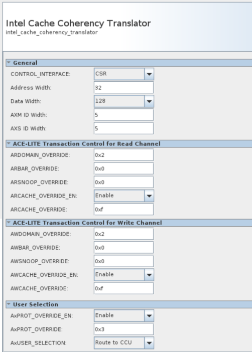

# Setting up and Using Bridges HPS Linux Tutorial Example Design for the Agilex™ 7 FPGA F-Series Transceiver-SoC Development Kit (P-Tiles & E-Tile)


## Overview

This project demonstrates how to access HPS Memory via the FPGA to HPS bridges when the HPS is running Linux, but is also applicable to other OS’s or BareMetal inclusive.  This project is created for the Agilex™ 7 FPGA F-Series Transceiver-SoC Development Kit (P-Tiles & E-Tile, DK-SI-AGF014EB). It includes the effect of:

* The memory allocation method used in Linux which sets the memory attributes including security and privilege.
* The interaction with Arm® AMBA® AXI™ Side Band Signal settings required for secure, privileged, and cached transfers from the FPGA using the Cache Coherency Translator IP. This also includes the exercise of the data path that goes from fabric to SDRAM which could go directly to SDRAM or pass through CCU.
* The Firewall settings for the HPS bridges, which can override AXI transaction attributes.
* Perform data movement from one SDRAM memory location to another using the Scatter-Gather DMA IP.

This example allocates memory using two methods:

1. Manually reserved memory at Kernel boot time.

  * Allocation at Kernel boot time using the Kernel boot argument **mem=1G**. This limits the Linux kernel to use the lower 1GB (of 2 GB*) SDRAM.
  * This creates a static area of 1 GB (upper region of the 2 GB*) reserved for the application.
  * This area will typically be marked as Privileged and non-secure, but this is implementation dependent.

2. Runtime allocation from the Contiguous Memory Allocator Area (CMA) of 256 MB.

  * Kernel allocated memory from device tree supported by Kernel drivers,  dynamic allocation of DMA Memory and the Linux Kernel’s DMA API. 
  * An open source 3rd party driver is used to allocate this memory.
  * This memory will typically be marked as privileged as it has been kernel allocated, and may be marked as non-secure.

**Note:** The dev kit have 8 GB of memory which is mapped in 2 regions:  one region of 2 GB (going from 0x0 - 0x80000000) and second region of 6 GB (going from 0x280000000 - 0x400000000). The 2 GB region mentioned in the manually reserved memory above is referring  to this 1st region.


For further reading:

* Linux Kernel [DMA API](https://docs.kernel.org/core-api/dma-api-howto.html), and CMA documentation can be found in the Linux Kernel Documentation.
* Information on Memory Attributes in Arm® architectures can be found in the Arm Architecture documentation available on arm.com.


This example requires a correct configuration for the FPGA Firewall settings to allow only secure access through F2S bridge( through the fpga2soc bit on the **soc_noc_fw_mpfe_csr_inst_0_mpfe_scr** register with offset 0xF8020018).  For more detail see [Altera® Agilex™ 7 Hard Processor System Address Map and Register Definitions](https://www.intel.com/content/www/us/en/programmable/hps/agilex/hps.html). 

The HPS is also configured to send the memory transactions directly to the MPFE NOC  or to through the CCU based on the settings defined in the Altera Cache Coherency Translator in the fabric.

High Level Diagram:


### AMBA ACE-LITE Signaling

 The attributes of the AXI transaction from the FPGA are controlled by the Altera Cache Coherency Translator IP. The AXUSER signal is used to steer transactions either directly to the SDRAM or via the HPS Cache Coherency Unit (CCU).

```
ACE-LITE Signaling: 
   #[1:0]     - ardomain    
   #[3:2]     - arbar        
   #[7:4]     - arsnoop     
   #[11:8]    - arcache      
   #[13:12]   - awdomain      
   #[15:14]   - awbar        
   #[18:16]   - awsnoop       
   #[22:19]   - awcache       
   #[28:23]   - axuser[7:2]   Memory data path (direct or through CCU)
   #[31:29]   - axprot    Bit0: Privelege mode, Bit1: Secure mode      
```
For further reading:

* The AMBA® AXI™ and ACE™ Protocol Specification available form arm.com contains more information on the AXI Side band signals.
* The Bridges chapter of the [Altera® Agilex™ 7 Hard Processor System Technical Reference Manual](https://www.intel.com/content/www/us/en/docs/programmable/683567/22-4/hard-processor-system-technical-reference.html) contains information and examples bridge settings for AXI Side Band Signals.

### Testing of the Project

The demonstration script runs 4 tests on via a simple bash script. All the tests are run using a DMA controller in the FPGA fabric, controlled from the HPS.

* 2 sets of Read and Write Buffers are created for the DMA to use. Read and Write buffers are named from the DMA controller perspective).
* One set of Buffers is created in the manually reserved memory region.
* One set of Buffers is created in the Contiguous Memory Allocator (CMA) Area.
* The Read Buffers are populated with test data from user space prior to the test running.
* The Altera Cache Coherency Translator is set prior to each test, to set the transaction routing (SDRAM Direct or via CCU) and the AXI Transaction attributes. See Test Script for full detail on AXI Attribute settings for each test.


The description of the 4 tests that the bash scripts executes are shown next. The test makes use of the **devmem2** application from the user space to perform all the operations (configuration and read/write from/to buffers).


1. Direct to SDRAM. AXI attributes: Privileged, Non-Cached and Non-Secure access.

  * Write 128 words in the read buffer at the manually reserved area of SDRAM from the user space. Read back the buffer from user space to confirm the content. 
  * Configure the DMA controller to move the chunk of the 128 words to the write buffer also in the manually reserved area of SDRAM.
  * Read from the write buffer to verify the content. This content is should not match to the content written in the read buffer due to Non-secure transactions are being blocked by the FPGA firewall.

  


2. Direct to SDRAM. AXI attributes: Privileged, Non-Cached and Secure access.

  * Write 128 words in the read buffer at the manually reserved area of SDRAM from the user space. Read back the buffer from user space to confirm the content. 
  * Configure the DMA controller to move the chunk of the 128 words to the write buffer also in the manually reserved area of SDRAM.
  * Read from the write buffer to verify the content. The content in the write buffer should match with the data written in the read buffer.

  

3. Through CCU. AXI attributes: Privileged, Non-Cached and Secure access.

  * Write 128 words in the read buffer at the manually reserved area of SDRAM from the user space. Read back the buffer from user space to confirm the content. 
  * Configure the DMA controller to move the chunk of the 128 words to the write buffer in the CMA reserved area of SDRAM in non-cached mode.
  * Read from the write buffer to verify the content. The content in the write buffer should match with the data written in the read buffer. This test can be edited to use the manually reserved area of SDRAM as the write buffer.

  

4. Through CCU. AXI attributes: Privileged, Cached and Secure access.

  * Write 128 words in the read buffer at the manually reserved area of SDRAM from the user space. Read back the buffer from user space to confirm the content. 

  * Configure the DMA controller to move the chunk of the 128 words to the write buffer in the CMA reserved area of SDRAM in cached mode.

  * Read from the write buffer to verify the content. The content in the write buffer should match with the data written in the read buffer. This test can be edited to use the manually reserved area of SDRAM as the write buffer.

  

The following table describes the configuration that is being performed in the Cache Coherency Translator in each one of the tests and the values in each one of the fields. This configuration determines the memory transaction attributes in each test. 

|  Field | Test 1<br>Direct<br>Non-Secured<br>Non-Cached<br>Privileged | Test 2<br>Direct<br>Secured<br>Non-Cached<br>Privileged | Test 3<br>Through CCU<br>Secured<br>Non_cached<br>Privileged | Test 4<br/>Through CCU<br/>Secured<br/>Cached<br/>Privileged |
| :-- | :-- | :-- | :-- | :-- |
| CSR Register | 0x7C108208 | 0x3C108208 | 0x20982302 | 0x20F82F02 |
| ARDOMAIN[1:0] | 0x0 | 0x0 | 0x2 | 0x2 |
| ARBAR[3:2] | 0x2 | 0x2 | 0x0 | 0x0 |
| ARSNOOP[7:4] | 0x0 | 0x0 | 0x0 | 0x0 |
| ARCACHE[11:8] | 0x2 | 0x2 | 0x3 | 0xF |
| AWDOMAIN[13:12] | 0x0 | 0x0 | 0x2 | 0x2 |
| AWBAR[15:14] | 0x2 | 0x2 | 0x0 | 0x0 |
| AWSNOOP[18:16] | 0x0 | 0x0 | 0x0 | 0x0 |
| AWCACHE[22:19] | 0x2 | 0x2 | 0x3 | 0xF |
| AxUSER7_1[28:23] | 0x38<br>AxUSER[7:0]=0xE0 | 0x38<br>AxUSER[7:0]=0xE0 | 0x1<br>AxUSER[7:0]=0x4 | 0x1<br>AxUSER[7:0]=0x4 |
| AxPROT[31:29] | 0x3 | 0x1 | 0x1 | 0x1 |

<span style="color: red;">**Note:** This page was migrated from Rocketboards in 24.3.1 release. In case you need to see the content from earlier versions, please go to https://www.rocketboards.org/foswiki/Projects/SettingUpAndUsingBridgesOnAgilex and see the Revision History of that page.</span>

## Prerequisites

* Agilex™ 7 FPGA F-Series Transceiver-SoC Development Kit (P-Tiles & E-Tile, DK-SI-AGF014EB)

  * Mini USB cable for serial output.

  * USB cable for on-board Altera® FPGA Download Cable II.

  * SD/MMC HPS Daughtercard.

  * Micro SD card.

* Host PC with

  * Linux distribution with kernel-headers/ kernel-devel and Binutils packages properly installed. Ubuntu 22.04LTS was used to create this page, other versions and distributions may work too.
  * Altera&reg; Quartus<sup>&reg;</sup> Prime Pro Edition Version 25.3.
  * Serial terminal (for example Minicom on Linux and TeraTerm or PuTTY on Windows).

## Building the Example


### Set up Environment


Create a top folder for this example, as the rest of the commands assume this location:


```bash
sudo rm -rf agilex7f_gsrd_bridge_example
mkdir agilex7f_gsrd_bridge_example
cd agilex7f_gsrd_bridge_example
export TOP_FOLDER=$(pwd)
```


Download the compiler toolchain, add it to the PATH variable, to be used by the GHRD makefile to build the HPS Debug FSBL:


```bash
cd $TOP_FOLDER
wget https://developer.arm.com/-/media/Files/downloads/gnu/14.3.rel1/binrel/\
arm-gnu-toolchain-14.3.rel1-x86_64-aarch64-none-linux-gnu.tar.xz
tar xf arm-gnu-toolchain-14.3.rel1-x86_64-aarch64-none-linux-gnu.tar.xz
rm -f arm-gnu-toolchain-14.3.rel1-x86_64-aarch64-none-linux-gnu.tar.xz
export PATH=`pwd`/arm-gnu-toolchain-14.3.rel1-x86_64-aarch64-none-linux-gnu/bin/:$PATH
export ARCH=arm64
export CROSS_COMPILE=aarch64-none-linux-gnu-
```

Enable Quartus tools to be called from command line:


```bash
export QUARTUS_ROOTDIR=~/altera_pro/25.3/quartus/
export PATH=$QUARTUS_ROOTDIR/bin:$QUARTUS_ROOTDIR/linux64:$QUARTUS_ROOTDIR/../qsys/bin:$PATH
```


### Build Hardware Design


This project starts using the GHRD for the DK-SI-AGF014EB OOBE (booting from SD Card) with some modifications that include:

*  Change HPS parameters related to the FPGA to HPS interface
* Changing the control interface of the  [Altera Cache Coherency Translator](https://www.intel.com/content/www/us/en/docs/programmable/683130/22-1/core-overview-48344.html)

* Include the Modular Scatter-Gather DMA [mSGDMA's Overview](https://www.intel.com/content/www/us/en/docs/programmable/683130/21-4/modular-scatter-gather-dma-prefetcher-core.html)

This can be performed automatically using the [update_ghrd_bridge_example.tcl](https://altera-fpga.github.io/rel-25.3/embedded-designs/agilex-7/f-series/soc/setup-use-bridges/collateral/update_ghrd_bridge_example.tcl) script as indicated next:


```bash
cd $TOP_FOLDER
rm -rf agilex7f-ed-gsrd
wget https://github.com/altera-fpga/agilex7f-ed-gsrd/archive/refs/tags/QPDS25.3_REL_GSRD_PR.zip
unzip QPDS25.3_REL_GSRD_PR.zip
rm QPDS25.3_REL_GSRD_PR.zip
mv agilex7f-ed-gsrd-QPDS25.3_REL_GSRD_PR agilex7f-ed-gsrd
cd agilex7f-ed-gsrd
make agf014eb-si-devkit-oobe-baseline-generate-design
cd agilex_soc_devkit_ghrd
wget https://altera-fpga.github.io/rel-25.3/embedded-designs/agilex-7/f-series/soc/setup-use-bridges/collateral/update_ghrd_bridge_example.tcl
qsys-script --qpf=ghrd_agfb014r24b2e2v.qpf --script=update_ghrd_bridge_example.tcl --system-file=qsys_top.qsys
cd ..
make agf014eb-si-devkit-oobe-baseline-package-design
make agf014eb-si-devkit-oobe-baseline-prep
make agf014eb-si-devkit-oobe-baseline-build

```


The output of this stage will be:

* $TOP_FOLDER/agilex7f-ed-gsrd/agilex_soc_devkit_ghrd/output_files/ghrd_agfb014r24b2e2v.sof


You can also modify and build the hardware project manually as indicated next. This should be done just after executing the **make agf014eb-si-devkit-oobe-baseline-generate-design** command in the previous instructions.

1. Open the Quartus project with the following command and then open **qsys_top.qsys** from Platform Designer:

  ```
  quartus ./agilex_soc_devkit_ghrd/ghrd_agfb014r24b2e2v.qpf &
  ```

  

2. Right-click on **agilex_hps** name and select **Edit Parameters** then configure it as follows and click on finish:

  **FPGA to HPS slave interface**

    - Interface specification → ACE-lite<br>
    - Enable/Data width → 128-bit<br>
    - Interface destination → custom<br>

  **Note:** The interface destination is set as **custom** because we want to control the data path to SDRAM (either direct or through CCU) from the signals in the memory transaction defined by the Cache Coherency Translator.

  

3. Right click to the **altera_cache_coherency_translator_0** to configure the parameters as indicated next:

  **General**

  - CONTROL_INTERFACE → CSR<br>
  - Address Width → 32<br>
  - Data Width → 128<br>
  - AXM ID Width → 5<br>
  - AXM ID Width → 5<br>

  **ACE-Lite Transaction Control for read Channel**

  - ARDOMAIN_OVERRIDE → 0x2<br>
  - ARCACHE_OVERRIDE_EN → Enable<br>
  - ARCACHE_OVERRIDE → 0xf<br>

  **ACE-Lite Transaction Control for Write Channel**

  - AWDOMAIN_OVERRIDE → 0x2<br>
  - AWCACHE_OVERRIDE_EN → Enable<br>
  - AWCACHE_OVERRIDE → 0xf<br>

  **User Selection**

  - AxPROT_OVERRIDE_EN → Enable<br>
  - AxPROT_OVERRIDE → 0x3<br>

      

4. Add **Modular Scatter-Gather DMA IP** to the design with the following configurations:

  **DMA Settings**

  - Data Width → 128<br>
  - Data Path FIFO Depth → 512<br>
  - Descriptor FIFO Depth → 64<br>
  - Response Port → Memory-Mapped<br>
  - Maximum Transfer Length → 4KB<br>
  - Burst Enable<br>
  - Maximum Burst Count → 64<br>

  **Extended Feature Options**

  - Enable Extended Feature Support<br>
  - Programmable Burst Enable<br>

  **Pre-Fetching Options**

  - Data Width of Descriptor read/write master data path → 128<br>
    
     

5. Move the **msgdma_0** component (Modular Scatter-Gather DMA) below the **agilex_hps** component selecting the component and using the UP button.

     

6. Connect the **altera_cache_coherency_translator_0** component as shown next:

    - csr_clock → clk_100.out_clk<br>
    - csr_reset → rst_in.out_reset<br>
    - csr → agilex_hps.h2f_lw_axi_master<br>

    

7. Connect the **msgdma_0** component (Modular Scatter-Gather DMA) as shown next:

    - Clock → clk_100.out_clk<br>
    - reset → rst_in.out_reset<br>
    - csr → agilex_hps.h2f_lw_axi_master<br>
    - descriptor_slave → agilex_hps.h2f_lw_axi_master<br>
    - response → agilex_hps.h2f_lw_axi_master<br>
    - mm_read → intel_cache_coherency_translator_0.s0<br>
    - mm_write → intel_cache_coherency_translator_0.s0<br>

    

8. Use the padlock   on the "Base" column to lock all the base addresses except the ones in Altera Cache Coherency translator and Modular Scatter-Gather DMA components. After that go to **System** → **Assign Base Addresses** menu and click it. Once the process is finished, the Address Map tab should look similar to this:

  

9. If everything is ok, there shouldn't be any error on the system Messages tray and you can save the design and click on **Generate HDL** button now.

10. Finally close **Platform Designer** and start building the updated hardware design on **Quartus Pro** by either clicking  or pressing **CTL-L**.


### Rebuild the hps_debug.sof from Updated .sof


```bash
cd $TOP_FOLDER/agilex7f-ed-gsrd
# Generate hps_debug.ihex
make agf014eb-si-devkit-oobe-baseline-sw-build
quartus_pfg -c ./agilex_soc_devkit_ghrd/output_files/ghrd_agfb014r24b2e2v.sof ghrd_agfb014r24b2e2v_hps_debug.sof -o hps_path=./agilex_soc_devkit_ghrd/software/hps_debug/hps_debug.ihex
mv ghrd_agfb014r24b2e2v_hps_debug.sof agilex_soc_devkit_ghrd/output_files/
cd $TOP_FOLDER
```


The following files are created:

- $TOP_FOLDER/agilex7f-ed-gsrd/agilex_soc_devkit_ghrd/software/hps_debug/hps_debug.ihex - HPS Debug FSBL
- $TOP_FOLDER/agilex7f-ed-gsrd/agilex_soc_devkit_ghrd/output_files/ghrd_agfb014r24b2e2v_hps_debug.sof - FPGA configuration file, with HPS Debug FSBL


### Build Core RBF


Create the Core RBF file to be used in the rootfs created by Yocto by using the HPS Debug SOF built by the GHRD makefile:


```bash
cd $TOP_FOLDER
rm -f *jic* *rbf*
quartus_pfg -c agilex7f-ed-gsrd/agilex_soc_devkit_ghrd/output_files/ghrd_agfb014r24b2e2v_hps_debug.sof \
 ghrd_agfb014r24b2e2v.jic \
 -o device=MT25QU02G \
 -o flash_loader=AGFB014R24B2E2V \
 -o mode=ASX4 \
 -o hps=1
rm ghrd_agfb014r24b2e2v.hps.jic
```


The following files will be created:

- $TOP_FOLDER/ghrd_agfb014r24b2e2v.core.rbf - HPS First configuration bitstream, phase 2: FPGA fabric


### Set Up Yocto

1\. Make sure you have Yocto system requirements met: https://docs.yoctoproject.org/5.0.1/ref-manual/system-requirements.html#supported-linux-distributions.

The command to install the required packages on Ubuntu 22.04 is:

```bash
sudo apt-get update
sudo apt-get upgrade
sudo apt-get install openssh-server mc libgmp3-dev libmpc-dev gawk wget git diffstat unzip texinfo gcc \
build-essential chrpath socat cpio python3 python3-pip python3-pexpect xz-utils debianutils iputils-ping \
python3-git python3-jinja2 libegl1-mesa libsdl1.2-dev pylint xterm python3-subunit mesa-common-dev zstd \
liblz4-tool git fakeroot build-essential ncurses-dev xz-utils libssl-dev bc flex libelf-dev bison xinetd \
tftpd tftp nfs-kernel-server libncurses5 libc6-i386 libstdc++6:i386 libgcc++1:i386 lib32z1 \
device-tree-compiler curl mtd-utils u-boot-tools net-tools swig -y
```

On Ubuntu 22.04 you will also need to point the /bin/sh to /bin/bash, as the default is a link to /bin/dash:

```bash
 sudo ln -sf /bin/bash /bin/sh
```

**Note**: You can also use a Docker container to build the Yocto recipes, refer to https://rocketboards.org/foswiki/Documentation/DockerYoctoBuild for details. When using a Docker container, it does not matter what Linux distribution or packages you have installed on your host, as all dependencies are provided by the Docker container.

Clone the Yocto script and prepare the build:

  ```bash
  cd $TOP_FOLDER
  rm -rf gsrd-socfpga
  git clone -b QPDS25.3_REL_GSRD_PR https://github.com/altera-opensource/gsrd-socfpga
  cd gsrd-socfpga
  . agilex7_dk_si_agf014eb-gsrd-build.sh
  build_setup
  ```


**Note**: Run the following commands to set up again the yocto build environments, if you closed the current window (for example when rebooting the Linux host) and want to resume the next steps:

  ```bash
  cd $TOP_FOLDER/gsrd-socfpga
  . ./poky/oe-init-build-env agilex-gsrd-rootfs/
  ```

### Customize Yocto

#### Adding our custom core.rbf

1. Copy the rebuilt core.rbf file to `$WORKSPACE/meta-intel-fpga-refdes/recipes-bsp/ghrd/files` using the following names, as expected by the yocto recipes:

  * agilex7_dk_si_agf014eb_gsrd_ghrd.core.rbf

  In our case we just copy the core.rbf file in the Yocto recipe location:
  
  ```bash
  ## Custom yocto to use our own core.rbf
  CORE_RBF=$WORKSPACE/meta-intel-fpga-refdes/recipes-bsp/ghrd/files/agilex7_dk_si_agf014eb_gsrd_ghrd.core.rbf
  ln -s $TOP_FOLDER/ghrd_agfb014r24b2e2v.core.rbf $CORE_RBF
  ```
  

2. In the Yocto recipe `$WORKSPACE/meta-intel-fpga-refdes/recipes-bsp/ghrd/hw-ref-design.bb modify the agilex_gsrd_code` file location:
  ```bash
  SRC_URI:agilex7_dk_si_agf014eb ?= "\
  ${GHRD_REPO}/agilex7_dk_si_agf014eb_gsrd_${ARM64_GHRD_CORE_RBF};name=agilex7_dk_si_agf014eb_gsrd_core \
  ${GHRD_REPO}/agilex7_dk_si_agf014eb_nand_${ARM64_GHRD_CORE_RBF};name=agilex7_dk_si_agf014eb_nand_core \
  ${GHRD_REPO}/agilex7_dk_si_agf014eb_pr_${ARM64_GHRD_CORE_RBF};name=agilex7_dk_si_agf014eb_pr_core \
  ${GHRD_REPO}/agilex7_dk_si_agf014eb_pr_persona0.rbf;name=agilex7_dk_si_agf014eb_pr_persona0 \
  ${GHRD_REPO}/agilex7_dk_si_agf014eb_pr_persona1.rbf;name=agilex7_dk_si_agf014eb_pr_persona1 \
  "
  ```
  to look like this:

  ```bash
  SRC_URI:agilex7_dk_si_agf014eb ?= "\
  file://agilex7_dk_si_agf014eb_gsrd_ghrd.core.rbf;sha256sum=xxxxxxxxx \
  ${GHRD_REPO}/agilex7_dk_si_agf014eb_nand_${ARM64_GHRD_CORE_RBF};name=agilex7_dk_si_agf014eb_nand_core \
  ${GHRD_REPO}/agilex7_dk_si_agf014eb_pr_${ARM64_GHRD_CORE_RBF};name=agilex7_dk_si_agf014eb_pr_core \
  ${GHRD_REPO}/agilex7_dk_si_agf014eb_pr_persona0.rbf;name=agilex7_dk_si_agf014eb_pr_persona0 \
  ${GHRD_REPO}/agilex7_dk_si_agf014eb_pr_persona1.rbf;name=agilex7_dk_si_agf014eb_pr_persona1 \
  "
  ```
  using the following commands:

  
  ```bash
  OLD_URI="\${GHRD_REPO}\/agilex7_dk_si_agf014eb_gsrd_\${ARM64_GHRD_CORE_RBF};name=agilex7_dk_si_agf014eb_gsrd_core"
  CORE_SHA=$(sha256sum $CORE_RBF | cut -f1 -d" ")
  NEW_URI="file:\/\/agilex7_dk_si_agf014eb_gsrd_ghrd.core.rbf;sha256sum=$CORE_SHA"
  sed -i "s/$OLD_URI/$NEW_URI/g" $WORKSPACE/meta-intel-fpga-refdes/recipes-bsp/ghrd/hw-ref-design.bb
  ```
  

3. In the same Yocto recipe delete the old SHA256 checksum for the file:

  ```bash
  SRC_URI[agilex7_dk_si_agf014eb_gsrd_core.sha256sum] = "5d633ee561d5cc8c22b51211a144654fdc0be47ee14b07ac134074cbff84eb8b"
  ```

  by using the following command:

  
  ```bash
  sed -i "/agilex7_dk_si_agf014eb_gsrd_core\.sha256sum/d" $WORKSPACE/meta-intel-fpga-refdes/recipes-bsp/ghrd/hw-ref-design.bb
  ```
  


#### Updating Linux Kernel Configuration

In this example you need the following Linux kernel configuration options. Among these configurations it's included the capability  of **devmem2** command to access the memory regions where the read/write buffers are located. Yocto allows to add fragments and make the process easier. You can do this by executing the following commands:


  ```bash
  # Add Configs to Linux needed to excercise this example
  cd $TOP_FOLDER/gsrd-socfpga/
  cat << EOF > $WORKSPACE/meta-intel-fpga-refdes/recipes-kernel/linux/linux-socfpga-lts/bridgesfragment.cfg
  CONFIG_ALTERA_SYSID=y
  CONFIG_ALTERA_MSGDMA=y
  CONFIG_FPGA_BRIDGE=y
  CONFIG_ALTERA_FREEZE_BRIDGE=y
  CONFIG_FPGA_REGION=y
  CONFIG_OF_FPGA_REGION=y
  CONFIG_STACKDEPOT=y
  CONFIG_STACK_HASH_ORDER=20
  CONFIG_GDB_SCRIPTS=y
  CONFIG_PAGE_EXTENSION=y
  CONFIG_DEBUG_PAGEALLOC=y
  CONFIG_DEBUG_PAGEALLOC_ENABLE_DEFAULT=y
  CONFIG_PAGE_OWNER=y
  CONFIG_PTDUMP_CORE=y
  CONFIG_PTDUMP_DEBUGFS=y
  CONFIG_DEBUG_MEMORY_INIT=y
  CONFIG_DEBUG_PER_CPU_MAPS=y
  CONFIG_STACKTRACE=y
  CONFIG_DEBUG_KOBJECT=y
  CONFIG_DEVMEM=y
  CONFIG_STRICT_DEVMEM=n
  CONFIG_EXCLUSIVE_SYSTEM_RAM=n
  EOF
  
  echo "kconf hardware bridgesfragment.cfg" >> $WORKSPACE/meta-intel-fpga-refdes/recipes-kernel/linux/linux-socfpga-lts/sgmii.scc
  ```


#### Add u-dma-buf driver to create CMA regions

It is also necessary to modify the device tree to include a 3rd party driver (u-dma-buf) to reseve the CMA memory regionlocation add the following changes to `arch/arm64/boot/dts/intel/socfpga_agilex_socdk.dts` to define how the memory will be allocated by u-dma-buf. This is done through a patch that will be created 
as shown next.


  ```bash
  ## Create the fragment of the device tree to add u-dma-buf and reserve 256 MB of memory. Creating this as patch.
  cd $TOP_FOLDER
  rm -f dmaBufNodes.txt
  cat << EOF > dmaBufNodes.txt
	  reserved-memory {
		  #address-cells = <2>;
		  #size-cells = <2>;
		  dma0_mem:dma0@0x10000000 {
		  compatible= "shared-dma-pool";
		  reusable;
		  reg=<0x0  0x10000000 0x0 0x10000000>;
		  label="dma0_mem";
		  };
	  };

	  soc {
		  clocks {
			  osc1 {
			  clock-frequency = <25000000>;
			  };
		  };

		  udmabuf0: udmabuf@0x10000000 {
			  compatible = "ikwzm,u-dma-buf";
			  device-name = "udmabuf0";
			  minor-number = <0>;
			  size = <0x10000000>;
			  memory-region = <&dma0_mem>;
			  dma-coherent = <1>;
		  };
	  };
  EOF
  
  # Create a Linux repository in the $TOP_FOLDER
  rm -rf linux-socfpga-for-patch
  git clone -b QPDS25.3_REL_GSRD_PR https://github.com/altera-opensource/linux-socfpga linux-socfpga-for-patch
  # Add the content of dmaBufNodes.txt  after 4 lines of finding memory@
  awk '
      /memory@/ {found=NR}  # Store the line number where "memory@" is found
      {print}  # Print each line as it is
      found && NR == found + 4 {while ((getline line < "dmaBufNodes.txt") > 0) print line; found=0}  # Insert after 4 lines
  ' linux-socfpga-for-patch/arch/arm64/boot/dts/intel/socfpga_agilex_socdk.dts > temp.dts && mv temp.dts linux-socfpga-for-patch/arch/arm64/boot/dts/intel/socfpga_agilex_socdk.dts

  ## Create now the patch using the differences
  cd $TOP_FOLDER/linux-socfpga-for-patch
  git add  arch/arm64/boot/dts/intel/socfpga_agilex_socdk.dts
  # Create the patch and add the Uptream status header to prevent QA errors
  git diff --patch --staged > $WORKSPACE/meta-intel-fpga-refdes/recipes-kernel/linux/linux-socfpga-lts/socfpga_agilex_socdk.dts.patch
  # Add the Upstream-status label to prevent issues
  sed -i '1i Upstream-Status: Pending\n' $WORKSPACE/meta-intel-fpga-refdes/recipes-kernel/linux/linux-socfpga-lts/socfpga_agilex_socdk.dts.patch

  # Include the Patch created in to the recipe
  cd $TOP_FOLDER/gsrd-socfpga/
  FILENAME=$WORKSPACE/meta-intel-fpga-refdes/recipes-kernel/linux/linux-socfpga-lts_%.bbappend
  awk '/file:\/\/fit_kernel_agilex7_dk_si_agf014eb.its/ {sub(/"$/, " file://socfpga_agilex_socdk.dts.patch\"")} 1' $FILENAME > temp && mv temp $FILENAME

  #Installing u-dma-buf driver
  cd $TOP_FOLDER/gsrd-socfpga/
  devtool create-workspace buff
  devtool add https://github.com/ikwzm/udmabuf
  bitbake-layers create-layer $WORKSPACE/meta-bridges
  bitbake-layers add-layer $WORKSPACE/meta-bridges
  devtool finish udmabuf  $WORKSPACE/meta-bridges
  echo 'CORE_IMAGE_EXTRA_INSTALL+="udmabuf"' >> $WORKSPACE/agilex7_dk_si_agf014eb-gsrd-rootfs/conf/local.conf
  ```


#### Setting propper fpga2soc permissions in U-Boot

For this exercise it is required to allow only secure transactions through the **fpga-to-hps** bridge. This is done by default because U-Boot doesn't modifies the **soc_noc_fw_mpfe_csr_inst_0_mpfe_scr** register (0xF8020018) in the **SDRAML3Interconnect** firewall. U-Boot performs some firewall configuration using the settings defined in the soc_noc_fw_mpfe_csr_inst_0_mpfe_scr node in the arch/arm/dts/socfpga_agilex-u-boot.dtsi device tree. Please note that there is not any configuration defined for the offset 0x18, so it means that this register keeps the default configuration having the **fpga2soc** bit with a value of 0 indicating that only secure transactions are allowed).

**Note:** In previous releases, there was a patch at `$WORKSPACE/meta-intel-fpga-refdes/recipes-bsp/u-boot/files/0001-HSD-14015655818-arm-dts-soc64-agilex-Enable-F2SDRAM-.patch` that actually modifies the defualt configuration of this register, but in this release this patch is not longer used.

#### Configuring U-Boot script

To reserve the 1 GB memory for the buffers in the static region it is necessary to moify the Linux command line to add the **mem=1G**. The Linux command line is defined through the U-Boot boot script located at `$WORKSPACE/meta-intel-fpga-refdes/recipes-bsp/u-boot/files/uboot.txt`. In this file we require to modify the **bootargs** environment variable. This is done through the following command:


  ```bash
  # Update u-boot script to reserve 1GB for the application
  cd $TOP_FOLDER/gsrd-socfpga/
  OLD_BOOTARGS="rootwait"
  NEW_BOOTARGS="rootwait mem=1G"

  sed  -i "s/$OLD_BOOTARGS/$NEW_BOOTARGS/g" $WORKSPACE/meta-intel-fpga-refdes/recipes-bsp/u-boot/files/uboot.txt
  sed -i "s/$(echo -ne '\u200b')//g" $WORKSPACE/meta-intel-fpga-refdes/recipes-bsp/u-boot/files/uboot.txt  
  ```


#### Copy Test Application to Linux File System

To exercise this application, you need to have the [dmaTest_cache_v2.0.run ](https://altera-fpga.github.io/rel-25.3/embedded-designs/agilex-7/f-series/soc/setup-use-bridges/collateral/dmaTest_cache_v2.0.run) test script provided in this example in the Linux file system. For this, you need to perform the following:


  ```bash
  cd $TOP_FOLDER/gsrd-socfpga/
  wget https://altera-fpga.github.io/rel-25.3/embedded-designs/agilex-7/f-series/soc/setup-use-bridges/collateral/dmaTest_cache_v2.0.run
  mv dmaTest_cache_v2.0.run meta-intel-fpga-refdes/recipes-gsrd/socfpga-gsrd-apps/files/
  # Adding this to the list of files to be copied to the file system
  sed -i '/file:\/\/README_agilex5/a\\t\tfile:\/\/dmaTest_cache_v2.0.run\\'  meta-intel-fpga-refdes/recipes-gsrd/socfpga-gsrd-apps/socfpga-gsrd-apps_1.0.bb
  sed -i '/intelFPGA\/syschk/a\\tinstall -m 0755 \${WORKDIR}\/sources-unpack\/dmaTest_cache_v2.0.run \${D}\/home\/root\/'  meta-intel-fpga-refdes/recipes-gsrd/socfpga-gsrd-apps/socfpga-gsrd-apps_1.0.bb
  sed -i '/FILES:\${PN} =/a\\t\t   \/home\/root\/dmaTest_cache_v2.0.run \\' meta-intel-fpga-refdes/recipes-gsrd/socfpga-gsrd-apps/socfpga-gsrd-apps_1.0.bb
  # Remove QA check for the new file INSANE_SKIP
  sed -i '/INSANE_SKIP:\${PN} =/aINSANE_SKIP:\${PN} \+= " file-rdeps"'  meta-intel-fpga-refdes/recipes-gsrd/socfpga-gsrd-apps/socfpga-gsrd-apps_1.0.bb
  sed -i '/INSANE_SKIP:\${PN}-dev =/aINSANE_SKIP:\${PN} \+= " file-rdeps"'  meta-intel-fpga-refdes/recipes-gsrd/socfpga-gsrd-apps/socfpga-gsrd-apps_1.0.bb
  ```


### Build Yocto

Now that we are setup we have to execute the following command to start building:


  ```bash
  # Build Yocto
  cd $WORKSPACE
  bitbake_image
  package
  ```


Once the build is completed successfully, you will see the following two folders are created:

* agilex7_dk_si_agf014eb-gsrd-rootfs: area used by OpenEmbedded build system for builds. Description of build directory structure https://docs.yoctoproject.org/ref-manual/structure.html#the-build-directory-build
* agilex7_dk_si_agf014eb-gsrd-images: the build script copies here relevant files built by Yocto from the agilex7_dk_si_agf014ea-gsrd-rootfs/tmp/deploy/images/agilex7_dk_si_agf014ea folder, but also other relevant files.

For this example, the two most relevant files created in the `$TOP_FOLDER/gsrd_socfpga/agilex7_dk_si_agf014ea-gsrd-images` folder are:

* u-boot-agilex-socdk-gsrd-atf/u-boot-spl-dtb.hex: U-Boot SPL Hex file
* gsrd-console-image-agilex7.wic: SD Card image

### Building QSPI Flash Image

The QSPI image will contain the SDM firmware, the 1st phase of FPGA configuration data and the HPS FSBL. This is built using the following command:


  ```bash
  cd $TOP_FOLDER
  rm -f *jic* *rbf*
  quartus_pfg -c agilex7f-ed-gsrd/agilex_soc_devkit_ghrd/output_files/ghrd_agfb014r24b2e2v.sof \
  ghrd_agfb014r24b2e2v.jic \
  -o hps_path=gsrd-socfpga/agilex7_dk_si_agf014eb-gsrd-images/u-boot-agilex7-socdk-gsrd-atf/u-boot-spl-dtb.hex \
  -o device=MT25QU02G \
  -o flash_loader=AGFB014R24B2E2V \
  -o mode=ASX4 \
  -o hps=1
  ```


The following file will be created:

* $TOP_FOLDER/ghrd_agfb014r24b2e2v.hps.jic - Flash image for HPS First configuration bitstream, phase 1: HPS and DDR


## Running the Example

In order to excercise this example you will need to program the binaries that you built in the previous seccion:

* SD Card: `$TOP_FOLDER/gsrd_socfpga/agilex7_dk_si_agf014ea-gsrd-images/gsrd-console-image-agilex7.wic`
* QSPI: `$TOP_FOLDER/ghrd_agfb014r24b2e2v.hps.jic`

When using the above SD Card image, this already includes the [dmaTest_cache_v2.0.run ](https://altera-fpga.github.io/rel-25.3/embedded-designs/agilex-7/f-series/soc/setup-use-bridges/collateral/dmaTest_cache_v2.0.run) application that is used to exercise this example. This is a bash script is located at the **/home/root/** directoy in Linux which is running in the development kit. 

**Note:** Make sure that the variables in the script used to define the addresses for the configuration registers for the Cache Coherency Translator and Modular Scatter-Gather DMA components match the ones set in the GHRD.

The addresses set in the GHRD are defined at the **lwsoc2fpga** bridge with a base address of 0xF9000000:

  

These variables are defined in the script as:

  ```
  #Bridges pointers
  icct_csr=0xf9000010
  msgdma_csr=0xf9000040
  msgdma_descriptorslave=0xf9000020
  msgda_response=0xf9000008
  ```

To execute the sample test script:

1. Power cycle the board to boot to Linux.
2. Identify the [dmaTest_cache_v2.0.run](https://altera-fpga.github.io/rel-25.3/embedded-designs/agilex-7/f-series/soc/setup-use-bridges/collateral/dmaTest_cache_v2.0.run) test script in your `/home/root` directory. 
3. You can see how to exercise the script by using the **-h** switch:
  ```
  root@agilex:~# bash dmaTest_cache_v2.0.run -h
  Usage: dmaTest_cache_v2.0.run options
                Options:
                        --help, -h
                        --privilaged-only, -p
                        --privilaged-secure, -s
                        --ccu-uncached, -u
                        --ccu-cached, -c
  ```
  From this menu, each one of the options executes each one of the 4 tests described earlier in the [Testing of the Project](#testing-of-the-project) section.

  | Option | Test | Description |
  | :-- | :-- | :-- |
  | -p | Test 1 | Direct to SDRAM. AXI attributes: Privileged, Non-Cached and Non-Secure access. |
  | -s | Test 2 | Direct to SDRAM. AXI attributes: Privileged, Non-Cached and Secure access. |
  | -u | Test 3 | Through CCU. AXI attributes: Privileged, Non-Cached and Secure access. |
  | -c | Test 4 | Through CCU. AXI attributes: Privileged, Cached and Secure access. |

The following capture is an example of executing the Test 3.

In this test you can see that the read buffer is being written with a **0xAAAAxxxx** pattern of 128 words (512 bytes). Then the Cache Coherency Translator is configured to send Privileged Secure Non-cached transactions (with a value of **0x20982302** in the **CSR** register) and the Modular Scatter-Gather DMA is being configured transfer a block of 512 bytes from the read buffer in the manual region (at address 0x41000000) to the CMA region (at address 0x10000000). You can confirm from the log that the data read from the write buffer also contains the **0xAAAAxxxx** pattern indicating that the data was correctly transferred.

```
root@agilex7dksiagf014eb:~# ./dmaTest_cache_v2.0.run -u
read sysID perif,  should read back 0xACD5CAFE
/dev/mem opened.
Memory mapped at address 0xffff8e5c5000.
Read at address  0xF9000000 (0xffff8e5c5000): 0xACD5CAFE
Setup AXI Security Bridge via CSR H2F_LW + 0x8
Read ACE-LITE Bridge Mode
/dev/mem opened.
Memory mapped at address 0xffff88d1c000.
Read at address  0xF9000010 (0xffff88d1c010): 0x60F82F02
########################################
============================================
 Test 3: CCU Non-cached Privileged Secure   
============================================
Setup AXI Security Bridge via CSR H2F_LW + 0x8
Set ACE-LITE Bridge to via CCU Non-Cached Mode : 0x60F82F02
/dev/mem opened.
Memory mapped at address 0xffff8bdb8000.
Read at address  0xF9000010 (0xffff8bdb8010): 0x60F82F02
Write at address 0xF9000010 (0xffff8bdb8010): 0x20982302, readback 0x20982302
###################################################
Initial setup done. Now running the test...
Read ACE-LITE Bridge Mode
/dev/mem opened.
Memory mapped at address 0xffff922b8000.
Read at address  0xF9000010 (0xffff922b8010): 0x20982302
###################################################
Creating populated data buffer at 0x40001000 in unused memory (above 1GB) 
Check data by reading 1st address
/dev/mem opened.
Memory mapped at address 0xffff89529000.
Read at address  0x40001000 (0xffff89529000): 0xAAAA0000
###################################################
Creating populated data buffer at in CMA reserved cached memory at 0x10002000 from userspace
Check data by reading 1st address
/dev/mem opened.
Memory mapped at address 0xffffbe775000.
Read at address  0x10002000 (0xffffbe775000): 0x05050505
###################################################
##################################################
Finished filling buffers with with initial data
##################################################
Setup DMA controller to start transfering data
read buffer(0x40001000) -> Write buffer(0x10000000)
msgdma : Stop dispatcher
/dev/mem opened.
Memory mapped at address 0xffffbcd0b000.
Read at address  0xF9000044 (0xffffbcd0b044): 0x00000000
Write at address 0xF9000044 (0xffffbcd0b044): 0x00000001, readback 0x00000001
msgdma : Stop descriptors
/dev/mem opened.
Memory mapped at address 0xffff9fd64000.
Read at address  0xF9000044 (0xffff9fd64044): 0x00000001
Write at address 0xF9000044 (0xffff9fd64044): 0x00000020, readback 0x00000020
msgdma : Reset Dispatcher
/dev/mem opened.
Memory mapped at address 0xffffb7832000.
Read at address  0xF9000044 (0xffffb7832044): 0x00000020
Write at address 0xF9000044 (0xffffb7832044): 0x00000002, readback 0x00000002
msgdma : Read address,  lower 32bits, upper 32bits : 0x0000000040001000
/dev/mem opened.
Memory mapped at address 0xffff927d3000.
Read at address  0xF9000020 (0xffff927d3020): 0x00000000
Write at address 0xF9000020 (0xffff927d3020): 0x40001000, readback 0x40001000
/dev/mem opened.
Memory mapped at address 0xffffbe12b000.
Read at address  0xF9000034 (0xffffbe12b034): 0x00000000
Write at address 0xF9000034 (0xffffbe12b034): 0x00000000, readback 0x00000000
msgdma : Write address, lower 32bits, upper 32bits : 0x0000000010000000
/dev/mem opened.
Memory mapped at address 0xffff9ebe8000.
Read at address  0xF9000024 (0xffff9ebe8024): 0x00000000
Write at address 0xF9000024 (0xffff9ebe8024): 0x10000000, readback 0x10000000
/dev/mem opened.
Memory mapped at address 0xffff8342c000.
Read at address  0xF9000038 (0xffff8342c038): 0x00000000
Write at address 0xF9000038 (0xffff8342c038): 0x00000000, readback 0x00000000
msgdma : length in bytes 4068,  128bit x 32
/dev/mem opened.
Memory mapped at address 0xffff840ef000.
Read at address  0xF9000028 (0xffff840ef028): 0x00000000
Write at address 0xF9000028 (0xffff840ef028): 0x00000200, readback 0x00000200
msgdma : Burst counts 32, sequence number = 1
/dev/mem opened.
Memory mapped at address 0xffff99381000.
Read at address  0xF900002C (0xffff9938102c): 0x00000000
Write at address 0xF900002C (0xffff9938102c): 0x20200001, readback 0x20200001
msgdma : Check Status
/dev/mem opened.
Memory mapped at address 0xffffa2ada000.
Read at address  0xF9000040 (0xffffa2ada040): 0x0000000A
msgdma : Control,  wait for resp
/dev/mem opened.
Memory mapped at address 0xffffbeb74000.
Read at address  0xF900003C (0xffffbeb7403c): 0x00000000
Write at address 0xF900003C (0xffffbeb7403c): 0x02000000, readback 0x02000000
###################################################
###################################################
###################################################
###################################################
msgdma : Control,  wait for resp and go
/dev/mem opened.
Memory mapped at address 0xffffb94d4000.
Read at address  0xF900003C (0xffffb94d403c): 0x00000000
Write at address 0xF900003C (0xffffb94d403c): 0x82000000, readback 0x82000000
msgdma : Check Status
/dev/mem opened.
Memory mapped at address 0xffffbea2d000.
Read at address  0xF9000040 (0xffffbea2d040): 0x00000002
###################################################
Reading back data from write buffer.    
ReadBack from 0x0000000010000000
/dev/mem opened.
Memory mapped at address 0xffff98323000.
Read at address  0x10000000 (0xffff98323000): 0xAAAA0000
/dev/mem opened.
Memory mapped at address 0xffff95cb4000.
Read at address  0x10000004 (0xffff95cb4004): 0xAAAA0004
/dev/mem opened.
Memory mapped at address 0xffffae5f8000.
Read at address  0x10000008 (0xffffae5f8008): 0xAAAA0008
/dev/mem opened.
Memory mapped at address 0xffffab644000.
Read at address  0x1000000C (0xffffab64400c): 0xAAAA000C
/dev/mem opened.
Memory mapped at address 0xffff8b494000.
Read at address  0x10000010 (0xffff8b494010): 0xAAAA0010
=================
    TEST DONE    
=================
```
## Notices & Disclaimers

Altera<sup>&reg;</sup> Corporation technologies may require enabled hardware, software or service activation.
No product or component can be absolutely secure. 
Performance varies by use, configuration and other factors.
Your costs and results may vary. 
You may not use or facilitate the use of this document in connection with any infringement or other legal analysis concerning Altera or Intel products described herein. You agree to grant Altera Corporation a non-exclusive, royalty-free license to any patent claim thereafter drafted which includes subject matter disclosed herein.
No license (express or implied, by estoppel or otherwise) to any intellectual property rights is granted by this document, with the sole exception that you may publish an unmodified copy. You may create software implementations based on this document and in compliance with the foregoing that are intended to execute on the Altera or Intel product(s) referenced in this document. No rights are granted to create modifications or derivatives of this document.
The products described may contain design defects or errors known as errata which may cause the product to deviate from published specifications.  Current characterized errata are available on request.
Altera disclaims all express and implied warranties, including without limitation, the implied warranties of merchantability, fitness for a particular purpose, and non-infringement, as well as any warranty arising from course of performance, course of dealing, or usage in trade.
You are responsible for safety of the overall system, including compliance with applicable safety-related requirements or standards. 
<sup>&copy;</sup> Altera Corporation.  Altera, the Altera logo, and other Altera marks are trademarks of Altera Corporation.  Other names and brands may be claimed as the property of others. 

OpenCL* and the OpenCL* logo are trademarks of Apple Inc. used by permission of the Khronos Group™.  
